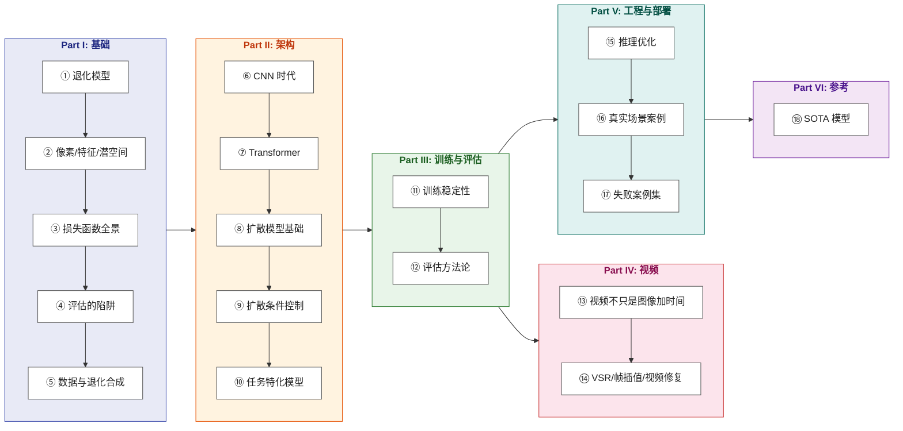

# 影像增强：从原理到工程

> 从退化模型 y = D(x) + n 出发，理解影像增强的第一性原理，掌握从 CNN/Transformer 到扩散模型的完整工程实践。

**Languages**: [中文](README.md) | [English](en/README.md)
**在线阅读**：[yingwang.github.io/image-enhancement-guide](https://yingwang.github.io/image-enhancement-guide/)

面向会 PyTorch、做过 LLM 或图像分类、但没系统做过低层视觉的工程师。这本书不教你跑通某一个项目的训练脚本，而是让你看到一张糟糕的图就能立刻判断："这种退化用什么先验最合适、用哪种损失函数训练、用哪类网络架构，部署到端侧需要砍哪里。"

## 这本书的逻辑

**核心逻辑**：先理解"图像如何变烂"（退化模型），再理解"怎么衡量变好了"（损失与评估），然后才是模型架构、训练技巧、视频专属问题、工程部署。

市面上的影像增强资料要么是论文（讲一个具体方法），要么是开源项目 README（讲怎么跑），中间缺少一本**把这个领域的工程哲学讲清楚**的书。这本书想做的就是这件事。

## 边界：包括与不包括

**包括**：超分（SR）、去噪、去模糊、去压缩伪影、去摩尔纹、低光增强、HDR、去雨去雾、人脸修复、老照片修复、上色、视频超分、帧插值、视频去抖、ISP 增强基础。

**不包括**：

- 纯生成（text-to-image / text-to-video，如 SD/Sora/Veo）
- 图像编辑（换装、换脸、风格迁移）
- 3D / NeRF / Gaussian Splatting
- 视频理解（动作识别、视频问答、Video-LLM）
- 图像压缩与编码（H.264/AV1、神经压缩）
- 医学影像重建、卫星遥感（提原理不展开）
- 硬件 ISP（仅在低光章节带过）

判定标准：**有"原始信号"概念的算增强，从无到有的算生成。**

## 章节目录

### Part I · 基础

| # | 章节 | 核心问题 |
|---|------|---------|
| 1 | [退化模型与逆问题](chapters/01-degradation-model.md) | 增强的本质是 ill-posed 逆问题，先验从哪里来 |
| 2 | [像素、特征、潜空间](chapters/02-representation.md) | 为什么现代方法都在潜空间工作 |
| 3 | [损失函数全景](chapters/03-losses.md) | L1/L2、感知、对抗、扩散损失各自在优化什么 |
| 4 | [评估的陷阱](chapters/04-metrics.md) | PSNR/SSIM/LPIPS/FID 各自骗你哪些 |
| 5 | [数据与退化合成](chapters/05-degradation-pipeline.md) | Real-ESRGAN 真正的核心贡献是数据 |

### Part II · 架构

| # | 章节 | 核心问题 |
|---|------|---------|
| 6 | [CNN 时代](chapters/06-cnn.md) | SRCNN → EDSR → RCAN → NAFNet 的演进逻辑 |
| 7 | [Transformer 在低层视觉](chapters/07-transformer.md) | 为什么注意力对恢复任务有用 |
| 8 | [扩散模型基础](chapters/08-diffusion.md) | DDPM 到 LDM，为什么扩散能"无中生有" |
| 9 | [扩散的条件控制](chapters/09-control.md) | ControlNet / IP-Adapter / Tile / 一图多控 |
| 10 | [任务特化模型](chapters/10-task-specific.md) | 人脸/文档/医疗 各自的归纳偏置 |

### Part III · 训练与评估

| # | 章节 | 核心问题 |
|---|------|---------|
| 11 | [训练稳定性](chapters/11-training.md) | GAN 崩、扩散调度、混合损失权重 |
| 12 | [评估方法论](chapters/12-evaluation.md) | 客观指标局限 + 主观评测怎么设计 |

### Part IV · 视频

| # | 章节 | 核心问题 |
|---|------|---------|
| 13 | [视频增强不是图像加时间](chapters/13-video-basics.md) | 时序一致性是独立问题 |
| 14 | [VSR / 帧插值 / 视频修复](chapters/14-video-models.md) | BasicVSR++、RIFE、视频去抖 |

### Part V · 工程与部署

| # | 章节 | 核心问题 |
|---|------|---------|
| 15 | [推理优化](chapters/15-inference.md) | 量化、TensorRT、CoreML、移动端 |
| 16 | [真实场景案例](chapters/16-cases.md) | 老照片、低光、UGC、4K 直播、ISP |
| 17 | [失败案例集](chapters/17-failures.md) | 增强模型在生产里翻车的典型方式 |

### Part VI · 参考

| # | 章节 | 核心问题 |
|---|------|---------|
| 18 | [SOTA 模型](chapters/18-sota.md) | 2026 年最值得关注的 7 个模型 |

## 与其他几本的关系

| | [LLM 训练指南](https://github.com/yingwang/llm-tutorial) | [Thinking in LLM](https://github.com/yingwang/thinking-in-llm) | 影像增强（本书） |
|---|---|---|---|
| **领域** | LLM 训练 | LLM 应用 | 低层视觉 |
| **形态** | 工程指南 + 代码 | 第一性原理 | 工程指南，含代码片段 |
| **读者** | 训练工程师 | LLM 应用工程师 | 影像/CV 工程师 |
| **不需要前置** | ML 基础 | 编程基础 | PyTorch + 一点 ML 基础 |

## 如何阅读

- **从头到尾**：Part I → II → III → IV → V → VI。第 1 章是地基，建议无论如何先读。
- **赶时间**：第 1 章 → 第 5 章 → 第 8 章 → 第 18 章（理解中心方程 + 数据合成 + 扩散基础 + 当前最强模型）。
- **已有 LLM 背景**：跳到第 7-9 章看注意力和扩散在低层视觉的形态，回头查 Part I 的损失和评估。
- **做产品的**：直接读第 16-17 章，遇到陌生概念回头查。

## 作者

Ying Wang

## 许可证

本仓库采用**双重许可**：

- **正文与示意图**（Mermaid 图、解释性文字、章节内容）：[CC BY-NC-SA 4.0](LICENSE) — 署名 · 非商业 · 相同方式共享
- **代码片段**（章节中的 Python 示例）：[MIT](LICENSE-CODE) — 自由使用，含商业用途，仅需保留版权声明

---

> 最后更新: 2026-04-26
