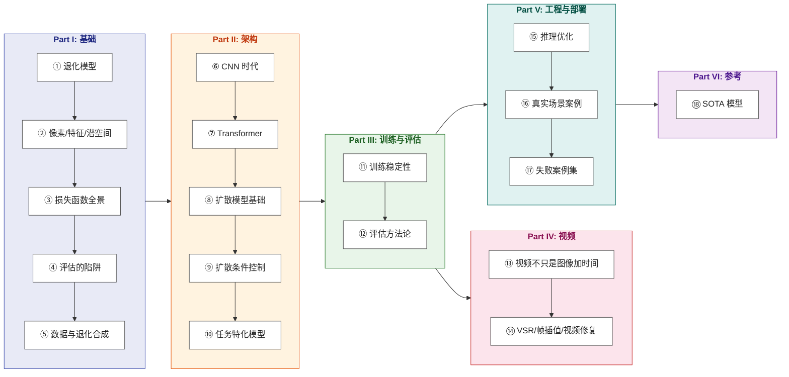

# 影像增强：从原理到工程

> 从退化方程 $y = \mathcal{D}(x) + n$ 出发，探寻影像复原的第一性原理；在信息遗失的废墟上，以统计先验与工程理性重建真实。

**Languages**: [中文](README.md) | [English](en/README.md)  
**在线阅读**：[yingwang.github.io/image-enhancement-guide](https://yingwang.github.io/image-enhancement-guide/)

写给熟悉 PyTorch、做过大模型或图像分类，但尚未系统涉足低层视觉（Low-Level Vision）的算法工程师。

光线穿透镜片、洒在感光元件上、被量化并压缩成字节的刹那，退化便已无可避免。在信息论的意义上，所谓“增强”从来不是魔法般的“找回”——那些在物理世界中损耗的高频细节，早已不可逆地坍缩；我们所能做的，是在无穷多个可能产生当前残损画面的高清世界中，寻找一个最合理的估计。

这本书不教你机械地跑通某一个开源仓库的脚本，而是希望让你在面对一张模糊、暗淡、充满噪点或压缩伪影的图像时，一眼看穿背后的物理机理与数学本质：**这种退化剥夺了哪些维度的信息？该引入怎样的结构先验？是用均方误差死守保真度的底线，还是借扩散模型在潜空间中重构自然纹理？当算法走向芯片与终端，又该在哪里果断动刀？**

## 这本书的逻辑

**核心脉络**：
先理解“图像如何被物理世界损坏”（退化模型与逆问题），再理清“人类如何定义‘变好’”（损失函数与感知陷阱）；在此之上，拆解不同时代的计算审美（从 CNN 的局部感受野、Transformer 的动态关联，到扩散模型的潜空间流形）；最后跨越时序的相干性鸿沟，直面生产环境中的显存、延迟与翻车陷阱。

市面上的影像增强资料，往往要么沉溺于学术论文里微小指标的单点推演，要么止步于开源仓库 README 的调用指令。**它们讲了“怎么做”，却很少讲“为什么必须这样做”，更少讲“当模型在现实中崩塌时，究竟是哪一条先验假设被击穿了”。**

这本书试图把这个领域的工程直觉与哲学脉络讲透——让低层视觉不再是充满玄学的黑盒调参，而是一场在不确定性中建立秩序的严密推演。

## 边界：取与舍

- **收录范围**：
  - **单图复原**：超分辨率（SR）、去噪、去模糊、去压缩伪影、去摩尔纹、微光成像、高动态范围（HDR）重建、去雨去雾。
  - **语义特化**：人脸结构修复、老照片岁月痕迹修复、黑白影像上色、文档图像清晰化。
  - **视频增强**：视频超分辨率（VSR）、视频帧插值（VFI）、时序去抖与动态去模糊。
  - **成像底层**：ISP（图像信号处理器）基础链路与端侧神经 ISP。

- **不收录**：
  - 凭空生造的纯生成模型（如文生图/文生视频 SD / Sora / Veo）
  - 颠覆事实的图像编辑（换装、换脸、风格迁移）
  - 三维几何重建（NeRF / 3D Gaussian Splatting）
  - 语义层面的视频理解（动作识别、行为分析、Video-LLM）
  - 传统音视频编解码内核开发（H.264 / AV1 编码算法优化）
  - 特种工业与遥感遥测系统（仅借用其数学工具，不展开行业特化流水线）
  - 纯硬件电路设计（仅在传感器与低光章节做算法层衔接）

> **核心法则**：**凡以“退化前的物理真实信号”为锚点进行逆向估计的，归为增强；脱离输入信号、从随机噪声中无中生有的，归为生成。**

## 章节目录

### Part I · 基础

| # | 章节 | 核心问题 |
|---|------|---------|
| 1 | [退化模型与逆问题](chapters/01-degradation-model.md) | 增强的本质是不适定逆问题：当信息已然丢失，我们凭什么“猜”出真相？ |
| 2 | [像素、特征、潜空间](chapters/02-representation.md) | 表征层级与计算代价：为什么高维图像空间的难题，最终要在潜空间求解？ |
| 3 | [损失函数全景](chapters/03-losses.md) | 像素均方、特征感知、对抗博弈与扩散得分：不同的损失究竟在塑造怎样的世界？ |
| 4 | [评估的陷阱](chapters/04-metrics.md) | 感知与失真的永恒权衡：PSNR、SSIM、LPIPS、FID 各自对你隐瞒了什么？ |
| 5 | [数据与退化合成](chapters/05-degradation-pipeline.md) | 真实世界的退化从不单一：为什么数据管线的精妙设计才是模型能力的真正上限？ |

### Part II · 架构

| # | 章节 | 核心问题 |
|---|------|---------|
| 6 | [CNN 时代](chapters/06-cnn.md) | 感受野的扩张与残差的极简：SRCNN、EDSR、RCAN 到 NAFNet 的演化逻辑 |
| 7 | [Transformer 在低层视觉](chapters/07-transformer.md) | 自注意力的代价与收益：为什么局部窗口与通道自注意力能打破卷积的局限？ |
| 8 | [扩散模型基础](chapters/08-diffusion.md) | 逆向热力学与流匹配：扩散模型如何学会从自然图像的先验流形中借取细节？ |
| 9 | [扩散的条件控制](chapters/09-control.md) | 既要忠实原图，又要丰富纹理：Side-Network、SFT 注入与 Cross-Attention 的平衡艺术 |
| 10 | [任务特化模型](chapters/10-task-specific.md) | 引入强几何与结构先验：人脸（Codebook/3D）、文档与特定领域的归纳偏置 |

### Part III · 训练与评估

| # | 章节 | 核心问题 |
|---|------|---------|
| 11 | [训练稳定性](chapters/11-training.md) | 混合精度溢出、GAN 模式崩溃与扩散采样调度：工程调优中的避坑心法 |
| 12 | [评估方法论](chapters/12-evaluation.md) | 走出单一数字的迷思：主客观混合评测、双盲实验设计与统计学显著性检验 |

### Part IV · 视频

| # | 章节 | 核心问题 |
|---|------|---------|
| 13 | [视频增强不是图像加时间](chapters/13-video-basics.md) | 时序相干性与闪烁噩梦：光流对齐与可形变卷积（DCN）试图解决什么？ |
| 14 | [VSR / 帧插值 / 视频修复](chapters/14-video-models.md) | 循环记忆、双向传播与流式扩散：从 BasicVSR++ 到现代视频生成式复原 |

### Part V · 工程与部署

| # | 章节 | 核心问题 |
|---|------|---------|
| 15 | [推理优化](chapters/15-inference.md) | 算力与精度的妥协艺术：PTQ/QAT 量化、TensorRT、CoreML 与端侧算子适配 |
| 16 | [真实场景案例](chapters/16-cases.md) | 五大生产实战：老照片全流程、暗光成像、UGC 视频、低延迟直播与神经 ISP |
| 17 | [失败案例集](chapters/17-failures.md) | 生产环境中的 15 种典型翻车：过平滑、幻觉编造、接缝伪影与时序崩溃的溯源与救治 |

### Part VI · 参考

| # | 章节 | 核心问题 |
|---|------|---------|
| 18 | [SOTA 模型](chapters/18-sota.md) | 2026 演进前沿：MambaIR、全能复原、DiT 架构与少步/单步扩散复原的未来 |

## 与其他几本的关系

| | [LLM 训练指南](https://github.com/yingwang/llm-tutorial) | [Thinking in LLM](https://github.com/yingwang/thinking-in-llm) | 影像增强（本书） |
|---|---|---|---|
| **领域** | LLM 训练与微调 | LLM 应用与系统构建 | 低层视觉与图像/视频复原 |
| **形态** | 工程实战指南 + 代码库 | 第一性原理与思维模型 | 原理剖析 + 工程实战（含代码片段） |
| **读者** | 训练工程师与 Infra | LLM 应用/产品工程师 | 影像处理 / 视觉算法工程师 |
| **前置要求** | 机器学习基础 | 基础编程经验 | PyTorch + 基础深度学习知识 |

## 如何阅读

- **登高望远（系统研读）**：按 Part I → VI 的设计脉络顺流而下。第 1 章是全书的数学与哲学基石，无论何时都建议精读。
- **直击要害（快速建构）**：建议路径：第 1 章（逆问题）→ 第 5 章（退化合成）→ 第 8 章（扩散机理）→ 第 18 章（前沿谱系），半日之内建立核心技术大图。
- **跨界迁徙（大模型/高层视觉）**：直奔第 7-9 章，观察注意力与扩散模型如何在连续像素空间中变幻形态，再依需回溯 Part I 的损失与评估。
- **一线救火（工程与产品落地）**：直接翻开第 15-17 章，在真实案例与典型翻车现场中寻找解法，遇到理论盲区再逆向溯源。

## 作者

Ying Wang

## 许可证

本仓库采用**双重许可**：

- **正文与示意图**（Mermaid 图、解释性文字、章节内容）：[CC BY-NC-SA 4.0](LICENSE) — 署名 · 非商业 · 相同方式共享
- **代码片段**（章节中的 Python 示例）：[MIT](LICENSE-CODE) — 自由使用，含商业用途，仅需保留版权声明

---

> 最后更新: 2026-08
