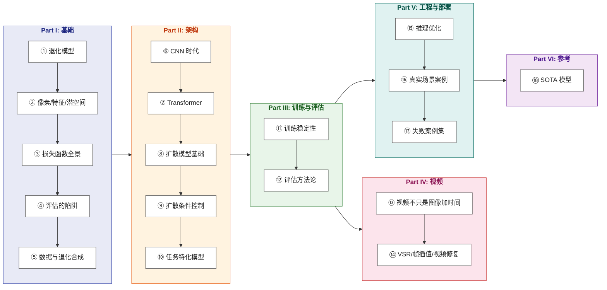

# 影像增强：从原理到工程

> 从退化方程 $y = \mathcal{D}(x) + n$ 出发，理解影像增强的第一性原理，掌握从经典卷积到生成扩散的完整工程实践。

**Languages**: [中文](README.md) | [English](en/README.md)  
**在线阅读**：[yingwang.github.io/image-enhancement-guide](https://yingwang.github.io/image-enhancement-guide/)

写给熟悉 PyTorch、做过大模型或图像分类/检测，但尚未系统涉足低层视觉（Low-Level Vision）的算法工程师。

现实世界中，光线穿透镜头、打在感光元件上并被压缩保存的每一步，都在丢失信息。在信息论视角下，所谓“增强”从来不是把丢失的信号无损找回，而是在无数种可能的高清图像中，寻找一个最符合物理与统计规律的合理估计。

这本书不教你机械地跑通某一个开源仓库的训练脚本，而是希望让你在面对一张模糊、暗淡或充满噪点的退化图像时，能够迅速建立直觉并做出系统性工程判断：**这种退化丢失了什么维度的信息？该引入何种先验来约束解空间？用哪类损失函数引导、选哪种网络架构，部署到端侧算力受限的芯片上时，又该在哪里精准下刀？**

## 这本书的逻辑

**核心逻辑**：先理解“图像如何被物理世界损坏”（退化模型与逆问题），再理清“人类与算法如何定义变好了”（损失函数与评估陷阱），进而深入不同时代的架构演进（从 CNN 的局部归纳、Transformer 的全局关联，到扩散模型的潜空间先验），最终跨越时序相干性，落地于真实的端侧与服务端工程部署。

市面上的影像增强资料，要么是论文（聚焦于单点技巧与局部指标刷新），要么是开源项目 README（聚焦于环境配置与脚本调用）。**它们讲了怎么做，却很少讲背后的设计权衡，更少讲当模型在真实业务中翻车时，究竟是哪一条先验假设失效了。**

这本书想做的，就是把这个领域的工程直觉与设计哲学讲清楚。

## 边界：包括与不包括

- **包括**：
  - **单图复原**：超分辨率（SR）、去噪、去模糊、去压缩伪影、去摩尔纹、低光增强、HDR 重建、去雨去雾。
  - **语义特化**：人脸修复、老照片修复、黑白上色、文档图像增强。
  - **视频增强**：视频超分辨率（VSR）、视频帧插值（VFI）、视频去抖与时序修复。
  - **成像底层**：ISP（图像信号处理器）基础与神经 ISP 增强。

- **不包括**：
  - 纯生成（文生图/文生视频，如 SD / Sora / Veo）
  - 图像编辑（换装、换脸、风格迁移）
  - 3D 重建（NeRF / 3D Gaussian Splatting）
  - 视频理解（动作识别、视频问答、Video-LLM）
  - 传统音视频编码器开发（H.264 / AV1 编码算法优化）
  - 特种医学与卫星遥感（提共性原理，不展开行业专用管线）
  - 硬件 ISP 芯片设计（仅在传感器与低光章节做算法级衔接）

> **判定标准**：**凡是以“原始物理信号”为基准进行逆向估计的，归为增强；脱离输入信号、从纯随机噪声中无中生有的，归为生成。**

## 章节目录

### Part I · 基础

| # | 章节 | 核心问题 |
|---|------|---------|
| 1 | [退化模型与逆问题](chapters/01-degradation-model.md) | 增强的本质是不适定逆问题：当信息已然丢失，先验从何而来？ |
| 2 | [像素、特征、潜空间](chapters/02-representation.md) | 表征层级与计算代价：为什么现代生成式复原全在潜空间发力？ |
| 3 | [损失函数全景](chapters/03-losses.md) | 像素回归、特征感知、对抗博弈与扩散得分：各自在优化什么，如何权衡？ |
| 4 | [评估的陷阱](chapters/04-metrics.md) | 失真与感知的永恒权衡（Perception-Distortion Tradeoff）：PSNR/SSIM/LPIPS/FID 各自的盲区 |
| 5 | [数据与退化合成](chapters/05-degradation-pipeline.md) | 真实世界的退化从不单一：为什么高质量退化管线才是决定模型上限的核心？ |

### Part II · 架构

| # | 章节 | 核心问题 |
|---|------|---------|
| 6 | [CNN 时代](chapters/06-cnn.md) | 残差学习与极简架构：SRCNN → EDSR → RCAN → NAFNet 的演进逻辑 |
| 7 | [Transformer 在低层视觉](chapters/07-transformer.md) | 局部窗口与通道自注意力：Transformer 在复原任务中的收益与计算代价 |
| 8 | [扩散模型基础](chapters/08-diffusion.md) | 从 DDPM/EDM 到 Flow Matching：扩散模型如何利用高质量分布先验重构丰富细节？ |
| 9 | [扩散的条件控制](chapters/09-control.md) | Side-Network、SFT 注入、Cross-Attention 与分块推理：既要保真又要细节的控制艺术 |
| 10 | [任务特化模型](chapters/10-task-specific.md) | 人脸（Codebook/3D）、文档与专业领域：引入强先验的归纳偏置设计 |

### Part III · 训练与评估

| # | 章节 | 核心问题 |
|---|------|---------|
| 11 | [训练稳定性](chapters/11-training.md) | 混合精度、GAN 模式崩溃应对、扩散采样调度与复合损失平衡心法 |
| 12 | [评估方法论](chapters/12-evaluation.md) | 走出单一数字的迷思：主客观混合评测、双盲实验设计与统计显著性检验 |

### Part IV · 视频

| # | 章节 | 核心问题 |
|---|------|---------|
| 13 | [视频增强不是图像加时间](chapters/13-video-basics.md) | 时序相干性与闪烁噩梦：光流对齐与可形变卷积（DCN）的核心挑战 |
| 14 | [VSR / 帧插值 / 视频修复](chapters/14-video-models.md) | 循环记忆、双向传播与流式扩散：从 BasicVSR++ 到现代视频生成式复原 |

### Part V · 工程与部署

| # | 章节 | 核心问题 |
|---|------|---------|
| 15 | [推理优化](chapters/15-inference.md) | 算力与精度的权衡：量化（PTQ/QAT）、TensorRT、CoreML 与端侧算子适配落地 |
| 16 | [真实场景案例](chapters/16-cases.md) | 五大实战全景：老照片修复、暗光成像、UGC 视频、低延迟直播与神经 ISP |
| 17 | [失败案例集](chapters/17-failures.md) | 生产环境中的 15 种典型翻车：过平滑、幻觉编造、接缝伪影与时序闪烁排查 |

### Part VI · 参考

| # | 章节 | 核心问题 |
|---|------|---------|
| 18 | [SOTA 模型](chapters/18-sota.md) | 2026 演进前沿：MambaIR、全能复原、DiT 架构与少步/单步扩散复原 |

## 与其他几本的关系

| | [LLM 训练指南](https://github.com/yingwang/llm-tutorial) | [Thinking in LLM](https://github.com/yingwang/thinking-in-llm) | 影像增强（本书） |
|---|---|---|---|
| **领域** | LLM 训练与微调 | LLM 应用与系统构建 | 低层视觉与图像/视频复原 |
| **形态** | 工程实战指南 + 代码库 | 第一性原理与思维模型 | 原理剖析 + 工程实战（含代码片段） |
| **读者** | 训练工程师与 Infra | LLM 应用/产品工程师 | 影像处理 / 视觉算法工程师 |
| **前置要求** | 机器学习基础 | 基础编程经验 | PyTorch + 基础深度学习知识 |

## 如何阅读

- **系统通读**：按 Part I → VI 的脉络循序渐进。第 1 章是全书的立论之本，建议优先精读。
- **快速建构**：建议路径：第 1 章（逆问题本质）→ 第 5 章（数据合成）→ 第 8 章（扩散基础）→ 第 18 章（前沿 SOTA），快速搭建技术大图。
- **已有大模型/视觉背景**：跳到第 7-9 章看注意力与扩散在低层视觉的特异形态，按需回查 Part I 的损失与评估。
- **工程与产品落地**：直接翻开第 15-17 章（推理优化、实战案例、失败案例集），结合生产问题逆向溯源。

## 作者

Ying Wang

## 许可证

本仓库采用**双重许可**：

- **正文与示意图**（Mermaid 图、解释性文字、章节内容）：[CC BY-NC-SA 4.0](LICENSE) — 署名 · 非商业 · 相同方式共享
- **代码片段**（章节中的 Python 示例）：[MIT](LICENSE-CODE) — 自由使用，含商业用途，仅需保留版权声明

---

> 最后更新: 2026-08
