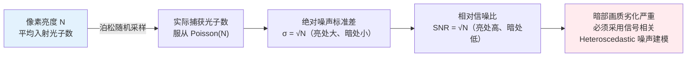

# 第 1 章 · 退化模型与逆问题

> “增强”是一种通俗称谓。在统计与信号处理视角下，本书采用更为本质的定义：**估计**。

## 1.0 阅读须知

本书面向具备扎实机器学习与深度学习基础、但**未必系统从事过低层视觉（Low-Level Vision）**的算法工程师。预设读者具备以下背景：

- 熟悉张量计算与 PyTorch 代码阅读；理解卷积、上采样、归一化、注意力机制等基础算子的物理与计算意义
- 理解常见损失函数的数学形式与梯度下降优化流程
- 了解扩散模型的基本概念，不要求具备实际训练调优经验

本书不预设以下专业背景：图像信号处理（ISP）、信号采样与混叠的频域理论、视频编码标准、传感器物理噪声模型，以及特定低层视觉网络的内部构造。所有首次出现的专有概念，正文中均会提供简明定义与工程直觉。

**记号约定。** 全书统一采用以下数学符号：

- $x$：理想的高质量图像（high-quality / ground truth），张量形状通常记作 $(C, H, W)$，$C$ 为颜色通道数，$H, W$ 为空间分辨率（高与宽）
- $y$：实际观测到的低质量图像（low-quality / observed），空间分辨率可能与 $x$ 不同（如超分辨率任务中 $y$ 的尺寸小于 $x$）
- $\hat{x}$：模型对真实高清图 $x$ 的重建估计值
- $D$：退化算子（degradation operator），表征将高质量信号映射为低质量观测的物理过程（个别章节局部借用该字母表示其他实体时，如第 3 章的判别器 $D$，均会显式说明以避免歧义）
- $n$：随机加性或与信号相关的噪声项
- $f_\theta$：参数为 $\theta$ 的图像复原模型
- $p(\cdot)$：概率密度分布

**首次出现的缩写。** 为降低阅读门槛，本书在专有缩写首次出现时均在括号中注明全称与一句话工程定义：

- **ISP**（Image Signal Processor，图像信号处理器）：相机管线内部将传感器原始光电读数转换为可见色彩图像的完整软硬件流水线
- **ISO**：感光元件的感光度标称值，数值越高信号增益越大、伴生噪声越显著
- **DCT**（Discrete Cosine Transform，离散余弦变换）：JPEG 压缩中将 $8 \times 8$ 空间像素块映射至正交频域基底的变换步骤
- **HR / LR**（High Resolution / Low Resolution，高分辨率 / 低分辨率）
- **SR**（Super-Resolution，超分辨率）：将低分辨率离散观测上采样重建至高分辨率网格的任务族
- **IQA**（Image Quality Assessment，图像质量评估）

更多任务专属缩写将在对应章节展开，此处不再赘述。

## 1.1 一个具体的场景

夜晚在街头举起手机拍摄一张霓虹灯下的招牌，回看成片时往往会发现若干典型画质缺陷：

- 动态范围受限：高光区域过曝溢出，暗部死黑且细节尽失
- 边缘弥散：文字与细线边缘模糊不清
- 色彩杂斑：暗部区域分布着颗粒状的紫绿色杂色噪点
- 复合伪影：招牌密集条纹处出现摩尔纹与 JPEG 块状伪影的交叠

在图像处理应用中点击“AI 增强”，数秒后画面画质显著提升。

这一节回答一个核心问题：**在这数秒的计算中，模型到底在执行什么运算？**

模型并非在物理意义上“找回了原本的真实场景”：从信息论角度来看，原始高频信号在物理退化过程中已经不可逆地丢失。模型所做的，是**依据当前的退化观测，在所有可能的高清图像中估计出一张最符合先验分布的候选解**。这是全书的核心反直觉认知：

> 增强模型并非在严格“复原”真实，而是在合理“推定”。工程的优劣取决于推定结果是否符合自然图像先验与物理规律。

确立了这一认知，后续关于网络架构、损失函数、评估指标与退化合成的所有设计选择便拥有了统一的方法论支点。

## 1.2 中心方程

将上述过程形式化为数学表达式：

$$
y = D(x) + n
$$

- $x$：理想的高质量图像（场景真实的物理辐射亮度分布）
- $D$：退化算子（由光学系统、传感器、图像信号处理与有损压缩共同构成的复合映射）
- $n$：噪声项（主要来源于光子涨落与传感器读出电路）
- $y$：实际观测到的低质退化图像

全书的核心任务，即为**给定退化观测 $y$，求解对原始信号 $x$ 的最优估计**。

记作 $\hat{x} = f_\theta(y)$，其中 $f_\theta$ 为待优化的神经网络模型，$\theta$ 为网络参数。

这一简洁的方程凝练了该领域所有的工程难题：

1. $D$ 通常**未知**（拍摄时的镜头污损、感光元件温度、JPEG 压缩质量因子等均无法精准获取）
2. $D$ 具有**多对一**的非单射性（无数张不同的 $x$ 经过 $D$ 映射后均可产生同一张 $y$）
3. $n$ 具有**随机性**（同一张 $x$ 叠加不同的随机噪声采样将产生不同的 $y$）
4. 训练数据中通常**仅有 $y$**（真实业务场景中极难采集到严格物理对齐的退化-高清配对样本）

第 1、2 点确立了该任务作为**逆问题**（inverse problem）的本质属性；第 3 点进一步将其定性为**统计逆问题**；第 4 点则决定了在工程落地中必须依赖**退化合成管线**来构建高质量训练对，这正是第 5 章的核心议题。

## 1.3 为什么这是 ill-posed 问题

数学家 Hadamard 将一个良态（well-posed）数学物理问题定义为满足三个条件：

1. **解存在**
2. **解唯一**
3. **解对输入具有连续依赖性**（输入的小扰动仅引起输出的小扰动）

逆问题往往上述三条均不满足，被称为 **ill-posed**（不适定）问题。影像增强是不适定问题的典型代表。

以 4 倍超分辨率任务为例：

输入为一张 $512 \times 512$ 的低分辨率图像 $y$，目标是重建为 $2048 \times 2048$ 的高分辨率图像 $x$。这意味着原图中的每个 $4 \times 4 = 16$ 像素局部块，被退化算子压缩成了 $y$ 中的单个像素。

以最简化的区域均值（box filter）下采样为例：每个 $4 \times 4$ 的高清像素块直接取算术平均，映射为低分辨率图像中的一个像素。这构成了从 16 维向量空间到 1 维标量空间的投影，**维度从 16 骤降至 1，丢失了 15 个维度的自由度**。（工业界更常用的双三次插值 bicubic 下采样虽然插值核支撑域更大且包含负瓣，并非严格的块内均值，但在维度坍缩与高频信息不可逆损失的数学本质上完全一致。）

反向推导：给定低分辨率像素标量 $y_{ij}$，能够生成该观测的 $4 \times 4$ 高分辨率图像块构成了一个 15 维的解空间，其中包含无穷多个可能的候选块。

假设观测像素值为 $y_{ij} = 128$（中等灰度）：

- 均匀灰色块：16 个像素取值均为 128
- 高对比度条纹：8 个像素为 0，8 个像素为 255（均值仍为 128）
- 线性渐变斜坡：像素值由 100 沿特定方向平滑过渡至 156
- 局部高频纹理：15 个像素为 120，配合 1 个像素为 248

所有这些在结构上迥异的高分辨率块，经过下采样算子后均映射为单一数值 128。模型必须在解空间中选定一个输出，这一决策完全依赖先验（prior）。

这就是先验（prior）发挥作用的地方。

## 1.4 三种“先验”

先验即**关于“自然图像分布流形”的形式化假设**。性能优异的图像复原与增强模型，本质上是将合理的图像先验编码进网络的归纳偏置（inductive bias）或训练数据分布中。

从计算视觉发展史来看，图像先验主要经历了三个阶段：

### 解析先验（手工设计）

算法工程师根据经验观察总结出自然图像的统计规律，并将其转化为显式的数学正则项。典型代表包括：

- **平滑性先验**：假设相邻像素取值高度相关（通常采用图像梯度的一阶或二阶 L2 范数进行正则惩罚）
- **梯度稀疏性**（Total Variation, 总变差）：自然图像的梯度幅值在平坦区域接近零，仅在边缘区域呈现较大突变，通常采用梯度幅值的 L1 范数进行惩罚
- **变换域稀疏性**：自然图像在小波基（Wavelet）或离散余弦变换（DCT）域中具有稀疏展开特性

这类方法的代表是 1990 至 2010 年代主导低层视觉领域的**变分法**（Variational Methods）与**稀疏编码**（Sparse Coding）。其优势在于**数学形式严谨、物理可解释性强、无需数据驱动训练**；但其表达能力上限受限，根本原因在于手工设计的低阶统计量无法有效表达复杂语义先验（例如人脸器官结构或动物毛发纹理）。

尽管现代工程不再以解析方法为主力，但其核心思想在损失函数设计中依然广泛沿用，例如第 3 章详述的总变差（TV）损失：

```python
def total_variation_loss(x: torch.Tensor) -> torch.Tensor:
    """Total Variation：惩罚相邻像素差，鼓励分段平滑。
    x: (B, C, H, W)
    """
    dh = (x[:, :, 1:, :] - x[:, :, :-1, :]).abs().mean()
    dw = (x[:, :, :, 1:] - x[:, :, :, :-1]).abs().mean()
    return dh + dw
```

### 数据驱动先验（CNN / Transformer 隐式表征）

2014 年 **SRCNN**（Super-Resolution Convolutional Neural Network，三层卷积超分辨率的奠基性工作）问世后，深度学习全面取代了传统变分方法。卷积神经网络构建了从低质图像 $y$ 到高清图像 $\hat{x}$ 的端到端映射，图像先验被隐式编码在网络权重参数中。模型在海量自然图像对 $(x, y)$ 上进行优化，学习到的是自然图像在高维参数空间中的低维流形流形结构。

该类方法的本质属性为**判别式（discriminative）建模**：给定确定的输入 $y$，网络直接输出单一的确定性估计 $\hat{x}$。模型无需显式构建概率密度 $p(x)$，但经过大规模数据拟合后，其预测结果自然落于自然图像流形附近。

经典演进脉络：

- **SRCNN**（2014，三层卷积网络奠定端到端范式）
- **EDSR**（2017，移除残差块中的批归一化 BatchNorm 层，显著稳定训练并提升保真度）
- **RCAN**（2018，引入通道注意力机制实现特征层级的自适应重校准）
- **SwinIR**（2021，将移位窗口自注意力机制 Transformer 引入低层视觉）
- **Restormer**（2022，基于转置通道维度的自注意力机制消除空间分辨率对计算量的平方级束缚）
- **NAFNet**（2022，移除复杂非线性激活函数、采用门控乘法算子的极简高性能网络）

第 6 与第 7 章将对上述架构进行系统解构与源码级剖析。

### 生成式先验（扩散模型与生成对抗网络）

2020 年 **DDPM**（Denoising Diffusion Probabilistic Model，去噪扩散概率模型）爆发后，生成模型能够直接显式建模自然图像的数据分布 $p(x)$。在给定退化输入 $y$ 作为条件引导时，模型转化为求解后验条件分布 $p(x | y)$，并从该分布中采样生成高保真解 $\hat{x}$。

这是**生成式（generative）**技术路线。它与判别式路线存在本质区别：

- 判别式模型求解点估计 $\arg\max_x p(x | y)$：输出单一确定性解，高度退化时倾向于输出条件均值，导致高频纹理模糊
- 生成式模型拟合完整的后验分布 $p(x | y)$：能够从多模态解空间中采样出具有丰富细节的高保真解

生成式先验的核心优势在于：在退化严重的不适定场景中（如 8 倍超分或人脸严重模糊），判别式模型仅能给出多解平均后的模糊面孔，而生成式模型能根据语义先验采样出清晰逼真的毛发与五官纹理。

但其工程隐患在于可能引入**不可控的幻觉细节（hallucinated details）**。这构成了影像增强工程的核心边界原则（第 10 与 17 章深入讨论）：

> 增强模型在严重不适定条件下生成的是符合先验的纹理，而非严格物理复原的真实信号。
>
> 扩散模型用于老照片修复制图视觉表现惊艳；但若用于司法刑事取证或医学影像诊断，则会因引入伪细节而导致严重的工程与业务事故。

## 1.5 退化算子 D 的解剖

回顾中心方程 $y = D(x) + n$。在物理成像系统中，退化算子 $D$ 并非单一的理想算子，而是一系列非线性退化过程的随机复合：

$$
D = \text{JPEG} \circ \text{Quantization} \circ \text{Downsample} \circ \text{Blur} \circ \text{ColorShift} \circ \text{LensDistortion} \circ \dots
$$

该复合算子本身具有**随机参数分布**：同一设备在不同时间与环境下拍摄同一物理场景，由于感光元件温度、自动曝光算法与对焦微调差异，得到的退化输出均存在统计涨落。

工程实践中需核心建模的退化组件包括：

### 模糊（Blur）

在离散图像处理中，空间不变模糊等价于图像信号与点扩散函数（Point Spread Function, PSF）即“模糊核” $k$ 的二维空间卷积：$y = x * k$。

不同物理诱因对应不同形态的模糊核：

- **散焦模糊**（defocus blur）：模糊核近似于均匀圆盘函数（Airy 斑的几何光学近似），半径由失焦量与光圈孔径决定
- **运动模糊**（motion blur）：模糊核呈现为带有方向与长度的线段，表征曝光时间内相机或物体的相对位移
- **大气湍流模糊**（atmospheric turbulence）：模糊核近似于各向同性或各向异性高斯函数，方差由湍流强度决定
- **光学系统像差 / 衍射**：模糊核表现为复杂的非对称斑纹

实际成片往往是多种模糊形态的叠加，且通常呈现**空间可变性**（图像中心与视场边缘的像差核存在显著差异）。核参数的未知性促成了**盲去模糊**（Blind Deblurring）作为独立研究方向的存在。

### 下采样（Downsample）

将连续空间信号离散化为低空间分辨率的网格。工程常用算子包括：

- **Nearest（最近邻插值）**：直接采样邻近网格点，计算极快但会引入严重的阶梯状高频混叠（锯齿）
- **Bilinear（双线性插值）**：基于 $2 \times 2$ 邻域进行一阶线性加权插值
- **Bicubic（双三次插值）**：基于 $4 \times 4$ 邻域三次样条核卷积，为学术基准数据集**事实上的标准下采样基准**
- **Lanczos**：基于加窗 sinc 函数的截断滤波插值，频域通带平坦度最优
- **Area / Box（区域均值）**：对高分辨率网格块进行算术平均，等价于盒状滤波器积分

不同重采样算法的频域传递特性差异显著。双三次插值在纯理论上表现良好，但在工程落地中存在隐患：该算法隐式假设输入信号已完成理想的抗混叠预滤波，但真实物理成像设备采集的图像普遍包含高频混叠，由此引发了 1.6 节将深入剖析的“训练-推理分布失配”难题。

```python
import torch
import torch.nn.functional as F

def downsample_compare(x: torch.Tensor, scale: int = 4):
    """对比同张图像在不同下采样算子下的输出差异。
    x: (1, C, H, W), 取值范围 [0, 1]
    """
    h, w = x.shape[-2:]
    new_h, new_w = h // scale, w // scale

    nearest  = F.interpolate(x, size=(new_h, new_w), mode='nearest')
    bilinear = F.interpolate(x, size=(new_h, new_w), mode='bilinear', align_corners=False)
    bicubic  = F.interpolate(x, size=(new_h, new_w), mode='bicubic',  align_corners=False)
    area     = F.interpolate(x, size=(new_h, new_w), mode='area')  # 等价于 box filter

    return {
        'nearest':  nearest,
        'bilinear': bilinear,
        'bicubic':  bicubic,
        'area':     area,
    }
```

在实际测试中观察可见：双三次插值在边缘视觉上呈现边缘锐利度，区域均值插值整体较为平滑柔和，而最近邻插值则伴随强烈的锯齿混叠。不同算子在物理本质上分别对应了不同的采样积分模型。

### 噪声（Noise）

噪声建模是低层视觉中最容易被过度简化、同时也是影响泛化性能的核心模块，将在 1.8 节展开独立分析。

### 压缩伪影（Compression Artifacts）

JPEG 为图像领域应用最广泛的有损压缩标准。其核心处理流水线如下：

1. 颜色空间转换：RGB 转换为 YCbCr，并对色度分量 Cb/Cr 进行空间下采样（色度抽样 chroma subsampling）
2. 空间分块：划分为 $8 \times 8$ 像素的互不重叠网格块
3. 正交变换：对每个子块执行离散余弦变换（DCT）
4. 系数量化：依据量化表进行除法截断取整（压缩质量因子 quality 越低，量化步长越大，截断误差越严重）
5. 无损熵编码：采用霍夫曼编码或算术编码进行压缩存储

第 4 步的除法量化为不可逆有损操作，解码重建后会引入典型缺陷：

- **块状效应**（blocking artifacts）：$8 \times 8$ 块边界处梯度突变，呈现规则方格网纹
- **振铃效应**（ringing artifacts）：在强边缘高频阶跃处由高频 DCT 系数丢失引起的吉布斯振荡
- **色度失真**（color bleeding）：色度通道下采样导致的色彩边缘溢出与模糊

视频压缩标准（H.264 / H.265 / AV1）在帧内 DCT 压缩的基础上引入了帧间运动补偿与光流残差编码，退化模式进一步叠加了跨时序拖影与宏块失步伪影。

### 色彩与色调失真

自动白平衡（AWB）漂移、动态范围压缩、非线性光电转换（OETF / Gamma 映射）及色彩校正矩阵（CCM）误差。此类退化并非空间维度的局部滤波问题，而是表现为值域上的全局非线性映射。

### 复合退化链的数据流图

将上述物理组件串联，构建从理想光学辐射信号到终端退化图像的完整退化管线：

```mermaid
graph LR
    X["理想图像 x<br/>光子分布 / RAW 信号"] --> Blur["光学/运动模糊<br/>defocus / motion / 衍射"]
    Blur --> Down["空间重采样<br/>bicubic / area / lanczos"]
    Down --> Color["色彩与色调失真<br/>白平衡漂移 / tone mapping"]
    Color --> Noise["传感器噪声<br/>泊松光子 + 高斯读出"]
    Noise --> Quant["模数转换量化<br/>8-bit / 10-bit"]
    Quant --> JPEG["有损编码压缩<br/>DCT 量化 + 色度抽样"]
    JPEG --> Net["网络传输重压缩<br/>社交平台二次转码"]
    Net --> Y["实际观测图像 y<br/>终端退化成片"]
    Y -. 逆问题求解 .-> Inv["复原模型 f_θ<br/>参数优化"]
    Inv -. 概率分布估计 .-> X

    style X fill:#e8f5e9
    style Y fill:#ffebee
    style Inv fill:#fff3e0
```



基于上述退化管线，可提炼出以下工程关键结论：

1. **退化算子具有序列随机性**：物理世界中的退化顺序并非固定线性排列，例如 JPEG 压缩可能发生在色彩失真之前、之后或多次交替出现。
2. **各环节具备随机性**：相同场景在同款相机下连续采集两次，由于光子涨落的随机采样与浮点量化截断，输出的像素矩阵均存在细微差异。
3. **高频失真与低频退化的解耦**：压缩伪影与加性噪声直接主导像素级保真度（PSNR），而模糊与下采样则主要削弱高频感知锐度。
4. **模型学习的是端到端复合逆映射**：现代深度网络并非逐步顺序求逆，而是直接学习从复合退化空间到高质量图像流形的非线性映射，这也是端到端网络性能系统性超越传统分步串联方案的根本原因。

## 1.6 Blind vs Non-blind：退化算子的已知与未知

回顾核心方程 $y = D(x) + n$。在学术体系与工业界中存在一个核心分水岭设定：**在推理阶段，退化算子 $D$ 的参数是显式已知还是完全未知？** 两种设定的工程路径截然不同。

### Non-blind（非盲设置）：退化算子 D 显式已知

经典数字图像处理大量立足于非盲假设：

- **解析去运动模糊**：拍摄设备记录了曝光期间高频 IMU 惯导数据，可直接解析出空间轨迹对应的运动模糊核 $k$
- **医学 CT 图像重建**：X 射线探测器几何拓扑与射线投影路径已知，系统投影投影矩阵 $A$ 精确可求
- **摩尔纹去除**：已知显示屏亚像素排布周期与相机传感器采样网格，采样混叠模型具备解析形式
- **RAW 域去噪**：已知感光元件物理参数、当前拍摄 ISO 与曝光增益，噪声统计分布的精确参数解析可得

在非盲场景下，可采用经典的维纳滤波（Wiener Filter）、Richardson-Lucy 迭代反褶积，或引入正则项的即插即用先验算法（Plug-and-Play Priors）。深度学习方案亦可将退化参数（如模糊核或噪声方差图）作为辅助条件张量与退化图像拼接输入网络。

### Blind（盲设置）：退化算子 D 完全未知

真实业务场景中退化算子 $D$ 几乎恒为未知量：

- 用户上传历史照片，无法获知历史拍摄机型、环境光照与历史存储压缩参数
- 互联网流转图像历经多次不同编码器、不同分辨率的反复转码与下采样
- 老旧胶片照片的物理褪色、霉斑与划痕属于复杂的物理化学变化，无显式数学解析解
- 屏幕翻拍图叠加了子像素渲染、透视畸变与摩尔纹等非线性复合退化

在盲复原场景下，工程上主要依靠两条路径解决不适定性：

1. **在训练阶段覆盖足够完备的退化算子空间**：使网络在训练时充分遍历各种合成退化分布（如 Real-ESRGAN 的二阶退化管线，第 5 章详析）
2. **在网络内部隐式或显式估计退化特征**：利用辅助子网络预测局部退化核，或借助多模态大模型提取语义先验提示词（Prompt）以补充退化上下文

### 经典算法在 Blind / Non-blind 谱系中的定位

全书重点讨论的典型模型在盲与非盲维度上的分类归纳如下：

| 模型 | 范式类别 | $D$ 处理机制与先验来源 |
|------|----------|----------------------|
| Real-ESRGAN | **Blind SR** | 训练阶段遍历高阶随机退化空间，提升网络泛化能力 |
| CodeFormer | **Blind Face Restoration** | 利用离散码本（Codebook）提供高保真结构先验，规避显式退化估计 |
| BSRGAN | **Blind SR** | 随机重排退化算子执行顺序，覆盖真实复杂退化分布 |
| MANIQA / CLIP-IQA / Q-Align | **Blind IQA**（NR-IQA） | 无需参考图，直接在多尺度感知或语义空间拟合人类质量评分 |
| SUPIR | **Blind SR**（多模态生成式） | 结合视觉语言大模型（LLaVA）文本描述，隐式引导扩散模型补全语义 |
| Restormer | **灵活支持两者** | 依赖训练数据配对构造，网络拓扑本身无需绑定先验参数 |
| OSEDiff / TSD-SR | **Blind SR**（单步/少步扩散） | 蒸馏扩散先验，兼顾盲超分生成质感与实时推理吞吐 |

工程准则：**在面向开放域用户输入的商业化产品中，盲复原是唯一的工程可行路径**。依赖先验退化参数已知的非盲算法在受控实验基准上指标优异，但落地时必须前置“退化估计”模块，而该前置估计本身又是一个高度敏感的不适定逆问题，微小的估计偏差即可引发严重的伪影放大。

### 评估视角的对应范式：Full-Reference 与 No-Reference

第 4 章将系统讨论图像质量评估（IQA），此处先建立基本框架。**质量指标同样分为全参考（Full-Reference, FR）与无参考（No-Reference, NR）两大体系**：

- **FR-IQA（全参考评估）**：需成对的高清真值图参与比对，典型指标包括 **PSNR**（峰值信噪比）、**SSIM**（结构相似度）、**LPIPS**（基于深度特征的学习感知相似度）及 **DISTS**（解耦结构与纹理的深度特征距离）。
- **NR-IQA（无参考评估，亦称盲质量评估）**：直接在待评估输出图像上预测绝对质量分，典型指标包括 **NIQE**（基于自然场景统计特征的偏离度）、**MANIQA**（基于多维注意力机制的质量预测网络）、**CLIP-IQA**（利用图文对齐先验的质量打分器）以及 **Q-Align**（利用大语言模型对齐人类主观评分）。

在线上生产环境中，用户输入的退化图片天然缺乏对应的高清真值（Ground Truth），**线上质量监控系统只能依赖 NR-IQA 体系**。这是盲复原范式在工程评估侧的必然延伸。

## 1.7 真实退化与“训练-推理分布失配”

整合 1.5 节的各个物理算子，一张手机在弱光环境下拍摄的照片实际经历的退化链条可表达为：

$$
y = \text{NetworkRecompression}(\text{JPEG}(\text{Quantize}(\text{ISP}(\text{Sensor}(x_{\text{photon}})))))
$$

其中：

- $x_{\text{photon}}$ 为入射至传感器感光单元的光子能量空间分布（原始物理信号）
- $\text{Sensor}$ 将光电信号转化为模拟电压，不可避免地引入光子涨落噪声、读出放大电路噪声与暗电流噪声
- $\text{ISP}$ 执行去马赛克（Demosaicing）、传感器降噪、自动白平衡、色调映射（Tone Mapping）与色彩矩阵校正
- $\text{Quantize}$ 为模数转换（ADC）过程中的 8-bit 或 10-bit 离散取整量化
- $\text{JPEG}$ 为设备存储时的有损离散余弦变换量化压缩
- $\text{NetworkRecompression}$ 为图像在社交网络或存储服务器流转中的二次有损转码

这构成了**真实世界复杂的复合退化算子 $D$**。

然而在 2014 至 2020 年间，学术界早期的大量超分辨率文献（包括 SRCNN、EDSR、RCAN、ESRGAN 及 SwinIR 的基准训练流程）通常采用如下简化规则构建训练配对：

```python
# 学术基准中经典的理想化合成
y = bicubic_downsample(x, scale=4)
```

这引发了低层视觉领域长期存在的方法论困境，即**训练-测试分布失配（Train-Test Mismatch）**：

- **训练阶段**：退化图 $y$ 仅为干净高质量图像经过理想双三次插值降采样的结果，无噪声、无压缩损伤、无混叠伪影
- **推理阶段**：输入图 $y$ 为物理相机在真实场景下采集、并历经传感器噪声、ISP 非线性处理、JPEG 压缩与二次转码的复合退化图像

网络在训练中学习到的本质上是“双三次插值的理想逆算子”。其工程后果极为严峻：

- 基于保真度导向的模型（如 EDSR、RCAN）在学术基准集（Set5、Set14、DIV2K）上可取得超过 30 dB 的优异 PSNR 指标
- 但当此类模型直接应用于用户手机拍摄的真实退化照片时，不仅无法复原细节，反而会将输入的微弱噪点误判为高频信号进行锐化放大，ESRGAN 这类生成对抗网络则会直接将噪声演变为大面积的高频伪影与结构突变

这一分布失配问题在 2021 年 **Real-ESRGAN** 提出后得到了系统性解决。Real-ESRGAN 的核心突破**不在于网络拓扑改进**（仍沿用经典的 RRDB 骨架），而在于**高阶随机退化合成管线（Higher-Order Degradation Pipeline）**的工程设计：

```python
# Real-ESRGAN 退化合成流程架构示意（详细实现见第 5 章）
y = x.clone()
y = apply_blur(y, kernel=random_blur_kernel())               # 随机模糊核卷积
y = downsample(y, scale=random_scale(), mode=random_mode())   # 多模式随机下采样
y = add_noise(y, type=random_noise_type())                   # 混合噪声模型注入
y = jpeg_compress(y, quality=random.randint(40, 95))          # 随机质量 JPEG 压缩

# 核心创新：引入二阶退化循环（Second-order Degradation）
y = apply_blur(y, kernel=random_blur_kernel())
y = downsample(y, scale=random_scale(), mode=random_mode())
y = add_noise(y, type=random_noise_type())
y = jpeg_compress(y, quality=random.randint(30, 90))
```

该退化管线中的每个环节均在概率意义上逼近真实退化算子的子空间。**基于此管线训练的模型在真实开放域场景中展现出质的飞跃**，确立了该领域从“依赖网络结构微调”转向“注重退化数据建模”的技术拐点。

> 在影像增强工程中，“数据合成管线”对真实泛化性能的决定性长期高于“网络骨架设计”。
>
> 相同的模型结构在纯双三次下采样数据上训练无法在真实场景落地，而在高阶复合退化数据上训练则能表现出优异的鲁棒性。

## 1.8 噪声物理建模：为什么不能仅用加性高斯白噪声

在大量早期研究中，训练加噪步骤往往被过度简化为加性高斯白噪声（AWGN）：

```python
y = x + torch.randn_like(x) * sigma
```

在真实物理成像系统中，这种独立同分布的加性高斯假设存在严重的理论与工程缺陷。

图像传感器中的物理噪声主要包含两大来源：

### 光子散粒噪声（Shot Noise）

光子到达感光芯片的物理过程服从**泊松过程**（Poisson Process）。若单个感光单元在曝光时间内平均捕获 $N$ 个入射光子，则实际探测到的光子计数服从泊松分布 $\text{Poisson}(N)$，其方差等于均值：$\text{Var}(N) = N$。

核心物理特性：**噪声方差随信号均值线性增大**。高光区域光子数大，绝对噪声标准差 $\sigma = \sqrt{N}$ 随之增大；暗光区域光子数少，绝对噪声较小。然而，**信噪比**（SNR）为：

$$
\text{SNR} = \frac{N}{\sqrt{N}} = \sqrt{N}
$$

高光区域的信噪比显著优于暗光区域。这解释了弱光摄影中暗部颗粒噪点极其显著的物理机制：由于暗部接收光子极少，相对噪声幅度急剧上升。



### 读出噪声（Read Noise）

传感器将光生电荷转换为模拟电压信号并经过模数转换器（ADC）量化时，放大器热噪声与电路缺陷会引入读出噪声。该噪声项与光信号强度无关，在统计上**近似服从均值为零的高斯分布**，方差为常数 $\sigma_r^2$。

### 物理异方差模型：信号相关高斯（Heteroscedastic Gaussian）

结合光子散粒噪声与电路读出噪声，传感器原始读数可高精度建模为**异方差高斯分布**（Heteroscedastic Gaussian）：

$$
y = x + \mathcal{N}(0, a \cdot x + b)
$$

其中参数 $a$ 对应光子散粒噪声增益（与信号强度线性相关），参数 $b$ 对应电路读出噪声方差（与信号独立）。参数组合 $(a, b)$ 为感光元件在特定 ISO 增益下的物理标定参数。

```python
import torch

def heteroscedastic_noise(
    x: torch.Tensor,
    a: float = 0.01,
    b: float = 0.001,
) -> torch.Tensor:
    """信号相关的高斯异方差噪声（逼近真实传感器物理噪声分布）。
    x: (B, C, H, W)，归一化取值范围 [0, 1]
    a: 光子散粒噪声强度系数（信号相关项）
    b: 读出电路噪声方差项（信号无关项）
    返回: 加噪后的张量 y，截断至 [0, 1]
    """
    variance = a * x + b
    sigma = variance.clamp(min=1e-8).sqrt()
    noise = torch.randn_like(x) * sigma
    return (x + noise).clamp(0.0, 1.0)
```

更为精确的物理仿真方案是直接在光子计数域进行泊松采样，再叠加高斯读出噪声：

```python
def poisson_gaussian_noise(
    x: torch.Tensor,
    photon_scale: float = 1000.0,  # 尺度系数，表征满阱容量与曝光量
    read_sigma: float = 0.005,
) -> torch.Tensor:
    """泊松-高斯复合物理噪声模型。
    photon_scale 模拟入射曝光量，数值越小代表极端暗光环境。
    """
    # 映射至物理光子计数尺度，执行泊松采样后归一化
    photons = x * photon_scale
    noisy_photons = torch.poisson(photons.clamp(min=0))
    shot = noisy_photons / photon_scale
    # 叠加电路读出高斯噪声
    read = torch.randn_like(x) * read_sigma
    return (shot + read).clamp(0.0, 1.0)
```

采用真实物理噪声建模的关键工程意义在于：

- 纯高斯白噪声训练的去噪网络在真实暗光图像上普遍表现欠拟合
- 均匀高斯假设忽视了真实噪声的**非均匀方差特性**
- 在实际图像中，网络需要在暗区施加更强的平滑抑制，在亮区保留微弱的真实高频结构，仅有物理对齐的噪声模型才能促成该能力的收敛

这一理论洞察推动了 SIDD 与 DND 等真实噪声基准数据集的发展。在工业落地中，由于物理对齐配对数据采集成本高昂，主流方案是**采用严谨的物理噪声模型进行大规模合成预训练，再利用少量真实采集数据进行领域微调**。

## 1.9 简化的退化管线类实现

将上述退化组件整合，构建一个模块化的退化合成基类。本节提供一个精简的高性能原型，涵盖模糊、空间重采样与物理噪声三个核心环节（JPEG 压缩模块涉及频域变换，将在第 5 章结合 `DiffJPEG` 完整展开）：

```python
import random
import torch
import torch.nn.functional as F


class SimpleDegradation:
    """退化合成管线原型。
    输入高分辨率无损张量 x，输出低分辨率复合退化张量 y。

    复合映射形式: D = Noise ∘ Downsample ∘ Blur
    所有算子参数均在预设分布区间内动态随机采样。
    """

    def __init__(self, scale: int = 4):
        self.scale = scale

    # --- 1. 空间模糊算子 ---
    def random_blur(self, x: torch.Tensor) -> torch.Tensor:
        """动态生成高斯空间模糊核并执行深度可分离卷积。"""
        ksize = random.choice([7, 9, 11, 13, 15])
        sigma = random.uniform(0.2, 3.0)
        kernel = self._gaussian_kernel(ksize, sigma).to(x)
        kernel = kernel.expand(x.shape[1], 1, ksize, ksize)
        pad = ksize // 2
        return F.conv2d(F.pad(x, [pad]*4, mode='reflect'),
                        kernel, groups=x.shape[1])

    @staticmethod
    def _gaussian_kernel(ksize: int, sigma: float) -> torch.Tensor:
        ax = torch.arange(ksize) - ksize // 2
        gauss = torch.exp(-(ax ** 2) / (2 * sigma ** 2))
        kernel = gauss[:, None] * gauss[None, :]
        kernel = kernel / kernel.sum()
        return kernel.unsqueeze(0).unsqueeze(0)

    # --- 2. 空间重采样算子 ---
    def random_downsample(self, x: torch.Tensor) -> torch.Tensor:
        h, w = x.shape[-2:]
        new_h, new_w = h // self.scale, w // self.scale
        mode = random.choice(['bilinear', 'bicubic', 'area'])
        kw = {'mode': mode}
        if mode in ('bilinear', 'bicubic'):
            kw['align_corners'] = False
        return F.interpolate(x, size=(new_h, new_w), **kw)

    # --- 3. 随机物理噪声算子 ---
    def random_noise(self, x: torch.Tensor) -> torch.Tensor:
        """按概率在均匀高斯、异方差高斯与泊松模型间随机切换。"""
        p = random.random()
        if p < 0.33:
            # 基础高斯白噪声
            sigma = random.uniform(0.005, 0.05)
            return (x + torch.randn_like(x) * sigma).clamp(0, 1)
        elif p < 0.66:
            # 异方差信号相关高斯噪声
            a = random.uniform(0.005, 0.03)
            b = random.uniform(0.001, 0.005)
            sigma = (a * x + b).clamp(min=1e-8).sqrt()
            return (x + torch.randn_like(x) * sigma).clamp(0, 1)
        else:
            # 泊松光子散粒噪声
            scale = random.uniform(50.0, 1000.0)
            photons = (x * scale).clamp(min=0)
            return (torch.poisson(photons) / scale).clamp(0, 1)

    def __call__(self, x: torch.Tensor) -> torch.Tensor:
        """执行退化计算图: blur -> downsample -> noise。"""
        y = self.random_blur(x)
        y = self.random_downsample(y)
        y = self.random_noise(y)
        return y
```

在工业级生产管线中，还需扩充以下能力：

- **高阶退化循环**（Higher-order Degradation）：将退化序列迭代执行两次，模拟图像经过采集、网络二次压缩与再分发的复合过程
- **算子执行顺序置换**：动态交换模糊、下采样与加噪的先后次序
- **GPU 批处理可微 JPEG 模拟**：基于 `DiffJPEG` 实现全显存流式转码
- **多相空间非对称核池**：广义高斯核、点扩散运动轨迹核与 Sinc 振铃核

第 5 章将对全功能工业退化管线进行完整实现。

## 1.10 本章小结

本章核心结论提炼如下：

1. **图像复原增强的数学本质是统计逆问题**：已知退化观测 $y = D(x) + n$，求解原始物理信号 $x$ 的最优估计。
2. **逆问题具有典型的不适定性（Ill-posedness）**：退化算子 $D$ 的非单射性与噪声的随机性，导致解空间包含无穷多个候选解。
3. **先验约束决定复原边界**：解析先验可解释但表达能力有限；判别式深度先验学习平均解；生成式扩散先验表达能力极强，但需防范非真实幻觉细节。
4. **物理退化是多环节复合映射**：涵盖光学像差、运动模糊、连续空间重采样、传感器物理噪声与有损编码压缩。
5. **训练-推理分布失配是泛化失效的根本诱因**：仅在双三次下采样数据上训练的模型在真实业务场景中必然面临鲁棒性崩溃。
6. **Real-ESRGAN 的核心工程贡献在于数据建模**：高阶复合退化管线与参数随机化机制确立了现代盲复原的标准范式。
7. **真实传感器噪声服从异方差分布**：光子散粒噪声与电路读出噪声的耦合决定了噪声方差与像素亮度直接相关。

后续章节将围绕核心命题展开系统演进：**如何在高度不适定的约束条件下，高效、稳定且高保真地估计出最优解 $\hat{x}$？**

- 第 2 章：表征空间的拓扑选择（像素空间、特征空间与潜空间）
- 第 3 章：损失函数的优化目标设计（多目标加权与 Pareto 最优权衡）
- 第 4 章：评估体系的方法论（全参考、无参考与失真-感知权衡）
- 第 5 章：工业级退化数据合成管线工程落地
- 第 6-10 章：经典与前沿网络拓扑架构（CNN、Transformer、扩散模型与任务特化）
- 第 11-12 章：训练稳定性调优与主客观评估验证
- 第 13-14 章：视频时序一致性约束与建模
- 第 15-17 章：端侧量化加速与工业生产部署
- 第 18 章：前沿方案横向选型与工程实践指南

在阅读后续各个章节的技术决策时，请始终对照本章的三角基准审视：**该项设计是在优化退化算子 $D$ 的建模、提升先验 $p(x)$ 的表达能力，还是在改进解空间搜索算法？** 本书的所有技术路径均在此方法论框架内展开。

---

> 下一章 [像素、特征、潜空间](02-representation.md) → 我们将看到，为什么现代主流增强模型均放弃在原始像素空间直接进行端到端求解。
