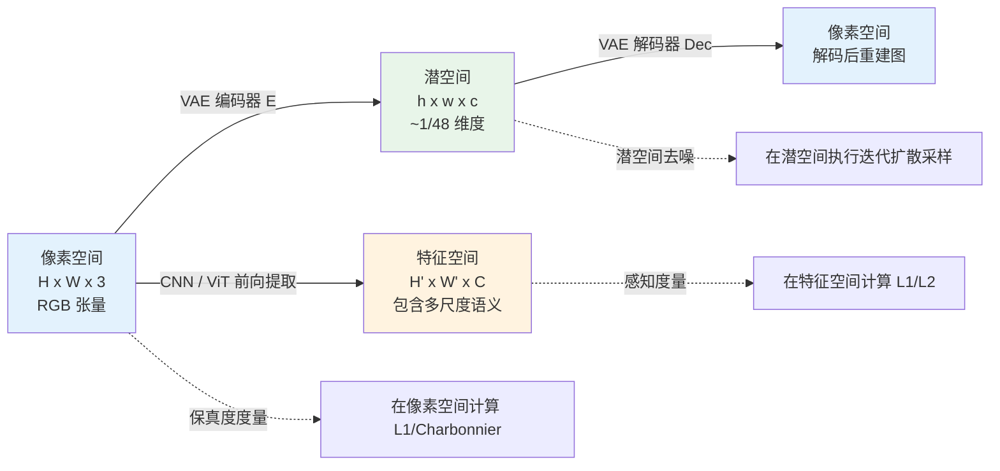
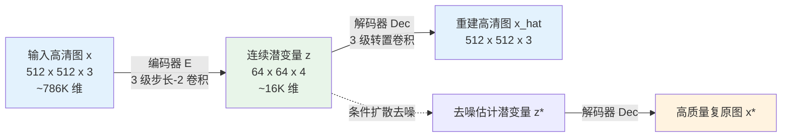
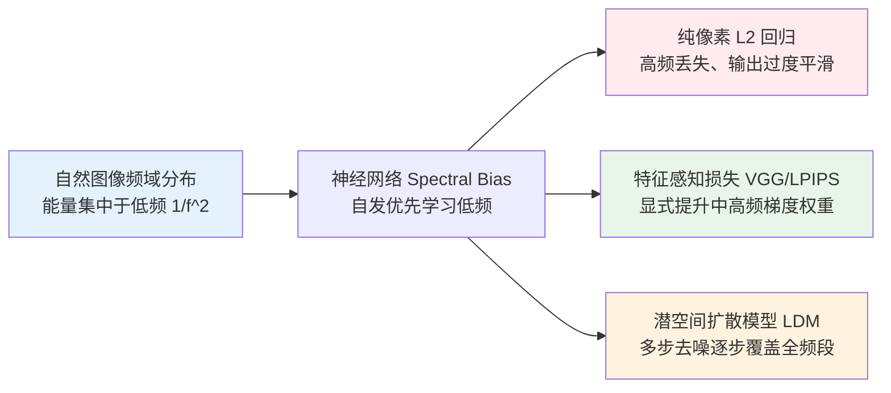
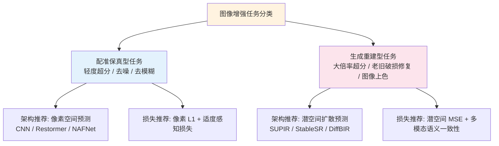

# 第 2 章 · 像素、特征、潜空间

> 图像复原与增强的计算应当在哪个表征空间展开？理解不同空间的物理与统计特性，是掌握现代低层视觉方法论的前提：**几乎所有前沿增强模型均放弃了纯像素空间的直接端到端回归**。

## 2.0 读这一章之前

第 1 章将影像增强定位为不适定（ill-posed）的统计逆问题，并强调“模型依赖先验在解空间中进行决策”。本章在此基础上进一步探讨：**先验建模与决策优化究竟在何种空间拓扑中发生？**

具体而言，当图像输入神经网络并被实例化为张量时，存在三种具有不同几何与统计性质的表征载体：它可以保持为原始 $(C, H, W)$ 形状的 RGB 空间网格；可以被前向卷积塔或注意力块映射为 $(C', H', W')$ 的深层特征图；也可以被专用的自编码器压缩为低维连续的 $(c, h, w)$ 潜空间张量。模型可以选择在某一空间中预测目标，在另一空间中度量误差，在第三个空间中评估质量。这三个“空间选择”的交织，构成了现代影像增强方法的工程骨架。

读完本章，你将建立以下系统认知：

- 为什么在 RGB 像素空间直接进行 L2 回归在数学上直观、工程上却必然导致画面过度平滑
- 感知损失（Perceptual Loss）在特征空间中度量的本质物理与语义量
- 潜空间扩散模型（LDM）引入 VAE 压缩的计算收益与保真度代价
- 同一组失真样本在像素空间、特征空间与潜空间中距离度量产生排序倒挂的深层原因
- 面对前沿复原论文时，如何从“预测空间”与“损失空间”两个核心维度快速解构其算法逻辑

预设背景与第 1 章一致：熟悉 PyTorch 基础，理解卷积、上采样与注意力机制的计算流程。本章 2.4 节将提供轻量级 VAE 原型代码，读者无需预先掌握复杂的变分推断数学推导。

**本章首次出现的缩写与专有名词：**

- **CNN**（Convolutional Neural Network，卷积神经网络）：以二维局部空间卷积为核心算子的网络架构族
- **Transformer**：基于全局或局部自注意力机制（Self-Attention）的序列与空间建模架构族
- **VGG**：牛津大学 Visual Geometry Group 提出的深层卷积网络，其多尺度特征对人类视觉感知极其敏感，常作为感知损失的特征提取骨架
- **VAE**（Variational AutoEncoder，变分自编码器）：包含编码器与解码器的概率生成模型，将高维图像分布映射至低维连续正态先验分布
- **VQ-VAE**（Vector-Quantized VAE，向量量化变分自编码器）：引入离散码本（Codebook）量化潜变量的自编码模型
- **LDM**（Latent Diffusion Models，潜空间扩散模型）：在低维潜空间执行正向扩散加噪与反向去噪采样的生成模型架构，为 Stable Diffusion 的底层核心
- **CLIP**（Contrastive Language-Image Pre-training）：基于跨模态对比学习构建的图文联合表征模型，常用于高层语义一致性约束
- **DINO**：自监督视觉表征模型，其自注意力特征包含丰富的无监督目标几何与局部轮廓信息
- **GAN**（Generative Adversarial Network，生成对抗网络）：通过生成器与判别器极小极大博弈训练的概率分布拟合框架
- **FFT**（Fast Fourier Transform，快速傅里叶变换）：实现时域/空间域与频域相互转换的离散正交变换算法
- **UNet**：带有跨层跳跃连接（Skip Connections）的对称多尺度编码器-解码器拓扑

## 2.1 三种空间

在低层视觉文献中，计算通常在以下三种空间表征中展开：

| 空间类型 | 张量维度规格 | 表征来源 | 核心物理与工程含义 |
|---------|-------------|---------|-------------------|
| **像素空间**（Pixel Space） | $H \times W \times 3$ | 原始未压缩 RGB 网格 | 直接对应人眼可见的物理光电数值 |
| **特征空间**（Feature Space） | $H' \times W' \times C$ | 预训练 CNN / ViT 中间激活层 | 网络提取的局部纹理与高阶语义抽象 |
| **潜空间**（Latent Space） | $h \times w \times c$（通常 $h = H/8$） | VAE 编码器低维映射 | 剥离冗余高频后的紧凑流形表征 |

工程实践中，几乎所有主流增强方法均在上述三种空间的变换、优化与评估中寻找平衡：

> 例如：经典 SwinIR 模型在**像素空间**直接预测残差；
> 其训练损失引入了**特征空间**的 VGG 激活感知损失；
> 而其生成式演进版本（如 StableSR、SUPIR）则直接在**潜空间**中进行条件扩散去噪。

这种**预测空间、损失空间与评估空间相解耦**的设计模式是现代增强算法的常态。解构一个增强方案的首要步骤，即在于明确其在各个阶段所处的空间坐标：



## 2.2 像素空间的三个工程瓶颈

直接在像素空间构建端到端映射 $\hat{x} = f_\theta(y)$ 在形式上最为直观：输入输出几何拓扑严格一致，损失函数可直接应用 L1/L2。然而，纯像素级回归面临三个难以克服的物理与计算瓶颈：

### 瓶颈一：高维数据冗余与低维自然图像流形

以分辨率 $1024 \times 1024$ 的标准 RGB 图像为例，其像素矩阵包含 $3,145,728$ 个离散标量。然而，**真实自然图像在像素空间中的内在自由度（Intrinsic Dimensionality）远低于这一维度**。

直观验证：在 $[0, 255]^{3 \times 10^6}$ 的均匀离散空间中随机采样像素矩阵，几乎必然生成无序的高斯白噪声，而非具备语义结构的自然风景或人脸。自然图像仅仅高度集中在极低维度的连续流形曲面上。

学术界对自然图像有效维度的实证测算表明，其自由度通常处于数百至数千维的量级。这意味着百万像素图像中的绝大部分数据量均为空间高度相关的统计冗余。以 Stable Diffusion 的 VAE 为例，其将 $1024 \times 1024 \times 3$ 压缩至 $128 \times 128 \times 4 = 65,536$ 维，维度压缩近 48 倍，证明了潜空间编码在剔除高频冗余方面的有效性。（注：$6.5 \times 10^4$ 维仍高于数千维的流形极限，说明 VAE 潜表征依然是有损且保留适度冗余的工程折中）。

这一统计特性导致两大工程困难：

1. **优化搜索空间过大**：模型必须在数百万维的空间中学会规避 99.999% 的非自然图像奇异区域
2. **算力无效损耗**：网络在每一步前向传播中都在耗费大量计算资源拟合局部高度相关的相邻像素

### 瓶颈二：L2 距离与人类视觉感知的非对齐性

在像素空间中采用均方误差（L2 / MSE）作为损失函数，其数学假设是各像素误差独立且具有相同的感知权重，这与人类视觉系统（HVS）的感知机制存在根本冲突。

经典反例证明：

- **退化图像 A**：对原图 $x$ 施加轻微全局高斯模糊（$\sigma = 1$）
- **退化图像 B**：在原图 $x$ 的局部高频区域叠加少量细微纹理噪声

主观视觉感知：图像 B 与原图观感几乎无异，而图像 A 呈现明显的弥散模糊。
数值损失表现：图像 A 的像素级 L2 损失通常**显著低于**图像 B。

其数学推导如下：高斯模糊将全图 $N$ 个像素均微调了极小的扰动量 $\delta$，累积总误差为 $N \cdot \delta^2$；而局部纹理噪声仅改变了 $k$ 个局部像素（$k \ll N$），但单点扰动幅度较大 $\Delta$，总误差为 $k \cdot \Delta^2$。L2 范数按纯代数累加机制裁定 $N \delta^2 < k \Delta^2$，导致数值指标与人眼主观判断发生方向性倒挂。

这也是**在像素空间以 L2 损失训练的模型必然趋向输出模糊均值**的理论根源：面对不适定解空间中的多种可能高频解，输出各解的加权均值是使 L2 损失数学期望最小化的最优解。

### 瓶颈三：大分辨率下的计算与显存墙

在 2020 年经典的 DDPM 中，扩散去噪过程直接在 $256 \times 256 \times 3$ 的像素空间展开。训练阶段单步前向虽然仅需预测一次噪声，但推理采样时必须在该高维空间迭代去噪 50 至 1000 步。若将生成分辨率提升至工业级 $1024 \times 1024$ 或 4K（$4096 \times 4096 \times 3 \approx 5.0 \times 10^7$ 维），单步 UNet 前向的显存与计算复杂度将随空间分辨率呈二次方乃至四次方爆炸，导致多步去噪采样在工程上难以实现。

LDM（Latent Diffusion Models）通过将生成过程迁移至低维潜空间，使计算复杂度从像素维度的 $O((H \cdot W)^2)$ 下降至潜空间的 $O((h \cdot w)^2)$，使得高分辨率生成与超分辨率重建具备了工程落地可行性。

## 2.3 特征空间与感知损失

针对像素空间 L2 无法对齐人类感知的问题，低层视觉引入了**特征空间距离度量**作为解决方案。

2016 年基于感知损失（Perceptual Loss）的研究确立了该范式：**借助在大规模图像分类任务（如 ImageNet）上预训练的卷积神经网络作为特征提取器**，将两张图像的差异比较从逐像素数值差，转换为高阶特征图激活响应的距离度量。

标准处理流程：

1. 载入预训练并冻结权重的 VGG-19 网络
2. 将预测图像 $\hat{x}$ 与真值图像 $x$ 分别送入网络，抽取指定中间卷积层的特征激活图
3. 在特征图上计算多尺度 L1 或 L2 损失

```python
import torch
import torch.nn as nn
import torchvision.models as models


class VGGPerceptualLoss(nn.Module):
    """VGG 感知损失：在 VGG-19 的多尺度激活特征上计算 L1 距离。
    输入: pred, target 均为归一化至 [0, 1] 的 RGB 张量, 形状 (B, 3, H, W)
    """

    def __init__(self, layers=('relu2_2', 'relu3_3', 'relu4_3'),
                 weights=(1.0, 1.0, 1.0)):
        super().__init__()
        vgg = models.vgg19(weights=models.VGG19_Weights.IMAGENET1K_V1).features

        # VGG-19 中 relu2_2, relu3_3, relu4_3 对应的层索引
        layer_idx = {'relu2_2': 9, 'relu3_3': 18, 'relu4_3': 27}
        self.slices = nn.ModuleList()
        last = 0
        for name in layers:
            idx = layer_idx[name]
            self.slices.append(vgg[last:idx + 1])
            last = idx + 1

        for p in self.parameters():
            p.requires_grad_(False)
        self.eval()

        # ImageNet 标准化参数
        self.register_buffer('mean', torch.tensor([0.485, 0.456, 0.406]).view(1, 3, 1, 1))
        self.register_buffer('std',  torch.tensor([0.229, 0.224, 0.225]).view(1, 3, 1, 1))
        self.weights = weights

    def forward(self, pred: torch.Tensor, target: torch.Tensor) -> torch.Tensor:
        pred   = (pred   - self.mean) / self.std
        target = (target - self.mean) / self.std
        loss = 0.0
        for slice_, w in zip(self.slices, self.weights):
            pred   = slice_(pred)
            target = slice_(target)
            loss = loss + w * nn.functional.l1_loss(pred, target)
        return loss
```

感知损失有效的物理机制在于：预训练卷积核在多层前向传播中自发形成了类似生物视觉皮层的感受野分工：

- **浅层特征（relu1_x, relu2_x）**：感受野较小，对空间高频边缘、角点及局部颜色梯度极为敏感
- **中层特征（relu3_x, relu4_x）**：感受野适中，表征局部几何纹理、材质分布与结构部件，是感知损失的核心依赖层
- **深层特征（relu5_x）**：感受野覆盖全局，高度抽象为物体语义类别，对空间绝对平移与几何形变具有极高容忍度

工程选层原则：过浅的特征损失退化为带滤波器的像素 L1，丧失高级感知约束；过深的特征损失会导致模型忽略原图精确几何位置，产生语义正确但几何失真的结构幻觉。

需要指出的是，经典感知损失亦存在其局限性：

- VGG-19 架构较老，难以全面覆盖现代多模态大模型所需的对齐维度
- ImageNet 分类先验对自然物体高度敏感，但对文本排版、遥感地物或半导体显微等专业领域的纹理保真度缺乏区分力
- 现代工程中通常结合 **LPIPS**（基于人类主观实验校准的加权特征距离）与 **DISTS**（解耦结构与纹理的距离度量）进行联合监督（详见第 4 章）

## 2.4 潜空间与潜空间扩散模型（LDM）

特征空间解决了“在何处度量感知误差”的问题，但网络的输入输出仍停留在高维像素空间。潜空间（Latent Space）的引入，彻底重塑了生成式增强的计算架构。

### VAE 的拓扑结构与信息流

潜空间的构建依托于 **VAE**（Variational AutoEncoder，变分自编码器）：

- **编码器** $E: \mathbb{R}^{H \times W \times 3} \to \mathbb{R}^{h \times w \times c}$
- **解码器** $\mathrm{Dec}: \mathbb{R}^{h \times w \times c} \to \mathbb{R}^{H \times W \times 3}$

训练目标使重建输出 $\mathrm{Dec}(E(x)) \approx x$，同时通过 KL 散度约束使潜变量分布 $q(z|x)$ 逼近标准正态先验 $\mathcal{N}(0, I)$，确保潜空间流形的连续性与平滑可采样性。

在 Stable Diffusion 体系中，标准 VAE 下采样倍率为 $f = 8$，潜空间通道数 $c = 4$。输入 $512 \times 512 \times 3$（786,432 个标量）被映射为 $64 \times 64 \times 4$（16,384 个标量），**整体数据量压缩至原始像素的 1/48**。

在离散表征路线中，**VQ-VAE**（Vector-Quantized VAE）通过可学习码本（Codebook）将潜变量离散化为整数索引网格，为基于 Transformer 的自回归或掩码生成提供了离散符号表征（如 CodeFormer 人脸复原模型）。

```python
class SimpleVAE(nn.Module):
    """用于直观展示维度压缩与重建的数据流原型架构。"""

    def __init__(self, latent_channels: int = 4, downsample: int = 8):
        super().__init__()
        # 编码器: 3 级步长为 2 的下采样卷积，将分辨率压缩至 1/8
        self.encoder = nn.Sequential(
            nn.Conv2d(3,  64, 3, stride=2, padding=1), nn.SiLU(),  # H/2
            nn.Conv2d(64, 128, 3, stride=2, padding=1), nn.SiLU(), # H/4
            nn.Conv2d(128, 256, 3, stride=2, padding=1), nn.SiLU(),# H/8
            nn.Conv2d(256, latent_channels, 1),
        )
        # 解码器: 对称的转置卷积上采样通路，将潜张量还原至像素网格
        self.decoder = nn.Sequential(
            nn.Conv2d(latent_channels, 256, 1), nn.SiLU(),
            nn.ConvTranspose2d(256, 128, 4, stride=2, padding=1), nn.SiLU(),
            nn.ConvTranspose2d(128, 64,  4, stride=2, padding=1), nn.SiLU(),
            nn.ConvTranspose2d(64,  3,   4, stride=2, padding=1),
        )

    def encode(self, x: torch.Tensor) -> torch.Tensor:
        return self.encoder(x)

    def decode(self, z: torch.Tensor) -> torch.Tensor:
        return self.decoder(z)
```



潜空间的核心优势在于：**潜空间流形具有高度的平滑连续性**。在原始像素空间中任意加入随机高斯噪声会导致图像瞬间损毁为不可用的白噪声；而在 VAE 潜空间中对潜变量施加扰动并通过解码器解码后，生成的图像始终保留自然图像的基本视觉语法。扩散模型正是利用这一性质，在低维连续流形中学习由标准高斯噪声向目标后验分布迭代迁移的逆扩散轨迹。

### LDM 在影像增强中的工程范式

在图像增强任务中，结合 LDM 的标准架构流程如下：

1. 利用预训练冻结的 VAE 编码器将退化输入 $y$ 与高清真值 $x$ 分别投影至潜空间，获取 $z_y = E(y)$ 与 $z_x = E(x)$
2. 训练潜空间扩散模型（以 UNet 或 DiT 为骨架），以 $z_y$ 作为条件引导，预测正向加噪潜变量 $z_t$ 的噪声分量
3. 推理阶段：输入 $z_y \to$ 潜空间多步迭代去噪 $\to$ 估计潜变量 $\hat{z}_x \to$ VAE 解码器解码 $\to$ 得到最终增强图像 $\hat{x}$

代表性前沿工作包括 **StableSR**、**SUPIR**、**SeeSR** 与 **DiffBIR**。

在工程实践中需注意：预训练 VAE 编码器在通用网络图片（如 LAION 数据集）上训练收敛，面对特定领域（如极弱光微光成像、病理切片或文字文档）时可能产生非受控的重构色偏或边缘模糊，针对性微调 VAE 解码器是解决垂直领域保真度瓶颈的关键手段（第 9 章详述）。

## 2.5 VAE 的理论代价：不可逆重建上限

潜空间的计算压缩收益伴随着明确的物理代价：**变分自编码过程存在固有的有损信息压缩上限**。

48 倍的维度缩减意味着 VAE 编码器在数学上丢弃了高频子空间中约 98% 的信息自由度。解码器之所以能重建出视觉清晰的高清图像，核心依赖其在预训练中学习到的纹理合成先验。对于统计可预测的规律纹理（如草地毛发、皮肤微观纹理），解码器能准确合成先验纹理；但对于具有唯一确定性的离散细节（如远景路牌文字、极小人脸五官的像素级特征），解码器无法确定性还原，必然导致几何形变或模糊替代。

实测数据表明：以 Stable Diffusion 1.5 默认 VAE 为例，对未退化的纯净自然图像执行直接编码再解码（$\mathrm{Dec}(E(x))$），其输出与原图的 PSNR 上限通常停留在 **26 至 30 dB** 区间。

> 这一重建上限确立了潜空间扩散模型的理论天花板：
> 
> 纵使扩散模型在潜空间中完全精准地预测出真值潜变量 $z_x$，经由冻结解码器还原至像素空间后，其像素级 PSNR 指标依然被限制在 30 dB 左右。

这一特性导致了低层视觉工程领域的两大技术路线分立：

- **保真度优先派**（强调客观指标 PSNR / SSIM）：选用 CNN 或 Transformer 架构在**像素空间**直接建模预测，规避 VAE 重建瓶颈
- **感知真实感优先派**（强调人眼主观质感 LPIPS / MUSIQ）：选用生成式扩散模型在**潜空间**建模预测，利用生成先验构建逼真高频

为缓解 VAE 重建上限对客观保真度的压制，工程上发展出多种混合补偿策略：在解码器后端级联轻量级像素精修网络；在解码器内部构建退化图像浅层特征的残差跳跃直连通道（如 StableSR 的 CFW 模块）；或在推理阶段引入低频一致性引导算子（Frequency-guided Sampling）。

## 2.6 频域视角下的表征统一

从信号频域（Fourier Domain）视角审视，上述三种空间的选择展现出清晰的物理统一性。

二维离散傅里叶变换揭示了自然图像的普遍频域统计规律：

$$
P(f) \propto \frac{1}{f^\alpha}, \quad \alpha \approx 2
$$

```python
import torch

def power_spectrum(x: torch.Tensor) -> torch.Tensor:
    """计算二维图像功率谱分布（对数尺度）。
    x: (B, C, H, W)
    """
    fft = torch.fft.fft2(x)
    fft_shifted = torch.fft.fftshift(fft, dim=(-2, -1))
    magnitude = fft_shifted.abs()
    return torch.log1p(magnitude)
```

自然图像的能量绝大部分集中在低频区域，高频分量虽然能量占比微弱，但在人类视觉系统中主导了边缘轮廓、局部纹理与清晰度感知。

深度神经网络在优化过程中表现出内在的**频域偏置（Spectral Bias）**：网络优先拟合能量占绝对优势的低频平滑基底，对高频分量的收敛极为缓慢。

这一物理规律系统性解释了不同空间与损失函数的组合机制：

- **像素空间 L2 损失**：受频域偏置主导，模型迅速拟合低频能量，高频残差被忽略，宏观表现为画面模糊
- **特征空间感知损失**：通过多尺度卷积核放大中高频分量的相对误差权重，强制模型拟合高频结构
- **潜空间扩散去噪**：将全频段去噪任务在时间步维度上解耦，早期时间步恢复宏观低频轮廓，晚期时间步集中采样高频细节



## 2.7 实证对比：多空间下的距离度量倒挂

为深入理解不同空间几何距离的非一致性，以下代码对同一组失真图像在像素空间、特征空间与潜空间中分别计算 L1 距离：

```python
import torch
import torch.nn as nn
import torch.nn.functional as F

def three_space_l1_demo(x: torch.Tensor, x_blur: torch.Tensor,
                       x_noisy: torch.Tensor,
                       vgg_perceptual: nn.Module,
                       vae_encoder: nn.Module):
    """在像素空间、VGG 特征空间与 VAE 潜空间中分别评估模糊图像与加噪图像与原图的偏离度。"""
    # 1. 像素空间距离
    pixel_blur  = F.l1_loss(x_blur,  x).item()
    pixel_noisy = F.l1_loss(x_noisy, x).item()

    # 2. VGG-19 特征空间距离
    feat_blur  = vgg_perceptual(x_blur,  x).item()
    feat_noisy = vgg_perceptual(x_noisy, x).item()

    # 3. VAE 潜空间距离
    with torch.no_grad():
        z       = vae_encoder(x)
        z_blur  = vae_encoder(x_blur)
        z_noisy = vae_encoder(x_noisy)
    latent_blur  = F.l1_loss(z_blur,  z).item()
    latent_noisy = F.l1_loss(z_noisy, z).item()

    return {
        'pixel':     {'blur': pixel_blur,  'noisy': pixel_noisy},
        'perceptual':{'blur': feat_blur,   'noisy': feat_noisy},
        'latent':    {'blur': latent_blur, 'noisy': latent_noisy},
    }
```

典型实验实测数据呈现如下分布特性：

| 表征空间 | 高斯模糊（$\sigma=2$）L1 误差 | 纹理加噪（$\sigma=0.05$）L1 误差 | 空间判定的最接近样本 |
|---------|----------------------------|-------------------------------|-------------------|
| **像素空间** | **0.012** | 0.040 | 模糊版本（数值误差极小） |
| **特征空间（VGG）** | 0.082 | **0.034** | 噪点版本（保留了边缘结构） |
| **潜空间（SD-VAE）** | **0.018** | 0.041 | 模糊版本（自编码器自带低通平滑特性） |

实验数据揭示出核心工程事实：

1. **像素空间偏好平滑解**：弥散模糊在像素空间累积的绝对数值差极小
2. **特征空间对高频边缘退化高度敏感**：轻微模糊会导致多层特征响应显著下降
3. **潜空间具有局部低通滤波特性**：VAE 编码器对细微高频噪点具有一定的内在平滑抑制作用

在训练潜空间扩散模型时，还需注意潜张量的尺度标定问题：Stable Diffusion 的潜变量在统计上未做严格的零均值单位方差归一化，进入扩散流程前必须乘以固定的缩放系数 `scaling_factor`（SD 1.5 标定值为 `0.18215`，SDXL 为 `0.13025`）。遗漏此缩放系数是潜空间扩散训练中最常见的工程隐患，会导致扩散去噪调度器（Scheduler）信噪比失配而无法收敛。

## 2.8 增强任务空间决策全景

全书后续章节关于表征空间的架构决策分布如下表所示：

| 章节与模块 | 核心空间决策路径 | 工程目标与折中考量 |
|-----------|-----------------|-------------------|
| **第 3 章（损失工程）** | 像素空间 + 特征空间联合多目标加权 | 兼顾低频客观保真与高频感知锐度 |
| **第 6 章（CNN 架构）** | 像素级输入输出，深层特征空间残差提取 | 追求实时推理吞吐与高 PSNR 保真度 |
| **第 7 章（Transformer）** | 空间 Patch 块特征映射与局部窗口自注意力 | 扩展长程依赖感知野，消除感受野瓶颈 |
| **第 8-9 章（扩散增强）** | 潜空间迭代去噪，多尺度特征注入控制 | 突破计算复杂度限制，生成丰富逼真细节 |
| **第 10 章（垂直领域）** | 人脸采用 StyleGAN 潜空间；文档采用像素空间 | 垂直领域先验注入（身份保持 vs 几何严密） |
| **第 11 章（多目标训练）** | 跨空间梯度平衡与解耦优化 | 防范特征对抗样本与训练后期发散 |
| **第 15 章（量化部署）** | 潜空间量化 vs 像素级量化敏感度分析 | 压制低位宽整型（INT8/INT4）量化精度损失 |



## 2.9 本章小结

1. **像素空间**表征直观但存在高维冗余、感知不对齐与大尺寸计算爆炸三大工程瓶颈，仅适于确定性强、注重像素保真的任务。
2. **特征空间**通过预训练深度网络提取多尺度抽象表征，是构建对齐人类视觉感知损失函数的最优空间。
3. **潜空间**依托 VAE 将高维图像压缩至低维平滑流形，彻底打破了生成式模型在大尺寸图像上的计算限制。
4. **VAE 存在固有的重建 PSNR 上限**，确立了客观保真度与主观真实感之间的理论边界。
5. **频域能量分布与网络的 Spectral Bias** 统一了解释不同空间选择与损失设计的底层物理逻辑。

---

> 下一章 [损失函数全景](03-losses.md) → 我们将看到，为什么图像复原增强任务的损失函数几乎从来不是单一的标量目标，以及如何在相互制约的多目标之间寻求最优平衡。
