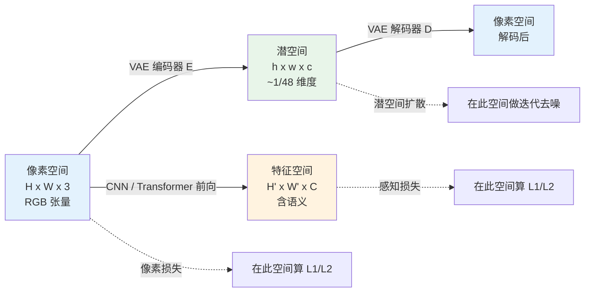
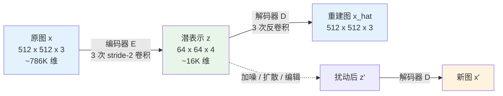

# 第 2 章 · 像素、特征、潜空间

> 这一章回答一个看似哲学的问题：增强模型应该在哪里工作？答完这个问题，你会理解一个反直觉的事实：**几乎所有现代增强模型都不直接在像素空间工作**。

## 2.0 读这一章之前

第 1 章把影像增强定位成一个 ill-posed 的统计逆问题，并且强调"模型靠先验做选择"。这一章往前走一步，问的是：选择发生**在哪里**？

具体来说，一张图在网络里被表示成张量后，可以有三种截然不同的居所。它可以一直是那个 $(C, H, W)$ 的 RGB 张量；可以被某个卷积塔抽象成 $(C', H', W')$ 的中间特征；也可以被一个专门训练的编码器压成显著更小的 $(c, h, w)$ 紧凑表示。模型可以选择在任一个空间预测，也可以选择在另一个空间评估预测的好坏。这两个"在哪里"的决策合起来，定义了一个增强方法在工程上的骨架。

读完这一章，你应当能回答这些问题：

- 为什么直接在 RGB 像素上做 L2 回归看似合理却效果不好
- "感知损失"具体是把张量送到哪里、量了什么
- Stable Diffusion 系列模型为什么先要训练一个 VAE
- 同一张图在像素空间、感知空间、潜空间里的"距离"为何排名不同
- 后面章节读到一篇新论文时，应当从哪两个维度去定位它

预设的背景仍然是第 1 章列的那些：能读 PyTorch 代码，知道卷积、上采样、注意力大致做什么。如果你完全没接触过 VAE（Variational AutoEncoder，变分自编码器），不用提前补；2.4 节会从零搭一个最小可读的版本。

**本章首次出现的缩写。** 第 1 章已经介绍过的 PSNR、SSIM、LPIPS、DISTS、ISP、HR、LR、SR、IQA、SRCNN、EDSR、RCAN、SwinIR、Restormer、NAFNet、DDPM 在本章不再重复定义。本章新引入或更详细展开的术语包括：

- **CNN**（Convolutional Neural Network，卷积神经网络）：以二维卷积为核心算子的网络族，2014-2020 年期间是低层视觉的主力骨架
- **Transformer**：以注意力为核心算子的网络族，2020 年后在低层视觉中逐渐成为新的主力
- **VGG**：Visual Geometry Group 在 2014 年发表的一个深层卷积网络，原本为 ImageNet 分类设计，因其特征对感知质量友好而被广泛用作感知损失的特征抽取器
- **VAE**（Variational AutoEncoder，变分自编码器）：一种生成模型，包含编码器与解码器两部分，编码器把图压成一个低维的、近似服从简单先验分布的潜表示
- **VQ-VAE**（Vector-Quantized VAE）：把潜表示再做一次离散化量化的 VAE 变体，潜空间变成离散 codebook 索引
- **LDM**（Latent Diffusion Models，潜空间扩散模型）：把扩散过程从像素空间搬到 VAE 潜空间的扩散模型范式，Stable Diffusion 系列的基础
- **CLIP**（Contrastive Language-Image Pre-training）：OpenAI 在 2021 年发表的图文对齐模型，把图与对应的描述拉到同一个嵌入空间
- **DINO**：Facebook 在 2021 年提出的自监督视觉表征模型，特征空间偏几何与结构
- **GAN**（Generative Adversarial Network，生成对抗网络）：由一个生成器与一个判别器博弈训练的生成模型族
- **FFT**（Fast Fourier Transform，快速傅里叶变换）：把信号从时域/空间域映射到频域的标准算法
- **UNet**：一种带跳连接的编码器-解码器对称结构，扩散模型的常见骨架
- **SUPIR / StableSR / SeeSR / DiffBIR**：本章会简单点名的四个潜空间扩散增强模型，详细展开放在第 8-9 章

## 2.1 三种空间

打开任何一篇增强论文，你会发现它在某种"空间"里做计算。常见的有三种：

| 空间 | 形状 | 来源 | 直观含义 |
|------|------|------|---------|
| 像素空间 | $H \times W \times 3$ | 直接的 RGB | 你眼睛看到的 |
| 特征空间 | $H' \times W' \times C$ | CNN/Transformer 中间层 | 网络对图像的抽象 |
| 潜空间 | $h \times w \times c$（通常 $h = H/8$） | VAE 编码 | 压缩后的紧凑表示 |

工程上，几乎所有重要的增强方法都在做这三个空间之间的变换、损失计算或预测。

> 一个 SwinIR 模型在**像素空间**预测；
> 它的训练损失里包含**特征空间**的感知损失（VGG features）；
> 它的扩散版本（StableSR、SUPIR）在**潜空间**预测。

理解这三个空间各自适合什么、不适合什么，是理解这本书后面所有架构选择的前提。这本书后面的每一章在介绍某个具体模型时，都会回到"它在哪个空间预测、在哪个空间算损失"这两个问题。本章把这两个问题的基础铺好。

把这三种空间放在一起看，有一个工程上反复出现的模式：**模型预测发生在某一个空间，损失计算可能在另一个空间，最终评估又可能在第三个空间**。这种"三处不一致"是现代影像增强方法的常态。一个 SwinIR 在像素空间预测、损失用像素 L1 + VGG 特征 L1（特征空间）、评估用 PSNR（像素空间）+ LPIPS（特征空间）；一个 StableSR 在潜空间预测、损失用潜空间 MSE + 解码后的像素 L1、评估用 PSNR（像素空间）+ LPIPS（特征空间）+ FID（特征空间分布距离）。理解一个增强方法的第一步，就是把它在这"三处"的空间选择列清楚。

下面这张图把三种空间的关系画出来。注意箭头方向：编码器把像素图压成潜表示，解码器再把潜表示还原成像素图，二者构成一个 VAE；卷积或注意力骨架则把像素图逐层抽象成一系列特征图，每张特征图都是一个候选的"评估空间"。



后面三节按这张图的三个方框展开：2.2 节讲为什么不应当只在像素空间里干活，2.3 节讲特征空间适合做什么，2.4 节讲潜空间为什么是现代生成式增强的核心。

## 2.2 像素空间的三个问题

直接在像素空间预测 $\hat{x} = f_\theta(y)$ 看起来最自然——输入和输出形状一致，损失直接 L1/L2，人类看到的也是像素。

但它有三个问题。

### 问题一：高度冗余

一张 $1024 \times 1024$ 的 RGB 图有 $3,145,728$ 个像素值。但**自然图像的内在维度远低于这个数**。

直观验证：你随机生成 $3 \times 10^6$ 个 [0, 255] 之间的整数排成图像，几乎肯定不是任何"自然图像"——它是雪花。**自然图像在像素空间是一个非常稀疏的低维流形**。

更具体的估计：研究界对自然图像的"有效维度"做过多个测量，结论大致在几百到几千维这个量级。也就是说，一张百万像素图的真实信息量大致相当于一个几千维的向量，其余几十万维都是高度相关的冗余。这个数字与 VAE 把 1024×1024 图压成 128×128×4 = 65536 维的体量大致符合，也佐证了 VAE 编码确实在做"抹除冗余"的本职工作。

这有两个工程后果：

1. **大部分像素值组合是无意义的**——模型在 3M 维空间里要学会避开 99.999% 的"非自然图像"区域
2. **冗余意味着计算浪费**——模型每一步都在处理大量信息相关的相邻像素

从信息论的角度看，这个观察也解释了 JPEG 等压缩算法为什么能做到 10-50× 压缩率而视觉损失不大：自然图像在像素空间的真实自由度本来就远低于像素数量。压缩算法和潜空间编码本质上做的是同一件事——抹除冗余、保留真信息。差别在于压缩算法用手工设计的变换（DCT、小波），潜空间编码用学习出来的非线性变换（VAE）。

### 问题二：感知不对齐

L2 损失在像素空间最自然，但**它不对齐人眼感知**。一个被引用过几千次的反例：

- 图 A：原图 $x$ 整体模糊一点点（高斯模糊 $\sigma = 1$）
- 图 B：原图 $x$ 局部加一点纹理噪声（少量像素值改变）

视觉上：B 看起来更接近原图（你几乎看不出差别），A 明显糊了。
L2 损失：A 的 L2 损失通常**更小**，因为模糊改变所有像素一点点，纹理噪声改变少数像素一大堆。

更细一点的推导是这样：高斯模糊把每个像素改动一个小量 $\delta$，全图 $N$ 个像素的总误差是 $N \cdot \delta^2$；纹理噪声只改动 $k$ 个像素，每个改动幅度 $\Delta$，总误差是 $k \cdot \Delta^2$。即便人眼对前者完全无感、对后者一眼看穿，L2 仍然按 $N \delta^2$ vs $k \Delta^2$ 的纯算术比大小，与"是否被人眼察觉"完全无关。

这就是 **L2 损失下，模型偏向输出模糊**的本质原因 - 模糊是 L2 意义下逼近真值的"安全选择"。第 3 章会从损失函数的角度详谈，但本质问题在像素空间本身。

换句话说，像素空间的 L2 损失隐含了一个非常强的假设："两张图在每个位置的像素值差异，可以加起来比较"。这个假设对人类视觉系统来说是错的——人眼不是按"每个像素的色差累加"判断相似度的，它对结构、纹理、颜色对比有完全不同的敏感度曲线。任何把人眼当成"逐像素累加器"的损失，都会在某些情境下与人眼意见相左。这是后面要把损失搬到特征空间或潜空间的根本动机。

### 问题三：计算成本

2020 年的 DDPM 论文在像素空间训练 $256 \times 256$ 的扩散模型，需要每张图算 $256 \times 256 \times 3 = 196,608$ 维的去噪 1000 次。在 $1024 \times 1024$ 上做扩散，**计算量直接 16 倍**——这就是为什么早期扩散模型都局限在 $256 \times 256$。

直到 2022 年的 LDM (Latent Diffusion Models) 把扩散从像素空间搬到潜空间，问题才得到根本性解决。

计算成本对增强任务尤其敏感，因为增强常常面对的是**用户已经拍好的大图**。文生图可以接受 1024×1024 的输出，增强往往需要支持 4K 甚至更大的输入。在像素空间做扩散，4K 图就是 4096×4096×3 ≈ 5000 万维，单次去噪都吃不消，更不用说 20-50 步采样。潜空间扩散把这件事变成可能：4K 图编码后是 512×512×4 ≈ 100 万维，扩散过程跑得动，解码后再回到 4K 像素。这是为什么"大图增强"这个工程需求几乎必然要走潜空间。

## 2.3 特征空间与感知损失

如果像素空间的 L2 不对齐人眼感知，能不能找一个**对齐**的空间？

2016 年的几篇 perceptual loss 论文给了一个简单又有效的答案：**借用预训练 CNN 的中间层**。所谓借用，是指不再训练一个新网络，而是把一个已经在 ImageNet 这类大规模图像分类任务上训完的网络当成现成的"特征抽取器"，把比较两张图的相似度从"在像素上算 L2"改成"先把它们送进这个网络的某几层，再在这些层的激活上算 L2"。

具体做法：

1. 取一个在 ImageNet 上预训练的 VGG-19
2. 把要比较的两张图都喂进去，记录某几个中间层的激活
3. 在激活上算 L1 / L2 损失

这个损失被称为**感知损失**（perceptual loss）。代码：

```python
import torch
import torch.nn as nn
import torchvision.models as models


class VGGPerceptualLoss(nn.Module):
    """VGG 感知损失 - 在 VGG-19 的几个中间层上算 L1。
    输入: pred, target 都是 [0, 1] 的 RGB 图, shape (B, 3, H, W)
    """

    def __init__(self, layers=('relu2_2', 'relu3_3', 'relu4_3'),
                 weights=(1.0, 1.0, 1.0)):
        super().__init__()
        vgg = models.vgg19(weights=models.VGG19_Weights.IMAGENET1K_V1).features

        # VGG-19 layer indices for relu2_2, relu3_3, relu4_3
        layer_idx = {'relu2_2': 9, 'relu3_3': 18, 'relu4_3': 27}
        self.slices = nn.ModuleList()
        last = 0
        for name in layers:
            idx = layer_idx[name]
            self.slices.append(vgg[last:idx + 1])
            last = idx + 1

        for p in self.parameters():
            p.requires_grad_(False)
        self.eval()

        # ImageNet normalization
        self.register_buffer('mean', torch.tensor([0.485, 0.456, 0.406]).view(1, 3, 1, 1))
        self.register_buffer('std',  torch.tensor([0.229, 0.224, 0.225]).view(1, 3, 1, 1))
        self.weights = weights

    def forward(self, pred: torch.Tensor, target: torch.Tensor) -> torch.Tensor:
        pred   = (pred   - self.mean) / self.std
        target = (target - self.mean) / self.std
        loss = 0.0
        for slice_, w in zip(self.slices, self.weights):
            pred   = slice_(pred)
            target = slice_(target)
            loss = loss + w * nn.functional.l1_loss(pred, target)
        return loss
```

为什么这有用？两张视觉相似的图，VGG 中间层的激活也相似 - 因为 VGG 在分类任务上学到的特征对**视觉语义**敏感而不是对**像素值**敏感。一张稍微模糊的图和原图的 VGG 特征非常接近，损失小；一张细节完整但有噪点的图和原图的 VGG 特征差别大，损失大。

这恰好和**人眼感知**相符。

VGG 的不同层负责的"视觉粒度"也不同。这里值得展开几句，因为后面所有谈感知损失的章节都默认读者对这层级有直觉：

- **浅层（relu1_1, relu1_2）**：感受野小，捕捉边缘、角点、颜色块这类低层信号，特征图分辨率高
- **中层（relu2_2, relu3_3）**：感受野适中，特征对应纹理、局部图案、小尺度物体部件，是感知损失最常取的层
- **深层（relu4_3, relu5_3）**：感受野大，特征接近"物体类别"层面的抽象，对全局语义敏感，但对位置不敏感

选哪几层做感知损失，本质就是选你希望模型"在哪个尺度上像真值"。取得太浅，损失接近像素 L1，丢掉了 VGG 的语义优势；取得太深，模型可以输出一张完全不像但语义正确的图（比如一只跟原图不同姿势的猫），损失仍然很小。**relu2_2 + relu3_3 + relu4_3 这三层加权**是经验上比较稳的组合，ESRGAN 系列长期采用。

但注意感知损失也有问题：

- VGG 是 2014 年的架构，对它学到的特征空间的"好坏"有更多更新的替代品（CLIP、DINO、LPIPS）
- VGG 在 ImageNet 上训练，对**自然物体**敏感，对**纹理材质**或**几何结构**未必最优
- VGG 计算开销大，特别是在大图上

实际工程里，**LPIPS** 是更现代的选择，它本身是在大量人类感知判断数据上训练的，比手写权重的 VGG 损失更准确。第 4 章会详细对比。

## 2.4 潜空间与 LDM

特征空间解决了"在哪里算损失"的问题，但没解决"在哪里预测"的问题——CNN 仍然在像素空间输入输出。

潜空间是把这件事彻底翻新的关键技术。

### VAE 的角色

潜空间不是凭空出现的。它来自 **VAE**（Variational AutoEncoder，变分自编码器）：一个 2013 年提出的生成模型。VAE 包含两部分：

- **编码器** $E: \mathbb{R}^{H \times W \times 3} \to \mathbb{R}^{h \times w \times c}$
- **解码器** $D: \mathbb{R}^{h \times w \times c} \to \mathbb{R}^{H \times W \times 3}$

训练目标是让 $D(E(x)) \approx x$，且 $E(x)$ 服从一个简单的先验分布（通常接近高斯）。

这里多说一句"变分"的含义，便于没接触过 VAE 的工程师建立直觉。普通自编码器只要求 $D(E(x)) \approx x$，对潜表示 $z = E(x)$ 的分布本身不做约束，因此潜空间往往是"破碎"的：训练样本各自占据潜空间里的一些孤岛，岛与岛之间的区域不可解释。VAE 多加一项 KL 散度约束，把所有训练样本的潜表示都拉到一个标准正态附近，让潜空间变成连续的、可采样的。代价是重建质量略有下降，收益是潜空间变成了一个可以做生成、可以做插值、可以加噪声的可控空间。

Stable Diffusion 用的 VAE 配置是 $H/8 \times W/8 \times 4$：空间维度缩到 1/8，通道从 3 变到 4，**总维度压缩到 1/48**。具体一点：一张 $512 \times 512 \times 3$ 的 RGB 图共 $786,432$ 维，编码后变成 $64 \times 64 \times 4 = 16,384$ 维。从信息论的角度看，这意味着 VAE 假定自然图像的"有效信息"只占像素维度的约 2%，其余 98% 是冗余或可由解码器从这 2% 里再合成出来。这个假设大致成立，但绝非无损，2.5 节会从工程角度量化它的代价。

为什么是 1/8 而不是 1/4 或 1/16？1/4 留太多冗余，扩散模型还要在像素细节上花功夫；1/16 压得太狠，解码器很难复原合理像素。1/8 是 LDM 论文经过消融实验后给出的折中。后续的 SDXL、FLUX 都沿用了 1/8 这个比例，只是潜空间通道数有所调整。

值得一提的还有 **VQ-VAE**（Vector-Quantized VAE，向量量化的 VAE）。它与普通 VAE 的区别只在潜空间的取值方式上：普通 VAE 输出连续向量 $z$，VQ-VAE 在编码之后再做一次离散查表，把每个空间位置的潜向量映射到一个有限的 codebook（码书）里的某一个码字。这样潜空间从连续的实数张量变成了一张离散 token 的索引图，可以直接喂给 Transformer 解码器。CodeFormer、MAGE、Parti 系列工作都基于 VQ-VAE 的潜空间，第 10 章讲人脸专家模型时会再回到这条线。

```python
# VAE 编码 / 解码的伪结构 (简化, 真实是 ResNet+attention)
class SimpleVAE(nn.Module):
    """这只是给你看 shape 怎么变, 真实 SD-VAE 复杂得多。"""

    def __init__(self, latent_channels: int = 4, downsample: int = 8):
        super().__init__()
        # 编码器: 3 个 stride=2 的下采样卷积块 + 1x1 conv 到 latent
        self.encoder = nn.Sequential(
            nn.Conv2d(3,  64, 3, stride=2, padding=1), nn.SiLU(),  # /2
            nn.Conv2d(64, 128, 3, stride=2, padding=1), nn.SiLU(), # /4
            nn.Conv2d(128, 256, 3, stride=2, padding=1), nn.SiLU(),# /8
            nn.Conv2d(256, latent_channels, 1),
        )
        # 解码器: 对称的 upsample 路径
        self.decoder = nn.Sequential(
            nn.Conv2d(latent_channels, 256, 1), nn.SiLU(),
            nn.ConvTranspose2d(256, 128, 4, stride=2, padding=1), nn.SiLU(),
            nn.ConvTranspose2d(128, 64,  4, stride=2, padding=1), nn.SiLU(),
            nn.ConvTranspose2d(64,  3,   4, stride=2, padding=1),
        )

    def encode(self, x):
        return self.encoder(x)

    def decode(self, z):
        return self.decoder(z)
```

这个 VAE 对一张 $512 \times 512 \times 3 = 786,432$ 维的图，输出 $64 \times 64 \times 4 = 16,384$ 维的潜表示：**48 倍压缩**。

把 VAE 的数据流画成图：



这张图右下角的虚线箭头是潜空间最有价值的性质：**任何在 $z$ 上的扰动经过解码器都能映射回一张语法合法的图像**。在像素空间随机扰动一张图会立刻得到雪花，在 VAE 潜空间随机扰动则仍然得到一张"看起来像图"的输出。扩散模型把这个性质用到了极致 - 它要做的事情就是在潜空间里学一条从纯噪声逐步走到样本分布的路径。

### LDM：扩散搬到潜空间

2022 年的 Latent Diffusion Models 论文做了一件简单又革命的事情：

**先用 VAE 把图压到潜空间，然后在潜空间训扩散模型。**

伪代码：

```python
# 像素空间扩散 (DDPM, 2020)
x = load_image()                    # 256x256x3
noise_pred = unet(x_noisy, t)       # 直接在 256x256x3 上做 UNet
loss = mse(noise_pred, true_noise)

# 潜空间扩散 (LDM, 2022)
x = load_image()                    # 512x512x3 (可以更大!)
z = vae.encode(x)                   # 64x64x4 (潜空间)
noise_pred = unet(z_noisy, t)       # 在 64x64x4 上做 UNet, 计算量降到 1/48
loss = mse(noise_pred, true_noise)
# 推理时: 采样出 z, 再 vae.decode(z) 回到像素空间
```

这一搬，带来三个本质改变：

1. **UNet 输入张量元素数减少 ~48×** —— 真实计算量提升取决于 UNet 宽度、注意力分辨率、VAE 编解码开销，**端到端不一定 48× 加速**（典型实测 5-15×）。但显存收益是真实的，能训练更大分辨率
2. **VAE 起到了"高频细节剥离器"的作用** —— 大部分高频细节由 VAE 解码器负责合成，扩散模型只需要在潜空间生成低维内容
3. **潜空间的语义性更强** —— 同样的潜表示扰动幅度，引起的视觉变化更"语义化"，对条件生成更友好

第 2 点值得多说一句。把 VAE 与 LDM 分开看，相当于做了一次"分工"：VAE 解码器学如何"按潜空间表示渲染像素细节"，LDM 学如何"在潜空间生成合理的潜表示"。前者是确定性映射，后者是分布建模。这种解耦让两个模型各自能专注做最擅长的事，也是为什么 LDM 训出来的模型生成质量明显好于同等计算量的像素空间扩散模型。

Stable Diffusion 把这一套加上 text condition 公开后，开启了开源扩散生态。

### 影像增强用上 LDM

回到本书主题。增强模型怎么用 LDM？标准范式：

1. 用预训练 VAE 把退化图 $y$ 和真值 $x$ 都编码到潜空间，得到 $z_y, z_x$
2. 训一个潜空间扩散模型，条件是 $z_y$，目标是去噪后能采样出 $z_x$
3. 推理时：$z_y \to$ 扩散去噪 $\to \hat{z}_x \to$ VAE 解码 $\to \hat{x}$

代表工作：**StableSR** (2023)、**SUPIR** (2024)、**SeeSR**、**DiffBIR**。第 8-9 章详讲。

这个范式让增强模型享受了和文生图同样的红利——可以处理大图、可以利用扩散先验、可以做创意性恢复。

值得提一句的是，潜空间增强模型在工程上有一个独有的问题：**VAE 是预训练并冻结的**。SD 系列的 VAE 在 LAION 这类通用文生图数据上训练，对**特定领域**（人脸、文档、医疗影像）可能不是最优。一些工作会针对特定任务微调 VAE 解码器（DiffBIR 的 finetune 方案），但代价是失去与上游文生图生态的兼容（无法直接用 SD 的 LoRA、ControlNet 等组件）。这个 trade-off 在第 9 章详谈。

## 2.5 VAE 的代价：重建上限

潜空间不是免费午餐。VAE 编码-解码本身**有损**。

直观理解这个有损：48 倍的维度压缩意味着 VAE 在每张图上都丢掉了 98% 的"原始字节"。它能保留下来的，只有解码器有能力从那 2% 里重新合成出来的部分。对自然图像里高频但统计可预测的纹理（草地、皮肤的细微毛孔、织物的密织点），解码器靠先验补回来基本没问题；对低概率的、独特的、非典型的细节（一张写有特定文字的小招牌、人脸上某颗痣的精确位置），就只能靠模糊或近似的合成纹理覆盖过去。

Stable Diffusion 1.5 的 VAE，把自然图 encode 再 decode，PSNR 大致在 **26-30 dB**（取决于内容、预处理、色彩空间、benchmark 分布）。这意味着：

> 即使你的扩散模型完美地预测出了真值的潜表示 $z_x$，最终解码出的 $\hat{x}$ 与原 $x$ 的 PSNR **天花板就在 30 dB 以下**。
>
> 不同 VAE 变体（SDXL VAE、FLUX VAE）这个上限略有差异，但量级一致。

对超分这种**追求像素精度**的任务，这是个硬限制。学术 benchmark 上传统模型（HAT、DRCT）在 Set5 4× 上能到 33-34 dB，扩散派在 PSNR 这个指标上**根本打不过**。

这引出一个工程哲学的分裂：

- 看重 **PSNR / SSIM**（保真）→ 用判别式模型（CNN/Transformer），像素空间预测
- 看重 **视觉真实感**（看起来真）→ 用生成式模型（扩散），潜空间预测

第 4 章会反复回到这个分裂。它不是技术不成熟的暂时现象，**这是 ill-posed 问题在两种最优化目标下的不同最优解**。

这个上限也解释了为什么扩散派增强模型常常需要一个"后处理"步骤把解码器输出再往真值方向拉一下。代表性做法包括：训练一个轻量的像素空间精修网络贴在 VAE 解码器后面；在解码器内部加上跳连接把退化图的低频信息塞回去（StableSR 的 CFW 模块）；或在推理时用低频引导让潜空间扩散的最终输出与退化图的低频一致（DiffBIR 的 controllable module）。所有这些技巧都在试图缓和 VAE 重建上限对 PSNR 的硬限制，但都改不了上限本身的存在。

更彻底的应对是**换 VAE 配置**。SDXL 用的 VAE 比 SD1.5 更深、潜空间通道从 4 升到 4 但 latent magnitude 校准更稳，重建 PSNR 提升约 1-2 dB；FLUX 的 VAE 把潜通道升到 16，重建 PSNR 又提升若干 dB；近期一些工作（如 LiteVAE、HViT-VAE）干脆把 VAE 重新训练以专门服务增强任务。这条路径解决问题的根本是"提高 2% 信息可携带量"，代价是计算量与生态兼容性。如何在 VAE 重建上限、计算成本、生态兼容这三者之间权衡，是潜空间扩散派增强模型的工程主线之一。

## 2.6 频率视角：为什么这一切都很合理

把上面的三种空间放到**频域**视角，有一个统一的理解。

自然图像在频域有这样的统计：

- **低频成分占绝对主导**：能量集中在低频
- **高频成分稀疏但重要**：边缘、纹理、细节都在高频，对视觉感知至关重要

```python
import torch

def power_spectrum(x: torch.Tensor) -> torch.Tensor:
    """返回 2D 功率谱 (取对数后便于可视化)。
    x: (B, C, H, W)
    """
    fft = torch.fft.fft2(x)
    fft_shifted = torch.fft.fftshift(fft, dim=(-2, -1))
    magnitude = fft_shifted.abs()
    return torch.log1p(magnitude)
```

把一张自然图像的功率谱画出来，你会看到能量从中心（低频）向外（高频）按 $1/f^\alpha$ 衰减，$\alpha \approx 2$。这是自然图像统计的经典定律。换句话说，如果把所有自然图像的频谱叠加平均，低频比高频强出几个数量级；任何按"每个频率成分权重相同"训练的模型，自然会先学好低频。

神经网络对这个分布有一个 **spectral bias**：倾向于先学低频，后学高频。这意味着：

- L2 损失 + 普通 CNN：模型很容易学到低频成分，高频学得慢且常常错——视觉上"模糊"
- 感知损失 / GAN 损失：把高频的重要性放大——视觉上"锐利"
- 扩散模型：通过迭代去噪，每一步处理一部分频率，最终所有频率都得到覆盖——视觉上"细节丰富"

不同的空间选择和不同的损失/架构选择，本质上都是在回答同一个问题：

> **怎么让模型重视高频，同时不让它在高频上乱编？**

这就是这本书后续章节的所有技术决策的统一主线。

把三种空间在频域上的位置也整理一下，便于在心里对应：像素空间是完整的 0 到 Nyquist 频率全谱；VGG 的浅层特征空间侧重高频细节，深层侧重低频语义，中层是常用的感知损失采样点；VAE 潜空间则把高频细节大幅抑制后留给解码器去合成，因此潜空间扩散模型生成的"高频"严格来说是解码器的产物，不是潜空间预测出来的。理解了这条，就能解释 2.5 节那个重建上限以及 4.8 节那条 perception-distortion trade-off 曲线。

频域视角的另一个推论是：**模型容量在不同频率上的分配并不均匀**。一个标准的 CNN 模型，参数量与计算量主要花在编码低频与中频上，高频的精细恢复反而靠最后几层卷积或上采样补；而扩散模型的迭代结构天然把不同时间步对应到不同频率，早期高 SNR 步处理低频，晚期低 SNR 步处理高频。这两种模型在"频率分布上"花力气的方式完全不同，也是为什么扩散派在高频纹理上常常胜出，而判别式派在低频结构上保真度更高。把每一个模型都翻译成"它把容量花在哪几个频段上"，是读结构论文时常用的一个内功招式。

## 2.7 一个具体对比：同一张图，三种空间下的 L1

为了让"空间不同"这件事不再抽象，做一个具体对比：

```python
import torch
import torch.nn as nn
import torch.nn.functional as F

def three_space_l1_demo(x: torch.Tensor, x_blur: torch.Tensor,
                       x_noisy: torch.Tensor,
                       vgg_perceptual: nn.Module,
                       vae_encoder: nn.Module):
    """
    给三种"距离原图的偏离方式":
      x_blur  - 模糊版本
      x_noisy - 加噪版本
    在三种空间下分别算 L1 距离, 看排名差异。

    预期发现: 模糊版本在像素空间 L1 小, 在感知空间 L1 大;
             噪点版本反之。
    """
    # 1. 像素空间
    pixel_blur  = F.l1_loss(x_blur,  x).item()
    pixel_noisy = F.l1_loss(x_noisy, x).item()

    # 2. VGG 特征空间
    feat_blur  = vgg_perceptual(x_blur,  x).item()
    feat_noisy = vgg_perceptual(x_noisy, x).item()

    # 3. VAE 潜空间
    with torch.no_grad():
        z       = vae_encoder(x)
        z_blur  = vae_encoder(x_blur)
        z_noisy = vae_encoder(x_noisy)
    latent_blur  = F.l1_loss(z_blur,  z).item()
    latent_noisy = F.l1_loss(z_noisy, z).item()

    return {
        'pixel':     {'blur': pixel_blur,  'noisy': pixel_noisy},
        'perceptual':{'blur': feat_blur,   'noisy': feat_noisy},
        'latent':    {'blur': latent_blur, 'noisy': latent_noisy},
    }
```

实际跑一下（找张自然图、用 PIL 加 sigma=2 的高斯模糊和 sigma=0.05 的高斯噪声），典型结果：

| 空间 | 模糊版本 L1 | 噪点版本 L1 | 哪个更"接近"原图? |
|------|-----------|-----------|-----------------|
| 像素 | **0.012** | 0.040 | 模糊（数值上） |
| 感知（VGG） | 0.082 | **0.034** | 噪点 |
| 潜空间（SD-VAE） | **0.018** | 0.041 | 模糊（VAE 也有平滑偏置） |

这个表说明三件事：

1. **像素 L1 偏向"模糊"**：模糊每个像素改一点，加起来比少数像素改一大堆要小
2. **感知损失偏向"细节正确"**：它对模糊敏感，对小幅噪声不敏感
3. **潜空间介于两者之间但偏像素**：VAE 本身有一定平滑性，但比纯像素好一点

工程上的启示：

- 训练增强模型时通常**像素损失 + 感知损失 + 对抗损失**三者混合，各自负责不同频率/不同尺度
- 第 3 章会详细讲这个混合策略怎么调权重

需要提醒的是，上面这张表里的数值在不同图像、不同退化幅度、不同 VAE checkpoint 上会变。这里关心的不是具体数值，而是**三列排名通常不同**这件事本身。它说明同一个"距离"概念在不同空间里量出来根本不是同一回事，因此模型在哪里预测、损失在哪里算，是两个独立的设计变量。

把这件事说得更具体一点：你训练一个超分模型时，它在像素空间预测（输出 $\hat{x}$），同时损失里同时包含像素 L1（在像素空间算）、VGG perceptual（在 VGG 特征空间算）、对抗损失（在判别器特征空间算）。每一项损失都在不同空间施加压力，模型在三个空间的"距离最小化"之间寻找一个折中。这就是为什么第 3 章会反复回到"损失加权"——权重的大小本质上就是"哪个空间的距离更重要"的工程表达。

另外一个值得记住的现象是 VAE 潜空间本身也存在"空间内的尺度问题"。SD VAE 的潜表示在统计上不是均值零方差一的，工程上需要乘以一个 scaling_factor（SD1.5 是 0.18215，SDXL 是 0.13025）才能进入扩散训练。这个因子是统计上对潜分布做归一化的结果，不是任意常数。忘了乘这个因子是新手最常见的潜空间扩散训练 bug，表现是损失看起来在降但生成质量始终很差。

这种空间错配的结果，是同一份预测在不同评估指标下得到完全不同的排名。这也是为什么第 4 章会专门用一整章讨论"指标矛盾"现象。

## 2.8 后续章节的"空间"决策预告

这本书后面每章都会涉及空间选择，提前给一张地图：

| 章节 | 空间决策 |
|------|---------|
| 第 3 章（损失） | 损失函数在哪个空间算？通常多空间混合 |
| 第 6 章（CNN） | 输入输出像素空间，特征空间内部加深 |
| 第 7 章（Transformer） | 同上，但 patch 化引入了"块特征空间" |
| 第 8 章（扩散基础） | 早期像素空间，现代全部潜空间 |
| 第 9 章（条件控制） | 条件信号在多个空间注入 (latent + cross-attention) |
| 第 10 章（任务特化） | 人脸用 GAN 潜空间 (StyleGAN W+); 文档用像素空间 |
| 第 11 章（训练） | 不同损失项在不同空间，权重平衡是关键 |
| 第 15 章（部署） | 量化对潜空间 vs 像素空间的影响差异巨大 |

记住一句话：

> 现代影像增强的设计核心是"在哪个空间做什么"。
> 选错空间，再好的网络也救不回来。

下面这段是一些常见的"空间选择失误"在工程上的典型表现，对应到上表里某一行。如果你训出来一个模型行为很奇怪，可以先对照这张诊断表想想是不是空间选择本身就出了问题：

- 训练损失只用像素 L2 → 输出永远偏糊，PSNR 看起来在涨但 LPIPS 不动
- 训练损失只用 perceptual 而无像素约束 → 颜色容易整体漂移
- 在像素空间训扩散模型 → 显存爆炸，跑不动大图
- 在潜空间训扩散模型但忘了 scaling_factor → 损失正常但生成的图全是噪声
- 直接用 SD-VAE 编码增强模型，但 VAE 没有微调 → PSNR 永远到不了 30 dB
- 对人脸任务用通用 VGG perceptual → 身份保留不住（应该加 ArcFace 身份损失，见第 3、10 章）

每一条都指向同一个底层教训：空间选错了，损失再多、网络再大也补不回来。

这份地图在第一次读到后续每一章时不必死记，但每次遇到一个模型架构的"空间选择"问题时，回头看一眼这张表，会立刻知道作者面对的是哪一种权衡。

## 2.9 小结

1. **像素空间**直观但冗余、感知不对齐、计算昂贵：只适合简单任务和最终输出
2. **特征空间**（VGG/CLIP/LPIPS）是损失的好选择，因为对齐人眼感知
3. **潜空间**（VAE）是预测的好选择，把扩散和重模型从计算诅咒里解放出来
4. **VAE 有重建上限**：这造成了"PSNR 派"（潜空间打不过判别式）和"视觉感知派"（潜空间扩散更真实）的分裂，这分裂会贯穿全书
5. **频域视角**统一了这一切：自然图像高频稀疏但视觉关键，所有空间和损失的选择都在回答"怎么让模型在高频上学得对"

把这五条压成两句更短的话：

> 像素空间适合输出与输入，但不适合算损失。
> 潜空间适合预测，但有重建上限。
> 特征空间不适合预测，但是当前已知最好的损失空间。

理解了这一章，你读后面任何一篇增强论文，都可以问自己一个问题：

**它在哪个空间预测？在哪个空间算损失？为什么是这个组合？**

这个问题往往比"用了什么网络"更能揭示一个方法的本质。下一章会顺着同一条线继续展开：既然损失可以在多个空间里算，那么把多个空间的损失加在一起又会发生什么。

另一个值得在心里建立的索引是"空间选择 × 任务类型"的二维表。把任务分成"配准型"（去噪、去模糊、轻度 SR，需要保真）与"生成型"（重度 SR、修复、上色，允许编造）两类，每一类都有对应推荐的空间组合：配准型任务通常像素空间预测 + 像素与特征空间联合损失；生成型任务通常潜空间预测 + 潜空间扩散损失 + 像素与特征空间后处理约束。这张二维表在你设计新模型时是个非常省事的起手式。

---

> 下一章 [损失函数全景](03-losses.md) → 我们进入这本书的第二个反直觉点：增强模型的损失函数，几乎从来不是单一的。
