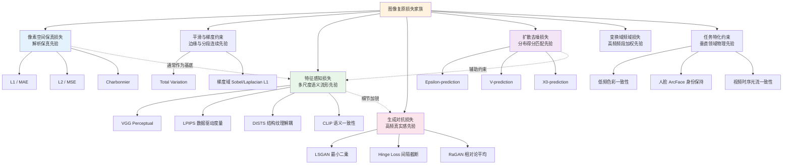

# 第 3 章 · 损失函数全景

> 图像复原与增强模型的优化目标几乎从不依赖单一损失。剖析多目标损失的设计机理与加权配比，是实现高质量复原的关键工程基石。

## 3.0 读这一章之前

第 2 章将计算空间解耦为预测空间、损失空间与评估空间三个独立维度。本章聚焦于第二个维度：**当优化一个图像增强网络时，标量损失函数究竟由哪些项构成、各自分别惩罚何种物理与统计误差，以及为何必须采用多项加权混合机制。**

读完本章，你将能够系统解答以下工程问题：

- 为什么均方误差 L2（MSE）在统计数学上形式优美，在实际画质优化中却系统性落后于 L1 与 Charbonnier 损失
- Charbonnier 损失相比基础 L1 与 Smooth L1 具备哪些训练动力学优势，为何成为低层视觉的默认基准
- 像素级保真损失、特征级感知损失、生成对抗损失与扩散去噪损失的核心分工与适用边界
- 面对全新增强任务时，如何依据先验需求确定各类损失项的初始权重基准
- 如何通过多任务分项损失曲线的演化特征，精准定位网络欠拟合、伪影放大或模式崩塌等训练故障

预设背景：掌握第 2 章关于像素空间、特征空间与潜空间的定义；理解基于高斯与拉普拉斯分布的最大似然估计（MLE）推导（L1 与 L2 损失的收敛特性本质上源于这两种概率假设的几何形态差异）。

**本章首次出现的缩写与专业术语：**

- **MSE**（Mean Squared Error，均方误差）：对应像素空间 L2 范数的统计度量
- **MAE**（Mean Absolute Error，平均绝对误差）：对应像素空间 L1 范数的统计度量
- **TV**（Total Variation，总变差）：基于相邻像素梯度幅值构建的各向同性或各向异性正则项，鼓励画面分段平滑
- **GAN**（Generative Adversarial Network，生成对抗网络）：由生成网络与判别网络构成的极小极大对抗优化体系
- **LSGAN**（Least Squares GAN，最小二乘对抗网络）：以 MSE 取代二元交叉熵作为判别器回归目标的对抗变体
- **Hinge Loss**（合页损失）：引入间隔截断机制的对抗损失，为现代大尺度 GAN 的主流标准
- **RaGAN**（Relativistic Average GAN，相对论平均对抗网络）：判别器评估真实样本优于虚假样本相对概率的对抗范式，为 ESRGAN 默认方案
- **R1 / R2 正则**：对真实或生成样本施加判别器梯度范数惩罚的平滑正则项
- **TTUR**（Two-Time-Scale Update Rule，双时间尺度更新规则）：判别器与生成器采用非对称学习率进行交替优化的训练策略
- **FFL**（Focal Frequency Loss，焦点频率损失）：在正交频域对难学高频分量进行动态自适应加权的损失函数
- **SNR**（Signal-to-Noise Ratio，信噪比）：扩散生成过程中表征信号与噪声相对能量密度的核心状态量
- **ArcFace**：基于加性角度间隔的人脸识别特征嵌入网络，用于构建人脸身份一致性损失

## 3.1 多目标损失的必要性与先验权衡

在大语言模型（LLM）预训练中，优化目标通常统一为自回归的 Next-Token 交叉熵；图像分类与目标检测任务亦主要依赖交叉熵与边界框几何损失。

然而在图像复原与超分辨率领域，单一的标量损失函数无法胜任任务需求，损失函数普遍呈现为多目标复合形式：

$$
\mathcal{L} = \lambda_{\text{pixel}} \mathcal{L}_{\text{pixel}} + \lambda_{\text{percep}} \mathcal{L}_{\text{perceptual}} + \lambda_{\text{adv}} \mathcal{L}_{\text{adversarial}} + \lambda_{\text{aux}} \mathcal{L}_{\text{aux}}
$$

采用多项损失加权混合的根本诱因源于以下物理与统计机理：

1. **不适定逆问题依赖多重先验的交集约束**：每个独立的损失项均对应了一种物理或统计先验的数学表征，多损失联合优化等价于在多重先验约束构成的流形交集内搜索候选解。
2. **不同损失函数主导不同的频段能量响应**：L1/Charbonnier 稳固低频基底与宏观几何骨架，感知损失激活中高频语义结构，对抗与扩散损失则驱动亚像素级的随机微观质感。
3. **单一损失函数必然诱发解空间的单向退化**：纯像素级回归诱发平滑均值陷阱，纯对抗损失诱发不可控的结构幻觉伪影，纯高层语义距离则易导致微观轮廓与色彩基准的漂移。

从先验映射视角审视：像素级 L1/L2 与 TV 属于**解析先验**（约束像素代数对齐且保持分段连续）；VGG/CLIP 特征距离属于**数据驱动先验**（约束深度特征流形对齐）；对抗与扩散损失属于**生成式先验**（强制解落入自然图像的真实数据分布曲面）。模型最终的生成质量，完全取决于各类先验梯度在反向传播过程中的动态制衡。



## 3.2 像素空间保真损失

像素空间损失直接度量预测张量 $\hat{x}$ 与真值张量 $x$ 之间的逐点代数残差，是保证图像全局几何结构与色彩不发生发散的锚定基底。

### L2（MSE）：数学性质良好但工程表现受限

$$
\mathcal{L}_2 = \frac{1}{N} \sum_i (\hat{x}_i - x_i)^2
$$

数学统计属性：

- 对应测量噪声服从零均值高斯独立同分布假设下的对数极大似然估计
- 处处连续可微，属于凸优化目标
- 在数学上直接对应峰值信噪比（PSNR）的代数优化目标

但在工程落地中存在明显缺陷：

1. **异常值敏感性**：误差以平方级放缩，个别显著偏差的奇异点将产生过大梯度并主导参数更新方向
2. **条件均值平滑陷阱**：在不适定逆问题中，最小化 L2 期望误差 $\mathbb{E}[||\hat{x} - x||^2]$ 的理论最优解为后验条件均值 $\mathbb{E}[x | y]$。多个合理高频候选解的加权均值在空间上直接表现为高频细节的抵消与弥散模糊
3. **感知非对齐**：无法反映人类视觉系统对边缘和纹理的敏感度

目前在低层视觉中，纯 L2 损失主要局限于扩散模型的去噪得分匹配（Score Matching）公式，其余判别式复原网络均已转向 L1 或其平滑变体。

### L1（MAE）：工业界主流基础损失

$$
\mathcal{L}_1 = \frac{1}{N} \sum_i |\hat{x}_i - x_i|
$$

数学统计属性：

- 对应测量噪声服从拉普拉斯分布假设下的极大似然估计
- 最小化 L1 期望误差 $\mathbb{E}[||\hat{x} - x||_1]$ 的解为后验条件中位数 $\text{median}(x | y)$
- **抗离群点鲁棒性**：大误差项的梯度幅值恒为常数 $\pm 1$，不会被局部异常点破坏全局梯度方向

工程表现：相比 L2，以 L1 训练的网络能生成边缘更为清晰的图像，是绝大多数判别式复原模型（如 Restormer、NAFNet、HAT）的基础像素损失。

### Charbonnier 损失：可微平滑的增强版 L1

$$
\mathcal{L}_{\text{Charb}} = \frac{1}{N} \sum_i \sqrt{(\hat{x}_i - x_i)^2 + \epsilon^2}
$$

参数 $\epsilon$ 通常设为 $10^{-3}$ 或 $10^{-6}$。

- 当绝对误差 $|e| \gg \epsilon$ 时，函数渐进逼近标准 L1 范数，保持对异常值的鲁棒性
- 当绝对误差 $|e| \ll \epsilon$ 时，函数在一阶导数上平滑过渡至 L2 范数，梯度平滑衰减至零

```python
import torch

def charbonnier_loss(pred: torch.Tensor, target: torch.Tensor,
                     eps: float = 1e-3) -> torch.Tensor:
    """Charbonnier 损失：Smooth L1 的连续可微版本。
    相比原生 L1 具有更稳定的后期收敛特性，是低层视觉事实上的标准配置。
    """
    diff = pred - target
    return torch.sqrt(diff * diff + eps * eps).mean()
```

三种像素损失的梯度动力学特性对比如下：

| 误差区间 | 原生 L2 梯度（$2e$） | 原生 L1 梯度（$\text{sign}(e)$） | Charbonnier 梯度（$e / \sqrt{e^2+\epsilon^2}$） |
|---------|-------------------|-----------------------------|--------------------------------------------|
| 极小误差（$|e| \ll \epsilon$） | 接近 0（梯度过早衰减） | $\pm 1$（在真值附近震荡） | 平滑衰减至 0（稳定收敛） |
| 常规误差（$|e| \approx 1$） | 线性正比于 $e$ | 恒定 $\pm 1$ | 逼近 $\pm 1$ |
| 极端误差（$|e| \gg 1$） | 梯度爆炸（主导更新） | 恒定 $\pm 1$（鲁棒截断） | 恒定 $\pm 1$（鲁棒截断） |

## 3.3 平滑性与梯度域约束

像素损失仅作用于单点数值对齐，缺乏对局部空间导数（空间连续性与边缘结构）的显式约束。

### Total Variation（总变差正则项）

$$
\mathcal{L}_{\text{TV}} = \sum_{i,j} \left( |\hat{x}_{i+1,j} - \hat{x}_{i,j}| + |\hat{x}_{i,j+1} - \hat{x}_{i,j}| \right)
$$

TV 损失惩罚相邻像素的一阶差分幅度，核心作用在于抑制平坦区域的高频伪影并保持边缘跃变（鼓励分段常数平滑）。

```python
def total_variation_loss(x: torch.Tensor) -> torch.Tensor:
    """各向异性总变差损失（Anisotropic Total Variation）。
    x: (B, C, H, W)
    """
    dh = (x[:, :, 1:, :] - x[:, :, :-1, :]).abs().mean()
    dw = (x[:, :, :, 1:] - x[:, :, :, :-1]).abs().mean()
    return dh + dw
```

工程使用准则：在去噪或生成对抗模型中，平坦区域容易产生高频棋盘格伪影或随机噪斑，引入极小权重的 TV 正则（权重通常在 $\lambda = 10^{-5}$ 至 $10^{-3}$ 区间）可有效平抑伪影；过大权重会导致细节丢失与画面阶梯化。

### 梯度域 L1 损失

通过一阶微分卷积核（如 Sobel 算子）显式提取空间梯度图，并在梯度域计算 L1 距离：

$$
\mathcal{L}_{\text{grad}} = ||\nabla \hat{x} - \nabla x||_1
$$

```python
import torch.nn.functional as F

SOBEL_X = torch.tensor([[-1., 0., 1.],
                        [-2., 0., 2.],
                        [-1., 0., 1.]]).view(1, 1, 3, 3)
SOBEL_Y = SOBEL_X.transpose(-1, -2)

def gradient_loss(pred: torch.Tensor, target: torch.Tensor) -> torch.Tensor:
    """梯度域 L1 损失：强制预测图边缘分布与真值严格几何对齐。
    pred, target: (B, C, H, W), 取值范围 [0, 1]
    """
    sobel_x = SOBEL_X.to(pred).expand(pred.shape[1], 1, 3, 3)
    sobel_y = SOBEL_Y.to(pred).expand(pred.shape[1], 1, 3, 3)

    pred_gx = F.conv2d(pred, sobel_x, padding=1, groups=pred.shape[1])
    pred_gy = F.conv2d(pred, sobel_y, padding=1, groups=pred.shape[1])
    targ_gx = F.conv2d(target, sobel_x, padding=1, groups=target.shape[1])
    targ_gy = F.conv2d(target, sobel_y, padding=1, groups=target.shape[1])

    return (pred_gx - targ_gx).abs().mean() + (pred_gy - targ_gy).abs().mean()
```

适用场景：在去模糊（Deblurring）与文档文字增强等强边缘依赖任务中，梯度损失可作为轻量级边缘锐化约束。

## 3.4 特征空间感知损失家族

### VGG 感知损失与 LPIPS

在第 2 章中已介绍 VGG 激活感知损失。在此进一步明确 **经典 VGG Perceptual Loss** 与 **LPIPS** 的工程差异：

- **经典 VGG 损失**：人工指定抽取层（如 relu2_2, relu3_3, relu4_3），各通道特征权重统一设为 1，直接计算 L1/L2。在网络训练中梯度稳定，是生成模型的主流特征损失。
- **LPIPS**：通过在 BAPPS 主观感知数据集上拟合线性加权头，对特征通道赋予学习出的重要性权重。其在评估人类感知相似度上显著优于原生 VGG，但作为训练损失直接反传时易受到特征对抗样本攻击（针对 LPIPS 判别头的过拟合），因此通常作为评估指标使用。

### DISTS：结构与纹理显式解耦度量

DISTS 将图像质量拆解为空间结构相似度与通道纹理统计相似度。其核心数学特性在于**纹理项对空间绝对位移具有不变性**。在生成草地、毛发、织物及水波等随机高频纹理时，真值与预测的微小空间错位不会导致 DISTS 损失剧增，有效规避了传统感知损失在生成式纹理任务中的过度惩罚问题。

### CLIP 语义一致性损失

将图像输入预训练 CLIP 视觉编码器，计算归一化特征向量的余弦相似度：

$$
\mathcal{L}_{\text{CLIP}} = 1 - \cos\left(E_{\text{CLIP}}(\hat{x}), E_{\text{CLIP}}(x)\right)
$$

在潜空间扩散超分辨率任务中，扩散先验可能为了构建局部逼真纹理而改变物体语义（如将文字改变为无意义图案）。以小权重（如 $\lambda = 0.01$）引入 CLIP 语义损失，可在特征流形顶层锚定全局语义，杜绝生成过程中的语义漂移。

## 3.5 生成对抗损失（GAN Losses）

对抗损失的核心工程价值在于：**强迫生成器输出分布拟合自然图像流形，消除后验均值平滑效应，生成高频微观结构。**

### 经典损失变体的演进对比

1. **Vanilla GAN（极小极大对数交叉熵）**：判别器过强时生成器梯度迅速饱和，工程上极易发散，严禁直接在图像增强中使用。
2. **LSGAN（最小二乘回归）**：以均方误差取代 Sigmoid 交叉熵，将判别器输出拉向固定代数目标（1 与 0），梯度平滑不饱和，训练稳定。
3. **Hinge Loss（合页截断）**：设定边界间隔（Margin），当判别器对真假样本的分类裕量超出阈值后停止施加梯度，是大尺度生成模型的标准选择。
4. **Relativistic average GAN（RaGAN）**：判别器评估“真实样本比生成样本更显真实的相对概率”，使判别器梯度同时受真假双侧样本约束，为 ESRGAN 与 Real-ESRGAN 的默认配置。

```python
def relativistic_d_loss(d_real: torch.Tensor, d_fake: torch.Tensor) -> torch.Tensor:
    """RaGAN 判别器端损失（ESRGAN / Real-ESRGAN 配置）。"""
    real_logits = d_real - d_fake.mean()
    fake_logits = d_fake - d_real.mean()
    return (F.binary_cross_entropy_with_logits(real_logits, torch.ones_like(real_logits))
          + F.binary_cross_entropy_with_logits(fake_logits, torch.zeros_like(fake_logits)))


def relativistic_g_loss(d_real: torch.Tensor, d_fake: torch.Tensor) -> torch.Tensor:
    """RaGAN 生成器端损失。
    调用前 d_real 与 d_fake 对应判别器前向结果，且在 G 优化步中必须冻结 D 的参数。
    """
    real_logits = d_real - d_fake.mean()
    fake_logits = d_fake - d_real.mean()
    return (F.binary_cross_entropy_with_logits(fake_logits, torch.ones_like(fake_logits))
          + F.binary_cross_entropy_with_logits(real_logits, torch.zeros_like(real_logits)))
```

### 判别器架构与训练稳定性正则化

- **PatchGAN 局部判别器**：不输出全局标量，而是输出 $h' \times w'$ 的网格概率图，每个感受野独立判别局部真实性，天然支持任意分辨率输入。
- **R1 梯度惩罚正则**：对判别器在真实样本处的输入梯度施加 L2 范数平方惩罚，压制判别器在真实数据流形局部的剧烈梯度突变：

$$
\mathcal{L}_{R1} = \frac{\gamma}{2} \mathbb{E}_{x \sim p_{\text{data}}} \left[ ||\nabla_x D(x)||^2 \right]
$$

- **谱归一化（Spectral Normalization）**：除以权重矩阵的最大奇异值，严格限制判别器各层的 Lipschitz 常数。

## 3.6 扩散去噪损失（Diffusion Losses）

扩散模型在连续时间步 $t \in [0, T]$ 下执行加噪与去噪，其优化目标建立在得分匹配（Score Matching）理论框架之上。

### 预测目标的数学形式

1. **$\epsilon$-prediction（噪声预测）**：网络直接预测前向步骤注入的高斯白噪声 $\epsilon$：

$$
\mathcal{L}_{\text{simple}} = \mathbb{E}_{t, x_0, \epsilon} \left[ ||\epsilon - \epsilon_\theta(x_t, t)||^2 \right]
$$

2. **$v$-prediction（速度预测）**：将信号与噪声线性正交组合进行统一建模：

$$
v_t = \sqrt{\bar{\alpha}_t} \cdot \epsilon - \sqrt{1 - \bar{\alpha}_t} \cdot x_0
$$

$v$-prediction 在全时间步区间内保持数值尺度的均匀稳定性，显著缓解了小时间步（低噪声区）信噪比不平衡的问题。

3. **$x_0$-prediction（直接终点预测）**：在图像复原任务中直接回归无损信号 $x_0$，在严重不适定条件下结合 Min-SNR 加权能够加快几何结构的收敛。

### Min-SNR 时间步重加权机制

由于各时间步 $t$ 下的信噪比 $\text{SNR}(t) = \bar{\alpha}_t / (1 - \bar{\alpha}_t)$ 跨越数个数量级，直接对全时间步损失取平均会导致网络过度拟合极端低噪声区间（此时预测退化为恒等映射）。Min-SNR 加权（Hang et al. 2023）通过对高 SNR 步长施加截断权重，实现跨时间步梯度的均匀平衡：

$$
w(t) = \frac{\min\left(\text{SNR}(t), \gamma\right)}{\text{SNR}(t)}, \quad \gamma = 5.0
$$

```python
import torch

def min_snr_weight(t: torch.Tensor, alphas_cumprod: torch.Tensor,
                   gamma: float = 5.0) -> torch.Tensor:
    """Min-SNR 损失时间步重加权机制。
    t: (B,) 时间步索引
    alphas_cumprod: (T,) 扩散调度器累积方差张量
    返回: (B,) 各样本当前时间步的损失缩放系数
    """
    a = alphas_cumprod[t]
    snr = a / (1.0 - a).clamp(min=1e-8)
    return snr.clamp(max=gamma) / snr
```

## 3.7 频域损失：Focal Frequency Loss

在正交频域计算预测与真值的功率谱差分，能够对网络因 Spectral Bias 导致的欠拟合频段进行显式补偿。

```python
import torch

def focal_frequency_loss(pred: torch.Tensor, target: torch.Tensor,
                         alpha: float = 1.0) -> torch.Tensor:
    """Focal Frequency Loss (FFL, Jiang et al. 2021)。
    执行二维正交 FFT 变换，动态加权难学习的频域分量。
    pred, target: (B, C, H, W)
    """
    pred_fft   = torch.fft.fft2(pred,   norm='ortho')
    target_fft = torch.fft.fft2(target, norm='ortho')

    diff = pred_fft - target_fft
    distance = (diff.real ** 2 + diff.imag ** 2)

    # 依据频域误差幅度自适应计算 Focal 加权矩阵
    weight = distance.detach() ** alpha
    weight = weight / (weight.max() + 1e-8)

    return (weight * distance).mean()
```

工程经验：FFL 适合作为辅助正则项（权重通常设为 $0.01$ 至 $0.05$）与像素 L1 联合使用，能显著改善大倍率超分辨率中的频带塌陷现象。

## 3.8 垂直领域任务特化损失

### 颜色一致性损失（色彩防漂移）

在 GAN 或扩散模型长时间对抗训练中，网络容易为了最大化纹理锐度而产生全局色彩偏温或偏冷。通过对预测图与原图执行大尺度均值滤波（去除高频几何结构）后计算 L1 距离，可强制锁定全局色彩骨架：

```python
def color_consistency_loss(pred: torch.Tensor, target: torch.Tensor) -> torch.Tensor:
    """大核空间均值模糊后计算 L1，约束低频色调与亮度不发生漂移。"""
    pred_blur   = F.avg_pool2d(pred,   kernel_size=11, stride=1, padding=5)
    target_blur = F.avg_pool2d(target, kernel_size=11, stride=1, padding=5)
    return F.l1_loss(pred_blur, target_blur)
```

### 身份一致性损失（人脸盲复原专用）

在老照片人脸修复（如 CodeFormer、GFPGAN）中，借助预训练 ArcFace 提取人脸特征嵌入向量，计算余弦相似度，避免生成模型将目标人脸特征替换为通用人脸模板：

```python
class IdentityLoss(nn.Module):
    """基于预训练 ArcFace 的人脸身份保持损失。"""
    def __init__(self, arcface_model: nn.Module):
        super().__init__()
        self.arcface = arcface_model.eval()
        for p in self.arcface.parameters():
            p.requires_grad_(False)

    def forward(self, pred: torch.Tensor, target: torch.Tensor) -> torch.Tensor:
        emb_pred   = self.arcface(pred)
        emb_target = self.arcface(target)
        return 1.0 - F.cosine_similarity(emb_pred, emb_target).mean()
```

## 3.9 多目标混合策略与两阶段训练范式

### 经典配方参数表

- **ESRGAN 经典配方**：$\mathcal{L}_G = 0.01 \mathcal{L}_1 + 1.0 \mathcal{L}_{\text{percep}} + 0.005 \mathcal{L}_{\text{RaGAN}}$
  - 核心逻辑：极度压低像素 L1 权重，由中深层感知损失与弱对抗损失共同主导锐利质感。
- **Real-ESRGAN 配方**：$\mathcal{L}_G = 1.0 \mathcal{L}_1 + 1.0 \mathcal{L}_{\text{percep}} + 0.1 \mathcal{L}_{\text{RaGAN}}$
  - 核心逻辑：由于训练输入包含高阶真实退化，需同时保持高强度像素锚定与对抗驱动。
- **现代潜空间扩散配方（SUPIR）**：$\mathcal{L} = \mathcal{L}_{v\text{-pred}} + 0.1 \mathcal{L}_{\text{latent-LPIPS}} + 0.1 \mathcal{L}_{\text{pixel-L1}} + 0.01 \mathcal{L}_{\text{CLIP}}$
  - 核心逻辑：潜空间扩散得分匹配为主损失，级联像素 L1 防止 VAE 解码器色偏，辅以 CLIP 防止语义幻觉。

### 两阶段工程训练标准流水线

在包含对抗损失的训练中，严禁从随机初始化权重直接开启全量对抗训练。标准工程路径必须遵循**两阶段收敛策略**：

1. **阶段一（预训练 Pre-training）**：仅启用像素级保真损失（L1 / Charbonnier），将模型训练至 PSNR 指标平稳收敛。此阶段使网络学习到基础的全局几何对齐与去噪映射。
2. **阶段二（微调 Fine-tuning）**：以阶段一收敛的模型权重初始化生成器，将生成器学习率下调一个数量级（例如由 $1 \times 10^{-4}$ 降至 $1 \times 10^{-5}$），引入感知损失与对抗损失，并对判别器与对抗权重执行线性 Warmup。在此阶段，PSNR 会发生轻微回落，但 LPIPS 与主观感知质量将实现质的跃升。

### 训练曲线多指标异常诊断矩阵

在训练监控中，必须对各分项损失进行解耦记录：

| 异常表征 | 底层物理诱因 | 标准工程调优方向 |
|---------|-------------|-----------------|
| 像素损失收敛但 LPIPS 停滞不前 | 模型陷入后验条件均值平滑态 | 提升感知损失权重或引入对抗判别器 |
| 对抗损失呈现高频剧烈震荡 | 判别器过强导致生成器梯度失效 | 调整 D/G 学习率比值、引入 R1 正则或谱归一化 |
| 训练初期生成器损失发生数值爆炸 | 未经阶段一预训练直接施加对抗损失 | 回退至阶段一，先用 L1 训练至基础几何对齐 |
| 感知损失先降后升并伴随高频点状伪影 | 针对特征提取器（如 VGG）的对抗过拟合 | 混合多尺度特征层，或引入 DISTS/LPIPS 联合约束 |
| 生成图像全局色调发生系统性偏移 | 缺乏低频色彩锚定，对抗损失优化了局部色阶 | 引入色彩一致性损失，或在 YCbCr 色度通道加重 L1 |

## 3.10 增强任务损失决策基准表

| 任务类型 | 主干主损失 | 推荐辅助正则项 | 典型架构参考 |
|---------|-----------|---------------|-------------|
| **经典超分（PSNR 导向）** | Charbonnier 损失 | 无 | RCAN / NAFNet / HAT |
| **真实场景盲超分（感知导向）** | L1 + VGG 感知 + RaGAN | + 0.05 FFL + 0.01 色彩一致性 | Real-ESRGAN / BSRGAN |
| **通用图像去噪** | Charbonnier 损失 | + 0.001 TV 正则 | Restormer / NAFNet |
| **真实图像去模糊** | Charbonnier + 梯度 L1 | + 0.1 VGG 感知 | Restormer / MIMO-UNet |
| **人脸结构盲复原** | L1 + VGG + Hinge GAN | + 0.5 ArcFace 身份保持损失 | CodeFormer / GFPGAN |
| **生成式扩散超分** | $v$-prediction MSE | + 0.1 潜空间 LPIPS + 0.01 CLIP | SUPIR / StableSR / DiffBIR |
| **视频超分辨率** | Charbonnier + VGG 感知 | + 光流时序一致性 Warp L1 | BasicVSR++ / RealBasicVSR |
| **视频帧插值** | Charbonnier + LapPyr | + 光流平滑度正则 | RIFE / EMA-VFI |

调参执行序列：

1. 确立基准：先以 Charbonnier 损失跑通训练基线，记录稳态 PSNR
2. 感知增强：加入权重为 $0.1$ 至 $1.0$ 的 VGG 损失，观察 LPIPS 收益
3. 对抗加锐：在预训练模型基础上开启 RaGAN 对抗损失，权重自 $0.005$ 起步调优
4. 伪影抑制：依据生成样本缺陷，针对性引入 FFL、TV 或色彩一致性补丁项

## 3.11 本章小结

1. **增强任务的优化目标本质是多先验约束下的 Pareto 寻优**，单一损失函数无法兼顾保真度与感知真实感。
2. **像素空间首选 Charbonnier 损失**，其在保持 L1 异常值鲁棒性的同时消除了原点梯度振荡。
3. **感知损失构建了特征流形对齐机制**，有效压制了像素空间均方回归的平滑偏置。
4. **生成对抗损失（RaGAN / Hinge）提供了高频纹理驱动力**，必须配合阶段一预训练与判别器正则化以保证稳定性。
5. **扩散去噪损失自成体系**，通过 $v$-prediction 与 Min-SNR 权重重校准能够实现跨时间步梯度的均匀收敛。
6. **垂直领域特化约束**（色彩一致性、人脸身份保持、视频时序光流）为特定物理规律提供了不可逾越的硬性边界。

---

> 下一章 [评估的陷阱](04-metrics.md) → 我们将看到，评估指标在低层视觉中同样具有“立场与系统性偏差”，剖析为何客观指标排名与人类肉眼观感经常发生剧烈背离。
