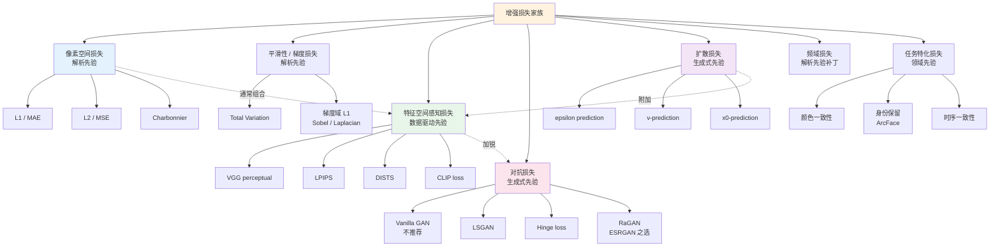
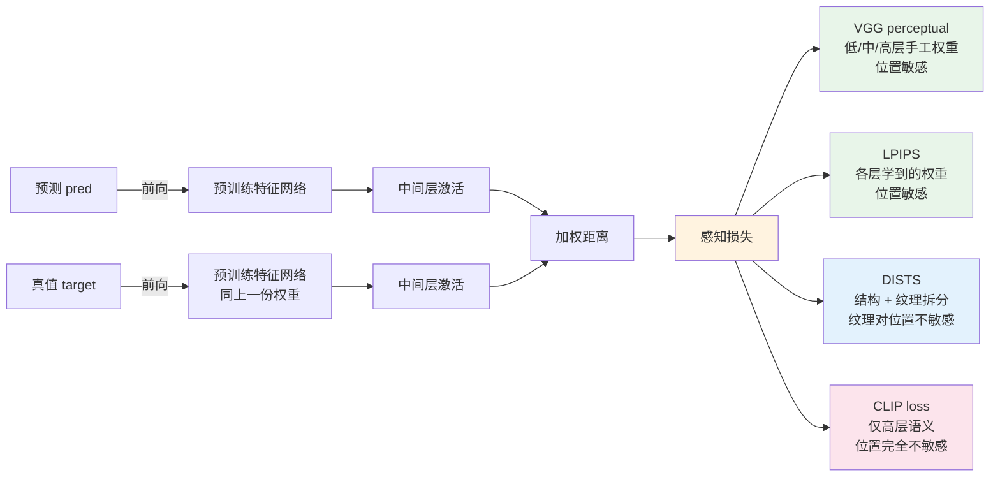

# 第 3 章 · 损失函数全景

> 增强模型的损失，几乎从来不是单一的。理解为什么 - 以及怎么混合 - 是这一章要回答的问题。

## 3.0 读这一章之前

第 2 章把"在哪个空间做事"这件事拆成了三个维度：在哪个空间预测、在哪个空间算损失、在哪个空间评估。这一章专注其中第二个维度。它要回答的问题是：当我们说"训练一个增强模型"时，那个被最小化的标量到底由哪些项构成、每一项各自在惩罚什么、又为什么不能用单独一项。

读完这一章，你应当能回答这些问题：

- 为什么 L2（MSE）数学上最干净却在工程上输给 L1
- Charbonnier 与 smooth L1 是同一回事吗，为什么底层视觉的论文几乎都用它
- 感知损失、对抗损失、扩散损失三个家族之间的边界在哪里
- 一个新任务上，损失项的权重该从哪些数值开始试
- 训练曲线分项观察时，哪些症状提示哪种调整方向

预设的背景：第 2 章读完，知道像素/特征/潜空间各自是什么。需要掌握的最低数学是高斯/拉普拉斯分布的最大似然推导，因为 L1 与 L2 的工程性质几乎都源于这一对分布的形状差异。

**本章首次出现的缩写。** 前两章已经介绍过的不重复。本章会用到的新术语：

- **MSE**（Mean Squared Error，均方误差）：L2 损失的另一种叫法，统计学传统下的命名
- **MAE**（Mean Absolute Error，平均绝对误差）：L1 损失的另一种叫法
- **TV**（Total Variation，总变差）：以相邻像素差的范数作为正则项的损失，鼓励分段平滑
- **GAN**（Generative Adversarial Network，生成对抗网络）：由生成器与判别器博弈训练的生成模型族
- **LSGAN**（Least Squares GAN，最小二乘 GAN）：把判别器输出当作回归目标、用 MSE 做对抗损失的变体
- **Hinge loss**（合页损失）：把判别器输出与一个 margin 做截断的对抗损失，现代 GAN 主流
- **RaGAN**（Relativistic average GAN，相对论平均 GAN）：判别器输出"比对方更像真"的相对判别，ESRGAN 采用
- **R1 / R2 正则**：在判别器对真/假样本加梯度范数惩罚的正则项
- **TTUR**（Two-Time-Scale Update Rule，双时间尺度更新规则）：判别器与生成器用不同学习率
- **FFL**（Focal Frequency Loss，焦点频率损失）：在频域算的加权损失，对难训频段加权
- **SNR**（Signal-to-Noise Ratio，信噪比）：扩散过程中常用的时间步描述量
- **CLIP**（Contrastive Language-Image Pre-training）：图文对齐预训练模型，亦可用于"语义不漂移"约束
- **ArcFace**：人脸识别领域的标准嵌入网络，做人脸身份保留损失时用作特征抽取器

## 3.1 为什么需要这一章

LLM 训练里损失函数基本是一个：next-token cross-entropy。分类任务里也基本是一个：cross-entropy。

影像增强不一样。打开任何一篇主流增强论文，损失函数那一节通常长这样：

$$
\mathcal{L} = \lambda_1 \mathcal{L}_{\text{pixel}} + \lambda_2 \mathcal{L}_{\text{perceptual}} + \lambda_3 \mathcal{L}_{\text{adversarial}} + \lambda_4 \mathcal{L}_{\text{...}}
$$

四五个损失项加权混合。为什么？因为第 1 章和第 2 章已经回答过：

- ill-posed 问题需要先验，**每个损失项就是一种先验的编码方式**
- 不同损失偏好不同的频率成分（L2 偏低频，对抗偏高频，感知偏中高频）
- 单一损失会过度优化某个维度（L2 → 模糊，纯对抗 → 假细节，纯感知 → 颜色漂移）

把"损失项即先验"这句话再展开一下。第 1 章讲过先验有三种来源：解析、数据驱动、生成式。映射到损失函数上：像素 L1/L2 和 TV 是解析先验（"自然图像逐像素接近真值、相邻像素差异稀疏"），感知损失是数据驱动先验（"自然图像在 VGG/CLIP 等预训练特征空间里的位置应当接近真值"），对抗损失和扩散损失是生成式先验（"输出应当落在某个判别器/扩散模型所定义的自然图像分布上"）。一个模型最终输出长什么样，取决于这三类先验权重的具体配比。

这个映射有一个直接的工程推论：**新增一项损失，要先想清楚它编码的是哪种先验，以及和现有损失项的先验是否冲突**。一个常见的反例是把 TV（平滑先验）权重调到很大，同时又加 GAN（高频先验），结果两者打架，模型输出会出现"大块平滑 + 边缘锐利但纹理消失"的诡异质感。损失项的设计本质是先验的设计，先验之间是相互制衡的，没有"加得越多越好"这回事。

> 增强模型的训练，不是"让模型逼近真值"，而是"在多个相互制衡的指标上找一个 Pareto 最优点"。
>
> 损失函数加权 = 你告诉模型，这些指标之间你最关心哪一个。

这套思路与 LLM、分类任务等"单目标"训练的最大差别在于：单目标训练里"更好"是一个全序，损失下降即模型变好；多损失训练里"更好"是一个偏序，某项损失下降可能伴随另一项上升。这意味着你不能只看总损失曲线决定要不要早停或调参，必须分别看每一项损失的曲线。第 11 章会展开这套"分项监控"的具体工具与可视化方法。

这一章把工程上常用的损失项分门别类讲清楚，最后给一张混合策略的决策表。一个工程师读完这一章后，面对任何一个新任务，应当能在十分钟内画出一份初始损失清单（哪些项、各自权重起点），并知道每一项的工程目的是什么。

本章不会展开的内容：每个损失的"为什么这个具体公式而不是别的"的理论推导（散见各原论文），以及损失加权的自动化方法（如 GradNorm、PCGrad，第 11 章会简单提）。这两件事都重要，但不影响读者建立工程直觉，所以本章选择讲清"是什么、何时用、与什么搭配"，而不是"为什么是这个常数"。

先用一张图把所有损失项的家族关系梳理一遍。每一个分支对应的是一类不同的先验，节点之间的虚线箭头表示"通常一起用"。读完后面各节再回头看这张图，应该能在十秒钟内为一个新任务画出它的损失项清单。



## 3.2 像素空间损失

最基础的一类。直接在像素差上算。

### L2（MSE）：数学好用，工程不好用

$$
\mathcal{L}_2 = \frac{1}{N} \sum_i (\hat{x}_i - x_i)^2
$$

数学性质：

- 对应高斯噪声假设的最大似然
- 处处可导，凸
- 直接对应 PSNR 指标

把"对应高斯最大似然"这一条展开两行：假设观测 $y$ 服从 $\mathcal{N}(\hat{x}, \sigma^2 I)$，对数似然是 $-\frac{1}{2\sigma^2} \|y - \hat{x}\|^2 + \text{const}$，去掉常数项与缩放系数后就是 L2。这同时也解释了为什么 L2 在"真实噪声不是高斯"的场景下表现差 - 它优化的是一个错误噪声模型下的对数似然。

工程问题：

- **对异常值敏感**：一个错得很离谱的像素贡献 $error^2$，会主导整个梯度
- **偏向输出均值**：给定 $y$，最小化 $\mathbb{E}[||\hat{x} - x||^2]$ 的解是 $\mathbb{E}[x | y]$，多个合理 $x$ 的均值视觉上是模糊的
- **不对齐感知**：第 2 章 2.7 节已经验证过

实际工程里 L2 现在基本只用在两个地方：

1. **扩散模型的去噪损失**（数学上必须 L2，因为 score matching 推导出来就是这个）
2. **早期消融实验**（作为基线）

第 1 点值得多说一句：扩散模型的 simple loss 本质上是在做"高斯噪声的去噪"，由于训练时加的噪声本身就是高斯，对应的最大似然损失就是 L2。这种情况下 L2 不是"工程妥协"，而是数学最优。这也是为什么扩散模型即便用 L2 也不会输出模糊 - 因为它每一步都只去掉一小步噪声，整个过程是迭代的，不需要一步到位 "找到所有可能 $x$ 的均值"。

### L1（MAE）：现代默认

$$
\mathcal{L}_1 = \frac{1}{N} \sum_i |\hat{x}_i - x_i|
$$

性质：

- 对应拉普拉斯噪声假设的最大似然
- 在 0 处不可导（反正实际中梯度是 sign，工程上不是问题）
- **对异常值更鲁棒**：错得离谱的像素贡献 $|error|$，不会主导梯度

视觉效果：L1 训出来的图比 L2 训出来的更锐利一点。原因：L1 不会被均值"拉平"，给定 $y$，最小化 $\mathbb{E}[||\hat{x} - x||_1]$ 的解是中位数 $\text{median}(x | y)$，比均值更倾向于"某一个具体的合理 $x$"。

**几乎所有非扩散的现代增强模型都用 L1（或 Charbonnier）作为像素损失基础**。

### Charbonnier：L1 的平滑版

$$
\mathcal{L}_{\text{Charb}} = \frac{1}{N} \sum_i \sqrt{(\hat{x}_i - x_i)^2 + \epsilon^2}
$$

$\epsilon$ 通常取 $10^{-3}$ 或 $10^{-6}$。当 $|error| \gg \epsilon$ 时它退化为 L1，当 $|error| \approx 0$ 时它退化为 L2。

为什么用它而不是直接用 L1？

- L1 在 0 附近梯度是 $\pm 1$ 的阶跃，在已经接近真值时**梯度不衰减**，造成训练后期震荡
- Charbonnier 在 0 附近平滑，已经接近真值时梯度自动变小，训练更稳

```python
import torch

def charbonnier_loss(pred: torch.Tensor, target: torch.Tensor,
                     eps: float = 1e-3) -> torch.Tensor:
    """Charbonnier 损失 (smooth L1 的连续版本)。
    比 L1 数值稳定, 比 L2 鲁棒, 是低层视觉的事实标准。
    """
    diff = pred - target
    return torch.sqrt(diff * diff + eps * eps).mean()
```

工程经验：Restormer、NAFNet、SwinIR 等几乎都在论文里写"L1 损失"，但实际代码里很多用 Charbonnier，因为后者训练更稳。

把 L1、L2、Charbonnier 三者的训练动力学放一起对比，更直观。给定一个误差幅度 $e$ 的范围（从极小到极大），三者的梯度行为如下：

- **$|e| \ll \epsilon$**（极小误差）：L2 梯度 $2e \approx 0$，L1 梯度 $\pm 1$，Charbonnier 的梯度是 $e/\sqrt{e^2+\epsilon^2}$，只有落在这个 $|e| \ll \epsilon$ 的极小邻域里才近似 $e/\epsilon$、行为才真正平滑。注意 $\epsilon$ 常取 $10^{-3}$，所以这条平滑带极窄；一旦误差进入 $\epsilon \ll |e| \ll 1$，Charbonnier 的梯度就已经接近 $\pm 1$、和 L1 基本没区别
- **$|e| \approx 1$**：三者梯度都在同一量级
- **$|e| \gg 1$**：L2 梯度 $2e$ 巨大（异常值主导），L1 梯度仍是 $\pm 1$，Charbonnier 梯度 $\approx \pm 1$

由此可知：L2 在 $e$ 大时被异常值压垮、在 $e$ 小时梯度消失；L1 解决了"被异常值压垮"，但在 $e$ 小时梯度仍是 $\pm 1$，靠近真值时会震荡；Charbonnier 在两端各取其优，大 $e$ 时像 L1 一样鲁棒，只有当误差缩小到 $|e| \lesssim \epsilon$ 的极小邻域时梯度才自然衰减到 0、把最后的收敛磨得平稳。也正因为这条平滑带只有 $\epsilon$ 量级那么窄，Charbonnier 在绝大多数训练区间里的行为其实与 L1 几乎相同，它带来的稳定性收益集中在"已经非常接近真值"的收尾阶段。这三者的差异表面上只是公式略有不同，工程上的后果差几个百分点 PSNR，是值得在心里建立的直觉。

## 3.3 平滑性 / 梯度损失

像素损失只看每个点对每个点。**梯度损失**看相邻点的差。

### Total Variation

$$
\mathcal{L}_{\text{TV}} = \sum_{i,j} \left( |\hat{x}_{i+1,j} - \hat{x}_{i,j}| + |\hat{x}_{i,j+1} - \hat{x}_{i,j}| \right)
$$

它惩罚相邻像素的差，鼓励**分段平滑**：内部平、边缘锐利。

```python
def total_variation_loss(x: torch.Tensor) -> torch.Tensor:
    """TV 损失 (各向异性版本)。
    x: (B, C, H, W)
    """
    dh = (x[:, :, 1:, :] - x[:, :, :-1, :]).abs().mean()
    dw = (x[:, :, :, 1:] - x[:, :, :, :-1]).abs().mean()
    return dh + dw
```

何时用：

- **去噪场景**：TV 是经典先验，能抑制噪点
- **生成模型**：扩散/GAN 模型容易在平坦区域产生纹理伪影，加 TV 能压住
- **工程上权重很小**（通常 $\lambda = 10^{-5}$ 到 $10^{-3}$），权重大了会糊掉细节

TV 损失有"各向异性"（anisotropic，分别算水平和竖直）和"各向同性"（isotropic，算梯度模长）两种公式。前者实现简单、梯度稀疏，鼓励产生水平或垂直方向的边缘；后者更对称，但梯度密一些。各向同性的版本在天空、肤色这种连续区域更自然，各向异性的版本在文档、建筑这种规则结构上更好。两者效果差异在 PSNR 上很小，但在视觉质量上很容易看出来，选哪个取决于你的应用图像类型。

### 梯度域损失

更精细的版本：在梯度域算 L1。

$$
\mathcal{L}_{\text{grad}} = ||\nabla \hat{x} - \nabla x||_1
$$

```python
import torch.nn.functional as F

# Sobel kernels
SOBEL_X = torch.tensor([[-1., 0., 1.],
                        [-2., 0., 2.],
                        [-1., 0., 1.]]).view(1, 1, 3, 3)
SOBEL_Y = SOBEL_X.transpose(-1, -2)

def gradient_loss(pred: torch.Tensor, target: torch.Tensor) -> torch.Tensor:
    """梯度域 L1 损失。强迫预测的边缘和真值边缘对齐。
    pred, target: (B, C, H, W), 假设值域 [0, 1]
    """
    sobel_x = SOBEL_X.to(pred).expand(pred.shape[1], 1, 3, 3)
    sobel_y = SOBEL_Y.to(pred).expand(pred.shape[1], 1, 3, 3)

    pred_gx = F.conv2d(pred, sobel_x, padding=1, groups=pred.shape[1])
    pred_gy = F.conv2d(pred, sobel_y, padding=1, groups=pred.shape[1])
    targ_gx = F.conv2d(target, sobel_x, padding=1, groups=target.shape[1])
    targ_gy = F.conv2d(target, sobel_y, padding=1, groups=target.shape[1])

    return (pred_gx - targ_gx).abs().mean() + (pred_gy - targ_gy).abs().mean()
```

何时用：

- 边缘非常重要的任务（去模糊、文档增强）
- 作为感知损失的轻量替代

Sobel 与 Laplacian 两种核都常用。Sobel 是一阶差分，对方向敏感；Laplacian 是二阶差分，对方向不敏感但对噪声更敏感。一阶在去模糊任务上更主流，二阶在文档增强（强调"边缘但不在乎方向"）任务上更常见。两者也可以一起用，但权重要拆开调，否则二阶的噪声敏感性会污染整体训练。

更进一步的版本是**多尺度梯度损失**：把原图与预测都用高斯金字塔下采样几次，在每个尺度上分别算梯度损失，再加权求和。这在 4× 或 8× 超分上比单尺度梯度损失明显更好，因为不同尺度的边缘需要在对应尺度上对齐。

## 3.4 感知损失

第 2 章已经介绍过 VGG perceptual loss（在预训练 VGG 的中间层激活上算 L1/L2，特征空间对齐人眼感知）。这里补充另外几个变体，并在这一节末尾给一张感知损失家族的"层级取舍图"。

### LPIPS

LPIPS（Learned Perceptual Image Patch Similarity）是 2018 年的工作，本质是**手工权重的感知损失换成数据驱动**：

1. 用 AlexNet/VGG/SqueezeNet 提特征
2. **对每层特征加一个学习出来的线性权重**（在大量人类感知判断的数据上训）
3. 把加权后的距离当作感知距离

它比 VGG perceptual loss 更对齐人眼。但**作为损失训练**时有几个坑：

- 计算量比 VGG 大
- 在某些纹理上有偏差
- 直接用作主损失容易让模型生成"游戏化"输出（针对 LPIPS 优化但视觉差）

实际工程里 LPIPS 更多作为**评估指标**用，第 4 章详谈。作为损失时仍以 VGG 为主。

把 LPIPS 与 VGG perceptual loss 的工程区别再点一下：VGG 损失的所有层权重是 1，所有通道权重也是 1，只是简单的逐特征 L1/L2；LPIPS 的每一层、每一通道权重都是从大量人类感知判断数据里学出来的（详见第 4 章对 BAPPS 的展开）。这个差别让 LPIPS 在**评估**上比 VGG 距离对齐人眼显著好，但在**训练**上反而不如 VGG 稳。原因是 LPIPS 的学习头本身可能对输入分布敏感（在 BAPPS 训出来的权重，对训练分布外的图像未必鲁棒），用它当损失反传时容易引出"对 LPIPS 内部学习头的对抗优化"。

### DISTS

DISTS（Deep Image Structure and Texture Similarity）是 2020 年的工作，把感知损失分成结构和纹理两部分。它的特点是**对位置不敏感**：同样的纹理在不同位置不会被惩罚。

何时用：纹理生成任务（皮肤、毛发、布料），DISTS 比 VGG 更合适。

### CLIP loss

把图过 CLIP image encoder，在 CLIP 特征空间算距离。

性质：

- 对**语义内容**敏感，对低层细节不敏感
- 适合做"内容保持"约束，不适合做主损失
- 在生成式增强（diffusion）里用得多，判别式增强里少

工程经验：单独用 CLIP loss 训不出好的增强模型，但**把它作为正则项**（权重 0.01）能保证模型不"漂移" - 比如修复一张猫照片不会变成狗。

CLIP 与 VGG/LPIPS 的另一个关键差别是它对"图像-文本对齐"敏感。这意味着 CLIP 距离不仅约束"两张图视觉上像"，还约束"两张图描述出来的文字像"。在生成式增强里这一点价值很大：扩散模型可能为了优化纹理损失而把人脸"美化"到与原人不一致的程度，CLIP 距离能在语义层面把这种漂移拉回来。第 9 章会讨论 SUPIR 这类模型里 CLIP loss 的具体配置。

把上面四个感知损失变体放在一起对比，它们在"特征空间的语义层级"和"对位置的敏感度"两个维度上分布如下。读者可以根据任务在这两个维度里挑合适的工具。



## 3.5 对抗损失

GAN 损失是这本书最复杂、最容易踩坑、也最关键的损失类型之一。它的角色：**让模型生成真实细节**，不再"安全地输出模糊"。

### Vanilla GAN：不要直接用

原始 GAN 损失：

$$
\min_G \max_D \mathbb{E}_{x \sim p_{\text{data}}} [\log D(x)] + \mathbb{E}_{z \sim p_z} [\log(1 - D(G(z)))]
$$

这里的 $G$ 是生成器、$D$ 是判别器。需要提醒一句：本章的 $D$ 一律指判别器，和第 1 章记号约定里的退化算子 $D$ 不是同一个东西，只是历史习惯上都用了字母 $D$，读到时按所在语境区分即可。

理论好但工程上**极不稳定**：

- 梯度消失：当 $D$ 训得太好时，$\log(1 - D(G(z)))$ 在 $D(G(z)) \to 0$ 时梯度饱和
- 模式崩溃（mode collapse）：$G$ 输出趋向单一模式
- 训练发散：$D$ 和 $G$ 无法达到 Nash 均衡

实际工程不用 vanilla GAN，用下面的变体。

下面三种变体的发展顺序大致是 LSGAN（2017）→ Hinge（2017-2018，BigGAN/SAGAN）→ RaGAN（2018，ESRGAN）。它们都在不同程度上解决 vanilla GAN 的稳定性问题，区别在于"加什么约束"。LSGAN 通过把 sigmoid + log 换成 MSE 防止梯度饱和；Hinge 通过 margin 截断防止判别器对已分得很开的样本继续推；RaGAN 通过相对论判别让判别器同时关心真假两侧的相对位置。三者在不同任务上各有优势，超分场景以 RaGAN 为主，文生图场景以 Hinge 为主，传统恢复场景以 LSGAN 为主。

### LSGAN：简单稳定

把 sigmoid + log 替换成 MSE：

$$
\mathcal{L}_D = \frac{1}{2}\mathbb{E}[(D(x) - 1)^2] + \frac{1}{2}\mathbb{E}[(D(G(z)))^2]
$$
$$
\mathcal{L}_G = \frac{1}{2}\mathbb{E}[(D(G(z)) - 1)^2]
$$

性质：梯度不饱和、训练稳定、超参数好调。

### Hinge loss：现代 GAN 标准

$$
\mathcal{L}_D = -\mathbb{E}[\min(0, D(x) - 1)] - \mathbb{E}[\min(0, -D(G(z)) - 1)]
$$
$$
\mathcal{L}_G = -\mathbb{E}[D(G(z))]
$$

性质：当 $D$ 已经分得很开时不再继续推（margin），训练更稳。BigGAN、StyleGAN 等都用这个。

```python
def hinge_d_loss(d_real: torch.Tensor, d_fake: torch.Tensor) -> torch.Tensor:
    """Hinge 损失 (判别器一侧)。
    d_real, d_fake: 判别器对真/假图的输出 logits, shape (B,) 或 (B, 1, h', w')
    """
    loss_real = F.relu(1.0 - d_real).mean()
    loss_fake = F.relu(1.0 + d_fake).mean()
    return loss_real + loss_fake


def hinge_g_loss(d_fake: torch.Tensor) -> torch.Tensor:
    """Hinge 损失 (生成器一侧)。"""
    return -d_fake.mean()
```

### Relativistic GAN：ESRGAN 之选

ESRGAN 用的是 Relativistic average GAN（RaGAN）。它的核心思想：

> 判别器不应该判断"这是真的吗？"
> 应该判断"这比那个假的更像真的吗？"

形式上：

$$
D_{\text{Ra}}(x_r, x_f) = \sigma(D(x_r) - \mathbb{E}[D(x_f)])
$$

$$
D_{\text{Ra}}(x_f, x_r) = \sigma(D(x_f) - \mathbb{E}[D(x_r)])
$$

判别器损失同时关心"真的更像真的"和"假的不那么像真的"，让 $D$ 的训练信号对 $G$ 更友好。

```python
def relativistic_d_loss(d_real: torch.Tensor, d_fake: torch.Tensor) -> torch.Tensor:
    """RaGAN 判别器损失 (ESRGAN 风格)。"""
    real_logits = d_real - d_fake.mean()
    fake_logits = d_fake - d_real.mean()
    return (F.binary_cross_entropy_with_logits(real_logits, torch.ones_like(real_logits))
          + F.binary_cross_entropy_with_logits(fake_logits, torch.zeros_like(fake_logits)))


def relativistic_g_loss(d_real: torch.Tensor, d_fake: torch.Tensor) -> torch.Tensor:
    """RaGAN 生成器损失。
    注意: 调用前 d_real 和 d_fake 应当是 D 在 G 输出和真值上的当前 logits,
    且**反传时 D 的参数应该被冻结** (在 G step 里 set_requires_grad(D, False)),
    避免 G 的损失意外更新到 D 上。
    """
    real_logits = d_real - d_fake.mean()
    fake_logits = d_fake - d_real.mean()
    return (F.binary_cross_entropy_with_logits(fake_logits, torch.ones_like(fake_logits))
          + F.binary_cross_entropy_with_logits(real_logits, torch.zeros_like(real_logits)))
```

实测：在超分任务上 RaGAN 比 LSGAN 提升约 0.05 LPIPS，是 ESRGAN-Real-ESRGAN 这条线长期的标配。

### Patch GAN

不输出一个标量判别值，而是一张特征图，每个位置判断对应感受野的真假。

性质：

- **局部判别**：模型不能在某个区域偷懒
- **天然支持任意分辨率**输入
- **更稳定**：每个 patch 独立提供梯度，不会被全局信号淹没

代码（第 6 章会展开判别器架构）：

```python
class PatchDiscriminator(nn.Module):
    """70x70 receptive field PatchGAN, Pix2Pix/Real-ESRGAN 风格。"""
    def __init__(self, in_ch: int = 3, base_ch: int = 64):
        super().__init__()
        layers = [
            nn.Conv2d(in_ch, base_ch, 4, stride=2, padding=1),
            nn.LeakyReLU(0.2, inplace=True),
        ]
        chs = [base_ch, base_ch * 2, base_ch * 4, base_ch * 8]
        for i in range(len(chs) - 1):
            stride = 2 if i < 2 else 1
            layers += [
                nn.Conv2d(chs[i], chs[i+1], 4, stride=stride, padding=1),
                nn.GroupNorm(8, chs[i+1]),
                nn.LeakyReLU(0.2, inplace=True),
            ]
        layers.append(nn.Conv2d(chs[-1], 1, 4, stride=1, padding=1))
        self.model = nn.Sequential(*layers)

    def forward(self, x: torch.Tensor) -> torch.Tensor:
        return self.model(x)  # 输出 (B, 1, h', w'), 不做 sigmoid (logits)
```

### 谱归一化 + 加 dropout

工程上还有几个稳定 GAN 训练的技巧，作为损失之外的辅助：

- **Spectral Normalization**：在判别器每层做谱归一化，控制 Lipschitz 常数，效果显著
- **R1 / R2 正则**：在判别器对真/假输入加梯度惩罚
- **Two-Time-Scale Update Rule (TTUR)**：$D$ 用更高学习率（4×）

把 R1 正则展开几句，因为它在现代 GAN 训练里几乎是标配。R1 损失定义为对判别器在真实样本上输入的梯度范数平方：

$$
\mathcal{L}_{R1} = \frac{\gamma}{2} \mathbb{E}_{x \sim p_{\text{data}}} \left[ ||\nabla_x D(x)||^2 \right]
$$

直觉是：在 $D$ 已经收敛附近、判别真假的最优 $D$ 应当在真实样本附近梯度接近 0（因为真实样本就是它的"舒适区"），R1 损失就是把这一点显式做成正则。$\gamma$ 通常取 1-10。R2 是对假样本的对称版本，使用较少。StyleGAN2 论文系统性地采用的稳定组合是 R1 + path-length 正则（并配合 lazy regularization 降低这些正则项的计算开销），而不是谱归一化；谱归一化是 SNGAN、BigGAN 那条线的做法。

第 11 章会把这些工程细节集中讲。

## 3.6 扩散损失

扩散模型有自己一套损失，**和上面的判别式损失体系不在同一个框架里**。

### Simple loss（epsilon prediction）

DDPM 的标准目标：

$$
\mathcal{L}_{\text{simple}} = \mathbb{E}_{t, x_0, \epsilon} \left[ ||\epsilon - \epsilon_\theta(x_t, t)||^2 \right]
$$

模型直接预测加进去的噪声。这是大多数扩散教程里看到的形式。

```python
def diffusion_simple_loss(model, x0, t, noise_scheduler):
    """DDPM 标准的 epsilon prediction 损失。
    model: UNet, 输入 (x_t, t) 输出预测噪声
    x0: 原始图像 (B, C, H, W) or 潜空间 (B, c, h, w)
    t: 时间步 (B,)
    noise_scheduler: 提供 alpha_cumprod
    """
    noise = torch.randn_like(x0)
    sqrt_alpha = noise_scheduler.sqrt_alphas_cumprod[t].view(-1, 1, 1, 1)
    sqrt_one_minus_alpha = noise_scheduler.sqrt_one_minus_alphas_cumprod[t].view(-1, 1, 1, 1)
    x_t = sqrt_alpha * x0 + sqrt_one_minus_alpha * noise
    pred_noise = model(x_t, t)
    return F.mse_loss(pred_noise, noise)
```

### v-prediction：数值更好

原始 DDPM 的问题：当 $t$ 很小（接近 $x_0$）时，$\epsilon$ 已经几乎被全部"挤出去"，预测目标信号弱、信噪比差。

v-prediction（Salimans & Ho 2022）改成预测：

$$
v_t = \sqrt{\bar{\alpha}_t} \cdot \epsilon - \sqrt{1 - \bar{\alpha}_t} \cdot x_0
$$

其中 $\sqrt{\bar{\alpha}_t}$ 是信号缩放系数、$\sqrt{1 - \bar{\alpha}_t}$ 是噪声缩放系数（与 8.3 节同一定义）。这个量在所有 $t$ 上数值范围相对均匀，训练更稳，特别是在低 $t$ 区域。Stable Diffusion 2.x-v、Imagen Video 用 v-prediction；静图版 Imagen 与 SDXL base 模型则仍用 epsilon-prediction（具体看 checkpoint 的 `prediction_type` 配置）。

### x0-prediction

直接预测原图 $x_0$。在某些任务（特别是恢复任务）上比 epsilon 更直观：因为我们关心的就是 $x_0$ 的质量。在影像增强里这一点尤其重要：恢复任务的目标本身就是 $x_0$，让模型直接学这个目标减少了一层换算。代价是当 $t$ 很大、$x_t$ 几乎纯噪声时，预测 $x_0$ 的方差极大、训练信号差。所以即便用 x0-prediction，通常也会与 Min-SNR 加权一起用，对高 $t$ 段减权。

三种预测目标可以互相转换，但训练动力学不同。**经验上**：

- 通用文生图：v 或 epsilon
- 增强/恢复：x0 或 v
- 极低 SNR 区段：x0 更稳
- 模型从 SD checkpoint 继续训练：按原 checkpoint 的 prediction_type 保持一致，不要中途切换（切换会破坏 EMA、调度器等所有下游配置）
- 从零训练：v-prediction 已经成为最稳的默认选择，除非有特殊理由不要用 epsilon

### Min-SNR 加权

不同时间步的 loss 量级差异巨大，直接平均会让模型过度关注某些 $t$。Min-SNR weighting（Hang et al. 2023）：

$$
w(t) = \min\left(\text{SNR}(t), \gamma\right) / \text{SNR}(t)
$$

其中 $\gamma$ 通常取 5。这是 SDXL 等现代扩散训练的标配。

这个公式背后的直觉是这样：扩散过程的不同时间步本质上对应不同的去噪难度。$t$ 接近 0 时几乎没有噪声、$x_t$ 几乎就是 $x_0$，模型只要"原样输出"就能拿到很低的 loss，但学到的东西也少；$t$ 接近 $T$ 时几乎全是噪声、$x_t$ 几乎就是高斯，模型预测的目标信号已经被噪声彻底淹没，学到的东西也少。真正"有学习价值"的是中段的 $t$。Min-SNR 加权通过给高 SNR 段（即 $t$ 小段）打折，把训练梯度从"对低 $t$ 过度关注"重新分配到中段。在影像增强任务里这条尤其重要，因为退化输入 $y$ 提供的条件信息本身就让低 $t$ 的预测变得"过于容易"。

衡量 SNR 的具体定义是 $\text{SNR}(t) = \bar{\alpha}_t / (1 - \bar{\alpha}_t)$，这是扩散过程在第 $t$ 步时信号能量与噪声能量的比值。把 SNR 加 1 求倒数能换算成"噪声占比"，因此 Min-SNR 也可以理解为"对噪声占比小的步骤减权"。

```python
import torch

def min_snr_weight(t: torch.Tensor, alphas_cumprod: torch.Tensor,
                   gamma: float = 5.0) -> torch.Tensor:
    """Min-SNR 加权 (Hang et al. 2023)。
    t: (B,) 时间步索引
    alphas_cumprod: (T,) 完整的 alpha 累积乘积
    返回: (B,) 每个时间步的损失权重
    """
    a = alphas_cumprod[t]
    snr = a / (1.0 - a).clamp(min=1e-8)
    return snr.clamp(max=gamma) / snr
```

把这个权重乘到 epsilon / v / x0 loss 上即可。注意三种预测目标的权重略有不同（epsilon 用 $\min(\text{SNR}, \gamma) / \text{SNR}$，v 与 x0 有各自的归一化形式），实际使用时请对照 diffusers 库的实现。

## 3.7 频域损失

直接在 FFT 域算损失，强调高频成分。

为什么需要专门的频域损失？因为像素 L1/L2 在时域中算的是逐点差，对所有频率成分一视同仁，结合自然图像功率谱按 $1/f^2$ 衰减的事实，模型在低频上拿到的梯度天然比高频大得多。神经网络的 spectral bias 又恰好倾向于先学低频，两个因素叠加，模型在中高频上的训练信号严重不足。频域损失把每个频率成分明确分离后再算误差，相当于强行把训练注意力分配到欠学的频段。

### Focal Frequency Loss

```python
import torch

def focal_frequency_loss(pred: torch.Tensor, target: torch.Tensor,
                         alpha: float = 1.0) -> torch.Tensor:
    """Focal Frequency Loss (FFL, Jiang et al. 2021)。
    把预测和真值都做 FFT, 在频域算加权 L2,
    高频差异权重更大。
    pred, target: (B, C, H, W)
    """
    pred_fft   = torch.fft.fft2(pred,   norm='ortho')
    target_fft = torch.fft.fft2(target, norm='ortho')

    diff = pred_fft - target_fft
    distance = (diff.real ** 2 + diff.imag ** 2)  # |.|^2

    # focal 权重 (难训的频率分量权重大)
    weight = distance.detach() ** alpha
    weight = weight / (weight.max() + 1e-8)

    return (weight * distance).mean()
```

何时用：

- 模型输出明显糊（像素损失收敛但 PSNR 不再涨）
- 某个频段一直恢复不好（实测 FFT power spectrum 看出哪段缺）
- 超分高倍率（4×、8×），高频权重特别值钱

工程经验：FFL 单独用容易让模型生成"格点状"伪影，**当辅助损失加上权重 0.05-0.1**比较合理。

## 3.8 任务特化损失

针对特定任务的额外约束。

### 颜色一致性损失

在 Lab 颜色空间或 YCbCr 空间的 ab/CbCr 通道上算 L1，约束色彩不漂移。这一类损失特别有用的场景是 GAN 与扩散模型在长时间训练后容易出现的整体色调偏移 - 模型为了优化感知指标会"调色"以让纹理更生动，结果整张图微微变暖或变冷。颜色一致性损失把这条退路堵住，强制保留输入的整体色彩骨架。具体实现上最简单的版本就是对预测与真值都做一次大核（11×11）平均池化后算 L1，这种"低频对齐"几乎不限制细节，只约束色彩与亮度的整体走向。

```python
def color_consistency_loss(pred: torch.Tensor, target: torch.Tensor) -> torch.Tensor:
    """对预测和真值都做大幅模糊后比较, 只关心颜色不关心细节。
    简单有效, 用在去模糊/超分等任务防止色调漂移。
    """
    pred_blur   = F.avg_pool2d(pred,   kernel_size=11, stride=1, padding=5)
    target_blur = F.avg_pool2d(target, kernel_size=11, stride=1, padding=5)
    return F.l1_loss(pred_blur, target_blur)
```

### 身份保留损失（人脸专用）

GFPGAN/CodeFormer 用的：把预测和真值都过 ArcFace 人脸识别模型，比较 embedding。

```python
class IdentityLoss(nn.Module):
    """人脸增强专用 - 用预训练 ArcFace 提 ID embedding, 算余弦距离。"""
    def __init__(self, arcface_model: nn.Module):
        super().__init__()
        self.arcface = arcface_model.eval()
        for p in self.arcface.parameters():
            p.requires_grad_(False)

    def forward(self, pred: torch.Tensor, target: torch.Tensor) -> torch.Tensor:
        emb_pred   = self.arcface(pred)    # (B, 512)
        emb_target = self.arcface(target)
        return 1.0 - F.cosine_similarity(emb_pred, emb_target).mean()
```

这是人脸修复"修不变身份"的关键。第 10 章详谈。

### 时序一致性损失（视频专用）

视频任务里，相邻帧之间应当满足光流约束。第 13 章详谈。简单提一下：最直接的实现是先用一个预训练光流网络（如 RAFT）估计 $y_t$ 和 $y_{t+1}$ 之间的光流，再用这个光流把预测的 $\hat{x}_{t+1}$ 反 warp 到 $t$ 帧位置，与预测的 $\hat{x}_t$ 算 L1。这种"光流一致性损失"在视频 SR 与视频去噪里几乎是标配。

### 其他常见任务特化损失

- **文档锐度损失**：对二值化后的边缘做 L1，让文字边缘干净（OCR 友好）
- **天空 / 大平面平滑约束**：检测出的平坦区域加额外 TV，防止扩散派模型在天空里生成假云
- **HDR 范围保持**：高动态范围图像增强时，对极亮与极暗区域分别用 log 域 L1，防止压缩
- **超解析的频带损失**：把图分成多个频段分别算 L1，强迫每个频段都对（FreqLoss、DCTLoss 等变体）
- **跨域对齐损失**：cross-domain task（合成 → 真实迁移）里加判别器或 CLIP 对齐，约束 domain shift

每一条都对应一类特定任务的领域知识。这些损失通常以小权重（0.01-0.1）加在主损失上，不动主要训练动力学，只做"局部约束"。第 10、13、17 章会按任务分别展开。

## 3.9 混合策略：这一章的核心

把上面所有损失项放在一起，怎么调权重？

### 经典 ESRGAN 配方

$$
\mathcal{L}_G = \lambda_1 \mathcal{L}_1 + \lambda_2 \mathcal{L}_{\text{percep}} + \lambda_3 \mathcal{L}_{\text{adv}}
$$

权重：$\lambda_1 = 10^{-2}$（像素 L1）, $\lambda_2 = 1.0$（感知）, $\lambda_3 = 5 \times 10^{-3}$（对抗）

原始 ESRGAN 里像素 L1 权重只有约 $0.01$，真正主导训练的是权重为 $1.0$ 的感知损失。像素项刻意压到这么低，是因为 ESRGAN 追求的是视觉锐度而非逐像素保真，像素 L1 在这里只起"别让颜色和整体结构跑偏"的兜底作用。（把像素 L1 权重提到 $1.0$ 是下一小节 Real-ESRGAN 的配置，不要与经典 ESRGAN 搞混。）

注意对抗损失权重**很小**（5/1000）。原因：对抗损失梯度大、有噪声，权重大了会破坏像素一致性。

### Real-ESRGAN 配方

加上一个二阶退化合成（不是损失改的，是数据改的，第 5 章详讲），损失项几乎一样：

$$
\mathcal{L}_G = \mathcal{L}_1 + \mathcal{L}_{\text{percep}} + 0.1 \cdot \mathcal{L}_{\text{adv}}
$$

对抗权重提到 0.1 而不是 0.005，因为数据更"难"（更接近真实退化），需要对抗损失贡献更多。

### 现代扩散派配方（SUPIR）

扩散模型主损失就是 simple loss / v-loss / x0-loss，外加：

- **Latent perceptual loss**（在潜空间算 LPIPS）权重 0.1
- **解码后的像素 L1**（防止 VAE 重建漂移）权重 0.1
- **CLIP loss**（语义不漂移）权重 0.01

具体见第 8-9 章。

### 权重调参的工程经验

新手最常踩的坑：**所有损失从一开始就加上**。这容易让训练前期被对抗损失或感知损失带偏，模型不收敛。

推荐两阶段策略：

**阶段一（pretrain）**：只用像素损失（L1 + Charbonnier），训到 PSNR 收敛。这个阶段模型学到"基本恢复"，输出虽然糊但稳定。

**阶段二（finetune）**：加入感知损失和对抗损失，权重从小到大。模型学会"恢复 + 锐化"，PSNR 会下降一点但视觉质量大幅提升。

ESRGAN/Real-ESRGAN 的官方训练流程都是这两阶段。

为什么必须两阶段？短答案是：**对抗损失需要一个"足够像样"的初始点**。GAN 训练的 Nash 均衡极其脆弱，如果生成器一开始输出的就是雪花，判别器一眼就能分辨真假，梯度信号要么饱和要么爆炸，模型很难收敛。先用像素损失把生成器训到"输出至少是像样的图"，再让 GAN 接手，相当于给 GAN 一个好的"游戏起手"。

具体的工程做法是：

- 阶段一训 100K-500K 步，监控 PSNR 收敛趋于平缓
- 把阶段一权重作为 GAN 阶段的 G 初始化
- D 用一个轻量预训练（在真值图上做几千步分类训练）或从零初始化都可以
- 阶段二的 G 学习率比阶段一低一个数量级（典型 1e-4 → 1e-5）
- 对抗权重从 0 开始 warmup，前 5K-10K 步线性上升到目标值
- 一旦看到对抗 loss 剧烈震荡或 G/D loss 一边倒，立刻减小对抗权重或调 D 学习率

第 11 章会把这些训练工程的细节集中讲。这里只要建立"对抗训练不能从零开始"这个直觉就够了。

### 损失曲线诊断

训练时同时记录每个损失项的值，看出问题：

| 症状 | 可能原因 | 调整方向 |
|------|---------|---------|
| 像素损失下降但感知损失不下降 | 模型陷入"安全模糊" | 增大感知损失权重 |
| 对抗损失剧烈震荡 | $D$ 训得过强或过弱 | 调 D/G 学习率比、加 spectral norm |
| 早期对抗损失突然爆炸 | 没有 pretrain 直接上对抗 | 先 pretrain 再加对抗 |
| 感知损失先降后升 | 过拟合 VGG 的对抗样本 | 加 LPIPS / 减 VGG 权重 |
| 颜色漂移 | 缺少色彩约束 | 加颜色一致性损失 |
| FID 不降但 LPIPS 降 | 多样性不足 | 检查数据增广、增大对抗权重 |

## 3.10 损失选择决策表

按任务给一个起点配方（具体权重要根据数据/网络微调）：

| 任务 | 主损失 | 辅助损失 | 备注 |
|------|--------|---------|------|
| 经典 SR (PSNR 导向) | Charbonnier | — | 学术 benchmark 用 |
| 真实 SR (视觉导向) | L1 + VGG + RaGAN | + 0.05 FFL | Real-ESRGAN 风格 |
| 去噪 | Charbonnier | + 0.001 TV | NAFNet 风格 |
| 去模糊 | Charbonnier + gradient | + VGG | Restormer 风格 |
| 人脸修复 | L1 + VGG + Adv + Identity | — | GFPGAN/CodeFormer 风格 |
| 扩散增强 | v-prediction MSE | + 潜空间 LPIPS + CLIP | SUPIR 风格 |
| 视频超分 | Charbonnier + VGG | + 时序一致 | BasicVSR++ 风格 |
| 帧插值 | Charbonnier + VGG + LapPyr | — | RIFE 风格 |

记住一个工程直觉：

> **想要锐 → 加对抗损失**
> **想要保真 → 加重像素损失**
> **想要颜色对 → 加颜色一致性**
> **想要边缘对 → 加梯度损失**
> **想要细节真 → 加感知损失**
> **想要不漂移内容 → 加 CLIP 损失**

最后给一个"调参循序"清单。在已有一个能跑的训练管道后，按这个顺序逐项试：

1. **先把像素损失从 L2 换 L1**（如果还在 L2 的话），单这一步通常能提 0.1 dB PSNR + 显著锐度
2. **加 VGG perceptual，权重从 0.1 试起**，观察 LPIPS 是否下降；如果像素损失同时上升说明权重过大
3. **加对抗损失，权重从 0.005 试起**（ESRGAN 默认），看视觉锐度是否提升
4. **加 FFL，权重从 0.05 试起**，针对高频不足
5. **加颜色一致性，权重从 0.05 试起**，针对色调漂移
6. **如果是人脸任务再加身份损失**，权重 0.1-1.0（这个权重比其他大，因为 ArcFace 输出范围不同）

每加一项都跑完整 validation 看指标变化与可视化样本，不要一次性加多项再回过头排查。这是经验丰富的算法工程师与"什么都加但什么都调不好"的新手之间最大的差别。

关于这张决策表还有最后一条警告：**表里给出的是起点不是终点**。每个任务、每份数据、每个网络架构的具体最优权重都不同，必须做消融实验。把这张表当作"快速搭出一个 baseline"的清单，不要当作"最终的最佳配方"。

## 3.11 小结

1. **增强损失几乎从来不是单一的**：四五项混合是常态
2. **像素空间用 L1 / Charbonnier 而不是 L2**：更鲁棒、更锐利
3. **感知损失（VGG/LPIPS）让模型重视高频和语义**，但不能单独用
4. **对抗损失（RaGAN/Hinge）让模型生成真实细节**：权重要小、要稳定
5. **扩散损失自成一系**（simple/v/x0），与判别式损失体系不混用
6. **频域和任务特化损失**作为补丁，针对性强但权重要克制
7. **混合策略 = pretrain 像素 → finetune 加感知和对抗**
8. **损失曲线诊断**比单看最终指标更能告诉你训练在哪里出问题

后面架构章（第 6-10 章）讲到具体模型时，会反复回到本章：每个模型的"训练方案"小节，本质都是损失加权的具体方案。

把这一章的内容压成一句话：

> 损失函数是把"你想要什么"翻译成模型能听懂的语言的工程。
> 损失项越多，翻译越精确，但翻译之间的权衡也越难。
> 这本书里没有哪一章比损失工程更接近"调参艺术"。

下一章会回过头看"指标"这一对偶概念。损失定义训练朝哪里推，指标定义评估如何衡量推得好不好。理解这一对配对，是从论文里看到的"花式损失"走到生产线上"经得起业务考核"的中间桥梁。损失与指标看似对偶，工程上却经常错位：某些好用的损失不能直接当指标（如 GAN 损失），某些好用的指标不能直接当损失（如 FID 不可微）。这种错位会反复在第 4 章里出现。

---

> 下一章 [评估的陷阱](04-metrics.md) → 我们将看到，影像增强领域的指标比损失函数更容易骗人。
