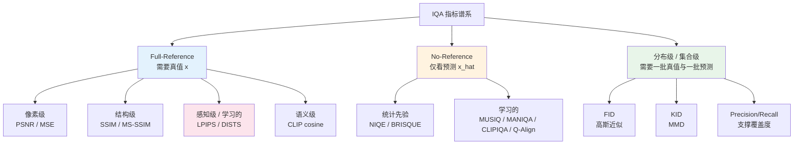
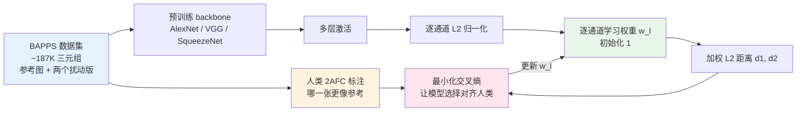
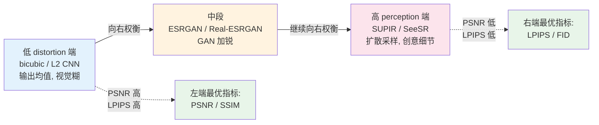

# 第 4 章 · 评估的陷阱

> 影像增强领域有一个公开的秘密：**论文里的指标和肉眼观感经常对不上**。
>
> 这不是某些人造假，是这个领域的指标本身就有系统性偏差。

## 4.0 读这一章之前

第 3 章把损失函数讲完了。损失定义了"训练时朝哪里推"，这一章讲"训完之后用什么去衡量它推得好不好"。两件事看起来对称，工程上却完全不同：一个损失可以不可微就用不了，一个指标只要可计算就能用；一个损失关心的是梯度行为，一个指标关心的是数值是否对齐人类偏好。

这一章要回答的核心问题，是为什么在影像增强这个领域，**指标和肉眼观感经常对不上**，以及面对一个新模型时应当报哪些指标、不报哪些指标。它不是一份指标百科，而是一份对每个指标"量了什么、漏了什么"的解剖。

读完这一章，你应当能回答这些问题：

- 为什么 bicubic 上采样在 PSNR/SSIM 上能赢过 ESRGAN，但在视觉上反而最糊
- 全参考（FR）与无参考（NR）这两种指标范式各自适合什么场景
- LPIPS 比 VGG 感知损失"更准"的"更准"具体是怎么训出来的
- FID 至少需要多少样本才稳定，为什么少于这个数就别报
- 一篇增强论文的实验表里，看到哪些指标应当警觉作者在选择性报告

预设的背景：第 1 章关于 ill-posed 的讨论，第 2 章关于"特征空间适合算损失"的结论，第 3 章关于"对抗损失生成高频细节"的工程经验。这三章里若有任何一处没读，建议先回去翻一下，否则本章后面提到的"perception-distortion trade-off"会显得突兀。

**本章首次出现的缩写。** 前三章已经介绍过的不再重复。本章会用到的新术语：

- **FR-IQA**（Full-Reference IQA，全参考图像质量评估）：用真值与预测配对地比较，输出一个相似度或距离
- **NR-IQA**（No-Reference IQA，无参考图像质量评估）：只看预测图自身打分，也叫 blind IQA
- **RR-IQA**（Reduced-Reference IQA，部分参考图像质量评估）：只用真值的少量统计量做参照，本书不展开
- **MSE**（Mean Squared Error，均方误差）：PSNR 的底层量
- **MS-SSIM**（Multi-Scale SSIM，多尺度结构相似度）：在多个分辨率上算 SSIM 加权
- **AlexNet**：2012 年 ImageNet 冠军模型，是 LPIPS 最常用的 backbone 之一
- **BAPPS**（Berkeley-Adobe Perceptual Patch Similarity dataset）：LPIPS 论文随附的人类感知判断数据集，用于校准 LPIPS 的线性权重
- **2AFC**（Two-Alternative Forced Choice，二选一强制选择）：人类标注的常用范式，给两张图问"哪张更像参考"
- **JND**（Just Noticeable Difference，可觉察差异）：人类能感知到差异的最小阈值
- **MOS**（Mean Opinion Score，平均意见分）：让人按 1-5 给质量打分后取平均
- **FID**（Fréchet Inception Distance）：在 Inception V3 特征空间下用高斯近似算两组图分布距离
- **KID**（Kernel Inception Distance）：基于最大均值差异 MMD（Maximum Mean Discrepancy）的分布距离，小样本下比 FID 稳
- **NIQE**（Natural Image Quality Evaluator）：基于自然图像统计量的无参考指标
- **BRISQUE**（Blind/Referenceless Image Spatial Quality Evaluator）：基于空间域统计 + 分类器的无参考指标
- **MUSIQ**（Multi-Scale Image Quality Transformer）：基于多尺度 Vision Transformer 的无参考评分网络
- **MANIQA**（Multi-dimension Attention Network for IQA）：基于注意力的无参考指标
- **CLIPIQA**（CLIP-based IQA）：用 CLIP 把图像与"质量好/差"文本做对齐，输出无参考评分
- **PIPAL / KonIQ-10k / LIVE / TID2013**：IQA 领域常见的人类主观评分公开数据集，用于校准与比较 IQA 算法

这一章会反复用到"全参考"与"无参考"两个范畴。先用一张图把整个 IQA 指标谱系铺开，方便后面每一节查位置：



这张图按"需要几个输入"切分：FR 需要一对（真值与预测），NR 只需要一张（预测自身），分布级需要两组（一批真值与一批预测）。后面 4.2 到 4.7 节按这条线索逐项展开，4.8 节再回过头讨论这三种范式之间的根本张力。

## 4.1 一个矛盾的现象

把同一张低分辨率猫脸图给三个模型做 4× 超分：

- **A**：直接 bicubic 上采样
- **B**：ESRGAN（经典 GAN-based SR）
- **C**：SUPIR（扩散派 SOTA）

跑下来的指标可能长这样：

| 模型 | PSNR ↑ | SSIM ↑ | LPIPS ↓ | FID ↓ | 肉眼观感 |
|------|--------|--------|---------|-------|---------|
| A. bicubic | **28.4** | **0.82** | 0.42 | 78 | 糊到不能看 |
| B. ESRGAN | 26.1 | 0.76 | 0.18 | 22 | 锐利但有些噪点 |
| C. SUPIR | 24.8 | 0.71 | **0.12** | **8** | 细节丰富有创意 |

矛盾在哪里：

- **PSNR 和 SSIM 给 bicubic 最高分**，但 bicubic 在视觉上是最糊的
- **LPIPS 和 FID 给 SUPIR 最高分**，但 SUPIR 在像素一致性上最差（有"创意"修改）
- 三个模型在不同指标上**没有一个全胜**

这一章讲清两件事：

1. 每个指标在量什么、漏什么
2. 为什么这些不一致是**理论必然**而不是工程缺陷

这个矛盾在工程上的直接后果，是**模型选择必须基于"指标组合 + 应用场景"，不能依赖单一数字**。下面每一节展开一个指标时，都把它放回这张表里对照看，会比单独看公式更有用。

## 4.2 PSNR

最古老的全参考指标，1980 年代就在视频编码评估里大量使用。它今天还在用，不是因为它好，而是因为它便宜、历史包袱重、所有人都报。理解它的局限是理解后续每一个指标"为了修补 PSNR 哪一点"的前提。

$$
\text{PSNR}(\hat{x}, x) = 10 \log_{10} \left( \frac{\text{MAX}^2}{\text{MSE}(\hat{x}, x)} \right)
$$

其中 MSE 是均方误差，MAX 是像素最大值（8 位图为 255）。单位是分贝（dB），数值越大越好。

```python
import torch

def psnr(pred: torch.Tensor, target: torch.Tensor,
         data_range: float = 1.0) -> torch.Tensor:
    """PSNR (Peak Signal-to-Noise Ratio)。
    pred, target: (B, C, H, W), 假设 [0, 1]
    返回: (B,) 每张图的 PSNR (dB)
    """
    mse = ((pred - target) ** 2).flatten(1).mean(dim=1)
    return 10 * torch.log10((data_range ** 2) / (mse + 1e-12))
```

### PSNR 在量什么

直接量像素级 L2 误差。等价于"假设图像噪声是高斯独立同分布"下的对数似然。

### PSNR 漏什么

**漏感知**——它不知道：

- 一像素的小色差和一像素的大错位，对人眼差别巨大，但 PSNR 可能给同样的分数
- 整体偏移 1 像素的图，肉眼几乎看不出，PSNR 会暴跌
- 全图加一点高斯模糊，肉眼明显糊了，PSNR 可能反而升了（因为模糊降低了高频差异）

这第三条尤其反直觉，但它是 PSNR 在视觉上失效的最经典案例。具体一点：假设真值有一些高频细节（边缘、纹理），增强模型 A 准确恢复了这些细节但有少量噪点，增强模型 B 干脆把整张图模糊化、连细节带噪点一起抹掉。在 PSNR 下 B 通常赢，因为 B 没有高频差异；在视觉上 A 通常赢，因为它至少有结构。这种系统性偏差是为什么这本书反复强调"PSNR 高不一定好看"的根源。

工程意义：

- PSNR 高的图**不一定好看**，PSNR 低的图**不一定难看**
- PSNR 在比较**算法之间**有相对意义（同样的退化、同样的真值），但跨数据集比较意义有限

### 为什么 PSNR 还是事实标准

它有几个工程好处压不住：

- **简单**：一行 MSE 就能算
- **可加性**：可以分通道、分区域统计
- **历史惯性**：1990 年代起所有论文都报，删不掉
- **数值范围直观**：30 dB 是一个具体的、跨任务可比较的"工程感觉"，新人很快就能建立"28 dB 糊、32 dB 清、36 dB 极清"的直觉
- **可分解性**：可以拆成亮度通道与色度通道分别报（PSNR-Y / PSNR-RGB / PSNR-YCbCr），帮助定位具体问题在哪个通道

实际工程里 PSNR 仍然是必报指标，但**单独用它做模型选择**是一个新手错误。注意常见的坑：不同代码库可能在 Y 通道上算 PSNR-Y，也可能在 RGB 上算 PSNR-RGB，两者差 0.5-1.5 dB，比较两篇论文的 PSNR 数字时务必确认它们用的是同一种。学术圈 SR 任务标准做法是裁掉边界几个像素后在 Y 通道上算 PSNR-Y，这又是个隐藏的"和别人比较时要对齐"的细节。

最后值得提一句：PSNR 在两个极端情境下完全失效——一是当真值与预测**几何对齐有偏差**时（即便只是 0.5 像素的位移）PSNR 会暴跌；二是当预测是**生成式输出**（不追求像素级一致而追求统计上像）时 PSNR 没有意义。前者在视频任务里特别常见，相邻帧之间几何对齐很难做到亚像素精确；后者在扩散派增强模型里特别常见。这两种情境下应当切换到 SSIM、LPIPS、FID 这类对几何或分布更宽容的指标。

把这一节的内容压成一条工程口诀：**PSNR 衡量"像素值多接近"，不衡量"看起来多像"**。这条口诀解释了它所有的优点（简单、可加、历史悠久）与所有的缺点（不对齐感知、对几何敏感、生成式失效）。理解这条口诀，是理解为什么后面所有指标都在试图"修补 PSNR"。

## 4.3 SSIM 系列

### SSIM

SSIM（Structural Similarity，2004）试图修补 PSNR 的"忽视结构"问题。它把局部相似度分成三块：

$$
\text{SSIM}(x, y) = l(x, y)^\alpha \cdot c(x, y)^\beta \cdot s(x, y)^\gamma
$$

- **luminance** $l$：均值相似度
- **contrast** $c$：方差相似度
- **structure** $s$：归一化后的相关性

实际计算用滑动窗口（11×11 高斯加权），最后取全图平均。

```python
import torch
import torch.nn.functional as F

def gaussian_window(window_size: int, sigma: float) -> torch.Tensor:
    coords = torch.arange(window_size).float() - window_size // 2
    g = torch.exp(-(coords ** 2) / (2 * sigma ** 2))
    g = g / g.sum()
    window = g.unsqueeze(0) * g.unsqueeze(1)
    return window  # (W, W)


def ssim(pred: torch.Tensor, target: torch.Tensor,
         window_size: int = 11, sigma: float = 1.5,
         data_range: float = 1.0) -> torch.Tensor:
    """SSIM, 简化版本。生产环境推荐用 torchmetrics 或 pyiqa。
    pred, target: (B, C, H, W) in [0, data_range]
    """
    C1 = (0.01 * data_range) ** 2
    C2 = (0.03 * data_range) ** 2
    C = pred.shape[1]

    win = gaussian_window(window_size, sigma).to(pred)
    win = win.expand(C, 1, window_size, window_size)

    mu_x = F.conv2d(pred,   win, padding=window_size // 2, groups=C)
    mu_y = F.conv2d(target, win, padding=window_size // 2, groups=C)
    mu_x2, mu_y2, mu_xy = mu_x ** 2, mu_y ** 2, mu_x * mu_y

    sigma_x2 = F.conv2d(pred * pred,     win, padding=window_size // 2, groups=C) - mu_x2
    sigma_y2 = F.conv2d(target * target, win, padding=window_size // 2, groups=C) - mu_y2
    sigma_xy = F.conv2d(pred * target,   win, padding=window_size // 2, groups=C) - mu_xy

    num = (2 * mu_xy + C1) * (2 * sigma_xy + C2)
    den = (mu_x2 + mu_y2 + C1) * (sigma_x2 + sigma_y2 + C2)
    return (num / den).flatten(1).mean(dim=1)
```

### MS-SSIM

多尺度 SSIM——把图重复下采样几次，每次都算 SSIM，加权平均。优点：能捕捉不同尺度的结构相似度。在视频编码标准 H.265 的参考实现里 MS-SSIM 几乎与 PSNR 并列报告，因为它对人眼感知质量的预测能力比 SSIM 强一些。对增强任务它也是一个不亏的"附加指标"——计算开销小，能补充 SSIM 单尺度的盲区。

### SSIM 漏什么

- **对模糊宽容**：均值不变、方差变化也不大，SSIM 可能只跌 0.05
- **对几何形变敏感**：物体偏移 5 个像素，SSIM 会跌很多，但人眼几乎看不出
- **对纹理不敏感**：两块不同纹理但统计量相近，SSIM 给高分

工程意义：

- SSIM 比 PSNR 好一点，但**仍然不对齐人眼对纹理和细节的感知**
- 在"换了纹理但保留结构"的场景下，SSIM 会高估相似度

SSIM 的另一个工程坑是数据范围与窗口参数。同一份图、同一个公式，data_range 取 1.0 还是 255、window_size 取 7 还是 11、sigma 取 1.5 还是 0.5，算出来的数能差好几个百分点。不同代码库默认值不同，比较两篇论文的 SSIM 时务必检查它们用的是同一份实现。比较稳的做法是用 pyiqa 或 torchmetrics 这种统一库，至少保证 baseline 与新方法在同一份代码下评估。

## 4.4 LPIPS

LPIPS（Learned Perceptual Image Patch Similarity，2018）是这个领域的范式转变。它放弃手工公式，改用：

1. 用 AlexNet/VGG/SqueezeNet 提多层特征
2. 把每层特征做空间对齐 + 通道归一化
3. 用一个**学习出来的线性权重**加权各层各通道的 L2 距离
4. 这个线性权重是在大量人类感知判断的数据集（BAPPS）上拟合的

第 4 步是 LPIPS 与第 3 章 VGG perceptual loss 最关键的差别，值得拆开讲清楚。VGG 感知损失给每一层、每一通道的权重是**人手定**的（通常是 1）；LPIPS 给每一层、每一通道的权重是**人类感知数据训出来**的。也就是说，VGG 损失假设了"所有 ImageNet 特征通道对感知都同等重要"，LPIPS 把这个假设替换成了"在 BAPPS 这类有人类标注的数据上拟合出来的真实权重"。后者更准，但代价是需要一个一次性的校准（calibration）过程。

把这个校准过程展开，方便理解 LPIPS 的"学到的"到底学了什么、从哪里学的：



校准的训练目标是这样的：给定一组三元组（参考图 $x$，扰动版 $\hat{x}_1$、$\hat{x}_2$），人类标注了"哪一个更像 $x$"；LPIPS 用当前的权重算出两个距离 $d_1, d_2$，把它们送进一个小判决头输出"选 1 还是选 2 的概率"；优化目标是让这个概率与人类标注一致。整套训练只更新最后那组逐通道权重 $w_l$，backbone 本身保持不动。这是为什么 LPIPS 跑起来不算贵，但效果显著好于无校准的 VGG 距离。

BAPPS 数据集里覆盖的扰动类型很有讲究，包含传统失真（JPEG、模糊、噪声）、CNN 派生的输出（超分、去噪模型的伪影）、几何形变、颜色扰动等。这覆盖范围决定了 LPIPS 在哪些任务上对齐人眼、在哪些任务上失灵。例如 BAPPS 里几乎没有"大幅生成式编造"这类扰动，LPIPS 对扩散模型生成"似是而非的细节"评分往往偏松。

数学上：

$$
\text{LPIPS}(x, y) = \sum_l \frac{1}{H_l W_l} \sum_{h, w} ||w_l \odot (\hat{F}_l(x)_{h,w} - \hat{F}_l(y)_{h,w})||_2^2
$$

直接调用：

```python
import lpips  # pip install lpips

# 用 AlexNet backbone, 通常作为损失函数 backbone 选 vgg
loss_fn_alex = lpips.LPIPS(net='alex')   # net='alex' 更接近人眼, 'vgg' 用作训练损失更稳

def lpips_distance(pred: torch.Tensor, target: torch.Tensor,
                   loss_fn: lpips.LPIPS) -> torch.Tensor:
    """计算 LPIPS 距离。
    输入: [0, 1] 范围的 RGB, shape (B, 3, H, W)。函数内部会缩放到 [-1, 1]。
    返回: (B,) 每张图的 LPIPS 距离 (越小越像)
    """
    return loss_fn(pred * 2 - 1, target * 2 - 1).flatten()
```

### LPIPS 在量什么

学到的"两张图在视觉上有多不像"。在大量"哪一张更像参考图"的人工标注上训练。

### LPIPS 比 PSNR/SSIM 强的地方

- 对**模糊**敏感（这是 PSNR/SSIM 的最大盲区）
- 对**纹理替换**敏感（同一物体不同纹理，LPIPS 会区分）
- 对**整体偏移**鲁棒（小位移不会让 LPIPS 暴跌）

### LPIPS 也漏什么

- **可被对抗样本骗**——AlexNet 本身有对抗脆弱性，模型可以学到"针对 LPIPS 的优化伪影"，LPIPS 低但视觉差
- **对色调漂移不敏感**——VGG/AlexNet 都做 ImageNet 归一化，对整体颜色变化迟钝
- **不擅长极端伪影**——块状伪影、彩色振铃可能 LPIPS 不大但视觉惨不忍睹
- **不同 backbone 给不同结果**——alex 版和 vgg 版的 LPIPS 不能直接比

工程经验：LPIPS 是当前最好用的全参考感知指标，**但不是唯一指标**。

LPIPS 既可作指标也可作损失，两者用法不同。作指标时取的 backbone 通常是 alex（更对齐人眼）；作损失时取的 backbone 通常是 vgg（梯度更稳）。把 LPIPS 直接当主损失训会有两个问题：一是它本身包含一个学习头，反传时梯度路径长、容易把模型推向 LPIPS 内部某些通道的对抗样本方向；二是 LPIPS 是为"判别"训的（哪一张更像参考），不是为"生成"训的（输出一张像参考的图），用它做生成损失会丢失高频。所以现代工程几乎都是 VGG perceptual loss 当训练损失，LPIPS 当评估指标，两者分工。

## 4.5 DISTS

DISTS（2020）是 LPIPS 的改进，把感知距离分成两部分：

- **结构距离**（structure）：捕捉空间排列
- **纹理距离**（texture）：捕捉统计特性，对位置不敏感

DISTS 的核心创新：**对纹理位置不敏感**。这一点非常贴近人类感知 - 你看一张草坪，不会逐根草地数"这根草跟参考图位置对不对"，只会看整体的草坪外观对不对。LPIPS 因为是逐像素特征 L2，仍然带有"位置必须严格对齐"的隐含要求；DISTS 明确放弃了纹理部分的位置约束，更适合纹理生成任务。

举例：草地上的草叶位置不一样、整体纹理一致，DISTS 给高分；LPIPS/SSIM 给低分。这在很多增强场景（修复纹理、生成草地/毛发/水波）下，DISTS 比 LPIPS 更对齐人眼。

```python
# 推荐用 pyiqa 库 (统一了所有 IQA 指标)
import pyiqa  # pip install pyiqa

dists_metric = pyiqa.create_metric('dists', as_loss=False)

def dists_distance(pred: torch.Tensor, target: torch.Tensor) -> torch.Tensor:
    """DISTS 距离, [0, 1] 输入。"""
    return dists_metric(pred, target)
```

何时用 DISTS：

- 任务涉及**纹理生成或恢复**（毛发、草地、皮肤、布料）
- 已经在 LPIPS 上调到极致但效果不再涨
- 发现模型生成的纹理"统计上对但位置错"被 LPIPS 误判

DISTS 与 LPIPS 的取舍可以这样理解：LPIPS 用的是逐位置的特征 L2 距离，所以纹理位置对不上就要扣分；DISTS 在纹理部分换成了通道统计量（均值、方差、协方差），位置无关。这对应着两种不同的"相似"假设 - LPIPS 假设"两张图应当逐像素感知相似"，DISTS 假设"两张图的整体外观分布应当相似"。在生成式增强里 DISTS 的假设更合理，但传统超分还是 LPIPS 更主流。

## 4.6 FID / KID

LPIPS 和 DISTS 都是**全参考**——需要真值 $x$ 配对地比较 $\hat{x}$。但生成式模型有一个不一样的需求：

> 我不在乎单张 $\hat{x}$ 是不是接近 $x$，我在乎 $\hat{x}$ 的**整体分布**像不像自然图像分布。

这是 FID（Fréchet Inception Distance）和 KID 的设计目标。

### FID

把所有真实图像和所有生成图像分别过 InceptionV3，得到两组 2048 维特征。假设各自服从高斯分布，算两个高斯之间的 Fréchet 距离：

$$
\text{FID}(R, G) = ||\mu_R - \mu_G||^2 + \text{tr}(\Sigma_R + \Sigma_G - 2(\Sigma_R \Sigma_G)^{1/2})
$$

```python
import pyiqa
fid_metric = pyiqa.create_metric('fid')
# fid 需要批量数据, 用法不同于 PSNR/LPIPS, 通常给两个文件夹路径
# fid = fid_metric(real_image_folder, generated_image_folder)
```

### FID 在量什么

**两组图在 Inception 特征空间的分布差异**。

适合：

- 生成式增强模型（扩散 SR、生成式去噪）
- 任务的输出空间是多模态的（同样的退化输入可以有多个合理输出）

不适合：

- 判别式 SR/去噪——给定 $y$ 输出唯一 $\hat{x}$，比"分布差异"意义不大
- 单张图——FID 至少需要几千张图，单张图的 FID 是噪声

### FID 的常见误用

> "我们模型在 100 张测试集上 FID = 12，他们模型 FID = 18，所以我们更好"

这有两个问题：

1. **样本量太小**：FID 在小样本上方差极大，100 张图可能跑出 ±10 的标准差，差 6 没意义
2. **bias**：FID 对样本量有系统偏差，必须用同样数量的样本比较

工程经验：

- FID 至少需要 **10K 张样本**才稳定
- 真实工程里 FID 主要看**绝对量级和趋势**（FID 50+ vs 10+ 是质变），不要在小数点上较真
- KID（基于 Maximum Mean Discrepancy）在小样本下比 FID 稳，是更好的小数据指标

为什么 FID 用 Inception V3 而不是更新的特征网络？这是个历史遗留 - FID 论文发表于 2017 年，当时 Inception V3 是图像分类 SOTA，整套生成模型评估生态都建立在它的特征空间上。后来即便有了更强的特征网络（CLIP、DINOv2），FID 也没有跟着换 backbone，因为换了就和历史所有论文的数字不可比。这种"基准锁定"是 IQA 领域常见的现象：一个指标一旦被几百篇论文采用，即便有更好的替代品也很难推动迁移。最近几年出现了一批基于 CLIP 特征的"现代 FID"变体（如 CMMD、CLIP-FID），它们在不少任务上更对齐人眼，但还未取代经典 FID 的报告地位。生产环境里这件事的处理方式是"两个都报"——经典 FID 用于与历史论文比较，现代 FID 用于内部决策。

理解 FID 还需要切换一个思维范式。前面 PSNR/SSIM/LPIPS/DISTS 都是"点对点比较"，问的是"$\hat{x}_i$ 与 $x_i$ 有多像"；FID 是"集合对集合比较"，问的是"$\{\hat{x}_i\}$ 与 $\{x_i\}$ 作为两个分布有多像"。这两种范式适合的任务不同：

- 配对任务（去噪、去模糊、单图 SR）有明确的真值配对，点对点比较自然
- 生成任务（扩散采样、纹理生成）的"真值"是一个分布而不是一个点，集合对集合比较更合理
- 影像增强的扩散派模型介于两者之间，所以两类指标都报

下面这张图把"集合对集合"这个范式可视化一下。FID 的核心假设是把两组特征都用单峰高斯近似，然后算两个高斯之间的距离，KID 则把这个高斯近似换成了 MMD 这种非参数的核方法。两者的设计思想一致，只是对分布的假设强弱不同。

## 4.7 无参考指标 (NR-IQA)

真实世界场景里我们经常**没有真值**——你只有一张手机拍的烂图，没有"理想原图"做参照。

这种情况要用无参考（No-Reference）指标。代表：

- **NIQE**（2013）：基于自然图像统计的距离
- **BRISQUE**（2012）：基于 spatial 特征的分类器评分
- **MUSIQ**（2021）：Vision Transformer 学的图像质量评分
- **MANIQA**（2022）：注意力 + 多尺度，是 NR-IQA 的强 baseline
- **CLIPIQA**（2023）：用 CLIP 评估"美感 / 真实感"

这些指标的训练数据是哪里来的，是理解它们能力边界的关键。NIQE 与 BRISQUE 这种早期方法不需要"质量分"标签，它们假定"自然图像在某个统计量上服从某个固定分布"，把测试图与这个先验分布的距离作为质量分。MUSIQ、MANIQA、CLIPIQA 等学习型方法则需要带人类质量分的图像数据集，常用的是 KonIQ-10k（10K 张真实拍摄图，每张多人打分取平均）、SPAQ（11K 张手机图）、PaQ-2-PiQ（4 万张图加局部 patch 评分）。每个数据集采集的"质量分布"不同，训出来的模型偏好也不同：在 KonIQ-10k 上训的偏好"看起来像专业摄影"，在 SPAQ 上训的偏好"看起来像清晰手机图"。生产环境部署 NR-IQA 时务必知道你用的指标是在哪个分布上训的，否则会误判。

> 何为"NR-IQA SOTA"高度依赖 benchmark（PIPAL、LIVE、KonIQ-10k 等），且 2024-2026 涌现了多个基于 MLLM/CLIP 的新方法。生产环境**多个 NR 指标一起报**，不要只盯一个。

```python
import pyiqa

niqe   = pyiqa.create_metric('niqe',    device='cuda')
musiq  = pyiqa.create_metric('musiq',   device='cuda')
maniqa = pyiqa.create_metric('maniqa',  device='cuda')

# NIQE 越小越好, MUSIQ/MANIQA 越大越好
def assess_no_reference(image: torch.Tensor):
    """对单张图给出无参考质量评估。"""
    return {
        'niqe':   niqe(image).item(),
        'musiq':  musiq(image).item(),
        'maniqa': maniqa(image).item(),
    }
```

### 无参考指标的核心问题

它们只能告诉你"这张图看起来质量好不好"，**不能告诉你它是不是 $x$**。

- **真实退化场景必须的**——没有真值时唯一的选择
- **容易被欺骗**——模型可以学到"针对 NIQE/MUSIQ 看起来质量高"但实际上加了奇怪伪影
- **不同指标之间相关性差**——一个模型 NIQE 好但 MUSIQ 差是常见现象

工程经验：

- 真实场景评估**多个 NR 指标一起报**（NIQE + MUSIQ + MANIQA + CLIPIQA），任何一个指标不正常都可能是失败模式
- 无参考指标永远配合**人工评估**使用，不能单独决定模型好坏

## 4.8 保真 vs 感知 —— 一个理论必然

回到开头那张矛盾的表。这不是工程巧合，是**信息论必然**。

Blau & Michaeli 在 2018 年的论文 "The Perception-Distortion Tradeoff" 严格证明了：

> 在 ill-posed 逆问题上，**distortion**（PSNR / SSIM 这类保真指标）和 **perception**（FID / LPIPS 这类感知指标）**不可同时最优**。
>
> 任何优化算法都在这条 trade-off 曲线上找一个点。

直观理解：

- **distortion 最优**意味着输出尽量接近真值的"统计期望"——多个合理 $x$ 的均值，是模糊的
- **perception 最优**意味着输出落在自然图像分布上——必须是某个具体的 $x$，不是均值

这两个目标本质冲突。

把这种冲突落到几个具体的模型在这条曲线上的位置，就更直观了。低 distortion 那一端坐着的是 bicubic 和早期 L2-regression SR 模型，它们输出"安全的均值"，PSNR 漂亮但视觉糊；中段是 ESRGAN/Real-ESRGAN 这类 GAN-based 模型，牺牲了几分贝 PSNR 换来锐利度；最远的 perception 端是 SUPIR/SeeSR 这类扩散派模型，它们直接从 $p(x | y)$ 采样，输出生动但与真值像素级一致性最差。



**这条曲线的存在**有几个工程含义：

1. **PSNR 派和感知派"打架"是常态**，不会有一个模型在所有指标上全胜
2. **看 benchmark 时要看曲线上的位置，不是单点**——HAT 的位置是高 PSNR 低感知，SUPIR 是低 PSNR 高感知，这两个不是同一目标的竞争者
3. **应用场景决定曲线上的最优点**——法医证据要 distortion 端，照片美化要 perception 端

第 8 章会回到这个 trade-off，讲扩散模型为什么主动选择牺牲 PSNR 换感知。

## 4.9 benchmark 数据集的偏差

学术论文几乎都报这几个数据集的指标。但**这些数据集都有系统性偏差**。

这一节是这一章最容易被读者跳过、但工程上最重要的一节。学术 benchmark 的数字与生产线上线后用户体验之间的鸿沟，几乎全部源于本节讨论的偏差。把每条偏差都在心里建立警觉，是判断一篇论文"值不值得跟"的关键。

### 经典 benchmark

| 数据集 | 图片数量 | 类型 | 偏差 |
|-------|---------|------|------|
| Set5 | 5 | 杂图 | 太少，方差极大 |
| Set14 | 14 | 杂图 | 同上 |
| BSD100 | 100 | 自然图 | 略小，平均仍可信 |
| Urban100 | 100 | 城市建筑 | 偏向规则结构 |
| Manga109 | 109 | 漫画 | 全是黑白线条 |
| DIV2K val | 100 | 高质量自然图 | 标准但偏"漂亮" |
| LSDIR val | 250 | 多样化 | 较新较公平 |

### 所有这些数据集的共同问题

> **它们的"低分辨率版本"几乎都是 bicubic 下采样得到的。**

也就是说：

- 训练 $y$ 用 bicubic
- 测试 $y$ 也用 bicubic
- **测试和训练在同一个退化假设下**

这就是第 1 章讲的"训练-推理失配"在评估上的对应版本。结论：

> "在 Set14 4× 上 30 dB" **不能**告诉你"在你手机暗光照片上好不好"。

更隐蔽的偏差是 benchmark 数据集的**内容分布**本身就有偏。Set5、Set14、BSD100 几乎全是高质量的摄影作品，色彩饱满、构图讲究、噪声极少；Urban100 全是城市建筑里的规则结构，对边缘恢复的算法天然友好；Manga109 全是黑白漫画，没有真实纹理也没有色彩。在这些数据集上做出来的 SOTA，落到"用户随手拍的食物近景图"上往往水土不服。所以读论文时不仅要看"在哪个数据集上跑的分"，更要问"那个数据集与我要服务的输入分布有多远"。

### 真实退化数据集

为了测真实场景，2019 年起出现了"真实退化对"数据集：

- **RealSR**（2019）：用同一相机不同焦段拍同一场景，得到 LR-HR 对
- **DRealSR**（2020）：DSLR 相机，更精确对齐
- **DPED**（2017）：低端手机 vs DSLR 配对
- **NTIRE Real-World SR challenge**：每年的竞赛数据

这些数据集小（几百到几千张），但**测试时更接近真实**。

但真实退化数据集本身也有偏差。RealSR 用的同一相机不同焦段，"低分辨率"实际上是"用广角拍的视野更大的图"，物理上还是干净拍摄的，与"手机暗光拍后再被微信压缩两次"的真实场景距离不小。DPED 的低端手机是 2015 年的，与 2024-2026 年的手机也不一样。所以即便是"真实退化数据集"，也只是"比 bicubic 更真实"，不是"代表所有真实场景"。生产环境最终的评估，应当是**业务自己的回归测试集**——从用户实际使用的输入分布里采样若干典型 case，建立长期监控。

工程实践：

- **学术 benchmark + 真实退化数据集都报**
- 学术 benchmark 上 PSNR 高没意义（除非两个模型都在同退化下比较）
- 真实退化数据集上的指标更说明问题

## 4.10 训练时看哪些指标

每个 epoch / 每 N 步 validation 时，应该跑哪些指标？

**最小集合（必须）**：

- PSNR：监控保真度
- LPIPS：监控感知质量

**推荐集合**：

- PSNR + SSIM + LPIPS + DISTS（全参考全套）
- 模型损失曲线（每个损失项分开记录）

**生成式模型额外**：

- FID（每 N 个 epoch 在足够大测试集上跑一次）
- 一组固定输入的可视化对比（直观看到模型变化）
- 不同 seed 下 sample 几次，观察生成多样性（针对扩散派模型）
- 对一组失败 case 单独跑 metrics，看哪个 case 持续拖后腿

```python
class ValidationMetrics:
    """训练时的 validation 指标 logger。"""
    def __init__(self, device='cuda'):
        import pyiqa
        self.psnr  = pyiqa.create_metric('psnr',  device=device, as_loss=False)
        self.ssim  = pyiqa.create_metric('ssim',  device=device, as_loss=False)
        self.lpips = pyiqa.create_metric('lpips', device=device, as_loss=False)
        self.dists = pyiqa.create_metric('dists', device=device, as_loss=False)

    @torch.no_grad()
    def __call__(self, pred: torch.Tensor, target: torch.Tensor) -> dict:
        return {
            'psnr':  self.psnr (pred, target).mean().item(),
            'ssim':  self.ssim (pred, target).mean().item(),
            'lpips': self.lpips(pred, target).mean().item(),
            'dists': self.dists(pred, target).mean().item(),
        }
```

## 4.10b 主观评测 - MOS 与 2AFC

到现在为止讲的所有指标都是"算出来的数"。但**真正的金标准始终是人眼**。当你需要在论文里证明"我们的方法更好"、或在生产环境里决定线上模型该不该更新时，主观评测是最有说服力的证据。

两种主流范式：

- **MOS（Mean Opinion Score）**：让标注员对每张图按 1-5 分（或 1-10 分）独立打分，最后取平均。优点是直观、可以同时评多个模型；缺点是不同人的"5 分"定义不一样，方差大，需要标准化（z-score）才能比较。
- **2AFC（Two-Alternative Forced Choice）**：给标注员两张图（来自模型 A 与模型 B 的输出），问"哪一张更像参考"或"哪一张质量更好"，强制二选一。优点是判断粒度小、标注稳定；缺点是只能两两比较，N 个模型需要 $\binom{N}{2}$ 组对比。

LPIPS 的训练数据 BAPPS 就是 2AFC 范式收集的。一般工程里如果只需要决定"我的新模型有没有比旧模型好"，2AFC 是更经济的选择；如果需要绝对的"现在线上模型质量到几分了"，则需要 MOS。

第 12 章会展开主观评测的标注协议、统计显著性检验（McNemar's test、Wilcoxon signed-rank）、众包平台的踩坑点。这里只需记住：**没有主观评测背书的指标提升不可信**，特别是 ESRGAN/扩散派这种"细节是生成的"模型，PSNR/LPIPS 都可能跟人眼背道而驰。

几个 validation 频率的工程经验：

- 训练前期（前几个 epoch）validation 频率高一点，捕捉发散迹象
- 后期固定每 5K 或 10K 步跑一次完整 validation
- FID 这种重指标不放在每次 validation 里跑，单独定期跑（比如每个 epoch 或每 20K 步一次）
- 永远保留一组**固定的可视化样本**（5-10 张），每次 validation 都用同样的输入跑一次，存到 tensorboard 或 wandb。指标看长期趋势，可视化样本看具体行为，两者缺一不可。
- 不同时间步保存的可视化样本，按时间排列起来回看，常常能发现指标察觉不到的退化（颜色慢慢漂移、纹理慢慢"塑料化"等）

## 4.11 论文 / 报告里报什么

主表必须有：

- PSNR / SSIM / LPIPS（基础全参考）
- 至少一个真实退化数据集的结果

视情况加：

- DISTS（如果是纹理生成任务）
- FID（如果是生成式模型）
- NIQE / MUSIQ / MANIQA（真实场景）
- 主观评测（MOS / 2AFC，第 12 章详谈）

**不要做的**：

- 只报 PSNR
- 只在 Set5/Set14 上报指标
- 报 FID 但样本量小于 1000
- 不展示失败案例

## 4.12 一个具体案例：bicubic vs ESRGAN vs SUPIR

回到开头那个表，但展开分析一下为什么每个指标这样：

| 模型 | PSNR | SSIM | LPIPS | FID | 解读 |
|------|------|------|-------|-----|------|
| bicubic | **28.4** | **0.82** | 0.42 | 78 | 输出是真值的"模糊均值"，PSNR/SSIM 自然高；但完全无高频，LPIPS/FID 差 |
| ESRGAN | 26.1 | 0.76 | 0.18 | 22 | GAN 生成高频细节，"细节对但不一定是真细节"，PSNR 跌但感知大幅好 |
| SUPIR | 24.8 | 0.71 | **0.12** | **8** | 扩散先验生成更真实细节，但创意性强，像素级一致性最差 |

**没有一个模型"最好"**——选哪个取决于场景：

- 法医证据增强 → bicubic（不允许编造）
- 照片放大打印 → ESRGAN（保真+清晰平衡）
- 老照片修复 → SUPIR（最大化视觉真实感）

> **"哪个模型最好"是一个错误的问题。**
> **正确的问题是"在 distortion-perception 平面上，哪个点最适合我的应用"。**

把这条做成几个常见业务场景的对照：

- **医学影像增强**：误诊代价巨大，不允许任何"看起来合理但不真实"的细节。distortion 端优先（PSNR / SSIM / 与原始扫描的物理一致性），生成式模型禁用。
- **监控视频取证**：与上面类似，需要追责。结论：宁可糊也不可编造。
- **法律证据增强**：同上，但更严格，连传统 ESRGAN 这种 GAN-based 也不能用。
- **手机相册的"AI 增强"按钮**：用户接受"和原图不完全一样但好看"，perception 端优先。LPIPS、MUSIQ、用户 A/B 留存率是更合适的指标。
- **老照片修复**：用户主动接受"创意性修复"，perception 端最优先，但要做好用户预期管理。
- **图书馆古籍数字化**：物理保真很重要，但允许少量"清洗"。distortion 与 perception 都看，但 distortion 权重更高。
- **影视后期的修复 / 上色**：导演眼下接受度决定，主观评测 + 关键人物身份保留（第 10 章详谈）。

每一类场景都不一样，没有一套指标组合能 cover 全部。这也是为什么本书后面的部署章（第 15-17 章）会反复强调"上线前要先想清楚业务上的可接受边界"。

## 4.12b 看到一个指标数字应当问的四个问题

把这一章读到这里的内容压成一个工程检查清单。下次看到一篇新论文报"PSNR 32.5 dB / LPIPS 0.12"时，先在心里走完这四问，再决定是否相信。

1. **是 FR 还是 NR？** FR 指标要求测试集有真值，NR 指标不要求。一份报告里只报 NR 指标但宣称"超越了所有 baseline"，几乎肯定是在选指标。
2. **测试集的退化分布是什么？** bicubic 退化下的指标只能与其他 bicubic 退化下的指标比较；真实退化数据集的指标更接近线上表现，但要看数据集是否覆盖你的应用场景。
3. **样本量够不够这个指标稳定？** FID 至少 10K 张，KID 在小样本下更稳，PSNR/SSIM/LPIPS 几百张通常足够（但还是要做置信区间）。少于这些就不要在小数点上较真。
4. **这个指标的设计偏好与我的任务对齐吗？** PSNR 偏好"安全的均值"，LPIPS 偏好"特征空间相近"，FID 偏好"分布相近"，NR-IQA 偏好"训练数据里的'好图'特征"。一个指标在你的任务上是友军还是敌军，取决于这种对齐关系。

把这四问回答清楚，剩下的差距大多就是不同 perception-distortion 权衡的差距，没有谁绝对对错。

把这一章再用一句不同的话总结：**指标是有立场的**。一个指标背后藏着一个对"好图"的定义，这个定义可能与你的应用对齐，也可能不对齐。学会问"这个指标的立场是什么、与我应用的立场是否一致"，比记住具体公式更重要。

这一章是这本书的"评估方法论入门"，第 12 章会展开主观评测的工程细节，第 15-17 章会展开生产环境的指标监控。这三章合起来构成一个完整的"如何衡量影像增强质量"的工程体系。

## 4.13 小结

1. **PSNR/SSIM 量保真，对感知不敏感**——单独看会误导，但作为基线必报
2. **LPIPS/DISTS 量感知**，比 PSNR/SSIM 对齐人眼，但不能盲信
3. **FID 量分布距离**，适合生成式模型，但要足够大样本量
4. **NR-IQA**（NIQE/MUSIQ/MANIQA）在真实场景必须，但容易被骗
5. **Perception-Distortion 是理论 trade-off**——任何模型都在这条曲线上选点
6. **学术 benchmark 都用 bicubic 退化**，与真实场景失配
7. **训练时至少 PSNR + LPIPS**，论文报告至少 PSNR + SSIM + LPIPS + 真实退化数据集
8. **没有一个指标能单独说明问题**——总是组合报、配合人工评估

这一章和第 3 章一起回答了"什么叫好"——损失定义训练目标，指标定义评估标准。这两章理解清楚后，后面的架构章节才有"评判好坏"的依据。

最后再把第 3 章与本章的一对一关系画清楚。一个工程上完整的训练-评估闭环大致是：

- **训练损失** = 像素 L1/Charbonnier + VGG perceptual + 对抗（或扩散 simple loss）
- **训练时 validation 指标** = PSNR + SSIM + LPIPS
- **每 N 个 epoch 跑一次的重指标** = FID + DISTS
- **上线前的最终评估** = 上述全部 + NR-IQA + 主观评测（MOS / 2AFC）
- **上线后的持续监控** = NR-IQA + 用户反馈 + 关键场景的回归测试集

这五层从训练到上线层层加码，越靠后越贵但也越接近真实业务质量。新手最常犯的错误是把"训练时 validation 指标"当作"上线前最终评估"，结果模型在线上失败了才发现 PSNR/LPIPS 漂亮的模型用户其实并不喜欢。把这五层在心里画清楚，是从研究项目走向生产项目的关键一步。

---

> 下一章 [数据与退化合成](05-degradation-pipeline.md) → Real-ESRGAN 真正的核心贡献是数据合成。我们将看到，同样的网络换不同的数据 pipeline，性能差距能达到一个数量级。
