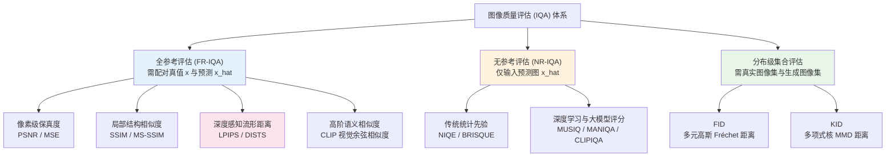
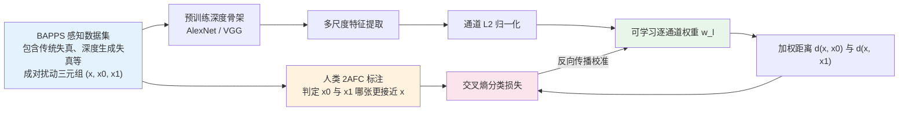
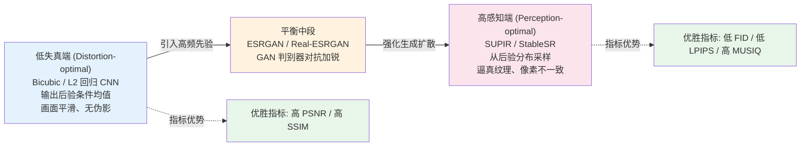

# 第 4 章 · 评估的陷阱

> 图像增强领域存在一个普遍现象：**论文报告的客观指标与人类主观肉眼观感经常发生显著背离**。
>
> 这并非学术造假，而是不同数学度量在感知对齐与分布假设上存在固有的物理与信息论偏差。

## 4.0 读这一章之前

第 3 章系统阐述了损失函数的构建逻辑，损失函数定义了网络在反向传播中“沿何种梯度方向优化”；本章则聚焦于后验评估：**训练完成后，应当采用何种度量体系量化模型复原质量的优劣。**

这两者在工程实践中存在关键差异：损失函数受制于数学可微性与梯度稳定性，而评估指标只需具备确定性的前向计算能力；损失函数关注局部动力学，评估指标则需尽可能忠实地对齐人类主观感知。

本章的核心目标是解构主流图像质量评估（IQA）指标的度量边界，剖析客观数值与主观观感发生背离的深层物理机理，并建立面向学术报告与工业落地的多维评估规范。

读完本章，你将建立以下工程认知：

- 为什么在超分辨率任务中，双三次插值（Bicubic）在 PSNR/SSIM 上经常胜过 ESRGAN，而视觉清晰度却明显垫底
- 全参考（FR-IQA）、无参考（NR-IQA）与分布级（Distribution-level）评估体系的适用场景与理论边界
- LPIPS 的权重校准机制及其在感知敏感度上超越经典 VGG 距离的本质原因
- FID 指标在大样本与小样本环境下的统计方差特性，以及如何规避样本量偏差
- 面对前沿复原论文时，如何识别选择性指标报告，构建科学的算法对比基线

预设背景：掌握第 1 章关于不适定逆问题解空间的讨论、第 2 章关于特征空间感知的分析，以及第 3 章关于多目标损失权衡的结论。

**本章首次出现的缩写与专业术语：**

- **FR-IQA**（Full-Reference Image Quality Assessment，全参考图像质量评估）：基于无失真真值（Ground Truth）与预测图配对计算的保真度与相似度度量
- **NR-IQA**（No-Reference Image Quality Assessment，无参考图像质量评估）：在无真值参照下直接评估失真图像主观视觉质量的盲评估算法
- **RR-IQA**（Reduced-Reference IQA，部分参考图像质量评估）：仅依赖真值的统计特征或局部特征进行参照的评估范式
- **MS-SSIM**（Multi-Scale Structural Similarity，多尺度结构相似度）：在多级高斯降采样金字塔上计算并加权的结构相似度度量
- **AlexNet**：2012 年提出的经典卷积神经网络架构，因其特征激活对感知距离具有优异线性度，常作为 LPIPS 的默认特征提取骨架
- **BAPPS**（Berkeley-Adobe Perceptual Patch Similarity）：用于校准 LPIPS 特征通道权重的双选强制比较（2AFC）主观数据集
- **2AFC**（Two-Alternative Forced Choice，二选一强制选择）：心理物理学主观实验标准范式，强制标注员在两个候选样本中裁定更优解
- **MOS**（Mean Opinion Score，平均主观意见分）：多名受试者主观打分的统计平均值，为主观图像质量评测的基准金标准
- **FID**（Fréchet Inception Distance）：在 Inception-V3 特征空间下基于多元正态分布假设度量两组图像集合分布散度的指标
- **KID**（Kernel Inception Distance）：基于核最大均值差异（MMD）度量图像集合特征分布距离的无偏估计指标
- **NIQE**（Natural Image Quality Evaluator）：基于自然场景统计（NSS）规律的无监督无参考质量评估模型
- **BRISQUE**（Blind/Referenceless Image Spatial Quality Evaluator）：基于局部归一化亮度系数统计特征的无参考评估算法
- **MUSIQ**（Multi-Scale Image Quality Transformer）：基于多尺度 Vision Transformer 构建的无参考图像质量评分网络
- **MANIQA**（Multi-dimension Attention Network for IQA）：融合多维注意力机制的深度无参考评分模型



## 4.1 指标倒挂现象与实验悖论

在同一组测试图像（如经典人脸或自然纹理测试集）上，分别采用三种代表性方法执行 4× 超分辨率重建，并在全集上统计各项指标均值（FID 在生成全集与真值全集之间计算）：

- **模型 A**：双三次插值（Bicubic Baseline）
- **模型 B**：ESRGAN（经典 GAN 判别式超分）
- **模型 C**：SUPIR（前沿潜空间扩散生成超分）

实验评测数据呈现如下分布：

| 模型方案 | PSNR (dB) ↑ | SSIM ↑ | LPIPS ↓ | FID ↓ | 肉眼主观观感 |
|---------|------------|--------|---------|-------|-------------|
| **A. Bicubic** | **28.4** | **0.82** | 0.42 | 78.5 | 细节严重缺失，弥散模糊 |
| **B. ESRGAN** | 26.1 | 0.76 | 0.18 | 22.3 | 边缘锐利清晰，伴随轻微伪影 |
| **C. SUPIR** | 24.8 | 0.71 | **0.12** | **8.4** | 纹理极其逼真，微观细节丰富 |

数据揭示出剧烈的评价冲突：

1. **PSNR 与 SSIM 判定 Bicubic 最优**：然而在人类视觉主观评测中，Bicubic 图像观感最差
2. **LPIPS 与 FID 判定 SUPIR 最优**：但 SUPIR 在像素级保真度（PSNR）上处于最低分位
3. **不存在单一模型在所有指标上取得全胜**

这一冲突表明：**不同评估指标测量的物理量与统计分布存在本质差异，模型选型必须紧扣应用场景的质量诉求，严禁依赖单一指标进行片面裁定。**

## 4.2 峰值信噪比（PSNR）

PSNR 是低层视觉领域历史最悠久的全参考度量，广泛应用于视频编解码与传统复原基准。

$$
\text{PSNR}(\hat{x}, x) = 10 \log_{10} \left( \frac{\text{MAX}^2}{\text{MSE}(\hat{x}, x)} \right)
$$

其中 $\text{MSE}(\hat{x}, x) = \frac{1}{C H W} \sum_{c,h,w} (\hat{x}_{c,h,w} - x_{c,h,w})^2$，$\text{MAX}$ 代表像素动态范围（8 位无符号整型为 255，浮点归一化张量为 1.0）。单位为分贝（dB），数值越高代表像素代数残差越小。

```python
import torch

def psnr(pred: torch.Tensor, target: torch.Tensor,
         data_range: float = 1.0) -> torch.Tensor:
    """计算峰值信噪比 (PSNR)。
    pred, target: (B, C, H, W), 假设数值已归一化至 [0, data_range]
    返回: (B,) 批次中每张图像的 PSNR 数值 (dB)
    """
    mse = ((pred - target) ** 2).flatten(1).mean(dim=1)
    return 10 * torch.log10((data_range ** 2) / (mse + 1e-12))
```

### PSNR 的度量本质与物理局限

PSNR 仅度量像素空间的逐点均方误差，其理论假设为图像残差服从独立同分布的高斯白噪声模型。

其局限性主要表现在对人类视觉感知特性的完全漠视：

1. **空间几何位移惩罚过重**：若将无失真真值图像全局平移仅 1 个像素，主观视觉完全无法察觉，但由于边缘高频像素错位，PSNR 会发生断崖式下跌（通常下降 5 至 10 dB）。
2. **高频纹理与平滑弥散的评价倒挂**：对原图施加轻度高斯模糊，虽然画面丧失了所有微观纹理，但由于每个像素的数值偏差极小，其 PSNR 往往远高于生成逼真纹理但存在微小空间错位的生成式模型。

工程实践准则：

- PSNR 在相同退化算子与固定测试集上具有相对横向对比价值（用于评估网络架构的代数拟合能力）
- 学术界标准做法通常在 YCbCr 色彩空间的 Y 通道（亮度通道）上计算 PSNR（记为 PSNR-Y），并在计算前裁掉边缘几个像素以消除边界效应；在工程复现时必须严格对齐色彩空间与裁剪规则，否则会引入 0.5 至 1.5 dB 的系统性偏差。

## 4.3 结构相似度（SSIM / MS-SSIM）

### SSIM 的多维度解耦机制

SSIM（Wang et al. 2004）针对 PSNR 忽视空间结构的缺陷，将局部图像相似度解耦为三个独立维度：

$$
\text{SSIM}(x, y) = [l(x, y)]^\alpha \cdot [c(x, y)]^\beta \cdot [s(x, y)]^\gamma
$$

- **亮度相似度** $l(x, y) = \frac{2\mu_x \mu_y + C_1}{\mu_x^2 + \mu_y^2 + C_1}$
- **对比度相似度** $c(x, y) = \frac{2\sigma_x \sigma_y + C_2}{\sigma_x^2 + \sigma_y^2 + C_2}$
- **结构相似度** $s(x, y) = \frac{\sigma_{xy} + C_3}{\sigma_x \sigma_y + C_3}$

工程计算中采用 $11 \times 11$ 局部高斯滑动窗口加权统计，$\alpha=\beta=\gamma=1, C_3 = C_2/2$。

```python
import torch
import torch.nn.functional as F

def gaussian_window(window_size: int, sigma: float) -> torch.Tensor:
    coords = torch.arange(window_size).float() - window_size // 2
    g = torch.exp(-(coords ** 2) / (2 * sigma ** 2))
    g = g / g.sum()
    window = g.unsqueeze(0) * g.unsqueeze(1)
    return window


def ssim(pred: torch.Tensor, target: torch.Tensor,
         window_size: int = 11, sigma: float = 1.5,
         data_range: float = 1.0) -> torch.Tensor:
    """SSIM 核心计算实现。生产环境推荐调用 pyiqa 或 torchmetrics 统一接口。
    pred, target: (B, C, H, W) in [0, data_range]
    """
    C1 = (0.01 * data_range) ** 2
    C2 = (0.03 * data_range) ** 2
    C = pred.shape[1]

    win = gaussian_window(window_size, sigma).to(pred)
    win = win.expand(C, 1, window_size, window_size)

    mu_x = F.conv2d(pred,   win, padding=window_size // 2, groups=C)
    mu_y = F.conv2d(target, win, padding=window_size // 2, groups=C)
    mu_x2, mu_y2, mu_xy = mu_x ** 2, mu_y ** 2, mu_x * mu_y

    sigma_x2 = F.conv2d(pred * pred,     win, padding=window_size // 2, groups=C) - mu_x2
    sigma_y2 = F.conv2d(target * target, win, padding=window_size // 2, groups=C) - mu_y2
    sigma_xy = F.conv2d(pred * target,   win, padding=window_size // 2, groups=C) - mu_xy

    num = (2 * mu_xy + C1) * (2 * sigma_xy + C2)
    den = (mu_x2 + mu_y2 + C1) * (sigma_x2 + sigma_y2 + C2)
    return (num / den).flatten(1).mean(dim=1)
```

### MS-SSIM 与局限性

**MS-SSIM**（多尺度结构相似度）通过在多级下采样分辨率上联合计算对比度与结构相似度并执行加权乘积，能够兼顾宏观结构与微观边缘。

SSIM 系列指标的局限性：

- **对平滑模糊过度宽容**：结构项 $s(x,y)$ 关注归一化相关性，画面严重模糊但轮廓未形变时 SSIM 下降极其微弱
- **对高频复杂纹理缺乏判别力**：对于草坪、水波等非规则高频区域，微观纹理的真实度无法在局部协方差中得到体现

## 4.4 LPIPS：数据驱动的深度感知度量

LPIPS（Zhang et al. 2018）代表了感知评估的范式升级：放弃人工构造的统计公式，转向**基于人类感知行为数据校准的深度特征距离**。

### 架构原理与 BAPPS 校准流程

1. 提取预训练骨干网络（如 AlexNet、VGG-16）的多层特征激活图
2. 对特征在通道维度执行 L2 归一化：$\hat{F}_l = F_l / ||F_l||_2$
3. 引入可学习的逐通道线性权重向量 $w_l$，计算加权欧氏距离：

$$
d(x, y) = \sum_l \frac{1}{H_l W_l} \sum_{h, w} ||w_l \odot (\hat{F}_l(x)_{h,w} - \hat{F}_l(y)_{h,w})||_2^2
$$



```python
import torch
import lpips

# AlexNet 骨架对人类主观感知的拟合度最高，是评估的标准配置
loss_fn_alex = lpips.LPIPS(net='alex')

def compute_lpips(pred: torch.Tensor, target: torch.Tensor) -> torch.Tensor:
    """计算 LPIPS 感知距离。
    输入: [0, 1] 范围的 RGB 张量, 形状 (B, 3, H, W)
    返回: (B,) 批次中每张图像的 LPIPS 数值（越小代表主观观感越接近）
    """
    # lpips 内部要求输入范围缩放至 [-1, 1]
    return loss_fn_alex(pred * 2.0 - 1.0, target * 2.0 - 1.0).flatten()
```

### LPIPS 的优势与评估陷阱

- **优势**：对高频边缘模糊、失真伪影与局部结构破坏极其敏感，主观相关系数显著优于 PSNR 与 SSIM。
- **陷阱与漏洞**：
  1. **特征对抗脆弱性**：若将 LPIPS 直接作为优化损失，网络容易学到针对 AlexNet 特征的微观高频图案（特征对抗样本），导致 LPIPS 数值极低但肉眼观感存在严重结构斑块。
  2. **跨骨架不可比性**：`net='alex'` 与 `net='vgg'` 的绝对数值量级完全不同，论文间对比必须严格锁定骨架类型。

## 4.5 DISTS：结构与纹理显式解耦

DISTS（Ding et al. 2020）针对 LPIPS 逐像素特征对齐过于严苛的问题，引入了空间统计不变量：

- **空间结构项**：度量特征图的空间相关性与全局布局
- **通道纹理项**：度量特征通道内的均值与协方差统计量，**对空间绝对坐标不敏感**

```python
import pyiqa

dists_metric = pyiqa.create_metric('dists', as_loss=False)

def compute_dists(pred: torch.Tensor, target: torch.Tensor) -> torch.Tensor:
    """DISTS 距离计算，输入范围为 [0, 1]。"""
    return dists_metric(pred, target)
```

适用场景：在草地、毛发、皮肤毛孔及水波纹理等生成式复原任务中，生成纹理在统计规律上高度逼真但在微观空间坐标上无法与真值严格重合。此时 LPIPS 会因逐点错位给出严厉惩罚，而 DISTS 能够准确识别纹理质量并给出高分评价。

## 4.6 集合分布度量：FID 与 KID

对于生成式复原模型（如 Diffusion SR），图像解空间具有多模态特性，单图点对点比较无法完整评估其生成能力的真实性。此时需引入基于图像集合的分布散度度量。

### Fréchet Inception Distance（FID）

将真实图像集合与生成图像集合分别送入预训练 Inception-V3，提取 2048 维全局池化特征。假设两组特征服从多元正态分布 $\mathcal{N}(\mu_r, \Sigma_r)$ 与 $\mathcal{N}(\mu_g, \Sigma_g)$，计算两者间的 Wasserstein-2（Fréchet）距离：

$$
\text{FID}(r, g) = ||\mu_r - \mu_g||_2^2 + \text{Tr}\left(\Sigma_r + \Sigma_g - 2(\Sigma_r \Sigma_g)^{1/2}\right)
$$

### 工程陷阱与样本量要求

1. **小样本统计方差爆炸**：FID 是关于样本数量的有偏估计（Biased Estimator）。若测试样本仅有 100 至 500 张，估计协方差矩阵将严重病态，FID 波动范围极大。
2. **黄金评估准则**：计算标准 FID 至少需要 **10,000 张以上**的图像样本；在样本量受限（如仅数千张）时，必须报告 **KID**（Kernel Inception Distance，基于多项式核的最大均值差异 MMD，具备严格的无偏估计特性）。

## 4.7 无参考图像质量评估（NR-IQA）

在真实工业场景中，待增强图像往往来源于用户移动端实拍或网络传输，缺乏配对的高清真值图像，必须依赖无参考评估模型。

### 主流 NR-IQA 算法分类

1. **经典自然场景统计（NSS）方法**：
   - **NIQE** / **BRISQUE**：预先拟合自然图像在小波域或空间局部归一化亮度的统计先验，度量输入图像与自然先验分布的偏离度。数值越小代表越接近自然分布。
2. **深度学习与多尺度 Transformer 评分**：
   - **MUSIQ** / **MANIQA**：在 KonIQ-10k、SPAQ 等大规模人类 MOS 数据集上微调的深度回归模型，直接输出 $[0, 100]$ 的质量感知分值。
   - **CLIPIQA**：利用 CLIP 跨模态文本特征，计算图像与文本提示词（如 `"Good photo"` vs `"Bad blurry photo"`）的余弦对齐概率。

```python
import pyiqa

# 初始化无参考评估算子
niqe_metric   = pyiqa.create_metric('niqe')
musiq_metric  = pyiqa.create_metric('musiq')
maniqa_metric = pyiqa.create_metric('maniqa')

def evaluate_blind_quality(img_tensor: torch.Tensor) -> dict:
    """无参考综合质量度量。"""
    return {
        'niqe_score':  niqe_metric(img_tensor).item(),   # 越小越好
        'musiq_score': musiq_metric(img_tensor).item(),  # 越大越好
        'maniqa_score': maniqa_metric(img_tensor).item() # 越大越好
    }
```

工程使用防线：无参考深度模型对过锐化与高频棋盘格伪影存在识别盲区（容易将高频噪声误判为清晰细节），在工业质检流水线中必须多指标联合投票，严禁以单一 NR 指标作为质量拦截标准。

## 4.8 失真与感知权衡定理（Perception-Distortion Trade-off）

Blau & Michaeli（2018）在信息论框架下严格证明了**失真度（Distortion）与感知质量（Perception）不可兼得定理**：

$$
P(p_{\hat{X}}) \text{ 与 } D(X, \hat{X}) \text{ 存在严格的凸下界曲面制约}
$$

- **失真度 $D$**：衡量生成图与真值的逐对保真差异（包括 PSNR、SSIM，以及广义上的配对 LPIPS）
- **感知散度 $P$**：衡量生成数据分布 $p_{\hat{X}}$ 与真实自然图像分布 $p_X$ 的散度距离（以 FID、KID 为代表）



核心推论：追求极致 PSNR 的模型必然牺牲主观视觉锐度；追求极致主观质感的生成模型必然在像素级保真度上发生偏移。**不存在脱离业务应用场景的绝对最优模型，只有在 Perception-Distortion 曲面上的最佳工程折中点。**

## 4.9 基准数据集的系统性偏差与审视

| 数据集 | 样本量 | 核心场景与内容 | 固有系统性偏差 |
|-------|-------|---------------|---------------|
| **Set5 / Set14** | 5 / 14 | 通用自然物体 | 样本量过少，统计方差巨大，不具备泛化可信度 |
| **BSD100 / DIV2K** | 100 / 100 | 专业高清摄影 | 画面过于纯净，缺失传感器噪声与压缩失真 |
| **Urban100** | 100 | 规则城市建筑结构 | 严重偏向几何直线，高估规则边缘复原能力 |
| **RealSR / DRealSR** | 数百组 | 真实变焦光学配准 | 配准仍存在亚像素残差，且无法覆盖复杂数字压缩退化 |

学术 Benchmark 的核心缺陷在于：**低分辨率输入绝大多数由双三次插值（Bicubic）人工合成**，导致在学术榜单上刷到极高 PSNR 的模型在处理手机实拍、暗光噪点或社交媒体二次压缩图片时迅速失效。

在工业落地中，算法验证必须建立在**业务场景私有实测集**之上，涵盖实际部署中的传感器物理退化链。

## 4.10 验证与报告标准流程

### 训练期 Validation 标准 Logger 实现

```python
import torch

class UnifiedValidationEvaluator:
    """全生命周期质量验证器。"""
    def __init__(self, device='cuda'):
        import pyiqa
        self.psnr  = pyiqa.create_metric('psnr',  device=device, as_loss=False)
        self.ssim  = pyiqa.create_metric('ssim',  device=device, as_loss=False)
        self.lpips = pyiqa.create_metric('lpips', device=device, as_loss=False)
        self.dists = pyiqa.create_metric('dists', device=device, as_loss=False)

    @torch.no_grad()
    def evaluate_batch(self, pred: torch.Tensor, target: torch.Tensor) -> dict:
        return {
            'psnr':  self.psnr(pred, target).mean().item(),
            'ssim':  self.ssim(pred, target).mean().item(),
            'lpips': self.lpips(pred, target).mean().item(),
            'dists': self.dists(pred, target).mean().item(),
        }
```

### 主观评测金标准：MOS 与 2AFC

当客观指标发生冲突时，主观人眼评测是最终的裁决依据：

- **2AFC（二选一强制比较）**：同时向受试者呈现两套算法的生成结果，在盲测环境下裁定优胜者。在统计显著性检验（如 Wilcoxon 符号秩检验）达到 $p < 0.05$ 时方可确立算法优势。
- **MOS（绝对打分）**：依据 ITU-R BT.500 国际标准，组织 15 名以上受试者在标准光照与显示设备下进行 1 至 5 分的绝对分值评定，并剔除离群评分后计算置信区间。

## 4.11 业务场景落地指标选型矩阵

| 业务场景类型 | 核心质量约束边界 | 强制主干评估指标 | 严禁/不推荐指标 |
|-------------|-----------------|-----------------|----------------|
| **医学病理 / 放射影像增强** | 零幻觉、严格几何与灰度保真 | PSNR / SSIM / 物理测量一致性 | 严禁使用 FID / 生成式超分 |
| **安防监控与法庭物证取证** | 结构真实、严禁生成虚假特征 | PSNR / MS-SSIM / 边缘梯度 L1 | 严禁使用潜空间扩散生成模型 |
| **手机相册与人像美化** | 主观质感优先、皮肤纹理逼真 | LPIPS / DISTS / MUSIQ / 2AFC | 不以 PSNR 作为决策指标 |
| **老旧影视胶片高清重制** | 消除划痕噪点、保留胶片质感 | DISTS / FID / 时序一致性 / MOS | 单纯依赖 PSNR 会导致过度平滑 |
| **工业 OCR 文档增强** | 字符边缘锐利、拓扑无粘连 | 字符识别率（OCR-Acc） / 梯度 L1 | 避免使用高发散度生成先验 |

## 4.12 审视算法评估报告的四项准则

在阅读学术论文或工业技术评估报告时，应遵循以下审计清单：

1. **审查参考体系**：报告是否仅以无参考指标（NR-IQA）宣称性能超越，而刻意隐瞒全参考失真？
2. **审查退化假设**：测试集是否仅在 Bicubic 合成数据上测试，是否补充了真实退化测试集？
3. **审查样本容量**：FID/KID 指标是否满足统计大数定律要求的样本量？
4. **审查权衡定位**：论文是否在单向吹捧感知指标的同时，隐匿了 PSNR 大幅下跌与结构漂移的代价？

## 4.13 本章小结

1. **PSNR 与 SSIM 衡量代数与结构保真度**，对人类视觉感知系统的高频纹理不敏感，是基线约束而非终极标准。
2. **LPIPS 与 DISTS 衡量深度流形特征距离**，有效对齐人眼主观感知，但需警惕特征对抗过拟合。
3. **FID 与 KID 衡量集合生成分布散度**，是生成式复原的核心指标，计算必须满足样本量统计要求。
4. **Perception-Distortion Trade-off 揭示了客观物理规律**，失真度与主观真实感不可兼得，模型选型必须立足具体业务约束。
5. **完整工业评估流水线必须分层递进**：训练期监控 PSNR+LPIPS，验证期引入 DISTS+FID，上线前执行严格的 2AFC/MOS 主观盲测与业务专属实测集回归。

---

> 下一章 [数据与退化合成](05-degradation-pipeline.md) → 我们将深入 Real-ESRGAN 与现代增强算法的核心命门：退化数据生成流水线。我们将看到，在骨干网络架构趋于收敛的今天，数据退化建模的设计如何直接决定模型的工业落地成败。
