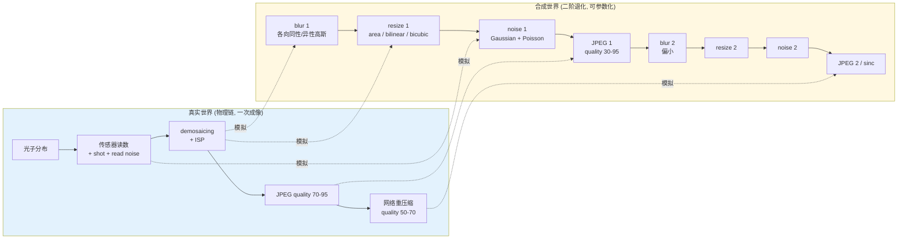
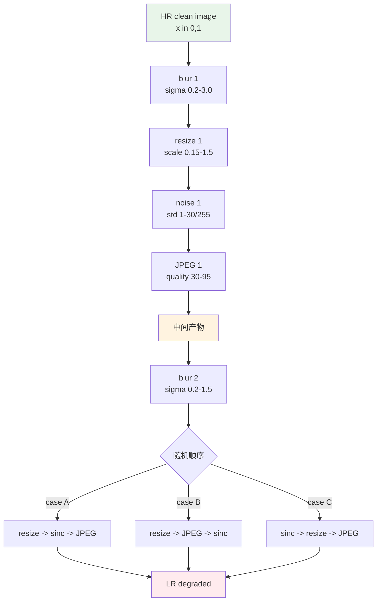
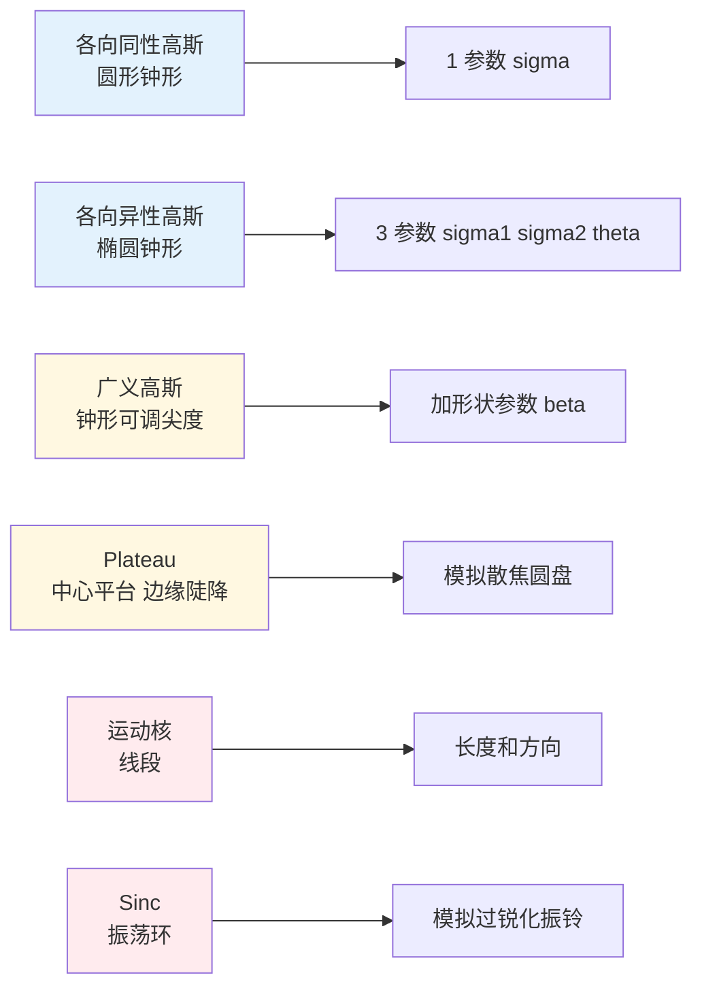
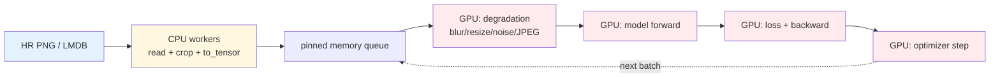

# 第 5 章 · 数据与退化合成

> 这是这本书最"工程"的一章。
>
> 影像增强领域有一句话流传很久：**Real-ESRGAN 的核心贡献不是网络，是数据**。
>
> 这一章把这句话拆解清楚。

## 5.0 阅读须知

本章是 Part I 的最后一章，也是全书最贴近工程实现的一章。前四章建立的概念在这里全部落到 Python 代码、目录结构、训练循环里。读完之后，你应当能直接动手写一份可以喂给 ESRGAN/Real-ESRGAN/Restormer 的训练 dataloader。

本章预设你已经掌握：

- 第 1 章里"退化算子 $D$ 是一串随机复合"的图像（§1.5 那张数据流图，本章会把它扩成更细的版本）
- 第 2-3 章里像素空间/特征空间和损失函数的对应
- 第 4 章里 PSNR/SSIM/LPIPS 与 NIQE/MANIQA 的区别（决定了什么时候"真值不存在"）

不预设你写过 Real-ESRGAN 的 dataloader 或者读过它七百行的退化代码。

**本章首次出现或将反复出现的缩写。** 为防止后面读到一半被术语劝退，先在这里列一遍：

- **Real-ESRGAN**：2021 年的代表性"真实场景"超分模型，论文核心贡献是退化合成 pipeline 而不是网络结构
- **BSRGAN**（Blind Super-Resolution GAN）：与 Real-ESRGAN 同期、思路相近的 blind SR 方案，由 Zhang et al. 提出，用"随机化退化顺序"训出一个对真实图鲁棒的 SR 模型
- **SRMD**（Super-Resolution with Multiple Degradations）：早期把"退化参数"作为条件喂给网络的工作，属于 non-blind 的折衷方案
- **KernelGAN**：用 GAN 在测试图上估退化核的方法，blind SR 的另一条路线
- **RRDB**（Residual in Residual Dense Block）：ESRGAN 提出的密集残差块，Real-ESRGAN 沿用它作为 backbone（详见第 6 章）
- **DiffJPEG**：可微的 JPEG 编解码实现，让退化 pipeline 能在 GPU 上整批做完 JPEG 步骤
- **DCT**（Discrete Cosine Transform，离散余弦变换）：JPEG 压缩的核心算子（已在 §1.0 介绍过，此处复述）
- **ISP**（Image Signal Processor，图像信号处理器）：相机内部把传感器读数变成 8-bit RGB 的整套流水线（同样已在 §1.0 介绍）
- **LMDB**（Lightning Memory-Mapped Database）：一个轻量级的 key-value 存储，常用来把大量小图像预编码缓存起来加速训练
- **USM**（Unsharp Mask，反掩模锐化）：传统图像处理里的锐化算子，先对图像做高斯模糊再用原图减去模糊版得到高频，再加回原图
- **chroma subsampling**（色度下采样）：JPEG 在 RGB → YCbCr 转换后把 Cb/Cr 两个色度通道按 4:2:0 等方式降分辨率存储，对人眼不敏感、对模型很敏感

后面用到具体术语时还会再展开一句话定义。

## 5.1 数据 > 网络

第 1 章提到过，2014-2020 年这个领域有一个反复出现的模式：

- 用 bicubic 下采样合成训练数据
- 在合成数据上训出 SOTA 网络
- 实际部署时模型在真实图像上几乎不工作

2021 年的 Real-ESRGAN 论文做了一个对比实验：

| 网络 | 训练数据 | 真实图像 PSNR | 真实图像视觉 |
|------|---------|--------------|------------|
| ESRGAN（RRDB 网络） | bicubic 退化 | 18.2 dB | 几乎不工作 |
| **Real-ESRGAN（同样的 RRDB 网络）** | **复杂退化合成** | **23.8 dB** | **可用** |

**网络没变，数据变了，性能从"不工作"到"可用"**。这是这个领域最重要的一次方法论修正。

类似的故事在去噪、去模糊、视频增强里反复出现：

- DnCNN 在 BSD68（标准基准）上无敌，在真实手机图上不行——用 SIDD 真实数据微调后大幅提升
- SUPIR 的关键之一是用了亿级互联网图像 + 复杂退化合成
- 视频去抖在合成抖动数据上完美，在真实手机视频上需要额外的真实数据

**工程哲学**：

> 在影像增强里，**数据 pipeline 决定了模型能力上限**。
> 同样的网络在不同数据上能差出一个数量级，反过来不成立。

这一章讲数据 pipeline 怎么设计。

## 5.2 训练数据的两种来源

### 合成数据

**做法**：拿一批高质量图（HR），用代码模拟退化得到（HR, LR）配对。

```python
# 伪流程
for hr in high_quality_images:
    lr = degradation_pipeline(hr)
    yield (lr, hr)
```

优点：

- **无限**：只要有 HR，就能合成无限多 (LR, HR) 对
- **便宜**：不需要拍照设备
- **可控**：能精确控制退化的每个参数

缺点：

- **不真实**：合成出的 LR 不一定像真实拍到的烂图
- **偏差**：所有"已知不真实"的部分会被模型学到

### 真实数据

**做法**：用相机/扫描仪在物理世界采集 (HR, LR) 对。

实现方式：

- **不同焦段**（RealSR、DRealSR）：同一相机用不同焦段拍同一场景，远焦图当作 HR、近焦图当作 LR
- **不同设备**（DPED）：低端手机和单反同时拍同一场景
- **降质模拟**（少见）：拿 HR 走特定流程（打印 + 扫描）得到 LR

优点：**真实**——所有退化都是物理过程，不是合成假设

缺点：

- **少**：几百到几千张配对，对数据驱动方法不够
- **对齐难**：两次拍摄的物体位置、光线、白平衡都会偏，需要复杂的对齐流程
- **退化模式有限**：你拍的是哪种相机的哪种退化，模型就只对这种退化好

**工程实践**：合成数据为主 + 真实数据微调。

## 5.3 经典 bicubic 流程的问题（再深入一点）

第 1 章已经提过 bicubic 退化的问题。这里再深入。

**真实低分辨率图的复杂性。** 一张被用户从相册里随手扔进来的图，经历过的处理大致是这样：

```
用户拍照流程:
  传感器 (光子噪声 + 读出噪声)
    → demosaicing (RGB 重建)
    → ISP (降噪 + 锐化 + 白平衡 + tone mapping + 色彩矩阵)
    → JPEG 压缩 (8-bit, quality 70-95)
    → 上传到微信/微博 (再压缩, quality 50-70)
    → 别人下载 (可能再压缩一次)
```

每一步都有自己的退化贡献，最终的 LR 是这些变化的非线性复合。其中 demosaicing 是把传感器 Bayer 阵列上每个像素只采到单一颜色（R 或 G 或 B）的数据重建成三通道彩色图的步骤，几乎所有相机内部都做这件事，但不同厂家的算法会留下不同的相邻像素相关性。

**bicubic 退化只模拟了哪一步？** 严格说，**一步都没真正模拟**。bicubic 假设 LR 是 HR 经过理想抗混叠滤波后再降采样的结果，整个过程是线性、可微、与场景内容无关的，**与上面这条物理链没有任何对应关系**。

ESRGAN 在 bicubic 数据上学到的恰恰是"反 bicubic 函数"。这个函数在 bicubic 测试集上表现完美，但只要测试图换成手机拍出来的真实低分辨率图，模型就会做出"反 bicubic"该做的事：把不该被锐化的噪点也按"高频信号"处理，结果输出一张满是放大噪点的图。这种迁移失败不是偶然，是函数空间根本不重叠。

**修正这个问题的方向：让训练数据的退化分布覆盖真实世界的退化分布。** Real-ESRGAN 的设计就是朝这个方向。下一节展开。

为了让 §5.4 的代码读起来不抽象，先把这一节的主张画成一张图：左边是真实世界用户拿到一张烂图的物理过程，右边是 Real-ESRGAN 用代码模拟的过程，中间用箭头标出哪个合成步骤对应哪个物理过程。



图里有几条规律值得记住。第一，物理链是一次性的、顺序固定的，合成链是有意打乱顺序、参数随机化的，因为模型要见过的不是某一台相机的退化，而是"所有可能的相机+所有可能的传输链"的退化分布。第二，物理链的某些步骤（如 ISP 降噪和锐化）会在 LR 上留下细节耦合，合成链很难精确复刻，所以 §5.12 才会强调"用真实数据微调"作为最后一公里。第三，合成链里两阶 JPEG 之间的中间产物是带块状伪影的，第二阶 JPEG 会进一步打乱这些块边界，这是 §5.4 里要强调"二阶"的根本原因。

## 5.4 Real-ESRGAN 退化 pipeline 详解

Real-ESRGAN 的 pipeline 由两个关键设计组成：

### 设计一：每个组件参数化 + 随机化

每一种退化（模糊、下采样、噪声、JPEG）都不是固定的，而是**从一个分布里随机采**。模型在训练时见到了广泛的退化分布。

### 设计二：二阶退化（high-order degradation modeling）

把整个退化流程跑两遍。这是 Real-ESRGAN 的核心创新，也是它在论文标题里就要强调的"high-order"的含义。

```
一阶退化 (模拟相机内部):
  HR → blur₁ → downsample₁ → noise₁ → jpeg₁ → 中间产物

二阶退化 (模拟传输/二次压缩):
  中间产物 → blur₂ → downsample₂ → noise₂ → jpeg₂ → LR
```

这样合成的 LR 就接近"图片被相机处理后又被互联网压缩多次"的真实状态。

第二阶的关键参数和第一阶**有意不同**：

- 第一阶 blur 偏大（模拟实际相机/传输模糊）
- 第二阶 blur 偏小（避免训练数据糊到不能学）
- 第二阶有可能加 **sinc 滤波**（基于 sinc 函数的滤波器，频域是矩形低通，时域会产生振荡）——模拟过度锐化导致的振铃伪影，这种伪影在 LCD 显示器/某些图像处理软件输出里特别常见
- 二阶最后阶段的 **resize / sinc / JPEG 顺序**在官方代码里是**随机化**的（每次训练 step 随机选一种顺序），不是固定的——这让模型见到更多组合

把"二阶 + 顺序随机化"画成一张状态图，更直观一些：



这张图里需要强调两个工程结论。第一，每个 step 的参数都是从一个明确的区间里随机采样的，所以"训练时模型见到的 $D$ 分布"被显式地写成了代码，而不是模糊地"希望它见过各种情况"。第二，最后三步顺序随机化的意义是让模型见到"先 resize 再 JPEG"和"先 JPEG 再 resize"两种结果，前者更像相机本机处理，后者更像微博转发链。模型如果只见过一种顺序，它会过拟合到该顺序留下的伪影模式。

### 一个简化版的 Real-ESRGAN pipeline

```python
import random
import torch
import torch.nn.functional as F
from typing import Optional


class RealESRGANDegradation:
    """Real-ESRGAN 风格退化的主流程示意 (非完整实现)。
    输入: HR clean image (B, 3, H, W) in [0, 1]
    输出: LR degraded image (B, 3, H/scale, W/scale) in [0, 1]

    与官方 Real-ESRGAN 的差异:
    - JPEG 用占位符 (官方用 diffjpeg)
    - 没有 sinc 滤波 (官方用来模拟过锐化伪影)
    - 模糊核只有各向同性高斯 (官方还有各向异性、广义高斯、plateau)
    - 退化顺序固定 (官方的最终阶段 sinc/resize/JPEG 顺序随机化)
    本节后面会逐项展开这些缺失部分。
    """

    def __init__(self, scale: int = 4):
        self.scale = scale

        # 一阶退化参数范围
        self.blur1_sigma_range = (0.2, 3.0)
        self.noise1_range = (1, 30)         # std on [0, 255]
        self.jpeg1_range = (30, 95)
        self.resize1_range = (0.15, 1.5)    # 相对 final size

        # 二阶退化参数范围 (整体偏弱)
        self.blur2_sigma_range = (0.2, 1.5)
        self.noise2_range = (1, 25)
        self.jpeg2_range = (30, 95)
        self.resize2_range = (0.3, 1.2)

    # ============= 模糊 =============
    def random_gaussian_blur(self, x: torch.Tensor,
                             sigma_range: tuple) -> torch.Tensor:
        sigma = random.uniform(*sigma_range)
        ksize = max(3, 2 * int(3 * sigma) + 1)
        kernel = self._gaussian_kernel_2d(ksize, sigma).to(x)
        kernel = kernel.expand(x.shape[1], 1, ksize, ksize)
        pad = ksize // 2
        return F.conv2d(F.pad(x, [pad]*4, mode='reflect'),
                        kernel, groups=x.shape[1])

    @staticmethod
    def _gaussian_kernel_2d(ksize: int, sigma: float) -> torch.Tensor:
        ax = torch.arange(ksize).float() - ksize // 2
        gauss = torch.exp(-(ax ** 2) / (2 * sigma ** 2))
        kernel = (gauss[:, None] * gauss[None, :])
        kernel = kernel / kernel.sum()
        return kernel.unsqueeze(0).unsqueeze(0)

    # ============= 下采样 =============
    def random_resize(self, x: torch.Tensor, target_size: tuple,
                      scale_range: tuple) -> torch.Tensor:
        """随机选择目标尺寸 (相对 target_size 缩放), 随机选插值。"""
        s = random.uniform(*scale_range)
        h, w = target_size
        new_h = max(1, int(h * s))
        new_w = max(1, int(w * s))
        mode = random.choice(['bilinear', 'bicubic', 'area'])
        kw = {'mode': mode}
        if mode in ('bilinear', 'bicubic'):
            kw['align_corners'] = False
        return F.interpolate(x, size=(new_h, new_w), **kw)

    # ============= 噪声 =============
    def random_noise(self, x: torch.Tensor,
                     sigma_range_255: tuple) -> torch.Tensor:
        """三种噪声等概率: 灰度高斯, 彩色高斯, 泊松。"""
        choice = random.random()
        sigma_max = random.uniform(*sigma_range_255) / 255.0

        if choice < 0.4:
            # 彩色高斯
            return (x + torch.randn_like(x) * sigma_max).clamp(0, 1)
        elif choice < 0.7:
            # 灰度高斯 (所有通道相同噪声)
            n = torch.randn(x.shape[0], 1, x.shape[2], x.shape[3], device=x.device)
            return (x + n * sigma_max).clamp(0, 1)
        else:
            # 泊松 (signal-dependent)
            scale = random.uniform(80, 1000)
            photons = (x * scale).clamp(min=0)
            return (torch.poisson(photons) / scale).clamp(0, 1)

    # ============= JPEG (简化, 真实需 diffjpeg) =============
    def random_jpeg(self, x: torch.Tensor, quality_range: tuple) -> torch.Tensor:
        """占位符。真实代码:
            from diffjpeg import DiffJPEG
            quality = random.randint(*quality_range)
            return DiffJPEG(differentiable=False)(x, quality)
        """
        # 用一个 8x8 box filter 近似一下 JPEG 的块状效应 (示意, 不用于训练)
        return x

    # ============= 一阶退化 =============
    def first_order(self, hr: torch.Tensor, target_size: tuple) -> torch.Tensor:
        x = self.random_gaussian_blur(hr, self.blur1_sigma_range)
        x = self.random_resize(x, target_size, self.resize1_range)
        x = self.random_noise(x, self.noise1_range)
        x = self.random_jpeg(x, self.jpeg1_range)
        return x

    # ============= 二阶退化 =============
    def second_order(self, x: torch.Tensor, target_size: tuple) -> torch.Tensor:
        x = self.random_gaussian_blur(x, self.blur2_sigma_range)
        x = self.random_resize(x, target_size, self.resize2_range)
        x = self.random_noise(x, self.noise2_range)
        x = self.random_jpeg(x, self.jpeg2_range)
        return x

    # ============= 主流程 =============
    def __call__(self, hr: torch.Tensor) -> torch.Tensor:
        """完整 Real-ESRGAN 风格退化。
        hr: (B, 3, H, W) in [0, 1]
        return: lr (B, 3, H/scale, W/scale)
        """
        b, c, h, w = hr.shape
        out_h, out_w = h // self.scale, w // self.scale

        # 一阶: 缩到 [0.15*out, 1.5*out] 之间的中间尺寸
        intermediate = self.first_order(hr, target_size=(out_h, out_w))

        # 二阶: 最终缩到 (out_h, out_w), 注意先 resize 到目标
        lr = self.second_order(intermediate, target_size=(out_h, out_w))

        # 强制最终尺寸 (二阶 resize 可能让尺寸偏离)
        lr = F.interpolate(lr, size=(out_h, out_w),
                          mode='bicubic', align_corners=False)
        return lr.clamp(0, 1)
```

实战中的版本会比这个复杂：完整的 Real-ESRGAN 代码大约 700 行。补的内容包括：

- 多种模糊核（各向异性、广义高斯、plateau）
- sinc 滤波（模拟过锐化伪影）
- 可微 JPEG（直接在 GPU 上做）
- 灰度图/彩色图的概率分配
- USM sharpening（Unsharp Mask，反掩模锐化）反向（模拟手机后处理）

USM 的具体做法是：先对图像做高斯模糊得到 $x_b$，然后用 $x_{usm} = x + \lambda (x - x_b)$ 增强高频，其中 $\lambda$ 控制锐化强度。手机厂商的 ISP 几乎都会内置 USM 风格的锐化，这导致用户拍到的图本身就带轻微"过锐化"特征。Real-ESRGAN 在合成时也加入 USM 步骤，让模型能"识别"这类已经被锐化过一遍的输入，避免在 SR 时再次叠加锐化导致看起来油腻。

但骨架就是上面这个，扩展只是把"采核"这一步从单一函数换成一族函数，把退化顺序从固定换成随机选择。读完 §5.5 到 §5.8 各组件之后，你应该能自己把上面的骨架补全到 production 级别。

## 5.5 模糊核家族

不同退化场景需要不同的模糊核。

### 各向同性高斯（最基础）

$$
k(u, v) = \frac{1}{2\pi\sigma^2} \exp\left(-\frac{u^2 + v^2}{2\sigma^2}\right)
$$

只有一个参数 $\sigma$。模拟散焦、大气模糊。$\sigma$ 越大模糊越严重，且模糊在所有方向上都一样。

### 各向异性高斯

$$
k(u, v) \propto \exp\left(-\frac{1}{2}\begin{pmatrix}u\\v\end{pmatrix}^T \Sigma^{-1} \begin{pmatrix}u\\v\end{pmatrix}\right)
$$

协方差矩阵 $\Sigma$ 控制 x/y 方向不同的模糊量。模拟相机抖动、镜头像差。把 $\Sigma$ 写开是：

$$
\Sigma = R(\theta)\begin{pmatrix}\sigma_1^2 & 0 \\ 0 & \sigma_2^2\end{pmatrix} R(\theta)^T
$$

其中 $R(\theta)$ 是旋转矩阵，$\theta$ 是模糊方向，$\sigma_1, \sigma_2$ 是两个主轴上的模糊尺度。三个参数共同决定核的形状（一个角度 + 两个尺度），比各向同性多两个自由度，能模拟"水平模糊比垂直模糊明显"这类常见的相机抖动残留。

### 广义高斯（Generalized Gaussian）

$$
k(u, v) \propto \exp\left(-\left(\frac{u^2}{\sigma_x^2} + \frac{v^2}{\sigma_y^2}\right)^\beta\right)
$$

多一个形状参数 $\beta$：$\beta = 1$ 是标准高斯，$\beta > 1$ 边缘更尖（更接近 box）、$\beta < 1$ 边缘更软。

### Plateau-shaped 核

Real-ESRGAN 还使用一族 **plateau 核**——中心是一个平坦的"平台"区域、边缘陡降。它和广义高斯是**两个独立的家族**，不是简单的"$\beta < 1$ 等于 plateau"。Plateau 核更接近于"散焦圆盘"的形状，常出现在小光圈大景深的场景里，是普通高斯核无法精确表示的。Real-ESRGAN 在采样训练核时会按概率混合这几族（各向同性高斯、各向异性高斯、广义高斯、plateau），具体比例在官方代码的 `degradations.py` 里可查；最常见的配比大致是各向同性高斯 0.55、各向异性 0.10、广义高斯 0.12、plateau 0.03，剩余概率留给 sinc。

### 运动模糊核

模拟拍摄时相机或被摄物体的直线运动。在曝光时间 $T$ 内，如果传感器相对场景以速度 $v$ 做直线移动，那么场景上的每个点会沿着运动方向在像面上扫出一条长度为 $vT$ 的线段。把这条线段离散化到像素网格、并归一化，就是一个最简形式的运动模糊核。它在频域里是一个 sinc 函数沿着运动方向的延拓，因此运动模糊不仅让边缘糊，还会在该方向上选择性地压制高频。

```python

```python
import numpy as np
import torch

def motion_blur_kernel(length: int, angle_deg: float) -> torch.Tensor:
    """长度为 length 的线段形运动模糊核, 方向 angle_deg 度。"""
    kernel = np.zeros((length, length), dtype=np.float32)
    angle = np.deg2rad(angle_deg)
    cx, cy = length // 2, length // 2
    for i in range(length):
        dx = int(round(cx + (i - cx) * np.cos(angle)))
        dy = int(round(cy + (i - cx) * np.sin(angle)))
        if 0 <= dx < length and 0 <= dy < length:
            kernel[dy, dx] = 1.0
    kernel /= kernel.sum()
    return torch.from_numpy(kernel).unsqueeze(0).unsqueeze(0)
```

更真实的运动核会让线段带轻微曲率（模拟手抖时的非匀速运动），或者把多条不同方向的短线段叠加（模拟相机抖动 + 物体局部运动）。Real-ESRGAN 的官方实现里运动核占比不高，主要是把它作为"低概率出现的难样本"采样进训练分布，避免模型在单一类型的模糊上过拟合。

### Sinc 滤波

$$
k(u, v) = \frac{\omega_c}{2\pi r} J_1(\omega_c r), \quad r = \sqrt{u^2 + v^2}
$$

其中 $J_1$ 是一阶 Bessel 函数。Sinc 在频域是理想低通滤波（rect 形），但截断的 sinc 在像素域有振荡——会产生**振铃**伪影。

为什么 Real-ESRGAN 用 sinc：模拟某些图像处理软件（如 Adobe 系产品）的锐化算法在过度处理后产生的振铃。这种伪影在真实"被处理过"的图像里很常见，尤其是从微博/Twitter 下载下来的"看起来挺锐其实细节是假的"那种图。模型如果没在训练数据里见过 sinc 风格的振铃，遇到这类输入时会把振铃当作真实高频去保留甚至放大，让输出看起来更假。

为了让"模糊核家族"这件事有个直观印象，下面这张图比较各种核在像素域的剖面形状：



颜色分组反映"难度"：左侧三族是高斯家族，参数少、采样便宜；中间两族需要额外几何参数，但仍可批量在 GPU 上生成；右侧两族（运动、sinc）形状特殊、对模型来说最难，需要专门采样且不能用单一高斯近似。

## 5.6 下采样的多种策略

不同的插值核在频域行为差别巨大：

| 算法 | 频域行为 | 视觉特点 | 何时用 |
|------|---------|---------|-------|
| nearest | 矩形（高频泄漏严重） | 锯齿 | 模拟极差的处理 |
| bilinear | 三角形 | 略糊 | 均衡选择 |
| bicubic | 接近 sinc | 锐利但有 ringing | 学术标准 |
| lanczos | 截断 sinc | 最锐利、振铃明显 | 模拟某些软件输出 |
| area / box | 矩形（空间） | 柔和无锯齿 | 大幅缩小时 |

Real-ESRGAN 的 pipeline 在每次 resize 时**随机选**这些之一，让模型见过各种插值伪影。

为什么这点重要，可以从频域角度理解一下：bicubic 在频域几乎是理想低通，会把高频干净地砍掉；nearest 完全不做低通，留下大量混叠；area 把每个 LR 像素取作 HR 块的均值，等价于 box filter，频域是 sinc 但对应在像素域是矩形，恰好能消除小幅运动模糊但放过粗大边缘。模型如果只见过 bicubic 的"干净低频图"，在面对真实图（这些图往往是 area 或 bilinear 处理过的）时就会把残留的混叠当成高频信号去"放大"，结果是把锯齿做得更尖锐而不是恢复细节。

工程上的一个微小但有用的细节：`torch.nn.functional.interpolate` 在 `align_corners=False` 时和 OpenCV 的 `cv2.resize` 默认设置基本一致；如果设成 `True`，则与一些老版 TensorFlow 的对齐方式一致，两者会在 1-2 像素的边缘处差异明显。线上推理时使用的 resize 库要和训练时一致，否则会出现"训练时是 bicubic，部署时调用的是 ImageMagick 的 catmull-rom 实现，输出尺寸差一行"这类不容易察觉的 bug。

## 5.7 噪声的实现细节

第 1 章已经讲过噪声的物理模型。这里补充几个工程细节。

### 灰度噪声 vs 彩色噪声

真实噪声的颜色相关性是个微妙问题，要从光学和处理流程两个层面理解：

- 高端相机（全画幅单反、中画幅）：传感器像元大、信噪比高，单帧噪声大致独立同分布（每通道独立），三通道噪声基本无相关
- 手机摄像头：像元小、ISO 常常很高，经过 demosaicing（用相邻像素插出缺失颜色）后，**相邻像素的噪声会相关**；色彩矩阵也会把不同通道的噪声混合，导致通道间也有相关
- ISP 降噪后：内置降噪算法会先把"独立的彩色噪点"压掉，剩余噪声常常是"灰色"（三通道相关，看上去像一层薄薄的灰雾）

工程实践：训练数据里**两种都给**——50% 时间用三通道独立的彩色噪声（模拟低 ISP 处理或 RAW），50% 时间用灰度噪声（所有通道共享同一张噪声 map，模拟 ISP 后残留）。再考究一点的实现会按 9:1 的比例混入"相邻像素相关"的噪声（用一张随机噪声做轻微高斯模糊后再加上去），模拟手机 demosaicing 后的实际状态。

### 噪声强度分布

噪声 sigma 不要均匀采样——真实场景里**小噪声更常见，大噪声较少见**。

工程上常用：

```python
# 偏小噪声居多的分布
sigma = torch.rand(()) ** 2 * sigma_max  # 平方让分布偏小
```

或者从一个明确的混合分布采：

```python
if random.random() < 0.5:
    sigma = random.uniform(0.005, 0.02)   # 小噪声 (常见)
else:
    sigma = random.uniform(0.02, 0.08)    # 大噪声 (少见但要见过)
```

### 真实传感器噪声模型

如果想做更精确的模拟，可以用论文 "A Physics-based Noise Formation Model for Extreme Low-light Raw Denoising"（CVPR 2020）提出的物理模型。

简化版：

```python
def realistic_sensor_noise(
    x: torch.Tensor,
    iso: int = 1600,
    quantum_efficiency: float = 0.5,
    read_noise_sigma: float = 0.005,
    dark_current: float = 0.001,
    quant_step: float = 1/255.0,
) -> torch.Tensor:
    """模拟真实传感器噪声链。
    iso 越大, 各类噪声越强。
    """
    # 模拟"相机增益"对噪声的影响
    gain = iso / 100.0

    # 1. 光子噪声 (Poisson, signal-dependent)
    photons = x * 1000 / gain  # 标定光子数
    photons_noisy = torch.poisson(photons.clamp(min=0))
    shot = photons_noisy / 1000 * gain

    # 2. 暗电流噪声
    dark = torch.poisson(torch.full_like(x, dark_current * gain)) / 1000

    # 3. 读出噪声 (Gaussian, signal-independent)
    read = torch.randn_like(x) * read_noise_sigma * gain

    # 4. 量化误差
    out = shot + dark + read
    out = (out / quant_step).round() * quant_step

    return out.clamp(0, 1)
```

这个模型对**手机暗光去噪**的训练数据合成至关重要。

## 5.8 JPEG 压缩

JPEG 是合成 pipeline 里最容易被忽略、又最关键的一步。如果训练数据里没有 JPEG，那么模型在面对任何"经过网络传输"的图时（也就是 99% 的真实输入）都会失效，因为 JPEG 块状伪影对模型来说是完全没见过的输入分布。

JPEG 的编解码流程简述如下，便于理解后面为什么"DCT 量化步"是不可微的核心：

1. RGB → YCbCr，把亮度 Y 和色度 Cb/Cr 分开
2. 对 Cb/Cr 做色度下采样（4:2:0 最常见，分辨率各砍一半）
3. 每个 8×8 块做 DCT，得到 64 个频域系数
4. 用 quality 决定的量化表对系数除法+取整
5. zig-zag 扫描 + 熵编码存盘

第 4 步的"取整"是把连续值映射到整数，**没有梯度**。这意味着如果想在端到端训练中让梯度穿过 JPEG，需要用一个软化的版本替代取整（例如 straight-through estimator 或者一阶 Taylor 展开），这正是 DiffJPEG 库做的事。

JPEG 在合成 pipeline 里需要满足：

1. **可以在 GPU 上做**（不要每张图存盘读盘）——读盘瓶颈会让 dataloader 卡死整个训练
2. **理想情况下可微**（虽然增强训练里梯度通常不会传过 JPEG，但可微版本性能也不错，且未来如果想加 perceptual loss 在 JPEG 后图上算梯度，可微是必需的）

推荐用 **DiffJPEG** 库（[github.com/mlomnitz/DiffJPEG](https://github.com/mlomnitz/DiffJPEG)），它实现了可微的 JPEG 编解码：

```python
from DiffJPEG import DiffJPEG

# 不需要可微 (推理用)
jpeg_module = DiffJPEG(differentiable=False, quality=80).to(device)

# 可微 (训练时如果想反传)
jpeg_module = DiffJPEG(differentiable=True, quality=80).to(device)

def random_jpeg_diffjpeg(x: torch.Tensor, quality_range=(30, 95)) -> torch.Tensor:
    quality = random.randint(*quality_range)
    return DiffJPEG(differentiable=False, quality=quality).to(x.device)(x)
```

### 第二阶 JPEG 的特殊性

Real-ESRGAN 的二阶 JPEG 模拟"已经压缩过的图被再次压缩"。这种情况下：

- 第一阶 JPEG 的块状伪影会被第二阶 JPEG 进一步混乱
- 两次 JPEG 的 8×8 块边界一般不重合，因为中间夹了一次 resize，导致复杂的非对齐复合伪影
- 真实"网络重传"图像里这种现象普遍存在——你保存的微博图被别人重转后，块边界已经"漂移"过一次

直接两次调用 JPEG 就能模拟这种现象。值得注意的细节：第二阶 JPEG 的 quality 不需要比第一阶低，反过来甚至常见（手机 → 微信 quality 70 → 你保存时 quality 90），重点是**两次量化网格不对齐**，而不是 quality 数值本身。

### 关于 chroma subsampling 的额外提醒

JPEG 的 4:2:0 色度下采样会把 Cb/Cr 通道分辨率降低一半，对人眼几乎察觉不到，但模型会通过它学到"绿色边缘比红色边缘要锐利"等不真实的关系。如果你的目标是修复"被网络压扁的图"，那么训练时的 JPEG 模拟一定要保留 chroma subsampling；如果你的目标是修复"高保真专业拍摄但有轻微 JPEG 伪影"，可以关掉。DiffJPEG 默认是 4:2:0。

## 5.9 数据集选择

按用途列出常用数据集：

### 通用 SR / 去噪 / 去模糊

| 数据集 | 张数 | 特点 | 用途 |
|-------|------|------|------|
| **DIV2K** | 800 + 100 val | 高质量自然图，2K 分辨率 | 学术标准 |
| **Flickr2K** | 2650 | DIV2K 风格补充 | 与 DIV2K 合并成 DF2K |
| **LSDIR** | 84,991 + 250 val | 2023 大规模数据集 | 现代训练首选 |
| **BSD500** | 500 | 老但经典 | 去噪 |
| **OST300** | 300 | 户外纹理特化 | 真实 SR 辅助 |
| **WED** | ~5000 | Watermark/exif 多样 | 真实场景 |

### 真实退化（无合成）

| 数据集 | 张数 | 特点 |
|-------|------|------|
| **RealSR** | 595 (V3) | Canon + Nikon 不同焦段对 |
| **DRealSR** | ~800 | DSLR 不同焦段，对齐更精 |
| **NTIRE Real-World SR** | 每年增 | 比赛数据，质量高 |
| **DPED** | ~16K | 手机 vs 单反 |
| **SIDD** | 320 (HR) + 30K (LR) | 真实手机噪声 |
| **DND** | 50 测试 | Darmstadt Noise Dataset，真实噪声测试 |

### 任务特化

| 数据集 | 用途 |
|-------|------|
| **FFHQ** | 70K 高质量人脸，人脸增强 |
| **CelebA-HQ** | 30K 人脸，老一点的标准 |
| **REDS** | 视频去模糊/SR |
| **Vimeo-90K** | 视频帧插值 |
| **GoPro** | 视频去模糊 |
| **UDM10** | 视频去噪 |

### 数据集组合策略

最常见的两种：

1. **学术标准**：DF2K（DIV2K + Flickr2K）训练，Set5/14/B100/Urban100/Manga109/DIV2K val 测试
2. **真实导向**：LSDIR + DF2K + OST300 训练，加少量 RealSR 微调，DRealSR/RealSR 测试

学术标准的好处是结果可比，缺点是 benchmark 都很小（Set5 真的只有 5 张），结论的统计意义有限。真实导向的好处是反映生产分布，缺点是没有标准化测试集让你和别人的论文做横向比较——你只能拿自己的真实 holdout 集做内部对比。生产环境里两套都跑一遍是常见做法：学术 benchmark 用来确认"没把基础能力训差"，真实测试集用来确认"对得起这次部署"。

## 5.10 数据增广

低层视觉的数据增广和分类任务很不同。**安全**的：

```python
# 安全增广 (不改变退化模型)
import torchvision.transforms.functional as TF

def safe_augment(hr: torch.Tensor, lr: torch.Tensor):
    """对 HR-LR 配对做同步的安全增广。"""
    # 随机水平翻转
    if random.random() < 0.5:
        hr = TF.hflip(hr); lr = TF.hflip(lr)
    # 随机垂直翻转
    if random.random() < 0.5:
        hr = TF.vflip(hr); lr = TF.vflip(lr)
    # 90° 旋转
    if random.random() < 0.5:
        k = random.choice([1, 2, 3])
        hr = torch.rot90(hr, k, dims=[-2, -1])
        lr = torch.rot90(lr, k, dims=[-2, -1])
    return hr, lr
```

**慎用**的：

- **色彩抖动**：会改变退化分布，模型学到错的颜色映射；对于真实退化模型来说，色彩偏移本身是 $D$ 的一部分，不应被当作"任意可改"的增广轴
- **任意角度旋转**：插值会引入额外退化（实际是又一次 bicubic/bilinear 重采样），不在原始 $D$ 里，模型会学到"输出带轻微插值伪影"是正常的
- **随机缩放**：等同于改 scale factor，增强 SR 时不要——SR 模型的输入输出尺寸关系是任务定义的一部分
- **mixup / cutmix**：低层视觉用得很少，效果不明确；它们的设计前提是"任务对类别 invariant"，但像素回归任务里每个像素都有真值，混合两张图的像素没有清晰的语义

**裁剪策略**：

```python
def random_crop(hr: torch.Tensor, lr: torch.Tensor,
                lr_size: int, scale: int):
    """随机裁剪 LR + 对应 HR 区域。"""
    _, _, lr_h, lr_w = lr.shape
    top  = random.randint(0, lr_h - lr_size)
    left = random.randint(0, lr_w - lr_size)
    lr_crop = lr[:, :, top:top+lr_size, left:left+lr_size]
    hr_crop = hr[:, :, top*scale:(top+lr_size)*scale,
                       left*scale:(left+lr_size)*scale]
    return hr_crop, lr_crop
```

## 5.11 数据加载 pipeline 优化

退化合成的计算量不小（特别是模糊 + JPEG），如果在 CPU 上做会成为训练瓶颈。两种优化：

### 选项一：CPU 多 worker

```python
from torch.utils.data import DataLoader, Dataset

class SRDataset(Dataset):
    def __init__(self, hr_paths, scale=4, crop_size=256):
        self.hr_paths = hr_paths
        self.degrader = RealESRGANDegradation(scale=scale)
        self.crop_size = crop_size

    def __len__(self):
        return len(self.hr_paths)

    def __getitem__(self, idx):
        hr = load_image(self.hr_paths[idx])  # PIL or cv2
        hr = random_crop_hr(hr, self.crop_size)
        hr_tensor = to_tensor(hr).unsqueeze(0)  # (1, 3, H, W)
        lr_tensor = self.degrader(hr_tensor)
        return hr_tensor.squeeze(0), lr_tensor.squeeze(0)


loader = DataLoader(
    SRDataset(hr_paths),
    batch_size=16,
    num_workers=8,           # 8 CPU workers
    pin_memory=True,
    persistent_workers=True,
)
```

### 选项二：GPU 上做退化（Real-ESRGAN 推荐）

把退化 pipeline 移到 GPU 上，整个 batch 一次过。这个方案乍看违反直觉：通常我们把数据预处理放在 CPU 上让 GPU 专心做矩阵乘。但是退化合成里 blur、JPEG、resize 这几步本身就是大量卷积和频域变换，跑在 GPU 上比 CPU 快 20× 以上，把它们留在 CPU 反而拖垮整个训练。

```python
# 训练循环里
for hr_batch in loader:                  # CPU 只读 HR
    hr_batch = hr_batch.cuda()
    lr_batch = degrader(hr_batch)        # GPU 上一次性合成
    pred = model(lr_batch)
    loss = compute_loss(pred, hr_batch)
    ...
```

Real-ESRGAN 的官方代码就用这种模式。优点：

- 大幅减少 CPU 工作量
- 可以用更复杂的退化（多 GPU 并行合成）
- 退化结果可以利用 GPU 的随机性（每个 step 不一样）

缺点：

- 占 GPU 显存（一些临时 tensor）
- 退化代码必须支持 batched + GPU

为了让"CPU 读 + GPU 退化"两边都不空转，整个数据流应该长成下面这样：



这张图里有两个工程窍门容易被忽视。第一，pinned memory queue 是 PyTorch 的 `pin_memory=True` 开启的固定内存缓冲区，让 CPU 到 GPU 的拷贝可以走异步 DMA，不阻塞主进程；第二，退化步骤要写成"batch 级 + 完全 GPU 可执行"，任何不小心写成 Python for-loop 或者 `.cpu()` 的代码都会让训练 throughput 掉一个数量级。

### LMDB 存储加速大数据集

LSDIR 这种 8 万+ 张图的数据集，每个 epoch 解码 PNG 是显著开销。用 LMDB 把数据预编码后存为 key-value 数据库，加载快 5-10×：

```python
import lmdb
import pickle

# 写入
env = lmdb.open('lsdir.lmdb', map_size=int(1e12))
with env.begin(write=True) as txn:
    for i, path in enumerate(hr_paths):
        img_bytes = open(path, 'rb').read()  # 或者预 decode 成 numpy
        txn.put(f"{i:08d}".encode(), pickle.dumps(img_bytes))

# 读取
class LMDBDataset(Dataset):
    def __init__(self, lmdb_path, length):
        self.env = lmdb.open(lmdb_path, readonly=True, lock=False)
        self.length = length

    def __getitem__(self, idx):
        with self.env.begin() as txn:
            data = pickle.loads(txn.get(f"{idx:08d}".encode()))
        # decode bytes to image
        ...
```

## 5.12 真实数据微调

通用最佳实践：

```
阶段 1: pretrain (合成数据)
  - 数据: DF2K + LSDIR
  - 退化: Real-ESRGAN pipeline
  - 训练步数: 500K - 1M
  - 目标: 学到通用的退化恢复能力

阶段 2: fine-tune (真实数据)
  - 数据: RealSR / DRealSR (几百张)
  - 训练步数: 10K - 50K (远少于 pretrain)
  - 学习率: 比 pretrain 小 10×
  - 目标: 把通用模型 calibrate 到真实退化分布
```

不直接在真实数据上从头训的原因：数据太少（几百张）—— 模型容易过拟合到这几百张的具体物体和场景。这是一个典型的 catastrophic specialization 陷阱：模型在训练集物体上 PSNR 涨得飞快，但任何换一类场景就崩。两阶段训练法本质上是用合成数据先把模型的"先验"打牢，让真实数据只负责微小的分布对齐，而不必从零学习"自然图像应该长什么样"。

微调阶段还有几个工程细节需要注意。学习率不仅要比 pretrain 小一个数量级，最好也用 cosine schedule 让它在最后几千步降到几乎为零，避免模型在小数据上反复震荡。EMA（Exponential Moving Average，对权重做指数移动平均的影子副本）在微调阶段尤其重要，它能进一步把训练抖动平滑掉。最后，验证集要用与微调集**不同来源**的真实图（比如微调用 RealSR，验证用 DRealSR），否则你看到的提升完全可能是过拟合。

## 5.13 数据质量审计

在跑训练前，**审计你的训练数据本身**：

### HR 数据是否真"高质量"

DIV2K 的 HR 看起来高质量，但仍有：

- 轻微 JPEG 压缩痕迹
- 偶尔的 noise pattern
- 局部过曝 / 欠曝

如果 HR 本身有压缩伪影，模型会学到"输出带轻微压缩伪影是正常的"——你的"HR 真值"不是真正的 ground truth。

工程检查：

```python
# 审计 HR 数据集的 JPEG 压缩痕迹
def audit_jpeg_traces(hr_path: str) -> float:
    """通过分析 8x8 块边界处的不连续性, 估计 HR 数据有多"被压缩过"。
    返回值越大, JPEG 压缩痕迹越明显。
    """
    img = cv2.imread(hr_path)
    img = img.astype(np.float32)
    # 块边界 (8 的倍数列/行) 处的差异
    h, w = img.shape[:2]
    block_diff = 0
    for i in range(7, h-1, 8):
        block_diff += np.abs(img[i] - img[i+1]).mean()
    for j in range(7, w-1, 8):
        block_diff += np.abs(img[:, j] - img[:, j+1]).mean()
    return block_diff
```

### 数据多样性审计

模型在某类内容上失败，常常是数据偏差：

- 如果训练数据 90% 是城市/自然风景，模型在文档/截图上失败
- 如果训练数据全是日光照片，模型在夜景上失败
- 如果训练数据全是西方人脸，模型在亚洲/非洲人脸上失败

这种偏差不会被指标显示出来——平均 PSNR 看起来正常，但失败模式集中。第 17 章会专门讲。

最简单的审计：

```python
# 用 CLIP 把训练集每张图嵌入, 然后聚类看分布
import open_clip

clip_model, _, preprocess = open_clip.create_model_and_transforms('ViT-B-32')
embeddings = []
for path in hr_paths:
    img = preprocess(Image.open(path)).unsqueeze(0)
    with torch.no_grad():
        emb = clip_model.encode_image(img).cpu().numpy()
    embeddings.append(emb)

# K-means 聚 20 类, 看每类是什么内容、占比多少
from sklearn.cluster import KMeans
clusters = KMeans(n_clusters=20).fit_predict(np.vstack(embeddings))
```

如果某一类占比极少（< 1%），考虑专门补这部分数据。

### 不平衡退化分布的隐患

合成数据的另一个隐藏问题是退化参数本身的分布。假设你的 blur sigma 范围是 [0.2, 3.0]，看似合理，但如果你用均匀采样，那么 [2.5, 3.0] 区间的样本和 [0.2, 0.7] 区间的样本数量相同——而实际真实世界的模糊几乎都集中在小 sigma 端。这会导致模型在"轻微模糊"输入上反应过度（把本来清晰的小细节当成需要去模糊的对象），在"严重模糊"输入上反而表现不错。

工程上常见的修正是把均匀采样换成对数采样或者 beta 分布采样：

```python
import math
import random

def log_uniform(low: float, high: float) -> float:
    """对数均匀分布, 让小值更常被采到。"""
    return math.exp(random.uniform(math.log(low), math.log(high)))

# 用法
sigma = log_uniform(0.2, 3.0)
```

类似的修正适用于噪声 sigma、JPEG quality 等所有"退化强度"参数。在生产中观察到模型表现异常时，第一步排查就是看训练参数分布是否和你 deploy 时遇到的真实分布对得上。

## 5.14 小结

1. **数据 > 网络**：低层视觉里同样的网络在不同数据上能差一个数量级
2. **bicubic 退化是这个领域 5 年的方法论错误**，Real-ESRGAN 系统性纠正了它
3. **退化 pipeline 三个核心**：参数化 + 随机化 + 二阶
4. **每个组件都是一个家族**：模糊核多种、噪声多种、JPEG 多 quality、resize 多算法
5. **数据集的选择决定模型能见到什么世界**：DF2K + LSDIR 是合成数据通用基础，RealSR/DRealSR 用于真实退化微调
6. **数据加载 pipeline 优化**：GPU 上做退化是 Real-ESRGAN 风格的事实标准
7. **数据增广要克制**：低层视觉只用翻转 + 90° 旋转，色彩抖动等会破坏退化模型
8. **审计你的 HR 数据**：HR 本身的 JPEG 痕迹和数据偏差会被模型学到
9. **真实数据微调**是把合成训练模型 calibrate 到真实分布的关键步骤

到这里 Part I 五章全部完成。读完这五章，你应当能：

- 看到一张烂图，知道它经历了哪些 D
- 看到一个增强模型，知道它在哪种空间预测、用什么损失
- 看到一组指标，知道哪些可信、哪些有偏
- 看到一个数据 pipeline，知道它能 cover 真实分布的哪部分

Part II 开始我们进入具体的网络架构。第一站是 CNN 时代——这条线从 2014 年的 SRCNN 一直走到 2022 年的 NAFNet，是这个领域的"传统重武器"。

---

> 下一章 [CNN 时代](06-cnn.md) → 从 SRCNN 三层网络到 NAFNet 移除所有非线性激活，CNN 在低层视觉走过的 8 年。
