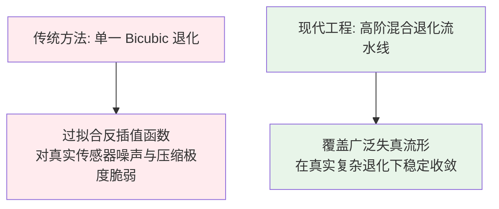
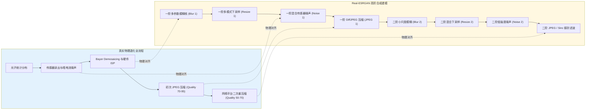
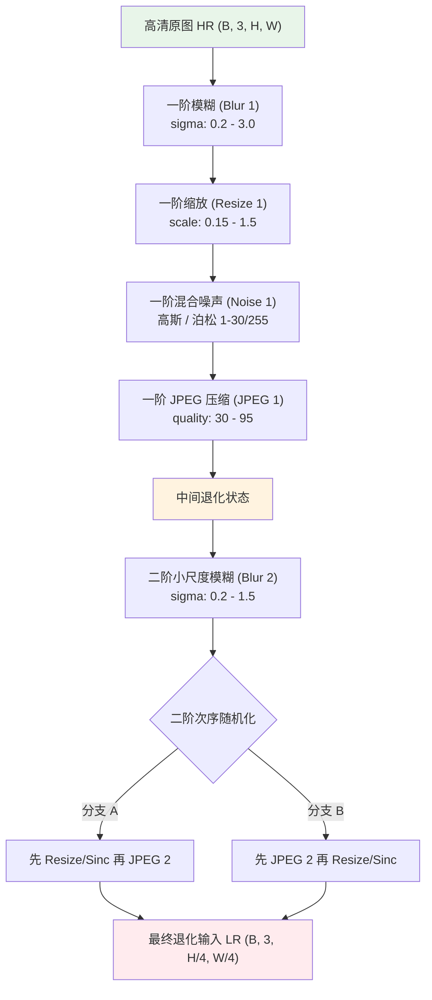
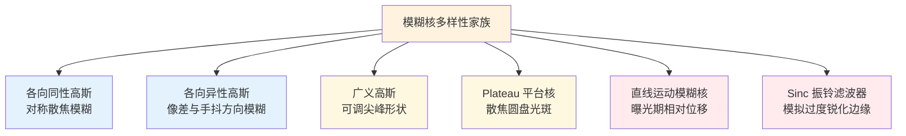
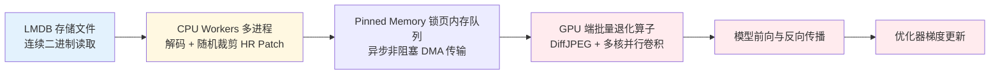

# 第 5 章 · 数据与退化合成

> 图像复原与超分辨率工程的核心瓶颈往往不在网络架构本身，而在于训练退化数据的分布建模。
>
> 深入剖析 Real-ESRGAN 的高阶退化合成流水线与工程优化，是掌握真实场景鲁棒复原的关键。

## 5.0 阅读须知

本章是第一篇（原理与基础）的收官章节，也是全书最贴近工程实现的一章。前四章建立的数学概念与先验理论，将在本章具象化为 Python 数据加载器、GPU 批处理流水线与目录存储架构。读完本章，你将能够独立构建面向 ESRGAN、Real-ESRGAN 与 Restormer 等主流架构的高性能退化合成数据管道。

本章预设你已掌握：

- 第 1 章关于复合退化算子 $D$ 的物理建模（包含模糊、下采样、加性/乘性噪声及有损压缩的链式组合）
- 第 2-3 章关于像素空间、特征空间与多目标损失函数的对应关系
- 第 4 章关于全参考（PSNR/SSIM/LPIPS）与无参考（NIQE/MANIQA）评估指标的适用边界

**本章首次出现或重点展开的缩写与术语：**

- **Real-ESRGAN**：2021 年提出的真实场景盲超分辨率算法，其核心创新在于高阶退化建模流水线（High-Order Degradation Modeling）
- **BSRGAN**（Blind Super-Resolution GAN）：采用随机退化次序生成复杂失真样本的盲超分辨率算法
- **SRMD**（Super-Resolution with Multiple Degradations）：将退化核与噪声水平作为显式条件输入网络的非盲超分方案
- **DiffJPEG**：基于 PyTorch 的可微/非可微 GPU 批量 JPEG 编解码实现，消除 CPU 磁盘读写瓶颈
- **DCT**（Discrete Cosine Transform，离散余弦变换）：JPEG 压缩算法中实现空域至频域能量集中的核心正交变换
- **ISP**（Image Signal Processor，图像信号处理器）：相机硬件管线中将原始 Sensor RAW 数据转换为标准 sRGB 图像的算法集成芯片
- **LMDB**（Lightning Memory-Mapped Database）：基于内存映射文件的高性能键值数据库，常用于大规模训练集的高吞吐读取
- **USM**（Unsharp Masking，反掩模锐化）：通过从原图中扣除高斯低通滤波分量以强化局部高频边缘的经典图像增强算子
- **Chroma Subsampling**（色度下采样）：利用人眼对色度空间分辨率不敏感的生理特性，在 YCbCr 空间对 Cb/Cr 分量进行降采样存储的有损压缩策略（如 4:2:0、4:2:2）

## 5.1 数据工程主导模型泛化能力

在 2014 至 2020 年的早期超分辨率文献中，普遍存在一种方法论偏差：

1. 仅采用理想双三次下采样（Bicubic）合成配对训练数据
2. 在合成数据集上刷榜并刷新 PSNR/SSIM 指标
3. 部署于手机实拍、网络传输等真实场景时，模型由于输入分布失配而发生灾难性退化

Real-ESRGAN（Wang et al. 2021）通过一组控制变量实验揭示了数据分布的决定性作用：

| 网络骨干架构 | 训练集退化建模策略 | 合成测试集 PSNR (dB) | 真实场景实拍测试观感 |
|-------------|-------------------|---------------------|-------------------|
| **ESRGAN（RRDB 骨干）** | 经典 Bicubic 单一下采样 | 18.2 | 无法处理真实噪点，伪影严重 |
| **Real-ESRGAN（完全相同的 RRDB 骨干）** | 复杂高阶退化合成流水线 | **23.8** | 边缘锐利自然，高度可用 |

实验表明：**在网络骨干保持不变的前提下，仅重构退化数据流水线，即可使模型在真实场景下的可用性发生根本性转变。**

类似结论在图像去噪与去模糊领域屡获验证：

- 经典 DnCNN 在合成高斯白噪声测试集上性能优异，面对真实手机传感器暗光噪点时迅速失效，引入真实 RAW 噪声建模后泛化性显著提升
- 前沿扩散增强模型（如 SUPIR）的核心竞争力，极大程度建立在千万级高质量图像与复杂高阶退化合成流水线的基础之上



## 5.2 训练数据的两大来源与工程权衡

### 合成数据管道（Synthetic Data Pipeline）

**技术路径**：收集大规模高清真值图像（HR），在训练期通过随机参数化算子在线模拟退化过程，动态生成低质输入（LR）。

```python
# 合成数据在线生成逻辑
for hr_batch in high_resolution_loader:
    lr_batch = degradation_pipeline(hr_batch)
    yield (lr_batch, hr_batch)
```

- **核心优势**：
  1. **样本规模无限**：依托通用高清数据集即可源源不断合成无穷无尽的配对样本
  2. **边际成本极低**：无需昂贵的光学实验室标定设备与实景拍摄人力
  3. **退化空间完全可控**：能够精确调节模糊核半径、噪声信噪比与压缩质量因子的参数区间
- **固有缺陷**：合成退化算子是对真实物理成像过程的近似，未建模的物理效应（如特定传感器的固定模式噪声 FPN）容易引发分布漂移。

### 真实光学配对数据（Real-World Paired Data）

**技术路径**：在物理世界中使用专业光学变焦相机或多设备协同采集硬件对齐的（HR, LR）对。

- **实现方案**：
  1. **光学焦段切换**（如 RealSR、DRealSR）：保持相机位置固定，长焦拍摄作为 HR，广角拍摄裁剪后作为 LR
  2. **双摄分光支架**（如 DPED）：通过分光棱镜同步触发单反相机（HR）与低端手机（LR）曝光
- **核心优势**：包含真实的传感器物理噪声、透镜像差、暗角与硬件 ISP 处理伪影。
- **工程局限**：
  1. **样本规模受限**：受制于实拍成本，公开数据集通常仅有数百至数千对
  2. **亚像素几何与测光失配**：变焦或双摄不可避免存在局部视差、白平衡漂移与全局几何形变，直接用像素 L1 训练会导致网络输出边缘重影
  3. **泛化范围狭窄**：模型容易过拟合特定相机型号的 ISP 风格

**最佳工业落地范式**：以大规模合成数据进行深度预训练，再以少量业务场景真实配对数据进行小学习率微调对齐。

## 5.3 物理成像链与 Bicubic 假设的理论脱节

一张用户拍摄并上传至互联网的低质图像，经历的实际物理与信号链如下：

```
物理成像与传输退化链:
  入射光子
    → 光学镜头 (光学像差 + 衍射极限 + 散焦)
    → 传感器像元 (光子散粒噪声 + 读出噪声 + 暗电流)
    → 拜耳滤色阵列 Demosaicing (色彩插值引入相邻相关性)
    → 硬件 ISP (非线性降噪 + USM 锐化 + 自动白平衡 + 伽马色调映射)
    → 相机本地 JPEG 压缩 (8-bit 量化, Quality 70-95)
    → 社交平台网络重压缩 (二次 JPEG/WebP 压缩, Quality 50-70)
```

**Bicubic 下采样的数学本质**仅仅是理想抗混叠低通滤波后的网格重采样，其假定退化过程是全线性、空间平移不变且无噪声注入的。用 Bicubic 数据训练超分网络，本质是让网络逆解一个确定性的三次卷积多项式。一旦输入图像带有传感器噪点，网络会错误地将高频噪点判定为插值高频残差并进行大幅放大，导致输出严重劣化。



## 5.4 Real-ESRGAN 高阶退化流水线解构

Real-ESRGAN 的核心设计包含两大维度：

1. **组件参数化与连续分布采样**：模糊核、插值模式、噪声类型与压缩质量均从预设连续区间内独立随机采样，消除模型对固定参数的记忆效应。
2. **二阶退化建模（High-Order Degradation Modeling）**：将模糊、下采样、加噪与压缩的完整退化链连续串联执行两次，完美复刻真实图像“相机初次成像 + 互联网重采样二次压缩”的复合退化状态。



### Real-ESRGAN 退化管道核心原型实现

```python
import random
import torch
import torch.nn.functional as F


class RealESRGANDegradation:
    """Real-ESRGAN 风格高阶退化生成核心逻辑。
    输入: 高清张量 (B, 3, H, W), 范围 [0, 1]
    输出: 低质退化张量 (B, 3, H/scale, W/scale), 范围 [0, 1]
    """

    def __init__(self, scale: int = 4):
        self.scale = scale

        # 一阶退化参数区间
        self.blur1_sigma_range = (0.2, 3.0)
        self.noise1_range = (1, 30)         # 对应 8 位尺度下的噪声标准差
        self.jpeg1_range = (30, 95)
        self.resize1_range = (0.15, 1.5)

        # 二阶退化参数区间（整体强度适度减弱，防止信息完全灭失）
        self.blur2_sigma_range = (0.2, 1.5)
        self.noise2_range = (1, 25)
        self.jpeg2_range = (30, 95)
        self.resize2_range = (0.3, 1.2)

    def random_gaussian_blur(self, x: torch.Tensor,
                             sigma_range: tuple) -> torch.Tensor:
        sigma = random.uniform(*sigma_range)
        ksize = max(3, 2 * int(3 * sigma) + 1)
        kernel = self._gaussian_kernel_2d(ksize, sigma).to(x)
        kernel = kernel.expand(x.shape[1], 1, ksize, ksize)
        pad = ksize // 2
        return F.conv2d(F.pad(x, [pad]*4, mode='reflect'),
                        kernel, groups=x.shape[1])

    @staticmethod
    def _gaussian_kernel_2d(ksize: int, sigma: float) -> torch.Tensor:
        ax = torch.arange(ksize).float() - ksize // 2
        gauss = torch.exp(-(ax ** 2) / (2 * sigma ** 2))
        kernel = (gauss[:, None] * gauss[None, :])
        kernel = kernel / kernel.sum()
        return kernel.unsqueeze(0).unsqueeze(0)

    def random_resize(self, x: torch.Tensor, target_size: tuple,
                      scale_range: tuple) -> torch.Tensor:
        s = random.uniform(*scale_range)
        h, w = target_size
        new_h = max(1, int(h * s))
        new_w = max(1, int(w * s))
        mode = random.choice(['bilinear', 'bicubic', 'area'])
        kw = {'mode': mode}
        if mode in ('bilinear', 'bicubic'):
            kw['align_corners'] = False
        return F.interpolate(x, size=(new_h, new_w), **kw)

    def random_noise(self, x: torch.Tensor,
                     sigma_range_255: tuple) -> torch.Tensor:
        choice = random.random()
        sigma_max = random.uniform(*sigma_range_255) / 255.0

        if choice < 0.4:
            # 独立彩色高斯噪声
            return (x + torch.randn_like(x) * sigma_max).clamp(0, 1)
        elif choice < 0.7:
            # 单通道灰度高斯噪声（三通道共享相同噪声图）
            n = torch.randn(x.shape[0], 1, x.shape[2], x.shape[3], device=x.device)
            return (x + n * sigma_max).clamp(0, 1)
        else:
            # 泊松散粒噪声（信号相关）
            scale = random.uniform(80, 1000)
            photons = (x * scale).clamp(min=0)
            return (torch.poisson(photons) / scale).clamp(0, 1)

    def random_jpeg(self, x: torch.Tensor, quality_range: tuple) -> torch.Tensor:
        # 生产环境调用 DiffJPEG 实现
        return x

    def first_order(self, hr: torch.Tensor, target_size: tuple) -> torch.Tensor:
        x = self.random_gaussian_blur(hr, self.blur1_sigma_range)
        x = self.random_resize(x, target_size, self.resize1_range)
        x = self.random_noise(x, self.noise1_range)
        x = self.random_jpeg(x, self.jpeg1_range)
        return x

    def second_order(self, x: torch.Tensor, target_size: tuple) -> torch.Tensor:
        x = self.random_gaussian_blur(x, self.blur2_sigma_range)
        x = self.random_resize(x, target_size, self.resize2_range)
        x = self.random_noise(x, self.noise2_range)
        x = self.random_jpeg(x, self.jpeg2_range)
        return x

    def __call__(self, hr: torch.Tensor) -> torch.Tensor:
        b, c, h, w = hr.shape
        out_h, out_w = h // self.scale, w // self.scale

        # 阶段一退化
        intermediate = self.first_order(hr, target_size=(out_h, out_w))

        # 阶段二退化
        lr = self.second_order(intermediate, target_size=(out_h, out_w))

        # 强制对齐到最终规格尺寸
        lr = F.interpolate(lr, size=(out_h, out_w),
                           mode='bicubic', align_corners=False)
        return lr.clamp(0, 1)
```

## 5.5 模糊核全家族物理拓扑

在盲复原任务中，单一各向同性高斯核无法满足复杂光学失真建模。工业级退化管道需融合多种核拓扑：



### 核心核函数数学表征

1. **各向异性高斯核**：引入协方差矩阵 $\Sigma = R(\theta) \begin{pmatrix} \sigma_1^2 & 0 \\ 0 & \sigma_2^2 \end{pmatrix} R(\theta)^T$，通过主轴尺度比 $\sigma_1/\sigma_2$ 与旋转角 $\theta$ 模拟方向性模糊。
2. **广义高斯核**：引入形状参数 $\beta$：$k(u, v) \propto \exp\left(-\left(\frac{u^2}{\sigma_x^2} + \frac{v^2}{\sigma_y^2}\right)^\beta\right)$，$\beta < 1$ 时呈现重尾分布，$\beta > 1$ 时边缘急剧收敛。
3. **Plateau 平台核**：中心区域为平坦顶盖、外围快速衰减，精准拟合大光圈光学系统的离焦弥散圆（Circle of Confusion）。
4. **Sinc 滤波核**：频域为理想矩形低通滤波，时域表现为环状空间振荡。引入 Sinc 滤波的目的是模拟图像经由传统 USM 锐化算法处理后遗留的振铃光晕（Ringing Artifacts），防止超分网络将振铃误判为真实边缘。

```python
import numpy as np
import torch

def motion_blur_kernel(length: int, angle_deg: float) -> torch.Tensor:
    """生成线段运动模糊核，模拟曝光时间内相机与物体的相对平移。"""
    kernel = np.zeros((length, length), dtype=np.float32)
    angle = np.deg2rad(angle_deg)
    cx, cy = length // 2, length // 2
    for i in range(length):
        dx = int(round(cx + (i - cx) * np.cos(angle)))
        dy = int(round(cy + (i - cx) * np.sin(angle)))
        if 0 <= dx < length and 0 <= dy < length:
            kernel[dy, dx] = 1.0
    kernel /= (kernel.sum() + 1e-8)
    return torch.from_numpy(kernel).unsqueeze(0).unsqueeze(0)
```

## 5.6 多样化下采样策略对比

| 插值算法 | 频域传递特性 | 典型空间伪影 | 工业模拟场景 |
|---------|-------------|-------------|-------------|
| **Nearest** | 空间矩形脉冲，频域高频镜像泄漏 | 剧烈马赛克阶梯边缘 | 模拟低劣像素缩放算法 |
| **Bilinear** | 空间三角卷积，高频衰减平缓 | 画面呈现适度模糊 | 移动端实时缩放管线 |
| **Bicubic** | 逼近 Sinc 函数，通带平坦过渡陡峭 | 包含轻微过冲与振铃 | 桌面端标准图像处理 |
| **Lanczos** | 窗口截断 Sinc 滤波 | 边缘极其锐利，高频振铃显著 | 专业图形软件高质量缩放 |
| **Area / Box** | 局部像素网格积分均值 | 消除混叠，平滑度高 | 大比例下采样物理像素合并 |

在数据加载期随机混洗上述下采样方式，能够迫使网络对各类重采样留存的频域指纹保持鲁棒。

## 5.7 传感器物理噪声精细化建模

在暗光成像与极低信噪比场景下，简单的加性高斯白噪声无法反映硬件物理特性。真实噪声模型必须融合光子散粒噪声（泊松分布）与传感器读出电路噪声（高斯分布）：

```python
def realistic_sensor_noise(
    x: torch.Tensor,
    iso: int = 1600,
    read_noise_sigma: float = 0.005,
    dark_current: float = 0.001,
    quant_step: float = 1/255.0,
) -> torch.Tensor:
    """基于物理成像机制的传感器噪声合成流水线。"""
    gain = iso / 100.0

    # 1. 光子散粒噪声 (Poisson Shot Noise, 信号依赖)
    photons = x * 1000.0 / gain
    photons_noisy = torch.poisson(photons.clamp(min=0))
    shot = photons_noisy / 1000.0 * gain

    # 2. 暗电流热噪声 (Dark Current Noise)
    dark = torch.poisson(torch.full_like(x, dark_current * gain)) / 1000.0

    # 3. 读出电路高斯白噪声 (Read Noise, 信号独立)
    read = torch.randn_like(x) * read_noise_sigma * gain

    # 4. 模拟模数转换 (ADC) 量化误差
    out = shot + dark + read
    out = (out / quant_step).round() * quant_step
    return out.clamp(0, 1)
```

## 5.8 频域压缩模拟：DiffJPEG 的工程化落地

JPEG 压缩广泛存在于网络图像中。JPEG 算法的 8×8 块 DCT 变换与高频系数除法量化舍入（Rounding），会在图像中引入显著的块效应（Block Artifacts）与高频蚊状伪影（Mosquito Noise）。

在训练流水线中，严禁采用 CPU 调用 OpenCV/PIL 读写磁盘的方式模拟 JPEG，否则磁盘 I/O 将彻底拖垮 GPU 计算吞吐。必须采用 **DiffJPEG** 在 GPU 显存内执行全张量并行的矩阵分块 DCT 变换与可调量化表模拟。

```python
from basicsr.utils.diffjpeg import DiffJPEG

# 初始化 GPU 端 JPEG 模拟算子
jpeger = DiffJPEG(differentiable=False).cuda()

def batch_gpu_jpeg(x: torch.Tensor, quality_range=(30, 95)) -> torch.Tensor:
    """在 GPU 上对整批张量执行随机质量因子 JPEG 压缩模拟。"""
    q = random.randint(*quality_range)
    quality = torch.full((x.shape[0],), q, device=x.device, dtype=torch.float32)
    return jpeger(x, quality=quality)
```

## 5.9 增强数据集生态与组合策略

### 核心公开数据集全景

| 数据集分类 | 代表数据集名称 | 样本规模 | 分辨率与内容特点 | 主要应用场景 |
|-----------|--------------|---------|-----------------|-------------|
| **高质量通用基底** | **DF2K (DIV2K + Flickr2K)** | 3,450 对 | 2K 分辨率，丰富自然纹理 | 学术标准训练基准 |
| **大规模现代图库** | **LSDIR** | 84,991 张 | 多样化现实题材，超大容量 | 现代大模型通用预训练 |
| **真实光学配准对** | **RealSR / DRealSR** | 数百组对 | 多焦段 DSLR 实拍配准 | 真实场景微调与评估 |
| **移动端噪声特化** | **SIDD / DND** | 数万组 RAW/RGB | 手机多 ISO 实拍暗光噪点 | 真实传感器降噪评估 |
| **人脸垂直领域** | **FFHQ / CelebA-HQ** | 70K / 30K | 1024 高清五官对齐人像 | 人脸盲复原模型训练 |
| **视频时序增强** | **REDS / Vimeo-90K** | 数十万帧 | 动态运动与复杂相机抖动 | 视频超分与去模糊 |

### 生产级数据混合工程方案

1. **基底预训练阶段**：以 `LSDIR (85K) + DF2K (3.5K)` 作为核心 HR 源，全程启用 Real-ESRGAN 二阶退化合成，训练 50 万至 100 万 Iterations，确立通用空间恢复先验。
2. **场景微调阶段**：混合少量（5% - 10% 采样权重）真实配对数据（如 RealSR），使用较小学习率（如 $1 \times 10^{-5}$）微调 2 万至 5 万 Iterations，校准残余的 ISP 分布偏差。

## 5.10 空间数据增强的准则与禁区

在图像复原任务中，数据增强必须严格遵守**退化模型不变性准则**：

```python
import torchvision.transforms.functional as TF

def synchronous_safe_augment(hr: torch.Tensor, lr: torch.Tensor):
    """几何正交安全增强：严格同步变换且不改变退化核统计特性。"""
    if random.random() < 0.5:
        hr = TF.hflip(hr)
        lr = TF.hflip(lr)
    if random.random() < 0.5:
        hr = TF.vflip(hr)
        lr = TF.vflip(lr)
    if random.random() < 0.5:
        k = random.choice([1, 2, 3])
        hr = torch.rot90(hr, k, dims=[-2, -1])
        lr = torch.rot90(lr, k, dims=[-2, -1])
    return hr, lr
```

- **安全操作**：水平翻转、垂直翻转、90° 整数倍正交旋转（不引入重采样插值失真）。
- **工程禁区**：
  1. **色彩抖动（ColorJitter）**：破坏物理色彩分布与白平衡一致性
  2. **任意连续角度旋转**：二次双线性插值会引入非预期的频域低通滤波，污染合成退化核
  3. **Mixup / CutMix**：像素线性混合破坏了自然图像流形的连续性，使得逐像素回归损失失去明确物理意义

## 5.11 高吞吐训练流水线架构优化

为了最大化 GPU 算力利用率，必须将退化流水线与磁盘 I/O 完全解耦：



### 关键优化要点

1. **LMDB 预编码存储**：对于 LSDIR 等超大图库，预先将零散小文件写入 LMDB，利用内存映射（mmap）机制消除海量小文件随机读写的 inode 检索瓶颈。
2. **GPU 端全批次退化**：CPU 仅负责快速读取高质量 HR 裁剪块并载入 Pinned Memory，模糊卷积、随机噪声注入及 DiffJPEG 压缩全部移至 GPU 端批量并行执行，训练吞吐量可提升 3 至 5 倍。

## 5.12 训练集质量与分布审计

在模型训练之前，必须对 HR 数据源本身进行前置质量审计：

1. **伪真值排查（JPEG Traces Audit）**：部分网络爬取的高清图本身包含历史压缩伪影，若直接作为 HR，模型将自发学习生成微观压缩伪影。通过计算 $8 \times 8$ 块边界梯度的异常峰值即可量化其压缩残留。
2. **内容语义分布审计**：利用预训练 CLIP 提取图像全局语义向量，并执行 K-Means 聚类，排查人脸、文字、建筑与自然风景等类别的样本不平衡比例。
3. **退化参数非均匀采样**：在模糊半径 $\sigma$ 与噪声标准差采集中，采用对数均匀采样（Log-Uniform）替代线性均匀采样，确保轻度常见退化占据足够梯度权重，避免模型对轻微模糊产生过拟合锐化过度。

```python
import math
import random

def log_uniform_sampling(low: float, high: float) -> float:
    """对数均匀采样：大幅提升小参数区间的命中概率，对齐真实失真频次分布。"""
    return math.exp(random.uniform(math.log(low), math.log(high)))
```

## 5.13 本章小结

1. **数据退化建模直接决定了模型的工业落地能力**，在网络骨干收敛的背景下，数据管道的逼真度构成了算法的核心护城河。
2. **Bicubic 单一下采样属于脱离物理现实的学术简化**，Real-ESRGAN 的高阶退化建模成功复刻了现实世界的多级失真传递链。
3. **模糊核、噪声与插值必须覆盖多样化拓扑**，融合各向异性高斯、Plateau 核、Sinc 振铃与泊松-高斯混合噪声。
4. **GPU 端 DiffJPEG 批处理流水线与 LMDB 存储**是解决复杂在线退化计算瓶颈的标准工程方案。
5. **两阶段训练流水线（大规模合成预训练 + 小规模实拍微调）**兼顾了模型的泛化多样性与特定业务场景的精准对齐。

至此，全书第一篇（第 1 至 5 章：原理与基础）构建完毕。你已系统掌握了不适定逆问题定义、表征空间解耦、多目标损失设计、质量评估指标与高阶退化数据管道。在第二篇中，我们将正式开启经典与前沿网络架构的深度剖析。

---

> 下一章 [CNN 时代：从 SRCNN 到 NAFNet](06-cnn.md) → 我们将回顾卷积神经网络在低层视觉领域的演进历程，看架构设计如何从早期的简单层级堆叠，演进至极致简化的非线性结构重构。
