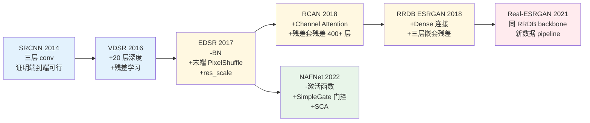
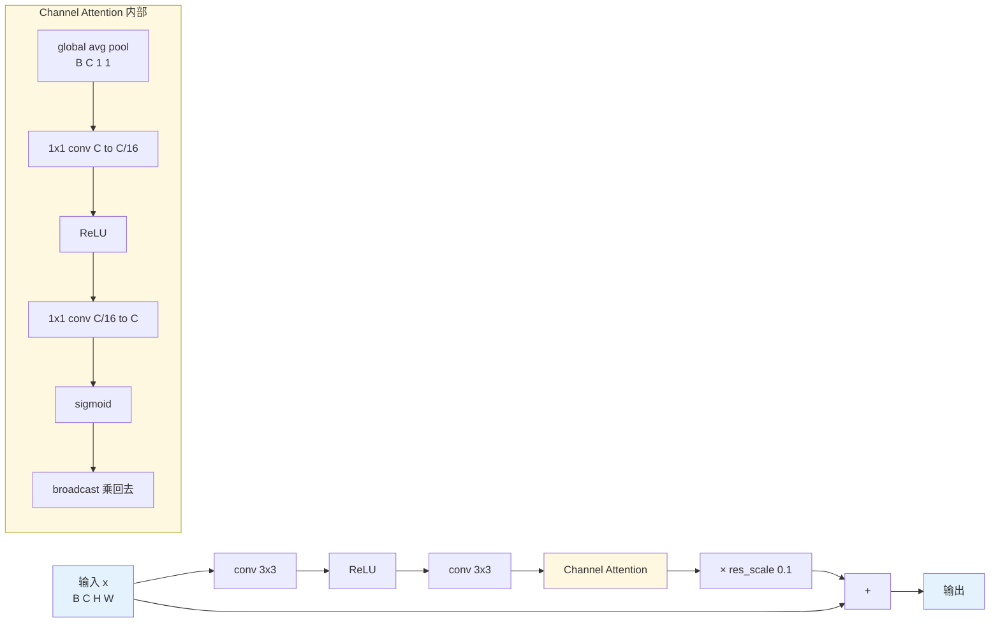
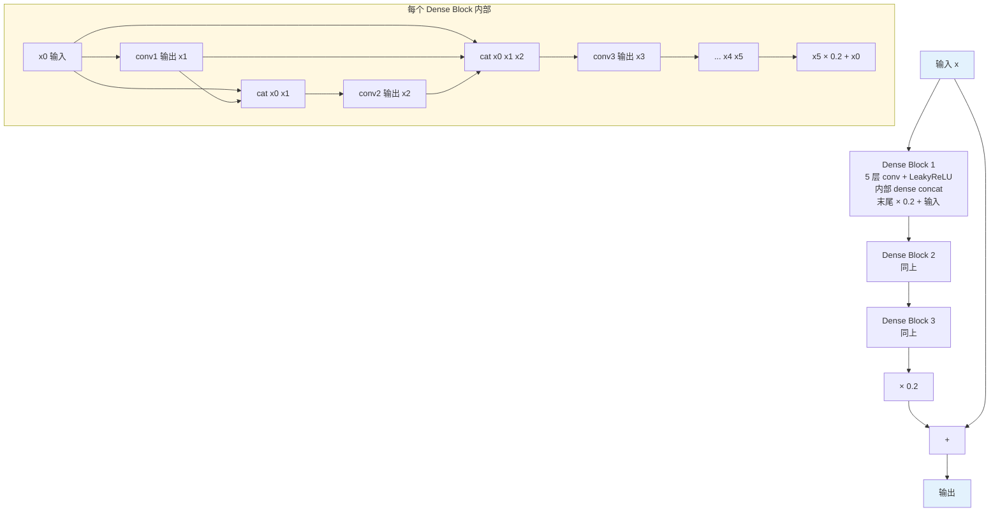

# 第 6 章 · CNN 时代

> 2014 年到 2022 年，CNN 在低层视觉走过了一条演进脉络清晰的道路：
>
> 从模仿稀疏编码（SRCNN）→ 加深与残差学习（VDSR/EDSR）→ 引入通道注意力（RCAN）→ 密集特征复用（RRDB）→ 反向简化与门控机制（NAFNet）。
>
> 这八年沉淀了该领域的底层工程逻辑；理解了这些经典架构，后续审视 Transformer 与扩散模型时便能精准锚定其传承与演变。

## 6.0 阅读须知

本章作为 Part II 的开篇，系统梳理 2014 至 2022 年间 CNN 在低层视觉中的演进脉络。完成本章阅读后，读者应当能够：

- 审视任一 CNN 增强网络结构图时，迅速辨别其流派归属（SRCNN 流派、EDSR 流派、RCAN 流派、ESRGAN/Real-ESRGAN 流派或 NAFNet 流派），并阐明其核心设计哲学；
- 针对新任务设计架构时，建立清晰的决策依据（深度与宽度的权衡、上采样算子的选取、归一化层的取舍、注意力机制的引入边界）；
- 严谨阐述 Batch Normalization 在低层视觉回归任务中产生负面影响的内在机理。

阅读前提：

- 第 1 章：退化算子 $D$ 的随机复合过程及退化模型基本方程 $y = D(x) + n$；
- 第 2 章：像素空间与特征空间的表征差异；
- 第 3 章：L1、Charbonnier、感知损失（VGG）与对抗损失（GAN）的作用机制；
- 第 5 章：高阶退化建模与 Real-ESRGAN 风格的数据构造流程。

本书不要求读者预先通读各经典论文全文，亦不预设读者具备编写完整超分辨率训练循环的经验。本章代码均采用即插即用、最小可运行的形式呈现。

**核心术语与缩写索引：**

- **SRCNN**（Super-Resolution Convolutional Neural Network）：Dong 等人于 2014 年提出的三层超分辨率卷积网络，首次验证了端到端深度学习在图像超分任务中的可行性。
- **VDSR**（Very Deep Super-Resolution）：Kim 等人于 2016 年提出，采用 VGG 风格的 20 层卷积堆叠配合全局残差学习，证实了增加网络深度与残差结构能大幅提升重建质量。
- **EDSR**（Enhanced Deep Residual Networks for Single Image Super-Resolution）：Lim 等人于 2017 年提出，移除了残差块中的 Batch Normalization 并将上采样置于网络末端，奠定了低层视觉 CNN 的工程基线。
- **RCAN**（Residual Channel Attention Network）：Zhang 等人于 2018 年提出，将通道注意力机制引入超分辨率，并通过残差嵌套（Residual in Residual）结构稳定训练超过 400 层的超深网络。
- **ESRGAN**（Enhanced Super-Resolution GAN）：Wang 等人于 2018 年提出，设计了 RRDB 基础块并结合 RaGAN 相对判别损失，确立了感知质量导向超分辨率的视觉标杆。
- **RRDB**（Residual in Residual Dense Block）：ESRGAN 的核心构建块，包含三个密集连接块（Dense Block）与三层嵌套残差连接，至今仍被 Real-ESRGAN 等工业模型沿用。
- **Real-ESRGAN**：2021 年提出的真实场景盲超分辨率代表模型（第 5 章已详述其退化建模），本章侧重分析其继承的 RRDB 主干网络。
- **NAFNet**（Non-linear Activation Free Network）：Chen 等人于 2022 年提出，主张反向简化架构，移除所有 ReLU/GELU 等传统激活函数，改用门控乘法算子，在图像去噪与去模糊任务上反超诸多复杂架构。
- **CA**（Channel Attention，通道注意力）：为特征图的每个通道学习一个标量权重系数，使网络能够自适应增强关键特征通道并抑制冗余通道。
- **SE**（Squeeze-and-Excitation）：2018 年提出的经典通道注意力机制，先通过全局平均池化压缩空间维度，再通过两层 MLP 计算通道间相关性与权重。
- **ECA**（Efficient Channel Attention）：2020 年提出的轻量通道注意力，使用局部 1D 卷积替代两层全连接层，将参数量由 $O(C^2)$ 降至 $O(k)$。
- **SCA**（Simplified Channel Attention）：NAFNet 采用的极简通道注意力，仅保留全局平均池化与 1×1 卷积，完全舍弃了通道降维与 Sigmoid 激活。
- **CBAM**（Convolutional Block Attention Module）：通道注意力与空间注意力串联的混合模块；在低层视觉中，空间注意力的收益通常较为有限。
- **PixelShuffle / Sub-pixel Convolution**（亚像素卷积）：将尺寸为 $(B, r^2 C, H, W)$ 的特征张量重排为 $(B, C, rH, rW)$ 的上采样算子，是 EDSR 之后低层视觉特征放大的事实标准。
- **ICNR**（Initialization for Convolutional NN with Sub-pixel Convolutions）：针对 PixelShuffle 前置卷积专门设计的权重初始化方法，有效消除训练初期的棋盘格伪影。
- **BN / LN / GN / IN**（Batch / Layer / Group / Instance Normalization）：归一化层的四种主要变体，其统计量计算维度各异，本章 §6.9 将详细比对。
- **PReLU**（Parametric ReLU）：将负半轴斜率设为可学习参数的非线性激活函数。
- **SiLU / Swish**：形式为 $x \cdot \sigma(x)$ 的平滑非单调激活函数，现代神经网络的常用默认选择之一。
- **GELU**（Gaussian Error Linear Unit）：形式为 $x \cdot \Phi(x)$ 的高斯误差线性单元，Transformer 架构的标准激活函数。
- **FLOPs**（Floating-Point Operations）：浮点运算次数，衡量模型理论计算复杂度的核心指标。
- **NPU**（Neural Processing Unit）：嵌入式与移动端神经网络专用处理器，对常规 CNN 算子的优化最为成熟。

## 6.1 为什么从 CNN 开始

自 2021 年起，SwinIR、Restormer、HAT 等 Transformer 架构在低层视觉领域大放异彩；2023 年后，StableSR、SUPIR 等扩散模型更是在生成式图像超分上刷新了视觉上限。表面上看，CNN 似乎已成过去。

**然而在工程实践中，CNN 依旧占据着不可替代的基石地位。** 几个关键事实不容忽视：

- **基准标杆与性能基线**：2022 年提出的纯 CNN 架构 NAFNet，至今仍是图像去噪与去模糊任务的事实基准，在学术界与工业界被持续作为强基线比对；
- **工业级部署的事实标准**：广泛应用的 Real-ESRGAN 底层依然沿用 2018 年提出的 RRDB 卷积主干，至今仍是开源通用真实场景超分辨率的工业事实标准；
- **混合架构的基础纽带**：几乎所有基于 Transformer 的增强模型，其 Patch Embedding、上采样重构头以及局部特征提取层依然深度依赖卷积算子，纯粹无卷积的端到端增强模型在实际落地中极为罕见；
- **端侧部署绝对主力**：移动端与嵌入式 NPU 部署的增强算法绝大多数仍采用纯 CNN 架构，主要受制于端侧硬件对自注意力 Softmax 与动态 Reshape 算子的加速支持与访存带宽限制（详见第 15 章）。

因此，深入理解 CNN 的演进是掌握现代图像增强技术的必经之路。本章聚焦于以下三个核心问题：

1. CNN 在低层视觉中的演进主线：哪些模块属于渐进式微调，哪些机制构成了范式转变；
2. 各代经典网络针对的前代核心工程瓶颈及其破解方案；
3. 面向实际落地需求时，设计 CNN 增强网络的模块选型优先级与工程权衡准则。

为清晰呈现各代架构的演进逻辑，下图梳理了主流 CNN 模型的核心创新与瓶颈突破关系：



图中的颜色分组反映了各代工作的核心贡献类型：蓝色组（SRCNN/VDSR）奠定了端到端与残差学习的基础范式；黄色组（EDSR/RCAN/RRDB）聚焦于可复用子结构创新（无 BN 残差块、通道注意力、密集连接块）；红色组（Real-ESRGAN）的核心突破在于高阶退化数据构造管线；绿色组（NAFNet）则走向反向精简，剔除非必要结构。这一演化轨迹生动展示了低层视觉架构从复杂化到理性精简的工程演进历程。

## 6.2 SRCNN（2014）：起点

作为深度学习应用于图像超分辨率的开山之作，Dong 等人将传统的稀疏编码超分辨率流程直接映射为三层卷积神经网络：

```
Layer 1 (9×9 conv, 64 ch)  ←→ Patch extraction & representation
Layer 2 (1×1 conv, 32 ch)  ←→ Non-linear mapping
Layer 3 (5×5 conv,  3 ch)  ←→ Reconstruction
```

输入：经 Bicubic 双三次插值上采样至目标尺寸的 LR 图像；  
输出：重建后的 HR 估计图像。

```python
import torch.nn as nn

class SRCNN(nn.Module):
    """SRCNN, 2014. 三层 CNN 的开山之作。"""
    def __init__(self):
        super().__init__()
        self.conv1 = nn.Conv2d(3, 64, kernel_size=9, padding=4)
        self.conv2 = nn.Conv2d(64, 32, kernel_size=1)
        self.conv3 = nn.Conv2d(32, 3, kernel_size=5, padding=2)
        self.relu = nn.ReLU(inplace=True)

    def forward(self, x):
        # x 是 bicubic 上采样后的 LR, shape 已经等于 HR
        x = self.relu(self.conv1(x))
        x = self.relu(self.conv2(x))
        x = self.conv3(x)
        return x
```

性能参考：在基准测试集 Set5 4× 超分任务上，SRCNN 达到约 30.5 dB（双三次插值基线约为 28.4 dB）。

**SRCNN 的核心历史价值不在于其绝对重建质量，而在于证实了端到端深度学习在图像超分辨率任务中的可行性。** 在 SRCNN 之前，传统超分算法普遍采用"图像块特征提取—稀疏字典编码—高维特征映射—高分辨率图像重建"的分步级联管线。各阶段参数独立优化且不可微，无法实现全局梯度的协同演进。SRCNN 将这一复杂流水线完全映射为三层紧凑的卷积神经网络，仅凭标准随机梯度下降即可实现全局联合优化，奠定了后续深度超分辨率研究的基调。

**SRCNN 的固有局限：**

- **网络深度过浅**：仅包含 3 层卷积，理论有效感受野仅约 13×13，无法捕捉自然图像中数十像素尺度的大范围结构上下文；
- **前置插值导致严重的计算冗余**：所有卷积计算均在放大后的 HR 尺寸空间进行，在 4× 超分设定下，特征提取阶段的 FLOPs 膨胀为 LR 空间的 16 倍；
- **大卷积核（9×9）参数效率低下**：首层占用大量参数预算，但所提供的有效感受野扩展非常有限；
- **缺乏残差学习机制**：网络需要直接从输入回归出 HR 的全部像素值，优化目标方差极大，导致训练收敛缓慢且数值不稳定。

后续经典工作的演进脉络，本质上正是对上述四大局限的逐一破解与重构。

## 6.3 VDSR（2016）：深 + 残差

Kim 等人提出的 VDSR（Very Deep Super-Resolution）为超分辨率网络引入了两项关键设计：深度网络堆叠与全局残差学习。

### 加深至 20 层

VDSR 借鉴 VGG 的设计思想，采用连续 3×3 卷积的堆叠结构。20 层卷积构成的感受野在理论上可覆盖 41×41 的输入区域，远超 SRCNN 的 13×13，能够利用更广阔的空间上下文信息。

然而，网络加深带来了优化难题：若直接堆叠 20 层普通卷积，梯度在反向传播中极易发生弥散或爆炸。在图像回归任务中，即使采用小学习率配合精心设计的权重初始化，深层网络的收敛依然十分脆弱。VDSR 引入的全局残差学习机制，有效解决了深层网络的训练稳定性问题。

### 残差学习

VDSR 改变了直接回归目标高分辨率图像 $x$ 的策略，转为学习**高频残差** $r = x - y_{\text{up}}$（其中 $y_{\text{up}}$ 为双三次插值后的输入图像）。

残差学习在低层视觉任务中展现出显著优势，其物理与数学机理包含以下四点：

1. **目标低频分量已包含于输入中**：双三次插值图像 $y_{\text{up}}$ 已经包含了高分辨率图像的大部分低频能量，网络只需专注于建模缺失的**高频细节**，无需重复拟合底层的低频轮廓。
2. **残差方差极小，简化优化目标**：自然图像的高频细节绝对值普遍接近于 0，残差张量的方差远小于原始像素值本身，回归目标的取值范围被大幅压缩，使得梯度更新更平稳。
3. **空间梯度分布稀疏**：残差在平坦区域趋近于 0，网络容量能够自适应地集中在边缘与纹理区域，显著提升了参数的利用效率。
4. **构建跨层直连梯度通路**：从输入到输出建立了一条加法恒等映射通路，反向传播时损失函数的梯度能够无衰减地直达浅层，从根本上缓解了深层网络的梯度弥散现象。

```python
class VDSR(nn.Module):
    """VDSR, 2016. 深 + 残差学习。"""
    def __init__(self, num_layers: int = 20, base_ch: int = 64):
        super().__init__()
        layers = [nn.Conv2d(3, base_ch, 3, padding=1), nn.ReLU(inplace=True)]
        for _ in range(num_layers - 2):
            layers += [nn.Conv2d(base_ch, base_ch, 3, padding=1),
                       nn.ReLU(inplace=True)]
        layers.append(nn.Conv2d(base_ch, 3, 3, padding=1))
        self.body = nn.Sequential(*layers)

    def forward(self, x):
        # x 是 bicubic 上采样后的 LR
        return x + self.body(x)  # 残差学习: 输出 = 输入 + 学到的残差
```

性能表现：在 Set5 4× 基准上，VDSR 达到约 31.4 dB，相较 SRCNN 提升约 0.9 dB。

**残差学习自此成为低层视觉的标准范式**。此后的绝大多数网络（EDSR、RCAN、RRDB、NAFNet、SwinIR、Restormer 以及扩散模型的 UNet）均采用残差连接，差异主要在于残差的嵌套层级与缩放系数的设计。

**VDSR 的局限性：**

- **仍依赖前置插值放大**：特征提取全过程均运行在 HR 空间，4× 超分时的计算量仍是 LR 空间的 16 倍；
- **缺乏内部归一化与特征缩放控制**：当网络进一步加深时，中间激活值的数值范围容易发散；
- **仅采用单条全局残差**：缺少块级（Block-level）局部残差连接，限制了深度继续扩展时的训练稳定性。

## 6.4 EDSR（2017）：移除 BN，残差块标准化

Lim 等人提出的 EDSR（Enhanced Deep Residual Networks for Single Image Super-Resolution）是低层视觉 CNN 演进中的里程碑。其提出的三项核心架构决策构成了后续多种模型的设计基线。

### 决策一：移除 Batch Normalization

ResNet 的标准残差块结构为 `Conv → BN → ReLU → Conv → BN`。EDSR 经过严谨消融发现：**在低层视觉回归任务中移除 Batch Normalization 能显著提升性能**。

这一差异源于低层视觉与高层视觉在任务目标上的根本不同：

**BN 的计算逻辑**：Batch Normalization 统计当前 mini-batch 内同一通道所有像素的均值 $\mu$ 与方差 $\sigma^2$，执行标准化变换 $\hat{x} = (x - \mu) / \sigma$，再通过可学习的仿射参数 $\gamma, \beta$ 进行缩放与平移。其核心目的在于将通道激活分布拉回零均值与单位方差。

**BN 在高层视觉中的有效性**：分类与检测任务追求语义不变性（Invariance）。例如给猫的图像整体调整亮度，其类别标签保持不变。BN 抹除绝对亮度和色彩尺度的特性，反而促使网络聚焦于具区分度的结构模式。同时在大 batch 设定下，$\mu$ 与 $\sigma^2$ 的估计相对稳健，训练与测试行为一致。

**BN 在低层视觉中的负面影响：**

1. **破坏像素绝对幅值与对比度**：超分辨率、去噪、去模糊属于逐像素连续值回归任务。BN 的去均值与方差缩放强行改变了特征图的绝对动态范围与对比度，迫使后续卷积层必须耗费额外的网络容量来还原原始亮度与色彩信息。
2. **小 batch 与小 patch 导致统计估计方差过大**：低层视觉训练通常采用较小的图像块尺寸（如 48×48 或 64×64），受显存限制 Batch Size 也普遍较小（通常为 4 至 16）。在此类小样本切片下计算的 $\mu$ 与 $\sigma^2$ 具有极高的采样方差，导致每个迭代步的标准化基准剧烈震荡。
3. **训练与推断阶段的统计失配（Train-Test Mismatch）**：在推断阶段，BN 切换为全数据集统计的滑动平均值（EMA），与训练时单批次样本均值/方差存在分布偏移。这种细微偏差会在逐像素重建中转化为局部色偏与亮度漂移，直接劣化 PSNR 指标。
4. **显存开销限制模型容量扩展**：BN 在前向传播中需要保存批次统计量与中间激活值以供反向传播求导。移除 BN 可节约约 30% 至 40% 的显存占用，使模型在相同硬件预算下能够容纳更多的残差块（深度扩展）与特征通道（宽度扩展）。

**移除 BN 后的实际收益：**

- 消除统计偏移带来的颜色漂移，纯色与平坦区域重建更为精确；
- 显存利用率大幅提高，支持更深（如 32 块）与更宽（如 256 通道）的网络配置；
- 摆脱 batch 内样本间的相互干扰，训练过程更加平稳。

### 决策二：低分辨率特征提取 + 末端 PixelShuffle 上采样

针对 VDSR 在 HR 空间计算导致的算力浪费，EDSR 将全部深度特征提取过程限制在 LR 空间进行，仅在网络末端使用 **PixelShuffle**（亚像素卷积）执行一次性空间尺度放大。

**PixelShuffle 的计算本质**：将通道维度的数据重排至空间维度。其输入为 $(B, r^2 C, H, W)$，输出为 $(B, C, rH, rW)$。具体而言，将每 $r^2$ 个通道在同一空间坐标的激活值，重组为一个 $r \times r$ 的局部空间网格。这使得网络在前序阶段能够以多通道表征同一空间位置的多样化高频特征，并在最终阶段直接映射为更高空间分辨率的像素网格。

**算力优势分析**：所有的主干卷积均在 $(H, W)$ 尺度上运行，计算量与 $HW$ 成正比；PixelShuffle 本身仅为 $O(1)$ 的张量内存重排操作，无需浮点乘加运算。相较于 VDSR 将整张 $(rH, rW)$ 尺寸特征输入全部卷积层，EDSR 将特征提取阶段的理论 FLOPs 降低至前者的 $1/r^2$。

```python
# PyTorch 内置 PixelShuffle, 核心张量重排逻辑:
# 输入 (B, r^2 * C, H, W)
# 输出 (B, C, rH, rW)
import torch.nn as nn

class UpsampleBlock(nn.Module):
    """EDSR 风格的上采样模块。
    支持 2/3/4 倍。4 倍 = 两次 2 倍。"""
    def __init__(self, in_ch: int, scale: int):
        super().__init__()
        layers = []
        if scale in (2, 3):
            layers += [
                nn.Conv2d(in_ch, in_ch * scale * scale, 3, padding=1),
                nn.PixelShuffle(scale),
            ]
        elif scale == 4:
            for _ in range(2):
                layers += [
                    nn.Conv2d(in_ch, in_ch * 4, 3, padding=1),
                    nn.PixelShuffle(2),
                ]
        else:
            raise NotImplementedError(f"scale={scale} not supported")
        self.up = nn.Sequential(*layers)

    def forward(self, x):
        return self.up(x)
```

**主流上采样算子对比：**

- **转置卷积（Transposed Conv）**：通过步长大于 1 的卷积实现学习式上采样。但若卷积核大小不能被步长整除，在特征展开与叠加区域会出现周期性权重重叠不均，引发难以消除的**棋盘格伪影**。
- **固定插值 + 卷积（Nearest/Bilinear + Conv）**：先经固定插值核放大尺寸再接标准卷积。虽然避免了重叠不均，但特征放大与卷积权重解耦，模型只能在固定频响滤波的基础上微调，参数效率偏低。
- **PixelShuffle（亚像素卷积）**：结合卷积通道扩张与张量重排，兼具可学习性与高参数效率，配合合理的权重初始化（如 ICNR）可彻底消除伪影，是低层视觉特征放大的标准方案。

### 决策三：残差块标准化与残差缩放（Residual Scaling）

EDSR 标准残差块精简为 `Conv → ReLU → Conv`，末端不加任何激活函数与归一化层，并通过局部残差直连构成基础单元。

```python
class ResidualBlock(nn.Module):
    """EDSR 风格的残差块: 无 BN, 无激活在残差路径末尾。"""
    def __init__(self, ch: int = 64, res_scale: float = 1.0):
        super().__init__()
        self.body = nn.Sequential(
            nn.Conv2d(ch, ch, 3, padding=1),
            nn.ReLU(inplace=True),
            nn.Conv2d(ch, ch, 3, padding=1),
        )
        self.res_scale = res_scale

    def forward(self, x):
        return x + self.body(x) * self.res_scale


class EDSR(nn.Module):
    """EDSR, 2017. 低层视觉的工程基线。"""
    def __init__(self, scale: int = 4, num_blocks: int = 16,
                 ch: int = 64, res_scale: float = 0.1):
        super().__init__()
        self.head = nn.Conv2d(3, ch, 3, padding=1)
        self.body = nn.Sequential(*[
            ResidualBlock(ch, res_scale) for _ in range(num_blocks)
        ])
        self.body_tail = nn.Conv2d(ch, ch, 3, padding=1)
        self.upsample = UpsampleBlock(ch, scale)
        self.tail = nn.Conv2d(ch, 3, 3, padding=1)

    def forward(self, x):
        # x: LR (B, 3, H, W)
        feat = self.head(x)
        body = self.body_tail(self.body(feat)) + feat   # 全局残差
        out = self.tail(self.upsample(body))
        return out
```

**残差缩放（res_scale = 0.1）的设计机理**：将残差分支的输出乘以小于 1 的常数（通常为 0.1）后再与主干特征相加。当网络深度大幅扩展（如 32 或 64 个残差块）时，多层残差输出相加会导致特征方差线性累加（未缩放时 $N$ 层累积方差约为 $N \sigma^2$）。乘以 0.1 缩放后，方差累加被压制在 $0.01 N \sigma^2$，有效防止深层特征数值溢出并稳定训练动态。这一技巧在 RCAN、ESRGAN 等后续深层网络中被普遍采用。

下图对比了 SRCNN、VDSR 与 EDSR 三代经典架构的数据流与计算空间布局：

```mermaid
graph TD
    subgraph SRCNN["SRCNN 2014 (在 HR 空间)"]
        S1[LR bicubic 上采样到 HR]
        S2[conv 9x9 64]
        S3[conv 1x1 32]
        S4[conv 5x5 3]
        S5[HR 输出]
        S1 --> S2 --> S3 --> S4 --> S5
    end

    subgraph VDSR["VDSR 2016 (HR 空间 + 残差)"]
        V1[LR bicubic 到 HR]
        V2[20 层 3x3 conv]
        V3[+ 输入 残差]
        V4[HR 输出]
        V1 --> V2 --> V3 --> V4
        V1 -.skip.-> V3
    end

    subgraph EDSR["EDSR 2017 (LR 空间 + 末端 PixelShuffle)"]
        E1[LR 输入]
        E2[head conv 64]
        E3[16 个残差块<br/>无 BN res_scale 0.1]
        E4[+ feat 全局残差]
        E5[PixelShuffle 上采样]
        E6[tail conv 3]
        E7[HR 输出]
        E1 --> E2 --> E3 --> E4 --> E5 --> E6 --> E7
        E2 -.skip.-> E4
    end

    style SRCNN fill:#e3f2fd
    style VDSR fill:#fff8e1
    style EDSR fill:#e8f5e9
```



从该对比可清晰观察到架构演变路径：SRCNN 全程在 HR 空间运算且无跨层连接；VDSR 引入全局残差但未摆脱前置插值；EDSR 则确立了现代低层视觉的主流范式：LR 空间完成全部特征提取、残差块结构精简、末端集中上采样。后续 RCAN、RRDB、NAFNet 均在此宏观骨架下进行模块级优化。

## 6.5 RCAN（2018）：引入通道注意力与超深残差网络

EDSR 证明了网络深度对超分辨率的重要性，但当网络深度突破数百层时，单纯堆叠残差块依然会面临特征退化与训练发散问题。Zhang 等人提出的 RCAN（Residual Channel Attention Network）通过引入通道注意力（Channel Attention）与残差嵌套（Residual in Residual）结构，成功将网络深度拓展至 400 层以上。

### 通道注意力机制（Channel Attention）

不同特征通道表征了不同类型的图像信息：部分通道侧重于高频边缘与纹理细节，部分通道编码平坦区域与低频色彩，还有部分通道可能包含退化噪声。传统卷积对所有通道赋予均等权重，缺乏通道维度的选择性。通道注意力机制通过学习一组通道级权重向量，使网络能够自适应地增强关键特征通道并抑制无关或冗余通道。

基于 Squeeze-and-Excitation 结构的通道注意力包含四个计算步骤：

1. **空间压缩（Squeeze）**：对输入特征图 $(B, C, H, W)$ 执行全局平均池化（Global Average Pooling），将空间维度压缩为 $(B, C, 1, 1)$。该标量表征了对应通道在全局范围内的统计激活强度。
2. **通道激励降维（Excitation Reduction）**：使用 1×1 卷积将通道数压缩至 $C / r$（通常取缩减率 $r = 16$），并接 ReLU 激活函数。此瓶颈结构旨在建模通道间的非线性交互关系并降低参数量。
3. **通道激励升维（Excitation Expansion）**：使用另一个 1×1 卷积将通道数恢复至 $C$，经 Sigmoid 激活函数映射至 $(0, 1)$ 区间，生成通道权重张量 $(B, C, 1, 1)$。
4. **特征重新校准（Rescale）**：将计算得到的通道权重通过广播机制按通道相乘回原始输入特征图。

```python
class ChannelAttention(nn.Module):
    """RCAN 用的 SE-style channel attention。"""
    def __init__(self, ch: int, reduction: int = 16):
        super().__init__()
        self.avg_pool = nn.AdaptiveAvgPool2d(1)
        self.fc = nn.Sequential(
            nn.Conv2d(ch, ch // reduction, 1),
            nn.ReLU(inplace=True),
            nn.Conv2d(ch // reduction, ch, 1),
            nn.Sigmoid(),
        )

    def forward(self, x):
        # 全局平均池化 -> 通道压缩 -> 通道还原 -> sigmoid 归一化
        # 得到 (B, C, 1, 1) 的通道权重, 然后 broadcast 乘回去
        w = self.fc(self.avg_pool(x))
        return x * w
```

**通道注意力在低层视觉中的工程价值：**

- **自适应高频增强**：富含边缘与结构细节的通道获得更高权重，起到软门控调节作用；
- **抑制冗余与噪声特征**：抑制对重建贡献较低的冗余通道，避免低频特征被后续层过度放大；
- **极低的计算开销**：每个通道注意力模块仅引入 $2 C^2 / r$ 个可学习参数，对整体参数量与计算复杂度的影响几乎可忽略不计。

### 残差中残差（Residual in Residual, RIR）

为稳定训练超深网络，RCAN 提出了多级残差嵌套结构：

1. **底层单元 RCAB（Residual Channel Attention Block）**：在标准残差分支内嵌入通道注意力模块，并保留局部残差直连；
2. **中层结构 RG（Residual Group）**：由多个 RCAB 串联组成，并在组级别设置局部残差旁路（Short Skip Connection）；
3. **顶层骨干（RIR Trunk）**：由多个 RG 级联构成，并由一条长跳跃连接（Long Skip Connection）直连网络浅层特征至重构尾部。

这种多层次残差结构使低频信息能够跨越整个主干直接传递至末端，深层特征提取器得以全力聚焦于高频残差的学习，同时为反向传播提供了丰富的梯度回传路径，使 400 层以上的超深网络能够稳定收敛。

```python
class RCAB(nn.Module):
    """Residual Channel Attention Block。RCAN 的基础单元。"""
    def __init__(self, ch: int = 64, reduction: int = 16,
                 res_scale: float = 1.0):
        super().__init__()
        self.body = nn.Sequential(
            nn.Conv2d(ch, ch, 3, padding=1),
            nn.ReLU(inplace=True),
            nn.Conv2d(ch, ch, 3, padding=1),
            ChannelAttention(ch, reduction),
        )
        self.res_scale = res_scale

    def forward(self, x):
        return x + self.body(x) * self.res_scale
```

下图展示了 RCAB 单元内部的数据流走向：



性能表现：在 Set5 4× 基准测试中，RCAN 达到约 32.6 dB，相较 EDSR 进一步提升约 0.2 dB，在 PSNR 导向的经典超分辨率模型中至今仍是代表性基准。

## 6.6 RRDB（ESRGAN，2018）：密集连接与多级嵌套残差

Wang 等人在 ESRGAN（Enhanced Super-Resolution GAN）中提出了 RRDB（Residual in Residual Dense Block），该主干架构至今仍是 Real-ESRGAN 等工业级盲超分模型的标准基座。

### 密集连接块（Dense Block）的设计机理

相较于 ResNet 的元素级相加（Add），DenseNet 采用通道维度的拼接（Concatenate）。在密集块内部，每一层卷积均接收此前所有层的输出特征作为输入：

$$
x_{l+1} = H([x_0, x_1, \dots, x_l])
$$

**工程优势：**

- **特征最大化复用**：深层卷积能够直接读取浅层的原始细节与中间特征，避免信息在逐层传递中衰减；
- **梯度直接回传**：损失函数的梯度能够通过多条直连路径传递至任意中间层，进一步强化反向传播稳定性；
- **参数效率较高**：各层卷积的增长率（Growth Rate $k$，通常设为 32）可以保持较小，通过密集拼接即可构建高容量的特征表征。

**工程权衡与代价**：在长序列上使用全局 Dense 结构会导致输入通道数线性递增，引发显著的显存与计算开销。RRDB 的工程折中方案是将密集连接限制在 5 层的小型 Dense Block 内部，而 Dense Block 之间则采用残差连接进行组合。

### RRDB 的分层嵌套结构

每个 RRDB 由 3 个 Dense Block 组成。每个 Dense Block 包含 5 层卷积与 LeakyReLU 激活函数。结构呈现三层嵌套：
- **第一层（最内层）**：Dense Block 内部的密集拼接连接；
- **第二层（中间层）**：Dense Block 之间的局部残差连接（乘以缩放系数 0.2）；
- **第三层（最外层）**：跨越整个 RRDB 的全局残差连接（同样乘以缩放系数 0.2）。

```python
class DenseBlock(nn.Module):
    """ESRGAN 用的 5 层 dense block。"""
    def __init__(self, ch: int = 64, growth: int = 32):
        super().__init__()
        self.conv1 = nn.Conv2d(ch + 0 * growth, growth, 3, padding=1)
        self.conv2 = nn.Conv2d(ch + 1 * growth, growth, 3, padding=1)
        self.conv3 = nn.Conv2d(ch + 2 * growth, growth, 3, padding=1)
        self.conv4 = nn.Conv2d(ch + 3 * growth, growth, 3, padding=1)
        self.conv5 = nn.Conv2d(ch + 4 * growth, ch, 3, padding=1)
        self.lrelu = nn.LeakyReLU(0.2, inplace=True)

    def forward(self, x):
        x1 = self.lrelu(self.conv1(x))
        x2 = self.lrelu(self.conv2(torch.cat([x, x1], 1)))
        x3 = self.lrelu(self.conv3(torch.cat([x, x1, x2], 1)))
        x4 = self.lrelu(self.conv4(torch.cat([x, x1, x2, x3], 1)))
        x5 = self.conv5(torch.cat([x, x1, x2, x3, x4], 1))
        return x5 * 0.2 + x   # residual scale + 残差


class RRDB(nn.Module):
    """Residual in Residual Dense Block。"""
    def __init__(self, ch: int = 64, growth: int = 32):
        super().__init__()
        self.db1 = DenseBlock(ch, growth)
        self.db2 = DenseBlock(ch, growth)
        self.db3 = DenseBlock(ch, growth)

    def forward(self, x):
        out = self.db1(x)
        out = self.db2(out)
        out = self.db3(out)
        return out * 0.2 + x   # 又一层残差
```

下图展示了 RRDB 内部的三层嵌套拓扑结构：



ESRGAN 标准配置堆叠了 23 个 RRDB 模块，总参数量约 16.7M。尽管该架构在纯 PSNR 指标上略低于 RCAN，但在结合感知损失与 RaGAN 对抗训练后，其生成的纹理真实度显著优于传统的均方误差优化模型（详见第 4 章关于感知与失真权衡的分析）。

更为重要的是，Real-ESRGAN 在保持 RRDB 主干网络完全不变的前提下，仅通过升级高阶退化数据合成管线与训练策略，便在真实场景盲超分辨率上取得了跨越式的效果提升。**这一实践有力验证了第 5 章的核心工程论断：高质量退化数据建模对恢复效果的决定性影响往往超越了模型架构本身的微调**。

### 6.7 NAFNet（2022）：反潮流的架构精简

在 2018 至 2022 年间，低层视觉领域普遍倾向于叠加复杂结构：多头自注意力机制、多分支融合、复杂的归一化与动态非线性变换。Chen 等人提出的 NAFNet（Non-linear Activation Free Network）反其道而行之，系统性地移除了大量非必要结构，在图像去噪与去模糊基准上刷新了 SOTA 指标，展示了极简架构的工程潜力。

### 简化清单

- **移除 Batch Normalization**：避免批次统计抖动与颜色漂移；
- **移除常规非线性激活（GELU / ReLU）**：改用简单的乘法门控机制（SimpleGate）；
- **移除空间自注意力机制**：仅保留计算复杂度极低的简化通道注意力（SCA）；
- **保留简化的 LayerNorm2d**：在每个 Block 的空间混合与通道混合分支起点进行通道维度的局部归一化，维持数值稳定性。

### 门控机制替代传统激活函数（SimpleGate）

GELU 激活函数的数学形式为 $x \cdot \Phi(x)$（输入乘以标准正态分布累积分布函数）。NAFNet 的核心洞察在于：GELU 的本质是在特征图上施加平滑的软门控（Soft Gating）信号。若门控权重能够直接从特征自身学习得到，则无需强求使用固定的高斯 CDF 函数。

SimpleGate 将输入特征沿通道维度均分为两半，直接进行逐元素点乘：

$$
\text{SimpleGate}(x) = x_1 \odot x_2
$$

其中 $x = [x_1, x_2]$，通道数分别为 $C/2$。$x_2$ 充当自适应门控信号，其动态范围由特征自身决定。

```python
class SimpleGate(nn.Module):
    def forward(self, x):
        x1, x2 = x.chunk(2, dim=1)
        return x1 * x2
```

**工程优势**：具备与 GELU 相当的非线性建模能力，且无需任何可学习参数；避免了误差函数（Erf）或指数函数（Exp）的近似计算开销，推断更加高效。代价是输出通道数减半，因此前置 1×1 卷积需提前进行 2 倍通道扩展。

### 简化通道注意力（Simplified Channel Attention, SCA）

```python
class SCA(nn.Module):
    """NAFNet 的简化 channel attention - 只保留 average pool + 1x1 conv。"""
    def __init__(self, ch):
        super().__init__()
        self.pool = nn.AdaptiveAvgPool2d(1)
        self.conv = nn.Conv2d(ch, ch, 1)

    def forward(self, x):
        return x * self.conv(self.pool(x))
```

SCA 的极简特性体现在：
- 移除了通道降维与升维瓶颈（RCAN 采用 $C \to C/16 \to C$）；
- 移除了中间的 ReLU 非线性层；
- 移除了末端的 Sigmoid 归一化，直接以 1×1 卷积输出与原特征相乘。

直觉上，缺少 Sigmoid 约束可能导致乘法系数过大引起数值不稳定。但在实际网络中，前置的 LayerNorm2d 已经将输入特征的均值与方差约束在稳健范围内，使得无需显式非线性归一化即可稳定收敛。

### NAFBlock 完整实现

```python
class NAFBlock(nn.Module):
    """NAFNet 的核心 block。"""
    def __init__(self, ch: int, dw_expand: int = 2, ffn_expand: int = 2):
        super().__init__()
        # Spatial mixing
        self.norm1 = LayerNorm2d(ch)
        self.conv1 = nn.Conv2d(ch, ch * dw_expand, 1)
        # Depthwise
        self.dwconv = nn.Conv2d(ch * dw_expand, ch * dw_expand, 3,
                                padding=1, groups=ch * dw_expand)
        self.gate1 = SimpleGate()  # 输出通道减半
        self.sca = SCA(ch * dw_expand // 2)
        self.conv2 = nn.Conv2d(ch * dw_expand // 2, ch, 1)

        # Channel mixing (FFN)
        self.norm2 = LayerNorm2d(ch)
        self.conv3 = nn.Conv2d(ch, ch * ffn_expand, 1)
        self.gate2 = SimpleGate()
        self.conv4 = nn.Conv2d(ch * ffn_expand // 2, ch, 1)

        # Trainable scale
        self.beta  = nn.Parameter(torch.zeros((1, ch, 1, 1)))
        self.gamma = nn.Parameter(torch.zeros((1, ch, 1, 1)))

    def forward(self, x):
        # Spatial path
        y = self.norm1(x)
        y = self.conv1(y)
        y = self.dwconv(y)
        y = self.gate1(y)
        y = self.sca(y)
        y = self.conv2(y)
        x = x + y * self.beta

        # Channel path (FFN)
        y = self.norm2(x)
        y = self.conv3(y)
        y = self.gate2(y)
        y = self.conv4(y)
        return x + y * self.gamma


class LayerNorm2d(nn.Module):
    """Channel-wise LayerNorm for 2D feature maps."""
    def __init__(self, ch):
        super().__init__()
        self.weight = nn.Parameter(torch.ones(ch))
        self.bias = nn.Parameter(torch.zeros(ch))
        self.eps = 1e-6

    def forward(self, x):
        # (B, C, H, W) -> normalize over C
        mu = x.mean(dim=1, keepdim=True)
        var = x.var(dim=1, keepdim=True, unbiased=False)
        x = (x - mu) / torch.sqrt(var + self.eps)
        return x * self.weight.view(1, -1, 1, 1) + self.bias.view(1, -1, 1, 1)
```

NAFBlock 借鉴了现代 Transformer 的宏观拓扑：分为空间混合路径（Spatial Mixing）与通道混合路径（Channel Mixing / FFN）。空间路径使用深度可分离卷积（Depthwise Conv）配合 SimpleGate 与 SCA；通道路径使用 1×1 卷积配合 SimpleGate；两条路径均采用 LayerNorm2d 与可学习残差缩放因子（$\beta, \gamma$）。

下图对比了四代经典卷积基础单元的内部结构：

```mermaid
graph TD
    subgraph EDSRb["EDSR ResidualBlock 2017"]
        e1[x] --> e2[conv 3x3]
        e2 --> e3[ReLU]
        e3 --> e4[conv 3x3]
        e4 --> e5[× 0.1]
        e5 --> e6[+]
        e1 --> e6
        e6 --> e7[out]
    end

    subgraph RCANb["RCAN RCAB 2018"]
        r1[x] --> r2[conv 3x3]
        r2 --> r3[ReLU]
        r3 --> r4[conv 3x3]
        r4 --> r5[ChannelAttention<br/>pool + MLP + sigmoid]
        r5 --> r6[× scale]
        r6 --> r7[+]
        r1 --> r7
        r7 --> r8[out]
    end

    subgraph RRDBb["ESRGAN RRDB 2018"]
        d1[x] --> d2[DenseBlock × 3<br/>每个内部 5 层 dense concat]
        d2 --> d3[× 0.2]
        d3 --> d4[+]
        d1 --> d4
        d4 --> d5[out]
    end

    subgraph NAFb["NAFNet NAFBlock 2022"]
        n1[x] --> n2[LayerNorm2d]
        n2 --> n3[1x1 conv expand 2]
        n3 --> n4[depthwise 3x3]
        n4 --> n5[SimpleGate split mul]
        n5 --> n6[SCA pool + 1x1 mul]
        n6 --> n7[1x1 conv]
        n7 --> n8[× beta]
        n8 --> n9[+]
        n1 --> n9
        n9 --> n10[FFN: LN -> 1x1 -> SimpleGate -> 1x1 × gamma]
        n10 --> n11[+]
        n9 --> n11
        n11 --> n12[out]
    end

    style EDSRb fill:#e3f2fd
    style RCANb fill:#fff8e1
    style RRDBb fill:#fff8e1
    style NAFb fill:#e8f5e9
```



### NAFNet 的核心启示

NAFNet 论文的关键结论来源于其详尽的消融实验：
- 将复杂 SE 注意力替换为极简 SCA：性能基本持平；
- 将 GELU 替换为无参 SimpleGate：性能保持不变；
- 空间路径使用普通 3×3 卷积还是深度可分离卷积：在同等计算量下差异极小。

**核心工程启示**：在低层视觉回归任务中，**决定性能上限的核心要素是有效算力与参数预算的合理分配，而非盲目堆砌复杂的非线性组件与多头机制**。结构精简的网络不仅更易于工程部署与硬件加速，而且在数值优化上更为稳健。

## 6.8 上采样方法对比与伪影消除

在图像超分辨率与去模糊网络中，特征上采样算子的选取直接影响重建质量与计算效率。

| 方法 | 计算过程 | 优势 | 局限 |
|------|---------|------|------|
| **Bicubic + Conv** | 输入图像先双三次放大至目标尺度，全程在 HR 空间运算 | 实现简单 | 算力与显存开销过大 |
| **Transposed Conv** | 步长 $s > 1$ 的转置卷积直接生成放大特征 | 支持端到端学习上采样核 | 极易引发周期性棋盘格伪影 |
| **Nearest + Conv** | 最近邻插值放大后接标准卷积 | 无重叠伪影 | 边缘平滑度欠佳，参数效率低 |
| **Bilinear + Conv** | 双线性插值放大后接标准卷积 | 过渡平滑 | 倾向于过度平滑高频细节 |
| **PixelShuffle** | 亚像素卷积，通过通道向空间维度重排 | 参数效率最高，LR 空间运算 | 初始化不当时初期易有棋盘纹 |
| **PixelShuffle (ICNR)** | 采用 ICNR 权重初始化的亚像素卷积 | 彻底消除棋盘伪影 | 实现需针对放大倍率精细配置 |

### 棋盘格伪影（Checkerboard Artifacts）机理

转置卷积在步长 $s$、卷积核大小 $k$ 下，相邻输出像素在空间上存在不同程度的重叠叠加。当 $k$ 不能被 $s$ 整除时，不同坐标位置接收到的卷积核权重叠加次数呈周期性差异，导致重建图像产生明暗交替的网格状伪影。

PixelShuffle 虽无转置卷积的物理重叠问题，但在随机初始化阶段，被映射至同一个 $r \times r$ 空间局域的 $r^2$ 个通道具有完全不相关的初始权重，导致前向输出的相邻像素在训练初期存在剧烈的幅值跳变。

### ICNR 权重初始化

ICNR（Initialization for Convolutional NN with Sub-pixel Convolutions）从根本上解决了 PixelShuffle 的初始化不一致问题：

```python
def icnr_init(tensor: torch.Tensor, scale: int = 2):
    """PixelShuffle 前的卷积权重初始化, 避免训练初期的棋盘伪影。
    本质: 让 r^2 个分组的初始权重相同。"""
    out_ch = tensor.shape[0]
    sub_ch = out_ch // (scale ** 2)
    sub_kernel = torch.zeros(sub_ch, *tensor.shape[1:])
    nn.init.kaiming_normal_(sub_kernel)
    sub_kernel = sub_kernel.repeat(scale ** 2, 1, 1, 1)
    tensor.copy_(sub_kernel)
    return tensor
```

**ICNR 的计算逻辑**：先使用标准 Kaiming 正态分布初始化 $C$ 个基础通道的卷积核，随后将每个卷积核在通道维度连续复制 $r^2$ 份，得到包含 $C \cdot r^2$ 个通道的权重张量。在初始状态下，映射至 $r \times r$ 窗口内的各像素输出完全一致，等价于双线性插值的平滑效果；随着训练进行，各通道权重逐步分化，学习丰富的高频重构能力。

## 6.9 归一化层选型与对比

低层视觉任务与高层视觉任务在归一化层的选择上存在显著差异。

| 归一化类型 | 统计量计算维度 | 低层视觉适用性 | 工程推荐度 |
|-----------|---------------|---------------|-----------|
| **BatchNorm** | $(B, H, W)$，跨样本同通道 | 破坏图像绝对亮度/对比度，推断产生统计失配 | 严禁使用 |
| **GroupNorm** | $(G, H, W)$，通道分组独立统计 | 摆脱 Batch Size 依赖，小批次下较稳定 | 可选方案 |
| **InstanceNorm** | $(H, W)$，单样本单通道 | 抹除图像全局色彩与风格分布，常用于风格迁移 | 慎用（去噪/超分不适用） |
| **LayerNorm 2D** | $(C)$，逐像素跨通道归一化 | 维持单样本推断确定性，在 Transformer 中表现优异 | 推荐（注意力/混合网络） |
| **No Norm** | 不使用任何显式归一化 | 保持原始特征尺度完整性，依赖残差连接控幅 | 推荐（纯 CNN 架构） |

### LayerNorm 适用而 BatchNorm 失效的原因分析

- **BatchNorm 跨样本统计**：单张图像在不同 Batch 组合下前向结果不同，且推断阶段依赖数据集 EMA 统计量，微小的分布偏移在逐像素回归中会导致指标显著劣化；
- **LayerNorm 仅在单像素多通道维度统计**：完全独立于 Batch 维度与邻近空间像素，推断行为严格具备确定性。在包含自注意力或深度可分离卷积的深层结构中，LayerNorm 能有效约束特征数值范围，且不引入批次间干扰。

**工程决策准则：**
- 纯 CNN 超分辨率/恢复网络：优先选择 **No Norm**（如 EDSR）或 **LayerNorm 2D**（如 NAFNet）；
- 包含自注意力机制的网络：选用 **LayerNorm**（如 SwinIR、Restormer）；
- 低层视觉像素级回归任务中全面避免使用 **BatchNorm**。

## 6.10 激活函数选型

| 激活函数 | 数学表达 | 工程特性分析 |
|---------|---------|-------------|
| **ReLU** | $\max(0, x)$ | 计算极快，实现稳健，EDSR 标配 |
| **LeakyReLU** | $\max(\alpha x, x)$，$\alpha=0.2$ | 负半轴保留微小梯度，有效防止 GAN 判别器神经元失活 |
| **PReLU** | $\max(\alpha x, x)$，$\alpha$ 可学 | 早期超分辨率模型使用，参数量略有增加 |
| **GELU** | $x \cdot \Phi(x)$ | 原点处平滑可微，Transformer 与扩散模型标准配置 |
| **SiLU / Swish** | $x \cdot \sigma(x)$ | 平滑非单调，在大模型中表现优异 |
| **SimpleGate** | $x_1 \odot x_2$ | 无参数门控机制，NAFNet 标配，硬件执行高效 |

**工程实践准则：**
- 涉及 GAN 对抗训练的生成器与判别器：优先选用 **LeakyReLU(0.2)**，避免梯度弥散；
- 追求极致推断速度与轻量化部署：选用 **SimpleGate** 或 **ReLU**；
- 现代大容量骨干与 Transformer 混合架构：选用 **SiLU** 或 **GELU**。

## 6.11 注意力模块演化与空间注意力的局限

CNN 中的注意力机制主要集中于通道维度：

| 模块 | 核心机制 | 参数复杂度 | 来源与代表工作 |
|------|---------|-----------|---------------|
| **SE** | 全局均值池化 + 2 层全连接 + Sigmoid | $O(C^2 / r)$ | SENet (2018) |
| **CA** | 针对低层视觉微调的 SE 结构 | $O(C^2 / r)$ | RCAN (2018) |
| **ECA** | 全局均值池化 + 局部 1D 卷积 ($k=3/5$) | $O(k)$ | ECA-Net (2020) |
| **SCA** | 全局均值池化 + 1×1 卷积，无激活与降维 | $O(C^2)$ | NAFNet (2022) |

### 空间注意力（Spatial Attention）在低层视觉中的局限

CBAM 等模块在通道注意力之后串联空间注意力分支，生成 $(H, W)$ 尺度的空间权重图。空间注意力在高层分类与目标检测中收益明显，但在低层视觉中往往收益甚微，主要原因包括：

1. **任务特性的差异**：低层视觉属于稠密逐像素重建任务，整张图像的每个局部区域均需精确重构，不存在需要完全忽略的空间背景区域；
2. **平滑滤波效应**：简单空间注意力生成的权重图具有低频平滑倾向，点乘后容易平滑边缘高频响应，反噬图像锐度；
3. **空间依赖建模能力不足**：对长距离空间上下文的精确利用需依赖全注意力机制（如自注意力），简单的局部空间掩码无法实现真正的长程相关性建模（详见第 7 章）。

因此，在 CNN 架构设计中，通道注意力为主要选项，简单的空间注意力应谨慎引入。

## 6.12 工业级 EDSR 风格基线模型实现

综合上述设计原则，构建一个工业级、兼顾重建性能与训练稳定性的超分辨率基线模型：

```python
import torch
import torch.nn as nn


class ResidualBlock(nn.Module):
    def __init__(self, ch: int, res_scale: float = 0.1):
        super().__init__()
        self.body = nn.Sequential(
            nn.Conv2d(ch, ch, 3, padding=1),
            nn.LeakyReLU(0.2, inplace=True),
            nn.Conv2d(ch, ch, 3, padding=1),
        )
        self.res_scale = res_scale

    def forward(self, x):
        return x + self.body(x) * self.res_scale


class UpsampleBlock(nn.Module):
    def __init__(self, ch: int, scale: int):
        super().__init__()
        layers = []
        if scale == 4:
            for _ in range(2):
                layers += [nn.Conv2d(ch, ch * 4, 3, padding=1),
                           nn.PixelShuffle(2)]
        elif scale in (2, 3):
            layers += [nn.Conv2d(ch, ch * scale * scale, 3, padding=1),
                       nn.PixelShuffle(scale)]
        self.up = nn.Sequential(*layers)

    def forward(self, x):
        return self.up(x)


class SRBaseline(nn.Module):
    """生产级超分辨率基线模型。
    配置: 16 个残差块 + 64 通道, 参数量约 1.5M。
    特性: 无 BN, 残差缩放 0.1, PixelShuffle + ICNR 初始化。
    """

    def __init__(self, scale: int = 4, num_blocks: int = 16,
                 ch: int = 64, res_scale: float = 0.1):
        super().__init__()
        self.head = nn.Conv2d(3, ch, 3, padding=1)
        self.body = nn.Sequential(
            *[ResidualBlock(ch, res_scale) for _ in range(num_blocks)]
        )
        self.body_tail = nn.Conv2d(ch, ch, 3, padding=1)
        self.up = UpsampleBlock(ch, scale)
        self.tail = nn.Conv2d(ch, 3, 3, padding=1)

        # ICNR 初始化 PixelShuffle 前的卷积
        per_step_scale = 2 if scale == 4 else scale
        for m in self.up.modules():
            if isinstance(m, nn.Conv2d):
                self._icnr_init(m.weight, scale=per_step_scale)

    @staticmethod
    def _icnr_init(weight, scale: int = 2):
        """ICNR 权重初始化。"""
        out_ch = weight.shape[0]
        sub_ch = out_ch // (scale * scale)
        sub_kernel = torch.empty(sub_ch, *weight.shape[1:])
        nn.init.kaiming_normal_(sub_kernel)
        sub_kernel = sub_kernel.repeat(scale * scale, 1, 1, 1)
        weight.data.copy_(sub_kernel)

    def forward(self, x):
        feat = self.head(x)
        body = self.body_tail(self.body(feat)) + feat
        out = self.tail(self.up(body))
        return out
```

该模型在参数量（约 1.5M）远低于 ESRGAN（约 16.7M）的前提下，配合 Real-ESRGAN 退化合成数据与综合损失函数训练，能够提供优异的重建质量与高效的推断吞吐，是新任务研发阶段理想的基准测试起点。

## 6.13 CNN 增强网络的设计方法论

面向新任务从零设计 CNN 增强网络时，建议遵循如下自顶向下的决策流程：

### 第一步：明确计算预算与硬件边界

- **移动端与嵌入式 NPU**：FLOPs $\le 0.5$ GFLOPs，参数量 $\le 1$M，算子必须使用规则 3×3/1×1 卷积，避免使用动态算子与 Softmax；
- **桌面端 GPU 实时处理**：FLOPs $\le 50$ GFLOPs，可采用标准 EDSR/NAFNet 结构；
- **服务端离线处理**：FLOPs $\ge 200$ GFLOPs，可考虑深层大通道模型或混合架构。

### 第二步：权衡网络深度与宽度

**核心准则：优先扩展深度，适度控制宽度**。
- 增加深度可线性扩展有效感受野，参数量随深度线性增长；
- 增加宽度虽能提升单层通道容量，但参数量与特征图显存随宽度平方级膨胀，边际收益递减迅速。

典型参数规模配置参考：
- 1M 级别：32 通道 × 16 块；
- 5M 级别：64 通道 × 16 块；
- 16M 级别：64 通道 × 23 块（ESRGAN 标准）；
- 50M 以上级别：建议转向第 7 章的 Transformer 混合架构。

### 第三步：确定上采样方案与残差控制

- 默认采用末端 PixelShuffle 上采样，并在前置卷积层强制应用 ICNR 权重初始化；
- 引入全局残差与块级局部残差，并在残差分支末端配置 0.1 至 0.2 的残差缩放因子。

### 第四步：评估注意力模块收益

- 通用图像恢复任务：可引入轻量 SCA 或 ECA 模块（开销极低，提升约 0.1 至 0.2 dB）；
- 端侧极速部署场景：移除所有注意力分支，保持纯卷积流水线。

### 第五步：匹配训练损失体系

- PSNR 导向的保真度优化：采用 Charbonnier 或 L1 损失；
- 真实视觉感知导向：构建 L1 + 感知损失（VGG/LPIPS）+ 对抗损失（RaGAN）的复合目标（详见第 3 章）。

## 6.14 小结

1. **CNN 在低层视觉的演进路径清晰明确**：SRCNN（端到端奠基）→ VDSR（深层全局残差）→ EDSR（去除 BN 与末端 PixelShuffle）→ RCAN（通道注意力与 RIR）→ RRDB（密集连接嵌套）→ NAFNet（门控精简与非线性剔除）；
2. **残差学习是低层视觉的核心基础**：大幅降低回归目标方差，构建无阻碍梯度通道；
3. **Batch Normalization 在低层视觉中有害**：破坏像素绝对动态范围，导致统计抖动与训练推断失配，应全面移除；
4. **PixelShuffle 配合 ICNR 初始化是上采样标准方案**：兼顾高参数效率与无伪影重建；
5. **通道注意力是极低开销的有效改进**：SCA 与 ECA 是兼顾效果与效率的优选；
6. **NAFNet 揭示了算力分配的重要性**：合理的网络容量分配优先于复杂的非线性算子堆砌；
7. **数据质量决定性能上限**：Real-ESRGAN 的工程突破再次证实，高质量退化建模对实际恢复效果的推动作用超越了单纯的模型微调。

---

> 下一章 [Transformer 在低层视觉](07-transformer.md) → SwinIR、Restormer、HAT，探索自注意力机制如何突破局部卷积感受野的约束。
