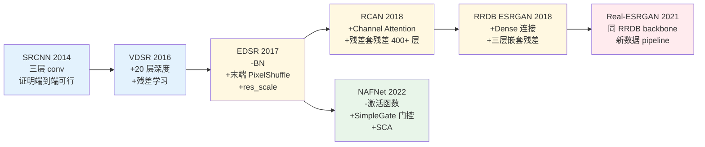
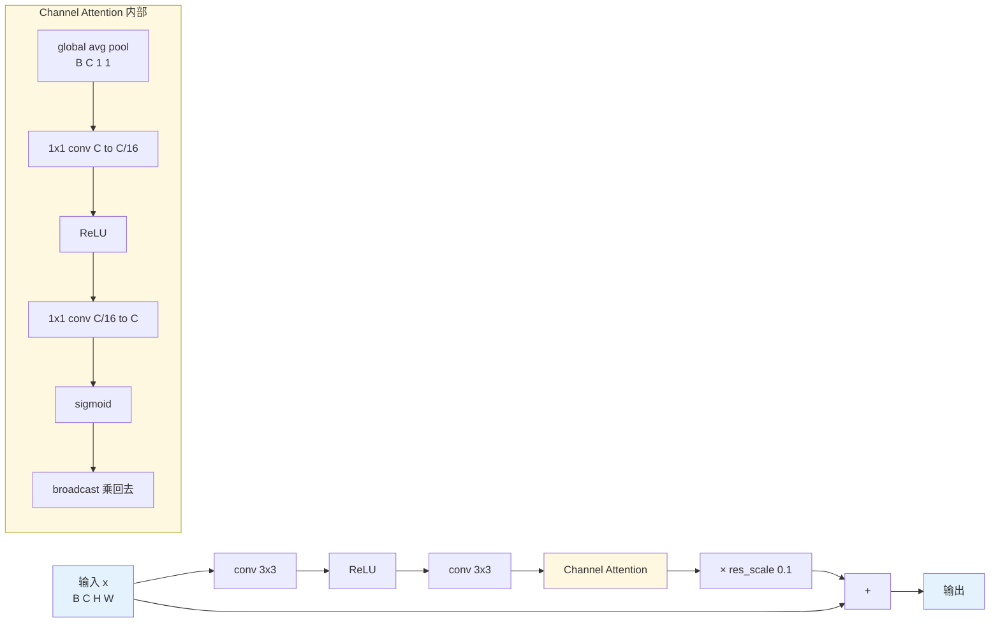
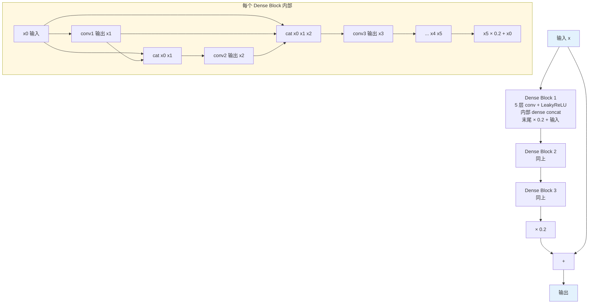

```mermaid
graph TD
    subgraph SRCNN["SRCNN 2014 (在 HR 空间)"]
        S1[LR bicubic 上采样到 HR]
        S2[conv 9x9 64]
        S3[conv 1x1 32]
        S4[conv 5x5 3]
        S5[HR 输出]
        S1 --> S2 --> S3 --> S4 --> S5
    end

    subgraph VDSR["VDSR 2016 (HR 空间 + 残差)"]
        V1[LR bicubic 到 HR]
        V2[20 层 3x3 conv]
        V3[+ 输入 残差]
        V4[HR 输出]
        V1 --> V2 --> V3 --> V4
        V1 -.skip.-> V3
    end

    subgraph EDSR["EDSR 2017 (LR 空间 + 末端 PixelShuffle)"]
        E1[LR 输入]
        E2[head conv 64]
        E3[16 个残差块<br/>无 BN res_scale 0.1]
        E4[+ feat 全局残差]
        E5[PixelShuffle 上采样]
        E6[tail conv 3]
        E7[HR 输出]
        E1 --> E2 --> E3 --> E4 --> E5 --> E6 --> E7
        E2 -.skip.-> E4
    end

    style SRCNN fill:#e3f2fd
    style VDSR fill:#fff8e1
    style EDSR fill:#e8f5e9
```

```mermaid
graph TD
    subgraph EDSRb["EDSR ResidualBlock 2017"]
        e1[x] --> e2[conv 3x3]
        e2 --> e3[ReLU]
        e3 --> e4[conv 3x3]
        e4 --> e5[× 0.1]
        e5 --> e6[+]
        e1 --> e6
        e6 --> e7[out]
    end

    subgraph RCANb["RCAN RCAB 2018"]
        r1[x] --> r2[conv 3x3]
        r2 --> r3[ReLU]
        r3 --> r4[conv 3x3]
        r4 --> r5[ChannelAttention<br/>pool + MLP + sigmoid]
        r5 --> r6[× scale]
        r6 --> r7[+]
        r1 --> r7
        r7 --> r8[out]
    end

    subgraph RRDBb["ESRGAN RRDB 2018"]
        d1[x] --> d2[DenseBlock × 3<br/>每个内部 5 层 dense concat]
        d2 --> d3[× 0.2]
        d3 --> d4[+]
        d1 --> d4
        d4 --> d5[out]
    end

    subgraph NAFb["NAFNet NAFBlock 2022"]
        n1[x] --> n2[LayerNorm2d]
        n2 --> n3[1x1 conv expand 2]
        n3 --> n4[depthwise 3x3]
        n4 --> n5[SimpleGate split mul]
        n5 --> n6[SCA pool + 1x1 mul]
        n6 --> n7[1x1 conv]
        n7 --> n8[× beta]
        n8 --> n9[+]
        n1 --> n9
        n9 --> n10[FFN: LN -> 1x1 -> SimpleGate -> 1x1 × gamma]
        n10 --> n11[+]
        n9 --> n11
        n11 --> n12[out]
    end

    style EDSRb fill:#e3f2fd
    style RCANb fill:#fff8e1
    style RRDBb fill:#fff8e1
    style NAFb fill:#e8f5e9
```

# 第 6 章 · CNN 时代

> 2014 年到 2022 年，CNN 在低层视觉走过了一条独特的路：
>
> 从模仿稀疏编码（SRCNN）→ 加深加残差（VDSR/EDSR）→ 引入注意力（RCAN）→ 密集连接（RRDB）→ 反向简化（NAFNet）。
>
> 这八年是这个领域的"经典力学"，理解了它，再看 Transformer 和扩散就能找到对应。

## 6.0 阅读须知

本章是 Part II 的第一站，目标是把 CNN 这条线 2014-2022 年八年的演进交代清楚。读完之后，你应当能：

- 看到一个 CNN 增强网络的结构图，立刻判断它属于哪一代（SRCNN 风、EDSR 风、RCAN 风、ESRGAN/Real-ESRGAN 风、NAFNet 风），以及对应的设计哲学
- 在做新任务时知道每一步设计决策的依据（深度还是宽度、哪种上采样、哪种归一化、要不要加 attention）
- 把"为什么 Batch Normalization 在低层视觉里反而有害"这件事讲明白

本章预设你已经掌握：

- 第 1 章里"退化算子 $D$ 是一串随机复合"以及"$y = D(x) + n$"作为中心方程
- 第 2 章里像素空间和特征空间的区分
- 第 3 章里 L1 / Charbonnier / VGG / GAN 损失的基本作用
- 第 5 章里 Real-ESRGAN 风格退化 pipeline 的存在与含义

不预设你读过 SRCNN/EDSR/RCAN/ESRGAN/NAFNet 的原始论文，也不预设你写过完整的 SR 训练 loop。本章的代码都会从直接可跑的最简形式开始展示。

**本章首次出现或将反复出现的缩写。** 为防止读到一半被术语劝退，先在这里集中列一遍，后面用到具体术语时还会再展开一句话定义：

- **SRCNN**（Super-Resolution Convolutional Neural Network）：2014 年 Dong et al. 提出的三层 CNN 超分网络，第一次把端到端学习用在 SR 上
- **VDSR**（Very Deep Super-Resolution）：2016 年 Kim et al. 提出，VGG 风的 20 层堆叠 + 残差学习，证明"深"和"残差"两个设计同时引入能大幅涨点
- **EDSR**（Enhanced Deep Residual Networks for Single Image Super-Resolution，正文简称 Enhanced Deep Residual）：2017 年 Lim et al. 提出，把残差块里的 Batch Normalization 移除、把上采样挪到网络末尾，是低层视觉 CNN 的"工程基线"
- **RCAN**（Residual Channel Attention Network）：2018 年 Zhang et al. 提出，把通道注意力引入 SR，并通过残差套残差的结构稳定训练 400+ 层网络
- **ESRGAN**（Enhanced Super-Resolution GAN）：2018 年 Wang et al. 提出，提出 RRDB 块并用 RaGAN 损失训练，定义了感知派 SR 的视觉标杆
- **RRDB**（Residual in Residual Dense Block）：ESRGAN 的核心 block，三个 dense block 嵌套 + 三层残差，Real-ESRGAN 至今沿用
- **Real-ESRGAN**：2021 年的代表性"真实场景"超分模型，第 5 章已详谈，本章关注它沿用的 RRDB backbone
- **NAFNet**（Non-linear Activation Free Network）：2022 年 Chen et al. 提出，反向简化，移除所有 ReLU/GELU，用门控乘法代替，在去噪/去模糊上反超复杂架构
- **CA**（Channel Attention，通道注意力）：给每个通道学一个标量权重并相乘，让模型自适应地放大/抑制不同通道
- **SE**（Squeeze-and-Excitation）：2018 年提出的 channel attention 通用形式，先 global average pool 把空间压缩为一个标量，再用两层 MLP 算权重
- **ECA**（Efficient Channel Attention）：2020 年的 channel attention 改进，用 1D 卷积代替两层 MLP，参数从 $O(C^2)$ 降到 $O(k)$
- **SCA**（Simplified Channel Attention）：NAFNet 用的极简版 channel attention，只保留 average pool + 1×1 卷积，连 sigmoid 都不要
- **CBAM**（Convolutional Block Attention Module）：channel attention + spatial attention 串联，但在低层视觉里 spatial 部分收益有限
- **PixelShuffle / subpixel convolution**（亚像素卷积）：把 $r^2$ 倍通道的张量重排成 $r$ 倍空间分辨率的张量的操作，是 EDSR 之后上采样的事实标准
- **ICNR**（Initialization for Convolutional NN with Sub-pixel Convolutions）：针对 PixelShuffle 前的卷积做的初始化，避免训练初期的棋盘伪影
- **BN / LN / GN / IN**（Batch / Layer / Group / Instance Normalization）：归一化层的四种主要变体，作用维度各不相同，本章 §6.9 会逐一比对
- **PReLU**（Parametric ReLU）：负半轴斜率作为可学参数的 ReLU 变体
- **SiLU / Swish**：$x \cdot \sigma(x)$ 形式的激活函数，现代默认选择之一
- **GELU**（Gaussian Error Linear Unit）：$x \cdot \Phi(x)$，Transformer 标配的激活函数
- **FLOPs**（Floating-Point Operations）：浮点运算数，衡量计算预算的常用单位
- **NPU**（Neural Processing Unit）：移动端神经网络专用处理器，对 CNN 优化最成熟

## 6.1 为什么从 CNN 开始

Transformer 在 2021 年起在低层视觉显身手（SwinIR、Restormer、HAT），扩散在 2023 年起占据生成派 SOTA（StableSR、SUPIR）。看起来 CNN 已经是过去式。

**实际不是这样。** 几个事实：

- NAFNet（2022 纯 CNN）至今仍是去噪/去模糊任务的事实标杆，2023-2025 年的论文里它仍然是被反复 cite 的 baseline
- Real-ESRGAN 用的还是 RRDB（2018 的 CNN 架构）；它在 2021 年发表，到 2026 年仍是开源真实 SR 的事实标准
- 几乎所有 Transformer 模型的 patch embedding、上采样头、bottleneck 仍然是卷积；纯 Transformer 在低层视觉非常少见
- 移动端部署的增强模型 99% 是纯 CNN，第 15 章会展开原因（NPU 对 attention 的优化不成熟、softmax 与 reshape 在端侧昂贵）

所以 Part II 的第一站必须是 CNN。本章要把三件事讲清：

1. CNN 在低层视觉的演进逻辑，哪些设计是渐进改良、哪些是范式转变
2. 每个时代的代表网络在解决什么具体问题
3. 设计自己的 CNN 增强网络时，怎么排序选与不选

为了让后面六七个网络的讨论不至于彼此混淆，先用一张图把这条线整理出来。每一格代表一代的"主推新设计"，每一格的颜色对应它解决的瓶颈类别。



颜色分组反映"贡献类型"。蓝色一组（SRCNN/VDSR）是"奠基"，把端到端学习和残差学习确立成范式。黄色一组（EDSR/RCAN/RRDB）是"模块创新"，提出可复用的子结构（残差块、CA、Dense block）。红色一组（Real-ESRGAN）的贡献完全在数据 pipeline，不在网络。绿色一组（NAFNet）反向简化，把前几代加进来的东西又拿掉一部分。这条线的最后两格读起来是反向的，这是低层视觉 CNN 时代最值得记住的反潮流故事。

## 6.2 SRCNN（2014）：起点

第一篇深度学习超分论文。Dong et al. 把传统的稀疏编码超分流程映射成了三层 CNN：

```
Layer 1 (9×9 conv, 64 ch)  ←→ Patch extraction & representation
Layer 2 (1×1 conv, 32 ch)  ←→ Non-linear mapping
Layer 3 (5×5 conv,  3 ch)  ←→ Reconstruction
```

输入：bicubic 上采样到目标尺寸的 LR
输出：HR 估计

```python
import torch.nn as nn

class SRCNN(nn.Module):
    """SRCNN, 2014. 三层 CNN 的开山之作。"""
    def __init__(self):
        super().__init__()
        self.conv1 = nn.Conv2d(3, 64, kernel_size=9, padding=4)
        self.conv2 = nn.Conv2d(64, 32, kernel_size=1)
        self.conv3 = nn.Conv2d(32, 3, kernel_size=5, padding=2)
        self.relu = nn.ReLU(inplace=True)

    def forward(self, x):
        # x 是 bicubic 上采样后的 LR, shape 已经等于 HR
        x = self.relu(self.conv1(x))
        x = self.relu(self.conv2(x))
        x = self.conv3(x)
        return x
```

性能：在 Set5 4× 上约 30.5 dB（bicubic 是 28.4 dB）。

**SRCNN 的价值不在效果**，在于它**证明了端到端学习的可行性**。在它之前，所有超分方法都是"先稀疏字典学习、再块分类、再重建"的多阶段流程，每一阶段单独优化、阶段间不可微，整体没法端到端调。SRCNN 把这一切变成一个 CNN，让一个标准的 SGD 反向传播就能把所有参数一起训出来，开启了之后十年的发展。

**SRCNN 的局限**：

- **太浅**：只有 3 层，有效感受野约 13×13，对自然图像里几十像素尺度的结构无法捕捉
- **先上采样浪费计算**：所有计算都在 HR 尺寸上做，4× SR 时 FLOPs 是 LR 空间的 16 倍
- **大卷积核（9×9）效率差**：参数多但有效感受野有限，参数预算被首层占去一大半
- **没有残差**：要直接从输入回归出 HR 的全部像素，优化目标方差大、训练慢

后续的工作都在解决这些问题，可以把 6.3 到 6.7 节看成"一个一个地拆掉 SRCNN 的局限"。

## 6.3 VDSR（2016）：深 + 残差

Kim et al. 提出 VDSR（Very Deep Super-Resolution），核心两点贡献。

### 加深到 20 层

VGG 风格的堆叠 3×3 卷积。20 层的感受野理论上能覆盖 41×41 的输入区域，比 SRCNN 大很多，能利用更广的上下文。

加深也带来训练难题：直接堆 20 层卷积，梯度容易在反向传播中放大或消失，VGG 时代用的"小学习率 + 仔细初始化"在 SR 任务上仍然不稳定。VDSR 的第二个贡献，即残差学习，同时解决了表达能力和优化稳定性两个问题。

### 残差学习

不是直接学 HR，而是学**残差** $r = x - y_{\text{up}}$，即 HR 减去上采样后的 LR。

为什么残差学习在低层视觉特别重要，可以从四个角度看：

1. **目标低频已经在输入里**：LR 经过 bicubic 上采样后 $y_{\text{up}}$ 已经接近 HR 的低频成分，模型只需要学**高频补充**，不必重新学整张图。
2. **残差方差小，优化更容易**：自然图像的高频分量绝对值远小于像素本身，残差大部分接近 0，回归目标的方差减小一两个数量级。
3. **梯度更稀疏**：残差在平坦区域几乎全是 0，模型只需要在边缘/纹理区域投入容量，参数利用率高。
4. **跨层捷径**：从输入到输出有一条加法捷径，反向传播的梯度可以绕开网络主干直达输入端，避免梯度消失。

```python
class VDSR(nn.Module):
    """VDSR, 2016. 深 + 残差学习。"""
    def __init__(self, num_layers: int = 20, base_ch: int = 64):
        super().__init__()
        layers = [nn.Conv2d(3, base_ch, 3, padding=1), nn.ReLU(inplace=True)]
        for _ in range(num_layers - 2):
            layers += [nn.Conv2d(base_ch, base_ch, 3, padding=1),
                       nn.ReLU(inplace=True)]
        layers.append(nn.Conv2d(base_ch, 3, 3, padding=1))
        self.body = nn.Sequential(*layers)

    def forward(self, x):
        # x 是 bicubic 上采样后的 LR
        return x + self.body(x)  # 残差学习: 输出 = 输入 + 学到的残差
```

性能：Set5 4× 上约 31.4 dB，比 SRCNN 提升约 0.9 dB。

**残差学习从此成为低层视觉的事实标准**。之后所有网络（EDSR、RCAN、RRDB、NAFNet、SwinIR、Restormer 直到扩散里的 UNet）都用残差，唯一的差别是残差怎么嵌套、是否带 scale 系数。

**VDSR 的局限**：

- 仍然先 bicubic 上采样再过网络，计算浪费严重（4× 时计算量是 LR 空间的 16 倍）
- 没有归一化也没有 scale 系数，深网络下数值容易飘
- 残差是"整体残差"，没有 block 内残差，深度再增加的话训练稳定性会出问题

## 6.4 EDSR（2017）：移除 BN，残差块标准化

Lim et al. 提出 EDSR（Enhanced Deep Residual …），是低层视觉的"工程基线"网络。它的几个决定影响了后续所有 CNN 工作。

### 决定一：移除 Batch Normalization

ResNet 的标准残差块是 `Conv → BN → ReLU → Conv → BN`。EDSR 论文发现：**在低层视觉里去掉 BN 反而更好**。

原因这一节稍微展开，因为这是低层视觉与高层视觉一个长期被混淆的关键差异点。

**BN 在做什么。** Batch Normalization 把当前 mini-batch 里同一通道的所有像素值合起来，算均值 $\mu$ 和方差 $\sigma^2$，然后做 $\hat{x} = (x - \mu) / \sigma$，最后用可学的 $\gamma, \beta$ 还原一定的尺度自由度。它的物理含义是"把这个通道的激活分布归到零均值单位方差"。

**高层视觉里它为什么好用。** 分类任务的最终目标是 invariant 的：给一只猫加一层全局亮度，仍然是猫。BN 把绝对亮度信息归一化掉，反而让网络去关注真正有区分度的特征。同时大 batch 下 $\mu, \sigma$ 的估计稳定，训练和测试行为一致。

**低层视觉里它为什么不好用，分四点。**

1. **目标就是像素本身**。SR/去噪/去模糊的输出是像素值，归一化会破坏输入到输出的"绝对尺度"关系，模型还得花容量重新学回去。
2. **批内统计敏感**。低层视觉的训练 patch 往往很小（48×48 或 64×64），batch size 又因为显存限制不能太大（4-16 典型）。这种"小 batch + 小 patch"下 $\mu, \sigma$ 的方差很大，每个 step 看到的归一化目标都在抖。
3. **训练-测试失配**。BN 在测试时切到全数据集 EMA 统计，与训练时 mini-batch 统计不同，输出会有微小但稳定的颜色偏移，影响 PSNR 这种逐像素指标。
4. **限制了模型规模**。BN 的中间张量需要额外显存存均值/方差/缩放，让本来就显存紧张的 SR 训练更紧张，省掉 BN 可以多放几个残差块或加宽通道。

**移除 BN 后**：

- 模型在低对比度、纯色区域更准确，因为没有归一化造成的颜色漂移
- 能用更大的网络，省下来的显存可以增加深度或宽度
- 训练稳定性反而更好，因为不再有 batch 间统计抖动

这是低层视觉和高层视觉一个**很重要的差异点**：高层视觉里 BN/LayerNorm 是必备，低层视觉里它们经常有害。LayerNorm 在 Transformer-based 低层视觉里是 OK 的，原因 §6.9 会单独讲。

### 决定二：在 LR 空间计算 + 末尾 PixelShuffle 上采样

VDSR 在 HR 空间计算的浪费被 EDSR 修正了：所有特征提取在 LR 空间做，最后用 **PixelShuffle**（sub-pixel convolution，亚像素卷积）做一次性上采样。

PixelShuffle 的本质：通道维转空间维。把 $(B, r^2 C, H, W)$ 重新排成 $(B, C, rH, rW)$。具体地，每 $r^2$ 个相邻通道里的同一像素位置，被重新放到一个 $r \times r$ 的小块里。这样原本"用更多通道表示同一个空间位置的多种细节"的特征图，被解释成"用同一通道在更密的空间网格上表示细节"。

为什么这件事是节省计算的关键：所有的卷积都发生在 $(H, W)$ 的低分辨率特征图上，FLOPs 与 $HW$ 成正比；PixelShuffle 本身是 $O(1)$ 的内存重排，不需要乘加。相比之下 VDSR 把整张 HR 大小的张量喂进卷积，每一层的 FLOPs 是 LR 版本的 $r^2$ 倍。

```python
# PyTorch 内置 PixelShuffle, 但理解一下数学:
# 输入 (B, r^2 * C, H, W)
# 输出 (B, C, rH, rW)
# 重排方式: 每 r^2 个通道 → 一个 r×r 的空间块
import torch.nn as nn

class UpsampleBlock(nn.Module):
    """EDSR 风格的上采样模块。
    支持 2/3/4 倍。4 倍 = 两次 2 倍。"""
    def __init__(self, in_ch: int, scale: int):
        super().__init__()
        layers = []
        if scale in (2, 3):
            layers += [
                nn.Conv2d(in_ch, in_ch * scale * scale, 3, padding=1),
                nn.PixelShuffle(scale),
            ]
        elif scale == 4:
            for _ in range(2):
                layers += [
                    nn.Conv2d(in_ch, in_ch * 4, 3, padding=1),
                    nn.PixelShuffle(2),
                ]
        else:
            raise NotImplementedError(f"scale={scale} not supported")
        self.up = nn.Sequential(*layers)

    def forward(self, x):
        return self.up(x)
```

为什么 PixelShuffle 是事实标准，对比另外几种上采样方案。

- **transposed conv**（反卷积）：通过 stride > 1 的反卷积直接学到上采样。问题是当 stride 与 kernel size 不匹配时会产生**棋盘伪影**：每隔 $r$ 个像素亮度有规律的微小起伏，肉眼可见且很难消。
- **nearest + conv** 或 **bilinear + conv**：先用固定插值放大再卷积。可以工作，但是上采样和后续卷积彻底解耦，模型只能"在已经被插值核形状决定的频域响应基础上微调"，参数效率不高。
- **PixelShuffle**：通过 $r^2$ 倍通道的卷积学到的 reorder，参数效率最高，没有棋盘伪影（前提是用 ICNR 初始化），且与 LR 空间的卷积主干天然衔接。

实际工程里 PixelShuffle 是**默认选择**。除非有特殊原因（比如部署平台不支持 channel-to-space 操作、或者需要 arbitrary scale 而不是 2/3/4 倍），否则不要用 transposed conv。

### 决定三：残差块标准化

EDSR 的残差块就是 `Conv → ReLU → Conv` + 残差，**没有归一化**。这个看似简陋的设计成了之后几年的标准。

```python
class ResidualBlock(nn.Module):
    """EDSR 风格的残差块: 无 BN, 无激活在残差路径末尾。"""
    def __init__(self, ch: int = 64, res_scale: float = 1.0):
        super().__init__()
        self.body = nn.Sequential(
            nn.Conv2d(ch, ch, 3, padding=1),
            nn.ReLU(inplace=True),
            nn.Conv2d(ch, ch, 3, padding=1),
        )
        self.res_scale = res_scale

    def forward(self, x):
        return x + self.body(x) * self.res_scale


class EDSR(nn.Module):
    """EDSR, 2017. 低层视觉的工程基线。"""
    def __init__(self, scale: int = 4, num_blocks: int = 16,
                 ch: int = 64, res_scale: float = 0.1):
        super().__init__()
        self.head = nn.Conv2d(3, ch, 3, padding=1)
        self.body = nn.Sequential(*[
            ResidualBlock(ch, res_scale) for _ in range(num_blocks)
        ])
        self.body_tail = nn.Conv2d(ch, ch, 3, padding=1)
        self.upsample = UpsampleBlock(ch, scale)
        self.tail = nn.Conv2d(ch, 3, 3, padding=1)

    def forward(self, x):
        # x: LR (B, 3, H, W)
        feat = self.head(x)
        body = self.body_tail(self.body(feat)) + feat   # 全局残差
        out = self.tail(self.upsample(body))
        return out
```

**res_scale = 0.1** 是个工程小细节：把残差路径的输出缩小 10 倍后再加回主干，防止深网络的残差累积导致数值发散。原理可以这样想：如果每个残差块输出的方差是 $\sigma^2$，没有 scale 时 $N$ 层之后输出方差大致是 $N \sigma^2$；加上 0.1 的 scale，方差只增加 $0.01 N \sigma^2$。对 16-32 层网络这是显著区别。这个技巧在 EDSR 之后被广泛采用，RCAN/ESRGAN/RRDB 都用类似的"残差路径 × 小常数"。

把 EDSR 与 SRCNN/VDSR 三代的结构差异画在一起，能更直观地看出"在 LR 空间做事 + 末端 PixelShuffle"是怎么把计算压回来的：



三张子图按从上到下越来越接近现代设计的顺序排列。蓝色 SRCNN 整条链都跑在 HR 大小上、没有任何 skip。黄色 VDSR 加了一条整体 skip，但仍然在 HR 空间。绿色 EDSR 是现代 SR 的雏形：LR 空间做所有特征提取，末端一次性上采样，每个残差块自带 scale。后面所有更复杂的网络（RCAN、RRDB、NAFNet）骨架都沿用这第三种布局，只是 block 内部更精致。

## 6.5 RCAN（2018）：引入注意力

EDSR 之后的方向之一是把**注意力机制**引入低层视觉。Zhang et al. 的 RCAN（Residual Channel Attention Network）是代表。

### Channel Attention 是什么

不同通道学到不同的特征：有些通道对**纹理**敏感，有些对**边缘**敏感，有些对**低频颜色**敏感，还有些可能是冗余的。Channel Attention 让模型学一个**通道权重向量**，自动放大重要通道、抑制不重要通道，权重由当前输入特征自适应地决定。

具体的 Squeeze-and-Excitation 风格 channel attention 分四步：

1. **Squeeze**：对每个通道做 global average pool，把 $(B, C, H, W)$ 变成 $(B, C, 1, 1)$。这一步把空间分布"压缩"成一个标量，表示该通道在整张图上的平均激活强度。
2. **Excitation 压缩**：用一个 1×1 卷积把通道数压到 $C / r$（$r = 16$ 典型），先经过一次非线性映射。这一步迫使模型用一个低维瓶颈表示"通道间的关系"。
3. **Excitation 还原**：再用一个 1×1 卷积把通道数升回 $C$，过 sigmoid 得到 $(B, C, 1, 1)$ 的权重，每个通道一个 0-1 的数。
4. **Rescale**：把这个权重 broadcast 乘回原特征。

```python
class ChannelAttention(nn.Module):
    """RCAN 用的 SE-style channel attention。"""
    def __init__(self, ch: int, reduction: int = 16):
        super().__init__()
        self.avg_pool = nn.AdaptiveAvgPool2d(1)
        self.fc = nn.Sequential(
            nn.Conv2d(ch, ch // reduction, 1),
            nn.ReLU(inplace=True),
            nn.Conv2d(ch // reduction, ch, 1),
            nn.Sigmoid(),
        )

    def forward(self, x):
        # 全局平均池化 -> 通道压缩 -> 通道还原 -> sigmoid 归一化
        # 得到 (B, C, 1, 1) 的通道权重, 然后 broadcast 乘回去
        w = self.fc(self.avg_pool(x))
        return x * w
```

Channel Attention 在低层视觉的具体作用：

- **抑制噪声通道**：噪声特征在某些通道上集中，attention 自动降权，避免噪声被后续层放大
- **放大边缘通道**：边缘对重建关键，attention 给它们更大权重，相当于给"重要 feature"一个软门控
- **自适应输入内容**：纹理多的图和平坦的图需要的通道权重不同，固定权重的纯卷积没有这个自适应能力
- **几乎免费**：每个 CA 模块只增加 $2 C^2 / r$ 个参数，对总参数量影响很小

### 残差中的残差（Residual in Residual）

RCAN 把残差块嵌套：每个 RCAB（带 channel attention 的残差块）外面再包一层残差，多个 RCAB 组成 group，group 外面再包一层残差，整个 body 外面再有一层全局残差。这种"残差套残差"的结构能稳定训练 400 层以上的网络。

```python
class RCAB(nn.Module):
    """Residual Channel Attention Block。RCAN 的基础单元。"""
    def __init__(self, ch: int = 64, reduction: int = 16,
                 res_scale: float = 1.0):
        super().__init__()
        self.body = nn.Sequential(
            nn.Conv2d(ch, ch, 3, padding=1),
            nn.ReLU(inplace=True),
            nn.Conv2d(ch, ch, 3, padding=1),
            ChannelAttention(ch, reduction),
        )
        self.res_scale = res_scale

    def forward(self, x):
        return x + self.body(x) * self.res_scale
```

把 RCAB 内部的数据流画出来，便于和后面 RRDB / NAFNet 的 block 做对比：



性能：Set5 4× 上约 32.6 dB，比 EDSR 提升约 0.2 dB。在 PSNR 派 SR 上 RCAN 至今仍是一个有力的参考线。

## 6.6 RRDB（ESRGAN，2018）：密集连接

Wang et al. 在 ESRGAN 里提出 RRDB（Residual in Residual Dense Block）。这是**Real-ESRGAN 至今还在用的 backbone**。

### Dense Block 是什么

ResNet 用残差连接（add），DenseNet 用密集连接（concat）。在每一层，把前面所有层的输出 concat 起来作为输入：

$$
x_{l+1} = H([x_0, x_1, \dots, x_l])
$$

优点：

- **最大特征复用**：每层都直接看到所有前面的特征，不需要靠"残差累加"间接传递
- **缓解梯度消失**：梯度可以通过任何层直接传到输入，比单纯残差还要更彻底
- **参数效率**：每层的输出通道少（growth rate $k$，典型 $k = 32$），但特征丰富，因为后续层能 concat 前面所有层

缺点也要明说：每层的输入通道线性增长，到第 $L$ 层时已经是 $C_0 + L k$ 个通道，1×1 卷积的代价不可忽视，显存占用比纯残差大。RRDB 的折衷是只在小尺度（5 层 dense block）内部用 dense，block 之间用残差。

### RRDB 的具体设计

每个 RRDB 包含 3 个 dense block，每个 dense block 由 5 个 conv + LeakyReLU 层组成。block 内 dense connection，block 间 residual connection，整个 RRDB 外面再一层 residual。也就是说残差出现了三层嵌套，这正是名字 "Residual in Residual" 的由来。

```python
class DenseBlock(nn.Module):
    """ESRGAN 用的 5 层 dense block。"""
    def __init__(self, ch: int = 64, growth: int = 32):
        super().__init__()
        self.conv1 = nn.Conv2d(ch + 0 * growth, growth, 3, padding=1)
        self.conv2 = nn.Conv2d(ch + 1 * growth, growth, 3, padding=1)
        self.conv3 = nn.Conv2d(ch + 2 * growth, growth, 3, padding=1)
        self.conv4 = nn.Conv2d(ch + 3 * growth, growth, 3, padding=1)
        self.conv5 = nn.Conv2d(ch + 4 * growth, ch, 3, padding=1)
        self.lrelu = nn.LeakyReLU(0.2, inplace=True)

    def forward(self, x):
        x1 = self.lrelu(self.conv1(x))
        x2 = self.lrelu(self.conv2(torch.cat([x, x1], 1)))
        x3 = self.lrelu(self.conv3(torch.cat([x, x1, x2], 1)))
        x4 = self.lrelu(self.conv4(torch.cat([x, x1, x2, x3], 1)))
        x5 = self.conv5(torch.cat([x, x1, x2, x3, x4], 1))
        return x5 * 0.2 + x   # residual scale + 残差


class RRDB(nn.Module):
    """Residual in Residual Dense Block。"""
    def __init__(self, ch: int = 64, growth: int = 32):
        super().__init__()
        self.db1 = DenseBlock(ch, growth)
        self.db2 = DenseBlock(ch, growth)
        self.db3 = DenseBlock(ch, growth)

    def forward(self, x):
        out = self.db1(x)
        out = self.db2(out)
        out = self.db3(out)
        return out * 0.2 + x   # 又一层残差
```

把 RRDB 的"三层嵌套"画清楚：



ESRGAN 整体堆叠 23 个 RRDB，约 1700 万参数。这个网络在 PSNR 指标上比 RCAN 略低，但配合 GAN 训练后**视觉质量**远好于纯 PSNR 优化的 RCAN，这就是 PSNR 派和感知派的分裂，第 4 章 4.8 节已经详谈过。

Real-ESRGAN 沿用 RRDB 网络，只换数据 pipeline 和训练损失，效果完全脱胎换骨。**这再次验证了第 5 章 5.1 节的结论：数据 > 网络。** 同样的 RRDB，用 bicubic 数据训出来的模型在真实图像上几乎不工作，换成 Real-ESRGAN pipeline 合成的数据训练后就变得可用，网络一行代码都没改。

## 6.7 NAFNet（2022）：反潮流的简化

2018-2022 年低层视觉的趋势是"叠加更多复杂设计"：Transformer block、各种 attention、复杂归一化、混合架构。Chen et al. 的 NAFNet 反过来，**移除一切非必要的东西**，反而做到去噪/去模糊 SOTA。论文标题里的 "Non-linear Activation Free" 直接亮明了反潮流立场。

### 移除清单

- **Batch Normalization**：移除
- **GELU / Swish**：移除，用更简单的 SimpleGate 代替
- **Self-Attention**：移除，保留极简的 channel attention
- **ReLU**：在 "Plain net" 完全不用激活函数

注意：NAFNet **保留了简化的 LayerNorm2d**（每个 block 的 spatial 路径和 channel 路径开头各一次），并不是把所有归一化层都移除。它移除的是非线性 + attention 这两类"花架构"，归一化反而是稳定训练的必需。

### SimpleGate（替代 GELU）

GELU 是 $x \cdot \Phi(x)$（输入乘以高斯 CDF）。NAFNet 注意到这本质是"输入乘以一个门控信号"：$\Phi(x)$ 取值在 0-1 之间，起到 soft gating 的作用。如果门控信号本身可以从特征里自适应地学出来，就不必非要用 $\Phi(x)$ 这种固定函数。

具体做法是把输入沿通道维一分为二，元素相乘：

$$
\text{SimpleGate}(x) = x_1 \odot x_2
$$

其中 $x = [x_1, x_2]$ 沿通道维 split。$x_2$ 起到的就是 gate 的作用，但它的取值范围由特征本身决定，不局限于 0-1。

```python
class SimpleGate(nn.Module):
    def forward(self, x):
        x1, x2 = x.chunk(2, dim=1)
        return x1 * x2
```

视觉影响：和 GELU 类似的非线性能力，**没有可学参数，且比 GELU 便宜**：只是 chunk + 元素级乘法，没有 erf/exp 的近似计算。代价是通道数减半，所以前置卷积要把通道扩到两倍。

### Simplified Channel Attention（SCA）

```python
class SCA(nn.Module):
    """NAFNet 的简化 channel attention - 只保留 average pool + 1x1 conv。"""
    def __init__(self, ch):
        super().__init__()
        self.pool = nn.AdaptiveAvgPool2d(1)
        self.conv = nn.Conv2d(ch, ch, 1)

    def forward(self, x):
        return x * self.conv(self.pool(x))
```

注意：

- 没有 reduction（RCAN 是 $C \to C/16 \to C$）
- 没有 ReLU
- 没有 sigmoid（直接相乘，不是归一化的权重）

这种"看起来不对"的设计反而效果好，这是 NAFNet 论文的反直觉发现。直觉上，去掉 sigmoid 之后乘法系数可能任意大、可能为负，看起来训练会不稳。实际表现良好的可能解释是：LayerNorm2d 已经把输入归一化到合理范围，SCA 输出的"权重"加上 LayerNorm 的约束，实际幅度已经被锁住。

### NAFBlock 整体

```python
class NAFBlock(nn.Module):
    """NAFNet 的核心 block。"""
    def __init__(self, ch: int, dw_expand: int = 2, ffn_expand: int = 2):
        super().__init__()
        # Spatial mixing
        self.norm1 = LayerNorm2d(ch)
        self.conv1 = nn.Conv2d(ch, ch * dw_expand, 1)
        # Depthwise
        self.dwconv = nn.Conv2d(ch * dw_expand, ch * dw_expand, 3,
                                padding=1, groups=ch * dw_expand)
        self.gate1 = SimpleGate()  # 输出通道减半
        self.sca = SCA(ch * dw_expand // 2)
        self.conv2 = nn.Conv2d(ch * dw_expand // 2, ch, 1)

        # Channel mixing (FFN)
        self.norm2 = LayerNorm2d(ch)
        self.conv3 = nn.Conv2d(ch, ch * ffn_expand, 1)
        self.gate2 = SimpleGate()
        self.conv4 = nn.Conv2d(ch * ffn_expand // 2, ch, 1)

        # Trainable scale
        self.beta  = nn.Parameter(torch.zeros((1, ch, 1, 1)))
        self.gamma = nn.Parameter(torch.zeros((1, ch, 1, 1)))

    def forward(self, x):
        # Spatial path
        y = self.norm1(x)
        y = self.conv1(y)
        y = self.dwconv(y)
        y = self.gate1(y)
        y = self.sca(y)
        y = self.conv2(y)
        x = x + y * self.beta

        # Channel path (FFN)
        y = self.norm2(x)
        y = self.conv3(y)
        y = self.gate2(y)
        y = self.conv4(y)
        return x + y * self.gamma


class LayerNorm2d(nn.Module):
    """Channel-wise LayerNorm for 2D feature maps."""
    def __init__(self, ch):
        super().__init__()
        self.weight = nn.Parameter(torch.ones(ch))
        self.bias = nn.Parameter(torch.zeros(ch))
        self.eps = 1e-6

    def forward(self, x):
        # (B, C, H, W) -> normalize over C
        mu = x.mean(dim=1, keepdim=True)
        var = x.var(dim=1, keepdim=True, unbiased=False)
        x = (x - mu) / torch.sqrt(var + self.eps)
        return x * self.weight.view(1, -1, 1, 1) + self.bias.view(1, -1, 1, 1)
```

NAFBlock 有两条路径：spatial path 做深度可分离卷积式的"空间混合"，channel path 类似 Transformer 里的 FFN 做"通道混合"。两条路径都有 LayerNorm2d 在前、SimpleGate 做非线性、可学的 $\beta / \gamma$ 缩放残差幅度。整体结构和 Transformer block 的 "Attention + FFN" 高度对应，但 attention 被简化成了 SCA + depthwise conv 的组合。

为了和前面 EDSR 的 ResidualBlock、RCAN 的 RCAB、ESRGAN 的 RRDB 横向对比，把四代核心 block 的内部结构画在一张图里：



把四个 block 放一起看，能更直接地感受 8 年的演进：EDSR 的纯粹两层卷积加残差；RCAN 在末尾插一个 channel attention；RRDB 把"卷积链"换成"三层嵌套残差里包 dense block"；NAFNet 又回到"两条简单路径"的形式但把非线性换成了门控。设计的复杂度先升后降，最终落在一个比 RRDB 简单、比 EDSR 精致的位置。

### NAFNet 的启示

NAFNet 论文最有意思的点不是它的具体设计，是它的**消融实验**：

- 把 SE 换成 SCA：效果不变
- 把 GELU 换成 SimpleGate：效果不变
- 移除所有 LayerNorm：效果略降但不大
- 把 channel attention 完全去掉：效果下降但有限
- 把 spatial path 的 depthwise 换成普通 3×3：效果不变

结论：

> **低层视觉的关键是计算预算分配，不是花架构。**
>
> 同样的 FLOPs，简单网络和复杂网络效果差不了多少；
> 复杂网络的"复杂"主要带来训练不稳和部署困难。

这个结论对工程实践影响很大：**生产环境优先选简单 CNN**，除非有明确证据表明复杂网络带来质变。NAFNet 论文里的"简单网络不输复杂网络"也是为什么 2024-2025 年的去噪/去模糊 benchmark 上，NAFNet 仍然是经常出现的 baseline，它不是被超越，而是足够好且容易部署。

## 6.8 上采样方法对比

低层视觉里上采样位置和方法是关键设计决策。把这几种方法横向对比一下。

| 方法 | 描述 | 优点 | 缺点 |
|------|------|------|------|
| **bicubic + conv** | 输入先 bicubic 到 HR，再 CNN | 简单 | HR 空间计算贵 |
| **transpose conv** | 反卷积 | 学习上采样 | 棋盘伪影 |
| **nearest + conv** | 复制最近邻 + 卷积 | 无伪影 | 参数效率低 |
| **bilinear + conv** | 双线性 + 卷积 | 平滑 | 略糊 |
| **PixelShuffle** | sub-pixel conv | 参数效率最高 | 训练初期可能棋盘 |
| **PixelShuffle (ICNR init)** | 初始化做修正 | 修复棋盘问题 | 实现稍复杂 |

**棋盘伪影是怎么产生的。** transposed conv 在 stride $s$、kernel size $k$ 下，输入的每个像素会"展开"到 $k$ 个输出像素，但相邻输入像素的展开窗口在某些位置重叠 $k - s$ 次、某些位置重叠 $k - s - 1$ 次，导致输出的相邻像素被加了不同次数的"贡献"，亮度上出现周期为 $s$ 的小起伏，肉眼看就是棋盘格。PixelShuffle 在原理上没有这个问题，但前置卷积如果初始化不当，"被重排到同一个 $r \times r$ 块里的 $r^2$ 个通道"可能有完全不同的初始值，重排后空间里相邻像素的初始差异较大，训练初期同样会显出棋盘格。

**ICNR 初始化**（Initialization for Convolutional NN with sub-pixel convolutions）解决了 PixelShuffle 的初始化问题：

```python
def icnr_init(tensor: torch.Tensor, scale: int = 2):
    """PixelShuffle 前的卷积权重初始化, 避免训练初期的棋盘伪影。
    本质: 让 r^2 个分组的初始权重相同。"""
    out_ch = tensor.shape[0]
    sub_ch = out_ch // (scale ** 2)
    sub_kernel = torch.zeros(sub_ch, *tensor.shape[1:])
    nn.init.kaiming_normal_(sub_kernel)
    sub_kernel = sub_kernel.repeat(scale ** 2, 1, 1, 1)
    tensor.copy_(sub_kernel)
    return tensor
```

具体做法是：先用 Kaiming 正态初始化生成 $C$ 个通道的权重，然后把这 $C$ 个通道每个复制 $r^2$ 份，得到 $C r^2$ 个完全一样的通道。PixelShuffle 重排后，原本"被映射到同一个 $r \times r$ 块里的 $r^2$ 个通道"在初始时输出完全相同的特征，相邻像素亮度一致，棋盘格消失。训练过程中这 $r^2$ 个通道会逐渐学到差异，让上采样真正起作用。

工程经验：**默认 PixelShuffle + ICNR 初始化**，伪影问题基本消除。

## 6.9 归一化层选择

低层视觉里归一化层的选择和高层视觉很不同。

| 归一化 | 作用维度 | 在低层视觉中 | 推荐度 |
|-------|---------|-------------|-------|
| **BatchNorm** | $(B, H, W)$ | 有害（破坏尺度、test 不稳） | 不要用 |
| **GroupNorm** | $(G, H, W)$ per channel group | 还行 | 可接受 |
| **InstanceNorm** | $(H, W)$ per channel | 风格迁移用，去噪不合适 | 谨慎 |
| **LayerNorm 2d** | $(C)$ per pixel | 现代 Transformer 标准 | 推荐 |
| **No Norm** | 无 | NAFNet/EDSR 等 | 推荐 |

四种归一化的作用维度可以这样区分：

- **BatchNorm** 沿 $(B, H, W)$ 三个维度求均值方差，每个通道一组统计量。对 batch size 敏感、对训练/测试一致性敏感。
- **GroupNorm** 把通道分成 $G$ 组，每组在 $(H, W)$ 上求均值方差。batch 无关，batch size 小时比 BN 稳定。
- **InstanceNorm** 是 GroupNorm 的 $G = C$ 极限：每个通道单独做空间归一化。在风格迁移里好用，因为它能去掉"图像整体颜色风格"；但在去噪/超分里这恰好是要保留的信息。
- **LayerNorm 2d** 是 GroupNorm 的 $G = 1$ 极限：所有通道一起做"逐像素归一化"。NAFNet/SwinIR/Restormer 都用这种。

**为什么 LayerNorm 在 Transformer-based 低层视觉里 OK，而 BN 不行。**

- BN 的归一化跨 batch 维度：同一张图的某个像素在不同 batch 里行为不同，且测试时切到 EMA 统计后行为又变一次
- LayerNorm 跨 channel 维度：只看当前像素自己的特征向量，每张图独立，每个像素独立

LayerNorm 对单张图是确定性的，**没有 train-test mismatch**。Transformer block 内部的 attention 已经会把"每个 token 的特征尺度"打散得很厉害，需要一个归一化在每个 block 入口把尺度拉回来，LayerNorm 正好担任这个角色而不引入 BN 的问题。

工程实践：

- 纯 CNN 网络：**No Norm**（EDSR/NAFNet 风格）
- Transformer-based 或带 attention 的混合网络：**LayerNorm**（SwinIR/Restormer 风格）
- 永远不要用 BN

## 6.10 激活函数选择

| 激活 | 形式 | 在低层视觉中 |
|------|------|-------------|
| **ReLU** | $\max(0, x)$ | EDSR 用，简单稳定 |
| **LeakyReLU** | $\max(0.01x, x)$ | ESRGAN 用，避免死神经元 |
| **PReLU** | $\max(a x, x)$，$a$ 可学 | 早期 SR 用过，参数稍多 |
| **GELU** | $x \cdot \Phi(x)$ | Transformer 标配 |
| **SiLU/Swish** | $x \cdot \sigma(x)$ | 现代默认 |
| **SimpleGate** | $x_1 \odot x_2$ | NAFNet，0 计算 |

挑几个关键的展开。**LeakyReLU** 的负斜率（典型 0.01 或 0.2）解决了 ReLU 的"死神经元"问题：纯 ReLU 在某个神经元长期输出负值时梯度永远是 0，参数被冻死；LeakyReLU 给负半轴一个小斜率，梯度始终非零。在 GAN 训练里 LeakyReLU 几乎是默认，因为 GAN 的判别器特别容易出现"输出长期为负"的局部模式。

**GELU** 在 Transformer 里几乎垄断，因为它的曲线在 0 附近平滑过渡（不像 ReLU 那样在 0 点有拐角），让基于 attention 的网络优化更稳定。在纯 CNN 里 GELU 和 ReLU 差异不大，但计算量稍高。

**SiLU / Swish** 是 $x \cdot \sigma(x)$，曲线和 GELU 几乎重合但实现更简单，是现在大模型里的事实默认。在低层视觉里它和 GELU 互换很常见。

工程经验：

- **保守选择**：LeakyReLU(0.2)。在所有 GAN 类训练中稳，避免梯度死亡
- **追求效率**：SimpleGate，零参数零额外计算
- **追求效果**：SiLU/Swish

## 6.11 注意力模块演进

CNN 里的注意力主要是 channel attention。演进路线：

| 模块 | 复杂度 | 来源 |
|------|-------|------|
| **SE** | $C^2/r$ 参数 | Squeeze-Excitation, 2018 |
| **CA (RCAN)** | 同 SE | 引入低层视觉 |
| **ECA** | $k$ 参数 (k=3 or 5) | Efficient CA, 2020 |
| **SCA** | $C^2$ 参数无 reduction | NAFNet, 2022 |
| **Sim-AM** | 0 参数 | 基于能量函数 |

**ECA (Efficient Channel Attention)** 用 1D 卷积替代 SE 的两层 FC：

```python
class ECA(nn.Module):
    """Efficient Channel Attention. 几乎没有参数。"""
    def __init__(self, ch: int, k_size: int = 3):
        super().__init__()
        self.avg_pool = nn.AdaptiveAvgPool2d(1)
        self.conv = nn.Conv1d(1, 1, kernel_size=k_size,
                              padding=(k_size - 1) // 2, bias=False)

    def forward(self, x):
        # x: (B, C, H, W)
        y = self.avg_pool(x).squeeze(-1).squeeze(-1)  # (B, C)
        y = y.unsqueeze(1)                             # (B, 1, C)
        y = self.conv(y).squeeze(1)                    # (B, C)
        y = torch.sigmoid(y).unsqueeze(-1).unsqueeze(-1)
        return x * y
```

ECA 的设计前提是"通道间的依赖主要是局部的"：相邻通道有更强的相关性，远处通道关系弱。一个 1D 卷积只看 $k$ 个邻居就够，不需要 SE 那种全连接。在低层视觉的实测里 ECA 和 SE 几乎打平，但参数从 $C^2 / r$ 降到 $k = 3$ 或 $5$。

### Spatial Attention 在低层视觉

CBAM 等模块加 spatial attention，让模型学到一个 $(H, W)$ 的权重图，再 broadcast 乘到所有通道上。它在分类、检测里效果不错，但**低层视觉里 spatial attention 收益有限**。原因：

- 低层视觉的输出是逐像素的，任何位置的像素都重要，没有"该忽略"的空间位置
- spatial attention 的权重图带有平滑性，相当于给输出加了一层低通滤波，反而损害锐度
- 真正能利用"长距离空间依赖"的是 self-attention，简单的 spatial attention 不够

实际工程里 channel attention 是主流，spatial attention 用得很少。第 7 章 Transformer 的 self-attention 才是真正的 spatial 信息建模。

## 6.12 一个完整的 EDSR-style 模型

把上面的概念拼成一个生产可用的 SR 网络。**这是工程基线**：你做新任务、不知道选什么时，先用这个。

```python
import torch
import torch.nn as nn


class ResidualBlock(nn.Module):
    def __init__(self, ch: int, res_scale: float = 0.1):
        super().__init__()
        self.body = nn.Sequential(
            nn.Conv2d(ch, ch, 3, padding=1),
            nn.LeakyReLU(0.2, inplace=True),
            nn.Conv2d(ch, ch, 3, padding=1),
        )
        self.res_scale = res_scale

    def forward(self, x):
        return x + self.body(x) * self.res_scale


class UpsampleBlock(nn.Module):
    def __init__(self, ch: int, scale: int):
        super().__init__()
        layers = []
        if scale == 4:
            for _ in range(2):
                layers += [nn.Conv2d(ch, ch * 4, 3, padding=1),
                           nn.PixelShuffle(2)]
        elif scale in (2, 3):
            layers += [nn.Conv2d(ch, ch * scale * scale, 3, padding=1),
                       nn.PixelShuffle(scale)]
        self.up = nn.Sequential(*layers)

    def forward(self, x):
        return self.up(x)


class SRBaseline(nn.Module):
    """生产可用的 SR baseline。
    深度 16 残差块 + 64 通道, 大约 1.5M 参数。
    实战表现: 在 RealESRGAN pipeline 数据上, 配 L1+VGG+RaGAN 损失,
            达到接近 ESRGAN 的视觉质量, 训练快 2-3×。
    """

    def __init__(self, scale: int = 4, num_blocks: int = 16,
                 ch: int = 64, res_scale: float = 0.1):
        super().__init__()
        self.head = nn.Conv2d(3, ch, 3, padding=1)
        self.body = nn.Sequential(
            *[ResidualBlock(ch, res_scale) for _ in range(num_blocks)]
        )
        self.body_tail = nn.Conv2d(ch, ch, 3, padding=1)
        self.up = UpsampleBlock(ch, scale)
        self.tail = nn.Conv2d(ch, 3, 3, padding=1)

        # ICNR 初始化 PixelShuffle 前的卷积
        # 注意 scale: 4× 总放大用两次 ×2, 所以这里 ICNR scale=2 与 UpsampleBlock 内部一致
        # 如果是 ×3 直接放大, 应传 scale=3
        per_step_scale = 2 if scale == 4 else scale
        for m in self.up.modules():
            if isinstance(m, nn.Conv2d):
                self._icnr_init(m.weight, scale=per_step_scale)

    @staticmethod
    def _icnr_init(weight, scale: int = 2):
        """ICNR: 初始化 PixelShuffle 前的卷积权重, 让 r^2 个分组初始权重相同。
        scale 必须等于 PixelShuffle 的上采样倍率。
        """
        out_ch = weight.shape[0]
        sub_ch = out_ch // (scale * scale)
        sub_kernel = torch.empty(sub_ch, *weight.shape[1:])
        nn.init.kaiming_normal_(sub_kernel)
        sub_kernel = sub_kernel.repeat(scale * scale, 1, 1, 1)
        weight.data.copy_(sub_kernel)

    def forward(self, x):
        feat = self.head(x)
        body = self.body_tail(self.body(feat)) + feat
        out = self.tail(self.up(body))
        return out
```

这个网络在 RealESRGAN pipeline 合成的数据上配合 L1 + VGG + RaGAN 损失训练，能拿到接近 ESRGAN 的视觉质量，参数量约 1.5M，远小于 ESRGAN 的 17M。它是"知道选什么之前先用什么"的兜底选择。

## 6.13 设计一个 SR 网络的工程经验

如果要从零设计一个新任务的 CNN 增强网络，按这个顺序考虑。

### 第一步：定计算预算

- 端侧（手机 NPU）：FLOPs 上限 ~0.5 GFLOPs，参数 < 1M
- 桌面 GPU 实时：FLOPs 上限 ~50 GFLOPs
- 后端服务（A100）：可以 200 GFLOPs 以上
- 离线处理：不限

预算定下来再选架构。试图先选架构再压预算几乎注定要重写。

### 第二步：分配预算到深度 vs 宽度

经验：**先加深度再加宽度**。深度对感受野和表达能力贡献更大；宽度只是更多通道，边际效益快速递减。具体地，深度增加 $L \to 2L$ 时感受野线性增长且参数线性增长；宽度增加 $C \to 2C$ 时参数四倍增长但表达能力提升有限。

典型配置：

- 1M 参数：32 通道 × 16 块
- 5M 参数：64 通道 × 16 块
- 16M 参数：64 通道 × 23 块（ESRGAN 配置）
- 50M 参数以上：考虑换 Transformer 架构

### 第三步：选上采样位置和方法

- 99% 用 PixelShuffle，放在网络末尾
- 输入 LR + 输出 HR 的整体残差，让网络只学高频补充
- ICNR 初始化几乎免费，加上

### 第四步：选 attention

- 通用任务：加一个 SCA 或 ECA（极低开销，PSNR 涨 0.1-0.2 dB）
- 任务特别需要 attention（人脸、特定纹理）：考虑 CBAM 或直接换 Transformer block
- 端侧部署：能不加 attention 就不加，softmax 在 NPU 上昂贵

### 第五步：训练损失

- PSNR 导向：Charbonnier 单一损失
- 真实 SR：L1 + VGG + RaGAN（参考第 3 章）
- 感知质量：把 L1 比重压低、VGG 比重提高

## 6.14 小结

1. **CNN 在低层视觉的演进是渐进的**：SRCNN → VDSR（深 + 残差）→ EDSR（无 BN + 末端 PixelShuffle）→ RCAN（CA + 残差套残差）→ RRDB（dense + 三层嵌套残差）→ NAFNet（简化 + 门控）
2. **残差学习是低层视觉的事实标准**：所有现代网络都用
3. **Batch Normalization 在低层视觉有害**：破坏尺度、训练-测试失配，移除即可
4. **PixelShuffle + ICNR 初始化是上采样的事实标准**
5. **Channel Attention 是有效的小改进**（约 0.2 dB），SCA/ECA 是低开销选择
6. **NAFNet 的启示**：低层视觉关键是计算预算分配，不是花架构
7. **设计新网络的顺序**：定预算 → 深度 > 宽度 → PixelShuffle → 加 SCA → 选损失
8. **Real-ESRGAN 的成功证明**：用 2018 年的 RRDB + 2021 年的数据 pipeline，效果远超用 2022 年新架构 + 旧数据

CNN 的故事讲到这里。下一章 Transformer 进入低层视觉，会带来一个新维度的思考：**长距离依赖**。CNN 的感受野是局部的，Transformer 的 self-attention 让每个像素都能看到所有其他像素。这在去噪、去模糊、超分上各有不同的工程后果。

---

> 下一章 [Transformer 在低层视觉](07-transformer.md) → SwinIR、Restormer、HAT，注意力机制如何取代部分 CNN 的角色。
