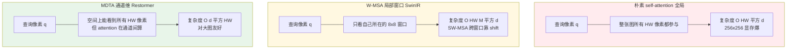
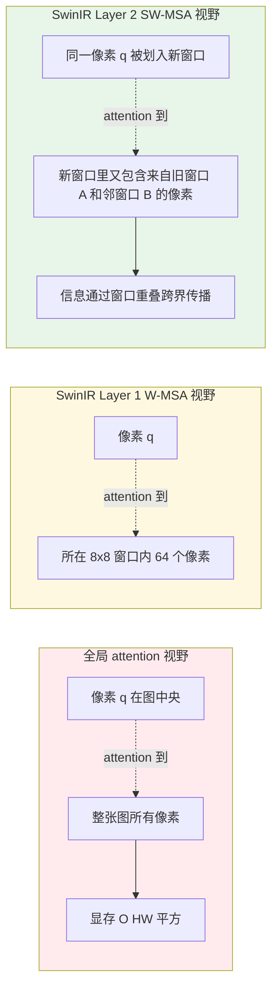
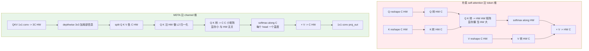

# 第 7 章 · Transformer 在低层视觉

> CNN 的感受野是局部的，它通过堆深度间接获得大感受野。
>
> Transformer 的 self-attention 是全局的，但代价是 $O(N^2)$ 计算。
>
> 低层视觉里 Transformer 怎么落地，是过去三年这个领域最有趣的工程故事之一。

## 7.0 阅读须知

本章是 Part II 第二站，承接第 6 章 CNN 时代，把 self-attention 引入低层视觉之后这四五年的设计演进梳理一遍。读完之后，你应当能：

- 理解为什么"长距离依赖"对低层视觉是真正有用的，而不是 Transformer 派的话术
- 看懂 window attention（W-MSA / SW-MSA）和 transposed channel attention（MDTA）两条主流路线的取舍
- 给一个新任务选 backbone 时，能在 CNN、SwinIR、Restormer、HAT、混合架构之间做出有依据的判断
- 读懂 SwinIR / Restormer 的简化代码，知道每一行在解决什么

本章预设你已经掌握：

- 第 6 章 CNN 时代的演进（特别是残差块、PixelShuffle、channel attention 这几个概念）
- 普通 self-attention 的形式 $\text{softmax}(QK^T / \sqrt{d}) V$ 和它的 $O(N^2)$ 复杂度
- LayerNorm 与 BatchNorm 的差异（第 6 章 §6.9 已展开）

不预设你读过 ViT/Swin/SwinIR/Restormer/HAT 的原始论文，也不预设你写过 attention 的 CUDA 实现。

**本章首次出现或将反复出现的缩写。** 集中先列一遍，后面用到时还会再展开一句话定义：

- **ViT**（Vision Transformer）：2020 年 Dosovitskiy et al. 提出，把图像切成 16×16 的 patch 当作 token 喂给标准 Transformer，是 Transformer 在视觉里的奠基工作
- **MSA**（Multi-head Self-Attention，多头自注意力）：标准 Transformer 的核心算子，多个 attention head 各看一段子空间
- **W-MSA**（Window-based Multi-head Self-Attention）：只在 $M \times M$ 的局部窗口内做 attention，把复杂度从 $O((HW)^2)$ 降到 $O(HW \cdot M^2)$
- **SW-MSA**（Shifted Window MSA）：W-MSA 的搭档，每隔一层把窗口偏移 $M/2$，让相邻层的窗口边界错开，使信息跨窗口流动
- **Swin Transformer**：2021 年 Liu et al. 提出，用 W-MSA / SW-MSA 交替的 hierarchical 视觉 Transformer
- **SwinIR**（Swin Transformer for Image Restoration）：2021 年 Liang et al. 把 Swin 移到低层视觉，做 SR/去噪/去模糊的统一架构
- **RSTB**（Residual Swin Transformer Block）：SwinIR 的中间层组件，多个 Swin Transformer Layer 套一层残差
- **STL**（Swin Transformer Layer）：RSTB 内部的基本单元，由一次 W-MSA 或 SW-MSA + 一次 MLP 组成
- **Restormer**（Restoration Transformer）：2022 年 Zamir et al. 提出，用通道维 attention（MDTA）+ 门控 FFN（GDFN）做去噪/去模糊/去雨的通用 SOTA
- **MDTA**（Multi-Dconv Head Transposed Attention）：Restormer 的核心算子，把 self-attention 从 token 维转到 channel 维，复杂度从 $O((HW)^2 d)$ 降到 $O(d^2 \cdot HW)$
- **GDFN**（Gated-Dconv Feed-Forward Network）：Restormer 的 FFN 模块，加入门控 + depthwise 卷积
- **HAT**（Hybrid Attention Transformer）：2023 年 Chen et al. 提出，把 W-MSA、Channel Attention、Overlapping Cross-Attention 三种 attention 组合
- **HAB**（Hybrid Attention Block）：HAT 的基础 block，W-MSA + CAB 并行
- **OCAB**（Overlapping Cross-Attention Block）：HAT 的扩展 block，在重叠窗口上做 cross-attention，弥补 SW-MSA 的间接性
- **CAB**（Channel Attention Block）：HAT 内部用的 channel attention 模块，结构上接近 RCAN 的 RCAB
- **LAM**（Local Attribution Map）：可视化模型实际利用哪些输入像素的工具，HAT 用它分析 SwinIR 的"容量没用满"问题
- **self-similarity**（自相似性）：自然图像里同一种纹理在多个位置出现的统计现象，是 attention 在低层视觉有用的核心理由
- **non-local means**：经典图像处理里利用自相似性做去噪的方法，attention 可看作它的可学习版本

## 7.1 为什么 Transformer 来到低层视觉

CNN 在第 6 章的演进里，每一步都在解决"感受野"问题——加深、加 attention、加 dense connection。但 CNN 的感受野受卷积核大小和深度限制，**理论感受野随深度线性增长，实际有效感受野远小于理论值**。多份研究做过实际感受野的可视化，发现 20 层 ResNet 的实际感受野只有理论值的 1/3 左右，且呈高斯衰减——越远的像素影响越弱。

低层视觉的一个反直觉事实：

> 远距离的像素在恢复任务里**有用**。

举例：

- **去噪**：图中某块区域有相似纹理（一片草、一面墙），远处的"干净复制品"能帮助恢复"噪声覆盖处"的细节，因为多个噪声样本平均后噪声方差降低
- **超分**：图中重复出现的细节（一排窗户、一片瓦、印刷字体里的同一个字母）可以借用其他位置的高频信息
- **去模糊**：模糊核在整个图上一致时，全图信息能联合估计核——单点的信息不够，需要远距离的边缘共同约束核
- **去雾 / 去雨**：雾和雨的统计模型在整张图上是全局的，知道远处天空区域的雾浓度能帮助恢复近处建筑的颜色

这是经典图像处理里 **non-local means**（非局部均值）的思想——**自相似性**（self-similarity）是自然图像的统计性质，每个像素的最佳邻居不一定是空间上紧邻的像素，而可能是图像另一端"长得像"的像素。CNN 利用这点要靠堆深度，效率低。

Self-attention 天然适合这件事：每个像素直接和所有其他像素交互，自相似性可以**在一层内捕捉**。

但代价是：**$O(H^2 W^2 \cdot C)$ 的计算复杂度**。$256 \times 256$ 图上 attention map 大小是 $65536 \times 65536$，FP32 下需要 17 GB 显存仅存一个 head 的 attention，连显存都装不下。

Transformer 在低层视觉的整个故事，就是**怎么让 self-attention 既保留长距离能力，又能跑得起来**。

为了把"全局 vs 窗口 vs 通道 attention"三种思路的差异立刻立起来，先画一张示意图：同一张 $H \times W$ 的特征图上，从一个像素出发，三种 attention 实际允许它"看到"哪些其他像素。



颜色分组反映"代价 vs 长距离能力"的权衡。红色 Full 是理想但跑不起来。黄色 Window 跑得起来，但每层只能看局部，长距离能力要靠多层累积。绿色 Channel 既能跑也能在每层"看到全图"，代价是 attention 不在像素间算而在通道间算，需要重新理解它在做什么——下面 §7.5 会详细展开。

## 7.2 朴素 ViT 的问题

直接把 Vision Transformer 用在低层视觉，几个直接的问题。

### 计算量爆炸

ViT 把图分成 $16 \times 16$ 的 patch。$256 \times 256$ 图分成 $16 \times 16 = 256$ 个 patch，attention 是 $256 \times 256$，可接受。$1024 \times 1024$ 图分成 $64 \times 64 = 4096$ 个 patch，attention 是 $4096 \times 4096$ 即 1600 万个元素，**显存爆**。低层视觉的输入分辨率往往比分类大一个数量级（分类是 224×224，去噪/超分常常是 1024×1024 或更大），ViT 的"分类专用预设"根本撑不住。

### Patch 粒度太粗

ViT 的 $16 \times 16$ patch 适合分类（语义级），不适合像素级任务。低层视觉需要**像素级细节**——SR 要恢复每个像素，去噪要保留每个像素的高频成分。把 16×16 像素打包成一个 token，等于在 attention 之前就把高频信息搅在一起，模型再怎么 attention 也找不回这些信息。

低层视觉的 Transformer 要么用更小的 patch（1×1 或 2×2，等价于不打包），要么用别的方式保持像素级表达（比如 SwinIR 的 1×1 patch + 窗口划分）。

### 缺少归纳偏置

CNN 的局部性（locality）和平移等变性（translation equivariance）是低层视觉的合理归纳偏置：相邻像素相关、同一种纹理出现在不同位置应该被同样处理。ViT 完全抛弃了这些，需要更多数据才能学到。

低层视觉数据集相对小（DF2K 几千张），不像分类有 ImageNet 一千万级。**ViT 在数据少的设置下劣势明显**。这也是 SwinIR 选择"窗口 + 相对位置编码"而不是纯 ViT 的原因——窗口划分把局部性偏置加回来，相对位置编码把平移等变性偏置加回来。

## 7.3 SwinIR（2021）—— 窗口注意力

Liang et al. 把 Swin Transformer 引入低层视觉，提出 SwinIR——SR、去噪、去模糊三任务通用架构。

### 核心思想：局部窗口 self-attention

不在全图上做 attention，而是把图分成 $M \times M$ 的窗口（典型 $M = 8$），**每个窗口内独立做 self-attention**。

- 窗口数量：$\frac{H}{M} \times \frac{W}{M}$
- 每个窗口的 attention：$M^2 \times M^2$
- 总复杂度：$\frac{H}{M} \times \frac{W}{M} \times M^4 \cdot C = HW \cdot M^2 \cdot C$

对比朴素 attention：$H^2 W^2 \cdot C$。当 $M = 8$ 时，复杂度从 $O((HW)^2)$ 降到 $O(HW \cdot 64)$，**从二次方降到线性**。$256 \times 256$ 输入下，朴素 attention 是 $256^4 = 4.3 \times 10^9$ 个 attention map 元素，W-MSA 是 $256^2 \times 64 = 4.2 \times 10^6$，降了三个数量级。

### Shifted Window 解决窗口隔离问题

W-MSA 的问题：窗口之间没有信息交换。第二层的 attention 仍然只能看到第一层的同一个窗口里的信息，长距离依赖在层数足够多之前完全建立不起来。

解决方案：**SW-MSA**（Shifted Window MSA）。每隔一层把整个窗口划分偏移 $M/2$，让相邻层的窗口边界错开。这样一个像素在第 1 层属于窗口 A，在第 2 层属于窗口 B，A 和 B 部分重叠，像素之间的信息通过这种"重叠传播"在多层后覆盖全图。

```
Layer 1 (W-MSA):           Layer 2 (SW-MSA):
+----+----+----+----+      +-+----+----+----+-+
|    |    |    |    |      | |    |    |    | |
+----+----+----+----+      +-+----+----+----+-+
|    |    |    |    |      | |    |    |    | |
+----+----+----+----+      +-+----+----+----+-+
|    |    |    |    |      | |    |    |    | |
+----+----+----+----+      +-+----+----+----+-+

窗口对齐                    窗口偏移 M/2
```

这样一次 W-MSA + 一次 SW-MSA 后，每个像素的有效感受野覆盖了 $2M \times 2M$ 区域。再过一对 W-MSA + SW-MSA 又翻倍——理论上 $\log(\max(H, W) / M)$ 对就能覆盖全图，SwinIR 的 6 个 RSTB × 6 个 STL = 36 层足以让任何位置的像素看到全图。

把"局部窗口 + shift"和"全局 attention"在同一张特征图上的可见范围画在一起：



红色 Full 一次性看完所有像素但跑不起来；黄色 W-MSA 一层只看 64 个；绿色 SW-MSA 让下一层的窗口和上一层错开，跨界信息靠层数累积。SwinIR 选择"小窗口 + 浅层数"是显存可控的设计；HAT 的 OCAB 则进一步把窗口做大并允许重叠，下面 §7.6 会讲。

### Window Attention 的实现

```python
import torch
import torch.nn as nn
import torch.nn.functional as F


def window_partition(x: torch.Tensor, window_size: int) -> torch.Tensor:
    """把 (B, H, W, C) 切成 (B*num_windows, M, M, C)。"""
    B, H, W, C = x.shape
    x = x.view(B, H // window_size, window_size,
               W // window_size, window_size, C)
    windows = x.permute(0, 1, 3, 2, 4, 5).contiguous()
    return windows.view(-1, window_size, window_size, C)


def window_reverse(windows: torch.Tensor, window_size: int,
                   H: int, W: int) -> torch.Tensor:
    """切回 (B, H, W, C)。"""
    B = int(windows.shape[0] / (H * W / window_size / window_size))
    x = windows.view(B, H // window_size, W // window_size,
                     window_size, window_size, -1)
    x = x.permute(0, 1, 3, 2, 4, 5).contiguous()
    return x.view(B, H, W, -1)


class WindowAttention(nn.Module):
    """W-MSA: 窗口内 self-attention, 带 relative position bias。"""

    def __init__(self, dim: int, window_size: int, num_heads: int):
        super().__init__()
        self.dim = dim
        self.window_size = window_size
        self.num_heads = num_heads
        head_dim = dim // num_heads
        self.scale = head_dim ** -0.5

        self.qkv = nn.Linear(dim, dim * 3, bias=True)
        self.proj = nn.Linear(dim, dim)

        # Relative position bias: 让模型学窗口内不同相对位置的偏好
        self.relative_position_bias_table = nn.Parameter(
            torch.zeros((2 * window_size - 1) ** 2, num_heads)
        )
        coords_h = torch.arange(window_size)
        coords_w = torch.arange(window_size)
        coords = torch.stack(torch.meshgrid([coords_h, coords_w], indexing='ij'))
        coords = coords.flatten(1)
        rel = coords[:, :, None] - coords[:, None, :]
        rel = rel.permute(1, 2, 0).contiguous()
        rel[:, :, 0] += window_size - 1
        rel[:, :, 1] += window_size - 1
        rel[:, :, 0] *= 2 * window_size - 1
        rel_index = rel.sum(-1)
        self.register_buffer("relative_position_index", rel_index)

    def forward(self, x: torch.Tensor) -> torch.Tensor:
        # x: (B*num_windows, M*M, C)
        B_, N, C = x.shape
        qkv = self.qkv(x).reshape(B_, N, 3, self.num_heads,
                                  C // self.num_heads).permute(2, 0, 3, 1, 4)
        q, k, v = qkv[0], qkv[1], qkv[2]   # 各 (B_, head, N, head_dim)

        attn = (q @ k.transpose(-2, -1)) * self.scale  # (B_, head, N, N)

        # 加 relative position bias
        bias = self.relative_position_bias_table[
            self.relative_position_index.view(-1)
        ].view(N, N, -1)
        attn = attn + bias.permute(2, 0, 1).unsqueeze(0)

        attn = attn.softmax(dim=-1)
        x = (attn @ v).transpose(1, 2).reshape(B_, N, C)
        return self.proj(x)
```

**Relative position bias 在做什么。** 普通 ViT 用绝对位置编码——给每个 token 一个固定的位置向量。SwinIR 用相对位置 bias——给"窗口内两个 token 之间的相对偏移"一个可学的标量，直接加到 attention 分数上。这种 bias 满足"平移等变"，是低层视觉里很合理的归纳偏置：同样的纹理出现在窗口的左上还是右下，相对位置关系不变。

### SwinIR 的架构

SwinIR 在 LR 空间做特征提取，每个 stage 由几个 RSTB（Residual Swin Transformer Block）组成。RSTB 内部是 W-MSA / SW-MSA 交替。

```
LR Input
  ↓ Conv (shallow feature)
  ↓ RSTB × 6 (deep features)
  │   每个 RSTB:
  │     STL × 6 (Swin Transformer Layer)
  │       W-MSA → MLP
  │       SW-MSA → MLP
  ↓ Conv + global residual
  ↓ Upsample (PixelShuffle)
  ↓ Conv
HR Output
```

性能：在 Set5 4× 上约 32.9 dB，超过 RCAN（32.6 dB）和所有 CNN 模型。

## 7.4 SwinIR 的局限

W-MSA 解决了 attention 的计算量问题，但它的**长距离能力其实有限**：

- 单层只看 $M = 8$ 像素的局部
- 跨窗口信息要经过 SW-MSA 累积，每经一层窗口才偏移一次
- 真正的"全图"长距离依赖需要堆很多层才能捕捉

而且 SwinIR 的"看到全图"是间接的——信息要经过多次 attention 中转，每次中转都会丢失精度。HAT 论文用 LAM 可视化发现，SwinIR 实际利用的输入像素只占视野的 30% 左右——剩下的 70% 虽然理论上能看到，但梯度信号衰减到几乎不起作用。

Restormer（下一节）发现了一个更巧妙的思路：**在通道维度做 attention**。绕开"空间维度上必须妥协"的问题。

## 7.5 Restormer（2022）—— 通道维度 Attention

Zamir et al. 提出 Restormer，是去噪/去模糊/去雨/去雾的通用 SOTA 架构。它的核心创新是把 self-attention 从空间维度搬到通道维度。

### MDTA：Multi-Dconv Head Transposed Attention

朴素 self-attention：

$$
\text{attention}(Q, K, V) = \text{softmax}(QK^T / \sqrt{d}) V
$$

其中 $Q, K, V \in \mathbb{R}^{N \times d}$，$N = HW$ 是空间长度，$d$ 是 head 维度。$QK^T$ 是 $N \times N$，**复杂度 $O(N^2 d)$**。空间维 $N$ 在大图上可能是几万到几十万，平方爆炸。

Restormer 的转置 attention：把 $Q, K, V$ 转置，变成 $\mathbb{R}^{d \times N}$。然后对 $Q, K$ 沿 token 维做 L2 归一化得到 $\hat{q}, \hat{k}$，再算：

$$
\text{attention}(Q, K, V) = V \cdot \text{softmax}\!\left( \alpha \cdot \hat{k} \hat{q}^T \right)
$$

其中 $\alpha$ 是每个 head 一个的可学温度参数。注意这里**用 cosine 相似度 + 温度**，不是除以 $\sqrt{N}$——这是 Restormer 与 vanilla attention 的另一个差异。$\hat{k} \hat{q}^T$ 是 $d \times d$ 的小矩阵——**复杂度 $O(d^2 N)$**。

$d$ 通常远小于 $N$（典型 $d / \text{head} = 24$ 到 64，$N = HW = 65536$），所以 $d^2 \ll N^2$。Restormer 在 $1024 \times 1024$ 输入上仍然可以训，朴素 attention 早就 OOM 了。

### 这个 attention 在做什么

理解 MDTA 的关键是想清楚"谁和谁算相似度"的差别。

- **Vanilla attention**：每个**像素位置**和其他所有像素位置算相关性，输出是 $V$ 沿 token 维的加权和——"用其他位置的特征来更新当前位置"
- **MDTA**：每个**通道**和其他所有通道算相关性，输出是 $V$ 沿 channel 维的加权和——"用其他通道的特征来更新当前通道"

直觉理解：

- 不同通道学到不同 features（边缘通道、纹理通道、噪声通道、颜色通道）
- 这些 features 之间有 dependency（边缘通道激活时，纹理通道往往也激活；颜色通道在某种纹理出现时常有特定取值）
- 通道间 attention 让模型自适应地决定哪些 features 在当前位置组合在一起

这本质是 channel attention 的**广义版本**——SE/CA 是给每个通道一个标量权重，MDTA 是让每个通道的输出是所有通道的加权和。换句话说，SE 是"对角矩阵"形式的 channel 变换，MDTA 是"完整 $C \times C$ 矩阵"形式的 channel 变换，而且矩阵的元素是从输入数据自适应算出来的。

**空间信息怎么进入 attention？** 关键是 $V$ 仍然带有空间维度——$V \in \mathbb{R}^{C \times HW}$，每个通道在每个像素位置都有一个值。attention 矩阵 $\hat{k} \hat{q}^T$ 是 $C \times C$，乘以 $V$ 时是沿通道维 "重新组合"，但每个像素位置独立做这个组合。所以输出仍然是空间分辨率全保留的 $C \times HW$，只是每个像素的通道分布被全图通道间相关性重新组织了一次。

把 MDTA 的数据流和朴素 attention 并排画出来，能立刻看出"维度颠倒"的本质：



两条 pipeline 的差别集中在中间的 attention 矩阵尺寸：vanilla 是 $HW \times HW$，MDTA 是 $C \times C$。对 $256 \times 256 \times 96$ 的特征图，vanilla 要 $65536 \times 65536$（17 GB FP32），MDTA 只要 $96 \times 96$（37 KB）。这是 Restormer 在大图上可用的根本原因。

### Depthwise Convolution 加局部性

MDTA 把 attention 搬到通道维后，自然失去了"空间局部性"——通道间 attention 不关心像素位置，对 SR/去噪这种局部任务并不友好。Restormer 的补救是在 $Q, K, V$ 投影前先做 3×3 depthwise conv，给 attention 注入空间局部信息：

```python
class MDTA(nn.Module):
    """Multi-Dconv Head Transposed Attention (Restormer)."""

    def __init__(self, dim: int, num_heads: int, bias: bool = False):
        super().__init__()
        self.num_heads = num_heads
        self.temperature = nn.Parameter(torch.ones(num_heads, 1, 1))

        # 1x1 conv 生成 QKV
        self.qkv = nn.Conv2d(dim, dim * 3, 1, bias=bias)
        # depthwise conv 给 QKV 加空间局部信息
        self.qkv_dwconv = nn.Conv2d(dim * 3, dim * 3, 3, padding=1,
                                    groups=dim * 3, bias=bias)
        self.proj = nn.Conv2d(dim, dim, 1, bias=bias)

    def forward(self, x: torch.Tensor) -> torch.Tensor:
        # x: (B, C, H, W)
        B, C, H, W = x.shape
        qkv = self.qkv_dwconv(self.qkv(x))
        q, k, v = qkv.chunk(3, dim=1)

        # reshape: (B, C, H, W) -> (B, head, C/head, HW)
        q = q.view(B, self.num_heads, C // self.num_heads, H * W)
        k = k.view(B, self.num_heads, C // self.num_heads, H * W)
        v = v.view(B, self.num_heads, C // self.num_heads, H * W)

        # 沿 token 维 (HW) L2 归一化, 让 K@Q^T 是 cosine 相似度
        q = F.normalize(q, dim=-1)
        k = F.normalize(k, dim=-1)

        # 关键: 在 channel 维 softmax, 不是在 token 维
        attn = (q @ k.transpose(-2, -1)) * self.temperature  # (B, head, c/h, c/h)
        attn = attn.softmax(dim=-1)

        out = (attn @ v).view(B, C, H, W)
        return self.proj(out)
```

### Gated-Dconv Feed-Forward Network

Restormer 的 FFN 也修改了——把普通 MLP 替换成 GDFN（Gated-Dconv Feed-Forward Network）：

```python
class GDFN(nn.Module):
    """Gated-Dconv Feed-Forward Network."""

    def __init__(self, dim: int, ffn_expansion: float = 2.66, bias: bool = False):
        super().__init__()
        hidden = int(dim * ffn_expansion)
        self.proj_in = nn.Conv2d(dim, hidden * 2, 1, bias=bias)
        self.dwconv = nn.Conv2d(hidden * 2, hidden * 2, 3, padding=1,
                                groups=hidden * 2, bias=bias)
        self.proj_out = nn.Conv2d(hidden, dim, 1, bias=bias)

    def forward(self, x: torch.Tensor) -> torch.Tensor:
        x = self.proj_in(x)
        x = self.dwconv(x)
        x1, x2 = x.chunk(2, dim=1)
        x = F.gelu(x1) * x2          # gating
        return self.proj_out(x)
```

注意 `F.gelu(x1) * x2` 这个 gating——和 NAFNet 的 SimpleGate 是同样的思想，让模型自适应地决定每个通道在当前位置激活多少。这种"门控 FFN"在 Transformer 派和 CNN 派都已经成为现代默认，可以理解为对 vanilla FFN 的一次普适性改进。

### Restormer 整体

U-Net 形状的 encoder-decoder + skip connection + MDTA/GDFN block。每个 encoder/decoder level 由若干个 Transformer block 堆叠，level 之间通过 PixelShuffle/PixelUnshuffle 改变分辨率。在去噪、去模糊、去雨等任务上是 2022-2023 年的事实 SOTA，Real-World 数据集上比 SwinIR 提升约 0.3-0.5 dB。

它的工程优势在大图推理上特别明显——同样硬件下能跑的最大输入分辨率比 SwinIR 大一两倍，这对视频去噪和高分辨率照片修复是关键。

## 7.6 HAT（2023）—— 混合注意力

Chen et al. 在 SwinIR 基础上提出 HAT（Hybrid Attention Transformer），是当前学术 SR benchmark 的 SOTA。

### 关键观察

SwinIR 的 W-MSA 范围只有 $8 \times 8$。论文做实验发现：**SwinIR 只用了输入的一小部分**——通过 LAM（Local Attribution Map）可视化，模型实际利用的像素仅占可见输入的 30%。

这意味着 SwinIR 的容量没用满。HAT 的目标：**让模型利用更多的输入信息**。

### 两类 attention block 组合

HAT 的核心 block 不是单一的"三合一 attention"，而是 group 级别的两类 block 组合：

1. **HAB**（Hybrid Attention Block）：W-MSA + CAB 在同一个 block 内
   - **W-MSA**（窗口自注意力）：继承 SwinIR 的局部 + shifted window
   - **CAB**（Channel Attention Block）：给 features 加 RCAN 风格的 channel attention，弥补 W-MSA 不会聚焦"重要通道"
2. **OCAB**（Overlapping Cross-Attention Block）：作为独立 block 放在 residual group 内
   - 把 $8 \times 8$ 窗口扩大到 $12 \times 12$（包含相邻窗口的边缘），在扩大窗口内做 cross-attention
   - 让每个窗口能直接看到相邻窗口的边缘像素，不依赖 shifted window 的间接传播

### 性能

HAT-L（大版本）在 Set5 4× 上约 33.0-33.4 dB（取决于训练设置和是否预训练 ImageNet），比 SwinIR 提升约 0.5 dB——**这在 SR 领域是非常显著的提升**。

代价：参数量约 40M，推理慢。生产环境很少直接用 HAT-L，但它**展示了 attention 设计还有多少空间**。

## 7.7 为什么 attention 对低层视觉有用

到这里可以总结一下 attention 在低层视觉的具体贡献。

### 长距离自相似性

§7.1 提过：自然图像有 self-similarity，远处的相似 patch 可以帮助恢复。CNN 通过堆深度间接做，attention 直接做。

具体场景：

- **去噪**：远处干净的相似纹理 → 当前噪声位置的去噪先验
- **超分**：图中重复的边缘/角点 → 借用高频细节
- **去模糊**：同一物体的不同视角实例 → 联合约束去模糊结果

### 退化程度的不均匀性

真实图像里不同位置的退化程度不一样：

- 暗部噪声大、亮部噪声小
- 中心清晰、边缘模糊（镜头像差）
- 主体在焦内、背景在焦外
- 局部过曝、局部正常

CNN 的卷积是**位置无关**的——同一个 kernel 处理所有位置。attention 是**位置相关**的——可以让"轻退化区域"的信息流到"重退化区域"，自适应地分配修复力度。

### 通道维度的特征聚合

MDTA 揭示的：通道之间也有 dependency。channel attention（SE/CA）是简化版，MDTA 是完整版。这种通道间的信息交互在 CNN 里需要靠 1×1 卷积层间接做，效率低，且不能根据输入内容自适应调整通道间的混合权重。

## 7.8 计算效率分析

不同 attention 的计算量对比（输入 $256 \times 256$，$C = 96$）：

| 方法 | 复杂度 | $256 \times 256$ FLOPs | 显存（attention map） |
|------|-------|----------------------|---------------------|
| Vanilla ViT | $O((HW)^2 C)$ | ~16 TFLOPs | ~16 GB |
| SwinIR (M=8) | $O(HW \cdot M^2 C)$ | ~250 GFLOPs | ~256 MB |
| Restormer (MDTA) | $O(C^2 \cdot HW / \text{head})$ | ~500 GFLOPs | ~64 MB |
| HAT | SwinIR + CAB + OCAB | ~600 GFLOPs | ~512 MB |

工程意义：

- 朴素 ViT 完全不可用（除非小图）
- SwinIR/Restormer 都是"线性复杂度"（FLOPs 与 $HW$ 成线性）
- Restormer 的显存最低，对大图友好——这是它在视频去噪等大尺寸应用里的关键优势

## 7.9 移动端的 attention

理论上 attention 复杂度可控，但**端侧部署 attention 的瓶颈不在 FLOPs，在内存带宽和算子支持**。

### softmax 是个坑

NPU/移动 GPU 对 GEMM（General Matrix Multiply，矩阵乘）有硬件加速，对 softmax 没那么好。一个 attention 块的 softmax 可能比矩阵乘本身慢 2-3 倍——硬件流水线在 softmax 上利用率掉一半。

### Reshape 开销

attention 实现里大量 reshape/permute（把 $(B, C, H, W)$ 折成 $(B, \text{head}, C/\text{head}, HW)$ 之类）。在某些 NPU 上 reshape 是 memory-bound 操作，要把数据从一种内存布局搬到另一种，比浮点运算还慢。

### 实际工程

2026 年的端侧增强模型（手机 NPU）几乎全是 CNN，原因：

- 移动端 NPU 对 CNN 的优化最成熟（硬件 + 编译器 + 内存布局）
- attention 的 latency 不稳定（取决于输入大小），给推理引擎增加困难
- 端侧 OCR/AI 滤镜对延迟极敏感（< 30 ms），attention 模型的不稳定 latency 很难满足

何时端侧用 attention：

- **少量 attention block + 大量 CNN**（混合架构），让 attention 只出现在低分辨率瓶颈层
- **shape 固定的输入**（比如固定 $720 \times 1280$ 视频帧），编译器能做静态优化
- **用 linear attention 变体**（MobileViT 系列），避开 softmax

第 15 章会详细讲端侧部署。

## 7.10 Transformer 不擅长什么

Transformer 在低层视觉不是万能的，几个**不适合**的场景。

### 极端轻量级（< 1M 参数）

attention 本身有"基础开销"——QKV 投影、位置编码、相对位置 bias 等。这些固定开销在小模型里占比大。

实测：1M 参数预算下，纯 CNN 比 SwinIR 风格的 attention 模型在 PSNR 上高 0.2 dB。

### 极小输入

输入 $< 128 \times 128$ 时，window attention 的窗口都覆盖不了几个，效率不如直接全图 attention 或者直接 CNN。

### 对锐利度极敏感的任务

attention 有 averaging 的本质（softmax 加权和）。轻微的 attention 偏差会让边缘略糊。在文档增强、二值化等任务上，CNN（特别是有 gradient loss 的）效果更好。

### 训练数据少的场景

attention 缺少 CNN 的归纳偏置，需要更多数据才能学到一样的能力。如果你的训练集 < 10K 张图，CNN 通常比 Transformer 好——这是 §7.2 缺归纳偏置的延续。

## 7.11 选型决策表

| 场景 | 推荐 |
|------|------|
| 通用 SR / 去噪 / 去模糊（学术 benchmark） | SwinIR / Restormer / HAT |
| 真实退化 SR（生产） | RRDB（Real-ESRGAN）或 NAFNet |
| 端侧部署 | NAFNet / MobileNet 风格 CNN |
| 视频去噪 / 去模糊 | Restormer（U-Net 形状对长序列友好） |
| 极小输入（< 128 px） | CNN |
| 极端轻量（< 1M 参数） | CNN |
| 高质量人脸修复 | RestoreFormer / CodeFormer（混合架构） |
| 扩散派增强 | UNet 内部用 Transformer block（第 8 章） |

## 7.12 一个简化的 SwinIR-style 模块

把上面的概念拼成一个最小可读的 Transformer block：

```python
import torch.nn as nn


class SwinTransformerBlock(nn.Module):
    """简化的 Swin Transformer Block。"""

    def __init__(self, dim: int, num_heads: int, window_size: int = 8,
                 shift_size: int = 0, mlp_ratio: float = 4.0):
        super().__init__()
        self.dim = dim
        self.window_size = window_size
        self.shift_size = shift_size

        self.norm1 = nn.LayerNorm(dim)
        self.attn = WindowAttention(dim, window_size, num_heads)
        self.norm2 = nn.LayerNorm(dim)
        self.mlp = nn.Sequential(
            nn.Linear(dim, int(dim * mlp_ratio)),
            nn.GELU(),
            nn.Linear(int(dim * mlp_ratio), dim),
        )

    def forward(self, x: torch.Tensor, H: int, W: int) -> torch.Tensor:
        # x: (B, H*W, C)
        B, L, C = x.shape
        shortcut = x
        x = self.norm1(x).view(B, H, W, C)

        # Cyclic shift (SW-MSA)
        if self.shift_size > 0:
            x = torch.roll(x, shifts=(-self.shift_size, -self.shift_size),
                           dims=(1, 2))

        # 窗口分割 + attention + reverse
        windows = window_partition(x, self.window_size)             # (B*nW, M, M, C)
        windows = windows.view(-1, self.window_size ** 2, C)
        # 注意: 完整 SW-MSA 还需要传入 attention mask, 防止 cyclic shift 后的
        # "环绕" 像素跨真实图像边界相互 attend。这里省略 mask 让代码可读,
        # 实际 SwinIR / Swin Transformer 的 self.attn 接受一个 mask 参数。
        attn_windows = self.attn(windows)
        attn_windows = attn_windows.view(-1, self.window_size,
                                         self.window_size, C)
        x = window_reverse(attn_windows, self.window_size, H, W)

        # Reverse shift
        if self.shift_size > 0:
            x = torch.roll(x, shifts=(self.shift_size, self.shift_size),
                           dims=(1, 2))
        x = x.view(B, L, C)

        # 残差 + MLP
        x = shortcut + x
        x = x + self.mlp(self.norm2(x))
        return x
```

实际 SwinIR 的代码在这上面加 attention mask（处理 SW-MSA 的环绕问题）+ RSTB（多个 STL 包一层残差）+ patch merging（如果分多 stage）+ 上采样头。完整 SwinIR 大约 1000 行。

## 7.13 小结

1. **CNN 的局部性是低层视觉的合理偏置**，但限制了长距离依赖
2. **朴素 ViT 在低层视觉不可用**——计算量爆、粒度粗、缺归纳偏置
3. **SwinIR 用窗口注意力 + shifted window 解决计算量**，是 SR/去噪/去模糊的统一架构
4. **Restormer 用通道维度 attention（MDTA）** 把复杂度从 $O(N^2)$ 降到 $O(C^2)$，是去噪/去模糊 SOTA
5. **HAT 通过组合三种 attention 进一步提升**，但参数量大、推理慢
6. **attention 对低层视觉有用**：自相似性、退化不均匀、通道间依赖
7. **端侧仍然是 CNN 主场**——attention 在 NPU 上效率不好
8. **CNN 和 Transformer 不是替代关系**：现代增强网络（特别是扩散）通常是混合架构

到这里 Part II 的判别式架构（CNN + Transformer）讲完。下一章进入扩散模型——这是过去三年这个领域最大的范式转变，把"判别式恢复"扩展到"生成式恢复"。

---

> 下一章 [扩散模型基础](08-diffusion.md) → 从 DDPM 到 LDM，为什么扩散能"无中生有"，以及它在影像增强里的特殊角色。
