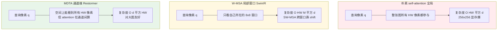
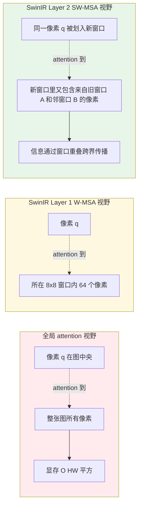
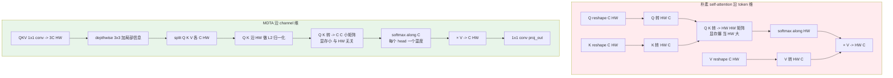

# 第 7 章 · Transformer 在低层视觉

> 传统卷积算子的物理感受野严格受限于局部窗口，即便通过深层堆叠间接扩展，其实际有效感受野依然呈高斯衰减，难以跨越远距离空间捕获全局上下文。
>
> 自注意力机制（Self-Attention）从数学上打破了空间距离的隔阂，具备单步关联全图任意像素的全局感知能力。然而，朴素自注意力高达 $O(N^2)$ 的二次方计算与显存复杂度，成为高分辨率图像处理中难以逾越的工程鸿沟。
>
> 如何在像素级精细恢复中，以线性或受控的计算预算捕获广袤的跨区域自相似先验，构成了低层视觉 Transformer 架构演进的核心母题。

## 7.0 阅读须知

本章作为 Part II 的第二篇，承接第 6 章的 CNN 演进脉络，系统剖析自注意力机制引入低层视觉任务后的关键架构创新与工程权衡。完成本章阅读后，读者应当能够：

- 从非局部先验与自相似性机理出发，严谨论证长距离依赖在图像恢复中的实际工程价值；
- 深入掌握基于空间局部窗口（W-MSA / SW-MSA）与基于转置通道维度（MDTA）两条主流低复杂度路线的底层数学逻辑与权衡边界；
- 针对具体任务场景（算力预算、输入分辨率、实时性要求），在 CNN、SwinIR、Restormer、HAT 及混合架构之间做出有依据的技术选型；
- 熟练阅读并实现 SwinIR 与 Restormer 的核心算子代码，明确各模块的计算开销与数据流走向。

阅读前提：

- 第 6 章：CNN 架构演进（残差块、PixelShuffle 亚像素卷积、通道注意力机制）；
- 标准自注意力计算形式 $\text{softmax}(QK^T / \sqrt{d}) V$ 及其 $O(N^2)$ 空间与计算复杂度；
- 归一化层特性对比（LayerNorm 在像素级回归任务中的稳定性机理）。

**核心术语与缩写索引：**

- **ViT**（Vision Transformer）：Dosovitskiy 等人于 2020 年提出，将图像划分为 16×16 的 Patch 作为序列 Token 输入标准 Transformer，奠定了视觉 Transformer 的基础范式。
- **MSA**（Multi-head Self-Attention，多头自注意力）：标准 Transformer 的核心注意力算子，通过多个头在不同投影子空间并行捕获相关性。
- **W-MSA**（Window-based Multi-head Self-Attention）：将特征划分为 $M \times M$ 不重叠局部窗口并在窗口内独立计算注意力，将计算复杂度由 $O((HW)^2)$ 降至 $O(HW \cdot M^2)$。
- **SW-MSA**（Shifted Window MSA）：W-MSA 的协同算子，在连续层间将窗口划分偏移 $M/2$，使跨窗口边界的信息得以逐层交互流动。
- **Swin Transformer**：Liu 等人于 2021 年提出的分层视觉 Transformer，通过交替堆叠 W-MSA 与 SW-MSA 实现兼具局部性与跨窗口通信的高效表征。
- **SwinIR**（Swin Transformer for Image Restoration）：Liang 等人于 2021 年将 Swin 架构引入低层视觉，构建了覆盖超分、去噪与去模糊的统一恢复模型。
- **RSTB**（Residual Swin Transformer Block）：SwinIR 的核心残差单元，由若干 Swin Transformer 层与末端卷积加残差直连构成。
- **STL**（Swin Transformer Layer）：RSTB 内部的基础层，包含一次 W-MSA 或 SW-MSA 以及一次 MLP 变换。
- **Restormer**（Restoration Transformer）：Zamir 等人于 2022 年提出，基于转置通道自注意力（MDTA）与门控前馈网络（GDFN），构建了通用图像恢复的高效架构。
- **MDTA**（Multi-Dconv Head Transposed Attention）：Restormer 的核心注意力算子，将自注意力由 Token 空间维转向 Channel 通道维，计算复杂度优化为 $O(d^2 \cdot HW)$。
- **GDFN**（Gated-Dconv Feed-Forward Network）：Restormer 的前馈网络模块，结合深度可分离卷积与通道门控机制。
- **HAT**（Hybrid Attention Transformer）：Chen 等人于 2023 年提出，融合窗口自注意力、通道注意力与重叠跨窗口注意力（OCAB），进一步拓展有效感受野。
- **HAB**（Hybrid Attention Block）：HAT 的基础模块，将大尺度窗口 W-MSA 与通道注意力块（CAB）并行集成。
- **OCAB**（Overlapping Cross-Attention Block）：HAT 的增强模块，在相邻重叠窗口间计算 Cross-Attention，强化相邻局域的直接信息交互。
- **CAB**（Channel Attention Block）：HAT 内部集成的通道注意力组件，用于弥补空间注意力对通道重要性建模的不足。
- **LAM**（Local Attribution Map）：基于积分梯度的模型特征归因可视化工具，用于量化分析输入像素对输出重建的实际贡献区域。
- **Self-similarity**（图像自相似性）：自然图像中相似纹理与结构在不同空间位置重复出现的统计学特性，是注意力机制在图像恢复中奏效的物理先验。
- **Non-local Means**（非局部均值滤波）：经典图像处理中利用全图自相似性进行加权去噪的算法，自注意力机制可视为其高阶可学习推广。

## 7.1 为什么 Transformer 适用于低层视觉

在 CNN 的演进历程中，深度堆叠、空洞卷积与密集连接等设计均在致力于扩展感受野。然而，标准卷积的有效感受野（Effective Receptive Field, ERF）受到卷积核尺寸与网络深度的物理限制。实证分析表明，深层残差网络的实际有效感受野通常仅为理论计算值的约三分之一，且在中心坐标呈陡峭的高斯衰减，对远距离空间上下文的捕获能力相对微弱。

在图像恢复与增强任务中，跨区域的长程像素关联蕴含着极其关键的重构价值：

- **图像去噪**：图像中空间相距较远的同质区域（如大面积草坪、平整墙体、纯净天空）具有高度相似的高频纹理统计分布；借助远距离干净像素的冗余采样执行加权平均，能够在保留锐利边缘的同时极大压制独立加性噪声；
- **图像超分辨率**：自然场景中频繁出现的规则几何结构（如高耸建筑的格栅窗台、规则砖石排布、印刷字符）在不同空间坐标高度自相似，跨区域的纹理迁移能够直接填补局部退化丢失的高频谱分量；
- **图像去模糊**：对于全图均匀的空间不变退化核，分散在不同方位的边缘与角点响应能够共同构成逆滤波的联合约束方程，大幅提升点扩散函数（PSF）反演的数值稳定性；
- **去雾与去雨**：全幅图像的大气光强与透射率分布具有大尺度的空间连续性，远景开阔天空区域的退化先验能够直接为近景地物的动态范围拉伸提供全局参照。

这一机制在经典图像处理中与**非局部均值（Non-local Means）**先验深度共鸣：图像中最具参考价值的信息往往广泛散布于全图的自相似流形之中。CNN 捕获这种全局自相似性需依赖数十层卷积的层层间接传递，信号在传播过程中极易衰减；而自注意力机制（Self-Attention）天然支持任意两个空间坐标直接计算关联度，可在单层操作中实现跨区域特征的瞬时聚合。

然而，朴素全局自注意力的计算与显存复杂度高达 **$O((HW)^2 \cdot C)$**。对于分辨率为 $256 \times 256$ 的特征图，注意力矩阵包含 $65536 \times 65536 \approx 4.29 \times 10^9$ 个元素；在单精度浮点（FP32）下，仅维护单个 Head 的注意力矩阵便需消耗约 17.18 GB 显存，在工程落地中显然难以承受。

因此，低层视觉 Transformer 的核心技术演进，聚焦于**在保留长距离依赖建模能力的同时，将注意力机制的复杂度降至与空间分辨率呈线性关系的工程实现**。

下图概括了三种核心注意力计算范式在空间覆盖范围与计算开销上的根本差异：



- **全局注意力（Full Attention）**：空间感受野全图覆盖，但显存开销随图像尺寸呈四次方增长，工程不可行；
- **局部窗口注意力（W-MSA）**：在 $M \times M$ 局部网格内约束计算，复杂度随 $HW$ 线性增长，长距离通信依赖层间窗口平移（Shifted Window）；
- **转置通道注意力（MDTA）**：转置特征维度并在通道间计算关联度，显存与空间分辨率线性相关，天然支持大分辨率输入。

## 7.2 朴素 ViT 在低层视觉中的瓶颈

直接将高层视觉的 Vision Transformer（ViT）应用于像素级恢复任务存在以下结构性缺陷：

### 1. 计算复杂度随分辨率平方级膨胀

ViT 针对分类任务设计，输入图像分辨率通常固定为 $224 \times 224$。而在图像超分辨率、去噪等低层视觉场景中，处理尺寸往往达到 $1024 \times 1024$ 甚至 4K。若采用全局自注意力，计算量与显存占用将直接引发硬件内存溢出（OOM）。

### 2. Patch 划分破坏高频像素级细节

ViT 通常将输入图像切分为 $16 \times 16$ 的 Patch 并线性映射为单个 Token。这种粗粒度划分在语义分类任务中能够有效压缩空间冗余，但在低层视觉中，将 256 个像素的空间高频信息强行压缩为单一向量，会在特征提取最前端造成不可逆的高频细节损失。低层视觉模型必须采用 $1 \times 1$ 或微小重叠的 Patch 映射，以保证像素级的保真度。

### 3. 缺乏平移等变性与局部性归纳偏置

卷积算子天然具备平移等变性（Translation Equivariance）与空间局部性（Locality），高度契合自然图像中局部连续与空间不变的统计规律。纯 ViT 抛弃了这些归纳偏置，依赖海量数据（如 ImageNet-22K / JFT-300M）从零学习空间几何结构。而在低层视觉领域，配对训练集规模相对有限（通常为数千张高质量切片），纯 ViT 极易陷入过拟合或收敛困难。

## 7.3 SwinIR（2021）：基于窗口注意力的通用图像恢复

Liang 等人提出的 SwinIR 借鉴了 Swin Transformer 的层次化设计，将基于局部窗口的自注意力机制引入低层视觉，构建了适用于超分辨率、去噪与去模糊的统一架构。

### 核心机制：局部窗口自注意力（W-MSA）

SwinIR 将尺寸为 $(H, W)$ 的特征图均匀划分为大小为 $M \times M$ 的不重叠局部窗口（标准配置 $M = 8$），并在每个窗口内部独立执行多头自注意力计算。

复杂度对比分析：
- 窗口数量：$\frac{H}{M} \times \frac{W}{M}$；
- 单个窗口内部注意力复杂度：$M^2 \times M^2 \cdot C = M^4 C$；
- 全图总计算复杂度：$\left(\frac{H}{M} \times \frac{W}{M}\right) \times M^4 C = HW \cdot M^2 C$。

相较于全局自注意力的 $O((HW)^2 C)$，W-MSA 的计算复杂度由空间尺寸的**二次方降至线性**。在 $256 \times 256$、通道数 $C=64$、窗口 $M=8$ 的典型设定下，注意力矩阵元素总量由全局注意力的 $4.29 \times 10^9$ 缩减为 $4.19 \times 10^6$，计算量降低三个数量级。

### 平移窗口机制（Shifted Window MSA, SW-MSA）

W-MSA 限制了注意力在固定窗口内运算，阻断了跨窗口的信息交换。为实现空间上下文通信，Swin 架构引入了**平移窗口机制（SW-MSA）**：在连续的 Transformer 层间，将窗口划分网格沿水平与垂直方向循环平移 $\lfloor M/2 \rfloor$ 个像素。

```
Layer 1 (W-MSA):           Layer 2 (SW-MSA):
+----+----+----+----+      +-+----+----+----+-+
|    |    |    |    |      | |    |    |    | |
+----+----+----+----+      +-+----+----+----+-+
|    |    |    |    |      | |    |    |    | |
+----+----+----+----+      +-+----+----+----+-+
|    |    |    |    |      | |    |    |    | |
+----+----+----+----+      +-+----+----+----+-+

窗口对齐                    窗口偏移 M/2
```

通过这种交替变换，上一层位于同一窗口边缘的像素在下一层被划分至不同窗口，使得特征信息在网络深层堆叠中逐步扩散至全图空间。

下图对比了全局注意力、单层 W-MSA 与交替 SW-MSA 的有效通信范围演进：



### 窗口自注意力算子实现

```python
import torch
import torch.nn as nn
import torch.nn.functional as F


def window_partition(x: torch.Tensor, window_size: int) -> torch.Tensor:
    """把 (B, H, W, C) 切成 (B*num_windows, M, M, C)。"""
    B, H, W, C = x.shape
    x = x.view(B, H // window_size, window_size,
               W // window_size, window_size, C)
    windows = x.permute(0, 1, 3, 2, 4, 5).contiguous()
    return windows.view(-1, window_size, window_size, C)


def window_reverse(windows: torch.Tensor, window_size: int,
                   H: int, W: int) -> torch.Tensor:
    """切回 (B, H, W, C)。"""
    B = int(windows.shape[0] / (H * W / window_size / window_size))
    x = windows.view(B, H // window_size, W // window_size,
                     window_size, window_size, -1)
    x = x.permute(0, 1, 3, 2, 4, 5).contiguous()
    return x.view(B, H, W, -1)


class WindowAttention(nn.Module):
    """W-MSA: 窗口内 self-attention, 带 relative position bias。"""

    def __init__(self, dim: int, window_size: int, num_heads: int):
        super().__init__()
        self.dim = dim
        self.window_size = window_size
        self.num_heads = num_heads
        head_dim = dim // num_heads
        self.scale = head_dim ** -0.5

        self.qkv = nn.Linear(dim, dim * 3, bias=True)
        self.proj = nn.Linear(dim, dim)

        # Relative position bias: 让模型学窗口内不同相对位置的偏好
        self.relative_position_bias_table = nn.Parameter(
            torch.zeros((2 * window_size - 1) ** 2, num_heads)
        )
        coords_h = torch.arange(window_size)
        coords_w = torch.arange(window_size)
        coords = torch.stack(torch.meshgrid([coords_h, coords_w], indexing='ij'))
        coords = coords.flatten(1)
        rel = coords[:, :, None] - coords[:, None, :]
        rel = rel.permute(1, 2, 0).contiguous()
        rel[:, :, 0] += window_size - 1
        rel[:, :, 1] += window_size - 1
        rel[:, :, 0] *= 2 * window_size - 1
        rel_index = rel.sum(-1)
        self.register_buffer("relative_position_index", rel_index)

    def forward(self, x: torch.Tensor) -> torch.Tensor:
        # x: (B*num_windows, M*M, C)
        B_, N, C = x.shape
        qkv = self.qkv(x).reshape(B_, N, 3, self.num_heads,
                                  C // self.num_heads).permute(2, 0, 3, 1, 4)
        q, k, v = qkv[0], qkv[1], qkv[2]   # 各 (B_, head, N, head_dim)

        attn = (q @ k.transpose(-2, -1)) * self.scale  # (B_, head, N, N)

        # 加 relative position bias
        bias = self.relative_position_bias_table[
            self.relative_position_index.view(-1)
        ].view(N, N, -1)
        attn = attn + bias.permute(2, 0, 1).unsqueeze(0)

        attn = attn.softmax(dim=-1)
        x = (attn @ v).transpose(1, 2).reshape(B_, N, C)
        return self.proj(x)
```

### 相对位置偏置（Relative Position Bias）的设计机理

普通 ViT 采用绝对位置编码，为每个 Token 分配固定的绝对坐标向量。SwinIR 采用相对位置偏置：为窗口内任意两点间的相对偏移量 $(\Delta x, \Delta y)$ 学习一个连续偏置标量，直接加注到自注意力矩阵上。该偏置天然满足平移等变性，高度符合低层视觉的物理先验：相同的纹理无论出现在图像的中心还是边缘，其内部像素间的几何相关性保持不变。

### SwinIR 宏观架构流程

SwinIR 在 LR 空间完成全部深度特征表征，由若干个 RSTB（Residual Swin Transformer Block）串联构成主干，RSTB 内部交替堆叠 W-MSA 与 SW-MSA：

```
LR Input
  ↓ Conv (shallow feature)
  ↓ RSTB × 6 (deep features)
  │   每个 RSTB:
  │     STL × 6 (Swin Transformer Layer)
  │       W-MSA → MLP
  │       SW-MSA → MLP
  ↓ Conv + global residual
  ↓ Upsample (PixelShuffle)
  ↓ Conv
HR Output
```

性能表现：在 Set5 4× 基准上达到约 32.9 dB，显著超越经典 CNN 模型 RCAN（32.6 dB）。

## 7.4 SwinIR 的局限性

W-MSA 虽然将计算复杂度压缩至线性，但在长距离依赖捕获上存在固有妥协：

- 单层注意力仅覆盖 $M = 8$ 的微小空间局域；
- 跨窗口特征交互完全依赖 SW-MSA 在深层堆叠中的间接传递，多层传播过程中高频梯度易衰减；
- 局部归因图（LAM）分析表明，SwinIR 实际有效利用的输入像素范围仅占可见区域的约 30%，大量潜在的自相似信息未被充分激活。

针对这一问题，Restormer 提出了将注意力转移至**通道维度**的工程解法。

## 7.5 Restormer（2022）：转置通道自注意力

Zamir 等人提出的 Restormer 是图像去噪、去模糊、去雨与去雾任务的代表性架构。其核心突破在于将自注意力计算由传统的空间 Token 维度转移至特征通道维度。

### MDTA：Multi-Dconv Head Transposed Attention

标准空间自注意力的计算公式为：

$$
\text{Attention}(Q, K, V) = \text{softmax}\left(\frac{QK^T}{\sqrt{d}}\right) V
$$

其中 $Q, K, V \in \mathbb{R}^{N \times d}$，$N = HW$ 为空间 Token 数量，$d$ 为 Head 维度。$QK^T$ 的维度为 $N \times N$，计算复杂度为 **$O(N^2 d)$**。当处理高分辨率图像时，空间尺寸 $N$ 达到数万至数十万，显存与计算开销急剧爆炸。

Restormer 的转置通道注意力将特征矩阵转置为 $\mathbb{R}^{d \times N}$。先对 $Q, K$ 沿空间 Token 维度执行 L2 归一化生成 $\hat{q}, \hat{k}$，随后计算通道间的相关性：

$$
\text{Attention}(Q, K, V) = V \cdot \text{softmax}\left(\alpha \cdot \hat{k} \hat{q}^T\right)
$$

其中 $\alpha$ 为每个 Head 独立的可学习温度缩放参数。$\hat{k} \hat{q}^T$ 的矩阵尺寸仅为 $d \times d$，**计算复杂度被严格限制在 $O(d^2 N)$**。

在典型配置下，单个 Head 的通道维度 $d$（通常为 24 至 64）远小于空间像素总数 $N = HW$（例如 $256 \times 256 = 65536$）。因此 $d^2 \ll N^2$，Restormer 在处理 $1024 \times 1024$ 或更大分辨率输入时，显存开销依然保持线性可控。

### 通道维注意力机制的物理机理

- **标准空间注意力**：计算各个空间像素坐标之间的相关性，输出为所有空间位置特征的加权组合，用于跨坐标更新特征；
- **MDTA 通道自注意力**：计算不同特征通道之间的全局交叉协方差，输出为所有通道特征的自适应加权线性组合，用于跨特征映射重组表征。

物理含义分析：不同通道编码了互补的特征响应（如水平边缘、高频纹理、平坦色阶与噪声分布）。MDTA 通过动态计算全图通道间的交互矩阵，自适应调节不同特征在各像素点的激活权重。

**空间信息保留机理**：值矩阵 $V \in \mathbb{R}^{C \times HW}$ 完整保留了全部空间分辨率。$C \times C$ 的相关性矩阵作用于 $V$ 时，实质是在所有空间坐标点上执行通道间特征重组。输出张量尺寸保持 $(B, C, H, W)$ 完全不变，空间结构细节未发生任何压缩损失。

下图对比了标准空间自注意力与 MDTA 转置通道自注意力在数据流与矩阵尺度上的根本差异：



对于尺寸为 $256 \times 256 \times 96$ 的特征图，标准自注意力需构建 $65536 \times 65536$ 的超大矩阵（单头占用约 17.18 GB），而 MDTA 仅需维护 $96 \times 96$ 的紧凑矩阵（占用不足 40 KB）。

### 引入深度可分离卷积注入空间局部性

为补偿通道注意力对局部空间邻域感知的不足，Restormer 在生成 $Q, K, V$ 投影前，先经由 3×3 深度可分离卷积（Depthwise Conv）进行空间局部滤波：

```python
class MDTA(nn.Module):
    """Multi-Dconv Head Transposed Attention (Restormer)."""

    def __init__(self, dim: int, num_heads: int, bias: bool = False):
        super().__init__()
        self.num_heads = num_heads
        self.temperature = nn.Parameter(torch.ones(num_heads, 1, 1))

        # 1x1 conv 生成 QKV
        self.qkv = nn.Conv2d(dim, dim * 3, 1, bias=bias)
        # depthwise conv 给 QKV 加空间局部信息
        self.qkv_dwconv = nn.Conv2d(dim * 3, dim * 3, 3, padding=1,
                                    groups=dim * 3, bias=bias)
        self.proj = nn.Conv2d(dim, dim, 1, bias=bias)

    def forward(self, x: torch.Tensor) -> torch.Tensor:
        # x: (B, C, H, W)
        B, C, H, W = x.shape
        qkv = self.qkv_dwconv(self.qkv(x))
        q, k, v = qkv.chunk(3, dim=1)

        # reshape: (B, C, H, W) -> (B, head, C/head, HW)
        q = q.view(B, self.num_heads, C // self.num_heads, H * W)
        k = k.view(B, self.num_heads, C // self.num_heads, H * W)
        v = v.view(B, self.num_heads, C // self.num_heads, H * W)

        # 沿 token 维 (HW) L2 归一化, 让 K@Q^T 是 cosine 相似度
        q = F.normalize(q, dim=-1)
        k = F.normalize(k, dim=-1)

        # 关键: 在 channel 维 softmax, 不是在 token 维
        attn = (q @ k.transpose(-2, -1)) * self.temperature  # (B, head, c/h, c/h)
        attn = attn.softmax(dim=-1)

        out = (attn @ v).view(B, C, H, W)
        return self.proj(out)
```

### 门控前馈网络（GDFN）

Restormer 重新设计了前馈网络，提出 Gated-Dconv Feed-Forward Network（GDFN），融合门控机制与局部深度可分离卷积：

```python
class GDFN(nn.Module):
    """Gated-Dconv Feed-Forward Network."""

    def __init__(self, dim: int, ffn_expansion: float = 2.66, bias: bool = False):
        super().__init__()
        hidden = int(dim * ffn_expansion)
        self.proj_in = nn.Conv2d(dim, hidden * 2, 1, bias=bias)
        self.dwconv = nn.Conv2d(hidden * 2, hidden * 2, 3, padding=1,
                                groups=hidden * 2, bias=bias)
        self.proj_out = nn.Conv2d(hidden, dim, 1, bias=bias)

    def forward(self, x: torch.Tensor) -> torch.Tensor:
        x = self.proj_in(x)
        x = self.dwconv(x)
        x1, x2 = x.chunk(2, dim=1)
        x = F.gelu(x1) * x2          # gating 门控相乘
        return self.proj_out(x)
```

`F.gelu(x1) * x2` 结构使前馈网络能够受控调节各通道特征的激活程度，与 NAFNet 的 SimpleGate 原理一致，为现代恢复网络普遍采纳的标准前馈结构。

### Restormer 宏观多尺度架构

Restormer 采用 U-Net 拓扑的编码器-解码器架构配合跨层跳跃连接。各层级由若干 Transformer 块堆叠而成，层级间通过 PixelUnshuffle（下采样）与 PixelShuffle（上采样）变换空间尺度。该设计在大尺度去噪与高分辨率恢复中具备出色的吞吐量优势。

## 7.6 HAT（2023）：空间与通道混合注意力

Chen 等人提出的 HAT（Hybrid Attention Transformer）在 SwinIR 基础上进一步融合了多种注意力机制，是 2023 年学术超分辨率评测中的代表性模型。

### 架构设计要点

1. **HAB（Hybrid Attention Block）**：将 W-MSA 与通道注意力块（CAB）并行集成。将 W-MSA 的窗口尺寸由 SwinIR 的 8 扩展至 16，单层直接覆盖的空间网格面积增加至 4 倍；
2. **OCAB（Overlapping Cross-Attention Block）**：引入带重叠边界的局部窗口跨注意力机制（有效覆盖尺寸拓展至 $24 \times 24$），使相邻窗口的边缘特征在单层内实现直接通信，弥补平移窗口传递的滞后性。

性能表现：HAT-Large 在 Set5 4× 基准上达到约 33.0 至 33.4 dB，相较 SwinIR 提升约 0.5 dB。其代价在于参数量扩展至约 40M，计算延迟显著增加，主要用于前沿技术验证与离线高质量处理。

技术拓展：除窗口自注意力外，以 MambaIR 为代表的状态空间模型（State Space Model, SSM）通过选择性扫描机制实现了线性计算复杂度与全图感受野建模，成为与窗口注意力并行的重要探索方向（详见第 18 章）。

## 7.7 自注意力机制在低层视觉中的核心价值归纳

1. **跨区域自相似先验利用**：能够单步建立远距离相似纹理的关联，显著提高去噪与超分的高频纹理恢复质量；
2. **退化非均匀性自适应建模**：标准卷积核在全图保持空间不变性，而自注意力机制根据输入内容动态生成聚合权重，能自适应调节不同退化强度局域的特征流动；
3. **通道维度高阶相关性解耦**：MDTA 算子提供了全图通道间的全局动态重组能力，超越了传统 1×1 卷积的固定加权模式。

## 7.8 计算复杂度与资源消耗量化对比

以输入特征图尺寸 $256 \times 256$、基础通道数 $C = 96$ 为基准：

| 架构类型 | 理论复杂度 | 典型配置 FLOPs | 注意力矩阵显存占用 |
|---------|-----------|---------------|-------------------|
| **Vanilla ViT (全局)** | $O((HW)^2 C)$ | ~16.0 TFLOPs | ~16.0 GB (单 Head) |
| **SwinIR (窗口 M=8)** | $O(HW \cdot M^2 C)$ | ~250 GFLOPs | ~256 MB |
| **Restormer (MDTA)** | $O(d^2 \cdot HW)$ | ~500 GFLOPs | ~64 MB |
| **HAT (HAB + OCAB)** | 混合组合 | ~600 GFLOPs | ~512 MB |

工程结论：
- 朴素全局 ViT 在高分辨率低层视觉中工程不可行；
- SwinIR 与 Restormer 均实现了与空间像素数呈线性的计算复杂度；
- Restormer 的转置注意力显存开销最小，对超高分辨率图像与视频处理具有显著工程优势。

## 7.9 移动端与嵌入式部署考量

尽管窗口与通道注意力在理论 FLOPs 上可控，但端侧 NPU 部署依然面临硬件瓶颈：

- **Softmax 算子瓶颈**：移动端 NPU 针对密集矩阵乘（GEMM）与规则卷积提供了专用硬件加速单元，而 Softmax 涉及指数求和与归一化，硬件流水线利用率较低；
- **动态 Reshape 与内存搬运开销**：多头注意力执行频繁的张量重排（Permute / Transpose / Reshape），在端侧属于受制于内存带宽（Memory-bound）的耗时操作。

**工程实践策略**：在端侧高帧率实时场景中，优先采用纯 CNN 架构（如 NAFNet、MobileNet 变体）；若需引入 Transformer，建议仅在网络最深层的低分辨率瓶颈部分配置少量注意力模块。

## 7.10 Transformer 架构的不适用场景

1. **超轻量端侧约束（参数量 < 1M）**：自注意力的投影层与位置编码存在固定的参数与计算基线，在极小预算下纯 CNN 的参数效率更高；
2. **极小输入分辨率（< 128 px）**：局部窗口划分退化，难以体现多层分层优势；
3. **二值文档与强边缘敏感任务**：自注意力的加权求和机制具有内在平滑倾向，在文本锐利边缘恢复中易引起轻微弥散；
4. **小样本训练场景（数据量 < 10K）**：缺乏卷积的局部归纳偏置，容易产生过拟合。

## 7.11 骨干架构选型决策矩阵

| 应用场景与需求 | 推荐架构类型 | 代表性模型 |
|---------------|-------------|-----------|
| 学术基准评测 / 离线极高保真度 | 混合注意力 Transformer | HAT / SwinIR |
| 高分辨率图像去噪 / 去模糊 / 去雨 | 转置通道 Transformer | Restormer |
| 真实场景盲超分辨率（生产环境） | 深度残差 CNN / 极简门控 CNN | RRDB (Real-ESRGAN) / NAFNet |
| 移动端 / 嵌入式 NPU 实时部署 | 纯卷积架构 | NAFNet / MobileSR |
| 视频时空联合恢复 | U-Net 拓扑通道 Transformer | Restormer 变体 |
| 扩散模型主干网络 | 卷积与空间 Transformer 混合块 | SD / SDXL UNet |

## 7.12 最小可运行 Swin 模块实现

```python
import torch.nn as nn


class SwinTransformerBlock(nn.Module):
    """简化的 Swin Transformer Block。"""

    def __init__(self, dim: int, num_heads: int, window_size: int = 8,
                 shift_size: int = 0, mlp_ratio: float = 4.0):
        super().__init__()
        self.dim = dim
        self.window_size = window_size
        self.shift_size = shift_size

        self.norm1 = nn.LayerNorm(dim)
        self.attn = WindowAttention(dim, window_size, num_heads)
        self.norm2 = nn.LayerNorm(dim)
        self.mlp = nn.Sequential(
            nn.Linear(dim, int(dim * mlp_ratio)),
            nn.GELU(),
            nn.Linear(int(dim * mlp_ratio), dim),
        )

    def forward(self, x: torch.Tensor, H: int, W: int) -> torch.Tensor:
        # x: (B, H*W, C)
        B, L, C = x.shape
        shortcut = x
        x = self.norm1(x).view(B, H, W, C)

        # 循环平移 (SW-MSA)
        if self.shift_size > 0:
            x = torch.roll(x, shifts=(-self.shift_size, -self.shift_size),
                           dims=(1, 2))

        # 窗口切分 -> 注意力运算 -> 逆重组
        windows = window_partition(x, self.window_size)
        windows = windows.view(-1, self.window_size ** 2, C)
        attn_windows = self.attn(windows)
        attn_windows = attn_windows.view(-1, self.window_size,
                                         self.window_size, C)
        x = window_reverse(attn_windows, self.window_size, H, W)

        # 逆向循环平移
        if self.shift_size > 0:
            x = torch.roll(x, shifts=(self.shift_size, self.shift_size),
                           dims=(1, 2))
        x = x.view(B, L, C)

        # 残差连接与前馈网络
        x = shortcut + x
        x = x + self.mlp(self.norm2(x))
        return x
```

## 7.13 小结

1. **自注意力机制突破了局部感受野限制**：为建模自然图像的全局自相似先验提供了直接路径；
2. **朴素 ViT 在低层视觉中面临双重困境**：计算复杂度过高且粗粒度 Patch 损失高频细节；
3. **SwinIR 确立了窗口自注意力范式**：结合 W-MSA 与 SW-MSA 实现线性复杂度与跨窗口通信；
4. **Restormer 开拓了通道自注意力路线**：MDTA 算子在通道维度解耦特征，显存占用极小，适合高分辨率处理；
5. **现代网络多采用混合范式**：卷积负责浅层高频与局部偏置，Transformer 负责深层上下文建模，二者互为补充。

---

> 下一章 [扩散模型基础](08-diffusion.md) → 从确定性判别回归走向概率生成建模，探索扩散先验在复杂图像增强中的理论与工程实现。
