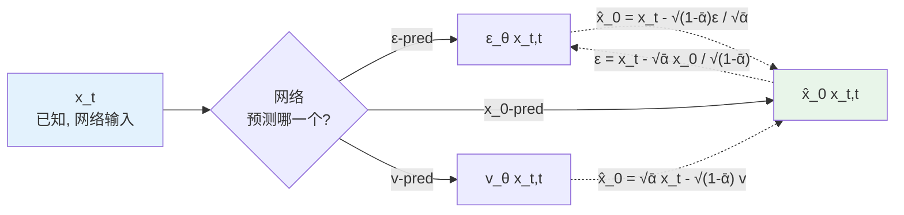
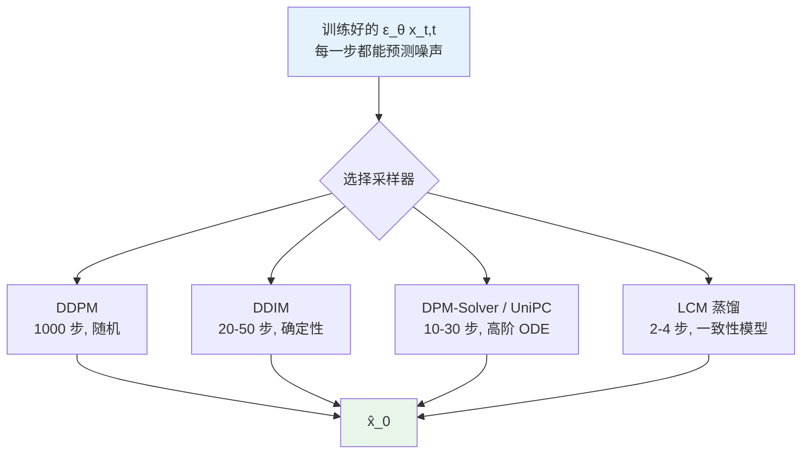
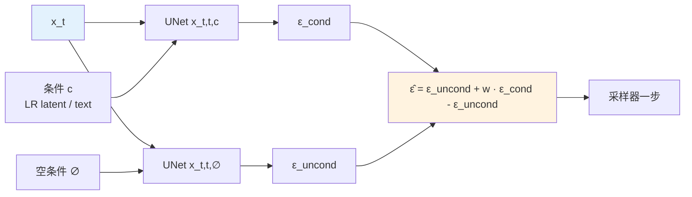

# 第 8 章 · 扩散模型基础

> 本章标志着图像增强范式从确定性点估计向概率生成建模的根本跃迁。
>
> 第 6 与第 7 章所探讨的判别式网络，本质上是在寻找一个确定的映射函数：给定退化观测 $y$，输出唯一的预测均值 $\hat{x} = f_\theta(y)$。
> 而扩散模型则将图像恢复重构为条件概率密度的采样过程：通过显式建模后验分布 $p_\theta(x \mid y)$，从广袤的自然图像先验流形中采掘出兼具全局结构自洽与微观纹理细腻的可行解。
>
> 在严重病态（Ill-posed）的高倍率逆问题中，这一视角的转变为突破感知与失真的固有权衡提供了强大的理论支撑与工程抓手。

## 8.0 阅读须知

本章是 Part II 架构篇的关键转折点。在此之前，判别式图像恢复网络的先验信息隐式编码在卷积或注意力权重中。从本章开始，模型转变为显式的概率生成器：一方面能够学习无条件自然图像先验分布 $p(x)$，另一方面可在推断采样过程中将退化观测 $y$ 作为引导约束，从条件分布 $p(x \mid y)$ 中采样生成高保真结果。

**核心术语与缩写索引：**

- **DDPM**（Denoising Diffusion Probabilistic Models）：Ho 等人于 2020 年提出的扩散模型基础范式，包含固定的前向马尔可夫加噪过程与参数化的反向去噪生成过程。
- **DDIM**（Denoising Diffusion Implicit Models）：Song 等人于 2021 年提出的非马尔可夫确定性采样算法，支持跳步采样，将反向推理步数由 1000 步压缩至数十步。
- **DPM-Solver**（Diffusion Probabilistic Model Solver）：Lu 等人于 2022 年提出的扩散 ODE 高阶专用数值求解器，在 15 至 25 步内即可实现高质量收敛。
- **UniPC**（Unified Predictor-Corrector）：统一的多步预测-校正高阶采样器，为当前扩散模型推断的主流默认配置之一。
- **LCM**（Latent Consistency Model）：基于一致性蒸馏（Consistency Distillation）的技术，将多步扩散迭代压缩至 2 至 4 步极速推断。
- **SDE / ODE**（Stochastic / Ordinary Differential Equation）：随机微分方程与常微分方程；扩散反向过程可严格等价表示为带随机扩散项的逆向 SDE 或确定性的概率流 ODE（Probability Flow ODE）。
- **VLB / ELBO**（Variational Lower Bound / Evidence Lower Bound）：变分下界与证据下界；扩散模型的原始训练目标为数据对数似然的变分下界，经数学简化后转化为加权均方误差。
- **CFG**（Classifier-Free Guidance）：无分类器引导；训练时以特定概率随机丢弃条件，推断时通过条件预测与无条件预测的线性外推来增强生成结果对条件的依从性。
- **LDM**（Latent Diffusion Model）：Rombach 等人于 2022 年提出，将扩散过程由高维像素空间转移至预训练 VAE 的低维潜空间，代表作为 Stable Diffusion。
- **SD / SDXL**（Stable Diffusion / Stable Diffusion XL）：基于 LDM 的两代开源文生图标杆基座，UNet 参数量分别为约 860M 与 2.6B。
- **VAE**（Variational Autoencoder）：变分自编码器；在 LDM 中承担像素空间与紧凑潜空间之间的双向映射与特征压缩。
- **CLIP**（Contrastive Language-Image Pretraining）：跨模态图文对比预训练模型，常作为扩散模型的文本或图像语义编码器。
- **SDS**（Score Distillation Sampling）：得分蒸馏采样；将预训练扩散模型作为先验得分梯度源，用于优化外部参数化表征（如 3D 隐式场或二维优化目标）。
- **LoRA**（Low-Rank Adaptation）：低秩适配微调技术，通过在冻结的主干权重旁路引入低秩分解矩阵 $W + A B^T$ 实现高效微调。
- **SUPIR / StableSR / DiffBIR**：基于扩散先验的代表性真实场景超分辨率模型（第 9 章将详细展开其控制结构）。

## 8.1 为什么扩散模型适用于影像增强

回顾第 4 章中详述的**感知与失真权衡（Perception-Distortion Trade-off）**：在严重退化的高病态逆问题中，保真度指标（如 PSNR/SSIM）与主观感知质量（如 LPIPS/FID）在理论上不可兼得。

判别式回归模型（如 EDSR、HAT）以像素级误差（L1/L2）为优化目标，在失真端达到了极高水平（如 HAT 在 Set5 4× 上达到 33.4 dB）。然而，在严重退化场景下面临显著的感知质量瓶颈：

- 给定一张高频信息严重丢失的模糊低分辨率输入 $y$，对应的高分辨率真实流形 $x$ 存在无数个潜在解；
- 均方误差损失驱动的判别式模型，其理论最优输出必然是**所有可能高分辨率解在像素空间的条件期望（即加权平均图）**；
- 条件期望在视觉呈现上不可避免地表现为高频细节的过度平滑与几何轮廓的弥散；
- 扩散模型彻底重塑了解题路径：**放弃退化的确定性均值逼近，转而显式学习条件概率密度 $p(x \mid y)$，并从该后验流形中直接采样具体的真实图像解**。

每次采样的输出 $\hat{x}$ 均为高维自然图像流形上的具体样本点，在视觉呈现上具备清晰的高频几何边缘与逼真纹理。这也解释了为何以 SUPIR 为代表的扩散增强模型在老照片修复中视觉细节出众，但客观 PSNR 却低于判别式模型，其本质在于模型在感知与失真权衡曲线上选取了不同的工程定位。

## 8.2 扩散模型的核心直觉

扩散模型的基本思想可以概括为：

> **参数化反向去噪过程**：前向过程逐步向数据添加高斯噪声直至纯噪声，反向过程由神经网络指导逐步剔除噪声、复原数据。

下图展示了离散时间扩散模型的前向加噪马尔可夫链与反向去噪生成链：

```mermaid
graph LR
    X0[x_0<br/>干净图] -->|+ε_1| X1[x_1]
    X1 -->|+ε_2| X2[x_2]
    X2 -->|...| XT_1[x_{T-1}]
    XT_1 -->|+ε_T| XT[x_T<br/>≈ 纯高斯噪声]
    XT -. 反向 .-> RT_1[x_{T-1}]
    RT_1 -. 反向 .-> R2[x_2]
    R2 -. 反向 .-> R1[x_1]
    R1 -. 反向 .-> R0[x̂_0<br/>采样得到的图]
    style X0 fill:#e8f5e9
    style XT fill:#ffebee
    style R0 fill:#fff3e0
```

实线箭头表示参数固定的前向加噪过程，依预设噪声调度（Noise Schedule）$\beta_t$ 注入高斯噪声；虚线箭头表示由神经网络参数化的反向去噪过程，网络在时间步 $t$ 根据当前带噪特征 $x_t$ 预测去除的噪声量，逐步迭代推导回干净样本 $\hat{x}_0$。

训练核心目标可简化为：**给定任意时间步 $t$ 的加噪样本 $x_t$，训练网络预测注入的高斯噪声 $\epsilon$**。

预测噪声之所以等价于掌握了数据生成能力，其内在机理包含两点：

1. **任意时间步 $t$ 的加噪分布具备闭式解析解**：无需逐步模拟 $T$ 次加噪，可单步直接构造任意 $t$ 处的 $x_t$，保证训练的高效性；
2. **预测噪声等价于估计数据分布的得分函数（Score Function）**：得分函数定义为 $\nabla_x \log p(x)$，代表数据概率密度对自变量的空间梯度场。掌握了得分函数即可通过朗之万动力学（Langevin Dynamics）或逆向微分方程从纯高斯噪声中引导采样出服从数据真实分布的样本。

## 8.3 前向加噪过程的数学推导

定义预设的噪声调度序列 $\beta_1, \beta_2, \dots, \beta_T$。在经典 DDPM 中，通常设置 $T = 1000$，$\beta_t$ 在 $[10^{-4}, 0.02]$ 范围内线性递增。

单步前向转移概率分布定义为条件高斯分布：

$$
q(x_t \mid x_{t-1}) = \mathcal{N}(x_t; \sqrt{1 - \beta_t} \cdot x_{t-1}, \beta_t \mathbf{I})
$$

其中系数 $\sqrt{1-\beta_t}$ 的引入是为了保证方差守恒：使加噪后特征的方差不随步数单调递增，始终将二阶矩稳定在 $O(1)$ 的数值范围内。

定义参数 $\alpha_t = 1 - \beta_t$，以及累积乘积 $\bar{\alpha}_t = \prod_{s=1}^t \alpha_s$。$\bar{\alpha}_t$ 表示从原始样本 $x_0$ 演化到 $x_t$ 所保留的原始信号方差占比。随着 $t$ 增大，$\bar{\alpha}_t$ 从 1 单调衰减至接近 0。

**任意步闭式采样性质**：利用高斯分布的独立可加性对转移概率进行递推展开，可直接推导得到从 $x_0$ 到任意步 $x_t$ 的边缘分布：

$$
q(x_t \mid x_0) = \mathcal{N}(x_t; \sqrt{\bar{\alpha}_t} \cdot x_0, (1 - \bar{\alpha}_t) \mathbf{I})
$$

基于重参数化技巧，任意时间步 $t$ 的带噪样本可直接一步采样得到：

$$
x_t = \sqrt{\bar{\alpha}_t} \cdot x_0 + \sqrt{1 - \bar{\alpha}_t} \cdot \epsilon, \quad \epsilon \sim \mathcal{N}(0, \mathbf{I})
$$

该性质免去了在训练过程中逐步模拟加噪的巨大开销，构成了现代扩散模型高效训练的基石。

```python
import torch


class NoiseScheduler:
    """DDPM 风格的线性 noise schedule。"""

    def __init__(self, num_steps: int = 1000,
                 beta_start: float = 1e-4, beta_end: float = 0.02,
                 device: str = 'cuda'):
        self.num_steps = num_steps
        self.betas = torch.linspace(beta_start, beta_end, num_steps, device=device)
        self.alphas = 1.0 - self.betas
        self.alphas_cumprod = torch.cumprod(self.alphas, dim=0)
        # 训练常用预计算系数
        self.sqrt_alphas_cumprod = torch.sqrt(self.alphas_cumprod)
        self.sqrt_one_minus_alphas_cumprod = torch.sqrt(1.0 - self.alphas_cumprod)

    def add_noise(self, x0: torch.Tensor, t: torch.Tensor,
                  noise: torch.Tensor = None) -> tuple:
        """一步采样 x_t。
        x0: (B, C, H, W) 干净图
        t:  (B,) 时间步整数
        noise: 可选, 不传则随机采样
        返回: (x_t, noise)
        """
        if noise is None:
            noise = torch.randn_like(x0)
        sqrt_alpha = self.sqrt_alphas_cumprod[t].view(-1, 1, 1, 1)
        sqrt_one_minus = self.sqrt_one_minus_alphas_cumprod[t].view(-1, 1, 1, 1)
        x_t = sqrt_alpha * x0 + sqrt_one_minus * noise
        return x_t, noise
```

### 噪声调度（Noise Schedule）工程选型

1. **线性调度（Linear Schedule）**：$\beta_t \in [10^{-4}, 0.02]$，在 $t \to T$ 区域信号衰减过于剧烈，使高噪区域的梯度信息过早饱和；
2. **余弦调度（Cosine Schedule）**：Nichol 等人提出，定义 $\bar{\alpha}_t = f(t)/f(0)$，其中 $f(t) = \cos^2\left(\frac{t/T + s}{1 + s} \cdot \frac{\pi}{2}\right)$。余弦调度在两端变化平缓，在中间噪声区段保留了更丰富的采样分布，契合人眼对中频纹理的感知需求；
3. **Scaled Linear 调度**：SDXL 与部分现代大模型采用 scaled_linear 调度（在 $\sqrt{\beta}$ 上线性插值再平方，$\beta \in [0.00085, 0.012]$），兼顾了高分辨率潜空间扩散的数值稳定性；
4. **EDM 的 $\sigma$ 空间参数化**：Karras 等人直接在噪声标准差 $\sigma$ 空间定义扩散轨迹并配合二阶 Heun 求解器，是现代前沿生成的标准配置之一。

## 8.4 反向过程与三种等价训练目标

理论上，扩散模型的优化目标为最小化真实数据对数似然的变分下界（ELBO）。Ho 等人在 DDPM 中证明，通过对变分下界各项权重进行重整化，可将目标函数大幅简化为无权重的均方误差：

$$
\mathcal{L}_{\text{simple}} = \mathbb{E}_{t, x_0, \epsilon} \left[ \| \epsilon - \epsilon_\theta(x_t, t) \|^2 \right]
$$

### 三种等价参数化目标对比

根据关系式 $x_t = \sqrt{\bar{\alpha}_t} x_0 + \sqrt{1-\bar{\alpha}_t} \epsilon$，网络预测的目标可以在以下三种形式间无损转换：

- **$\epsilon$-prediction（预测噪声）**：标准 DDPM、Stable Diffusion 1.x / SDXL 默认配置。在大噪声区域（$\bar{\alpha}_t \to 0$）信号信噪比更优；
- **$x_0$-prediction（预测干净图像）**：直接回归原始特征 $x_0$。在小噪声区域（$\bar{\alpha}_t \to 1$）收敛更为直接稳定；
- **$v$-prediction（预测速度场向量）**：Salimans 等人提出，定义 $v_t = \sqrt{\bar{\alpha}_t} \epsilon - \sqrt{1-\bar{\alpha}_t} x_0$。在全时间步内维持了损失尺度的数值一致性，广泛用于 SD 2.x-v 等高分辨率模型。

```python
# 给定模型输出和当前 (x_t, t), 三种参数化目标相互转换实现

def eps_to_x0(x_t, eps_pred, alpha_cumprod_t):
    """从预测的 epsilon 推导 x_0。"""
    sqrt_alpha_t = alpha_cumprod_t.sqrt()
    sqrt_one_minus = (1 - alpha_cumprod_t).sqrt()
    return (x_t - sqrt_one_minus * eps_pred) / sqrt_alpha_t


def v_to_x0(x_t, v_pred, alpha_cumprod_t):
    """从预测的 v 推导 x_0。"""
    sqrt_alpha_t = alpha_cumprod_t.sqrt()
    sqrt_one_minus = (1 - alpha_cumprod_t).sqrt()
    return sqrt_alpha_t * x_t - sqrt_one_minus * v_pred


def x0_to_eps(x_t, x0_pred, alpha_cumprod_t):
    """从预测的 x_0 推导 epsilon。"""
    sqrt_alpha_t = alpha_cumprod_t.sqrt()
    sqrt_one_minus = (1 - alpha_cumprod_t).sqrt()
    return (x_t - sqrt_alpha_t * x0_pred) / sqrt_one_minus
```

下图展示了三种预测目标与中间特征 $x_t$ 之间的投影代数关系：



## 8.5 最小 DDPM 训练循环实现

```python
import torch
import torch.nn.functional as F
from torch.optim import AdamW

def train_ddpm(model, train_loader, scheduler, epochs=100,
               lr=1e-4, device='cuda'):
    """最小的 DDPM 训练循环。
    model: UNet, 输入 (x_t, t), 输出预测的噪声 (B, C, H, W)
    """
    optimizer = AdamW(model.parameters(), lr=lr)
    model.train()

    for epoch in range(epochs):
        for x0 in train_loader:                    # x0: (B, C, H, W)
            x0 = x0.to(device)
            B = x0.shape[0]

            # 1. 随机采样时间步
            t = torch.randint(0, scheduler.num_steps, (B,), device=device)

            # 2. 一步闭式采样构造带噪特征 x_t
            x_t, noise = scheduler.add_noise(x0, t)

            # 3. 神经网络前向预测注入的噪声
            pred_noise = model(x_t, t)

            # 4. 计算 MSE 损失
            loss = F.mse_loss(pred_noise, noise)

            # 5. 反向传播与梯度裁剪
            optimizer.zero_grad()
            loss.backward()
            torch.nn.utils.clip_grad_norm_(model.parameters(), 1.0)
            optimizer.step()
```

## 8.6 推断采样算法演进：DDPM、DDIM、DPM-Solver

训练完成后的神经网络掌握了在任意噪声尺度下的去噪速度场。推断采样阶段的核心任务是将该单步去噪能力转化为一条从纯高斯噪声 $x_T$ 稳定回归至干净样本 $x_0$ 的多步积分轨迹。

下图总结了主流采样算法在计算步数与确定性上的技术分支：



### 1. 原始 DDPM 随机采样

根据逆向后验分布 $q(x_{t-1} \mid x_t, x_0)$ 进行迭代：

$$
x_{t-1} = \frac{1}{\sqrt{\alpha_t}} \left( x_t - \frac{\beta_t}{\sqrt{1 - \bar{\alpha}_t}} \epsilon_\theta(x_t, t) \right) + \sigma_t z
$$

其中 $z \sim \mathcal{N}(0, \mathbf{I})$ 为注入的随机高斯扰动。DDPM 严格依赖 1000 步密集前向运算，推断耗时极长，在工业部署中不可行。

### 2. DDIM 确定性跳步采样

Song 等人放宽了马尔可夫链假设，构建了具有相同边缘分布的非马尔可夫前向过程，实现了完全确定性的反向轨迹：

$$
x_{t-1} = \sqrt{\bar{\alpha}_{t-1}} \cdot \hat{x}_0 + \sqrt{1 - \bar{\alpha}_{t-1}} \cdot \epsilon_\theta(x_t, t)
$$

DDIM 允许在时间步序列中进行大幅度跨步采样（如仅抽取 50 个离散点），且同一初始噪声确定性映射至唯一输出，为 DDIM Inversion 图像编辑提供了理论支持。

### 3. DPM-Solver 与 UniPC 高阶 ODE 求解器

将扩散反向过程建模为概率流微分方程（Probability Flow ODE）：

$$
\frac{dx}{dt} = f(x, t) - \frac{1}{2} g(t)^2 \nabla_x \log p_t(x)
$$

利用半线性数值积分与泰勒高阶展开：
- **DPM-Solver++ 2M**：采用二阶多步法，通常仅需 15 至 20 步即可达到高质量收敛；
- **UniPC**：结合预测器-校正器架构，是目前生产级扩散管线的常用默认配置。

```python
from diffusers import DPMSolverMultistepScheduler

scheduler = DPMSolverMultistepScheduler.from_pretrained(
    "stabilityai/stable-diffusion-2-1",
    subfolder="scheduler",
    algorithm_type="dpmsolver++",
    solver_order=2,
)
scheduler.set_timesteps(num_inference_steps=20)
```

**工程选型参考：**
- 离线极高画质：UniPC / DPM-Solver++ (25-30 步)；
- 生产在线服务：DPM-Solver++ 2M (15-20 步)；
- 极速推断场景：LCM 一致性蒸馏或 Adversarial Diffusion Distillation (ADD) (2-4 步)。

## 8.7 LDM：潜空间扩散模型

第 2 章已从特征表征视角讨论过潜空间建模。本节进一步从扩散计算效率的物理约束出发，剖析 LDM（Latent Diffusion Model, Rombach et al. 2022）的工程必要性。

像素空间扩散的主要计算缺陷在于：**网络在空间高频不可察觉细节上耗费了大量浮点算力**。高频微小扰动与局部平滑可以通过预训练的自编码器进行确定性压缩与解压缩，核心主干应专注于语义拓扑与全局结构的生成演化。

### Stable Diffusion 基座核心配置

| 网络组件 | 功能职责 | 参数量 | 典型特征尺度 |
|---------|---------|--------|-------------|
| **VAE Encoder** | 像素空间到潜空间映射（8× 空间降采样） | ~50M | RGB $(3, 512, 512) \to (4, 64, 64)$ |
| **VAE Decoder** | 潜空间重构至像素空间 | ~50M | $(4, 64, 64) \to (3, 512, 512)$ |
| **UNet Backbone** | 潜空间噪声预测主干 | ~860M | 4 通道特征图多尺度多头去噪 |
| **Text Encoder (CLIP)** | 文本提示词 Token 编码 | ~120M | 序列长度 $77 \times 768$ |

**工程优势量化**：
- **特征维度压缩至原本的 1/48**：原本 $512 \times 512 \times 3 = 786,432$ 个像素点，经 VAE 压缩为 $64 \times 64 \times 4 = 16,384$ 个潜变量，计算量与显存占用显著下降；
- **支持百万级超大分辨率推断**：通过潜空间分块（Tiling）推断策略，单卡显存足以支撑 $2048 \times 2048$ 或 4K 分辨率处理；
- **模块化解耦解构**：VAE 与扩散 UNet 相互独立，支持针对超分辨率任务微调专用高保真 VAE Decoder。

## 8.8 Stable Diffusion UNet 内部拓扑与算子实现

UNet 是扩散模型执行迭代去噪的核心骨干。下图展示了单步去噪前向推断的数据流全貌：

```mermaid
graph LR
    XT[x_t<br/>潜空间噪声<br/>B,4,h,w] --> UNet
    T[时间步 t] --> TEmb[时间嵌入<br/>sinusoidal + MLP]
    Cond[条件 c<br/>文本/图像 token] --> CtxEmb[CLIP encoder]
    TEmb --> UNet
    CtxEmb --> UNet
    UNet[UNet ε_θ<br/>encoder + mid + decoder<br/>cross-attention 接 c] --> Eps[ε̂ 或 v̂<br/>B,4,h,w]
    Eps --> Step[采样器一步<br/>DDIM / DPM-Solver]
    XT --> Step
    Step --> XTm1[x_{t-1}<br/>下一步输入]

    style XT fill:#e3f2fd
    style UNet fill:#fff3e0
    style XTm1 fill:#e8f5e9
```

UNet 的宏观分层架构如下：

```
Input (B, 4, 64, 64) latent
  ↓ Conv (4 → 320 channels)
  ↓ DownBlock × 4 (encoder)
    每个 DownBlock:
      ResBlock × 2 + Spatial Transformer × 2 (cross-attention to text)
      Downsample (×2)
  ↓ MidBlock
    ResBlock + Spatial Transformer + ResBlock
  ↓ UpBlock × 4 (decoder, 带 skip connection)
    每个 UpBlock:
      ResBlock × 3 + Spatial Transformer × 3
      Upsample (×2)
  ↓ Conv (320 → 4 channels)
Output (B, 4, 64, 64) 预测的噪声/v
```

### ResBlock：注入时间步信息的残差计算单元

```python
import torch
import torch.nn as nn
import torch.nn.functional as F

class ResBlock(nn.Module):
    """SD UNet 的 ResBlock, 带时间嵌入注入。"""

    def __init__(self, in_ch: int, out_ch: int, time_emb_dim: int = 1280):
        super().__init__()
        self.norm1 = nn.GroupNorm(32, in_ch)
        self.conv1 = nn.Conv2d(in_ch, out_ch, 3, padding=1)

        self.time_proj = nn.Linear(time_emb_dim, out_ch)

        self.norm2 = nn.GroupNorm(32, out_ch)
        self.conv2 = nn.Conv2d(out_ch, out_ch, 3, padding=1)

        self.skip = nn.Conv2d(in_ch, out_ch, 1) if in_ch != out_ch else nn.Identity()

    def forward(self, x: torch.Tensor, t_emb: torch.Tensor) -> torch.Tensor:
        # x:     (B, C, H, W)
        # t_emb: (B, time_emb_dim)
        h = self.conv1(F.silu(self.norm1(x)))
        # 注入时间嵌入 (broadcast)
        h = h + self.time_proj(F.silu(t_emb)).view(*t_emb.shape[:1], -1, 1, 1)
        h = self.conv2(F.silu(self.norm2(h)))
        return h + self.skip(x)
```

时间嵌入向量 $t_{\text{emb}}$ 经由正弦位置编码与 MLP 映射后，通过广播加法注入每个 ResBlock，使网络能够动态感知当前所处的噪声能级阶段。

### Spatial Transformer：跨模态条件注意力入口

```python
class SpatialTransformer(nn.Module):
    """SD UNet 的 attention block。
    self-attention + cross-attention to text。
    """

    def __init__(self, dim: int, num_heads: int, context_dim: int = 768):
        super().__init__()
        self.norm = nn.GroupNorm(32, dim)
        self.proj_in = nn.Conv2d(dim, dim, 1)

        # Self-attention
        self.attn1 = nn.MultiheadAttention(dim, num_heads, batch_first=True)
        # Cross-attention (text → latent)
        self.attn2 = nn.MultiheadAttention(dim, num_heads, kdim=context_dim,
                                           vdim=context_dim, batch_first=True)
        # FFN
        self.ff = nn.Sequential(
            nn.Linear(dim, dim * 4),
            nn.GELU(),
            nn.Linear(dim * 4, dim),
        )

        self.proj_out = nn.Conv2d(dim, dim, 1)

    def forward(self, x: torch.Tensor, context: torch.Tensor) -> torch.Tensor:
        # x: (B, C, H, W); context: (B, T_text, D_text)
        B, C, H, W = x.shape
        h = self.proj_in(self.norm(x))
        h = h.view(B, C, -1).transpose(1, 2)         # (B, HW, C)

        # Self-attention 空间自注意力
        attn1_out, _ = self.attn1(h, h, h)
        h = h + attn1_out
        # Cross-attention 跨模态注意力
        attn2_out, _ = self.attn2(h, context, context)
        h = h + attn2_out
        h = h + self.ff(h)

        h = h.transpose(1, 2).view(B, C, H, W)
        return x + self.proj_out(h)
```

## 8.9 图像增强任务中的扩散控制范式概览

文生图任务以纯高斯噪声与文本 Prompt 为条件；图像增强任务则以退化图像 $y$（及可选文本提示）作为强先验约束。常见的条件注入机制包含：

1. **输入通道拼接（Input Concat）**：将退化图像特征与带噪潜变量在通道维拼接（如 SR3、LDSR）；
2. **跨注意力机制注入（Cross-Attention）**：利用图像编码器提取参考语义 Token 并注入 Spatial Transformer（如 IP-Adapter）；
3. **并联编码控制网络（ControlNet 范式）**：克隆 UNet 编码器分支提取多尺度结构特征，通过零卷积并联加注至主干（如 DiffBIR 的 IRControlNet、SUPIR）；
4. **可训练旁路编码器与空间特征变换（Side-Encoder + SFT）**：在冻结扩散主干外配置时间感知编码器，通过 SFT 层注入先验，解码端配合可控特征包裹（CFW）调节保真度（如 StableSR）。

在工程实践中，网络架构对最终增强效果的影响并非绝对，**训练数据的退化拟合真实度**与**推断阶段引导强度的平滑可调性**才是决定产品级落地质量的核心要素。

## 8.10 扩散先验生成高频细节的数学机理

扩散模型之所以能够克服判别式回归的平均化模糊缺陷，根源于其内在的数学特性：

1. **多步随机扰动与迭代精炼**：判别式模型执行单次确定性映射，受限于 MSE 损失必然收敛至条件均值；扩散模型通过多步马尔可夫链推断，每一步均在当前切空间探索可行的退火轨迹；
2. **得分函数编码自然图像流形几何**：网络逼近的得分函数 $\epsilon_\theta(x_t, t) \approx -\sqrt{1-\bar{\alpha}_t} \nabla_{x_t} \log p(x_t)$ 直接提供了从任意退化流形回归至高密度自然图像流形的向量场指引；
3. **逆向随机微分方程（Reverse-time SDE）收敛性**：逆向扩散过程严格等价于 SDE 求解过程，其稳态测度严格对应自然图像先验分布，保证了采样样本在统计意义上的真实性。

## 8.10b 衍生应用：得分蒸馏采样（Score Distillation Sampling, SDS）

Poole 等人提出的 SDS 技术将预训练扩散模型转变为通用的几何/纹理先验梯度提供器：

$$
\nabla_\theta \mathcal{L}_{\text{SDS}}(\theta) = \mathbb{E}_{t, \epsilon}\left[w(t) (\epsilon_\theta(x_t, t, c) - \epsilon) \cdot \frac{\partial x}{\partial \theta}\right]
$$

在图像恢复领域，SDS 可用于对已有判别式模型输出执行后验微调或在无监督单图优化任务中注入通用生成先验。

## 8.11 判别式回归与生成式扩散模型的多维工程权衡

| 评估维度 | 判别式模型（CNN / Transformer） | 生成式扩散模型（Diffusion） |
|---------|-------------------------------|---------------------------|
| **推断速度与吞吐量** | **基准 1×（毫秒级单次前向）** | 较慢（20 至 50 次迭代，需专用加速） |
| **失真指标（PSNR / SSIM）** | **极高（严格均方误差驱动）** | 较低（通常低 3 至 8 dB） |
| **主观感知度（LPIPS / FID）** | 一般（易产生过平滑） | **优异（高频细节逼真自然）** |
| **重度退化重建能力** | 输出平均模糊伪影 | **具备先验细节重构能力** |
| **解的多样性与可控性** | 确定性唯一输出 | **支持种子采样与 Prompt/强度连续调节** |
| **硬件显存开销** | 极低，易于移动端部署 | 较高，通常依赖服务端 GPU 加速 |

**工程选型法则**：
- 严格证据保真与测量任务（法医取证、工业缺陷检测、遥感定量反演）：优先选用判别式模型；
- 主观画质与重度破坏修复（老照片修复、影视超分、艺术画质重建）：优先选用扩散模型。

## 8.12 扩散模型训练关键工程技巧

### 1. Min-SNR 损失加权

Min-SNR 加权通过约束不同时间步损失对梯度的贡献比例，平衡大噪声与小噪声阶段的学习速度：

```python
def min_snr_weight(t, alphas_cumprod, gamma=5.0):
    """Min-SNR 加权, 让不同时间步的 loss 量级一致。"""
    snr = alphas_cumprod[t] / (1 - alphas_cumprod[t])
    return torch.minimum(snr, torch.full_like(snr, gamma)) / snr
```

### 2. 指数移动平均（EMA）

扩散模型在参数空间震荡较大，采用衰减率为 0.9999 的 EMA 权重作为推断模型是保证采样稳定性的标准手段：

```python
class EMA:
    def __init__(self, model, decay=0.9999):
        self.decay = decay
        self.shadow = {n: p.clone().detach() for n, p in model.named_parameters()}

    def update(self, model):
        for n, p in model.named_parameters():
            self.shadow[n] = self.decay * self.shadow[n] + (1 - self.decay) * p.detach()

    def apply_to(self, model):
        """把 EMA 权重 copy 到 model（用于 inference）。"""
        for n, p in model.named_parameters():
            p.data.copy_(self.shadow[n])
```

### 3. 无分类器引导（Classifier-Free Guidance, CFG）

训练过程中以约 10% 的概率将条件特征置空。推断时通过线性外推调节先验强度：

$$
\hat{\epsilon} = \epsilon_\theta(x_t, t, \emptyset) + w \cdot (\epsilon_\theta(x_t, t, c) - \epsilon_\theta(x_t, t, \emptyset))
$$



```python
def classifier_free_guidance(model, x_t, t, condition, guidance_scale=2.0):
    """CFG 推理。"""
    eps_cond = model(x_t, t, condition)
    eps_uncond = model(x_t, t, None)
    return eps_uncond + guidance_scale * (eps_cond - eps_uncond)
```

## 8.13 基础图像增强扩散训练流程实现

以下为基于潜空间通道拼接（Latent Concat）的最小图像超分辨率训练范式：

```python
def train_diffusion_enhancement(
    unet, vae, scheduler,
    train_loader,                  # 输出 (lr, hr) 配对
    text_encoder=None,             # 可选, 加 prompt 条件
    epochs=50, lr=1e-4,
    device='cuda',
):
    optimizer = AdamW(unet.parameters(), lr=lr)
    ema = EMA(unet)

    # 冻结 VAE 编码器与解码器
    vae.eval()
    for p in vae.parameters():
        p.requires_grad_(False)

    for epoch in range(epochs):
        for lr_img, hr_img in train_loader:
            lr_img = lr_img.to(device)
            hr_img = hr_img.to(device)

            # 1. 空间尺度对齐：将 LR 插值至 HR 分辨率再送入 VAE
            lr_img_upsampled = F.interpolate(lr_img, size=hr_img.shape[-2:],
                                             mode='bicubic', align_corners=False)

            # 2. 映射至潜空间并乘以缩放系数 0.18215
            with torch.no_grad():
                hr_latent = vae.encode(hr_img).latent_dist.sample() * 0.18215
                lr_latent = vae.encode(lr_img_upsampled).latent_dist.mean * 0.18215

            # 3. 前向闭式加噪
            B = hr_latent.shape[0]
            t = torch.randint(0, scheduler.num_steps, (B,), device=device)
            x_t, noise = scheduler.add_noise(hr_latent, t)

            # 4. 通道拼接并前向预测噪声
            unet_input = torch.cat([x_t, lr_latent], dim=1)
            pred_noise = unet(unet_input, t)

            # 5. Min-SNR 加权损失计算与反向传播
            weights = min_snr_weight(t, scheduler.alphas_cumprod)
            loss = (weights.view(-1, 1, 1, 1) * (pred_noise - noise) ** 2).mean()

            optimizer.zero_grad()
            loss.backward()
            torch.nn.utils.clip_grad_norm_(unet.parameters(), 1.0)
            optimizer.step()

            # 6. 更新 EMA
            ema.update(unet)

    ema.apply_to(unet)
    return unet
```

## 8.14 推断采样全流程实现

```python
@torch.no_grad()
def diffusion_enhance(unet, vae, scheduler, lr_img,
                       target_size=None,
                       num_inference_steps=20, guidance_scale=2.0):
    """
    给定 LR 图, 生成 HR 估计。
    target_size: (H, W) HR 输出尺寸; 默认 LR 的 4×。
    """
    device = lr_img.device
    if target_size is None:
        target_size = (lr_img.shape[-2] * 4, lr_img.shape[-1] * 4)

    # 1. 空间对齐与潜空间编码
    lr_upsampled = F.interpolate(lr_img, size=target_size,
                                 mode='bicubic', align_corners=False)
    lr_latent = vae.encode(lr_upsampled).latent_dist.mean * 0.18215

    # 2. 从标准高斯潜噪声开始初始化
    x_t = torch.randn_like(lr_latent)

    # 3. 设置推断步长
    scheduler.set_timesteps(num_inference_steps)

    # 4. 迭代去噪循环
    for t in scheduler.timesteps:
        unet_input = torch.cat([x_t, lr_latent], dim=1)
        pred_noise = unet(unet_input, t)
        x_t = scheduler.step(pred_noise, t, x_t).prev_sample

    # 5. 潜变量逆重放至像素空间
    hr_img = vae.decode(x_t / 0.18215).sample
    return hr_img.clamp(0, 1)
```

## 8.14.1 训练与推断的心智模型对比

下图展示了扩散模型训练阶段（单步独立监督）与推断阶段（多步轨迹积分）的数据流结构不对称性：

```mermaid
graph TD
    subgraph Train[训练: 单步监督]
        T1[采样 x_0] --> T2[采样 t]
        T2 --> T3[一步加噪 → x_t, ε]
        T3 --> T4[UNet x_t,t,c → ε̂]
        T4 --> T5[MSE ε̂, ε]
        T5 --> T6[反传, 更新权重]
    end

    subgraph Infer[推理: 多步采样]
        I0[采样 x_T ~ N 0,I] --> I1[t = T]
        I1 --> I2[UNet x_t,t,c → ε̂]
        I2 --> I3[采样器一步 → x_{t-1}]
        I3 --> I4{t > 1?}
        I4 -->|是, t = t-1| I2
        I4 -->|否| I5[VAE decode → x̂_0]
    end

    style T5 fill:#e3f2fd
    style I5 fill:#e8f5e9
```

这一不对称性提示我们在工程评估中：单纯的训练损失下降并不直接等同于高质量的推断结果，必须在验证集上执行端到端的多步推断来评测真实感知质量。

## 8.15 小结

1. **范式转变**：扩散模型由确定性回归走向概率后验采样，有效解决了均方误差在逆问题中的过平滑瓶颈；
2. **前向与反向数学**：前向解析加噪支持单步高效训练，反向去噪等价于自然图像流形得分函数的学习；
3. **参数化等价性**：$\epsilon$、$\mathbf{x}_0$ 与 $\mathbf{v}$ 预测在数学上完全等价，在不同分辨率与噪声调度下具备差异化收敛特性；
4. **推断采样优化**：高阶数值微分方程求解器（DPM-Solver++、UniPC）将采样步数压缩至 15 至 20 步；
5. **潜空间架构（LDM）**：通过预训练 VAE 将计算复杂度降至原本的 1/48，奠定了高分辨率工业落地的技术基础。

---

> 下一章 [扩散的条件控制](09-control.md) → 系统探讨从 Input Concat、ControlNet 到 IP-Adapter 的条件注入机制与保真度控制工程实现。
