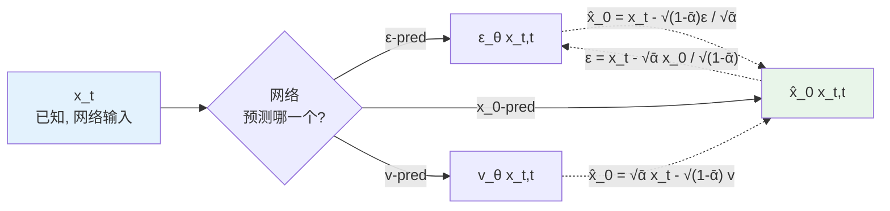
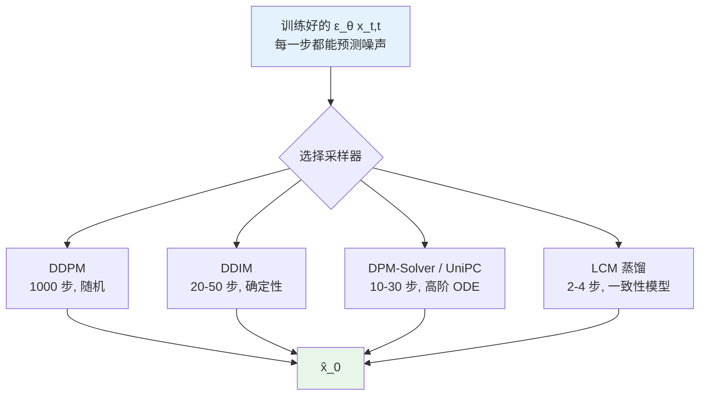
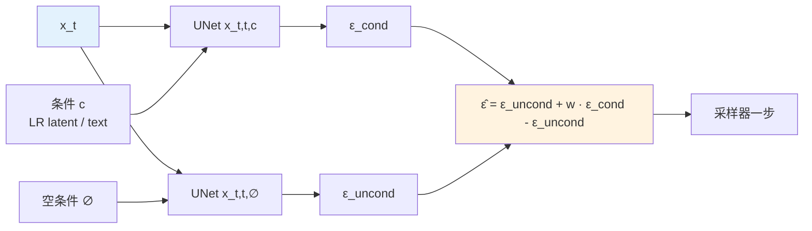

# 第 8 章 · 扩散模型基础

> 这是这本书最核心的范式转变。
>
> 第 6-7 章的所有模型都是**判别式**：给定 $y$ 输出唯一 $\hat{x}$。
> 这一章开始的扩散模型是**生成式**：给定 $y$ 输出 $p(x | y)$，可以采样出多个合理的 $\hat{x}$。
>
> 这个差别在 ill-posed 严重的场景下是质变的。

## 8.0 阅读须知

这一章是 Part II 的转折点。读到这里之前，所有模型都是"输入一张图、输出一张图"的判别式管线，先验隐式藏在权重里。从这一章开始，模型本身就是一个完整的概率生成器，可以独立于具体的输入条件去描述"自然图像分布长什么样"，再在采样时把退化图 $y$ 当作约束加进来。换言之，前面章节的模型在学 $f_\theta(y) \approx x$，这一章及之后的模型在学 $p_\theta(x)$ 或 $p_\theta(x \mid y)$。

为了让后续公式不至于一字一句都要翻字典，下面把这一章会反复出现的缩写先列一遍。已经被第 1 章介绍过的（DDPM 等）这里简短复述：

- **DDPM**（Denoising Diffusion Probabilistic Model，去噪扩散概率模型）：第 1 章已经提过，是 Ho et al. 2020 提出的扩散模型基础范式，前向加噪固定、反向去噪学习
- **DDIM**（Denoising Diffusion Implicit Model，去噪扩散隐式模型）：Song et al. 2021 提出的确定性反向采样器，可以跳步，把 1000 步压到几十步
- **DPM-Solver**（Diffusion Probabilistic Model Solver，扩散模型 ODE 求解器）：Lu et al. 2022 提出的高阶数值求解器系列，用 ODE 视角加速采样
- **UniPC**（Unified Predictor-Corrector，统一预测-校正采样器）：进一步整合预测器与校正器的高阶求解方法
- **LCM**（Latent Consistency Model，潜空间一致性模型）：基于一致性蒸馏，把多步采样压到 2-4 步
- **SDE / ODE**（Stochastic / Ordinary Differential Equation，随机/常微分方程）：扩散反向过程可以等价写成 SDE 或 ODE，前者带噪声项、后者确定性
- **VLB / ELBO**（Variational Lower Bound / Evidence Lower Bound，变分下界 / 证据下界）：训练扩散模型时优化的对数似然下界，DDPM 损失最终被简化成 ELBO 的一个加权 MSE
- **CFG**（Classifier-Free Guidance，无分类器引导）：训练时随机丢弃条件、推理时用条件与无条件预测的差做加权外推，控制生成贴合条件的程度
- **LDM**（Latent Diffusion Model，潜空间扩散模型）：Rombach et al. 2022 把扩散从像素空间挪到 VAE 潜空间，Stable Diffusion 是其代表实现
- **SD / SDXL**（Stable Diffusion / Stable Diffusion XL）：LDM 的两代具体实现，UNet 参数量分别约 860M / 2.6B
- **VAE**（Variational Autoencoder，变分自编码器）：LDM 里负责像素与潜空间互转的前后处理网络
- **CLIP**（Contrastive Language-Image Pretraining，图文对比预训练模型）：常作为扩散模型的文本/图像编码器
- **SDS**（Score Distillation Sampling，得分蒸馏采样，Poole et al. 2022 的 DreamFusion 提出）：把扩散模型当成"先验梯度提供者"，用 score 在外部参数（比如 NeRF / 另一张图）上做梯度下降。增强领域里它偶尔被用作"用扩散模型给一张确定图像打分并优化"的工具
- **LoRA**（Low-Rank Adaptation，低秩适配）：把权重更新分解成两个低秩矩阵 $W + AB^\top$ 的微调技术，扩散 fine-tune 的标配
- **SUPIR / StableSR / DiffBIR**：本章末尾会反复出现的三个基于扩散的真实场景超分模型，详细结构留到第 9 章展开

预设的背景仍然是第 1 章 1.0 节列的那一套：熟悉张量与基本损失函数，看得懂 PyTorch，听说过扩散模型但不一定亲手训过。本章会把 DDPM 的前向、反向、训练目标、采样器、潜空间化、UNet 内部结构、条件注入范式全部走一遍，目的是为第 9 章的条件控制和第 10 章之后的任务特化模型铺好底。

## 8.1 为什么扩散在影像增强里重要

回到第 4 章 4.8 节的 perception-distortion trade-off：

> ill-posed 问题上 distortion（PSNR）和 perception（FID/LPIPS）不可同时最优。

判别式模型在 distortion 端走到了极致：HAT 在 Set5 4× 上 33.4 dB。但它们在 perception 端有天花板：

- 给定一张糊得厉害的人脸 LR，"最可能"的 $\hat{x}$ 是平均脸（多个合理 $x$ 的均值）
- 判别式模型必须输出**一个**确定的 $\hat{x}$，所以输出平均脸
- 平均脸**视觉上糊**：它在 PSNR 上最优，在感知上不真实

扩散模型直接攻击这个问题：

> 我不输出**一个** $\hat{x}$，我学习 $p(x | y)$ 的整个分布，然后从这个分布**采样**一个具体的 $\hat{x}$。

每个采样出的 $\hat{x}$ 都是分布上的一个具体点，是一张**具体的脸**而不是平均脸，视觉上真实但和真值未必像素级一致。

这就是为什么 SUPIR 在严重退化的老照片上效果惊艳，但 PSNR 比 HAT 低 5+ dB，它走的是 perception-distortion 曲线的另一端。

这一章讲清扩散模型怎么工作、为什么它适合增强任务、以及具体怎么用。

## 8.2 扩散模型的直觉

扩散模型的核心思想可以一句话概括：

> **学一个去噪过程**：从纯噪声开始，一步步去除噪声，最后得到一张图。

为了让这件事更直观，下面把前向加噪与反向去噪两条链画出来。前向是一个固定的随机过程（没有可学的参数，只是按一个事先定好的 noise schedule 不断给图像加高斯噪声），反向才是神经网络要学的部分。

```mermaid
graph LR
    X0[x_0<br/>干净图] -->|+ε_1| X1[x_1]
    X1 -->|+ε_2| X2[x_2]
    X2 -->|...| XT_1[x_{T-1}]
    XT_1 -->|+ε_T| XT[x_T<br/>≈ 纯高斯噪声]
    XT -. 反向 .-> RT_1[x_{T-1}]
    RT_1 -. 反向 .-> R2[x_2]
    R2 -. 反向 .-> R1[x_1]
    R1 -. 反向 .-> R0[x̂_0<br/>采样得到的图]

    style X0 fill:#e8f5e9
    style XT fill:#ffebee
    style R0 fill:#fff3e0
```

实线箭头表示固定的前向加噪过程，每一步都按调度 $\beta_t$ 给图像加一点点高斯噪声；虚线箭头表示由神经网络驱动的反向去噪过程，每一步根据当前的 $x_t$ 估计应该去掉多少噪声，然后回到 $x_{t-1}$。当 $T$ 足够大（比如 1000）时，$x_T$ 的分布近似一个各分量独立的标准高斯。反向走完整条链就得到一张新图 $\hat{x}_0$。

训练目标其实非常简单：**给定任意时间步的加噪图 $x_t$，预测加进去的噪声**。

第一眼看这个目标会觉得奇怪：预测噪声怎么会等于学会生成图像？关键在两点：

1. **任意 $t$ 的加噪图可以一步采样**：不需要从 $x_0$ 一步步加 $T$ 次，前向过程有一条解析公式让你直接跳到任意 $t$，这一点让训练在计算上可行
2. **学会了预测噪声 = 学会了 $p(x_0)$ 的 score function**：score 是 $\nabla_x \log p(x)$，是分布对自变量的梯度场，知道每个点的 score 等价于知道分布的几何结构，从而可以用 Langevin 动力学或反向 SDE 从噪声采样出符合 $p(x)$ 的样本

下面把这两点对应的数学讲清。

## 8.3 前向过程的数学

定义一个 **noise schedule**（噪声调度）$\beta_1, \beta_2, \dots, \beta_T$。常见配置是 $T = 1000$，$\beta_t$ 从 $10^{-4}$ 线性增到 $0.02$；更后期的实践会改成 cosine schedule（Nichol & Dhariwal 2021），让早期信号衰减更平缓，对生成质量有可测量的提升。这里先用线性版讲清楚机制，cosine 是同一框架下的另一组参数选择。

每一步加噪定义为：

$$
q(x_t | x_{t-1}) = \mathcal{N}(x_t; \sqrt{1 - \beta_t} \cdot x_{t-1}, \beta_t \mathbf{I})
$$

含义：$x_t$ 是 $x_{t-1}$ 缩小一点（乘 $\sqrt{1-\beta_t}$）再加一点高斯噪声（方差 $\beta_t$）。乘 $\sqrt{1-\beta_t}$ 是为了让方差守恒：如果只加噪不缩小，$x_t$ 的二阶矩会一直涨，最终远超 $x_0$ 的尺度；先把信号缩小再加上等量的方差，整体二阶矩保持在 $O(1)$，数值上更稳定。

为了简化记号，定义 $\alpha_t = 1 - \beta_t$，再定义累积量 $\bar{\alpha}_t = \prod_{s=1}^t \alpha_s$。这个 $\bar{\alpha}_t$ 是后面所有公式里反复出现的核心量，几何意义是从 $x_0$ 到 $x_t$ 累积下来的"信号保留比例"。当 $t$ 接近 0 时 $\bar{\alpha}_t \approx 1$（几乎没加噪），当 $t$ 接近 $T$ 时 $\bar{\alpha}_t \approx 0$（信号几乎全淹没）。

**关键性质**：用归纳法把 $q(x_t \mid x_{t-1})$ 链式展开，可以证明从 $x_0$ 到任意 $x_t$ 的边缘分布仍然是一个高斯：

$$
q(x_t | x_0) = \mathcal{N}(x_t; \sqrt{\bar{\alpha}_t} \cdot x_0, (1 - \bar{\alpha}_t) \mathbf{I})
$$

直观推导：第一步 $x_1 = \sqrt{\alpha_1} x_0 + \sqrt{1-\alpha_1} \epsilon_1$；第二步 $x_2 = \sqrt{\alpha_2} x_1 + \sqrt{1-\alpha_2}\epsilon_2 = \sqrt{\alpha_2 \alpha_1} x_0 + (\sqrt{\alpha_2(1-\alpha_1)} \epsilon_1 + \sqrt{1-\alpha_2}\epsilon_2)$。把后一项里两个独立高斯叠加，新方差是两项方差之和 $\alpha_2(1-\alpha_1) + (1-\alpha_2) = 1 - \alpha_2 \alpha_1$。一直递推下去就得到 $x_t = \sqrt{\bar{\alpha}_t} x_0 + \sqrt{1-\bar{\alpha}_t} \epsilon$。

这意味着**给定 $x_0$，可以一步采样到任意 $x_t$**：

$$
x_t = \sqrt{\bar{\alpha}_t} \cdot x_0 + \sqrt{1 - \bar{\alpha}_t} \cdot \epsilon, \quad \epsilon \sim \mathcal{N}(0, \mathbf{I})
$$

这是训练能高效进行的关键：不需要真的一步步加 1000 次噪声。训练循环里只要随机采一个 $t$，按上式直接构造 $x_t$ 和对应的 $\epsilon$，就能拿来做监督。如果没有这条解析路径，每一步训练都要先模拟 $t$ 次加噪，扩散模型的训练成本会高到完全不可行。

```python
import torch


class NoiseScheduler:
    """DDPM 风格的线性 noise schedule。"""

    def __init__(self, num_steps: int = 1000,
                 beta_start: float = 1e-4, beta_end: float = 0.02,
                 device: str = 'cuda'):
        self.num_steps = num_steps
        self.betas = torch.linspace(beta_start, beta_end, num_steps, device=device)
        self.alphas = 1.0 - self.betas
        self.alphas_cumprod = torch.cumprod(self.alphas, dim=0)
        # 训练时用到的常用量
        self.sqrt_alphas_cumprod        = torch.sqrt(self.alphas_cumprod)
        self.sqrt_one_minus_alphas_cumprod = torch.sqrt(1.0 - self.alphas_cumprod)

    def add_noise(self, x0: torch.Tensor, t: torch.Tensor,
                  noise: torch.Tensor = None) -> tuple:
        """一步采样 x_t。
        x0: (B, C, H, W) 干净图
        t:  (B,) 时间步整数
        noise: 可选, 不传则随机采样
        返回: (x_t, noise)
        """
        if noise is None:
            noise = torch.randn_like(x0)
        sqrt_alpha = self.sqrt_alphas_cumprod[t].view(-1, 1, 1, 1)
        sqrt_one_minus = self.sqrt_one_minus_alphas_cumprod[t].view(-1, 1, 1, 1)
        x_t = sqrt_alpha * x0 + sqrt_one_minus * noise
        return x_t, noise
```

### Noise schedule 的工程选择

线性 schedule $\beta_t \in [10^{-4}, 0.02]$ 是 DDPM 论文的初始选择，但在高分辨率训练上不够好。它在 $t \to T$ 那一段衰减得太快，让早期信号几乎瞬间被噪声淹没，模型在那一区段拿不到多少梯度信号。Nichol & Dhariwal 2021 提出 **cosine schedule**：

$$
\bar{\alpha}_t = \frac{f(t)}{f(0)}, \quad f(t) = \cos\left(\frac{t/T + s}{1 + s} \cdot \frac{\pi}{2}\right)^2
$$

其中 $s \approx 0.008$ 是一个小偏移，避免 $t = 0$ 时分母奇异。cosine 的 $\bar{\alpha}_t$ 在两端慢、中间快，让训练在"中间噪声水平"那一段花更多采样，匹配了人眼对 mid-frequency 细节的敏感度。Imagen 默认用 cosine；但并非所有大模型都用它，例如 SDXL 用的是 scaled_linear（$\beta$ 从 0.00085 到 0.012，即在 $\sqrt{\beta}$ 上线性插值再平方），仍属线性 $\beta$ 一系而不是 cosine。

更进一步，**SNR-based schedule** 直接按信噪比 $\text{SNR}(t) = \bar{\alpha}_t / (1 - \bar{\alpha}_t)$ 定义 schedule。让 $\log \text{SNR}(t)$ 在 $t$ 上线性下降的这种连续时间参数化，出自 Kingma 等人的 VDM（Variational Diffusion Models，2021），它把"什么时间步"和"什么噪声水平"解耦：同一个噪声水平在不同 schedule 下对应的 $t$ 不一样，但在 SNR 视角下完全等价。

另一条相关但不同的路线是 EDM（Karras et al. 2022），注意不要把它和 log-SNR 线性调度混为一谈。EDM 不在 $\bar{\alpha}_t$ 框架里谈 schedule，而是直接在噪声标准差 $\sigma$ 空间做参数化：给网络加一组预条件（preconditioning）系数、训练时按 lognormal 分布采样 $\sigma$、采样时用二阶 Heun 求解器。它在 FID 上比 DDPM 原版 schedule 提升一个台阶，但核心贡献是 $\sigma$ 空间的这套设计本身，而不是 log-SNR 线性调度。

工程实践：

- 学术复现 DDPM 用线性
- 训新模型默认 cosine
- 追求 SOTA 生成质量用 EDM 的 $\sigma$ 空间参数化
- 增强任务里 schedule 影响相对小，主要是中等 $t$ 区域的 loss 权重决定结果质量

## 8.4 反向过程：训练目标

理论上反向过程是 $p(x_{t-1} | x_t)$，要学的是这个条件分布。完整的训练目标其实是数据对数似然 $\log p_\theta(x_0)$ 的变分下界（VLB / ELBO）。把每一步反向都建模成高斯 $p_\theta(x_{t-1} \mid x_t) = \mathcal{N}(\mu_\theta(x_t, t), \Sigma_\theta(x_t, t))$，再把 $\log p(x_0)$ 拆成 $T$ 项 KL 散度之和，每一项衡量"模型反向高斯"与"真实后验高斯 $q(x_{t-1} \mid x_t, x_0)$"的距离。这是 DDPM 论文里出现的那一长串项。

DDPM 论文最有价值的工程贡献，是证明了在适当的方差选择下，这一长串目标可以被**简化**成一个权重为 1 的 MSE：

**直接训一个网络 $\epsilon_\theta(x_t, t)$ 预测加进去的噪声 $\epsilon$**。

训练损失：

$$
\mathcal{L}_{\text{simple}} = \mathbb{E}_{t, x_0, \epsilon} \left[ \| \epsilon - \epsilon_\theta(x_t, t) \|^2 \right]
$$

这就是第 3 章 3.6 节讲的 simple loss。虽然丢掉了 ELBO 里的精确权重，实测在样本质量上反而更好（高 $t$ 的项权重被"非正式地"加重了，让模型更专注于难的中间到高噪段）。

注意训练过程里有三件事是被随机抽样的：每次 batch 取一些 $x_0$，对每个样本独立采一个时间步 $t \sim \text{Uniform}\{1, \dots, T\}$，再独立采一个 $\epsilon$。这个三重期望的蒙特卡洛估计就是损失。

### 三种等价预测目标

模型可以预测三种量之一，它们之间通过 $x_t = \sqrt{\bar{\alpha}_t} x_0 + \sqrt{1-\bar{\alpha}_t} \epsilon$ 这一条线性关系互相确定，**信息等价**，区别只是 loss surface 的形状不同：

- **$\epsilon$-prediction**：预测加进去的噪声（DDPM 标准）。在 $t$ 大（$\bar{\alpha}_t$ 小）时，$x_0$ 几乎被噪声淹没，预测 $\epsilon$ 信号噪比相对更好
- **$x_0$-prediction**：直接预测原图。在 $t$ 小（$\bar{\alpha}_t$ 接近 1）时，$x_t$ 几乎就是 $x_0$ 加一点点扰动，预测 $x_0$ 等价于做轻度去噪，损失尺度更稳
- **$v$-prediction**（Salimans & Ho 2022）：定义 $v_t = \sqrt{\bar{\alpha}_t} \epsilon - \sqrt{1-\bar{\alpha}_t} x_0$，相当于在 $(\epsilon, x_0)$ 平面上沿着一个旋转方向预测。它的好处是 loss 在所有 $t$ 上量级一致，对高分辨率训练特别有用

它们之间的转换：

```python
# 给定模型输出和当前 (x_t, t), 三种之间互转

def eps_to_x0(x_t, eps_pred, alpha_cumprod_t):
    """从预测的 epsilon 推 x_0。"""
    sqrt_alpha_t = alpha_cumprod_t.sqrt()
    sqrt_one_minus = (1 - alpha_cumprod_t).sqrt()
    return (x_t - sqrt_one_minus * eps_pred) / sqrt_alpha_t


def v_to_x0(x_t, v_pred, alpha_cumprod_t):
    """从预测的 v 推 x_0。"""
    sqrt_alpha_t = alpha_cumprod_t.sqrt()
    sqrt_one_minus = (1 - alpha_cumprod_t).sqrt()
    return sqrt_alpha_t * x_t - sqrt_one_minus * v_pred


def x0_to_eps(x_t, x0_pred, alpha_cumprod_t):
    """从预测的 x_0 推 epsilon。"""
    sqrt_alpha_t = alpha_cumprod_t.sqrt()
    sqrt_one_minus = (1 - alpha_cumprod_t).sqrt()
    return (x_t - sqrt_alpha_t * x0_pred) / sqrt_one_minus
```

训练采样目标的选择：

- **$\epsilon$-pred**：通用文生图标配（SD 1.x）
- **$v$-pred**：高分辨率训练更稳（代表是 SD 2.x-v，即 SD 2.0/2.1 的 768 分辨率 v 版本；注意 SDXL 的 base 与 refiner 用的都是 $\epsilon$-pred，不是 v-pred）
- **$x_0$-pred**：增强/恢复任务直观，关心的就是 $x_0$ 质量

把三种目标的关系画成一个小图，便于对照：



三种预测之间只是同一个仿射变换的不同投影，训练时改的是 loss 的角度，推理时再用对应公式还原成 $\hat{x}_0$ 用于下一步采样。

这里还应点出一条更新的主线：$\epsilon$ / $x_0$ / $v$ 三种目标都建立在 DDPM 的离散加噪框架上，而 2024 年之后的 SD3、FLUX 这一代已经改用 flow matching / rectified flow 的参数化，网络预测的是连接噪声与数据的直线路径上的速度场（velocity），训练目标从"预测噪声"变成"预测流速"。它与 $v$-prediction 精神相近但框架不同，本章不展开，第 18 章会作为新一代基座的默认参数化专门讨论。

## 8.5 一个最小的 DDPM 训练循环

```python
import torch
import torch.nn.functional as F
from torch.optim import AdamW

def train_ddpm(model, train_loader, scheduler, epochs=100,
               lr=1e-4, device='cuda'):
    """最小的 DDPM 训练循环。
    model: UNet, 输入 (x_t, t), 输出预测的噪声 (B, C, H, W)
    """
    optimizer = AdamW(model.parameters(), lr=lr)
    model.train()

    for epoch in range(epochs):
        for x0 in train_loader:                    # x0: (B, C, H, W)
            x0 = x0.to(device)
            B = x0.shape[0]

            # 1. 随机采时间步
            t = torch.randint(0, scheduler.num_steps, (B,), device=device)

            # 2. 一步采样 x_t
            x_t, noise = scheduler.add_noise(x0, t)

            # 3. 模型预测噪声
            pred_noise = model(x_t, t)

            # 4. MSE 损失
            loss = F.mse_loss(pred_noise, noise)

            # 5. 反传
            optimizer.zero_grad()
            loss.backward()
            torch.nn.utils.clip_grad_norm_(model.parameters(), 1.0)
            optimizer.step()
```

这个循环看起来过于简单。但它能 work 的根本原因：

> 学习"从带任意噪声的图预测加进去的噪声"= 学习 $\nabla \log p(x)$ 的近似（score function）。
>
> 一旦学到 score，就可以用 Langevin 动力学/反向 SDE 从噪声采样到 $p(x)$。

## 8.6 采样：DDPM, DDIM, DPM-Solver

训练完之后，UNet 已经学到了"任意 $x_t$ 应该往哪个方向去噪"。采样阶段做的事情是把这个一步去噪的能力组织成一条从 $x_T$ 走回 $x_0$ 的多步过程。不同采样器的差异就在于"如何用更少的步数走完这条路"。下面这张图把 DDPM、DDIM、DPM-Solver 三类在同一个反向链上的位置画出来：



注意所有这些采样器共用同一组训练好的权重，**不需要重训**（LCM 例外，需要做一致性蒸馏）。所以生产实践里完全可以训一次 DDPM，然后在推理时根据 SLA 选不同的采样器。

训练完后怎么从噪声生成图？

### DDPM 采样

按反向链一步步：

$$
x_{t-1} = \frac{1}{\sqrt{\alpha_t}} \left( x_t - \frac{\beta_t}{\sqrt{1 - \bar{\alpha}_t}} \epsilon_\theta(x_t, t) \right) + \sigma_t z
$$

其中 $z \sim \mathcal{N}(0, \mathbf{I})$ 是每一步独立采的高斯，$\sigma_t$ 是 DDPM 选定的噪声方差。这个公式的形式是从真实后验 $q(x_{t-1} \mid x_t, x_0)$ 推出来的，再把里面的 $x_0$ 用预测的 $\hat{x}_0 = (x_t - \sqrt{1-\bar{\alpha}_t}\epsilon_\theta) / \sqrt{\bar{\alpha}_t}$ 代入。整条链上的随机性来自这一连串 $z$ 的采样：同样一个起始噪声 $x_T$ 走两遍 DDPM 会得到不同的样本。

**问题**：要走 1000 步，每步一次 UNet 前向，**慢**。SD 1.5 在 A100 上单步前向约 30ms，跑满 1000 步是 30 秒，单张图。生产环境完全不可接受。

### DDIM 采样

Song et al. 2021 发现可以用确定性反向：

$$
x_{t-1} = \sqrt{\bar{\alpha}_{t-1}} \cdot \hat{x}_0 + \sqrt{1 - \bar{\alpha}_{t-1}} \cdot \epsilon_\theta(x_t, t)
$$

其中 $\hat{x}_0$ 是从 $x_t$ 和预测噪声反推的 $x_0$（用上节的 `eps_to_x0`）。注意公式里没有显式的随机项 $z$：同一个起始噪声经过 DDIM 总是给出同一张图，这是 DDIM 的"确定性"含义。这个采样**可以跳步**：DDIM 把"从 $t$ 到 $t-1$ 的一步"重写成了"从 $t$ 到任意更小的 $t'$ 的一步"，因此推理时可以只挑 50 个时间步（比如均匀地从 1000 里取 20 个间隔）走完整个反向链。

DDIM 50 步 ≈ DDPM 1000 步质量，**20× 加速**。确定性这件事在编辑任务上还有一个额外好处：可以做 DDIM inversion，从已有图像反推它对应的潜噪声 $x_T$，然后修改条件再正向采样回去。

### DPM-Solver 系列

把反向过程看作 ODE，用高阶数值方法求解。Song et al. 2021 证明扩散反向过程严格等价于一条概率流 ODE（Probability Flow ODE），形式为 $dx/dt = f(x, t) - \frac{1}{2} g(t)^2 \nabla_x \log p_t(x)$，里面的 score 由训练好的 $\epsilon_\theta$ 给出。一旦写成 ODE，过去几十年所有数值积分技巧都能拿来用。

- **DPM-Solver-2**（Lu et al. 2022）：二阶 Taylor 展开求解 ODE，约 20 步达到 DDIM 100 步质量
- **DPM-Solver++**：把 SDE 形式（带噪声项）也纳入同一框架，对条件生成更稳
- **UniPC**（Unified Predictor-Corrector）：进一步整合预测器与校正器，把多步残差信息也利用起来，是 2024 年的常见默认

```python
# 调用 diffusers 的采样器
from diffusers import DPMSolverMultistepScheduler

scheduler = DPMSolverMultistepScheduler.from_pretrained(
    "stabilityai/stable-diffusion-2-1",
    subfolder="scheduler",
    algorithm_type="dpmsolver++",
    solver_order=2,
)
scheduler.set_timesteps(num_inference_steps=20)
```

工程实践（2026 年的 SOTA 配置）：

- **学术 benchmark / 高质量推理**：UniPC，30-50 步
- **生产部署**：DPM-Solver++ 2M，20 步
- **极致速度**：LCM (Latent Consistency Models) 蒸馏后，4 步

少步蒸馏这条线在 LCM 之外还有两支值得知道：一支是对抗蒸馏，用一个判别器把少步学生的输出逼近真实分布，代表是 ADD（Adversarial Diffusion Distillation，即 SDXL-Turbo）；另一支是分布匹配蒸馏 DMD / DMD2，用分布层面的匹配目标把多步教师压到一到几步。它们都能把采样步数压到个位数甚至一步，细节留到第 18 章。

## 8.7 LDM：扩散搬到潜空间

第 2 章 2.4 节已经从"表征空间"的角度介绍过 LDM。这里从扩散的角度补一遍：为什么把扩散搬到潜空间是改变这个领域的工程节点。

LDM (Rombach et al. 2022) 的关键观察：

> 像素空间的扩散在大量计算"高频细节"上浪费：这些细节可以用一个 VAE 解码器后处理生成。
>
> 让 UNet 只在**潜空间**做扩散，把高频细节交给 VAE 解码器。

### Stable Diffusion 的具体配置

| 组件 | 作用 | 参数量 |
|------|------|--------|
| VAE encoder | RGB → latent (8× 下采样, 4 通道) | ~50M |
| VAE decoder | latent → RGB | ~50M |
| UNet | 潜空间扩散 | ~860M |
| Text encoder (CLIP) | 文本 → embedding | ~120M |
| 总计 | | ~1.1B |

UNet 是大头，VAE 相对小。这就是为什么 SD finetune 主要训 UNet（保持 VAE 不变）。

### LDM 的工程影响

- **计算量降到 1/48**：原本 $512 \times 512 \times 3$ 的扩散，现在在 $64 \times 64 \times 4$ 上
- **可以处理大图**：$1024 \times 1024$ 不再是显存灾难
- **VAE 是个独立可换的组件**：可以微调 VAE（比如增强场景下用更好的 decoder）

## 8.8 SD UNet 内部结构

UNet 是扩散模型的"主网络"。它的结构对增强任务很重要，后面 ControlNet 等扩展都建立在这个结构上。为了把"UNet 在去噪步里的位置"放回大图，先用一张数据流图把单步采样画出来：

```mermaid
graph LR
    XT[x_t<br/>潜空间噪声<br/>B,4,h,w] --> UNet
    T[时间步 t] --> TEmb[时间嵌入<br/>sinusoidal + MLP]
    Cond[条件 c<br/>文本/图像 token] --> CtxEmb[CLIP encoder]
    TEmb --> UNet
    CtxEmb --> UNet
    UNet[UNet ε_θ<br/>encoder + mid + decoder<br/>cross-attention 接 c] --> Eps[ε̂ 或 v̂<br/>B,4,h,w]
    Eps --> Step[采样器一步<br/>DDIM / DPM-Solver]
    XT --> Step
    Step --> XTm1[x_{t-1}<br/>下一步输入]

    style XT fill:#e3f2fd
    style UNet fill:#fff3e0
    style XTm1 fill:#e8f5e9
```

每一个采样步都重复这条数据流，区别只是 $t$ 减小、$x_t$ 噪声含量减少。条件 $c$（文本或图像 embedding）在所有时间步都是同一个，只在 cross-attention 里反复消费。

UNet 的整体宏观结构如下：

```
Input (B, 4, 64, 64) latent
  ↓ Conv (4 → 320 channels)
  ↓ DownBlock × 4 (encoder)
    每个 DownBlock:
      ResBlock × 2 + Spatial Transformer × 2 (cross-attention to text)
      Downsample (×2)
  ↓ MidBlock
    ResBlock + Spatial Transformer + ResBlock
  ↓ UpBlock × 4 (decoder, 带 skip connection)
    每个 UpBlock:
      ResBlock × 3 + Spatial Transformer × 3
      Upsample (×2)
  ↓ Conv (320 → 4 channels)
Output (B, 4, 64, 64) 预测的噪声/v
```

### ResBlock：核心计算单元

```python
import torch
import torch.nn as nn

class ResBlock(nn.Module):
    """SD UNet 的 ResBlock, 带时间嵌入注入。"""

    def __init__(self, in_ch: int, out_ch: int, time_emb_dim: int = 1280):
        super().__init__()
        self.norm1 = nn.GroupNorm(32, in_ch)
        self.conv1 = nn.Conv2d(in_ch, out_ch, 3, padding=1)

        self.time_proj = nn.Linear(time_emb_dim, out_ch)

        self.norm2 = nn.GroupNorm(32, out_ch)
        self.conv2 = nn.Conv2d(out_ch, out_ch, 3, padding=1)

        self.skip = nn.Conv2d(in_ch, out_ch, 1) if in_ch != out_ch else nn.Identity()

    def forward(self, x: torch.Tensor, t_emb: torch.Tensor) -> torch.Tensor:
        # x:     (B, C, H, W)
        # t_emb: (B, time_emb_dim)
        h = self.conv1(F.silu(self.norm1(x)))
        # 注入时间嵌入 (broadcast)
        h = h + self.time_proj(F.silu(t_emb)).view(*t_emb.shape[:1], -1, 1, 1)
        h = self.conv2(F.silu(self.norm2(h)))
        return h + self.skip(x)
```

时间嵌入注入是扩散模型独有的：同一个网络要处理 1000 个不同时间步，需要知道当前是哪一步。

### Spatial Transformer：cross-attention 入口

```python
class SpatialTransformer(nn.Module):
    """SD UNet 的 attention block。
    self-attention + cross-attention to text。
    """

    def __init__(self, dim: int, num_heads: int, context_dim: int = 768):
        super().__init__()
        self.norm = nn.GroupNorm(32, dim)
        self.proj_in = nn.Conv2d(dim, dim, 1)

        # Self-attention
        self.attn1 = MultiheadAttention(dim, num_heads)
        # Cross-attention (text → latent)
        self.attn2 = MultiheadAttention(dim, num_heads, kv_dim=context_dim)
        # FFN
        self.ff = nn.Sequential(
            nn.Linear(dim, dim * 4),
            nn.GELU(),
            nn.Linear(dim * 4, dim),
        )

        self.proj_out = nn.Conv2d(dim, dim, 1)

    def forward(self, x: torch.Tensor, context: torch.Tensor) -> torch.Tensor:
        # x: (B, C, H, W); context: (B, T_text, D_text)
        B, C, H, W = x.shape
        h = self.proj_in(self.norm(x))
        h = h.view(B, C, -1).transpose(1, 2)         # (B, HW, C)

        h = h + self.attn1(h, h, h)
        h = h + self.attn2(h, context, context)      # cross-attention
        h = h + self.ff(h)

        h = h.transpose(1, 2).view(B, C, H, W)
        return x + self.proj_out(h)
```

cross-attention 是文生图的关键：文本通过 cross-attention 影响每个空间位置的特征。这个机制在第 9 章会被复用到增强任务的条件控制。

## 8.9 增强任务里的扩散用法

Text-to-image 是从纯噪声 + 文本条件采样到图。**增强任务**是从纯噪声 + 退化图 $y$ 条件采样到 $\hat{x}$。差别只是条件 $c$ 从一段文本变成了一张图（或图加一段描述），UNet 与采样链条本身不变。

几种条件注入范式（详细工程实现留到第 9 章展开，这里先列名字让读者知道全景）：

### 范式一：concat 到输入（最简单）

```python
# UNet 输入从 (B, 4, h, w) 变成 (B, 8, h, w)
# 后 4 通道是 LR 的 latent
def prepare_input(noisy_latent, lr_latent):
    return torch.cat([noisy_latent, lr_latent], dim=1)
```

代表：SR3（Saharia et al. 2021，把 LR 上采样后与噪声图在通道维 concat）以及 LDM 论文里的 LDSR。

### 范式二：cross-attention（语义条件）

把某种图像 embedding 通过 cross-attention 注入 UNet。代表是 IP-Adapter 风格的做法：用图像编码器把参考图（或 LR）编码成一组 token，接到 UNet 的 cross-attention 上，与文本 token 并列消费。

### 范式三：ControlNet（结构条件）

复制一份 UNet encoder，专门处理条件输入，输出加到主 UNet 的对应层。代表：DiffBIR（两阶段：Stage-1 用 SwinIR 类恢复网络去退化，Stage-2 用 IRControlNet 这种 ControlNet 式并联模块把恢复图作为条件注入冻结 SD，不用 CLIP image encoder）、SUPIR（SDXL 上挂 ZeroSFT + ControlNet 式适配器）。

### 范式四：trainable side-encoder + 特征注入（StableSR 一类）

StableSR 既不是 input-concat 也不是 ControlNet：它在冻结的 SD 上外挂一个 time-aware encoder，把 LR 特征经 SFT（spatial feature transform）注入 UNet，解码端再用 CFW（Controllable Feature Wrapping）在保真与质量之间做可控取舍。它自成一类，也不存在所谓 v1/v2 之分。

第 9 章会详谈。

### 一个常见的误解

很多第一次接触扩散增强的工程师以为 LR 的"注入位置"决定了模型上限，于是花大量时间调架构。实测上，**真正决定生成质量的是 (1) 训练数据是否反映真实退化，(2) 条件控制强度的可调性**。架构选择（concat vs ControlNet）影响的是 fidelity-creativity 的曲线偏向哪一端，但只要训练数据合理、有可调的 conditioning scale，几种范式都能做到产品级。这也是为什么本书把第 5 章（数据合成）放在第 9 章（条件控制）之前：数据上限决定下限。

## 8.10 扩散为什么能"无中生有"

回到这一章开头的核心问题：**扩散为什么能生成出真实的高频细节，而判别式不能？**

### 1. 多步采样 = 多次 random refinement

判别式：一次前向，输出确定的 $\hat{x}$。
扩散：$T$ 次前向，每一次都从一个随机分布采样。每一次采样都是"这一步该往哪个方向走"的随机选择。

这个随机性意味着同样的 LR 输入可以生成不同的 $\hat{x}$，每个都是合理的。

### 2. 学到了 score function

理论上扩散模型学到的是：

$$
\epsilon_\theta(x_t, t) \approx -\sqrt{1-\bar{\alpha}_t} \cdot \nabla_{x_t} \log p(x_t)
$$

这个梯度场告诉模型在 $x_t$ 这一点应该往哪个方向走才能更接近自然图像分布。score function 直接编码了**自然图像流形的几何结构**。

### 3. 反向链是 SDE 求解器

可以严格证明 DDPM 的反向链等价于求解一个 SDE（随机微分方程）：

$$
dx = [f(x, t) - g(t)^2 \nabla_x \log p_t(x)] dt + g(t) dw
$$

其中 $w$ 是 Wiener 过程（布朗运动）。这个 SDE 的稳态分布就是自然图像分布。

### 这三个性质合起来

扩散模型不是在"逼近真值"，而是在"沿着自然图像分布的几何结构走 T 步"。每一步都被分布的几何引导，每一步都有随机扰动让生成结果不重复。

最终输出是分布上的一个点：具体的、合理的、随机的。

## 8.10b 一个扩展用法：SDS（Score Distillation Sampling）

DreamFusion (Poole et al. 2022) 提出的 SDS 是把扩散模型"换一种用法"的代表。原本扩散是"从噪声出发反向采样到图"，SDS 把它当成一个**梯度源**：给定任意可参数化的目标 $\theta$（可以是另一张图、一个 NeRF、一个 3D mesh 的纹理），用扩散模型在它的渲染图 $x(\theta)$ 上提供"应该往哪个方向更新 $\theta$ 才能更像自然图像"的梯度：

$$
\nabla_\theta \mathcal{L}_{\text{SDS}}(\theta) = \mathbb{E}_{t, \epsilon}\left[w(t) (\epsilon_\theta(x_t, t, c) - \epsilon) \cdot \frac{\partial x}{\partial \theta}\right]
$$

其中 $x_t = \sqrt{\bar{\alpha}_t} x(\theta) + \sqrt{1-\bar{\alpha}_t}\epsilon$。把扩散模型预测的噪声残差 $\epsilon_\theta - \epsilon$ 通过链式法则推到 $\theta$ 上。这相当于"扩散模型告诉 $x(\theta)$ 应该怎么改才更接近自然图像分布"，反向传播让 $\theta$ 沿着 score 方向走。

增强领域里 SDS 偶尔被用作：

- 给一个已有判别式 SR 模型的输出做"扩散先验润色"，把输出 $\hat{x}$ 当作 $\theta$ 跑几步 SDS，让它更靠近扩散学到的自然图像流形
- 对没有配对训练数据的稀有任务（古画修复、卫星 SR 的小样本），用通用扩散模型 + SDS 在测试图上做 per-image 优化

实测 SDS 直接用在 SR 上效果不稳定，容易出现 oversaturated、纹理过强等问题，社区后续提出 VSD (Variational Score Distillation)、CSD (Classifier Score Distillation) 等改进。这条线在增强任务里不是主流，但作为"扩散模型还能怎么用"的一个示例值得了解。

## 8.11 扩散派 vs 判别式 trade-off

把 Part II 前两章和这一章对比起来：

| 方面 | 判别式 (CNN/Transformer) | 扩散 |
|------|------------------------|------|
| 推理速度 | **1×（baseline）** | 20-1000× 慢 |
| PSNR | **高** | 低 5-10 dB |
| LPIPS / FID | 低 | **更好** |
| 视觉真实感 | 中 | **高** |
| 对严重退化的处理 | 输出"安全模糊" | **能恢复细节** |
| 多样性 | 唯一输出 | **可采样多个** |
| 控制 | 只能改训练数据 | **可加 prompt / control** |
| 显存占用 | 低 | 高 (2-4×) |

**没有谁全胜**：这两类模型在不同应用场景各有优势：

- **法医证据增强**：判别式（不允许编造）
- **学术 benchmark PSNR 比赛**：判别式
- **照片放大、老照片修复**：扩散
- **极轻量端侧部署**：判别式
- **创意性强的应用**（艺术风格、4K 直播创意增强）：扩散

## 8.12 训练扩散模型的工程细节

### Min-SNR 加权（第 3 章 3.6 节提过）

```python
def min_snr_weight(t, alphas_cumprod, gamma=5.0):
    """Min-SNR 加权, 让不同时间步的 loss 量级一致。"""
    snr = alphas_cumprod[t] / (1 - alphas_cumprod[t])
    return torch.minimum(snr, torch.full_like(snr, gamma)) / snr
```

### EMA（指数移动平均）

扩散模型的最终权重通常是 EMA 而不是 raw weights。EMA 衰减常用 0.9999：

```python
class EMA:
    def __init__(self, model, decay=0.9999):
        self.decay = decay
        self.shadow = {n: p.clone().detach() for n, p in model.named_parameters()}

    def update(self, model):
        for n, p in model.named_parameters():
            self.shadow[n] = self.decay * self.shadow[n] + (1 - self.decay) * p.detach()

    def apply_to(self, model):
        """把 EMA 权重 copy 到 model（用于 inference）。"""
        for n, p in model.named_parameters():
            p.data.copy_(self.shadow[n])
```

### 时间步 importance 采样

不要 uniformly 采样 $t$。某些 $t$ 范围对最终质量贡献更大（通常是中间区域 $t \in [200, 800]$），可以提高这些区域的采样概率。

### Classifier-Free Guidance (CFG)

CFG（Classifier-Free Guidance，无分类器引导）是把"分类器引导扩散"那一类方法（早期 ADM 用 ImageNet 分类器做梯度引导）替换成不依赖外部分类器的版本。Ho & Salimans 2022 的核心做法：训练时以一定概率（典型 10%）把条件 $c$ 替换成空条件 $\emptyset$，这样同一个网络同时学会了有条件和无条件预测。推理时把两次预测线性外推：

$$
\hat{\epsilon} = \epsilon_\theta(x_t, t, \emptyset) + w \cdot (\epsilon_\theta(x_t, t, c) - \epsilon_\theta(x_t, t, \emptyset))
$$

$w > 1$ 让生成更靠近条件，但太大会让结果 oversaturated，颜色饱和、纹理过度。增强任务里 $w$ 通常 1.5-3.0；纯文生图常用 5-9。

每步推理多一次 UNet 前向（无条件那次），整体成本接近翻倍。下面这张图把 CFG 的两路前向画出来：



```python
def classifier_free_guidance(model, x_t, t, condition, guidance_scale=2.0):
    """CFG 推理。"""
    # 有条件预测
    eps_cond = model(x_t, t, condition)
    # 无条件预测 (用 null/empty condition)
    eps_uncond = model(x_t, t, None)
    # 加权
    return eps_uncond + guidance_scale * (eps_cond - eps_uncond)
```

工程实践里把这两次前向 batch 起来一起跑，拼成 $(2B, C, H, W)$ 走一次，省一次 kernel launch 开销。Diffusers 的默认实现就是这样。

## 8.13 一个增强任务的扩散训练流程

把上面的概念串成一个增强任务的训练循环。下面用的是**最简单的 latent concat 方案**：把 LR 上采样到 HR 尺寸后过 VAE，得到的 lr_latent 与 hr_latent 同 spatial 大小，直接 concat 进 UNet 输入通道。这个路线接近 LDM 论文里 LDSR 的做法，理解扩散增强训练的最小骨架够用。

需要说明：**SUPIR / StableSR 不是这么做的**。它们都不走 input concat，而是把 LR 信号通过独立的编码或控制模块注入冻结的主 UNet（StableSR 用 time-aware encoder + SFT 注入，SUPIR 用 ZeroSFT + ControlNet 式适配器），主 UNet 权重大部分不动。input concat 这条路最大的弱点是 fidelity 偏弱、对 LR 输入分布敏感；生产上做扩散 SR 推荐看第 9 章的 ControlNet 路线。

```python
def train_diffusion_enhancement(
    unet, vae, scheduler,
    train_loader,                  # 输出 (lr, hr) 配对
    text_encoder=None,             # 可选, 加 prompt 条件
    epochs=50, lr=1e-4,
    device='cuda',
):
    optimizer = AdamW(unet.parameters(), lr=lr)
    ema = EMA(unet)

    # 冻结 VAE 和 text encoder
    vae.eval(); 
    for p in vae.parameters():
        p.requires_grad_(False)

    for epoch in range(epochs):
        for lr_img, hr_img in train_loader:
            lr_img = lr_img.to(device)
            hr_img = hr_img.to(device)

            # 0. 关键: 把 LR 上采样到 HR 同样大小, 让 latent 空间对齐
            # 否则 vae.encode(lr_img) 的潜空间比 hr_latent 小, 不能直接 concat
            lr_img_upsampled = F.interpolate(lr_img, size=hr_img.shape[-2:],
                                             mode='bicubic', align_corners=False)

            # 1. 编码到潜空间 (此时 hr_latent 和 lr_latent 同 spatial 大小)
            with torch.no_grad():
                hr_latent = vae.encode(hr_img).latent_dist.sample() * 0.18215
                lr_latent = vae.encode(lr_img_upsampled).latent_dist.mean * 0.18215

            # 2. 加噪到 hr_latent
            B = hr_latent.shape[0]
            t = torch.randint(0, scheduler.num_steps, (B,), device=device)
            x_t, noise = scheduler.add_noise(hr_latent, t)

            # 3. UNet 输入 = (x_t || lr_latent), 条件 = lr_latent (或 text)
            unet_input = torch.cat([x_t, lr_latent], dim=1)
            pred_noise = unet(unet_input, t)

            # 4. 加权 MSE 损失
            weights = min_snr_weight(t, scheduler.alphas_cumprod)
            loss = (weights.view(-1, 1, 1, 1) * (pred_noise - noise) ** 2).mean()

            # 5. 反传
            optimizer.zero_grad()
            loss.backward()
            torch.nn.utils.clip_grad_norm_(unet.parameters(), 1.0)
            optimizer.step()

            # 6. EMA 更新
            ema.update(unet)

    # 训练完后用 EMA 权重做推理
    ema.apply_to(unet)
    return unet
```

## 8.14 推理：从 LR 到 HR 的完整流程

```python
@torch.no_grad()
def diffusion_enhance(unet, vae, scheduler, lr_img,
                       target_size=None,
                       num_inference_steps=20, guidance_scale=2.0):
    """
    给定 LR 图, 生成 HR 估计。
    target_size: (H, W) HR 输出尺寸; 默认 LR 的 4×。
    """
    device = lr_img.device
    if target_size is None:
        target_size = (lr_img.shape[-2] * 4, lr_img.shape[-1] * 4)

    # 1. 关键: 把 LR 上采样到目标尺寸再过 VAE, 让 latent 空间等于 HR 的 latent 大小
    lr_upsampled = F.interpolate(lr_img, size=target_size,
                                 mode='bicubic', align_corners=False)
    lr_latent = vae.encode(lr_upsampled).latent_dist.mean * 0.18215

    # 2. 从纯噪声开始 (与 LR latent 同 spatial 大小)
    x_t = torch.randn_like(lr_latent)

    # 3. 设置 inference 时间步 (DPM-Solver / DDIM)
    scheduler.set_timesteps(num_inference_steps)

    # 4. 反向去噪
    for t in scheduler.timesteps:
        unet_input = torch.cat([x_t, lr_latent], dim=1)
        pred_noise = unet(unet_input, t)
        # CFG (省略, 实际生产用)
        x_t = scheduler.step(pred_noise, t, x_t).prev_sample

    # 5. 解码到像素
    hr_img = vae.decode(x_t / 0.18215).sample
    return hr_img.clamp(0, 1)
```

注意一个关键点：**LR 必须先被上采样到目标 HR 尺寸再过 VAE**，这样得到的 latent 与 hr_latent 同样大小，可以直接 concat。如果直接 `vae.encode(lr_img)`，得到的潜空间是 LR 大小（HR/8 比 LR/8 大 4×），shape 不匹配。

输出分辨率由 `target_size` 决定，VAE 解码后的图就是这个尺寸。

## 8.14.1 训练 vs 推理：心智模型

把训练循环和推理循环并排放，会发现扩散模型与第 6-7 章的判别式模型有一个本质区别：

```mermaid
graph TD
    subgraph Train[训练: 单步监督]
        T1[采样 x_0] --> T2[采样 t]
        T2 --> T3[一步加噪 → x_t, ε]
        T3 --> T4[UNet x_t,t,c → ε̂]
        T4 --> T5[MSE ε̂, ε]
        T5 --> T6[反传, 更新权重]
    end

    subgraph Infer[推理: 多步采样]
        I0[采样 x_T ~ N 0,I] --> I1[t = T]
        I1 --> I2[UNet x_t,t,c → ε̂]
        I2 --> I3[采样器一步 → x_{t-1}]
        I3 --> I4{t > 1?}
        I4 -->|是, t = t-1| I2
        I4 -->|否| I5[VAE decode → x̂_0]
    end

    style T5 fill:#e3f2fd
    style I5 fill:#e8f5e9
```

训练是单步监督：一个 batch 一个 forward/backward，与训普通 CNN 几乎没差别。推理却是 $T'$ 步循环（$T' \in [4, 50]$，看采样器），每一步都要跑一次 UNet。这个不对称性导致很多问题只在推理阶段暴露：训练 loss 下降得很好不等于采样质量好，必须在每个 checkpoint 上跑实际采样评估（FID、LPIPS、人评）。这是扩散模型工程的一条铁律。

## 8.15 小结

1. **扩散是从判别式到生成式的范式转变**：输出不是唯一 $\hat{x}$，是 $p(x|y)$ 的采样
2. **前向加噪 + 反向去噪**：训练目标是预测加进去的噪声
3. **任意时间步可以一步采样**：不需要 1000 次加噪，有解析公式
4. **三种预测目标等价**（$\epsilon$ / $x_0$ / $v$），选哪个看任务
5. **DDPM 1000 步 → DDIM 50 步 → DPM-Solver 20 步 → LCM 4 步**：采样器演进
6. **LDM 是工程关键**：把扩散搬到 VAE 潜空间，计算降到 1/48
7. **Stable Diffusion = LDM + text condition + 大规模训练**
8. **增强任务的扩散用法**：把 LR 作为条件注入 UNet
9. **扩散的"无中生有"= 学到 score function + 多步随机采样**
10. **trade-off**：扩散视觉真实感强但 PSNR 低、慢、显存高

下一章讲条件控制，把 LR 注入扩散 UNet 有几种范式（concat、cross-attention、ControlNet、IP-Adapter），各自适合什么场景。

---

> 下一章 [扩散的条件控制](09-control.md) → 从 concat 到 ControlNet 到 IP-Adapter，扩散增强模型的真正工程战场。
