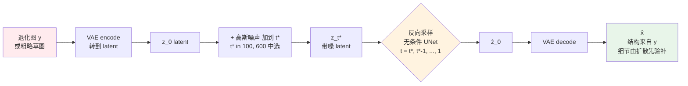
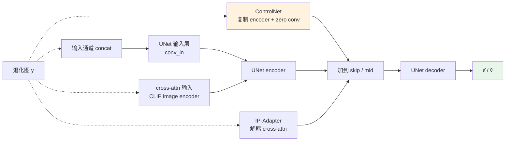

# 第 9 章 · 扩散的条件控制

> 第 8 章讲了扩散模型的基础：给定噪声、预测去噪。
>
> 但影像增强任务的关键不在去噪能力，在**怎么让扩散模型听话**：既利用它的生成能力（创造合理细节），又严格遵守 LR 输入（不偏离原图）。
>
> 这一章是过去三年这个领域最活跃的工程战场。

## 9.0 阅读须知

这一章紧接着第 8 章。第 8 章把扩散模型的"生成器"部分讲清楚了：给定一个潜空间噪声 $x_T$，UNet + 采样器能采出一张符合自然图像分布的 $\hat{x}_0$。但这只是"无条件生成"：结果可以是任何图。增强任务要做的是**条件生成**：给定退化图 $y$，从 $p(x \mid y)$ 里采样出与 $y$ 内容一致、质量更高的 $\hat{x}$。本章讲怎么把 $y$ 这个条件接进扩散过程，以及不同接法在 fidelity（保真）和 creativity（生成自由度）之间如何取舍。

读这一章前，假设你已经熟悉第 8 章的：

- 前向加噪与反向去噪、$\bar{\alpha}_t$、$\epsilon$-prediction
- DDIM / DPM-Solver 等采样器
- LDM 的潜空间结构、SD UNet 的 ResBlock + Spatial Transformer
- CFG 在推理时的两路前向

本章会反复出现的缩写：

- **SDEdit**（Stochastic Differential Editing，Meng et al. 2022）：把 $y$ 加噪到中间时间步，再用无条件扩散反向去噪，得到"被引导的随机样本"。最便宜的条件方案，零额外训练
- **SR3**（Super-Resolution via Repeated Refinement，Saharia et al. 2022）：早期用 input concat 把 LR 接入扩散 UNet 的代表
- **StableSR**（Wang et al. 2023）：基于 SD 的真实场景超分，在冻结 SD 上挂一个 time-aware encoder，特征经 SFT 注入 UNet，解码端用 CFW。既不是 input concat 也不是 ControlNet，属独立范式
- **DiffBIR**（Lin et al. 2023）：Blind Image Restoration with Diffusion，两阶段设计。Stage-1 用 SwinIR 类网络去退化，Stage-2 用 IRControlNet（ControlNet 式并联）注入冻结 SD，不走 CLIP image cross-attention
- **SUPIR**（Yu et al. 2024）：SDXL + ControlNet + LLaVA prompt，2024 年 real-world SR 的代表
- **ControlNet**（Zhang & Agrawala 2023）：复制 UNet encoder + zero conv，扩散条件控制的事实标准
- **T2I-Adapter**（Mou et al. 2023）：比 ControlNet 更轻量的条件适配器
- **IP-Adapter**（Image Prompt Adapter，Ye et al. 2023）：把图像作为 prompt 注入扩散，解耦 cross-attention
- **PnP / Plug-and-Play**（Tumanyan et al. 2023）：训练自由的扩散控制方法，靠 inversion + 特征注入做编辑
- **null-text inversion**（Mokady et al. 2023）：DDIM inversion 的精度增强，常用于编辑任务
- **CFW**（Controllable Feature Wrapping）：StableSR 提出的推理时可调融合，源自 CodeFormer 的可控特征变换，与光流/形变无关
- **ZeroSFT**（Zero Spatial Feature Transform）：SUPIR 用的特征调制变体
- **LoRA**（Low-Rank Adaptation）：低秩微调，常和 ControlNet 一起出现
- **LCM**（Latent Consistency Model）：第 8 章介绍过的 4 步采样蒸馏方法

本章默认所有"扩散模型"指 SD / SDXL 这一支基于 LDM 的实现，不展开像素扩散（GLIDE 系等）的细节，因为生产端几乎全在潜空间。

## 9.1 核心问题：fidelity vs creativity

第 8 章末尾讲过扩散的"无中生有"能力，这既是它的优势，也是它的危险。

放大同一张老人脸 LR 图，扩散模型可能：

- **过强遵守 LR**：输出和 LR 一模一样，糊得不行（没利用生成能力）
- **过弱遵守 LR**：编造细节，脸变了样（生成能力失控）
- **平衡**：遵守 LR 的整体结构、用生成能力补合理细节

如何控制这个平衡点，就是本章的主题。

> 影像增强里"条件控制"的实质：
>
> 让模型在每一步去噪时，都把"$\hat{x}_0$ 应该接近 $y$"这个约束**注入**进采样过程。

不同的注入方式（concat、cross-attention、ControlNet、IP-Adapter）效果差别很大。这一章把它们讲清楚。

## 9.2 五种条件注入范式

总览：

| 范式 | 注入位置 | 代表方法 | 训练成本 | 控制强度 |
|------|---------|---------|---------|---------|
| **Input Concat** | UNet 输入通道 | SR3 | 低（改输入） | 中 |
| **Cross-Attention** | UNet 内部 attention | IP-Adapter | 中（训 cross-attn） | 弱（语义级） |
| **ControlNet** | UNet 中间层加和 | SUPIR、DiffBIR | 高（复制 encoder） | 强 |
| **IP-Adapter** | 解耦 cross-attention | 风格/身份保持 | 中 | 中 |
| **Tile + ControlNet** | 局部条件 | 大图增强 | （推理 trick） | 强 |

StableSR 不在上表任何一行：它既不是 input concat 也不是 ControlNet，而是在冻结 SD 上挂一个 time-aware encoder、特征经 SFT 注入 UNet、解码端用 CFW 的独立范式，9.8 节单独讲。

除此之外还有两类**训练自由**的方法，靠在采样过程动手脚而不重训权重：

- **SDEdit**：把 $y$ 加噪到 $t^* \ll T$ 然后无条件采样回 0，相当于"用扩散先验对 $y$ 做一次随机重塑"
- **PnP / null-text inversion / classifier guidance**：通过 inversion 拿到 $y$ 对应的 $x_T$，然后在反向过程中注入额外约束

这些训练自由方法在生产里偶有用处（特别是没数据训 ControlNet 的时候）。SDEdit 因为足够典型也足够便宜，下面单独画一张数据流图，让读者先建立"训练自由"这条线的直觉：



SDEdit 的关键参数是中间时间步 $t^*$：$t^*$ 越大噪声加得越狠，模型自由度越高（生成端走更远，可能改变内容）；$t^*$ 越小越保留输入结构（接近恒等映射）。这两个极端正是后面 9.3 节 fidelity-creativity 谱的两端，只不过 SDEdit 通过一个数值就能滑动。

**没有哪个范式全胜**：选哪个看任务和预算。下面这张图把五种范式的注入位置画在同一张 UNet 上，便于对比：



可以看到，不同范式作用点不同：concat 在最浅层、cross-attention 与 IP-Adapter 在每一层 attention 块、ControlNet 在 encoder 的所有 skip 上。一般来说**注入位置越深越广，控制越强但训练成本越高**。

## 9.3 Fidelity vs Creativity 的工程含义

把 perception-distortion trade-off（第 4 章 4.8 节）放到扩散语境下：

- **Fidelity 高**：输出像素一致性强，PSNR/SSIM 高，但视觉死板
- **Creativity 高**：模型自由发挥，视觉惊艳但可能编造（"幻觉"）

两个极端对应不同的应用：

- 监控录像→ 高 fidelity（不允许编人脸）
- 老照片修复 → 中等（结构保留，细节生成）
- 艺术放大、4K 直播创意增强 → 高 creativity（视觉冲击为主）

这一章讲的所有技术都是为了**让用户能在这条曲线上选点**：不仅训练时选，**推理时也能调**。

## 9.4 范式一：Input Concat

最简单的条件注入：把 LR 的 latent **拼到** UNet 的输入通道。

UNet 输入从 $(B, 4, h, w)$ 变成 $(B, 8, h, w)$，前 4 通道是当前噪声 latent，后 4 通道是 LR latent。

```python
def diffusion_step_concat(unet, x_t, lr_latent, t):
    """Input concat 风格的条件注入。"""
    inp = torch.cat([x_t, lr_latent], dim=1)  # (B, 8, h, w)
    return unet(inp, t)
```

修改 UNet 第一层 conv 接受 8 通道输入：

```python
import torch.nn as nn

# 原 UNet 第一层
old_conv = unet.conv_in  # in_channels=4

# 替换成 8 通道输入
new_conv = nn.Conv2d(8, old_conv.out_channels, kernel_size=3, padding=1)

# 重要: 只 copy 前 4 通道的权重, 后 4 通道初始化为 0
with torch.no_grad():
    new_conv.weight[:, :4] = old_conv.weight
    new_conv.weight[:, 4:] = 0
    new_conv.bias[:] = old_conv.bias

unet.conv_in = new_conv
```

后 4 通道初始化为 0 让训练初期 UNet 行为接近原模型，LR 信号慢慢起作用。

### Input Concat 的优缺点

**优点**：

- 最简单，几行代码改完
- 训练时只需要 fine-tune（UNet 大部分权重保留）
- 推理时无额外开销

**缺点**：

- LR 信息只在第一层注入，**深层信息会被稀释**
- 不容易调"控制强度"
- 对 LR 的尊重度不够（高 t 时，UNet 更"自由发挥"）

**SR3**（Saharia et al. 2022）是这种简单形式的早期代表：效果不错，但 fidelity 不够强，深层信息容易被稀释，后来的真实场景方法大多转向 ControlNet 或独立的 side-encoder 注入（如 StableSR）。

## 9.5 范式二：Cross-Attention 注入

不在输入层注入，在 UNet 内部的 cross-attention 注入：把 LR 通过某个 image encoder 编成 token，作为 cross-attention 的 KV。

最常见的 image encoder：CLIP。流程：

```
LR image
  ↓ CLIP image encoder
  ↓ (B, T_img, D)  image tokens (代替原 SD 的 text tokens)
  ↓ 注入到 UNet 每层的 cross-attention
```

```python
import open_clip

class CLIPImageEncoder(nn.Module):
    def __init__(self):
        super().__init__()
        self.clip, _, _ = open_clip.create_model_and_transforms('ViT-L-14')
        self.proj = nn.Linear(self.clip.visual.output_dim, 768)  # 对齐 SD context dim

    def forward(self, lr_img):
        # 取 CLIP 倒数第二层的 patch tokens (而不是最终 [CLS])
        feat = self.clip.encode_image(lr_img, return_tokens=True)
        # feat: (B, T, D), 通常 T=257 for ViT-L/14
        return self.proj(feat)
```

UNet 的 cross-attention 不变（参考第 8 章 8.8 节），只是 KV 来源从 text encoder 换成 image encoder。

### Cross-Attention 注入的特点

**适合**：

- LR 信息以**语义级**为主（需要保持是猫还是狗，不需要逐像素一致）
- 风格 transfer 类任务

**不适合**：

- 高 fidelity SR（CLIP embedding 丢失了像素级信息）
- 文档/小字增强（结构信息靠 patch token 不够）

把图像编码成 token 走 cross-attention，这一路最干净的落地是 9.6b 要讲的 IP-Adapter（解耦式图像 prompt）。这里需要澄清一个常见误解：DiffBIR（Lin et al. 2023）常被说成"CLIP image cross-attention + ControlNet"，其实它不走图像 cross-attention。DiffBIR 是两阶段设计，靠 ControlNet 式的结构注入，归在下一节的 ControlNet 路线里讲。

## 9.6 范式三：ControlNet（本章主角）

Zhang & Agrawala (2023) 的 ControlNet 是扩散控制的**事实标准**。它的核心设计：

> 复制一份 UNet 的 encoder，专门处理"控制信号"，输出**加和**到主 UNet 对应层的 skip connection。

主 UNet 完全不动（保留预训练权重），ControlNet 是一个**外挂**。这种设计的优势：

1. **保留预训练知识**：主 UNet 的所有能力（包括 text-to-image 的语义理解）不变
2. **训练参数比全量微调小**：ControlNet 复制主 UNet 的 encoder + mid block，可训练参数约为主 UNet 的 0.4–0.5×（SD 1.5 上 ControlNet ≈ 360M vs 主 UNet ≈ 860M）。但**显存开销不可控**：前向时主 UNet 仍要全量参与算 skip features，反向只有 ControlNet 那部分有梯度。SDXL 上单卡训 ControlNet 实测仍要 40GB+，不是 LoRA 那种"小成本"
3. **可以堆叠**：多个 ControlNet 同时作用（一个管 LR、一个管 edge map、一个管 depth map）

### ControlNet 的具体结构

```
                  Main UNet (frozen)
                  
LR ──→ Encoder copy ──→ Mid block copy
        (trainable)       (trainable)
              │              │
              ↓ zero conv    ↓ zero conv
              │              │
              ▼              ▼
       UNet skip 1-12    UNet mid
              │              │
              └──→ 加到主 UNet 对应位置
              
Output (B, 4, h, w) noise prediction
```

把这个 ASCII 图换成 mermaid 数据流，看得更清楚：主 UNet 是冻结的 SD 权重，左下角的 trainable copy 只在 encoder + mid 上有梯度，输出经过 zero conv 加到主 UNet 的 skip 上。

```mermaid
graph LR
    XT[x_t<br/>noisy latent<br/>B,4,h,w] --> MainEnc
    XT --> CnetIn[ControlNet 输入<br/>x_t || lr_latent<br/>B,8,h,w]
    LR[LR / 条件图] --> Pre[cond pre-process<br/>RGB → latent 大小] --> CnetIn
    T[t, context] --> MainEnc
    T --> CnetEnc

    subgraph Main[主 UNet · frozen · 预训练 SD]
        MainEnc[Encoder<br/>多层 ResBlock + Spatial Transformer] --> MainMid[Mid Block]
        MainMid --> MainDec[Decoder<br/>逐层 upsample + skip concat]
        MainDec --> EpsOut[ε̂ / v̂<br/>B,4,h,w]
    end

    subgraph Cnet[ControlNet · trainable · encoder + mid 复制]
        CnetIn --> CnetEnc[Encoder copy<br/>初始权重 = 主 UNet]
        CnetEnc --> CnetMid[Mid block copy]
    end

    CnetEnc -.->|每层| Z1[Zero Conv × N<br/>初始权重 0]
    CnetMid -.-> Zm[Zero Conv mid]
    Z1 --> SkipAdd[加到主 UNet 对应 skip]
    Zm --> SkipAdd
    SkipAdd --> MainDec

    style Main fill:#e3f2fd
    style Cnet fill:#fff3e0
    style EpsOut fill:#e8f5e9
```

几个细节值得在图里反复看：

- 主 UNet 全部前向都跑（红色虚线没标但永远是必走的路径），所以 ControlNet 的"训练成本低"指的是反向梯度只走 trainable copy，前向显存仍要装下主 UNet
- ControlNet 的输入是 $x_t$ 和 LR latent 的 concat（与第 9.4 节的"input concat"路线重叠），区别在 concat 走的是一份独立的 encoder 复制，而不是替换主 UNet 第一层
- zero conv 把每层 ControlNet 输出收敛回 0，让训练初期主 UNet 行为不变；这一点和 LoRA 把适配器初始化为 0 矩阵是同一思想
- ControlNet 输出加到主 UNet 的 **skip connection** 上（不是替换、不是 cross-attention），所以主 UNet 拿到的是"自己的 skip 特征 + 一点条件偏移"，对预训练知识破坏最小

### Zero Convolution：核心 trick

ControlNet 输出加到主 UNet 之前，过一个 **zero-initialized 1×1 conv**，初始权重全为 0。

为什么这个细节重要？

- 训练初期，ControlNet 输出乘 0 = 0，**对主 UNet 完全无影响**
- 这意味着训练前期模型行为等同于原 SD（没有质量退化风险）
- ControlNet 的权重慢慢学到非零，控制信号渐强

```python
class ZeroConv(nn.Module):
    """ControlNet 的 zero convolution。"""

    def __init__(self, in_ch, out_ch):
        super().__init__()
        self.conv = nn.Conv2d(in_ch, out_ch, 1)
        nn.init.zeros_(self.conv.weight)
        nn.init.zeros_(self.conv.bias)

    def forward(self, x):
        return self.conv(x)
```

数学上，假设 ControlNet 输出 $h_c$，主 UNet 在某层的特征是 $h_m$。修改后：

$$
h_m' = h_m + Z(h_c)
$$

其中 $Z$ 是 zero conv。初始 $Z(h_c) = 0$，$h_m' = h_m$，模型行为不变。训练让 $Z$ 学到非零权重后，控制信号开始作用。

### 简化的 ControlNet 实现

```python
import torch
import torch.nn as nn
import copy


class ControlNetForSR(nn.Module):
    """简化的 SR ControlNet。
    主 UNet 是预训练的 SD UNet (frozen)。
    ControlNet 复制其 encoder + mid block, 加 zero conv。
    """

    def __init__(self, sd_unet: nn.Module, lr_input_channels: int = 3,
                 latent_channels: int = 4):
        super().__init__()
        # 复制主 UNet 的 encoder + mid (浅拷贝结构, 深拷贝权重)
        self.input_blocks = copy.deepcopy(sd_unet.input_blocks)
        self.middle_block = copy.deepcopy(sd_unet.middle_block)

        # 关键: 复制后必须替换第一层 conv, 因为 SD UNet 的第一层是 4 通道入,
        # 而 ControlNet 接受 (x_t || lr_latent) 共 8 通道 (官方 ControlNet 用单独
        # 的 condition embedding, 这里为简洁直接 concat 到输入)
        old_conv = self._first_conv(self.input_blocks)
        new_conv = nn.Conv2d(
            latent_channels * 2, old_conv.out_channels,
            kernel_size=old_conv.kernel_size, padding=old_conv.padding,
        )
        with torch.no_grad():
            new_conv.weight[:, :latent_channels] = old_conv.weight
            new_conv.weight[:, latent_channels:] = 0      # 让多出的通道初始无效
            new_conv.bias[:] = old_conv.bias
        self._replace_first_conv(self.input_blocks, new_conv)

        # Zero convs 接每个 input_block 输出
        self.zero_convs = nn.ModuleList()
        for block in self.input_blocks:
            ch = self._get_block_out_ch(block)
            self.zero_convs.append(ZeroConv(ch, ch))
        # Mid block 也加 zero conv
        self.zero_conv_mid = ZeroConv(
            self._get_block_out_ch(self.middle_block),
            self._get_block_out_ch(self.middle_block),
        )

        # LR 在喂给 ControlNet 前的预处理 (RGB -> latent 大小)
        self.cond_pre = nn.Sequential(
            nn.Conv2d(lr_input_channels, 16, 3, padding=1, stride=2),
            nn.SiLU(),
            nn.Conv2d(16, 32, 3, padding=1, stride=2),
            nn.SiLU(),
            nn.Conv2d(32, 64, 3, padding=1, stride=2),
            nn.SiLU(),
            nn.Conv2d(64, latent_channels, 3, padding=1),
        )

    @staticmethod
    def _first_conv(input_blocks):
        for m in input_blocks[0].modules():
            if isinstance(m, nn.Conv2d):
                return m
        raise RuntimeError("no conv found in first input block")

    @staticmethod
    def _replace_first_conv(input_blocks, new_conv):
        # 简化: 真实 SD UNet 第一个 input_block 通常是单独的 input conv,
        # 这里用搜索-替换示意。生产实现请按具体 UNet 结构精确替换。
        for parent in input_blocks.modules():
            for name, child in list(parent.named_children()):
                if isinstance(child, nn.Conv2d) and child.in_channels in (4, 8):
                    setattr(parent, name, new_conv)
                    return

    def forward(self, x_t, lr_img, t, context):
        """
        x_t: (B, 4, h, w) noisy latent
        lr_img: (B, 3, H, W) LR input (RGB)
        t: (B,) time
        context: (B, T, D) text/image tokens
        """
        # 把 LR 处理到 latent 大小
        lr_latent = self.cond_pre(lr_img)

        # ControlNet 的输入 = 噪声 latent + LR latent (concat 成 8 通道)
        h = torch.cat([x_t, lr_latent], dim=1)

        outs = []
        for block, zero_conv in zip(self.input_blocks, self.zero_convs):
            h = block(h, t, context)
            outs.append(zero_conv(h))

        h = self.middle_block(h, t, context)
        outs.append(self.zero_conv_mid(h))

        # 这些 outs 在主 UNet forward 时, 加到对应的 skip 上
        return outs

    @staticmethod
    def _get_block_out_ch(block):
        # 简化, 实际要根据 SD UNet 具体结构推
        for m in block.modules():
            if isinstance(m, nn.Conv2d):
                return m.out_channels
        return None
```

主 UNet 的 forward 要改成把 ControlNet 的输出加到对应 skip：

```python
def forward_with_controlnet(unet, controlnet, x_t, lr_img, t, context):
    """主 UNet forward + ControlNet 注入。"""
    # 1. ControlNet 计算条件信号
    control_outs = controlnet(x_t, lr_img, t, context)

    # 2. 主 UNet encoder, 把 control_outs 加进 skip
    skips = []
    h = x_t
    for i, block in enumerate(unet.input_blocks):
        h = block(h, t, context)
        skips.append(h + control_outs[i])           # 加和

    # 3. 主 UNet mid + control mid
    h = unet.middle_block(h, t, context)
    h = h + control_outs[-1]

    # 4. 主 UNet decoder
    for block, skip in zip(unet.output_blocks, reversed(skips)):
        h = block(torch.cat([h, skip], dim=1), t, context)

    return unet.out(h)
```

### ControlNet 训练数据要求

要 (LR, HR) 配对（HR 用来做 noisy latent 加噪 target，LR 是 ControlNet 输入）。

数据规模：ControlNet 论文用了几十万到几百万张图。增强任务的 ControlNet 通常用第 5 章的合成 pipeline 生成训练数据。

### DiffBIR：两阶段的 ControlNet 式复原

DiffBIR（Lin et al. 2023）是把 ControlNet 思路用到盲图像复原的代表，它常被误当作 cross-attention 方法，这里放到 ControlNet 一节澄清。它的设计是两阶段：

- **Stage-1（去退化）**：先用一个 SwinIR 类的回归网络把 LR 的退化（噪声、压缩、模糊）大致清掉，得到一张结构干净但偏平滑的中间图。这一步只负责"去脏"，不负责补细节。
- **Stage-2（生成细节）**：把 Stage-1 的输出作为条件，通过 IRControlNet（一个为复原任务训练的 ControlNet 式并联分支）注入冻结的 SD，让扩散先验补回高频纹理。

关键点是 DiffBIR 全程不使用 CLIP image encoder，也不走图像 cross-attention，结构注入完全靠 ControlNet 式的并联加和。所以它属于本节的 ControlNet 路线，而不是 9.5 的 cross-attention 路线。

### 注入机制与骨干的耦合

需要提醒一句：本节讲的 ControlNet、以及 9.4/9.5 的 concat 与 cross-attention 注入，都是围绕 **UNet 骨干**设计的（复制 encoder、加到 skip、替换 conv_in）。换成 DiT 骨干（SD3、Flux 这一代）之后，条件控制的落地方式并不相同，通常是把控制 token 拼进序列或用专门的 conditioning block，而非复制 encoder 加 skip。这条留到第 18 章展开，这里只提示不要把 UNet 时代的注入机制直接照搬到 DiT 上。

## 9.6b 范式四：IP-Adapter（解耦的图像 prompt）

IP-Adapter (Ye et al. 2023) 解决一个 ControlNet 不太好做的问题：**用一张参考图当作"风格 / 身份 prompt"**，不直接控制每个像素的结构，而是控制"这张生成的图整体看起来像参考图"。

放到增强语境下：

- 给定 LR + 一张同人的高清照（reference），让生成的 HR 在身份上贴近 reference
- 给定 LR + 一张目标光照的样图，让 HR 复刻样图的色调
- 给定 LR + 一张目标纹理的高清 patch，让 HR 学习这种纹理

IP-Adapter 的设计思想可以一句话概括：

> 不要让图像 prompt 抢 text prompt 的 cross-attention，**单独给图像 prompt 开一个 cross-attention 通道**，与原 text cross-attention 相加。

这就是"解耦 cross-attention"。原 SD UNet 的 attention 是 $\text{Attn}(Q, K_t, V_t)$，其中 $K_t, V_t$ 来自 text encoder。IP-Adapter 增加一个并行项：

$$
\text{Output} = \text{Attn}(Q, K_t, V_t) + \lambda \cdot \text{Attn}(Q, K_i, V_i)
$$

$K_i, V_i$ 来自图像 encoder（CLIP image）经过一个新的投影层。$\lambda$ 是用户可调的"图像 prompt 强度"。

这种解耦相对"直接把 image token 拼到 text token 后面"的好处：

1. **保留原 text 通道的训练分布**：原 cross-attention 见的是 text token，强行混入图像 token 会让分布漂移；解耦让 text 通道完全不变
2. **图像和文字可以独立调强度**：text 部分仍按 CFG 控制，图像部分用 $\lambda$ 控制，互不干扰
3. **只需训新增的图像 cross-attention 层**，原 UNet 不动，新增参数极少（< 100M）

代码骨架：

```python
class IPAdapterCrossAttn(nn.Module):
    """IP-Adapter: 解耦的图像 cross-attention。
    与原 text cross-attention 并行, 输出相加。
    """

    def __init__(self, dim: int, num_heads: int, image_dim: int = 1024):
        super().__init__()
        # 复用原 cross-attention 的 Q (来自 latent)
        # 新增图像分支的 K, V projection
        self.to_k_img = nn.Linear(image_dim, dim, bias=False)
        self.to_v_img = nn.Linear(image_dim, dim, bias=False)
        self.num_heads = num_heads
        nn.init.zeros_(self.to_k_img.weight)
        nn.init.zeros_(self.to_v_img.weight)        # 0 初始化, 训练初期无影响

    def forward(self, q, text_kv, image_tokens, scale: float = 1.0):
        # text_kv 走原 cross-attention (省略, 主 UNet 内置)
        text_out = original_cross_attn(q, text_kv)

        # 图像分支
        k_img = self.to_k_img(image_tokens)
        v_img = self.to_v_img(image_tokens)
        image_out = scaled_dot_product_attention(q, k_img, v_img, num_heads=self.num_heads)

        return text_out + scale * image_out
```

在增强任务里 IP-Adapter 常与 ControlNet 一起用：ControlNet 管"结构对齐 LR"，IP-Adapter 管"风格/身份对齐 reference"。SUPIR 用 LLaVA prompt 取代了 IP-Adapter 的图像 prompt 角色，是另一种解法。

### 与第 10 章 RefSR 的关系

IP-Adapter 在工程上和第 10 章的 RefSR 极为接近：都是"LR + Ref → HR"的多输入扩散增强。区别是 RefSR 的 cross-attention 通常做 patch-level matching（Ref 的局部纹理 → 主图的对应区域），IP-Adapter 把 Ref 全局编成一个 token 序列，控制偏向全局风格 / 身份。生产里这两种思路常常同时存在，并不互斥。

## 9.7 SUPIR（2024）：当前 SR SOTA 的设计

SUPIR 把多个工程技巧叠加，达到 2024 年 real-world SR 的 SOTA。值得详细看一下它的组合逻辑。

### 组件 1：SDXL 作为基础

SDXL 是 SD 的更大版本（2.6B 参数 UNet），生成质量显著强于 SD 1.5。SUPIR 用 SDXL 作为基础保证生成质量。

### 组件 2：ControlNet 注入 LR

类似上面讲的 ControlNet，把 LR 通过 ControlNet 注入。但 SUPIR 用了一个变体，即 **ZeroSFT**（Zero Spatial Feature Transform）：

ZeroSFT 是一种特征调制：在 ControlNet 输出加到主 UNet 之前，做一个空间相关的仿射变换：

$$
h' = h \odot (1 + \gamma) + \beta
$$

其中 $\gamma, \beta$ 是从 ControlNet 输出预测的空间特征图。这样控制比简单加和更灵活。

### 组件 3：LLaVA prompt

SUPIR 用 LLaVA（一个 VLM）给 LR 自动生成文字描述，作为 SDXL 的文本条件。这让模型有"语义先验"：知道这是猫还是狗，能生成对应的细节。

### 组件 4：EDM 噪声调度

SUPIR 建立在 SDXL 上，采样遵循 EDM（Karras et al. 2022）的 σ 空间参数化与预条件，而不是 DDPM 那套离散时间步。

这里要澄清一个常见误传：有的资料把"从中间时间步 $T' < T$ 起采样、跳过最高步"当成 SUPIR 的组件。这其实是 SDEdit（以及 StableSR 的 time-aware 注入）的做法，即把 $y$ 加噪到中间步再反向去噪，用来减少步数、保留更多输入结构：

$$
x_{t^*}^{\text{init}} = \sqrt{\bar{\alpha}_{t^*}} \cdot \text{Encode}(y) + \sqrt{1 - \bar{\alpha}_{t^*}} \cdot \epsilon,\quad t^* < T
$$

SUPIR 本身不靠这个"跳步"技巧，它从常规起点采样，再用下面组件 5 的 restoration guidance 控制保真。

### 组件 5：Restoration-Guided Sampling

这是 SUPIR 真正的采样特色。每一步采样后，用一个 restoration 项（把 $\hat{x}_0$ 与 LR 的一致性作为引导）把预测拉回靠近 LR，抑制过度生成。这是个推理时的技巧，不需要重新训练。

### SUPIR 综合效果

- 在严重退化的真实老照片上视觉效果远超所有判别式 SR
- 感知指标（LPIPS）明显优于 ESRGAN
- 但保真指标（PSNR）低于 HAT，这是 perception-distortion trade-off 选了 perception 端的必然代价（真实盲 SR 上这个差距通常在 2-4 dB 量级，具体看退化强度）
- 速度慢（30-50 步推理），单张 1K 图在 A100 上是数秒量级

## 9.8 StableSR（2023）：独立范式

Wang et al. 的 StableSR 是 SUPIR 之前的代表，思路简化但工程实践友好。它的注入方式既不是 input concat 也不是 ControlNet，而是自成一路：在冻结的 SD 上挂一个 time-aware encoder，编码 LR 得到多尺度特征，特征通过 SFT（spatial feature transform）注入 UNet；解码端再用 CFW 做可调融合。下面分别看两个关键设计。

### 关键设计：CFW（Controllable Feature Wrapping）

CFW 的全称是 Controllable Feature Wrapping，源自 CodeFormer 的可控特征变换，和光流、几何形变没有关系。它让用户在推理时调节"质量 vs 保真"：在把 latent 解码到像素时，用一个系数 $w$ 把 LR 的编码特征融进解码器特征。

$$
\hat{x}_0 = \text{Decode}\big(\,\text{CFW}\big(z,\ E(y);\ w\big)\,\big)
$$

其中 $E(y)$ 是 LR 经编码器得到的特征，$\text{CFW}(\cdot;w)$ 按系数 $w$ 把它包裹进解码器特征。$w \in [0, 1]$ 是用户可调的参数：

- $w = 0$：纯生成（高质量但低保真）
- $w = 1$：完全保真（接近 LR）
- $w = 0.5$：平衡

这种用户可调设计在生产环境是加分项：同一个模型可以服务不同需求的用户。

### Time-aware Condition

StableSR 还有一个细节：条件注入的强度和时间步相关。早期（高 $t$）注入弱（让模型自由生成），后期（低 $t$）注入强（让模型对齐 LR）。这是对扩散动力学的精确利用。

## 9.9 Tile 推理：处理大图

扩散模型训练时通常在 $256 \times 256$ 或 $512 \times 512$ 的 patch 上。但实际增强任务可能要处理 4K 甚至 8K 图。**直接全图推理会爆显存**，而且模型从没在那么大尺寸上见过，效果可能崩。

解决：**tile-based 推理**。

### 朴素 tile

把大图切成多块，每块独立推理，再拼起来。问题：**块边界不连续**。

### Overlap + blend

让 tile 之间有重叠区域（比如 50%），然后用渐变 mask 融合：

```python
import torch
import torch.nn.functional as F

def tile_diffusion_inference(
    pipeline, hr_img_tensor, tile_size=512, overlap=128, **pipe_kwargs
):
    """
    Tile-based 扩散推理。
    pipeline: 一个 diffusion pipeline
    hr_img_tensor: 输入 LR 图 tensor (1, 3, H, W) - 已经经过 latent 编码或 RGB
    """
    _, _, H, W = hr_img_tensor.shape
    stride = tile_size - overlap

    # 创建累加器和权重
    output = torch.zeros_like(hr_img_tensor)
    weight = torch.zeros_like(hr_img_tensor)

    # 创建渐变权重 mask (中心权重最高, 边缘渐变到 0)
    blend_mask = torch.ones((1, 1, tile_size, tile_size))
    for i in range(overlap):
        v = (i + 1) / (overlap + 1)
        blend_mask[:, :, i, :]  *= v
        blend_mask[:, :, -i-1, :] *= v
        blend_mask[:, :, :, i]  *= v
        blend_mask[:, :, :, -i-1] *= v

    blend_mask = blend_mask.to(hr_img_tensor.device)

    # 滑动窗口推理 - 关键: 用 anchored ranges 保证最后一个 tile 落在 H-tile_size,
    # 否则当 (H - tile_size) 不是 stride 整数倍时, 右/下边缘会缺失覆盖。
    def anchored_starts(total: int, tile: int, step: int):
        if total <= tile:
            return [0]
        starts = list(range(0, total - tile, step))
        if starts[-1] + tile < total:
            starts.append(total - tile)
        return starts

    for top in anchored_starts(H, tile_size, stride):
        for left in anchored_starts(W, tile_size, stride):
            tile = hr_img_tensor[:, :, top:top+tile_size, left:left+tile_size]
            tile_out = pipeline(tile, **pipe_kwargs)

            output[:, :, top:top+tile_size, left:left+tile_size] += tile_out * blend_mask
            weight[:, :, top:top+tile_size, left:left+tile_size] += blend_mask

    return output / (weight + 1e-8)
```

### Shared Noise（共享噪声）

更高级的 trick：所有 tile **共享同一个噪声起点**：把全图的噪声 latent 先生成出来，每个 tile 推理时用对应位置的 noise。这样 tile 之间的"随机性方向"一致，边界更连续。

这是 Multi-Diffusion / SyncDiffusion 等工作的思路。

### ControlNet Tile 模型

专门为 tile 推理训练的 ControlNet 模型：在训练时就用各种 tile 配对训练（包括小尺寸和大尺寸的混合），让模型对 tile 边界更鲁棒。

工程实践：4K+ 图增强**几乎全部用 tile + blend**，没有更好的方案。

## 9.10 Negative Prompt 与质量控制

文生图里 negative prompt 用来排除不想要的（"blurry, low quality, deformed"）。增强任务里也能用：

```python
# 推理时
positive_prompt = "high quality, sharp, detailed photograph"
negative_prompt = "blurry, low quality, jpeg artifacts, oversmooth, plastic skin"
```

通过 CFG 让生成结果**远离** negative prompt 描述的特征。实测影响：

- 不写 negative prompt：偶尔出现轻度伪影
- 加合理 negative prompt：伪影出现的概率明显下降

成本：几乎为零（推理时多一次 UNet 前向）。

## 9.11 推理参数调优

扩散增强模型有很多推理参数，对最终效果影响巨大：

| 参数 | 典型范围 | 调高的影响 |
|------|---------|-----------|
| `num_inference_steps` | 20 - 50 | 质量提升、速度变慢 |
| `guidance_scale` | 1.0 - 3.0 | 更"听话"，但可能 oversaturated |
| `controlnet_conditioning_scale` | 0.5 - 1.5 | 更靠 LR，但可能糊 |
| `start_noise_level` | 0.5 - 1.0 | 越小保留更多 LR 结构 |
| `tile_size` | 512, 1024 | 更大块更连贯但显存爆 |
| `tile_overlap` | 64 - 256 | 更平滑但慢 |

工程实践（增强任务的起始配置）：

```python
{
    'num_inference_steps': 25,
    'guidance_scale': 2.0,
    'controlnet_conditioning_scale': 1.0,
    'start_noise_level': 0.7,
    'tile_size': 1024,
    'tile_overlap': 256,
    'positive_prompt': 'high quality, sharp, detailed',
    'negative_prompt': 'blurry, low quality, oversmooth',
}
```

这些参数最好让用户可调：同一个模型不同用户对 fidelity 偏好不同。

### 少步/一步蒸馏扩散 SR

上表和前面的 SUPIR、StableSR 都默认扩散 SR 要跑 30-50 步，单张 1K 图要数秒。这条"扩散必然慢"的旧叙事到 2024-25 已经不成立。通过一致性蒸馏、对抗蒸馏、分数蒸馏等技术，一批工作把 SUPIR 级的质量压到了 1-4 步：

- **OSEDiff**（One-Step Effective Diffusion，基于 SD 2.1）：把真实场景 SR 蒸馏成单步，推理只跑一次 UNet 前向
- **SinSR**：从 ResShift 蒸馏出单步扩散 SR
- **AddSR**：用对抗蒸馏在少步下兼顾锐度与保真
- **TSD-SR**（CVPR 2025，基座 SD3）：把 DiT 骨干的扩散 SR 压到少步

工程含义：如果延迟是硬约束，不必再默认"扩散就慢"而退回 CNN。少步蒸馏 SR 在质量与速度上已经是一个可选项，端侧之外的实时/近实时场景可以优先评估。这条线属于快速演进的方向，更细的谱系和取舍留到第 18 章。

## 9.12 训练 vs 推理：关键差异

扩散增强模型的训练和推理差异比 CNN/Transformer 模型大得多。

### 训练时

- 输入大小固定（典型 $512 \times 512$）
- 单步反向（不是迭代采样）
- 不需要采样器，只需 noise scheduler 加噪
- 不需要 tile（直接全图）

### 推理时

- 输入大小可变（任意分辨率）
- 多步迭代采样
- 选择采样器（DDIM/DPM-Solver/UniPC）
- 大图必须 tile
- CFG / negative prompt
- ControlNet conditioning scale 可调

工程含义：**实验时的训练表现和生产时的推理表现可能不一致**：很多问题（tile artifact、CFG 失稳、长序列采样误差累积）只在推理时暴露。这是扩散增强工程的特殊难点。

## 9.13 选型决策表

按场景给推荐：

| 场景 | 推荐范式 | 代表方法 |
|------|---------|---------|
| 严重退化、强生成 | SDXL ControlNet + LLaVA prompt | SUPIR |
| 中等退化、可调节 | SD + time-aware encoder + SFT 注入 + CFW | StableSR |
| 语义保持优先 | 两阶段：预去退化 + IRControlNet | DiffBIR |
| 内容保持（不变身份） | IP-Adapter + ControlNet | 自定义组合 |
| 快速推理（少步） | 蒸馏到 1-4 步的扩散 SR | OSEDiff / SinSR / AddSR / TSD-SR |
| 端侧 | **不推荐扩散**（用 CNN） | — |
| 4K+ 大图 | ControlNet Tile + Multi-Diffusion | Tile workflow |
| 视频 | 还在研究中 | 第 13 章 |

## 9.14 小结

1. **条件控制是扩散增强的工程核心**：比基础扩散重要得多
2. **五种范式**：concat、cross-attention、ControlNet、IP-Adapter、Tile + ControlNet
3. **ControlNet 是事实标准**：复制 encoder + zero conv，保留预训练权重
4. **Zero conv 让训练初期模型行为不变**，这是 ControlNet 训练稳定的关键
5. **StableSR 与 DiffBIR 各成一路**：StableSR 是 time-aware encoder + SFT 注入 + CFW 的独立范式，DiffBIR 是两阶段的 ControlNet 式复原，都不是 cross-attention 方法
6. **SUPIR 的多组件叠加**：SDXL + ControlNet + ZeroSFT + LLaVA prompt + restoration-guided sampling
7. **Tile + Blend 是大图的唯一方案**，用 shared noise + ControlNet Tile 减少边界伪影
8. **少步/一步蒸馏让扩散 SR 不再必然慢**：OSEDiff、SinSR、AddSR、TSD-SR 把 SUPIR 级质量压到 1-4 步
9. **推理参数对最终效果影响巨大**：guidance_scale、conditioning_scale、num_steps、start_noise 都要调
10. **训练和推理差异大**，很多问题只在推理时暴露，必须做生产级测试

到这里 Part II 走过 CNN → Transformer → 扩散基础 → 扩散控制四章。下一章是这部分的最后一章，即任务特化模型，讲人脸、文档、医疗等不同任务用了哪些归纳偏置。

---

> 下一章 [任务特化模型](10-task-specific.md) → 通用增强 vs 特化增强：人脸用 GAN inversion、文档用 CRNN 引导、医疗用物理先验。
