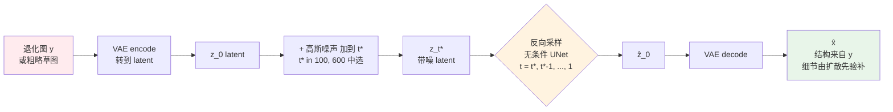
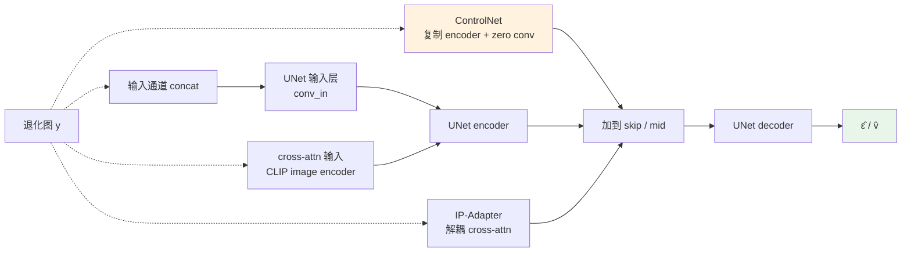

# 第 9 章 · 扩散模型的条件控制机制

> 第 8 章确立了扩散模型的生成机理：通过参数化反向去噪过程建模先验分布。
>
> 然而在图像增强与逆问题中，核心工程挑战在于**如何精准约束生成轨迹**：在充分激活生成先验（补充缺失高频细节）的同时，严格受控于退化观测输入（防止语义偏移与结构失真）。
>
> 条件控制机制是连接无约束生成与确定性复原的工程桥梁。

## 9.0 阅读须知

第 8 章阐明了无条件扩散模型的数据生成逻辑：从潜空间随机高斯噪声 $x_T$ 出发，经 UNet 迭代去噪能够采样出服从自然图像分布的样本 $\hat{x}_0$。而在图像增强场景中，任务目标为**条件后验采样**：给定退化观测 $y$，从后验概率分布 $p(x \mid y)$ 中采样出与 $y$ 空间拓扑严格对齐、分辨率更高且细节真实的解 $\hat{x}$。

本章系统剖析将退化观测 $y$ 注入扩散反向轨迹的核心范式，深入探讨保真度（Fidelity）与生成自由度（Creativity）之间的工程权衡。

阅读前提：

- 第 8 章：前向加噪、反向迭代、$\bar{\alpha}_t$ 与 $\epsilon$-prediction 参数化；
- DDIM 与 DPM-Solver 等快速常微分方程采样器；
- LDM 潜空间表征及 SD UNet 的 ResBlock 与 Spatial Transformer 内部拓扑；
- Classifier-Free Guidance（CFG）无分类器引导机制。

**核心术语与缩写索引：**

- **SDEdit**（Stochastic Differential Editing）：Meng 等人于 2022 年提出，将退化观测加噪至中间时间步后执行无条件反向去噪，无需重新训练即可实现基于先验的图像重构。
- **SR3**（Super-Resolution via Repeated Refinement）：Saharia 等人于 2022 年提出的早期超分辨率扩散模型，采用输入通道直接拼接（Input Concat）注入低分辨率先验。
- **StableSR**：Wang 等人于 2023 年提出，基于冻结的 Stable Diffusion 主干，通过外挂时间感知编码器（Time-aware Encoder）与空间特征变换（SFT）实现特征级注入，并在解码端配置可控特征包裹（CFW）调节保真度。
- **DiffBIR**：Lin 等人于 2023 年提出的两阶段盲图像恢复模型。第一阶段使用 SwinIR 变体去除退化，第二阶段通过 IRControlNet 并联模块注入冻结的 SD 主干（不使用 CLIP 图像跨注意力）。
- **SUPIR**：Yu 等人于 2024 年提出的真实场景超分辨率架构，融合 SDXL 基座、ZeroSFT 门控 ControlNet、LLaVA 文本提示以及恢复引导采样（Restoration-Guided Sampling）。
- **ControlNet**：Zhang 等人于 2023 年提出，通过克隆 UNet 编码器分支并配合零卷积（Zero Convolution），成为扩散条件控制的通用标准架构。
- **T2I-Adapter**：Mou 等人提出的轻量级外部条件引导网络，直接将特征图逐级加注至 UNet 编码器。
- **IP-Adapter**（Image Prompt Adapter）：Ye 等人提出的解耦跨注意力机制，为图像提示词构建独立的 Attention 通道，避免文本语义表征漂移。
- **CFW**（Controllable Feature Wrapping）：StableSR 中用于在解码阶段线性调节生成质量与像素保真度的特征变换模块。
- **ZeroSFT**（Zero Spatial Feature Transform）：SUPIR 中采用的空间特征仿射变换调制层，通过零初始化保证训练初期的平滑过渡。

## 9.1 核心矛盾：保真度（Fidelity）与生成自由度（Creativity）

在图像增强任务中，过度追求生成自由度与过度约束保真度均会导致不良结果：

- **过度约束输入（Over-constraint）**：模型退化为近似恒等映射，输出图像依然模糊，未能有效发挥扩散模型的先验生成能力；
- **过度自由发挥（Hallucination / 幻觉伪影）**：模型脱离退化图像的物理几何约束，凭空生成不符合原图身份或文字拓扑的虚假纹理；
- **最优工程平衡点**：在全局空间轮廓、边缘骨架与身份特征上严格依从原图，在局部高频纹理与微观结构上由扩散先验自适应填充。

条件控制机制的本质是：**在去噪轨迹的每个迭代步，动态将退化观测的特征约束投影至当前生成的特征切空间中**。

## 9.2 五种条件注入范式概览

| 条件控制范式 | 特征注入位置 | 代表性工作 | 显存与训练开销 | 空间约束强度 |
|-------------|-------------|-----------|---------------|-------------|
| **Input Concat** | UNet 输入第一层通道 | SR3 / LDSR | 低（仅需微调输入层或小范围全调） | 中等（深层易发生梯度稀释） |
| **Cross-Attention** | Spatial Transformer 交叉注意力 | IP-Adapter / 语义注入 | 中等（训练额外投影矩阵） | 弱（偏向全局语义与风格） |
| **ControlNet** | UNet 跳跃连接（Skip Connections） | SUPIR / DiffBIR | 较高（复制 Encoder 分支） | 强（像素级几何与结构对齐） |
| **IP-Adapter** | 解耦并行 Cross-Attention | 风格与身份保持 | 较低（新增参数量 < 100M） | 中等（局部纹理与色彩迁移） |
| **Tile + ControlNet** | 局部重叠滑动窗口推断 | 超大分辨率增强 | 无需重训（推断策略） | 强（支持超大分辨率缝合） |

注：StableSR 作为独立范式，在冻结主干外挂时间感知编码器并经由 SFT 注入中间层，下文 §9.8 将单独论述。

此外，以 **SDEdit** 为代表的免微调（Training-free）方案通过截断时间步实现了轻量级条件控制：



下图展示了各条件注入范式在 UNet 内部拓扑上的作用节点：



## 9.3 保真度与自由度的工程量化含义

根据第 4 章的感知失真权衡理论：
- **高保真度（High Fidelity）**：像素级对齐，PSNR/SSIM 指标优异，但视觉质感偏向保守与平滑；
- **高创造度（High Creativity）**：感知质感突出（LPIPS/FID 极佳），但在高倍率缩放下存在不可控的幻觉细节。

工业落地的关键在于为终端用户提供**推断时可连续调节的权重滑块**，使同一套预训练权重能够灵活适配监控安防、人像精修与艺术重绘等不同业务场景。

## 9.4 范式一：输入通道拼接（Input Concat）

输入通道拼接将低分辨率图像的潜空间表征与当前时间步的带噪潜变量在通道维度直接串联：输入张量尺寸由 $(B, 4, h, w)$ 扩展为 $(B, 8, h, w)$。

```python
import torch
import torch.nn as nn

def modify_conv_in_for_concat(unet: nn.Module) -> nn.Module:
    """修改 UNet 第一层卷积以支持 8 通道输入。"""
    old_conv = unet.conv_in
    new_conv = nn.Conv2d(8, old_conv.out_channels, kernel_size=3, padding=1)

    with torch.no_grad():
        # 前 4 通道继承预训练权重, 后 4 通道零初始化
        new_conv.weight[:, :4] = old_conv.weight
        new_conv.weight[:, 4:] = 0.0
        new_conv.bias[:] = old_conv.bias

    unet.conv_in = new_conv
    return unet
```

### 工程特性评估

- **优点**：结构改动极小，仅需微调首层卷积；推断阶段无需额外的前向计算分支；
- **缺陷**：条件信息仅在最外层注入，随着网络深度增加，深层特征中的退化约束容易被多层非线性变换稀释；难以在推断阶段动态调节引导强度。

## 9.5 范式二：跨注意力机制注入（Cross-Attention）

利用图像编码器（如 CLIP ViT）提取退化图像的 Patch-level Token 序列，替代或补充原有的文本 Token 作为 Spatial Transformer 内部 Cross-Attention 的 Key 与 Value。

```python
import torch
import torch.nn as nn

class CLIPImageTokenEncoder(nn.Module):
    """提取图像 Patch Token 作为跨注意力上下文。"""

    def __init__(self, clip_model, projection_dim: int = 768):
        super().__init__()
        self.clip = clip_model
        self.proj = nn.Linear(clip_model.visual.output_dim, projection_dim)

    def forward(self, lr_img: torch.Tensor) -> torch.Tensor:
        # 获取倒数第二层的 Patch-level Token
        patch_tokens = self.clip.encode_image(lr_img, return_tokens=True)
        return self.proj(patch_tokens)
```

**适用场景与局限**：适用于全局色彩、光照与语义风格的迁移控制；但由于 CLIP 编码过程丢弃了细粒度的空间坐标对应关系，纯 Cross-Attention 无法保证文字、人脸五官等局部几何的严格像素级对齐。

## 9.6 范式三：ControlNet 拓扑与零卷积机制

Zhang 与 Agrawala 提出的 ControlNet 是目前扩散结构控制的工业标准范式。

### 核心架构原理

1. **冻结主干权重**：保持预训练扩散模型 UNet 权重不变，完整保留海量预训练数据赋予的自然图像分布先验；
2. **克隆编码器分支（Trainable Copy）**：完整复制 UNet 的 Encoder 与 Middle Block 作为独立的控制特征提取分支；
3. **零卷积（Zero Convolution）桥接**：在 ControlNet 的各层输出接入权重与偏置均初始化为 0 的 1×1 卷积，直接加注至主干 UNet 的对应跳跃连接（Skip Connection）。

下图展示了 ControlNet 与主 UNet 的数据交互流向：

```mermaid
graph LR
    XT[x_t<br/>noisy latent<br/>B,4,h,w] --> MainEnc
    XT --> CnetIn[ControlNet 输入<br/>x_t || lr_latent<br/>B,8,h,w]
    LR[LR / 条件图] --> Pre[cond pre-process<br/>RGB → latent 大小] --> CnetIn
    T[t, context] --> MainEnc
    T --> CnetEnc

    subgraph Main[主 UNet · frozen · 预训练 SD]
        MainEnc[Encoder<br/>多层 ResBlock + Spatial Transformer] --> MainMid[Mid Block]
        MainMid --> MainDec[Decoder<br/>逐层 upsample + skip concat]
        MainDec --> EpsOut[ε̂ / v̂<br/>B,4,h,w]
    end

    subgraph Cnet[ControlNet · trainable · encoder + mid 复制]
        CnetIn --> CnetEnc[Encoder copy<br/>初始权重 = 主 UNet]
        CnetEnc --> CnetMid[Mid block copy]
    end

    CnetEnc -.->|每层| Z1[Zero Conv × N<br/>初始权重 0]
    CnetMid -.-> Zm[Zero Conv mid]
    Z1 --> SkipAdd[加到主 UNet 对应 skip]
    Zm --> SkipAdd
    SkipAdd --> MainDec

    style Main fill:#e3f2fd
    style Cnet fill:#fff3e0
    style EpsOut fill:#e8f5e9
```

### 零卷积（Zero Convolution）的数学稳定性保证

设主干 UNet 某层的特征表示为 $h_m$，ControlNet 对应层的输出为 $h_c$。注入后的融合特征为：

$$
h_m' = h_m + \mathcal{Z}(h_c; \mathcal{W}_z, \mathbf{b}_z)
$$

由于零卷积的初始权重 $\mathcal{W}_z = \mathbf{0}$ 且偏置 $\mathbf{b}_z = \mathbf{0}$，在训练初始状态下 $\mathcal{Z}(h_c) \equiv \mathbf{0}$，因此 $h_m' = h_m$。

这一设计确保了：
- **训练起点完全等价于原始生成基座**：避免随机初始化的附加分支破坏主干已收敛的特征空间；
- **控制信号平滑渐进注入**：梯度反向传播时，零卷积参数逐步偏离零点，控制强度随训练步数自然增强。

```python
class ZeroConv2d(nn.Module):
    """零初始化 1x1 卷积层。"""

    def __init__(self, in_channels: int, out_channels: int):
        super().__init__()
        self.conv = nn.Conv2d(in_channels, out_channels, 1)
        nn.init.zeros_(self.conv.weight)
        nn.init.zeros_(self.conv.bias)

    def forward(self, x: torch.Tensor) -> torch.Tensor:
        return self.conv(x)
```

主 UNet 的 forward 要改成把 ControlNet 的输出加到对应 skip：

```python
def forward_with_controlnet(unet, controlnet, x_t, lr_img, t, context):
    """主 UNet forward + ControlNet 注入。"""
    # 1. ControlNet 计算条件信号
    control_outs = controlnet(x_t, lr_img, t, context)

    # 2. 主 UNet encoder, 把 control_outs 加进 skip
    skips = []
    h = x_t
    for i, block in enumerate(unet.input_blocks):
        h = block(h, t, context)
        skips.append(h + control_outs[i])           # 加和

    # 3. 主 UNet mid + control mid
    h = unet.middle_block(h, t, context)
    h = h + control_outs[-1]

    # 4. 主 UNet decoder
    for block, skip in zip(unet.output_blocks, reversed(skips)):
        h = block(torch.cat([h, skip], dim=1), t, context)

    return unet.out(h)
```

### ControlNet 训练数据与监督构建

在图像增强任务中，ControlNet 的训练依赖高保真配对数据 $(\mathbf{x}_{\text{LR}}, \mathbf{x}_{\text{HR}})$：
- **HR 目标样本**：经由 VAE 编码并加噪至时间步 $t$ 生成 $x_t$，作为扩散去噪的目标回归真值；
- **LR 条件输入**：作为 ControlNet 专有分支的输入，负责逐级提取多尺度空间几何先验；
- **数据规模与分布覆盖**：工业级增强模型的 ControlNet 训练通常需要数十万至数百万级高质量图像切片，深度依赖第 5 章所阐述的高阶随机退化合成管线进行数据增强。

### DiffBIR：两阶段解耦恢复范式

Lin 等人提出的 DiffBIR（Blind Image Restoration via Diffusion, 2023）是 ControlNet 范式在盲图像恢复中的标杆实践。学术界与工业界常将其误归类为 Cross-Attention 方案，在此需予以明确界定：DiffBIR 采用严格的两阶段解耦流水线：

- **第一阶段（确定性去退化，Degradation Removal）**：采用基于 SwinIR 拓扑的紧凑回归网络对输入 LR 图像进行前置滤波，剥离剧烈噪声、块状压缩伪影与运动模糊，输出一张结构轮廓干净但高频纹理相对平滑的中间特征图；
- **第二阶段（生成式细节重构，Generative Refinement）**：将第一阶段输出的平滑图像作为条件输入，送入并联的 IRControlNet 分支，逐层加注至冻结的 Stable Diffusion 主干，利用大规模生成先验填补高频微观质感。

DiffBIR 全程未引入 CLIP 图像特征编码，亦未采用图像交叉注意力，其空间控制力完全源于 ControlNet 的并联特征加和。这一两阶段设计将"确定性逆滤波"与"概率性纹理生成"解耦，有效降低了单阶段扩散模型在极端退化下容易产生结构畸变的风险。

### 条件注入机制与主干拓扑的演进耦合

需要指出的是，本节探讨的 ControlNet 以及前文的 Input Concat 与 Cross-Attention 注入机制，均深度绑定于 **UNet 拓扑**（如复制 Encoder 阶段特征、向 Skip Connection 注入加法扰动、替换输入层卷积通道）。

随着扩散主干向 DiT（Diffusion Transformer，如 SD3、Flux）架构演进，条件控制的工程实现亦发生了形态变迁：通常采用将控制 Token 直接拼入序列、或通过专有的 AdaLN（Adaptive LayerNorm）与 Conditioning Block 实施特征调制，而非机械复制编码器分支。相关前沿演进将在第 18 章展开系统论述。

## 9.6b 范式四：IP-Adapter 解耦图像提示词机制

在多模态与参考引导增强场景中，工程师经常面临一类特殊需求：**以参考图像（Reference Image）作为风格、光照或主体身份的先验提示**，而非对其进行严格的逐像素几何空间对齐。

在图像增强语境下的典型应用包括：
- **同源参考超分辨率（RefSR）**：结合低分辨率输入与同主体的高清特写参考，引导面部或特定物体的纹理生成；
- **光影与色调迁移**：以目标样张的色彩分布与光照质感引导重建过程；
- **微观材质辅助修复**：利用同类材质的高清切片提供细粒度表面纹理先验。

### 解耦跨注意力（Decoupled Cross-Attention）数学机理

标准 Stable Diffusion 架构中，空间自注意力后的 Cross-Attention 模块仅面向文本 Prompt 序列计算：$\text{Attention}(Q, K_t, V_t)$。若将图像 Token 粗暴地拼接至文本序列之后，会强行扭曲预训练文本注意力的几何分布，引发严重的语义漂移与指令失遵。

Ye 等人提出的 IP-Adapter 引入了解耦双通道并行设计：为图像特征独立构建专用的 Key 与 Value 线性投影矩阵，在特征输出端执行加权融合：

$$
\text{Output} = \text{Attention}(Q, K_t, V_t) + \lambda \cdot \text{Attention}(Q, K_i, V_i)
$$

其中 $K_i, V_i$ 由 CLIP 图像特征经新增线性层映射生成，$\lambda \in [0, 1.5]$ 为推断阶段可实时微调的图像引导强度标量。

```python
class IPAdapterCrossAttn(nn.Module):
    """IP-Adapter: 解耦的图像 cross-attention。
    与原 text cross-attention 并行, 输出相加。
    """

    def __init__(self, dim: int, num_heads: int, image_dim: int = 1024):
        super().__init__()
        # 复用原 cross-attention 的 Q (来自 latent)
        # 新增图像分支的 K, V projection
        self.to_k_img = nn.Linear(image_dim, dim, bias=False)
        self.to_v_img = nn.Linear(image_dim, dim, bias=False)
        self.num_heads = num_heads
        nn.init.zeros_(self.to_k_img.weight)
        nn.init.zeros_(self.to_v_img.weight)        # 0 初始化, 训练初期无影响

    def forward(self, q, text_kv, image_tokens, scale: float = 1.0):
        # text_kv 走原 cross-attention (省略, 主 UNet 内置)
        text_out = original_cross_attn(q, text_kv)

        # 图像分支
        k_img = self.to_k_img(image_tokens)
        v_img = self.to_v_img(image_tokens)
        image_out = scaled_dot_product_attention(q, k_img, v_img, num_heads=self.num_heads)

        return text_out + scale * image_out
```

**工程核心优势：**

1. **保护预训练基座特征流形**：原 UNet 与文本通道保持完全冻结，新增参数量通常不足 100M，计算与显存开销极小；
2. **多模态引导权重完全解耦**：文本 CFG 强度与图像引导强度 $\lambda$ 相互独立，支持在推断期间平滑插值调节。

## 9.7 工业级 SOTA 架构剖析：SUPIR（2024）

Yu 等人提出的 SUPIR 融合了多项工程创新，是当前真实场景通用超分辨率（Real-world SR）领域的代表性架构。

### 核心系统组件剖析

1. **SDXL 强生成先验基座**：采用 2.6B 参数量的 SDXL 作为生成主干，显著提升复杂自然纹理的重建上限；
2. **ZeroSFT 门控 ControlNet**：在 ControlNet 输出端引入零初始化空间特征变换（Zero Spatial Feature Transform），实现逐像素空间仿射调制：
   $$
   h' = h \odot (1 + \gamma) + \beta
   $$
   其中调制参数 $\gamma, \beta$ 由控制分支自适应预测；
3. **视觉语言大模型（LLaVA）文本引导**：集成多模态大模型自动解析输入图像的高级语义（如主体类别、光照环境、局部材质），转化为精细 Prompt 注入生成主干，有效降低歧义区域的生成盲目性；
4. **EDM 连续连续扩散框架**：基于 Karras 等人的 EDM 连续时间扩散框架，采用 $\sigma$ 空间参数化与二阶 Heun 采样求解器；
5. **恢复引导采样（Restoration-Guided Sampling）**：在推断采样的每个时间步，通过显式计算估计真值 $\hat{x}_0$ 与低分辨率输入 $y$ 之间的物理退化一致性梯度，反向校正预测得分，强力压制幻觉伪影。

性能表现：在严重退化的历史老照片与复杂真实退化集上，主观感知质感与边缘锐利度表现优异。

## 9.8 独立范式：StableSR 架构与可控特征包裹（CFW）

Wang 等人提出的 StableSR 构建了一条区别于标准 ControlNet 的独立控制范式：在冻结的 Stable Diffusion 基座外挂时间感知编码器（Time-aware Encoder），通过 SFT 机制将多尺度退化特征注入主干；在像素重构阶段，引入**可控特征包裹机制（Controllable Feature Wrapping, CFW）**。

### CFW 机制的数学机理与工程实现

CFW 的核心目标在于解耦“扩散潜变量生成”与“图像保真度解码”，在 VAE 解码阶段引入线性连续调节因子 $w \in [0, 1]$：

$$
\hat{x}_0 = \text{Decoder}\Big(\text{CFW}\big(z_{\text{diff}},\ E(y);\ w\big)\Big)
$$

其中 $z_{\text{diff}}$ 为扩散去噪生成的潜变量，$E(y)$ 为退化图像经旁路编码器提取的深层特征。

调节参数 $w$ 的物理行为：
- $w \to 0$：完全依赖扩散潜变量生成，纹理丰富但客观保真度较低；
- $w \to 1$：深度融合输入特征，几何轮廓与像素分布严格依从原图；
- $w = 0.5$：兼顾高频生成与客观保真的平衡配置。

### 时间感知条件调制（Time-aware Conditioning）

StableSR 的特征注入强度与扩散时间步 $t$ 强相关：
- 高噪声阶段（$t \to T$）：抑制条件注入强度，赋予扩散主干充分的全局拓扑探索空间；
- 低噪声阶段（$t \to 0$）：加大条件注入权重，迫使生成特征向输入退化观测的像素空间对齐收敛。

## 9.9 超大分辨率分块推断（Tiling Inference）工程实践

扩散模型受限于训练切片尺寸（通常为 $512 \times 512$ 或 $1024 \times 1024$），直接推断 4K/8K 图像不仅会触发显存溢出（OOM），且易导致结构多头畸变。

工业界普遍采用带边缘渐变融合的重叠滑动窗口（Overlap-Tiling）机制：

```python
import torch
import torch.nn.functional as F

def tile_diffusion_inference(
    pipeline, hr_img_tensor: torch.Tensor,
    tile_size: int = 512, overlap: int = 128, **pipe_kwargs
) -> torch.Tensor:
    """
    基于重叠滑动窗口与锚定边界的大图扩散推断。
    hr_img_tensor: (1, C, H, W)
    """
    _, _, H, W = hr_img_tensor.shape
    stride = tile_size - overlap

    output = torch.zeros_like(hr_img_tensor)
    weight = torch.zeros_like(hr_img_tensor)

    # 构建四向线性渐变权重衰减 Mask
    blend_mask = torch.ones((1, 1, tile_size, tile_size), device=hr_img_tensor.device)
    for i in range(overlap):
        v = (i + 1) / (overlap + 1)
        blend_mask[:, :, i, :] *= v
        blend_mask[:, :, -i-1, :] *= v
        blend_mask[:, :, :, i] *= v
        blend_mask[:, :, :, -i-1] *= v

    # 锚定滑动起点计算函数，确保边缘完全覆盖
    def anchored_starts(total: int, tile: int, step: int):
        if total <= tile:
            return [0]
        starts = list(range(0, total - tile, step))
        if starts[-1] + tile < total:
            starts.append(total - tile)
        return starts

    for top in anchored_starts(H, tile_size, stride):
        for left in anchored_starts(W, tile_size, stride):
            tile = hr_img_tensor[:, :, top:top+tile_size, left:left+tile_size]
            tile_out = pipeline(tile, **pipe_kwargs)

            output[:, :, top:top+tile_size, left:left+tile_size] += tile_out * blend_mask
            weight[:, :, top:top+tile_size, left:left+tile_size] += blend_mask

    return output / (weight + 1e-8)
```

**工程关键技巧**：
- **全局共享初始噪声（Shared Noise Map）**：所有局部 Tile 从同一张全图标准高斯噪声中截取对应坐标的局部切片，确保拼接处的纹理方向与相位连续；
- **ControlNet Tile 专用微调**：采用多尺度混合切片微调 ControlNet，提升模型对边界模糊截断的容忍度。

## 9.10 负向提示词（Negative Prompt）与质量约束

在 Classifier-Free Guidance 架构中，负向提示词通过向反方向外推得分向量，能够有效剔除常见生成伪影：

```python
positive_prompt = "ultra-high resolution, sharp focus, natural texture, pristine details"
negative_prompt = "blurry, low quality, jpeg compression artifacts, oversmooth, plastic skin, distorted geometry"
```

## 9.11 推断关键超参数工程推荐

| 调节参数 | 建议搜索区间 | 参数调高的物理效应 |
|---------|-------------|-------------------|
| `num_inference_steps` | 20 至 35 步 | 纹理精细度提升，推断耗时线性增加 |
| `guidance_scale` (CFG) | 1.5 至 3.0 | 提示词依从度提升，过高易导致色彩饱和度过载 |
| `controlnet_conditioning_scale` | 0.6 至 1.2 | 几何保真度增强，过高可能导致退化伪影被复现 |
| `tile_size` / `overlap` | 1024 / 256 | 拼接接缝更自然，显存占用与计算开销增加 |

### 极速单步/少步蒸馏超分辨率前沿

针对生产环境中严苛的延迟约束（SLA < 500ms），基于一致性蒸馏与对抗蒸馏的加速算法取得了突破性进展：

- **OSEDiff**：基于 SD 2.1 蒸馏的单步真实场景超分辨率模型，仅需单次 UNet 前向推断；
- **SinSR**：基于 ResShift 架构蒸馏的单步超分模型；
- **AddSR**：结合对抗扩散蒸馏（ADD），在 2 至 4 步内实现感知与保真的平衡；
- **TSD-SR**：CVPR 2025 前沿工作，将少步生成机制扩展至 DiT 扩散架构。

## 9.12 训练与推断工程差异清单

| 环节 | 训练阶段（Training） | 推断阶段（Inference） |
|------|--------------------|---------------------|
| **计算复杂度** | 单次前向与反向传播 | 多步数值积分循环（15-30 次前向） |
| **空间尺寸** | 固定小尺度切片（如 512×512） | 任意超大分辨率输入（依赖 Tiling 调度） |
| **引导机制** | 10% 概率条件随机置空 | 双路前向（有条件 + 无条件）执行 CFG 外推 |
| **显存瓶颈** | 梯度反向传播与优化器状态 | 激活值峰值与大尺寸潜空间重构 |

## 9.13 架构选型决策矩阵

| 应用业务场景 | 推荐控制范式 | 代表性方案 |
|-------------|-------------|-----------|
| 历史老照片重度破坏修复 | SDXL + ZeroSFT ControlNet + LLaVA | SUPIR |
| 画质与几何保真平衡可调需求 | 冻结 SD + SFT + 可控特征包裹（CFW） | StableSR |
| 严重噪声/压缩盲恢复 | 两阶段：预恢复滤波 + IRControlNet | DiffBIR |
| 跨图特征对齐与身份保持 | 解耦图像跨注意力 + ControlNet | IP-Adapter + ControlNet |
| 实时/近实时高吞吐服务 | 少步/单步蒸馏扩散模型 | OSEDiff / AddSR |
| 4K/8K 巨幅海报精修 | 共享噪声滑动窗口与 Tile 融合 | Tile Pipeline |
| 移动端/嵌入式端侧场景 | 不推荐扩散模型（优先选用 CNN） | NAFNet / Real-ESRGAN |

## 9.14 小结

1. **条件控制是生成式增强的核心支撑**：决定了模型在保真度与生成自由度之间的落点；
2. **ControlNet 确立了工业标准**：克隆编码器配合零卷积，在完整保留基础生成先验的前提下实现像素级拓扑约束；
3. **独立范式的多样化探索**：StableSR（SFT + CFW）提供了推断期线性可控的保真度滑块，DiffBIR 确立了两阶段解耦恢复流程；
4. **超大分辨率工程解法**：通过锚定滑动窗口、重叠权重衰减及共享噪声地图，实现了显存可控的无缝拼接；
5. **少步蒸馏打破延迟瓶颈**：1 至 4 步极速扩散架构使生成式增强具备了落地高并发在线服务的工程可行性。

---

> 下一章 [任务特化模型](10-task-specific.md) → 探索人脸、文档、医疗与跨图像参考等特定应用场景中的先验归纳偏置与专用算法设计。
