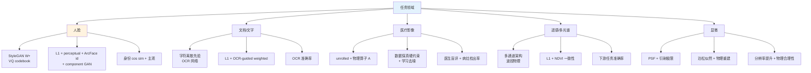
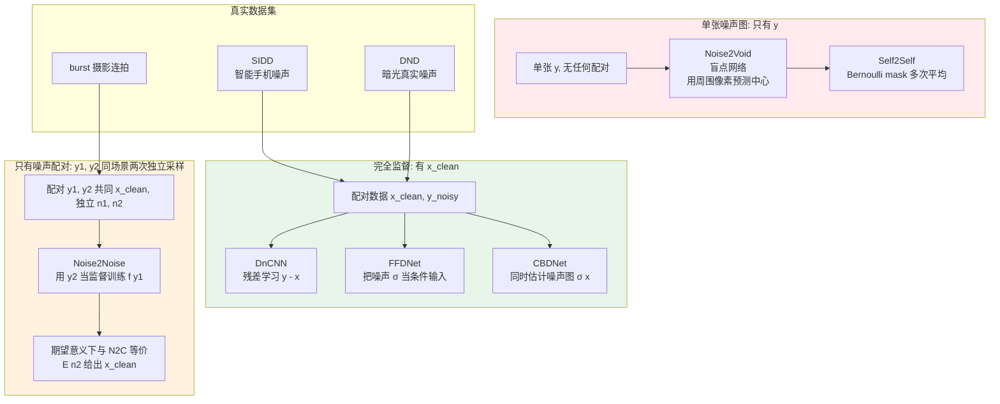
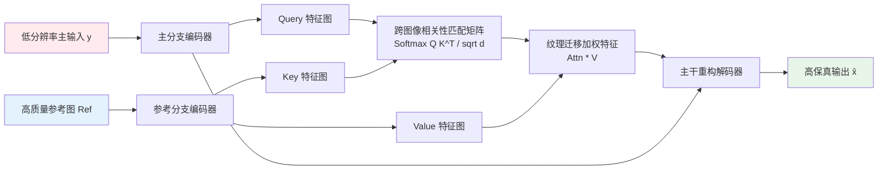

# 第 10 章 · 任务特化模型与领域归纳偏置

> 通用图像恢复网络（如 Real-ESRGAN、SUPIR）基于自然图像的大规模统计先验构建，在常规开放场景中具备优良的泛化能力。
>
> 然而在人脸、文档、医学影像与科学成像等强结构化领域，通用模型往往因缺乏领域专有归纳偏置而出现身份漂移、笔画畸变或虚假病灶等灾难性错误。
>
> 本章系统剖析垂直领域中物理与几何先验的数学表征及其在网络架构中的工程化注入方案。

## 10.0 阅读须知

前几章探讨了通用恢复骨干网络（CNN、Transformer、Diffusion）的设计范式。本章视角转换为垂直领域驱动：**深入分析特定数据分布的内在数学约束，并据此设计专有先验表征、目标函数与评测基准**。

阅读前提：

- 第 1 章：物理退化模型与盲/非盲逆问题界定；
- 第 3 章：感知损失、对抗判别损失与特征级身份保持损失；
- 第 6 与第 7 章：深度残差网络与自注意力机制的计算拓扑；
- 第 8 与第 9 章：生成式扩散先验与条件控制机制。

**核心术语与缩写索引：**

- **GAN Inversion**（生成对抗网络反演）：将观测图像投影至预训练 GAN 的潜空间流形（如 StyleGAN 的 $\mathcal{W}/\mathcal{W}^+$ 空间），利用生成器先验执行高保真重构。
- **StyleGAN**：Karras 等人提出的基于样式调制的生成对抗网络，其潜空间解耦表征构成了高质量人脸先验的经典基座。
- **$\mathcal{W}/\mathcal{W}^+$ 空间**：StyleGAN 的解耦特征空间。$\mathcal{W}^+$ 空间为各生成层分配独立的 512 维特征向量，层数满足 $2 \cdot \log_2(R) - 2$（例如 1024 分辨率对应 $18 \times 512 = 9216$ 维）。
- **PULSE**：Menon 等人提出的早期超分辨率反演算法，通过潜在空间梯度优化寻找匹配低分辨率输入的高分辨率样本。
- **GFPGAN**（Generative Facial Prior GAN）：Wang 等人提出的盲人脸复原架构，采用通道切分空间特征变换（CS-SFT）调制冻结的 StyleGAN2 生成器。
- **GPEN**（GAN Prior Embedded Network）：Yang 等人提出的方案，将 GAN 生成先验深度嵌入 U-Net 解码器拓扑中。
- **CodeFormer**：Zhou 等人提出的模型，利用 VQ-VAE 离散码本（Codebook）构建紧凑人脸先验，配合 Transformer 执行语义上下文序列预测。
- **VQ-VAE**（Vector-Quantized Variational Autoencoder）：通过向量量化将连续特征映射为有限离散码本的自编码器。
- **RestoreFormer / RestoreFormer++**：基于跨注意力机制直接将低分辨率特征与高质量码本字典进行关联匹配的盲人脸复原架构。
- **ArcFace / FaceNet**：基于角边际损失训练的深度人脸识别网络，常用于构建身份保留损失（Identity Loss）。
- **DnCNN**（Denoising CNN）：Zhang 等人提出的深度残差去噪网络，奠定了深度学习图像去噪的基础框架。
- **Noise2Noise (N2N)**：Lehtinen 等人提出的去噪范式，证明了使用同场景独立采样的带噪图像对进行监督，其均方误差期望等价于干净图像监督。
- **Noise2Void (N2V)**：Krull 等人提出的单图自监督去噪网络，基于盲点卷积（Blind-spot Network）利用邻域像素预测中心像素。
- **FFDNet**：将噪声水平估计图作为辅助输入通道的可调条件去噪网络。
- **PSF**（Point Spread Function，点扩散函数）：光学成像系统对理想点光源的脉冲响应函数，决定了显微与天文成像的物理分辨率极限。
- **k-space**（k 空间）：磁共振成像（MRI）中经傅里叶变换采样的频域原始数据空间。
- **Radon 变换**：计算机断层扫描（CT）中投影数据采集的积分几何数学变换。
- **RefSR / RefIR**（Reference-based Super-Resolution）：参考引导图像超分辨率与恢复，利用伴随的高清参考图像提供跨视角或跨焦段的真实纹理迁移。

下图总结了各垂直领域的任务特性、先验形式、核心损失与评估标准：



## 10.1 垂直领域需要任务特化的内在机理

通用超分辨率模型在自然图像上表现优良，但应用于特定垂直场景时常发生特征失真：

- **人脸增强**：通用模型缺乏严格的身份一致性约束，容易导致五官比例失真、肤色偏移与身份漂移；
- **文档与文字**：文字具有高度离散的字符拓扑结构，通用平滑先验容易引起多笔画或少笔画等语义性错误（如将“日”错误重建为“目”）；
- **医学影像（CT/MRI）**：高敏感度诊断场景对虚假结构零容忍，无物理约束的生成模型可能生成虚假病灶；
- **遥感与多光谱**：波段具有严谨的光谱物理意义（如地表反射率），直接采用 RGB 卷积处理会破坏波段间的相对能量比例；
- **科学显微成像**：忽略光学系统的点扩散函数（PSF）与光子泊松噪声分布，导致物理尺度失真。

任务特化的核心工程准则在于：**将垂直领域的物理成像方程或结构几何先验转化为网络架构的归纳偏置与损失约束**。

## 10.2 人脸增强：几何先验与潜空间反演

人脸具有严谨的拓扑结构与极高的主观敏感性，构成了低层视觉领域研究最为深入的特化分支。

### 核心归纳偏置之一：高保真人脸生成先验（StyleGAN 潜空间）

StyleGAN 系列模型在海量人脸数据（如 FFHQ）上训练，其解耦潜空间 $\mathcal{W}/\mathcal{W}^+$ 构成了高质量自然人脸的紧凑流形表征。

潜空间反演（GAN Inversion）的目标是通过编码器或迭代搜索，寻找最优潜变量 $w^*$：

$$
w^* = \arg\min_w \| G(w) - y \|_{\text{perceptual}}^2 + \lambda \cdot \mathcal{R}(w)
$$

其中 $G$ 为冻结的 StyleGAN 生成器，$\mathcal{R}(w)$ 为流形正则项。对于 1024 分辨率的人脸，$\mathcal{W}^+$ 空间的维度为 $18 \times 512 = 9216$ 维，将高维像素空间的病态逆问题转化为低维参数空间的最优投影。

### 核心归纳偏置之二：身份一致性硬约束（Identity Preservation）

利用预训练的人脸识别网络（如 ArcFace）提取深层身份嵌入特征，构建余弦相似度损失函数：

```python
import torch
import torch.nn as nn
import torch.nn.functional as F

class IdentityLoss(nn.Module):
    """基于 ArcFace 的人脸身份保留损失。"""

    def __init__(self, arcface_model: nn.Module):
        super().__init__()
        self.arcface = arcface_model.eval()
        for p in self.arcface.parameters():
            p.requires_grad_(False)

    def forward(self, pred: torch.Tensor, target: torch.Tensor) -> torch.Tensor:
        # 输入张量尺寸对齐至标准输入 (B, 3, 112, 112), 归一化至 [-1, 1]
        emb_pred = self.arcface(pred)
        emb_target = self.arcface(target)
        return (1.0 - F.cosine_similarity(emb_pred, emb_target)).mean()
```

### 核心归纳偏置之三：标准化几何对齐预处理

自然人脸具有标准的解剖几何对称性。工程实践中，必须先经由人脸检测器（如 RetinaFace）定位 5 个核心关键点（双眼中心、鼻尖、嘴角两端），通过相似变换仿射对齐至标准化网格（通常为 512×512），增强完成后逆变换贴回原图。

## 10.3 GFPGAN：结合 StyleGAN 几何先验与空间特征变换

Wang 等人提出的 GFPGAN 是利用预训练生成器先验的经典范式。

### 架构设计与特征注入拓扑

```
LR Face (degraded)
  ↓ Encoder (UNet 结构多尺度特征提取)
  ↓ 提取多尺度空间特征 F_1, F_2, ..., F_n
  ↓
  ↓ CS-SFT 逐层空间特征变换调制
  ↓
StyleGAN2 Generator (完全冻结, FFHQ 预训练)
  ↓
HR Face
```

### 通道切分空间特征变换（CS-SFT）

为在保留 StyleGAN 全局生成先验的同时注入低分辨率输入的空间纹理，GFPGAN 提出了 Channel-Split SFT：

$$
F_{\text{out}} = [\,F_{\text{gen}}[:, :C/2] \odot (1 + \gamma) + \beta,\quad F_{\text{gen}}[:, C/2:]\,]
$$

将生成器特征沿通道切分为两半：一半经由低分辨率特征预测的仿射参数 $(\gamma, \beta)$ 进行空间位置调制，另一半直接透传以保留原生人脸先验分布。

训练损失函数组合：

$$
\mathcal{L} = \lambda_1 \mathcal{L}_1 + \lambda_2 \mathcal{L}_{\text{percep}} + \lambda_3 \mathcal{L}_{\text{adv}} + \lambda_4 \mathcal{L}_{\text{id}} + \lambda_5 \mathcal{L}_{\text{component}}
$$

其中 $\mathcal{L}_{\text{component}}$ 为针对眼部、唇部与鼻部区域单独配置的局部补丁判别对抗损失。

## 10.4 CodeFormer：基于离散码本（VQ-Codebook）的人脸表征

Zhou 等人提出的 CodeFormer 放弃了连续的 StyleGAN 潜空间，转向基于 VQ-VAE 的离散码本表征。

### 离散码本与 Transformer 预测流程

下图展示了 CodeFormer 的双阶段表征与离散索引修正机制：

```mermaid
graph LR
    LR[LR 人脸<br/>B,3,512,512] --> Enc[Encoder<br/>多层卷积下采样]
    Enc --> Feat[连续特征<br/>B,h,w,d]
    Feat --> Quant[最近邻量化<br/>Q z = arg min_k ||z - e_k||]
    Quant --> Idx[离散索引序列<br/>B, h*w 个整数]
    CB[VQ Codebook<br/>K=1024 个向量 e_k<br/>FFHQ 上学到]
    CB -.->|查表| Quant
    Idx --> TX[Transformer<br/>修正预测<br/>code-level]
    TX --> Idx2[修正后索引]
    Idx2 --> Lookup[codebook lookup]
    CB -.->|查表| Lookup
    Lookup --> Feat2[修正后特征]
    Feat2 --> Dec[Decoder<br/>对称上采样]
    Dec --> HR[HR 人脸<br/>B,3,512,512]
    Feat -. fidelity 旁路 w .-> Fuse[加权融合]
    Feat2 -. quality 主路 1-w .-> Fuse
    Fuse --> Dec

    style LR fill:#ffebee
    style CB fill:#fff3e0
    style HR fill:#e8f5e9
```

### 离散先验的工程优势

1. **严格规避非人脸伪影**：离散码本包含 $K = 1024$ 个高质量人脸局部 Patch 基向量，任何位置的重构均被严格限制在有效基底的离散组合空间中；
2. **序列建模范式适配**：退化特征的去噪过程等价于离散 Token 序列的自回归/掩码修正，能够直接套用 Transformer 的长距离上下文建模能力；
3. **保真度参数可调（Fidelity Control Slider）**：在解码阶段引入权重 $w \in [0, 1]$，在编码器浅层特征（主控像素对齐）与修正后的码本表征（主控清晰度）之间提供平滑插值。

```python
def codeformer_inference(model: nn.Module, lr_face: torch.Tensor,
                         fidelity_weight: float = 0.5) -> torch.Tensor:
    """
    CodeFormer 推断接口。
    fidelity_weight = 0.0: 完全采用 Codebook 先验 (清晰度极高)
    fidelity_weight = 1.0: 严格依从 LR 输入特征 (保真度极高)
    """
    return model(lr_face, w=fidelity_weight)
```

## 10.5 RestoreFormer 与前沿扩散人脸复原拓展

Wang 等人提出的 RestoreFormer 采用跨注意力机制（Cross-Attention）直接将编码特征与高质量码本字典进行交互聚合，避免了离散预测的硬量化误差。

```python
class RestoreFormerBlock(nn.Module):
    """简化的 RestoreFormer 字典注意力块。"""

    def __init__(self, dim: int, codebook_size: int, num_heads: int):
        super().__init__()
        self.codebook = nn.Embedding(codebook_size, dim)
        self.attn = nn.MultiheadAttention(dim, num_heads, batch_first=True)
        self.norm = nn.LayerNorm(dim)

    def forward(self, lr_features: torch.Tensor) -> torch.Tensor:
        # lr_features: (B, N, D)
        codes = self.codebook.weight.unsqueeze(0).expand(
            lr_features.shape[0], -1, -1
        )
        out, _ = self.attn(query=lr_features, key=codes, value=codes)
        return self.norm(out + lr_features)
```

技术演进前沿：在 GAN 与码本先验之外，以 DifFace、PGDiff 与 DR2 为代表的扩散盲人脸复原方案通过时间反向退火与属性引导，在极端严重退化场景下展现了更优的皮肤微观纹理恢复能力。

## 10.6 生产级老照片人脸修复全流程管线

在工业界图像修复系统中，通用超分辨率主干与特化人脸网络通常以级联流水线形式协同运行：

```python
def restore_old_photo_pipeline(image_path: str, fidelity: float = 0.5):
    """老照片修复标准工程流水线。"""
    img = load_image(image_path)

    # 1. 通用背景超分辨率与全局去噪
    bg_enhanced = real_esrgan.enhance(img, scale=4)

    # 2. 人脸检测与多关键点几何对齐
    faces, landmarks = face_detector.detect(img)

    enhanced_faces = []
    for face_crop, affine_matrix in extract_aligned_faces(img, landmarks):
        # 3. 专用人脸先验网络复原
        enhanced = codeformer.enhance(face_crop, fidelity_weight=fidelity)
        enhanced_faces.append((enhanced, affine_matrix))

    # 4. 泊松无缝融合回高分辨率背景
    final_output = paste_faces_back(bg_enhanced, enhanced_faces)
    return final_output
```

## 10.7 文档与文本增强机制

文档与印刷体文字图像具有鲜明的领域特殊性：
1. **二值拓扑约束（Bilevel Topology）**：前景字符笔画与背景纸张具有强对比度与离散轮廓；
2. **拓扑连通性敏感**：微小的像素平滑或断裂可能导致文字含义的改变；
3. **几何边缘锐利度**：字符笔画缺乏自然图像的平滑过渡色阶。

### OCR 引导的结构感知损失

将预训练轻量级 OCR 识别主干（如 CRNN / SVTR）融入训练损失，当重构结果引发字符识别错误时，对对应几何区域施加倍数惩罚：

```python
class OCRGuidedLoss(nn.Module):
    """OCR 识别引导的文本区域自适应加权损失。"""

    def __init__(self, ocr_model: nn.Module):
        super().__init__()
        self.ocr = ocr_model.eval()

    def forward(self, pred: torch.Tensor, target: torch.Tensor) -> torch.Tensor:
        pixel_loss = F.l1_loss(pred, target, reduction='none')

        with torch.no_grad():
            chars_pred = self.ocr(pred)
            chars_target = self.ocr(target)

        # 识别错误区域赋予 5 倍权重惩罚
        error_mask = (chars_pred != chars_target).float()
        error_mask = F.interpolate(error_mask, size=pred.shape[-2:], mode='nearest')

        weighted_loss = pixel_loss * (1.0 + 5.0 * error_mask)
        return weighted_loss.mean()
```

## 10.7b 去噪：监督粒度决定的算法层级

在退化逆问题体系 $y = D(x) + n$ 中，图像去噪面临着独特的物理困境：**真实物理世界中不存在绝对纯净的参考真值 $x$**。超分辨率任务尚可通过高分辨率图像下采样构造理想配对，去模糊可通过静止短曝光获取清晰对比；然而由于光子散粒与热噪声的本底存在，任何感光探测器采集的图像均天然携带随机涨落。因此，工程实践中必须根据可获取的监督信号粒度（从合成配对、同场景独立双采样到单图自监督），灵活选取相适配的去噪流派。

下图按训练阶段所能获取的监督信号形态，对主流去噪架构进行了系统归类：



### 监督粒度决定的去噪算法层级

图像去噪面临的核心工程挑战在于**真实世界配对干净数据（Ground Truth）的物理获取成本极高**。常规相机采集的图像天然携带光子散粒噪声与传感器读出噪声，算法方案高度依赖监督信号的可用粒度：

1. **完全配对监督（Full Supervision, 如 DnCNN、FFDNet）**：
   - 依赖合成高斯噪声或实验室多帧静态平均构建的配对数据集（如 SIDD、DND）；
   - **DnCNN**：引入残差学习机制预测噪声残差 $\hat{\epsilon} = y - x$，利用批量归一化加速收敛；
   - **FFDNet**：将噪声水平估计图 $\sigma$ 作为额外条件通道输入，单模型覆盖宽动态范围噪声强度。

2. **噪声对弱监督（Noise-Pair Supervision, 如 Noise2Noise）**：
   - Lehtinen 等人指出，对于同场景两次独立采样的带噪观测 $y_1 = x + n_1$ 与 $y_2 = x + n_2$（噪声均值为 0 且相互独立），以 $y_2$ 为标签训练网络预测 $y_1$ 时，L2 损失的贝叶斯最优解收敛至条件均值：
     $$
     \arg\min_f \mathbb{E}\big[\|f(y_1) - y_2\|^2\big] = \mathbb{E}[y_2 \mid y_1] = x
     $$
   - 彻底摆脱了对绝对干净图像的依赖，广泛用于连拍（Burst）摄影与生物荧光显微去噪。

3. **单图无监督/自监督（Single-Image Self-Supervision, 如 Noise2Void）**：
   - Krull 等人提出盲点网络（Blind-spot Network）：在预测中心像素时强制将输入特征图的中心像素掩码，利用邻域像素的空间相关性重建中心值；
   - 在统计独立噪声假设下，邻域插值期望收敛至真实无噪信号。

4. **真实物理噪声建模（Real-World Noise Modeling, 如 CBDNet、VDN）**：
   - 将噪声方差解耦为依赖光强度的泊松分量（光子散粒）与依赖温度及电路的高斯分量（读出噪声），并在 RAW 空间构建信号相关的方差估计子网络。

```python
class DnCNN(nn.Module):
    """DnCNN: 残差去噪网络结构。"""

    def __init__(self, in_channels: int = 3, depth: int = 17, num_features: int = 64):
        super().__init__()
        layers = [nn.Conv2d(in_channels, num_features, 3, padding=1), nn.ReLU(inplace=True)]
        for _ in range(depth - 2):
            layers += [
                nn.Conv2d(num_features, num_features, 3, padding=1, bias=False),
                nn.BatchNorm2d(num_features),
                nn.ReLU(inplace=True),
            ]
        layers += [nn.Conv2d(num_features, in_channels, 3, padding=1)]
        self.body = nn.Sequential(*layers)

    def forward(self, y: torch.Tensor) -> torch.Tensor:
        noise = self.body(y)
        return y - noise


def train_noise2noise_step(model: nn.Module, y1: torch.Tensor,
                           y2: torch.Tensor, optimizer: torch.optim.Optimizer) -> float:
    """Noise2Noise 单步训练：以独立噪声图 y2 监督输入 y1。"""
    optimizer.zero_grad()
    pred = model(y1)
    loss = F.mse_loss(pred, y2)
    loss.backward()
    optimizer.step()
    return loss.item()
```

## 10.8 医学影像增强：物理算子与数据保真硬约束

医学影像（CT、MRI、超声、X 光）的临床诊断对图像真实性具有严苛要求，核心工程准则为**杜绝非物理生成与伪影误导**。

### 物理成像逆问题建模

医学成像可严格表述为带物理退化算子的线性逆问题：

$$
y = \mathcal{A}(x) + n
$$

其中 $\mathcal{A}$ 为已知的物理测量算子：
- **磁共振成像（MRI）**：空间傅里叶变换与欠采样掩码 $\mathcal{A}(x) = \mathcal{M} \odot \mathcal{F}(x)$；
- **计算机断层扫描（CT）**：Radon 投影变换；
- **超声成像**：脉冲回波卷积与非线性衰减散射。

### 展开网络（Unrolled Networks）与数据一致性层（Data Consistency）

采用展开网络（如梯度下降展开、ADMM-Net）将传统迭代优化算法的单步更新参数化为神经网络层，每层交替执行**学习型图像去噪**与**物理域数据一致性投影**：

```python
class UnrolledMRIRecon(nn.Module):
    """磁共振成像展开重构网络与 k 空间数据保真投影。"""

    def __init__(self, num_iterations: int = 5):
        super().__init__()
        self.num_iterations = num_iterations
        self.denoisers = nn.ModuleList([
            nn.Sequential(
                nn.Conv2d(2, 64, 3, padding=1),
                nn.ReLU(inplace=True),
                nn.Conv2d(64, 64, 3, padding=1),
                nn.ReLU(inplace=True),
                nn.Conv2d(64, 2, 3, padding=1)
            ) for _ in range(num_iterations)
        ])

    def forward(self, y_kspace: torch.Tensor, mask: torch.Tensor) -> torch.Tensor:
        # y_kspace: (B, 2, H, W) 实部与虚部频域信号
        # mask: (B, 1, H, W) 采样掩码 (1=已采样, 0=未采样)
        x = torch.fft.ifft2(torch.view_as_complex(y_kspace.permute(0, 2, 3, 1).contiguous()))
        x = torch.view_as_real(x).permute(0, 3, 1, 2).contiguous()

        for denoiser in self.denoisers:
            # 1. 先验去噪步 (CNN 学习图像空间正则项)
            x = x + denoiser(x)

            # 2. 数据一致性步 (Data Consistency 硬约束)
            x_complex = torch.view_as_complex(x.permute(0, 2, 3, 1).contiguous())
            kspace_est = torch.view_as_real(torch.fft.fft2(x_complex)).permute(0, 3, 1, 2).contiguous()

            # 已采样位置强制替换为真实物理测量值, 仅在未采样频域位置由网络补全
            kspace_corrected = mask * y_kspace + (1.0 - mask) * kspace_est
            x_complex_corr = torch.view_as_complex(kspace_corrected.permute(0, 2, 3, 1).contiguous())
            x = torch.view_as_real(torch.fft.ifft2(x_complex_corr)).permute(0, 3, 1, 2).contiguous()

        return x
```

**数据一致性层（DC Layer）的工程意义**：确保模型只能在物理未采样的空缺频域中进行合理推断，已测量的物理信号在数学上保持恒等不变，从机制上杜绝了生成模型随意篡改已观测病灶结构的风险。

## 10.9 卫星遥感与多光谱图像增强

卫星与无人机多光谱影像具有与自然 RGB 图像显著不同的物理属性：
- **多通道光谱维度**：包含近红外（NIR）、短波红外（SWIR）与热红外等 4 至 16 个物理波段；
- **严格辐射定标（Radiometric Calibration）**：数字量化值（DN）线性对应地表反射率或辐亮度；
- **遥感物理指标守恒**：归一化植被指数（$\text{NDVI} = \frac{\text{NIR} - \text{Red}}{\text{NIR} + \text{Red}}$）与水体指数（NDWI）对波段间相对比例变化高度敏感。

工程实践策略：
1. 采用通道可配置的 3D 卷积或图卷积表征光谱连续性；
2. 引入 NDVI 一致性损失：$\mathcal{L}_{\text{NDVI}} = \|\text{NDVI}(\hat{x}) - \text{NDVI}(x)\|_1$，约束重构前后植被生物物理参数的一致性。

## 10.10 光学显微成像增强

显微超分辨成像（如荧光显微、共聚焦显微）受制于阿贝衍射极限（Diffraction Limit）：
- **点扩散函数（PSF）卷积**：光学系统将点光源弥散为艾里斑（Airy Disk），退化可建模为与已知 PSF 的空间卷积；
- **散粒噪声主导**：弱光环境下探测器光子到达服从泊松分布（Poisson Statistics），常规高斯假设下的 MSE 损失会导致明亮结构过拟合而暗部欠拟合。

主流算法方案：结合 Richardson-Lucy 解卷积迭代先验构建物理引导的深度去卷积网络。

## 10.11 参考引导超分辨率（Reference-based Restoration, RefSR）

在许多实际工业产品中，除了低分辨率输入 $y$ 外，系统往往能够获取同场景或同主体的伴随高清参考图像 $\text{Ref}$：

$$
\hat{x} = f(y, \text{Ref})
$$

### 核心架构范式与跨注意力特征匹配

模型的核心任务是通过跨注意力机制（Cross-Attention）在低分辨率输入与参考图像之间建立特征级的稠密对应关系（Correspondence Matching），将参考图像中的高清纹理自适应迁移至主重建分支中。

主流代表性架构演进：
- **MASA-SR**（CVPR 2021）：设计尺度解耦的多尺度匹配模块，解决参考图与输入图像尺度差异下的特征错位问题；
- **C2-Matching**（CVPR 2021）：引入对比学习显式优化跨图像特征匹配的几何变换不变性；
- **DATSR**（ECCV 2022）：引入可形变注意力（Deformable Attention），提升对视角差异与微小几何形变的动态补偿能力。



### 工业级落地核心工程问题

1. **几何错位容忍度（Misalignment Robustness）**：参考图与输入图往往存在视角偏转、缩放及局部形变，特征匹配算子必须具备空间仿射不变性；
2. **参考图像缺失退化回退（Single-Image Fallback）**：当系统未匹配到合格参考图像时，网络需平滑退化为单图盲超分模式（训练时通过随机使用输入图像自身作为虚假参考图实现泛化）；
3. **多摄硬件协同系统落地**：
   - **智能手机双摄变焦融合**：利用广角主摄提供全局视场，长焦副摄提供中心区域的高清局部参考（Ref），实现全视场高清融合；
   - **智能相册人像重构**：从用户历史图库中检索同主体的高清正面证件照作为参考，辅助模糊抓拍照的五官重建。

## 10.12 垂直领域增强模型设计方法论

针对全新垂直领域设计特化恢复系统时，应遵循五步工程闭环：

1. **显式提炼领域归纳偏置**：界定数据分布的几何对称性（人脸）、离散符号拓扑（文字）或物理成像方程（医学/光学）；
2. **选择适配的先验表征载体**：离散结构选用 VQ-Codebook，强语义流形选用 GAN 潜空间或扩散先验，物理已知算子选用展开网络；
3. **构建领域专有目标函数**：在常规保真损失外叠加身份一致性损失、OCR 识别惩罚或物理守恒约束；
4. **制定业务对齐评测指标**：以临床病灶检出率、字符识别准确率（CR / NED）或人脸特征余弦相似度替代单纯的 PSNR；
5. **针对极端失效模式进行对抗性数据合成**：针对大角度遮挡、强退化笔画粘连及特殊伪影进行定向退化仿真强化。

## 10.13 小结

1. **通用模型的局限性**：自然图像统计先验无法覆盖人脸、文字与医学等强约束领域的特殊分布要求；
2. **人脸增强体系**：GFPGAN 确立了连续生成器调制机制，CodeFormer 开拓了离散码本序列预测范式，大幅提升了极端退化下的鲁棒性；
3. **文档与文字增强**：利用离散笔画拓扑与 OCR 感知损失，确保字符语义连通性不发生结构性漂移；
4. **去噪算法层级**：从配对监督（DnCNN）到噪声对监督（Noise2Noise）再到单图盲点自监督（Noise2Void），系统降低了对理想干净真值的依赖；
5. **医学与科学影像**：通过展开网络将物理正向算子转化为数据一致性投影层，从机制上避免虚假病灶生成；
6. **参考引导增强（RefSR）**：突破单图先验上限，利用双摄硬件或图库检索提供的高清参考纹理实现高保真度细节跃升。

> 下一章 [训练稳定性与工程调优](11-training.md) → 深入剖析对抗崩塌、扩散噪声调度抖动与复合损失权重平衡等底层工程调优经验。
