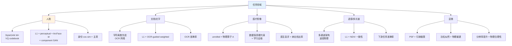
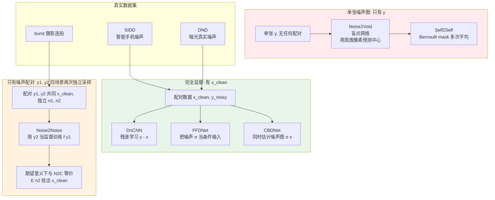

# 第 10 章 · 任务特化模型

> 通用增强模型（Real-ESRGAN、SUPIR）能处理大多数场景。但有几类任务**通用模型做不好**，必须用任务特化模型。
>
> 这一章讲：人脸、文档、医疗影像各自需要哪些归纳偏置，对应模型怎么设计。

## 10.0 阅读须知

到第 9 章为止，本书的视角始终是"一类通用模型，吃任何自然图像都尽量做好"。从这一章开始视角倒过来：**先承认通用模型在某些数据分布上必然失败**，再讨论怎么针对这些分布单独设计模型。前面九章里反复出现的"先验"在这里被进一步细化，不再是"自然图像的一般先验"，而是"人脸的先验"、"文字的先验"、"医疗成像的物理先验"、"多光谱物理意义"等。每一类都对应一组独立的工程惯例、损失设计、数据组织方式。

读这一章前假设你已经熟悉：

- 第 1 章退化模型与 blind / non-blind 区分
- 第 3 章的感知损失、对抗损失、身份保留损失
- 第 6-7 章的 CNN / Transformer 增强骨架
- 第 8-9 章的扩散基础与 ControlNet 控制思路

本章会反复出现的缩写：

- **GAN inversion**（Generative Adversarial Network Inversion，生成对抗网络反演）：把一张真实图像映射到 GAN 的潜空间向量，让 GAN 能"重画"它
- **StyleGAN**（Style-based GAN，2019 起的一系列基于风格调制的高质量生成器）：人脸领域最常用的预训练生成先验
- **W / W+ space**：StyleGAN 把潜噪声 $z$ 映射成中间向量 $w$，每一层注入的 $w$ 可以独立调（合起来叫 W+ 空间），增强方法常在 W+ 上做 inversion
- **PULSE**（Photo Upsampling via Latent Space Exploration，CVPR 2020）：早期把超分辨表述成 StyleGAN 潜空间搜索的代表
- **GFPGAN**（Generative Facial Prior GAN，Wang et al. 2021）：用冻结的 StyleGAN2 generator 当先验、外加一个 encoder + CS-SFT 调制
- **GPEN**（GAN Prior Embedded Network，Yang et al. 2021）：把 StyleGAN 直接嵌进 U-Net decoder，与 GFPGAN 同时代的另一条路线
- **CodeFormer**（Zhou et al. 2022）：用 VQ-VAE 学到的离散 codebook 作人脸先验，Transformer 预测 code 序列
- **VQ-VAE**（Vector-Quantized Variational Autoencoder，向量量化变分自编码器）：把连续 latent 离散化为有限 codebook 的自编码器
- **RestoreFormer / RestoreFormer++**（Wang et al. 2022/2023）：用 cross-attention 直接连接 LR 特征与 HQ 字典（codebook），是 codebook 路线的另一种取法
- **ArcFace / FaceNet**：人脸识别网络，输出身份 embedding，常用于身份保留损失
- **DnCNN**（Denoising CNN，Zhang et al. 2017）：去噪深度学习的开山之作，残差学习 + 高斯噪声
- **N2N / Noise2Noise**（Lehtinen et al. 2018）：用两次独立采样的噪声图互相做监督，不需要干净图
- **N2V / Noise2Void**（Krull et al. 2019）：进一步去掉对噪声配对的依赖，靠盲点网络在单张噪声图上自监督
- **FFDNet**（Fast and Flexible Denoising Network，Zhang et al. 2018）：把噪声水平作为输入条件的可调去噪网络
- **CBDNet / VDN / NoiseFlow**：真实噪声建模与去噪的代表
- **OCR**（Optical Character Recognition，光学字符识别）：把文字图像变成字符串的任务
- **CRNN**（Convolutional Recurrent Neural Network）：早期 OCR 主流架构，被 SVTR、PARSeq 等迭代
- **PSF**（Point Spread Function，点扩散函数）：成像系统对理想点光源的响应，决定显微/望远成像的物理分辨率上限
- **k-space**：MRI 数据的傅里叶域表示，扫描其实是在 k-space 上采样
- **Radon 变换**：CT 投影几何对应的数学变换
- **HSI-SR**（Hyperspectral Image Super-Resolution，高光谱超分）：多通道光谱图像的专门 SR 模型
- **NDVI**（Normalized Difference Vegetation Index，归一化植被指数）：遥感里典型的波段比值指标
- **RefSR / RefIR**（Reference-based Super-Resolution / Image Restoration，参考引导超分/恢复）：除 LR 外还有一张高质量参考图作输入
- **MASA-SR / C2-Matching / DATSR**：RefSR 的代表方法

这一章按"任务"切，不按"方法"切。同一种方法（比如离散 codebook、unrolled network、cross-attention）会在不同任务下多次出现，请把它当作"为任务挑工具"的视角去读，而不是"为工具找任务"。

## 10.1 为什么需要任务特化

通用 SR 在自然图像上表现优秀，但放到下面这些场景会失效：

- **人脸**：通用模型修复出的脸常常**变了样**，眼睛大小不对、鼻形改了、肤色漂移
- **文字/文档**：通用模型把"日"修复成"目"，结构错了一笔
- **医疗影像**：通用模型在 X 光/MRI 上加了不存在的"病灶"，可能是事故级错误
- **卫星遥感**：通用模型把多光谱通道当 RGB 处理，光谱信息全错
- **科学显微镜**：通用模型不理解物理成像过程，重建出非物理结构

通用模型失败的共同原因：**它学到的先验是"自然图像的一般分布"，不是"这一类图像的特殊分布"**。

更技术地说：通用先验在某一类图像上的概率密度是稀薄的。Real-ESRGAN 的训练集 DF2K / OST 里人脸只占很小一块，文字几乎没有，医疗影像和卫星图根本不在分布里。当输入落到这些子分布时，模型只能用最接近的自然图像先验去"硬猜"，结果就是熟悉的几种失败模式：把脸修平、把字模糊、给 X 光加纹理、把多光谱通道当 RGB 调色。

任务特化的核心 = 给模型注入这个特殊分布的知识：

- 人脸：身份不变（identity preservation）+ 五官几何约束 + StyleGAN / VQ-codebook 学到的人脸分布
- 文档：字符级正确性 + 直线/曲线结构 + OCR 网络作监督
- 医疗：物理成像模型（Radon / k-space / 散射） + 不允许"创造" + 数据保真硬约束
- 遥感：多通道光谱物理 + 大尺度地物结构 + 物理波段比值约束
- 显微：成像理论（PSF、衍射）+ 物理重建 + 荧光的泊松噪声主导

这一章按任务展开，重点是**人脸**（最成熟、工程实践最丰富），其他类型概述。完整的任务-先验-损失-评估四元组的关系可以画成下图：



整本书的视角到这里发生一次微妙的转变：前 9 章在问"模型架构 / 损失 / 采样器要怎么搭"，这一章在问"先把任务的归纳偏置说清楚，再去挑架构"。这个顺序很重要。架构先行常常导致工程师在某一个新任务上反复换 backbone，但效果上限其实是被"没注入对应先验"这件事卡住的。

## 10.2 人脸增强：先验最强、模型最多的子领域

人脸增强是影像增强里**研究最深入**的子领域，原因有三：

1. **数据丰富**：FFHQ（70K）、CelebA-HQ（30K）、VFHQ 都是高质量大规模数据集
2. **应用价值高**：老照片修复、远程会议增强、视频通话美颜，市场巨大
3. **失败成本低（且高）**：低成本：娱乐应用错一点没关系；高成本：身份不能变（错一点就是别人了）

人脸增强的归纳偏置主要有三类：

### 偏置 1：人脸有强先验（StyleGAN 学到的）

StyleGAN（2019）和 StyleGAN2/3 已经把"人脸的分布"学得非常好。任何高质量人脸都可以**反演**（GAN inversion）成 StyleGAN 潜空间的一个 W 向量。

GAN inversion 这个动作可以理解成"用一个固定的生成器 $G$，找一个潜变量 $w$ 让 $G(w)$ 尽量等于目标图 $x$"。形式化：

$$
w^* = \arg\min_w \| G(w) - x \|_{\text{perceptual}}^2 + \lambda \cdot \mathcal{R}(w)
$$

其中 $\mathcal{R}(w)$ 是潜空间正则项，鼓励 $w$ 落在"自然 $w$"分布里（比如 StyleGAN 的 W 平均向量附近）。增强场景下的不同之处只是把目标 $x$ 换成退化图 $y$ 在某个度量下的近似，比如先把 $y$ 上采样到 HR 大小再算 perceptual loss，于是搜出的 $w^*$ 是"产生了和 $y$ 在低频上一致的高分辨率人脸"。

关键洞察：

> 人脸潜空间是低维的（StyleGAN W+ 维度与生成分辨率相关，层数 = 2·log2(R)−2：1024px FFHQ 的 StyleGAN2 是 18×512 = 9216 维；512px 是 16×512；256px 才是 14×512）。
> 一张高质量人脸 = 这个低维空间里的一个点。
>
> 增强 = 从 LR 推出最合理的 W 向量，再用 StyleGAN 解码出 HR。

这是 **PULSE / GFPGAN / GPEN** 等模型的核心思路。它们的差别只在"怎么从 LR 推出 $w$"：PULSE 在推理时做迭代搜索（慢、不需要训），GFPGAN 训一个 encoder + 调制层一次前向得到（快、需要训），GPEN 把 StyleGAN 嵌进 U-Net decoder（结构更耦合）。三条路本质上都在 StyleGAN 潜空间里找点。

### 偏置 2：身份必须保留

人脸识别模型（ArcFace、FaceNet）已经学到了"什么决定一张脸的身份"。增强模型必须**让 ArcFace 看到的 embedding 不变**。

这是第 3 章 3.8 节讲过的身份保留损失：

```python
class IdentityLoss(nn.Module):
    """ArcFace 身份保留损失。"""
    def __init__(self, arcface_path: str):
        super().__init__()
        self.arcface = load_arcface(arcface_path).eval()
        for p in self.arcface.parameters():
            p.requires_grad_(False)

    def forward(self, pred: torch.Tensor, target: torch.Tensor):
        # 输入是对齐过的人脸, 范围 [-1, 1], 通常 112x112
        emb_pred   = self.arcface(pred)
        emb_target = self.arcface(target)
        return 1.0 - F.cosine_similarity(emb_pred, emb_target).mean()
```

### 偏置 3：对齐很重要

人脸有标准的几何结构：双眼水平、鼻子在中间、嘴巴下面。**对齐过的人脸**（face alignment）能让模型用更简单的网络达到同样效果，因为模型不需要学"五官位置可能在哪"。

工程实践：人脸增强模型几乎都先用 face detector + landmark detector 把人脸对齐到固定 crop（通常 512×512），增强完再贴回原图。

## 10.3 GFPGAN：StyleGAN 先验 + 通用 backbone

Wang et al. 在 2021 年的 GFPGAN（Generative Facial Prior GAN）是人脸增强的经典代表。

### 核心架构

```
LR Face (degraded)
  ↓ Encoder (类似 ESRGAN backbone)
  ↓ 提取多尺度特征 F_1, F_2, ..., F_n
  ↓
  ↓ 用某种方式调制 StyleGAN2 generator
  ↓
StyleGAN2 Generator (frozen, FFHQ pretrained)
  ↓
HR Face
```

关键点：

- **StyleGAN2 generator 冻结不训**：它已经学到了人脸分布
- **训练的是 encoder + 一些调制层**：把 LR 信息映射到 StyleGAN 的潜空间和中间特征

### CS-SFT（Channel-Split Spatial Feature Transform）

GFPGAN 在 StyleGAN generator 的每一层注入 LR 特征，但不是直接 concat，是用 SFT（spatial feature transform）：

$$
F' = F \odot (1 + \gamma) + \beta
$$

其中 $\gamma, \beta$ 是从 LR 特征 $F_{\text{LR}}$ 预测的空间特征。这种调制让 LR 信息能精细地影响每个空间位置，但又不破坏 StyleGAN 的整体生成能力。

CS-SFT 的"CS"（Channel-Split）：把 StyleGAN 的特征在通道维分成两半，一半用 SFT 调制（接受 LR 信息），一半保留原 StyleGAN 输出（保留生成先验）。这样平衡 fidelity 和 quality。

### GFPGAN 训练损失

经典组合：

$$
\mathcal{L} = \lambda_1 \mathcal{L}_1 + \lambda_2 \mathcal{L}_{\text{percep}} + \lambda_3 \mathcal{L}_{\text{adv}} + \lambda_4 \mathcal{L}_{\text{id}} + \lambda_5 \mathcal{L}_{\text{component}}
$$

其中 $\mathcal{L}_{\text{component}}$ 是"五官局部 GAN 损失"：专门给眼睛、鼻子、嘴单独训判别器，强制每个局部都真实。

### GFPGAN 性能与局限

效果：在严重退化的老照片上效果惊艳，远超通用 SR。

局限：

- **依赖人脸对齐**：不对齐就不能用
- **依赖 FFHQ 分布**：对 FFHQ 不常见的脸（比如老人、小孩、特殊种族）效果下降
- **只能处理人脸**：必须配合通用 SR 处理背景

工程组合：**通用 SR（Real-ESRGAN）背景 + GFPGAN 人脸**。这是 2022-2024 年大多数老照片修复工具的标准 pipeline。

## 10.4 CodeFormer：codebook 离散化的优势

Zhou et al. 在 2022 年的 CodeFormer 用了不同思路：不依赖 StyleGAN，改用 **VQ-VAE 学到的离散 codebook**。

### 核心思想

把人脸的"局部特征"离散化为 codebook 里的若干 code（比如 1024 个 code），高质量人脸 = 这些 code 的某种组合。

VQ-VAE 的训练分两阶段。第一阶段在高质量人脸数据集（典型 FFHQ）上训一个自编码器，但中间加一个"量化"步骤：encoder 输出的连续特征图 $\hat{z} \in \mathbb{R}^{h \times w \times d}$ 被替换成 codebook $\{e_k\}_{k=1}^K$ 里距离最近的离散向量，再喂给 decoder 重建图像。训练完之后 codebook 里的每个向量都对应"人脸的某种局部 patch 模式"。第二阶段冻结 codebook 和 decoder，训一个 Transformer 给定 LR 编码出的 token 序列预测**正确的 code 索引序列**。整条流水线如下：

```mermaid
graph LR
    LR[LR 人脸<br/>B,3,512,512] --> Enc[Encoder<br/>多层卷积下采样]
    Enc --> Feat[连续特征<br/>B,h,w,d]
    Feat --> Quant[最近邻量化<br/>Q z = arg min_k ||z - e_k||]
    Quant --> Idx[离散索引序列<br/>B, h*w 个整数]
    CB[VQ Codebook<br/>K=1024 个向量 e_k<br/>FFHQ 上学到]
    CB -.->|查表| Quant
    Idx --> TX[Transformer<br/>修正预测<br/>code-level]
    TX --> Idx2[修正后索引]
    Idx2 --> Lookup[codebook lookup]
    CB -.->|查表| Lookup
    Lookup --> Feat2[修正后特征]
    Feat2 --> Dec[Decoder<br/>对称上采样]
    Dec --> HR[HR 人脸<br/>B,3,512,512]
    Feat -. fidelity 旁路 w .-> Fuse[加权融合]
    Feat2 -. quality 主路 1-w .-> Fuse
    Fuse --> Dec

    style LR fill:#ffebee
    style CB fill:#fff3e0
    style HR fill:#e8f5e9
```

图里的"fidelity 旁路"对应 CodeFormer 推理时的 $w$ 参数：$w$ 越大越走原始 encoder 特征（保留 LR 像素细节），$w$ 越小越走 Transformer 修正后的 codebook 特征（更高质量但更可能改样）。

为什么离散化有用？

- **离散化 = 强先验**：模型只能生成 codebook 里"见过"的特征，不会编造无意义的局部。这是离散结构相对连续 W+ 的本质优势：W+ 上任何点 $w$ 都能产生输出，而 codebook 上每个空间位置只能取 1024 种局部模式之一（整图组合数是 $1024^{h \cdot w}$，但每个位置被限死在这 1024 个离散码里）
- **Transformer 自然适合预测离散序列**：和 LLM next-token prediction 是同一范式，可以用大量成熟的序列建模技巧
- **可调"控制强度"**：CodeFormer 提供 $w \in [0, 1]$ 让用户在"严格遵守 LR" vs "充分利用先验"之间调节

### CodeFormer 的 fidelity 调节

CodeFormer 的一个工程亮点是 `fidelity_weight` 参数。推理时：

```python
def codeformer_inference(model, lr_face, fidelity_weight=0.5):
    """
    fidelity_weight ∈ [0, 1]:
      0 -> 完全用 codebook 先验 (高质量但可能变样)
      1 -> 严格用 LR 信息 (低质量但保真)
    """
    return model(lr_face, w=fidelity_weight)
```

实际工程里常见的选择：

- 老照片修复（看起来好就行）：$w = 0.3$
- 视频通话美颜（不能变样）：$w = 0.7$
- 法律证据（绝对保真）：不用 CodeFormer，用判别式

### CodeFormer vs GFPGAN

| 维度 | GFPGAN | CodeFormer |
|------|--------|-----------|
| 先验来源 | StyleGAN2（连续） | VQ codebook（离散） |
| 推理速度 | 快 | 单次前向预测 code 序列，与 GFPGAN 同量级 |
| Fidelity 可调 | 不可（固定） | 可调 $w$ |
| 对极端退化 | 容易"变脸" | 离散化让变化受限 |
| 工程友好度 | 中 | **高** |

2024 年起 CodeFormer 是人脸修复的更主流选择，工程灵活性是关键原因。

## 10.5 RestoreFormer / RestoreFormer++

Wang et al. 的 RestoreFormer（2022）用 **cross-attention** 直接连接 LR 特征和 HQ 字典（codebook）。它和 CodeFormer 的差别不在"步数"：CodeFormer 是用 Transformer 一次前向预测出整条 code 索引序列再查表，RestoreFormer 则让 LR 特征直接对整个高质量字典做 cross-attention 取用特征，省掉了"预测离散 code 索引"这一环。两者都是单次前向，量级相当。

RestoreFormer++ 进一步优化，是 2023 年人脸修复速度/质量平衡最好的模型之一。

代码骨架：

```python
class RestoreFormerBlock(nn.Module):
    """简化的 RestoreFormer block。"""

    def __init__(self, dim: int, codebook_size: int, num_heads: int):
        super().__init__()
        self.codebook = nn.Embedding(codebook_size, dim)
        self.attn = nn.MultiheadAttention(dim, num_heads, batch_first=True)
        self.norm = nn.LayerNorm(dim)

    def forward(self, lr_features: torch.Tensor) -> torch.Tensor:
        """
        lr_features: (B, N, D) - LR 编码出的特征序列
        cross-attn 到整个 codebook
        """
        codes = self.codebook.weight.unsqueeze(0).expand(
            lr_features.shape[0], -1, -1
        )  # (B, K, D)

        out, _ = self.attn(query=lr_features, key=codes, value=codes)
        return self.norm(out + lr_features)
```

### 从 GAN/codebook 到扩散式盲人脸修复

上面 GFPGAN、CodeFormer、RestoreFormer++ 代表的是 GAN 先验与 codebook 先验这一代人脸修复方法，它们不是终点。2024-25 的主流已经转向扩散式的盲人脸修复：DifFace 把复原表述成从退化图出发的扩散反向过程，PGDiff 在采样中引入面向属性的引导，DR2 先用扩散把退化"洗"到一个可控中间态再复原。它们相对 codebook 路线的共同点是用扩散先验替代离散字典，在严重退化下细节更自然。这条线的细节留到第 18 章，这里只提醒 codebook 不是人脸修复的最后一站。

## 10.6 老照片修复完整 pipeline

把上面的人脸技术组合起来，构成一个生产级 pipeline：

```python
def restore_old_photo(image_path: str, fidelity: float = 0.5):
    """老照片修复完整流程。"""

    img = load_image(image_path)

    # 1. 通用增强 (background)
    bg_enhanced = real_esrgan.enhance(img, scale=4)

    # 2. 检测 + 对齐人脸
    faces, landmarks = face_detector.detect(img)

    enhanced_faces = []
    for face_crop in extract_aligned_faces(img, landmarks):
        # 3. 人脸专用修复
        enhanced = codeformer.enhance(face_crop, fidelity_weight=fidelity)
        enhanced_faces.append(enhanced)

    # 4. 把增强人脸贴回背景
    final = paste_faces_back(bg_enhanced, enhanced_faces, landmarks)

    return final
```

这是 Topaz Photo AI、Tencent ARC、Adobe 等商业产品的简化版逻辑。

## 10.7 文档与文字增强

文档增强（OCR 之前的预处理）有完全不同的归纳偏置。

### 文字的特殊性

- **结构离散**：每个字符都是有限集合（汉字 ~5000 + 西文字符）
- **形状是 bilevel 的**：黑色笔画 + 白色背景
- **拓扑保持是核心**：把"日"修复成"目"是结构错（多了一笔），不是细节错

### 通用 SR 的失败

通用 SR 学到的是"自然图像的统计先验"，也就是平滑、纹理、自然色彩。这些在文字上完全错误：

- 通用 SR 把笔画**模糊化** → 字看不清
- 通用 SR 试图加"自然纹理" → 字边缘出现雾状
- 通用 SR 不知道笔画结构 → 多/少一笔的错误

### 解决方案 1：DocSR / Text-SR

专门用文字数据训的 SR 模型。关键：

- **训练数据**：合成文字图（已知字符）+ 真实扫描文档对
- **损失加权**：在文字区域加大 L1 权重，强调像素级正确
- **失败模式针对性训练**：在合成数据里故意加"会让字错的"退化（强 JPEG、低分辨率）

### 解决方案 2：OCR 引导

把 OCR 模型作为额外的损失：

```python
class OCRGuidedLoss(nn.Module):
    """OCR 引导损失。
    输出图过 OCR, 字符识别错的位置加大像素损失权重。
    """
    def __init__(self, ocr_model):
        super().__init__()
        self.ocr = ocr_model.eval()

    def forward(self, pred, target):
        # 标准像素损失
        pixel_loss = F.l1_loss(pred, target, reduction='none')

        # OCR 在 pred 上的结果
        with torch.no_grad():
            chars_pred   = self.ocr(pred)
            chars_target = self.ocr(target)

        # 字符不一致的位置加 5× 权重
        char_mask = (chars_pred != chars_target).float()
        char_mask = expand_to_pixel_mask(char_mask)  # (B, 1, H, W)
        weighted = pixel_loss * (1 + 5 * char_mask)

        return weighted.mean()
```

### 解决方案 3：Bilevel 增强

文档大多数是 bilevel 的（黑字白底）。可以学一个**先二值化**再 SR 的两步流程：

```
LR 文档
  ↓ Binarization (Otsu / U-Net)
  ↓ Bilevel SR (专门训的 SR)
  ↓ 后处理 (反走样)
HR 文档
```

工程实践：文档增强商业产品（ABBYY、Adobe Scan）用上面这套。开源世界的 DocSR 系列、PaddleOCR 的 doc enhance 都是类似思路。

## 10.7b 去噪：监督粒度决定方法

去噪在第 1 章 1.8 节已经从"噪声物理模型"的角度铺垫过，这里从"任务特化"的角度补一次。它和 SR、去模糊一样都属于 $y = D(x) + n$ 这个大框架，但有一个独特的工程问题：**真实干净图 $x$ 几乎拿不到**。SR 可以用 HR 图当 ground truth，去模糊可以用清晰图当 ground truth，但去噪的 ground truth 本身是"无噪图"，这在物理上不存在（任何拍出来的图都带噪），只能通过长时间多帧平均、低 ISO 配对、或者合成噪声去近似。

监督信号能拿到什么级别，直接决定能用什么模型。下面这张图把去噪派系按"训练时见到的监督"分类：



三层方法的核心约束依次放松：

- **DnCNN (Zhang et al. 2017)** 假设有干净的 $x$，训练 $f_\theta(y) \approx y - x$（残差学习而不是直接 $\hat{x}$，因为 $y - x$ 接近零均值的噪声，更好优化）。损失是 MSE。这条路在合成高斯噪声上几乎是上限，但在真实手机噪声上表现很弱，因为训练时见的噪声分布太窄
- **FFDNet (Zhang et al. 2018)** 在 DnCNN 基础上加一个改动：把噪声水平 $\sigma$ 作为额外的 noise level map 通道喂给网络。同一个模型可以处理 $\sigma \in [0, 75]$ 的不同噪声强度，推理时用户给一个 $\sigma$ 就能调强度。这是把"非盲"特征（已知 $\sigma$）显式地暴露给模型的典型例子
- **Noise2Noise (Lehtinen et al. 2018)** 提出一个反直觉的观察：如果用 $y_2$ 当 $y_1$ 的监督（两张噪声图同场景独立采样），最小化 $\mathbb{E}[\|f(y_1) - y_2\|^2]$ 的最优解仍然是 $\mathbb{E}[y \mid x_{\text{clean}}] = x_{\text{clean}}$。原因是 $y_2 = x_{\text{clean}} + n_2$，$n_2$ 是零均值噪声，平方损失的最优预测就是条件均值。这意味着**不需要干净图**也能训去噪
- **Noise2Void (Krull et al. 2019)** 进一步去掉对配对的依赖。它训一个"盲点网络"：预测中心像素时输入里把中心像素挖掉，只用周围像素。如果噪声是空间独立的，那么中心像素的最佳预测就是周围像素的某种插值，而插值期望等于 $x_{\text{clean}}$。损失是 MSE 在挖掉位置上算。这条路在单张噪声图上能完成自监督训练
- **CBDNet (Guo et al. 2019)**、**VDN (Yue et al. 2019)** 一类是真实噪声建模派：同时学一个噪声估计子网络和去噪子网络，让模型在每个像素上自适应当地的 $\sigma$

工程结论：

- **有 SIDD / DND 这种真实配对数据** → 直接 DnCNN / FFDNet / CBDNet
- **只能拿到 burst 连拍** → Noise2Noise
- **只有单张噪声图（旧照片）** → Noise2Void / Self2Self
- **极端低光（拍夜空、显微）** → 必须建模 Poisson 噪声，纯高斯 MSE 训出来都不行

DnCNN 风格的最小代码骨架：

```python
class DnCNN(nn.Module):
    """DnCNN: 残差学习 + 17 层卷积。
    输入: 噪声图 y
    输出: 预测的噪声 ε̂, 通过 x̂ = y - ε̂ 得到去噪结果
    """

    def __init__(self, in_ch: int = 3, depth: int = 17, width: int = 64):
        super().__init__()
        layers = [nn.Conv2d(in_ch, width, 3, padding=1), nn.ReLU(inplace=True)]
        for _ in range(depth - 2):
            layers += [
                nn.Conv2d(width, width, 3, padding=1, bias=False),
                nn.BatchNorm2d(width),
                nn.ReLU(inplace=True),
            ]
        layers += [nn.Conv2d(width, in_ch, 3, padding=1)]
        self.body = nn.Sequential(*layers)

    def forward(self, y: torch.Tensor) -> torch.Tensor:
        noise = self.body(y)
        return y - noise        # 残差: y - ε̂ = x̂
```

```python
def train_n2n(model, paired_loader, optim, epochs):
    """Noise2Noise 训练: 不需要干净图。
    paired_loader 每次输出 (y1, y2) 同场景独立采样的噪声图。
    """
    for _ in range(epochs):
        for y1, y2 in paired_loader:
            pred = model(y1)
            loss = F.mse_loss(pred, y2)     # 关键: 监督是另一张噪声图
            optim.zero_grad()
            loss.backward()
            optim.step()
```

这条监督层级把"任务特化"的另一个维度展开得很清楚：不是所有任务都能拿到 ground truth，怎么在监督稀缺的情况下还能训出 useful 模型，是去噪派的核心议题。其他任务（人脸、文档、医疗）里类似的问题都存在，但去噪是这件事被研究得最深、方法最系统的子领域。

## 10.8 医疗影像增强

医疗影像（X 光、CT、MRI、超声）有最严格的约束。

### 核心约束：**不允许无约束的"编造"**

医疗诊断里"加一个不存在的病灶"是事故。所以：

- **不允许无约束生成式恢复**：纯 GAN/扩散先验会编造
- **生成模型可以作为先验**，但**必须配合严格的数据保真约束**（每一步把估计值在已观测的物理空间里强制对齐）。学界有大量工作（如 score-based MRI 重建、diffusion+data consistency）属于这类
- **判别式模型也要小心**：L1 训出来的也可能"加平滑"掩盖病灶
- **必须有物理约束**：成像物理（CT 的 Radon 变换、MRI 的 k-space 采样）必须建模

### 物理约束的形式

医疗增强通常是 inverse problem 的精确建模：

$$
y = A x + n
$$

其中 $A$ 是**已知的物理算子**（不是合成的退化）：

- CT：Radon 变换（投影到 sinogram 域）
- MRI：FFT + 欠采样掩码
- 超声：散射 + 衰减模型

可以用**展开网络**（unrolled networks）：把传统迭代算法（如 ADMM、共轭梯度）展开成神经网络，每一步既有数据保真项（强制 $\hat{x}$ 与 $y$ 一致），又有先验项（学习的）。

### 一个简化的展开网络结构

```python
class UnrolledMRIRecon(nn.Module):
    """简化的 MRI 重建展开网络。
    每步: 数据保真投影 + 学习的去噪。
    """

    def __init__(self, num_iter: int = 5):
        super().__init__()
        self.num_iter = num_iter
        self.denoisers = nn.ModuleList([UNet(in_ch=2, out_ch=2) for _ in range(num_iter)])

    def forward(self, y: torch.Tensor, mask: torch.Tensor) -> torch.Tensor:
        """
        y: (B, 2, H, W) under-sampled k-space (real, imag)
        mask: (B, 1, H, W) sampling mask (1=sampled)
        """
        # 初始化: zero-filled IFFT
        x = ifft2c(y * mask)

        for denoiser in self.denoisers:
            # 1. Denoise step (学习的)
            x = denoiser(x)

            # 2. Data consistency step (硬约束)
            x_kspace = fft2c(x)
            x_kspace = mask * y + (1 - mask) * x_kspace
            x = ifft2c(x_kspace)

        return x
```

数据保真步（`mask * y + (1 - mask) * x_kspace`）是关键：模型只能在**未采样**的 k-space 位置自由发挥，已采样的位置必须严格用真实测量值。这从工程上保证了"不编造已观测信号"。

### 工程实践

- 不要直接搬通用 SR 模型到医疗
- 有物理模型时优先用展开网络
- 必须有放射科医生参与评估（不能只看 PSNR/SSIM）
- 失败模式分析比平均指标更重要

医疗 AI 是一个独立的大领域，这本书只点到为止。深入要看专业的医疗影像处理教材。

## 10.9 卫星遥感与多光谱

卫星图有几个特殊点：

- **多光谱**：除了 RGB 还有 NIR、SWIR、热红外等多个通道（4-13 通道是常见的）
- **大尺度**：单张图可能 10000×10000 像素以上
- **物理意义**：每个像素值有具体物理含义（反射率、温度），不能随意改
- **应用是分析（不是观感）**：植被指数、水体提取、土地分类，这些任务对像素值精确度要求高

通用 SR 在这些场景的失败：

- 把多光谱当 RGB 处理 → 光谱信息全错
- "美化"输出 → 物理意义改变
- 不能处理大尺度图 → 必须 tile 但通用模型 tile 会有边界问题

任务特化方向：

- **HSI-SR**（高光谱图像超分）专门模型
- **物理约束损失**：保证某些波段比值（植被指数 NDVI）不变
- **tile + overlap blending**（第 9 章 9.9 节）

## 10.10 显微镜超分

显微镜成像有完整的物理理论：

- **PSF (Point Spread Function)** 决定了分辨率上限
- **衍射极限** 是物理约束
- **荧光显微**有独特的噪声模型（光子噪声主导）

主流方法：

- **物理建模 + 学习先验**：知道 PSF，用学习的去噪做后处理
- **STORM/PALM 类算法 + 神经网络加速**：超分辨显微镜
- **Cycle GAN 风格**：从一类显微图迁移到另一类（不依赖配对数据）

通用 SR 模型完全不适用：它们没有衍射极限的概念。

## 10.11 参考引导增强（Reference-based）

到这里讲的所有任务特化都是**单图输入**（single-image / blind）：只有 LR，靠先验补 HR 信息。还有一类被工业界用得很多但学术中文资料几乎没系统讲过的范式：**参考引导**（reference-based / Ref-based），简称 **RefSR / RefIR**。

### 范式

输入除了 LR 还有一张或多张**参考图**（reference image, $\text{Ref}$）：

$$
\hat{x} = f(y, \text{Ref})
$$

参考图不是 HR 真值（那叫 paired training），而是**和 LR 内容相关但不完全一致**的高质量图：

- 同场景不同时间拍的 HR
- 同一物体的另一个角度的 HR
- 用户相册里同一个人的高清照片
- 双摄手机的另一颗摄像头同时拍的同场景 HR

模型的工作变成：**从 Ref 里找和 LR 局部对应的 patch，把 Ref 的纹理迁移过去**。

### 代表方法

- **MASA-SR**（CVPR 2021）：cross-attention 在 LR 与 Ref 之间做 patch matching，对错位有鲁棒性
- **C2-Matching**（CVPR 2021）：把 matching 拆成两步，先粗对齐再做精细 correspondence learning
- **DATSR**（ECCV 2022）：deformable attention，处理 Ref 与 LR 的几何变形

这些方法的骨架偏重，落地到移动端时通常还要再做一轮蒸馏或轻量化改造，不过公认的、专门面向移动端的 RefSR 蒸馏工作目前并不多，具体名字随实现而定，这里不点名。

核心模块都是 **cross-attention between LR feature and Ref feature**，和第 7 章 Transformer 在低层视觉的注意力一脉相承，只是 Q 来自 LR、K/V 来自 Ref。

### 关键工程问题

参考引导**不是"用 Ref 监督训练"**，而是**推理时也要传 Ref 进来**。这带来一系列工程问题：

1. **Ref 的几何对齐**：Ref 与 LR 视角、缩放、光照可能不同。模型必须 robust 到 misalignment，这是 MASA / DATSR 的核心研究点
2. **Ref 缺失的退化 fallback**：用户没传 Ref 怎么办？必须有 single-image fallback 模式（典型做法：训练时随机用 LR 自身上采样图当 fake Ref）
3. **Ref 选择**：多个候选 Ref 时选哪张？经验是按 CLIP image embedding 相似度选 top-k
4. **Ref 偏置风险**：如果 Ref 是错的（比如同名不同人），模型会把错误纹理迁移过来，**比无 Ref 时崩得更难看**

### 工业场景

RefSR 在产品里的实际位置远比论文显示的重要：

**双摄/多摄手机**：

- 主摄 + 长焦同时曝光：长焦帧分辨率高但视场窄，主摄视场宽但中心区域分辨率低 → 用长焦帧作为主摄中心区的 Ref
- 主摄 + 微距：微距高分辨率，可作为主摄局部细节 Ref
- iPhone Pro、Pixel Pro、华为/小米旗舰的"长焦增强"路线本质都是这个

**智能相册**：

- 用户拍了 100 张同一个人的照片，其中几张高清几张糊
- 修复糊的那几张时，**用相册里同人脸的高清照作为 Ref**
- Google Photos / 腾讯相册的"人物修复"功能背后是这条线
- 注意：这是 blind face restoration（CodeFormer）的工程互补，CodeFormer 用通用人脸先验，RefSR 用**这个人**的先验

**多帧 burst 摄影**：

- 连拍 8 帧，每帧都有不同的运动模糊和噪声
- 选最清晰的几帧作为 Ref，对齐后融合到主帧
- Google HDR+、Apple Deep Fusion 是这条线的工业实现（虽然他们不叫 RefSR，但本质相同）

**视频帧间引导**：

- 长视频 SR 时，**关键帧（I-frame）**用大模型高质量增强，**P/B 帧**用 RefSR 引导（参考关键帧）
- 推理代价从"每帧大模型"降到"每 GOP 一次大模型 + N 次 RefSR"
- 这条路线在 4K 直播 / 视频会议增强里很有用

### 与 blind 范式的关系

RefSR 不是 blind/non-blind 的第三种，它是**多输入 blind**：依然不知道 $D$，但有额外信息 Ref 帮你"猜" $x$。这个额外信号在工程上极有价值：

| 范式 | 输入 | 难度 | 质量上限 |
|------|------|------|---------|
| Non-blind 单图 | $y, D$ | 低 | 高（如果 $D$ 准） |
| Blind 单图 | $y$ | 高 | 中（依赖先验） |
| **Blind 多图（RefSR）** | $y, \text{Ref}$ | 中 | **更高**（Ref 给真实纹理） |

这就是为什么手机厂商把 RefSR 当作旗舰功能：同样的算力预算下，**Ref 提供的信息比任何单图先验都强**。

### 该不该用 RefSR

工程决策：

- **能拿到 Ref 就用**：质量上限明显高于纯 single-image
- **Ref 必须做几何对齐预处理**（光流 / SIFT / cross-attention 自己学）
- **必须有 single-image fallback**：不能强依赖
- **要做 Ref 偏置检测**：CLIP 相似度太低就不用 Ref，回退到 single-image

学术 benchmark 上 RefSR 看起来比 single-image 好得有限（CUFED5 / WR-SR 这些标准 benchmark 的 Ref 信号本身有限），但**真实多摄手机场景下的提升要明显大得多**，这个差距是工业界长期愿意投入这条线的原因。

### 论文与代码

- MASA-SR：[github.com/dvlab-research/MASA-SR](https://github.com/dvlab-research/MASA-SR)
- C2-Matching：[github.com/yumingj/C2-Matching](https://github.com/yumingj/C2-Matching)
- DATSR：[github.com/caojiezhang/DATSR](https://github.com/caojiezhang/DATSR)

## 10.12 视频增强里的任务特化（预热）

视频增强也有任务特化的需求，第 13-14 章会展开：

- **视频会议人脸增强**：低带宽下保证说话人脸清晰
- **直播视频增强**：实时（< 30ms/帧）+ 保持品牌色调
- **监控视频增强**：身份保留 + 不允许编造（与法医证据类似）
- **老电影修复**：胶片划痕去除 + 帧率提升（用 RIFE）+ 颜色还原

这些任务都有自己的归纳偏置和约束。

## 10.13 任务特化模型的设计方法论

如果你要为一个新任务设计特化模型，按这个流程：

### 第一步：识别任务的归纳偏置

问几个问题：

- 这一类图像有什么**结构性约束**？（人脸：五官位置；文字：笔画离散；医疗：物理成像）
- 哪些信息**绝对不能改**？（人脸：身份；文字：字符；医疗：病灶）
- 哪些信息可以"创造"？（人脸：高频细节如皱纹纹理；文字：不能创造）

### 第二步：设计先验注入

把识别出的偏置编码进模型：

- 离散结构（文字、CodeFormer）→ codebook
- 强语义先验（人脸）→ pretrained generator (StyleGAN)
- 物理过程（医疗）→ unrolled network
- 多光谱物理 → 多通道架构 + 光谱损失

### 第三步：设计任务专用损失

通用增强损失（L1 + perceptual + adv）不够，要加：

- **身份保留**（人脸）
- **OCR 一致**（文字）
- **数据保真**（医疗）
- **光谱一致**（遥感）

### 第四步：设计任务专用评估

通用指标（PSNR/LPIPS）可能不反映任务质量：

- 人脸：身份相似度 + 主观评测
- 文字：OCR 准确率
- 医疗：放射科医生盲评 + 病灶检出率
- 遥感：下游任务准确率（分类、分割）

### 第五步：失败模式针对性测试

通用增强失败案例（第 17 章详谈）+ 任务特定失败：

- 人脸：极端角度、遮挡、墨镜、口罩
- 文字：手写、印章、低对比度
- 医疗：罕见病灶、伪影、运动模糊

## 10.14 小结

1. **通用模型在某些领域必然失败**：人脸、文字、医疗、遥感、显微，各有不同的归纳偏置
2. **人脸增强**是最成熟的子领域：StyleGAN 先验 + 身份保留 + 对齐
3. **GFPGAN** 用 StyleGAN2 generator + CS-SFT 调制，是 2021 经典
4. **CodeFormer** 用 VQ codebook + Transformer，工程灵活，可调 fidelity
5. **文档增强** 需要 OCR 引导损失 + 字符级正确性
6. **医疗增强** 必须用物理约束 + 展开网络，**不能用生成模型**
7. **遥感** 需要多光谱物理 + 大尺度 tile
8. **显微镜** 必须建模 PSF + 衍射极限
9. **设计方法论**：识别偏置 → 注入先验 → 专用损失 → 专用评估 → 失败测试
10. **任务特化是边际收益最大的增强方向**：通用模型只能做到 80 分，特化模型在专门场景可以做到 99 分

到这里 Part II 五章全部完成。Part III 进入训练和评估的工程细节：前面章节讲了"用什么"，这两章讲"怎么训得稳、怎么评得准"。

---

> 下一章 [训练稳定性](11-training.md) → GAN 崩、扩散调度、混合损失权重的工程经验。
