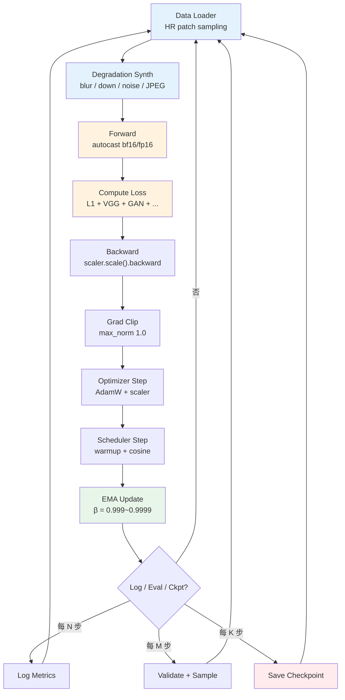
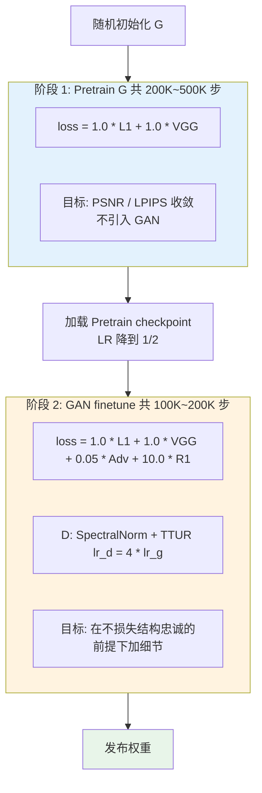
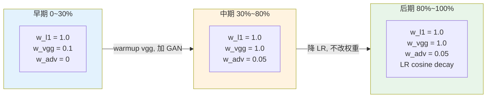

# 第 11 章 · 训练稳定性

> 前十章系统讨论了模型架构、损失函数与数据构建。
>
> 本章聚焦工程落地核心：如何将这些组件组装成稳健的训练流程。
>
> 相比分类或语言模型，影像增强模型的训练动态更为脆弱：多损失竞争、对抗博弈波动、扩散时间步调度失衡，任何一处配置失当都可能导致训练数天后模型发散或退化。

## 11.0 阅读须知

本章承接全书前面的理论与方法体系。第 1 至 2 章建立了问题定义，第 3 章梳理了损失函数，第 4 章分析了评估指标，第 5 章构建了数据退化模型，第 6 至 10 章则横跨了主流模型架构。将这些模块拼装成可运行的代码并不困难，真正的工程挑战在于保障训练**连续数天乃至数周保持稳定**，且产出的权重确实获得预期的性能增益。本章系统阐述低层视觉训练工程的实战经验。

假设读者已熟练掌握 PyTorch 基础训练循环（forward / backward / optimizer step / dataloader），但**未必具备低层视觉专项训练经验**。与图像分类或大语言模型相比，低层视觉的训练动态在四个维度存在本质差异：

- **密集的图像到图像映射**：优化目标不是将整图映射到离散标量，而是高维张量间的精细像素重构；
- **复杂的复合损失优化**：极少依赖单一损失函数，通常由 3 至 5 项相互制约的损失加权组合而成，权重配置微小失衡即可导致优化方向单向漂移；
- **动态博弈与多步采样**：对抗训练（GAN）涉及生成器与判别器的双向博弈，扩散模型（Diffusion）涉及全时间步加噪与去噪调度，优化曲面极其陡峭；
- **紧耦合的数据退化流水线**：为提升效率，在线退化合成通常部署在 GPU 端（见第 5 章），采样逻辑或概率分布的隐蔽缺陷会导致模型拟合了合成伪影，严重损害真实泛化能力。

**首次出现的缩写。** 为方便后续章节引用，本章涉及的关键缩写定义如下：

- **AMP**（Automatic Mixed Precision，自动混合精度）：前向传播与反向传播采用 FP16/BF16 计算，权重副本与梯度累积保持 FP32 的混合精度训练范式
- **EMA**（Exponential Moving Average，指数移动平均）：在训练权重之外维护一份参数的滑动平均副本，推理与评测时使用 EMA 权重
- **GradAccum**（Gradient Accumulation，梯度累积）：累加若干 mini-batch 的梯度后再执行一次优化器步进，在有限显存下等效放大 batch size
- **TTUR**（Two Time-scale Update Rule，双时间尺度更新规则）：GAN 训练中为判别器和生成器分配差异化学习率的更新策略
- **R1**：对真实样本处判别器输出梯度施加 L2 正则惩罚的稳定化机制
- **FSDP**（Fully Sharded Data Parallel，完全分片数据并行）：将模型参数、梯度与优化器状态跨 GPU 分片的分布式训练技术
- **BPTT**（Backpropagation Through Time，随时间反向传播）：时序循环结构的训练算法，将序列展开后计算跨时间步梯度
- **OOM**（Out Of Memory）：GPU 显存耗尽引发的运行时中断
- **PSNR / LPIPS / FID**：第 4 章已定义，本章直接沿用

读完本章，你应当能够掌握：面对新的低层视觉网络架构时如何规范搭建训练骨架；训练中途出现数值发散或模式坍塌时如何系统排查定位；GAN 对抗训练收敛困难时的标准稳定化策略；扩散模型从头预训练与微调阶段的超参数配置原则；以及混合精度（AMP）与指数移动平均（EMA）在不同场景下的最佳实践。

## 11.1 为什么训练稳定性是大问题

大语言模型训练通常依赖单一的交叉熵损失（Cross-Entropy），优化动态较为清晰：在模型参数量、数据规模与学习率匹配的前提下，损失值往往能够平稳收敛。低层视觉增强模型则截然不同：

- **多目标损失冲突**：L1 像素损失、VGG 感知损失、对抗损失以及特定频域约束协同优化。任何一项损失权重的失衡都会导致模型走向极端的局部最优，例如追求高 PSNR 但纹理模糊，或画面边缘锐化但客观指标崩塌；
- **对抗训练的不稳定性**：判别器（D）与生成器（G）处于动态零和博弈中。判别器过强会导致梯度消失，判别器过弱则无法提供有效的细节指导信号；
- **扩散训练的时序敏感性**：时间步采样策略、信噪比损失加权（如 Min-SNR）以及 EMA 衰减系数密切交织，任一环节配置不当均会导致最终生成分布偏离，拉低图像质量；
- **退化流水线的隐蔽误差**：退化合成逻辑（见第 5 章）通常包含数十个随机超参数，若某项退化参数的分布设置出现偏差，训练过程并不会直接报错崩溃，而是表现为模型在真实输入上泛化失效。

本章将低层视觉工程中的高频缺陷提炼为规范化指引。建议将本章作为工程速查手册：搭建项目初期参照 11.2 的标准骨架，调优超参数时查阅 11.3 至 11.8，遇到异常波动时检索 11.15 的故障诊断表。

## 11.2 训练 anatomy：基础组件

一个标准增强模型的训练主循环包含以下核心组件：

```python
# 抽象骨架
optimizer = build_optimizer(model)
scheduler = build_scheduler(optimizer)
scaler = torch.cuda.amp.GradScaler()                # AMP
ema = EMA(model, decay=0.999)                       # 指数移动平均

for step, batch in enumerate(train_loader):
    # 1. 预热 (warmup)
    if step < warmup_steps:
        adjust_lr_for_warmup(optimizer, step, warmup_steps)

    # 2. 前向 (with AMP)
    with torch.cuda.amp.autocast():
        loss = compute_loss(model, batch)

    # 3. 反传
    scaler.scale(loss).backward()

    # 4. 梯度裁剪
    scaler.unscale_(optimizer)
    torch.nn.utils.clip_grad_norm_(model.parameters(), max_norm=1.0)

    # 5. 优化器步进
    scaler.step(optimizer)
    scaler.update()
    optimizer.zero_grad()

    # 6. 学习率调度
    scheduler.step()

    # 7. EMA 更新
    ema.update(model)

    # 8. 监控
    if step % log_interval == 0:
        log_metrics(...)
    if step % eval_interval == 0:
        evaluate(...)
    if step % save_interval == 0:
        save_checkpoint(...)
```

将上述八个步骤绘制为数据流图，可以清晰展现各组件之间的执行依赖。后续各节将逐一解构图中的具体决策细节：



数据流中有两处关键工程细节值得关注：其一，**退化合成模块（B）在 GPU 端与 CPU DataLoader（A）端的部署权衡**。CPU 端合成开发灵活且便于多进程并行，但高分辨率小 batch 场景下 PCIe 传输带宽易成为整体瓶颈；GPU 端合成直接规避主机到设备传输延迟且便于微分操作，但需占用显卡显存与计算核心。例如 Real-ESRGAN 官方实现即采用了 GPU 端合成方案。其二，**EMA 更新（I）必须严格位于优化器 step 之后**，且 EMA 副本参数全程脱离计算图，仅在验证阶段与权重持久化时被读取。

## 11.3 优化器选择

| 优化器 | 适用场景与工程特性 |
|-------|------------------|
| **Adam** | 经典基准，泛化表现稳健 |
| **AdamW** | 解耦权重衰减（Decoupled Weight Decay），**增强任务默认推荐** |
| **Lion** | 仅依赖一阶动量符号更新，显存占用更低，收敛质量贴近 AdamW |
| **Adafactor** | 省略二阶矩存储，适合超大参数量模型显存受限场景 |
| **SGD + momentum** | 低层视觉任务不推荐（收敛迟缓，对学习率极其敏感） |

**通用推荐基准配置**：

```python
optimizer = torch.optim.AdamW(
    model.parameters(),
    lr=2e-4,                      # SR/去噪经验值
    betas=(0.9, 0.99),            # 0.99 而不是 0.999, 更稳
    weight_decay=0.01,
    eps=1e-8,
)
```

常用架构的学习率基准：

- **CNN 系列（EDSR / NAFNet）**：$2 \times 10^{-4}$
- **Transformer 系列（SwinIR / Restormer）**：$2 \times 10^{-4}$，必须配合 Warmup
- **GAN 微调阶段**：生成器 G 设为 $10^{-4}$，判别器 D 设为 $4 \times 10^{-4}$（TTUR，见 11.10 节）
- **扩散模型从头训练**：$10^{-4}$
- **扩散模型微调**：$10^{-5}$ 至 $5 \times 10^{-6}$
- **ControlNet 结构微调**：$10^{-5}$

上述取值源自大量 SOTA 论文与成熟开源库收敛后的经验共识区间，其前提设定为 batch size 处于 16 至 32、总训练步数处于 200K 至 1M 且搭配 AdamW 与余弦退火。若调整批量大小或迭代周期，需遵循 11.5 节给出的缩放准则。

参数 `betas=(0.9, 0.99)` 的设置具有明确的工程意义。PyTorch 原生 Adam 默认 $\beta_2 = 0.999$，对应较长的二阶矩滑动估计窗口，适合单目标凸优化（如分类任务）；但在低层视觉的多损失与对抗训练中，损失曲面曲率剧烈起伏，过长的历史窗口会导致二阶矩估计滞后于瞬时梯度变化，在训练后期容易诱发损失突刺。将 $\beta_2$ 调至 $0.99$ 可以加快二阶矩对梯度变化的响应速度，显著提高复杂曲面下的数值稳定性。

## 11.4 学习率调度

### Linear Warmup

训练初期将学习率从接近零线性爬升至目标峰值。在 Transformer 与扩散模型训练中属于**必备组件**，可防止初始化权重产生的大梯度在初期破坏参数结构：

```python
def linear_warmup(step: int, warmup_steps: int, target_lr: float) -> float:
    if step >= warmup_steps:
        return target_lr
    return target_lr * (step + 1) / warmup_steps
```

预热步数推荐范围：

- 占总迭代步数的 **1% 至 5%**
- 大规模扩散模型：5,000 至 10,000 步
- 小型 CNN 超分网络：500 至 1,000 步

### Cosine Decay

完成 Warmup 后，通过余弦曲线将学习率平滑衰减至终止值（通常设为峰值的 1% 至 10%）：

$$
\eta_t = \eta_{\min} + \frac{1}{2} (\eta_{\max} - \eta_{\min}) \left( 1 + \cos\left( \frac{t}{T} \pi \right) \right)
$$

```python
import torch.optim.lr_scheduler as sched

# Warmup + cosine
scheduler = sched.SequentialLR(
    optimizer,
    schedulers=[
        sched.LinearLR(optimizer, start_factor=0.001, end_factor=1.0,
                       total_iters=warmup_steps),
        sched.CosineAnnealingLR(optimizer, T_max=total_steps - warmup_steps,
                                eta_min=target_lr * 0.01),
    ],
    milestones=[warmup_steps],
)
```

### Multi-Step Decay（经典超分常用）

ESRGAN 与 Real-ESRGAN 常采用阶梯式阶段衰减策略：

```python
scheduler = sched.MultiStepLR(
    optimizer,
    milestones=[200_000, 400_000, 600_000, 800_000],   # 训 1M 步
    gamma=0.5,                                          # 每次 LR×0.5
)
```

### Cosine Restart

在长期训练阶段周期性将学习率重置至较高峰值，辅助模型逃离局部鞍点：

```python
scheduler = sched.CosineAnnealingWarmRestarts(
    optimizer, T_0=100_000, T_mult=1, eta_min=1e-6
)
```

工程经验：在长周期扩散模型训练中，余弦重启能够持续促进细节质量的微调提升。

## 11.5 Batch Size 与 Patch Size

低层视觉模型在训练时**极少直接输入全图**，通常基于裁剪后的 Patch（局部图像块）进行优化。

### Patch Sampling 的标准流程

1. 从原始 HR（高分辨率）图像中随机选取空间坐标，裁剪出固定尺寸的局部区域（典型尺寸为 $256 \times 256$ 或 $128 \times 128$）；
2. 调用退化合成流水线（见第 5 章），对 HR Patch 执行下采样、模糊与加噪，生成对应的 LR Patch；
3. 将多个 Patch 打包为一个 Batch 输入网络计算。

代码实现示例：

```python
class PatchSampler:
    def __init__(self, hr_size: int = 256, scale: int = 4):
        self.hr_size = hr_size
        self.lr_size = hr_size // scale

    def __call__(self, hr_image: torch.Tensor) -> tuple[torch.Tensor, torch.Tensor]:
        H, W = hr_image.shape[-2:]
        # 随机左上角
        top  = random.randint(0, H - self.hr_size)
        left = random.randint(0, W - self.hr_size)
        hr_patch = hr_image[..., top:top+self.hr_size, left:left+self.hr_size]
        # 退化合成在这里调用
        lr_patch = self.degrade(hr_patch)
        return lr_patch, hr_patch
```

### 采用 Patch 训练的核心考量

1. **显存限制**：单张 $2048 \times 2048$ 的 3 通道 FP32 图像占用约 50MB 内存，叠加 Batch 维度与网络深层激活后，单卡显存无法支撑直接全图反向传播；
2. **数据多样性**：随机裁剪充当了隐式的空间增强，使网络在不同 Epoch 中覆盖多样化的局部纹理组合；
3. **计算效率**：在固定 GPU 算力开销下，Patch 化能够以更大的 Batch Size 遍历更多场景样本；
4. **张量对齐**：原始数据集中图像尺寸各异，裁剪为固定 Patch 能保证 DataLoader 高效批处理堆叠。

### Patch 尺寸与有效感受野的匹配

Patch 尺寸的选择受制于模型的有效感受野（Effective Receptive Field）。若模型有效感受野为 $R \times R$，训练 Patch 尺寸原则上必须满足 $\text{Patch Size} \geq R$。否则，网络在 Patch 边缘区域无法获取完整的上下文先验，导致梯度估计失准。各任务经验推荐值如下：

| 任务 | 推荐 HR Patch 尺寸 | 设计考量 |
|------|------------------|----------|
| 4× 超分（SR） | 256 | 对应 LR 为 64×64，兼顾局部纹理与计算开销 |
| 8× 超分（SR） | 384 | 对应 LR 为 48×48，需提供更大的空间上下文支撑恢复 |
| 图像去噪 | 128 至 192 | 局部高频纹理已足够统计降噪 |
| 图像去模糊 | 256 至 384 | 需完整覆盖大尺度运动模糊核的空间展宽 |
| 扩散模型增强 | 512 | 与预训练扩散基座（如 SD 系列）的分辨率先验对齐 |

去模糊任务对 Patch 尺寸的要求最为明显：若模糊核半径达到 30 像素，Patch 边长至少需大于 60 像素才能完整包含点扩散函数的双侧轨迹，否则网络将拟合出有偏的反卷积核。对于 SwinIR 等基于局部窗口注意力的架构，窗口尺寸（如 8×8）同样构成了 Patch 的下限约束。

### 等效 Batch Size 与梯度累积

在分布式多卡训练中，等效 Batch Size 计算公式如下：

```
effective_batch_size = num_patches_per_image × image_batch × gradient_accumulation × num_gpus
```

**梯度累积（GradAccum）** 是一种时间换显存的标准技术：连续执行 $N$ 次前向与反向传播，将计算所得梯度累加于参数缓存中，在第 $N$ 步时统一执行参数更新与梯度清零。该机制在显存开销仅略微增加的前提下，数学上等价于将 Batch Size 放大了 $N$ 倍：

```python
accum_steps = 4   # 等效 batch 放大 4 倍

for step, batch in enumerate(loader):
    with torch.cuda.amp.autocast():
        loss = compute_loss(model, batch) / accum_steps   # 关键: 损失要除以 accum

    scaler.scale(loss).backward()

    if (step + 1) % accum_steps == 0:
        scaler.unscale_(optimizer)
        torch.nn.utils.clip_grad_norm_(model.parameters(), 1.0)
        scaler.step(optimizer)
        scaler.update()
        optimizer.zero_grad()
```

实现细节提示：损失值必须预先除以 `accum_steps`，否则梯度累加后等效于将学习率放大了 $N$ 倍；梯度裁剪必须置于最后一次 backward 之后、optimizer step 之前执行，确保对完整的累积梯度向量进行范数缩放。

基准硬件配置示例：

- 单卡 A100 训练 CNN 超分：8 图像 × 1 Patch × 1 步累积 = 8
- 4 卡 A100 训练扩散超分：16 图像 × 1 Patch × 2 步累积 × 4 卡 = 128

### 批量扩增时的学习率缩放准则

调整 Batch Size 时的常规参考规则包括平方根缩放（$\text{Batch} \times 2 \implies \text{LR} \times \sqrt{2}$）与线性缩放（$\text{Batch} \times 2 \implies \text{LR} \times 2$）。鉴于低层视觉对优化步长较为敏感，工程上建议以基线配置运行 5,000 步实测收敛斜率，再决定学习率的缩放系数，避免盲目线性放大导致发散。

## 11.6 梯度裁剪

梯度裁剪（Gradient Clipping）是抑制复合损失与对抗训练中梯度突发爆炸的标准防护手段：

```python
torch.nn.utils.clip_grad_norm_(
    model.parameters(),
    max_norm=1.0,    # 增强任务经验值
)
```

各架构 `max_norm` 推荐值：

- CNN 系列：1.0 至 5.0
- Transformer 系列：1.0
- 对抗判别器/生成器：0.5（更严格的边界约束）
- 扩散模型：1.0

## 11.7 指数移动平均（EMA）

**EMA（Exponential Moving Average）** 维护模型参数在时间维度的指数滑动平均。优化过程中参数每一步都会受到当前 Mini-batch 梯度的随机扰动；EMA 权重相当于对历史更新轨迹进行低通滤波，能够有效过滤高频振荡，收敛于更为平坦的损失盆地中心。

数学定义：

$$
\theta_{\text{EMA}}^{(t)} = \beta \cdot \theta_{\text{EMA}}^{(t-1)} + (1-\beta) \cdot \theta^{(t)}
$$

```python
class EMA:
    def __init__(self, model, decay=0.999):
        self.decay = decay
        self.shadow = {n: p.clone().detach() for n, p in model.named_parameters()}

    @torch.no_grad()
    def update(self, model):
        for n, p in model.named_parameters():
            if p.requires_grad:
                self.shadow[n].mul_(self.decay).add_(p.detach(), alpha=1 - self.decay)

    def apply_to(self, model):
        for n, p in model.named_parameters():
            p.data.copy_(self.shadow[n])

    def state_dict(self):
        return {'decay': self.decay, 'shadow': self.shadow}

    def load_state_dict(self, state):
        self.decay = state['decay']
        self.shadow = state['shadow']
```

衰减因子 $\beta$ 配置经验：

- CNN 超分：0.999（非必须，通常可带来 0.05 至 0.1 dB 的稳定提升）
- GAN 微调：0.999（消除生成器输出的帧间高频抖动）
- 扩散模型：**0.9999** 或 **0.99995**（标准标配）

EMA 在扩散模型训练中具有决定性作用。直接使用训练权重的 FID 指标通常显著落后于 EMA 权重版本。原因在于扩散模型每一步均在随机采样的不同时间步上回归噪声，瞬时梯度方差极大；EMA 能够跨时间步平滑参数轨迹，获得对全时间步兼具泛化能力的参数集合。

衰减因子 $\beta$ 对应的等效滑动窗口长度约为 $1 / (1 - \beta)$ 步。$\beta = 0.999$ 对应约 1,000 步滑动历史，$\beta = 0.9999$ 对应约 10,000 步。扩散模型通常需要迭代数十万步，采用 0.9999 以上的衰减率方能保留长期平滑效果并过滤前期过渡状态。

工程落地细节：

- EMA 参数必须独立序列化保存，不得覆盖主训练权重；训练中断恢复时需从主优化权重恢复，而非 EMA 副本；
- BatchNorm 层的统计量（`running_mean` 与 `running_var`）若需纳入 EMA，可参考 `timm` 库中的 `ModelEmaV2` 实现；
- 验证评估阶段切换至 EMA 权重，验证结束后切回原始训练权重。

## 11.8 自动混合精度（AMP）

**AMP（Automatic Mixed Precision）** 的核心机制是在前向计算与反向传播中使用低精度浮点数（FP16 或 BF16）以削减显存占用并激活 Tensor Core 硬件加速，同时在主权重存储与梯度累加环节保留 FP32 精度以维护数值稳定性。该技术可在 NVIDIA Volta 架构及后续 GPU 上节约 40% 至 50% 显存，并带来 1.5 至 2 倍的吞吐加速。

```python
scaler = torch.cuda.amp.GradScaler()

for batch in loader:
    optimizer.zero_grad()

    with torch.cuda.amp.autocast(dtype=torch.bfloat16):  # 或 torch.float16
        loss = compute_loss(model, batch)

    scaler.scale(loss).backward()
    scaler.unscale_(optimizer)
    torch.nn.utils.clip_grad_norm_(model.parameters(), 1.0)
    scaler.step(optimizer)
    scaler.update()
```

### FP16 与 BF16 对比

| 维度 | FP16 | BF16 |
|------|------|------|
| 指数位 / 尾数位 | 5 bit 指数 / 10 bit 尾数 | 8 bit 指数 / 7 bit 尾数 |
| 动态范围 | 窄（易发生下溢与上溢） | 宽（与 FP32 动态范围完全一致） |
| 相对精度 | 高（尾数保留更多有效位） | 低（尾数较短） |
| 硬件支持 | V100, A100, H100 等 | A100, H100 及后续架构 |
| 推荐等级 | 仅限旧代硬件 | **Ampere 架构及以后首选默认** |

在低层视觉任务中，BF16 显著优于 FP16。BF16 与 FP32 共享 8 位的指数宽度，在进行复合损失加权或大尺度激活累加时几乎不会触发数值溢出，因而无需 `GradScaler` 动态缩放。低层视觉的损失项（如对抗损失与像素级 L1）数值量级跨度可达数个数量级，FP16 的频繁溢出问题远比 BF16 的尾数精度损耗更加危险。

### 需规避低精度的敏感层

- **VAE 编解码器（Encoder/Decoder）**：扩散模型中的预训练 VAE 模块严禁使用 FP16。SD/SDXL 的 VAE 在 FP16 精度下极易在残差块累加时上溢导致全黑输出；必须强制保持 FP32 或安全的 BF16；
- **Softmax 归一化**：Transformer 注意力矩阵中的 Softmax 计算需在 FP32 下执行以防数值下溢；
- **复合损失计算**：多损失加权计算建议在 FP32 精度下完成。

## 11.9 对抗训练异常诊断

生成对抗网络（GAN）在低层视觉训练中极易出现收敛异常，常见故障模式及应对策略如下：

### 症状 1：模式坍塌（Mode Collapse）

表现为生成器对不同 LR 输入均输出高度相似的纹理模式。

排查策略：
- 固定一组测试样本，监控生成器输出的多样性变化；
- 检查判别器损失：若判别器损失接近 0（$< 0.01$），表明判别器能力完全压制生成器，生成器梯度饱和无法更新。

### 症状 2：判别器过度压制

```
D_loss → 0
G_loss 无法收敛且持续剧烈抖动
```

处理方案：
- 降低判别器学习率（保持生成器学习率不变）；
- 为判别器引入谱归一化（Spectral Normalization）；
- 施加 R1 梯度惩罚；
- 降低判别器更新频率（例如每 2 步生成器更新对应 1 步判别器更新）。

### 症状 3：判别器学习不足

```
D_loss → 1 或持续震荡不收敛
G_loss 同样停滞
```

处理方案：
- 提高判别器学习率；
- 扩展判别器网络容量（加深网络或增加通道数）；
- 适度缩减生成器参数规模。

### 症状 4：数值发散（NaN）

```
Loss 突变为 NaN
```

处理方案：
- 监控并记录每一轮迭代的梯度范数（`grad_norm`）；
- 开启梯度裁剪并收紧阈值；
- 下调初始学习率；
- 校验数据读取流水线是否存在 `Inf` 或 `NaN` 坏点数据。

## 11.10 GAN 稳定化核心策略

### 谱归一化（Spectral Normalization）

通过约束判别器每一层权重矩阵的谱范数（最大奇异值），将其 Lipschitz 常数限制在 1 以内，防止判别器函数曲面过于陡峭：

```python
from torch.nn.utils import spectral_norm

class StableDiscriminator(nn.Module):
    def __init__(self, in_ch=3):
        super().__init__()
        self.layers = nn.Sequential(
            spectral_norm(nn.Conv2d(in_ch, 64, 4, stride=2, padding=1)),
            nn.LeakyReLU(0.2, inplace=True),
            spectral_norm(nn.Conv2d(64, 128, 4, stride=2, padding=1)),
            nn.LeakyReLU(0.2, inplace=True),
            # ...
            spectral_norm(nn.Conv2d(512, 1, 4, stride=1, padding=1)),
        )
```

工程经验：谱归一化已成为现代视觉 GAN 判别器的标配设计，能够系统性压制判别器过度拟合。

### R1 正则化（R1 Regularization）

针对真实数据分布处的判别器输出施加梯度惩罚，促使真实样本邻域内的梯度模长趋近于零：

$$
\mathcal{L}_{R_1} = \frac{\gamma}{2} \mathbb{E}_{x \sim p_{\text{data}}} \left[ ||\nabla_x D(x)||^2 \right]
$$

```python
def r1_penalty(d_real: torch.Tensor, real_imgs: torch.Tensor) -> torch.Tensor:
    grad = torch.autograd.grad(
        outputs=d_real.sum(),
        inputs=real_imgs,
        create_graph=True,
        only_inputs=True,
    )[0]
    return grad.flatten(1).pow(2).sum(1).mean() * 0.5
```

合并至判别器总损失：

```python
d_loss = d_loss_main + 10.0 * r1_penalty(d_real, real_imgs)
```

R1 正则可有效平抑判别器在真实流形附近的过度反应，缓解对抗训练失衡。

### 双时间尺度更新规则（TTUR）

**TTUR（Two Time-scale Update Rule）** 由 Heusel 等人于 2017 年提出。理论上，判别器需要在每一步更新后快速逼近当前生成器条件下的最优状态，才能为生成器提供准确的上升方向；但单步内过度迭代判别器又极易引发过拟合。TTUR 通过为判别器赋予更高的学习率（通常为生成器的 4 倍），使判别器在快速时间尺度上追踪分布漂移，生成器在慢速时间尺度上平稳更新。

```python
opt_g = AdamW(g.parameters(), lr=1e-4)
opt_d = AdamW(d.parameters(), lr=4e-4)   # 4× 学习率比例
```

将谱归一化、R1 正则化与 TTUR 三者结合，构成了低层视觉 GAN 训练的稳健基准组合。

## 11.11 两阶段训练法

低层视觉中的 GAN 优化标准范式为：**先单独训练生成器至像素级收敛，再引入对抗损失进行微调**。

### 阶段 1：生成器预训练（Pretrain G）

```python
# 仅使用像素重建损失与感知损失
loss = l1_loss + 1.0 * vgg_loss
# 优化至 PSNR 指标平稳
```

常规迭代周期：200,000 至 500,000 步。

### 阶段 2：对抗微调（GAN Finetune）

```python
# 引入低权重对抗损失 (0.005 至 0.1)
g_loss = l1_loss + 1.0 * vgg_loss + 0.05 * adv_loss
# 学习率降至预训练阶段的 1/2
```

常规迭代周期：100,000 至 200,000 步。

### 采用两阶段策略的技术动因

若从随机初始化直接进行端到端联合对抗训练：

1. 初始阶段判别器与生成器的梯度噪声极大，会破坏网络学习基础图像重构与色彩对齐的能力；
2. 在未建立基础空间映射前，过早施加对抗约束会导致生成器虚构不符合物理先验的高频杂乱纹理；
3. 多项异质损失的加权难以在初试阶段取得稳定平衡。

ESRGAN、Real-ESRGAN 及 BSRGAN 均采用两阶段训练方案。

训练流程与阶段参数演变图示如下：



参数来源说明：R1 正则系数 $\gamma = 10$ 源自 StyleGAN2（Karras 等人），而对抗损失权重 $0.05$ 源自 ESRGAN / Real-ESRGAN 系列的超分实验配置。两者虽然来源不同，但在低层视觉对抗微调中通常协同使用。

## 11.12 扩散模型训练的特殊性

### 时间步采样策略

均匀时间步采样（Uniform Sampling）是最基础的基准，但不同噪声尺度区间对网络收敛梯度的信息量存在差异：

```python
def importance_sampling_t(B, num_steps=1000):
    """非均匀时间步采样, 偏向中间区域。"""
    # 经验: t ∈ [200, 800] 对最终质量贡献最大
    weights = torch.ones(num_steps)
    weights[:200]  *= 0.5
    weights[800:]  *= 0.5
    weights = weights / weights.sum()
    return torch.multinomial(weights, B, replacement=True)
```

### Min-SNR 损失加权（复习第 3 章 3.6 节）

```python
def min_snr_weight(t, alphas_cumprod, gamma=5.0):
    """Min-SNR 加权 (Hang et al. 2023), 部分扩散训练采用, 非 SDXL 官方配置。"""
    snr = alphas_cumprod[t] / (1 - alphas_cumprod[t])
    return torch.minimum(snr, torch.full_like(snr, gamma)) / snr
```

应用至训练损失：

```python
loss = (min_snr_weight(t, alphas_cumprod).view(-1, 1, 1, 1) *
        (pred_noise - true_noise) ** 2).mean()
```

### v-prediction 与 eps-prediction 选型

第 3 章 3.6 节已对预测目标完成数学推导。工程选型建议：

- **从零构建新训练**：推荐选用 v-prediction，在高噪声区间具有更好的数值稳定性；
- **基于 SD 1.5 权重微调**：必须严格保留原始的 eps-prediction 参数化形式；
- **基于 SD 2.x 的 768-v 模型微调**：采用 v-prediction。注意 SDXL base 与 SDXL refiner 均采用 eps-prediction，不可混淆。

### 流匹配（Flow Matching / Rectified Flow）目标

上述 eps / v-prediction 与 DDPM 的离散加噪调度属于 SD 1.5 至 SDXL 阶段的标准配置。在 SD3 与 Flux 架构中，训练目标已全面演进为流匹配（Flow Matching / Rectified Flow）。

流匹配不再将学习目标定义为预测离散噪声 $\epsilon$ 或速度矢量 $v$，而是在真实数据分布 $x_0$ 与标准高斯噪声 $x_1$ 之间构造线性插值轨迹 $x_t = (1-t)\,x_0 + t\,x_1$，驱动神经网络回归该轨迹切线方向的速度场。对于直线路径，目标切线速度为常数矢量 $x_1 - x_0$，对应优化目标函数如下：

$$
\mathcal{L}_{\text{FM}} = \mathbb{E}_{t,\,x_0,\,x_1}\big\|\,v_\theta(x_t, t) - (x_1 - x_0)\,\big\|^2
$$

流匹配与传统的 eps-prediction 在数学上可互相转换，但存在两项关键工程差异：首先，时间变量被参数化为连续区间的 $t \in [0, 1]$，采样调度摆脱了离散时间步索引，如 SD3 采用 Logit-Normal 分布将训练注意力集中于中段轨迹；其次，此前针对 DDPM 设计的 Min-SNR 等损失加权策略不再适用。直线路径下的流匹配在均匀或 Logit-Normal 时间采样下，各时间点的目标梯度量级已高度自平衡，无需再显式乘上 SNR 加权项，而是直接依靠时间采样分布本身实现隐式重要性调节。

### 分布式参数分片（FSDP）

对于 SDXL UNet 等参数量达 2.6B 规模的网络，单卡显存无法容纳完整优化状态，需启用 FSDP（Fully Sharded Data Parallel）：

```python
from torch.distributed.fsdp import FullyShardedDataParallel as FSDP
from torch.distributed.fsdp.wrap import transformer_auto_wrap_policy

model = FSDP(
    unet,
    auto_wrap_policy=partial(
        transformer_auto_wrap_policy,
        transformer_layer_cls={UNetBlock},
    ),
    mixed_precision=MixedPrecision(
        param_dtype=torch.bfloat16,
        reduce_dtype=torch.bfloat16,
        buffer_dtype=torch.bfloat16,
    ),
)
```

## 11.13 混合损失权重配置

### 基准配置参考

参考第 3 章 3.10 节决策表，建议**直接采用成熟开源模型的验证配比**作为调优基线：

```python
# Real-ESRGAN 风格超分
loss = l1 + 1.0 * vgg + 0.1 * adv

# Restormer 风格去噪 (原文采用单一 Charbonnier 损失)
loss = charb

# SUPIR 风格扩散增强 (latent_lpips 与 clip 项为示意配比, 依具体实现而定)
loss = simple_loss + 0.1 * latent_lpips + 0.01 * clip
```

Restormer 原论文去噪任务仅依赖单一的 Charbonnier 损失（L1 的平滑变体），未引入频域或全变分正则项；上述 SUPIR 配置展示了扩散模型与感知约束协同优化的通用权重范式。

### 启发式权重微调顺序

若初始权重组合在特定数据集上表现欠佳，建议遵循以下排查流程：

1. **观察主重建损失（像素 L1 或扩散预测损失）是否平稳收敛**；
2. 若主损失停滞或发散，将主损失权重设为 1.0，并将所有辅助感知/对抗损失权重缩减至 1/10；
3. 待主损失收敛平稳后，**单变量依次递增**辅助损失权重，评估指标变化；
4. 严禁在同一次实验中并发修改两项及以上损失的权重。

### 自适应梯度平衡（GradNorm）

对于多任务或强异质损失，可采用 GradNorm 动态平衡各分支梯度模长：

```python
def gradnorm_step(losses: dict, weights: dict, alpha=0.12):
    """简化的 GradNorm: 引导各任务归一化梯度模长趋向均值。"""
    grads = {}
    for name, loss in losses.items():
        grads[name] = torch.autograd.grad(
            loss * weights[name], 
            shared_params(),                # 共享层的参数
            retain_graph=True,
        )[0].norm()

    avg_grad = sum(grads.values()) / len(grads)

    # 动态调节 weights, 使各分支 grad 趋近 avg
    for name in weights:
        ratio = (grads[name] / avg_grad) ** alpha
        weights[name] = weights[name] / ratio  # 梯度过大项削减权重
```

工程经验：GradNorm 适用于梯度尺度差异极大的复杂多任务场景，常规单任务增强模型推荐优先采用静态经验权重。

## 11.14 训练过程监控

每个 Step 需记录的底层指标：

```python
# 每 50 步记录
log_dict = {
    # 损失项
    'loss/total': loss.item(),
    'loss/l1':    l1_loss.item(),
    'loss/vgg':   vgg_loss.item(),
    'loss/adv':   adv_loss.item(),

    # 梯度健康度
    'grad/total_norm': grad_norm.item(),

    # 学习率
    'lr/g': optimizer_g.param_groups[0]['lr'],
    'lr/d': optimizer_d.param_groups[0]['lr'],
}
```

每隔固定 Epoch 在验证集上执行指标评估与视觉采样：

```python
# 验证集客观指标评估
metrics = run_validation(model_ema, val_loader)
log_dict.update({
    'val/psnr':  metrics['psnr'],
    'val/lpips': metrics['lpips'],
    'val/dists': metrics['dists'],
})

# 视觉对比采样 (固定测试 batch)
sample_outputs = generate_samples(model_ema, fixed_lr_batch)
log_image_grid(sample_outputs, step=step)
```

### 核心监控曲线特征

1. **总损失轨迹**：整体保持平稳单调下降趋势；
2. **各子损失相对量级**：避免某一分支损失的数值量级完全覆盖其他项；
3. **验证集 PSNR / SSIM**：确认像素重建能力处于上升区间；
4. **验证集 LPIPS**：监控高频感知质量是否改善；
5. **对抗损失动态**：判别器与生成器损失应呈现动态小幅震荡，而非单边坍缩；
6. **梯度范数（`grad_norm`）**：监控是否存在突发性梯度激增。

### 视觉采样的重要性

部分生成缺陷无法直接反映在客观标量上：

- 全局或局部色调漂移（客观指标可能完全正常）；
- 局部高频网格伪影（平均指标被大面积平坦区域稀释）；
- 结构性幻觉失真（PSNR 提升但微观语义破损）。

因此，**每隔固定步数对一组固定测试图执行推理并持久化为网格图（Image Grid）**，是评判训练质量的核心手段。

## 11.15 常见训练故障排查表

| 异常现象 | 潜在触发诱因 | 标准排查步骤 |
|---------|------------|-------------|
| Loss 变为 NaN | 梯度数值爆炸 / FP16 下溢上溢 | 监控 `grad_norm`，全面切换至 BF16，开启梯度裁剪 |
| Loss 停滞不下降 | 学习率过大或过小 / 数据输入全零 | 在单一 Batch 上执行过拟合测试验证收敛性 |
| 训练 Loss 下降但验证指标停滞 | 网络过拟合 / 正则化不足 | 引入 Dropout、降低模型容量、扩充退化参数扰动范围 |
| 验证指标完全不波动 | 数据集分布单一 / 退化过于简单 | 增加数据退化流水线的多样性与随机区间 |
| 模型输出全黑或全白 | 张量归一化范围不匹配（`[-1, 1]` 与 `[0, 1]` 混淆）| 检查 DataLoader 输出的数值区间分布 |
| 某个迭代点后指标骤降 | 学习率调度器（Scheduler）阶段配置错误 | 检查学习率曲线在断点处的取值 |
| GAN 判别器损失持续为 0 | 判别器完全压制生成器 | 引入谱归一化、追加 R1 惩罚并调小判别器学习率 |
| GAN 输出严重高频失真 | 生成器未经充分预训练 | 增加第一阶段生成器预训练步数 |
| 单 Epoch 耗时异常缓慢 | 数据加载与 CPU 退化计算形成瓶颈 | 增加 `num_workers`，采用 LMDB 格式存储或迁移至 GPU 合成 |

## 11.15.5 动态损失调度策略

在训练周期内采用固定损失权重容易引发次优问题，不同收敛阶段对各项损失的侧重应当动态调整：

- **前期阶段（0% 至 30%）**：网络学习基础结构与色彩对齐，需赋予像素重建损失主导权重，感知损失维持较低比例；
- **中期阶段（30% 至 80%）**：基础轮廓收敛，逐步提升感知损失与对抗损失比重，引导网络补充高频真实纹理；
- **后期阶段（80% 至 100%）**：损失权重锁定，依靠学习率余弦退火和 EMA 权重进行细粒度参数微调。

损失权重时序调度示意图如下：



分段权重函数实现示例：

```python
def get_loss_weights(step: int, total: int) -> dict:
    if step < total * 0.3:
        return {'l1': 1.0, 'vgg': 0.1, 'adv': 0.0}
    if step < total * 0.8:
        return {'l1': 1.0, 'vgg': 1.0, 'adv': 0.05}
    return {'l1': 1.0, 'vgg': 1.0, 'adv': 0.05}
```

更为平滑的实现是在分段点之间采用线性插值过渡，避免离散权重突变引发损失曲线出现阶跃。两阶段 GAN 训练本质上是该思想的经典特例。

## 11.16 Checkpoint 持久化与断点续训

### 状态字典持久化规范

```python
def save_checkpoint(path, step, model, optimizer, scheduler, ema, scaler):
    torch.save({
        'step': step,
        'model':     model.state_dict(),
        'optimizer': optimizer.state_dict(),
        'scheduler': scheduler.state_dict(),
        'ema':       ema.state_dict(),
        'scaler':    scaler.state_dict(),
    }, path)


def load_checkpoint(path, model, optimizer, scheduler, ema, scaler):
    ckpt = torch.load(path, map_location='cpu')
    model.load_state_dict(ckpt['model'])
    optimizer.load_state_dict(ckpt['optimizer'])
    scheduler.load_state_dict(ckpt['scheduler'])
    ema.load_state_dict(ckpt['ema'])
    scaler.load_state_dict(ckpt['scaler'])
    return ckpt['step']
```

### 保存频率规范

- 小型 CNN 超分网络：每 5,000 至 10,000 步；
- 大规模扩散模型：每 1,000 至 2,000 步；
- 存储保留策略：滚动保留最新 3 个检查点，另行归档验证集最佳指标检查点。

### 自动化断点恢复

```python
def auto_resume(ckpt_dir, model, optimizer, scheduler, ema, scaler):
    ckpts = sorted(glob(f'{ckpt_dir}/step_*.pt'))
    if ckpts:
        latest = ckpts[-1]
        print(f'Resuming from {latest}')
        return load_checkpoint(latest, model, optimizer, scheduler, ema, scaler)
    return 0
```

在长周期分布式训练中，完备的断点恢复机制是抵御硬件故障、抢占调度及网络异常的基础保障。

## 11.17 工程准则：基线验证与渐进迭代

### 渐进式验证流程

1. **验证基础推理链路**：选用权威开源模型与官方权重，确认本地环境推理精度与吞吐正常；
2. **小规模数据预运行**：选用 100 张样本构建迷你数据集，验证训练流水线各模块无语法及数据流阻塞；
3. **单 Batch 强制过拟合（Overfit Test）**：将训练数据缩减为单一 Batch（如 8 张图），迭代 1,000 步观察损失是否逼近零（PSNR 应超过 50 dB）。若无法过拟合，则表明网络定义或优化逻辑存在底层缺陷；
4. **全量数据展开**：单 Batch 验证通过后，方可切入全量数据进行正式训练。

### 单变量控制准则

- 明确基准性能：记录 Baseline 的详细数值指标与视觉采样结果；
- 严格单变量控制：每次实验仅变动单一超参数（如调整单一损失权重、优化器步长或退化范围）；
- 关联版本管理：所有训练实验需绑定 Git Commit ID 并完整记录至实验追踪平台（如 WandB 或 TensorBoard）。

### 分辨率递进策略

- 先在 $128 \times 128$ 小尺寸 Patch 上验证架构有效性；
- 确认收敛后提升至 $256 \times 256$ 展开标准训练；
- 最终微调阶段适配目标分辨率。

## 11.17.5 典型训练日志分析

一段健康的超分预训练与对抗微调日志样例如下：

```
[Stage 1: Pretrain G]
step 1000   | l1 0.0421 | vgg 0.7823 | psnr 24.31 | lr 2.0e-4 | grad 2.31
step 10000  | l1 0.0287 | vgg 0.6102 | psnr 27.84 | lr 2.0e-4 | grad 1.84
step 50000  | l1 0.0203 | vgg 0.4891 | psnr 29.12 | lr 1.8e-4 | grad 1.42
step 200000 | l1 0.0156 | vgg 0.3941 | psnr 30.08 | lr 1.2e-4 | grad 1.08
[switch to Stage 2: GAN finetune, lr_g=1e-4, lr_d=4e-4]
step 200100 | l1 0.0158 | vgg 0.3935 | adv 0.6932 | d 1.3867 | grad_g 1.21 | grad_d 0.89
step 210000 | l1 0.0162 | vgg 0.3811 | adv 0.5421 | d 1.0982 | grad_g 1.35 | grad_d 1.12
step 250000 | l1 0.0171 | vgg 0.3654 | adv 0.4823 | d 0.9712 | grad_g 1.41 | grad_d 1.08
step 300000 | l1 0.0179 | vgg 0.3589 | adv 0.4521 | d 0.9234 | grad_g 1.38 | grad_d 1.05
```

健康收敛特征分析：

- 阶段 1 中 L1 像素损失与 VGG 感知损失单调平稳下降，PSNR 稳步提升；
- 切换至阶段 2 后，L1 损失略微上升（约 10%）而 VGG 感知损失持续回落，表明模型重心由纯像素平均对齐转向高频感知纹理优化；
- 对抗损失 `adv` 维持在 0.4 至 0.7 之间动态波动，判别器损失 `d` 从理论均衡初始值 $2\ln 2 \approx 1.386$ 逐渐平缓过渡至 0.92 左右，未出现单边崩溃。此处判别器损失采用包含真实项与虚假项的 BCE 约定，理论平衡点为 $2\ln 2$；
- 各阶段梯度范数平稳维持在 2.0 以下，未出现突发性数值尖刺。

异常波动预警特征：

- 判别器损失骤降至 0.05 以下且无法反弹：判别器过度拟合压制生成器，需下调 `lr_d` 或增强 R1 正则；
- 生成器对抗损失突增至 5.0 以上或出现 NaN：生成器分布偏离正常流形，需回滚检查点；
- 阶段 2 中 L1 损失恶化超过 50%：表明对抗项权重配置过高，需将对抗权重从 0.05 下调至 0.01。

## 11.18 小结

1. **优化器组合**：AdamW + Cosine 衰减 + 线性 Warmup 构成低层视觉通用基准；
2. **EMA 机制**：扩散模型与高保真对抗生成必备，扩散模型推荐衰减率 $\geq 0.9999$；
3. **混合精度范式**：Ampere 架构及以后首选 BF16，彻底消除 FP16 动态范围溢出风险；
4. **对抗稳定三件套**：谱归一化 + R1 正则化 + TTUR 双时间尺度更新，严格遵守两阶段训练法；
5. **扩散训练规范**：采用时间步重要性采样与 Min-SNR 损失加权，注意流匹配与传统 DDPM 加权策略的差异；
6. **复合损失管理**：以经验基线为起点，遵循单变量调节原则；
7. **全维度监控体系**：标量损失轨迹、验证集客观指标与固定采样网格图协同观测；
8. **工程保障底线**：完备的 Checkpoint 序列化与自动化断点恢复机制；
9. **渐进迭代准则**：单 Batch 过拟合验证先行，严禁多变量并发修改。

---

> 下一章 [评估方法论](12-evaluation.md) 讨论主观评测协议（MOS、2AFC）、统计显著性检验与生产环境 A/B 测试方法论。
