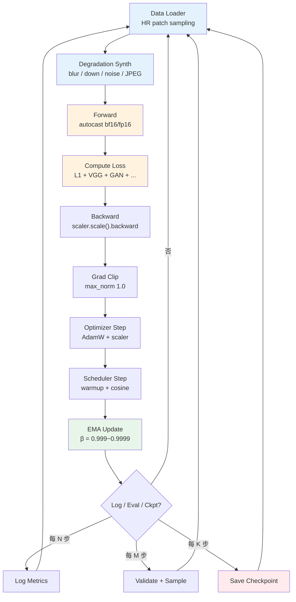
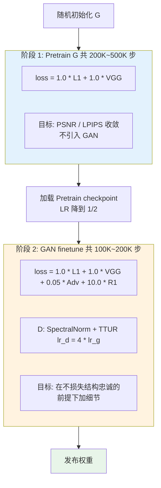
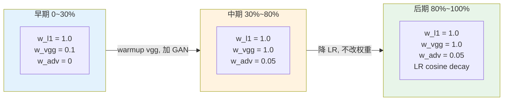

# 第 11 章 · 训练稳定性

> 前 10 章讲了"用什么模型、什么损失、什么数据"。
>
> 这一章讲"把它们组装起来训练，怎么训得稳"。
>
> 增强模型的训练比分类或语言模型更脆弱：多损失冲突、GAN 动态、扩散调度，每一个都能让你训三天之后发现是个崩的模型。

## 11.0 阅读须知

这一章站在前面所有章节之后的工程位置。第 1-2 章给出了问题定义，第 3 章给出了损失，第 4 章给出了指标，第 5 章给出了数据，第 6-10 章给出了模型与各种架构上的选择。把这些拼成一段能跑起来的训练代码并不难，难的是让它**连续训几天甚至几周不崩**，并且训完真的比上一版更好。这一章回答的就是这个"工程上跑得动"的问题。

预设读者能写常规 PyTorch 训练循环（forward / backward / optimizer step / dataloader），但**不一定专门做过低层视觉训练**。低层视觉训练在四个方面和分类或语言模型显著不同，每一条都会在后面章节展开：

- 输入与输出的尺寸成对：训的不是一个图像到一个标量，而是图像到图像
- 损失函数几乎从来不是单一的，而是 3-5 项加权和，权重失衡会让模型只优化其中一项
- 涉及 GAN 或扩散调度时，训练动力学是双方博弈或长时间步采样，比单一目标的优化困难一个数量级
- 数据 pipeline 通常在 GPU 上做退化合成（见第 5 章），一个采样 bug 可以让模型"看上去在学，其实在学合成 bug"

**首次出现的缩写。** 为方便后面章节直接引用，本章用到的缩写在此先列定义：

- **AMP**（Automatic Mixed Precision，自动混合精度）：训练时把前向与反传放到 FP16/BF16，权重与梯度累积保持 FP32 的训练范式
- **EMA**（Exponential Moving Average，指数移动平均）：在训练权重之外维护一份滑动平均权重，推理用 EMA 权重
- **GradAccum**（Gradient Accumulation，梯度累积）：把几个 mini-batch 的梯度加起来再走一次 optimizer step，等价放大 batch size
- **TTUR**（Two Time-scale Update Rule，双时间尺度更新规则）：GAN 训练里给判别器和生成器分配不同学习率
- **R1**：对真实样本上判别器梯度做 L2 惩罚的 GAN 正则化
- **FSDP**（Fully Sharded Data Parallel，完全分片数据并行）：把模型参数、梯度、优化器状态按 rank 分片的分布式训练范式
- **BPTT**（Backpropagation Through Time，按时间反传）：循环结构的训练方式，把整段序列展开再反传
- **OOM**（Out Of Memory）：GPU 显存超限崩溃
- **PSNR / LPIPS / FID**：第 4 章已定义，本章直接使用

读完这一章你应该能回答以下问题：给我一个新的低层视觉模型架构，我大概要怎么搭训练循环；训练中途出了某个症状，我从哪里开始查；GAN 训不动的时候有哪些标配技巧；扩散从零训和 finetune 应该用不同的超参吗；EMA 和 AMP 到底该不该开。

## 11.1 为什么训练稳定性是大问题

语言模型训练的损失函数通常是单一的 cross-entropy（交叉熵），训练动力学相对简单：模型规模上去、数据量上去、学习率合适，就能稳定下降。低层视觉的增强模型完全不同：

- **多损失混合**：L1 + VGG + GAN + 任务特化损失共同优化，任意一项的权重失衡都会让模型偏向某一种"好"，结果是 PSNR 高但视觉糊、或者视觉锐利但 PSNR 崩
- **GAN 训练**：判别器 D 和生成器 G 在动态博弈，一方过强就崩；这一点和图像生成里 GAN 的训练崩塌是同源的，区别只是增强里的 G 是有条件输入的
- **扩散训练**：时间步采样策略、loss weighting（如 Min-SNR）、EMA 缺一不可，少任意一项都会拉低最终质量几个 FID 点
- **数据 pipeline 复杂**：退化合成（第 5 章）一般在 GPU 上做，里面有十几个随机参数；任何一个分布写错都不会立刻表现为崩溃，而是表现为"模型在真实图上效果差"，等你发现的时候已经训了几天

这一章把工程上的踩坑归纳成可执行的清单。读这章的方式不是从头到尾通读，而是把它当 reference：搭训练时按 11.2 的骨架打底，调超参时翻 11.3-11.8，遇到症状时查 11.15 的诊断表。

## 11.2 训练 anatomy：基础组件

一个增强模型的训练循环包含：

```python
# 抽象骨架
optimizer = build_optimizer(model)
scheduler = build_scheduler(optimizer)
scaler = torch.cuda.amp.GradScaler()                # AMP
ema = EMA(model, decay=0.999)                       # 指数移动平均

for step, batch in enumerate(train_loader):
    # 1. 预热 (warmup)
    if step < warmup_steps:
        adjust_lr_for_warmup(optimizer, step, warmup_steps)

    # 2. 前向 (with AMP)
    with torch.cuda.amp.autocast():
        loss = compute_loss(model, batch)

    # 3. 反传
    scaler.scale(loss).backward()

    # 4. 梯度裁剪
    scaler.unscale_(optimizer)
    torch.nn.utils.clip_grad_norm_(model.parameters(), max_norm=1.0)

    # 5. 优化器步进
    scaler.step(optimizer)
    scaler.update()
    optimizer.zero_grad()

    # 6. 学习率调度
    scheduler.step()

    # 7. EMA 更新
    ema.update(model)

    # 8. 监控
    if step % log_interval == 0:
        log_metrics(...)
    if step % eval_interval == 0:
        evaluate(...)
    if step % save_interval == 0:
        save_checkpoint(...)
```

把这八步画成数据流图，能更清楚地看到每个组件之间的依赖关系。下面这张图也是后续每一节展开时心里的"全景图"：每节讲的就是某一步的细节决策。



读这张图有两个工程上反复出现的细节值得点出。第一，**退化合成（B）放在 GPU 上和 dataloader（A）放在 CPU 上是两种工程取舍**。CPU 合成简单、可以多进程并行，但 PCIe 带宽容易成为瓶颈；GPU 合成省传输、退化函数可微，但占模型训练的算力，需要小心安排显存。Real-ESRGAN 官方实现选了 GPU 合成。第二，**EMA 更新（I）必须放在 optimizer step 之后**，而且 EMA 权重不参与训练梯度，只在 validation 和保存 checkpoint 时被读到。

下面逐项展开。

## 11.3 优化器选择

| 优化器 | 何时用 |
|-------|------|
| **Adam** | 经典选择，稳 |
| **AdamW** | 加了 decoupled weight decay，**默认推荐** |
| **Lion** | 2023 新优化器，省显存（只需要 momentum），效果接近 AdamW |
| **Adafactor** | 大模型节省显存（不存二阶矩） |
| **SGD + momentum** | 不推荐用于增强（收敛慢，超参敏感） |

**起点配置**（增强任务通用）：

```python
optimizer = torch.optim.AdamW(
    model.parameters(),
    lr=2e-4,                      # SR/去噪经验值
    betas=(0.9, 0.99),            # 0.99 而不是 0.999, 更稳
    weight_decay=0.01,
    eps=1e-8,
)
```

学习率经验：

- **CNN（EDSR/NAFNet）**：$2 \times 10^{-4}$
- **Transformer（SwinIR/Restormer）**：$2 \times 10^{-4}$，warmup 必须
- **GAN finetune**：$10^{-4}$ 给 G，$10^{-4} \times 4 = 4 \times 10^{-4}$ 给 D（TTUR，见 11.10 节）
- **扩散从头训**：$10^{-4}$
- **扩散 finetune**：$10^{-5}$ 到 $5 \times 10^{-6}$
- **ControlNet 训练**：$10^{-5}$

这一组数字不是凭空猜的，是大量 SOTA 论文与开源代码库收敛后的"共识值"。它们对应的隐含假设是 batch size 在 16-32 之间、训练步数在 200K-1M 之间、AdamW + cosine。换 batch 或换 schedule 时需要按 11.5 节的缩放规则调整。

`betas=(0.9, 0.99)` 这一对值得多说一句。原生 Adam 默认的 $\beta_2 = 0.999$ 让二阶矩估计窗口非常长，对单峰目标（如分类）很合适；但低层视觉的损失曲面更崎岖（GAN 项、感知项一起作用），太长的窗口会让 Adam 的步长更新滞后于真实梯度，表现为训练后期出现莫名其妙的小尖峰。把 $\beta_2$ 降到 $0.99$ 让二阶矩响应快一点，是这个领域的经验做法。

## 11.4 学习率调度

### Linear Warmup

训练前期 LR 从 0 线性涨到目标值。**必须**在 Transformer 和扩散训练里用，否则前几步可能直接发散。

```python
def linear_warmup(step: int, warmup_steps: int, target_lr: float) -> float:
    if step >= warmup_steps:
        return target_lr
    return target_lr * (step + 1) / warmup_steps
```

warmup_steps 经验值：

- 总训练步数的 **1-5%**
- 大模型（扩散）：5000-10000 步
- 小模型（CNN SR）：500-1000 步

### Cosine Decay

warmup 后用 cosine 把 LR 降到最终值（通常 LR 的 1-10%）：

$$
\eta_t = \eta_{\min} + \frac{1}{2} (\eta_{\max} - \eta_{\min}) \left( 1 + \cos\left( \frac{t}{T} \pi \right) \right)
$$

```python
import torch.optim.lr_scheduler as sched

# Warmup + cosine
scheduler = sched.SequentialLR(
    optimizer,
    schedulers=[
        sched.LinearLR(optimizer, start_factor=0.001, end_factor=1.0,
                       total_iters=warmup_steps),
        sched.CosineAnnealingLR(optimizer, T_max=total_steps - warmup_steps,
                                eta_min=target_lr * 0.01),
    ],
    milestones=[warmup_steps],
)
```

### Multi-step decay（经典 SR 用）

ESRGAN/Real-ESRGAN 用阶梯式衰减：

```python
scheduler = sched.MultiStepLR(
    optimizer,
    milestones=[200_000, 400_000, 600_000, 800_000],   # 训 1M 步
    gamma=0.5,                                          # 每次 LR×0.5
)
```

### Cosine Restart

训练后期周期性"重启"LR 到高值，跳出局部最优：

```python
scheduler = sched.CosineAnnealingWarmRestarts(
    optimizer, T_0=100_000, T_mult=1, eta_min=1e-6
)
```

工程经验：训练扩散模型尤其推荐 cosine restart，能在长训练中持续涨点。

## 11.5 Batch Size 与 Patch Size

低层视觉训练的特殊性：**几乎不用整张图训**，用 patch（图像切片）。这一节展开 patch 训练的几个工程概念。

### Patch sampling 的基本流程

- 从原始 HR（高分辨率）图中随机选一个位置，裁出一块固定大小的 patch（典型 $256 \times 256$ 或 $128 \times 128$）
- 用第 5 章的退化合成 pipeline 把这块 HR patch 变成对应 LR patch
- 多个这样的 patch 凑成一个 batch 喂给模型

写成代码大致是：

```python
class PatchSampler:
    def __init__(self, hr_size: int = 256, scale: int = 4):
        self.hr_size = hr_size
        self.lr_size = hr_size // scale

    def __call__(self, hr_image: torch.Tensor) -> tuple[torch.Tensor, torch.Tensor]:
        H, W = hr_image.shape[-2:]
        # 随机左上角
        top  = random.randint(0, H - self.hr_size)
        left = random.randint(0, W - self.hr_size)
        hr_patch = hr_image[..., top:top+self.hr_size, left:left+self.hr_size]
        # 退化合成在这里调用
        lr_patch = self.degrade(hr_patch)
        return lr_patch, hr_patch
```

### 为什么不直接训整张图

主要原因是显存和效率：

- **内存**：整张 $2048 \times 2048$ 三通道 FP32 是 50MB，乘以 batch 和模型中间激活之后，单卡装不下
- **数据增强**：裁剪本身是隐式的数据增强，每个 epoch 都能"看到"图像的不同部位
- **训练效率**：相同 GPU 时间下，patch 训练能见到更多场景多样性
- **batch 内尺寸一致**：原始图大小不一，patch 化让 batch 维度能堆起来

### Patch size 与感受野的耦合

Patch size 不是越大越好，它有一个**与模型感受野的天然耦合**关系。如果模型的有效感受野是 $R \times R$，patch size 应该至少 $\geq R$，否则模型在 patch 边缘附近的判断信息不足，训练时就拿不到那部分梯度。常见做法是按下表估算：

| 任务 | 推荐 HR patch size | 原因 |
|------|-----------------|------|
| 4× SR | 256 | LR=64, 算力够 |
| 8× SR | 384 | LR=48, 需要更多空间上下文 |
| 去噪 | 128-192 | 局部纹理够用 |
| 去模糊 | 256-384 | 模糊核大需要大 patch |
| 扩散 | 512 | 与预训练 Stable Diffusion 一致 |

对去模糊任务感受野的要求最直观：如果模糊核半径是 30 像素，patch 至少要 60 以上才能把核的"两端"都包住，否则模型学到的是不完整的反卷积。SwinIR 这种带窗口注意力的模型，窗口尺寸（比如 8）也限制了 patch 的最小有效尺寸。

### Effective batch size 与 gradient accumulation

实际训练里"等效 batch size"由几个量相乘得到：

```
effective_batch_size = num_patches_per_image × image_batch × gradient_accumulation × num_gpus
```

其中 **GradAccum**（Gradient Accumulation，梯度累积）是一种用时间换显存的技巧：连续做 $N$ 次 forward / backward 但不立刻 optimizer step，把梯度累加在一起，第 $N$ 次后再走 step + zero_grad。效果等价于把 batch size 放大 $N$ 倍，但峰值显存只比单步多一点。

```python
accum_steps = 4   # 等效 batch 放大 4 倍

for step, batch in enumerate(loader):
    with torch.cuda.amp.autocast():
        loss = compute_loss(model, batch) / accum_steps   # 关键: 损失要除以 accum

    scaler.scale(loss).backward()

    if (step + 1) % accum_steps == 0:
        scaler.unscale_(optimizer)
        torch.nn.utils.clip_grad_norm_(model.parameters(), 1.0)
        scaler.step(optimizer)
        scaler.update()
        optimizer.zero_grad()
```

注意两件事：损失要除以 `accum_steps`，否则等价于把 LR 放大了 $N$ 倍；梯度裁剪要放在最后一次 backward 之后、step 之前，因为只有那时累计梯度才是完整的。

常见配置：

- 单卡 A100，CNN SR：8 张图 × 1 patch × 1 = 8
- 4× A100，扩散：16 张图 × 1 patch × 2 GradAccum × 4 GPU = 128

### 大 batch 的 LR 缩放

经验法则：batch size × 2，LR × √2（square-root rule）；或线性 rule：batch × 2，LR × 2。低层视觉对学习率敏感，建议**实测**而不是盲目缩放：取一个 baseline 配置训 5K 步，看 PSNR 曲线斜率，再决定要不要按缩放公式上 LR。

## 11.6 Gradient Clipping

防止梯度爆炸的标配。

```python
torch.nn.utils.clip_grad_norm_(
    model.parameters(),
    max_norm=1.0,    # 增强任务经验值
)
```

`max_norm` 经验值：

- CNN：1.0 - 5.0
- Transformer：1.0
- GAN：0.5（更激进）
- 扩散：1.0

## 11.7 EMA：扩散和高质量 GAN 必备

**EMA**（Exponential Moving Average，指数移动平均）维护一份模型权重的指数移动平均。直觉上理解：训练权重每步都被梯度推一点，方向不断抖动；EMA 权重是这些抖动权重的一个低通滤波结果，更稳定，往往也更"靠近"真正的最优区域中心。

数学定义：

$$
\theta_{\text{EMA}}^{(t)} = \beta \cdot \theta_{\text{EMA}}^{(t-1)} + (1-\beta) \cdot \theta^{(t)}
$$

```python
class EMA:
    def __init__(self, model, decay=0.999):
        self.decay = decay
        self.shadow = {n: p.clone().detach() for n, p in model.named_parameters()}

    @torch.no_grad()
    def update(self, model):
        for n, p in model.named_parameters():
            if p.requires_grad:
                self.shadow[n].mul_(self.decay).add_(p.detach(), alpha=1 - self.decay)

    def apply_to(self, model):
        for n, p in model.named_parameters():
            p.data.copy_(self.shadow[n])

    def state_dict(self):
        return {'decay': self.decay, 'shadow': self.shadow}

    def load_state_dict(self, state):
        self.decay = state['decay']
        self.shadow = state['shadow']
```

EMA decay 经验值：

- CNN SR：0.999（不是必须，但 PSNR 涨 0.05-0.1 dB）
- GAN：0.999（推理用 EMA 输出更稳）
- 扩散：**0.9999** 或 **0.99995**（必须，论文标准）

EMA 在扩散训练里尤其重要。纯训练权重的 FID（Fréchet Inception Distance，用 Inception 特征统计衡量生成质量）通常比 EMA 权重的 FID 差几个点。直观理解：扩散训练里每一步是对某个随机时间步的噪声预测做梯度更新，方向极其抖；EMA 把这些方向平滑掉，得到一个对全部时间步都"中庸"的权重。

decay 大小的含义可以这样估算：EMA 权重的"等效记忆长度"约为 $1 / (1 - \beta)$ 步。$\beta = 0.999$ 等效 1000 步，$\beta = 0.9999$ 等效 1 万步。这就解释了为什么扩散要用 0.9999 甚至 0.99995：扩散训练通常要几十万到几百万步，等效记忆几千步才能滤掉早期的过渡阶段。

工程细节：

- EMA 权重要单独保存，不能覆盖训练权重（中途崩了要 resume 是从训练权重 resume，不是 EMA）
- BatchNorm 的 running_mean / running_var 要不要也 EMA？严格说要，但实操里很多实现忽略；想严格的话见 `timm` 库里的 `ModelEmaV2`
- 评估时切到 EMA 权重，下一步训练再切回训练权重

## 11.8 Mixed Precision (AMP)

**AMP**（Automatic Mixed Precision，自动混合精度）的核心思想是把前向与反传放到低精度（FP16 或 BF16）以节省显存与加速计算，把权重存储与梯度累积保持 FP32 以维持数值稳定。能节省显存约 40-50%，并在 Volta 之后的 NVIDIA GPU 上获得 1.5-2× 的吞吐提升。

```python
scaler = torch.cuda.amp.GradScaler()

for batch in loader:
    optimizer.zero_grad()

    with torch.cuda.amp.autocast(dtype=torch.bfloat16):  # 或 torch.float16
        loss = compute_loss(model, batch)

    scaler.scale(loss).backward()
    scaler.unscale_(optimizer)
    torch.nn.utils.clip_grad_norm_(model.parameters(), 1.0)
    scaler.step(optimizer)
    scaler.update()
```

### FP16 vs BF16

| 维度 | FP16 | BF16 |
|------|------|------|
| 数值范围 | 小（容易溢出） | 大（接近 FP32） |
| 精度 | 高 | 低 |
| 硬件 | V100, A100, H100 | A100, H100 |
| 推荐 | 老硬件 | **A100 及以后默认** |

低层视觉里 BF16 几乎总是更好的选择，数值稳定性强、不需要 GradScaler。原理上 BF16 与 FP32 共享相同的指数位宽（8 bit），所以不会像 FP16 那样在累积或除法时溢出；代价是尾数只剩 7 bit，最末几位的小数精度比 FP16 差一截。对低层视觉来说，损失函数的数值范围动辄跨几个数量级（GAN 项与像素项加在一起），FP16 频繁溢出反而比 BF16 的小数精度损失更致命。

### 哪些层不能用低精度

- **VAE encoder/decoder**：扩散里 VAE 用 FP32 或 BF16，不要用 FP16。SD/SDXL 的 VAE 在 FP16 下会数值溢出、解出黑图（社区因此有专门的 fp16-fix VAE），而 BF16 的指数位宽和 FP32 一致，是安全的低精度替代
- **softmax**：在 Transformer 里 softmax 用 FP32 更稳，diffusers/transformers 自动处理
- **Loss 计算**：可以 FP32

## 11.9 GAN 训练崩塌：诊断与处理

GAN 训练在低层视觉里是最容易崩的部分。常见症状：

### 症状 1：模式崩溃

输出图全部相似（不论输入什么 LR）。诊断：

- 检查 G 的输出多样性（用一组固定 LR 看输出）
- 看 D loss：如果 D loss 极低（< 0.01），D 太强，G 没法学

### 症状 2：D 过强

```
D_loss → 0
G_loss 不下降 / 抖动
```

处理：

- 降低 D 学习率（保持 G 不变）
- 加 spectral normalization 到 D
- 加 R1 regularization
- D 训练频率降低（每 2 步训一次 D）

### 症状 3：D 过弱

```
D_loss → 1 / 不收敛
G_loss 也不收敛
```

处理：

- 提高 D 学习率
- 加大 D 容量（更深/更宽）
- 减少 G 容量

### 症状 4：训练发散

```
loss 突然变 NaN
```

处理：

- 检查梯度 norm 是否爆炸（log 出来）
- 加 gradient clipping
- 降低 LR
- 检查数据是否有 inf/NaN

## 11.10 GAN 稳定化技巧

### Spectral Normalization

控制 D 的 Lipschitz 常数，让 D 不会任意陡峭。

```python
from torch.nn.utils import spectral_norm

class StableDiscriminator(nn.Module):
    def __init__(self, in_ch=3):
        super().__init__()
        self.layers = nn.Sequential(
            spectral_norm(nn.Conv2d(in_ch, 64, 4, stride=2, padding=1)),
            nn.LeakyReLU(0.2, inplace=True),
            spectral_norm(nn.Conv2d(64, 128, 4, stride=2, padding=1)),
            nn.LeakyReLU(0.2, inplace=True),
            # ...
            spectral_norm(nn.Conv2d(512, 1, 4, stride=1, padding=1)),
        )
```

工程经验：**几乎所有现代 GAN 都用 SpectralNorm**，加上去就稳很多。

### R1 Regularization

对真实样本上 D 的梯度做惩罚：

$$
\mathcal{L}_{R_1} = \frac{\gamma}{2} \mathbb{E}_{x \sim p_{\text{data}}} \left[ ||\nabla_x D(x)||^2 \right]
$$

```python
def r1_penalty(d_real: torch.Tensor, real_imgs: torch.Tensor) -> torch.Tensor:
    grad = torch.autograd.grad(
        outputs=d_real.sum(),
        inputs=real_imgs,
        create_graph=True,
        only_inputs=True,
    )[0]
    return grad.flatten(1).pow(2).sum(1).mean() * 0.5
```

加到 D loss 上：

```python
d_loss = d_loss_main + 10.0 * r1_penalty(d_real, real_imgs)
```

R1 让 D 在真实数据附近不要太陡，减少 D 过强问题。

### TTUR：两个学习率的赛跑

**TTUR**（Two Time-scale Update Rule，双时间尺度更新规则）由 Heusel et al. 2017 提出。直觉：GAN 训练里 G 与 D 是动态博弈，理论上需要 D 在每一步都"接近最优判别器"才能给 G 提供有意义的梯度方向；但 D 训太快会过早把 G 锁死。TTUR 给 D 更大的学习率，让它在每一步内多走一点，相当于"D 在快时间尺度上跟随 G，G 在慢时间尺度上优化"。

D 用比 G 更大的学习率（典型 4×）：

```python
opt_g = AdamW(g.parameters(), lr=1e-4)
opt_d = AdamW(d.parameters(), lr=4e-4)   # 4× lr
```

这一条配上 SpectralNorm + R1 是当代 GAN 训练的"三件套"，三个一起用基本上能避免常见的崩塌模式。

## 11.11 两阶段训练（强烈推荐）

低层视觉的 GAN 训练经验：**永远先单独训 G 到收敛，再加 GAN 损失**。

### 阶段 1：Pretrain G

```python
# 只用像素损失 + 感知损失, 不用 GAN
loss = l1_loss + 1.0 * vgg_loss
# 训到 PSNR 收敛
```

通常需要 200K-500K 步。

### 阶段 2：GAN finetune

```python
# 加上 GAN 损失, 权重小 (0.005 - 0.1)
g_loss = l1_loss + 1.0 * vgg_loss + 0.05 * adv_loss
# 学习率降到 pretrain 的 1/2
```

通常 100K-200K 步。

### 为什么要两阶段

直接联合训练（all-in-one）的问题：

- GAN loss 早期梯度大、噪声大，会破坏像素一致性
- 模型还没学到基本恢复能力，GAN 强行推它"生成细节"会输出杂乱失真的结果
- 损失加权不容易调到合适

ESRGAN、Real-ESRGAN、BSRGAN 等都用两阶段策略。**这是事实标准**，不要尝试创新省一阶段。

把整个 GAN 训练过程的损失权重随时间的变化画出来，能更清楚地理解 loss balancing 这件事：



这张图里有几个工程经验值得记住。**先用大权重的像素项把 G 训到能"接近"GT 的位置**，再让 GAN 项小幅度推它去补细节。如果一上来就把 adv 权重设到 1.0，G 还没学到基本恢复，就被 D 拉去模仿"看起来像真图"的高频纹理，结果是输出非常锐利但和 GT 完全不对应。这里两个系数的来源要分开说：**R1 系数 γ=10 出自 StyleGAN2**（Karras et al.），而 **0.05 的对抗权重来自 ESRGAN / Real-ESRGAN 系**的超分配方，StyleGAN2 本身并没有这一像素-对抗混合项。两个数字来路不同，只是在低层视觉 GAN finetune 里常被一起沿用。

## 11.12 扩散训练的特殊性

### 时间步采样

均匀采样（uniform）是 baseline，但有些 $t$ 区间贡献更大：

```python
def importance_sampling_t(B, num_steps=1000):
    """非均匀时间步采样, 偏向中间区域。"""
    # 经验: t ∈ [200, 800] 对最终质量贡献最大
    weights = torch.ones(num_steps)
    weights[:200]  *= 0.5
    weights[800:]  *= 0.5
    weights = weights / weights.sum()
    return torch.multinomial(weights, B, replacement=True)
```

### Min-SNR 加权（第 3 章 3.6 节复习）

```python
def min_snr_weight(t, alphas_cumprod, gamma=5.0):
    """Min-SNR 加权 (Hang et al. 2023), 部分扩散训练采用, 非 SDXL 官方配置。"""
    snr = alphas_cumprod[t] / (1 - alphas_cumprod[t])
    return torch.minimum(snr, torch.full_like(snr, gamma)) / snr
```

加到 loss 上：

```python
loss = (min_snr_weight(t, alphas_cumprod).view(-1, 1, 1, 1) *
        (pred_noise - true_noise) ** 2).mean()
```

### v-prediction vs eps-prediction

第 3 章 3.6 节讲过。工程实践：

- **新训练**：v-prediction 更稳定
- **基于 SD 1.5 finetune**：保留原 eps-prediction
- **基于 SD 2.x 的 -v 模型（768-v）**：v-prediction。注意 SDXL base 与 SDXL refiner 都是 eps-prediction，不要归到这一档

### Flow matching / rectified flow 目标

上面 eps / v-prediction 与 DDPM 那套离散加噪调度，是 SD 1.5 到 SDXL 这一代的默认参数化。到 SD3、Flux 这一代，训练目标已经换成了 flow matching（rectified flow）。这里补一段它和 eps / v-pred 的区别，以及它对 loss weighting 的影响。

flow matching 不再把训练目标写成"预测噪声 $\epsilon$"或"预测 velocity $v$"，而是在数据 $x_0$ 与噪声 $x_1$ 之间取一条（通常是直线的）插值路径 $x_t = (1-t)\,x_0 + t\,x_1$，让网络回归这条路径上的速度场。对直线路径来说速度场是常量 $x_1 - x_0$，于是目标就是：

$$
\mathcal{L}_{\text{FM}} = \mathbb{E}_{t,\,x_0,\,x_1}\big\|\,v_\theta(x_t, t) - (x_1 - x_0)\,\big\|^2
$$

它和 eps-prediction 在数学上可以互相换算，但两点工程差异值得记住。第一，时间被参数化成连续的 $t \in [0,1]$，采样不再是 DDPM 的离散时间步，而是像 SD3 那样用 logit-normal 分布把训练重心压到中间时间；第二，也是对本章更相关的一点：为 eps / v-pred 设计的那套基于 SNR 的 loss weighting（比如 Min-SNR）不能原样搬过来。直线路径的 flow matching 在均匀或 logit-normal 的时间采样下，各时间点的目标尺度已经比较均衡，通常不再额外乘 SNR 相关权重，而是靠时间采样分布本身来做隐式的加权。换句话说，在流匹配里"该给哪些时间更多训练信号"这件事从损失权重挪到了时间采样上。细节留到第 18 章，这里只需要知道：迁到 SD3 / Flux 基座时，eps 时代的 weighting 经验不能直接照抄。

### 大模型多卡（FSDP）

SDXL UNet 2.6B 参数，单卡装不下。用 FSDP（Fully Sharded Data Parallel）：

```python
from torch.distributed.fsdp import FullyShardedDataParallel as FSDP
from torch.distributed.fsdp.wrap import transformer_auto_wrap_policy

model = FSDP(
    unet,
    auto_wrap_policy=partial(
        transformer_auto_wrap_policy,
        transformer_layer_cls={UNetBlock},
    ),
    mixed_precision=MixedPrecision(
        param_dtype=torch.bfloat16,
        reduce_dtype=torch.bfloat16,
        buffer_dtype=torch.bfloat16,
    ),
)
```

## 11.13 混合损失权重的工程经验

### 起点配方（不要从零调）

参考第 3 章 3.10 节的决策表，**直接抄成熟模型的权重**：

```python
# Real-ESRGAN 风格 SR
loss = l1 + 1.0 * vgg + 0.1 * adv

# Restormer 风格去噪 (原文就是单一 Charbonnier, 不带额外项)
loss = charb

# SUPIR 风格扩散 (latent_lpips / clip 这两项是示意配比, 非官方公开配方)
loss = simple_loss + 0.1 * latent_lpips + 0.01 * clip
```

需要说明：Restormer 原文的去噪损失就是单一的 Charbonnier（L1 的平滑变体），并没有 fft / tv 这类附加项；上面 SUPIR 那行的 `latent_lpips` 与 `clip` 权重只是把"扩散 + 感知辅助项"的思路写成一个示意起点，不是论文公开的确切配方。真正落地时以你复现的开源实现为准。

### 启发式调参方法

如果初始权重效果差，按这个顺序调：

1. **先看主损失（像素或扩散 simple loss）是否正常下降**
2. 如果不正常，主损失权重提到 1，把所有辅助损失权重砍到 1/10
3. 主损失收敛后，**逐个**加大辅助损失权重，看效果
4. 永远不要同时改两个权重

### GradNorm（自适应权重）

更高级的方法：用 GradNorm 自动平衡多任务梯度：

```python
def gradnorm_step(losses: dict, weights: dict, alpha=0.12):
    """简化的 GradNorm: 让每个任务的 normalized gradient 接近平均值。"""
    grads = {}
    for name, loss in losses.items():
        grads[name] = torch.autograd.grad(
            loss * weights[name], 
            shared_params(),                # 共享层的参数
            retain_graph=True,
        )[0].norm()

    avg_grad = sum(grads.values()) / len(grads)

    # 学习率慢慢调整 weights, 让各 grad 接近 avg
    for name in weights:
        ratio = (grads[name] / avg_grad) ** alpha
        weights[name] = weights[name] / ratio  # 梯度大的减小权重
```

工程实践：GradNorm 在某些场景有用（多个差异大的辅助损失），但**不是默认选择**。先用经验权重，效果不够好再尝试。

## 11.14 训练监控：该看什么

每个 step 记录：

```python
# 每 50 步记录
log_dict = {
    # 损失项
    'loss/total': loss.item(),
    'loss/l1':    l1_loss.item(),
    'loss/vgg':   vgg_loss.item(),
    'loss/adv':   adv_loss.item(),

    # 梯度健康
    'grad/total_norm': grad_norm.item(),

    # 学习率
    'lr/g': optimizer_g.param_groups[0]['lr'],
    'lr/d': optimizer_d.param_groups[0]['lr'],
}
```

每 N 个 epoch 在 validation 集上算指标 + 视觉对比：

```python
# Validation
metrics = run_validation(model_ema, val_loader)
log_dict.update({
    'val/psnr':  metrics['psnr'],
    'val/lpips': metrics['lpips'],
    'val/dists': metrics['dists'],
})

# 视觉对比 (固定一组 LR, 看模型变化)
sample_outputs = generate_samples(model_ema, fixed_lr_batch)
log_image_grid(sample_outputs, step=step)
```

### 必须看的几条曲线

1. **总损失下降趋势**：稳定下降是健康
2. **各损失项相对量级**：一个项压倒其他项是不健康
3. **PSNR 在 val 上**：是否还在涨
4. **LPIPS 在 val 上**：感知质量
5. **GAN 时**：D 和 G loss 应该 oscillate 而不是单调
6. **梯度 norm**：是否爆炸（突然 spike）

### 视觉对比比指标更重要

有些问题只有视觉看才发现：

- 颜色漂移（指标都正常）
- 局部伪影（平均指标正常）
- 细节失真（PSNR 涨 LPIPS 反而升）

**每 N step 把固定一组 LR 跑一遍，把对比图存到 wandb/tensorboard**，比读数字更直观。

## 11.15 常见崩溃场景与诊断

| 症状 | 可能原因 | 检查 |
|------|---------|------|
| Loss = NaN | 梯度爆炸 / FP16 溢出 | 检查 grad_norm，换 BF16 |
| Loss 不下降 | LR 太大/太小、数据 bug | 先 overfit 一个 batch 看能不能收敛 |
| Val 不下降但 train 下降 | 过拟合 | 加 dropout / 减小模型 / 加数据 |
| Val 不下降也不上升 | 数据分布太窄 | 增加 degradation 多样性 |
| 输出全黑/白 | 数据归一化错（[-1,1] vs [0,1]）| 检查 dataloader 输出 |
| 某个 epoch 后突然崩 | LR schedule 出错 | 看 lr 曲线是否合理 |
| GAN D loss = 0 | D 过强 | 加 SpectralNorm + R1 |
| GAN 输出杂乱失真 | G 没 pretrain | 先 pretrain G |
| 训练 1 epoch 极慢 | 数据加载瓶颈 | 增 num_workers，用 LMDB |

## 11.15.5 Loss balancing 调度

第 3 章详细讨论过几种损失的来源与含义；这一节讲训练阶段如何让它们的权重在时间维度上协同。一个常见反模式是在整段训练里用同一组权重，但不同阶段对各项损失的需求是不同的：

- 训练早期：模型还在学"输出的颜色与尺寸要对"，像素项权重应该大、感知项可以小
- 训练中期：基本结构已经稳定，感知项与 GAN 项可以加大，去补结构外的纹理
- 训练后期：换 EMA 权重做评估，损失权重保持稳定让模型微调

把这个调度画成图：



实现上有两种写法。简单写法是按 step 分段：

```python
def get_loss_weights(step: int, total: int) -> dict:
    if step < total * 0.3:
        return {'l1': 1.0, 'vgg': 0.1, 'adv': 0.0}
    if step < total * 0.8:
        return {'l1': 1.0, 'vgg': 1.0, 'adv': 0.05}
    return {'l1': 1.0, 'vgg': 1.0, 'adv': 0.05}
```

复杂写法是用线性插值在 segment 之间平滑过渡，避免权重突变时损失曲线出现"台阶"。两阶段 GAN 训练（11.11 节）就是这一思想的一种极端形式：先把 adv 权重设 0 训到收敛，再切到 0.05。

## 11.16 Checkpoint 与恢复

### 保存什么

```python
def save_checkpoint(path, step, model, optimizer, scheduler, ema, scaler):
    torch.save({
        'step': step,
        'model':     model.state_dict(),
        'optimizer': optimizer.state_dict(),
        'scheduler': scheduler.state_dict(),
        'ema':       ema.state_dict(),
        'scaler':    scaler.state_dict(),
    }, path)


def load_checkpoint(path, model, optimizer, scheduler, ema, scaler):
    ckpt = torch.load(path, map_location='cpu')
    model.load_state_dict(ckpt['model'])
    optimizer.load_state_dict(ckpt['optimizer'])
    scheduler.load_state_dict(ckpt['scheduler'])
    ema.load_state_dict(ckpt['ema'])
    scaler.load_state_dict(ckpt['scaler'])
    return ckpt['step']
```

### 频率

- **小模型**：每 5K-10K 步
- **大模型（扩散）**：每 1K-2K 步
- **保留几个**：最近 3 个 + 最佳 PSNR/LPIPS 一个

### 自动恢复

训练脚本启动时检测最新 checkpoint 自动 resume：

```python
def auto_resume(ckpt_dir, model, optimizer, scheduler, ema, scaler):
    ckpts = sorted(glob(f'{ckpt_dir}/step_*.pt'))
    if ckpts:
        latest = ckpts[-1]
        print(f'Resuming from {latest}')
        return load_checkpoint(latest, model, optimizer, scheduler, ema, scaler)
    return 0
```

这是长训练（几天甚至几周）的必备：总会遇到机器重启、CUDA OOM、网络断、电源故障。

## 11.17 工程经验：从一个能跑通的基线开始

### 不要从零搭新模型直接训

经验顺序：

1. **找一个开源模型 + 公开权重**，确认能跑、能在你机器上推理
2. **用一个小数据集（100 张图）pretrain**，确认训练循环正常
3. **overfit 一个 batch**：把训练数据缩到 8 张，跑 1000 步，看能不能 PSNR > 50（基本完美 fit）
4. 不能 overfit → 训练循环或模型有 bug
5. 能 overfit → 切到完整数据集

### 一次只改一处

科学方法：

- **基线明确**：知道 baseline 的指标和视觉效果
- **改一个变量**（一个损失权重、一个学习率、一个数据 augmentation）
- **跑足够长时间**确认效果
- **记录**：每个实验单独 wandb run，commit ID 关联

不这么做的代价：你改了 5 个东西，不知道哪个有效、哪个有害。

### 先小后大

- 先在 $128 \times 128$ patch 上证明思路
- 再上 $256 \times 256$
- 最后才上完整训练

## 11.17.5 一段端到端的训练日志解读

把上面所有概念串起来，看一段典型 SR + GAN 训练日志应该是什么样：

```
[Stage 1: Pretrain G]
step 1000   | l1 0.0421 | vgg 0.7823 | psnr 24.31 | lr 2.0e-4 | grad 2.31
step 10000  | l1 0.0287 | vgg 0.6102 | psnr 27.84 | lr 2.0e-4 | grad 1.84
step 50000  | l1 0.0203 | vgg 0.4891 | psnr 29.12 | lr 1.8e-4 | grad 1.42
step 200000 | l1 0.0156 | vgg 0.3941 | psnr 30.08 | lr 1.2e-4 | grad 1.08
[switch to Stage 2: GAN finetune, lr_g=1e-4, lr_d=4e-4]
step 200100 | l1 0.0158 | vgg 0.3935 | adv 0.6932 | d 1.3867 | grad_g 1.21 | grad_d 0.89
step 210000 | l1 0.0162 | vgg 0.3811 | adv 0.5421 | d 1.0982 | grad_g 1.35 | grad_d 1.12
step 250000 | l1 0.0171 | vgg 0.3654 | adv 0.4823 | d 0.9712 | grad_g 1.41 | grad_d 1.08
step 300000 | l1 0.0179 | vgg 0.3589 | adv 0.4521 | d 0.9234 | grad_g 1.38 | grad_d 1.05
```

健康的几个迹象：

- Stage 1 的 l1 与 vgg 都在单调下降，PSNR 单调上升
- 切到 Stage 2 后 l1 略微回升（约 10%）但 vgg 继续下降，意味着模型从"像素接近"转向"特征接近"
- adv loss 在 0.4-0.7 之间震荡而不是单调下降到 0，d loss 从 2ln(2) ≈ 1.386 起步、缓慢下探（本例降到 0.92 左右）而不极端漂移，说明 G 与 D 在动态平衡。这里 d loss 用的是"真假两项求和"的 BCE 约定，均衡点在 2ln(2) 而非 ln(2)（后者是生成器那一路 adv 的均衡值）
- 梯度 norm 始终 < 2，没有出现 spike

不健康的几个迹象：

- d loss 突然降到 < 0.05 并不再回升，说明 D 已经"碾压" G（症状 2，需要降 lr_d 或加 R1）
- adv loss 突然飙到 > 5 或 NaN，说明 G 输出已经被 D 推到失常区域，要重启
- l1 在 Stage 2 飙升 50% 以上，说明 adv 权重过大，要把 0.05 降到 0.01

## 11.18 小结

1. **优化器**：AdamW + cosine schedule + warmup（必须）
2. **EMA**：扩散和高质量 GAN 必须，decay 0.9999+
3. **AMP**：BF16 优于 FP16（A100+）
4. **GAN 训练靠 SpectralNorm + R1 + TTUR**，且**必须两阶段**（pretrain G → GAN finetune）
5. **扩散训练靠 Min-SNR 加权 + 时间步重要性采样 + EMA**
6. **混合损失从经验权重起步**，逐个调，不要同时改多个
7. **训练监控**：损失曲线 + 验证指标 + 视觉对比，三者缺一不可
8. **Checkpoint 频繁保存 + 自动恢复**，长训练的生存技能
9. **从基线开始** + **overfit 验证** + **一次改一处**，是工程经验最浓缩的三条

到这里 Part III 的训练章节完成。下一章讲评估方法论：客观指标的局限我们已经在第 4 章讲过，第 12 章重点是**怎么做主观评测**和**怎么在生产环境做 A/B 测试**。

---

> 下一章 [评估方法论](12-evaluation.md) → MOS、2AFC、统计显著性，影像增强里"做实验"这件事的方法论。
