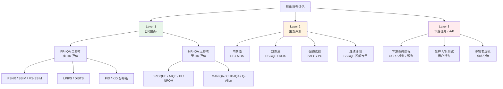
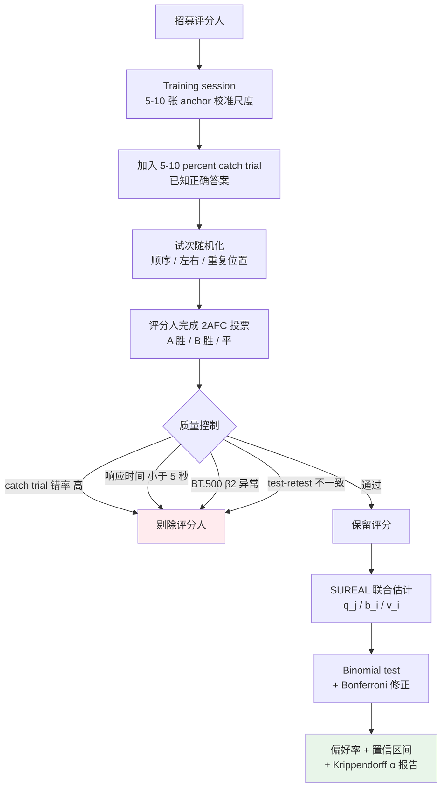

# 第 12 章 · 评估方法论

> 第 4 章讲了**指标本身**：PSNR/LPIPS/FID 各自骗你哪些。
>
> 这一章讲**怎么做评估**：主观评测怎么设计、统计显著性怎么算、生产环境 A/B 测试怎么搞。
>
> 在影像增强里，"做实验"这件事本身有一套方法论，绝大多数论文做不好这一步。

## 12.0 阅读须知

第 4 章把每个指标拆开讲过它们各自的偏差，本章往上走一层：**给定一组指标，如何把它们组织成可信的实验结论**。两者的边界可以这样划：第 4 章回答"PSNR 是 32 dB 这件事意味着什么"，本章回答"PSNR 32 dB 比 31 dB 是不是真的更好"以及"在真实用户那里这个差是不是能感知"。

这一章预设读者写过简单的对比实验（跑两个模型、算个 PSNR、画个表），但**不一定专门设计过 user study 或线上 A/B**。我们会展开三个层级的评估方法、几种主观评测协议、评分人质量控制、统计显著性检验，以及生产部署里的 A/B 测试。

**首次出现的缩写。** 本章用到的缩写在此先列定义：

- **IQA**（Image Quality Assessment，图像质量评估）：第 1 章已定义，本章直接使用
- **MOS**（Mean Opinion Score，平均意见分）：评分人按 1-5 级 Likert 量表对图像质量打分后取平均
- **DMOS**（Differential MOS）：以参考图为基准的相对 MOS，等于参考分减去测试分，单位是"质量损失"
- **2AFC**（Two-Alternative Forced Choice，二选一强迫选择）：评分人在 A 和 B 之间必须二选一的对比协议
- **BT.500**：ITU-R 的视频与图像主观评测标准，影像评测的事实标准
- **NR-IQA / FR-IQA**（No-Reference / Full-Reference IQA）：第 1 章已定义；本章里 NR-IQA 是真实场景的主力
- **BRISQUE**（Blind/Referenceless Image Spatial Quality Evaluator）：基于自然场景统计的 NR-IQA 经典指标
- **NIQE**（Natural Image Quality Evaluator）：另一个基于自然场景统计的 NR-IQA 指标
- **PI**（Perceptual Index）：PIRM 2018 比赛定义的复合 NR 指标，等于 (10 - NRQM + NIQE) / 2
- **NRQM**（No-Reference Quality Metric）：Ma et al. 2017 提出的 SR 专用 NR 指标
- **MANIQA / CLIP-IQA / Q-Align**：第 1 章已定义的现代 NR-IQA
- **ICC**（Intraclass Correlation Coefficient，组内相关系数）：评分人间一致性指标
- **AMT**（Amazon Mechanical Turk）：经典众包平台
- **IRB**（Institutional Review Board，机构伦理审查委员会）：学术受试者研究的伦理审查机构
- **SUREAL**（Subjective REcovery Algorithm with Latent classes）：Netflix 提出的 MOS 估计方法
- **PVD**（Preferred Viewing Distance，推荐观看距离）：BT.500 规定的评测物理距离

读完这一章你应该能回答：给一个新模型，我如何设计一组实验同时跑得快、跑得准、还能在论文/产品 review 里站得住脚；用户说"看不出区别"时如何用数据反驳或承认；线上 A/B 测两周看不出差异是模型不好还是样本不够。

## 12.1 评估的三个层级

任何严肃的增强评估应该覆盖三个层级：

```
Layer 1: 自动指标
  PSNR / SSIM / LPIPS / DISTS / FID / NIQE
  优点: 快、可复现、便宜
  缺点: 与人眼相关性有限 (第 4 章详谈)

Layer 2: 主观人工评测
  MOS / 2AFC / 偏好测试
  优点: 反映真实视觉体验
  缺点: 慢、贵、噪声大

Layer 3: 真实场景下游任务
  A/B 测试 / 用户行为 / 下游识别准确率
  优点: 直接反映价值
  缺点: 需要部署、数据少
```

**三个层级要相互验证**：自动指标的提升如果不能在主观评测和下游任务上反映出来，那个提升就值得怀疑。

把这三层和它们各自下面的具体方法画成谱系图，方便后面回查 - 后续每一节本质上都是在补全这棵树的某个子节点：



这一章重点讲 Layer 2 和 Layer 3，Layer 1 的细节在第 4 章已经覆盖。

## 12.2 MOS：单图评分

MOS（Mean Opinion Score）是最经典的主观评测形式。

### 流程

1. 给评分人一张图（增强模型输出）
2. 评分人按 5 级 Likert 量表打分：

```
1 - Bad (严重伪影/模糊)
2 - Poor (有明显问题)
3 - Fair (能用但不好)
4 - Good (高质量)
5 - Excellent (无瑕疵)
```

3. 多个评分人对同一张图独立打分，取平均

### 优点

- **简单**：评分人不需要专业训练
- **可扩展**：一张图打分十几秒，能 cover 大量样本
- **任务无关**：能比较不同任务的模型

### 缺点

- **尺度不一致**：评分人 A 的 4 分 ≠ 评分人 B 的 4 分（A 严格、B 宽松）
- **无参考对比**：评分人看到一张孤立的图，可能不知道"4 还是 5"
- **数据噪声大**：标准差经常 ±0.5 分

### 提升 MOS 信噪比的技巧

1. **每张图至少 5-10 人评分**取平均，降低单人偏差
2. **校准样本**：先放几张已知质量的图（HR 真值得 5 分、严重模糊得 1 分），让评分人校准自己的尺度
3. **Z-score 归一化**：每个评分人的分数减去他自己的平均、除以他自己的方差，再合并

```python
import numpy as np

def normalize_mos_scores(scores: dict) -> dict:
    """
    scores: {rater_id: {image_id: score}}
    返回: {image_id: 归一化平均分}
    """
    # 每个 rater 的分数 z-score 化
    normalized = {}
    for rater, ratings in scores.items():
        s = np.array(list(ratings.values()))
        mean, std = s.mean(), s.std() + 1e-8
        normalized[rater] = {img: (sc - mean) / std for img, sc in ratings.items()}

    # 跨 rater 平均
    image_scores = {}
    for rater_dict in normalized.values():
        for img, sc in rater_dict.items():
            image_scores.setdefault(img, []).append(sc)
    return {img: np.mean(scs) for img, scs in image_scores.items()}
```

### MOS 推荐用于

- 整体质量评价
- 单一模型的多样本质量分布
- 跨任务比较（**不推荐**——任务不同基准不同）

## 12.3 2AFC：强迫选择

2AFC（Two-Alternative Forced Choice）让评分人**直接对比**两个候选。

### 流程

```
显示参考图 (HR 真值)
显示候选 A (模型 1 输出)
显示候选 B (模型 2 输出)
评分人选择: A 更接近 / B 更接近 / 无法判断
```

### 优点

- **强制对比**：人对"A vs B"比对"绝对分"敏感得多
- **数据噪声小**：不需要校准尺度
- **统计简单**：直接算偏好率（A 胜率）

### 缺点

- **只能两两比较**：5 个模型要 $\binom{5}{2} = 10$ 对，每对若干张图
- **没有绝对分数**：知道 A 比 B 好，不知道好多少
- **顺序偏差**：评分人可能更倾向左边的选项（要随机化）

### 实际推荐：**比 MOS 更可靠**

绝大多数严肃论文/产品对比都用 2AFC 而不是 MOS - 除非你只评一个模型的整体质量。

把一次完整的 paired comparison（PC）实验从招募到结论画成流程图，覆盖了 12.4 - 12.7 节里所有质量控制点：



这张图在后面每一节都会被引用 - 12.5 节讲招募与质量控制对应左半边，12.6 节讲一致性指标和 BT.500 异常检测对应中间，12.7 节讲 SUREAL 对应右下，12.11 节讲统计检验对应最后一步。

```python
def compute_preference_rate(votes: list) -> dict:
    """
    votes: [(model_a, model_b, winner)] 列表
    返回: {(a, b): a_win_rate}
    """
    from collections import defaultdict
    counts = defaultdict(lambda: {'a_wins': 0, 'b_wins': 0, 'tie': 0, 'total': 0})

    for a, b, winner in votes:
        key = tuple(sorted([a, b]))   # 标准化方向
        counts[key]['total'] += 1
        if winner == 'tie':
            counts[key]['tie'] += 1
        elif winner == key[0]:
            counts[key]['a_wins'] += 1
        else:
            counts[key]['b_wins'] += 1

    return {k: v['a_wins'] / v['total'] for k, v in counts.items()}
```

## 12.4 主观评测的样本量

要多少张图、多少评分人才能得出可靠结论？

### 样本量计算（power analysis）

要检测 5% 的偏好率差异（比如 A 胜率 50% vs 55%），需要：

$$
n = \left( \frac{z_{1-\alpha/2} + z_{1-\beta}}{p_1 - p_2} \right)^2 \cdot \left( p_1(1-p_1) + p_2(1-p_2) \right)
$$

代入 $\alpha = 0.05$（显著性水平）、$\beta = 0.2$（功效 0.8）、$p_1 = 0.55, p_2 = 0.5$：

$$
n \approx 1500 \text{ pairs}
$$

也就是说，**要可靠区分两个相近模型，每对需要约 1500 个 2AFC 投票**。

实际工程中常见的折中：

- **粗筛**（差距 10%+）：100-300 pairs
- **正常对比**（差距 3-5%）：500-1000 pairs
- **细微差异**（差距 1-2%）：3000+ pairs（很贵）

### 评分人数量

每对图要多少不同评分人？经验：

- **学术论文**：每对 5-10 个不同评分人
- **产品 A/B**：100+ 个独立用户

## 12.5 评分人来源

### Amazon Mechanical Turk (AMT)

最经典的众包平台。优点：人多、便宜（$0.01-0.05/任务）；缺点：质量参差不齐。

### Prolific

更现代的替代品。质量比 AMT 高，价格略贵（$0.10-0.20/任务）。

### 自建平台

公司内部部署评分系统，让员工/招募的志愿者评分。质量可控，但样本量有限。

### 专业评测机构

视频/影像专业评测公司（如 Telecom ParisTech IPI lab）。质量最高，价格最贵（数千美元/批）。

### 评分人质量控制

无论什么平台都要做：

1. **Catch trial**：放 5-10% "明显答案"的样本（HR vs 极差的输出），评分人要选对
2. **Test-retest**：同样的样本评两次，一致性低的人剔除
3. **Time check**：评分太快（< 5 秒/张）的剔除
4. **Multiple raters per item**：单一评分人不能决定 ground truth

## 12.6 评分人间一致性（Inter-rater Reliability）

样本量、catch trial 都做了，剩下一个独立问题：**评分人之间到底有没有共识？** 如果 5 个评分人对同一张图给的分散到 1-5 分都有，平均出来再漂亮也不可信——这时候要么是图本身质量边界（合理分歧），要么是评分人质量出了问题（噪声评分）。

工程上必须算一致性指标，作为 user study 是否可信的前置门槛。

### Cohen's κ（两个评分人，分类）

最简单：两个评分人对一组样本各自分类（比如"A 胜 / B 胜 / 平"），$\kappa$ 衡量他们的一致性超过随机的程度。

$$
\kappa = \frac{p_o - p_e}{1 - p_e}
$$

$p_o$ 是观察到的一致率，$p_e$ 是期望随机一致率。$\kappa = 1$ 完美一致，$0$ 等于随机，$<0$ 反向。

经验阈值（Landis & Koch）：

- $\kappa < 0.4$：差
- $0.4-0.6$：中等
- $0.6-0.8$：好
- $> 0.8$：非常好

```python
from sklearn.metrics import cohen_kappa_score
kappa = cohen_kappa_score(rater1_labels, rater2_labels)
```

### Krippendorff's α（多评分人，多种数据类型）

更通用：支持任意数量评分人、缺失值、序数/区间/比率数据。**MOS 用 ordinal α，2AFC 用 nominal α**。

经验阈值（Krippendorff 自己给的，比 κ 严）：

- $\alpha > 0.8$：可发表的高一致性
- $0.67-0.8$：可接受用于初步结论
- $< 0.67$：数据不可靠，结论不能成立

```python
import krippendorff
import numpy as np

# 行 = rater, 列 = item, NaN = 该 rater 没评这一项
ratings = np.array([
    [4, 3, 5, np.nan, 2],
    [4, 4, 5, 3, np.nan],
    [3, 3, 4, 3, 2],
])
alpha = krippendorff.alpha(reliability_data=ratings, level_of_measurement='ordinal')
```

实操经验：影像增强 MOS 数据 α 通常在 0.5-0.75 之间——**绝大多数公开 IQA 数据集做不到 0.8**。这意味着：

- 不要追求 α > 0.8——这个领域感知本身有合理分歧
- 但 α < 0.5 必须警惕：要么任务定义模糊，要么评分人质量差

### ICC（Intraclass Correlation）

MOS 是连续/序数评分时，ICC 比 Krippendorff α 更常被论文采用。ICC(2,k) 是几个变体里最常用的：

```python
import pingouin as pg

# df 三列: rater, item, score (long format)
icc = pg.intraclass_corr(data=df, targets='item', raters='rater',
                          ratings='score', nan_policy='omit')
print(icc[icc['Type'] == 'ICC2k'])
```

ICC > 0.75 视为良好、> 0.9 视为优秀（Koo & Li, 2016）。

### 异常评分人检测：BT.500-14 附录 V

ITU-R BT.500-14（视频/影像主观评测的事实标准）在附录 V 里给了**β2 异常检测**——评分人某一组分数的 kurtosis 偏离正态太多就剔除：

```
对每个评分人 i：
1. 取他对每张图的 z-score
2. 算这组 z 的 β2（kurtosis 估计）
3. 如果 |β2| > 2，标记为可疑
4. 再看他与组内 mean 的偏差，超过 ±2σ 的次数 / 总次数 > 5%，剔除
```

ITU 这套筛人方法比简单"剔除 catch trial 没过的"更系统，**正经发表论文/做产品评测应该用**。

工程实现：参考 [VQEG 的 SUREAL 库](https://github.com/Netflix/sureal) 里 `bt500.py` 的算法实现。

## 12.7 SUREAL：现代 MOS 估计

简单的"对每张图取所有评分人的均值"假设了所有评分人同等可信。Netflix 在 2018 提出 **SUREAL**（Subjective REcovery Algorithm with Latent classes），把 MOS 建模为：

$$
s_{ij} = q_j + b_i + v_i \cdot \epsilon_{ij}
$$

- $s_{ij}$：评分人 $i$ 对图 $j$ 的分
- $q_j$：图 $j$ 的真实质量（要估的）
- $b_i$：评分人 $i$ 的偏差（"严格"或"宽松"）
- $v_i$：评分人 $i$ 的不一致性（高 $v$ = 噪声大）

用 EM 迭代估 $(q, b, v)$，**同时识别不可靠评分人**（高 $v_i$）。

### 与 z-score 归一化的差别

- **z-score**：每个评分人独立归一化，假设每人样本同分布
- **SUREAL**：联合估计，能在小样本下识别离群评分人

实测：**< 30 张图 / 评分人**时 SUREAL 显著优于 z-score。生产场景（每个评分人只评几十张）应该用 SUREAL。

```python
# Netflix 官方实现
# pip install sureal
from sureal.dataset_reader import RawDatasetReader
from sureal.subjective_model import MosModel, MaximumLikelihoodEstimationModel

# MLE 模型 = SUREAL
model = MaximumLikelihoodEstimationModel(dataset_reader)
result = model.run_modeling()
print(result['quality_scores'])     # 每张图的估计真值
print(result['observer_bias'])      # 每个 rater 的 bias
print(result['observer_inconsistency'])  # 每个 rater 的 v
```

学术论文写 user study 时引用 SUREAL 而不是 raw mean / z-score，已经是 2020 年后视频质量评测领域的主流做法。

## 12.8 ITU-R BT.500：视频/影像主观评测的圣经

如果做严肃的主观评测，**绕不开 ITU-R BT.500-14**（最新 2023 修订）。它定义了：

### 评测方法

- **DSCQS**（Double-Stimulus Continuous Quality Scale）：双刺激连续质量量表，参考 + 测试同时显示
- **DSIS**（Double-Stimulus Impairment Scale）：双刺激损伤量表，重点看损伤程度
- **SS**（Single Stimulus）：单刺激，类似 MOS
- **SSCQE**（Single Stimulus Continuous Quality Evaluation）：用于视频，评分人滚动给分
- **PC**（Pair Comparison）：=2AFC

### 物理环境标准

- **视距**：屏幕高度 H × 3-4 倍（PVD：preferred viewing distance）
- **环境光**：< 20 lux（避免反射干扰）
- **显示校准**：白点 D65、亮度 100-200 cd/m²、对比度按 BT.1886 EOTF
- **背景**：中灰（15% 反射率）

学术论文必须报告这些参数。AMT/Prolific 这些远程众包平台**做不到**——这是为什么严肃论文同时跑实验室 + 众包两轮，用前者标定后者。

### Anchor 与 Training

- 实验前必须有 **training session**（5-10 张 anchor 图，覆盖最差到最好），让评分人校准尺度
- Training 数据**不计入正式分数**

### 试次随机化

- 每个评分人看到的图顺序独立随机
- 同一对图的左右顺序随机
- 同一张图（重复 catch trial）穿插在不同位置

第 12.2-12.5 节讲的方法是 BT.500 这套体系的简化版——做产品迭代足够，**做学术发表应该按 BT.500 报参数**。

## 12.9 IRB / 知情同意 / 伦理

User study 涉及人类受试者。**学术发表 + 公司 GDPR 合规都要求伦理审查**，这块在影像增强论文里普遍写得很轻甚至跳过——但这是真实风险。

### 学术：IRB approval

NeurIPS / CVPR / ICCV 自 2024 起在投稿模板里加了 ethics statement，要求：

- 受试者招募来源、样本量、报酬
- 是否走过本机构 IRB / Ethics Committee
- 数据保存期限、删除政策
- 含 NSFW / 暴力 / 真人图像时的额外保护

跨国合作要注意：欧盟受试者受 GDPR 保护，**美国 IRB 不自动覆盖**。

### 工业：消费者数据

公司内部部署 user study 平台时：

- 雇员评分图像如果是真实用户数据 → 走 PII review
- 评分平台日志保留：不超过任务完成后 30 天（除非有合规需要）
- 知情同意：明确披露任务性质、payment、是否含敏感内容、退出权利

### 众包平台的伦理坑

- AMT 的时薪问题：2023 起多家学术机构 IRB 要求支付率 ≥ 评分人所在地区最低工资。$0.01/任务 + 20 秒/任务 = 时薪 $1.8，**这个数字在大多数 IRB 通不过**。
- Prolific 默认时薪 $8/小时（达到英国最低），更省 IRB 麻烦。
- 任务披露：在任务介绍里**前置**披露是否含 NSFW、是否含真人脸——之后才能给评分人 opt-in。

工程结论：写论文/做产品的 user study，**预算时薪 ≥ $8/小时 + 走过本机构 IRB**，是 2024 之后的合规底线。

## 12.10 跨文化与人口偏差

最后一个被普遍低估的方差源：**评分人不是同质的**。

- **审美差异**：东亚评分人更倾向认为"过度锐化 + 高对比"是"好画质"，欧美评分人更倾向"自然 + 低伪影"——同一张图 MOS 能差 0.5 分
- **文档/文字内容**：评分人母语影响他们对文字 SR 的判读
- **设备**：手机端评分人和台式机评分人对同一张图的感知不同
- **专业 vs 非专业**：摄影师/设计师对色调更敏感，普通用户对结构更敏感

工程实践：

- **记录人口学特征**：地区、年龄段、设备类型，事后做分群分析
- **目标场景匹配**：做亚洲市场产品就用亚洲面板，跨地区产品至少 2-3 个地区抽样
- **报告时披露**：论文 user study section 应给出 rater 的人口学概览

学术论文不报告这些维度，结论的 generalizability 受质疑——这是 2024 起 IQA 领域审稿的常见质询点。

## 12.11 统计显著性

得出 "模型 A 比 B 好" 之前，必须做显著性检验。

### Paired t-test（连续指标）

如果你在同一组测试图上比较两个模型的 LPIPS：

```python
from scipy import stats

lpips_a = [...]   # 模型 A 在 N 张测试图上的 LPIPS
lpips_b = [...]   # 模型 B
t_stat, p_value = stats.ttest_rel(lpips_a, lpips_b)
print(f"t = {t_stat:.3f}, p = {p_value:.4f}")
```

`p < 0.05` 才能说统计显著。

### Wilcoxon Signed-Rank Test（非参数）

LPIPS/PSNR 不一定服从正态分布，更稳的是 Wilcoxon：

```python
from scipy.stats import wilcoxon
stat, p = wilcoxon(lpips_a, lpips_b)
```

### Binomial Test（2AFC）

2AFC 的偏好率显著性：

```python
from scipy.stats import binomtest

# 模型 A 在 1000 个 pair 中胜了 540 次
result = binomtest(540, 1000, p=0.5, alternative='two-sided')
print(f"A 胜率 54%, p = {result.pvalue:.4f}")
```

### 多重比较修正

如果你比较 5 个模型（10 对），p 值要做 Bonferroni 修正：$\alpha_{\text{corrected}} = 0.05 / 10 = 0.005$。

## 12.12 自动指标 vs MOS 的相关性

不同指标和人眼感知的相关性（来自多个 IQA benchmark 的统计）：

| 指标 | 与 MOS 的 Spearman 相关 |
|------|----------------------|
| PSNR | 0.40 - 0.55 |
| SSIM | 0.50 - 0.65 |
| MS-SSIM | 0.55 - 0.70 |
| **LPIPS** | **0.70 - 0.80** |
| **DISTS** | **0.72 - 0.82** |
| **MANIQA**（NR） | **0.75 - 0.85** |
| FID（分布级） | 0.40 - 0.60 |

这告诉我们：

- **PSNR 单独看不可靠**（相关性才 0.4-0.55）
- **LPIPS/DISTS 是最强的全参考指标**（0.7+）
- **NR 指标的 SOTA（MANIQA）已经接近 LPIPS**——真实场景没真值时，MANIQA 是不错的代理

工程实践：

- 训练时盯 PSNR + LPIPS
- 论文/报告除了 PSNR + LPIPS 还要做主观评测
- 真实场景部署时盯 MANIQA + 用户行为

## 12.13 真实场景：下游任务评估

最有说服力的评估：**增强后的图能不能让下游任务做得更好？**

例子：

### 增强 + OCR

```python
# 测试集: 1000 张低质量文档图
# 真值: 已知文字内容

original_ocr_acc  = test_ocr(low_quality_images)         # 原图 OCR 准确率: 65%
enhanced_ocr_acc  = test_ocr(model_output(low_quality))  # 增强后: 88%

# 这才叫"增强模型对 OCR 任务的真实贡献"
```

### 增强 + 人脸识别

```python
# 测试集: 1000 对 (低质量图, 高质量参考)
# 真值: 是否同一人

original_recognition = face_recognize(low_quality_images, gallery)  # 准确率: 70%
enhanced_recognition = face_recognize(model_output(...), gallery)   # 准确率: 85%
```

### 增强 + 物体检测

```python
# 测试集: 1000 张低质量监控图, 标注过物体
mAP_original = detection_eval(low_quality_images, annotations)  # 0.45
mAP_enhanced = detection_eval(model_output(...), annotations)   # 0.62
```

下游任务评估的优点：

- **直接反映价值**——客户/用户真正关心的是这个
- **不依赖人工评测**——用现成的下游模型
- **客观可复现**——准确率/mAP 是绝对数字

适用场景：

- 文档增强 → OCR
- 人脸增强 → 识别 / 验证
- 监控增强 → 检测 / 行人重识别
- 卫星增强 → 地物分类 / 变化检测

不适用场景：

- 艺术修复（没有"任务"）
- 美颜滤镜（用户喜好导向）

## 12.14 A/B 测试在生产环境

把新模型部署给一部分用户，对照旧模型，看用户行为变化。

### A/B 设计

```
50% 用户 → 旧模型 (control)
50% 用户 → 新模型 (treatment)
```

监控指标：

- **直接质量指标**（用户主动反馈）：好评率、举报率、再处理率
- **行为指标**：处理时长、再次使用率、订阅转化率
- **退出指标**：跳出率、卸载率

```python
# 简化的 A/B 报告
def compute_ab_metrics(control_users, treatment_users):
    return {
        'reprocess_rate':  metric_reprocess(treatment) - metric_reprocess(control),
        'subscribe_rate':  metric_subscribe(treatment) - metric_subscribe(control),
        'rating_avg':      rating_avg(treatment) - rating_avg(control),
        'p_value':         ab_significance_test(control, treatment),
    }
```

### 多臂老虎机（Multi-Armed Bandit）

更高级的部署方式：让流量分配本身根据效果动态调整。表现好的模型自动获得更多流量。

工程实现：用 Vowpal Wabbit、Adobe Sensei 等成熟框架。

### A/B 的工程注意点

1. **足够时长**：至少跑 7-14 天，避免单日波动
2. **避免 Selection Bias**：随机分配用户，不要让用户自选
3. **Sample Ratio Mismatch**：监控分配是否真 50/50（基础设施 bug 常见）
4. **多重测试**：同时测多个变体要做 Bonferroni 修正
5. **段化分析**：不同设备/地区/用户群可能反应不同

## 12.15 失败案例集（Failure Case Bank）

平均指标好的模型可能在**特定场景**完全崩坏。**专门维护一个失败案例集**——把已知崩坏的输入收集起来，每次新模型都跑一遍这个集合。

### 怎么收集

- 从用户举报（生产环境）
- 主动构造（边界场景）
- 论文里的失败案例
- Twitter/Reddit 上的吐槽

典型失败类别（影像增强通用）：

- 极端低光
- 极端高 ISO 噪声
- 严重运动模糊
- 极小细节（小字、远处人脸）
- 多人脸场景
- 罕见物体（猫狗以外的动物）
- 特殊视角（鱼眼、广角）
- 半遮挡
- 各种风格图（动漫、油画、像素图）

### 失败案例集的指标

不只看平均，还看：

- **失败率**：在这个集合上多少张图视觉崩坏？
- **新失败模式**：是否引入了之前没有的问题？

工程实践：每个新模型版本必须跑失败集合，结果存档。**长期维护**这个集合比刷 benchmark 重要得多。

## 12.16 Benchmark 设计

第 4 章 4.9 节讲了学术 benchmark 的偏差。这里讲怎么设计**自己**的 benchmark。

### 测试集应包括什么

至少四种来源：

1. **学术 benchmark**（DIV2K val, Set5/14 等）：和已发表方法对比
2. **真实退化数据**（RealSR, DRealSR）：测真实分布
3. **领域特定测试集**（你的业务数据）：测实际效果
4. **失败案例集**：测鲁棒性

### 多样性审计

测试集每张图打标签（场景、内容、退化程度），确保分布覆盖：

| 场景 | 占比 |
|------|------|
| 室内 | 25% |
| 户外日光 | 30% |
| 户外夜景 | 15% |
| 文档/截图 | 10% |
| 人物（含人脸） | 15% |
| 其他 | 5% |

如果某类占比 < 1%，模型在那类的失败不会反映在平均指标上。

### Benchmark 不能优化

最重要的纪律：**你的最终 benchmark 必须不能用来调超参**。

- 训练用 train set
- 调超参用 val set
- 最终评估用 test set

如果你为了刷 test set 改了超参，那 test set 已经污染了。这是机器学习里反复被违反的基本原则。

工程实践：**保留一个"密封"测试集**，只在最终发布前跑一次。

## 12.17 Eval pipeline 工程

实际工程里 eval 应该自动化。

```python
import json
from pathlib import Path

class EvalPipeline:
    def __init__(self, model, datasets: dict, metrics: dict):
        """
        datasets: {name: dataloader}
        metrics: {name: callable(pred, target) -> float}
        """
        self.model = model
        self.datasets = datasets
        self.metrics = metrics

    @torch.no_grad()
    def run(self, output_dir: Path) -> dict:
        results = {}
        for ds_name, loader in self.datasets.items():
            ds_results = {m: [] for m in self.metrics}
            for batch in loader:
                lr, hr = batch['lr'], batch['hr']
                pred = self.model(lr.cuda())
                for m_name, m_fn in self.metrics.items():
                    score = m_fn(pred, hr.cuda())
                    ds_results[m_name].extend(score.cpu().tolist())
            results[ds_name] = {
                m: {
                    'mean':  np.mean(scores),
                    'std':   np.std(scores),
                    'count': len(scores),
                }
                for m, scores in ds_results.items()
            }

        # 保存结果
        output_dir.mkdir(parents=True, exist_ok=True)
        with open(output_dir / 'results.json', 'w') as f:
            json.dump(results, f, indent=2)
        return results
```

工程要点：

- **可复现**：固定随机种子、版本号、commit ID
- **持久化**：每次 eval 结果存盘，长期保留
- **对比**：能 diff 不同 commit 的 eval 结果
- **可视化**：自动生成对比图、表格

## 12.18 论文实验报告标准

写论文/技术报告时，eval 部分应包括：

1. **数据集**：列清楚每个，包括版本号
2. **指标**：PSNR + SSIM + LPIPS + DISTS + 至少一个 NR 指标
3. **对比方法**：包括 5+ 个公开 SOTA + 一个简单 baseline
4. **多次运行**：每个 setup 至少跑 3 次，报 mean ± std
5. **失败案例**：必须有，否则审稿人会要求加
6. **主观评测**（如果是 perception 端方法）
7. **下游任务**（如果方法目标是助力下游）
8. **消融实验**：每个设计决策都做消融

很多论文跳过 4、5、6，结果是审稿质疑或者复现失败。

## 12.19 评估的常见反模式

工程中要避免的几种：

### 反模式 1：只在自己挑的图上展示

"看，这张老照片修复得多好！" —— 没看到的失败案例呢？

### 反模式 2：和过时方法对比

只和 ESRGAN（2018）比，不和 SwinIR/HAT/SUPIR 比。

### 反模式 3：只报 PSNR

"我们 PSNR 比他们高 0.3 dB" —— PSNR 高不代表视觉好。

### 反模式 4：训练数据带 test set

不知不觉把 test set 的相似图加进了 train。

### 反模式 5："看心情"挑超参

每次 eval 不一样，追溯不到当初为什么这个数。

## 12.20 小结

1. **评估三层级**：自动指标 + 主观评测 + 下游任务，三者互相验证
2. **MOS 简单但噪声大**，2AFC 强制对比信噪比高，**优先用 2AFC**
3. **样本量要做 power analysis**：1000+ pairs 是常见正经实验的下限
4. **评分人质量控制**：catch trial、test-retest、time check
5. **评分人间一致性**：Krippendorff α / ICC 是 user study 是否可信的前置门槛；BT.500-14 附录 V 的 β2 异常检测剔除离群评分人
6. **MOS 估计用 SUREAL**（Netflix MLE 方法），而不是 raw mean / z-score——小样本下显著更稳
7. **严肃主观评测按 ITU-R BT.500-14**：DSIS/DSCQS/PC、视距、环境光、显示校准、anchor training 全部要按标准报参数
8. **IRB / 知情同意是合规底线**：2024 起 NeurIPS/CVPR 都要 ethics statement，众包时薪 ≥ $8/h
9. **跨文化与人口偏差是真实方差源**：报告 rater 人口学维度，目标场景匹配
10. **统计显著性**：t-test/Wilcoxon for 连续指标，binomial test for 2AFC，多重比较做 Bonferroni
11. **自动指标 vs MOS 相关性**：LPIPS/DISTS/MANIQA ~0.75，PSNR 只 0.4-0.55
12. **下游任务评估最有说服力**：OCR 准确率、人脸识别率、检测 mAP
13. **A/B 测试是生产环境的事实标准**：监控用户行为指标
14. **失败案例集**：长期维护，比平均指标重要
15. **Benchmark 不能用来调超参**：保留密封 test set

到这里 Part III 训练与评估两章完成。Part IV 进入视频——视频不只是"图像加时间"，时序一致性是一个独立的问题。

---

> 下一章 [视频不只是图像加时间](13-video-basics.md) → 时序一致性、光流、视频退化的特殊性。
