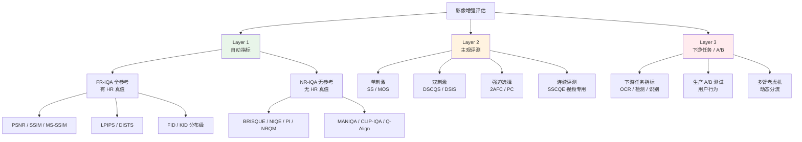
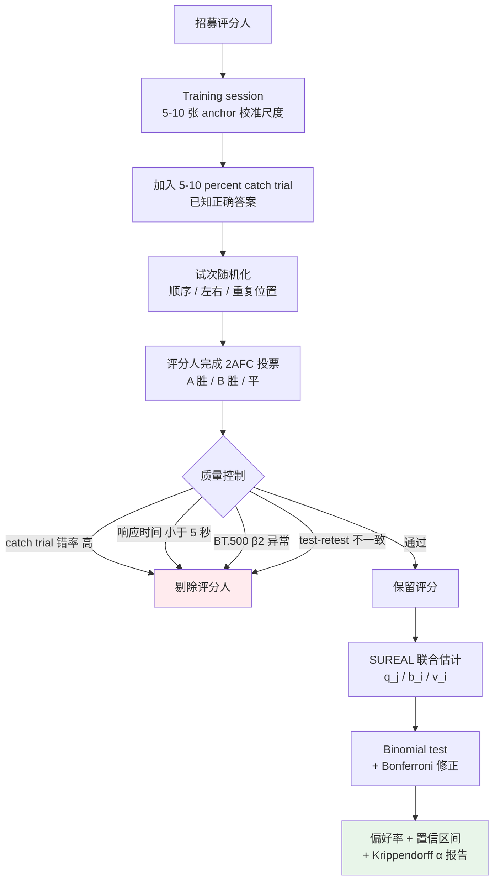

# 第 12 章 · 评估方法论

> 第 4 章系统剖析了**指标自身的数学定义与测量偏差**：PSNR、LPIPS、FID 等客观指标在不同退化场景下的失效边界。
>
> 本章聚焦**评估流程的方法论体系**：如何规范设计主观实验、检验统计显著性，以及在生产环境中推进 A/B 测试。
>
> 影像增强的技术结论依赖于严密的实验设计；实验协议的疏漏往往导致研究结论无法在真实场景中复现。

## 12.0 阅读须知

第 4 章剖析了各大单一指标的内在偏置，本章则上升至决策层：**如何组合指标与评测协议，构建具备统计学置信度的实验结论**。两者的职责划分明确：第 4 章解答"PSNR 达到 32 dB 代表何种物理重建误差"，本章解答"PSNR 由 31 dB 提升至 32 dB 是否具备统计显著性"以及"真实终端用户能否切实感知到画质差异"。

假设读者已具备编写基础对比实验的经验（运行基线模型、计算 PSNR/SSIM、输出对比表格），但**未必主导过严格的人工主观评测（User Study）或线上 A/B 测试**。本章将系统解析三个层级的评估体系、主观评测协议设计、标注质量控制与离群剔除、统计显著性检验，以及工业级生产部署的验证规范。

**首次出现的缩写。** 本章涉及的专业术语与缩写定义如下：

- **IQA**（Image Quality Assessment，图像质量评估）：第 1 章已定义，本章直接沿用
- **MOS**（Mean Opinion Score，平均意见分）：受试者按 1 至 5 级离散量表打分后的算术平均值
- **DMOS**（Differential MOS，差异平均意见分）：以高质量参考图得分为基准计算的相对质量损失分值
- **2AFC**（Two-Alternative Forced Choice，二选一强迫选择）：受试者在两个候选输出之间必须二选一的成对对比协议
- **BT.500**：国际电信联盟（ITU-R）发布的视频与图像主观评测标准（ITU-R BT.500），为主观评测领域的权威规范
- **NR-IQA / FR-IQA**（No-Reference / Full-Reference IQA）：无参考 / 全参考图像质量评估，第 1 章已定义
- **BRISQUE**（Blind/Referenceless Image Spatial Quality Evaluator）：基于自然场景统计（NSS）特征的经典无参考评估指标
- **NIQE**（Natural Image Quality Evaluator）：无需人工主观分训练、基于空域自然统计偏离度的无参考指标
- **PI**（Perceptual Index）：PIRM 2018 超分挑战赛定义的综合感知指标，计算公式为 $(10 - \text{NRQM} + \text{NIQE}) / 2$
- **NRQM**（No-Reference Quality Metric）：Ma 等人于 2017 年提出的超分辨率专用无参考指标
- **MANIQA / CLIP-IQA / Q-Align**：基于深度特征与多模态大模型的现代无参考质量评估模型
- **ICC**（Intraclass Correlation Coefficient，组内相关系数）：评估多位评分人间信度与一致性的统计量
- **AMT**（Amazon Mechanical Turk）：经典众包实验平台
- **IRB**（Institutional Review Board，机构审查委员会）：人类受试者研究的伦理合规审查机构
- **SUREAL**：Netflix 开源的主观质量分恢复工具库，基于最大似然估计（MLE）联合建模图像真实质量、受试者偏差与不一致性（算法源自 Li & Bampis, 2017）
- **PVD**（Preferred Viewing Distance，推荐观看距离）：BT.500 规范中针对显示器高度定义的受试者物理观看距离

读完本章，你应当能够掌握：面对新提出的增强模型时，如何设计兼顾评估效率、测量精度与可复现性的实验方案；当自动化指标提升而用户反馈差异不明显时，如何通过数据与统计学工具进行归因；以及在线上 A/B 测试周期内，如何区分算法增益与样本量不足导致的统计波动。

## 12.1 评估的三个层级

严谨的影像增强评估体系必须覆盖以下三个递进层级：

```
Layer 1: 自动化客观指标
  PSNR / SSIM / LPIPS / DISTS / FID / NIQE / MANIQA
  优势: 计算高效、完全可复现、边际成本为零
  局限: 与人眼主观感知存在固有相关性上限 (详见第 4 章)

Layer 2: 人工主观评测
  MOS / 2AFC / 专家配对偏好测试
  优势: 直接反映人类视觉系统的真实主观体验
  局限: 采样周期长、执行成本高、存在个体评分噪声

Layer 3: 真实场景下游任务与业务验证
  线上 A/B 测试 / 用户交互留存 / 下游识别准确率 (OCR / 检测 / 识别)
  优势: 直接反映技术在业务系统中的端到端价值
  局限: 依赖线上部署工程底座、数据反馈周期长
```

**三个层级必须形成闭环验证**：若自动化指标的数值提升无法在主观评测中得到正向反馈，或无法转化为下游任务的准确率增益，则该项指标提升通常属于过度拟合特定损失的虚假增益。

评估体系的完整方法谱系如下图所示，方便后续对照查阅，后文各节将逐一展开这棵决策树中的具体节点：



本章核心聚焦 Layer 2（主观评测）与 Layer 3（业务验证与 A/B 测试），Layer 1 的数学原理已在第 4 章系统解析。

## 12.2 MOS：单刺激绝对质量评分

MOS（Mean Opinion Score）是图像质量主观评测中最经典的单刺激（Single Stimulus）形式。

### 评测流程

1. 依次向受试者独立展示待评测增强图像（无参考图对照）；
2. 受试者依据标准的 5 级 Likert 量表进行绝对打分：

```
1 分 - Bad (严重伪影 / 重度模糊 / 结构崩塌)
2 分 - Poor (存在显著质量缺陷，明显不可接受)
3 分 - Fair (质量尚可，存在可感知的轻度瑕疵)
4 分 - Good (高质量重构，细节清晰自然)
5 分 - Excellent (画质完美，无任何感知伪影)
```

3. 汇总所有受试者针对同一张图像的有效打分，计算算术平均值与置信区间。

### 方案特性

- **操作直观**：打分标准清晰，受试者无需专门的前置图像处理训练；
- **吞吐量大**：单图打分通常耗时 5 至 10 秒，易于覆盖大规模测试集；
- **任务无关**：具备通用标尺属性，可横向对比不同任务输出（如去噪 vs 超分）。

### 固有缺陷

- **尺度标准不一**：不同受试者的心理量表基准存在系统性偏移（严苛型评分者常集中在 2 至 3 分，宽松型评分者常集中在 4 至 5 分）；
- **缺乏锚点参照**：单图独立呈现时，受试者对中等画质的边界判定存在较大随机性；
- **数据方差大**：原始分值的标准差通常在 $\pm 0.5$ 分以上，掩盖微弱的算法性能差距。

### 提升 MOS 统计信噪比的工程手段

1. **充足的受试者重叠度**：单张测试图至少采集 5 至 10 位独立评分者的有效反馈；
2. **锚点校准机制（Anchoring）**：在正式评测前插入校准序列（覆盖满分 5 分的真实 HR 原图与低分 1 分的严重退化图），统一受试者的心理量表边界；
3. **Z-Score 标准化**：对每位受试者的原始打分序列执行 Z-Score 归一化，消除个体均值与方差的基线漂移后再行聚合。

```python
import numpy as np

def normalize_mos_scores(scores: dict) -> dict:
    """
    scores: {rater_id: {image_id: score}}
    返回: {image_id: 归一化平均分}
    """
    # 对每位评分人的分值执行 Z-score 标准化
    normalized = {}
    for rater, ratings in scores.items():
        s = np.array(list(ratings.values()))
        mean, std = s.mean(), s.std() + 1e-8
        normalized[rater] = {img: (sc - mean) / std for img, sc in ratings.items()}

    # 跨评分人聚合平均
    image_scores = {}
    for rater_dict in normalized.values():
        for img, sc in rater_dict.items():
            image_scores.setdefault(img, []).append(sc)
    return {img: np.mean(scs) for img, scs in image_scores.items()}
```

### 适用场景

- 系统整体输出的质量等级摸底；
- 单一模型在多样化真实场景上的长尾质量分布评估。

## 12.3 2AFC：成对强迫选择

2AFC（Two-Alternative Forced Choice）协议通过**并排成对呈现**的方式，要求受试者在两个候选结果之间做出明确的相对优劣判定。

### 评测流程

```
屏幕上方或中心: 显示参考图 (HR 真值 / LR 输入)
屏幕下方左侧: 候选 A (模型 1 输出)
屏幕下方右侧: 候选 B (模型 2 输出)
受试者按键选择: A 画质更优 / B 画质更优 / 二者无显著差异 (平局)
```

### 方案特性

- **测量灵敏度极高**：人类视觉系统对并排微观差异的辨识力远胜于孤立绝对打分；
- **免去尺度校准**：摆脱了绝对量表的个体基准偏差，数据信噪比显著提升；
- **统计模型清晰**：直接统计偏好胜率（Preference Rate）并便于进行二项分布假设检验。

### 固有缺陷

- **组合开销大**：$K$ 个模型全排列对比需要 $\binom{K}{2}$ 组实验，样本规模随模型数量平方级增长；
- **仅提供相对排序**：无法直接推导全局绝对质量分值（需借助 Bradley-Terry 等心理测量模型反推潜在分数）；
- **空间位置偏置**：受试者可能存在偏向左侧选项的无意识心理惯性，必须严格执行左右位置随机化。

### 工程推荐实践

除非仅需评估单一模型的独立质量分布，绝大多数学术论文与工业界对比评测均优先采用 2AFC 协议。

完整的成对对比实验工程闭环如下图所示，系统涵盖了受试者培训、质控筛选、异常消除与统计检验各环节：



流程中各质控节点与后续章节严格对应：12.5 节展开采样与质控校验，12.6 节讨论一致性量化与 BT.500 异常筛选，12.7 节解析基于 SUREAL 的潜在质量恢复，12.11 节负责显著性检验。

偏好胜率计算实现示例：

```python
def compute_preference_rate(votes: list) -> dict:
    """
    votes: [(model_a, model_b, winner)] 列表
    返回: {(a, b): a_win_rate}
    """
    from collections import defaultdict
    counts = defaultdict(lambda: {'a_wins': 0, 'b_wins': 0, 'tie': 0, 'total': 0})

    for a, b, winner in votes:
        key = tuple(sorted([a, b]))   # 标准化模型对顺序
        counts[key]['total'] += 1
        if winner == 'tie':
            counts[key]['tie'] += 1
        elif winner == key[0]:
            counts[key]['a_wins'] += 1
        else:
            counts[key]['b_wins'] += 1

    return {k: v['a_wins'] / v['total'] for k, v in counts.items()}
```

## 12.4 主观评测的样本量设计

主观实验必须通过统计功效分析（Power Analysis）科学确定样本规模，避免因样本量不足产生假阴性结论（Type II Error）。

### 功效分析与样本量估算

若期望在统计学上可靠检出 5% 的偏好胜率差异（例如验证 A 模型胜率 $p_1 = 0.55$ 显著优于基线 $p_2 = 0.50$），所需有效样本对数量 $n$ 计算公式如下：

$$
n = \left( \frac{z_{1-\alpha/2} + z_{1-\beta}}{p_1 - p_2} \right)^2 \cdot \left( p_1(1-p_1) + p_2(1-p_2) \right)
$$

设定显著性水平 $\alpha = 0.05$（对应 $z_{0.975} = 1.96$）、统计功效 $1 - \beta = 0.80$（对应 $z_{0.80} = 0.84$）、$p_1 = 0.55, p_2 = 0.50$：

$$
n \approx 1500 \text{ 次独立成对判定}
$$

计算表明：**若要可靠分辨两个性能接近的增强模型（5% 胜率差距），每组对比模型对需要累计约 1,500 次有效 2AFC 投票**。

工程实操中的阶梯式抽样规模参考：

- **初筛阶段（性能差距 $> 10\%$）**：100 至 300 组独立对比；
- **常规对比（性能差距 $3\%$ 至 $5\%$）**：500 至 1,000 组独立对比；
- **精细微调（性能差距 $< 2\%$）**：需 3,000 组以上样本支撑（成本较高）。

### 评分人配置规模

- **学术论文标准**：每张图像/模型对至少分配 5 至 10 位互不重叠的独立评分人；
- **线上产品验证**：需覆盖 100 位以上真实独立用户。

## 12.5 评分人招募与数据质控

### 评测渠道选择

- **Amazon Mechanical Turk（AMT）**：老牌众包平台，受试者基数大且成本低，但需配合严格的脚本级质控；
- **Prolific**：专业学术众包平台，受试者受教育程度高且响应质量优于 AMT，单任务成本略高；
- **企业内部闭环平台**：组织内部技术人员与业务方打分，保密性好且标注质量可控，但受试者总样本量受限；
- **专业图像实验室**：依托高校与科研机构评测中心，遵循严格物理环境执行，质量最高但成本高昂。

### 标注质量控制四重防护

1. **陷阱试次（Catch Trials）**：在评测流中随机插入 5% 至 10% 具备绝对真值的样本（如原始未受损 HR 原图对比极度模糊的重退化图），答错者整批数据作废；
2. **重测一致性检验（Test-Retest Reliability）**：选取部分样本在不同时间点重复呈现，自身打分一致性过低者予以剔除；
3. **作答时长下限过滤（Time Check）**：单图对比判定时长低于物理感知极限（如 $< 3$ 至 5 秒）的记录判定为机器人刷单或敷衍答题，直接剔除；
4. **多重交叉冗余**：单一样本严禁由单一受试者决定最终归属。

## 12.6 评分人间信度（Inter-rater Reliability）

样本量与质控机制完备后，需评估**受试者群体内部是否存在稳定的感知共识**。若多位受试者对同一样本的评分呈现无序离散，表明要么任务判据存在歧义，要么数据中混入了系统性噪声。

### Cohen's κ（双人分类一致性）

用于量化两位评分者在分类决策（如 A 胜 / B 胜 / 平局）上超越随机巧合的一致程度：

$$
\kappa = \frac{p_o - p_e}{1 - p_e}
$$

其中 $p_o$ 为实测一致率，$p_e$ 为理论随机期望一致率。$\kappa = 1$ 代表完全一致，$\kappa \leq 0$ 代表一致性等同或劣于随机猜测。

经验判别标准（Landis & Koch）：

- $\kappa < 0.4$：信度较差；
- $0.4 \leq \kappa \leq 0.6$：中等信度；
- $0.6 < \kappa \leq 0.8$：信度良好；
- $\kappa > 0.8$：极高一致性。

```python
from sklearn.metrics import cohen_kappa_score
kappa = cohen_kappa_score(rater1_labels, rater2_labels)
```

### Krippendorff's α（多人任意数据类型）

适用范围更广：原生支持任意数量评分者、数据缺失值，并涵盖名义（Nominal）、序数（Ordinal）、区间与比率尺度。**MOS 打分选用 Ordinal $\alpha$，2AFC 投票选用 Nominal $\alpha$**。

理论判别门限：

- $\alpha > 0.8$：高信度，具备严谨发表价值；
- $0.67 \leq \alpha \leq 0.8$：可接受的初步结论信度；
- $\alpha < 0.67$：数据信度不足，结论不可靠。

```python
import krippendorff
import numpy as np

# 矩阵结构: 行 = 评分人, 列 = 样本, NaN 代表缺测
ratings = np.array([
    [4, 3, 5, np.nan, 2],
    [4, 4, 5, 3, np.nan],
    [3, 3, 4, 3, 2],
])
alpha = krippendorff.alpha(reliability_data=ratings, level_of_measurement='ordinal')
```

工程经验：在复杂的图像超分与生成式增强场景中，MOS 的 $\alpha$ 系数通常处于 0.50 至 0.75 区间。由于主观审美存在合理分歧，不宜苛求 $\alpha > 0.8$，但若 $\alpha < 0.50$，则必须重新审视实验说明清晰度与受试者筛选机制。

### 组内相关系数（ICC）

在连续或序数评分体系中，ICC(2,k)（双向随机效应、平均测量信度）常用于学术报告：

```python
import pingouin as pg

# df 包含三列: rater, item, score (长表格式)
icc = pg.intraclass_corr(data=df, targets='item', raters='rater',
                          ratings='score', nan_policy='omit')
print(icc[icc['Type'] == 'ICC2k'])
```

通常将 $\text{ICC} > 0.75$ 视作良好，$\text{ICC} > 0.90$ 视作优秀（Koo & Li, 2016）。

### 异常评分人筛除：ITU-R BT.500-14 附录 V 规范

ITU-R BT.500-14 提供了基于 **$\beta_2$（峰度系数）** 的系统化异常评分人筛除算法。其核心思想是首先通过峰度判断样本评分是否近似正态分布，动态确定离群容差门限：

```
对每张测试图像 j：
1. 计算所有评分人对该图打分的峰度系数 β2；
2. 若 β2 落在 [2, 4] 区间，判定该图评分服从正态分布，离群门限设为 mean ± 2σ；
   若 β2 < 2 或 β2 > 4，判定为非正态分布，离群门限放宽至 mean ± √20·σ。

对每位评分人 i：
3. 统计其评分落在对应图像门限之外的频次（分别记录高于上界次数 P 与低于下界次数 Q）；
4. 若 (P + Q) / 总评分数 > 0.05，且 |P - Q| / (P + Q) < 0.3（表明呈现系统性双侧离群而非单边偏好），
   则判定该受试者为异常评分人，整批剔除其打分数据。
```

工程实现可直接调用 [Netflix SUREAL 库](https://github.com/Netflix/sureal) 中的 `bt500.py` 算法模块。

## 12.7 SUREAL：主观真实质量的最大似然估计

传统的算术平均忽略了个体主观打分的基线偏置。Netflix 开源的 **SUREAL** 工具库基于最大似然估计（MLE），将观察打分建模为：

$$
s_{ij} = q_j + b_i + v_i \cdot \epsilon_{ij}
$$

- $s_{ij}$：评分人 $i$ 对图像 $j$ 的实际打分；
- $q_j$：待估计的图像 $j$ 潜在真实客观质量（Ground Truth Quality）；
- $b_i$：评分人 $i$ 的系统性偏置（反映严苛或宽松倾向）；
- $v_i$：评分人 $i$ 的不一致性方差（反映评分随机噪声大小）；
- $\epsilon_{ij} \sim \mathcal{N}(0, 1)$：标准高斯白噪声。

通过 EM 算法联合求解参数三元组 $(q, b, v)$，在恢复真实图像质量的同时，能够自动识别高不一致性（大 $v_i$）的低信度受试者。

```python
# Netflix 官方 SUREAL 调用示例
from sureal.dataset_reader import RawDatasetReader
from sureal.subjective_model import MaximumLikelihoodEstimationModel

# 实例化最大似然估计模型
model = MaximumLikelihoodEstimationModel(dataset_reader)
result = model.run_modeling()

print(result['quality_scores'])          # 每张测试图的真值分数估计
print(result['observer_bias'])           # 各评分人的系统偏置 b_i
print(result['observer_inconsistency'])  # 各评分人的不一致性方差 v_i
```

工程实测表明：在每位受试者仅评估少量样本（$< 30$ 张）的低重叠度场景下，SUREAL 的估计稳健度显著超越常规 Z-Score 归一化。

## 12.8 ITU-R BT.500：主观评测国际规范

国际电信联盟发布的 **ITU-R BT.500-14** 是多媒体主观质量评估的行业基准规范，系统界定了评测方法与物理观测条件：

### 标准评测协议分类

- **DSCQS**（Double-Stimulus Continuous Quality Scale，双刺激连续质量量表）：参考图像与测试图像交替或并排呈现，受试者在连续标尺上分别对二者打分；
- **DSIS**（Double-Stimulus Impairment Scale，双刺激损伤量表）：首先呈现无损参考图，随后呈现待测图，受试者仅评估待测图相对参考图的损伤程度；
- **SS**（Single Stimulus，单刺激法）：即 MOS 绝对打分；
- **SSCQE**（Single Stimulus Continuous Quality Evaluation，连续质量评估）：面向长视频流，受试者手持滑杆连续打分；
- **PC**（Pair Comparison，成对对比法）：即 2AFC。

### 实验室物理观测环境标准

- **视距（PVD）**：显示屏高度 $H$ 的 3 至 4 倍；
- **环境照度**：低于 20 lux，避免屏幕反光干扰微观对比度感知；
- **显示校准**：色温对齐 D65 标准白点，峰值亮度设定在 100 至 200 $\text{cd/m}^2$，电光转换函数（EOTF）遵循 BT.1886；
- **背景墙反光率**：中灰哑光（15% 反射率）。

严格的学术研究需在方法部分披露上述物理环境参数。远程众包平台无法严格控制受试者显示器与环境光，因此严谨实验常采用"小规模实验室受试标定 + 大规模众包交叉验证"的双轨方案。

### 锚点序列与适应性训练（Training Session）

- 正式实验前必须设置**适应性训练环节**（包含 5 至 10 组覆盖最差到最佳质量的代表性锚点图像），辅助受试者建立稳定的心理评分标尺；
- 训练环节产生的数据**严格隔离，不计入最终实验统计**。

### 试次随机化规范

- 每位受试者看到的样本呈现顺序完全独立随机；
- 成对对比中的左右呈现位置严格伪随机均匀分布；
- 相同样本的重测复核项随机穿插在不同测试轮次中。

## 12.9 伦理合规与受试者权益（IRB）

涉及人类受试者的 User Study 必须遵循科研伦理与数据合规规范：

### 学术发表伦理要求

自 2024 年起，NeurIPS、CVPR、ICCV 等顶级会议均在投稿规范中强制要求披露伦理声明（Ethics Statement）：

- 明确披露受试者招募来源、样本规模及报酬标准；
- 声明是否通过本机构伦理审查委员会（IRB / Ethics Committee）审批；
- 明确受试者数据存储期限、匿名化处理及销毁方案；
- 涉及真人面部特征、医疗影像等敏感内容时，需提供专项知情同意书（Informed Consent）。

### 工业数据隐私与合规（GDPR / PII）

- 内部员工参与真实业务数据打分时，图像数据需预先执行脱敏与 PII（个人身份信息）审查；
- 评测平台操作日志保存周期原则上不超过任务结束后 30 天；
- 任务前置披露：明确告知任务耗时、报酬机制、潜在内容属性并保障受试者随时无责中止实验的权利。

### 众包平台的报酬底线

- 学术界普遍要求众包任务的等效时薪不得低于受试者所在地法定最低工资标准（如 Prolific 建议基准为 $\geq \$8/\text{h}$）；
- 低于最低时薪的众包任务在顶级学术会议伦理审查中存在被否决风险。

## 12.10 人口统计学偏差与分群分析

受试者群体的背景差异是主观评测中重要的方差来源：

- **感知偏好差异**：不同地域的受试者对高频锐化与对比度增强的接受度存在先验差异；
- **文本先验**：母语背景直接影响受试者对特定语种文字超分辨率结果的清晰度判读；
- **硬件终端形态**：移动端高像素密度屏幕与桌面广色域显示器对同一图像的噪点呈现存在显著差异；
- **专业敏感度**：影像专业从业者对色调断层和微弱伪影的容忍度远低于普通终端用户。

工程实践规范：
- 记录受试者的人口统计学维度（地域、年龄段、交互设备分辨率），在分析阶段执行分群交叉验证（Segmented Analysis）；
- 算法面向特定垂直市场时，需确保评测样本画像与目标用户画像严格匹配。

## 12.11 统计显著性检验

在得出"模型 A 性能优于模型 B"的结论前，必须执行严格的假设检验（Hypothesis Testing）。

### 配对样本 t 检验（Paired t-test，连续变量）

在相同测试集上对比两个模型的 LPIPS 或 PSNR 分布时：

```python
from scipy import stats

lpips_a = [...]   # 模型 A 在 N 张测试图上的 LPIPS 列表
lpips_b = [...]   # 模型 B 在相同测试图上的 LPIPS 列表
t_stat, p_value = stats.ttest_rel(lpips_a, lpips_b)
print(f"t = {t_stat:.3f}, p = {p_value:.4f}")
```

当 $p < 0.05$ 时，方可认为两组性能指标存在统计学显著差异。

### Wilcoxon 符号秩检验（Wilcoxon Signed-Rank Test，非参数检验）

由于 LPIPS / PSNR 的差值分布往往不满足正态分布假设，采用非参数 Wilcoxon 符号秩检验更为稳健：

```python
from scipy.stats import wilcoxon
stat, p_value = wilcoxon(lpips_a, lpips_b)
```

### 二项分布检验（Binomial Test，2AFC 胜率）

针对 2AFC 成对偏好胜率的显著性检验：

```python
from scipy.stats import binomtest

# 假定在 1000 次成对判定中, 模型 A 获胜 540 次
result = binomtest(k=540, n=1000, p=0.5, alternative='two-sided')
print(f"模型 A 胜率 54.0%, 双侧检验 p 值 = {result.pvalue:.4f}")
```

### 多重比较校正（Bonferroni Correction）

当并发对比 $K$ 个模型（共 $\binom{K}{2}$ 组双边假设检验）时，累计第一类错误率（Type I Error）会显著放大，必须对显著性阈值执行校正：$\alpha_{\text{corrected}} = \alpha / \binom{K}{2}$。

## 12.12 自动化指标与主观 MOS 的相关性分析

各主流客观指标在标准 IQA Benchmark 上与人类主观打分（MOS）的斯皮尔曼等级相关系数（SRCC）统计基准：

| 指标类型 | 评估指标 | 与 MOS 的 Spearman 相关系数 (SRCC) | 特性归纳 |
|---------|---------|----------------------------------|----------|
| 全参考 (像素级) | PSNR | 0.40 至 0.55 | 仅度量绝对能量均方误差，无法感知局部结构纹理 |
| 全参考 (结构级) | SSIM / MS-SSIM | 0.50 至 0.70 | 捕捉局部结构相关性，对高频生成失真仍较迟钝 |
| 全参考 (深度特征) | **LPIPS** | **0.70 至 0.80** | 模拟人类视觉感知系统对微观高频细节的反应 |
| 全参考 (纹理/结构) | **DISTS** | **0.72 至 0.82** | 明确解耦纹理变换与结构损伤，对几何形变具有一定容忍度 |
| 无参考 (深度学习) | **MANIQA** | **0.75 至 0.85** | 复杂真实退化下性能优异，与主观感知高度契合 |
| 分布级度量 | FID | 0.40 至 0.60 | 衡量特征总体分布散度，无法评估单图结构保真度 |

工程指导启示：

- **PSNR 无法独立作为画质改进的充要判据**；
- **全参考场景首选 LPIPS 与 DISTS**；
- **真实无真值场景下，以 MANIQA、Q-Align 等现代深度无参考指标作为主评测代理**。

## 12.13 下游任务驱动的效能评估

在特定工业应用中，最直接的评估方式是**验证增强算法对下游感知/识别模型的准确率增益**。

代码测试范式示例：

### 增强 + 文档 OCR

```python
# 测试集: 1000 张低画质/退化文档
original_ocr_acc = test_ocr(low_quality_images)         # 原始低质图 OCR 字符识别准确率: 65%
enhanced_ocr_acc = test_ocr(model_output(low_quality))  # 增强后 OCR 准确率: 88%
```

### 增强 + 人脸验证

```python
# 测试集: 1000 对低画质与高质量人脸匹配样本
original_recognition = face_recognize(low_quality_images, gallery)  # 准确率: 70%
enhanced_recognition = face_recognize(model_output(...), gallery)   # 准确率: 85%
```

### 增强 + 目标检测

```python
# 测试集: 1000 张夜间低光监控场景
mAP_original = detection_eval(low_quality_images, annotations)  # 原始 mAP: 0.45
mAP_enhanced = detection_eval(model_output(...), annotations)   # 增强后 mAP: 0.62
```

下游任务评估的工程优势：
- 评价标准客观量化，杜绝人工主观偏好争议；
- 评估流程可完全自动化流水线执行，可复现性高；
- 直接反映算法对业务系统的赋能价值。

## 12.14 生产环境 A/B 测试

将新模型按比例灰度推送给部分线上真实用户，通过大盘行为埋点量化端到端业务增益。

### 实验分流设计

```
50% 线上流量 → 对照组 (Control Group: 旧版模型 / 原始画质)
50% 线上流量 → 实验组 (Treatment Group: 新版增强模型)
```

### 核心监控指标矩阵

- **直接质量反馈指标**：单图好评率、用户主动二次处理触发率、画质投诉率；
- **业务行为指标**：单次任务留存时长、工具功能复购转化率、付费订阅率；
- **负向拦截指标**：客户端跳出率、应用卸载率、端侧推理发热崩溃率。

### 多臂老虎机（Multi-Armed Bandit）

对于多模型在线选型，可引入 Thompson 抽样或 UCB（Upper Confidence Bound）算法，根据各算法实时业务胜率动态调节流量权重，在最小化用户体验损耗的同时加速收敛至最优解。

### A/B 测试工程排障准则

1. **充足观测窗口**：单次实验至少持续 7 至 14 天，平抑工作日与周末的周期性行为波动；
2. **样本分流比例失配检测（SRM）**：持续监控对照组与实验组的实际请求分流比，排查网关分流逻辑缺陷；
3. **严格用户级哈希**：确保同一用户在整个实验周期内锁定在同一实验组，避免画质反复跳变破坏用户体验。

## 12.15 失败案例库（Failure Case Bank）

平均指标的提升往往掩盖了局部极端退化场景的彻底崩溃。必须**长期维护并扩展失败案例库**，作为版本发布的硬性准入阻断门禁。

### 失败样本的主要收集渠道

- 线上生产环境用户负向反馈与画质投诉工单；
- 人工构造的极端边缘退化（Corner Cases）；
- 行业论文与竞赛中公开的难例样本。

### 通用影像增强的高频失败场景分类

- 极度弱光伴随非均匀彩色斑块噪声；
- 大尺度复杂运动模糊与散焦叠加；
- 画面纵深远处的小尺度密集人脸；
- 具有强反光、半透明材质与重复几何纹理的复杂区域；
- 非自然图像（手绘插画、像素艺术图、文字排版截图）。

每次模型迭代均需在该基准库上回归，统计**极端失真率（Failure Rate）**，确保新版本不引入新的退化模式。

## 12.16 Benchmark 构建规范

### 测试集构成分类

规范的评测基准至少由四部分构成：

1. **公开权威基准（Academic Benchmarks）**：如 DIV2K、Set14，用于与学术界开源 SOTA 进行基线对齐；
2. **真实退化基准（Real Degradations）**：如 RealSR、DRealSR，评估非理想高斯退化下的泛化能力；
3. **垂直业务测试集（In-domain Datasets）**：匹配真实产线业务分布的典型样本；
4. **长尾失败案例库（Failure Bank）**：检验系统的鲁棒性边界。

### 场景多样性审计标准

测试集必须对内容维度进行严格的多样性覆盖审计：

| 场景类别 | 推荐分布占比 | 核心考察特征 |
|---------|-------------|-------------|
| 室内人造光源 | 25% | 混合色温、高频人工噪点 |
| 室外日光场景 | 30% | 自然植被细节、大动态范围 |
| 室外夜间暗光 | 15% | 极弱信噪比、光源眩光溢出 |
| 文档 / 截图 / 图表 | 10% | 锐利高对比文字边缘、纯色背景 |
| 人像特写与群像 | 15% | 皮肤微观毛孔、五官先验保真度 |
| 其它特殊纹理 | 5% | 水波、毛发、金属拉丝等复杂反光材质 |
| 非自然图像 | 5% | 动漫插画、手绘排版、游戏渲染截屏 |

### 严禁测试集污染（Sealed Test Set）

测试集数据绝不可用于反向调优超参数。工程最佳实践是维护一套**完全隔离的密封测试集（Sealed Benchmark）**，仅在发布评审前由 CI/CD 系统执行自动化验证，杜绝数据泄露导致的虚假评估。

## 12.17 自动化评估流水线工程

生产级评估应完全封装为自动化脚本：

```python
import json
from pathlib import Path

class EvalPipeline:
    def __init__(self, model, datasets: dict, metrics: dict):
        """
        datasets: {name: dataloader}
        metrics: {name: callable(pred, target) -> float}
        """
        self.model = model
        self.datasets = datasets
        self.metrics = metrics

    @torch.no_grad()
    def run(self, output_dir: Path) -> dict:
        results = {}
        for ds_name, loader in self.datasets.items():
            ds_results = {m: [] for m in self.metrics}
            for batch in loader:
                lr, hr = batch['lr'], batch['hr']
                pred = self.model(lr.cuda())
                for m_name, m_fn in self.metrics.items():
                    score = m_fn(pred, hr.cuda())
                    ds_results[m_name].extend(score.cpu().tolist())
            results[ds_name] = {
                m: {
                    'mean':  np.mean(scores),
                    'std':   np.std(scores),
                    'count': len(scores),
                }
                for m, scores in ds_results.items()
            }

        # 序列化保存评测指标
        output_dir.mkdir(parents=True, exist_ok=True)
        with open(output_dir / 'results.json', 'w') as f:
            json.dump(results, f, indent=2)
        return results
```

工程要点：
- **全链路版本绑定**：评测报告中自动注入 Git Commit ID、权重 MD5 校验码与依赖环境版本；
- **指标差异自动 Diff**：支持自动化对比两次提交在全量指标上的增量波动并生成告警。

## 12.18 实验报告规范要求

规范的算法评测报告需具备以下八项要素：

1. **测试集详细规格**：清晰标注数据集名称、图像分辨率与版本号；
2. **多维指标组合**：包含 PSNR/SSIM、LPIPS/DISTS 以及至少一项无参考指标；
3. **权威基线对比**：涵盖至少 5 个主流 SOTA 模型与经典 Baseline；
4. **多次重复统计**：各实验配置至少执行 3 次独立运行，报告均值与标准差（$\text{mean} \pm \text{std}$）；
5. **明确失败案例分析**：呈现算法在特定边界上的失效模式；
6. **人工主观评测数据**：附带 2AFC 偏好胜率及统计显著性检验检验量；
7. **下游任务有效性验证**：针对业务场景给出下游准确率变化；
8. **全量消融实验（Ablation Study）**：针对每个模块贡献度给出独立的消融指标。

## 12.19 评估常见反模式

工程与实验中需严格规避的反模式：

1. **幸存者偏差展示**：仅挑选符合预期的优质结果进行主观展示，隐匿算法失败案例；
2. **基线对比失准**：仅与数年前的旧架构对比，规避最新的同类型 SOTA 模型；
3. **唯 PSNR 论**：在以感知质量为主导的任务中片面刷高 PSNR 指标，忽视严重的平滑失真；
4. **训练测试集交叉污染**：合成数据分布或图像样本在训练集与测试集间产生重叠；
5. **试次参数不可追溯**：评估流程缺乏固定随机种子与标准化超参配置，结果无法复现。

## 12.20 小结

1. **评估三层级**：自动化指标、人工主观评测与下游任务验证相互支撑，构成完整证据链；
2. **协议选择**：2AFC 成对强迫选择在测量信噪比上显著优于单刺激 MOS，推荐作为主观评测首选；
3. **样本量设计**：基于统计功效分析科学估算样本规模，5% 胜率差距需约 1,500 次有效成对判定；
4. **标注质量控制**：严格部署陷阱试次、重测一致性检验与答题时间截断；
5. **评分信度检验**：通过 Krippendorff $\alpha$、ICC 及 ITU-R BT.500 $\beta_2$ 峰度检验剔除异常评分人；
6. **SUREAL 最大似然恢复**：联合估计真实质量分值与个体偏置，提升低重叠度评测的稳健度；
7. **主观实验标准**：学术报告严格遵循 ITU-R BT.500 环境规范与 IRB 伦理准则；
8. **显著性检验底线**：连续指标执行配对 t 检验 / Wilcoxon 检验，2AFC 执行二项检验并做多重比较校正；
9. **下游任务验证**：直接以 OCR 准确率、人脸识别率、目标检测 mAP 作为核心评估判据；
10. **长期维护失败案例库**：建立阻断回归门禁，防范局部场景质量坍塌；
11. **测试集隔离准则**：严禁利用最终 Benchmark 反向调整超参数。

---

> 下一章 [视频不只是图像加时间](13-video-basics.md) 深入视频增强基础：时序一致性定义、光流运动补偿与视频退化特性。
