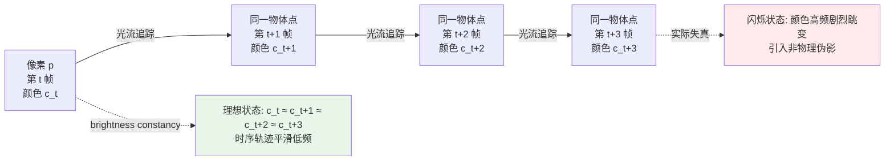
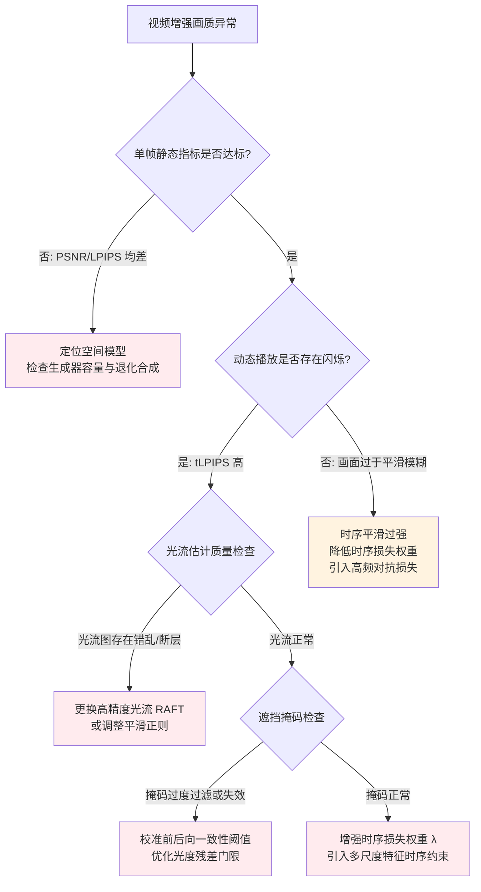

# 第 13 章 · 视频增强基础：时序一致性与退化建模

> "将单帧图像增强模型逐帧独立运行，即可完成视频增强。"
>
> 这是初涉视频增强领域最普遍的认知误区。
>
> 视频增强的核心挑战在于时序一致性：即便单帧输出在空间客观指标上表现优异，若缺乏帧间运动约束，连续播放时仍会出现严重的边缘抖动、闪烁与纹理沸腾。

## 13.0 阅读须知

前十二章系统构建了单帧静态图像增强的技术体系：退化表征、损失度量、架构演进与稳定训练。从本章起，全书迈入 Part IV 的崭新维度：时序视频增强。视频在张量结构上表现为沿时间轴堆叠的图像序列 $(T, C, H, W)$，然而时间轴绝非简单的空间维度复制；它引入了物理运动约束、时序因果性与跨帧信息冗余。若将单帧模型机械地逐帧独立应用，往往会导致客观指标亮眼而动态体验崩溃的断裂。本章与第 14 章将系统解构逐帧推理失效的物理机理，并确立视频时序增强的核心工程范式。

阅读前置依赖：读者需掌握第 1 至 3 章的退化与损失基础、第 6 至 10 章的图像模型架构，以及第 12 章的评估方法论。本章不预设读者具备视频编解码或光流估计的先验经验，涉及的核心概念均在首次出现时给出规范定义。

读完本章，你应当能够掌握：逐帧独立增强引发时序闪烁的物理与统计机理；如何基于光流场构建可微的时序一致性损失；视频压缩与运动模糊等专属退化的合成方法；滑动窗口、单向循环与双向循环三大时序建模范式的工程取舍；以及针对视频画质的时序评估指标（tOF、tLPIPS）与高吞吐流水线优化方案。

**张量记号约定。** 本章沿用全书统一的数学记号，并补充视频专用张量定义：

- $V$：输入视频序列，张量形状表示为 $(T, C, H, W)$，其中 $T$ 为时间帧数；
- $I_t$：第 $t$ 帧图像，张量形状为 $(C, H, W)$；
- $F_{t \to t+1}$：从第 $t$ 帧到第 $t+1$ 帧的稠密光流场，张量形状为 $(2, H, W)$，两个通道分别代表水平位移分量 $u$ 与垂直位移分量 $v$；
- $\mathcal{W}(I, F)$：基于光流场 $F$ 对图像张量 $I$ 执行空间重采样（Warping / 运动补偿）的操作子；
- $M_t^{\text{occ}}$：第 $t$ 帧的二值遮挡掩码（Occlusion Mask），取值为 1 表示光流对应关系可信，取值为 0 表示该像素处于遮挡区或光流失效区。

**专业术语缩写。** 视频章节的核心缩写定义如下：

- **VSR**（Video Super-Resolution，视频超分辨率）：将低分辨率视频重构为高分辨率视频，兼顾空间细节恢复与时序连续性；
- **VFI**（Video Frame Interpolation，视频帧插值）：在相邻两帧之间合成中间时刻图像，提升视频帧率；
- **TC**（Temporal Consistency，时序一致性）：序列帧间的空间演变严格反映真实物理运动，不引入模型虚构的高频闪烁与伪影；
- **Brightness Constancy**（亮度恒定假设）：运动物体表面在相邻微小时间步内的表观色彩保持一致，为光流估计的基础假设；
- **I-Frame / P-Frame / B-Frame**：现代视频编码中的三类核心帧。I 帧（帧内编码帧）独立编码；P 帧（前向预测编码帧）依赖前向参考帧进行运动补偿；B 帧（双向预测编码帧）同时参考前后双向帧；
- **GOP**（Group of Pictures，图像组）：视频编码中以 I 帧为起点的独立解码单元，是码率控制与随机寻帧的基本单位；
- **TAA**（Temporal Anti-Aliasing，时序抗锯齿）：实时图形渲染中利用历史帧重采样累加消除高频锯齿的技术；
- **DLSS / FSR**（Deep Learning Super Sampling / FidelityFX Super Resolution）：现代图形引擎中结合神经网络、历史帧时序累积与运动矢量的超分辨率重建技术；
- **DCN**（Deformable Convolutional Network，可变形卷积）：卷积核采样网格由网络自适应学习偏移量的卷积算子，常用作隐式时序特征对齐；
- **BPTT**（Backpropagation Through Time，随时间反向传播）：循环网络展开后的跨时间步反向传播算法；
- **NVDEC / NVENC**：NVIDIA GPU 硬件视频编解码专用加速单元；
- **PTS**（Presentation Timestamp，显示时间戳）：视频流容器中指示单帧精确渲染时刻的时间戳。

## 13.1 逐帧独立推理的失效分析

通过一个典型实验展现视频时序不一致的具体表现：

选取一段 720P 分辨率的手机录制视频，使用预训练的 Real-ESRGAN 模型对每一帧独立执行 4 倍超分辨率重建，放大至 4K 分辨率。对比观察会呈现出极具反差的视觉分裂：

- **单帧截屏静态观察**：每一帧的细节纹理丰富、边缘锐利，单帧主观评分（MOS）可从 2.5 提升至 4.0；
- **连续动态播放观察**：画面中充斥着剧烈的边缘高频抖动、纹理闪烁以及微观结构漂移，动态主观体验骤降至 2.0 以下。

高频出现的时序失真现象包括：

1. **结构性"呼吸"效应**：静态背景中的刚性边缘（如墙壁线条或静止物体轮廓），由于各帧生成的微观亚像素结构存在随机扰动，连续播放时呈现类似缓慢扩张与收缩的呼吸起伏；
2. **纹理"沸腾"伪影（Texture Boiling）**：镜头平移或物体匀速移动时，物体表面的高频纹理无法随物理运动轨迹平滑迁移，而是在局部随机重构，产生类似液体沸腾的视觉躁动；
3. **平坦区域噪点闪烁**：天空、纯色墙面等低频平坦区域因单帧高频生成先验对传感器微弱噪声的敏锐响应，产生明暗跳变的闪烁斑点；
4. **文本笔画抖动**：微小字符笔画边缘在相邻帧间发生亚像素级位置跳变，导致文字阅读时产生明显的边缘震颤。

失效机理归因：

> 生成式超分辨率模型（如 Real-ESRGAN、HAT-GAN、SUPIR）的本质是依据单帧退化特征预测并生成高频细节。
> 相邻两帧输入之间即便仅存在由传感器热噪声或压缩量化引起的微弱扰动，高灵敏度的生成器也可能将其映射为截然不同的微观纹理分布。
> 这种帧间生成的独立性直接破坏了物理连续性，表现为时序不一致（Temporal Inconsistency）。

因此，单帧 PSNR 或 LPIPS 指标的优劣无法表征序列在时间维度上的稳定性。视频增强必须将时间轴作为独立的物理约束维度进行显式建模。

## 13.2 时序一致性与空间质量的工程权衡

视频增强系统的优化目标必须同时兼顾两个相互制约的维度：

- **空间保真度（Spatial Quality）**：单帧图像具备高清晰度、丰富的高频细节与清晰的结构边缘；
- **时序一致性（Temporal Consistency）**：相邻帧之间的色彩与结构演变严格反映真实物理运动（物体位移、镜头运镜、光照连续变化），消除网络自身引入的高频生成噪声。

这两个目标在优化过程中存在**内在张力（Trade-off）**：

- 过度追求单帧空间锐度：生成器倾向于在局部合成激进的高频先验，放大帧间生成方差，导致严重的纹理闪烁；
- 过度施加时序平滑约束：网络倾向于输出所有可能高频形态的统计平均值，退化为"安全模糊（Safe Blur）"，导致微观细节被抹平，单帧感知指标（LPIPS）与主观清晰度同步恶化。

视频增强算法的演进路径本质上围绕这一帕累托前沿展开：早期方案（2015 至 2017 年）直接套用图像模型；中期方案（2017 至 2020 年）引入显式光流与运动补偿 Warping 模块；现代主流方案（2021 年至今）则通过双向循环网络（如 BasicVSR++）与时空注意力机制（如 VRT/RVRT），将时序信息隐式编码进特征传播流。

## 13.3 时序一致性的物理基础：光流场

将时序连续性转化为严密的数学表达，首先需要建立描述跨帧像素对应关系的运动场，这一核心工具即为**光流（Optical Flow）**。

### 亮度恒定假设与光流方程

光流场定义为空间物体表面点在成像投影平面上的瞬时运动矢量场。

从第 $t$ 帧到第 $t+1$ 帧的光流矢量表示为：

$$
F_{t \to t+1}(x, y) = (u, v)
$$

其物理含义为：第 $t$ 帧处于坐标 $(x, y)$ 处的像素点，在第 $t+1$ 帧中迁移至 $(x + u, y + v)$ 坐标位置。

经典光流建模基于**亮度恒定假设（Brightness Constancy Assumption）**，即运动轨迹上的物理点在微小时间间隔内表观强度不变：

$$
I_{t+1}(x + u, y + v) \approx I_t(x, y)
$$

对左侧执行一阶泰勒展开：

$$
I_{t+1}(x + u, y + v) \approx I_{t+1}(x, y) + \frac{\partial I_{t+1}}{\partial x} u + \frac{\partial I_{t+1}}{\partial y} v
$$

将 $I_{t+1}(x, y) - I_t(x, y)$ 记作时间导数偏导项 $I_t = \partial I / \partial t$，空间偏导记作 $I_x = \partial I / \partial x$ 与 $I_y = \partial I / \partial y$，即可导出经典光流约束方程：

$$
I_x u + I_y v + I_t = 0
$$

（注：公式中的偏导符号 $I_t$ 指代对时间的偏导数 $\partial I / \partial t$，与正文中表示第 $t$ 帧图像张量的 $I_t$ 符号相同但语境有别。）

单像素点仅有一个方程却包含两个未知数 $(u, v)$，属于典型的欠定系统（孔径问题，Aperture Problem），需引入局部平滑性或深度神经网络先验以完成全局求解。

像素轨迹的时序一致性与闪烁现象对比示意如下：



沿光流轨迹观察，物理一致的像素序列在时间轴上应当呈现平滑的低频演变；高频突发跳变即对应视觉闪烁。

### 光流估计工程选型

主流光流估计方案的技术特性对比：

1. **传统变分方法（Lucas-Kanade / TV-L1）**：无需训练，基于优化迭代求解，但对大位移运动与遮挡区域鲁棒性不足；
2. **早期端到端网络（FlowNet2 / PWC-Net）**：引入特征金字塔、Warping 与 Cost Volume 构建，兼顾估计精度与推理吞吐；
3. **现代基准模型：RAFT（Recurrent All-Pairs Field Transforms）**：构建全像素对的 4D 相关体（Cost Volume），通过 GRU 循环单元多步迭代细化位移场，为当前准确率最高的主流开源模型；
4. **轻量与实时演进（GMA / SEA-RAFT）**：引入全局注意力聚合或稀疏加速，显著降低 RAFT 的高分辨率计算开销。

PyTorch 官方 torchvision 模型库提供了 RAFT 的标准实现：

```python
import torch
from torchvision.models.optical_flow import raft_large, Raft_Large_Weights

weights = Raft_Large_Weights.C_T_SKHT_V2
preprocess = weights.transforms()
model = raft_large(weights=weights, progress=False).eval().cuda()

def estimate_flow(frame_a: torch.Tensor, frame_b: torch.Tensor) -> torch.Tensor:
    """
    frame_a, frame_b: (B, 3, H, W) RGB 格式, 取值区间 [0, 1]
    返回: (B, 2, H, W) 由 a 指向 b 的稠密光流场 (u, v)
    """
    a, b = preprocess(frame_a, frame_b)
    with torch.no_grad():
        flow_list = model(a, b)
    return flow_list[-1]   # 取最终迭代细化结果
```

工程选型准则：
- **离线训练与客观评估**：首选 RAFT 等高精度模型，光流质量直接决定时序损失的监督准确度；
- **在线推理与实时部署**：采用 SPyNet、轻量 DCN 隐式对齐或注意力机制，规避 RAFT 迭代机制带来的高延迟。

### 空间重采样 Warping 算子

获取光流场 $F_{t \to t+1}$ 后，通过反向采样操作（Backward Warping），可将第 $t+1$ 帧图像变换至第 $t$ 帧的空间几何视角：

$$
\hat{I}_t(x, y) = I_{t+1}\big(x + u(x, y),\ y + v(x, y)\big)
$$

在 PyTorch 中通过 `F.grid_sample` 实现：

```python
import torch
import torch.nn.functional as F

def warp_with_flow(image: torch.Tensor, flow: torch.Tensor) -> torch.Tensor:
    """
    基于光流将 image 变换至参考帧视角。
    image: (B, C, H, W)
    flow: (B, 2, H, W), 单位为绝对像素偏移
    返回: warped image (B, C, H, W)
    """
    B, _, H, W = image.shape
    yy, xx = torch.meshgrid(
        torch.arange(H, device=image.device),
        torch.arange(W, device=image.device),
        indexing='ij',
    )
    grid = torch.stack([xx, yy], dim=0).float()  # (2, H, W)
    grid = grid.unsqueeze(0) + flow              # (B, 2, H, W)

    # 归一化至 [-1, 1] 区间 (符合 grid_sample 输入规范)
    grid_x = 2.0 * grid[:, 0] / (W - 1) - 1.0
    grid_y = 2.0 * grid[:, 1] / (H - 1) - 1.0
    grid_norm = torch.stack([grid_x, grid_y], dim=-1)  # (B, H, W, 2)

    return F.grid_sample(image, grid_norm, mode='bilinear',
                         padding_mode='border', align_corners=True)
```

关键实现细节：
- **可微性支持**：`F.grid_sample` 对输入图像和采样网格坐标（即光流）均支持一阶反向自动微分，为端到端联合优化提供基础；
- **边界填充模式**：推荐选用 `padding_mode='border'`（边界像素复制）或 `'reflection'`，避免默认 `'zeros'` 在边缘产生的黑边引发虚假损失；
- **插值模式权衡**：双线性插值（`bilinear`）计算效率高；双三次插值（`bicubic`）单点需采集 16 个临近抽头，计算量增加约 4 倍但高频保真度更优；
- **多级累积失真**：多次连续 Warping 会引入逐级插值模糊，因此现代网络（如 BasicVSR）普遍采用深层特征级 Warping 代替连续像素级 Warping。

## 13.4 时序一致性损失函数设计

将亮度恒定约束直接构造为可微目标函数，可有效约束网络输出的时序连续性：

```python
def temporal_consistency_loss(
    model_outputs: list,    # [out_t, out_t+1, ...] 增强后帧序列
    flows: list,            # [flow_t→t+1, ...] 光流序列
) -> torch.Tensor:
    """
    基于光流一致性检验连续帧输出。
    """
    loss = 0.0
    for t in range(len(model_outputs) - 1):
        out_t   = model_outputs[t]
        out_t_1 = model_outputs[t + 1]
        flow    = flows[t]

        # 将 out_{t+1} 反向对齐至 t 时刻坐标系
        warped = warp_with_flow(out_t_1, flow)

        # 计算遮挡掩码, 剔除不可信区域
        occlusion_mask = compute_occlusion_mask(flow)

        # 仅在非遮挡可信区域计算 L1 损失
        loss = loss + (occlusion_mask * (out_t - warped).abs()).mean()

    return loss / max(1, len(model_outputs) - 1)
```

复合优化目标：

$$
\mathcal{L}_{\text{total}} = \mathcal{L}_{\text{spatial}} + \lambda_{\text{temporal}} \mathcal{L}_{\text{temporal}}
$$

权重系数 $\lambda_{\text{temporal}}$ 经验取值通常在 0.1 至 0.5 之间。

核心工程原则：
1. **光流估计源的选取**：光流场必须从**高质量真实输入或清晰真值帧**中提取，严禁直接从模型生成的预测帧中提取光流（预测帧自身的纹理噪声会污染光流场，形成错误的退化反馈）；
2. **中间特征层一致性约束**：在解码器中间特征层施加 Warping 损失，相比在 RGB 空间直接施加约束，能更好地保留高频生成细节并避免过度平滑；
3. **稳健损失核函数**：采用 Charbonnier 或 Huber 损失替代朴素 L1 损失，抑制大位移残差处的梯度发散。

## 13.5 遮挡与光流失效判定

亮度恒定假设在以下两类物理场景下必然失效，必须在损失计算中通过遮挡掩码予以显式屏蔽：

- **物理遮挡与新内容显露（Occlusion & Disocclusion）**：前景物体移动遮挡背景，或原被遮挡背景显露，两帧之间在物理上不存在对应像素；
- **运动模糊与极端形变**：光流模型在快速运动或非刚体形变区域产生错误匹配。

主流遮挡掩码估算方法：

### 1. 前后向光流一致性检验（Forward-Backward Consistency）

根据理想运动的可逆性，前向光流 $F_{t \to t+1}$ 与后向光流 $F_{t+1 \to t}$ 经 Warping 后应互为相反数：

$$
F_{t \to t+1}(x, y) + \mathcal{W}\big(F_{t+1 \to t},\ F_{t \to t+1}\big)(x, y) \approx 0
$$

```python
def forward_backward_check(flow_fwd: torch.Tensor,
                           flow_bwd: torch.Tensor,
                           threshold: float = 1.0) -> torch.Tensor:
    """
    返回 (B, 1, H, W) 掩码, 1 表示像素对应关系可信。
    """
    warped_bwd = warp_with_flow(flow_bwd, flow_fwd)
    diff = (flow_fwd + warped_bwd).norm(dim=1, keepdim=True)
    return (diff < threshold).float()
```

阈值配置：通用场景设为 1.0 像素，大运动场景可放宽至 2.0 至 3.0 像素。

### 2. 空间 Warping 光度残差判定

$$
M^{\text{occ}}_t = \mathbb{1}\big[\|I_t - \mathcal{W}(I_{t+1}, F_{t \to t+1})\|_1 < \tau\big]
$$

当重采样色彩残差超过阈值 $\tau$ 时，判定该区域发生遮挡或光照剧烈跳变。

## 13.6 视频退化模型的特殊性

视频退化并非单帧图像退化的简单叠加，其包含多种时序相关的特有退化源：

### 视频编解码压缩伪影

现代视频编码标准（H.264 / HEVC / AV1）采用基于运动补偿的帧间预测机制。这一机制引入了区别于 JPEG 的复杂伪影：

- **运动补偿拖影与鬼影（Ghosting）**：快速运动导致编码块匹配失准，在解码后产生残留重影；
- **I 帧呼吸效应（Pumping Artifacts）**：I 帧分配较高码率且质量极高，后续 P/B 帧质量逐帧递减，至下一 I 帧突发重置，形成约 1 秒为周期的周期性画质呼吸；
- **GOP 边界跳跃**：图像组（GOP）重置导致累积量化误差清零，引发画面跳跃；
- **突发动态码率塌陷**：剧烈转场或爆炸场景导致瞬时码率预算不足，引发局部宏块马赛克失真；
- **色度抽样滞后**：YUV 4:2:0 下采样导致色度通道压缩剧烈，边缘出现色度运动滞后。

### 运动模糊的时空因果性

快门开启时间内物体位移产生的模糊具有明确物理规律：
- **空间方向性**：模糊核主轴严格沿着物体或镜头的投影运动矢量展宽；
- **时间因果性与互补性**：若第 $t$ 帧因剧烈加速发生重度运动模糊，而第 $t+1$ 帧因减速或转折呈现清晰瞬态，网络可通过时序对齐从相邻帧"借用"高频纹理完成精准复原。

### 卷帘快门失真（Rolling Shutter）

大多数 CMOS 传感器采用逐行曝光扫描机制（单帧读取耗时 10 至 30 毫秒）。快速横滚或镜头平移会导致几何形变：垂直线条倾斜（Jello Effect）、旋转物体呈现螺旋畸变。

### 视频退化合成流水线设计规范

与图像退化不同，**同一视频片段（Clip）内部的全局退化参数必须保持强时序相关性**：

```python
class VideoDegradation:
    """视频退化合成 pipeline。"""

    def __init__(self, image_degrader_cls):
        # image_degrader_cls 应支持显式传入退化参数 (blur_kernel, noise_sigma, ...)
        # 这样我们可以一段视频共享一组参数, 而不是每帧重采样
        self.image_degrader_cls = image_degrader_cls

    def __call__(self, hr_video: torch.Tensor) -> torch.Tensor:
        """
        hr_video: (T, 3, H, W) high-quality video frames
        返回: lr_video (T, 3, H/4, W/4) degraded
        """
        T = hr_video.shape[0]

        # 1. 关键: 整段视频共享一组退化参数
        # 模糊核、噪声 sigma、JPEG quality 一段视频固定, 否则模型会学到
        # "每帧退化都不同" 的错误分布, 引入时序不一致
        clip_params = self._sample_clip_params()
        image_degrader = self.image_degrader_cls(**clip_params)

        lr_video = torch.stack([
            image_degrader(hr_video[t:t+1])
            for t in range(T)
        ], dim=0).squeeze(1)

        # 2. 视频专用退化 (整段一起处理)
        lr_video = self._add_motion_blur(lr_video)
        lr_video = self._video_compression(lr_video)
        lr_video = self._frame_drop_jitter(lr_video)  # 偶尔丢帧/重复帧

        return lr_video

    def _sample_clip_params(self):
        """采样一组退化参数, 整段视频共享。"""
        return {
            'blur_sigma': random.uniform(0.5, 3.0),
            'noise_sigma': random.uniform(0.005, 0.05),
            'jpeg_quality': random.randint(40, 95),
        }

    def _video_compression(self, video):
        """模拟 H.264/H.265 压缩。
        实际用 ffmpeg 编解码, 工程上通过 torchvision.io 或外部调用。
        """
        # 简化: 略
        return video

    def _add_motion_blur(self, video):
        """每帧加一个与运动方向相关的运动模糊。"""
        # 简化: 略
        return video

    def _frame_drop_jitter(self, video):
        """模拟丢帧/重复帧的 jitter。"""
        return video
```

视频退化合成的工程挑战：

1. **I/O 吞吐瓶颈**：视频数据体量庞大，训练通常裁剪为 7 至 15 帧的片段（Clip），数据加载极易成为训练瓶颈；
2. **时序相关性控制**：同一片段内退化参数若完全随机重采样，会导致模型学习到"退化自身在剧烈跳变"的错误先验；若退化参数完全静态，又无法拟合真实相机的动态曝光漂移；工程实践中推荐采用平滑随机游走（Random Walk）驱动参数演变；
3. **不可微编解码集成**：工业级 H.264 / HEVC 编码器不可导，常用"脱机预处理或非可微 FFmpeg 调用 + 梯度截断（Detach）"方案完成数据级增强。

## 13.7 核心视频增强任务分类

| 增强任务 | 输入特征 | 期望输出 | 核心技术难点 |
|---------|---------|---------|-------------|
| **视频超分辨率 (VSR)** | 低分辨率视频序列 | 高分辨率连续视频 | 亚像素信息融合与时序一致性保持 |
| **视频去噪 (VDN)** | 含有传感器噪声视频 | 干净低噪点视频 | 运动估计误差下的运动拖影抑制 |
| **视频去模糊** | 空间/时间混合模糊序列 | 锐利清晰视频 | 模糊核的空时非均匀性与清晰帧借鉴 |
| **视频帧插值 (VFI)** | 低帧率输入序列 | 高帧率平滑序列 | 中间时刻运动轨迹推理与遮挡生成 |
| **视频防抖 (Stabilization)** | 镜头颠簸抖动序列 | 稳定平滑运镜视频 | 全局运动轨迹平滑与边缘画面补全 |
| **视频上色** | 单色黑白历史影像 | 真实饱满彩色视频 | 跨长时序的语义色彩一致性传播 |
| **视频修复 (Inpainting)** | 存在水印/划痕/缺损序列 | 结构完整视频 | 时空掩码关联与跨帧纹理补全 |

各任务关键机理概述：

- **VSR（视频超分辨率）**：核心优势在于多帧之间存在亚像素级的互补采样信息，难点在于构建高效的跨帧对齐机制以聚合这些互补细节；
- **视频去噪**：本质是利用时间维度的多重观测降低噪声方差。若对齐准确，多帧平均可获得极高的信噪比增益；但若对齐失准，则会引发严重的运动重影；
- **视频去模糊**：核心逻辑在于在时序窗口内检索运动相对静止或模糊核退化的清晰瞬态帧，通过特征传播补偿模糊帧；
- **VFI（帧插值）**：由于目标中间帧在输入中完全缺失，网络必须依据前后向光流准确推导中间时刻的双向运动场（如 RIFE 的 IFNet 架构）；
- **视频去抖**：属于几何层面的轨迹优化任务。通常先估计帧间单应矩阵（Homography）或网格变形场，平滑高频抖动轨迹后重投影并裁剪画面边缘；
- **视频修复**：重点依赖跨时间步的注意力机制（如 ProPainter、FuseFormer），从未被遮挡的历史帧或未来帧中穿透检索对应纹理填充当前缺损。

## 13.8 时序建模三大范式

根据跨帧信息的交互与聚合机制，视频增强模型主要划分为三种架构范式：

### 1. 滑动窗口范式（Sliding Window）

以中心帧为基准，每次截取以其为中心的 $N$ 帧局部窗口（典型配置 $N = 5$ 或 $7$），单次推理输出中心帧的增强结果：

```
输入窗口 1: [F_1, F_2, F_3, F_4, F_5] → 输出中心帧 F_3'
输入窗口 2: [F_2, F_3, F_4, F_5, F_6] → 输出中心帧 F_4'
输入窗口 3: [F_3, F_4, F_5, F_6, F_7] → 输出中心帧 F_5'
```

代表架构：EDVR、ToFlow。

- **优势**：训练数据切分自然，各窗口之间相互独立，易于在多 GPU 上并行扩展；
- **局限**：感受野严格受限于窗口长度 $N$，无法捕捉长程时序依赖；相邻窗口间特征存在重复计算，计算冗余度高；序列起止边界需填充虚假帧。

### 2. 单向循环范式（Unidirectional Recurrent）

利用循环神经网络（RNN）单元维持隐状态（Hidden State），沿时间轴顺序单向传递：

```
输入 F_1 结合初始隐状态 h_0 → 输出 F_1' 与更新隐状态 h_1
输入 F_2 结合前一隐状态 h_1 → 输出 F_2' 与更新隐状态 h_2
输入 F_3 结合前一隐状态 h_2 → 输出 F_3' 与更新隐状态 h_3
```

代表架构：RLSP、RSDN。

- **优势**：理论上具备无限长程时序传递能力；推理阶段显存开销恒定；天然适配在线直播与实时通信等流式场景；
- **局限**：无法利用未来帧的上下文先验；深层循环易产生信息衰减与遗忘；训练时基于 BPTT 展开，显存开销随时间步线性增加。

### 3. 双向循环范式（Bidirectional Recurrent）

通过前向与后向两次完整的隐状态传播，使每一帧均能融合全局历史与未来特征：

```
前向传播: F_1 → F_2 → F_3 → ... → F_T  产出前向隐状态 h^f_t
后向传播: F_T → ... → F_3 → F_2 → F_1  产出后向隐状态 h^b_t
特征融合: 最终帧特征 F_t' = G(F_t, h^f_t, h^b_t)
```

代表架构：BasicVSR、BasicVSR++。

- **优势**：全面释放前后双向互补信息，为当前离线 VSR 任务的性能基准；
- **局限**：必须等待完整视频序列加载完毕后方可启动后向传播，完全丧失流式推理能力。

## 13.9 跨帧特征时序对齐机制

在聚合多帧特征前，必须将异构视角的时空特征对齐至基准帧坐标系。主流对齐方式主要有三类：

### 1. 显式光流对齐（Explicit Flow-based Alignment）

利用预训练或联合优化的光流网络计算位移矢量，通过 Warping 算子将邻帧对齐至参考帧：

```python
def explicit_align(frames: torch.Tensor, ref_idx: int = None) -> torch.Tensor:
    """
    将视频序列中所有帧显式对齐至参考帧视角。
    frames: (B, T, C, H, W)
    """
    if ref_idx is None:
        ref_idx = frames.shape[1] // 2

    ref = frames[:, ref_idx]
    aligned = []
    for t in range(frames.shape[1]):
        if t == ref_idx:
            aligned.append(ref)
            continue
        flow = estimate_flow(ref, frames[:, t])
        aligned.append(warp_with_flow(frames[:, t], flow))
    return torch.stack(aligned, dim=1)
```

- **特性**：物理几何含义明确，具备优良的可解释性；但网络性能对光流误差高度敏感，光流失效会导致伪影级联放大。

### 2. 隐式可变形卷积对齐（Implicit Deformable Alignment）

利用可变形卷积（DCNv2 / DCNv4）自适应预测采样网格偏移量（Offset）与调制权重（Modulation Mask）：

- **特性**：不显式依赖刚体运动假设，能更好处理非刚体形变、运动模糊与高动态遮挡；但训练早期偏移量梯度易发散，需配合特征级引导（如 Flow-guided DCN）。

### 3. 时空注意力对齐（Cross-Attention Alignment）

通过跨帧自注意力机制（Spatio-Temporal Attention）计算特征级相关性：

- **代表架构**：VRT（Video Restoration Transformer）、RVRT；
- **特性**：彻底摆脱显式位移场的局部约束，表征能力强大；但计算复杂度与序列长度及分辨率呈平方关系增长，高分辨率场景需采用局部窗口注意力进行加速。

## 13.10 视频质量评估指标体系

视频增强评估在单帧空间指标（PSNR / SSIM / LPIPS）的基础上，引入视频专用的时序质量度量：

### 时序客观评估指标

1. **tOF（Temporal Optical Flow Consistency）**：分别计算输入序列与输出序列的光流场，度量二者运动矢量的一致性，物理含义为输出视频的动态流向应严格吻合输入运动；
2. **tLPIPS（Temporal LPIPS）**：计算经过运动补偿对齐后的相邻预测帧之间的感知距离（LPIPS），指标越低代表时序连贯性越好；
3. **WE（Warping Error）**：使用真值光流将第 $t+1$ 帧重采样回第 $t$ 帧后计算像元级 L1 残差；
4. **Flickering Index（频域闪烁指数）**：沿时间轴分析各像素色彩演变序列的高频能量分布，量化非物理抖动。

```python
def temporal_lpips_warped(frames: torch.Tensor, flows: list,
                          lpips_fn) -> float:
    """
    frames: (T, C, H, W) 增强输出视频张量
    flows: 长度为 T-1 的列表, 每个元素为前向光流 (1, 2, H, W)
    返回: 经过运动补偿对齐后的相邻帧平均感知距离 (tLPIPS)
    """
    losses = []
    for t in range(frames.shape[0] - 1):
        # 必须先执行运动补偿, 避免将物体真实运动误判为时序不一致
        warped = warp_with_flow(frames[t+1:t+2], flows[t])
        losses.append(lpips_fn(frames[t:t+1], warped).item())
    return sum(losses) / len(losses)
```

### 动态主观评测协议

视频主观评测必须在动态循环播放状态下执行：
- 单次评测片段长度控制在 5 至 10 秒；
- 提供前后连续无缝循环播放（Looping）与逐帧穿梭检查（Shuttle Control）功能，确保受试者能够捕捉亚像素级闪烁；
- 评测样本量通常需达到图像实验的数倍，以充分覆盖运动幅度与场景复杂度的长尾分布。

## 13.11 与实时图形渲染技术的关联

视频超分辨率与现代图形引擎中的时序超采样技术在数学原理上高度相通：

- **TAA（时序抗锯齿）**：利用相机投影矩阵与前向运动矢量（Motion Vectors），将前一渲染帧变换至当前帧执行指数加权平均（EMA），消除几何着色走样。其核心难点（如鬼影压制、历史颜色截断 Clamp）与视频增强完全一致；
- **DLSS / FSR / XeSS**：现代游戏引擎直接由 G-Buffer 导出**亚像素精度的精准运动矢量与深度图**，免去了光流估计的病态求解过程，因此在相同算力下可达成更高的重建上限；
- **通用 VSR**：面向无 G-Buffer 辅助的通用自然视频，必须在受损低质输入上独立估计光流与运动，技术挑战更为严峻。

## 13.12 视频增强与视频生成的边界

区分判据对比：

| 评估维度 | 视频增强 (Video Enhancement) | 视频生成 (Video Generation) |
|---------|-----------------------------|----------------------------|
| **输入条件** | 包含退化信息的低画质视频 | 文本 Prompt / 静态首帧参考 |
| **核心目标** | 空间保真复原、严格忠实原片 | 无中生有、创意内容合成 |
| **时序约束** | 严格受制于原始物理运动轨迹 | 遵循先验分布的自由演变 |
| **失真容忍度** | 极低（严禁虚构非真实结构） | 较高（以视觉合理性为主） |
| **前沿代表** | BasicVSR++、RealBasicVSR | Sora、Gen-3、Kling、Veo |

生成式视频扩散模型（如 Upscale-A-Video、VEnhancer）正逐步被引入作为超分辨率先验，但在医疗影像、监控安防及司法取证等严肃场景中，必须严格防范生成式模型凭空编造虚假高频细节的风险。

## 13.13 视频增强系统工程要点

### 高吞吐视频解码流水线

- 视频解码是训练与离线批处理的典型 CPU 瓶颈；
- 推荐使用基于 FFmpeg 与 NVDEC 硬件加速的专用库（如 TorchCodec 或 NVIDIA DALI），实现 GPU 显存内直接解码输出：

```python
from torchcodec.decoders import VideoDecoder

# 显式指定 device="cuda", 激活 NVDEC 硬件硬解码加速
decoder = VideoDecoder("input_video.mp4", device="cuda")
for frame in decoder:
    tensor_gpu = frame.data       # 解码后直接驻留在 GPU 显存的张量 (C, H, W)
    timestamp = frame.pts_seconds # 对应的精准显示时间戳
```

### 显存切块与流式管理

4K 序列多帧并发处理易引发显存溢出（OOM），工业级推理需采用多维切块策略：
- **空间切块（Spatial Tiling）**：将每帧分割为带有重叠边缘（Overlap Margin）的局部 Patch 分块推理，融合时采用线性渐变加权消除拼接缝；
- **时间切片（Temporal Chunking）**：将长视频截断为 30 至 60 帧的连续片段，片段间保留少量上下文重叠以维持循环网络的隐状态连续性；
- **混合精度推理**：全面启用 FP16 或 BF16 格式，显存占用降低 50% 且算力吞吐翻倍。

## 13.14 视频质量故障排查流程

当视频增强系统输出画质未达预期时，可遵循以下分层排查路径：



1. **单帧基准校验**：若单帧截屏清晰度不足，表明空间特征提取存在缺陷，需回溯优化图像级生成器；
2. **时序稳定性校验**：单帧清晰但连续播放闪烁，表明网络缺乏时序一致性约束；
3. **光流精度排查**：可视化训练中的光流位移场，排查是否存在位移发散与拓扑错乱；
4. **遮挡过滤审查**：检查遮挡掩码是否出现大面积误判，确保损失仅在有效运动区域生效；
5. **退化合成核验**：确认合成训练流水线中是否覆盖了目标场景特有的 H.264/HEVC 压缩与运动模糊分布。

## 13.15 小结

1. **时序一致性是核心命题**：视频增强绝非单帧图像模型的逐帧重复，消除闪烁与纹理沸腾需要显式时序约束；
2. **光流与空间重采样**：基于亮度恒定假设建立像素对应关系，通过 `F.grid_sample` 实现可微反向运动补偿；
3. **遮挡掩码防护**：前后向光流一致性检验与光度残差是滤除不可信运动区域的关键手段；
4. **视频专属退化**：H.264/HEVC 帧间预测伪影、周期性 I 帧呼吸与因果运动模糊构成视频专有退化特征；
5. **时序建模范式**：滑动窗口适合并行局部处理，单向循环适合实时流式，双向循环（BasicVSR++）主导离线高保真重建；
6. **特征对齐体系**：涵盖显式光流、隐式可变形卷积（DCN）以及全局跨帧注意力机制；
7. **全维度评估与工程部署**：结合空间指标与时序指标（tOF、tLPIPS），配合 NVDEC 硬件解码与时空切块突破算力与显存瓶颈。

---

> 下一章 [前沿视频增强模型与系统架构](14-video-models.md) 深入解析 BasicVSR++、RIFE 帧插值、ProPainter 视频修复与生产级部署流水线。
