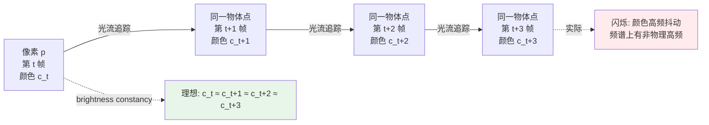

# 第 13 章 · 视频不只是图像加时间

> "把图像增强模型每帧跑一遍，就是视频增强了。"
>
> 这是一个初学者最常犯的错误。
>
> 视频增强有时序一致性这个独立问题 - 单独把每一帧做"好"，串起来可能完全没法看。

## 13.0 阅读须知

前十二章基本上把"一张图"的世界讲完了：怎么建模退化、怎么做表示、怎么训、怎么评。从本章开始进入 Part IV，主题是**视频**。视频和图像最容易让人误判的地方在于：它在数据形式上确实就是"图像 + 一个时间维"，所以一个很自然的想法是"把图像模型每帧跑一遍"。这章和第 14 章的主要工作，就是把这个想法证伪，然后把"为什么不行"系统化为可工程化的对策。

这章假设读者已经掌握：第 1-3 章的退化与损失基础、第 6-10 章的图像端模型架构、第 12 章的评估方法论。不预设读者做过视频编码、光流估计或时序建模 - 涉及到的概念都在本章首次出现时给出全称和一句话定义。

读完之后应该能回答：为什么逐帧跑图像模型会闪烁；时序一致性怎么从概念变成损失函数；视频压缩相比 JPEG 多出哪些伪影需要专门处理；常见的视频增强任务（VSR、VFI、去噪、去模糊）各自的难点是什么；滑动窗口与循环网络两种范式怎么选；评估视频质量时该额外看哪些指标。

**记号约定。** 全书统一的张量记号在本章继续沿用，并补充几个视频专用记号：

- $V$：一段视频，形状写作 $(T, C, H, W)$，$T$ 是帧数
- $I_t$：第 $t$ 帧的图像，形状 $(C, H, W)$
- $F_{t \to t+1}$：从第 $t$ 帧到第 $t+1$ 帧的光流场，形状 $(2, H, W)$，两个通道分别是水平和竖直位移
- $\mathcal{W}(I, F)$：用光流 $F$ 把图像 $I$ 做 warping（运动补偿）的结果
- $M_t^{\text{occ}}$：第 $t$ 帧的遮挡掩码（occlusion mask），1 表示该像素可信、0 表示被遮挡或光流不可靠

**首次出现的缩写。** 视频章节涉及的缩写在此先列定义，正文使用时不再重复全称：

- **VSR**（Video Super-Resolution，视频超分辨率）：把低分辨率视频提升到高分辨率的任务
- **VFI**（Video Frame Interpolation，视频帧插值）：在两帧之间生成中间帧，把低帧率视频提升到高帧率
- **TC**（Temporal Consistency，时序一致性）：相邻帧之间的变化只反映真实场景变化，不应引入模型自身造成的抖动或闪烁
- **Brightness Constancy**（亮度恒定假设）：同一物体的同一点在相邻帧的颜色基本不变，这是几乎所有光流方法的基础假设
- **I-Frame / P-Frame / B-Frame**：视频编码里三类帧。I 帧（Intra）独立编码，类似 JPEG 一张图；P 帧（Predicted）基于前面的 I/P 帧做预测编码；B 帧（Bi-directional）同时参考前后两个方向的 I/P 帧
- **GOP**（Group of Pictures，图像组）：视频编码里以 I 帧为锚的一组帧（典型 30 帧一组），是码率控制和随机访问的基本单位
- **TAA**（Temporal Anti-Aliasing，时序抗锯齿）：游戏与实时渲染里用历史帧累积来抗锯齿和降噪的技术，是"利用相邻帧信息"思路在渲染里的具体形态
- **TXAA**：NVIDIA 提出的 TAA 改进版，结合了 MSAA 与时序累积
- **DLSS**（Deep Learning Super Sampling，深度学习超采样）：NVIDIA 在游戏里把低分辨率渲染 + 历史帧通过神经网络升采样到高分辨率的技术
- **FSR**（FidelityFX Super Resolution）：AMD 的同类方案，1.x 走传统算法、2.x 起加入时序累积，3.x 加入帧生成
- **DCN**（Deformable Convolution Network，可变形卷积）：卷积核采样位置由网络学习决定的卷积，常用作隐式时序对齐
- **BPTT**（Backpropagation Through Time，时间反向传播）：训练循环网络时把时间维展开后做反传，是循环 VSR 的标准训练方式
- **NVDEC / NVENC**：NVIDIA GPU 的硬件视频解码 / 编码单元
- **PTS**（Presentation Timestamp，显示时间戳）：解码视频时每帧附带的播放时刻戳

整章涉及的数学不超过本科水平的向量微积分；涉及的视频编码知识只到能解释伪影现象、不展开熵编码与运动估计的工程细节，那是另一个领域的几本书。

## 13.1 一个直观的失败案例

先用一个具体场景把问题逼出来。

拿一段 720P 手机录制的低质量视频，用第 6-7 章讲过的 Real-ESRGAN 在 4 倍尺度上每帧独立超分到 4K。这是最朴素的"图像模型逐帧跑"做法。结果两种看法对比鲜明：

- **单帧抓出来看**：每一帧都比原图清晰得多，边缘锐利、细节丰富，主观打分 MOS 能从 2.5 拉到 4.0
- **当作视频连续播放**：边缘**抖动**、纹理**闪烁**、细节**鬼影**，主观打分回到 2.0 甚至更低

可以列出几种典型症状：

- 一个完全静止的物体（比如墙上的画框），每一帧的纹理细节略有不同，连起来看像在"呼吸"
- 眼睛追踪一个匀速移动的物体（比如走过镜头的人），物体表面在"沸腾"，像水面反光
- 平坦区域（天空、墙面、桌面）出现一闪一闪的高频纹理，像老电视的雪花点
- 文字边缘在每帧之间有亚像素级抖动，连续看像在"颤抖"

为什么会这样？把原因拆开看：

> Real-ESRGAN 是**生成式**模型，在每一张图上"生成"细节而不是"恢复"细节（第 1 章已强调过这个区别）。
> 同一物体在相邻两帧的输入里只有微小差异（来自传感器噪声、JPEG 量化、运动），但生成出来的细节可能完全不同。
> 视觉上的表现：**时序不一致** = 闪烁、沸腾、抖动。

这不是 Real-ESRGAN 的 bug，是**所有不显式约束时序的模型在视频上都会出现的现象**。把模型换成 SwinIR、HAT 甚至最新的 SUPIR 也一样。生成能力越强、细节越锐利，时序不一致问题反而越严重 - 这是这个领域里反复出现的 trade-off。

把这件事再概念化一遍：单帧 PSNR/LPIPS 是**与时间无关**的指标，所以即便指标完美，也不能保证序列在时间维上稳定。视频问题本质上不只是"更多张图"，而是**多了一个新坐标轴**，这个坐标轴上有它自己的损失、它自己的退化、它自己的评估指标。

## 13.2 时序一致性是独立问题

把视频增强的目标重新定义清楚，避免后面所有讨论散掉。任何视频增强系统至少要同时满足两个目标：

- **空间质量**：每帧本身够清晰、细节够丰富、伪影够少。这一项是图像增强目标的直接延伸，第 1-12 章讲的所有内容都还成立。
- **时序一致性**：相邻帧之间的变化只反映真实场景的变化（物体真的在动、相机真的在动、光照真的在变），不引入"模型自己造出来的噪声"。

这两个目标在工程上**部分冲突**：

- 让模型生成更多细节 → 同一物体在不同帧的细节可能不一致 → 闪烁
- 让模型在时序上更稳定 → 容易输出"安全模糊"（safe blur），细节被抹掉 → PSNR 升 LPIPS 降但主观差

视频增强的工程难点正是**同时优化这两个目标**。从研究路径上看，过去十年大致经历了三个阶段：第一阶段（2015 前后）只关心空间质量，时序问题被忽略；第二阶段（2017-2020）把光流和 warping 显式引入网络，开始系统性处理时序；第三阶段（2021 至今）转向循环网络与跨帧注意力，把时序信息隐式编码进特征传播路径。第 14 章会沿着这条路径讲具体模型。

工程实践里有一条朴素经验值得先记下：**如果一个视频模型在单帧 PSNR 上比图像模型还高 2 dB，又没有时序损失或多帧输入，那这个比较不公平 - 它没有解决视频问题，只是在做更好的图像问题。**

## 13.3 时序一致性的物理基础：光流

要把"时序一致"从感觉变成数学，必须先有一个能描述"两帧之间什么对应什么"的工具。这个工具就是**光流**。

什么叫"时序一致"？数学上的版本是这样：相邻两帧之间，对应像素的颜色应该（基本）不变。这里的"对应像素"由光流定义：物体表面上某一点在屏幕空间的运动矢量场。

记号上写作

$$
F_{t \to t+1}(x, y) = (u, v)
$$

意思是：第 $t$ 帧坐标 $(x, y)$ 位置的像素，在第 $t+1$ 帧移动到了 $(x + u, y + v)$。$u$ 是水平位移、$v$ 是竖直位移，单位是像素，可以是亚像素小数。整个光流场就是 $(H \times W)$ 个这种二维矢量。

在此基础上，时序一致性的最小数学表达就是**亮度恒定假设**（brightness constancy）：

$$
I_{t+1}(x + u, y + v) \approx I_t(x, y)
$$

中间步骤：把 $I_{t+1}$ 在新位置 $(x + u, y + v)$ 做泰勒展开，

$$
I_{t+1}(x + u, y + v) \approx I_{t+1}(x, y) + \frac{\partial I_{t+1}}{\partial x} u + \frac{\partial I_{t+1}}{\partial y} v
$$

再代入假设并把 $I_{t+1}(x, y) - I_t(x, y) = \partial I / \partial t$，就得到经典的光流方程

$$
I_x u + I_y v + I_t = 0
$$

这是一个像素一个方程、两个未知数（$u, v$）的欠定系统，是为什么"估光流"本身就是一个 ill-posed 问题，需要额外约束（局部平滑、稀疏假设、神经网络先验）才能解出来。

把"一个像素逐帧的轨迹"画出来直觉上更清晰。假设有一个红色像素在视频里沿斜线匀速移动，理想情况下它每帧的颜色都是相同的红色；如果增强模型在每一帧把它换成了略不同的红色，那连成时间序列就是一条颜色抖动的曲线，频谱上能看到一个不属于物理世界的高频成分 - 这就是闪烁在频域里的样子。



这张图概念上回答了"时序一致"是什么：沿一条光流轨迹走，像素颜色应该是低频曲线；高频成分就是闪烁。

如果增强模型遵守 brightness constancy，输出视频在时序上就一致；不遵守就闪烁。本章后面所有损失函数、对齐操作、评估指标的设计，都是围绕这一行不等式展开。

### 光流的工程

光流估计本身是计算机视觉里一个独立的子领域，发展了三十多年。这里只列工程上目前主流的方法和它们之间的取舍。

主流光流估计方法：

- **传统算法**：Lucas-Kanade（局部 patch 解光流方程）、Farneback（多项式展开）、TV-L1（变分方法，OpenCV 提供）。优点是无需训练、CPU 可跑；缺点是对大位移和遮挡处理差。
- **早期深度学习**：FlowNet（2015）首次端到端学光流 → FlowNet 2.0（2017，堆叠改进）→ PWC-Net（2018，引入金字塔 + warping + cost volume）。准确率随网络结构演进显著提升。
- **当前主流：RAFT**（Recurrent All-Pairs Field Transforms，2020）。RAFT 把所有像素对的相似度构成 4D cost volume，然后用一个 GRU 单元在这个 volume 上做多步迭代细化光流。这是当前最常用的开源光流网络。
- **后续改进**：GMA（Global Motion Aggregation，2021，引入跨像素聚合）、SEA-RAFT（Sparse and Efficient RAFT，2024，把推理速度提高几倍）。

PyTorch 生态里 RAFT 已经被 torchvision 收进官方模型库，可以直接用预训练权重：

```python
# 用 RAFT 估计光流 (推荐用 torchvision 的预训练版本)
from torchvision.models.optical_flow import raft_large, Raft_Large_Weights

weights = Raft_Large_Weights.C_T_SKHT_V2
preprocess = weights.transforms()
model = raft_large(weights=weights, progress=False).eval().cuda()


def estimate_flow(frame_a: torch.Tensor, frame_b: torch.Tensor) -> torch.Tensor:
    """
    frame_a, frame_b: (B, 3, H, W) RGB in [0, 1]
    返回: (B, 2, H, W) flow from a to b (u, v)

    注意:
    - RAFT 要求 H 和 W 都能被 8 整除, 否则需要 pad 到 8 的倍数再 crop 回来
    - preprocess 会做归一化, 不要重复归一化
    - 推理显存随 H*W 线性增长, 4K 单卡可能 OOM, 要 tile
    """
    a, b = preprocess(frame_a, frame_b)
    with torch.no_grad():
        flow_list = model(a, b)
    return flow_list[-1]   # 最终迭代结果
```

工程上选择光流方法的几个原则：

1. **离线训练阶段**：用 RAFT 这种高精度但慢的方法，光流质量直接决定时序一致性损失的有效性
2. **在线推理阶段**：用更轻量的方法（PWC-Net、SEA-RAFT 或者直接走 DCN 隐式对齐），延迟敏感
3. **极端低延迟（手机端、实时通讯）**：放弃显式光流，用 3D 卷积或时序注意力做隐式对齐
4. **遮挡处理**：任何方法都得配前后向一致性检查（13.5 节），单向光流不能直接信任

### Warping：用光流变换图像

光流估出来之后，最常用的下一步是 warping：给定光流 $F_{t \to t+1}$，把第 $t+1$ 帧 warp 到第 $t$ 帧的视角，让两帧的"同一物体"在同一像素位置对齐。

数学上 warping 就是反向取样：

$$
\hat{I}_t(x, y) = I_{t+1}\big(x + u(x, y),\ y + v(x, y)\big)
$$

PyTorch 里这件事用 `F.grid_sample` 一行就能做：

```python
import torch
import torch.nn.functional as F

def warp_with_flow(image: torch.Tensor, flow: torch.Tensor) -> torch.Tensor:
    """
    用光流把 image warp 到目标位置。
    image: (B, C, H, W)
    flow: (B, 2, H, W), 单位是像素位移
    返回: warped image
    """
    B, _, H, W = image.shape
    # 创建标准 grid
    yy, xx = torch.meshgrid(
        torch.arange(H, device=image.device),
        torch.arange(W, device=image.device),
        indexing='ij',
    )
    grid = torch.stack([xx, yy], dim=0).float()  # (2, H, W)

    # 加上 flow
    grid = grid.unsqueeze(0) + flow              # (B, 2, H, W)

    # 归一化到 [-1, 1] (grid_sample 的要求)
    grid_x = 2.0 * grid[:, 0] / (W - 1) - 1.0
    grid_y = 2.0 * grid[:, 1] / (H - 1) - 1.0
    grid_norm = torch.stack([grid_x, grid_y], dim=-1)  # (B, H, W, 2)

    return F.grid_sample(image, grid_norm, mode='bilinear',
                         padding_mode='border', align_corners=True)
```

实现上的几个坑：

- **gradient flow**：`grid_sample` 对 `image` 可微，但默认情况下对 `grid`（也就是光流）不可微。如果你想在 warping 里反传光流梯度（端到端训练光流网络），需要设 `align_corners` 与正确的归一化方式，并确认 PyTorch 版本支持双向梯度。
- **padding_mode**：默认 `zeros` 会让出界位置变黑，损失上会被算作"完全不同"。视频任务里通常用 `border`（边缘复制）或 `reflection`。
- **bilinear vs bicubic**：grid_sample 默认 bilinear，速度快但锐利度低；bicubic 更锐利但显存翻倍。
- **多次 warp 的累积误差**：每次 warp 都会有亚像素插值损失，对一段视频反复 warp（比如双向循环里前向再后向）会让细节越来越糊。这是为什么 BasicVSR 这类模型用"特征级 warping"而不是"像素级 warping"。

Warping 是视频增强里反复使用的基础操作 - 用它来对齐相邻帧、做时序聚合、做时序一致性损失、做帧插值的初始预测。后面所有节会反复用到它。

## 13.4 时序一致性损失

把 brightness constancy 写成可微损失，加进训练目标，这是给图像模型"补"时序约束最直接的方式。

```python
def temporal_consistency_loss(
    model_outputs: list,    # [out_t, out_t+1, ...]  增强后的帧
    flows: list,            # [flow_t→t+1, ...]
) -> torch.Tensor:
    """
    用光流验证: 相邻帧的增强输出应该满足 brightness constancy。
    """
    loss = 0.0
    for t in range(len(model_outputs) - 1):
        out_t   = model_outputs[t]
        out_t_1 = model_outputs[t + 1]
        flow    = flows[t]

        # 把 out_{t+1} warp 回 t 时刻
        warped = warp_with_flow(out_t_1, flow)

        # 算遮挡 mask (光流不可靠的位置)
        occlusion_mask = compute_occlusion_mask(flow)

        # 在非遮挡位置算 L1
        loss = loss + (occlusion_mask * (out_t - warped).abs()).mean()

    return loss / max(1, len(model_outputs) - 1)
```

加到训练总损失里：

$$
\mathcal{L} = \mathcal{L}_{\text{spatial}} + \lambda \mathcal{L}_{\text{temporal}}
$$

$\lambda$ 经验值 0.1-0.5。太小不起作用，太大会让模型"宁可糊也不动"。

这个损失看起来简单，工程上有几个细节决定它能不能真起作用：

1. **光流必须用 ground-truth 输入帧来估**，而不是用模型输出帧。原因：模型输出的细节是生成的、有时序不一致，用它去估光流会把噪声引到约束里，本末倒置。光流应该是"几何 ground truth"。
2. **特征级一致性比像素级一致性更稳**。在中间特征图上做 warping + L1，比直接在 RGB 上做更不容易把模型逼向"安全模糊"。具体见第 14 章 BasicVSR++ 的特征传播设计。
3. **多尺度时序损失**：在多个分辨率层级都加 TC 损失，让模型既保证大范围对齐也保证局部细节稳定。
4. **梯度截断**：光流误差大的像素，loss 梯度可能爆炸。给 (out_t - warped) 加一个 Huber 损失或者 clip 阈值，比直接 L1 稳。

## 13.5 遮挡：光流不可靠的地方

Brightness constancy 假设有两个明显失效的场景，必须显式屏蔽，否则时序一致性损失会变成"逼模型在错的地方对齐"。

- **遮挡（occlusion）**：物体被前景挡住，在 $t+1$ 帧里它不存在；反过来 disocclusion 是 $t$ 帧里被挡住、$t+1$ 帧露出来的部分。这些位置的"对应关系"在数学上没定义。
- **运动模糊 + 大位移**：光流估计本身错。RAFT 在快速运动或大遮挡下也会输出"看起来合理"的光流，但实际位置是错的。

时序一致性损失必须**屏蔽这些位置**。常见的遮挡 mask 估计有三种思路：

### 前后向一致性

如果前向光流 $F_{t \to t+1}$ 和后向光流 $F_{t+1 \to t}$ 经过 warping 后能"回到自己"，那这个像素就是可信的；反之就是遮挡或者光流错。

数学上：理想情况下 $F_{t \to t+1}(x, y) + F_{t+1 \to t}(x + u, y + v) = 0$。也就是把后向光流 warp 到第 $t$ 帧视角再和前向光流相加，应该为零。

```python
def forward_backward_check(flow_fwd: torch.Tensor,
                           flow_bwd: torch.Tensor,
                           threshold: float = 1.0) -> torch.Tensor:
    """
    返回 (B, 1, H, W) 的 mask, 1 表示像素可信。
    """
    # warp flow_bwd 到第 t 帧的视角
    warped_bwd = warp_with_flow(flow_bwd, flow_fwd)
    # 期望: flow_fwd + warped_bwd ≈ 0
    diff = (flow_fwd + warped_bwd).norm(dim=1, keepdim=True)
    return (diff < threshold).float()
```

threshold 的选择按场景：1 像素是默认值，对大运动场景可放宽到 2-3 像素。

### Warping 残差

另一种思路是直接看 warping 后的颜色残差：

$$
M^{\text{occ}}_t = \mathbb{1}\big[\|I_t - \mathcal{W}(I_{t+1}, F_{t \to t+1})\|_1 < \tau\big]
$$

颜色残差大的位置认为是遮挡。这个方法对静态场景有效、对动态光照（光线随时间变化）会误判。

### 显式遮挡预测网络

更现代的方法是直接训一个网络预测遮挡 mask，输入是两帧 + 光流。代表工作有 MaskFlowNet。优点是准；缺点是要专门训。

实际工程里前两种方法配合使用就足够，遮挡预测网络主要在专业视频修复 / 帧插值里见到。

## 13.6 视频退化的特殊性

视频不只是"多张图"，它的退化模型有视频专属内容。把第 1 章 / 第 5 章讲的图像退化链直接搬到视频是不够的 - 视频压缩、运动模糊、卷帘快门都是图像问题里不存在的退化源。

### 视频压缩伪影

H.264 / H.265 / AV1 这些视频编码标准的基本思路：用 I 帧锁定每隔几十帧的"全图基准"，用 P/B 帧通过运动补偿 + 残差编码只存"变化部分"，省下大量码率。这套设计带来的伪影比 JPEG 复杂得多。

主要伪影类型：

- **运动估计误差导致的拖影**：编码器猜错运动方向，解码后物体边缘出现"鬼影"（ghosting）。在快速运动场景或细小物体上最严重。
- **关键帧（I 帧）周期性质量震荡**：I 帧用相对充足的码率独立编码、质量高；后续 P/B 帧的质量逐渐下降，直到下一个 I 帧重置。播放时能看到大约每 1 秒一次的"质量呼吸"。
- **GOP 边界效应**：GOP（Group of Pictures，图像组）的边界处编码器重置参考帧，连续误差累积在这里清零，可能看到一帧突然变清晰、再慢慢变糊的循环。
- **Bitrate spikes**：码率控制是预算游戏 - 突然出现高动态场景（爆炸、转场、镜头快速摇移）时，编码器没有足够码率描述每个细节，整段画质崩。
- **Chroma 残留**：和 JPEG 一样，色度通道被下采样得更狠，色块和绿紫色边在视频里能看到"色度滞后"。

视频增强模型如果想"反推"这些伪影，理想情况下退化合成阶段要复现它们。第 14 章会讲 BasicVSR++ / RealBasicVSR 等模型怎么用 ffmpeg 在数据合成里加 H.264 编解码。

### 运动模糊（运动相关）

相机抖动或物体快速移动导致的模糊。和图像里的散焦模糊不同，视频运动模糊有两个特殊性质：

1. **方向与运动方向一致**：模糊核近似一条线段，方向由物体（或相机）在曝光时间内的位移决定。同一帧不同物体可能有不同方向的模糊。
2. **时间上是因果的**：第 $t$ 帧的模糊是 $[t - \Delta, t]$ 时段内光积累的结果。理论上知道连续多帧的清晰版本，可以"重建"这个模糊核。

视频去模糊的关键洞察：**用相邻帧提供"清晰参考"**。如果第 $t$ 帧某个区域模糊，但第 $t+1$ 帧那个区域刚好清晰（运动停止瞬间、或者运动方向变化使模糊核简化），可以借用。这就是 EDVR、CDVD-TSP 等视频去模糊网络的基本工作原理。

### 卷帘快门（Rolling Shutter）

绝大多数手机和无人机的 CMOS 传感器是逐行（或逐块）扫描读出的：从图像顶部开始，每隔几十微秒读一行，整张图读完可能花 10-30 毫秒。这段时间内如果物体或相机在动，就会产生几何变形：

- 静止物体保持原形
- 水平移动的物体出现"歪斜"（jello effect）
- 旋转物体出现"螺旋扭曲"
- 镜头快速横摇时垂直直线变弯

这是手机视频特有的退化，专业全局快门相机（CCD 或 CMOS global shutter）和老电影 / 胶片都没有这个问题。

去卷帘算法存在（RSCD 等），但通常需要 IMU 数据或者多帧光流估计扫描偏移。在通用视频增强里大多不专门处理 - 当作"小幅几何噪声"被其他时序约束 smooth 掉。

### 视频专用合成 pipeline

第 5 章讲的图像退化 pipeline 在视频上要扩展。最关键的差别：**同一段视频的退化参数必须相关**，而不是每帧独立随机。

```python
class VideoDegradation:
    """视频退化合成 pipeline。"""

    def __init__(self, image_degrader_cls):
        # image_degrader_cls 应支持显式传入退化参数 (blur_kernel, noise_sigma, ...)
        # 这样我们可以一段视频共享一组参数, 而不是每帧重采样
        self.image_degrader_cls = image_degrader_cls

    def __call__(self, hr_video: torch.Tensor) -> torch.Tensor:
        """
        hr_video: (T, 3, H, W) high-quality video frames
        返回: lr_video (T, 3, H/4, W/4) degraded
        """
        T = hr_video.shape[0]

        # 1. 关键: 整段视频共享一组退化参数
        # 模糊核、噪声 sigma、JPEG quality 一段视频固定, 否则模型会学到
        # "每帧退化都不同" 的错误分布, 引入时序不一致
        clip_params = self._sample_clip_params()
        image_degrader = self.image_degrader_cls(**clip_params)

        lr_video = torch.stack([
            image_degrader(hr_video[t:t+1])
            for t in range(T)
        ], dim=0).squeeze(1)

        # 2. 视频专用退化 (整段一起处理)
        lr_video = self._add_motion_blur(lr_video)
        lr_video = self._video_compression(lr_video)
        lr_video = self._frame_drop_jitter(lr_video)  # 偶尔丢帧/重复帧

        return lr_video

    def _sample_clip_params(self):
        """采样一组退化参数, 整段视频共享。"""
        return {
            'blur_sigma': random.uniform(0.5, 3.0),
            'noise_sigma': random.uniform(0.005, 0.05),
            'jpeg_quality': random.randint(40, 95),
        }

    def _video_compression(self, video):
        """模拟 H.264/H.265 压缩。
        实际用 ffmpeg 编解码, 工程上通过 torchvision.io 或外部调用。
        """
        # 简化: 略
        return video

    def _add_motion_blur(self, video):
        """每帧加一个与运动方向相关的运动模糊。"""
        # 简化: 略
        return video

    def _frame_drop_jitter(self, video):
        """模拟丢帧/重复帧的 jitter。"""
        return video
```

视频退化合成的工程难点：

1. **大数据量**：一秒 30 帧、几分钟视频等于几千张图。训练样本通常截短到 7-15 帧的 clip，但 I/O 仍是瓶颈。
2. **时序一致退化**：同段视频的某些退化参数必须固定，避免模型学到错误的"每帧不同退化"分布。但完全固定也不真实 - 真实视频里 ISO、白平衡、对焦确实在缓慢变化，所以更精致的方案是让参数沿时间做平滑随机游走（random walk）而不是完全静止。
3. **可微 ffmpeg**：理想情况是可微 H.264 编码器，让压缩伪影能反传梯度，但目前没有完美方案。RealBasicVSR 等工作用"非可微 ffmpeg + detach 梯度"的妥协方案。

## 13.7 几种主要的视频增强任务

| 任务 | 输入 | 输出 | 主要挑战 |
|------|------|------|---------|
| **Video SR (VSR)** | 低分辨率视频 | 高分辨率视频 | 时序一致 + 利用多帧信息 |
| **视频去噪** | 含噪视频 | 干净视频 | 利用相邻帧的"干净副本" |
| **视频去模糊** | 模糊视频 | 清晰视频 | 模糊核空间和时间变化 |
| **帧插值 (VFI)** | 低帧率视频 | 高帧率视频 | 中间帧不存在，必须生成 |
| **视频去抖** | 抖动视频 | 稳定视频 | 区分相机抖动和真实运动 |
| **视频上色** | 黑白视频 | 彩色视频 | 颜色时序一致 |
| **视频修复** | 有划痕/缺失 | 干净视频 | 利用前后帧补缺 |

逐项简要展开它们的核心问题：

- **VSR** 是视频增强里最经典也最容易和图像端 SR 对比的任务。难点不在每帧分辨率不够，而在如何把相邻帧的次像素信息聚合起来 - 这是视频比图像有优势的地方（多帧含有亚像素互补信息），也是发挥不好就退化成"图像 SR + 闪烁"的地方。第 14 章主线就是 VSR。
- **视频去噪**与图像去噪的本质区别：相邻帧含有"同一场景的多次独立采样"，理想情况下叠加 $N$ 帧能把噪声方差降 $N$ 倍。VBM4D、FastDVDnet、EMVD 都是基于这个原理。难点在于运动 - 静止部分多帧平均效果惊人，运动部分平均会糊。
- **视频去模糊**通常被 framed 成"找时间窗口里最清晰的那一帧并对齐传播"。EDVR、CDVD-TSP、Restormer-video 等是代表。
- **VFI（帧插值）**和上面几个任务的本质差别：输出帧的真值在输入里不存在。需要模型主动"生成"中间帧。SuperSloMo、RIFE、FILM 是代表，第 14 章会展开 RIFE。
- **视频去抖**是几何问题而不是像素问题。先估计每帧的全局运动（同质变换 / 单应矩阵），再做轨迹平滑，最后 warp 回稳定相机视角。Google Pixel 的 Fused Video Stabilization 是工业标杆。
- **视频上色**的核心难点在颜色时序一致 - 同一物体不能在第 1 秒是红色第 3 秒变蓝色。通常用 reference-based 上色（手工标几个 keyframe 颜色，传播到全视频）。
- **视频修复**包括去划痕、补缺失、消水印、消字幕。FuseFormer、ProPainter 是 SOTA。难点是被遮挡 / 缺失的区域要用前后帧"看穿"补回来。

## 13.8 视频增强的两种范式

按照"如何利用多帧信息"分两类，是视频增强网络架构的最基本分类。

### 滑动窗口（Sliding Window）

每次处理 $N$ 帧（典型 $N = 5$ 或 $7$），输出中间一帧的增强结果：

```
窗口 1: [F_1, F_2, F_3, F_4, F_5] → F_3'
窗口 2: [F_2, F_3, F_4, F_5, F_6] → F_4'
窗口 3: [F_3, F_4, F_5, F_6, F_7] → F_5'
...
```

代表：EDVR、ToFlow。

优点：

- **训练简单**：每个窗口是一个独立样本，常规 DataLoader 就够
- **推理可以并行**：每个窗口独立处理，GPU 利用率高
- **边界清晰**：每帧的"上下文窗口"是固定的，调试方便

缺点：

- **时序窗口有限**：超过窗口大小的依赖看不到（比如 5 帧窗口无法利用 10 帧前的信息）
- **边界处理麻烦**：视频开头结尾的窗口缺帧，常用对称镜像填充，但会引入伪影
- **重复计算**：相邻窗口高度重叠，特征反复算

### 循环（Recurrent）

每一帧的处理利用前一帧的隐状态：

```
F_1 → F_1' + h_1
F_2, h_1 → F_2' + h_2
F_3, h_2 → F_3' + h_3
...
```

代表：BasicVSR、BasicVSR++、IconVSR。

优点：

- **长时序信息可用**：理论上隐状态能携带任意远的依赖
- **推理时显存固定**：只需要保留当前隐状态，不像滑动窗口要在显存里维护整个窗口
- **天然支持流式输入**：直播 / 实时增强场景适用

缺点：

- **训练复杂**：BPTT（时间反向传播）需要把多帧展开，显存随展开长度线性增长
- **推理必须串行**：每帧依赖前一帧的隐状态，无法并行
- **隐状态遗忘**：长视频里早期信息被覆盖，需要专门的记忆机制

### 混合：Bidirectional Recurrent

BasicVSR 引入了**双向**循环：

```
前向: F_1 → F_2 → F_3 → ...    产出 h^f_t
后向: ... → F_3 → F_2 → F_1    产出 h^b_t
合并: F_t' = G(F_t, h^f_t, h^b_t)
```

让每一帧能利用过去和未来的信息，是 VSR 的事实标准。代价是失去流式推理能力 - 必须等整段视频读完才能输出。

第 14 章会把 BasicVSR / BasicVSR++ 的双向特征传播展开讲清楚，包括 second-order grid propagation 这种把所有帧两两连成图的扩展。

## 13.9 时序对齐：让多帧信息真正可用

把多帧信息聚合时，必须先**对齐** - 把其他帧 warp 到当前帧的视角。否则简单 concat 多帧特征只会让模型在"同一像素位置上看到不同物体"，反而扰乱判断。

对齐方式按是否显式使用光流大致分三类。

### 显式对齐（用光流）

```python
def explicit_align(frames: torch.Tensor, ref_idx: int = None) -> torch.Tensor:
    """
    把所有帧 warp 到中心帧的视角。
    frames: (B, T, C, H, W)
    """
    if ref_idx is None:
        ref_idx = frames.shape[1] // 2

    ref = frames[:, ref_idx]
    aligned = []
    for t in range(frames.shape[1]):
        if t == ref_idx:
            aligned.append(ref)
            continue
        flow = estimate_flow(ref, frames[:, t])
        aligned.append(warp_with_flow(frames[:, t], flow))
    return torch.stack(aligned, dim=1)
```

优点：物理意义清晰、可解释、调试方便。
缺点：依赖光流精度、光流出错就 cascade 到对齐和聚合，整个网络性能跌。

### 隐式对齐（可变形卷积）

EDVR 等模型用 **DCN（Deformable Convolution Network，可变形卷积）** 学习对齐：

- 不显式估计光流
- 卷积核的采样位置是学习的（每个空间位置预测一组偏移量，把卷积核的固定网格"扭"到合适的位置）
- 网络自动处理"看哪里"

优点：能处理光流难以估计的情况（半透明、复杂遮挡、模糊区域）。
缺点：CUDA 实现复杂、训练不稳定（DCN 偏移量在训练早期容易爆炸）、不易解释。EDVR 论文里花了大力气讲怎么稳住 DCN。

### 注意力对齐

更现代的：用 self-attention 跨帧聚合：

- 每个像素 attend 到相邻帧的所有像素（或经过窗口约束的子集）
- 网络自动学到对应关系
- 不需要显式光流，也不需要 DCN 那种偏移量预测

代表：VRT（Video Restoration Transformer）、RVRT（Recurrent Video Restoration Transformer）。计算量大但效果好，是 2022 年之后 VSR 的主流方向。

工程上选择哪种对齐方式取决于场景：

- **学术 benchmark（REDS、Vimeo-90K）**：注意力对齐效果最好，是当前 SOTA 默认选项
- **生产部署 / 实时场景**：DCN 或显式光流更便宜，注意力的 $O(N^2)$ 复杂度在 4K 上根本不可行
- **极简流式场景**：纯卷积 + 隐状态传播，连对齐都不做，靠循环结构暗中学

## 13.10 视频增强的评估

视频评估在第 4 章和第 12 章的指标基础上加：

### 时序指标

视频独有的时序质量指标：

- **tOF（temporal Optical Flow consistency）**：估计输入视频和输出视频的光流，比较二者差异。物理直觉是"输入怎么动、输出就应该怎么动"。
- **tLP（temporal LPIPS）**：相邻帧（经过光流对齐后）的 LPIPS 距离。越小越一致。
- **WE（Warping Error）**：把输出的第 $t+1$ 帧用 ground-truth 光流 warp 回第 $t$ 帧视角，与第 $t$ 帧算 L1。和 tLP 类似但用像素误差而不是感知距离。
- **Flickering Index**：在频域上量化某个像素的颜色时间序列里"非物理高频"的能量，更接近"闪烁"的直觉，但工程上用得少。

```python
def temporal_lpips_warped(frames: torch.Tensor, flows: list,
                          lpips_fn) -> float:
    """
    frames: (T, C, H, W) — 已增强后的视频帧
    flows: 长度 T-1, 每个是 (1, 2, H, W) 的前向光流 t -> t+1
    返回: 相邻帧 (运动补偿后) 之间的平均 LPIPS。越小越一致。

    重要: 不能直接 LPIPS(frame[t], frame[t+1]),
    那样真实运动也会被算作 "时序不一致"。必须先用光流 warp 对齐。
    """
    losses = []
    for t in range(frames.shape[0] - 1):
        warped = warp_with_flow(frames[t+1:t+2], flows[t])
        losses.append(lpips_fn(frames[t:t+1], warped).item())
    return sum(losses) / len(losses)
```

### 视频专用主观评测

不能只看单帧 - 必须看播放。流程：

1. 给评分人播放完整视频片段（5-10 秒）
2. 评 MOS 或 2AFC
3. 多次循环播放（让评分人能注意到细节级的闪烁）

主观评测在视频里**比图像更重要** - 闪烁是肉眼能看到但单帧 metric 看不到的问题。第 12 章讲的所有 user study 设计原则在视频上都成立，只是每个 trial 时间更长、单位成本更高。

### 评测时长

视频评测的样本量更大。原因：

- 闪烁 / 伪影偶发，单段视频几秒钟可能正好不触发
- 不同场景表现差异大（静态 vs 大运动、室内 vs 户外）
- 评分人需要多看几秒才能给评价

经验：视频主观评测每段 5-10 秒，每个模型至少 50-100 段视频。换算下来一次正经视频 user study 的评分人时间是图像评测的 5-10 倍。

## 13.11 与时序累积技术的关系

视频增强领域之外还有几个相关方向，它们在解决"利用历史帧"这一类问题上有大量交集，但目标不同。简要点一下，避免读者把它们混淆。

- **TAA / TXAA**（游戏渲染里的时序抗锯齿）：游戏每帧渲染都有锯齿和噪声，TAA 用上一帧 warp 到当前视角后做加权平均，把锯齿在时间上平均掉。本质就是"非神经网络版本的视频去噪 + 抗锯齿"，工程上要解决的 ghosting / clamp / disocclusion 问题和视频增强里一模一样。
- **DLSS / FSR / XeSS**：游戏里把低分辨率渲染 + 历史帧 + 运动矢量（游戏引擎能直接给）通过神经网络升采样到高分辨率。这相当于"知道精确光流的 VSR" - 在游戏里几何运动可以由引擎直接输出，所以不需要光流估计，质量上限远高于通用 VSR。
- **VSR**：本章和第 14 章的主线。光流必须估、运动矢量没有 ground truth，问题比 DLSS 更难。

工程上的取舍很清楚：能从场景源拿到精确运动信息（游戏、合成视频）就直接拿、模型可以做得更轻；不能（手机录像、网络视频）就必须自己估光流、模型必须更厚。

## 13.12 视频增强 vs 视频生成的区别

为了避免混淆，**视频生成**（如 Sora、Kling、Veo）和**视频增强**是不同方向：

| 维度 | 视频增强 | 视频生成 |
|------|---------|---------|
| 输入 | 已有的低质量视频 | 文字 prompt（无视频输入）|
| 目标 | 提升质量、保留内容 | 创造一段新视频 |
| 时序约束 | 严格遵守原始时序 | 自由生成 |
| 评估 | 与 GT 比较 | 主观打分 / FVD |
| 当前 SOTA | BasicVSR++、Topaz Video AI | Sora、Kling、Veo3 |

这本书只覆盖前者。但有两个方向值得指出：

- **视频生成模型作为先验**：用大视频扩散模型的隐空间作为视频增强的先验（类似第 8 章用图像扩散模型做超分），是 2024 起的活跃方向，代表工作 Upscale-A-Video。
- **生成式视频增强的失控风险**：和图像端的 SUPIR 一样，越生成式的视频增强模型越容易"编造"原视频里不存在的细节，运动较剧烈时甚至会改变物体本身的形状。在法医 / 医疗 / 监控等场景这是 deal-breaker。

## 13.13 视频增强的工程挑战

除了算法，工程上视频增强有几个独有难点。这一节相对务实，是真实部署里反复踩坑的总结。

### 数据存储和加载

- 视频比图像大几个数量级（每段 GB 级）
- 训练时随机采样片段（clip sampling）：通常是从一段视频随机选起点、取 7-15 帧
- 解码 H.264 / H.265 是 CPU 瓶颈，单卡训练时 dataloader 经常成为整套系统的瓶颈
- 推荐用 NVDEC 硬件解码：NVIDIA GPU 内置的视频解码单元，比 CPU 解码快十倍以上

```python
# 用 torchvision.io 硬件解码 (PyTorch 2.0+)
import torchvision

reader = torchvision.io.VideoReader("video.mp4", "video", num_threads=4)
for frame in reader:
    pts = frame['pts']
    img = frame['data']
    # 处理...
```

工程优化常见手段：把训练视频预先解码成压缩的 numpy 文件、或者用 NVIDIA DALI 这种 GPU 加速 dataloader 库。

### 推理时的内存管理

5 帧 4K 视频 = 5 × 4 × 3840 × 2160 × 4 bytes ≈ 400 MB（FP32）。模型激活几十 GB。**必须用 patch + tile + 流式处理**：

- 空间维分块（tile）：把每帧切成 512×512 的 patch 独立处理，最后拼回。需要 overlap 避免边界伪影。
- 时间维分块：把长视频切成 30-60 帧的 chunk 独立处理。chunk 边界需要前后重叠几帧避免循环网络隐状态断裂。
- FP16 / BF16 推理：显存减半，主流 GPU 几乎无损耗。

### 实时增强

视频会议、直播、相机预览需要每帧 < 33 ms（30 FPS）甚至 < 16 ms（60 FPS）。这种场景：

- 不能用扩散模型（一步几百 ms）
- 不能用厚 attention 网络
- 必须 CNN + 端侧加速（CoreML、NCNN、TensorRT）
- 可能损失质量换速度

第 15 章会详谈端侧 / 实时部署。

## 13.14 一个有用的诊断流程

最后给一个实用工具：当你拿到一个视频增强系统效果不好时，怎么定位问题在哪个环节。

1. **拆出单帧看 PSNR / LPIPS**：如果连单帧指标都差，问题在空间质量，回去看图像端模型。
2. **看时序指标（tOF / tLP）**：单帧好但时序差，说明模型没学到时序约束，加 TC 损失或者换有时序结构的模型。
3. **看光流估计本身**：把训练时的光流可视化，如果光流就乱，时序约束自然没用，换更强的光流模型或者训练专用光流网络。
4. **看遮挡 mask**：如果 mask 经常误判（把运动当遮挡屏蔽掉），TC 损失没在该约束的地方约束，模型仍然会闪烁。
5. **看退化合成**：如果训练用的退化 pipeline 没有视频压缩、模型在真实压缩视频上崩，回去补 ffmpeg。
6. **看 clip 长度**：训练 clip 太短（< 5 帧）时模型没机会学长时序依赖，加到 15 帧以上再看。

这套诊断流程在第 14 章具体模型的训练里会反复用到。

## 13.15 小结

1. **视频增强不是图像增强 × N** - 时序一致性是独立目标
2. **闪烁来自时序不一致** - 单帧好不代表视频好
3. **光流是时序处理的基础** - RAFT 是当前标准
4. **Warping + brightness constancy** 定义了"时序一致"
5. **遮挡 mask 必须** - 光流不可靠的位置不能算损失
6. **视频退化更复杂**：H.264 / H.265 压缩、运动模糊、卷帘快门、I/P/B 帧周期质量
7. **滑动窗口 vs Recurrent**：两种范式，各有 trade-off
8. **双向 Recurrent（BasicVSR）** 是 VSR 的事实标准
9. **对齐方式**：显式光流、可变形卷积、跨帧 attention
10. **视频评估必须包含时序指标**（tOF / tLPIPS）+ **主观看播放**
11. **工程挑战**：数据存储、解码瓶颈、显存管理、实时性
12. **诊断流程**：从单帧指标到光流到 clip 长度，分层定位问题

下一章我们看具体的视频增强模型：BasicVSR++、RIFE 帧插值、视频修复 - 把这一章的概念落地到具体网络。

---

> 下一章 [VSR / 帧插值 / 视频修复](14-video-models.md) → BasicVSR++、RIFE、FILM 与视频去抖。
