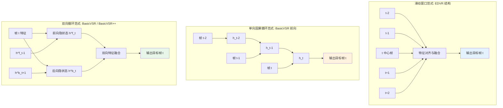
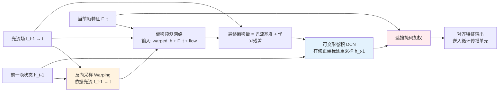
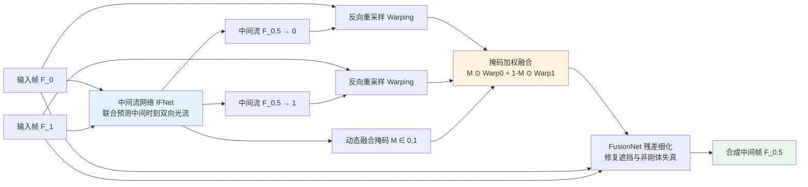

# 第 14 章 · 视频增强模型与系统架构：VSR、帧插值与综合修复

> 第 13 章建立了视频增强的基础概念体系：时序一致性、光流运动补偿与特征对齐。
>
> 本章系统剖析经典与前沿视频模型：BasicVSR++、VRT/RVRT、RIFE/FILM/AMT、视频去模糊与视频修复工程。
>
> 深入理解各模型在时序感受野、计算复杂度、显存开销与重建保真度之间的工程权衡。

## 14.0 本章定位与前置知识

视频增强模型的设计受制于一个根本性的物理约束：**时间维度的连续性**。同一物体表面在相邻帧之间不仅需要保持高频空间清晰度，更需在像素与特征级实现平滑对应，否则视觉上会出现高频抖动、边缘闪烁与纹理漂移。第 13 章系统阐释了时序一致性的数学定义、光流 Warping 与双向循环的必要性。本章在此基础上，**聚焦如何将这些理论概念工程化实现为高效、可训练且具备工业部署价值的深度网络**。

读完本章，你应当能够掌握：

- 视频超分辨率（VSR）中滑动窗口、单向因果循环与双向循环三种时序建模范式的核心差异与工程选型；
- BasicVSR++ 中"二阶网格传播（Second-Order Propagation）"与"光流引导可变形对齐（Flow-Guided Deformable Alignment）"解决的具体失效模式；
- VRT / RVRT 将时空注意力机制引入 VSR 带来的表达能力增益与计算代价；
- 视频帧插值（VFI）为何需通过 IFNet 直接预测中间时刻光流，而非简单反推相邻帧单向光流；
- 视频去模糊利用"相邻帧清晰瞬态副本"的结构性机理；
- 历史老影像综合修复的多阶段级联工程流水线设计。

阅读建议：本章提供的代码片段为聚焦核心数据流的架构骨架（Stub），完整工程实现可参考 OpenMMLab 旗下的低层视觉工具箱 MMagic（原 MMEditing）及各模型官方开源仓库。

**专业术语缩写。** 本章核心概念与网络架构缩写定义如下：

- **VSR**（Video Super-Resolution，视频超分辨率）：提升视频空间分辨率，兼顾单帧锐度与时序一致性；
- **VFI**（Video Frame Interpolation，视频帧插值）：在相邻帧之间合成高保真中间帧，提升视频时间帧率；
- **EDVR**（Enhanced Deformable Video Restoration，2019）：基于滑动窗口与可变形卷积（DCN）对齐的经典 VSR 模型；
- **TDAN**（Temporally Deformable Alignment Network）：利用可变形卷积实现隐式时序特征对齐的早期代表工作；
- **BasicVSR**（2021）：确立"双向循环特征传播 + 显式光流对齐"作为通用 Baseline 的经典架构；
- **IconVSR**：在 BasicVSR 基础上引入关键帧信息聚合与回补机制（Information-Fused）的变体；
- **BasicVSR++**（2022）：BasicVSR 的升级演进版，引入二阶网格传播与光流引导可变形对齐，为回归式 VSR 的重要基准；
- **VRT**（Video Restoration Transformer，2022）：引入时空联合自注意力机制的视频复原 Transformer；
- **RVRT**（Recurrent Video Restoration Transformer，2022）：结合段内注意力与段间循环传播的高效混合 Transformer；
- **DCN**（Deformable Convolutional Network，可变形卷积）：采样网格带有自适应偏移量的卷积算子；
- **RIFE**（Real-time Intermediate Flow Estimation，2022）：直接预测目标时刻双向中间流的实时帧插值网络；
- **IFNet**（Intermediate Flow Network）：RIFE 中专门用于端到端预测中间时刻光流的多尺度子网络；
- **FILM**（Frame Interpolation for Large Motion，2022）：基于多尺度递归流估计的高动态大位移帧插值架构；
- **AMT**（All-pairs Multi-field Transforms，CVPR 2023）：构建全像素相关体并通过多假设流场细化光流的高精度帧插值模型；
- **MIMO-UNet**（Multi-Input Multi-Output UNet，2021）：多尺度单图去模糊网络，本章借用其多尺度级联表征思想；
- **ProPainter**（ICCV 2023）：基于循环光流补全与时空注意力的视频修复（Inpainting）模型；
- **E2FGVI**（End-to-end Flow-Guided Video Inpainting，CVPR 2022）：端到端光流引导视频内容补全架构；
- **GOP**（Group of Pictures，图像组）：视频编码中以 I 帧为起点的独立解码单元；
- **REDS**（Realistic and Dynamic Scenes）：NTIRE 2019 提出的 VSR 标准基准数据集（包含 240 训练段、30 验证段与 30 测试段）；
- **VMAF**（Video Multi-Method Assessment Fusion）：Netflix 开源的视频多维度质量评估指标；
- **FVD**（Fréchet Video Distance）：度量生成视频时空分布距离的客观指标；
- **GoPro**：视频去模糊标准基准数据集，由高速摄像机拍摄并经相邻帧加权平均合成。

## 14.1 本章知识谱系与任务链路

视频增强的四大核心子任务在工程上既相互独立，又存在紧密的级联协作关系：

```
14.2-14.5  视频超分辨率（VSR）：BasicVSR → BasicVSR++ → RVRT → 扩散视频复原
14.6       视频帧插值（VFI）：RIFE、FILM、AMT
14.7       视频去模糊：空时非均匀退化与清晰瞬态利用
14.8       视频修复（Inpainting）：时空掩码补全与老电影综合修复
14.9       视频防抖（Stabilization）：轨迹平滑与边缘重投影
14.10-14.11 生产级流水线组合与多维评估体系
```

## 14.2 视频超分辨率（VSR）架构演进

VSR 架构演进脉络主要经历了四个阶段：

```
2017  VESPCN     - 早期端到端视频超分辨率
2018  TDAN       - 隐式可变形卷积对齐（DCN）
2019  EDVR       - 滑动窗口 + 多级 DCN 对齐
2021  BasicVSR   - 双向循环传播 + 显式光流对齐
2022  BasicVSR++ - 二阶传播网格 + 光流引导可变形对齐
2022  VRT / RVRT - 时空注意力机制与混合循环 Transformer
2024+ STAR/SeedVR- 基于视频扩散模型与 DiT 先验的高保真生成式复原
```

### 三大时序建模范式对比

VSR 模型的本质区别在于时序信息的聚合与传递机制，对应三种工程权衡：

- **滑动窗口范式（Sliding Window，代表：EDVR）**：输出目标帧时，独立采集其前后固定窗口（如 $N=5$ 或 $7$）内的邻帧并对齐融合。**工程优势**在于结构解耦、支持任意帧随机寻址（Random Access）、多卡并行度高；**工程代价**在于相邻窗口间缺乏特征级复用，无法捕捉长程依赖。
- **单向因果循环范式（Causal Recurrent，代表：BasicVSR 前向路径）**：通过隐状态 $h_t$ 沿时间轴单向演化更新。**工程优势**在于长程历史信息被压缩在隐状态中，显存开销恒定，天然适配实时直播与边缘端流式场景；**工程代价**在于无法利用未来帧的先验信息，且存在隐状态遗忘。
- **双向循环范式（Bidirectional Recurrent，代表：BasicVSR / BasicVSR++）**：并发执行前向与后向两次完整的隐状态传播，并在各时间步融合双向特征。**工程优势**在于每帧均能充分聚合全序列历史与未来信息，时序一致性与重建精度达到极高水平；**工程代价**在于必须持有整段视频输入，不适用于低延迟实时场景。

三种范式的架构数据流对比如下图所示：



工程选型判据：
1. **离线高保真增强（转码、影视后期）**：优先选用双向循环（BasicVSR++）或扩散先验模型；
2. **实时交互场景（直播连麦、视频会议）**：强制采用单向因果循环架构；
3. **镜头切换频繁或独立切片序列**：采用滑动窗口架构，避免跨场景隐状态污染。

## 14.3 BasicVSR++ 深度剖析

Chan 等人于 2022 年提出的 **BasicVSR++** 是双向循环架构的集大成者，其在训练稳定性、推理显存可预测性及重建质量上建立了卓越的基准。

### 整体架构数据流

```
                    浅层特征提取
输入低分辨率序列 ─────────→ 特征图序列 F_t
                               │
                               ↓
        ┌──────────────────────┴──────────────────────┐
        │                                             │
        ▼ 前向传播 (Forward)                          ▼ 后向传播 (Backward)
        h^f_1 ─→ h^f_2 ─→ ... ─→ h^f_T               h^b_T ─→ h^b_{T-1} ─→ ... ─→ h^b_1
        （每步采用二阶对齐与光流引导 DCN）
        │                                             │
        └──────────────────────┬──────────────────────┘
                               ↓
                      多维聚合 (Concat + Conv)
                               │
                               ↓
                      亚像素卷积升采样 (PixelShuffle)
                               │
                               ↓
                      输出高分辨率帧序列
```

### 关键机制 1：二阶网格传播（Second-Order Grid Propagation）

经典一阶循环网络仅接收上一时间步的隐状态：

$$
h_t = G(F_t, h_{t-1})
$$

BasicVSR++ 引入**跨时间步的二阶直接连接**：

$$
h_t = G(F_t, h_{t-1}, h_{t-2})
$$

设计机理与优势：
- **误差累积阻断**：在一阶循环中，$h_{t-1}$ 由 $h_{t-2}$ 经 Warping 得到，单步光流对齐误差会沿时间轴级联放大；二阶连接允许网络直接访问 $h_{t-2}$ 的原始特征，有效跳过中间步的插值损失；
- **时序拓扑鲁棒性**：在物体被短暂遮挡（1 至 2 帧）后重新显露时，二阶连接能直接跨越遮挡帧检索历史特征。

### 关键机制 2：光流引导可变形对齐（Flow-Guided Deformable Alignment）

将显式物理光流的几何约束与可变形卷积（DCN）的自适应调制能力结合：

数据流演进机制：



机理优势：
- **物理先验注入**：光流场为 DCN 提供准确的初值锚点，避免 DCN 在训练早期因无约束探索而导致的偏移量发散；
- **亚像素级误差修正**：DCN 能够自适应学习针对复杂非刚体运动、光照跳变以及光流估计缺陷的微观修正量。

核心实现代码骨架：

```python
import torch
import torch.nn as nn
from torchvision.ops import DeformConv2d

class FlowGuidedDCN(nn.Module):
    """BasicVSR++ 光流引导可变形卷积对齐模块。"""

    def __init__(self, channels: int, num_groups: int = 8):
        super().__init__()
        # 预测相对于光流基准的 DCN 偏移量残差
        self.offset_conv = nn.Conv2d(
            channels * 2 + 2,          # 输入拼接: warped_h + features_t + flow
            num_groups * 2 * 9,         # 3x3 卷积核包含 9 个采样点, 每个点对应 (x, y) 偏移
            kernel_size=3, padding=1,
        )
        self.dcn = DeformConv2d(channels, channels, kernel_size=3, padding=1, groups=num_groups)

    def forward(self, h_prev: torch.Tensor, features_t: torch.Tensor, flow: torch.Tensor) -> torch.Tensor:
        """
        h_prev: 前一时刻隐状态 (B, C, H, W)
        features_t: 当前时刻空间特征 (B, C, H, W)
        flow: 由当前帧指向前一帧的光流场 (B, 2, H, W)
        """
        # 1. 显式光流几何预对齐
        warped_h = warp_with_flow(h_prev, flow)

        # 2. 网络自适应预测偏移残差
        x = torch.cat([warped_h, features_t, flow], dim=1)
        offsets = self.offset_conv(x)

        # 3. 将物理光流叠加为基准锚点 (核心步骤)
        offsets = offsets + flow.repeat(1, offsets.shape[1] // 2, 1, 1)

        # 4. 可变形卷积在修正坐标处执行特征采样
        return self.dcn(h_prev, offsets)
```

### 训练与工程指标

- **训练配方**：通常在 REDS（240 段）与 Vimeo-90K 数据集上联合训练，采用 Charbonnier 重建损失；
- **时序稳定性来源**：其优异的时序一致性主要源于双向网格传播与 Flow-Guided DCN 带来的强大归纳偏置；
- **基准性能**：在 REDS4 基准上实现 ~32.4 dB PSNR，显著超越 EDVR（31.1 dB）与初代 BasicVSR（31.4 dB），且单卡推理延迟控制在 30 ms 左右。

## 14.4 VSR 训练数据与退化合成规范

主流视频超分辨率数据集规格对比：

| 数据集名称 | 序列规模 | 分辨率 | 主要适用任务 |
|-----------|---------|-------|-------------|
| **REDS** | 240 训练 / 30 验证 / 30 测试 | 720P | 通用 VSR 与动态场景去模糊 |
| **Vimeo-90K** | 64,612 个 7 帧子片段 | 448×256 | 大规模预训练与帧插值 |
| **Vid4** | 4 个经典测试序列 | 720P | 经典通用基准评测 |
| **UDM10** | 10 个高清测试序列 | 1080P | 高清 VSR 泛化性评估 |
| **YouHQ40** | 40 个高质量 4K 序列 | 4K | 真实超高清退化评测 |

### 片段级退化合成逻辑

```python
def synthesize_video_pair(hr_video: torch.Tensor) -> torch.Tensor:
    """
    从高清视频片段合成低质训练对。
    hr_video: (T, 3, H, W)
    """
    # 1. 约束: 片段内部共享全局静态/慢变退化参数
    blur_kernel = sample_blur_kernel()        # 模糊核在整段内固定
    noise_sigma = sample_noise_sigma()        # 噪声方差在整段内固定
    
    lr_frames = []
    for hr_frame in hr_video:
        x = apply_blur(hr_frame, blur_kernel)
        x = downsample(x, scale=4)
        x = add_noise(x, noise_sigma)
        lr_frames.append(x)
    
    lr_video = torch.stack(lr_frames)
    
    # 2. 注入视频编码专属压缩退化 (整段统一编码)
    lr_video = h264_compression(lr_video, bitrate=random.uniform(500, 5000))
    return lr_video
```

工程原则：**片段内部退化参数严禁单帧完全独立重采样**，否则会导致网络误学习到"退化自身在剧烈闪烁"的错误先验，在真实测试中引发高频振荡。

## 14.5 从 VRT / RVRT 到生成式视频复原

### VRT 与 RVRT（时空注意力网络）

Liang 等人于 2022 年提出 **VRT（Video Restoration Transformer）** 与 **RVRT**，将自注意力机制拓展至视频时空多维特征聚合：

```
多帧输入特征: F_1, F_2, F_3, F_4, F_5
                │   │   │   │   │
                └───┴───┼───┴───┘
                        ▼
            时空多头自注意力 (Spatio-Temporal Attention)
                        │
                        ▼
                    全局聚合特征
```

计算复杂度优化解耦策略：
1. **空域局部窗口注意力**：在单帧内部划分 8×8 局部窗口，将空间计算复杂度从 $(HW)^2$ 压缩至 $HW \cdot w^2$；
2. **时域联合注意力**：跨越时间轴在同位置特征间计算长度为 $T$ 的长程注意力；
3. **RVRT 混合切片**：RVRT 将整视频切分为短片段（Clip），片段内执行局部自注意力，片段间通过循环连接传递隐状态，在计算开销与长程建模间取得平衡。

性能取舍对比：

| 评估维度 | BasicVSR++ (循环卷积派) | VRT / RVRT (注意力派) |
|---------|-----------------------|----------------------|
| **PSNR 指标** | 优秀基准 | **领先约 0.5 dB** |
| **推理算力消耗** | 极低（高吞吐） | 较高（2 至 3 倍开销） |
| **显存占用** | 恒定受控 | 随序列与分辨率扩张显著 |
| **工业落地适配** | 易于边缘端与实时化部署 | 主要面向离线高画质产线 |

### 2024-2026：生成式视频扩散复原新前沿

回归式模型（如 BasicVSR++、RVRT）在数学上本质是逼近像素均值（$\ell_1 / \ell_2$ 优化），在面对极端重度退化时容易产生平滑模糊。自 2024 年起，业界全面探索将**大尺度视频扩散模型（Video Diffusion）与 DiT（Diffusion Transformer）作为强时序先验**的增强技术：

- **Upscale-A-Video（CVPR 2024）**：将图像潜空间扩散先验拓展至视频，配合时序层与光流引导约束维持帧间稳定；
- **VEnhancer（2024）**：通过统一的视频生成扩散架构联合执行超分辨率与帧插值；
- **STAR 与 SeedVR / SeedVR2（2025-2026）**：基于大规模视频生成模型的世界先验完成真实场景极限细节生成，SeedVR2 进一步推进单步扩散推理以降低延迟。

生成式视频增强的工程核心在于**严密平衡生成创造力与时序一致性**，防范物体身份漂移与物理失真。
- 实时 / 接近实时：BasicVSR++
- 端侧：BasicVSR 或更轻量

### 2024-2026：扩散派视频复原成为新的质量上限

把 RVRT 当作视频复原的终点，到 2026 年已经不成立。VRT / RVRT 这条回归式（regression-based）路线有一个共同的天花板：损失函数本质上还是在逼近像素均值，面对严重退化、或需要"无中生有"补细节的真实视频时，输出会偏软、偏保守。2024 年起，前沿明显转向以视频扩散模型为先验的复原路线，思路和第 8 章图像端"用扩散先验做超分"一脉相承，只是把先验换成了带时间维的视频扩散网络。

几条有代表性的工作：Upscale-A-Video（CVPR 2024）把图像潜空间扩散扩展到视频，用时序层加光流引导维持一致性；MGLD-VSR（ECCV 2024）在潜空间用运动引导的扩散做真实世界 VSR；VEnhancer（2024）用一个视频扩散模型统一做超分与插帧的增强。进入 2025 年，STAR 把文生视频扩散模型的强先验引入真实世界 VSR，SeedVR / SeedVR2（其中 SeedVR2 做到一步视频复原）则走扩散 Transformer（DiT）的大模型路线，代表了当前的质量上限。

代价也很清楚，正好对应第 13 章反复强调的两个维度。其一是时序一致性：视频扩散先验的生成性更强，若时序建模不到位，帧间"沸腾"和身份漂移会比回归式模型更明显，所以这些工作的很大一部分精力都花在时序层、光流引导、潜空间传播上。其二是延迟：多步扩散叠上视频这条时间轴，推理成本比 BasicVSR++ 高一到两个数量级，目前基本只能用于离线增强，一步化（如 SeedVR2）是把它推向实时的关键方向。更细的谱系和取舍放在第 18 章讨论，这里只给方向与代表工作。

## 14.6 视频帧插值（VFI）：从中间流估计到多假设变换

视频帧插值（VFI）旨在提升视频时间采样率（如 24 fps 升至 60 fps，或 60 fps 升至 240 fps 超慢动作）。

### 任务定义与监督范式

给定时间步相邻的两帧输入 $F_t$ 与 $F_{t+1}$，合成任意中间时刻（如 $t+0.5$）的未知帧 $F_{t+0.5}$。

- **推理阶段**：目标中间帧在物理上未被采样，属于纯粹的生成性重建任务；
- **训练阶段**：从高帧率基准视频（如 240 fps GoPro 序列）中抽取连续三帧，以首尾两帧作为网络输入，以真实中间帧作为强监督真值。

### RIFE：实时双向中间流直接估计

Huang 等人于 2022 年提出的 **RIFE（Real-time Intermediate Flow Estimation）** 奠定了现代高效帧插值的基础：

- **核心创新**：规避从端到端单向光流 $F_{0 \to 1}$ 反向推导中间流引发的孔洞与遮挡伪影，设计 **IFNet** 直接端到端联合预测中间时刻到两端的双向流场 $F_{0.5 \to 0}$ 与 $F_{0.5 \to 1}$；
- **自适应融合**：IFNet 同步输出融合掩码（Blending Mask），指导两端 Warping 结果的逐像素动态加权。

RIFE 的端到端数据流如下图所示：



融合掩码的物理意义在于量化两端特征的可信度：在发生单侧遮挡或新内容显露（Disocclusion）的边缘，掩码自适应偏向未受遮挡的一侧。

实现代码骨架：

```python
import torch
import torch.nn as nn

class RIFEStub(nn.Module):
    """RIFE 帧插值核心架构骨架。"""

    def __init__(self):
        super().__init__()
        self.ifnet = IFNet()          # 多尺度中间流估计网络
        self.fusion_net = FusionNet()  # 特征残差细化网络

    def forward(self, f0: torch.Tensor, f1: torch.Tensor) -> torch.Tensor:
        """
        f0, f1: 输入相邻帧 (B, 3, H, W)
        返回: 合成中间帧 f_mid (B, 3, H, W)
        """
        # 1. 联合估计目标时刻双向光流与动态掩码
        flow_to_0, flow_to_1, mask = self.ifnet(f0, f1)

        # 2. 对两端输入帧执行运动补偿重采样
        warped_0 = warp_with_flow(f0, flow_to_0)
        warped_1 = warp_with_flow(f1, flow_to_1)

        # 3. 动态掩码加权粗融合
        f_coarse = mask * warped_0 + (1.0 - mask) * warped_1

        # 4. 残差细化网络修补边缘孔洞
        f_mid = self.fusion_net(f_coarse, f0, f1)
        return f_mid
```

### FILM 与 AMT：面向大位移与复杂遮挡的进阶架构

- **FILM（Google, 2022）**：采用多尺度特征金字塔递归细化光流，在剧烈体育运动与大位移镜头下具备更强的拓扑保持能力；
- **AMT（CVPR 2023）**：借鉴 RAFT 构建全像素对（All-Pairs）4D 相关体，并引入多流场假设（Multi-Field）机制联合探索多种潜在运动轨迹，在大范围遮挡边界上的平滑度显著优于 RIFE。

### 帧插值的高频失效场景

1. **超大位移击穿感受野**：高速运动导致位移超出搜索窗口，插值帧产生断裂重影；
2. **非刚体流动与半透明介质**：水流、火焰、烟雾与玻璃反光破坏亮度恒定假设；
3. **高频周期性几何纹理**：栅栏、百叶窗等重复纹理引发光流匹配歧义。

## 14.7 视频去模糊：时空非均匀退化与清晰瞬态利用

与单帧图像盲去模糊相比，视频去模糊具备决定性的**时序信息互补优势**：
- 物体运动往往伴随瞬时加减速，某一帧严重模糊时，相邻帧往往恰好处于运动转折或静止的清晰瞬态；
- 手持相机抖动的空间方向呈高频交替分布，各帧之间的清晰纹理区域互不重叠。

### 核心解题策略

视频去模糊的关键不在于单帧反卷积，而在于**通过精准的时序对齐与时空注意力，从相邻帧中借用高频未退化纹理补偿当前模糊帧**（典型代表如 EDVR 的去模糊分支与 CDVD-TSP）。

### 基准数据集：GoPro Benchmark

由 240 fps 高速相机拍摄真实清晰场景，对相邻多帧连续加权累加合成带有真实曝光积分效应的运动模糊帧，以中心原始帧作为基准真值。

## 14.8 视频修复（Inpainting）与老电影综合复原

### 视频内容补全（Video Inpainting）

给定视频序列与待移除物体的二值时空掩码（Mask），目标是在保持时空连续性的前提下消除物体并补全背景。

- **E2FGVI（CVPR 2022）**：提出端到端光流引导的视频补全架构；
- **ProPainter（ICCV 2023）**：引入**循环光流补全模块（Recurrent Flow Completion）**，首先在掩码区域推导补全光流矢量场，再基于补全光流引导跨时间步的可变形自注意力机制聚合长程背景纹理，有效解决了大尺度移动物体消除后的背景漂移伪影。

### 历史老影像综合修复工程流水线

老电影的退化并非单一高斯退化，而是多种物理损伤的复杂级联（划痕、霉斑、噪波闪烁、帧丢失、严重褪色）。生产级修复必须遵循多阶段串行流水线：

```
原始低质历史胶片序列
  │
  ├─ 阶段 1: 几何物理划痕与污斑剔除 (时序邻帧对应补全)
  ├─ 阶段 2: 曝光与色调闪烁平抑 (时间轴统计一致性校正)
  ├─ 阶段 3: 缺失帧与坏帧重构 (基于 RIFE 的时序插值)
  ├─ 阶段 4: 语义色彩恢复 (Lab 空间统计映射与深度着色网络)
  └─ 阶段 5: 高保真超分与帧率倍增 (BasicVSR++ / 生成式复原)
  │
输出 4K 60fps 数字化修复成片
```

## 14.9 视频防抖（Video Stabilization）

手持拍摄引发的高频颠簸需通过几何变换予以平抑，核心难点在于**解耦相机的无意抖动与摄影师的主动运镜轨迹**。

### 算法实现三部曲

1. **全局运动场估计**：通过跨帧稀疏特征点追踪或稠密光流估计相邻帧间的单应性矩阵（Homography）或仿射变换参数；
2. **时序轨迹平滑**：对相机运动轨迹序列施加高斯低通滤波、卡尔曼滤波或样条平滑优化，滤除高频抖动分量；
3. **空间重采样与边缘补全**：计算平滑轨迹与原始轨迹的差分矩阵，对各帧执行逆向重投影。

### 视场裁剪（Crop）权衡

空间重投影会导致画面边缘出现黑色无效区，必须按比例执行中心裁剪与微小放大。防抖强度与视场损失呈正相关：激进防抖会显著缩小有效画面视角。

## 14.10 生产级视频增强流水线组合范式

真实工业场景中，需根据算力预算与延迟约束组合多子任务模块：

### 1. 移动端 Vlog 视频离线后处理流水线

```
原始 1080P 30fps 手机录像
  ↓ 视频防抖平滑 (StabNet / 局部单应变换)
  ↓ 时序去噪与画质净化 (轻量 BasicVSR 架构)
  ↓ 帧插值倍增 (RIFE) → 升频至 60 fps
  ↓ 4 倍超分辨率重建 (BasicVSR++) → 输出 4K
  ↓ 3D LUT 色彩映射与胶片颗粒合成
4K 60fps 高保真视频
```

### 2. 超低延迟在线直播增强流水线（帧耗时 $< 33$ ms）

```
原始 720P 30fps 实时视频流
  ↓ 极轻量因果去噪 (NAFNet-Tiny, 耗时 < 5ms)
  ↓ 单向端侧超分辨率 (蒸馏轻量 CNN, 耗时 < 20ms) → 输出 1080P
  ↓ 硬件级 1D/3D LUT 调色 (< 1ms)
1080P 30fps 低延迟输出流
```

实时流强制规避双向循环与大尺度 Transformer，严格采用因果单向模型并结合 TensorRT / CoreML 算子融合。

## 14.11 视频综合质量评估指标

评估视频模型需结合单帧空间保真度与时序动态指标：

| 评估指标 | 度量维度 | 核心物理含义与工具链 |
|---------|---------|-------------------|
| **PSNR / SSIM** | 单帧像素/结构 | 衡量均方误差与局部结构相关性 |
| **LPIPS / DISTS** | 单帧感知保真 | 深度特征空间距离，反映微观纹理质量 |
| **tOF** | 时序光流一致性 | 输入与输出视频光流矢量场的一致程度 |
| **tLPIPS** | 时序感知连续性 | 经运动补偿对齐后相邻帧间的感知距离 |
| **VMAF** | 视频多维主观质量 | Netflix 开源行业标准，融合 VIF、ADM 与运动评分 |
| **FVD** | 时空分布散度 | 衡量生成视频在时空特征分布上的真实感 |

### 生产级 VMAF 评估调用

```python
import subprocess
import json

def compute_vmaf(reference_video: str, distorted_video: str) -> float:
    """
    通过 FFmpeg libvmaf 插件计算客观 VMAF 分值 (取值 0 至 100)。
    """
    cmd = [
        'ffmpeg', '-i', distorted_video, '-i', reference_video,
        '-lavfi', 'libvmaf=log_path=vmaf.json:log_fmt=json:n_threads=8',
        '-f', 'null', '-'
    ]
    subprocess.run(cmd, check=True)
    
    with open('vmaf.json', 'r') as f:
        data = json.load(f)
    return data['pooled_metrics']['vmaf']['mean']
```

## 14.12 小结

1. **VSR 架构演进**：滑动窗口（EDVR）受限于时序视野，单向因果循环主导低延迟实时流，双向网格循环（BasicVSR++）统治离线高保真基准，扩散与 DiT 先验引领极限生成式复原；
2. **BasicVSR++ 双引擎**：二阶传播阻断光流累积误差，Flow-Guided DCN 实现物理引导下的亚像素形变微调；
3. **退化合成一致性**：视频训练数据必须保持片段内部退化参数的时序强相关，杜绝帧间独立扰动引发的模型高频振荡；
4. **帧插值机制**：RIFE 通过 IFNet 直接预测中间时刻双向流场，FILM 与 AMT 分别通过多尺度金字塔与多流场假设攻克大位移和遮挡边界；
5. **视频修复体系**：ProPainter 通过循环光流补全为掩码区域提供几何锚点，结合时空注意力实现大尺度内容平滑消除；
6. **生产工程落地**：实际业务依赖去抖、去噪、插值与超分辨率的多阶段串行流水线；线上部署以 VMAF 结合时序指标作为核心准入标尺。

---

> 下一章 [推理加速与端侧部署](15-inference.md) 深入工业级模型部署：量化蒸馏、TensorRT / CoreML 算子优化、动态分辨率切块与显存极致压缩。
