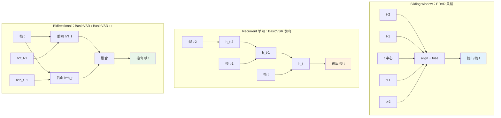
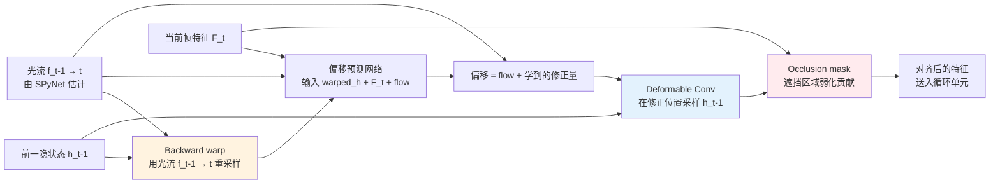
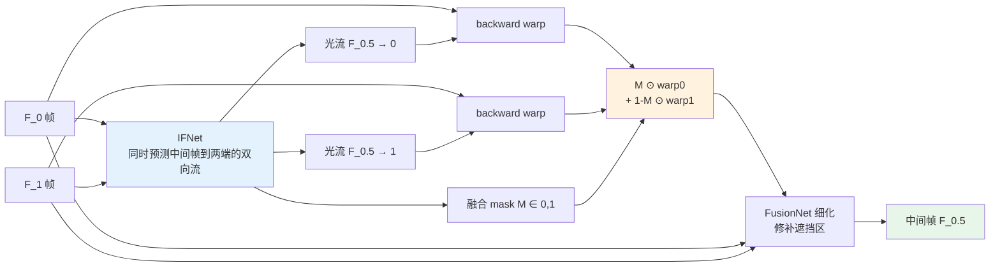

# 第 14 章 · VSR / 帧插值 / 视频修复

> 第 13 章建立了视频增强的基础概念：时序一致、光流、对齐。
>
> 这一章看具体模型：BasicVSR++、RVRT、RIFE/FILM、视频去抖。
>
> 这些模型把第 13 章的概念落地，每个有不同的工程权衡。

## 14.0 本章定位与前置知识

视频增强从模型设计角度看，比图像多出一个根本约束：**时间维度**。同一个物体在相邻帧上不仅要清晰，还要在像素层面"接得上"，否则视觉上会出现闪烁、抖动、纹理跳变。第 13 章已经讨论了这个时序一致性是怎么定义的、光流和对齐为什么必要、双向传播为何比单向更稳。本章假设这些基础概念已经在脑子里，重点放在**具体模型如何把这些概念落地成可训练、可部署的网络**。

读完本章你应当能回答下面几个问题：

- 在视频超分（VSR）任务里，sliding window、recurrent、bidirectional 这三种结构的取舍是什么？
- BasicVSR++ 的"二阶传播"和"flow-guided deformable alignment"具体在解决哪一类失败模式？
- VRT / RVRT 把 Transformer 引进 VSR 之后，相对 BasicVSR++ 究竟换来了什么、付出了什么？
- 视频帧插值（VFI）为什么不直接复用光流模型，而要训一个专门估计"中间帧到两端"的 IFNet？
- 视频去模糊为什么有"相邻帧清晰副本"这种结构性优势？
- 老电影修复这种偏向工艺的任务，为什么不是单模型而是多步 pipeline？

阅读建议：本章的代码片段大多是骨架（stub），不能直接训练，目的是把架构的关键数据流写清楚。完整实现可以参考 mmagic（原 mmediting，OpenMMLab 的低层视觉工具箱）和各项目官方仓库。

**首次出现的缩写。** 沿用第 1 章的体例，本章把第一次出现的缩写在括号里给出全称与一句话定义：

- **VSR**（Video Super-Resolution，视频超分辨率）：把低分辨率视频提升到高分辨率，要求空间锐度与时序一致同时达标
- **VFI**（Video Frame Interpolation，视频帧插值）：在两帧之间合成中间帧，把低帧率视频提升到高帧率
- **EDVR**（Enhanced Deformable Video Restoration，2019）：第一代用 deformable conv 做对齐的滑动窗口 VSR，CVPR Workshops 2019 NTIRE 冠军
- **TDAN**（Temporally Deformable Alignment Network）：用 deformable conv 做"隐式光流"对齐的早期 VSR
- **BasicVSR**（2021）：第一个把双向循环 + 显式光流对齐做到 SOTA 的 VSR baseline
- **IconVSR**：BasicVSR 同一篇论文的"info-fused"变体，把多帧信息抽到关键帧供后续传播
- **BasicVSR++**（2022）：BasicVSR 的升级版，加入二阶传播和 flow-guided deformable alignment
- **VRT**（Video Restoration Transformer，2022）：把窗口 Transformer 引入 VSR，沿时间轴做 attention
- **RVRT**（Recurrent Video Restoration Transformer，2023）：VRT 的循环化版本，用循环替代部分长程 attention 来控制计算量
- **DCN**（Deformable Convolutional Network，可变形卷积）：卷积核每个采样位置带一个可学习的偏移，使卷积能"瞄准"非规则位置
- **RIFE**（Real-time Intermediate Flow Estimation，2022）：直接估计"中间帧到两端"光流的 VFI 方法
- **IFNet**（Intermediate Flow Network）：RIFE 里专门预测中间帧光流的子网络
- **FILM**（Frame Interpolation for Large Motion，Google 2022）：多尺度递归光流估计的 VFI 方法，对大位移强
- **AMT**（All-pairs Multi-field Transforms，2023）：在 RIFE 基础上加 attention，对遮挡更鲁棒
- **MIMO-UNet**（Multi-Input Multi-Output UNet）：在不同分辨率上独立处理后融合的视频去模糊架构
- **ProPainter**（ICCV 2023）：当前 SOTA 的视频 inpainting 方法，先补光流再补帧
- **E2FGVI**（End-to-end Flow-Guided Video Inpainting，CVPR 2022）：端到端的光流引导视频补全
- **GOP**（Group of Pictures，画面组）：视频编码里以一个 I 帧为起点的若干帧组成的独立解码单元
- **REDS**（Realistic and Dynamic Scenes）：NTIRE 2019 提出的 VSR 标准数据集，270 个训练 + 30 个测试片段
- **VMAF**（Video Multi-Method Assessment Fusion）：Netflix 2016 推出的视频质量评估指标，融合多个子指标，训练数据是真实人评
- **FVD**（Fréchet Video Distance）：把 FID 推广到视频的分布距离指标，常用于生成式视频
- **tOF / tLPIPS**：时序版本的光流一致性 / LPIPS 一致性指标，衡量相邻帧的对齐与感知差异
- **NAFNet**（Nonlinear Activation Free Network，2022）：用门控乘法替代非线性激活的极简低层视觉网络
- **GoPro**：视频去模糊事实标准数据集，用 240 fps 高速相机平均多帧合成"模糊帧"，原始帧作为真值

更多缩写在出现时再展开。

## 14.1 这一章的结构

下面四类子任务在视频增强里相互独立又互相依赖。VSR 与去模糊都关注"每一帧更清晰"，帧插值关注"帧数更多"，视频修复关注"内容补全"，去抖关注"帧间几何稳定"。一个真实的视频增强 pipeline 通常会按某种顺序串接其中几项。

```
14.2-14.5  视频超分（VSR）：BasicVSR → BasicVSR++ → RVRT
14.6       帧插值（VFI）：RIFE、FILM、AMT
14.7       视频去模糊
14.8       视频修复
14.9       视频去抖
14.10-14.11  工程组合与评估
```

每个任务给一个代表模型加几个工程要点。本章不追求覆盖所有方法，只覆盖在 2024-2026 年生产环境里仍在被人用的几条主线。

## 14.2 视频超分（VSR）的演进

VSR 的演进路线和图像 SR 类似但晚两年：

```
2017  VESPCN     - 第一个端到端 VSR
2018  TDAN       - 隐式对齐（DCN）
2019  EDVR       - 滑动窗口 + DCN 对齐
2020  RBPN       - 循环 + 多帧补偿
2021  BasicVSR   - 双向循环 + 显式光流对齐
2022  BasicVSR++ - 二阶传播 + flow-guided DCN
2022  VRT        - 时序 Transformer
2023  RVRT       - 高效循环 Transformer
```

**BasicVSR++** 是 2022-2024 年的事实标准，简单、强、快。下面详谈。

### 三种 VSR 架构的对比

把上面这条时间线压成结构，可以看到 VSR 模型主要在三种"时序聚合模式"之间选择，分别对应三种工程权衡：

- **Sliding window**（滑动窗口，代表 EDVR）：每输出一帧，独立取该帧周围 N 帧（典型 N=5 或 7），把它们对齐到中心帧后融合。**好处**是结构简单、训练直接、天然支持随机访问；**代价**是相邻输出帧之间没有显式的特征复用，长程时序信息只能通过更大的窗口堆出来。
- **Recurrent**（循环，代表 BasicVSR 的前向方向）：维护一个沿时间方向不断更新的隐状态 $h_t$，每帧用前一时刻的 $h_{t-1}$ 加当前帧的特征算出新的 $h_t$。**好处**是长程信息被压在隐状态里、显存友好、计算高效；**代价**是单向 RNN 看不到未来帧，对运动反向的细节恢复有上限。
- **Bidirectional**（双向，代表 BasicVSR / BasicVSR++）：同时跑前向和后向两个 RNN，在每一时刻把两者的隐状态融合。**好处**是任意一帧都能同时拿到过去和未来的信息，长程时序一致性最好；**代价**是必须有整段视频（或者一个足够长的 buffer）才能跑，实时场景受限。

下面这张图把三种模式画在同一张图上做对比，注意箭头方向和聚合发生的位置：



工程上的选择规则：

1. 如果**输入是离线视频文件**且对质量上限敏感（修复、剪辑、转码增强），优先 bidirectional。
2. 如果**输入是实时流**（直播、视频会议、AR 透视），必须用 causal recurrent（只允许看历史），bidirectional 不可用。
3. 如果**输入是图像序列但场景之间没有强连续性**（比如批量幻灯片增强），sliding window 反而比 RNN 更鲁棒，因为隐状态在场景切换时会污染。

这三种模式之间不是非此即彼，BasicVSR++ 的整体结构本质上是"双向 + 二阶传播 + DCN 修正光流"，而后面的 RVRT 是"循环 + 跨帧注意力"的混合。架构上的差异主要决定了**显存占用、延迟、对未来帧的依赖、跨场景鲁棒性**这四个维度。

## 14.3 BasicVSR++ 详解

Chan et al. 在 2022 年提出 BasicVSR++，是第 13 章 13.8 节讲的双向循环架构的代表。它的设计选择在 2024-2026 年的多数 VSR 产品（包括离线视频转码增强、长视频后处理）里仍然是首选 baseline，原因是结构简单、训练稳、推理时显存可预测。

### 整体结构

```
                    特征提取
LR frames ─────────────→ feature maps F_t
                              │
                              ↓
        ┌─────────────────────┴─────────────────────┐
        │                                            │
        ▼ Forward propagation                        ▼ Backward propagation
        h^f_1 ─→ h^f_2 ─→ ... ─→ h^f_T              h^b_T ─→ h^b_{T-1} ─→ ... ─→ h^b_1
        每一步用光流对齐前一步隐状态
        │                                            │
        └─────────────────────┬─────────────────────┘
                              ↓
                      Aggregation (concat + conv)
                              │
                              ↓
                      Upsample (PixelShuffle)
                              │
                              ↓
                      HR frames
```

### 关键创新 1：二阶传播

普通双向 RNN 每一步只用前一步：

$$
h_t = G(F_t, h_{t-1})
$$

BasicVSR++ 用**二阶**：

$$
h_t = G(F_t, h_{t-1}, h_{t-2})
$$

为什么有用？

- 一阶：$h_{t-1}$ 是从 $h_{t-2}$ warp 过来的，$h_{t-2}$ 又是从更早的 warp 过来的，光流误差一路累积
- 二阶：直接接触 $h_{t-2}$，绕过 $h_{t-1}$ 的累积误差
- **修正光流的局部错误**

### 关键创新 2：Flow-Guided Deformable Alignment

把光流和可变形卷积结合。在解释代码之前，先把数据流画清楚。"flow-guided"是说**先用光流把前一隐状态 warp 到当前帧的视角**，然后让 DCN 在 warp 后的特征上做局部修正；DCN 的偏移量并不是从零开始学，而是以光流为基准做微调。

下面这张图把"warp + occlusion mask + DCN refinement"这条链画了出来：



这条链里 occlusion mask 通常作为 DCN 的额外通道隐式学，或者由光流的 forward-backward 一致性误差直接算出来（误差大就当遮挡处理，降低 warp 出的特征权重）。

为什么"光流 + DCN"比单纯光流更鲁棒：

- 用光流给可变形卷积一个**初始的采样位置**，相当于把物理意义注入 DCN
- 让 DCN 学习**对光流的修正**，光流估错了一两像素时，DCN 还能拉回来
- 在快速运动 / 部分遮挡场景下，纯光流 warp 会产生明显鬼影，DCN 的多采样点融合能缓解

```python
class FlowGuidedDCN(nn.Module):
    """Flow-guided deformable alignment (BasicVSR++)。"""

    def __init__(self, channels: int, num_groups: int = 8):
        super().__init__()
        # 预测 DCN 的 offset 修正量 (相对光流)
        self.offset_conv = nn.Conv2d(
            channels * 2 + 2,         # h_prev + features + flow
            num_groups * 2 * 9,        # 9 个采样点 × 2 维 × num_groups
            3, padding=1,
        )
        # 实际的 deformable conv (这里用 torchvision 的 DeformConv2d)
        from torchvision.ops import DeformConv2d
        self.dcn = DeformConv2d(channels, channels, 3, padding=1, groups=num_groups)

    def forward(self, h_prev, features_t, flow):
        """
        h_prev: 前一步隐状态 (B, C, H, W)
        features_t: 当前帧特征 (B, C, H, W)
        flow: 光流 (B, 2, H, W)
        """
        # 1. 用光流先把 h_prev warp 到当前视角
        warped_h = warp_with_flow(h_prev, flow)

        # 2. 网络预测 DCN offset (修正量)
        x = torch.cat([warped_h, features_t, flow], dim=1)
        offsets = self.offset_conv(x)
        # offsets shape: (B, num_groups * 2 * 9, H, W)

        # 3. 加上光流作为 offset 基准 (重要!)
        # 让 DCN 起始于光流的位置, 学的是修正量
        offsets = offsets + flow.repeat(1, offsets.shape[1] // 2, 1, 1)

        # 4. DCN 在修正后的位置采样
        return self.dcn(h_prev, offsets)
```

flow + DCN 组合的优势：光流提供物理意义，DCN 提供局部修正能力，**对快速移动 / 部分遮挡场景比纯光流稳**。把这个机制放在二阶传播里，效果叠加：二阶减少光流误差累积，flow-guided DCN 减少单步光流误差，整段视频的时序一致性显著提升。

### BasicVSR++ 的训练

- **数据集**：REDS (240 个视频片段) + Vimeo-90K + 自合成的退化对
- **退化**：MM-CelebA 风格的视频退化 + REDS 标配的运动模糊和压缩
- **损失**：主要是 Charbonnier 重建损失（在每一输出帧上）。时序一致性主要靠**双向传播 + flow-guided alignment 的架构归纳偏置**自然涌现，而非显式时序损失项
- **训练时长**：1.6M 步在 8× A100，约 10 天

### 性能

在 REDS4 4× VSR 上 PSNR ~32.4 dB，明显高于 EDVR (31.1) 和 BasicVSR (31.4)。同时**保持实时性**，单帧约 30ms 在 A100 上。

## 14.4 VSR 的训练数据

VSR 的数据要求比图像 SR 更高：

| 数据集 | 视频数 | 分辨率 | 用途 |
|-------|-------|-------|------|
| **REDS** | 270 (训) + 30 (测) | 720P | 通用 VSR 标准 |
| **Vimeo-90K** | 64,612 个 7-frame 片段 | 448×256 | 帧插值 + VSR |
| **Vid4** | 4 个片段 | 720P | 测试 |
| **UDM10** | 10 个片段 | 1080P | 测试 |
| **YouHQ40** | 40 个 4K 片段 | 4K | 真实高质量 |

### 视频退化合成

```python
def synthesize_video_pair(hr_video):
    """从 HR 视频合成 LR 训练对。"""
    
    # 1. 时序一致的退化 (同段视频用同样参数)
    blur_kernel = sample_blur_kernel()        # 一段视频固定
    noise_sigma = sample_noise_sigma()        # 一段视频固定
    
    lr_frames = []
    for hr_frame in hr_video:
        x = apply_blur(hr_frame, blur_kernel)
        x = downsample(x, scale=4)
        x = add_noise(x, noise_sigma)
        lr_frames.append(x)
    
    lr_video = torch.stack(lr_frames)
    
    # 2. 视频专用退化 (整段一起)
    lr_video = h264_compression(lr_video, bitrate=random.uniform(500, 5000))
    
    return lr_video
```

注意：**退化参数对一段视频固定**。这是和图像不同的地方：如果每帧用不同的退化参数，会引入"模型学到的不一致"，模型在推理时反而把帧间退化的微小差异放大成时序闪烁。

## 14.5 VRT 与 RVRT：Video Restoration Transformer

Liang et al. 在 2022 年提出 VRT，2023 年改进为 RVRT。这条线把 Transformer 引入 VSR，对应的思路是"放弃 RNN 隐状态那种串行依赖，让所有帧通过注意力机制互相看到"。它的代表性来自两点：在 SOTA benchmark 上常年压过 BasicVSR++ 约 0.5 dB；在实现复杂度和显存压力上也明显更高。

### 核心思想

不再用循环 RNN，而是**直接用 self-attention 跨帧聚合**：

```
F_1, F_2, F_3, F_4, F_5
   │   │   │   │   │
   └───┴───┼───┴───┘
           ▼
    Cross-frame attention
           │
           ▼
       聚合特征
```

### 计算量

天然的多帧 attention 复杂度爆炸，5 帧 $H \times W$ 的 attention 是 $(5HW)^2$，相对一帧的 $(HW)^2$ 直接 25 倍。VRT 的工程化做法是把 attention 分两个轴拆开：

1. **窗口空间 attention**：先在每帧内的局部窗口里做 self-attention（沿用 Swin 的 7×7 或 8×8 窗口），把空间复杂度从 $(HW)^2$ 压到 $HW \cdot w^2$，其中 $w$ 是窗口边长。
2. **沿时间轴 attention**：把同一空间位置的 T 个 token 当作一个序列做 attention，长度从 $T \cdot HW$ 降到 $T$。

RVRT 在 VRT 的基础上再加一层"循环"：把整段视频切成若干段，段内用 VRT-style attention，段间用循环连接传递隐状态，进一步压计算量。这种设计相当于在"完全循环 (BasicVSR++)"和"完全 attention (VRT)"中间找了一个折中。

### VRT vs BasicVSR++

| 维度 | BasicVSR++ | VRT/RVRT |
|------|-----------|---------|
| 性能 | 强 | **更强**（PSNR +0.5 dB） |
| 速度 | 快 | 慢（2-3×） |
| 显存 | 中 | **大**（attention） |
| 实时性 | 可以 | 难 |
| 实现复杂度 | 简单 | 复杂 |

工程实践 2026 年：

- 离线高质量增强：RVRT 或 VRT
- 实时/接近实时：BasicVSR++
- 端侧：BasicVSR 或更轻量

## 14.6 帧插值（VFI）

帧插值是另一类视频任务，把低帧率视频提到高帧率（24 fps → 60 fps，60 fps → 240 fps）。

### 任务定义

给定相邻两帧 $F_t$ 和 $F_{t+1}$，生成中间帧 $F_{t+0.5}$。

注意"中间帧"的两个不同语境：

- **推理时**：用户给的视频里没有中间帧，这是任务难点
- **训练时**：标准做法是从高 FPS 视频（240 fps GoPro 等）取连续 3 帧，第一第三帧作为输入、第二帧作为真值监督，所以**训练时是有真值的**

### RIFE（2022）

Huang et al. 的 RIFE（Real-time Intermediate Flow Estimation，实时中间流估计）是当前帧插值的事实标准。核心创新：

- 不显式估计前向/后向光流，**直接估计中间帧到两端的光流**
- 一个 IFNet 同时输出 $F_{0.5 \to 0}$ 和 $F_{0.5 \to 1}$
- 用这两个光流分别 warp $F_0$ 和 $F_1$，融合得到 $F_{0.5}$

为什么不直接复用 RAFT、FlowNet 这种通用光流模型？答案是 VFI 真正需要的是"中间帧到两端"的光流（$F_{0.5 \to 0}$ 和 $F_{0.5 \to 1}$），而通用光流模型给的是"前一帧到后一帧"（$F_{0 \to 1}$）。从前者反推后者要做一次反向投影，过程里会引入大量遮挡、孔洞、半像素误差。RIFE 的做法是**直接训练一个网络输出 $F_{0.5 \to \{0, 1\}}$**，省掉反推这一步。

下面把 RIFE 双向流估计 + 加权融合的数据流画清楚：



这张图里 mask 是 IFNet 的副产物，物理含义是"中间帧的某个像素更应当从 F_0 还是 F_1 取"。在 disocclusion（新出现的物体）和遮挡边界上，mask 会偏向其中一端；在两端都能看到的区域，mask 接近 0.5。FusionNet 是一个 refinement 网络，专门修补"两端都被遮挡导致 warp 出错"的孔洞。

```python
class RIFEStub(nn.Module):
    """RIFE 简化骨架。"""

    def __init__(self):
        super().__init__()
        self.ifnet = IFNet()        # 输出中间帧到两端的光流
        self.fusion_net = FusionNet()  # 融合 warp 结果

    def forward(self, f0: torch.Tensor, f1: torch.Tensor) -> torch.Tensor:
        """
        f0, f1: 相邻两帧 (B, 3, H, W)
        返回: 中间帧 f_0.5
        """
        # 1. 估计中间帧到两端的光流
        flow_to_0, flow_to_1, mask = self.ifnet(f0, f1)

        # 2. 用光流 warp 两端帧
        warped_0 = warp_with_flow(f0, flow_to_0)
        warped_1 = warp_with_flow(f1, flow_to_1)

        # 3. mask 加权融合
        f_mid = mask * warped_0 + (1 - mask) * warped_1

        # 4. (可选) 用一个 refine 网络最后微调
        f_mid = self.fusion_net(f_mid, f0, f1)
        return f_mid
```

### RIFE 的优势

- **快**：原版 RIFE 在 1080P 上能跑 30 FPS
- **简洁**：单网络端到端
- **可扩展**：递归调用就能做 $4\times$, $8\times$ 帧率提升

### FILM（Google, 2022）

Reda et al. 的 FILM 用了不同思路，多尺度光流估计 + 渐进合成：

- 不依赖单步光流估计
- 在多个分辨率上递归细化
- **对大位移更鲁棒**（运动剧烈的场景）

实测：

- **慢速运动**（普通视频）：RIFE 和 FILM 接近
- **快速运动**（体育、舞蹈）：FILM 优于 RIFE

### AMT（2023）

更新的 SOTA：在 RIFE 基础上加 attention 模块，对**遮挡场景**特别强。

### 帧插值的失败模式

- **大位移**：物体跨度超过感受野，插出鬼影
- **新物体出现**（disocclusion）：相邻帧没有这个物体的信息，无法插出
- **半透明物体**：光流假设失效（玻璃、烟雾）
- **重复纹理**：光流容易匹配错位置（栅栏）

## 14.7 视频去模糊

视频去模糊和图像去模糊的不同：**相邻帧提供清晰参考**。这是视频任务相对图像任务最具结构性的一项优势，所有视频去模糊模型本质上都在利用这一点。

### 关键观察

视频里的模糊往往是**间歇性**的，某一帧模糊（运动瞬间），下一帧清晰（运动停止）。利用这个特性能大幅提升去模糊质量。具体来说有两种典型情境：

- 长曝光下的运动模糊只发生在物体高速移动的几帧，物体减速或停下后下一帧立刻清晰
- 手持相机抖动是高频的，模糊核方向每帧都在变，相邻帧的清晰区域往往位置不同

工程上的直接推论是：视频去模糊不能像图像去模糊那样只看单帧反卷积，必须做帧间对齐，从相邻帧"借"清晰像素。这又回到了 13 章的光流 / DCN 对齐套路。

### EDVR

EDVR 不只是 VSR 的事实经典，也是视频去模糊的代表：

- 滑动窗口（5 或 7 帧）
- DCN 对齐
- 时空 attention 融合

### MIMO-UNet（多输入多输出）

不同分辨率上独立处理后融合，对不同尺度的模糊都能 cover。

### 数据：GoPro 数据集

视频去模糊的标准 benchmark：用高速相机拍摄（240 fps），把多个邻近帧平均得到"模糊帧"，原始帧作为真值。

## 14.8 视频修复（Inpainting / Restoration）

视频修复包含两类：

- **视频 inpainting**：补全被遮挡或被去除的区域
- **老电影修复**：去除划痕、闪烁、缺失帧

### Video Inpainting

给定一段视频和一个 mask（每帧标注要补全的区域），输出补全后的视频。

代表方法：**E2FGVI**（End-to-end Flow-Guided Video Inpainting，CVPR 2022）、**ProPainter**（ICCV 2023）

核心思路：

1. 用光流找到 mask 区域在其他帧的"对应像素"
2. 把这些信息聚合到当前帧
3. 用 transformer 在时空上融合

ProPainter 的关键改进：用一个 recurrent flow completion 模块，**先补全光流**（mask 区域光流也是缺的，因为 mask 区域没有原像素，无法直接估流），再用补全的光流引导帧补全。这一步是关键，因为没有补全的光流，长程时序对齐根本无从谈起，去除整段视频里的人物或物体时，会出现"补出来的填充内容在前后帧之间漂移"的失败模式。

### 老电影修复

老电影的退化有几种特殊模式：

- **划痕**：随机位置的线条
- **闪烁**：整帧亮度/对比度抖动
- **缺失帧**：某些帧完全缺失
- **颜色衰减**：cyan/红色偏移

工程 pipeline：

```
Step 1: 划痕去除 (用相邻帧的对应位置)
Step 2: 闪烁稳定 (校正帧间亮度)
Step 3: 缺失帧补全 (用 RIFE 类插值)
Step 4: 颜色还原 (Lab 空间统计校正 + 学习的色彩还原)
Step 5: 增强 (VSR + 帧插值到 60 fps)
```

代表项目：

- **DeepRemaster**（Iizuka & Simo-Serra 2019）：老电影上色 + 修复
- **Bringing Old Films Back to Life**（Wan et al. 2022）：完整的电影修复 pipeline

## 14.9 视频去抖（Stabilization）

抖动来自相机移动（手持手机、动作相机）。**和真实运动区分**是难点。

### 经典方法

1. 用光流/特征点追踪估计相机的全局运动
2. 平滑这个全局运动轨迹
3. 用平滑后的轨迹反向 warp 每一帧

```
原始: 相机抖动 + 真实场景运动
     ↓
轨迹估计 + 平滑
     ↓
重 warp: 相机平滑 + 真实场景运动
```

### 现代方法

- **Stabnet**（学习的去抖）
- **Google 的 Pixel Camera 内置**（手机厂商各家方案）
- 部分手机用 IMU 数据辅助（陀螺仪比图像光流准）

### Crop 问题

去抖必然要**裁切边缘**，相机 warp 后画面边缘会留空白。一般的 trade-off：

- 强去抖：裁切多（视野变小）
- 弱去抖：裁切少（视野保留）

## 14.10 视频增强的工程组合

实际产品里通常不是单一模型，而是 pipeline：

### 例：手机视频后处理（vlog 增强）

```
原始 1080P 30fps 视频
  ↓ 去抖 (StabNet)
  ↓ 去噪 (BasicVSR 系)
  ↓ 帧插值 (RIFE) → 60 fps
  ↓ 超分 (BasicVSR++) → 4K
  ↓ 颜色校正 (LUT-based)
4K 60 fps 增强视频
```

每个步骤可能用不同模型，整体在 GPU 上跑约 5-10× 实时（5-10 秒 = 1 秒视频）。

### 例：直播视频增强

实时性要求严格（< 33ms/帧）：

```
原始 720P 30fps 直播流
  ↓ 轻量去噪 (NAFNet 小版本, < 5ms)
  ↓ 端侧超分 (ESRGAN-Lite 蒸馏, < 20ms) → 1080P
  ↓ 颜色 LUT (< 1ms)
1080P 30fps 增强流
```

不能用扩散、不能用厚 transformer、不能用滑动窗口（太慢），只能用极轻量 CNN。

### 例：老电影修复（离线）

不要求实时，质量优先：

```
原始 480P 24fps 黑白老电影
  ↓ 划痕去除 (DeepRemaster)
  ↓ 闪烁稳定
  ↓ 上色 (DeepRemaster + 手工调整)
  ↓ 修复 (Bringing Old Films Back to Life)
  ↓ 帧插值 (RIFE) → 48 fps
  ↓ 超分 (Real-ESRGAN 调用每帧 + 时序一致性后处理)
2K 48fps 彩色修复版
```

## 14.11 评估视频增强模型

复习第 13 章 13.10 节，加几个具体指标：

| 指标 | 类型 | 工具 |
|------|------|------|
| PSNR / SSIM | 单帧 | 标准 |
| LPIPS | 单帧感知 | 标准 |
| **tOF** | 时序光流一致 | 自实现 |
| **tLPIPS** | 时序感知一致 | 自实现 |
| **VMAF** | 视频质量评估 | Netflix 开源 |
| **FVD** (Fréchet Video Distance) | 分布距离 | 生成式视频用 |

### VMAF

Netflix 在 2016 年推出的视频质量指标，融合多个子指标（VIF、ADM、运动评分），训练数据是真实人评。**生产环境视频质量的标准**。

```python
# 调用 VMAF (用 ffmpeg)
import subprocess

def compute_vmaf(reference_video, distorted_video):
    """用 ffmpeg + libvmaf 算 VMAF score。"""
    cmd = [
        'ffmpeg', '-i', distorted_video, '-i', reference_video,
        '-lavfi', 'libvmaf=log_path=vmaf.json:log_fmt=json',
        '-f', 'null', '-'
    ]
    subprocess.run(cmd)
    # 解析 vmaf.json
    import json
    with open('vmaf.json') as f:
        result = json.load(f)
    return result['pooled_metrics']['vmaf']['mean']
```

## 14.12 小结

1. **VSR 演进**：滑动窗口（EDVR）→ 双向 Recurrent（BasicVSR++）→ Transformer（RVRT）
2. **BasicVSR++ 是 2024 年事实标准**：双向循环 + 二阶传播 + flow-guided DCN
3. **VSR 数据要求高**：合成时退化参数对一段视频固定，避免引入不一致
4. **帧插值（VFI）三巨头**：RIFE（快）、FILM（大位移强）、AMT（遮挡强）
5. **视频去模糊** 利用相邻帧的清晰副本，这是图像去模糊没有的优势
6. **视频修复** 老电影是经典场景，工程是多步 pipeline 而不是单一模型
7. **视频去抖** 关键是区分相机抖动和真实运动
8. **生产 pipeline 是组合**：不是单模型，是去抖+去噪+插值+SR 的链
9. **实时增强严格受限**：< 33ms/帧只能用轻量 CNN
10. **VMAF 是生产视频质量评估的事实标准**

到这里 Part IV 视频两章完成。Part V 进入工程部署——前面讲了模型本身，这部分讲怎么把模型推到生产环境（量化、TensorRT、CoreML、移动端、tile）。

---

> 下一章 [推理优化](15-inference.md) → 量化、TensorRT、CoreML、torch.compile、动态分辨率、tile 推理。
