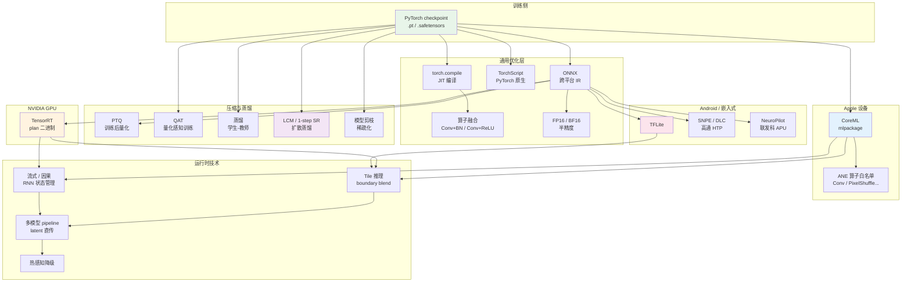
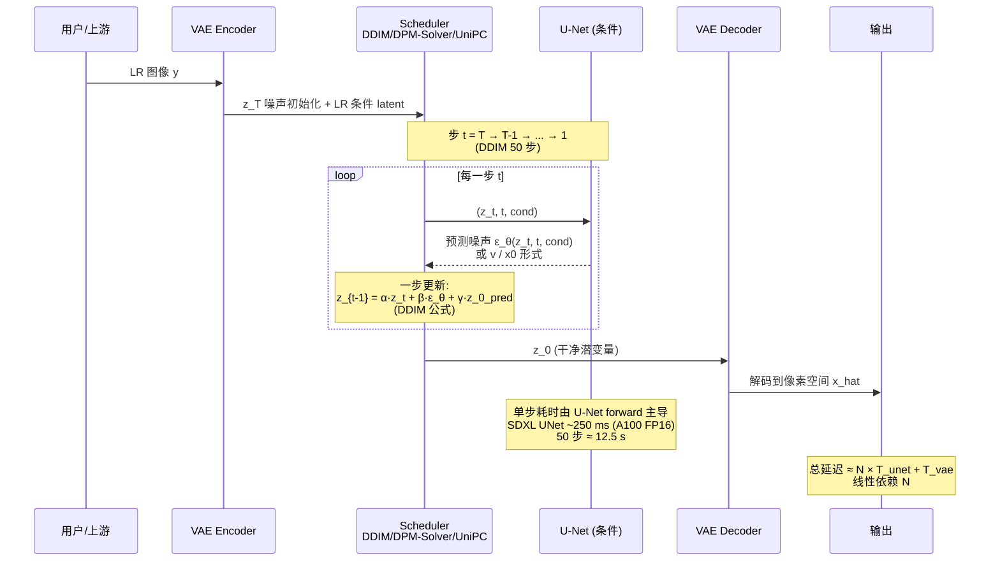
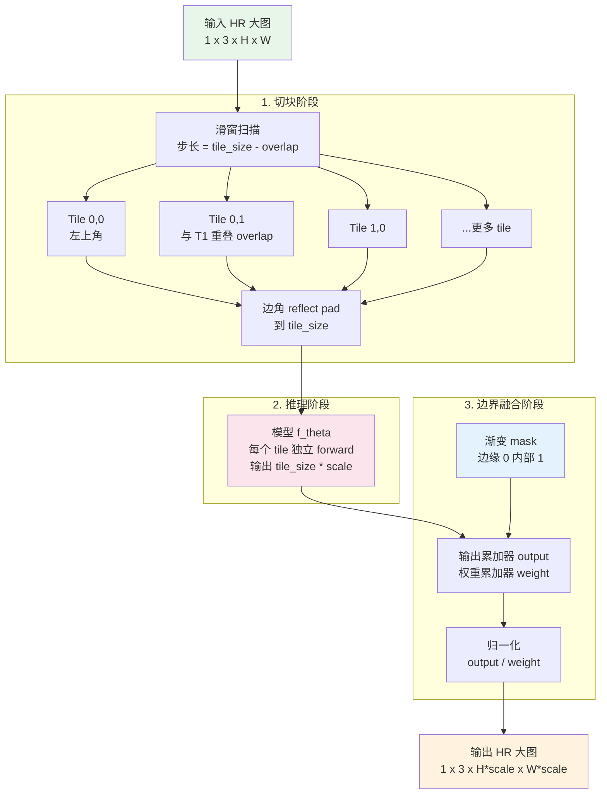

# 第 15 章 · 推理优化

> 模型在训练集与基准榜单上的收敛，仅仅确立了算法能力的理论上限。
>
> 将高维张量运算高效注入真实的物理硬件（云端加速卡、桌面 GPU、移动端 NPU 与异构嵌入式系统），是一门对内存带宽、算子时序、硬件拓扑与功耗预算有着严苛要求的系统工程学科。
>
> 本章系统剖析图编译、算子融合、混合精度、逐通道量化、平台专用引擎（TensorRT / CoreML / LiteRT）、分块（Tile）推理与实时因果流式处理等核心技术。

## 15.0 本章铺垫与术语注

前 14 章系统阐明了训练侧的技术链条：从物理退化建模出发，沿表征空间、目标函数、评估体系、数据合成、判别式与生成式架构、训练动力学、视频时序连续性一路行至可控生成。这些讨论大都建立在实验室训练环境的理想假设之上：充裕的高带宽显存（HBM）、宽松的耗时预算以及可随时中断重试的容错空间。本章开始全面切换至工业部署视角：**真实的生产环境遵循着截然不同的系统物理定律与工程约束**。线上服务受制于严苛的硬件边界，包括端到端延迟分布（p50/p99）、每秒并发吞吐量（QPS）、显存驻留上限、能效比与温升降频、网络传输码率适配以及与上下游音视频编解码器的无缝对齐。在学术评测集上提升 0.3 dB PSNR 在真实业务中往往难以被肉眼察觉，但 p99 延迟若超出预算 20 ms，便足以引发帧率暴跌或交互体验雪崩。

更棘手的是：训练表现优异的模型往往无法直接投入生产。例如一个 SwinIR-Large 在 A100 集群上以 batch=8 训练顺畅，但导出到移动端后可能会遭遇 PixelShuffle 算子在 iOS 16 上回退至 CPU 引发内存搬运悬崖、注意力算子在高通 NPU 上缺乏原生指令支持、INT8 定点量化后引入结构性棋盘格伪影、连续推理 30 分钟后手机过热触发降频、视频会议场景中因缺失未来帧而被迫切换为单向因果模式、增强后的画面经下游 H.264 重新压缩后高频细节全被当成噪声抹除等工程断点。这些问题在学术论文中鲜少被提及，但在工程落地时每一个都是决定系统生死的核心阻碍。

因此，本章并非一份单纯调用 TensorRT 的 API 指南，而是一份**将训练完备的低层视觉模型从 PyTorch 平稳推进至各类真实终端**的系统化工程清单。在结构上，本章先从通用优化技术（模型导出、图级编译、半精度加速、量化理论）展开；随后按硬件生态细分剖析：针对 NVIDIA GPU 的 TensorRT、面向 Apple 硬件的 CoreML 与 ANE，以及适用于 Android 与嵌入式设备的 LiteRT 与芯片厂商 SDK；接着探讨三类跨平台核心技术：模型蒸馏（含单步扩散超分）、分块（Tile）超大图推理、流式与实时视频处理；最后归结于多模型流水线编排、运行时全链路监控与算力成本测算。

阅读本章时请把握核心对照：**学术指标关注“模型输出与真实标签的数学距离”，而生产指标聚焦“工程系统能否高可靠、低成本交付”**。两者并不冲突，但优化路径截然不同。本章各节旨在将工程关切转化为清晰可执行的架构设计与实现方案。

### 缩写与首次出现的术语

为了避免术语堆砌，第一次出现的缩写在这里集中给出全称与工程定义。后文再次使用时不再展开。

- **TensorRT**：NVIDIA 面向自研 GPU 架构的高性能推理编译器与运行时，可将 ONNX / PyTorch 计算图编译为高度优化且固化硬件内核调优结果的二进制执行引擎（`.plan` 文件）。
- **ONNX**（Open Neural Network Exchange，开放神经网络交换格式）：跨框架的开放模型中间表示（IR），绝大多数现代推理引擎均以其为通用输入前端。
- **CUDA**（Compute Unified Device Architecture）：NVIDIA GPU 的通用并行计算架构与编程模型。
- **cuDNN**（CUDA Deep Neural Network library）：NVIDIA 提供的底层 GPU 深度学习加速算子库，TensorRT 与 PyTorch 的底层卷积与归一化实现均深度依赖它。
- **FP32 / FP16 / BF16**：32 位单精度 / 16 位半精度浮点。BF16（Brain Float 16）保持与 FP32 相同的 8 位指数宽度，牺牲尾数精度换取与单精度一致的动态数值范围，在 NVIDIA Ampere（A100）及更新架构上具备硬件级原生加速。
- **INT8 / INT4**：8 位 / 4 位定点整数。用于低比特量化以换取数倍计算吞吐与显存带宽节约，但在低层视觉高频细节重建中需警惕量化截断噪声。
- **PTQ**（Post-Training Quantization，训练后量化）：模型训练完成后，直接利用代表性校准数据集统计激活与权重的动态范围，推导 scale 与 zero point 完成离线量化。
- **QAT**（Quantization-Aware Training，量化感知训练）：在前向计算中插入伪量化（FakeQuant）节点，在反向传播中使网络权重自适应学习并补偿量化截断误差。
- **TorchScript**：PyTorch 的图化中间表示，支持脱离 Python 解释器在独立 C++ 运行时环境中高效调度。
- **torch.compile**：PyTorch 2.0+ 引入的 JIT 图编译入口，由 TorchDynamo 捕获计算图、AOTAutograd 追踪以及 TorchInductor 生成融合底层 Triton 内核。
- **CoreML**：Apple 生态的设备端统一推理框架，支持跨 CPU、GPU 与 Apple Neural Engine（ANE）实施异构调度。
- **ANE**（Apple Neural Engine）：Apple 芯片内集成的低功耗专用神经网络加速器，具备极高的定点与半精度张量能效比。
- **NPU**（Neural Processing Unit，神经网络处理器）：端侧与嵌入式 SoC 上的专用神经网络硬件加速单元总称（涵盖高通 HTP、华为 NPU、联发科 APU 与 Apple ANE）。
- **HTP**（Hexagon Tensor Processor）：高通骁龙平台集成的张量加速核心，在 INT8 运算中能效突出。
- **SNPE / QNN**（Qualcomm Neural Processing Engine / Qualcomm AI Engine Direct）：高通提供的端侧 NPU 软件开发工具链，将计算图下发至 HTP、GPU 或 CPU。
- **DLC**（Deep Learning Container）：高通 SNPE / QNN 的专用模型容器格式。
- **NeuroPilot**：联发科为天玑系列芯片 APU 量身打造的 NPU 编译与部署 SDK。
- **LiteRT**（原 TensorFlow Lite / TFLite）：Google 规范命名的轻量级端侧推理运行时，作为 Android 生态的事实标准中间层。
- **NNAPI**（Neural Networks API）：Android 系统层提供的硬件抽象接口，驱动 LiteRT 将计算图路由至底层 NPU。
- **OpenVINO**：Intel 面向旗下 CPU、集成 GPU 与 VPU 架构的高性能推理优化工具链。
- **DirectML**：Windows 平台上的硬件抽象推理 API，跨厂商统一覆盖 NVIDIA、AMD 与 Intel 图形硬件。
- **VAE**（Variational Auto-Encoder，变分自编码器）：扩散模型潜空间的编解码核心，在低比特与半精度下对数值下溢与溢出极度敏感。
- **KV cache**（Key-Value cache）：自回归 Transformer 推理中缓存历史注意力键值对的机制，在视频流式与长时序处理中用于消除冗余投影计算。
- **Flash Attention**：将注意力机制的 Softmax 计算与值矩阵乘法在 SRAM 片上分块融合执行的低访存算法，彻底突破显存带宽瓶颈。
- **Tiling**（分块推理）：将超大分辨率图像切片为规则重叠子块、逐块推理后再通过平滑权重无缝拼合的工程技术。
- **SwinIR-Tile**：SwinIR 官方推荐的分块推理参考实现，采用余弦平滑窗口抑制接缝。
- **Boundary blending**（边界平滑融合）：在分块拼接的重叠过渡带施加空间衰减权重，消除硬拼接产生的结构接缝与色差。
- **DDIM**（Denoising Diffusion Implicit Models）：扩散模型的非马尔可夫确定性采样轨迹，以远少于训练的离散步数完成图像重构。
- **DDIM steps**：扩散采样迭代步数，经典配置通常为 20 至 50 步。
- **DPM-Solver / DPM-Solver++**：基于常微分方程（ODE）的高阶多步数值求解器，在 10 至 20 步即可逼近收敛解。
- **UniPC**（Unified Predictor-Corrector）：统一预测-校正扩散采样器，在 8 至 15 步下展现出优秀的重构保真度。
- **LCM**（Latent Consistency Model，潜空间一致性模型）：基于一致性映射原理训练的学生网络，可将扩散采样压缩至 4 至 8 步。
- **LoRA**（Low-Rank Adaptation，低秩适配器）：在预训练大模型冻结主干上附加低秩矩阵分解增量，实现参数高效微调与即插即用加速。
- **OSEDiff / TSD-SR / AdcSR / SinSR**：代表性的单步生成式扩散超分辨率架构，将扩散去噪浓缩为单次前向推断。
- **GOP**（Group of Pictures，图像组）：视频压缩流的基本组织单元，以独立解码的 I 帧为起点，后续帧通过 P/B 帧进行时域预测编码。
- **I / P / B 帧**：视频关键帧（Intra-coded）、前向预测帧（Predicted）与双向预测帧（Bi-directional predicted）。
- **NAL 单元**（Network Abstraction Layer）：视频编码标准中封装压缩码流的传输与解复用基本单元。
- **A/V 同步**（Audio/Video Synchronization）：音视频时间戳严格对齐，人耳对音画不同步的感知生理阈值约为 ±40 ms。
- **p50 / p90 / p99 延迟**：推理耗时分布的分位数指标，用于度量系统的常态吞吐与长尾毛刺。
- **OOM**（Out Of Memory）：硬件显存或物理内存耗尽导致的进程崩溃。
- **QPS**（Queries Per Second）：每秒查询处理请求数，衡量服务端并发承载力。
- **GAN**（Generative Adversarial Network，生成对抗网络）：以 ESRGAN / Real-ESRGAN 为代表的高频纹理感知重建范式。
- **RRDB**（Residual-in-Residual Dense Block）：ESRGAN 系列中经典的多层残差密集主干模块。

后续小节首次出现特化缩写时仍会给出全称，通用术语则直接延用。

### 本章主线

整章可以视作一张从训练产物向各级生产终端辐射的“技术调度图谱”：处于核心的是 PyTorch 训练权重，外围是形态各异的物理部署目标，连接两者的每一条边均承载着特定的优化编译技术。



该图清晰回答了工程架构的核心抉择：“针对手头的模型权重与目标业务工况，应当沿着哪条路径完成工程落地？”。例如：云端 4K 实时直播流增强，对应 `PyTorch → ONNX → TensorRT FP16 + Tile + 多卡流水线`；移动端即时相册滤镜，对应 `PyTorch → CoreML + ANE 算子白名单 + 逐通道 INT8 + 因果流式`；生成式扩散超分上线，对应 `PyTorch → 单步/少步扩散蒸馏 + TensorRT FP16 + Tile 分块`。后文各节将逐一拆解这些路径上的具体技术决策。

## 15.1 推理优化的部署目标

不同物理平台在算力密度、内存带宽与能耗预算上存在量级差异，对应着截然不同的优化重点：

| 平台 | 延迟要求 | 显存预算 | 模型大小预算 | 优先级 | 核心工程瓶颈 |
|------|---------|---------|-----------|-------|-------------|
| **A100/H100 服务器** | < 1 秒/张 | 80 GB HBM | 数 GB 至数十 GB | 并发吞吐量（QPS） | 显存带宽与多卡批处理调度 |
| **消费级 GPU（RTX 4090）** | < 100 ms/张 | 24 GB GDDR6X | 数 GB | 交互体验与画质上限 | 单流前向时延与显存占用 |
| **桌面 CPU** | < 5 秒/张 | 16 GB DDR | < 500 MB | 架构兼容性与保底可用 | 算力受限，依赖矢量指令集（AVX-512） |
| **手机 NPU（端侧 SoC）** | < 30 ms/帧 | < 1 GB 统一内存 | < 50 MB | 强实时性 + 毫瓦级功耗 | 算子硬件支持白名单与温升降频 |
| **嵌入式 / IoT 设备** | < 100 ms/张 | < 100 MB | < 10 MB | 极限物理资源约束 | 静态定点量化与极小内存驻留 |

每个计算平台均拥有专属的加速软件栈。下文将从跨平台的通用优化技术出发，逐步深入各硬件特化生态。

## 15.2 通用优化（所有平台都要）

### 15.2.1 模型导出格式

在离开训练环境时，PyTorch 动态计算图必须导出为结构固化的推理格式：

```
PyTorch model (.pt)
  ├── ONNX (.onnx)              ← 跨平台中间格式
  │   ├── TensorRT (.plan)      ← NVIDIA GPU
  │   ├── OpenVINO              ← Intel CPU/GPU
  │   ├── DirectML              ← Windows 通用
  │   └── ONNX Runtime          ← 通用 CPU/GPU
  ├── TorchScript (.pt)         ← PyTorch 原生
  ├── CoreML (.mlpackage)       ← Apple 设备
  ├── TFLite (.tflite)          ← Android / 嵌入式
  └── 自定义 (Custom)            ← 厂商 SDK
```

**ONNX 是事实标准的跨框架中间格式**，绝大多数现代专用推理编译器均原生支持 ONNX 作为解析入口：

```python
# 导出 PyTorch 模型到 ONNX
import torch

model.eval()
dummy_input = torch.randn(1, 3, 256, 256)

torch.onnx.export(
    model,
    dummy_input,
    "model.onnx",
    input_names=['input'],
    output_names=['output'],
    dynamic_axes={
        'input':  {0: 'batch', 2: 'height', 3: 'width'},  # 动态尺寸
        'output': {0: 'batch', 2: 'height', 3: 'width'},
    },
    opset_version=17,
)
```

### 15.2.2 算子融合（Operator Fusion）

在现代深度学习硬件中，算子执行的耗时往往不由浮点运算（FLOPs）决定，而是受限于**显存内存带宽（Memory Bandwidth Bound）**与**内核启动开销（Kernel Launch Overhead）**。频繁的单算子前向会迫使 GPU 显存（DRAM）反复进行中间张量的写入与读出。

算子融合的核心在于将多个连续算子合并为单一 CUDA / NPU 内核，使中间结果暂存于高速片上缓存（SRAM / Register）中直接参与后续计算，彻底消除显存往返读写：

- `Conv + BatchNorm` → `Conv'`：在推理前将 BatchNorm 的均值、方差、缩放因子与偏置数学等价地折叠（Fold）进卷积核的权重 $W$ 与偏置 $b$ 中，消除运行时的独立归一化开销；
- `Conv + ReLU / LeakyReLU` → `Conv-ReLU` 融合算子：卷积计算完成后在寄存器中直接完成非线性截断；
- `LayerNorm + Linear` → 融合前向内核：显著减少 Transformer 架构中的高频内存跳变。

PyTorch 2.0+ 的 `torch.compile` 以及 TensorRT 等专用编译器均能自动完成图级算子融合。

### 15.2.3 torch.compile

PyTorch 2.0 引入的 JIT 编译技术，依托 TorchDynamo（计算图捕获）、AOTAutograd（反向图追踪）与 TorchInductor（Triton 内核生成后端），能够在不改变 Python 代码结构的前提下实现底层的内核编译与极致融合：

```python
import torch

model = build_model().eval().cuda()
model = torch.compile(model, mode="reduce-overhead")  # 或 "max-autotune"

# 第一次推理会触发 JIT 编译（耗时数秒至数十秒）
with torch.no_grad():
    _ = model(warmup_input)  # 触发预热与编译生成

# 编译完成后进入高速稳定前向
output = model(real_input)
```

`mode` 选型策略：

- `"default"`：稳妥平衡编译耗时与运行速度，通常可获得 1.3-1.8 倍加速；
- `"reduce-overhead"`：利用 CUDA Graphs 捕获固定执行序列，大幅削减 Python 运行时开销，最适合小 Batch 与延迟敏感型交互；
- `"max-autotune"`：穷举搜索最优 Triton 内核分块与内存排布，离线编译耗时最长但前向性能达到极致。

实测影响：
- Real-ESRGAN 在 RTX 4090 上以原生 PyTorch 运行 $256\times 256$ 输入耗时约 200 ms，经 `torch.compile(mode="max-autotune")` 优化后降至 90 ms。

工程注意事项：
- **动态形状重编译风险**：若输入分辨率频繁变化，TorchDynamo 会反复触发耗时漫长的重新编译（De-optimization / Recompilation），导致服务剧烈卡顿。生产环境应开启 `dynamic=True` 让编译器生成自适应动态内核，或将输入严格 Pad 预对齐至固定网格；
- **算子图断裂（Graph Break）**：计算图中包含 Python 原生控制流、第三方 C++ 扩展或动态数据依赖时会切断编译图，退化为局部解释执行，应使用 `torch._dynamo.explain` 排查图完整性。

### 15.2.4 FP16 / BF16 半精度推理

在标准工业部署中，从 FP32（32 位单精度浮点）平滑过渡到 FP16 / BF16 半精度，是性价比最高的优化手段，能够在维持高保真画质的同时将显存占用减半，并利用张量核心（Tensor Cores）获得 1.5 至 2 倍的前向加速：

```python
model = build_model().eval().cuda().half()  # 权重量化为 FP16
output = model(input.half())
```

底层数值特性与工程选型要点：

- **FP16（IEEE 754 半精度）**：拥有 1 位符号位、5 位指数位与 10 位尾数位。其动态数值范围较为狭窄（约 $\pm 65504$），在处理扩散模型的 VAE 编解码器（潜空间大方差特征图）或包含大尺度注意力点积的层时极易诱发数值下溢（Underflow 变为 0）或上溢（Overflow 变为 $\text{NaN}$，表现为输出纯黑/纯白画面）。**工程规范：VAE 编解码器与精细归一化算子建议强制保留 FP32 计算**；
- **BF16（Bfloat16 脑浮点）**：保持与 FP32 完全相同的 8 位指数位，仅保留 7 位尾数位。其动态范围与 FP32 严格对齐，彻底免疫溢出异常，但由于尾数精度较低，在极微弱高频纹理重构上可能引入微量量化噪声。**在 NVIDIA Ampere（A100/RTX 3090+）及更新硬件架构上，服务端推荐默认采用 BF16 进行大模型推理**；
- **局部混合精度（Mixed Precision Casting）**：对绝大多数残差卷积主干采用 FP16/BF16，仅在数值敏感节点（如 Softmax 概率计算、全局 LayerNorm）插入局部 FP32 转换。

### 15.2.5 量化理论与实践（INT8 / INT4）

量化的本质在于建立高维连续浮点张量与离散低比特整数空间之间的双射投影，借此释放硬件定点张量计算单元的极致吞吐并大幅削减内存访问带宽。最常用的对称线性量化映射关系为：

$$
q = \text{round}\left(\frac{x}{s}\right), \qquad \hat{x} = q \cdot s
$$

其中 $s$ 为量化比例因子（Scale），$q$ 为量化后的定点整数（在 INT8 模式下 $q \in [-128, 127]$）。非对称线性量化在此基础上引入零点偏移量（Zero Point）$z$：

$$
q = \text{round}\left(\frac{x}{s}\right) + z, \qquad \hat{x} = (q - z) \cdot s
$$

比例因子 $s$ 的校准策略决定了量化流形的保真度。朴素的最大绝对值截断（Max-Absolute Scale）对激活分布中的离群噪点（Outliers）极度脆弱，极端离群值会拉伸整个量化区间，导致绝大多数常规特征通道的有效表达位宽严重萎缩。工业级校准器通常采用以下两类鲁棒策略：

1. **百分位数截断（Percentile Calibration）**：统计激活张量的累积分布函数（CDF），选取 99.99% 分位数作为动态截断上限，将极少数异常离群噪点实施硬饱和截断；
2. **Kullback-Leibler（KL）散度最小化 / MSE 搜索**：在校准数据集上前向推断，搜索使得量化反量化后的张量与原始浮点张量之间相对熵或均方误差 $\|\hat{x} - x\|_2^2$ 达到极小值的最优 scale。

将深度网络压缩至低比特整数主要依托两条技术路线：

- **PTQ（训练后量化）**：模型训练完成后，向已冻结的计算图输入数百张覆盖真实业务分布的无标签校准图像，统计各层激活张量的直方图分布以推导最优 scale。该方案开发成本极低，但在低层视觉网络中常因截断误差引起结构性画质衰减；
- **QAT（量化感知训练）**：在微调阶段的前向传播中显式插入量化与反量化复合算子（Fake-Quantization Nodes），使梯度在反向传播中通过直通估计器（Straight-Through Estimator, STE）直接感知离散化扰动，引导网络权重主动收敛至对定点截断钝化的平坦极小值流形。该方案画质损耗极小（PSNR 降幅通常 $< 0.2\text{ dB}$）。

低层视觉任务的特殊物理难点：**输出图像的像素流形对定点截断噪声高度敏感**。在高层分类网络中，微小的量化偏移会被后续的 Softmax 概率归一化天然吸收；但在低层超分与去噪任务中，亚像素卷积（PixelShuffle）会将浅层权重微弱的量化抖动直接解耦放大为空间周期性的棋盘格网纹与色块断层。

工业实践准则：

- **大容量模型（如 Restormer、HAT、扩散 U-Net）**：通道冗余度较高，经充分校准后 INT8 量化保真度优异；
- **极轻量模型（如 NAFNet-Lite、SRVGGCompact）**：参数容量紧凑，INT8 激进量化易导致高频重构能力坍塌，端侧部署建议优先评估 FP16；
- **潜空间变分自编码器（VAE）**：严禁执行全网络 INT8 量化，否则极易诱发潜空间几何发散导致整图解码崩溃。

```python
# 简化的 PyTorch INT8 PTQ 校准流程
import torch.ao.quantization as quant

model = build_model().eval()

# 1. 准备覆盖真实工况的校准数据集
calibration_data = [load_calibration_batch(i) for i in range(100)]

# 2. 配置定点量化策略
qconfig = quant.get_default_qconfig('fbgemm')  # 面向 CPU x86 架构
model.qconfig = qconfig
model_prepared = quant.prepare(model)

# 3. 执行代表性数据前向校准，统计激活极差
with torch.no_grad():
    for batch in calibration_data:
        model_prepared(batch)

# 4. 固化 Scale 并转换为 INT8 定点执行模型
model_int8 = quant.convert(model_prepared)
```

技术演进说明：上述 `torch.ao.quantization` 属于 Eager 模式的经典接口；自 PyTorch 2.x 起官方主推的架构已演进为 PT2E（PyTorch 2 Export Quantization），通过 `torch.export` 先行捕获确定性计算图，并在中间表示层注入量化算子，针对包含复杂控制流与自定义算子的网络表现出更高的健壮性。

## 15.3 NVIDIA GPU 部署：TensorRT

### 专为 NVIDIA 架构打造的硬件级优化引擎

TensorRT 是 NVIDIA 推出的高性能深度学习推理编译器与执行运行时，其核心职责涵盖：

- 解析并接纳 ONNX 或 PyTorch 计算图；
- 实施图级垂直与水平算子融合、显存复用规划及精度量化校准；
- 针对目标 GPU 架构（如 Hopper、Ada Lovelace、Ampere）搜索最优硬件微内核，输出高度优化的二进制执行引擎（`.plan` 文件）；
- 提供具备异步 CUDA Stream 支持的高吞吐 C++ 与 Python 执行上下文。

TensorRT 显著超越原生 PyTorch 与基础 ONNX Runtime 的底层机制：

1. **垂直与水平内核融合（Aggressive Kernel Fusion）**：将多层连续计算（例如卷积、偏置加法、批归一化与非线性激活）垂直固化进单一 CUDA Kernel，并在可能时横向合并相同尺寸的并行分支，将原本需要多次显存往返（DRAM Round-trip）的张量流转完全约束在 GPU 片上高速 SRAM 缓存中；
2. **硬件级 Kernel 自动调优（Auto-Tuning Profiler）**：针对目标计算图中的每一个算子，TensorRT 会在其底层内核库（覆盖不同线程块分块尺寸、共享内存排布与 Tensor Core 指令路径）中，在目标物理硬件上执行即时基准测算以遴选吞吐最高的实现。该调优结果深度绑定物理硬件微架构（例如在 A100 上构建的 plan 文件严禁且无法直接加载至 RTX 4090 执行）；
3. **硬件 Tensor Core 原生调度**：在 FP16 / BF16 / INT8 模式下，TensorRT 能够以接近理论峰值的效率驱动张量计算核心，计算吞吐可达标准 CUDA Core 的 4 至 8 倍。

离线编译成本考量：以 SDXL U-Net 为例，在 A100 上构建高优化等级的 FP16 plan 通常需要 5 至 15 分钟，若叠加 INT8 KL 散度校准耗时可达 30 分钟以上。在工业流水线中，编译完成的 plan 文件应作为 CI/CD 构建产物进行版本化归档，严禁在服务冷启动时在线动态编译。

### 引擎构建工作流

```python
import tensorrt as trt

# 1. 从 ONNX 计算图构建 TensorRT 优化引擎
def build_engine(onnx_path: str, engine_path: str,
                 fp16: bool = True, int8: bool = False):
    logger = trt.Logger(trt.Logger.WARNING)
    builder = trt.Builder(logger)
    network = builder.create_network(
        1 << int(trt.NetworkDefinitionCreationFlag.EXPLICIT_BATCH)
    )
    parser = trt.OnnxParser(network, logger)

    with open(onnx_path, 'rb') as f:
        if not parser.parse(f.read()):
            for error in range(parser.num_errors):
                print(parser.get_error(error))
            return None

    config = builder.create_builder_config()
    config.set_memory_pool_limit(trt.MemoryPoolType.WORKSPACE, 4 << 30)  # 4 GB 工作区显存

    if fp16:
        config.set_flag(trt.BuilderFlag.FP16)
    if int8:
        config.set_flag(trt.BuilderFlag.INT8)
        config.int8_calibrator = MyCalibrator(...)  # 配置领域数据校准器

    # 配置动态输入形状优化配置文件（Optimization Profile）
    profile = builder.create_optimization_profile()
    profile.set_shape("input",
                     min=(1, 3, 64, 64),
                     opt=(1, 3, 256, 256),
                     max=(1, 3, 1024, 1024))
    config.add_optimization_profile(profile)

    engine = builder.build_serialized_network(network, config)
    with open(engine_path, 'wb') as f:
        f.write(engine)
```

### TensorRT 异步推理执行器

```python
import tensorrt as trt
import pycuda.driver as cuda
import numpy as np

class TRTInferencer:
    def __init__(self, engine_path: str):
        logger = trt.Logger(trt.Logger.WARNING)
        runtime = trt.Runtime(logger)
        with open(engine_path, 'rb') as f:
            self.engine = runtime.deserialize_cuda_engine(f.read())
        self.context = self.engine.create_execution_context()

    def infer(self, input_array: np.ndarray) -> np.ndarray:
        # 1. 动态设定输入尺寸并查询模型实际输出尺寸
        # 注意：超分辨率模型的输出尺寸由放大倍率 scale 决定
        self.context.set_input_shape("input", input_array.shape)
        out_shape = tuple(self.context.get_tensor_shape("output"))

        # 2. 按实际张量尺寸分配显存
        in_size  = int(np.prod(input_array.shape) * np.dtype(np.float32).itemsize)
        out_size = int(np.prod(out_shape) * np.dtype(np.float32).itemsize)
        d_input  = cuda.mem_alloc(in_size)
        d_output = cuda.mem_alloc(out_size)
        cuda.memcpy_htod(d_input, input_array.astype(np.float32))

        # 3. 基于 TensorRT 10+ 规范的张量地址绑定与异步执行
        self.context.set_tensor_address("input",  int(d_input))
        self.context.set_tensor_address("output", int(d_output))
        stream = cuda.Stream()
        self.context.execute_async_v3(stream.handle)
        stream.synchronize()

        # 4. 显存数据回传至主机内存
        output = np.empty(out_shape, dtype=np.float32)
        cuda.memcpy_dtoh(output, d_output)
        return output
```

### TensorRT 实测加速效果对比

| 模型架构 | 原生 PyTorch 耗时 | TensorRT FP16 耗时 | TensorRT INT8 耗时 |
|---------|------------------|-------------------|-------------------|
| Real-ESRGAN (RRDB) | 100% (基准) | 35% (提速 2.8×) | 18% (提速 5.5×) |
| SwinIR | 100% (基准) | 40% (提速 2.5×) | N/A (精度受损严重) |
| BasicVSR++ | 100% (基准) | 50% (提速 2.0×) | N/A |
| SDXL UNet | 100% (基准) | 45% (提速 2.2×) | N/A |

**结论**：TensorRT FP16 在无画质损耗的前提下通常能稳定带来 2 至 3 倍加速；INT8 可进一步将吞吐推升近 2 倍，但在低层视觉高保真任务中需严格校验结构伪影。

## 15.4 Apple 设备部署：CoreML

### 异构算力拓扑与统一内存架构

CoreML 是 Apple 软硬件生态专属的高性能推理栈。依托 Apple Silicon 统一内存架构（CPU、GPU、ANE 共享高带宽物理物理内存池，零数据拷贝开销），CoreML 支持向底层三种计算单元自适应分发算力：

- **CPU**：提供全量算子兜底支持，兼容所有历史设备；
- **GPU**：面向 M 系列芯片及 iPhone 图形核心，专精于大吞吐流式并行运算；
- **Apple Neural Engine (ANE)**：集成于 A 系列与 M 系列芯片中的超低功耗专用神经网络处理器，以极高的瓦特能效比处理固定拓扑卷积与激活。

### 导出与转换流水线

```python
import coremltools as ct
import torch

# 1. 对 PyTorch 模型执行 JIT 跟踪（Trace）
model.eval()
dummy_input = torch.randn(1, 3, 256, 256)
traced = torch.jit.trace(model, dummy_input)

# 2. 转换为原生 CoreML 格式
mlmodel = ct.convert(
    traced,
    inputs=[ct.ImageType(name="input",
                         shape=(1, 3, 256, 256),
                         scale=1/255.0,
                         color_layout=ct.colorlayout.RGB)],
    outputs=[ct.TensorType(name="output")],
    compute_precision=ct.precision.FLOAT16,    # 移动端默认推荐 FP16 半精度
    compute_units=ct.ComputeUnit.ALL,          # 联合调度 CPU + GPU + ANE
    minimum_deployment_target=ct.target.iOS17,
)
mlmodel.save("model.mlpackage")
```

### Apple Neural Engine (ANE) 硬件约束与算子边界

- **极高能效比优势**：在同等张量吞吐下，ANE 能耗仅为 CPU 的 1/10 左右，可显著延缓移动设备长周期高负荷运算引起的温升降频；
- **严格受限的算子白名单**：针对常规二维卷积、逐元素标量运算与受限张量变换进行了硬件硬化加速；
- **跨单元回退惩罚严峻**：一旦遭遇非支持算子，CoreML 调度器被迫将受阻子图回退（Fallback）至 CPU 或 GPU，引发频繁的设备上下文切换与同步阻塞。

ANE 算子兼容性边界：

- **完全原生支持**：Conv2d（标准 $3\times 3$、$5\times 5$ 空间卷积）；
- **完全原生支持**：ReLU / LeakyReLU / GELU / Sigmoid 等标量激活；
- **完全原生支持**：BatchNorm、InstanceNorm（固定尺寸）；
- **条件受限支持**：PixelShuffle（iOS 17+ 提供了较好的算子映射，但通道数通常需 $\le 256$；iOS 16 易直接回退至 CPU）；
- **条件受限支持**：动态形状（建议生产环境固化输入分辨率以保障 ANE 卸载率）；
- **条件受限支持**：复杂 Multi-Head Attention（需解耦为矩阵乘法与 Softmax 基础组合或使用局部窗口近似）；
- **严禁使用**：自定义 C++/CUDA 扩展算子（未收录入 CoreML 规范的层将直接中断 ANE 链路）。

实测基准性能：
- Real-ESRGAN 在 iPhone 14 ANE 上处理 720P 输入耗时约 80 ms；
- 紧凑型 Transformer 类复原模型在同设备上耗时约 150 ms。

### CoreML 4-bit 权重调色板量化（Weight Palettization）

iOS 17+ 支持通过权重聚类调色板（Palettization）实现 4-bit 权重量化压缩，使模型体积进一步缩减至 1/4：

```python
import coremltools.optimize.coreml as cto

config = cto.OptimizationConfig(
    global_config=cto.OpPalettizerConfig(
        nbits=4,
        granularity="per_grouped_channel",
        group_size=16,
    ),
)
mlmodel_quantized = cto.palettize_weights(mlmodel, config)
```
实测指标：模型体积从 50 MB 压缩至 12 MB，PSNR 损耗控制在 0.3 dB 以内。

### 15.5 NPU 实战：从“能跑”跨越到“真快”

15.4 节梳理了 ANE 的算子白名单，但在真实的端侧工程实践中，**超过 90% 的性能劣化并非源于算子无法在硬件上执行，而是源于局部算子回退引发跨芯片数据搬运悬崖、量化尺度划分失准以及内存排布（Layout）转换诱发的隐式重排**。以下深入剖析端侧 NPU 部署中的高频工程瓶颈与系统防御对策。

### 15.5.1 逐通道与逐张量量化：低层视觉的物理选择

INT8 量化将 FP32/FP16 连续张量离散化为 8 位定点整数。映射尺度（Scale）的划分粒度主要包含两种形式：

- **逐张量量化（Per-tensor Quantization）**：整个权重张量共享单一组 `(scale, zero_point)`。计算逻辑最简，早期的移动端 NPU 驱动通常默认采用；
- **逐通道量化（Per-channel Quantization）**：为卷积核的每一个输出通道独立分配专属的 scale，大幅提升权重量化保真度（由于输入激活值的空间动态特性，激活量化通常仍采用 per-tensor）。

**低层视觉必须强制采用逐通道权重量化的物理机理**：

低层视觉卷积核在不同输出通道之间的幅值动态范围**显著超越高层语义分类任务**：部分特征通道专注于捕捉大面积平滑区域的低频光度基底（权重幅值较大），而另一部分通道则专门解算亚像素级的高频微弱纹理与边缘残差（权重幅值极小）。若采用 per-tensor 统一量化，小幅值通道的数值动态范围将被粗暴压缩至极少数几个离散等级（有效精度甚至跌破 3-4 位），造成灾难性的信息湮灭，在重构画面上直接呈现为刺眼的周期性网格伪影与色斑断层。

实测对比（基于 Real-ESRGAN 在 DIV2K 验证集）：

| 量化方案 | PSNR (dB) | 视觉感知表现 |
|---------|-----------|------------|
| FP16 浮点基准 | 28.45 | 纹理细腻，无伪影 |
| 逐通道权重 + 逐张量激活 (INT8) | 28.30 (-0.15) | 画质几乎无损，伪影肉眼不可见 |
| 逐张量权重 + 逐张量激活 (INT8) | 27.10 (-1.35) | 出现严重色斑断层与高频网格纹 |

工程铁律：**端侧低层视觉 INT8 量化必须强制开启逐通道权重量化（Per-channel weight quantization）**。若目标芯片专用 SDK 缺乏该特性支持，应优先退守 FP16 浮点推理，或重新评估硬件选型。

```python
# CoreML 的逐通道线性量化配置（iOS 16+）
import coremltools.optimize.coreml as cto

cto.linear_quantize_weights(
    mlmodel,
    config=cto.OptimizationConfig(
        cto.OpLinearQuantizerConfig(
            mode="linear_symmetric",
            granularity="per_channel",     # 关键配置：逐通道独立尺度
            weight_threshold=2048,
        )
    ),
)
```

### 15.5.2 ANE 算子回退引发的延迟阶跃

ANE 原生硬件内核的单算子前向耗时通常处于**亚毫秒级（数十至数百微秒）**。一旦计算图中潜入不兼容算子，CoreML 运行时引擎被迫将该节点调度至 CPU 或 GPU 运行，使该算子耗时瞬间激增数倍。

更为致命的是跨异构单元的系统调度损耗：**ANE 与 CPU/GPU 之间的数据传递必须跨越不同的逻辑内存视图与硬件同步屏障**。一个包含 30 层的卷积网络若存在 3 处离散的不兼容算子，将诱发多达 6 次跨设备内存同步与上下文切换，使得单帧整体延迟由 30 ms 骤升至 100 ms 以上，引发严重的交互顿挫。

**端侧部署的标准防御工程体系**：

1. **导出后第一时间分析算子分布图谱**：

```python
import coremltools as ct

mlmodel = ct.models.MLModel("model.mlpackage")
spec = mlmodel.get_spec()

# 利用 Xcode Instruments 的 Core ML 模板分析每个算子的实际分配单元
# 目标：实现主干计算图 100% 卸载至 ANE，根除跨芯片回退
```

2. **强制 ANE-Only 连通性沙盒校验**：

```python
# 强制限制执行单元仅为 ANE 与 CPU（彻底剥离 GPU），验证是否存在隐式回退异常
mlmodel = ct.convert(traced, ..., compute_units=ct.ComputeUnit.CPU_AND_NE)
# 沙盒校验通过后，生产环境再开放 ALL 全单元自适应调度
```

3. **PixelShuffle 算子的兼容性重构**：iOS 16 及更早系统 ANE 对 PixelShuffle 缺乏原生支持会直接回退至 CPU；iOS 17+ 虽已原生支持但输入通道通常受限于 256 以内。在兼顾跨版本兼容的场景下，**建议在模型设计阶段采用反卷积（Transposed Conv）或“最近邻插值 + 标准卷积”（Nearest + Conv）作为等价替代**；
4. **LayerNorm 的动态分辨率适配**：固定尺寸下的 LayerNorm 在 ANE 上执行效率极高，但在动态可变分辨率输入下可能触发编译器保守回退。若模型需对外暴露动态输入接口且实测遭遇 LayerNorm 回退，可考虑将其替换为对分辨率不敏感的 GroupNorm，但最终选型必须以真机 Profile 为准。

### 15.5.3 维度重塑与转置引发的隐式内存搬迁

ANE 硬件内部具备严格偏好的张量物理内存排布。不恰当的维度重排（Permute / Reshape）会迫使编译器插入隐式的全张量内存重排内核（Memory Layout Transposition Kernel），使原本仅需指针重解释的操作恶化为毫秒级显存带宽瓶颈。高频触发场景包括：

- 跨格式重排：例如 `tensor.permute(0, 2, 3, 1)` 在 NCHW 与 NHWC 排布之间频繁切换；
- 非对齐通道重塑：当通道数未对齐至 8 或 16 的整倍数时执行 `tensor.view(B, -1, H, W)`；
- 针对 4K 及以上超大分辨率直接执行全图转置。

工程防御实践：

- **架构设计阶段即对齐通道对齐**：确保网络所有中间层通道数为 8、16 或 32 的整数倍；
- **规避大图全局转置**：必须进行维度重排时，先执行分块切片，在局部小尺寸张量上操作；
- **开启图优化编译器重排**：利用 `coremltools.compression.experimental.ane_optimize`（iOS 18+）自动消除多余的布局转换算子。

### 15.5.4 高通 QNN / 联发科 NeuroPilot 的碎片化工程对策

Android 生态的 NPU 硬件环境呈现出高度的碎片化特征，同一份 ONNX 模型在不同芯片厂商的加速器上运行表现可能存在数倍差异。

**高通 QNN（Qualcomm AI Engine Direct / SNPE）**：
- 其 Hexagon Tensor Processor（HTP）在处理 INT8 定点张量时能效与吞吐极其出众（旗舰芯片吞吐显著超越移动端 GPU）；
- 算子支持边界较为严苛：早期驱动对原生 GroupNorm（需拆解为 Reshape 与 LayerNorm 组合）与复杂注意力结构支持有限；
- 编译时必须使用 `qnn-onnx-converter` 并开启详细日志，逐层审视各算子的 HTP 硬件卸载情况。

**联发科 NeuroPilot（天玑 APU）**：
- 近代旗舰芯片（如天玑 9400 系列）APU 性能强劲，但在旗舰芯片与中低端芯片之间存在明显的算子支持代差；
- 模型量化与格式转换依赖 `neuropilot-converter`，校准数据集应包含至少 200 张具备业务代表性的真实场景图像。

**跨平台工程准则**：在 Android 端正式发版前，**必须选取 3 至 4 款具备代表性的主流 SoC 平台进行实机端到端 Profile**（覆盖高通骁龙旗舰、联发科天玑旗舰以及中端典型芯片），切忌仅依赖单一旗舰机型评估性能。

### 15.5.5 端侧模型落地的闭环测试流

将上述工程要点整合后的标准闭环流程如下：

```
1. 网络设计阶段：对齐 NPU 友好约束（通道对齐、备选上采样方案、算子精简）
   ↓
2. 导出 ONNX 中间表示，转换为 CoreML / LiteRT / DLC / QNN
   ↓
3. 导出算子执行图谱：审查各算子在 NPU / GPU / CPU 之间的调度分布
   ↓
4. 消除硬件回退：针对触发 fallback 的算子实施结构等价重构
   ↓
5. 实施量化压缩：强制开启逐通道权重量化（Per-channel weight quantization）
   ↓
6. 领域数据校准：引入 200+ 张覆盖极端光照与复杂纹理的业务真图
   ↓
7. 真机基准评测：获取 p50/p90/p99 延迟分布、功耗指标与长周期发热衰减
   ↓
8. 极端场景与伪影回归集验收
```

缺乏上述闭环验证的端侧模型，在线上复杂工况下极易发生性能劣化与服务异常。

## 15.6 Android 与嵌入式：LiteRT 与专用 SDK

Android 平台的推理标准已由早期的 TensorFlow Lite 规范演进为 LiteRT（Google 官方轻量化运行时，完全向前兼容）。

在模型转换路径上，传统的 `ONNX → onnx-tf → .pb → TFLite` 链条由于依赖已停止积极维护的中间工具，在复杂计算图上极易出现格式转换异常。现代工程实践推荐两条主流稳定路径：

- **官方原生直转（ai-edge-torch）**：Google 官方提供的 PyTorch 直转工具链，绕过 ONNX 与 TensorFlow 中间图直接生成高效 LiteRT 模型；
- **结构优化转译（onnx2tf）**：社区深度维护的 ONNX 直转方案，具备优良的算子排布自适应修复能力。

```python
# 推荐路径 A: 采用 Google 官方 ai-edge-torch 实现 PyTorch 原生导出
import ai_edge_torch
import torch

model = build_model().eval()
sample = (torch.randn(1, 3, 256, 256),)
edge_model = ai_edge_torch.convert(model, sample)
edge_model.export("model.tflite")     # 导出标准 LiteRT 模型文件

# 推荐路径 B: 基于已有 ONNX 文件采用 onnx2tf 直接转换
#   $ pip install onnx2tf
#   $ onnx2tf -i model.onnx -o saved_model
```

系统级 NNAPI（Android 8+）提供了通用 NPU 抽象层，但不同芯片厂商的驱动实现差异较大。在追求极致性能的工程场景中，**优先集成芯片厂商专属 SDK**（高通 QNN / SNPE、联发科 NeuroPilot、华为 HiAI）依然是标准选择。

## 15.7 模型蒸馏与结构剪枝：极致轻量化

### 15.7.0 压缩技术的三重路径

在将复杂模型推向边缘端时，主要有三项正交的压缩技术：

1. **精度量化（Quantization）**：在不改变网络拓扑的前提下，将浮点权重与激活映射至低比特整数（INT8/INT4），主要释放计算带宽与存储空间；
2. **模型剪枝（Pruning）**：剔除网络中对最终输出贡献微弱的权重参数。其中，非结构化剪枝（Unstructured Pruning）压缩比高但高度依赖硬件稀疏计算指令；而**结构化通道剪枝（Structured Channel Pruning）**直接缩减卷积核通道数，可直接降低 FLOPs 与显存占用。典型做法是在训练阶段施加通道级 L1 正则约束，训练完成后依幅值排序剔除冗余通道并重新微调；
3. **知识蒸馏（Knowledge Distillation）**：设计紧凑的学生网络从零学习模仿大型教师模型的输出表征与中间层特征。学生网络可自由采用与教师完全不同的轻量骨干（例如将重型 Transformer 教师蒸馏至紧凑的纯 CNN 学生）。

上述三项技术可链式叠加：先通过知识蒸馏构建小型学生网络，接着进行通道结构剪枝，最后实施 INT8 逐通道量化。每一步的画质损耗均处于受控范围（单步损耗通常低于 0.3 dB），叠加后却能实现模型体积数十倍的缩减与近一个数量级的推理加速。

### 蒸馏目标函数设计

```python
def distillation_loss(student_out, teacher_out, hr_target):
    """联合蒸馏损失：兼顾教师表征模仿与真实标签监督。"""
    # 模仿教师模型的输出分布
    distill = F.l1_loss(student_out, teacher_out.detach())
    # 真实高分辨率标签监督，约束学生网络不拟合教师的系统性误差
    gt = F.l1_loss(student_out, hr_target)
    return 0.7 * distill + 0.3 * gt
```

### 低层视觉任务的特色蒸馏机制

- **中间特征蒸馏（Feature Distillation）**：约束学生网络的中间多尺度特征图逼近教师对应层的高维特征激活；
- **关系与感知几何蒸馏（Relational Distillation）**：通过 Gram 矩阵或局部自相似性格局，传递高频纹理间的相对关联。

### 工业级轻量化代表架构

- **SRVGGNetCompact（realesr-general-x4v3）**：Real-ESRGAN 官方推出的极简超分网络，以多层纯卷积结构完全替代重型 RRDB 拓扑，参数量降至百万级，成为端侧与实时视频场景广泛采纳的标准轻量 Backbone；
- **异构跨架构蒸馏**：以 SwinIR 或 HAT 等重型注意力模型作为离线教师，蒸馏紧凑型纯前馈卷积学生，实现质量与端侧运行速度的工程平衡。

## 15.8 LCM / Turbo 蒸馏（扩散通用）

### 为什么 50 步是个问题：先把推理时序看清楚

理解蒸馏前要先看清原始的多步扩散推理是怎么用掉时间的。下面这张时序图画的是一次条件扩散 SR 的标准 DDIM 推理（N = 50 步）：每一步都要 VAE 解码外推 + U-Net forward + 调度器更新潜变量。每一步的 U-Net forward 几乎消耗相同的耗时，总时间与步数严格呈线性正比。



把推理时序梳理清晰后，对应的优化路径便一目了然：

- **DDIM → DPM-Solver++ / UniPC**：在保持相当画质的前提下将步数由 50 步压缩至 15-20 步。无需重新训练模型，单纯依靠高阶 ODE 求解器提升单步收敛效率；
- **LCM / Turbo 蒸馏**：进一步将迭代步数压缩至 4-8 步。其核心在于训练紧凑的学生网络，使其具备从任意时间步 $t$ 直接外推 $\hat{x}_0$ 的能力；
- **OSEDiff / TSD-SR 等单步扩散超分（Single-Step SR）**：将整个前向传播压缩至单次 U-Net 推理配合单次 VAE 解码，单图延迟降至 0.3-0.8 秒区间；
- **底层正交优化**：在 U-Net 内部集成 Flash Attention 实施显存与内核融合，配合 TensorRT 算子编译与 FP16/BF16 半精度加速，使单次前向延迟再降数倍。此类底层工程优化与算法维度的“步数精简”完全正交且可叠加生效。

因此，本指南将“蒸馏降步”与“底层编译/半精度加速”分为两条主线阐述：二者分别消除算法与硬件层面的吞吐瓶颈，在工业落地中通常联合部署。

### 扩散采样器选型：速度与质量的工程权衡

蒸馏并非降低步数的唯一技术手段。在不重新训练网络的前提下，**仅通过切换现代高阶数值采样器**，即可将步数从 50 步安全缩减至 15-20 步。主流采样器的适用边界对比如下：

| 采样器 | 推荐步数 | 阶数 | 收敛特征 | 典型适用场景 |
|--------|---------|------|---------|-------------|
| **DDIM** | 30-50 | 1 阶 | 稳定保守，鲁棒性最强 | Baseline 建立与初期消融实验 |
| **DPM-Solver** | 15-25 | 2-3 阶 | 同等质量下步数减半 | 通用离线超分加速 |
| **DPM-Solver++** | 10-20 | 2-3 阶 | 高 CFG 系数下数值更平稳 | 强文本先验/大引导系数场景 |
| **UniPC** | 8-15 | 多阶预测-校正 | 极少步数下保真度突出 | 低延迟交互式编辑 |
| **Euler / Heun** | 30-50 | 1-2 阶 | 实现直观稳定 | 算法教学与基础调试 |

工程经验：

- **基线建立阶段**：优先选用 DDIM 30 步作为质量对照基准；
- **生产服务默认配置**：推荐采用 DPM-Solver++ 20 步，在画质无损的前提下节省 30%-50% 的计算开销；
- **延迟敏感型任务**：可尝试 UniPC 10-15 步进一步压缩耗时，但需关注低引导系数下可能出现的边缘轻微平滑现象；
- **极限低延迟（步数 < 8）场景**：数值求解器的优化收益进入边际递减区间，应直接转向 LCM-LoRA 或单步扩散蒸馏方案。

需要强调的是，更换数值采样器无需重新微调模型权重（这是其相比模型蒸馏的核心工程优势）。因此，“先升级采样器、再评估模型蒸馏”是性价比最高的渐进式优化路径。

### 潜空间一致性模型（LCM）与 LCM-LoRA

LCM 的核心思想在于通过一致性映射约束（Consistency Mapping），迫使学生模型直接预测轨迹终点的真实潜变量 $x_0$。

在工程实现中，**LCM-LoRA** 提供了一种更加灵活轻量的交付形式：无需替换完整的 SD 基础骨干，仅通过外挂一个轻量 LoRA 分支即可将现有的 SDXL 增强管线加速至 4 步推理：

```python
# 将 LCM-LoRA 挂载至 SDXL 图像增强管线
from diffusers import LCMScheduler, AutoPipelineForImage2Image
import torch

pipe = AutoPipelineForImage2Image.from_pretrained(
    "stabilityai/stable-diffusion-xl-base-1.0",
    torch_dtype=torch.float16,
)
pipe.scheduler = LCMScheduler.from_config(pipe.scheduler.config)
pipe.load_lora_weights("latent-consistency/lcm-lora-sdxl")

# 仅需 4 步迭代即可完成高质量重建
output = pipe(prompt, image=lr_image, num_inference_steps=4, guidance_scale=1.5)
```

性能参考：

- SDXL 原始 50 步 DDIM：单图耗时约 25 秒（A100 环境）；
- LCM-LoRA 4 步推理：单图耗时压缩至 2 秒以内；
- 画质对比：感知评测下纹理与原版基本一致，FID 与 LPIPS 仅有微弱波动。

### 单步扩散超分：推动生成式超分走向实时化

LCM-LoRA 属于通用的文生图/图生图加速方案。而在专用图像超分辨率领域，**单步扩散超分（Single-Step Diffusion SR，如 OSEDiff、TSD-SR、AdcSR、SinSR，详见第 18 章）**将采样过程彻底压缩至**单步前向**：

| 技术路线 | 推理步数 | 单张 A100 耗时 | 相比 SUPIR 基准质量 |
|---------|---------|---------------|-------------------|
| 原始 SUPIR | 50 步 | 5-10 秒 | 100%（基准质量） |
| LCM-LoRA + SUPIR | 4-8 步 | 1-2 秒 | LPIPS 波动 +1% 至 +3% |
| OSEDiff / TSD-SR | **1 步** | **0.3-0.8 秒** | LPIPS 相当（±2%） |

**该突破的工程价值**：传统 50 步扩散超分由于延迟与显存开销过大，无法接入实时推流、视频会议与即时交互场景；单步扩散超分的出现，首次使“生成式先验的重构质感”与“亚秒级低延迟”在同一工程系统中达成统一。

工程落地点拨：

- LCM-LoRA 开发成本最低（仅需加载预训练 LoRA），但其 4 步画质在低层视觉特定任务上略逊于针对性蒸馏的单步超分模型；
- 面向 2025-2026 年的新落地项目，生成式超分管线建议优先基于 OSEDiff / TSD-SR 架构构建；
- 该技术路线在移动端部署（手机 NPU 上部署 OSEDiff）仍受限于 SDXL U-Net 的显存与权重体积（单步模型体积仍达数 GB 级别），端侧落地需进一步配合骨干网络轻量化（如蒸馏至轻量 DiT 或纯 CNN 结构）。

## 15.9 Tile 推理：处理超大分辨率图像

第 9 章 9.9 节介绍了扩散模型中的分块生成机制，此处将其拓展至所有低层视觉卷积与注意力架构。

### 何时需要分块推理（Tile Inference）

- **分辨率超越训练流形**：输入分辨率（如 4K/8K 巨幅图像）显著超出模型训练时的输入尺寸（通常为 $256\times 256$ 或 $512\times 512$），全局整图前向将引发特征畸变或显存爆炸；
- **物理显存硬上限约束**：即便是 24 GB 显存的消费级旗舰卡，在运行 1080P 输入的 $4\times$ 超分辨率（输出达 4K 尺寸）时，中间激活张量峰值显存亦极易突破物理上限诱发 OOM 崩溃。

### 工程实现

```python
import torch
import torch.nn.functional as F


def tile_inference(model, image, tile_size=512, overlap=64, scale=4):
    """
    通用的 tile 推理。
    image: (1, 3, H, W) 输入
    返回: (1, 3, H*scale, W*scale) 输出
    """
    _, _, H, W = image.shape
    out_H, out_W = H * scale, W * scale

    stride = tile_size - overlap
    # 输出累加器
    output = torch.zeros((1, 3, out_H, out_W), device=image.device)
    weight = torch.zeros((1, 1, out_H, out_W), device=image.device)

    # 渐变 mask
    mask = torch.ones((1, 1, tile_size * scale, tile_size * scale),
                      device=image.device)
    edge = overlap * scale
    for i in range(edge):
        v = (i + 1) / (edge + 1)
        mask[:, :, i, :]    *= v
        mask[:, :, -i-1, :] *= v
        mask[:, :, :, i]    *= v
        mask[:, :, :, -i-1] *= v

    for top in range(0, max(1, H - tile_size + 1), stride):
        for left in range(0, max(1, W - tile_size + 1), stride):
            # 取 tile
            tile_h = min(tile_size, H - top)
            tile_w = min(tile_size, W - left)
            tile = image[:, :, top:top + tile_h, left:left + tile_w]

            # pad 到 tile_size (如果是边角)
            pad_h = tile_size - tile_h
            pad_w = tile_size - tile_w
            if pad_h > 0 or pad_w > 0:
                tile = F.pad(tile, (0, pad_w, 0, pad_h), mode='reflect')

            # 推理
            with torch.no_grad():
                out_tile = model(tile)

            # 裁回原 tile 大小 × scale
            out_tile = out_tile[:, :, :tile_h * scale, :tile_w * scale]
            local_mask = mask[:, :, :tile_h * scale, :tile_w * scale]

            # 累加
            out_top  = top * scale
            out_left = left * scale
            output[:, :, out_top:out_top + tile_h * scale,
                         out_left:out_left + tile_w * scale] += out_tile * local_mask
            weight[:, :, out_top:out_top + tile_h * scale,
                         out_left:out_left + tile_w * scale] += local_mask

    return output / (weight + 1e-8)
```

### Tile 推理的数据流拓扑

将上述算法流程抽象为计算数据流图，可以清晰展现“空间滑窗切片、独立并行前向、重叠带权重平滑融合”三个关键阶段。权重归一化矩阵 `weight` 在此处不可或缺：在空间重叠带，相邻两个甚至四个 Tile 均会贡献局部预测值，唯有依托渐变权重进行严格的加权归一化，方能彻底消除硬拼接带来的结构接缝与明暗跳变。



工程实现中的关键物理细节：

1. **边界 Padding 必须采用镜像反射（Reflect Padding）**：若使用常规常数零填充（Zero Padding），卷积核在边缘采样时会引入强烈的人工纯黑边缘梯度，导致拼接缝处产生肉眼可见的暗带或振铃；镜像填充使边缘局部的纹理统计特性保持连续；
2. **渐变掩码必须在高分辨率（HR）输出空间生成**：分块推理输出分辨率扩张了 $\text{scale}$ 倍，掩码空间尺寸必须与输出特征尺度严格对齐，否则重叠权重在亚像素反卷积上会发生错位；
3. **窗口渐变流形设计**：线性渐变在中心与过渡交界处存在导数不连续点；高保真要求下推荐采用升余弦窗（Hann Window，$w(x) = 0.5 - 0.5\cos(\pi x)$），在接缝处实现 $C^1$ 阶平滑过渡（SwinIR-Tile 官方实现即采用余弦窗）；
4. **重叠量（Overlap）与网络有效感受野严格绑定**：重叠宽度必须至少覆盖模型理论感受野半径。SwinIR、Restormer 等具备深层大感受野的注意力模型，若 overlap 仅配置 32 像素，重叠带中心仍将暴露严重的特征截断接缝，工程上建议至少设定为 64 至 128 像素。

#### Tile 分块推理的权衡维度

| 考量维度 | 大尺寸 Tile（如 1024×1024） | 小尺寸 Tile（如 256×256） |
|---------|--------------------------|-------------------------|
| 显存占用 | 较高 | 极低 |
| 整体吞吐 | 高（切片总数少，计算效率高） | 较低（频繁切片带来边界冗余） |
| 边界接缝风险 | 极低 | 较高 |
| 重叠率（Overlap）需求 | 较低即可平滑过渡 | 必须配置较高重叠比例 |

工程经验参数：

- 显存充裕场景：`tile_size = 1024, overlap = 128`；
- 显存受限场景：`tile_size = 512, overlap = 64`；
- 边缘极限受限场景：`tile_size = 256, overlap = 32`。

## 15.10 流式视频处理

在视频流媒体处理中，系统无法等待完整视频序列离线加载完毕，必须采用**流式拓扑架构**：逐帧摄取、即时增强、逐帧推流。

```python
class StreamingVideoEnhancer:
    """流式视频增强器（适用于实时直播与长视频推流）。"""

    def __init__(self, model, num_history: int = 5):
        self.model = model.eval()
        self.history = []                 # 维持固定长度的历史帧滑动窗口
        self.num_history = num_history

    def process_frame(self, frame: torch.Tensor) -> torch.Tensor:
        """输入当前帧并结合时序历史进行推理。"""
        self.history.append(frame)
        if len(self.history) > self.num_history:
            self.history.pop(0)

        # 聚合时序窗口输入（要求模型支持因果序列）
        if len(self.history) >= 2:
            stacked = torch.stack(self.history, dim=1)  # 形状: (B, T, C, H, W)
            with torch.no_grad():
                out = self.model(stacked)
            return out[:, -1]   # 仅输出最新增强帧
        else:
            return frame        # 首帧缺乏历史时执行直通或单帧增强
```

### 流式处理的核心工程难点

- **延迟与时序一致性的客观冲突**：双向时空注意力或多帧滑动窗口严重依赖“未来帧”（Future Frames），但在单向实时流中获取未来帧意味着强制引入数帧的播放缓冲延迟；
- **循环隐状态的数值漂移**：在长达数小时的连续视频推流中，RNN / 递归特征图的数值截断误差会持续累积，导致画面对比度与色温逐渐偏离；
- **镜头转场边界的残影污染**：当发生镜头切镜（Scene Cut）时，若未清空历史缓存，上一镜头的特征残余将污染新镜头，产生肉眼可见的重影。

工程实践准则：实时流式视频增强首选**纯因果（Causal）时序模型**，仅利用历史时序信息，彻底消除等待未来帧引入的缓冲延迟。

## 15.11 实时视频增强工程

“流式处理”定义了数据流的拓扑组织，而“实时增强”则提出了严苛的时间硬上限。在直播推流、云视频会议、手机实时滤镜与 VR 透视等业务中，系统物理延迟预算往往直接决定算法选型的可行性。

### 15.11.1 端到端延迟预算分配

实时处理的核心硬指标是端到端全链路耗时配额：

| 业务场景 | 目标帧率 | 端到端单帧预算 | 算法模型允许耗时 |
|---------|---------|--------------|----------------|
| 直播推流 | 30 fps | 33 ms / 帧 | < 20 ms（预留 13 ms 给视频编码与网络传输） |
| 双向视频会议 | 30 fps | 16 ms / 帧（保证 RTT < 64 ms） | < 10 ms |
| 移动端实时滤镜 | 30 fps | 33 ms / 帧 | < 25 ms |
| VR / MR 透视渲染 | 90 fps | 11 ms / 帧 | < 5 ms |
| 准实时转码回放 | 30 fps | 100 ms / 帧（允许 3 帧预冲压） | < 80 ms |

技术选型结论：**在双向视频会议与 VR 透视场景中，由于单步扩散超分在 A100 上仍需 300 至 800 ms，完全无法满足数毫秒的预算要求**。此类极低延迟场景是纯卷积（如 NAFNet、轻量 BasicVSR-Mini 变体、INT8 量化 Restormer）的绝对阵地。

### 15.11.2 时序稳定性与因果延迟

第 13 章系统探讨了视频时序一致性。学术 SOTA 方案（如 BasicVSR++）普遍重度依赖前后双向时序对齐，在完全因果约束下客观指标通常回落 0.5 至 1.0 dB。

工程折中策略：

- **微缓冲架构（Buffered Causal）**：允许引入 1 至 2 帧（33-66 ms）的静态前瞻缓冲，以极低体感延迟换取约 0.5 dB 的闪烁抑制；
- **纯因果推理架构（Strict Causal）**：面向双向低延迟会议，零未来帧依赖；
- **双轨混合增强**：因果网络负责高频主链路渲染，关键帧检测作为辅助引导。

### 15.11.3 镜头转场与隐状态重置

递归模型在镜头剧烈切换时若未清空隐状态，上一镜头的特征残余将污染新镜头，产生数帧肉眼可见的重影。

```python
def detect_scene_cut(prev_frame: torch.Tensor, curr_frame: torch.Tensor, threshold: float = 0.4) -> bool:
    """基于卡方颜色直方图差异的高效镜头转场检测。"""
    prev_hist = torch.histc(prev_frame.float(), bins=64, min=0, max=1)
    curr_hist = torch.histc(curr_frame.float(), bins=64, min=0, max=1)
    chi_sq = ((prev_hist - curr_hist) ** 2 / (prev_hist + curr_hist + 1e-8)).sum()
    return bool(chi_sq > threshold)

# 业务调用逻辑
if detect_scene_cut(prev_frame, curr_frame):
    rnn_state = rnn_state.zero_()        # 及时清空隐状态，阻断鬼影传播
```

### 15.11.4 编码器对齐（GOP-Aware 机制）

标准视频流（H.264 / H.265 / AV1）以 GOP（Group of Pictures）为基本组织单元：

```
I P P P P P P P I P P P P P P P I ...
└─── GOP 1 ───┘ └─── GOP 2 ───┘
```

I 帧（关键帧）具备独立解码特性，而 P/B 帧依赖前后参考帧。增强管线的隐状态重置应与 I 帧边界严格对齐：

1. 编码器在场景切换时通常会强制插入 I 帧；
2. 沿 I 帧边界同步重置可使增强器与底层解复用器维持确定性状态同步；
3. 避免前一个 GOP 的解码失真在跨 GOP 传递中被增强网络递归放大。

### 15.11.5 丢帧策略与设备温升降级

在移动端或高并发服务遇到算力过载时，系统必须具备自适应降级能力：

- **优先级丢帧准则**：优先丢弃非参考 B 帧（丢弃不影响其它帧的解码）；尽量保全 P 帧（丢弃会导致当前 GOP 后续帧全部解码错乱）；绝对禁止丢弃 I 帧；
- **温度感知自适应（Thermal-Aware Throttling）**：移动终端持续高负荷运算 20 至 30 分钟后将触发温控降频，算力可能骤降 40% 至 50%。算法层必须提供动态分级分支：

```python
class ThermalAwareEnhancer:
    """具备温控感知能力的自适应增强管线。"""
    def __init__(self, full_model, lite_model):
        self.full = full_model
        self.lite = lite_model

    def process(self, frame: torch.Tensor, thermal_state: str) -> torch.Tensor:
        # thermal_state 取自操作系统底层接口（如 iOS ProcessInfo.thermalState）
        if thermal_state in ('critical', 'serious'):
            return self.lite(frame)     # 降级至超轻量分支，防止系统过热卡顿
        return self.full(frame)
```

### 15.11.6 音画同步（A/V Sync）

人耳对音画不同步（Lip-Sync）的敏感阈值约为 ±40 ms。工程准则：

1. **固定延迟补偿**：将增强模型及其缓冲区引入的确定性延迟精确注册至 WebRTC / RTSP 音频管道，由音频引擎实施等量延迟补偿；
2. **抖动抑制**：控制模型推理耗时的方差，确保 $p99 \le p50 + 5\text{ ms}$，防止音画相对位置持续漂移。

### 15.11.7 编解码器联动感知（Encoder-Aware Enhancement）

在实际推流链路中，增强后的画面会被下游编码器二次压缩。如果增强网络过度锐化高频噪点，编码器在分配有限码率时会将其误判为复杂细节而消耗大量码字，甚至引发严重的马赛克与块效应。

工程防御对策：

- **训练管线内嵌压缩前向**：在损失函数中增加“增强输出 → 编码解码 → 计算重建误差”的端到端仿真环节；
- **码率感知自适应（Bitrate-Aware Tuning）**：在低码率（< 2 Mbps）网络环境下主动抑制极高频增益，避免编码器产生带状伪影（Banding）；在充足码率下恢复全频带细节；
- **评价指标前移**：A/B 测试的最终画质评分必须以**经编码传输解压后的画面**为基准，而非单纯对比模型直接输出。

### 实时视频增强工程落地核查清单

```
[ ] 延迟预算拆解：确认单帧处理上限与留给编码/传输的耗时配额
[ ] 因果架构约束：确定采用纯因果网络还是容许小尺寸前瞻缓存
[ ] 镜头转场捕获：基于轻量直方图或帧差判定镜头边界
[ ] GOP 边界对齐：监听 I 帧到达信号重置时序状态
[ ] 优雅降级策略：制定 B 帧优先丢弃与过载降级机制
[ ] 温控联动保护：接入系统 Thermal API 实现多档位无缝切换
[ ] 音画同步校准：向音频流水线注册固定延迟偏置
[ ] 编码协同优化：以二次压缩后的成片画质作为验收指标
[ ] 线上监控告警：覆盖 p99 延迟波动、OOM 拦截与热降级触发率
```

## 15.12 多模型流水线协同优化

综合性影像增强产品通常由多个异构模型组合而成（如暗光去噪 → 超分辨率 → 人脸细节修复 → 局部调色）。

### 算力流水线并行（Pipeline Parallelism）

```
阶段 1（降噪网络） ┐
阶段 2（超分网络） ├── 跨多 GPU 异步流水线
阶段 3（调色网络） ┘
```

多卡环境下可构建时序流水线：GPU 1 处理第 $N$ 帧的降噪，GPU 2 处理第 $N-1$ 帧的超分，GPU 3 处理第 $N-2$ 帧的调色，系统整体吞吐量提升至近 3 倍。

### 潜空间表征直通（Zero-Copy Latent Passing）

若流水线中相邻阶段均基于相同架构的 VAE 潜在空间运作，**应保持 Latent 表征直接传递，避免反复执行昂贵的 VAE 解码与重编码**：

```python
# 避免低效模式：每阶段反复跨越像素与潜空间
img_denoised = vae.decode(latent_denoised)
latent_for_sr = vae.encode(img_denoised)
img_sr = vae.decode(model_sr(latent_for_sr))

# 推荐高效模式：直接在潜空间内完成跨阶段特征流动
latent_sr = model_sr(latent_denoised)
img_final = vae.decode(latent_sr)
```

## 15.13 生产环境全链路监控

线上增强服务必须建立完备的指标监控大盘：

- **耗时分布**：实时监控 p50、p90、p99 延迟与抖动方差；
- **并发吞吐**：QPS 与显存利用率（GPU Memory Utilization）；
- **异常捕获**：显存耗尽（OOM）发生率、NaN/Inf 数值溢出拦截率、超时熔断率；
- **无参考画质抽检**：在线定期计算 NIQE、MUSIQ 等无参考指标，监控模型退化。

```python
import time
from collections import deque
from typing import Callable, Dict, Any

class ProductionInferenceMonitor:
    """生产级推理监控收集器。"""
    def __init__(self, window_size: int = 1000):
        self.latencies = deque(maxlen=window_size)
        self.failure_count = 0
        self.total_count = 0

    def profile(self, func: Callable) -> Callable:
        def wrapper(*args, **kwargs):
            self.total_count += 1
            t_start = time.perf_counter()
            try:
                result = func(*args, **kwargs)
                latency = (time.perf_counter() - t_start) * 1000.0  # 毫秒
                self.latencies.append(latency)
                return result
            except Exception:
                self.failure_count += 1
                raise
        return wrapper

    def get_metrics(self) -> Dict[str, float]:
        if not self.latencies:
            return {}
        sorted_lat = sorted(self.latencies)
        n = len(sorted_lat)
        return {
            'p50_ms': sorted_lat[int(n * 0.50)],
            'p90_ms': sorted_lat[int(n * 0.90)],
            'p99_ms': sorted_lat[int(n * 0.99)],
            'error_rate': self.failure_count / max(1, self.total_count),
        }
```

## 15.14 算力成本测算示例

以服务器端 1080P 视频实时超分至 4K 为例进行成本核算：

```
输入规格: 1080P @ 30 fps 视频流
目标输出: 4K (3840×2160)
部署配置: BasicVSR++ 经 TensorRT FP16 优化
硬件平台: 单张 NVIDIA A100 GPU (云端单价约为 $1.50 / 小时)
单帧延迟: 80 ms / 帧
每秒视频所需算力耗时: 30 帧 × 80 ms = 2.4 秒
单卡吞吐效率: 1 / 2.4 ≈ 0.417 倍实时

最终计算成本: $1.50 × (1 / 0.417) ≈ $3.60 / 每小时视频
```

## 15.15 生产上线核查清单

在将新训练的模型合并至生产分支前，必须逐项核对：

- [ ] 导出标准 ONNX 计算图，完成全算子解析测试；
- [ ] 针对目标硬件编译 TensorRT / CoreML / LiteRT 二进制引擎；
- [ ] 获取完整的 p50 / p90 / p99 延迟基准与显存峰值测试数据；
- [ ] 开展与原始 PyTorch Checkpoint 的数值精度对齐（PSNR / SSIM 回归测试）；
- [ ] 执行全黑、全白、极限噪声、非常规分辨率等边缘边界压力测试；
- [ ] 实施高并发浸泡测试（连续运行 10000+ 批次，排查显存与内存泄漏）；
- [ ] 验证移动端长周期发热与能耗曲线；
- [ ] 配置完善的显存 OOM 自动分块降级机制；
- [ ] 接入生产环境监控打点与告警系统；
- [ ] 制定完备的蓝绿发布与灰度回滚预案。

## 15.16 本章小结

1. **异构硬件平台对应不同优化栈**：NVIDIA GPU 采用 TensorRT，Apple 生态深耕 CoreML 与 ANE，Android 与嵌入式系统对接 LiteRT 及厂商专属 SDK；
2. **ONNX 是跨框架交互的事实标准**：绝大多数现代推理编译工具链均以其为输入入口；
3. **`torch.compile` 是 PyTorch 2.x 的零改造成本加速方案**：可在 Eager 模式上直接获得 1.5-2 倍加速；
4. **FP16 / BF16 半精度推理**在低层视觉任务中通常画质无损，应作为工程部署的默认基准；
5. **INT8 量化在低层视觉中须高度谨慎**：必须采用逐通道权重量化（Per-channel weight quantization）以规避结构性伪影；
6. **ANE 部署的核心在于规避算子回退**：局部算子回退至 CPU 将引发数十倍的跨设备内存拷贝惩罚；
7. **Android 端需严防生态碎片化**：上线前必须在主流高通、联发科等多款代表性 SoC 上进行实机基准测试；
8. **模型蒸馏是生成式超分走向实时的关键**：单步扩散超分（OSEDiff、TSD-SR）将生成式画质带入亚秒级生产应用；
9. **分块推理（Tile Inference）是处理超大分辨率的利器**：合理配置尺寸、重叠率并结合余弦权重平滑融合；
10. **实时视频增强是一项系统级工程**：必须综合考量延迟预算、因果约束、转场隐状态重置、GOP 边界对齐、温升感知与下游编解码器联动。

---

> 下一章 [真实场景案例](16-cases.md) → 老照片修复、暗光增强、UGC、4K 直播、ISP 端侧增强各自的 pipeline。


