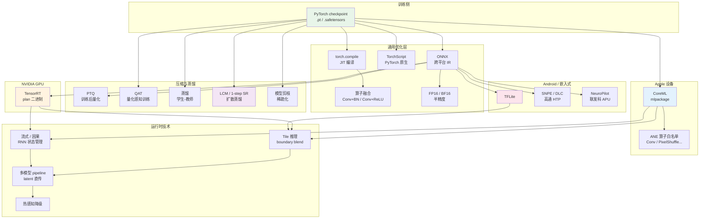
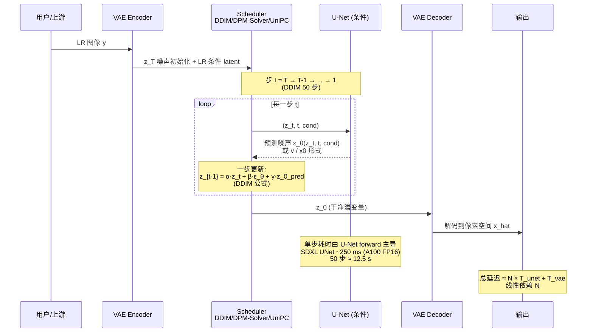
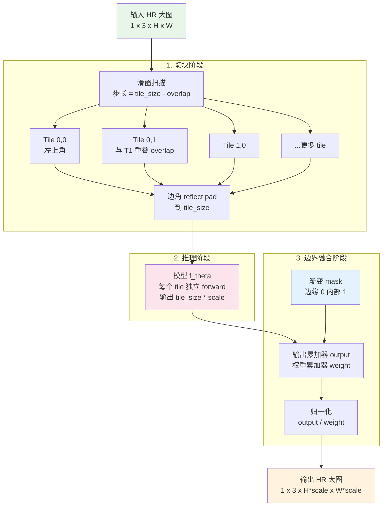

# 第 15 章 · 推理优化

> 训练完一个好模型只是开始。
>
> 把它推到生产环境 - 服务器、桌面 GPU、移动端、嵌入式 - 是另一个完整的工程领域。
>
> 这一章讲量化、TensorRT、CoreML、torch.compile、tile 推理、流式处理。

## 15.0 本章铺垫与术语注

前面 14 章把训练侧讲完了：从退化模型出发，沿着表征空间、损失函数、评估指标、数据合成、判别式与生成式架构、训练调度、视频时序、可控生成一路走下来，所有内容都假设训练机器上有充足显存、可以慢慢迭代、可以打断重跑。这一章开始切换视角。**生产环境不长这样**。线上服务的硬约束是延迟、吞吐量、显存上限、功耗、温升、码率适配、与上下游编码器的对齐；学术评测里 PSNR 高 0.3 dB 在线上几乎看不见区别，但 p99 延迟高出预算 20 ms，整个产品立刻不可用。

更难的一点是：训练侧的好模型未必能进生产。一个 SwinIR-Large 在 A100 训练时 batch=8 跑得很愉快，导到端侧之后发现 PixelShuffle 算子在 iOS 16 上 fallback 到 CPU、attention 算子在高通 NPU 上不支持、INT8 量化后出现棋盘格伪影、连续推理 30 分钟后手机过热降频、视频会议场景里没有未来帧只能跑因果模式、增强后的图被 H.264 再压一次细节全被吃掉。这些问题在论文里几乎不存在，但每一个都能让"产品上线"卡住。

所以本章不是一份"调用 TensorRT 的教程"，它是一份**把训练好的低层视觉模型从 PyTorch 推到真实终端**的工程清单。结构上从通用优化（导出、编译、半精度、量化）展开，然后按部署目标拆：NVIDIA GPU 上的 TensorRT、Apple 设备上的 CoreML 与 ANE、Android 与嵌入式上的 TFLite 与厂商 SDK；接着讲三类跨平台的关键技术：模型蒸馏（含扩散派的 1 步 SR）、tile 推理处理大图、流式与实时视频；最后回到 pipeline 编排、监控与 cost 估算。

读这一章的时候保持一个简单的对照：**学术指标关心"模型输出与真值的距离"，生产指标关心"产品能不能交付"**。两者并不冲突，但优化路径完全不同。本章每一节都在帮你把后一种关心翻译成可以执行的代码与流程。

### 缩写与首次出现的术语

为了避免术语堆砌，第一次出现的缩写在这里集中给出全称与一句话定义。后文再次使用时不再展开。

- **TensorRT**：NVIDIA 的推理引擎，把 ONNX / PyTorch 模型编译为针对特定 GPU 优化的二进制 plan 文件。
- **ONNX**（Open Neural Network Exchange，开放神经网络交换格式）：跨框架的模型中间表示，绝大多数推理引擎都从 ONNX 读入。
- **CUDA**（Compute Unified Device Architecture）：NVIDIA GPU 的通用并行计算平台与编程模型。
- **cuDNN**（CUDA Deep Neural Network library）：NVIDIA 提供的 GPU 深度学习算子库，TensorRT 与 PyTorch 都依赖它。
- **FP32 / FP16 / BF16**：32 位 / 16 位浮点。BF16（Brain Float 16）由 Google 提出，指数位与 FP32 相同、尾数位更少，数值范围大但精度低，在 A100 与之后的 NVIDIA GPU 上原生支持。
- **INT8 / INT4**：8 位 / 4 位整数。量化用的低比特表示，能换取速度与显存优势，代价是精度损失。
- **PTQ**（Post-Training Quantization，训练后量化）：训练完成后基于校准数据估计 scale 与 zero point 直接量化。
- **QAT**（Quantization-Aware Training，量化感知训练）：在训练 loop 里插入"伪量化"算子，让模型适应量化误差。
- **TorchScript**：PyTorch 的脚本化中间表示，可以脱离 Python 解释器在 C++ 运行时执行。
- **torch.compile**：PyTorch 2.0 引入的 JIT 编译入口，背后调度 TorchDynamo / TorchInductor 把模型图编译成融合后的 kernel。
- **CoreML**：Apple 的设备端推理框架，能调度到 CPU / GPU / ANE 三种计算单元。
- **ANE**（Apple Neural Engine）：Apple 芯片里专门跑神经网络的低功耗加速器，A 系列与 M 系列芯片都集成。
- **NPU**（Neural Processing Unit，神经网络处理器）：移动端与嵌入式上的专用神经网络加速器统称，例如高通 HTP、华为 NPU、联发科 APU、Apple ANE 都属于这一类。
- **HTP**（Hexagon Tensor Processor）：高通 Snapdragon 芯片里的 NPU 实现，跑 INT8 极快。
- **SNPE**（Snapdragon Neural Processing Engine）：高通提供的 NPU SDK，把 ONNX 转成 DLC 格式后下放到 HTP / GPU / CPU。
- **DLC**（Deep Learning Container）：SNPE 的模型容器格式。
- **NeuroPilot**：联发科为天玑芯片 APU 提供的 NPU SDK。
- **TFLite**（TensorFlow Lite）：Google 的移动端 / 嵌入式推理框架，Android 端事实标准。
- **NNAPI**（Neural Networks API）：Android 8+ 提供的系统层 NPU 抽象，TFLite 可以走 NNAPI 路由到设备 NPU。
- **OpenVINO**：Intel 为自家 CPU / 集成 GPU / VPU 优化的推理工具链。
- **DirectML**：Windows 上的硬件抽象推理 API，统一覆盖 NVIDIA / AMD / Intel GPU。
- **VAE**（Variational Auto-Encoder，变分自编码器）：第 7 章详谈。这里反复出现因为扩散派的潜空间编解码都过 VAE，且 VAE 在低比特下极易溢出。
- **KV cache**（Key-Value cache）：Transformer 自回归推理时把已计算过的 attention key / value 缓存下来避免重复计算的技术。低层视觉里出现在视频 Transformer 与扩散 Transformer 的因果推理路径上。
- **Flash Attention**：把 attention 的 softmax(QK^T)V 拆成分块计算并融合到单个 CUDA kernel 的实现，省显存且更快。
- **Tiling**：把大图切成小块分别推理再拼回。本章 15.9 节专门讲。
- **SwinIR-Tile**：SwinIR 官方提供的 tile 推理实现，是社区参考实现之一。
- **Boundary blending**（边界融合）：tile 拼回时在重叠区做渐变加权，避免接缝可见。
- **DDIM**（Denoising Diffusion Implicit Models）：扩散模型的确定性采样器，可以用远少于训练步数的步数采样。
- **DDIM steps**：DDIM 推理时的采样步数，常见 20-50 步。
- **DPM-Solver / DPM-Solver++**：扩散 ODE 的高阶数值求解器，10-20 步就能达到 DDIM 50 步的质量。
- **UniPC**（Unified Predictor-Corrector）：扩散采样器之一，预测-修正结构，8-15 步可用。
- **LCM**（Latent Consistency Model，潜空间一致性模型）：把扩散模型蒸馏成 4-8 步可采样的学生模型。
- **LoRA**（Low-Rank Adaptation，低秩适配器）：在预训练大模型权重上加一个低秩增量，训练参数量极小。
- **OSEDiff / TSD-SR / AdcSR / SinSR**：四个走"1 步扩散 SR"路线的工作，详见第 18 章。
- **GOP**（Group of Pictures，图像组）：视频编码里以一个 I 帧（关键帧）开头、后续 P/B 帧依赖前后帧的一组帧。
- **I / P / B 帧**：视频帧类型。I 帧独立解码，P 帧依赖前面，B 帧依赖前后双向。
- **NAL**（Network Abstraction Layer，网络抽象层）单元：H.264 / H.265 把编码数据切成的传输单元。
- **A/V 同步**（Audio/Video sync）：音视频时序对齐。人耳对 lipsync 误差敏感阈值约 ±40 ms。
- **p50 / p90 / p99 延迟**：延迟分布的中位数 / 90 分位 / 99 分位。
- **OOM**（Out Of Memory）：显存耗尽。
- **QPS**（Queries Per Second，每秒查询数）：吞吐量度量。
- **GAN**（Generative Adversarial Network，生成对抗网络）：本章涉及到 ESRGAN / Real-ESRGAN 时反复出现。
- **RRDB**（Residual-in-Residual Dense Block）：ESRGAN / Real-ESRGAN 的主干模块。

后续小节首次出现新缩写仍然给出全称，但常用术语就不重复了。

### 本章主线

整章可以视作一张从训练产物到生产终端的"扩散图"：PyTorch 权重在中心，外圈是各种部署目标，每一条边都标了一组优化技术。下面这张全景图先给一个鸟瞰，后面每一节都在填某一条边的细节。



这张图回答的问题是"我手里这个 PyTorch checkpoint，要进哪个生产场景，应该走哪条边？"。例如：服务器侧 4K 直播增强 → ONNX → TensorRT FP16 + Tile + 多模型 pipeline；iPhone 端实时滤镜 → CoreML + ANE 算子白名单 + per-channel INT8 + 因果流式；扩散派 SR 上线 → LCM 或 1-step SR 蒸馏 + TensorRT FP16 + Tile。后面每一节都在解释这些路径上的具体决策。

## 15.1 推理优化的部署目标

不同平台对模型的要求差异巨大：

| 平台 | 延迟要求 | 显存预算 | 模型大小预算 | 优先级 |
|------|---------|---------|-----------|-------|
| **A100 服务器** | < 1 秒/张 | 80 GB | 几 GB | 吞吐量 |
| **消费 GPU**（4090） | < 100 ms/张 | 24 GB | 几 GB | 用户体验 |
| **桌面 CPU** | < 5 秒/张 | 16 GB | < 500 MB | 兼容性 |
| **手机 NPU** | < 30 ms/帧 | < 1 GB | < 50 MB | 实时性 + 功耗 |
| **嵌入式（IoT）** | < 100 ms/张 | < 100 MB | < 10 MB | 严格预算 |

每个平台有自己的优化栈。这一章按平台分别讲。

## 15.2 通用优化（所有平台都要）

### 15.2.1 模型导出格式

PyTorch 训练模型要导出到推理格式：

```
PyTorch model (.pt)
  ├── ONNX (.onnx)              ← 跨平台中间格式
  │   ├── TensorRT (.plan)      ← NVIDIA GPU
  │   ├── OpenVINO              ← Intel CPU/GPU
  │   ├── DirectML              ← Windows 通用
  │   └── ONNX Runtime          ← 通用 CPU/GPU
  ├── TorchScript (.pt)         ← PyTorch 原生
  ├── CoreML (.mlpackage)       ← Apple 设备
  ├── TFLite (.tflite)          ← Android / 嵌入式
  └── 自定义 (Custom)            ← 厂商 SDK
```

**ONNX 是事实标准的中间格式**：大多数推理引擎都接受 ONNX。

```python
# 导出 PyTorch 模型到 ONNX
import torch

model.eval()
dummy_input = torch.randn(1, 3, 256, 256)

torch.onnx.export(
    model,
    dummy_input,
    "model.onnx",
    input_names=['input'],
    output_names=['output'],
    dynamic_axes={
        'input':  {0: 'batch', 2: 'height', 3: 'width'},  # 动态尺寸
        'output': {0: 'batch', 2: 'height', 3: 'width'},
    },
    opset_version=17,
)
```

### 15.2.2 算子融合

把多个连续算子合并成一个，减少 kernel 启动开销和内存访问：

- `Conv + BatchNorm` → `Conv'`（合并 BN 到 conv 权重）
- `Conv + ReLU` → `Conv-ReLU` fused op
- `LayerNorm + Linear` → fused op

PyTorch 2.0+ 的 `torch.compile` 自动做这些。

### 15.2.3 torch.compile

PyTorch 2.0 引入的 JIT 编译，能把模型自动优化：

```python
import torch

model = build_model().eval().cuda()
model = torch.compile(model, mode="reduce-overhead")  # 或 "max-autotune"

# 第一次推理会慢 (编译)
with torch.no_grad():
    _ = model(warmup_input)  # 触发编译

# 之后快
output = model(real_input)
```

`mode` 选择：

- `"default"`：稳妥，提速 1.5-2×
- `"reduce-overhead"`：减少 Python 开销，适合小 batch
- `"max-autotune"`：最大优化，编译慢但运行最快

实测影响：

- Real-ESRGAN 在 4090 上原生 PyTorch 跑 200ms/256×256，`torch.compile` 后 90ms

工程注意：

- 输入形状变化时会**重新编译**，造成第一次运行卡顿
- 用 `dynamic=True` 让编译器准备好动态形状
- 兼容性问题：某些自定义算子不支持

### 15.2.4 FP16 / BF16 推理

训练用 FP32 / BF16，推理可以用 FP16 / BF16 减一半显存 + 加速 1.5-2×：

```python
model = build_model().eval().cuda().half()  # FP16
output = model(input.half())
```

注意事项：

- VAE encoder/decoder 在 FP16 下可能溢出，**保留 FP32**
- 某些算子（softmax、归一化）在 FP16 下精度损失大，自动 cast 到 FP32
- BF16 数值范围大但精度低，**A100+ 推荐 BF16**

### 15.2.5 量化（INT8 / INT4）

量化的核心是把高精度浮点张量映射到低比特整数，再在推理时把整数解回近似的浮点值。最常用的对称线性量化公式是：

$$
q = \text{round}\left(\frac{x}{s}\right), \qquad \hat{x} = q \cdot s
$$

其中 $s$ 是 scale，$q$ 是量化后的整数（INT8 时 $q \in [-128, 127]$）。非对称量化再加一个 zero point $z$：

$$
q = \text{round}\left(\frac{x}{s}\right) + z, \qquad \hat{x} = (q - z) \cdot s
$$

scale $s$ 怎么选决定了量化误差。最朴素的做法是取张量绝对值最大值再除以 127，但这种 max-scale 对离群值极度敏感 - 一个极端激活就能把整体精度拉到只有 7 位有效。生产里常用的两种改进：

1. **percentile**：取 99.99% 分位的绝对值做 max，丢掉极端离群值。
2. **MSE 最小**：在校准集上搜索使 $\|\hat{x} - x\|_2^2$ 最小的 scale。

把权重和激活从 FP16 降到 INT8 甚至 INT4 有两种路线：

- **PTQ**（Post-Training Quantization，训练后量化）：训练完后用校准数据集（几百张代表性图）估计 scale 与 zero point，直接量化。流程简单，精度损失大小取决于模型对量化误差的鲁棒性。
- **QAT**（Quantization-Aware Training，量化感知训练）：训练时在前向里插入"伪量化"算子（quantize-dequantize 对），让梯度看到量化引入的误差，模型在训练阶段就学会容忍。精度损失小但需要重新训练，工程成本高。

INT8 量化的潜在收益：

- 模型大小：4×（FP32→INT8）或 2×（FP16→INT8）
- 速度：在支持 INT8 的硬件上 2-4×
- 显存：相应减少

低层视觉的特殊困难：**输出像素精度对量化误差敏感**。INT8 量化可能让 PSNR 跌 0.5-2 dB，视觉上能看出"格点状"伪影。

实践经验：

- **大模型**（Restormer/HAT/扩散 UNet）：INT8 后效果还行
- **小模型**（NAFNet 小版本、ESRGAN-Lite）：INT8 后明显下降，建议 FP16 即可
- **VAE**：永远不要 INT8，会崩

```python
# 简化的 PyTorch INT8 PTQ
import torch.ao.quantization as quant

model = build_model().eval()

# 1. 准备校准数据
calibration_data = [load_calibration_batch(i) for i in range(100)]

# 2. 配置量化方案
qconfig = quant.get_default_qconfig('fbgemm')  # CPU
# 或 qconfig = quant.get_default_qconfig('x86') for newer x86

model.qconfig = qconfig
model_prepared = quant.prepare(model)

# 3. 跑校准 (用代表性数据)
with torch.no_grad():
    for batch in calibration_data:
        model_prepared(batch)

# 4. 转换成 INT8 模型
model_int8 = quant.convert(model_prepared)
```

时效上要补一句：上面这套 `torch.ao.quantization` 是 eager 模式的老接口，目前仍能用，但 PyTorch 2.x 起官方推荐的路径已经换成 PT2E（PyTorch 2 Export Quantization），它先用 `torch.export` 抓取模型图、再在图上插入量化算子，对带控制流和自定义模块的模型更稳。新项目建议直接从 PT2E 起步。

GPU 上 INT8 量化更复杂，通常通过 TensorRT 或 ONNX Runtime 做。

## 15.3 NVIDIA GPU 部署：TensorRT

### TensorRT 是 NVIDIA 的推理引擎

它做的事：

- 接受 ONNX 或 TF/PyTorch 模型
- 算子融合 + 内核选择 + 量化
- 输出**针对特定 GPU 优化**的二进制（`.plan` 文件）
- 提供 C++/Python API 推理

为什么 TensorRT 比直接 PyTorch / ONNX Runtime 快？三件事：

1. **算子融合更激进**。把 Conv + BN + ReLU + Add 这种连续算子融合成一个 CUDA kernel，省掉中间张量的显存来回和 kernel 启动开销。PyTorch eager 模式做不到，torch.compile 做一部分但保守。
2. **kernel 自动调优**。同一个 conv 在 NVIDIA 提供的几十个实现里（不同 tile size、不同 layout、不同 tensor core 路径），TensorRT 在你给的输入 shape 上跑 benchmark 选最快的。这个调优结果绑在 plan 文件里，所以 plan 不能跨 GPU 复用 - 在 A100 上 build 的 plan 不能扔到 4090 上跑。
3. **低精度路径与 tensor core**。FP16 / BF16 / INT8 路径下 TensorRT 直接用 Ampere 及之后的 tensor core，FP8 则要到 Hopper / Ada 这一代才有硬件支持（A100 属 Ampere，并不支持 FP8）；理论吞吐相比 CUDA core 高 4-8×。PyTorch eager 也用 cuDNN 走 tensor core，但 TensorRT 在更广的算子范围内能用到。

代价是构建慢。一个 SDXL UNet 在 A100 上构建 FP16 plan 大约 5-15 分钟（看是否开 `BUILDER_OPTIMIZATION_LEVEL` 高档），INT8 加校准更慢，可达 30+ 分钟。所以 plan 应当作为 CI 产物缓存，不是每次启动现 build。

### 工作流

```python
import tensorrt as trt

# 1. 从 ONNX 构建 TensorRT 引擎
def build_engine(onnx_path: str, engine_path: str,
                 fp16: bool = True, int8: bool = False):
    logger = trt.Logger(trt.Logger.WARNING)
    builder = trt.Builder(logger)
    network = builder.create_network(
        1 << int(trt.NetworkDefinitionCreationFlag.EXPLICIT_BATCH)
    )
    parser = trt.OnnxParser(network, logger)

    with open(onnx_path, 'rb') as f:
        if not parser.parse(f.read()):
            for error in range(parser.num_errors):
                print(parser.get_error(error))
            return None

    config = builder.create_builder_config()
    config.set_memory_pool_limit(trt.MemoryPoolType.WORKSPACE, 4 << 30)  # 4 GB

    if fp16:
        config.set_flag(trt.BuilderFlag.FP16)
    if int8:
        config.set_flag(trt.BuilderFlag.INT8)
        config.int8_calibrator = MyCalibrator(...)  # 需要校准数据

    # 动态形状支持
    profile = builder.create_optimization_profile()
    profile.set_shape("input",
                     min=(1, 3, 64, 64),
                     opt=(1, 3, 256, 256),
                     max=(1, 3, 1024, 1024))
    config.add_optimization_profile(profile)

    engine = builder.build_serialized_network(network, config)
    with open(engine_path, 'wb') as f:
        f.write(engine)
```

### TensorRT 推理

```python
import tensorrt as trt
import pycuda.driver as cuda
import numpy as np

class TRTInferencer:
    def __init__(self, engine_path: str):
        logger = trt.Logger(trt.Logger.WARNING)
        runtime = trt.Runtime(logger)
        with open(engine_path, 'rb') as f:
            self.engine = runtime.deserialize_cuda_engine(f.read())
        self.context = self.engine.create_execution_context()

    def infer(self, input_array: np.ndarray) -> np.ndarray:
        # 1. 设置动态输入 shape, 然后查询输出实际 shape
        # 注意: SR 模型的输出 shape != 输入 shape (放大了 scale 倍)
        self.context.set_input_shape("input", input_array.shape)
        out_shape = tuple(self.context.get_tensor_shape("output"))

        # 2. 按真实 shape 分配显存
        in_size  = int(np.prod(input_array.shape) * np.dtype(np.float32).itemsize)
        out_size = int(np.prod(out_shape) * np.dtype(np.float32).itemsize)
        d_input  = cuda.mem_alloc(in_size)
        d_output = cuda.mem_alloc(out_size)
        cuda.memcpy_htod(d_input, input_array.astype(np.float32))

        # 3. TensorRT 10+ 推荐用 name-based API
        self.context.set_tensor_address("input",  int(d_input))
        self.context.set_tensor_address("output", int(d_output))
        stream = cuda.Stream()
        self.context.execute_async_v3(stream.handle)
        stream.synchronize()

        # 4. 拷贝回 CPU
        output = np.empty(out_shape, dtype=np.float32)
        cuda.memcpy_dtoh(output, d_output)
        return output
```

### TensorRT 加速效果

| 模型 | 原 PyTorch | TensorRT FP16 | TensorRT INT8 |
|------|-----------|--------------|--------------|
| Real-ESRGAN (RRDB) | 100% | 35% | 18% |
| SwinIR | 100% | 40% | — |
| BasicVSR++ | 100% | 50% | — |
| SDXL UNet | 100% | 45% | — |

**TensorRT FP16 通常能加速 2-3×**，INT8 再加速 2× 但精度风险大。

## 15.4 Apple 设备部署：CoreML

### CoreML 是什么

Apple 的推理框架，能跑在：

- **CPU**（兼容所有设备）
- **GPU**（M 系列芯片、iPhone GPU）
- **Apple Neural Engine (ANE)**（M 系列 Mac + A 系列 iPhone/iPad，超低功耗）

### 工作流

```python
import coremltools as ct
import torch

# 1. 把 PyTorch 模型 trace 出来
model.eval()
dummy_input = torch.randn(1, 3, 256, 256)
traced = torch.jit.trace(model, dummy_input)

# 2. 转 CoreML
mlmodel = ct.convert(
    traced,
    inputs=[ct.ImageType(name="input",
                         shape=(1, 3, 256, 256),
                         scale=1/255.0,
                         color_layout=ct.colorlayout.RGB)],
    outputs=[ct.TensorType(name="output")],
    compute_precision=ct.precision.FLOAT16,    # iPhone 默认 FP16
    compute_units=ct.ComputeUnit.ALL,          # CPU + GPU + ANE
    minimum_deployment_target=ct.target.iOS17,
)
mlmodel.save("model.mlpackage")
```

### Apple Neural Engine 的特殊性

- 极低功耗（10× CPU）
- 但**只支持有限算子**（Conv、ReLU、PixelShuffle 等基础算子）
- 自定义层、不规则形状会 fallback 到 CPU/GPU

工程后果：**为 ANE 设计模型必须用受限算子集**：

- **支持**：Conv2d（3×3、5×5）
- **支持**：ReLU / LeakyReLU / GELU
- **支持**：BatchNorm
- **部分支持**：PixelShuffle（iOS 17+ 部分支持，且有尺寸限制；iOS 16 会 fallback，详见 15.5.2）
- **部分支持**：动态形状（支持但受限，固定输入尺寸最稳）
- **部分支持**：复杂 attention（原生支持有限，通常要拆成基础算子或做近似）
- **不支持**：自定义算子 / 自定义层（Apple ANE 不运行 CUDA，任何不在白名单内的自定义层都会 fallback 到 CPU/GPU）

实测：

- Real-ESRGAN 在 iPhone 14 ANE 上 720P 输入 ~80ms
- 一个更重的 Transformer 类 SR 模型（示意）同设备 ~150ms

### CoreML 的 4-bit 量化

iOS 17+ 支持 4-bit 权重量化，模型大小再减一半：

```python
import coremltools.optimize.coreml as cto

config = cto.OptimizationConfig(
    global_config=cto.OpPalettizerConfig(
        nbits=4,
        granularity="per_grouped_channel",
        group_size=16,
    ),
)
mlmodel_quantized = cto.palettize_weights(mlmodel, config)
```

实测：模型大小 50MB → 12MB，质量损失 <0.3 dB。

## 15.5 NPU 实战：从"能跑"到"真快"

15.4 节给了 ANE 的算子白名单，但**实战里 90% 的延迟问题不是算子不支持，而是部分算子被 fallback 后的延迟悬崖、量化粒度选错、tensor layout 引起的隐式 reshape**。这一节讲端侧 NPU 部署最高频的几个真实坑。

### 15.5.1 Per-channel vs per-tensor 量化：低层视觉只能选 per-channel

INT8 量化把 FP32/FP16 的 tensor 映射到 INT8。映射的"分辨率"（scale）有两种粒度：

- **Per-tensor**：整个 weight tensor 共用一个 (scale, zero_point)。简单、移动端老 NPU（高通 HTP、华为 NPU 早期 SDK）默认支持。
- **Per-channel**：每个 output channel 一个 scale，weight 量化精度大幅提升。激活通常仍 per-tensor（per-channel 激活的硬件支持很差）。

**为什么低层视觉必须 per-channel weight：**

底层视觉的 conv weight 不同 output channel 之间幅度差异**比分类任务大得多**：一些通道学纹理（小幅度），一些学结构（大幅度）。per-tensor 用同一个 scale 时，小幅度通道被量化到几个 INT8 分级，精度严重损失，**视觉上表现为格点/色斑伪影**。

实测对比（Real-ESRGAN，DIV2K val）：

| 量化方案 | PSNR (dB) | 视觉伪影 |
|---------|-----------|---------|
| FP16 | 28.45 | 无 |
| Per-channel weight INT8 + per-tensor act INT8 | 28.30 (-0.15) | 几乎不可见 |
| Per-tensor weight INT8 + per-tensor act INT8 | 27.10 (-1.35) | 明显格点 / 色斑 |

工程结论：**端侧 INT8 量化必须用 per-channel weight quant**。如果某个芯片 SDK 只支持 per-tensor weight quant，要么换 FP16，要么换芯片。

```python
# CoreML 的 per-channel 量化（iOS 16+）
import coremltools.optimize.coreml as cto

cto.linear_quantize_weights(
    mlmodel,
    config=cto.OptimizationConfig(
        cto.OpLinearQuantizerConfig(
            mode="linear_symmetric",
            granularity="per_channel",     # 关键
            weight_threshold=2048,
        )
    ),
)
```

### 15.5.2 ANE fallback 到 CPU 的延迟悬崖

ANE 算子典型耗时是 **几百 μs**（亚毫秒级）。一旦遇到不支持算子，CoreML 会把那一段子图 fallback 到 GPU 或 CPU，**单算子延迟跳到 ms 级**，出现 10× 甚至 100× 的跳变。

更糟的是 fallback 不是单算子的事：**ANE 与 CPU/GPU 之间的 tensor 切换本身有数 ms 开销**（数据要在不同 memory pool 之间拷贝）。一个 30 层网络如果有 3 个 fallback 算子，可能产生 6 次 ANE↔CPU 切换，每次切换几 ms，总延迟从 30ms 跳到 100ms+。

**必须做的事**：

1. **导出后立即 dump compute_unit 分配**：

```python
import coremltools as ct

mlmodel = ct.models.MLModel("model.mlpackage")
spec = mlmodel.get_spec()

# 跑一次推理后从 Xcode Instruments 的 Core ML 模板看每个算子分配到哪个 compute unit
# 或者用 ct.models.utils.evaluate_classifier / generic 工具
```

具体做法是用 Xcode Instruments → Core ML 模板 profile 一次推理，每个算子标 ANE / GPU / CPU 三色之一。**目标：网络主体 100% ANE，零切换**。

2. **强制 ANE-only 检验**：

```python
# 限制只用 ANE, 看有没有算子直接报错
mlmodel = ct.convert(traced, ..., compute_units=ct.ComputeUnit.CPU_AND_NE)
# 实际部署再切回 ALL
```

3. **PixelShuffle 是 SR 的高频陷阱**：iOS 16 ANE 不支持 PixelShuffle，会 fallback。iOS 17+ 部分支持但有尺寸限制（输入通道必须 ≤ 256）。如果是 iOS 16 兼容性需求，**用 transposed conv 或 nearest+conv 代替 PixelShuffle**。

4. **LayerNorm 在 ANE 上动态形状可能 fallback**：固定 spatial size 的 LayerNorm 一般没问题，输入尺寸动态时有可能 fallback。这里要给个限定：Apple 官方的 ANE-optimized Transformer 恰恰用的是经过优化的 LayerNorm，所以"LayerNorm 不友好"并不是绝对结论，是否成立取决于具体实现和形状是否固定。如果 SR 模型对外承诺动态分辨率、且实测到 LayerNorm 触发 fallback，可以试着换成对形状不敏感的 GroupNorm，但要以 profile 结果为准，不要默认 GroupNorm 一定更快。

### 15.5.3 Reshape / Permute 的隐式 layout 转换

ANE 内部有偏好的 tensor layout（NCHW vs 内部专用），某些 reshape/permute 会触发**整个 tensor 的内存重排**，单算子延迟从 μs 级跳到 ms 级。常见触发：

- `tensor.permute(0, 2, 3, 1)` 把 NCHW 转 NHWC（Style transfer 等任务常见）
- `tensor.view(B, -1, H, W)` 当 channel 不是 8/16 倍数时
- 大 spatial size（4K+）的 transpose

工程实践：

- **训练时就用 ANE 友好的 channel 数**（4/8/16/32 倍数）
- **避免 4K 输入的 permute**：必须做时拆 tile 再 permute
- **用 `coremltools.compression.experimental.ane_optimize`**（iOS 18+）让转换器自动重排算子顺序减少 layout 切换

### 15.5.4 高通 SNPE / 联发科 NeuroPilot 的现实

Android 端 NPU 的兼容性**比 ANE 更碎**：同一个 ONNX 模型在不同芯片上表现差几个量级。

**高通 SNPE（Snapdragon NPU）**：

- HTP backend（Hexagon Tensor Processor）跑 INT8 极快（旗舰 SoC 比 GPU 快 5×）
- **算子白名单比 ANE 还窄**：SNPE 2.x 仍不直接支持 GroupNorm（要拆成 reshape + LN）、PixelShuffle、复杂 attention（另外要留意，SNPE 这套工具链后来已并入 Qualcomm AI Engine Direct，即 QNN，新项目多数直接用 QNN）
- INT8 量化对 SDK 版本敏感：SNPE 1.x 时代的 PTQ 流程在 2.x 重写过，老脚本不兼容
- **必跑工具**：`snpe-onnx-to-dlc` 转换后用 `--debug 3` 看每个 layer 的 backend 分配，类似 ANE dump

**联发科 NeuroPilot（天玑 APU）**：

- APU 性能在天玑 9400 / 9500 这代旗舰上接近骁龙 8 Elite 的 HTP，中端芯片差距大
- **算子兼容性比 SNPE 更碎**：同一个模型在天玑 8000 系列和 9000 系列行为不同
- 转换工具 `neuropilot-converter`，量化校准数据要 200+ 张代表性图

**工程结论**：Android 端发版前**必须在 3-4 个代表 SoC 上 profile**（以某代旗舰为例，骁龙 8 Elite / 天玑 9400 / Exynos 2500，再加一款中端机型如骁龙 7s Gen 3），不能只跑旗舰。

### 15.5.5 端侧部署的 profile 流程

把上面所有点串起来的工程流程：

```
1. 训练时就考虑 NPU 友好（按 profile 结果决定是否用 GroupNorm 替 LayerNorm、给 PixelShuffle 备好替代品、channel 数取 8/16 倍数）
   ↓
2. 导出 ONNX，转 CoreML / TFLite / DLC
   ↓
3. 用各自工具 dump 算子 → backend 分配
   ↓
4. 修复 fallback：要么改模型，要么换算子实现
   ↓
5. 量化（per-channel weight）
   ↓
6. 校准数据 200+ 张代表图（不要只用 DIV2K，加上业务数据）
   ↓
7. 在目标 SoC 上 profile：延迟 p50/p90/p99、功耗、温升
   ↓
8. 失败案例集回归测试
```

不做这个流程，"端侧实时增强"基本只是 demo，上线必崩。

## 15.6 Android / 嵌入式：TFLite + NNAPI

Android 设备的事实标准是 TFLite（TensorFlow Lite，2024 年 9 月起官方更名为 LiteRT，接口基本兼容）。

早期常见的 `ONNX → onnx-tf → .pb → TFLite` 路径到 2024-2026 已不推荐：`onnx-tf`（onnx-tensorflow）基本停止维护，中间的 `.pb` 转换在稍复杂的模型上很脆弱。现在有两条更稳的路，一条是 Google 官方的 **ai-edge-torch**，把 PyTorch 模型直接转成 TFLite / LiteRT，不再绕 ONNX 和 TensorFlow；另一条是社区的 **onnx2tf**，从 ONNX 直转、对算子布局的处理更好。

```python
# 推荐路径 A: PyTorch 直转 LiteRT (Google 官方 ai-edge-torch)
import ai_edge_torch
import torch

model = build_model().eval()
sample = (torch.randn(1, 3, 256, 256),)
edge_model = ai_edge_torch.convert(model, sample)
edge_model.export("model.tflite")     # 产物即 TFLite / LiteRT

# 推荐路径 B: 已有 ONNX 时用 onnx2tf 直转, 避开 onnx-tf 的 .pb 中转
#   $ pip install onnx2tf
#   $ onnx2tf -i model.onnx -o saved_model   # 输出含 fp32/fp16/int8 多个 .tflite
```

量化与半精度仍在转换器里配置（float16 或 INT8），逻辑和早期 TensorFlow 转换器一致，只是入口换成了 ai-edge-torch / onnx2tf。

NNAPI（Android 8+）能把 TFLite 模型路由到设备 NPU，但兼容性差异大（不同芯片厂商支持的算子集不同）。

实践：**Android 端常用厂商专用 SDK**：高通的 SNPE、联发科的 NeuroPilot、华为的 HiAI。

## 15.7 模型蒸馏与剪枝：极致轻量

### 15.7.0 三类"让模型变小"的技术

本节讲蒸馏，但要先把它放在更大的"模型压缩"语境里。让一个训好的模型变小有三条常见路径，工程上经常混用：

1. **量化**（15.2.5 节）：把 FP32/FP16 权重 / 激活降到 INT8 / INT4，模型大小线性减小，速度看硬件。不改变模型结构。
2. **剪枝**（pruning）：去掉对输出贡献小的权重 / 通道 / 层。结构剪枝（structured pruning，按通道 / 头剪）能直接减少 FLOPs 与显存；非结构剪枝（unstructured，按单个权重剪）压缩率高但要专门硬件支持稀疏算子才有速度收益。低层视觉里**通道剪枝**最常用 - 训练时给每个 conv 通道加 L1 正则 → 训完按通道幅度排序 → 剪掉幅度最小的 k% → 在剩余通道上微调几个 epoch。把一个重型 SR 压到端侧可跑的 compact 版本，常见路径之一就是通道剪枝 + 蒸馏组合。
3. **蒸馏**（distillation）：训一个全新的小学生模型从头模仿大教师的输出 / 中间特征。学生结构可以与教师完全不同（这是和剪枝最大的区别），所以能换 backbone、换算子、换层数。

三者可以叠加：蒸馏出小学生 → 通道剪枝 → INT8 量化 → 进端侧。每一步独立看损失都可控（蒸馏掉 ~5% 质量、剪枝掉 ~2%、量化掉 ~3%），叠加后整体掉 ~10% 但模型大小可能从 60MB 压到 3MB，速度提升 10×+。这是端侧实时增强能成立的根本原因。

预训练模型太大？训一个**学生模型**（小模型）模仿教师模型（大模型）的输出。

### 蒸馏的训练目标

```python
def distillation_loss(student_out, teacher_out, hr_target):
    """蒸馏损失 = 模仿教师 + 还学真值。"""
    # 模仿教师输出
    distill = F.l1_loss(student_out, teacher_out.detach())
    # 也看真值, 防止学生只学教师的错误
    gt = F.l1_loss(student_out, hr_target)
    return 0.7 * distill + 0.3 * gt
```

### 适合低层视觉的蒸馏

- **特征蒸馏**：让学生中间层特征模仿教师中间层
- **关系蒸馏**：让学生输出的内部关系（GRAM 矩阵等）匹配教师

### 蒸馏的工程效果

- 学生模型 1/4 大小，效果接近教师 95%
- 推理速度 3-5×
- 是端侧部署的关键技术

代表项目：

- **SRVGGNetCompact（realesr-general-x4v3）**：Real-ESRGAN 官方的轻量版本，用几层普通卷积替代 RRDB，参数量百万级，是端侧与实时场景常用的 compact SR 网络
- **重型 backbone 蒸馏到纯 CNN**：把 SwinIR / RRDB 这类重模型当教师，蒸馏出 SRVGGNetCompact 式的纯卷积学生（各家常给学生起"某某-Lite"之类的内部名，但并无统一的公开实现）

## 15.8 LCM / Turbo 蒸馏（扩散通用）

扩散模型 50 步推理太慢。**Latent Consistency Models (LCM)** 把它蒸馏到 4-8 步。

### 为什么 50 步是个问题：先把推理时序看清楚

理解蒸馏前要先看清原始的多步扩散推理是怎么用掉时间的。下面这张时序图画的是一次条件扩散 SR 的标准 DDIM 推理（N = 50 步）：每一步都要 VAE 解码外推 + U-Net forward + 调度器更新潜变量。每一步的 U-Net forward 几乎相同的耗时，所以总时间近似与步数成正比。



把这张时序图记牢之后，再看后面的优化路径：

- **DDIM → DPM-Solver++ / UniPC**：相同质量下 50 步降到 15-20 步。算法换名，单步耗时不变，靠采样器把"少几步也能收敛"做出来。
- **LCM / Turbo 蒸馏**：进一步把步数压到 4-8 步。本质是教学生网络"从任意 t 一步直接预测 x_0"。
- **OSEDiff / TSD-SR 等 1 步扩散 SR**：把整张时序图压缩到只剩一次 U-Net forward + 一次 VAE 解码，单步 ~0.3-0.8 秒。
- **正交优化**：U-Net 内部 Flash Attention 把 attention kernel 融合、TensorRT 编译把 conv/attn 算子融合到底层 kernel、FP16/BF16 把单 forward 耗时再砍一半。这些与"减步数"是叠加生效的。

这就是为什么本章把"蒸馏减步数"和"通用 TensorRT/编译/半精度"分两条线讲：它们解决的是不同维度的瓶颈，可以同时上。

### 扩散采样器选择：DDIM / DPM-Solver / UniPC 的速度-质量取舍

蒸馏不是唯一加速路线。在不重新训学生网络的前提下，**换采样器**就能把步数从 50 砍到 15-20，几乎零代价。本节顺便把几个主流采样器的取舍说清楚。

| 采样器 | 推荐步数 | 阶数 | 收敛特征 | 适用场景 |
|--------|---------|------|---------|---------|
| **DDIM** | 30-50 | 1 阶 | 慢但稳，对所有模型 OK | baseline / 调参 |
| **DPM-Solver** | 15-25 | 2-3 阶 | 同质量步数减半 | 通用加速 |
| **DPM-Solver++** | 10-20 | 2-3 阶 | 高 CFG 下更稳 | 大引导系数场景 |
| **UniPC** | 8-15 | 多阶 predictor-corrector | 极少步数下质量最佳 | 实时优先 |
| **Euler / Heun** | 30-50 | 1-2 阶 | 简单稳定 | 教学 / 调试 |

工程经验：

- **新项目 baseline 用 DDIM 30 步**，质量与速度都中等。
- **生产侧默认 DPM-Solver++ 20 步**，节省 30-50% 延迟，质量与 DDIM 50 步相当。
- **极致延迟用 UniPC 10-15 步**，能再省一半时间，但低引导系数下会糊。
- **步数小于 8 的场景**，采样器优化的收益边际递减，应该直接走 LCM / 1-step SR 蒸馏路径。

注意采样器换了之后模型 checkpoint 不需要重新训 - 这是和蒸馏最大的区别。所以"先换采样器、再考虑蒸馏"是合理的优化顺序。

### 核心思想

训练学生模型（CM）让它从任意 $t$ 一步预测 $x_0$。这样推理可以**一步直接采样**。

### LCM-LoRA

更轻量：训一个 LoRA 而不是完整模型，可以加到任何 SD 模型上：

```python
# 加载 LCM-LoRA 到 SD pipeline
from diffusers import LCMScheduler, AutoPipelineForImage2Image

pipe = AutoPipelineForImage2Image.from_pretrained(
    "stabilityai/stable-diffusion-xl-base-1.0",
    torch_dtype=torch.float16,
)
pipe.scheduler = LCMScheduler.from_config(pipe.scheduler.config)
pipe.load_lora_weights("latent-consistency/lcm-lora-sdxl")

# 推理 4 步
output = pipe(prompt, image=lr_image, num_inference_steps=4, guidance_scale=1.5)
```

实测：

- 原 SDXL 50 步 25 秒
- LCM-LoRA 4 步 2 秒
- 质量损失：FID 略升、LPIPS 略升，肉眼基本无区别（4× 增强场景）

### 单步扩散 SR：把 SUPIR 路线送进生产环境

LCM-LoRA 是**通用**的扩散加速方案。专门为 SR 任务训练的**单步扩散 SR**（OSEDiff / TSD-SR / AdcSR / SinSR，详见第 18.6 节）走得更远，直接训出**1 步**采样的学生网络：

| 路线 | 推理步数 | 单张 A100 延迟 | 质量与 SUPIR 对比 |
|------|---------|---------------|------------------|
| 原 SUPIR | 50 步 | 5-10 秒 | 100%（baseline） |
| LCM-LoRA + SUPIR | 4-8 步 | 1-2 秒 | LPIPS +1-3% |
| OSEDiff / TSD-SR | **1 步** | **0.3-0.8 秒** | LPIPS ±2% |

**为什么这件事很重要**：50 步扩散 SR 完全不能进端侧、进直播流、进交互式编辑。1 步扩散 SR 第一次让"扩散派质量"和"实时延迟"在同一个系统里成立，这是 2025 年起 SUPIR 在生产环境逐步被取代的根本原因。

工程提示：

- LCM-LoRA 是**最低成本**的扩散加速（训一个 LoRA），但 4 步质量在 SR 任务上仍弱于专门蒸馏的 1 步模型
- 新项目要做"扩散派 SR"，**默认从 OSEDiff / TSD-SR 起步，而不是先上 SUPIR**
- 这条线的端侧部署（手机 NPU 上跑 OSEDiff）目前仍在边界：SDXL UNet 即使 1 步也 2-3GB，端侧需要进一步压缩 UNet（蒸馏到更小的 backbone）

## 15.9 Tile 推理：处理大图

第 9 章 9.9 节讲过扩散的 tile，这里扩展到所有模型。

### 何时需要 tile

- 输入分辨率 > 训练分辨率（特别是 4K/8K）
- 显存不够（24GB 卡跑 1080P 4× SR 也可能 OOM）

### 工程实现

```python
import torch
import torch.nn.functional as F


def tile_inference(model, image, tile_size=512, overlap=64, scale=4):
    """
    通用的 tile 推理。
    image: (1, 3, H, W) 输入
    返回: (1, 3, H*scale, W*scale) 输出
    """
    _, _, H, W = image.shape
    out_H, out_W = H * scale, W * scale

    stride = tile_size - overlap
    # 输出累加器
    output = torch.zeros((1, 3, out_H, out_W), device=image.device)
    weight = torch.zeros((1, 1, out_H, out_W), device=image.device)

    # 渐变 mask
    mask = torch.ones((1, 1, tile_size * scale, tile_size * scale),
                      device=image.device)
    edge = overlap * scale
    for i in range(edge):
        v = (i + 1) / (edge + 1)
        mask[:, :, i, :]    *= v
        mask[:, :, -i-1, :] *= v
        mask[:, :, :, i]    *= v
        mask[:, :, :, -i-1] *= v

    for top in range(0, max(1, H - tile_size + 1), stride):
        for left in range(0, max(1, W - tile_size + 1), stride):
            # 取 tile
            tile_h = min(tile_size, H - top)
            tile_w = min(tile_size, W - left)
            tile = image[:, :, top:top + tile_h, left:left + tile_w]

            # pad 到 tile_size (如果是边角)
            pad_h = tile_size - tile_h
            pad_w = tile_size - tile_w
            if pad_h > 0 or pad_w > 0:
                tile = F.pad(tile, (0, pad_w, 0, pad_h), mode='reflect')

            # 推理
            with torch.no_grad():
                out_tile = model(tile)

            # 裁回原 tile 大小 × scale
            out_tile = out_tile[:, :, :tile_h * scale, :tile_w * scale]
            local_mask = mask[:, :, :tile_h * scale, :tile_w * scale]

            # 累加
            out_top  = top * scale
            out_left = left * scale
            output[:, :, out_top:out_top + tile_h * scale,
                         out_left:out_left + tile_w * scale] += out_tile * local_mask
            weight[:, :, out_top:out_top + tile_h * scale,
                         out_left:out_left + tile_w * scale] += local_mask

    return output / (weight + 1e-8)
```

### Tile 推理的数据流

把上面这段代码画成数据流，更直观地看到"切块 → 推理 → 边界融合"三个阶段在做什么。注意权重图 `weight` 的存在不是冗余：在重叠区两个甚至四个 tile 都会贡献输出，必须按权重归一化才能得到无缝拼接的最终图。



实现里有几条不能省的细节：

1. **边角 reflect padding 不能直接 zero pad**。zero pad 会让卷积在 tile 边缘看到一圈黑色，输出在拼接处出现暗带。reflect 才能让 tile 边缘的统计与图内部接近。
2. **mask 在 HR 输出空间生成，不是 LR 输入空间**。tile 推理后输出空间是 `tile_size * scale`，mask 也要在这个尺度上做渐变，否则与输出不对齐。
3. **渐变形状**：上面的实现是线性渐变。更高级一点用 cosine（`0.5 - 0.5 * cos`）或者 Hann 窗，过渡更平滑、肉眼更难看出接缝。SwinIR-Tile 官方实现里就是 cosine 渐变。
4. **重叠量经验值**：overlap 至少要大于"模型感受野的一半"。SwinIR / Restormer 这种感受野上百像素的模型，overlap 给 32 会有明显接缝，给 64-128 才稳。

### Tile 的 trade-off

| 维度 | tile 大 | tile 小 |
|------|--------|--------|
| 显存 | 高 | 低 |
| 速度 | 快（fewer tiles） | 慢 |
| 边界伪影 | 少 | 多 |
| Overlap 比例 | 低足够 | 必须高 |

工程经验：

- 显存够用：tile_size = 1024，overlap = 128
- 显存吃紧：tile_size = 512，overlap = 64
- 极端紧张：tile_size = 256，overlap = 32

## 15.10 流式视频处理

视频处理时不能等整段视频加载完，要**流式**：逐帧处理、逐帧输出。

```python
class StreamingVideoEnhancer:
    """流式视频增强 (适合实时直播 / 长视频)。"""

    def __init__(self, model, num_history: int = 5):
        self.model = model.eval()
        self.history = []                 # 保留最近 N 帧
        self.num_history = num_history

    def process_frame(self, frame: torch.Tensor) -> torch.Tensor:
        """处理一帧, 利用历史帧。"""
        # 加入历史
        self.history.append(frame)
        if len(self.history) > self.num_history:
            self.history.pop(0)

        # 用历史 + 当前帧推理 (假设 model 接受序列)
        if len(self.history) >= 2:
            stacked = torch.stack(self.history, dim=1)  # (B, T, C, H, W)
            with torch.no_grad():
                out = self.model(stacked)
            return out[:, -1]   # 只输出最新一帧
        else:
            return frame  # 首帧直接返回
```

### 流式处理的难点

- **延迟 vs 一致性**：滑动窗口需要"未来帧"，但实时场景拿不到
- **隐状态管理**：循环模型的隐状态在长视频里要重置
- **边界处理**：场景切换时隐状态要清空

工程实践：实时视频增强的 SOTA 大多用因果（causal）模型，只看历史不看未来。

## 15.11 实时视频增强工程

15.10 节讲了流式架构的概念。但**"流式"和"实时"是两件不同的事**：流式是数据流形态，实时是延迟约束。这一节讲实时视频增强（直播 / 视频会议 / 短视频实时滤镜 / VR 透视增强）的具体工程问题，这些在论文里几乎不存在但产品里逃不掉。

### 15.11.1 延迟预算

实时增强的硬约束是端到端延迟。不同场景预算差异极大：

| 场景 | 帧率 | 端到端预算 | 增强模型预算 |
|------|------|----------|-------------|
| 直播（推流） | 30 fps | 33 ms / 帧 | < 20 ms（其余给编码 / 网络） |
| 视频会议 | 30 fps | 16 ms / 帧（双向 RTT 64ms） | < 10 ms |
| 短视频滤镜 | 30 fps | 33 ms / 帧 | < 25 ms |
| VR / AR 透视 | 90 fps | 11 ms / 帧 | < 5 ms |
| 离线"看上去实时" | 30 fps | 100ms / 帧（提前 3 帧 buffer） | < 80 ms |

工程结论：**视频会议和 VR 这两个场景几乎排除任何扩散模型**：单步扩散 SR 在 A100 上 0.3-0.8 秒，比预算高 1-2 个数量级。这两个场景是 NAFNet / 蒸馏 BasicVSR / 量化版 Restormer 的领地。

### 15.11.2 帧间稳定性 vs 延迟

第 13 章讲过时序一致性。**实时场景下双向滑动窗口（BasicVSR++ 用未来帧）拿不到未来帧**：所有 SOTA VSR 论文的指标在因果设定下都会跌 0.5-1 dB。

工程上几种妥协：

- **小延迟 buffer**（3-5 帧）：换 1 dB 质量但用户体感"卡顿"
- **纯因果模型**：质量上限低但延迟最低
- **混合**：因果模型主路径 + 一帧未来作为 oracle hint（VR 场景几乎不可行，直播 / 视频会议可考虑）

实战经验：**视频会议选纯因果，直播选 1-2 帧 buffer**：观众感受不到 33-66ms 的固定 buffer，但能明显感受到时序闪烁。

### 15.11.3 场景切换检测：RNN 隐状态重置

循环模型（BasicVSR / 蒸馏版）跨场景切换时**隐状态污染**：上一场景的特征还残留在 RNN 里，新场景几帧内会出现"鬼影"。

```python
def detect_scene_cut(prev_frame, curr_frame, threshold=0.4):
    """简单的 scene cut 检测：直方图差异。"""
    prev_hist = torch.histc(prev_frame.float(), bins=64, min=0, max=1)
    curr_hist = torch.histc(curr_frame.float(), bins=64, min=0, max=1)
    chi_sq = ((prev_hist - curr_hist) ** 2 / (prev_hist + curr_hist + 1e-8)).sum()
    return chi_sq > threshold

# 使用
if detect_scene_cut(prev, curr):
    rnn_state = rnn_state.zero_()        # 重置隐状态
```

更鲁棒的做法：用 CLIP image embedding 距离检测，但额外延迟 2-5 ms，**直播 / 视频会议预算紧时不可行**。生产里更多用直方图 / 帧差 + IoU。

### 15.11.4 GOP-aware：编码器对齐

直播 / 视频流走 H.264/H.265/AV1 编码，**视频流由 GOP（Group of Pictures）组织**：

```
I P P P P P P P I P P P P P P P I ...
└─── GOP 1 ───┘ └─── GOP 2 ───┘
```

I 帧（关键帧）独立解码，P/B 帧依赖前后帧。增强 pipeline 的隐状态重置应该**在 I 帧边界对齐**，而不是检测到 scene cut 才重置，原因有三：

1. 编码器在 scene cut 时通常会插入 I 帧
2. 沿 I 帧重置可以让上下游解码器和增强器同步
3. 跨 I 帧的 P/B 帧可能引入解码 artifacts，重置可以避免增强器把 artifacts 放大

工程实现：从 NAL unit 头读 frame type，I 帧到达时强制 reset RNN。

### 15.11.5 丢帧策略与温度限制

实时系统**永远会过载**：CPU/GPU/NPU 在某些时段达不到目标延迟。预案：

- **快速降级**：检测到延迟超过预算 → 切到更小的模型 / 跳帧 / 降低分辨率
- **丢帧策略**：丢哪一帧？优先丢 B 帧（经典 GOP 里 B 帧通常是非参考帧，丢掉不影响其它帧解码）；尽量不丢 P 帧（P 是参考帧，丢一个会连累它之后的整段 GOP，直到下一个 I 帧）；绝不丢 I 帧（整段 GOP 的解码基准）
- **热降级**（thermal throttling）：手机持续 30+ 分钟会触发 thermal limit，CPU/GPU 频率被强制降到 50%。增强模型必须有"温度感知"：温度 > 阈值时切到更轻量分支

```python
class ThermalAwareEnhancer:
    def __init__(self, full_model, lite_model):
        self.full = full_model
        self.lite = lite_model

    def process(self, frame, thermal_state):
        # iOS: ProcessInfo.thermalState; Android: PowerManager
        if thermal_state in ('critical', 'serious'):
            return self.lite(frame)
        return self.full(frame)
```

视频会议产品里 thermal-aware 切换是必做的，否则用户开会 20 分钟手机过热卡顿，差评率飙升。

### 15.11.6 A/V 同步

增强加上的延迟必须和音频对齐：人对 lipsync 误差敏感的阈值是 ±40ms。两条原则：

1. **增强器引入的固定延迟**告诉音频管线，让它把音频也 delay 一致量
2. **不要让增强延迟抖动**：如果模型推理延迟 15-25ms 跳变，lipsync 会"漂"。p99 延迟必须 < p50 + 5ms，否则需要更激进的 scheduling

WebRTC / RTSP 的 SDK 都有 audio delay buffer 接口，把增强器的端到端延迟（含 buffer）注册进去即可。

### 15.11.7 Encoder-aware 增强

最后一个被忽视的优化：**增强后的图要被编码器再压一次**。如果增强器把高频细节加上去，编码器会把它们当噪声压掉，这一步增强等于没做。

工程对策：

- **训练时把目标编码器的退化加进 pipeline**：增强器输出 → H.264 编码 → 解码 → 与 HR 算 loss。模型学到"哪些细节会被编码器吃掉，不要学"
- **bitrate-aware 增强**：低码率（< 2 Mbps）时降低高频强度，避免 banding；高码率（> 8 Mbps）时全开
- **避免引入棋盘格 / 块状伪影**：H.264 对块边界的伪影特别敏感，会把 artifact 进一步压糟

这条经常被忽视：纯 PSNR 视角下增强器越锐越好，但编码后 PSNR 反而可能跌。**直播 / 视频会议产品做 A/B 测试要看编码后的指标，不是模型直接输出。**

### 小结：实时视频增强的工程清单

```
[ ] 延迟预算：明确每帧总预算，模型预算占多少
[ ] 因果性：选纯因果还是允许小 buffer
[ ] 场景切换检测：直方图 / 帧差 / GOP I 帧
[ ] GOP-aware：与编码器同步重置 RNN
[ ] 丢帧策略：优先丢 B 帧，尽量不丢 P，绝不丢 I
[ ] 热感知：thermal_state → 切换轻量分支
[ ] A/V 同步：固定延迟 + 控制抖动
[ ] Encoder-aware：训练数据加目标编码 pipeline
[ ] 失败案例集：包含场景切换、低码率、热限制三类
```

这套清单上没一项在 BasicVSR++ / RIFE 论文里出现过，但**少任意一项都做不出能上线的实时视频增强产品**。

## 15.12 多模型 pipeline 优化

实际产品常常是多个模型组合（去噪 → SR → 上色 → 帧插值）。优化点：

### 流水线（Pipeline）

```
Stage 1 (去噪)  ┐
Stage 2 (SR)    ├── 三 GPU 并行
Stage 3 (颜色)  ┘
```

如果三个模型在不同 GPU：

- GPU 1 处理 frame N 的去噪
- GPU 2 处理 frame N-1 的 SR
- GPU 3 处理 frame N-2 的颜色

吞吐量 3×。

### 中间表示传递

不要每阶段都 decode 到 RGB → encode 到 latent。如果两个模型都用同一 VAE，**保留 latent 跨模型传递**：

```python
# Bad: 每阶段都过 VAE
img1 = vae.decode(latent_denoise)
latent_sr = vae.encode(img1)
img2 = vae.decode(model_sr(latent_sr))

# Good: latent 直接传
img2 = vae.decode(model_sr(latent_denoise))
```

## 15.13 推理监控

生产环境需要监控：

- **延迟分布**（p50/p90/p99）
- **吞吐量**（QPS）
- **GPU 利用率**
- **OOM 发生率**
- **失败率**（NaN 输出、超时）
- **质量指标**（在线 NIQE 等无参考指标）

```python
import time
from collections import deque

class InferenceMonitor:
    def __init__(self, window=1000):
        self.latencies = deque(maxlen=window)
        self.failures = 0
        self.total = 0

    def record(self, fn):
        def wrapped(*args, **kwargs):
            self.total += 1
            t0 = time.time()
            try:
                result = fn(*args, **kwargs)
                self.latencies.append(time.time() - t0)
                return result
            except Exception as e:
                self.failures += 1
                raise
        return wrapped

    def stats(self):
        if not self.latencies:
            return {}
        sorted_lats = sorted(self.latencies)
        n = len(sorted_lats)
        return {
            'p50':  sorted_lats[n // 2],
            'p90':  sorted_lats[int(n * 0.9)],
            'p99':  sorted_lats[int(n * 0.99)],
            'failure_rate': self.failures / max(1, self.total),
        }
```

## 15.14 Cost 估算

工程决策需要 cost 数据。一些参考值（2026 年 4 月）：

| 平台 | 单位成本 |
|------|---------|
| AWS A100 (8×) | ~$32/小时 |
| RunPod A100 | ~$1.5/小时 |
| GCP TPU v5p | ~$5/小时 |
| Apple Neural Engine | 设备本身一次性 |
| 手机 NPU | 设备本身一次性 |

按任务计算的 cost：

```
输入: 1080P 视频 → 4K 增强
模型: BasicVSR++ TensorRT FP16
设备: A100
延迟: 80ms/帧 (4K 输出)
30 fps 视频: 30 × 80ms = 2.4 秒/秒视频
吞吐量: 0.42× 实时

成本: A100 ($1.5/h) × (1/0.42) = $3.6/小时视频
```

## 15.15 部署清单

把模型推到生产前的 checklist：

- [ ] 导出 ONNX，验证算子兼容性
- [ ] 构建 TensorRT/CoreML/TFLite 引擎
- [ ] 跑 benchmark（延迟、吞吐量、显存）
- [ ] 跑端到端质量测试（PSNR/LPIPS 对比 PyTorch baseline）
- [ ] 极端输入测试（小图、大图、纯白、纯黑、噪声）
- [ ] 长跑测试（连续 10000 张图，看是否有内存泄漏）
- [ ] 多线程并发测试
- [ ] 设备温度/功耗测试（移动端）
- [ ] 不同输入分辨率的兼容性
- [ ] OOM 处理（自动降级到 tile）
- [ ] 监控埋点
- [ ] 回滚方案

## 15.16 小结

1. **不同平台不同优化栈**：A100 用 TensorRT，Apple 用 CoreML，Android 用 TFLite + 厂商 SDK
2. **ONNX 是事实标准中间格式**：大多数推理引擎都接受
3. **torch.compile 是 PyTorch 2.0 起的免费午餐**：加几行代码加速 1.5-2×
4. **FP16/BF16 推理**几乎无损，应当默认开启
5. **INT8 量化**对低层视觉精度敏感，谨慎使用
6. **TensorRT FP16 + INT8 加速 4-6×**，NVIDIA 部署的事实标准
7. **CoreML 上 ANE 极省功耗**但算子受限
8. **NPU 实战核心三坑**：per-channel weight quant 必须开、ANE fallback CPU 是 100× 延迟悬崖、reshape/permute 触发 layout 重排
9. **Android NPU 兼容性碎**：发版前必须在 SDM/天玑/Exynos 多个代表 SoC 上 profile
10. **蒸馏（LCM/Turbo + 单步扩散 SR）是扩散派落地关键**：OSEDiff / TSD-SR 从 50 步打到 1 步
11. **Tile 推理处理大图**：tile_size + overlap + blend mask
12. **流式视频处理**用因果模型，避免延迟
13. **实时视频增强工程**：延迟预算、GOP-aware reset、热感知降级、A/V 同步、encoder-aware；少任意一项做不出能上线的产品
14. **生产监控**：延迟分布、失败率、质量指标

下一章看真实场景案例：把前面所有章节的内容应用到具体的产品场景。

---

> 下一章 [真实场景案例](16-cases.md) → 老照片修复、暗光增强、UGC、4K 直播、ISP 端侧增强各自的 pipeline。
