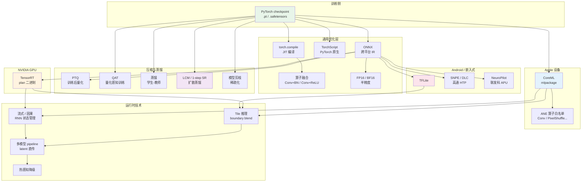
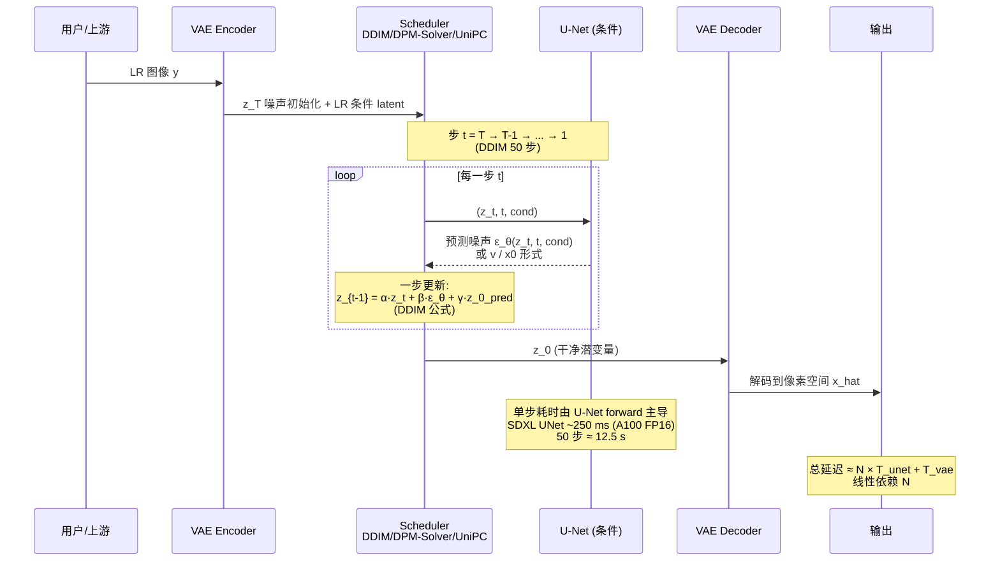
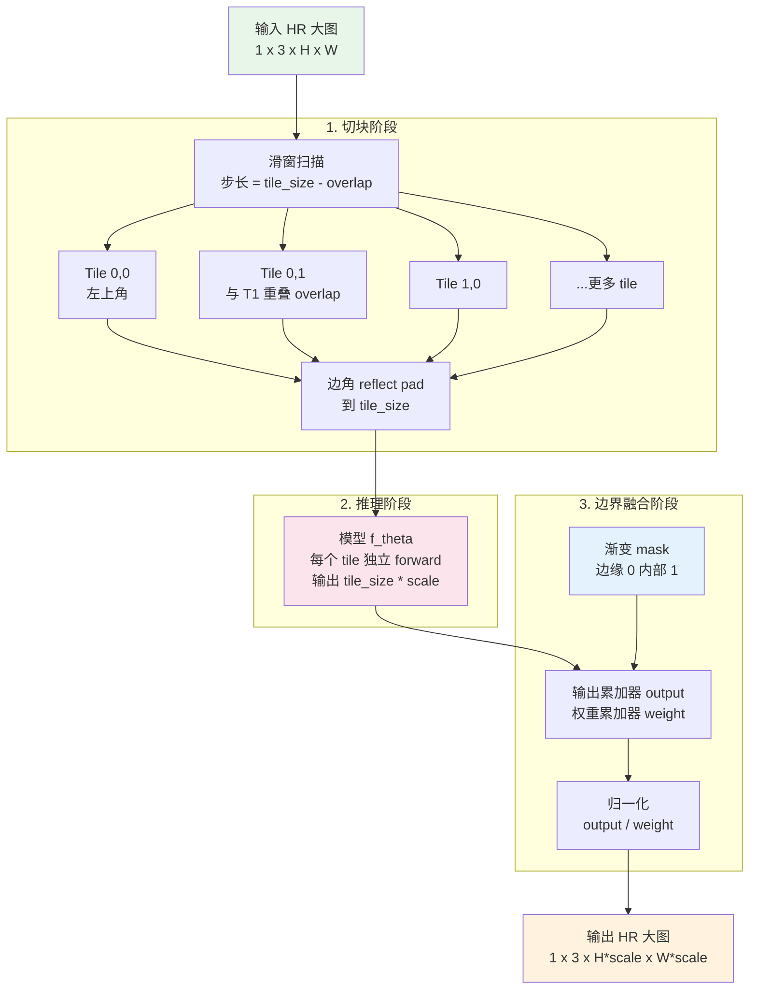

# 第 15 章 · 推理优化

> 训练出一个好模型只是迈出第一步。
>
> 将模型部署至生产环境（服务器、桌面 GPU、移动终端、嵌入式系统），是另一门要求苛刻的系统工程学科。
>
> 本章系统剖析量化、TensorRT、CoreML、torch.compile、分块（Tile）推理与流式处理等核心技术。

## 15.0 本章铺垫与术语注

前 14 章系统阐明了训练侧的技术链条：从退化建模出发，沿表征空间、损失函数、评估指标、数据合成、判别式与生成式架构、训练调度、视频时序一路行至可控生成。这些讨论大都基于训练环境的理想假设：充裕的显存、宽松的耗时预算以及可随时中断重试的容错空间。本章开始切换至部署视角：**真实的生产环境有着截然不同的运行规律**。线上服务受制于严苛的系统与硬件约束，包括端到端延迟、吞吐量、显存上限、功耗、温升降频、码率适配以及与上下游编解码器的无缝对齐。在学术评测集上提升 0.3 dB PSNR 在线上往往难以察觉，但 p99 延迟若超出预算 20 ms，便足以导致整个产品体验不可用。

更棘手的是：训练表现优异的模型未必能直接投入生产。例如一个 SwinIR-Large 在 A100 上以 batch=8 训练顺畅，但导出到移动端后可能会遭遇 PixelShuffle 算子在 iOS 16 上回退（fallback）至 CPU、注意力算子在高通 NPU 上缺乏原生支持、INT8 量化后引入棋盘格伪影、连续推理 30 分钟后手机过热降频、视频会议场景中缺失未来帧而只能运行因果模式、增强后的画面经 H.264 重新压缩后高频细节全被抹除等工程断点。这些问题在学术论文中鲜少被提及，但在工程落地时每一个都是阻碍上线的硬伤。

因此，本章并非一份单纯调用 TensorRT 的 API 指南，而是一份**将训练完备的低层视觉模型从 PyTorch 平稳推进至各类真实终端**的系统化工程清单。在结构上，本章先从通用优化技术（模型导出、编译加速、半精度、量化）展开；随后按部署平台细分剖析：针对 NVIDIA GPU 的 TensorRT、面向 Apple 硬件的 CoreML 与 ANE，以及适用于 Android 与嵌入式设备的 TFLite 与芯片厂商 SDK；接着探讨三类跨平台核心技术：模型蒸馏（含单步扩散超分）、分块（Tile）大图推理、流式与实时视频处理；最后归结于多模型流水线编排、运行时监控与成本估算。

阅读本章时请把握核心对照：**学术指标关注“模型输出与真实标签的数学距离”，而生产指标聚焦“产品能否高可靠交付”**。两者并不冲突，但优化路径截然不同。本章各节旨在将工程关切转化为清晰可执行的架构设计与实现方案。

### 缩写与首次出现的术语

为了避免术语堆砌，第一次出现的缩写在这里集中给出全称与一句话定义。后文再次使用时不再展开。

- **TensorRT**：NVIDIA 的推理引擎，把 ONNX / PyTorch 模型编译为针对特定 GPU 优化的二进制 plan 文件。
- **ONNX**（Open Neural Network Exchange，开放神经网络交换格式）：跨框架的模型中间表示，绝大多数推理引擎都从 ONNX 读入。
- **CUDA**（Compute Unified Device Architecture）：NVIDIA GPU 的通用并行计算平台与编程模型。
- **cuDNN**（CUDA Deep Neural Network library）：NVIDIA 提供的 GPU 深度学习算子库，TensorRT 与 PyTorch 都依赖它。
- **FP32 / FP16 / BF16**：32 位 / 16 位浮点。BF16（Brain Float 16）由 Google 提出，指数位与 FP32 相同、尾数位更少，数值范围大但精度低，在 A100 与之后的 NVIDIA GPU 上原生支持。
- **INT8 / INT4**：8 位 / 4 位整数。量化用的低比特表示，能换取速度与显存优势，代价是精度损失。
- **PTQ**（Post-Training Quantization，训练后量化）：训练完成后基于校准数据估计 scale 与 zero point 直接量化。
- **QAT**（Quantization-Aware Training，量化感知训练）：在训练 loop 里插入"伪量化"算子，让模型适应量化误差。
- **TorchScript**：PyTorch 的脚本化中间表示，可以脱离 Python 解释器在 C++ 运行时执行。
- **torch.compile**：PyTorch 2.0 引入的 JIT 编译入口，背后调度 TorchDynamo / TorchInductor 把模型图编译成融合后的 kernel。
- **CoreML**：Apple 的设备端推理框架，能调度到 CPU / GPU / ANE 三种计算单元。
- **ANE**（Apple Neural Engine）：Apple 芯片里专门跑神经网络的低功耗加速器，A 系列与 M 系列芯片都集成。
- **NPU**（Neural Processing Unit，神经网络处理器）：移动端与嵌入式上的专用神经网络加速器统称，例如高通 HTP、华为 NPU、联发科 APU、Apple ANE 都属于这一类。
- **HTP**（Hexagon Tensor Processor）：高通 Snapdragon 芯片里的 NPU 实现，跑 INT8 极快。
- **SNPE**（Snapdragon Neural Processing Engine）：高通提供的 NPU SDK，把 ONNX 转成 DLC 格式后下放到 HTP / GPU / CPU。
- **DLC**（Deep Learning Container）：SNPE 的模型容器格式。
- **NeuroPilot**：联发科为天玑芯片 APU 提供的 NPU SDK。
- **TFLite**（TensorFlow Lite）：Google 的移动端 / 嵌入式推理框架，Android 端事实标准。
- **NNAPI**（Neural Networks API）：Android 8+ 提供的系统层 NPU 抽象，TFLite 可以走 NNAPI 路由到设备 NPU。
- **OpenVINO**：Intel 为自家 CPU / 集成 GPU / VPU 优化的推理工具链。
- **DirectML**：Windows 上的硬件抽象推理 API，统一覆盖 NVIDIA / AMD / Intel GPU。
- **VAE**（Variational Auto-Encoder，变分自编码器）：第 7 章详谈。这里反复出现因为扩散派的潜空间编解码都过 VAE，且 VAE 在低比特下极易溢出。
- **KV cache**（Key-Value cache）：Transformer 自回归推理时把已计算过的 attention key / value 缓存下来避免重复计算的技术。低层视觉里出现在视频 Transformer 与扩散 Transformer 的因果推理路径上。
- **Flash Attention**：把 attention 的 softmax(QK^T)V 拆成分块计算并融合到单个 CUDA kernel 的实现，省显存且更快。
- **Tiling**：把大图切成小块分别推理再拼回。本章 15.9 节专门讲。
- **SwinIR-Tile**：SwinIR 官方提供的 tile 推理实现，是社区参考实现之一。
- **Boundary blending**（边界融合）：tile 拼回时在重叠区做渐变加权，避免接缝可见。
- **DDIM**（Denoising Diffusion Implicit Models）：扩散模型的确定性采样器，可以用远少于训练步数的步数采样。
- **DDIM steps**：DDIM 推理时的采样步数，常见 20-50 步。
- **DPM-Solver / DPM-Solver++**：扩散 ODE 的高阶数值求解器，10-20 步就能达到 DDIM 50 步的质量。
- **UniPC**（Unified Predictor-Corrector）：扩散采样器之一，预测-修正结构，8-15 步可用。
- **LCM**（Latent Consistency Model，潜空间一致性模型）：把扩散模型蒸馏成 4-8 步可采样的学生模型。
- **LoRA**（Low-Rank Adaptation，低秩适配器）：在预训练大模型权重上加一个低秩增量，训练参数量极小。
- **OSEDiff / TSD-SR / AdcSR / SinSR**：四个走"1 步扩散 SR"路线的工作，详见第 18 章。
- **GOP**（Group of Pictures，图像组）：视频编码里以一个 I 帧（关键帧）开头、后续 P/B 帧依赖前后帧的一组帧。
- **I / P / B 帧**：视频帧类型。I 帧独立解码，P 帧依赖前面，B 帧依赖前后双向。
- **NAL**（Network Abstraction Layer，网络抽象层）单元：H.264 / H.265 把编码数据切成的传输单元。
- **A/V 同步**（Audio/Video sync）：音视频时序对齐。人耳对 lipsync 误差敏感阈值约 ±40 ms。
- **p50 / p90 / p99 延迟**：延迟分布的中位数 / 90 分位 / 99 分位。
- **OOM**（Out Of Memory）：显存耗尽。
- **QPS**（Queries Per Second，每秒查询数）：吞吐量度量。
- **GAN**（Generative Adversarial Network，生成对抗网络）：本章涉及到 ESRGAN / Real-ESRGAN 时反复出现。
- **RRDB**（Residual-in-Residual Dense Block）：ESRGAN / Real-ESRGAN 的主干模块。

后续小节首次出现新缩写仍然给出全称，但常用术语就不重复了。

### 本章主线

整章可以视作一张从训练产物到生产终端的"扩散图"：PyTorch 权重在中心，外圈是各种部署目标，每一条边都标了一组优化技术。下面这张全景图先给一个鸟瞰，后面每一节都在填某一条边的细节。



这张图回答的问题是"我手里这个 PyTorch checkpoint，要进哪个生产场景，应该走哪条边？"。例如：服务器侧 4K 直播增强 → ONNX → TensorRT FP16 + Tile + 多模型 pipeline；iPhone 端实时滤镜 → CoreML + ANE 算子白名单 + per-channel INT8 + 因果流式；扩散派 SR 上线 → LCM 或 1-step SR 蒸馏 + TensorRT FP16 + Tile。后面每一节都在解释这些路径上的具体决策。

## 15.1 推理优化的部署目标

不同平台对模型的要求差异巨大：

| 平台 | 延迟要求 | 显存预算 | 模型大小预算 | 优先级 |
|------|---------|---------|-----------|-------|
| **A100 服务器** | < 1 秒/张 | 80 GB | 几 GB | 吞吐量 |
| **消费 GPU**（4090） | < 100 ms/张 | 24 GB | 几 GB | 用户体验 |
| **桌面 CPU** | < 5 秒/张 | 16 GB | < 500 MB | 兼容性 |
| **手机 NPU** | < 30 ms/帧 | < 1 GB | < 50 MB | 实时性 + 功耗 |
| **嵌入式（IoT）** | < 100 ms/张 | < 100 MB | < 10 MB | 严格预算 |

每个平台有自己的优化栈。这一章按平台分别讲。

## 15.2 通用优化（所有平台都要）

### 15.2.1 模型导出格式

PyTorch 训练模型要导出到推理格式：

```
PyTorch model (.pt)
  ├── ONNX (.onnx)              ← 跨平台中间格式
  │   ├── TensorRT (.plan)      ← NVIDIA GPU
  │   ├── OpenVINO              ← Intel CPU/GPU
  │   ├── DirectML              ← Windows 通用
  │   └── ONNX Runtime          ← 通用 CPU/GPU
  ├── TorchScript (.pt)         ← PyTorch 原生
  ├── CoreML (.mlpackage)       ← Apple 设备
  ├── TFLite (.tflite)          ← Android / 嵌入式
  └── 自定义 (Custom)            ← 厂商 SDK
```

**ONNX 是事实标准的中间格式**：大多数推理引擎都接受 ONNX。

```python
# 导出 PyTorch 模型到 ONNX
import torch

model.eval()
dummy_input = torch.randn(1, 3, 256, 256)

torch.onnx.export(
    model,
    dummy_input,
    "model.onnx",
    input_names=['input'],
    output_names=['output'],
    dynamic_axes={
        'input':  {0: 'batch', 2: 'height', 3: 'width'},  # 动态尺寸
        'output': {0: 'batch', 2: 'height', 3: 'width'},
    },
    opset_version=17,
)
```

### 15.2.2 算子融合

把多个连续算子合并成一个，减少 kernel 启动开销和内存访问：

- `Conv + BatchNorm` → `Conv'`（合并 BN 到 conv 权重）
- `Conv + ReLU` → `Conv-ReLU` fused op
- `LayerNorm + Linear` → fused op

PyTorch 2.0+ 的 `torch.compile` 自动做这些。

### 15.2.3 torch.compile

PyTorch 2.0 引入的 JIT 编译，能把模型自动优化：

```python
import torch

model = build_model().eval().cuda()
model = torch.compile(model, mode="reduce-overhead")  # 或 "max-autotune"

# 第一次推理会慢 (编译)
with torch.no_grad():
    _ = model(warmup_input)  # 触发编译

# 之后快
output = model(real_input)
```

`mode` 选择：

- `"default"`：稳妥，提速 1.5-2×
- `"reduce-overhead"`：减少 Python 开销，适合小 batch
- `"max-autotune"`：最大优化，编译慢但运行最快

实测影响：

- Real-ESRGAN 在 4090 上原生 PyTorch 跑 200ms/256×256，`torch.compile` 后 90ms

工程注意：

- 输入形状变化时会**重新编译**，造成第一次运行卡顿
- 用 `dynamic=True` 让编译器准备好动态形状
- 兼容性问题：某些自定义算子不支持

### 15.2.4 FP16 / BF16 推理

训练用 FP32 / BF16，推理可以用 FP16 / BF16 减一半显存 + 加速 1.5-2×：

```python
model = build_model().eval().cuda().half()  # FP16
output = model(input.half())
```

注意事项：

- VAE encoder/decoder 在 FP16 下可能溢出，**保留 FP32**
- 某些算子（softmax、归一化）在 FP16 下精度损失大，自动 cast 到 FP32
- BF16 数值范围大但精度低，**A100+ 推荐 BF16**

### 15.2.5 量化（INT8 / INT4）

量化的核心是把高精度浮点张量映射到低比特整数，再在推理时把整数解回近似的浮点值。最常用的对称线性量化公式是：

$$
q = \text{round}\left(\frac{x}{s}\right), \qquad \hat{x} = q \cdot s
$$

其中 $s$ 是 scale，$q$ 是量化后的整数（INT8 时 $q \in [-128, 127]$）。非对称量化再加一个 zero point $z$：

$$
q = \text{round}\left(\frac{x}{s}\right) + z, \qquad \hat{x} = (q - z) \cdot s
$$

scale $s$ 的选取策略直接决定了量化误差。最质朴的做法是取张量绝对值最大值并除以 127，但这种 max-scale 对离群值（outlier）极度敏感：单个极端异常激活值便可能导致其余通道的有效量化精度骤降至不足 7 位。工业实践中常用的两类改进策略包括：

1. **Percentile 截断**：选取 99.99% 分位数的绝对值作为最大截断点，丢弃极少数离群噪点。
2. **MSE 最小化**：在校准集上搜索使重建均方误差 $\|\hat{x} - x\|_2^2$ 最小的最优 scale。

将权重和激活从浮点降至 INT8 乃至 INT4 主要有两条技术路径：

- **PTQ**（Post-Training Quantization，训练后量化）：训练完成后利用校准数据集（通常包含数百张典型图像）统计 scale 与 zero point 并直接完成量化。该方案流程轻简，其精度损失程度取决于模型结构本身对量化噪声的鲁棒性。
- **QAT**（Quantization-Aware Training，量化感知训练）：在模型训练的前向传播中插入伪量化算子（quantize-dequantize 对），使反向传播梯度能够感知量化截断误差，引导模型在训练阶段主动适应量化扰动。该方案精度损失极小，但需要额外的微调开销。

INT8 量化带来的潜在收益显著：

- 模型体积：压缩至 1/4（相比 FP32）或 1/2（相比 FP16）
- 推理速度：在具备整数张量核心的硬件上可达 2-4 倍加速
- 显存占用：相应大幅缩减

低层视觉任务的特殊难点在于：**输出图像的像素精度对量化截断误差高度敏感**。粗糙的 INT8 量化可能导致 PSNR 下降 0.5-2 dB，并在视觉感知上产生肉眼可辨的网格或色斑伪影。

工程实践准则：

- **大容量模型**（如 Restormer、HAT、扩散 U-Net）：经良好校准后 INT8 量化保真度较为理想。
- **轻量模型**（如 NAFNet 轻量版、ESRGAN-Lite）：INT8 量化后质量降幅显著，通常建议保留 FP16 推理。
- **VAE 编解码器**：严禁采用 INT8 量化，否则极易诱发潜空间数值溢出与重构崩塌。

```python
# 简化的 PyTorch INT8 PTQ
import torch.ao.quantization as quant

model = build_model().eval()

# 1. 准备校准数据
calibration_data = [load_calibration_batch(i) for i in range(100)]

# 2. 配置量化方案
qconfig = quant.get_default_qconfig('fbgemm')  # CPU
# 或 qconfig = quant.get_default_qconfig('x86') for newer x86

model.qconfig = qconfig
model_prepared = quant.prepare(model)

# 3. 跑校准 (用代表性数据)
with torch.no_grad():
    for batch in calibration_data:
        model_prepared(batch)

# 4. 转换成 INT8 模型
model_int8 = quant.convert(model_prepared)
```

时效说明：上述 `torch.ao.quantization` 属于 Eager 模式的传统接口，目前依然兼容；但 PyTorch 2.x 起官方主推的架构已演进为 PT2E（PyTorch 2 Export Quantization），其核心在于先通过 `torch.export` 捕获确定性计算图，再在图中间层注入量化算子，针对包含复杂控制流与自定义模块的模型更具鲁棒性。新工程项目建议直接基于 PT2E 搭建量化管线。

在 GPU 上执行 INT8 量化更加精细，通常需经由 TensorRT 或 ONNX Runtime 的专用校准器完成。

## 15.3 NVIDIA GPU 部署：TensorRT

### TensorRT 是 NVIDIA 专用的高性能推理引擎

其核心工作范畴包括：

- 解析并接纳 ONNX 或 PyTorch 计算图；
- 执行图级算子融合、硬件底层内核选择及精度量化；
- 输出**针对特定 GPU 硬件架构编译优化**的二进制引擎（`.plan` 文件）；
- 提供高效的 C++ 与 Python 运行时推理接口。

为什么 TensorRT 显著快于直接执行 PyTorch 或基础 ONNX Runtime？其核心优势来自三项底层机制：

1. **激进的算子融合（Operator Fusion）**：将 Conv + BN + ReLU + ElementWise Add 等连续算子垂直融合成单一 CUDA kernel，彻底规避中间张量反复读写显存的带宽开销与算子调度延迟。
2. **硬件级 Kernel 自动调优（Auto-Tuning）**：针对同一卷积算子，TensorRT 会在其丰富的内核库（涵盖不同分块尺寸、内存布局及 Tensor Core 路径）中，在目标 GPU 上针对指定输入尺寸进行基准测试以遴选最优实现。这一调优结果高度绑定于生成的 plan 二进制文件（例如在 A100 上构建的 plan 无法直接迁移至 RTX 4090 上运行）。
3. **低精度路径与专用 Tensor Core 加速**：在 FP16 / BF16 / INT8 模式下，TensorRT 深度调用 Ampere 及更新架构的硬件张量核心（FP8 需 Hopper / Ada 架构硬件支持，A100 属 Ampere 架构不支持 FP8），其理论计算吞吐可达纯 CUDA Core 的 4-8 倍。

其代价在于离线构建耗时较长。以 SDXL U-Net 为例，在 A100 上构建高优化等级的 FP16 plan 通常需要 5-15 分钟，若叠加 INT8 校准则耗时可达 30 分钟以上。因此在工业流水线中，编译完成的 plan 文件应作为 CI/CD 构建产物妥善缓存，而非在服务启动时动态编译。

### 工作流

```python
import tensorrt as trt

# 1. 从 ONNX 构建 TensorRT 引擎
def build_engine(onnx_path: str, engine_path: str,
                 fp16: bool = True, int8: bool = False):
    logger = trt.Logger(trt.Logger.WARNING)
    builder = trt.Builder(logger)
    network = builder.create_network(
        1 << int(trt.NetworkDefinitionCreationFlag.EXPLICIT_BATCH)
    )
    parser = trt.OnnxParser(network, logger)

    with open(onnx_path, 'rb') as f:
        if not parser.parse(f.read()):
            for error in range(parser.num_errors):
                print(parser.get_error(error))
            return None

    config = builder.create_builder_config()
    config.set_memory_pool_limit(trt.MemoryPoolType.WORKSPACE, 4 << 30)  # 4 GB

    if fp16:
        config.set_flag(trt.BuilderFlag.FP16)
    if int8:
        config.set_flag(trt.BuilderFlag.INT8)
        config.int8_calibrator = MyCalibrator(...)  # 需要校准数据

    # 动态形状支持
    profile = builder.create_optimization_profile()
    profile.set_shape("input",
                     min=(1, 3, 64, 64),
                     opt=(1, 3, 256, 256),
                     max=(1, 3, 1024, 1024))
    config.add_optimization_profile(profile)

    engine = builder.build_serialized_network(network, config)
    with open(engine_path, 'wb') as f:
        f.write(engine)
```

### TensorRT 推理

```python
import tensorrt as trt
import pycuda.driver as cuda
import numpy as np

class TRTInferencer:
    def __init__(self, engine_path: str):
        logger = trt.Logger(trt.Logger.WARNING)
        runtime = trt.Runtime(logger)
        with open(engine_path, 'rb') as f:
            self.engine = runtime.deserialize_cuda_engine(f.read())
        self.context = self.engine.create_execution_context()

    def infer(self, input_array: np.ndarray) -> np.ndarray:
        # 1. 设置动态输入 shape, 然后查询输出实际 shape
        # 注意: SR 模型的输出 shape != 输入 shape (放大了 scale 倍)
        self.context.set_input_shape("input", input_array.shape)
        out_shape = tuple(self.context.get_tensor_shape("output"))

        # 2. 按真实 shape 分配显存
        in_size  = int(np.prod(input_array.shape) * np.dtype(np.float32).itemsize)
        out_size = int(np.prod(out_shape) * np.dtype(np.float32).itemsize)
        d_input  = cuda.mem_alloc(in_size)
        d_output = cuda.mem_alloc(out_size)
        cuda.memcpy_htod(d_input, input_array.astype(np.float32))

        # 3. TensorRT 10+ 推荐用 name-based API
        self.context.set_tensor_address("input",  int(d_input))
        self.context.set_tensor_address("output", int(d_output))
        stream = cuda.Stream()
        self.context.execute_async_v3(stream.handle)
        stream.synchronize()

        # 4. 拷贝回 CPU
        output = np.empty(out_shape, dtype=np.float32)
        cuda.memcpy_dtoh(output, d_output)
        return output
```

### TensorRT 加速效果

| 模型 | 原 PyTorch | TensorRT FP16 | TensorRT INT8 |
|------|-----------|--------------|--------------|
| Real-ESRGAN (RRDB) | 100% | 35% | 18% |
| SwinIR | 100% | 40% | N/A |
| BasicVSR++ | 100% | 50% | N/A |
| SDXL UNet | 100% | 45% | N/A |

**TensorRT FP16 通常可带来 2-3 倍加速**，INT8 则可在此基础上进一步提速近 2 倍，但伴随显著的画质劣化风险。

## 15.4 Apple 设备部署：CoreML

### CoreML 架构与算力路由

CoreML 是 Apple 生态专属的高性能推理框架，支持向底层三种异构硬件单元分发算力：

- **CPU**：提供全量算子兜底支持，兼容所有 Apple 设备；
- **GPU**：面向 M 系列芯片及 iPhone 图形处理器，适合大吞吐并行计算；
- **Apple Neural Engine (ANE)**：集成于 A 系列与 M 系列芯片中的超低功耗专用神经网络加速器。

### 转换工作流

```python
import coremltools as ct
import torch

# 1. 对 PyTorch 模型进行 Trace
model.eval()
dummy_input = torch.randn(1, 3, 256, 256)
traced = torch.jit.trace(model, dummy_input)

# 2. 转换为 CoreML 格式
mlmodel = ct.convert(
    traced,
    inputs=[ct.ImageType(name="input",
                         shape=(1, 3, 256, 256),
                         scale=1/255.0,
                         color_layout=ct.colorlayout.RGB)],
    outputs=[ct.TensorType(name="output")],
    compute_precision=ct.precision.FLOAT16,    # 移动端默认推荐 FP16
    compute_units=ct.ComputeUnit.ALL,          # 联合调度 CPU + GPU + ANE
    minimum_deployment_target=ct.target.iOS17,
)
mlmodel.save("model.mlpackage")
```

### Apple Neural Engine (ANE) 的硬件特性与约束

- **极高能效比**：同等吞吐下能耗仅为 CPU 的 1/10 左右。
- **严格受限的算子白名单**：主要优化常见卷积、激活函数与基础张量操作。
- **回退惩罚严苛**：遭遇未加速算子或不规则动态张量时，子图将被迫回退（fallback）至 CPU 或 GPU。

为 ANE 定制模型结构时的算子支持边界：

- **完全支持**：Conv2d（3×3、5×5 等常规卷积）
- **完全支持**：ReLU / LeakyReLU / GELU 等标量激活函数
- **完全支持**：BatchNorm
- **条件支持**：PixelShuffle（iOS 17+ 具备更广泛支持，但通道数通常需 ≤ 256；iOS 16 下易回退至 CPU，详见 15.5.2 节）
- **条件支持**：动态形状（支持有限，生产部署建议绑定固定输入分辨率）
- **条件支持**：复杂 Attention 结构（原生支持受限，通常需拆解为基础矩阵乘与 Softmax 或引入局部窗口近似）
- **不支持**：自定义 C++/CUDA 算子（ANE 仅接受 CoreML 原生 IR 映射，任何未收录层均会触发跨设备回退）

性能参考：

- Real-ESRGAN 在 iPhone 14 ANE 上处理 720P 输入约 80 ms；
- 典型轻量 Transformer 类超分模型在同设备上耗时约 150 ms。

### CoreML 权重调色板量化（4-bit Palettization）

iOS 17+ 支持 4-bit 权重调色板压缩，使模型体积进一步减半：

```python
import coremltools.optimize.coreml as cto

config = cto.OptimizationConfig(
    global_config=cto.OpPalettizerConfig(
        nbits=4,
        granularity="per_grouped_channel",
        group_size=16,
    ),
)
mlmodel_quantized = cto.palettize_weights(mlmodel, config)
```
实测指标：模型体积从 50 MB 压缩至 12 MB，峰值信噪比（PSNR）降幅小于 0.3 dB。

## 15.5 NPU 实战：从“能跑”跨越到“真快”

15.4 节梳理了 ANE 的算子白名单，但在工程实战中，**超过 90% 的端侧延迟劣变并非源于算子无法执行，而是由于局部算子回退引发跨硬件数据搬运悬崖、量化粒度失准以及内存排布（Layout）转换诱发的隐式重排**。以下深入剖析端侧 NPU 部署中的高频工程瓶颈与对策。

### 15.5.1 逐通道与逐张量量化：低层视觉的刚性选择

INT8 量化将 FP32/FP16 张量映射至 8 位定点整数。映射尺度（Scale）的划分粒度主要有两种：

- **逐张量量化（Per-tensor）**：整个权重张量共用单一组 `(scale, zero_point)`。计算简单，早期的移动端 NPU 驱动通常默认采用。
- **逐通道量化（Per-channel）**：每个输出通道独立分配一个 scale，大幅提升权重量化保真度（由于激活值的动态特性，激活量化通常仍采用 per-tensor）。

**低层视觉必须采用逐通道权重量化的技术根因**：

低层视觉卷积核在不同输出通道之间的幅值动态范围**显著大于高层分类任务**：部分通道专注于平滑区域的低频结构（幅值较大），而部分通道则专门提取亚像素级的微弱纹理（幅值极小）。若采用 per-tensor 统一量化，小幅值通道的数值将被粗暴压缩至极少数几个离散等级，造成严重的有效位损失，在重构图像上表现为肉眼可见的网格状或色斑伪影。

实测对比（基于 Real-ESRGAN 在 DIV2K 验证集）：

| 量化方案 | PSNR (dB) | 视觉感知表现 |
|---------|-----------|------------|
| FP16 基准 | 28.45 | 无伪影 |
| Per-channel 权重 + Per-tensor 激活 (INT8) | 28.30 (-0.15) | 伪影几乎不可见 |
| Per-tensor 权重 + Per-tensor 激活 (INT8) | 27.10 (-1.35) | 出现明显色斑与网格纹 |

工程准则：**端侧 INT8 量化必须强制开启逐通道权重量化（Per-channel weight quantization）**。若芯片专用 SDK 不支持该特性，应优先选择 FP16 推理，或调整硬件选型。

```python
# CoreML 的逐通道量化配置（iOS 16+）
import coremltools.optimize.coreml as cto

cto.linear_quantize_weights(
    mlmodel,
    config=cto.OptimizationConfig(
        cto.OpLinearQuantizerConfig(
            mode="linear_symmetric",
            granularity="per_channel",     # 关键配置项
            weight_threshold=2048,
        )
    ),
)
```

### 15.5.2 ANE 算子回退引发的延迟阶跃

ANE 原生算子的典型耗时通常处于**亚毫秒级（数百微秒）**。一旦计算图中出现不兼容算子，CoreML 运行时会将受影响的子图调度至 GPU 或 CPU 执行，导致单算子耗时激增至毫秒级。

更为严峻的是跨计算单元的调度开销：**ANE 与 CPU/GPU 之间的张量数据搬运需要跨越不同的内存池与同步屏障**。一个包含 30 层的网络若存在 3 处分散的不兼容算子，可能触发多达 6 次跨单元内存拷贝与上下文切换，使得单帧总延迟由 30 ms 骤升至 100 ms 以上。

**端侧部署的标准防御措施**：

1. **导出后立即分析算子分布图谱**：

```python
import coremltools as ct

mlmodel = ct.models.MLModel("model.mlpackage")
spec = mlmodel.get_spec()

# 在 macOS/iOS 上运行单次推理，利用 Xcode Instruments 的 Core ML 模板分析每个算子的实际分配单元
# 或使用 ct.models.utils 系列诊断工具
```

工程目标：**模型主干计算图达成 100% ANE 调度，消除一切跨芯片回退**。

2. **严格的 ANE-Only 连通性校验**：

```python
# 强制限制执行单元仅为 ANE 与 CPU（排除 GPU 参与），验证是否存在未注册算子抛错
mlmodel = ct.convert(traced, ..., compute_units=ct.ComputeUnit.CPU_AND_NE)
# 验证通过后生产环境再开放 ALL 调度模式
```

3. **PixelShuffle 算子的兼容性陷阱**：iOS 16 ANE 对 PixelShuffle 缺乏原生支持会直接回退至 CPU；iOS 17+ 虽已支持但输入通道通常限制在 256 以内。在需要兼顾旧版本系统的场景下，**建议使用反卷积（Transposed Conv）或最近邻插值接标准卷积（Nearest + Conv）作为等价替代**。

4. **LayerNorm 的动态分辨率适配**：固定分辨率下的 LayerNorm 在 ANE 上具备优异的执行效率，但在动态可变分辨率输入时可能触发编译器保守回退。若模型对外提供动态尺寸接口并实测遭遇 LayerNorm 回退，可考虑将其替换为对输入尺寸不敏感的 GroupNorm，但最终选型必须以真机 Profile 结果为准。

### 15.5.3 Reshape 与 Permute 引起的隐式内存排布转换

ANE 内部具备特定的硬件偏好张量内存排布。不恰当的维度重排（Permute/Reshape）会迫使硬件插入全张量内存搬迁内核，使微秒级算子恶化为毫秒级开销。高频触发场景包括：

- 跨格式重排：例如 `tensor.permute(0, 2, 3, 1)` 在 NCHW 与 NHWC 之间频繁切换；
- 非对齐通道重塑：当通道数非 8 或 16 的整倍数时执行 `tensor.view(B, -1, H, W)`；
- 针对 4K 及以上超大分辨率直接执行全图转置。

工程防御实践：

- **模型设计阶段即对齐通道倍数**：确保所有中间层通道数为 8、16 或 32 的整数倍；
- **规避大图维度的全局转置**：必须转置时先执行分块切片，在小尺寸局部张量上操作；
- **开启图优化编译器重排**：利用 `coremltools.compression.experimental.ane_optimize`（iOS 18+）自动消除多余的布局转换算子。

### 15.5.4 高通 SNPE / 联发科 NeuroPilot 的差异化现状

Android 生态的 NPU 硬件环境具备高度碎片化特征，同一份 ONNX 模型在不同芯片厂商的加速器上运行表现可能存在数倍差异。

**高通 SNPE（Snapdragon Neural Processing Engine / QNN）**：

- 其 Hexagon Tensor Processor（HTP）在处理 INT8 整数张量时能效突出（旗舰平台吞吐显著超越端侧 GPU）；
- 算子支持边界较为严苛：早期 SNPE 对原生 GroupNorm（需拆解为 Reshape 与 LayerNorm 组合）与复杂注意力结构支持有限（注：高通工具链已演进整合为 Qualcomm AI Engine Direct / QNN，新项目推荐直接对接 QNN）；
- 必须使用 `snpe-onnx-to-dlc` 工具并开启 `--debug` 等级，逐层审视各算子的硬件卸载情况。

**联发科 NeuroPilot（天玑 APU）**：

- 近代旗舰芯片（如天玑 9400 系列）APU 性能表现出色，但在中低端芯片与旗舰芯片之间存在明显的算子支持代差；
- 模型量化与格式转换依赖 `neuropilot-converter`，校准数据集应包含至少 200 张具备代表性的业务场景图像。

**跨平台工程准则**：在 Android 端正式发版前，**必须选取 3-4 款具备代表性的主流 SoC 平台进行实机端到端 Profile**（覆盖高通骁龙旗舰、联发科天玑旗舰以及中端典型芯片），切忌仅依赖单一旗舰机型评估性能。

### 15.5.5 端侧模型落地的闭环测试流

将上述工程要点整合后的标准闭环流程如下：

```
1. 网络设计阶段：对齐 NPU 友好约束（通道对齐、备选上采样方案、算子精简）
   ↓
2. 导出 ONNX 中间表示，转换为 CoreML / LiteRT / DLC / QNN
   ↓
3. 导出算子执行图谱：审查各算子在 NPU / GPU / CPU 之间的调度分布
   ↓
4. 消除硬件回退：针对触发 fallback 的算子实施结构等价重构
   ↓
5. 实施量化压缩：强制开启逐通道权重量化（Per-channel weight quantization）
   ↓
6. 领域数据校准：引入 200+ 张覆盖极端光照与复杂纹理的业务真图
   ↓
7. 真机基准评测：获取 p50/p90/p99 延迟分布、功耗指标与长周期发热衰减
   ↓
8. 极端场景与伪影回归集验收
```

缺乏上述闭环验证的端侧模型，在线上复杂工况下极易发生性能劣化与服务异常。

## 15.6 Android 与嵌入式：LiteRT 与专用 SDK

Android 平台的推理标准已由早期的 TensorFlow Lite 演进为 LiteRT（Google 于 2024 年底规范命名的轻量运行时，接口完全向前兼容）。

在模型转换路径上，传统的 `ONNX → onnx-tf → .pb → TFLite` 链条由于依赖已停止积极维护的中间工具，在复杂计算图上极易出现格式转换异常。现代工程实践推荐两条主流稳定路径：

- **官方原生直转（ai-edge-torch）**：Google 官方提供的 PyTorch 直转工具链，绕过 ONNX 与 TensorFlow 中间图直接生成高效 LiteRT 模型；
- **结构优化转译（onnx2tf）**：社区深度维护的 ONNX 直转方案，具备优良的算子排布自适应修复能力。

```python
# 推荐路径 A: 采用 Google 官方 ai-edge-torch 实现 PyTorch 原生导出
import ai_edge_torch
import torch

model = build_model().eval()
sample = (torch.randn(1, 3, 256, 256),)
edge_model = ai_edge_torch.convert(model, sample)
edge_model.export("model.tflite")     # 导出标准 LiteRT 模型文件

# 推荐路径 B: 基于已有 ONNX 文件采用 onnx2tf 直接转换
#   $ pip install onnx2tf
#   $ onnx2tf -i model.onnx -o saved_model
```

系统级 NNAPI（Android 8+）提供了通用 NPU 抽象层，但不同芯片厂商的驱动实现差异较大。在追求极致性能的工程场景中，**优先集成芯片厂商专属 SDK**（高通 QNN / SNPE、联发科 NeuroPilot、华为 HiAI）依然是标准选择。

## 15.7 模型蒸馏与结构剪枝：极致轻量化

### 15.7.0 压缩技术的三重路径

在将复杂模型推向边缘端时，主要有三项正交的压缩技术：

1. **精度量化（Quantization）**：在不改变网络拓扑的前提下，将浮点权重与激活映射至低比特整数（INT8/INT4），主要释放计算带宽与存储空间。
2. **模型剪枝（Pruning）**：剔除网络中对最终输出贡献微弱的权重参数。其中，非结构化剪枝（Unstructured Pruning）压缩比高但高度依赖硬件稀疏计算指令；而**结构化通道剪枝（Structured Channel Pruning）**直接缩减卷积核通道数，可直接降低 FLOPs 与显存占用。典型做法是在训练阶段施加通道级 L1 正则约束，训练完成后依幅值排序剔除冗余通道并重新微调。
3. **知识蒸馏（Knowledge Distillation）**：设计紧凑的学生网络从零学习模仿大型教师模型的输出表征与中间层特征。学生网络可自由采用与教师完全不同的轻量骨干（例如将重型 Transformer 教师蒸馏至紧凑的纯 CNN 学生）。

上述三项技术可链式叠加：先通过知识蒸馏构建小型学生网络，接着进行通道结构剪枝，最后实施 INT8 逐通道量化。每一步的画质损耗均处于受控范围（单步损耗通常低于 0.3 dB），叠加后却能实现模型体积数十倍的缩减与近一个数量级的推理加速。

### 蒸馏目标函数设计

```python
def distillation_loss(student_out, teacher_out, hr_target):
    """联合蒸馏损失：兼顾教师表征模仿与真实标签监督。"""
    # 模仿教师模型的输出分布
    distill = F.l1_loss(student_out, teacher_out.detach())
    # 真实高分辨率标签监督，约束学生网络不拟合教师的系统性误差
    gt = F.l1_loss(student_out, hr_target)
    return 0.7 * distill + 0.3 * gt
```

### 低层视觉任务的特色蒸馏机制

- **中间特征蒸馏（Feature Distillation）**：约束学生网络的中间多尺度特征图逼近教师对应层的高维特征激活；
- **关系与感知几何蒸馏（Relational Distillation）**：通过 Gram 矩阵或局部自相似性格局，传递高频纹理间的相对关联。

### 工业级轻量化代表架构

- **SRVGGNetCompact（realesr-general-x4v3）**：Real-ESRGAN 官方推出的极简超分网络，以多层纯卷积结构完全替代重型 RRDB 拓扑，参数量降至百万级，成为端侧与实时视频场景广泛采纳的标准轻量 Backbone；
- **异构跨架构蒸馏**：以 SwinIR 或 HAT 等重型注意力模型作为离线教师，蒸馏紧凑型纯前馈卷积学生，实现质量与端侧运行速度的工程平衡。

## 15.8 LCM / Turbo 蒸馏（扩散通用）

### 为什么 50 步是个问题：先把推理时序看清楚

理解蒸馏前要先看清原始的多步扩散推理是怎么用掉时间的。下面这张时序图画的是一次条件扩散 SR 的标准 DDIM 推理（N = 50 步）：每一步都要 VAE 解码外推 + U-Net forward + 调度器更新潜变量。每一步的 U-Net forward 几乎相同的耗时，所以总时间近似与步数成正比。



把推理时序梳理清晰后，对应的优化路径便一目了然：

- **DDIM → DPM-Solver++ / UniPC**：在保持相当画质的前提下将步数由 50 步压缩至 15-20 步。无需重新训练模型，单纯依靠高阶 ODE 求解器提升单步收敛效率。
- **LCM / Turbo 蒸馏**：进一步将迭代步数压缩至 4-8 步。其核心在于训练紧凑的学生网络，使其具备从任意时间步 $t$ 直接外推 $\hat{x}_0$ 的能力。
- **OSEDiff / TSD-SR 等单步扩散超分（Single-Step SR）**：将整个前向传播压缩至单一单次 U-Net 推理配合单次 VAE 解码，单图延迟降至 0.3-0.8 秒区间。
- **底层正交优化**：在 U-Net 内部集成 Flash Attention 实施显存与内核融合，配合 TensorRT 算子编译与 FP16/BF16 半精度加速，使单次前向延迟再降数倍。此类底层工程优化与算法维度的“步数精简”完全正交且可叠加生效。

因此，本指南将“蒸馏降步”与“底层编译/半精度加速”分为两条主线阐述：二者分别消除算法与硬件层面的吞吐瓶颈，在工业落地中通常联合部署。

### 扩散采样器选型：速度与质量的工程权衡

蒸馏并非降低步数的唯一技术手段。在不重新训练网络的前提下，**仅通过切换现代高阶数值采样器**，即可将步数从 50 步安全缩减至 15-20 步。主流采样器的适用边界对比如下：

| 采样器 | 推荐步数 | 阶数 | 收敛特征 | 典型适用场景 |
|--------|---------|------|---------|-------------|
| **DDIM** | 30-50 | 1 阶 | 稳定保守，鲁棒性最强 | Baseline 建立与初期消融实验 |
| **DPM-Solver** | 15-25 | 2-3 阶 | 同等质量下步数减半 | 通用离线超分加速 |
| **DPM-Solver++** | 10-20 | 2-3 阶 | 高 CFG 系数下数值更平稳 | 强文本先验/大引导系数场景 |
| **UniPC** | 8-15 | 多阶预测-校正 | 极少步数下保真度突出 | 低延迟交互式编辑 |
| **Euler / Heun** | 30-50 | 1-2 阶 | 实现直观稳定 | 算法教学与基础调试 |

工程经验：

- **基线建立阶段**：优先选用 DDIM 30 步作为质量对照基准。
- **生产服务默认配置**：推荐采用 DPM-Solver++ 20 步，在画质无损的前提下节省 30%-50% 的计算开销。
- **延迟敏感型任务**：可尝试 UniPC 10-15 步进一步压缩耗时，但需关注低引导系数下可能出现的边缘轻微平滑现象。
- **极限低延迟（步数 < 8）场景**：数值求解器的优化收益进入边际递减区间，应直接转向 LCM-LoRA 或单步扩散蒸馏方案。

需要强调的是，更换数值采样器无需重新微调模型权重（这是其相比模型蒸馏的核心工程优势）。因此，“先升级采样器、再评估模型蒸馏”是性价比最高的渐进式优化路径。

### 潜空间一致性模型（LCM）与 LCM-LoRA

LCM 的核心思想在于通过一致性映射约束（Consistency Mapping），迫使学生模型直接预测轨迹终点的真实潜变量 $x_0$。

在工程实现中，**LCM-LoRA** 提供了一种更加灵活轻量的交付形式：无需替换完整的 SD 基础骨干，仅通过外挂一个轻量 LoRA 分支即可将现有的 SDXL 增强管线加速至 4 步推理：

```python
# 将 LCM-LoRA 挂载至 SDXL 图像增强管线
from diffusers import LCMScheduler, AutoPipelineForImage2Image
import torch

pipe = AutoPipelineForImage2Image.from_pretrained(
    "stabilityai/stable-diffusion-xl-base-1.0",
    torch_dtype=torch.float16,
)
pipe.scheduler = LCMScheduler.from_config(pipe.scheduler.config)
pipe.load_lora_weights("latent-consistency/lcm-lora-sdxl")

# 仅需 4 步迭代即可完成高质量重建
output = pipe(prompt, image=lr_image, num_inference_steps=4, guidance_scale=1.5)
```

性能参考：

- SDXL 原始 50 步 DDIM：单图耗时约 25 秒（A100 环境）；
- LCM-LoRA 4 步推理：单图耗时压缩至 2 秒以内；
- 画质对比：感知评测下纹理与原版基本一致，FID 与 LPIPS 仅有微弱波动。

### 单步扩散超分：推动生成式超分走向实时化

LCM-LoRA 属于通用的文生图/图生图加速方案。而在专用图像超分辨率领域，**单步扩散超分（Single-Step Diffusion SR，如 OSEDiff、TSD-SR、AdcSR、SinSR，详见第 18 章）**将采样过程彻底压缩至**单步前向**：

| 技术路线 | 推理步数 | 单张 A100 耗时 | 相比 SUPIR 基准质量 |
|---------|---------|---------------|-------------------|
| 原始 SUPIR | 50 步 | 5-10 秒 | 100%（基准质量） |
| LCM-LoRA + SUPIR | 4-8 步 | 1-2 秒 | LPIPS 波动 +1% 至 +3% |
| OSEDiff / TSD-SR | **1 步** | **0.3-0.8 秒** | LPIPS 相当（±2%） |

**该突破的工程价值**：传统 50 步扩散超分由于延迟与显存开销过大，无法接入实时推流、视频会议与即时交互场景；单步扩散超分的出现，首次使“生成式先验的重构质感”与“亚秒级低延迟”在同一工程系统中达成统一。

工程落地点拨：

- LCM-LoRA 开发成本最低（仅需加载预训练 LoRA），但其 4 步画质在低层视觉特定任务上略逊于针对性蒸馏的单步超分模型。
- 面向 2025-2026 年的新落地项目，生成式超分管线建议优先基于 OSEDiff / TSD-SR 架构构建。
- 该技术路线在移动端部署（手机 NPU 上部署 OSEDiff）仍受限于 SDXL U-Net 的显存与权重体积（单步模型体积仍达数 GB 级别），端侧落地需进一步配合骨干网络轻量化（如蒸馏至轻量 DiT 或纯 CNN 结构）。

## 15.9 Tile 推理：处理大图

第 9 章 9.9 节讲过扩散的 tile，这里扩展到所有模型。

### 何时需要 tile

- 输入分辨率 > 训练分辨率（特别是 4K/8K）
- 显存不够（24GB 卡跑 1080P 4× SR 也可能 OOM）

### 工程实现

```python
import torch
import torch.nn.functional as F


def tile_inference(model, image, tile_size=512, overlap=64, scale=4):
    """
    通用的 tile 推理。
    image: (1, 3, H, W) 输入
    返回: (1, 3, H*scale, W*scale) 输出
    """
    _, _, H, W = image.shape
    out_H, out_W = H * scale, W * scale

    stride = tile_size - overlap
    # 输出累加器
    output = torch.zeros((1, 3, out_H, out_W), device=image.device)
    weight = torch.zeros((1, 1, out_H, out_W), device=image.device)

    # 渐变 mask
    mask = torch.ones((1, 1, tile_size * scale, tile_size * scale),
                      device=image.device)
    edge = overlap * scale
    for i in range(edge):
        v = (i + 1) / (edge + 1)
        mask[:, :, i, :]    *= v
        mask[:, :, -i-1, :] *= v
        mask[:, :, :, i]    *= v
        mask[:, :, :, -i-1] *= v

    for top in range(0, max(1, H - tile_size + 1), stride):
        for left in range(0, max(1, W - tile_size + 1), stride):
            # 取 tile
            tile_h = min(tile_size, H - top)
            tile_w = min(tile_size, W - left)
            tile = image[:, :, top:top + tile_h, left:left + tile_w]

            # pad 到 tile_size (如果是边角)
            pad_h = tile_size - tile_h
            pad_w = tile_size - tile_w
            if pad_h > 0 or pad_w > 0:
                tile = F.pad(tile, (0, pad_w, 0, pad_h), mode='reflect')

            # 推理
            with torch.no_grad():
                out_tile = model(tile)

            # 裁回原 tile 大小 × scale
            out_tile = out_tile[:, :, :tile_h * scale, :tile_w * scale]
            local_mask = mask[:, :, :tile_h * scale, :tile_w * scale]

            # 累加
            out_top  = top * scale
            out_left = left * scale
            output[:, :, out_top:out_top + tile_h * scale,
                         out_left:out_left + tile_w * scale] += out_tile * local_mask
            weight[:, :, out_top:out_top + tile_h * scale,
                         out_left:out_left + tile_w * scale] += local_mask

    return output / (weight + 1e-8)
```

### Tile 推理的数据流

把上面这段代码画成数据流，更直观地看到"切块 → 推理 → 边界融合"三个阶段在做什么。注意权重图 `weight` 的存在不是冗余：在重叠区两个甚至四个 tile 都会贡献输出，必须按权重归一化才能得到无缝拼接的最终图。



实现里有几条不能省的细节：

1. **边角 reflect padding 不能直接 zero pad**。zero pad 会让卷积在 tile 边缘看到一圈黑色，输出在拼接处出现暗带。reflect 才能让 tile 边缘的统计与图内部接近。
2. **mask 在 HR 输出空间生成，不是 LR 输入空间**。tile 推理后输出空间是 `tile_size * scale`，mask 也要在这个尺度上做渐变，否则与输出不对齐。
3. **渐变形状**：上面的实现是线性渐变。更高级一点用 cosine（`0.5 - 0.5 * cos`）或者 Hann 窗，过渡更平滑、肉眼更难看出接缝。SwinIR-Tile 官方实现里就是 cosine 渐变。
4. **重叠量经验值**：overlap 至少要大于"模型感受野的一半"。SwinIR / Restormer 这种感受野上百像素的模型，overlap 给 32 会有明显接缝，给 64-128 才稳。

#### Tile 分块推理的权衡维度

| 考量维度 | 大尺寸 Tile（如 1024×1024） | 小尺寸 Tile（如 256×256） |
|---------|--------------------------|-------------------------|
| 显存占用 | 较高 | 极低 |
| 整体吞吐 | 高（切片总数少，计算效率高） | 较低（频繁切片带来边界冗余） |
| 边界接缝风险 | 极低 | 较高 |
| 重叠率（Overlap）需求 | 较低即可平滑过渡 | 必须配置较高重叠比例 |

工程经验参数：

- 显存充裕场景：`tile_size = 1024, overlap = 128`
- 显存受限场景：`tile_size = 512, overlap = 64`
- 边缘极限受限场景：`tile_size = 256, overlap = 32`

## 15.10 流式视频处理

在视频流处理中，系统无法等待完整视频序列加载完毕，必须采用**流式架构**：逐帧摄取、即时增强、逐帧推流。

```python
class StreamingVideoEnhancer:
    """流式视频增强器（适用于实时直播与长视频推流）。"""

    def __init__(self, model, num_history: int = 5):
        self.model = model.eval()
        self.history = []                 # 维持固定长度的历史帧滑动窗口
        self.num_history = num_history

    def process_frame(self, frame: torch.Tensor) -> torch.Tensor:
        """输入当前帧并结合时序历史进行推理。"""
        self.history.append(frame)
        if len(self.history) > self.num_history:
            self.history.pop(0)

        # 聚合时序窗口输入（要求模型支持因果序列）
        if len(self.history) >= 2:
            stacked = torch.stack(self.history, dim=1)  # 形状: (B, T, C, H, W)
            with torch.no_grad():
                out = self.model(stacked)
            return out[:, -1]   # 仅输出最新增强帧
        else:
            return frame        # 首帧缺乏历史时执行直通或单帧增强
```

### 流式处理的核心工程难点

- **延迟与一致性的不可兼得**：双向注意力或全局滑动窗口依赖“未来帧”，但在单向实时流中无法获取；
- **循环隐状态的漂移管理**：长视频流中 RNN / 递归特征可能积累数值漂移，需定期校准；
- **场景切换边界重置**：镜头转场（Scene Cut）发生时必须清空历史缓存，防止残影污染。

工程实践准则：实时流式视频增强首选**纯因果（Causal）时序模型**，仅利用历史时序信息，规避等待未来帧引入的缓冲延迟。

## 15.11 实时视频增强工程

“流式处理”定义了数据流拓扑，而“实时增强”则提出了严苛的时间上限。在直播推流、云视频会议、手机实时滤镜与 VR 透视等业务中，工程约束往往直接决定架构选型。

### 15.11.1 端到端延迟预算分配

实时处理的核心硬指标是端到端处理耗时：

| 业务场景 | 目标帧率 | 端到端单帧预算 | 算法模型允许耗时 |
|---------|---------|--------------|----------------|
| 直播推流 | 30 fps | 33 ms / 帧 | < 20 ms（预留 13 ms 给视频编码与网络传输） |
| 双向视频会议 | 30 fps | 16 ms / 帧（保证 RTT < 64 ms） | < 10 ms |
| 移动端实时滤镜 | 30 fps | 33 ms / 帧 | < 25 ms |
| VR / MR 透视渲染 | 90 fps | 11 ms / 帧 | < 5 ms |
| 准实时转码回放 | 30 fps | 100 ms / 帧（允许 3 帧预冲压） | < 80 ms |

技术选型结论：**在双向视频会议与 VR 透视场景中，由于单步扩散超分在 A100 上仍需 300-800 ms，完全无法满足数毫秒的预算要求**。此类场景是纯卷积（如 NAFNet、轻量 BasicVSR 变体、INT8 量化 Restormer）的专属阵地。

### 15.11.2 时序稳定性与因果延迟

第 13 章探讨了视频时序一致性。学术 SOTA 方案（如 BasicVSR++）普遍重度依赖双向时序对齐，在完全因果约束下指标通常回落 0.5-1.0 dB。

工程折中策略：

- **微缓冲架构（Buffered Causal）**：允许引入 1-2 帧（33-66 ms）的静态前瞻缓冲，以极低体感延迟换取约 0.5 dB 的闪烁抑制；
- **纯因果推理架构（Strict Causal）**：面向双向低延迟会议，零未来帧依赖；
- **双轨混合增强**：因果网络负责高频主链路渲染，关键帧检测作为辅助引导。

### 15.11.3 镜头转场与隐状态重置

递归模型在镜头剧烈切换时若未清空隐状态，上一镜头的特征残余将污染新镜头，产生数帧肉眼可见的重影。

```python
def detect_scene_cut(prev_frame: torch.Tensor, curr_frame: torch.Tensor, threshold: float = 0.4) -> bool:
    """基于卡方颜色直方图差异的高效镜头转场检测。"""
    prev_hist = torch.histc(prev_frame.float(), bins=64, min=0, max=1)
    curr_hist = torch.histc(curr_frame.float(), bins=64, min=0, max=1)
    chi_sq = ((prev_hist - curr_hist) ** 2 / (prev_hist + curr_hist + 1e-8)).sum()
    return bool(chi_sq > threshold)

# 业务调用逻辑
if detect_scene_cut(prev_frame, curr_frame):
    rnn_state = rnn_state.zero_()        # 及时清空隐状态，阻断鬼影传播
```

### 15.11.4 编码器对齐（GOP-Aware 机制）

标准视频流（H.264 / H.265 / AV1）以 GOP（Group of Pictures）为基本组织单元：

```
I P P P P P P P I P P P P P P P I ...
└─── GOP 1 ───┘ └─── GOP 2 ───┘
```

I 帧（关键帧）具备独立解码特性，而 P/B 帧依赖前后参考帧。增强管线的隐状态重置应与 I 帧边界严格对齐：

1. 编码器在场景切换时通常会强制插入 I 帧；
2. 沿 I 帧边界同步重置可使增强器与底层解复用器维持确定性状态同步；
3. 避免前一个 GOP 的解码失真在跨 GOP 传递中被增强网络递归放大。

### 15.11.5 丢帧策略与设备温升降级

在移动端或高并发服务遇到算力过载时，系统必须具备自适应降级能力：

- **优先级丢帧准则**：优先丢弃非参考 B 帧（丢弃不影响其它帧的解码）；尽量保全 P 帧（丢弃会导致当前 GOP 后续帧全部解码错乱）；绝对禁止丢弃 I 帧。
- **温度感知自适应（Thermal-Aware Throttling）**：移动终端持续高负荷运算 20-30 分钟后将触发温控降频，算力可能骤降 40%-50%。算法层必须提供动态分级分支：

```python
class ThermalAwareEnhancer:
    """具备温控感知能力的自适应增强管线。"""
    def __init__(self, full_model, lite_model):
        self.full = full_model
        self.lite = lite_model

    def process(self, frame: torch.Tensor, thermal_state: str) -> torch.Tensor:
        # thermal_state 取自操作系统底层接口（如 iOS ProcessInfo.thermalState）
        if thermal_state in ('critical', 'serious'):
            return self.lite(frame)     # 降级至超轻量分支，防止系统过热卡顿
        return self.full(frame)
```

### 15.11.6 音画同步（A/V Sync）

人耳对音画不同步（Lip-Sync）的敏感阈值约为 ±40 ms。工程准则：

1. **固定延迟补偿**：将增强模型及其缓冲区引入的确定性延迟精确注册至 WebRTC / RTSP 音频管道，由音频引擎实施等量延迟补偿；
2. **抖动抑制**：控制模型推理耗时的方差，确保 $p99 \le p50 + 5\text{ ms}$，防止音画相对位置持续漂移。

### 15.11.7 编解码器联动感知（Encoder-Aware Enhancement）

在实际推流链路中，增强后的画面会被下游编码器二次压缩。如果增强网络过度锐化高频噪点，编码器在分配有限码率时会将其误判为复杂细节而消耗大量码字，甚至引发严重的马赛克与块效应。

工程防御对策：

- **训练管线内嵌压缩前向**：在损失函数中增加“增强输出 → 编码解码 → 计算重建误差”的端到端仿真环节；
- **码率感知自适应（Bitrate-Aware Tuning）**：在低码率（< 2 Mbps）网络环境下主动抑制极高频增益，避免编码器产生带状伪影（Banding）；在充足码率下恢复全频带细节；
- **评价指标前移**：A/B 测试的最终画质评分必须以**经编码传输解压后的画面**为基准，而非单纯对比模型直接输出。

### 实时视频增强工程落地核查清单

```
[ ] 延迟预算拆解：确认单帧处理上限与留给编码/传输的耗时配额
[ ] 因果架构约束：确定采用纯因果网络还是容许小尺寸前瞻缓存
[ ] 镜头转场捕获：基于轻量直方图或帧差判定镜头边界
[ ] GOP 边界对齐：监听 I 帧到达信号重置时序状态
[ ] 优雅降级策略：制定 B 帧优先丢弃与过载降级机制
[ ] 温控联动保护：接入系统 Thermal API 实现多档位无缝切换
[ ] 音画同步校准：向音频流水线注册固定延迟偏置
[ ] 编码协同优化：以二次压缩后的成片画质作为验收指标
[ ] 线上监控告警：覆盖 p99 延迟波动、OOM 拦截与热降级触发率
```

## 15.12 多模型流水线协同优化

综合性影像增强产品通常由多个异构模型组合而成（如暗光去噪 → 超分辨率 → 人脸细节修复 → 局部调色）。

### 算力流水线并行（Pipeline Parallelism）

```
阶段 1（降噪网络） ┐
阶段 2（超分网络） ├── 跨多 GPU 异步流水线
阶段 3（调色网络） ┘
```

多卡环境下可构建时序流水线：GPU 1 处理第 $N$ 帧的降噪，GPU 2 处理第 $N-1$ 帧的超分，GPU 3 处理第 $N-2$ 帧的调色，系统整体吞吐量提升至近 3 倍。

### 潜空间表征直通（Zero-Copy Latent Passing）

若流水线中相邻阶段均基于相同架构的 VAE 潜在空间运作，**应保持 Latent 表征直接传递，避免反复执行昂贵的 VAE 解码与重编码**：

```python
# 避免低效模式：每阶段反复跨越像素与潜空间
img_denoised = vae.decode(latent_denoised)
latent_for_sr = vae.encode(img_denoised)
img_sr = vae.decode(model_sr(latent_for_sr))

# 推荐高效模式：直接在潜空间内完成跨阶段特征流动
latent_sr = model_sr(latent_denoised)
img_final = vae.decode(latent_sr)
```

## 15.13 生产环境全链路监控

线上增强服务必须建立完备的指标监控大盘：

- **耗时分布**：实时监控 p50、p90、p99 延迟与抖动方差；
- **并发吞吐**：QPS 与显存利用率（GPU Memory Utilization）；
- **异常捕获**：显存耗尽（OOM）发生率、NaN/Inf 数值溢出拦截率、超时熔断率；
- **无参考画质抽检**：在线定期计算 NIQE、MUSIQ 等无参考指标，监控模型退化。

```python
import time
from collections import deque
from typing import Callable, Dict, Any

class ProductionInferenceMonitor:
    """生产级推理监控收集器。"""
    def __init__(self, window_size: int = 1000):
        self.latencies = deque(maxlen=window_size)
        self.failure_count = 0
        self.total_count = 0

    def profile(self, func: Callable) -> Callable:
        def wrapper(*args, **kwargs):
            self.total_count += 1
            t_start = time.perf_counter()
            try:
                result = func(*args, **kwargs)
                latency = (time.perf_counter() - t_start) * 1000.0  # 毫秒
                self.latencies.append(latency)
                return result
            except Exception:
                self.failure_count += 1
                raise
        return wrapper

    def get_metrics(self) -> Dict[str, float]:
        if not self.latencies:
            return {}
        sorted_lat = sorted(self.latencies)
        n = len(sorted_lat)
        return {
            'p50_ms': sorted_lat[int(n * 0.50)],
            'p90_ms': sorted_lat[int(n * 0.90)],
            'p99_ms': sorted_lat[int(n * 0.99)],
            'error_rate': self.failure_count / max(1, self.total_count),
        }
```

## 15.14 算力成本测算示例

以服务器端 1080P 视频实时超分至 4K 为例进行成本核算：

```
输入规格: 1080P @ 30 fps 视频流
目标输出: 4K (3840×2160)
部署配置: BasicVSR++ 经 TensorRT FP16 优化
硬件平台: 单张 NVIDIA A100 GPU (云端单价约为 $1.50 / 小时)
单帧延迟: 80 ms / 帧
每秒视频所需算力耗时: 30 帧 × 80 ms = 2.4 秒
单卡吞吐效率: 1 / 2.4 ≈ 0.417 倍实时

最终计算成本: $1.50 × (1 / 0.417) ≈ $3.60 / 每小时视频
```

## 15.15 生产上线核查清单

在将新训练的模型合并至生产分支前，必须逐项核对：

- [ ] 导出标准 ONNX 计算图，完成全算子解析测试；
- [ ] 针对目标硬件编译 TensorRT / CoreML / LiteRT 二进制引擎；
- [ ] 获取完整的 p50 / p90 / p99 延迟基准与显存峰值测试数据；
- [ ] 开展与原始 PyTorch Checkpoint 的数值精度对齐（PSNR / SSIM 回归测试）；
- [ ] 执行全黑、全白、极限噪声、非常规分辨率等边缘边界压力测试；
- [ ] 实施高并发浸泡测试（连续运行 10000+ 批次，排查显存与内存泄漏）；
- [ ] 验证移动端长周期发热与能耗曲线；
- [ ] 配置完善的显存 OOM 自动分块降级机制；
- [ ] 接入生产环境监控打点与告警系统；
- [ ] 制定完备的蓝绿发布与灰度回滚预案。

## 15.16 本章小结

1. **异构硬件平台对应不同优化栈**：NVIDIA GPU 采用 TensorRT，Apple 生态深耕 CoreML 与 ANE，Android 与嵌入式系统对接 LiteRT 及厂商专属 SDK；
2. **ONNX 是跨框架交互的事实标准**：绝大多数现代推理编译工具链均以其为输入入口；
3. **`torch.compile` 是 PyTorch 2.x 的零改造成本加速方案**：可在 Eager 模式上直接获得 1.5-2 倍加速；
4. **FP16 / BF16 半精度推理**在低层视觉任务中通常画质无损，应作为工程部署的默认基准；
5. **INT8 量化在低层视觉中须高度谨慎**：必须采用逐通道权重量化（Per-channel weight quantization）以规避结构性伪影；
6. **ANE 部署的核心在于规避算子回退**：局部算子回退至 CPU 将引发数十倍的跨设备内存拷贝惩罚；
7. **Android 端需严防生态碎片化**：上线前必须在主流高通、联发科等多款代表性 SoC 上进行实机基准测试；
8. **模型蒸馏是生成式超分走向实时的关键**：单步扩散超分（OSEDiff、TSD-SR）将生成式画质带入亚秒级生产应用；
9. **分块推理（Tile Inference）是处理超大分辨率的利器**：合理配置尺寸、重叠率并结合余弦权重平滑融合；
10. **实时视频增强是一项系统级工程**：必须综合考量延迟预算、因果约束、转场隐状态重置、GOP 边界对齐、温升感知与下游编解码器联动。

---

> 下一章 [真实场景案例](16-cases.md) → 老照片修复、暗光增强、UGC、4K 直播、ISP 端侧增强各自的 pipeline。

