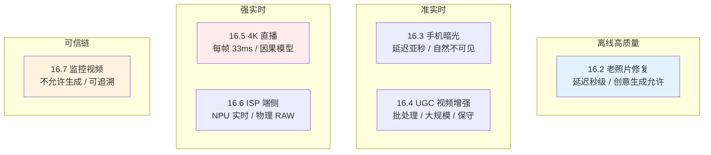
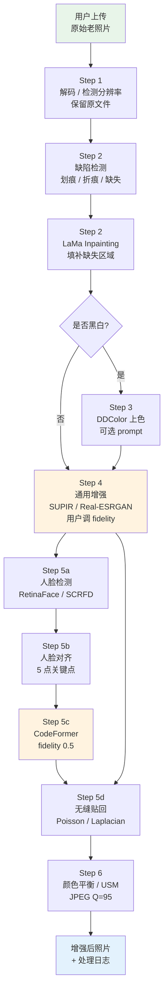
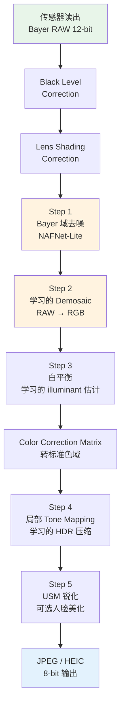
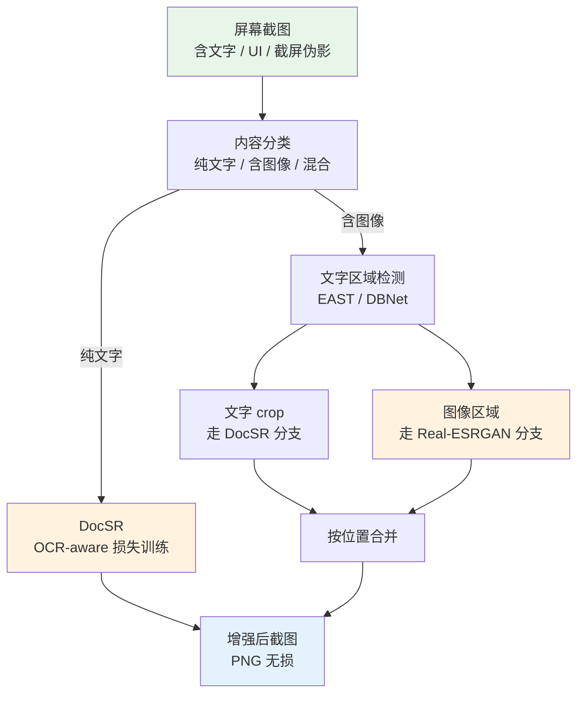
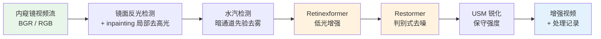

# 第 16 章 · 真实场景案例

> 孤立的单点算法优化无法直接兑现为稳定的工业级产品。
>
> 真正的生产级影像增强系统，是一条由前置内容路由、多分支特化网络、物理先验融合与后置编码对齐共同构建的高可用流水线。
>
> 本章系统剖析老照片修复、手机暗光计算摄影、大规模 UGC 批处理、4K 低延迟直播、传感器端侧 ISP 与司法医学高可信取证等六大工业落地案例。

## 16.0 章首铺垫

此前各章大多聚焦于单点技术的深度解析：从物理退化机理的逆向建模、高维表征空间的几何映射，到目标函数的梯度动力学、时序一致性约束与底层硬件编译加速。然而在真实的工业级生产环境中，没有单一模型能独立承载开放域工况的全部复杂性。一个能够稳定交付用户的商业化增强服务，必然是由前置分析、多分支路由、特化处理、局部融合、色调对齐及后置编码约束协同构建的完备系统。面对线上不可控的复杂退化输入，流水线必须在极其严苛的物理与算力边界下，稳定输出满足业务指标的高质量视听资产。

本章的核心目标在于：**针对具体业务场景与系统约束，将离散的算法组件编排为高可用、低成本的工程流水线**。读完本章，你将具备以下系统架构能力：

- 快速完成新业务场景的工程定性（离线高保真计算、移动端准实时、大规模批处理 UGC、低延迟直播流、硬件 ISP 嵌入式或高可信取证链）；
- 厘清各场景下关键约束的优先级（图像保真度、端到端延迟、并发吞吐与算力成本、物理可解释性），据此完成主干网络选型与模块拆解；
- 绘制端到端系统数据流拓扑图，精准识别单点失效风险并预置防御与保底分支；
- 摆脱盲目追随学术 Benchmark 榜首的定势，建立基于真实系统开销与画质收益的工程选型方法论。

**前置知识关联**：本章综合运用第 1 章的物理退化模型、第 2 章的表达空间映射、第 5 章的真实退化合成、第 9-10 章的生成式扩散模型与人脸特化先验、第 13-14 章的视频时序连续性以及第 15 章的端侧推理加速技术。

**核心术语速查**：

- **UGC**（User-Generated Content，用户生成内容）：由普通终端用户上传的非专业制作音视频数据；
- **ISP**（Image Signal Processor，图像信号处理器）：相机硬件系统内将传感器 Raw 测量值转换为标准 RGB 图像的软硬件处理链路；
- **HDR / SDR**（High/Standard Dynamic Range，高/标准动态范围）：分别指代宽动态范围与传统 8-bit 显示范围；
- **Bayer CFA**（Bayer Color Filter Array，拜耳彩色滤色阵列）：图像传感器表面最经典的 $2\times 2$（RGGB）滤色片排布结构；
- **NPU**（Neural Processing Unit，神经网络处理器）：移动与嵌入式端专用的低功耗 AI 推理加速单元；
- **NVDEC / NVENC**（NVIDIA Video Decoder / Encoder）：NVIDIA GPU 上的专用硬件视频解码与编码引擎；
- **OOD**（Out-Of-Distribution，分布外输入）：指超出模型训练数据覆盖流形的异常输入样本。

## 16.1 工业案例矩阵

本章每个案例均遵循标准的系统工程分析框架：

1. **业务场景定义**：输入数据特征与最终业务目标；
2. **关键系统约束**：画质要求、延迟上限、目标硬件与算力预算；
3. **端到端流水线（Pipeline）**：模块拓扑与中间数据流转；
4. **核心架构决策**：选型取舍与背后的系统逻辑；
5. **典型失效模式**：线上常见缺陷与防御预案。

六大核心案例与垂直特化分支覆盖了工业影像增强的主流形态：

```
16.2  老照片修复（消费级高画质离线处理）
16.3  暗光增强（手机计算摄影与准实时处理）
16.4  UGC 视频增强（高并发批处理流水线）
16.5  4K 直播实时增强（超低延迟 GPU 流式处理）
16.6  ISP 端侧增强（传感器级嵌入式 NPU 部署）
16.7  监控视频取证增强（高保真与可信溯源链）
16.7b 屏幕截图增强（高频文字与矢量 UI 修复）
16.7c 医学内窥镜增强（高可靠与物理可解释性处理）
```

各案例在“延迟约束 × 画质先验”坐标系中的系统分布如下：



## 16.2 案例：老照片修复

### 场景定义

用户上传数十年前拍摄的历史胶片或纸质照片（黑白或褪色泛黄、伴随严重物理划痕、胶片颗粒、水渍霉斑、折痕破损及人脸模糊），期望重构出接近现代高分辨率相机的细腻质感与自然色彩。

### 关键约束

- **离线异步计算模式**：允许单图处理耗时处于数秒量级；
- **质量第一原则**：用户对单次增强失败与明显伪影的容忍度极低；
- **身份一致性底线**：严禁过度先验幻觉导致历史人物面部拓扑失真。

### 端到端流水线设计

```
原始老照片输入
  ↓
┌────────────────────────────────────────┐
│ Step 1: 预处理与格式归一化               │
│ - 原始文件只读归档与元数据解析           │
│ - 无损解码至线性高精度张量工作空间         │
│ - 统计分辨率并自适应决策切片策略           │
└────────────────────────────────────────┘
  ↓
┌────────────────────────────────────────┐
│ Step 2: 物理缺陷结构修复                 │
│ - 划痕、霉斑与折痕区域检测（Mask 生成）   │
│ - 判别式补全模型（LaMa）填补缺失区域       │
└────────────────────────────────────────┘
  ↓
┌────────────────────────────────────────┐
│ Step 3: 色彩重构（针对黑白/褪色原图）      │
│ - 自动语义上色网络（DDColor）            │
│ - 注入色彩引导提示词（Prompt Tuning）     │
└────────────────────────────────────────┘
  ↓
┌────────────────────────────────────────┐
│ Step 4: 全局背景超分与纹理重建            │
│ - 扩散先验超分（SUPIR / Real-ESRGAN）    │
│ - 4× 超分辨率重建                       │
│ - 提供用户保真度（Fidelity）动态调节旋钮   │
└────────────────────────────────────────┘
  ↓
┌────────────────────────────────────────┐
│ Step 5: 人脸专项高保真修复               │
│ - 人脸检测与 5 点空间对齐（RetinaFace）  │
│ - 专用代码本先验修复（CodeFormer）        │
│ - 多尺度泊松/拉普拉斯金字塔无缝融合贴回     │
└────────────────────────────────────────┘
  ↓
┌────────────────────────────────────────┐
│ Step 6: 色彩校准与后处理                 │
│ - Lab 空间色偏抑制与直方图自适应匹配       │
│ - 可控反锐化掩模（USM）增强局部微对比度     │
│ - 高质量编码输出（JPEG Q=95 / PNG）      │
└────────────────────────────────────────┘
  ↓
输出增强后照片
```

### 数据流拓扑图



核心工程细节：

1. **破损补全必须严格前置于超分辨率**：先通过 Inpainting 消除物理折痕与缺失，避免超分网络将破损边缘误判为高频纹理予以非线性放大；
2. **人脸分支与背景分支解耦协同**：人脸裁切对齐取自原图以保留精准轮廓，修复后的人脸通过拉普拉斯金字塔多频段融合贴回至已完成超分的全局背景上；
3. **后置色彩拉回校准**：生成式模型（SUPIR、DDColor、CodeFormer）容易引入轻微全局色偏，在管线末端实施基于 Lab 空间的色相统计对齐。

### 核心架构决策

**Step 2 选用 LaMa 而非扩散 Inpainting**：
- LaMa（基于快速傅里叶卷积的大感受野补全模型）具备极高推理效率，在单张 4K 图像上处理耗时仅数百毫秒；
- 扩散 Inpainting 推理耗时过长且存在不可控的幻觉生成风险，易在纯背景破损区域凭空编造物体。

**Step 3 选用双解码器语义上色模型（DDColor）**：
- DDColor 具备良好的跨模态语义理解先验，可对老照片中的服饰、肤色与自然背景提供符合历史常识的色彩分布；
- 支持色彩引导提示词微调，允许根据照片年代定制色调风格。

**Step 4 暴露保真度调节旋钮（Fidelity Control）**：
- 将扩散模型的引导尺度、ControlNet 权重与代码本混合系数归一化为单一交互滑杆（如 0.0 代表强生成现代质感，1.0 代表严格保真原图颗粒感）；
- 业务线上 A/B 测试基准通常将默认值设定在 0.5-0.6 区间。

**Step 5 人脸独立对齐与金字塔融合**：
- 通用超分网络缺乏人脸专属几何先验，极易重构出面部扭曲；
- 采用 RetinaFace 提取 5 点关键点并仿射变换至 $512\times 512$ 标准流形，经 CodeFormer 重建后通过泊松融合或拉普拉斯金字塔融合平滑贴回，彻底消除拼接接缝。

### 典型失效模式与防御机制

- **多人合影边缘人脸漏检**：前置检测器漏检将导致局部人脸模糊。防御策略：组合高召回率的人脸检测算子，并在 UI 提供手动圈选补检功能；
- **极端侧脸与大角度遮挡**：人脸关键点对齐失败导致修复形变。防御策略：计算人脸姿态角（Yaw/Pitch），超出阈值时自动平滑回退至通用超分主干；
- **题字、印章与时代特征被抹除**：模型将印章误识别为杂色污渍并擦除。防御策略：提供用户交互遮罩（Mask），允许标注保留区域；
- **非典型人脸分布外（OOD）失真**：儿童或特定人种面部被修复为均值成人特征。防御策略：降低人脸先验权重，提高真实测量残差保留比例。

### 代表工业产品

- Topaz Photo AI / Gigapixel AI
- 腾讯 ARC 实验室人脸修复服务
- Microsoft Bringing Old Photos Back to Life 系列工程方案

## 16.3 案例：手机暗光增强

### 场景定义

在微光或夜间手持拍摄场景下，受限于移动传感器感光面积与曝光时间，原始图像面临光子信噪比极低、动态范围受限、细节严重湮没与色彩失真等物理瓶颈。业务目标是实现接近工业级旗舰机夜景模式的清透质感与纯净动态。

### 关键约束

- **端侧准实时交互**：快门触发后至相册预览呈现，整体延迟控制在 200 ms 以内（针对 1200 万像素图像）；
- **硬件算力受限**：部署于 Apple ANE 或移动端旗舰 NPU，显存与能耗预算紧凑；
- **视觉自然度要求高**：严禁出现过度涂抹或伪影，需保留真实的夜间光影层次。

### 端到端流水线设计

```
多帧 RAW 爆发连拍序列
  ↓
┌────────────────────────────────────────┐
│ Step 1: 多帧亚像素对齐与融合（HDR+）    │
│ - 连拍 4-8 帧短曝光图像                 │
│ - 亚像素光流估计与刚体运动补偿           │
│ - 局部曝光与信噪比加权时域聚合           │
└────────────────────────────────────────┘
  ↓
┌────────────────────────────────────────┐
│ Step 2: 动态色调映射（Tone Mapping）    │
│ - 将 14-bit 高动态范围映射至标准显示域    │
│ - 基于轻量 CNN 动态预测局部 3D-LUT      │
└────────────────────────────────────────┘
  ↓
┌────────────────────────────────────────┐
│ Step 3: 学习型传感器域降噪              │
│ - 部署端侧轻量 NAFNet 紧凑版本          │

│ - 结合实际传感器物理噪声参数（标定见 5.7）│
└────────────────────────────────────────┘
  ↓
┌────────────────────────────────────────┐
│ Step 4: 光源色温估计与色彩重构          │
│ - 学习型自动白平衡（AWB，映射至 D65）    │
│ - 色彩增强与局部饱和度调校               │
└────────────────────────────────────────┘
  ↓
┌────────────────────────────────────────┐
│ Step 5: 语义引导局部自适应增强          │
│ - 人脸区域轻量先验修复（GFPGAN-Lite）   │
│ - 显著文本与边缘结构适度锐化             │
└────────────────────────────────────────┘
  ↓
输出 8-bit RGB 图像
```

### 核心架构决策

**多帧物理积分优先于单帧强力去噪**：
- 单帧 ISO 6400 信号受光子散粒噪声（Shot Noise）强力主导，任何单帧算法在物理信息极度匮乏时强行去噪，均不可避免地导致高频纹理严重损失与蜡像假面感；
- 多帧融合本质上是通过时间维度的光子积分等效增加传感器曝光量。在空间对齐的前提下，多帧平均使独立同分布随机噪声的标准差严格按 $1/\sqrt{N}$ 比例衰减（8 帧融合信噪比理论提升近 9 dB），从物理观测源头直接提升了原始测量信噪比。

**选用门控卷积 NAFNet 替代自注意力骨干（Restormer）**：
- NAFNet 完全移除了显式 Self-Attention 矩阵乘法与复杂的非线性激活，仅保留门控线性单元（GLU）与标准深度可分离卷积，在端侧 NPU（如 Apple ANE 与高通 HTP）上能够实现 100% 的硬件内核卸载与极高的定点量化稳定性；
- 蒸馏至 100 万参数量级后，单帧 1200 万像素图像在端侧 NPU 上的推理耗时可稳定控制在 100 ms 左右。

**色彩校准置于核心管线位置**：
- 暗光环境下传感器 RGB 各通道信噪比极度失衡（蓝、红通道感光度偏低导致增益放大系数极大），传统自动白平衡极易发生严重色偏；
- 引入小型 CNN 联合估计场景环境光色温场与色彩校正矩阵（CCM），在 Bayer 域降噪完成后立即执行色彩空间矫正，确保肤色与夜间环境光照的自然过渡。

### 典型失效模式与防御机制

- **快速运动与手抖导致的对齐失效**：多帧融合阶段出现重影与鬼影边缘。防御策略：计算局部光流一致性残差，残差超出置信阈值的区域自适应降低历史帧加权，平滑回退至以当前参考帧为主的单帧局部去噪；
- **极限暗光（照度低于 1 lux）**：光子到达率极低，多帧平均仍无法提取有效结构。防御策略：向相机 UI 触发长曝光支撑提示，或通过轻量语义先验引导生成基础轮廓；
- **复杂混合光源干扰**：画面中同时存在高色温冷光霓虹灯与低色温暖光路灯，全局单一白平衡失效。防御策略：采用像素级空间变化的 2D 色彩增益图替代全局标量矩阵。

### 代表工业产品

- Apple iPhone Night Mode / Photonic Engine
- Google Pixel Night Sight
- 华为 XMAGE 与小米计算摄影夜景系统

## 16.4 案例：UGC 视频增强（短视频平台）

### 场景定义

短视频平台每日接收数以百万计的用户生成视频。原始视频大多经过手机端随手录制、第三方剪辑软件多轮导出与即时通讯软件的二次压缩，伴随严重的宏块效应（Macroblocking）、模糊、蚊状噪声与边缘振铃伪影。平台需在云端转码集群中，以极低的单路成本全自动提升画质并统一重新编码下发。

### 关键约束

- **海量大规模离线批处理**：日均处理规模达百万级视频，单条视频增强耗时需在转码队列中几分钟内完成；
- **算力成本高度敏感**：单路视频增强的 GPU 算力成本需严格控制在分分钱量级；
- **视觉保真原则**：在消除压缩瑕疵并提升清晰度与微对比度的同时，严禁改变原视频的艺术色调，严禁引入帧间高频闪烁。

### 端到端流水线设计

```
原始 720P @ 30fps 输入流
  ↓
┌────────────────────────────────────────┐
│ Step 1: 视频前置内容分析与路由           │
│ - 内容语义分类（人像、风光、二次元、微课）│
│ - 无参考画质评估（NR-IQA 打分筛查）     │
│ - 高画质片段直通（Bypass）策略决策       │
└────────────────────────────────────────┘
  ↓
┌────────────────────────────────────────┐
│ Step 2: 时序去噪与去压缩伪影            │
│ - 紧凑版 BasicVSR++（因果/微缓冲分支）  │
│ - 时序一致性正则约束                     │
└────────────────────────────────────────┘
  ↓
┌────────────────────────────────────────┐
│ Step 3: 分辨率上采样至 1080P            │
│ - 1.5× 局部保真超分辨率                  │
│ - 消除编码块边缘与高频蚊状噪声           │
└────────────────────────────────────────┘
  ↓
┌────────────────────────────────────────┐
│ Step 4: 自适应色彩与动态范围扩展        │
│ - 场景自适应 3D-LUT 调色                │
│ - 保守的局部对比度增强                   │
└────────────────────────────────────────┘
  ↓
┌────────────────────────────────────────┐
│ Step 5: 内容自适应重新编码               │
│ - 基于硬件 NVENC 的高效 H.265 / AV1 编码│
│ - 基于感知质量（CRF / VMAF）动态分配码率│
└────────────────────────────────────────┘
  ↓
输出 1080P @ 30fps 增强视频
```

### 核心架构决策

**采用 1.5× 适度超分而非盲目 4× 放大**：
- 在移动端播放场景下，将 720P 提升至 1080P 已能完美匹配绝大多数移动视网膜屏幕的像素密度需求；
- 4× 超分的输出像素量是输入的 16 倍，而 1.5× 仅增加 2.25 倍计算负荷，两者的算力与显存带宽开销相差近一个数量级；
- 消除压缩宏块后的 1080P 画面在主观感知上已具备极高的清透感与锐度。

**选用时序循环网络（BasicVSR++ 变体）而非生成扩散模型**：
- 逐帧独立采样的扩散超分在连续帧间极易出现亚像素纹理的随机跳变，产生严重的视觉闪烁与“沸腾”感；
- BasicVSR++ 借助双向时序传播与光流对齐实现了优异的时序稳定性，在 A100 上单帧 720P 处理耗时低于 50 ms，具备规模化云端部署的成本可行性。

**前置质量初筛与旁路直通机制（Bypass）**：
- 部署轻量级无参考质量评估模型（如 MANIQA-Lite），对画质本身优良的原片直接跳过超分与降噪网络，仅执行标准转码，大幅削减云端算力消耗并避免对优质片源造成非预期平滑。

### 典型失效模式与防御机制

- **动漫与平涂线条被误作为自然场景处理**：通用自然模型会破坏平涂色块与硬朗边缘线。防御策略：前置分类器检测二次元内容，自动路由至专属动漫超分分支（如 Real-CUGAN）；
- **大运动剧烈摇镜与镜头转场**：光流估计错误诱发几何撕裂与拉丝。防御策略：切镜转场处瞬时重置时序状态，并在大位移区域主动降低时序融合权重；
- **原生 HDR 内容格式混淆**：SDR 统计模型导致画面高光溢出与色彩断层。防御策略：解析视频流元数据，对 HDR10 / Dolby Vision 视频实施专属的色调映射与宽色域处理分支。

### 代表工业产品

- 抖音 / TikTok 视频云端画质增强流水线
- YouTube 自动化视频转码与超分系统
- 哔哩哔哩（Bilibili）高清修复与二次元画质增强引擎

## 16.5 案例：4K 直播实时增强

### 场景定义

在超高清低延迟直播业务中，流媒体分发节点需将主播推送的 1080P 实时视频流即时超分至 4K（3840×2160），向终端用户提供超清、流畅且低延迟的直播推流服务。

### 关键约束

- **极高帧率吞吐**：单帧全链路处理延迟必须严格控制在 33 ms 以内（满足 30 fps 实时流畅播放）；
- **端到端超低时延**：增强模块引入的确定性时延需低于 100 ms，确保音视频互动实时性；
- **单卡多路并发**：单张 NVIDIA A100/H100 必须支撑 4 至 6 路并发增强流以分摊带宽与硬件成本；
- **工业级长周期稳定性**：服务需具备连续运行数十小时无内存泄漏与显存抖动的工业级鲁棒性。

### 端到端流水线设计

```
1080P @ 30fps 直播 RTMP / SRT 输入流
  ↓
┌────────────────────────────────────────┐
│ Step 1: 全硬解码（NVIDIA NVDEC）        │
│ - GPU 片上硬件直接解码 H.264/H.265 码流 │
│ - 像素张量保留在 GPU 显存，规避 CPU 拷贝│
└────────────────────────────────────────┘
  ↓
┌────────────────────────────────────────┐
│ Step 2: 流式实时超分辨率与去噪          │
│ - 蒸馏版 BasicVSR-Mini 因果网络         │
│ - TensorRT FP16 深度编译与内核融合      │
│ - 严格纯因果架构（仅依赖历史隐状态）    │
└────────────────────────────────────────┘
  ↓
┌────────────────────────────────────────┐
│ Step 3: 全硬编码（NVIDIA NVENC）        │
│ - GPU 片上硬件直接编码为 4K H.265 码流  │
│ - 码率自适应控制与推流打包              │
└────────────────────────────────────────┘
  ↓
4K @ 30fps 超清直播流输出
```

### 核心架构决策

**模型蒸馏与 TensorRT 联合加速**：
- 原始 BasicVSR++ 单帧耗时约 50 ms，无法满足 30 fps 单流实时性要求；
- 通过特征蒸馏缩减通道数并将主干精简为 BasicVSR-Mini（单帧耗时降至 18 ms），进一步经由 TensorRT FP16 算子融合与 Kernel 硬件调优，将单帧前向耗时压减至 8 ms，实现单卡并发承载 4 至 6 路 1080P 到 4K 的实时流。

**坚持纯因果（Causal）时序拓扑**：
- 彻底放弃依赖未来帧的双向对齐机制，消除多帧前瞻引入的播放缓冲延迟；
- 虽然画质指标相比离线非因果模型略微回落约 0.3 dB，但成功将处理时延控制在 0 额外等待帧。

**全链路 GPU 片上张量直通（Zero-Copy Pipeline）**：
- 码流由 NVDEC 硬件解码后直接驻留于 CUDA 显存，超分后的 4K 张量直接送入 NVENC 硬件编码器，彻底规避 PCIe 主机内存与显存之间的大带宽搬运瓶颈。

### 典型失效模式与防御机制

- **镜头突然切镜（Scene Cut）诱发鬼影**：前一场景的历史状态在切镜后污染新画面。防御策略：集成极轻量帧差检测模块，一旦捕获转场信号即时重置模型内部循环隐状态：

```python
def detect_scene_change(prev_frame: torch.Tensor, curr_frame: torch.Tensor, threshold: float = 0.3) -> bool:
    """基于轻量张量均值差异的转场快速判定。"""
    diff = (prev_frame - curr_frame).abs().mean()
    return bool(diff > threshold)

# 流式处理执行主循环
for frame in video_stream:
    if detect_scene_change(prev_frame, frame):
        model.reset_hidden_state()  # 触发隐状态瞬时清零
    enhanced_frame = model(frame)
    prev_frame = frame
    yield enhanced_frame
```

- **上行网络丢包抖动引起输入帧到达不均**：导致处理队列积压。防御策略：设置动态跳帧与旁路直通降级阈值，优先保障音画同步与推流连贯性。

## 16.6 案例：ISP 端侧增强

### 场景定义

在智能手机成像链路中，厂商期望在相机底层 ISP（图像信号处理器）硬件流水线阶段直接介入神经网络增强，实现拍照成像在色彩纯净度、高动态范围与暗部细节上超越竞品，而非依赖耗时漫长的系统相册后处理。

### 关键约束

- **传感器原始 RAW 输入**（非标准 RGB）：RAW 格式记录了传感器光电二极管测得的、尚未经过去马赛克与色彩校正的原始光强数据，通常采用 **Bayer 彩色滤色阵列（CFA）**排布。Bayer 阵列以 $2\times 2$ 区块为单位（RGGB），其中绿色占两个位置以匹配人眼视网膜对绿光敏感度最高的生理特性；
- **多摄像头光学异构性**：主摄、超广角、潜望长焦在传感器尺寸、光学畸变、暗角及噪声分布上差异巨大；
- **端侧异构 NPU 部署**：面向高通 Hexagon、华为 NPU、苹果 ANE 等芯片，必须针对各硬件专属算子集进行定制编译与定点量化；
- **毫瓦级极限功耗预算**：单次拍照计算能耗需控制在数十毫焦以内，严防发热降频。

### 端到端流水线设计

```
传感器 12-bit Bayer RAW 原始数据
  ↓
┌────────────────────────────────────────┐
│ Pre-processing 传统校准阶段            │
│ - 黑电平校正（Black Level Correction）  │
│ - 镜头阴影/暗角校正（Lens Shading）     │
└────────────────────────────────────────┘
  ↓
┌────────────────────────────────────────┐
│ Step 1: Bayer 域学习型降噪              │
│ - 针对独立同分布散粒与读出噪声建模       │
│ - 部署端侧极简 NAFNet-Lite 结构         │
└────────────────────────────────────────┘
  ↓
┌────────────────────────────────────────┐
│ Step 2: 学习型去马赛克（Demosaicing）   │
│ - 替代传统插值，消除拉链状色斑（Zipper） │
│ - 端侧轻量 CNN：Bayer → 全分辨率 RGB     │
└────────────────────────────────────────┘
  ↓
┌────────────────────────────────────────┐
│ Step 3: 白平衡与颜色校正矩阵（CCM）     │
│ - 学习型光源色温估计                     │
│ - 转换至目标标准色域（sRGB / Display P3）│
└────────────────────────────────────────┘
  ↓
┌────────────────────────────────────────┐
│ Step 4: 局部色调映射与 HDR 压缩         │
│ - 宽动态范围压缩至显示标准               │
│ - 保持高光细节与阴影层次                 │
└────────────────────────────────────────┘
  ↓
┌────────────────────────────────────────┐
│ Step 5: 自适应锐化与可选人像美化         │
│ - 局部反锐化掩模（USM）增强微对比度     │
│ - 人脸美颜分支（提供系统设置物理开关）   │
└────────────────────────────────────────┘
  ↓
输出 8-bit JPEG / HEIC 图像
```

### ISP 端到端数据流拓扑



**关键物理数据流规律**：**Bayer 域降噪必须严格前置于去马赛克（Demosaicing）算子**。在 Bayer 原始测量域中，传感器光电二极管测得的散粒噪声与读出噪声服从空间与通道独立的泊松-高斯混合分布（Poisson-Gaussian）；一旦经过色彩插值（Demosaicing），噪声将被扩散为跨通道强相关且空间高度非平稳的复杂色斑，使后续去噪难度呈指数级攀升。

### 核心架构决策

**学习型去马赛克（Demosaicing）替代传统局部同质性插值（AHD）**：
- 传统插值算法在接近 Nyquist 空间采样极限频率的高频边缘处，极易产生刺眼的拉链状伪影（Zipper Artifacts）与伪彩色；
- 学习型 CNN 能结合自然图像空间先验实现去马赛克与去噪一体化，但模型参数必须针对具体传感器的滤色片光谱透过率（CFA Spectral Transmittance）进行单独微调。

**端侧毫瓦级极限功耗预算控制**：
- 手机端连续拍摄需控制在数十毫焦以内的单帧能耗预算，严防长周期连续拍摄引发芯片发热降频；计算图必须严格匹配目标 NPU（高通 QNN、苹果 ANE、联发科 APU）的专用算子白名单与 8 位定点量化对齐要求。

**人像美化分支提供强制系统级开关**：
- 满足全球不同司法管辖区的合规与隐私政策（如欧盟 GDPR 对生物特征处理的严格限制），在相机设置中提供纯物理原画与自适应美化模式的物理切换。

### 典型失效模式与防御机制

- **光学模组与传感器批次迭代**：新模组透镜暗角或光谱响应漂移导致模型色彩与对比度异常。防御策略：建立自动化传感器物理标定管线，硬件模组换代时迅速基于标定数据执行权重微调回归；
- **直射阳光与极端逆光（OOD 极限场景）**：强光饱和溢出导致色调映射发生伪高光边缘断层。防御策略：设置基于传统物理曝光直方图统计的硬编码保底模式。

### 代表工业产品

- 高通 Snapdragon Spectra ISP
- 苹果 Photonic Engine
- 华为 XMAGE 影像计算架构
- Google Pixel Tensor ISP 摄影管线

## 16.7 案例：监控视频取证增强（安防司法）

### 场景定义

针对公共安全与司法调查中的低质量监控视频（远距离夜视、高压缩损失、低帧率），在确保物理证据链绝对真实可信的前提下，最大化恢复关键目标（人脸拓扑轮廓、车辆号牌、衣着细节）的可辨识度。

### 关键约束

- **绝对禁止虚构细节（Zero-Hallucination 零幻觉底线）**：司法证据严禁使用生成式扩散或高自由度 GAN 凭空编造不存在的高频纹理；
- **计算全流程确定性与可追溯性**：每个算子处理步骤与参数配置必须可复现、可审计、数学确定；
- **数字可信溯源链校验**：原始视频流与处理后成果必须具备不可篡改的密码学哈希签名。

### 端到端流水线设计

```
原始低质量监控视频
  ↓
┌────────────────────────────────────────┐
│ Step 1: 数字存证与密码学签名             │
│ - 计算原始文件 SHA-256 哈希值           │
│ - 写入可信时间戳与防篡改日志             │
└────────────────────────────────────────┘
  ↓
┌────────────────────────────────────────┐
│ Step 2: 纯判别式超分辨率（严禁扩散模型） │
│ - 基于 HAT / SwinIR 判别式主干         │
│ - 仅在真实物理退化数据集上微调          │
│ - 限制超分倍率为保守的 1.5× 至 2×       │
└────────────────────────────────────────┘
  ↓
┌────────────────────────────────────────┐
│ Step 3: 保守型频域降噪                  │
│ - 保留微弱高频信号，宁可存留颗粒噪点     │
│ - 严禁过度平滑导致微弱边缘断裂           │
└────────────────────────────────────────┘
  ↓
┌────────────────────────────────────────┐
│ Step 4: 兴趣区域（ROI）定向目标增强      │
│ - 人工交互或检测器标定车牌 / 面部区域   │
│ - 引入 OCR 语义保真度损失增强文字可辨度  │
└────────────────────────────────────────┘
  ↓
┌────────────────────────────────────────┐
│ Step 5: 审计日志与存证报告导出           │
│ - 记录完整算子版本、配置文件与环境哈希   │
│ - 输出带有数字签名的增强成果与取证报告   │
└────────────────────────────────────────┘
  ↓
增强视频 + 司法取证可信审计日志
```

### 核心架构决策

**严禁引入生成式扩散模型与自由 GAN**：
- 扩散模型在面对严重模糊时会根据隐空间分布强行“脑补”看似合理的车牌字符或人脸五官，这在法庭质证中构成致命的伪证风险；
- 必须采用确定性映射的判别式 CNN 或 Transformer，确保网络输出严格由输入像素观测与真实退化逆变换所界定。

**超分倍率设定为保守的 1.5× 至 2×**：
- 4× 及以上超分辨率在严重欠采样输入下数学反问题严重不适定（Ill-posed），判别式模型也会趋于平均化模糊；适度倍率专注于恢复已有边缘阶跃响应与去模糊。

**面向车牌与字符的 OCR-Aware 拓扑增强**：
- 引入 OCR 文本识别分支的中间层特征监督损失（详见第 10 章），迫使网络优先还原笔画与数字的拓扑连通性。

### 典型失效模式与防御机制

- **极端欠采样（目标区域不足 15 像素）**：信息论意义上有效熵过低，物理上已无有效信号。防御策略：系统直接标记为“不可信区域”，禁止强制输出猜测性图像；
- **极度低照度与强噪点混合**：去噪与微弱轮廓恢复冲突。防御策略：提供多档平滑参数对比视窗，由专业司法鉴定人员人工复核。

## 16.7b 案例：屏幕截图与电子文档增强

### 场景定义

用户在低分辨率屏幕上截取包含高频文字、网页排版、矢量 UI 或 PPT 幻灯片的图像，在多次社交软件压缩后产生严重的文字边缘模糊、振铃伪影与摩尔纹。目标是重构出边缘锐利、字迹清晰的无损文档级图像。

### 关键约束

- **字符拓扑零失真**：汉字笔画、英文连字符与标点符号必须绝对准确，严禁形似字混淆；
- **矢量 UI 边缘平直性**：线条、按钮与图标必须保持纯色平涂与平直轮廓；
- **亚秒级交互响应**：适用于移动端即时分享与扫描预览。

### 数据流拓扑图



### 核心架构决策

**必须输出 PNG 无损格式而非 JPEG**：
- 屏幕截图中包含大量阶跃式的高频硬边缘，JPEG 编码采用的离散余弦变换（DCT）量化会在文字边缘产生严重的蚊状振铃噪点与色彩断层。

**文档区域与自然图像区域解耦分流**：
- 采用文字检测网络（如 DBNet）分离文字图层与自然插图图层：文字区域走基于 OCR 拓扑损失训练的 DocSR 专用模型，自然图像插图走通用超分分支，最终通过空间坐标对齐高保真合成。

## 16.7c 案例：医学内窥镜手术影像增强

### 场景定义

在微创手术（胃肠镜、腹腔镜、关节镜）过程中，受限于体内有限照明与探头尺寸，画面存在局部高光镜面反射、体温水汽镜头雾化、暗区照度不足及术中运动模糊。系统需实时增强组织微血管纹理与病灶边缘边界。

### 关键约束

- **临床零伪影容忍（Clinical Zero-Artifact）**：严禁伪造任何血管纹理或组织形变，彻底杜绝误诊风险；
- **术中实时与术后复审双轨制**：术中实时流端到端延迟要求 $\le 100\text{ ms}$（支持高帧率手术操作）；术后复审允许离线高精度多级级联处理；
- **物理与医学可解释性**：算法各模块需具备清晰的光学物理机理对应。

### 数据流拓扑图



### 核心架构决策

**光学退化分阶段解耦治理**：
- 针对组织表面强反光，采用物理亮度阈值快速检测并执行有限判别式 Inpainting；针对水汽雾化，采用经典的暗通道先验（Dark Channel Prior）算法无监督去雾，保证物理过程完全透明可控。

**选用 Retinexformer 物理先验网络**：
- 将图像严谨解耦为反射分量（组织固有微血管纹理）与光照分量（内窥镜探头光源场），在增强暗区光照的同时避免破坏微血管的相对对比度结构。

## 16.8 工业系统架构通用准则

从上述工业实践中可凝练出五项跨场景工程铁律：

### 1. 不存在全能的“万能模型”

- 离线老照片修复选用生成式扩散超分（SUPIR）；
- 直播推流首选轻量因果时序卷积（BasicVSR-Mini）；
- 安防与医学严禁生成模型，严格限定于物理先验判别式架构；
- 手机端侧核心在于无算子回退的极简残差拓扑（NAFNet）。

### 2. 流水线协同设计优于单点模型优化

工业系统的竞争力体现在“检测路由、前置分流、特化增强、后置色彩与编码对齐”的完备拓扑中，单点算法的微弱优势远不如稳健的多级保底架构重要。

### 3. 用户可控性是产品交付的前提

将复杂的超分步数、引导系数、先验强度归一化为直观的保真度（Fidelity）控制滑杆，把审美选择权交还用户。

### 4. 异常防御机制决定系统成败

系统 95% 的稳定性建立在对 5% 异常输入（极端光照、严重压缩、大运动切镜）的优雅退化（Graceful Degradation）与旁路直通（Bypass）策略上。

### 5. 闭环质量迭代驱动

通过线上长尾 Bad Case 的持续捕获、清洗与入库，构建专门针对特定退化分布的对抗性评测回归集。

## 16.9 工业落地常见反模式

在工程实践中需高度警惕以下典型错误：

1. **盲目搬用学术 Benchmark 榜首**：学术 SOTA 往往建立在理想退化假设与重型计算图之上，直接上线极易发生分布漂移劣化与延迟崩塌；
2. **忽视高频特殊场景**：仅针对自然风景训练，在面对字幕、水印、印章或复杂 UI 时引发严重伪影；
3. **脱离算力成本评估模型**：在毫秒级低成本业务中强行加载扩散或大尺度注意力模型导致服务不可用；
4. **忽略推理引擎算子精度对齐**：仅在 PyTorch 环境验证通过，未对 TensorRT / CoreML 量化产物实施端到端回归测试；
5. **脱离显示终端单纯追求 PSNR**：忽略人眼对色彩平衡与对比度的偏好，过度平滑导致主观感知体验下降。

## 16.10 本章小结

1. **系统工程决定交付品质**：影像增强不是单模型调用，而是由多分支检测、特化处理与后置校准构成的有机系统；
2. **老照片修复**：采用扩散先验（SUPIR）与人脸先验（CodeFormer）协同解耦修复；
3. **手机暗光计算摄影**：以多帧物理积分（HDR+）为基石，结合 NAFNet 端侧降噪与 AWB 色彩校准；
4. **大规模 UGC 视频增强**：前置质量初筛，以 1.5× 适度超分与时序循环模型兼顾画质与算力成本；
5. **4K 直播实时增强**：依托纯因果时序模型与全链路 GPU 片上编解码直通实现亚 10 ms 级极限延迟；
6. **手机端侧 ISP**：深耕 Bayer 原始测量域去噪与学习型去马赛克一体化；
7. **安防司法与医学临床**：坚守零伪构（Zero-Hallucination）原则，严格采用可溯源的判别式物理先验；
8. **防御设计至上**：把“不使原图变差”作为影像增强系统上线的第一准则。

---

> 下一章 [失败案例集](17-failures.md) → 深入剖析模型在生产环境中的典型失效模式：幻觉编造、对抗噪声放大、身份漂移、视频闪烁与量化崩溃。
