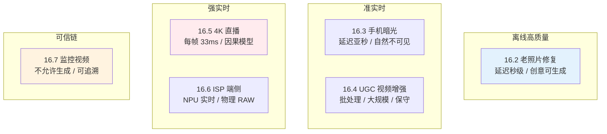
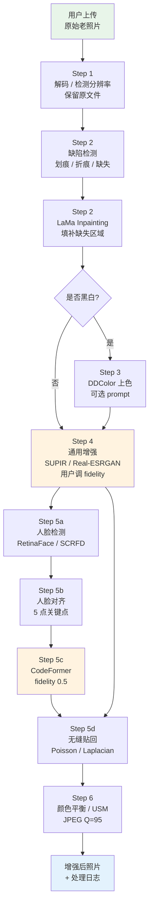
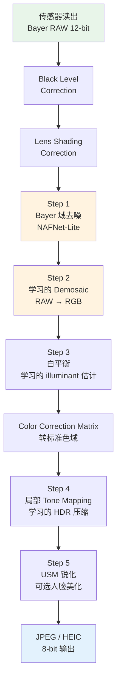
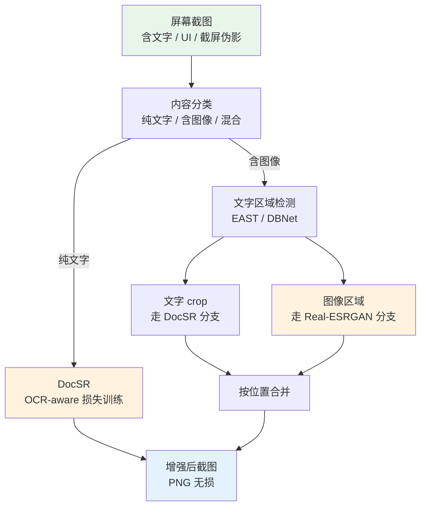
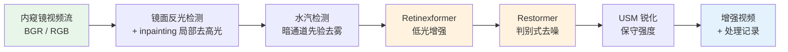

# 第 16 章 · 真实场景案例

> 前 15 章讲了模型、损失、数据、训练、部署。
>
> 这一章把这些内容**应用到具体场景**：每个案例给出完整的工程 pipeline 和决策依据。
>
> 这是这本书最接近"产品手册"的一章。

## 16.0 章首铺垫

到这里为止，本书的章节多数处在"局部最优"视角：第 6-7 章讲单个网络架构如何编码先验，第 11-12 章讲一次训练循环如何稳定收敛，第 15 章讲一次推理调用如何在硬件上跑得动。但任何真正交付给用户的影像增强系统，都不是一个模型对应一个调用，而是**一条由多个模型、多个判别分支、多个保底路径组成的流水线**。这条流水线接受一个不可控的输入（用户随手扔进来的图或一段视频），通过若干检测、路由、特化处理、融合、后期颜色与编码控制，输出一个可以放回产品中的结果。

这一章回答的问题是：**给定一个具体的业务场景，如何把前面章节里那些零散的工具拼成一条能上线的 pipeline**。读完这一章你应当能：

- 拿到一个新的影像增强需求，能先识别它属于哪一类场景（离线消费产品、端侧实时、批处理 UGC、低延迟流媒体、传感器内嵌、可信链监控）
- 针对该场景，能列出关键约束的优先级（质量、延迟、成本、可解释性），并据此选定主干模型与配套模块
- 能画出端到端流程图，识别出每一步的失败点与对应的保底分支
- 不会把学术 benchmark 第一名直接搬上线，而是用本章给出的取舍框架做工程选型

**前置知识。** 本章假设读者已经看完第 1 章的退化模型、第 2 章的表达空间、第 5 章的退化合成、第 9-10 章的扩散派与人脸特化、第 13-14 章的视频与时序、第 15 章的部署优化。每个案例引用相关章节时会显式给出节号。

**术语速查。** 本章会反复出现以下缩写，第一次出现时会给全称，这里先列一份索引方便回查：

- **UGC**（User-Generated Content，用户生成内容）：相对于专业制作内容（PGC）而言，由普通用户上传的图片或视频
- **ISP**（Image Signal Processor，图像信号处理器）：相机内部把传感器原始读数变成可见图像的整套硬件加软件流水线
- **HDR**（High Dynamic Range，高动态范围）：能表达比标准 8-bit 显示更宽亮度范围的图像或视频
- **SDR**（Standard Dynamic Range，标准动态范围）：传统 8-bit 显示对应的亮度范围
- **Bayer**（拜耳阵列）：彩色传感器上最常见的滤色片排布，每 2×2 区域排列成 RGGB（红绿绿蓝）
- **CFA**（Color Filter Array，彩色滤色阵列）：Bayer 是其中一种具体方案
- **NPU**（Neural Processing Unit，神经网络处理器）：手机/嵌入式平台上专用于跑神经网络的硬件加速器，如苹果 ANE、华为达芬奇、高通 Hexagon
- **NVDEC / NVENC**（NVIDIA Video Decoder / Encoder，英伟达 GPU 的硬件视频解码器/编码器）：在 GPU 上不经过 CPU 直接解/编 H.264、H.265 等码流
- **OCR**（Optical Character Recognition，光学字符识别）：把图像里的文字识别成可编辑字符的任务
- **A/B 测试**：把用户随机分成两组分别用不同版本，对比指标差异决定是否上线新版本
- **OOD**（Out-Of-Distribution，分布外）：输入落在训练分布之外的区域，模型在这种输入上的行为不可预测

## 16.1 这一章的结构

每个案例包含：

1. **场景描述**：用户是谁、想解决什么问题
2. **关键约束**：质量、速度、设备、成本
3. **完整 pipeline**：从输入到输出
4. **关键决策**：每一步为什么这样选
5. **失败模式**：实际部署中遇到的典型问题

六个案例：

```
16.2  老照片修复（消费产品）
16.3  暗光增强（手机摄影）
16.4  UGC 视频增强（短视频平台）
16.5  4K 直播实时增强
16.6  ISP 端侧增强（手机后处理）
16.7  监控视频增强（安防）
```

这六个案例覆盖了影像增强落地的几乎所有典型形态。可以把它们粗略地放在"延迟约束 × 质量约束"两个轴上：



把这张结构图记在心里，再去读后面六节，每节其实都是同一个问题在不同约束下的不同答案：**你打算给模型多大的发挥空间？**

## 16.2 案例：老照片修复

### 场景

用户有一张几十年前的照片：黑白或泛黄、有划痕、人脸糊不清、可能有褶皱。希望恢复成"看起来现代相机拍的"。

### 关键约束

- **离线处理**：用户上传后等几秒可以接受
- **质量优先**：失败一次就不会再用
- **不能太"创意"**：人脸要像同一个人

### Pipeline

```
原始老照片
  ↓
┌────────────────────────────┐
│ Step 1: 通用预处理          │
│ - 保留原文件不修改           │
│ - 解码到无损工作格式         │
│   (PNG/TIFF 或 tensor)      │
│ - 检测分辨率, 决定后续策略    │
└────────────────────────────┘
  ↓
┌────────────────────────────┐
│ Step 2: 局部缺陷修复        │
│ - 划痕 / 折痕 / 缺失检测     │
│ - 用 inpainting 模型补全     │
│   (LaMa / StableDiffusion-Inpaint) │
└────────────────────────────┘
  ↓
┌────────────────────────────┐
│ Step 3: 上色 (如黑白)       │
│ - DeepRemaster / DDColor     │
│ - 用户可选风格 prompt        │
└────────────────────────────┘
  ↓
┌────────────────────────────┐
│ Step 4: 通用增强 (背景)     │
│ - SUPIR / Real-ESRGAN       │
│ - 4× 超分                   │
│ - 用户可调 fidelity         │
└────────────────────────────┘
  ↓
┌────────────────────────────┐
│ Step 5: 人脸专项 (检测人脸) │
│ - face detector             │
│ - 每张人脸用 CodeFormer      │
│   fidelity_weight = 0.5     │
│ - 贴回原图位置               │
└────────────────────────────┘
  ↓
┌────────────────────────────┐
│ Step 6: 后处理              │
│ - 颜色平衡 (Lab 空间)        │
│ - 锐化 (USM, 强度可调)       │
│ - 高质量 JPEG 输出 (Q=95)   │
└────────────────────────────┘
  ↓
增强后的照片
```

### Pipeline 数据流图

把上面 6 步画成端到端图，可以更清楚地看到主分支与人脸子分支的关系：



注意几个关键的工程细节：

1. **Step 2 的 inpainting 与 Step 4 的通用增强是串行的，不是并行**：必须先把缺失结构补齐，再让通用 SR 工作在一个完整的图上，否则 SR 会把"破损"当成纹理放大
2. **Step 5 的人脸子分支与主分支共享同一个增强后的背景**：人脸 crop 来自原图（保证清晰边界与对齐），增强后贴回到 SR 输出（保证背景已被处理）
3. **Step 6 的颜色平衡放在所有生成式步骤之后**：因为 SUPIR、DDColor、CodeFormer 都可能引入色调漂移，最后统一拉回（见 17.9 节）

### 关键决策

**Step 2 用 LaMa 不用扩散 inpainting**：
- LaMa（Large Mask inpainting，使用快速傅里叶卷积的大掩码补全模型）速度快、对小划痕效果好，单张 4K 图在 A10 上几百毫秒
- 扩散 inpainting 慢且容易"创造"内容，可能在没有人物的位置补出半张脸，这种"惊喜"在老照片场景里是事故

**Step 3 上色用 DDColor**：
- DDColor（Dual Decoder Colorization，双解码器自动上色，2023）在 ImageNet 与 COCO 上预训练，对老照片中常见的人物、服饰、室内场景有合理先验
- 用户可选 prompt（如"sepia tone"、"natural daylight"）控制整体色调，避免模型把所有照片都修成同一种现代调

**Step 4 给用户调 fidelity**：
- 0.3：充分利用扩散先验，老照片质感被替换成"现代质感"
- 0.7：保留原照片的颗粒、年代感
- 不同用户偏好不同，不能写死。后台 A/B 测试常见默认在 0.55 附近
- 这里的 "fidelity" 是产品层为"保真-生成"权衡对用户暴露的一个抽象旋钮，不是某个模型的字面参数。CodeFormer 确实有单一的 fidelity 权重 `w`，但 SUPIR 并没有对应的单一参数，它的保真-生成平衡由 control_scale、s_stage2 等多个控制量共同决定，产品侧把这些量归一化成一根滑杆再暴露给用户

**Step 5 face crop 单独处理**：
- 通用 SR 在人脸上效果差（第 10 章），因为人脸先验与自然图像先验差别很大
- 检测出人脸，对齐到 CodeFormer 训练时使用的 512×512 标准位置，过模型后再用 Poisson blending 或 Laplacian pyramid blending 贴回，避免出现"接缝"
- fidelity_weight = 0.5：身份保留与适度生成的平衡点。这个值是经过人评 A/B 测试得到的产品默认，并非论文推荐

### 失败模式

- **多人脸场景**：检测漏掉某些人脸，那些脸糊
- **侧脸或极端角度**：人脸检测器失效，CodeFormer 的对齐前提不成立
- **老照片有印章或题字**：模型当作"瑕疵"修掉了
- **服饰图案**：模型修补成"现代风"，时代感丢失
- **多人脸合影里某些人脸 OOD**（Out-Of-Distribution，分布外，如儿童、老人、非欧美人种）：CodeFormer 修复结果"看起来像别人"，详见 17.11 节

应对：UI 给用户**手动选择重点修复区域**，而不是全自动；并在结果页明确标注"AI 修复结果可能与原始细节有差异"。

### 代表产品

- Topaz Photo AI
- Tencent ARC（基于 GFPGAN/CodeFormer）
- Microsoft Bringing Old Photos Back to Life

## 16.3 案例：手机暗光增强

### 场景

晚上拍的照片偏暗、噪声大、色彩失真、动态范围低。用户希望"看起来像 iPhone 夜景模式"。

### 关键约束

- **端侧实时**：拍完立刻看到结果
- **iPhone 14 ANE**：< 200ms / 12MP 图
- **不允许"修过"的痕迹**：用户期望"自然好"

### Pipeline

```
RAW / 多帧 RGB
  ↓
┌────────────────────────────┐
│ Step 1: 多帧融合 (HDR+)    │
│ - 拍照时连拍 4-8 张         │
│ - 帧间对齐 (光流)           │
│ - 平均 + 加权 (亮度自适应)   │
└────────────────────────────┘
  ↓
┌────────────────────────────┐
│ Step 2: Tone mapping       │
│ - 把高动态范围压到 8-bit    │
│ - 学习的 LUT (轻量 CNN 预测)│
└────────────────────────────┘
  ↓
┌────────────────────────────┐
│ Step 3: 去噪              │
│ - 端侧 NAFNet 小版本        │
│ - 物理噪声模型 (第 5.7 节)  │
└────────────────────────────┘
  ↓
┌────────────────────────────┐
│ Step 4: 颜色还原          │
│ - 白平衡校正 (传感器 → 标准 D65)│
│ - 色彩饱和度 LUT            │
└────────────────────────────┘
  ↓
┌────────────────────────────┐
│ Step 5: 局部增强 (可选)    │
│ - 人脸: 轻量 GFPGAN-Lite   │
│ - 文字 / 标牌: 增强可读性    │
└────────────────────────────┘
  ↓
8-bit RGB 显示用图像
```

### 关键决策

**多帧融合而不是单帧增强**：
- 单帧 ISO（International Organization for Standardization，国际标准化组织。在摄影里 ISO 指传感器感光度等级，数值越高放大倍率越大，噪声越严重）6400 噪声极大，去噪会显著损失细节
- 多帧融合等效于"增加曝光"，根本上提升信噪比。对静态场景，$N$ 帧对齐平均理论上把零均值随机噪声（读出噪声与散粒噪声）的标准差降到 $1/\sqrt{N}$，是物理层面的改善，而不是后处理的猜测
- 这是 Google Pixel HDR+（High Dynamic Range Plus，Google 提出的多帧合成 HDR 流程）、iPhone 夜景的核心思想

**端侧 NAFNet 而不是 Restormer**：
- **NAFNet**（Non-linear Activation Free Network，去掉非线性激活换成门控乘法的极简残差网络）没有 self-attention，对 ANE（Apple Neural Engine，苹果神经网络处理器）友好，量化与编译都顺畅
- 蒸馏到 1M 参数，单帧 12MP（12 Megapixel，1200 万像素）图推理约 100ms
- Restormer 有 channel attention，端侧 NPU 的编译器对它支持不一致，跨设备稳定性差

**颜色还原**比"质量提升"更重要：
- 用户能容忍轻微噪声，不能容忍颜色失真
- 暗光场景白平衡漂移严重，必须校正。常见做法是用一个小 CNN 估计场景光源的色温与色调（gain factor），再做反向校正
- 颜色这一环之所以"无感"才是好，是因为人眼对色彩偏差极敏感，对 0.5 dB PSNR 提升却几乎察觉不到

### 失败模式

- **拍摄过程中相机移动**：多帧对齐失败 → 鬼影
- **场景中有快速移动物体**：物体融合错误
- **极端暗光（< 1 lux）**：噪声主导，再多帧也救不回来
- **混合光源**：白平衡无解（暖光 + 冷光在同一画面）

### 代表实现

- iPhone Night Mode（自动多帧）
- Google Pixel Night Sight
- 华为 / 小米的 AI 夜景模式

## 16.4 案例：UGC 视频增强（短视频平台）

### 场景

用户上传低质量视频（手机录的、压缩过几次的）。平台想自动提升画质，让用户看到的视频更清晰。

### 关键约束

- **离线批处理**：上传后几分钟内处理完
- **大规模**：每天百万级视频
- **成本敏感**：每秒视频处理成本要可控
- **不能太激进**：用户期望"看起来更好"，不是"风格变化"

### Pipeline

```
原始 720P 30fps 视频
  ↓
┌────────────────────────────┐
│ Step 1: 内容分析            │
│ - 视频内容分类（人脸/风景/动画）│
│ - 决定使用哪条增强路径       │
│ - 检测低质量片段             │
└────────────────────────────┘
  ↓
┌────────────────────────────┐
│ Step 2: 去噪 + 去压缩伪影  │
│ - BasicVSR++（小版本）       │
│ - 时序一致性损失训练         │
└────────────────────────────┘
  ↓
┌────────────────────────────┐
│ Step 3: 超分到 1080P        │
│ - 同 BasicVSR++ 1.5× 上采样 │
│ - (不是 4×, 用户感知够即可)  │
└────────────────────────────┘
  ↓
┌────────────────────────────┐
│ Step 4: 颜色 / 亮度调整    │
│ - 简单 LUT 调色             │
│ - 不要太"美颜化"             │
└────────────────────────────┘
  ↓
┌────────────────────────────┐
│ Step 5: 重新编码            │
│ - H.265 高质量              │
│ - bitrate 按内容自适应       │
└────────────────────────────┘
  ↓
1080P 30fps 增强视频
```

### 关键决策

**1.5× 而不是 4× SR**：
- 用户在手机屏幕上看，1080P 已足够
- 4× 计算成本是 4× 的平方关系（输出像素是输入的 16 倍），1.5× 只多 2.25 倍
- 1080P → 1080P 的"清晰化"在感知上接近 4× SR，因为去掉了压缩伪影、提高了局部锐度，主观感觉比物理分辨率更重要

**BasicVSR++ 不用 SUPIR**：
- 视频不能编造，一致性问题在第 13 章详谈过：扩散派每帧都是独立采样，相邻帧细节不同导致闪烁
- BasicVSR++（第二代 BasicVSR，加入二阶传播与 flow-guided 可变形卷积）速度快，A100 上单帧 720P 不到 50ms
- 成本：单段 1 分钟 30fps 视频处理（1800 帧）GPU 时间约 90 秒，按 A100 按小时计费换算每分钟视频处理成本远低于 1 美分

**内容分类前置**：
- 风景视频：减弱去噪（保留纹理）
- 人脸主导：开人脸增强
- 动画：路由到动画专用超分（如 waifu2x、Real-CUGAN、Real-ESRGAN-anime），这类模型在动画画风上训练，不会像通用超分那样引入"自然图像式纹理"破坏线条与平涂色块
- 屏幕录制（教学视频、游戏直播录像）：走专门的屏幕截图增强分支，因为字体、UI 边缘有完全不同的统计特性

### 失败模式

- **视频本身已是高质量**：模型加伪影
- **风格化视频**（动漫、油画）：模型当作"低质量"处理，毁掉风格
- **极低帧率源**（10 fps 监控）：SR 后看起来更糟
- **强烈运动场景**：时序一致差
- **HDR 源视频**（High Dynamic Range，高动态范围）：模型在 SDR 训练数据上学到的统计与 HDR 不同，亮度映射可能错位

应对：**模型必须能识别"不需要增强"并 bypass**。具体做法是在 Step 1 内容分析阶段同时跑一个轻量的 NR-IQA 模型（如 MANIQA-Lite），对原始视频帧打分，分数高于阈值（如 0.7）的片段直接跳过 SR，只走重新编码。这类"不增强也是一种选择"的判断节省了大量算力，也避免了把高质量内容做坏的尴尬。

### 代表实现

- TikTok / Douyin 的视频后处理（接入端 SR）
- YouTube 的 video upscaling
- Bilibili 的 4K 修复（其自研的 Real-CUGAN 正是针对动画的专用超分）

## 16.5 案例：4K 直播实时增强

### 场景

直播平台想把主播的 1080P 视频实时增强到 4K，让会员看到更高质量。

### 关键约束

- **实时**：< 33ms/帧（30 fps）
- **低延迟**：端到端延迟不超过 2 秒（直播容忍度）
- **成本**：每路直播分摊 GPU 成本要低
- **稳定**：长时间运行不能崩

### Pipeline

```
1080P 30fps 直播流
  ↓
┌────────────────────────────┐
│ Step 1: 解码 (NVDEC)        │
│ - GPU 硬件解码 H.264        │
└────────────────────────────┘
  ↓
┌────────────────────────────┐
│ Step 2: 流式去噪 + SR      │
│ - 蒸馏过的 BasicVSR-Mini    │
│ - TensorRT FP16             │
│ - 因果模型 (只看历史)        │
│ - 保留 2 帧隐状态            │
└────────────────────────────┘
  ↓
┌────────────────────────────┐
│ Step 3: 编码 (NVENC)        │
│ - GPU 硬件编码 H.265        │
└────────────────────────────┘
  ↓
4K 30fps 直播流 (会员通道)
```

### 关键决策

**蒸馏 + TensorRT 是必须**：
- 原 BasicVSR++ 50ms/帧 → 蒸馏后 18ms/帧 → TensorRT 后 8ms/帧
- 每个 A100 能服务 4-6 路实时增强（平摊成本）

**因果模型不能滑动窗口**：
- 滑动窗口需要"未来帧"，会引入额外延迟
- 因果模型只看历史 + 当前
- 性能损失约 0.3 dB PSNR，但延迟从 +166ms 降到 +0ms

**NVDEC + NVENC 全 GPU pipeline**：
- 解码 → 增强 → 编码全在 GPU
- 不经过 CPU 内存
- 端到端延迟 < 100ms

### 失败模式

- **场景突然切换**：循环模型隐状态错误，第一帧崩
- **网络抖动导致输入帧不规则**：模型实时性破坏
- **极端运动**（电竞、赛车直播）：时序不一致显著

应对：**场景切换检测 + 隐状态重置**：

```python
def detect_scene_change(prev_frame, curr_frame, threshold=0.3):
    """简化的场景切换检测."""
    diff = (prev_frame - curr_frame).abs().mean()
    return diff > threshold

# 流处理循环
for frame in video_stream:
    if detect_scene_change(prev_frame, frame):
        model.reset_hidden_state()
    enhanced = model(frame)
    prev_frame = frame
    yield enhanced
```

## 16.6 案例：ISP 端侧增强

### 场景

手机厂商希望自家手机拍的照片"开箱比同价位竞品好看"。在 ISP（图像信号处理器）层面就介入，不是后处理。

### 关键约束

- **传感器原始 RAW 输入**（不是 RGB）。RAW 指传感器读出的、尚未经过 demosaicing 与色彩处理的原始数据，通常是 **Bayer**（拜耳）阵列编码下的单通道图。Bayer 是最常见的 CFA（Color Filter Array，彩色滤色阵列）排布，每 2×2 区块由 RGGB（红、绿、绿、蓝）四个滤色单元构成，其中绿色占两个位置以匹配人眼对绿色更敏感的生理特性。
- **多种摄像头**（主摄 / 超广角 / 长焦 / 微距），每颗的传感器尺寸、光学结构、噪声分布都不一样
- **端侧 NPU**（高通 Hexagon、华为达芬奇、苹果 ANE）。这些 NPU 对算子支持有差异，必须为每个平台单独编译与量化
- **极低功耗**：拍 1000 张照片不能让电池耗尽。这一约束意味着每次推理的能耗预算只有几十毫焦，模型与张量编码都要按毫秒级别优化

### Pipeline（手机 ISP 简化）

```
传感器 RAW (Bayer pattern, 12-bit)
  ↓
┌────────────────────────────┐
│ Pre-processing             │
│ - Black level correction   │
│ - Lens shading correction  │
└────────────────────────────┘
  ↓
┌────────────────────────────┐
│ Step 1: 学习的去噪           │
│ - Bayer 域, 噪声近 i.i.d.   │
│ - 物理噪声模型训练           │
│ - NAFNet 端侧版本            │
└────────────────────────────┘
  ↓
┌────────────────────────────┐
│ Step 2: 学习的去马赛克       │
│ - 替代传统 demosaicing       │
│ - 端侧轻量 CNN              │
│ - RAW → 全分辨率 RGB        │
└────────────────────────────┘
  ↓
┌────────────────────────────┐
│ Step 3: 白平衡 + 色彩矩阵    │
│ - 学习的白平衡             │
│ - 色彩矩阵转标准色域         │
└────────────────────────────┘
  ↓
┌────────────────────────────┐
│ Step 4: Tone mapping        │
│ - 局部 tone mapping          │
│ - 学习的 HDR 压缩            │
└────────────────────────────┘
  ↓
┌────────────────────────────┐
│ Step 5: 锐化 + 美颜（可选） │
│ - USM 或学习的局部锐化       │
│ - 人脸美化（可关闭）         │
└────────────────────────────┘
  ↓
8-bit JPEG / HEIC
```

### ISP 端到端数据流图

把上面那条 ASCII 流水线画成 mermaid 流程图，更便于追踪数据格式从 RAW 到 RGB 再到 JPEG 的演变：



注意在这条 pipeline 里，**Bayer 域去噪在 demosaic 之前**：这是因为 Bayer 域噪声是独立同分布的高斯加泊松（每个 photo-site 独立），demosaic 之后噪声变得跨通道相关、空间相关，去噪难度上升一个量级。

### 关键决策

**学习的 demosaicing 而不是传统**：
- 传统 demosaicing（Malvar、AHD 即 Adaptive Homogeneity-Directed，自适应同质性导向插值）在边缘有 zipper 伪影（边缘上的彩色拉链状色斑）
- 学习的 demosaicing 能避免，同时还能融合去噪
- 但要为不同传感器单独训练，传感器换代时模型也要重训

**Bayer 域 vs RGB 域去噪**：
- Bayer 域（demosaic 前）：噪声独立同分布，去噪简单但分辨率有限（每通道是子采样）
- RGB 域（demosaic 后）：噪声相关，去噪难度上升
- 厂商各家选择不同，主流是 Bayer 域去噪后再做学习的 demosaic

**人脸美化必须可关闭**：
- 不同地区/文化偏好不同
- 法律风险（欧盟 GDPR 即 General Data Protection Regulation，通用数据保护条例，对生物特征的处理设有严格限制）
- 设置里给用户自主选择

### 失败模式

- **传感器换代**：模型对新传感器性能下降，必须重训
- **极端场景**（直射太阳、极暗）：训练数据少，模型 OOD
- **快速运动**：去噪和锐化矛盾
- **罕见物体**：CNN 见过的训练数据有限

### 代表实现

- 高通 Snapdragon ISP + Spectra
- 苹果 Photonic Engine
- 华为 XMAGE
- Google Pixel Camera

## 16.7 案例：监控视频增强（安防）

### 场景

公共场所摄像头拍的视频，用于事后追溯。原始视频低质（远距离、低光、压缩），希望增强后能看清细节。

### 关键约束

- **不允许编造**（法医/法律证据级别）
- **可解释**：每一步处理过程必须可追溯
- **可信链**：处理后的视频必须能证明"和原始视频是同一段"

### Pipeline

```
原始低质量监控视频
  ↓
┌────────────────────────────┐
│ Step 1: 哈希存档            │
│ - 原始视频 SHA256            │
│ - 时间戳数字签名             │
└────────────────────────────┘
  ↓
┌────────────────────────────┐
│ Step 2: 判别式 SR (不用扩散) │
│ - HAT / SwinIR 架构          │
│   在真实退化数据上重训       │
│ - 不允许生成式模型           │
└────────────────────────────┘
  ↓
┌────────────────────────────┐
│ Step 3: 去噪 (轻度)          │
│ - 保守去噪，宁可有噪声不要丢信息│
└────────────────────────────┘
  ↓
┌────────────────────────────┐
│ Step 4: 兴趣区域增强         │
│ - 用户框选区域 (人脸 / 车牌)  │
│ - 那个区域专门增强           │
└────────────────────────────┘
  ↓
┌────────────────────────────┐
│ Step 5: 处理记录              │
│ - 记录每一步使用的模型 / 参数 │
│ - 输出 SHA256 + 处理日志     │
└────────────────────────────┘
  ↓
增强视频 + 处理日志
```

### 关键决策

**绝对不用扩散模型**：
- 扩散会生成"合理但不存在"的细节
- 法庭上"模型生成了一个车牌号 ABC123"是事故，没人能解释模型为什么会"看到"它
- 必须用判别式模型（discriminative，给定输入直接输出一个最优答案的范式），代表是 CNN 与非生成式 Transformer

**SR 倍率保守**：
- 4× SR 在严重退化下会"失真"
- 监控场景常用 2× 甚至 1.5×（清晰化为主，不放大），目标是把已经存在但不清晰的信息拉出来

**车牌 / 人脸专项**：
- 通用 SR 对车牌字符识别帮助有限
- 用 OCR-aware SR（第 10 章），训练时加入 OCR 文本相似度损失
- 用人脸 SR + 身份保留损失（ArcFace embedding distance，ArcFace 是一种用加性角度间隔做人脸识别训练的损失函数与对应的特征提取器）

### 失败模式

- **极远距离**（人脸 < 20 像素）：信息论上不可恢复
- **极低光（< 0.1 lux）**：噪声远大于信号
- **强压缩（< 200 kbps）**：信息丢失太多

**最重要的工程纪律**：明确告诉用户**模型不能凭空创造信息**，增强只是让已有信息更清楚。

### 代表实现

- 海康威视 / 大华的 AI 增强
- 司法部门的视频增强工具
- Adobe Premiere 的 Detail Boost（标记为"AI 增强"，不用作证据）

## 16.7b 案例：屏幕截图增强

### 场景

用户截一张电脑或手机屏幕上的内容（聊天记录、网页、文档、PPT），用于二次分享或保存。原图可能来自低分辨率屏幕、被压缩过、有摩尔纹（手机拍屏幕时常见）、字体在缩放下出现锯齿。希望增强后字更清楚、UI 边缘更干净。

### 关键约束

- **字体保真**：每个字必须仍能识别，不能出现"目"被改成"日"
- **UI 线条尖锐**：图标边缘、按钮边框是平直线，不允许变成自然纹理
- **速度**：通常嵌在分享流程内，亚秒级响应

### Pipeline



### 关键决策

**走 PNG 不走 JPEG**：
- 屏幕截图有大量"硬边缘"（字、UI 线），JPEG 在硬边缘上的振铃伪影特别明显
- PNG 无损，输出质量稳定

**文字区域必须走专用模型**：
- 通用 Real-ESRGAN 把字当自然纹理处理，常常磨平笔画
- 文字检测后单独跑 DocSR（Document Super-Resolution，文档专用超分模型），用 OCR-aware loss 训练，保证字符识别一致

**摩尔纹检测前置**：
- 拍屏幕时摩尔纹（屏幕像素与相机采样的周期性干涉条纹）是普遍问题
- 检测到摩尔纹时先走去摩尔纹模型（如 DMCNN，Demoire CNN），再做后续增强

### 失败模式

- **超小字体**（< 8 像素高）：信息已不足
- **特殊符号 / emoji / 数学公式**：DocSR 训练数据偏向印刷体，对这些 OOD 表现差
- **截图本身是别人发来的二次截图**：多次压缩叠加，伪影复杂到模型无法分离

## 16.7c 案例：医学内窥镜增强

### 场景

内窥镜（消化道、呼吸道、关节腔）拍摄的视频，受限于光学结构与传感器尺寸，画面常常偏暗、有强反光、有镜头水汽、运动模糊明显。临床医生希望增强后能更清楚看到组织纹理与微小病灶。

### 关键约束

- **绝对不允许生成**：临床医学场景任何"猜出来的"细节都是医疗事故风险
- **延迟要符合实际预算**：完整的五级级联在全分辨率内窥镜视频帧上无法做到严格实时，仅低光增强与去噪两级在 256×256 上就各约 50ms，实际视频帧远大于此。工程上因此分两条路径：术中实时预览只运行蒸馏后的轻量子集（例如高光去除加低光增强），把端到端延迟压在 100ms 量级，保证医生做精细操作时画面流畅；完整的五级级联作为术后回放复审的离线增强，逐帧处理，不要求实时
- **可解释**：每个增强步骤的物理意义必须清晰，便于做监管审批

### Pipeline



### 关键决策

**反光与水汽分别检测**：
- 高光反射在医学图像里是严重干扰，必须单独检测并做有限 inpainting（小面积、用 LaMa 这类判别式模型，避免扩散）
- 水汽则走经典的暗通道去雾（dark channel prior，2009 年 He Kaiming 的工作），可解释、不依赖训练数据

**Retinexformer 而不是扩散派**：
- 第 18.10 节会详谈，Retinexformer 把 Retinex 物理模型（图像 = 反射 × 光照）作为归纳偏置，符合医学场景对物理可解释性的要求
- 扩散派在医学场景下不可用，因为"生成"行为不可控

**USM 锐化强度调到保守**：
- USM（Unsharp Mask，反锐化掩模，把原图减去模糊版后的高频部分加回原图来加强边缘）经典且可解释
- 太激进会把噪声当边缘放大；医学场景宁可"软"一点

### 失败模式

- **极端暗光**（蜡烛光以下）：Retinex 假设的"光照平滑"失效
- **大面积出血或强反光**：检测器失效
- **运动主导**（操作过快）：去噪与运动模糊矛盾

医学场景的工程纪律比监控更严：所有处理过程必须有完整日志、所有模型必须通过监管审批（FDA、NMPA 等），任何模型升级都要走完整的临床验证流程。

## 16.8 通用工程经验

跨案例总结的工程经验：

### 1. 没有"通用最佳模型"

- 老照片 → 扩散派 SUPIR
- 直播 → 蒸馏 BasicVSR-Mini
- 监控 → 真实退化上重训的判别式模型（HAT / SwinIR 类）
- ISP → 端侧 NAFNet

每个场景都有自己的最佳选择。

### 2. Pipeline > 单模型

实际产品都是多模型组合：

- 检测 → 分类 → 增强 → 评估
- 单一模型很少能覆盖所有场景

### 3. 用户调节是必须

- fidelity 参数让用户自选
- 不能写死"最好的"参数
- A/B 测试出默认值

### 4. 失败处理比成功优化更重要

- 模型在 95% 场景上表现好
- 在 5% 上崩坏的处理决定产品体验
- "失败时优雅退化"比"成功时锦上添花"更重要

### 5. 持续迭代

- 收集用户失败案例
- 加到训练数据 / 失败案例集
- 季度级别迭代模型

## 16.9 一些反模式

实际工程中常见的错误：

### 反模式 1：直接搬学术 SOTA

学术 SOTA 在 Set5 上 33 dB，搬到产品上效果可能比 Real-ESRGAN 还差：因为学术数据偏差。

### 反模式 2：忽略特殊场景

只优化"普通自然图"，忽略文字、二维码、QR 码等特殊场景，但用户上传的图里这些占 10-20%。

### 反模式 3：模型越大越好

用 SUPIR 处理实时直播，延迟 5 秒。用户已经离开。

### 反模式 4：不做端到端测试

模型在 GPU PyTorch 上完美，部署到 ONNX Runtime 后某些算子退化，上线后才发现质量下降。

### 反模式 5：评估 ≠ 用户体验

PSNR 涨了 1 dB，但用户更不喜欢，因为对比度变低了。

## 16.10 小结

1. **每个场景有自己最佳的模型组合**：通用最优不存在
2. **老照片**：扩散派（SUPIR）+ 人脸专项（CodeFormer）+ 用户调 fidelity
3. **暗光**：多帧融合 + 物理噪声去噪 + 颜色还原
4. **UGC 视频**：蒸馏 BasicVSR-Mini + 时序一致 + 1.5× SR
5. **直播**：极轻量 + TensorRT + 因果模型 + 全 GPU pipeline
6. **ISP**：Bayer 域去噪 + 学习的 demosaic + 端侧 NPU
7. **监控**：判别式 + 绝对不用扩散 + 处理日志可追溯
8. **Pipeline > 单模型**：实际产品都是多步组合
9. **用户调节必须**：fidelity / 风格 / 强度
10. **失败处理决定产品体验**

下一章我们专门讲失败模式：增强模型在生产环境里的典型失效方式。

---

> 下一章 [失败案例集](17-failures.md) → 增强模型在生产里失效的典型方式：编造、放大对抗噪声、身份漂移、视频闪烁、量化崩溃。
