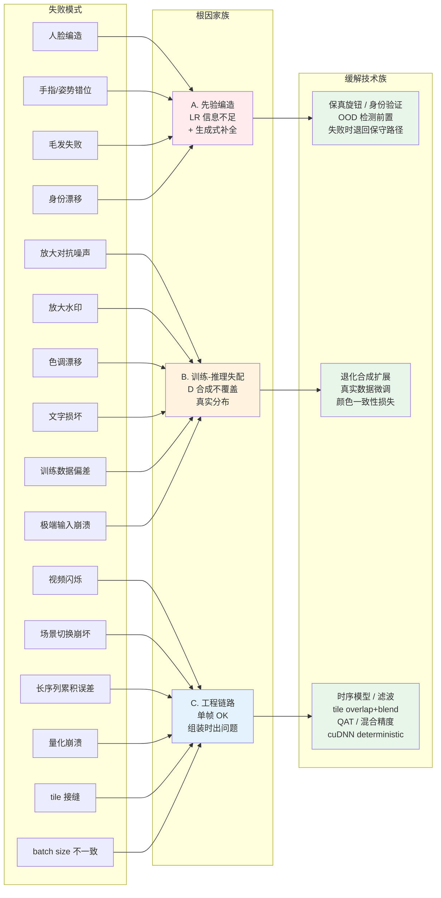
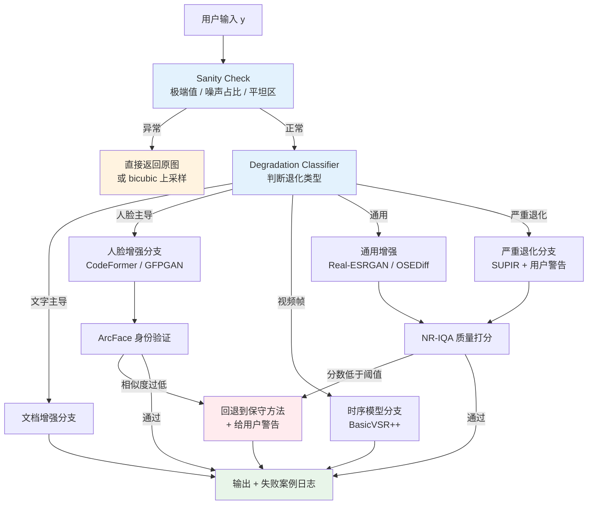
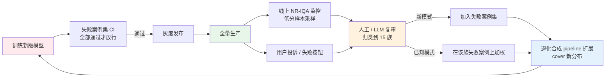

# 第 17 章 · 失败案例集

> 平均指标优异的模型在生产环境中仍可能遭遇严重失效。
>
> 本章系统梳理工业界影像增强系统中最高频的 15 类失效模式：逐一剖析具体场景、物理根因与工程防御策略。
>
> 这是连接算法研发与生产高可用防线最关键的一环。

## 17.0 章首铺垫

在前 16 章中，我们系统构建了从退化建模、表征空间、损失函数、评估指标、数据合成、网络架构、训练动力学到硬件部署优化的完整技术闭环。在标准测试集与学术 Benchmark 上，这套方法论足以训练出具有竞争力的模型。

然而在工业级生产实践中存在一个显著的体验不对称规律：**用户不会关注模型在平均指标（PSNR / SSIM）上相比上一代提升了零点几分贝，但会清晰记住某一张图像上出现的灾难性崩坏**。一张被过度幻觉平滑的人脸、一段在镜头切镜处剧烈闪烁的视频、一个将字符笔画重构错误的文档，足以彻底摧毁整个产品的用户信任。线上被广泛反馈与投诉的质量事故，其根源往往是模型在分布外样本（Out-of-Distribution, OOD）上不可预测的剧烈扰动。

本章将这些典型失效模式进行系统化归纳。每一个条目均源自真实的工业落地故障、线上报警与自动化回归测试红线。它们是影像增强领域多年工程试错与代价换来的防空图谱。

针对每一种失效模式，本章均按照标准工程三联体展开分析：
1. **具体表现场景**：直观复现故障形态；
2. **底层机理剖析**：从数学分布、网络归纳偏置或硬件算子层面定位根本诱因；
3. **防御与规避策略**：提供工程可落地的代码方案与系统拦截兜底机制。

本章后半部分将这些防御措施提炼为五条系统工程通用准则，并提供可直接集成至 CI/CD 流水线的自动化回归评测套件，确保已知缺陷在后续迭代中不再复发。

## 17.0.1 缩写与核心术语

- **OOD**（Out-Of-Distribution，分布外样本）：指超出模型训练阶段数据覆盖流形的异常输入，模型在此类输入上的映射行为缺乏泛化保证；
- **PSNR / SSIM**：经典的像素均方差与结构相似度保真度度量；
- **LPIPS**：基于深度特征空间的学习型感知距离；
- **MANIQA / CLIP-IQA / Q-Align**：无参考图像质量评估（NR-IQA）前沿网络；
- **FFHQ**（Flickr-Faces-HQ）：广泛用于人脸预训练的高清人脸数据集（7 万张），在年龄与种族分布上存在固有统计偏置；
- **ArcFace**：基于加性角余量损失构建的高精度人脸特征提取模型，输出 512 维单位超球面嵌入向量；
- **CodeFormer**：基于离散代码本（Vector-Quantized Codebook）先验的人脸盲复原模型，支持可调保真度权重；
- **SUPIR / OSEDiff / TSD-SR**：代表性的多步与单步生成式扩散超分辨率架构；
- **SDXL / FLUX / DiT**：主流文生图骨干网络，在生成式超分中常用作大容量语义先验主干；
- **ControlNet**：向预训练生成主干注入空间条件约束（如边缘、深度、低质输入）的旁路调节网络；
- **QAT / PTQ**：量化感知训练与训练后量化；
- **ACES / WCG**：广色域与影视级色彩编码工作流规范；
- **CFG**（Classifier-Free Guidance）：扩散采样阶段调控条件引导强度的超参数；
- **ROI**（Region of Interest）：计算图中需实施局部特化增强的感兴趣子区域。

## 17.0.2 失败模式的分类维度

15 类具体失效模式从根本诱因上可划分为三大工程家族：

**家族 A：先验过度生成类（Prior Hallucination）**。当输入图像的低频与高频信息严重缺失时，生成扩散或 GAN 模型强行从训练先验分布中采样“视觉合理”的细节填补空白。包括人脸形变、肢体/毛发错乱与身份漂移。其本质在于模型的生成行为与用户对“原真性（Fidelity）”的刚性预期产生冲突。

**家族 B：分布失配与退化越界类（Distribution Mismatch）**。模型在合成退化数据上学习到的逆映射流形未覆盖线上复杂的真实工况。包括放大不可逆对抗噪声、水印伪影变异、全局色调漂移、文字拓扑受损与极端输入数值溢出。其本质是数据合成管线与真实世界物理退化之间存在分布鸿沟。

**家族 C：系统流水线与工程集成类（Pipeline Integration）**。模型在离线单帧静态评估中表现优异，但在组装进复杂系统工程链路后暴露出端到端缺陷。包括视频帧间闪烁、场景转场隐状态污染、长序列误差漂移累积、定点量化精度坍塌、Tile 拼接接缝及批次尺寸非确定性波动。



## 17.1 建立失败防线的工程必要性

工业级增强系统的成熟度，不在于其在标准基准集上的平均峰值，而取决于其对最恶劣的 5% 极端输入的防御与容错能力。学术论文侧重平均指标最大化，而工业交付聚焦**最差边界条件下的优雅降级**。

## 17.2 失败模式 1：扩散模型幻觉生成与细节篡改

### 现象场景

在老照片人像修复业务中，输入严重模糊或低分辨率的面部，扩散模型输出了极度清晰但面容完全陌生的面部结构，引发用户强烈的违和感与投诉。

### 根本诱因剖析

扩散超分辨率模型的核心机制是估计后验条件概率分布 $p(x \mid y)$（给定低质输入 $y$ 求解高质图像 $x$）。当 $y$ 中的高频信息在物理层面完全湮灭时，后验分布 $p(x \mid y)$ 呈现出多模态与极大的方差，导致分布的众数被迫由预训练主干中的强先验（如 FFHQ 统计均值）主导。

从数学上看，网络采样的输出并非算子计算错误，其在数学上确实是满足观测约束 $y$ 的一个高概率解；然而，该解与用户对“物理真实身份唯一性”的工程预期存在本质冲突。

### 工程防御方案

1. **暴露保真度参数（Fidelity Control）**：通过调节代码本采样权重或 ControlNet 注入强度，抑制无约束生成；
2. **欠采样区域判别式回退**：对有效分辨率低于 $16\times 16$ 像素的人脸区域，自动禁用纯生成模型，回退至确定性双三次插值或轻量回归网络；
3. **后置特征空间一致性校验**：利用预训练 ArcFace 网络提取增强前后面部的 512 维特征向量并计算余弦相似度，相似度低于预设安全阈值时触发告警并启动保底回退。

```python
def safe_face_enhance(lr_face: torch.Tensor, model: nn.Module, identity_threshold: float = 0.4) -> dict:
    """具备人脸特征一致性校验的安全增强管线。"""
    enhanced = model(lr_face)
    
    # 基于 ArcFace 提取身份表征并计算余弦距离
    sim = arcface_similarity(lr_face, enhanced)
    
    if sim < identity_threshold:
        # 特征偏离过大时回退至保守上采样并记录审计日志
        return {
            'output': bicubic_upscale(lr_face, scale=4),
            'warning': '原图有效信息不足，已触发保底回退以避免面容失真',
            'fallback': True,
        }
    return {'output': enhanced, 'warning': None, 'fallback': False}
```

## 17.3 失败模式 2：逆向放大对抗噪声与锐化伪影

### 现象场景

用户上传经过修图软件过度锐化（Over-sharpened）或多次有损压缩的图片，经通用超分模型处理后，原本微弱的高频振铃被极度放大，生成刺眼的网状纹理与类“糖纸”伪影。

### 根本诱因剖析

经典超分辨率网络（如 Real-ESRGAN）将高频信号一律建模为“待重建的微弱纹理”。当输入图像包含非自然的高频锐化白边或对抗噪声时，这些结构落入训练数据退化空间（Degradation Space）的盲区，模型错误地将其作为真实边缘进行非线性增益放大。

### 工程防御方案
## 17.4 失败模式 3：人脸身份特征漂移（Identity Drift）

### 现象场景

在实时视频会议或相册人像增强中，单帧画面经网络处理后虽然面部瑕疵被抹平、五官清晰度提升，但用户主观反馈“不像本人”，独特的轮廓特征与面部拓扑发生异化。

### 根本诱因剖析

通用人像盲复原模型在训练时以像素级重构损失与感知损失为主导，面部身份保持损失（如基于 ArcFace 的角度距离）权重配置不足：
- 模型倾向于将面部向预训练先验中的“标准统计均值脸”拉拢；
- 特征性弱特征（如不对称眼角、特定痣点、特定唇形弧度）容易被网络当作局部退化残差滤除。

### 工程防御方案

1. **强化身份保留特征损失**：在训练阶段将 ArcFace 特征距离权重提升至关键约束层级；
2. **扩充人脸多样性先验分布**：引入跨人种、宽年龄跨度与非对称特征人像数据；
3. **推理时注入参考锚点嵌入（Reference Anchor Embedding）**：在流式处理中提取首帧高质量注册图的 Embedding，作为后续帧的显式条件先验。

```python
class IdentityGuidedEnhancer(nn.Module):
    """基于注册参考人脸 Embedding 显式注入的身份保真增强网络。"""

    def __init__(self, base_model: nn.Module, arcface_extractor: nn.Module):
        super().__init__()
        self.base_model = base_model
        self.arcface = arcface_extractor.eval()

    def forward(self, lr_face: torch.Tensor, reference_face: torch.Tensor) -> torch.Tensor:
        with torch.no_grad():
            ref_embedding = self.arcface(reference_face)  # 提取 512 维特征
        # 将特征向量以 Cross-Attention 或 AdaIN 方式注入主干网络
        return self.base_model(lr_face, condition=ref_embedding)
```

## 17.5 失败模式 4：视频时序高频闪烁（Temporal Flickering）

### 现象场景

采用单帧超分模型逐帧独立处理视频序列，在平坦墙面、草地或复杂毛发区域，相邻帧生成的高频微弱纹理剧烈跳变，呈现出高频噪点“沸腾”的严重视觉伪影。

### 根本诱因剖析

单帧网络缺乏帧间时间维度的先验约束。输入视频中微弱的亚像素位移与传感器时间噪声，在经过单帧深度非线性映射时被独立解算为截然不同的高频解，打破了物理世界的光度一致性。

### 工程防御方案

1. **采用时序循环或双向传播架构**：在主干中引入 BasicVSR++ 或流式因果循环模块；
2. **后置运动补偿时序滤波（MC-EMA）**：对单帧模型输出实施基于密集光流对齐的指数移动平滑；
3. **引入帧间光流形变损失（Warping Loss）**：训练时施加严格的时序连续性正则化。

```python
def temporal_filter_post(frames: list, alpha: float = 0.7) -> list:
    """基于光流前向对齐的指数移动平均后处理滤波器。"""
    smoothed = [frames[0]]
    for t in range(1, len(frames)):
        # 估计当前帧与前一平滑帧之间的密集光流
        flow = estimate_flow(frames[t], smoothed[-1])
        warped_prev = warp_with_flow(smoothed[-1], flow)
        # 执行加权融合
        filtered = alpha * frames[t] + (1.0 - alpha) * warped_prev
        smoothed.append(filtered)
    return smoothed
```

## 17.6 失败模式 5：定点量化精度坍塌（Quantization Crash）

### 现象场景

模型在 FP32/FP16 精度下推理表现稳定（PSNR 达 33 dB），但经 PTQ 转为 INT8 部署于端侧 NPU 后，输出图像出现大面积色阶断层、高频棋盘格与糖纸状斑块（PSNR 暴跌至 26 dB）。

### 根本诱因剖析

低层视觉任务是端到端像素回归问题，对数值截断极其敏感：
- **动态范围跨度极大**：特定特征层的中间激活值极差极大，均匀定点量化步长引入不可逆量化截断噪声；
- **重构敏感层抗扰度弱**：首层卷积（原始像素映射）与末端上采样层（PixelShuffle）对权重量化极为敏感，局部扰动会被直接映射为结构性网格伪影。

### 工程防御方案

1. **首末层混合精度保护（Mixed-Precision Policy）**：首层、末层及 PixelShuffle 关联算子强制保留 FP16 精度，仅对中间残差骨干执行 INT8 量化；
2. **量化感知训练（QAT）**：在微调阶段显式模拟定点截断算子，让网络自适应补偿量化误差；
3. **采用逐通道量化（Per-Channel Quantization）**：替代传统的逐张量量化，提升权重缩放精细度。

```python
quant_policy = {
    'input_stem_conv':      'fp16',  # 首层特征提取算子保留半精度
    'pixel_shuffle_conv':   'fp16',  # 上采样卷积保留半精度
    'final_reconstruction': 'fp16',  # 图像重构末层保留半精度
    'backbone_resblocks':   'int8',  # 中间大算力残差体执行 INT8 加速
}
```

## 17.7 失败模式 6：分块推理边界接缝（Tile Seam Artifacts）

### 现象场景

在处理 4K/8K 超大分辨率图像时，因显存限制采用 Tile 切块独立推理，拼接后整图呈现清晰的网格状缝隙或明暗突变。

### 根本诱因剖析

卷积神经网络与局部注意力机制在图像边界处的感受野被硬性截断。不同 Tile 在边界处由于 Padding 策略以及邻域上下文信息的缺失，导致边界像素的特征响应与中心区域产生系统性偏差。

### 工程防御方案

1. **滑窗重叠与余弦窗融合（Overlap & Linear Blending）**：相邻 Tile 保留至少 32-64 像素重叠区，在拼接阶段采用权重渐变加权融合；
2. **反射填充替代零填充**：对边缘 Tile 采用反射填充，避免边界特征突变；
3. **扩散先验共享噪声场**：针对扩散超分模型，全局预先生成大尺寸高斯噪声场并按坐标切片，确保隐空间采样的全局连续性。

## 17.8 失败模式 7：极端异常输入诱发数值发散

### 现象场景

用户上传全黑背景、高曝全白图或纯高斯噪点图，增强模型输出出现色彩斑斓的几何条纹、数值 NaN 或完全失真的抽象斑块。

### 根本诱因剖析

极端输入破坏了网络内部归一化层与统计假设的数值稳定性：
- 全平坦图像输入导致局部方差趋于 0，在特定归一化计算中引发除零异常或数值溢出；
- 纯高斯噪声输入的高频能量谱与真实退化图像完全不同，网络将其误识别为极高密度的自然纹理并实施激进放大。

### 工程防御方案

1. **前置数值健康度校验（Sanity Check Gate）**：统计输入张量的均值、方差与高频能量比，异常样本直接触发旁路直通（Bypass）；
2. **数据增强注入极端分布**：在训练批次中按一定比例混入纯黑、纯白与全噪退化对。

```python
def safe_inference_gate(model: nn.Module, image: torch.Tensor) -> torch.Tensor:
    """具备数值健康度初筛的安全推理入口。"""
    mean_val = float(image.mean())
    std_val = float(image.std())
    
    # 判定是否为几乎无信息的平坦区域
    if std_val < 1e-4:
        return image  # 旁路直通原图
    
    # 判定是否处于极端过曝或死黑边界
    if mean_val < 0.01 or mean_val > 0.99:
        return image
    
    # 正常分发至推理主链路
    return model(image)
```

## 17.9 失败模式 8：全局色调漂移与偏色（Color Shift）

### 现象场景

原图具有强烈的艺术色调（如暖黄日落、暗调青橙氛围），经过超分辨率增强后色温显著变冷，导致原始艺术意境被抹除。

### 根本诱因剖析

训练集中的高质量真实图像多来源于标准日光下曝光准确的自然图库（以 D65 标准白平衡为主）。网络在优化重构损失的过程中，隐式学习到了将输入色彩分布拉拢至训练集先验均值的倾向，将特化色调误判为光照偏差予以“纠正”。

### 工程防御方案

1. **色彩解耦空间校准**：将增强输出与原图转换至 Lab 色彩空间，保留增强图的明度通道（L 通道），对颜色通道（a、b 通道）实施基于原图低频统计特性的仿射直方图匹配；
2. **色彩一致性正则约束**：训练阶段在损失函数中增加大核高斯模糊后的色彩一致性约束。

```python
def color_match_lab(enhanced: torch.Tensor, original: torch.Tensor) -> torch.Tensor:
    """在 Lab 空间将增强图像的颜色统计严格对齐至原始输入。"""
    enhanced_lab = rgb_to_lab(enhanced)
    original_lab = rgb_to_lab(original)
    
    # L 通道完全继承增强后的高频纹理与对比度
    l_channel = enhanced_lab[:, 0:1]
    
    # 对 a、b 色彩通道施加大核平滑以提取全局色调
    kernel_size = 21
    pad = kernel_size // 2
    enh_ab_blur = F.avg_pool2d(enhanced_lab[:, 1:], kernel_size, stride=1, padding=pad)
    orig_ab_blur = F.avg_pool2d(original_lab[:, 1:], kernel_size, stride=1, padding=pad)
    
    # 求解局部色彩偏移并执行残差补偿
    color_offset = orig_ab_blur - enh_ab_blur
    calibrated_ab = enhanced_lab[:, 1:] + color_offset
    
    merged_lab = torch.cat([l_channel, calibrated_ab], dim=1)
    return lab_to_rgb(merged_lab)
```

## 17.10 失败模式 9：字符拓扑变形与 OCR 可读性下降

### 现象场景

在处理包含文字、车牌或截图的图像时，原本模糊但可勉强辨认的字符在超分后笔画被平滑磨灭，甚至发生形似字错误（如将“日”重构成“目”）。

### 根本诱因剖析

通用超分主干建立在自然连续流形先验之上，对高阶平滑度具有强偏置；而文字是具有离散拓扑连通性的符号系统，平滑先验会直接破坏字符笔画的开闭环拓扑结构。

### 工程防御方案

1. **文本区域检测与特化路由**：通过 DBNet/EAST 检测文字行，文字区域路由至专用的 DocSR 模型；
2. **引入 OCR 语义感知损失**：在训练阶段将预训练识别网络的中间激活层相似度作为监督信号；
3. **保守平滑策略**：对于小于 10 像素的超小字符，仅执行局部去锐化与对比度拉伸，禁止大倍率生成式超分。

```python
def hybrid_text_aware_enhance(image: torch.Tensor, text_detector: nn.Module, 
                               general_sr: nn.Module, doc_sr: nn.Module) -> torch.Tensor:
    """文字与自然背景解耦增强的分流处理流水线。"""
    text_boxes = text_detector(image)
    
    if len(text_boxes) == 0:
        return general_sr(image)
    
    # 背景全局走通用超分辨率分支
    enhanced_canvas = general_sr(image)
    
    # 文字区域逐一裁剪后走文档超分分支并无缝贴回
    for box in text_boxes:
        crop_patch = crop_box(image, box)
        enhanced_patch = doc_sr(crop_patch)
        enhanced_canvas = paste_patch(enhanced_canvas, enhanced_patch, box)
    
    return enhanced_canvas
```

## 17.11 失败模式 10：训练数据集人口统计偏置

### 现象场景

人像增强模型在年轻人群与浅肤色样本上表现优秀，但在老年人（皱纹与老年斑被过度磨平）、儿童（面部比例被拉伸为成人特征）及特定深肤色族裔上出现明显的面部变形或假面感。

### 根本诱因剖析

主流预训练数据集（如 FFHQ、CelebA-HQ）在采集源头上存在显著的人口统计学偏置（欧美青年占比畸高）。神经网络在缺乏均衡样本监督的情况下，收敛至主流分布的几何与纹理均值点。

### 工程防御方案

1. **多源均衡数据集重构**：主动引入跨种族、全年龄段的高清人脸库进行联合微调；
2. **细分人群指标评测隔离**：在评估体系中禁止仅汇报全集单一平均分数，必须按年龄、性别与肤色等级分别输出 PSNR、LPIPS 与 ArcFace 相似度；
3. **自适应先验衰减**：针对检测为非主流先验分布的输入，主动降低代码本（Codebook）权重的强制先验约束。

## 17.12 失败模式 11：视频场景镜头切镜时序崩坏

### 现象场景

在处理包含剪辑转场的视频流时，镜头切换后的首帧画面出现前一场景的半透明重影与严重的块状撕裂。

### 根本诱因剖析

时序循环网络（如 BasicVSR++ 或因果流式模型）依赖内部隐状态（Hidden State）传递历史特征。镜头发生瞬时空间切镜时，历史隐状态与当前帧内容完全正交，错误的空间特征注入引发特征图剧烈失真。

### 工程防御方案

1. **切镜检测与隐状态瞬时清零**：计算连续帧特征差分，一旦超过切镜阈值立即重置模型内部循环张量；
2. **切镜鲁棒性数据合成**：在视频训练片段中主动注入随机拼接转场样本。

```python
class SceneAwareStreamingModel(nn.Module):
    """具备切镜感知与隐状态自适应重置的视频处理模块。"""

    def __init__(self, recurrent_backbone: nn.Module, threshold: float = 0.35):
        super().__init__()
        self.backbone = recurrent_backbone
        self.threshold = threshold

    def forward(self, curr_frame: torch.Tensor, prev_frame: torch.Tensor, 
                hidden_state: torch.Tensor) -> tuple[torch.Tensor, torch.Tensor]:
        if prev_frame is not None:
            # 计算帧间均方根亮度差分判定转场
            frame_diff = (curr_frame - prev_frame).abs().mean()
            if frame_diff > self.threshold:
                hidden_state = self.backbone.init_hidden(curr_frame.shape)  # 状态重置
        
        output_frame, next_hidden = self.backbone(curr_frame, hidden_state)
        return output_frame, next_hidden
```

## 17.13 失败模式 12：长序列隐状态漂移与误差累积

### 现象场景

流式处理长达数十分钟的超长视频流时，视频开头的增强画质清晰锐利，但随着时间推移，画面逐渐模糊、色彩饱和度饱和度漂移，甚至在数千帧后出现数值发散。

### 根本诱因剖析

单向因果循环网络在长序列前向传播中，算子量化截断与残差累加误差形成正反馈回路。若系统缺乏耗散项或周期性锚定机制，隐状态流形将逐步脱离真实图像流形。

### 工程防御方案

1. **周期性 GOP 关键帧对齐重置**：强制与视频编码的 I 帧（GOP 边界，通常每 60-120 帧）同步重置隐状态，截断误差传播链；
2. **引入自衰减遗忘门控（Decay Gating）**：在循环单元内部对历史状态施加模长衰减正则项；
3. **双轨健康度监控**：实时监测隐状态张量的 $L_2$ 范数，超出健康阈值时触发异步重初始化。

## 17.14 失败模式 13：非预期强化水印与台标伪影

### 现象场景

用户上传带有半透明半透明文字水印、电视台标或压缩噪点的图片，增强模型将半透明台标边缘误作为重点前景结构，重构出极高对比度的锐化硬边缘。

### 根本诱因剖析

通用超分辨率网络将所有高对比度边缘视为高频结构予以提升。在缺乏语义解耦机制时，网络无法区分“承载内容的自然纹理”与“后期叠加的合成图层”。

### 工程防御方案

1. **水印区域检测前置**：利用轻量语义分割模型标定台标与文字水印位置；
2. **局部掩码平滑或直通**：对标定的水印区域执行保真度降权或旁路直通处理；
3. **合成数据增强**：在训练阶段大规模随机叠加密集半透明图层与水印，促使网络学会保持原状。

## 17.15 失败模式 14：人体肢体拓扑畸变与微结构错乱

### 现象场景

在人像全景或大幅度动作图像中，生成式扩散超分导致手部手指数量增减、关节逆向折叠、毛发变成黏连的塑料束条、牙齿排列错位或镜框几何不对称。

### 根本诱因剖析

人体四肢与面部精细器官属于高度受约束的复杂运动学与解剖学流形。扩散生成模型在低维潜空间（Latent Space）采样时缺乏骨骼刚体拓扑先验与高精度亚像素几何约束，在多步去噪积分中容易跌入非物理局部极小点。

### 工程防御方案

1. **多模态几何先验注入（ControlNet Conditioning）**：引入 OpenPose 或 DWPose 骨骼关键点作为强引导条件；
2. **解剖学敏感区域判别式替代**：检测手部与精细五官 ROI，高风险区域回退至确定性判别式超分；
3. **局部先验引导降权**：降低肢体区域无分类器引导尺度（CFG Scale），严控自由度。

## 17.16 失败模式 15：批次尺寸（Batch Size）非确定性波动

### 现象场景

模型在 `batch_size=1` 单元测试时输出与基准完全吻合，但在生产环境以动态 `batch_size=8` 并发处理时，输出像素出现轻微数值抖动，导致连续视频帧出现微小但肉眼可察觉的跳变。

### 根本诱因剖析

底层 CUDA Kernel 与 cuDNN 算子在不同 Batch Size 下会选择不同的并行归约（Reduction）与分块调度策略。由于浮点数加法不满足结合律（$(a+b)+c \neq a+(b+c)$），累加顺序的变化引入了微弱的数值非确定性。

### 工程防御方案

1. **固定生产推理 Batch 规格**：在流式微批处理服务中严格固定推理 Batch 尺寸，规避动态 Kernel 切换；
2. **启用确定性算子标志位**：

```python
import torch

torch.backends.cudnn.deterministic = True
torch.backends.cudnn.benchmark = False
```

3. **后置时序平滑兜底**：在输出端配置统一的轻量级时序滤波链路。

## 17.17 工业系统高可用决策流水线

将 15 类失效模式的防御策略整合为一套标准前向拦截拓扑图：



### 五项通用防御铁律

1. **前置健康检查优先**：在张量送入重型网络前，完成纯色、过曝、纯噪与极端长宽比的物理初筛；
2. **语义与退化解耦路由**：避免单一网络兼顾全部模态，依据语义检测动态分发至人脸、文字、视频或通用通道；
3. **后置闭环特征校验**：关键场景（人脸、司法取证、医学）必须施加基于特征距离或 IQA 指标的输出复核；
4. **必须预置保底降级路径**：任何子分支在遇到验证失败或数值异常时，均具备回退至原图或保守插值的机制；
5. **异常样本自动捕获归档**：线上每一次触发 Fallback 的样本均需落盘入库，驱动训练退化管线的持续进化。

## 17.18 失败案例集的工程化与 CI/CD 集成

将失效模式防御体系固化为自动化回归评测套件，纳入版本交付的强制门禁：

```python
class FailureRegressionSuite:
    """生产级影像增强算法防御能力自动化回归测试套件。"""

    def __init__(self):
        self.test_cases = [
            ('extreme_lr_face',  load_extreme_face_sample,  self.verify_identity_cosine),
            ('oversharpened',    load_oversharp_sample,     self.verify_high_freq_bound),
            ('pure_black_input', load_pure_black_sample,    self.verify_zero_divergence),
            ('ocr_document',     load_document_sample,      self.verify_ocr_consistency),
            ('tile_continuity',  load_large_4k_sample,      self.verify_no_seam_lines),
        ]

    def verify_identity_cosine(self, inp: torch.Tensor, out: torch.Tensor) -> bool:
        sim = float(arcface_similarity(inp, out))
        return sim >= 0.40  # 确保人脸关键特征未漂移

    def verify_high_freq_bound(self, inp: torch.Tensor, out: torch.Tensor) -> bool:
        in_energy = float(compute_high_freq_energy(inp))
        out_energy = float(compute_high_freq_energy(out))
        return out_energy <= 1.5 * in_energy  # 杜绝高频振铃放大

    def verify_zero_divergence(self, inp: torch.Tensor, out: torch.Tensor) -> bool:
        return float(out.std()) < 0.01  # 全黑输入必须稳定输出纯色

    def verify_ocr_consistency(self, inp: torch.Tensor, out: torch.Tensor) -> bool:
        return run_ocr_text_match(inp, out) >= 0.95  # 字符拓扑完整度

    def verify_no_seam_lines(self, inp: torch.Tensor, out: torch.Tensor) -> bool:
        return compute_tile_gradient_discontinuity(out) < 0.05

    def run_suite(self, model: nn.Module) -> dict:
        summary = {}
        for name, loader, evaluator in self.test_cases:
            sample_tensor = loader()
            with torch.no_grad():
                output_tensor = model(sample_tensor)
            passed = evaluator(sample_tensor, output_tensor)
            summary[name] = {'passed': passed}
        return summary
```

## 17.18.1 生产到研发的闭环质量迭代链路



工业闭环的核心支撑点：
1. **线上自动化弱质量采样**：通过 NR-IQA（MANIQA / Q-Align）前置过滤出预警样本；
2. **多模态大模型智能归因**：利用多模态视觉模型初筛失效类型并归类至对应家族；
3. **退化合成逆向扩充**：将捕获的 Bad Case 提炼为数据生成参数，实现模型免疫力主动升级。

## 17.19 本章小结

1. **失败防御是工业落地的生命线**：平均指标决定上限，极端失效防御决定系统下限；
2. **三大失效根因族**：生成先验过度幻觉、训练与推理退化流形失配、复杂工程流水线系统集成缺陷；
3. **核心防御手段**：
   - 生成幻觉：暴露保真度参数，引入 ArcFace 特征校验与确定性回退；
   - 对抗放大：前置退化分类路由，强化合成数据扰动覆盖；
   - 视频时序：因果循环架构、光流指数平滑与切镜瞬时重置；
   - 硬件量化：首末层敏感算子混合精度保护与 QAT 训练；
   - 分块接缝：重叠窗加权融合与共享噪声场；
4. **系统工程铁律**：前置初筛、解耦分流、特征复核、全链路保底与闭环持续进化。

---

> 下一章 [SOTA 模型前沿](18-sota.md) → 系统评析 2026 年最具代表性的前沿架构（MambaIR、DiT 超分、单步扩散及统一全能复原）与选型决策树。
