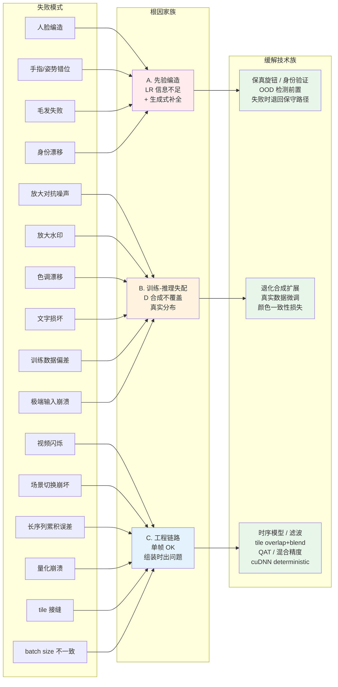
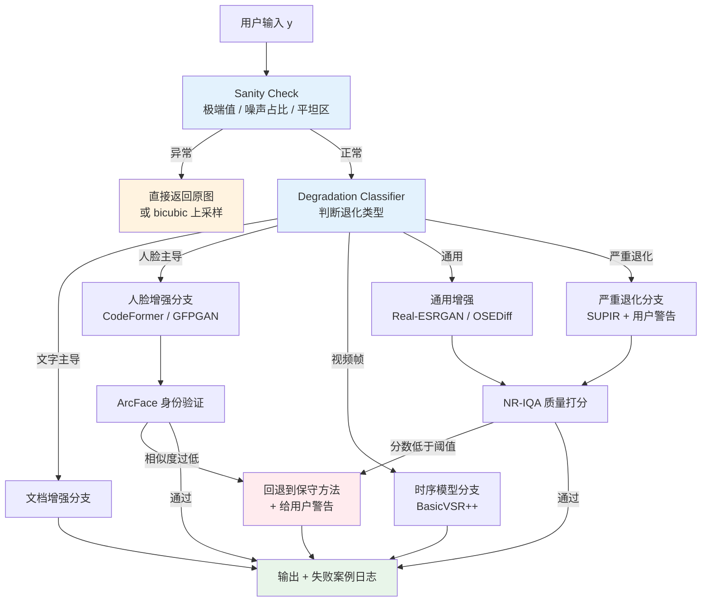
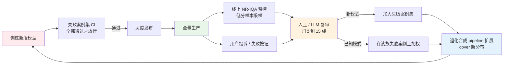

# 第 17 章 · 失败案例集

> 平均指标好的模型在生产里依然会翻车。
>
> 这一章把过去几年影像增强里**最常见的失败模式**收集起来 - 每一种都给具体场景、原因、应对。
>
> 这是这本书里最"实战"的一章，也是最值得反复读的一章。

## 17.0 章首铺垫

读完前面 16 章，你已经掌握了一个完整的增强系统从数学定义、表达空间、损失设计、评估指标、数据合成、网络架构、训练动力学、视频时序、到部署优化的全套工具链。理论上，这套工具足以训出一个在大部分公开 benchmark 上拿得出手的模型。

但工程世界里有一个不对称的事实：一个增强模型上线之后，**用户记住的不是你在平均指标上比上一版高了多少，而是它在某一张图上的崩坏**。一张被修成糖纸的脸、一段在场景切换处闪烁的视频、一个把"日"字修成"目"字的文档，足以让所有的 PSNR 提升归零。媒体上传播的失败案例从来不是"平均 PSNR 涨 0.2 dB"的反面，它们是模型在 OOD（out-of-distribution，分布外样本，即训练时没见过的输入分布）上的剧烈错误。

这一章把这些剧烈错误整理成一份目录。目录里的每一项都源自真实的产品事故，来自社交媒体的截图、用户的投诉、内部回归测试的红色行。它们是这个领域过去十年踩过的坑，被前人付出代价之后留下的航海图。读这一章和读前面任何一章都不同：前面在告诉你怎么造一辆车，这一章在告诉你车在哪些路口会翻。

每个失败模式按同一个模板组织：先给具体的产品场景（让你能"看见"问题），再给根因分析（让你理解为什么会发生），最后给一组可执行的应对（让你知道在自己系统里加什么防线）。三段之间不可省略：只看场景不分析根因会让你以为是"模型不够好"，只看根因不给应对会让你停在抱怨而不改进，只给应对而跳过根因会让你做无用功（修补的位置错了）。

本章最后还会做两件事：把所有失败模式归纳成五条通用应对原则，以及把测试集工程化为可以接入 CI 的回归套件。前者帮你在遇到一个新失败模式时知道往哪里看，后者帮你保证今天发现的问题不会在下一个版本悄悄回来。

## 17.0.1 缩写与术语注

本章和上下游章节会反复用到这些缩写，集中放在这里方便回查：

- **OOD**（Out-Of-Distribution，分布外样本）：训练分布没覆盖到的输入。模型在 OOD 上的行为没有理论保证，多数失败模式的本质都是这件事。
- **PSNR**（Peak Signal-to-Noise Ratio，峰值信噪比）：像素级 MSE 取对数的指标，主导学术 benchmark。
- **SSIM**（Structural Similarity，结构相似度）：考虑亮度、对比度、结构三项的指标。
- **LPIPS**（Learned Perceptual Image Patch Similarity，深度网络感知距离）：用 VGG / AlexNet 特征算的感知距离。
- **MANIQA / CLIP-IQA / Q-Align**：无参考的 IQA（Image Quality Assessment，图像质量评估）模型。
- **FFHQ**（Flickr-Faces-HQ）：StyleGAN 用的 70K 张高清人脸数据集，主要来源 Flickr，分布偏白人和年轻人。
- **ArcFace**：业界最常用的人脸识别模型，把人脸映射到 512 维的角度可分超球面 embedding。
- **CodeFormer**：用 VQ codebook 给人脸做强先验的修复模型，含可调 fidelity 参数。
- **SUPIR / OSEDiff / TSD-SR / SinSR / DiffBIR / PASD / SeeSR / ResShift / StableSR / AdcSR**：扩散派 SR 路线上的不同工程方案。下一章会逐个展开，本章只需要知道它们的共同问题是"猜得太自由"。
- **SDXL**（Stable Diffusion XL）：2.6B 参数的文生图基模，多数扩散派 SR 在它的 UNet 上接 ControlNet 或 LoRA 微调而来。
- **SD3 / SD3.5 / FLUX**（2024-2025 出现的新一代 DiT 主干）：MM-DiT 结构的文生图基模，部分新派扩散 SR 把它们作为 backbone 替换 SDXL。
- **ControlNet**：把额外的视觉条件（边缘图、深度图、低质量图等）注入预训练 UNet 的旁路网络。
- **LLaVA**（Large Language and Vision Assistant）：多模态大模型，给一张图能生成自然语言描述，SUPIR 用它给输入图自动生成 prompt。
- **QAT / PTQ**（Quantization-Aware Training / Post-Training Quantization）：训练时和训练后两种量化方案。
- **HDR / SDR**（High / Standard Dynamic Range，高/标准动态范围）：HDR 指亮度范围远超 0-255 的图像 / 视频格式。
- **WCG**（Wide Color Gamut，广色域）：色域范围超过 Rec.709（HDTV 色域标准）的色彩空间，例如 Rec.2020、DCI-P3。
- **ACES**（Academy Color Encoding System，学院色彩编码系统）：电影工业的色彩管线标准。
- **CFA / Bayer / RGGB**（Color Filter Array / Bayer Pattern / Red-Green-Green-Blue Pattern）：相机传感器上的颜色滤镜阵列，多数手机相机用 RGGB 排布。
- **OCR**（Optical Character Recognition，光学字符识别）：把图像里的文字识别成可编辑文本。
- **CDN**（Content Delivery Network，内容分发网络）：图像在网络上经多层代理传输时常被重新压缩，是真实世界 D 链条的最后一站。
- **CFG**（Classifier-Free Guidance，无分类器引导）：扩散采样里调节 prompt 强度的旋钮。
- **VAE**（Variational AutoEncoder，变分自编码器）：扩散派把图像编码到潜空间用的网络。
- **ROI**（Region of Interest，感兴趣区域）：图像中需要单独处理的子区域，如人脸框、文字行框。

## 17.0.2 失败模式的分类视角

15 类具体失败模式按"根因层级"可以归到三个家族，理解这个分类比单独记每一类更有用：

**家族 A：先验编造类**。扩散和 GAN 派模型在 LR 信息严重不足时，从训练分布里采样"合理"的细节填进去。这一族包括人脸编造、毛发失败、手指错位、姿势变形、人物身份漂移，本质都是模型在执行其训练任务（采样最合理的 $\hat{x}$），只是这个"合理"和用户期望的"忠实"冲突。

**家族 B：训练-推理失配类**。模型在合成数据上学到的退化分布不覆盖真实输入。这一族包括放大对抗噪声、放大水印、色调漂移、文字损坏、训练数据偏差、极端输入崩溃，本质是 D 的合成 pipeline 没有 cover 用户实际遇到的退化。

**家族 C：工程链路类**。模型本身在单帧静态测试上没问题，但在工程链路里出问题。这一族包括视频闪烁、场景切换、长序列累积误差、量化崩溃、tile 接缝、batch size 不一致，本质是单帧模型被组装进更大的系统时暴露的接缝。

把这三族在一张图里串起来：



这张图是本章的"地图"。后面 15 节是按现象的顺序展开（方便查找），但回到根因的时候，记得它们落在哪一族 - 落在同一族的失败模式，应对手段往往可以共用。

## 17.1 为什么需要这一章

第 12 章 12.15 节讲过"失败案例集"作为评估方法。这一章是它的内容版 - **把领域里反复出现的失败模式系统化**。

经验法则：

> 一个工业级增强模型的成熟度，不看它在 Set5 上 PSNR 多高，看它的失败案例集多大。
>
> SOTA 论文优化的是平均指标。生产环境优化的是**最差的那 5%**。

下面 15 类失败模式，每一类配场景、原因、应对。读的时候建议在脑中保留 17.0.2 节的三族分类：当读到"扩散模型把婴儿脸修成另一个人"时，提醒自己这属于家族 A（先验编造），它和后面"手指多一根"、"身份漂移"是同根问题；读到"视频闪烁"时，提醒自己这属于家族 C（工程链路），它和"场景切换崩坏"、"长序列累积误差"共享应对模式。

## 17.2 失败模式 1：扩散模型编造内容

### 场景

老照片修复时，扩散模型把"模糊的小婴儿脸"修成了"清晰但不像本人的脸" - 爷爷拿着照片说"这不是我儿子"。这是这个领域过去三年里出现频率最高、对产品口碑伤害最大的失败模式之一，社交媒体上不止一次出现"AI 修复把奶奶修成另一个人"的转发。

### 原因

扩散模型在严重退化的人脸上做的是**生成**，不是恢复：

- LR 信息不够，模型从训练分布里采样一个"合理人脸"
- 这个采样出来的脸**视觉上真实**，但**不是原始那个脸**
- 训练数据里 FFHQ（Flickr-Faces-HQ，70K 张高清人脸数据集）主要是欧美人脸，其他人种的"合理脸"分布偏

更细一点解释这件事的数学性质。扩散模型估的是 $p(x | y)$ - 给定低质量观测 $y$，高质量图像 $x$ 的后验分布。当 $y$ 的信息量不足以把这个后验分布"挤窄"时，分布的众数（模型最可能输出的样本）落在训练集的"平均脸"附近，但具体采到哪一个由噪声决定。爷爷的儿子和模型采到的那张脸，在数学上都是"$y$ 的合理后验样本"。模型并没有"犯错"，它执行的就是采样任务。错的是**用户期望（恢复）和模型行为（采样）的不匹配**。

### 应对

1. **fidelity 参数给用户**：CodeFormer 的 `w` 参数允许调节
2. **检测严重退化区域，禁用生成式模型**：LR 太差就只用 bicubic 上采样
3. **后处理身份验证**：用 ArcFace 比对原图和增强图，相似度过低警告用户
4. **明确产品定位**：标明"AI 增强可能改变细节"，让用户有心理预期

```python
def safe_face_enhance(lr_face, model, identity_threshold=0.4):
    enhanced = model(lr_face)
    
    # 用 ArcFace 比对
    sim = arcface_similarity(lr_face, enhanced)
    
    if sim < identity_threshold:
        # 警告用户 (或回退到保守方法)
        return {
            'output': bicubic_upscale(lr_face, 4),
            'warning': '原图细节不足，AI 修复结果与原始可能差异较大',
        }
    return {'output': enhanced, 'warning': None}
```

## 17.3 失败模式 2：放大对抗噪声 / 伪影

### 场景

用户上传一张已经被 PS 软件 oversharpen 过的图，再用 Real-ESRGAN 处理——伪影被放大成"糖纸"纹理。

### 原因

模型学到的是"低质量到高质量"的映射。"低质量"的训练数据没有 oversharpen 过的图，所以模型把锐化伪影**当成需要恢复的细节**——锐化它。

更广义地：训练数据没 cover 的退化分布上，模型行为不可预测。

### 应对

1. **退化检测前置**：用一个分类器预测输入图的"退化类型"
2. **多分支模型**：不同退化类型用不同的增强模型
3. **训练数据补全**：加入更多"奇怪退化"（包括 oversharpen、过度饱和、过度去噪）

```python
def adaptive_enhance(image, classifier, models):
    """根据检测到的退化类型选择模型。"""
    degradation_type = classifier(image)
    
    if degradation_type == 'normal_lr':
        return models['real_esrgan'](image)
    elif degradation_type == 'oversharpened':
        return models['mild_smooth_then_sr'](image)
    elif degradation_type == 'oversaturated':
        return models['color_normalize_then_sr'](image)
    else:
        return models['safe_baseline'](image)
```

## 17.4 失败模式 3：人脸身份漂移

### 场景

视频会议增强模型，每一帧增强后看起来"美化"了，但同事发现**用户看起来像变了个人**。

### 原因

第 10.3 节讲过身份保留损失，但训练时这个损失权重不够：

- 像素损失主导 → 模型学到"标准脸"的统计
- 模型推理时把每张脸都"标准化"——独特特征（鼻型、嘴角等）被磨平

### 应对

1. **身份保留损失权重提高**：从 0.1 提到 0.5
2. **训练数据多样性**：FFHQ 之外加 IMDB-Face、Asian Face 等
3. **推理时的身份引导**：每次推理给一个"参考脸 embedding"作为额外输入

```python
class IdentityGuidedEnhancer(nn.Module):
    """每次增强用用户的参考人脸作为引导。"""

    def __init__(self, base_model, arcface):
        super().__init__()
        self.base_model = base_model
        self.arcface = arcface.eval()

    def forward(self, lr_face, reference_face):
        with torch.no_grad():
            ref_embedding = self.arcface(reference_face)
        # 把 embedding 作为条件注入 base_model
        return self.base_model(lr_face, condition=ref_embedding)
```

## 17.5 失败模式 4：视频闪烁

### 场景

用 Real-ESRGAN 逐帧处理视频，输出视频中的纹理、平坦区域、人脸细节都在"沸腾"——肉眼难受。

### 原因

第 13 章 13.1 节详谈过：单帧模型不考虑时序一致。同样的纹理在两个相邻帧中略有不同的 LR 输入 → 模型生成略有不同的细节 → 闪烁。

### 应对

1. **使用时序模型**（BasicVSR++ / VRT）替代单帧模型
2. **后处理：时序滤波**

```python
def temporal_filter_post(frames: list, alpha: float = 0.7) -> list:
    """对增强后的视频做指数移动平均, 减少闪烁。
    代价: 损失部分细节, 略带"运动模糊"感。
    """
    smoothed = [frames[0]]
    for t in range(1, len(frames)):
        # 用光流先对齐前一帧
        flow = estimate_flow(frames[t], smoothed[-1])
        warped_prev = warp_with_flow(smoothed[-1], flow)
        # 加权平均
        s = alpha * frames[t] + (1 - alpha) * warped_prev
        smoothed.append(s)
    return smoothed
```

3. **训练数据：视频对 + 时序一致性损失**——根本解决方案

## 17.6 失败模式 5：量化崩溃

### 场景

模型在 PyTorch FP32 推理 PSNR 33 dB，转 INT8 部署到端侧后 PSNR 跌到 26 dB——视觉上明显糖纸。

### 原因

低层视觉对量化敏感（第 15.2.5 节）：

- **激活分布异常**：某些层激活值范围广（max 远大于 mean），INT8 量化损失大
- **首层 / 末层敏感**：图像 → 特征 / 特征 → 图像的转换特别精细
- **PixelShuffle 后的卷积**：量化后产生明显棋盘伪影

### 应对

1. **混合精度量化**：第一层、最后一层、归一化层保留 FP16/FP32

```python
quant_config = {
    'first_conv':       'fp16',     # 输入 conv 不量化
    'pixel_shuffle_conv': 'fp16',   # 上采样前不量化
    'last_conv':        'fp16',     # 输出 conv 不量化
    'others':           'int8',
}
```

2. **QAT (Quantization-Aware Training)**：训练时加入量化扰动
3. **per-channel 量化**：不要 per-tensor，per-channel 精度高

4. **直接放弃 INT8**：低层视觉很多场景 FP16 已经够，没必要冒精度风险

## 17.7 失败模式 6：边界 / Tile 接缝

### 场景

4K 图分成 1024 tile 处理，输出图在 tile 边界有明显**接缝**——像方形拼图。

### 原因

不同 tile 独立推理：

- 边界附近的像素**只看到 tile 内的上下文**
- 邻 tile 的边界**看到不同的上下文**
- 输出在边界处不连续

### 应对

1. **Overlap + blend**（第 15.9 节）：必须做，不是可选
2. **更大 overlap**：256 像素 overlap 比 64 像素效果好（但慢）
3. **Mirror padding 边缘**：图像边缘 tile 用反射 padding 而不是常数 padding
4. **Shared noise（扩散）**：所有 tile 用同一个 noise seed，结构连续性

## 17.8 失败模式 7：极端输入崩溃

### 场景

用户上传一张**纯黑** / **纯白** / **纯随机噪声**图。增强模型输出的是各种艺术抽象。

### 原因

模型训练时没见过极端 OOD 输入：

- 纯黑：所有激活接近 0，归一化层 div by 0
- 纯白：饱和，激活异常
- 噪声：高频分量主导，模型当作"细节"放大

### 应对

1. **输入校验**：极端输入直接 bypass 模型

```python
def safe_inference(model, image):
    # 输入特征检查
    mean = image.mean()
    std = image.std()
    
    if std < 1e-3:                  # 几乎平坦
        return image                # 直接返回, 不增强
    
    if mean < 0.02 or mean > 0.98:  # 极端亮暗
        return image                # 跳过增强
    
    # 检查噪声占比
    high_freq_ratio = compute_high_freq_ratio(image)
    if high_freq_ratio > 0.7:        # 噪声主导
        # 走"先去噪再增强"分支
        return enhance_after_denoise(image)
    
    # 正常路径
    return model(image)
```

2. **训练数据补全**：合成时加入极端样本（pure black、pure white、Gaussian noise）

## 17.9 失败模式 8：色调漂移 / 偏色

### 场景

用户拍的暖色调（夕阳）照片，经过增强后**色调变冷**——失去夕阳氛围。

### 原因

模型训练数据偏向"标准白平衡"图：

- 训练 HR 经过"美化白平衡"
- 模型把所有输入往这个方向拉
- 暖色调被当作"色温偏差"修正掉

### 应对

1. **颜色一致性损失**（第 3 章 3.8 节）：训练时用
2. **后处理：颜色匹配**

```python
def color_match(enhanced: torch.Tensor, original: torch.Tensor) -> torch.Tensor:
    """把 enhanced 的色调匹配到 original。
    保留 enhanced 的细节, 借用 original 的颜色统计。
    """
    # 转 Lab 颜色空间
    enhanced_lab = rgb_to_lab(enhanced)
    original_lab = rgb_to_lab(original)
    
    # L 通道用 enhanced (细节)
    l = enhanced_lab[:, 0:1]
    # a, b 通道做大幅模糊后用 original (颜色)
    enhanced_ab_blur = F.avg_pool2d(enhanced_lab[:, 1:], 21, stride=1, padding=10)
    original_ab_blur = F.avg_pool2d(original_lab[:, 1:], 21, stride=1, padding=10)
    
    # 颜色"shift"
    color_diff = original_ab_blur - enhanced_ab_blur
    matched_ab = enhanced_lab[:, 1:] + color_diff
    
    matched_lab = torch.cat([l, matched_ab], dim=1)
    return lab_to_rgb(matched_lab)
```

3. **训练数据多样性**：覆盖各种白平衡

## 17.10 失败模式 9：文字 / OCR 损坏

### 场景

文档图增强后，原本能识别的字变成无法识别——比如"日"修复成"目"，或者笔画被磨平。

### 原因

第 10.7 节讲过：通用 SR 学到的是"自然图像先验"，与文字结构相反。

### 应对

1. **文字检测前置**：检测到文字区域用专用模型
2. **OCR 引导损失训练专用模型**
3. **保守策略**：文字区域只做最低限度增强（去模糊，不 SR）

```python
def hybrid_enhance(image, text_detector, sr_model, doc_sr_model):
    text_boxes = text_detector(image)
    
    if len(text_boxes) == 0:
        # 纯图像 -> 通用 SR
        return sr_model(image)
    
    # 有文字 -> 分区域处理
    background = sr_model(image)
    
    for box in text_boxes:
        text_crop = crop(image, box)
        enhanced_text = doc_sr_model(text_crop)
        background = paste(background, enhanced_text, box)
    
    return background
```

## 17.11 失败模式 10：训练数据偏差

### 场景

模型在白人/年轻人脸上效果好，在亚洲老年人/儿童脸上效果差——增强后人脸不像本人。

### 原因

FFHQ 数据集：

- 70K 张人脸，主要来源 Flickr
- 年龄分布偏年轻（20-40）
- 种族分布偏白人
- 性别分布相对均衡

模型学到的是这个分布的"平均脸"。在分布外的人脸（老人、儿童、特定族裔）上表现差。

### 应对

1. **数据集多样性**：补充 IMDB-Face、Asian Face、African Face 等
2. **公平性测试**：不同人群的指标分别报
3. **失败案例集**：明确标注偏差场景，定期评估

### 这不是"算法问题"，是**数据问题 + 工程纪律问题**

很多 AI 公平性问题的根源都在数据。**评估时按人群分组**，是工程上的最低纪律。

## 17.12 失败模式 11：视频场景切换

### 场景

视频在两个场景之间切换（剪辑），第二个场景的第一帧增强后**严重崩坏**——比之后的稳定状态差很多。

### 原因

循环模型（BasicVSR++）依赖隐状态：

- 隐状态从前一帧传过来
- 场景切换后，前一帧的隐状态对应**完全不同的视觉**
- 第一帧的增强用了"错的"上下文

### 应对

1. **场景切换检测 + 隐状态重置**（第 16.5 节末尾的代码）
2. **训练数据加场景切换**：合成时引入随机切换，让模型学会处理

```python
class SceneAwareVideoModel(nn.Module):
    def __init__(self, base_model):
        super().__init__()
        self.base_model = base_model
        self.scene_threshold = 0.3

    def forward(self, frame, hidden_state, prev_frame=None):
        if prev_frame is not None:
            diff = (frame - prev_frame).abs().mean()
            if diff > self.scene_threshold:
                hidden_state = self.base_model.init_hidden(frame.shape)
        out, new_hidden = self.base_model(frame, hidden_state)
        return out, new_hidden
```

## 17.13 失败模式 12：长序列累积误差

### 场景

视频处理几分钟后，增强质量**逐渐下降**——开头很好，结尾糊。

### 原因

循环模型的隐状态不断累积：

- 每一帧的微小误差被传到下一帧
- 长时间后误差累积到显著程度
- 甚至发散

### 应对

1. **定期重置隐状态**：每 N 帧（比如 60 帧）重置一次
2. **双向 RNN（BasicVSR++）+ 端到端训练长序列**
3. **检测异常并 fallback**：监控输出统计，异常时切换到单帧模型

## 17.14 失败模式 13：放大 watermark / logo

### 场景

用户上传带水印的图，增强后水印**变得更清晰、更显眼**。

### 原因

模型把水印当作"图像内容"——平等对待，平等增强。

### 应对

1. **水印检测前置**：先识别水印位置
2. **水印区域特殊处理**：可以选择忽略 / 增强 / 删除（但删除有版权风险）
3. **训练数据**：训练时加 watermark 增广，让模型学到"watermark 就保持 watermark 不要锐化"

## 17.15 失败模式 14：人物姿势改变与手指/毛发错乱

### 场景

人物动作图（健身、舞蹈），扩散增强后**手的位置变了**、**手指多了一根**。同一族失败还包括头发被修成纠缠的塑料丝（hair failure，毛发失败）、笑容里的牙齿数量错误（teeth failure）、戴眼镜的人镜框被修成不对称、衣服褶皱与原图不对应。

### 原因

扩散模型在结构理解上的著名弱点：

- 训练数据里手的多样性远小于其他物体
- 手的"细节"对模型来说不是"恢复"，是"生成"
- 生成时容易违反结构（多/少手指、错位）

毛发的失败有相同的根：每根头发是亚像素级的细线，LR 下采样后完全消失，模型在 HR 上"补"的时候没有几何约束告诉它"这根从哪里长出来、到哪里去"。SDXL 训练数据里头发的"统计平均"是大致顺滑的发束，缺少单根追踪的归纳偏置，所以采样出的细节看起来像 CG 而不是真实毛发。牙齿与镜框失败也是同理 - 它们都是低维流形上的精细结构，对位置和形状错误高度敏感。

### 应对

1. **避免用扩散做严重退化的手部增强**
2. **如果必须用扩散，加 ControlNet 注入 pose**（手部 keypoints / OpenPose 骨架作为额外条件）
3. **后处理：手部检测 + 用判别式模型替换**
4. **毛发 / 牙齿区域降权**：训练时用 mask 给损失加权，推理时对这些区域降低 CFG 强度
5. **多步扩散保留细化机会**：单步扩散在结构上比多步差，关键 ROI（Region of Interest，感兴趣区域）可以保留 4-8 步重采样

## 17.16 失败模式 15：批次尺寸推理差异

### 场景

模型在 `batch_size=1` 推理时正常，在 `batch_size=8` 推理时**输出有微小差异**——长视频累积后产生明显闪烁。

### 原因

CUDA 核 / cuDNN 的非确定性：

- 不同 batch size 走不同的 kernel 路径
- 某些操作（reduction）的顺序与 batch 大小相关
- 浮点运算非结合性导致结果略不同

### 应对

1. **推理时固定 batch size**：生产推理 batch size 选定后不要随业务负载抖动；与训练 batch size 是否相同**不是关键**——关键是在生产里**保持稳定**
2. **设置 cuDNN deterministic**：

```python
torch.backends.cudnn.deterministic = True
torch.backends.cudnn.benchmark = False
```

代价：速度略降，但结果可复现。

3. **在生产 pipeline 末端做后处理时序滤波**——掩盖微小不一致

## 17.17 一个统一的应对哲学

15 类失败模式归纳出一些通用原则：

### 原则 1：边界处理 > 平均优化

模型在 95% 场景上的指标涨 0.1 dB 不重要。在 5% 场景上从崩坏到能用更重要。

### 原则 2：检测 + 路由

不要试图让一个模型处理所有输入。前置一个分类器/检测器，把不同输入路由到不同处理路径。

### 原则 3：失败时优雅退化

模型崩坏时不能输出垃圾，要 fallback 到保守方法（bicubic、原图）。**永远有"保底"路径**。

### 原则 4：训练数据是失败的根源

绝大多数失败模式追溯回去都是**训练数据没 cover 那个分布**。补数据 > 调模型。

### 原则 5：用户 UI 设计帮助管理失败

- 给用户调节参数（fidelity）
- 失败时给警告而不是默默输出
- 设计 retry / undo 机制

### 把五条原则画成一条决策流

把上面五条原则组合成一个推理时的决策流，能直接对照实现成代码。流程的关键是"在调用大模型之前先做检测、调用之后先做验证、整条路径必须有保底"：



这张图的几个工程要点：

1. **Sanity check 在最前**：极端输入（纯黑 / 纯白 / 纯噪声）不进入模型，避免归一化层 div by 0。
2. **退化分类器是路由器**：一个轻量分类网络（MobileNet 级别即可）足够把输入分到几条主路径。
3. **后置验证不是可选**：人脸用 ArcFace，通用用 NR-IQA（MANIQA / CLIP-IQA / Q-Align）。验证失败不要硬输出。
4. **失败案例日志**：每一次回退保底都要落盘，作为下一轮训练数据补全的素材。这是从生产反推训练的反馈回路。
5. **整条路径不能有"无保底分支"**：每一条从 $y$ 到输出的路径都要能在最坏情况下退化到"原图或 bicubic"，绝不能把"模型崩坏的乱码图"递出去。

## 17.18 失败案例集的工程化

把这一章的内容工程化为可执行的测试集：

```python
class FailureCaseSuite:
    """失败案例 regression 测试。"""

    def __init__(self):
        self.cases = [
            # (name, input_loader, expected_property)
            ('extreme_lr_face',  load_extreme_lr_face,  self.identity_preserved),
            ('oversharpened',    load_oversharp_image,  self.no_amplified_noise),
            ('pure_black',       load_pure_black,        self.no_artifacts),
            ('text_document',    load_text_doc,          self.ocr_consistent),
            ('non_white_face',   load_non_white_face,    self.identity_preserved),
            # ... 几十个 case
        ]

    def identity_preserved(self, input_face, output_face):
        sim = arcface_similarity(input_face, output_face)
        return sim > 0.4

    def no_amplified_noise(self, input_img, output_img):
        return high_freq_energy(output_img) < 1.5 * high_freq_energy(input_img)

    def ocr_consistent(self, input_doc, output_doc):
        return ocr(input_doc) == ocr(output_doc)

    def no_artifacts(self, input_img, output_img):
        return output_img.std() < 0.05  # 纯黑输入应该输出几乎纯黑

    def run(self, model):
        results = {}
        for name, loader, check in self.cases:
            input_img = loader()
            output = model(input_img)
            results[name] = {
                'pass': check(input_img, output),
                'output': output,
            }
        return results
```

每个新模型版本必须跑这套测试。**单纯 PSNR 涨了不算 ship-ready** - 所有失败案例都通过才行。

## 17.18.1 失败-修复反馈回路

把失败案例集放进 CI 只解决"已知失败模式不会回归"的问题。真正长期降低失败率的机制是把生产环境暴露的新失败模式反推回训练。这是一条闭环：



这条回路的几个关键工程点：

1. **线上低分样本必须自动采样**：靠用户投诉收集失败案例覆盖率太低（投诉率通常 < 0.1%），只有靠 NR-IQA 监控（MANIQA / CLIP-IQA / Q-Align）才能拿到足够多的样本。
2. **复审环节是瓶颈**：早期可以人工，规模上去后用 LLM（GPT-4V / Claude / Gemini）做"这张失败属于哪一族"的分类，再人工抽查。
3. **退化合成扩展是真正的杠杆**：把新失败模式 cover 进训练 pipeline，远比改网络结构有效。这与第 1.7 节、第 5 章一脉相承。
4. **整条回路的周期决定团队的"反应速度"**：理想是 2-4 周一轮（采样 → 复审 → 扩 pipeline → 重训 → CI → 上线），慢于 8 周就基本只能跟着客户挨打。

## 17.19 小结

15 类常见失败模式：

1. **扩散编造**：fidelity 调节 + 身份验证
2. **放大对抗噪声**：检测分类 + 分支处理
3. **身份漂移**：身份损失加权 + 引导参考
4. **视频闪烁**：时序模型 + 时序后滤波
5. **量化崩溃**：混合精度 + QAT
6. **Tile 接缝**：overlap + blend + shared noise
7. **极端输入崩溃**：输入校验 + bypass
8. **色调漂移**：颜色一致性损失 + 颜色匹配
9. **文字损坏**：检测路由 + 专用模型
10. **训练数据偏差**：多样性 + 公平性测试
11. **场景切换**：切换检测 + 隐状态重置
12. **长序列累积误差**：定期重置 + 双向 RNN
13. **放大水印**：检测 + 特殊处理
14. **姿势/手部错乱**：避免扩散用于此 / ControlNet pose
15. **batch size 不一致**：固定 batch + cuDNN 确定性

通用应对哲学：

- 边界处理 > 平均优化
- 检测 + 路由分流
- 失败时优雅退化
- 训练数据是根源
- UI 帮助管理失败

这一章值得反复回看——你做的每个增强模型都会在这些失败模式里至少踩中一半。**提前知道、提前应对、提前测试**比上线后救火便宜得多。

最后一章，我们看 2026 年最值得关注的几个 SOTA 模型，作为这本书的"快速参考"。

---

> 下一章 [SOTA 模型](18-sota.md) → 2026 年值得用的 7 个学术 SOTA + 选型决策树。
