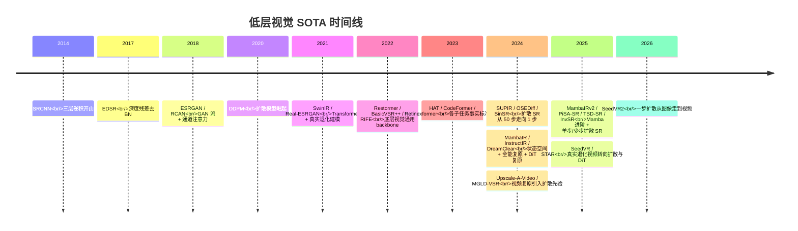
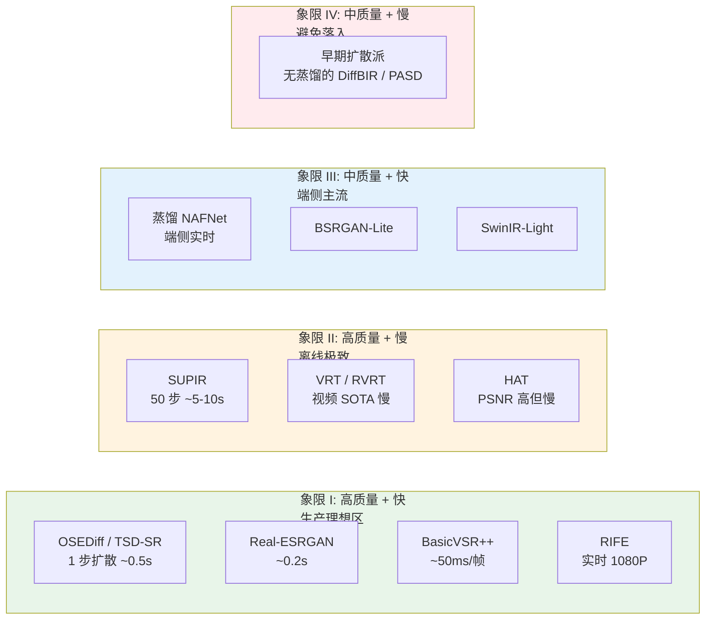
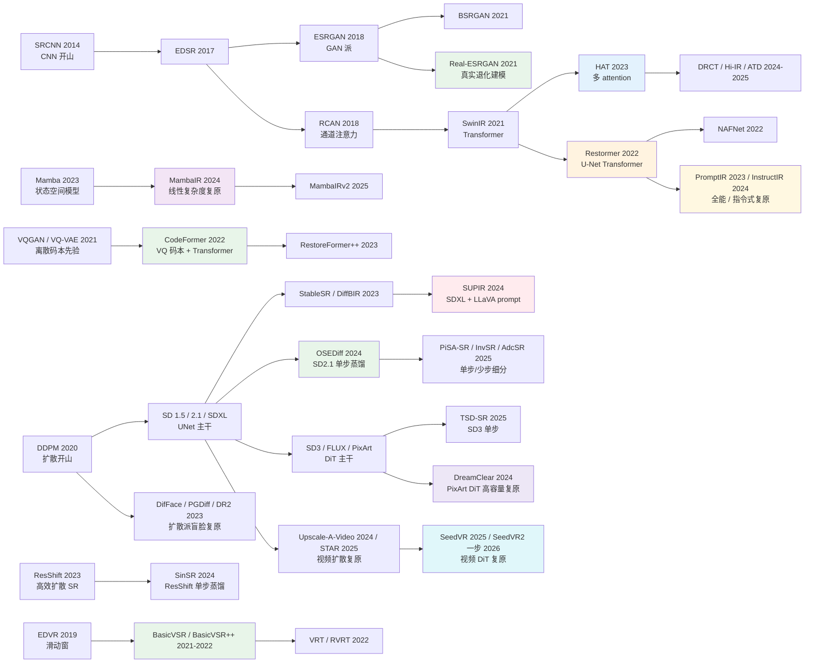

# 第 18 章 · SOTA 模型

> 这一章是这本书的"快速参考" - 9 个值得记住的 SOTA 模型 + 选型决策树。
>
> 模型本身会过时，**思路不会** - 所以每个模型都讲：核心思路、何时用、何时别用、被谁接班。

## 18.0 章首铺垫

走到这一章，前面 17 章已经把"为什么"、"怎么做"、"如何评"和"会怎么坏"都讲清楚了。这一章退一步，回答一个非常具体的工程问题：**在 2026 年这个时间点，如果今天就要从零搭一个增强系统，应该选哪些模型当基座？**

回答这个问题的难点不在"哪个模型在 benchmark 上最高"，而在**学术 SOTA 与工程 SOTA 几乎从不重合**。每年顶会出现的"刷分最高"的模型，落到产品上往往因为推理慢、部署难、对真实退化分布不鲁棒、社区维护停滞，最终用不进生产。反过来，真正在工业界被广泛部署的模型（Real-ESRGAN、CodeFormer、BasicVSR++）在论文发表时未必是当年的最高分，但它们的工程性 - 鲁棒性、可部署性、社区活跃度、可维护性 - 让它们成为五年时间尺度上的"事实标准"。

这一章选的 9 个模型是按"工程胜算"标准筛出来的，每一个都满足下面三条至少两条：在生产环境被广泛部署、开源代码长期维护、对真实退化分布有合理覆盖。它们不是论文榜单的子集，而是**这本书前 17 章所有论点在落地时的最佳兑现**。

模型本身会过时。SUPIR 2024 年还是扩散派的标杆，到 2025 年已经被一系列单步蒸馏接班；HAT 一度是 PSNR 派的天花板，现在 DRCT、Hi-IR、ATD 在各种 benchmark 上轮流登顶。这种"半衰期"在低层视觉领域大约是 12-18 个月。所以这一章除了介绍模型，还会在每个模型后面写"当前位置"和"被谁接班"，帮你在两年后回头读时知道哪一段已经过时、哪一段还活着。最后一节会给出"换 SOTA"的工程纪律：什么时候应该把生产模型换掉、什么时候应该按兵不动。

需要提前交代的是，这一章在 2026 年这一版做过一次系统性的补课。2024 年下半年到 2026 年之间，低层视觉又生出几条此前不在这份名单里的主线：状态空间模型（以 Mamba 为代表）作为线性复杂度的架构分支，开始和注意力正面竞争；一个模型同时应对多种退化的"全能复原"与"指令式复原"成为热门方向；扩散复原的主干从 UNet 向 DiT（Diffusion Transformer，扩散式 Transformer）迁移，并出现了 DreamClear 这样的高容量标志性工作；把扩散复原从数十步压到一到四步的单步蒸馏在 2025 年继续深化；真实退化视频的复原也从循环卷积网络转向了扩散与 DiT。于是这一章保留原来那 9 个"工程胜算最高"的主力模型当脊梁，同时在相关小节里把这几条新主线接上，以便这份参考在 2026 年年中仍然站得住。

读这一章的方式建议是：第一遍按顺序读完，建立"在 2026 年这个时间点，每个子任务的默认选择是谁"的全景；之后遇到具体项目时再回到对应的小节，看"何时用 / 何时别用 / 关键参数"。9 个模型加起来覆盖了 90% 以上的增强需求场景，剩下的 10% 在 18.13 节"哪些 SOTA 没列"里给了出口。

## 18.0.1 缩写与术语注

这一章涉及的缩写横跨四个家族（生成派、Transformer 派、视频派、特化派），集中放在这里：

- **SR**（Super-Resolution，超分辨率）：把低分辨率图升采样到高分辨率。
- **VSR**（Video Super-Resolution，视频超分辨率）。
- **NR-IQA**（No-Reference Image Quality Assessment，无参考图像质量评估）。
- **PSNR / SSIM / LPIPS / DISTS**：常用 IQA 指标，详见第 4 章。
- **MANIQA / CLIP-IQA / Q-Align**：当前主流 NR-IQA 模型。
- **DDPM / DDIM**（Denoising Diffusion Probabilistic / Implicit Model）：扩散模型两类基础采样器。
- **SD / SDXL / SD3 / SD3.5 / FLUX**（Stable Diffusion 系列与同代 DiT 主干）：文生图基模。SDXL 是 2.6B 参数 UNet 主干；SD3 / SD3.5 / FLUX 是 2024-2025 出现的 MM-DiT（Multi-Modal Diffusion Transformer）主干。
- **ControlNet**：把额外视觉条件（边缘 / 深度 / LR 图）注入预训练 UNet 的旁路网络，给扩散派增强提供"对齐输入图"的能力。
- **LoRA**（Low-Rank Adaptation）：低秩适配器，仅训练原模型权重的低秩残差，用来在 base 模型上低成本特化任务。
- **LLaVA**（Large Language and Vision Assistant）：开源多模态大模型，SUPIR 用它给输入图自动生成 prompt 作为文本条件。
- **VAE**（Variational AutoEncoder）：扩散派把图像编码到 4× 或 8× 下采样的潜空间用的网络。
- **ZeroSFT**（Zero-init Spatial Feature Transform）：SUPIR 用的零初始化空间调制层，把 ControlNet 特征注入 SDXL 主干而不破坏预训练权重。
- **CFG**（Classifier-Free Guidance）：扩散采样里的 prompt 强度旋钮。
- **SUPIR / OSEDiff / TSD-SR / PiSA-SR / InvSR / SinSR / DiffBIR / PASD / SeeSR / ResShift / StableSR / AdcSR**：扩散派 SR 路线上的不同工程方案，本章和上一章都会反复提到。
- **VSD / TSD**（Variational / Target Score Distillation）：把多步扩散蒸馏到单步的两个代表损失。
- **GAN**（Generative Adversarial Network）：判别器-生成器对抗训练。
- **ESRGAN / Real-ESRGAN / BSRGAN**：GAN 派 SR 的代表，Real-ESRGAN 的核心贡献在退化合成 pipeline。
- **HAT / SwinIR / DRCT / Hi-IR / ATD**：Transformer 派 PSNR-导向 SR 模型。
- **MambaIR / MambaIRv2 / VMambaIR / RetinexMamba**（Mamba for Image Restoration，状态空间图像复原）：以状态空间模型（SSM）替代注意力的复原架构分支，主打线性复杂度。
- **PromptIR / InstructIR / DA-CLIP / AutoDIR / DiffUIR**：全能复原 / 指令式复原（all-in-one / instruction-based restoration）模型，一个模型应对多种退化。
- **DreamClear / SD3 / FLUX / PixArt**：DiT（Diffusion Transformer，扩散式 Transformer）主干及其上的复原工作。
- **Restormer / NAFNet / MAXIM / Uformer**：通用底层视觉 backbone（去噪 / 去模糊 / 去雨）。
- **CodeFormer / GFPGAN / GPEN / RestoreFormer++ / DifFace / PGDiff / DR2**：人脸修复模型（后三者为扩散派盲脸复原）。
- **BasicVSR++ / VRT / RVRT / EDVR / SeedVR / STAR / Upscale-A-Video**：视频超分与视频复原模型（后三者为视频扩散 / DiT 路线）。
- **RIFE / FILM / AMT / GIMM-VFI / EMA-VFI / VFIformer**：帧插值模型。
- **Retinexformer / LightenDiffusion / GLARE / QuadPrior / RetinexMamba / LLFormer / SCI / EnlightenGAN**：低光增强模型。
- **HDR / SDR**（High / Standard Dynamic Range，高/标准动态范围）：HDR 指亮度范围超出 8-bit SDR 的格式，常见 10-bit / 12-bit。
- **WCG**（Wide Color Gamut，广色域）：色域超过 Rec.709 的色彩空间。
- **Rec.709 / Rec.2020**：HDTV 与 UHD（4K / 8K）的色域与电光转换函数（EOTF）标准。
- **ACES**（Academy Color Encoding System，学院色彩编码系统）：电影工业的统一色彩管线。
- **ProRes**：Apple 的视觉无损中间编码格式，电影后期常用。
- **Bayer / CFA / RGGB**（Color Filter Array / Red-Green-Green-Blue Pattern）：相机传感器颜色滤镜阵列。
- **CDN**（Content Delivery Network）：图像在网络传输中常被边缘节点重压缩。
- **TensorRT / CoreML / ONNX**：常见推理引擎与中间表示。
- **QAT / PTQ**（Quantization-Aware Training / Post-Training Quantization）：训练时量化与训练后量化。
- **OCR**（Optical Character Recognition）：光学字符识别。

## 18.1 选型概览

```
通用增强 SOTA (5)
  ┌─ SUPIR              — 扩散派 / 创意放大（完整 50 步）
  ├─ OSEDiff / TSD-SR   — 扩散派 / 单步蒸馏（生产实时）
  ├─ Real-ESRGAN        — 真实退化建模派
  ├─ HAT                — Transformer 非扩散派
  └─ Restormer          — 去噪 / 去模糊 / 去雨通用 backbone

任务特化 (4)
  ┌─ CodeFormer   — 人脸修复
  ├─ BasicVSR++   — 视频超分
  ├─ RIFE         — 帧插值
  └─ Retinexformer — 低光增强
```

9 个模型，每个代表一种思路。其中 SUPIR 与 OSEDiff/TSD-SR 是同一扩散派的两个工程位面 - 前者 50 步追极致质量，后者 1 步推产品落地。

这份 9 个模型的名单是"默认从这里选"的工程主力。除此之外，2024 年下半年以来成形的几条新主线（状态空间 / Mamba、全能复原 / 指令式复原、DiT 复原、单步扩散 SR、视频扩散复原）会在对应小节里接进来。它们目前更多是"必须知道、值得跟踪"的走向，还没有整体取代上面这 9 个的部署地位；换句话说，这一章的组织方式是"以 9 个主力为骨、以 5 条新线为脉"。

## 18.1.1 时间线：从 SRCNN 到单步扩散

把过去十年低层视觉的关键节点拉成一条时间线，能看到一个清晰的多段演化：2014-2020 是判别式派的天下，从 SRCNN 到 SwinIR 是网络架构的演进；2021 以后真实退化建模（Real-ESRGAN）和扩散派（StableSR / DiffBIR / SUPIR）分庭抗礼；2024 起单步蒸馏让扩散派第一次具备生产部署条件，与此同时低层视觉又同时长出三条新线：状态空间 / Mamba 架构、全能复原 / 指令式复原，以及从 UNet 迁向 DiT（SD3 / FLUX / PixArt）的扩散复原。到 2025-2026 年，这些线各自往前推进，真实退化视频的复原也整体转向扩散与 DiT。



这条时间线的几个观察值得记住：

1. **架构创新的边际收益在递减**：从 SRCNN 到 SwinIR 是网络层数和 attention 形态的探索，每一代的 PSNR 涨幅约 0.5-1 dB；2021 之后单纯的架构改进很少超过 0.2 dB。
2. **数据创新的边际收益在上升**：Real-ESRGAN 把"训练-推理失配"从 3-5 dB 的鸿沟收回，这是单纯换网络做不到的。这与第 1.7 节呼应。
3. **生成式派从"研究"到"生产"花了大约 4 年**：DDPM 在 2020 年提出，到 2024 年单步蒸馏才让它真正能进生产 pipeline。
4. **DiT 主干替换已经落地为具体工作**：SDXL 主导了 2023-2024 的扩散派 SR，此后主干开始从 UNet 迁向 DiT。到 2024 年底，DreamClear（基于 PixArt 这一代 DiT）已经证明高容量 DiT 能撑起真实复原，2025 起又有基于 FLUX 的复原工作。换句话说，"DiT 复原还缺一个标志性成果"这个 2024 年中的判断已经被推翻，只是它的部署生态仍落后 UNet 派一到两代。
5. **架构谱系从两条主线变成三条主线**：卷积与注意力之外，状态空间模型（Mamba）以线性复杂度另起一支，MambaIR、MambaIRv2 在超分 benchmark 上已经能与注意力互有胜负，成为值得单独跟踪的第三条架构分支。
6. **"一个模型吃多种退化"与"单步扩散进视频"同时成形**：从 PromptIR 到 InstructIR，全能复原与指令式复原把"先判别退化、再选专用模型"的传统 pipeline 压进一张网络；与此同时，SeedVR2 这类工作在 2026 年把图像那边的"单步扩散"思路搬到了真实退化视频上。

## 18.1.2 速度-质量权衡象限

另一个对选型最直接有帮助的视角是把候选模型放进"速度-质量"二维平面。质量用主观/NR-IQA 评分（横轴），速度用 1080P 单张推理时间（纵轴，越小越快）。落在不同象限的模型对应不同的产品定位：



读这张图的几个工程结论：

- **象限 I 是产品理想区**：2025 年起，扩散派单步蒸馏（OSEDiff / TSD-SR）和真实退化派（Real-ESRGAN）共同占据这个区域。开新项目时默认从这里选。
- **象限 II 是离线极致区**：当延迟约束被放松（电影后期、出版印刷、高端用户的"批量处理"模式），SUPIR / VRT 仍然有不可替代的质量上限。
- **象限 III 是端侧主流区**：手机 / 嵌入式部署的事实标准，质量低于象限 I 但能在手机 SoC 上实时跑。
- **象限 IV 是要避免的区域**：质量没到极致、速度又不快的模型基本会被同代竞品挤掉，是"换 SOTA"的首要候选。
- **多步扩散到单步扩散是从象限 II 跳到象限 I**：这是 2024-2025 年最重要的工程位移，OSEDiff / TSD-SR / SinSR 的核心价值就在这次跨象限跳跃。

## 18.2 SUPIR：扩散派创意放大

### 核心思路

把 SDXL（2.6B 参数文生图模型）的生成能力**拼接到 SR 任务上**：

```
LR Image
  ↓ ControlNet 注入
  ↓ SDXL UNet (frozen) + ZeroSFT 调制
  ↓ LLaVA 自动生成 prompt 作为文本条件
  ↓ Restoration-Guided Sampling
HR Image (创意丰富)
```

### 一句话记住

"用文生图大模型的世界知识，给一张烂图猜出最合理的高清版"。

### 何时用

- **严重退化的老照片**（人脸糊、纹理丢失）
- **追求视觉真实感的应用**（艺术放大、自媒体修复）
- **可以接受 5-10 秒/张推理**

### 何时别用

- 需要严格保真（法医、监控）
- 需要实时（视频、直播）
- 端侧部署

### 关键参数

```python
{
    'num_inference_steps': 50,      # 默认 50
    'guidance_scale': 7.5,          # CFG 强度
    'control_scale': 0.7,           # ControlNet 强度
    's_stage1': -1,                 # 自适应噪声起点
    'restoration_guidance': True,   # 使用 restoration-guided sampling
}
```

### 当前位置

2024 年扩散派 SR 的代表标杆。2025-2026 年方向往**单步 / 少步扩散**走：OSEDiff、TSD-SR、PiSA-SR、InvSR、AdcSR 等**一步或少步出图**的工作把扩散派从数十步推理降到一到几步，质量向 SUPIR 一档看齐而速度提升一两个数量级。需要澄清的是，这些工作并不是 SUPIR 的直接后代（它们各自基于 SD2.1、SD3、ResShift 等不同基座），而是同一"扩散派 SR"大方向下并行的高效化路线。生产环境如果开始一个新项目，应该先看这些高效后续，而不是直接上完整的 SUPIR。与此同时，追极致质量的离线场景里，DiT 复原（DreamClear 一类）也提供了 SUPIR 之外的另一个高容量选项。

### 论文与代码

- 论文：Yu et al. "Scaling Up to Excellence: Practicing Model Scaling for Photo-Realistic Image Restoration In the Wild"（方法名 SUPIR，CVPR 2024）
- 代码：[github.com/Fanghua-Yu/SUPIR](https://github.com/Fanghua-Yu/SUPIR)
- 并行的高效化路线（非 SUPIR 后代）：OSEDiff（NeurIPS 2024）、TSD-SR / PiSA-SR / InvSR / AdcSR（CVPR 2025）等

## 18.3 Real-ESRGAN：真实退化建模派

### 核心思路

和 ESRGAN 相比，**网络几乎没变**（仍是 RRDB），**贡献全在数据**：

- 二阶退化 pipeline（第 5 章 5.4 节）
- 复杂噪声合成（高斯 + 泊松 + 真实传感器）
- sinc 滤波模拟过锐化伪影

### 一句话记住

"同样的网络，让训练数据见到真实世界的退化分布，效果质变"。

### 何时用

- **生产环境的通用增强**：平衡质量、速度、稳定性
- **不能接受 GAN 编造**（虽然 Real-ESRGAN 也用 GAN 损失，但比扩散保守得多）
- **需要在普通 GPU / 端侧跑**

### 何时别用

- 严重退化（扩散派更合适）
- 极轻量端侧（用蒸馏版 Real-ESRGAN-Mini）

### 当前位置

是工业界增强模型的事实标准。Topaz Photo AI、剪映、各种修图 App 底层都基于 Real-ESRGAN 或它的变体。

### 论文与代码

- 论文：Wang et al. "Real-ESRGAN: Training Real-World Blind Super-Resolution with Pure Synthetic Data" (ICCVW 2021)
- 代码：[github.com/xinntao/Real-ESRGAN](https://github.com/xinntao/Real-ESRGAN)

## 18.4 HAT：Transformer 非扩散派 SOTA

### 核心思路

在 SwinIR 基础上**加更多 attention 模块**，提升模型利用输入信息的能力：

- Window Self-Attention (W-MSA + SW-MSA) — 继承 SwinIR
- **Channel Attention Block (CAB)** — 加 RCAN 风格通道注意力
- **Overlapping Cross-Attention Block (OCAB)** — 跨窗口直接交换

### 一句话记住

"把 Transformer 的容量挖到极限，是当前 PSNR 派的天花板"。

### 何时用

- **学术 benchmark 比赛**（PSNR/SSIM 优先）
- **需要客观保真**且能接受较慢推理
- **作为知识蒸馏的教师**（用 HAT 蒸馏出小模型）

### 何时别用

- 真实退化场景（HAT 在 bicubic 退化上训，对真实退化不鲁棒）
- 实时应用
- 资源受限

### 关键数字

- HAT-L 在 Set5 4× 上 **约 33.0–33.4 dB**（视训练设置/是否 ImageNet 预训练）
- 参数量 ~40M
- 推理：单张 256×256 在 A100 ~80ms

### 当前位置

PSNR-导向 Transformer SR 的代表 baseline。**不是当前唯一 SOTA**：2024-2025 年 DRCT、Hi-IR、ATD 等模型在多个 benchmark 上与 HAT 互有胜负，与此同时状态空间 / Mamba 路线（MambaIR、MambaIRv2，见下一小节）也在同一批超分 benchmark 上加入竞争，在质量上与注意力互有高下。但 HAT 仍是教学、蒸馏教师、对比基准的好选择。生产环境用得不多，因为这个领域的"工程上限"和"benchmark 上限"是两回事。

### 论文与代码

- 论文：Chen et al. "Activating More Pixels in Image Super-Resolution Transformer" (CVPR 2023)
- 代码：[github.com/XPixelGroup/HAT](https://github.com/XPixelGroup/HAT)

## 18.4.1 状态空间 / Mamba：与注意力竞争的架构分支

前面从 SRCNN 一路讲到 HAT，架构的主线一直在"卷积"和"注意力"两条路之间摆动。2024 年前后，低层视觉多出了第三条值得认真对待的架构分支：状态空间模型（State Space Model，简称 SSM），其中最有代表性的是 Mamba。

要理解它为什么被引进来，先回到注意力的老问题。自注意力（self-attention）对一张图里的每个位置都要和其它所有位置两两算相关，计算量随像素数成平方增长，处理高分辨率图时显存和时间都相当紧张。Restormer 之所以把注意力搬到通道维，正是为了绕开这条平方复杂度。状态空间模型给了另一条出路：它把二维图像展开成序列，用一个可以随位置滑动、带隐状态的线性扫描来传递全局信息，复杂度随序列长度线性增长。换句话说，它想同时拿到"全局感受野"和"线性开销"这两样通常互相冲突的东西。

把这条思路落到图像复原上的代表工作，是 MambaIR（Mamba for Image Restoration，ECCV 2024）。它给出了一个基于状态空间模型的复原骨干，在超分等任务上以相近甚至更省的算力，做到了和 SwinIR 一档乃至更好的质量。它的续作 MambaIRv2（CVPR 2025）针对纯序列扫描"只能沿扫描方向看"的局限，补上了类似注意力的非因果建模能力，让远处但相似的像素也能直接互相参照，在经典超分与轻量超分上都进一步逼近甚至超过了 HAT 一档的 Transformer。与此同时，这条线还生出若干分支：VMambaIR 用二维视觉扫描来处理图像，RetinexMamba 则把状态空间模型接到低光增强的 Retinex 框架上。

需要对它的位置有一个清醒的判断。到 2026 年年中，Mamba 路线在学术 benchmark 上已经能和注意力正面较量，是一条必须知道、值得跟踪的架构分支；但在工程部署上，它的算子生态（尤其是各推理引擎对选择性扫描核的支持）还远不如卷积和注意力成熟。归根结底，它现在的价值更多在"架构可能性"这一侧，离 Real-ESRGAN、HAT 那种"随手就能部署"还有一段距离。

## 18.5 Restormer：去噪 / 去模糊 / 去雨的 U-Net Transformer

### 核心思路

第 7 章 7.5 节讲过 MDTA（Multi-Dconv Head Transposed Attention）：把 self-attention 从空间维搬到通道维，复杂度从 $O(N^2)$ 降到 $O(C^2)$，对大图友好。配上 GDFN（Gated-Dconv Feed-Forward Network），整体是 4 层 U-Net 结构：

```
Input
  ↓ Encoder (4 levels of MDTA + GDFN)
  ↓ Latent (深层 MDTA + GDFN)
  ↓ Decoder (4 levels, with skip connections)
Output
```

不同任务用同一架构，只换训练数据：高斯/真实噪声去噪、运动去模糊、失焦去模糊、去雨。

### 一句话记住

"通道维 attention + 多任务通用 U-Net backbone，**SR 之外**所有底层视觉的事实标准 baseline"。

### 何时用

- **去噪**（高斯、真实传感器、合成噪声）
- **去模糊**（运动、失焦）
- **去雨 / 去雾 / 去摩尔纹**
- **大图推理**（MDTA 显存友好，1080P 单张可整图过模型）
- **视频底层任务的单帧 baseline**（接 BasicVSR++ 的对比）

### 何时别用

- **纯 SR**（HAT / SwinIR / DRCT 在 SR benchmark 上更强；Restormer 不是为 upsampling 设计的）
- **极轻量端侧**（推理偏慢，参数 ~26M，需要蒸馏）
- **任务里包含放大**（要么改成 Restormer + sub-pixel head，要么直接选 SR 派）

### 关键数字

- GoPro 去模糊：32.92 dB / 0.961 SSIM
- SIDD 真实去噪：40.02 dB / 0.960 SSIM
- 参数量 ~26M
- A100 上 256×256 推理 ~50ms

### 当前位置

2022 至 2026 年**去噪/去模糊/去雨的事实标准 baseline**：任何一篇底层视觉论文做这三个任务必须和 Restormer 比。MDTA 模块本身被后续大量工作沿用（包括视频派和扩散派的部分实现）。**HAT 是 SR 派代表，Restormer 是 restoration 派代表**，两者的位置不冲突，工程上常常同时部署（一个管 deblur/denoise，一个管 upsample）。

后续工作如 GRL、X-Restormer、PromptIR 在某些 benchmark 上略胜，但没有一个把 Restormer 完全替掉。

### 论文与代码

- 论文：Zamir et al. "Restormer: Efficient Transformer for High-Resolution Image Restoration" (CVPR 2022)
- 代码：[github.com/swz30/Restormer](https://github.com/swz30/Restormer)

## 18.5.1 全能复原与指令式复原：一个模型吃多种退化

Restormer 的做法是"一套架构、每个任务单独训一份权重"：去噪一份、去模糊一份、去雨一份。这在工程上意味着，产品要先判断输入图坏在哪里，再把它路由到对应的模型。2023 年以后，一条新的思路开始挑战这套流程：能不能训一个模型，让它同时应对多种退化，甚至让用户用一句话告诉它要修什么？这就是"全能复原"（all-in-one restoration）与"指令式复原"（instruction-based restoration）。

最早把这件事做清楚的代表之一是 PromptIR（Prompting for All-in-One Image Restoration，NeurIPS 2023）。它在复原网络里插入一组可学习的"提示"（prompt），这些提示会根据输入图自动编码出"这是哪一类、哪种程度的退化"，再回过头去动态调制复原过程。于是同一套权重就能在去噪、去雨、去雾之间自适应切换，而不需要外面先挂一个退化分类器。

沿着这条线往前，InstructIR（High-Quality Image Restoration Following Human Instructions，ECCV 2024）把条件从"模型自己猜的提示"换成"人写的自然语言指令"。用户给一张退化图，再给一句话，比如让它去噪、去模糊、提亮或去雨，模型据此在多种复原任务之间选择并执行。它是较早一批用人类文字指令统一驱动复原的工作，把"先判别退化、再选专用模型"这条传统 pipeline 压进了单一网络。与此同时，还有几条相关的支线：DA-CLIP（Degradation-Aware CLIP，退化感知的 CLIP）借视觉-语言模型的表示来感知退化类型，AutoDIR（ECCV 2024）走"自动检测退化、再统一复原"的路线，DiffUIR 则把这套"一个模型吃多种退化"的思路放进扩散框架。

这条线和本书反复讲的"退化 pipeline"主题是直接对话的关系。前面的章节强调，真实世界的退化是多种因素叠加的，产品往往要串起去噪、去模糊、超分等多级处理；全能复原试图把这种串联收进一个模型，指令式复原则把"修哪一处、修到什么程度"交回给用户或上层系统去表达。需要提醒的是，到 2026 年年中，全能复原在"每个单任务上都做到专用模型的水准"这件事上仍有折中：它换来的是部署与维护的简化，代价常常是在某个具体退化上略逊于为它量身训练的专用模型。于是它更适合"退化种类多、又不想维护许多套模型"的产品，而不是"只做一件事、且要把这件事做到极致"的场景。

## 18.6 OSEDiff / TSD-SR：单步与少步扩散 SR

### 核心思路

完整扩散 SR（如 SUPIR）50 步推理 5-10 秒/张，**生产落地的最大障碍是延迟**。2024-2025 年单步扩散蒸馏把这条路打通：

```
LR Image
  ↓ VAE encode（一次）
  ↓ Pre-trained UNet (LoRA finetuned for SR)
  ↓ One forward pass, no iterative denoising
  ↓ VAE decode
HR Image
```

蒸馏目标：让学生网络在任意噪声水平下，**一步**预测干净的 $x_0$。配合 score distillation / variational score distillation / target score distillation 等损失。

### 代表方法

单步 / 少步扩散 SR 在 2024 到 2025 年之间迅速细分成数支，值得分别记住它们的基座与卖点：

- **OSEDiff**（One-Step Effective Diffusion，NeurIPS 2024）：以变分得分蒸馏（Variational Score Distillation，VSD）训出单步学生，基座是 SD2.1-base（约 8 亿多参数），用 VAE 编码的低清图当初始，是这条线里被引用最多的起点之一。
- **SinSR**（CVPR 2024）：不是从大文生图模型蒸馏，而是在高效扩散 SR 方法 ResShift 的基础上做单步蒸馏，路线上和 OSEDiff 并不同源。
- **TSD-SR**（Target Score Distillation，CVPR 2025，arXiv 见于 2024 年底）：提出针对 SR 的目标得分蒸馏（TSD，目标得分蒸馏），基座换成了更新一代的 SD3（MM-DiT 主干），追求单步下更真实的细节。
- **PiSA-SR**（Pixel-level and Semantic-level Adjustable SR，CVPR 2025）：在预训练 SD 上学两个 LoRA，一个管像素级保真、一个管语义级细节，推理时给两个可调旋钮，让用户在保真与细节之间自行权衡。这一点和本书反复讲的"让用户调 fidelity"主题几乎是同一件事，值得单独记住。
- **InvSR**（Arbitrary-steps Image Super-resolution via Diffusion Inversion，CVPR 2025）：走"扩散反演"（diffusion inversion）的路子，把复原起点放在反演得到的中间噪声上，从而支持任意步数，兼顾单步的快和多步的可调。
- **AdcSR**（CVPR 2025）：把已经单步化的扩散 SR 再做一轮对抗式压缩，得到一个更小更快的单步生成器，质量仍向 SUPIR 一档看齐。
- **S3Diff、DFOSD** 等：分别从"退化引导的单步扩散"和"免蒸馏的单步扩散"等角度，继续压缩步数与训练成本。

### 一步扩散 vs 多步扩散：直觉与权衡

一步扩散看起来"违反直觉" - 扩散模型的核心论证就是把困难的一步生成拆成上千步小步，怎么又能压回一步？关键在于"蒸馏的对象不是采样过程，而是教师网络在不同噪声水平下的得分函数"。学生网络学的是：给定任意噪声水平和噪声样本，直接预测出最终的清晰图。这不是替代多步扩散的数学合理性，而是用一个更大的模型在更窄的输入分布上做更困难的任务，把"困难度预算"从迭代次数搬到模型容量。

在 SR 任务里这件事尤其合理 - 输入 $y$ 给了模型一个非常强的条件信号（不像无条件文生图那样从纯噪声出发），所以解空间已经被挤窄到一个相对低维的流形。一步逼近这个流形的中心是可行的，多步并没有带来质的提升，只是平滑了样本周围的小扰动。这就是为什么 OSEDiff / TSD-SR 在 SR 上能达到甚至超过多步基线，但同样的蒸馏路线在文生图上仍要保留 4-8 步才能保住质量 - SR 的条件信息密度远高于纯文生图。

工程上的权衡可以总结成一句话：**多步扩散是用时间换质量的旋钮，单步扩散是用模型容量换时间的固定选择**。前者灵活（推理时可以根据用户档位调节步数）但慢；后者快但失去步数调节自由度（要做"质量档"只能切到另一个模型）。生产系统多数选后者，并在用户的"高质量模式"按钮下保留一个多步扩散模型作为备选。

### 一句话记住

"扩散派从 50 步到 1 步，让 SUPIR 路线第一次能进生产环境"。

### 何时用

- **生产环境扩散派 SR**：2025 年起的默认选择
- **实时 / 准实时增强**（< 1 秒/张）
- **对 SUPIR 视觉质量满意但延迟不能接受**的场景

### 何时别用

- **极端退化 + 创意优先**（完整 SUPIR 仍偶有微弱质量优势，工业仍可保留作为离线处理选项）
- **严格保真**（扩散派的"猜"本质没变，只是更快了，不适合法医/监控）

### 关键数字

这条线的量化对比在不同论文里口径差异很大，这里只给方向性的判断，具体分数以各自论文为准：

- **推理步数与延迟**：从 SUPIR 的数十步压到 1 步（OSEDiff、TSD-SR、PiSA-SR、AdcSR）或少数几步（InvSR 可按需要选步数），延迟因此降到亚秒级，相对完整多步扩散是一两个数量级的提速。
- **基座与体积**：这一点很容易记错，值得强调。OSEDiff、PiSA-SR 这一支的基座是 SD2.1-base（约 8 亿多参数的 UNet），TSD-SR 换的是 SD3 的 MM-DiT 主干，二者都不是 SDXL。所以按 SDXL 规模去估"量化后要好几 GB"是偏大的：真实体积取决于所挂基座，SD2.1-base 这一支明显小于 SDXL 派，AdcSR 更是刻意把网络压小，进一步降低了部署体积。
- **质量**：在真实退化超分上，这些单步方法的感知质量与无参考质量已经能与多步基线打平，部分指标互有胜负；用"质量接近、速度大幅领先"来概括，比引用某个具体小数更稳妥。

### 当前位置

**2025-2026 年扩散 SR 工程主流**。SUPIR 仍是研究/教学的"完整版"标杆，但开新项目应当**默认从单步 / 少步蒸馏路线开始**。这条线被低估的工程价值在于：扩散派第一次具备了取代 Real-ESRGAN 在通用增强工作流中的延迟条件。到 2025 年，它内部还进一步分化出"可调档"的一支（PiSA-SR 用两个 LoRA 分别控制保真与细节，InvSR 用反演支持任意步数），把上一节讲过的"多步是旋钮、单步是固定选择"这个权衡又拉回了一部分灵活度。追极致质量的离线场景则可以看 DiT 复原（见下一小节）。

### 论文与代码

- OSEDiff：Wu et al. "One-Step Effective Diffusion Network for Real-World Image Super-Resolution"（NeurIPS 2024），基座 SD2.1-base，[github.com/cswry/OSEDiff](https://github.com/cswry/OSEDiff)
- SinSR：Wang et al. "SinSR: Diffusion-Based Image Super-Resolution in a Single Step"（CVPR 2024），蒸馏自 ResShift
- TSD-SR：Dong et al. "TSD-SR: One-Step Diffusion with Target Score Distillation for Real-World Image Super-Resolution"（CVPR 2025），基座 SD3
- PiSA-SR：Sun et al. "Pixel-level and Semantic-level Adjustable Super-resolution: A Dual-LoRA Approach"（CVPR 2025）
- InvSR：Yue et al. "Arbitrary-steps Image Super-resolution via Diffusion Inversion"（CVPR 2025）
- AdcSR：CVPR 2025 的对抗式压缩单步 SR；S3Diff、DFOSD 等为同期其它单步方案

## 18.6.1 DiT 复原：从 UNet 主干走向 Diffusion Transformer

前面讲的扩散 SR，无论 SUPIR 还是 OSEDiff，主干都还是 Stable Diffusion 那一代的 UNet。2024 年起，文生图基模本身开始更新换代：SD3、FLUX、PixArt 这一代把主干从 UNet 换成了 Diffusion Transformer（扩散式 Transformer，简称 DiT），也就是把扩散过程放到一个 Transformer 主干上跑。复原研究自然跟着往这个方向走。

需要先纠正一个到 2024 年中还常见、但已经过时的判断：曾有说法认为"DiT 复原还没有出现 SUPIR 那种级别的标志性工作"。这个判断在 2024 年底就被推翻了。DreamClear（High-Capacity Real-World Image Restoration，NeurIPS 2024）就是那件标志性工作：它以 PixArt 这一代的 DiT 为主干，配合多模态大模型给出的语义理解，做高容量的真实世界复原，并且专门搭了一条注重隐私安全的大规模数据构建流程，来为这么大的模型准备足够的训练数据。换句话说，它证明了高容量 DiT 主干确实能撑起真实复原这件事，而不只是文生图。

进入 2025 年，这条线继续沿着更新的基模往前走，出现了以 FLUX 为基座的复原工作。归根结底，DiT 复原到 2026 年年中还处在"基座在换代、方法在跟进"的阶段：它的质量上限被看好，但生态成熟度（可用的开源实现、部署工具链）仍落后 UNet 派一到两代。于是对大多数产品来说，它现在是"值得跟踪、择机尝试"，而不是"立刻换上生产线"。另外要留意的是，第 9 章提示过，DiT 主干的条件注入方式和 UNet 时代并不一样：UNet 靠复制 encoder、往 skip 上加、替换 conv_in，而 DiT 通常是把控制信息拼成 token 进序列，或者走专门的 conditioning block。把 UNet 时代的 ControlNet 机制直接照搬到 DiT 上，往往并不成立。

## 18.7 CodeFormer：人脸修复

### 核心思路

把人脸的局部特征**离散化**为 codebook 里的若干 code，通过 Transformer 预测 code 序列：

```
LR Face
  ↓ Encoder
  ↓ Transformer (predict discrete code indices)
  ↓ Codebook lookup
  ↓ Decoder
HR Face
```

外加可调的 `fidelity_weight ∈ [0, 1]`，用户可选"严格保真"还是"充分用先验"。

### 一句话记住

"用 VQ codebook 而不是 StyleGAN 给人脸做强先验，可调节 fidelity 是关键工程亮点"。

### 何时用

- **任何人脸增强场景**：这是当前事实标准
- **老照片人脸**（fidelity = 0.5）
- **视频会议**（fidelity = 0.7，保守不变样）

### 何时别用

- **法医证据**（不允许编造）
- **极小人脸**（< 32×32 像素，先验都救不回来）

### 关键参数

```python
{
    'fidelity_weight': 0.5,      # 0=纯先验, 1=纯 LR; 默认 0.5 平衡
    'face_align': True,          # 必须先对齐
    'crop_size': 512,            # 预训练用 512 输入
}
```

### 当前位置

人脸修复的工程标准。GFPGAN 仍在用，但 CodeFormer 的可调性使它在产品中更受欢迎。

### 被谁接班 / 一起用

CodeFormer 走的是"VQ 码本 + Transformer 预测码序列"的判别-生成混合路线，到 2026 年它仍是人脸修复里最稳、最好部署的默认项。与此同时，2023 年以后又长出一条扩散派的盲人脸复原线，值得知道：DifFace 通过把退化误差逐步收缩到扩散轨迹上来复原，PGDiff 用部分引导（partial guidance）让一个通用扩散模型适配多种人脸复原需求，DR2 则先用扩散去除退化、再接一个增强模块。再往后，还出现了把这套扩散人脸复原压到单步的工作。这条线的长处是先验更丰富、对严重退化的想象力更强，短处则和所有扩散派一样：更容易"编"出原图没有的细节，也更重。于是在需要保真、需要可控 fidelity 的产品里，CodeFormer 仍是更稳的默认；扩散派人脸复原更多用在"就是要追求极致观感、且能接受一定虚构"的场景。

### 论文与代码

- 论文：Zhou et al. "Towards Robust Blind Face Restoration with Codebook Lookup Transformer" (NeurIPS 2022)
- 代码：[github.com/sczhou/CodeFormer](https://github.com/sczhou/CodeFormer)
- 扩散派盲脸复原：DifFace、PGDiff、DR2 等（2023 起），以及后续的单步扩散人脸复原

## 18.8 BasicVSR++：视频超分

### 核心思路

双向循环 + 二阶传播 + flow-guided DCN（第 14.3 节详谈）：

```
所有帧的特征
  ↓ 前向 RNN (二阶传播)
  ↓ 后向 RNN (二阶传播)
  ↓ 聚合 (concat + conv)
  ↓ Upsample
HR 视频
```

### 一句话记住

"双向循环让每帧能用过去和未来信息，二阶传播绕过光流误差累积"。

### 何时用

- **VSR 任务**（事实标准）
- **视频去模糊、视频去噪**（同架构改训练数据）
- **质量优先 + 不要求实时**

### 何时别用

- 实时直播（即使 BasicVSR++ 也太慢，需要蒸馏版）
- 极端长视频（隐状态累积误差）

### 关键数字

- REDS4 4× VSR：32.4 dB（前 SOTA EDVR 31.1 dB）
- 推理：A100 上 ~50ms / 720P 帧

### 当前位置

这一点在 2026 年要分两种场景来说。在学术的双三次 / 已知退化 benchmark（例如 REDS、Vimeo-90K）上，BasicVSR++ 到 2026 年仍是绕不开的强基线，双向循环加二阶传播这套设计依旧稳。但如果把镜头对准真实退化视频（老旧影片、压缩严重的网络视频、手机日常拍摄），把 BasicVSR++ 当成"贯穿到 2026 的事实标准"就站不住了：这一侧的前沿在 2024 到 2025 年之间已经明显转向扩散与 DiT，下一小节单独讲。RVRT / VRT 在 PSNR 上比它更高但更慢，属于同一"已知退化"阵营里的更重选项。

### 论文与代码

- 论文：Chan et al. "BasicVSR++: Improving Video Super-Resolution with Enhanced Propagation and Alignment" (CVPR 2022)
- 代码：[github.com/open-mmlab/mmagic](https://github.com/open-mmlab/mmagic) (MMEditing 内)

## 18.8.1 视频扩散复原：真实退化视频的新前沿

BasicVSR++ 这类循环卷积网络是在"退化已知、且相对温和"的设定下训练与评测的。可真实世界的视频退化往往既复杂又严重，还叠加了压缩伪影和时间上的不稳定。于是从 2024 年起，真实退化视频超分的前沿转到了扩散和 DiT 上，思路和图像那一侧同源：借文生图 / 文生视频大模型的生成先验，去"想象"出被退化抹掉的细节，同时设法抑制扩散天然带来的帧间闪烁。

这条线的代表工作可以串成一条清楚的脉络。Upscale-A-Video（CVPR 2024）把图像扩散先验引入真实退化视频超分，并用局部到全局的时序策略去缓解闪烁。MGLD-VSR（Motion-Guided Latent Diffusion，运动引导的潜扩散，ECCV 2024）用运动信息去约束潜空间扩散，让相邻帧更一致。VEnhancer 则借文生视频模型做统一的时空增强，尤其擅长修正 AI 生成视频的瑕疵。进入 2025 年，STAR 借文生视频模型的时空先验去做真实退化视频超分；ByteDance 的 SeedVR（CVPR 2025 Highlight）把复原直接放到一个大型 DiT 上，主打"任意长度、任意分辨率"的通用视频复原。到 2026 年，它的续作 SeedVR2 进一步把这套 DiT 复原压到一步完成，等于把图像那边"单步扩散"的思路搬到了视频上。

需要保持和上一小节一致的判断：这些扩散 / DiT 方法在真实退化视频上的观感优势是实打实的，但它们普遍更重、对时间一致性的把控也更依赖工程投入。归根结底，到 2026 年年中，"已知退化、要快、要稳"仍然优先 BasicVSR++ 一档；"真实重退化、追求观感、能接受更高成本"才往扩散 / DiT 这条新线上走。

## 18.9 RIFE：帧插值

### 核心思路

不显式估计两端帧间的光流，**直接预测中间帧到两端的光流**：

```
F_t, F_{t+1}
  ↓ IFNet (Intermediate Flow Net)
  ↓ flow_to_t, flow_to_{t+1}, fusion_mask
  ↓ warp F_t with flow_to_t → warped_t
  ↓ warp F_{t+1} with flow_to_{t+1} → warped_t+1
  ↓ blend = mask * warped_t + (1-mask) * warped_t+1
F_{t+0.5}
```

### 一句话记住

"直接预测中间帧到两端的光流，避开中间帧不存在的悖论"。

### 何时用

- **任何帧插值任务**（事实标准）
- **30 fps → 60 fps、60 fps → 120 fps**
- **慢动作**（24 fps → 240 fps）
- **实时插值**（RIFE 在 1080P 上能跑 30 FPS+）

### 何时别用

- 超大位移（FILM 更鲁棒）
- 严重遮挡场景（AMT 更好）

### 关键参数

```python
{
    'scale': 1.0,        # 1=4K, 0.5=对 4K 更稳定
    'tta': False,        # test-time augmentation, 慢但精度高
}
```

### 当前位置

帧插值的工程性价比标准。后续工作各有侧重：FILM 强在大位移，AMT（CVPR 2023）以全对相关体加多场光流细化见长，EMA-VFI 引入更强的运动特征提取，GIMM-VFI（Generalizable Implicit Motion Modeling，可泛化的隐式运动建模，NeurIPS 2024）用一个隐式的连续运动场来预测任意时刻的光流，在复杂运动上更稳。与此同时，还有一条把视频扩散 / 生成模型用于插帧的新线，靠生成先验去推断中间帧，在大遮挡、大位移这类传统光流最棘手的场景里更有想象力，代价是更重、也更容易生成不该有的内容。到 2026 年，RIFE 仍是"要快、要稳、要好部署"时的默认，新方法则在质量上限和困难场景上继续推进。

### 论文与代码

- 论文：Huang et al. "Real-Time Intermediate Flow Estimation for Video Frame Interpolation" (ECCV 2022)
- 代码：[github.com/megvii-research/ECCV2022-RIFE](https://github.com/megvii-research/ECCV2022-RIFE)

## 18.10 Retinexformer：低光增强

### 核心思路

把传统的 Retinex 理论（图像 = 反射 × 光照）和 Transformer 结合：

```
Low-light image
  ↓ 分解为 Reflectance + Illumination (传统 Retinex)
  ↓ Transformer (Illumination-Guided Transformer)
  ↓ 合成增强图
Enhanced image
```

### 一句话记住

"用 Retinex 物理模型作为归纳偏置，让模型重点学反射不变性"。

### 何时用

- **低光照片**（夜景、室内昏暗）
- **过曝校正**（部分支持）
- **HDR tone mapping 的辅助**

### 何时别用

- 噪声主导的极暗场景（< 0.1 lux）：Retinex 假设失效
- 多光源混合：Retinex 简化了光照模型

### 当前位置

低光增强的代表 baseline，到 2026 年仍常被当作对比基准。它之后这几年，低光增强又出现若干条接班线，值得知道：

- **LightenDiffusion**（ECCV 2024）：把 Retinex 分解放进潜空间，再用扩散做无监督的低光增强，属于低光里的扩散派代表。
- **GLARE**（ECCV 2024）：走"码本检索生成先验"的路子，用正常光照的码本去引导增强。
- **QuadPrior**（CVPR 2024）：用一组物理先验做零参考（无需成对数据）的低光增强。
- **RetinexMamba**：把前面讲的状态空间 / Mamba 架构接到 Retinex 框架上，追求线性复杂度下的低光增强。
- 更早的两条老选择仍可用作对照：LLFormer（Transformer 早期方法）与 SCI（更轻量的 CNN，端侧友好）。

一句提醒：低光这条线到 2026 年整体在往扩散派和物理先验两个方向走，Retinexformer 更像是"稳、轻、好复现"的默认起点，而不是质量天花板。

### 论文与代码

- 论文：Cai et al. "Retinexformer: One-stage Retinex-based Transformer for Low-light Image Enhancement" (ICCV 2023)
- 代码：[github.com/caiyuanhao1998/Retinexformer](https://github.com/caiyuanhao1998/Retinexformer)
- 接班线：LightenDiffusion、GLARE（ECCV 2024），QuadPrior（CVPR 2024），RetinexMamba 等

## 18.11 选型决策树

按场景给推荐：

```
任务是什么?
  │
  ├─ 通用 SR
  │   │
  │   ├─ 离线 + 极致质量 + 不限延迟 → SUPIR（多步）或 DiT 复原（DreamClear）
  │   ├─ 实时扩散派（默认 2025 起）→ OSEDiff / TSD-SR（单步）
  │   ├─ 想让用户调 fidelity（像素/语义双档）→ PiSA-SR
  │   ├─ 真实场景 + 工程稳定（CNN/GAN 派）→ Real-ESRGAN
  │   └─ 学术 benchmark / PSNR 比赛 → HAT 或 MambaIRv2（Mamba 线）
  │
  ├─ 去噪 / 去模糊 / 去雨（不放大）
  │   ├─ 单任务、要稳 → Restormer  ←─ 默认
  │   └─ 多种退化混合 / 不想维护多套模型 → 全能复原（PromptIR / InstructIR）
  │
  ├─ 人脸增强
  │   ├─ 要保真、要可调 fidelity → CodeFormer  ←─ 默认
  │   └─ 极致观感、可接受一定虚构 → 扩散派盲脸复原（DifFace / PGDiff）
  │
  ├─ 视频超分
  │   ├─ 已知退化 / 要快 → BasicVSR++
  │   ├─ 真实重退化 / 追求观感 → 视频扩散复原（SeedVR / STAR）
  │   ├─ 实时直播 → 蒸馏版 BasicVSR-Mini + TensorRT
  │   └─ 离线高质量（已知退化）→ BasicVSR++ 或 RVRT
  │
  ├─ 帧插值 → RIFE
  │   ├─ 大位移 → FILM
  │   ├─ 严重遮挡 → AMT
  │   └─ 复杂运动 / 任意时刻 → GIMM-VFI
  │
  ├─ 低光增强 → Retinexformer
  │   └─ 要更强先验 / 真实重退化 → LightenDiffusion（扩散派）
  │
  ├─ 文档增强 → 专用 DocSR + OCR-aware loss (第 10.7 节)
  │
  └─ 端侧实时 → 蒸馏版 NAFNet + CoreML/TensorRT FP16
```

## 18.12 学术 SOTA vs 工程 SOTA

最后强调一个反复出现的主题：

> 这一章列的 9 个模型不是"刷分最高的"。
>
> 它们是**工程上最值得部署**的：平衡了效果、速度、稳定性、可维护性。

学术 benchmark 的 SOTA 经常是：

- 比 baseline 提升 0.1-0.3 dB
- 但参数量 / 推理速度 5-10× 差
- 在真实场景下提升不明显

工程上更看重：

- **鲁棒性**（不在常见输入上崩）
- **稳定性**（不同硬件上结果一致）
- **可部署性**（能转 ONNX、能量化、能 tile）
- **可维护性**（有官方代码、有持续维护、有社区）

这 9 个模型在这些维度上都是同类最好。

## 18.13 哪些 SOTA 没列

值得知道但本章没单独列（或只在前面小节点到）的（按类别）：

### 通用 SR 派系

- **DiffBIR**：扩散派，比 SUPIR 早；两阶段设计，先用 SwinIR 一类网络去退化，再用 ControlNet 式的注入把结果送进冻结的 SD（并非"CLIP image 走 cross-attention"，这是常见的误记）
- **SeeSR**：扩散派 + 语义先验，更注重控制
- **ResShift**：扩散派的高效采样（被 SinSR 蒸馏到单步）
- **StableSR / PASD**：扩散 SR 的其它注入范式（详见第 9 章）
- **DRCT / Hi-IR / ATD**：HAT 同期/后续 PSNR 派 Transformer SR
- **MambaIR / MambaIRv2 / VMambaIR**：状态空间 / Mamba 架构 SR（见 18.4.1）
- **DreamClear，及 FLUX 基座复原**：DiT 复原（见 18.6.1）
- **PiSA-SR / InvSR / TSD-SR / AdcSR / SinSR**：单步 / 少步扩散 SR（见 18.6）
- **BSRGAN**：Real-ESRGAN 的同期工作

### 全能复原 / 指令式复原

- **PromptIR / InstructIR / DA-CLIP / AutoDIR / DiffUIR**：一个模型吃多种退化（见 18.5.1）

### 人脸

- **GFPGAN**：StyleGAN2 先验路线，2021 经典
- **GPEN**：Tencent ARC 的早期工作
- **RestoreFormer++**：CodeFormer 的进化版
- **DifFace / PGDiff / DR2**：扩散派盲脸复原（2023 起，见 18.7）

### 视频

- **VRT / RVRT**：Transformer 派 VSR
- **EDVR**：滑动窗口经典
- **Upscale-A-Video / MGLD-VSR / STAR / SeedVR / SeedVR2**：视频扩散 / DiT 复原（见 18.8.1）
- **ProPainter**：视频 inpainting 代表

### 帧插值

- **FILM**：Google，大位移强
- **AMT**：CVPR 2023，遮挡强
- **GIMM-VFI / EMA-VFI**：更新的运动建模方法
- **VFIformer**：Transformer 派

### 低光

- **LightenDiffusion / GLARE / QuadPrior / RetinexMamba**：2024-25 的接班线（见 18.10）
- **LLFormer**：Transformer 早期
- **SCI**：轻量 CNN
- **EnlightenGAN**：GAN 派

### 任务特化

- **DocSR / TextZoom**：文字 SR 数据集和 baseline
- **SwinIR-Light、ESRGAN-Lite**：端侧轻量

每个领域都有 5-10 个值得关注的模型。本章选的是**最具代表性、最工程友好**的那些，并在相关小节把 2024-2026 年新起的几条主线接了进来。

## 18.14 何时该换 SOTA

新模型每月都在出。**什么时候应该把生产模型换掉？**

经验：以下都满足才考虑换：

1. **新模型在你的真实测试集上明显更好**（不是 Set5/14）
2. **失败案例集表现不差**（不会引入新问题）
3. **推理速度可接受**（不超过当前 1.5×）
4. **训练代码和数据可获得**（能复现、能微调）
5. **社区有活跃维护**（不是单论文 + 代码扔在那）

绝大多数论文 SOTA 不满足上面 5 条，所以**保守换模型**是工程经验。

> 工程上换模型的成本远比"训一个新的"高。
>
> 一个稳定的旧 SOTA 通常胜过一个不稳定的新 SOTA。

## 18.14.1 9 个模型的横向对比表

把这一章的 9 个核心模型放到同一张表里方便横向参考：

| 模型 | 类别 | 派系 | 参数量 | A100 推理 | 真实退化鲁棒 | 端侧可部署 | 当前位置 |
|------|------|------|--------|-----------|--------------|------------|----------|
| SUPIR | 通用 SR | 扩散派 50 步 | ~3B（SDXL+ControlNet） | 5-10s/张 | 强 | 否 | 离线极致标杆 |
| OSEDiff / TSD-SR | 通用 SR | 扩散派 1 步 | SD2.1-base / SD3 主干 + LoRA（小于 SDXL 派） | 亚秒级 | 强 | 部分（体积随基座，SD2.1 派较小） | 2025-2026 工程主流 |
| Real-ESRGAN | 通用 SR | GAN+真实退化 | ~17M | ~0.2s | 强 | 是 | 工业事实标准 |
| HAT | 通用 SR | Transformer PSNR | ~40M | ~80ms（256²） | 弱（bicubic 训） | 否 | 学术 baseline |
| Restormer | 去噪/去模糊 | U-Net Transformer | ~26M | ~50ms（256²） | 中-强 | 否（需蒸馏） | restoration 派事实标准 |
| CodeFormer | 人脸修复 | VQ codebook | ~75M | ~100ms | 强（人脸 mask） | 是 | 人脸事实标准 |
| BasicVSR++ | 视频 SR | 双向循环+二阶传播 | ~7M | ~50ms/720P 帧 | 中 | 部分 | VSR 事实标准 |
| RIFE | 帧插值 | IFNet 中间流 | ~10M | 1080P 实时 30+ FPS | 中-强 | 是 | 帧插值事实标准 |
| Retinexformer | 低光增强 | Retinex + Transformer | ~1.6M | ~50ms（256²） | 中（极暗失效） | 是 | 低光代表 |

几个读这张表的快速结论：

1. **参数量与质量不严格相关**：CodeFormer 75M 在人脸上击败 100M+ 的通用模型，因为它的先验更专一。
2. **A100 推理时间跨度三个数量级**：从 RIFE 实时到 SUPIR 10 秒，差别近 1000×。这是"延迟约束如何决定模型选择"的直接体现。
3. **端侧可部署列大多是"是"或"部分"**：纯否的只有 SUPIR / HAT / Restormer 三个，且都有蒸馏方向在做端侧版本。
4. **当前位置列暴露一个事实**：列表里 9 个模型中，6 个的"当前位置"是"事实标准"或"主流"，只有 SUPIR 和 HAT 的角色是"标杆/baseline" - 这印证了工程性强的模型有更长的半衰期。

上面这 9 行是"工程主力"的横向参考，是今天就能放上生产线的默认。到 2026 年年中，除了它们，还有五条新主线的代表值得放进同一张跟踪清单里，只是它们目前更偏"前沿、值得尝试"而非"随手可部署"：

- **状态空间 / Mamba**：MambaIR、MambaIRv2（见 18.4.1）
- **全能复原 / 指令式复原**：PromptIR、InstructIR（见 18.5.1）
- **单步 / 少步扩散 SR**：PiSA-SR、TSD-SR、InvSR（见 18.6）
- **DiT 复原**：DreamClear，及 2025 起的 FLUX 基座复原（见 18.6.1）
- **视频扩散复原**：SeedVR、SeedVR2、STAR（见 18.8.1）

把这两组合起来看，才是 2026 年年中"既要能落地、又要不落伍"的完整视野：前 9 个是今天就能部署的默认，后 5 条是必须盯住的走向。

## 18.14.2 派系传承图

最后用一张派系图把这一章的所有模型和它们的祖先 / 接班人画在一起，帮助你理解每条线的内在演化逻辑：



这张图有几条线索值得强调：

- **ESRGAN 这条线**经过 Real-ESRGAN 之后转向"数据为王"路线，与 PSNR 派的 SwinIR / HAT 走向分叉。
- **SwinIR 同时是 HAT 和 Restormer 的祖先**：前者继续做 SR，后者转向通用 restoration backbone，还进一步伸出全能 / 指令式复原（PromptIR、InstructIR）这一支。这是同一个 Transformer 思路在不同任务上的分支。
- **扩散派从 DDPM 到 OSEDiff 是一条快速演化线**：5 年时间从开山论文走到生产可部署，是低层视觉历史上演化最快的子方向。
- **更正两处常见的谱系误记**：CodeFormer 的强先验来自 VQGAN 的离散码本加 Transformer（NeurIPS 2022），与 Stable Diffusion 的潜扩散没有派生关系，两者大致同期且各自独立；同理，OSEDiff 基于 SD2.1、SinSR 蒸馏自 ResShift，都不是 SUPIR 的后代。把它们硬挂到"SD → SUPIR"这条主链上并不准确，所以这一版把 CodeFormer 挪到了 VQGAN 一支，OSEDiff / SinSR 的连线也一并改了过来。
- **DiT 主干替换已经落地**：不再是"还没有标志性工作"。DreamClear（基于 PixArt 这一代 DiT，NeurIPS 2024）就是那件标志性工作，2025 起 FLUX 基座的复原继续跟进；TSD-SR 则把单步蒸馏搬到了 SD3 的 DiT 主干上。
- **架构多出第三条主线**：状态空间 / Mamba（MambaIR → MambaIRv2）以线性复杂度切入，成为卷积、注意力之外值得跟踪的新分支。
- **视频复原也在更新换代**：真实退化视频从 BasicVSR++ 一档转向 Upscale-A-Video / SeedVR 这条扩散 / DiT 线，SeedVR2 更把单步扩散带到了视频。

## 18.15 最后

这本书走过：

- Part I：理解为什么（中心方程、表达空间、损失、评估、数据）
- Part II：理解怎么做（CNN、Transformer、扩散、扩散控制、特化）
- Part III：训练与评估（稳定性、方法论）
- Part IV：视频
- Part V：工程部署（推理、案例、失败）
- Part VI：参考（这一章）

**核心观点回顾**：

1. 影像增强是**逆问题**，模型在猜，不在恢复
2. 数据 > 网络（Real-ESRGAN 的核心教训）
3. PSNR 派 vs 感知派是**理论必然**，不是工程缺陷
4. 增强模型的损失**几乎从来不是单一的**
5. 现代方法都不在像素空间工作（潜空间、特征空间）
6. 扩散模型的"无中生有"是优势也是危险
7. 工程上"失败处理"比"平均优化"更重要
8. 视频不只是图像 × N，时序一致是独立问题
9. 端侧部署需要完全不同的优化栈
10. **没有通用最优**，每个场景有自己最佳的模型组合

读完这本书，希望你能：

- 看到一张烂图，知道用什么模型组合处理
- 看到一个新论文，能立刻判断它在解决哪个本质问题
- 设计自己的增强系统时，知道每个决策的 trade-off
- 在生产环境碰到 bug 时，知道往哪个方向找原因

影像增强这个领域还会继续演进。架构会变、模型会迭代、benchmark 会刷新。但这本书讲的**思考框架**，即退化模型、表达空间、损失设计、评估方法、训练动力学、部署约束、失败模式，这些会保持有效。

Good luck. 愿这本书对你有用。

---

> 系列结束。
>
> 想接着学：本书相关的姊妹书：
> - [LLM 训练工程师完全指南](https://github.com/yingwang/llm-tutorial) — 怎么造 LLM
> - [Thinking in LLM](https://github.com/yingwang/thinking-in-llm) — 怎么用 LLM
