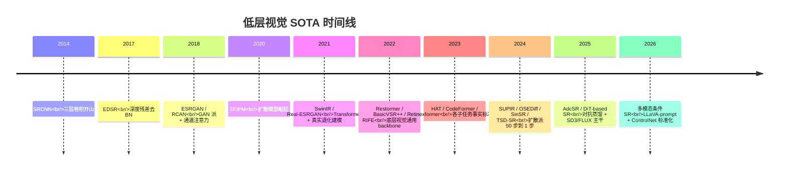
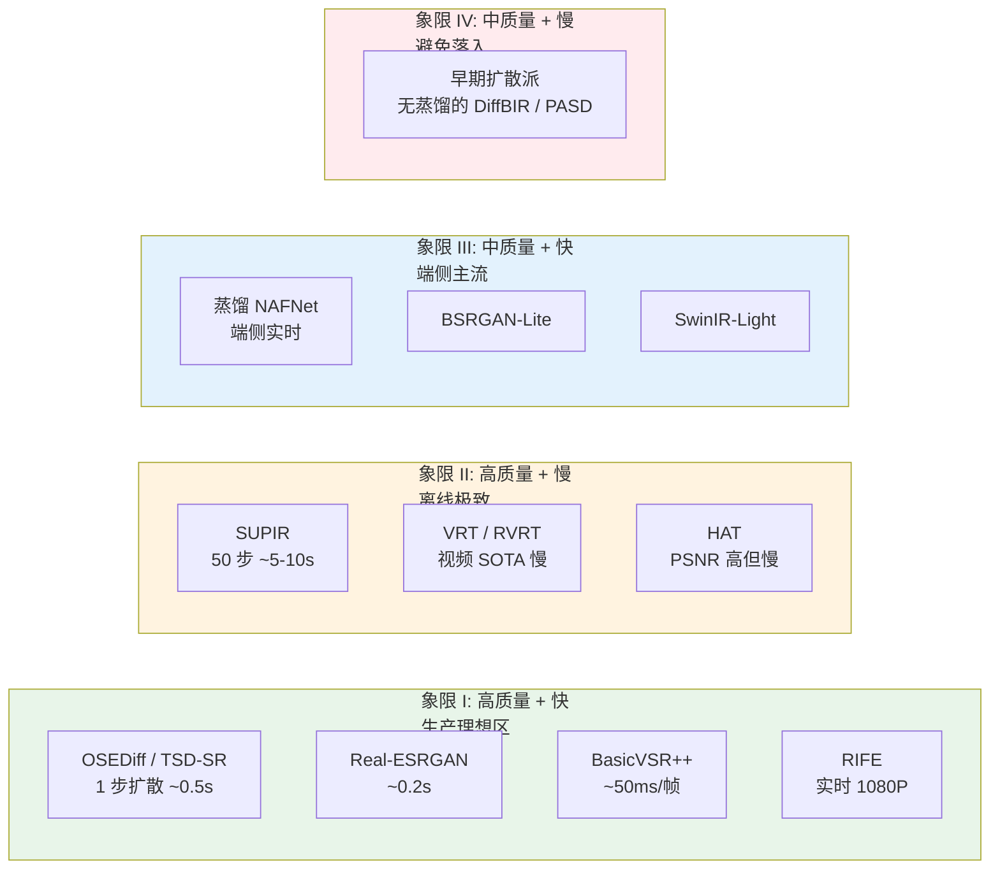
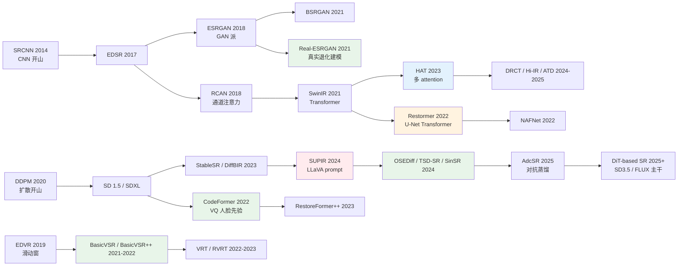

# 第 18 章 · SOTA 模型

> 这一章是这本书的"快速参考" - 9 个值得记住的 SOTA 模型 + 选型决策树。
>
> 模型本身会过时，**思路不会** - 所以每个模型都讲：核心思路、何时用、何时别用、被谁接班。

## 18.0 章首铺垫

走到这一章，前面 17 章已经把"为什么"、"怎么做"、"如何评"和"会怎么坏"都讲清楚了。这一章退一步，回答一个非常具体的工程问题：**在 2026 年这个时间点，如果今天就要从零搭一个增强系统，应该选哪些模型当基座？**

回答这个问题的难点不在"哪个模型在 benchmark 上最高"，而在**学术 SOTA 与工程 SOTA 几乎从不重合**。每年顶会出现的"刷分最高"的模型，落到产品上往往因为推理慢、部署难、对真实退化分布不鲁棒、社区维护停滞，最终用不进生产。反过来，真正在工业界被广泛部署的模型（Real-ESRGAN、CodeFormer、BasicVSR++）在论文发表时未必是当年的最高分，但它们的工程性 - 鲁棒性、可部署性、社区活跃度、可维护性 - 让它们成为五年时间尺度上的"事实标准"。

这一章选的 9 个模型是按"工程胜算"标准筛出来的，每一个都满足下面三条至少两条：在生产环境被广泛部署、开源代码长期维护、对真实退化分布有合理覆盖。它们不是论文榜单的子集，而是**这本书前 17 章所有论点在落地时的最佳兑现**。

模型本身会过时。SUPIR 2024 年还是扩散派的标杆，到 2025 年已经被一系列单步蒸馏接班；HAT 一度是 PSNR 派的天花板，现在 DRCT、Hi-IR、ATD 在各种 benchmark 上轮流登顶。这种"半衰期"在低层视觉领域大约是 12-18 个月。所以这一章除了介绍模型，还会在每个模型后面写"当前位置"和"被谁接班" - 帮你在两年后回头读时知道哪一段已经过时、哪一段还活着。最后一节会给出"换 SOTA"的工程纪律：什么时候应该把生产模型换掉、什么时候应该按兵不动。

读这一章的方式建议是：第一遍按顺序读完，建立"在 2026 年这个时间点，每个子任务的默认选择是谁"的全景；之后遇到具体项目时再回到对应的小节，看"何时用 / 何时别用 / 关键参数"。9 个模型加起来覆盖了 90% 以上的增强需求场景，剩下的 10% 在 18.13 节"哪些 SOTA 没列"里给了出口。

## 18.0.1 缩写与术语注

这一章涉及的缩写横跨四个家族（生成派、Transformer 派、视频派、特化派），集中放在这里：

- **SR**（Super-Resolution，超分辨率）：把低分辨率图升采样到高分辨率。
- **VSR**（Video Super-Resolution，视频超分辨率）。
- **NR-IQA**（No-Reference Image Quality Assessment，无参考图像质量评估）。
- **PSNR / SSIM / LPIPS / DISTS**：常用 IQA 指标，详见第 4 章。
- **MANIQA / CLIP-IQA / Q-Align**：当前主流 NR-IQA 模型。
- **DDPM / DDIM**（Denoising Diffusion Probabilistic / Implicit Model）：扩散模型两类基础采样器。
- **SD / SDXL / SD3 / SD3.5 / FLUX**（Stable Diffusion 系列与同代 DiT 主干）：文生图基模。SDXL 是 2.6B 参数 UNet 主干；SD3 / SD3.5 / FLUX 是 2024-2025 出现的 MM-DiT（Multi-Modal Diffusion Transformer）主干。
- **ControlNet**：把额外视觉条件（边缘 / 深度 / LR 图）注入预训练 UNet 的旁路网络，给扩散派增强提供"对齐输入图"的能力。
- **LoRA**（Low-Rank Adaptation）：低秩适配器，仅训练原模型权重的低秩残差，用来在 base 模型上低成本特化任务。
- **LLaVA**（Large Language and Vision Assistant）：开源多模态大模型，SUPIR 用它给输入图自动生成 prompt 作为文本条件。
- **VAE**（Variational AutoEncoder）：扩散派把图像编码到 4× 或 8× 下采样的潜空间用的网络。
- **ZeroSFT**（Zero-init Spatial Feature Transform）：SUPIR 用的零初始化空间调制层，把 ControlNet 特征注入 SDXL 主干而不破坏预训练权重。
- **CFG**（Classifier-Free Guidance）：扩散采样里的 prompt 强度旋钮。
- **SUPIR / OSEDiff / TSD-SR / SinSR / DiffBIR / PASD / SeeSR / ResShift / StableSR / AdcSR**：扩散派 SR 路线上的不同工程方案，本章和上一章都会反复提到。
- **VSD / TSD**（Variational / Target Score Distillation）：把多步扩散蒸馏到单步的两个代表损失。
- **GAN**（Generative Adversarial Network）：判别器-生成器对抗训练。
- **ESRGAN / Real-ESRGAN / BSRGAN**：GAN 派 SR 的代表，Real-ESRGAN 的核心贡献在退化合成 pipeline。
- **HAT / SwinIR / DRCT / Hi-IR / ATD**：Transformer 派 PSNR-导向 SR 模型。
- **Restormer / NAFNet / MAXIM / Uformer**：通用底层视觉 backbone（去噪 / 去模糊 / 去雨）。
- **CodeFormer / GFPGAN / GPEN / RestoreFormer++**：人脸修复模型。
- **BasicVSR++ / VRT / RVRT / EDVR**：视频超分模型。
- **RIFE / FILM / AMT / VFIformer**：帧插值模型。
- **Retinexformer / LLFormer / SCI / EnlightenGAN**：低光增强模型。
- **HDR / SDR**（High / Standard Dynamic Range，高/标准动态范围）：HDR 指亮度范围超出 8-bit SDR 的格式，常见 10-bit / 12-bit。
- **WCG**（Wide Color Gamut，广色域）：色域超过 Rec.709 的色彩空间。
- **Rec.709 / Rec.2020**：HDTV 与 UHD（4K / 8K）的色域与电光转换函数（EOTF）标准。
- **ACES**（Academy Color Encoding System，学院色彩编码系统）：电影工业的统一色彩管线。
- **ProRes**：Apple 的视觉无损中间编码格式，电影后期常用。
- **Bayer / CFA / RGGB**（Color Filter Array / Red-Green-Green-Blue Pattern）：相机传感器颜色滤镜阵列。
- **CDN**（Content Delivery Network）：图像在网络传输中常被边缘节点重压缩。
- **TensorRT / CoreML / ONNX**：常见推理引擎与中间表示。
- **QAT / PTQ**（Quantization-Aware Training / Post-Training Quantization）：训练时量化与训练后量化。
- **OCR**（Optical Character Recognition）：光学字符识别。

## 18.1 选型概览

```
通用增强 SOTA (5)
  ┌─ SUPIR              — 扩散派 / 创意放大（完整 50 步）
  ├─ OSEDiff / TSD-SR   — 扩散派 / 单步蒸馏（生产实时）
  ├─ Real-ESRGAN        — 真实退化建模派
  ├─ HAT                — Transformer 非扩散派
  └─ Restormer          — 去噪 / 去模糊 / 去雨通用 backbone

任务特化 (4)
  ┌─ CodeFormer   — 人脸修复
  ├─ BasicVSR++   — 视频超分
  ├─ RIFE         — 帧插值
  └─ Retinexformer — 低光增强
```

9 个模型，每个代表一种思路。其中 SUPIR 与 OSEDiff/TSD-SR 是同一扩散派的两个工程位面 - 前者 50 步追极致质量，后者 1 步推产品落地。

## 18.1.1 时间线：从 SRCNN 到单步扩散

把过去十年低层视觉的关键节点拉成一条时间线，能看到一个清晰的两段演化：2014-2020 是判别式派的天下，从 SRCNN 到 SwinIR 是网络架构的演进；2021 以后真实退化建模（Real-ESRGAN）和扩散派（StableSR / DiffBIR / SUPIR）分庭抗礼；2024 起单步蒸馏让扩散派第一次具备生产部署条件，同时 DiT 主干（SD3 / FLUX）开始替换 SDXL。



这条时间线的几个观察值得记住：

1. **架构创新的边际收益在递减**：从 SRCNN 到 SwinIR 是网络层数和 attention 形态的探索，每一代的 PSNR 涨幅约 0.5-1 dB；2021 之后单纯的架构改进很少超过 0.2 dB。
2. **数据创新的边际收益在上升**：Real-ESRGAN 把"训练-推理失配"从 3-5 dB 的鸿沟收回，这是单纯换网络做不到的。这与第 1.7 节呼应。
3. **生成式派从"研究"到"生产"花了大约 4 年**：DDPM 在 2020 年提出，到 2024 年单步蒸馏才让它真正能进生产 pipeline。
4. **DiT 主干替换正在发生**：SDXL 主导了 2023-2024 的扩散派 SR，2025 起 SD3.5 / FLUX 的 MM-DiT 开始作为新 backbone 出现，但生态成熟度仍落后 SDXL 一代。
5. **多模态条件已经成为标配**：SUPIR 用 LLaVA 自动生成 prompt 之后，"文本-视觉双条件"成为新派扩散 SR 的默认配置。

## 18.1.2 速度-质量权衡象限

另一个对选型最直接有帮助的视角是把候选模型放进"速度-质量"二维平面。质量用主观/NR-IQA 评分（横轴），速度用 1080P 单张推理时间（纵轴，越小越快）。落在不同象限的模型对应不同的产品定位：



读这张图的几个工程结论：

- **象限 I 是产品理想区**：2025 年起，扩散派单步蒸馏（OSEDiff / TSD-SR）和真实退化派（Real-ESRGAN）共同占据这个区域。开新项目时默认从这里选。
- **象限 II 是离线极致区**：当延迟约束被放松（电影后期、出版印刷、高端用户的"批量处理"模式），SUPIR / VRT 仍然有不可替代的质量上限。
- **象限 III 是端侧主流区**：手机 / 嵌入式部署的事实标准，质量低于象限 I 但能在手机 SoC 上实时跑。
- **象限 IV 是要避免的区域**：质量没到极致、速度又不快的模型基本会被同代竞品挤掉，是"换 SOTA"的首要候选。
- **多步扩散到单步扩散是从象限 II 跳到象限 I**：这是 2024-2025 年最重要的工程位移，OSEDiff / TSD-SR / SinSR 的核心价值就在这次跨象限跳跃。

## 18.2 SUPIR：扩散派创意放大

### 核心思路

把 SDXL（2.6B 参数文生图模型）的生成能力**拼接到 SR 任务上**：

```
LR Image
  ↓ ControlNet 注入
  ↓ SDXL UNet (frozen) + ZeroSFT 调制
  ↓ LLaVA 自动生成 prompt 作为文本条件
  ↓ Restoration-Guided Sampling
HR Image (创意丰富)
```

### 一句话记住

"用文生图大模型的世界知识，给一张烂图猜出最合理的高清版"。

### 何时用

- **严重退化的老照片**（人脸糊、纹理丢失）
- **追求视觉真实感的应用**（艺术放大、自媒体修复）
- **可以接受 5-10 秒/张推理**

### 何时别用

- 需要严格保真（法医、监控）
- 需要实时（视频、直播）
- 端侧部署

### 关键参数

```python
{
    'num_inference_steps': 50,      # 默认 50
    'guidance_scale': 7.5,          # CFG 强度
    'control_scale': 0.7,           # ControlNet 强度
    's_stage1': -1,                 # 自适应噪声起点
    'restoration_guidance': True,   # 使用 restoration-guided sampling
}
```

### 当前位置

2024 年扩散派 SR 的代表标杆。2025-2026 年方向往**单步 / 蒸馏**走——TSD-SR、AdcSR 等**一步出图**的工作把扩散派从 50 步推理降到 1-4 步，质量逼近 SUPIR 但速度提升一两个数量级。生产环境如果开始一个新项目，应该先看这些蒸馏后续，而不是直接上完整的 SUPIR。

### 论文与代码

- 论文：Yu et al. "SUPIR: Scaling Up Image Super-Resolution" (CVPR 2024)
- 代码：[github.com/Fanghua-Yu/SUPIR](https://github.com/Fanghua-Yu/SUPIR)
- 后续蒸馏方向：TSD-SR、AdcSR、OSEDiff 等（2025 起）

## 18.3 Real-ESRGAN：真实退化建模派

### 核心思路

和 ESRGAN 相比，**网络几乎没变**（仍是 RRDB），**贡献全在数据**：

- 二阶退化 pipeline（第 5 章 5.4 节）
- 复杂噪声合成（高斯 + 泊松 + 真实传感器）
- sinc 滤波模拟过锐化伪影

### 一句话记住

"同样的网络，让训练数据见到真实世界的退化分布，效果质变"。

### 何时用

- **生产环境的通用增强**——平衡质量、速度、稳定性
- **不能接受 GAN 编造**（虽然 Real-ESRGAN 也用 GAN 损失，但比扩散保守得多）
- **需要在普通 GPU / 端侧跑**

### 何时别用

- 严重退化（扩散派更合适）
- 极轻量端侧（用蒸馏版 Real-ESRGAN-Mini）

### 当前位置

是工业界增强模型的事实标准。Topaz Photo AI、剪映、各种修图 App 底层都基于 Real-ESRGAN 或它的变体。

### 论文与代码

- 论文：Wang et al. "Real-ESRGAN: Training Real-World Blind Super-Resolution with Pure Synthetic Data" (ICCVW 2021)
- 代码：[github.com/xinntao/Real-ESRGAN](https://github.com/xinntao/Real-ESRGAN)

## 18.4 HAT：Transformer 非扩散派 SOTA

### 核心思路

在 SwinIR 基础上**加更多 attention 模块**，提升模型利用输入信息的能力：

- Window Self-Attention (W-MSA + SW-MSA) — 继承 SwinIR
- **Channel Attention Block (CAB)** — 加 RCAN 风格通道注意力
- **Overlapping Cross-Attention Block (OCAB)** — 跨窗口直接交换

### 一句话记住

"把 Transformer 的容量挖到极限，是当前 PSNR 派的天花板"。

### 何时用

- **学术 benchmark 比赛**（PSNR/SSIM 优先）
- **需要客观保真**且能接受较慢推理
- **作为知识蒸馏的教师**（用 HAT 蒸馏出小模型）

### 何时别用

- 真实退化场景（HAT 在 bicubic 退化上训，对真实退化不鲁棒）
- 实时应用
- 资源受限

### 关键数字

- HAT-L 在 Set5 4× 上 **约 33.0–33.4 dB**（视训练设置/是否 ImageNet 预训练）
- 参数量 ~40M
- 推理：单张 256×256 在 A100 ~80ms

### 当前位置

PSNR-导向 Transformer SR 的代表 baseline。**不是当前唯一 SOTA**——2024-2025 年 DRCT、Hi-IR 等模型在多个 benchmark 上与 HAT 互有胜负。但 HAT 仍是教学/蒸馏教师/对比基准的好选择。生产环境用得不多——这个领域的"工程上限"和"benchmark 上限"是两回事。

### 论文与代码

- 论文：Chen et al. "Activating More Pixels in Image Super-Resolution Transformer" (CVPR 2023)
- 代码：[github.com/XPixelGroup/HAT](https://github.com/XPixelGroup/HAT)

## 18.5 Restormer：去噪 / 去模糊 / 去雨的 U-Net Transformer

### 核心思路

第 7 章 7.5 节讲过 MDTA（Multi-Dconv Head Transposed Attention）——把 self-attention 从空间维搬到通道维，复杂度从 $O(N^2)$ 降到 $O(C^2)$，对大图友好。配上 GDFN（Gated-Dconv Feed-Forward Network），整体是 4 层 U-Net 结构：

```
Input
  ↓ Encoder (4 levels of MDTA + GDFN)
  ↓ Latent (深层 MDTA + GDFN)
  ↓ Decoder (4 levels, with skip connections)
Output
```

不同任务用同一架构，只换训练数据：高斯/真实噪声去噪、运动去模糊、失焦去模糊、去雨。

### 一句话记住

"通道维 attention + 多任务通用 U-Net backbone，**SR 之外**所有底层视觉的事实标准 baseline"。

### 何时用

- **去噪**（高斯、真实传感器、合成噪声）
- **去模糊**（运动、失焦）
- **去雨 / 去雾 / 去摩尔纹**
- **大图推理**（MDTA 显存友好，1080P 单张可整图过模型）
- **视频底层任务的单帧 baseline**（接 BasicVSR++ 的对比）

### 何时别用

- **纯 SR**（HAT / SwinIR / DRCT 在 SR benchmark 上更强；Restormer 不是为 upsampling 设计的）
- **极轻量端侧**（推理偏慢，参数 ~26M，需要蒸馏）
- **任务里包含放大**（要么改成 Restormer + sub-pixel head，要么直接选 SR 派）

### 关键数字

- GoPro 去模糊：32.92 dB / 0.961 SSIM
- SIDD 真实去噪：40.02 dB / 0.960 SSIM
- 参数量 ~26M
- A100 上 256×256 推理 ~50ms

### 当前位置

2022 至 2026 年**去噪/去模糊/去雨的事实标准 baseline**——任何一篇底层视觉论文做这三个任务必须和 Restormer 比。MDTA 模块本身被后续大量工作沿用（包括视频派和扩散派的部分实现）。**HAT 是 SR 派代表，Restormer 是 restoration 派代表**——两者的位置不冲突，工程上常常同时部署（一个管 deblur/denoise，一个管 upsample）。

后续工作如 GRL、X-Restormer、PromptIR 在某些 benchmark 上略胜，但没有一个把 Restormer 完全替掉。

### 论文与代码

- 论文：Zamir et al. "Restormer: Efficient Transformer for High-Resolution Image Restoration" (CVPR 2022)
- 代码：[github.com/swz30/Restormer](https://github.com/swz30/Restormer)

## 18.6 OSEDiff / TSD-SR：单步扩散 SR

### 核心思路

完整扩散 SR（如 SUPIR）50 步推理 5-10 秒/张，**生产落地的最大障碍是延迟**。2024-2025 年单步扩散蒸馏把这条路打通：

```
LR Image
  ↓ VAE encode（一次）
  ↓ Pre-trained UNet (LoRA finetuned for SR)
  ↓ One forward pass, no iterative denoising
  ↓ VAE decode
HR Image
```

蒸馏目标：让学生网络在任意噪声水平下，**一步**预测干净的 $x_0$。配合 score distillation / variational score distillation / target score distillation 等损失。

### 代表方法

- **OSEDiff**（NeurIPS 2024）：variational score distillation（VSD，变分得分蒸馏），单步采样，VAE-LR 当 init
- **TSD-SR**（2024）：target score distillation（TSD，目标得分蒸馏），针对 SR 任务的目标分布修正
- **SinSR**（CVPR 2024）：在 ResShift 基础上做单步蒸馏
- **AdcSR**（2025）：把扩散模型蒸馏成对抗性单步生成器，质量与 SUPIR 接近

### 一步扩散 vs 多步扩散：直觉与权衡

一步扩散看起来"违反直觉" - 扩散模型的核心论证就是把困难的一步生成拆成上千步小步，怎么又能压回一步？关键在于"蒸馏的对象不是采样过程，而是教师网络在不同噪声水平下的得分函数"。学生网络学的是：给定任意噪声水平和噪声样本，直接预测出最终的清晰图。这不是替代多步扩散的数学合理性，而是用一个更大的模型在更窄的输入分布上做更困难的任务，把"困难度预算"从迭代次数搬到模型容量。

在 SR 任务里这件事尤其合理 - 输入 $y$ 给了模型一个非常强的条件信号（不像无条件文生图那样从纯噪声出发），所以解空间已经被挤窄到一个相对低维的流形。一步逼近这个流形的中心是可行的，多步并没有带来质的提升，只是平滑了样本周围的小扰动。这就是为什么 OSEDiff / TSD-SR 在 SR 上能达到甚至超过多步基线，但同样的蒸馏路线在文生图上仍要保留 4-8 步才能保住质量 - SR 的条件信息密度远高于纯文生图。

工程上的权衡可以总结成一句话：**多步扩散是用时间换质量的旋钮，单步扩散是用模型容量换时间的固定选择**。前者灵活（推理时可以根据用户档位调节步数）但慢；后者快但失去步数调节自由度（要做"质量档"只能切到另一个模型）。生产系统多数选后者，并在用户的"高质量模式"按钮下保留一个多步扩散模型作为备选。

### 一句话记住

"扩散派从 50 步到 1 步，让 SUPIR 路线第一次能进生产环境"。

### 何时用

- **生产环境扩散派 SR**——2025 年起的默认选择
- **实时 / 准实时增强**（< 1 秒/张）
- **对 SUPIR 视觉质量满意但延迟不能接受**的场景

### 何时别用

- **极端退化 + 创意优先**（完整 SUPIR 仍偶有微弱质量优势，工业仍可保留作为离线处理选项）
- **严格保真**（扩散派的"猜"本质没变，只是更快了——不适合法医/监控）

### 关键数字

- 推理速度：A100 上单张 ~0.3-0.8s（vs SUPIR 50 步 5-10s）
- 质量：DIV2K val LPIPS 与 SUPIR 持平 ±2%；MANIQA 持平或略胜
- 模型大小：≈ SDXL UNet + 小 LoRA，端侧 8-bit 量化后 ~3GB

### 当前位置

**2025-2026 年扩散 SR 工程主流**。SUPIR 仍是研究/教学的"完整版"标杆，但开新项目应当**默认从单步蒸馏路线开始**。这条线被低估的工程价值：扩散派第一次具备了取代 Real-ESRGAN 在通用增强工作流中的延迟条件。

### 论文与代码

- OSEDiff：Wu et al. "One-Step Effective Diffusion Network for Real-World Image Super-Resolution" (NeurIPS 2024) — [github.com/cswry/OSEDiff](https://github.com/cswry/OSEDiff)
- TSD-SR：Dong et al. "TSD-SR: One-Step Diffusion with Target Score Distillation" (2024)
- SinSR：Wang et al. "SinSR: Diffusion-Based Image Super-Resolution in a Single Step" (CVPR 2024)
- AdcSR：2025 年起的 adversarial distillation 方向（AdcSR 等）

## 18.7 CodeFormer：人脸修复

### 核心思路

把人脸的局部特征**离散化**为 codebook 里的若干 code，通过 Transformer 预测 code 序列：

```
LR Face
  ↓ Encoder
  ↓ Transformer (predict discrete code indices)
  ↓ Codebook lookup
  ↓ Decoder
HR Face
```

外加可调的 `fidelity_weight ∈ [0, 1]`，用户可选"严格保真"还是"充分用先验"。

### 一句话记住

"用 VQ codebook 而不是 StyleGAN 给人脸做强先验，可调节 fidelity 是关键工程亮点"。

### 何时用

- **任何人脸增强场景**——这是当前事实标准
- **老照片人脸**（fidelity = 0.5）
- **视频会议**（fidelity = 0.7，保守不变样）

### 何时别用

- **法医证据**（不允许编造）
- **极小人脸**（< 32×32 像素，先验都救不回来）

### 关键参数

```python
{
    'fidelity_weight': 0.5,      # 0=纯先验, 1=纯 LR; 默认 0.5 平衡
    'face_align': True,          # 必须先对齐
    'crop_size': 512,            # 预训练用 512 输入
}
```

### 当前位置

人脸修复的工程标准。GFPGAN 仍在用，但 CodeFormer 的可调性使它在产品中更受欢迎。

### 论文与代码

- 论文：Zhou et al. "Towards Robust Blind Face Restoration with Codebook Lookup Transformer" (NeurIPS 2022)
- 代码：[github.com/sczhou/CodeFormer](https://github.com/sczhou/CodeFormer)

## 18.8 BasicVSR++：视频超分

### 核心思路

双向循环 + 二阶传播 + flow-guided DCN（第 14.3 节详谈）：

```
所有帧的特征
  ↓ 前向 RNN (二阶传播)
  ↓ 后向 RNN (二阶传播)
  ↓ 聚合 (concat + conv)
  ↓ Upsample
HR 视频
```

### 一句话记住

"双向循环让每帧能用过去和未来信息，二阶传播绕过光流误差累积"。

### 何时用

- **VSR 任务**（事实标准）
- **视频去模糊、视频去噪**（同架构改训练数据）
- **质量优先 + 不要求实时**

### 何时别用

- 实时直播（即使 BasicVSR++ 也太慢，需要蒸馏版）
- 极端长视频（隐状态累积误差）

### 关键数字

- REDS4 4× VSR：32.4 dB（前 SOTA EDVR 31.1 dB）
- 推理：A100 上 ~50ms / 720P 帧

### 当前位置

2022-2026 年 VSR 的工程标准。RVRT/VRT 在 PSNR 上更高但慢得多。

### 论文与代码

- 论文：Chan et al. "BasicVSR++: Improving Video Super-Resolution with Enhanced Propagation and Alignment" (CVPR 2022)
- 代码：[github.com/open-mmlab/mmagic](https://github.com/open-mmlab/mmagic) (MMEditing 内)

## 18.9 RIFE：帧插值

### 核心思路

不显式估计两端帧间的光流，**直接预测中间帧到两端的光流**：

```
F_t, F_{t+1}
  ↓ IFNet (Intermediate Flow Net)
  ↓ flow_to_t, flow_to_{t+1}, fusion_mask
  ↓ warp F_t with flow_to_t → warped_t
  ↓ warp F_{t+1} with flow_to_{t+1} → warped_t+1
  ↓ blend = mask * warped_t + (1-mask) * warped_t+1
F_{t+0.5}
```

### 一句话记住

"直接预测中间帧到两端的光流，避开中间帧不存在的悖论"。

### 何时用

- **任何帧插值任务**（事实标准）
- **30 fps → 60 fps、60 fps → 120 fps**
- **慢动作**（24 fps → 240 fps）
- **实时插值**（RIFE 在 1080P 上能跑 30 FPS+）

### 何时别用

- 超大位移（FILM 更鲁棒）
- 严重遮挡场景（AMT 更好）

### 关键参数

```python
{
    'scale': 1.0,        # 1=4K, 0.5=对 4K 更稳定
    'tta': False,        # test-time augmentation, 慢但精度高
}
```

### 当前位置

帧插值的事实标准。后续工作 (FILM、AMT) 各有侧重，但 RIFE 是性价比最高的。

### 论文与代码

- 论文：Huang et al. "Real-Time Intermediate Flow Estimation for Video Frame Interpolation" (ECCV 2022)
- 代码：[github.com/megvii-research/ECCV2022-RIFE](https://github.com/megvii-research/ECCV2022-RIFE)

## 18.10 Retinexformer：低光增强

### 核心思路

把传统的 Retinex 理论（图像 = 反射 × 光照）和 Transformer 结合：

```
Low-light image
  ↓ 分解为 Reflectance + Illumination (传统 Retinex)
  ↓ Transformer (Illumination-Guided Transformer)
  ↓ 合成增强图
Enhanced image
```

### 一句话记住

"用 Retinex 物理模型作为归纳偏置，让模型重点学反射不变性"。

### 何时用

- **低光照片**（夜景、室内昏暗）
- **过曝校正**（部分支持）
- **HDR tone mapping 的辅助**

### 何时别用

- 噪声主导的极暗场景（< 0.1 lux）—— Retinex 假设失效
- 多光源混合 —— Retinex 简化了光照模型

### 当前位置

低光增强的代表。其他选择：

- LLFormer（更早的 Transformer 方法）
- SCI（更轻量的 CNN 方法，端侧友好）

### 论文与代码

- 论文：Cai et al. "Retinexformer: One-stage Retinex-based Transformer for Low-light Image Enhancement" (ICCV 2023)
- 代码：[github.com/caiyuanhao1998/Retinexformer](https://github.com/caiyuanhao1998/Retinexformer)

## 18.11 选型决策树

按场景给推荐：

```
任务是什么?
  │
  ├─ 通用 SR
  │   │
  │   ├─ 离线 + 极致质量 + 不限延迟 → SUPIR（50 步）
  │   ├─ 实时扩散派（默认 2025 起）→ OSEDiff / TSD-SR（1 步）
  │   ├─ 真实场景 + 工程稳定（CNN/GAN 派）→ Real-ESRGAN
  │   └─ 学术 benchmark / PSNR 比赛 → HAT
  │
  ├─ 去噪 / 去模糊 / 去雨（不放大）→ Restormer  ←─ 默认
  │
  ├─ 人脸增强 → CodeFormer (fidelity 用户可调)
  │
  ├─ 视频超分 → BasicVSR++
  │   ├─ 实时直播 → 蒸馏版 BasicVSR-Mini + TensorRT
  │   └─ 离线高质量 → BasicVSR++ 或 RVRT
  │
  ├─ 帧插值 → RIFE
  │   ├─ 大位移 → FILM
  │   └─ 严重遮挡 → AMT
  │
  ├─ 低光增强 → Retinexformer
  │
  ├─ 文档增强 → 专用 DocSR + OCR-aware loss (第 10.7 节)
  │
  └─ 端侧实时 → 蒸馏版 NAFNet + CoreML/TensorRT FP16
```

## 18.12 学术 SOTA vs 工程 SOTA

最后强调一个反复出现的主题：

> 这一章列的 9 个模型不是"刷分最高的"。
>
> 它们是**工程上最值得部署**的——平衡了效果、速度、稳定性、可维护性。

学术 benchmark 的 SOTA 经常是：

- 比 baseline 提升 0.1-0.3 dB
- 但参数量 / 推理速度 5-10× 差
- 在真实场景下提升不明显

工程上更看重：

- **鲁棒性**（不在常见输入上崩）
- **稳定性**（不同硬件上结果一致）
- **可部署性**（能转 ONNX、能量化、能 tile）
- **可维护性**（有官方代码、有持续维护、有社区）

这 9 个模型在这些维度上都是同类最好。

## 18.13 哪些 SOTA 没列

值得知道但本章没单独列的（按类别）：

### 通用 SR 派系

- **DiffBIR**：扩散派，比 SUPIR 早，CLIP image cross-attention 思路
- **SeeSR**：扩散派 + 语义先验，更注重控制
- **ResShift**：扩散派的高效采样（被 SinSR 蒸馏到单步）
- **AdcSR / SinSR**：单步扩散派同代竞品（与本章 18.6 同方向）
- **DRCT / Hi-IR / ATD**：HAT 同期/后续 PSNR 派 Transformer SR
- **BSRGAN**：Real-ESRGAN 的同期工作

### 人脸

- **GFPGAN**：StyleGAN2 先验路线，2021 经典
- **GPEN**：Tencent ARC 的早期工作
- **RestoreFormer++**：CodeFormer 的进化版

### 视频

- **VRT / RVRT**：Transformer 派 VSR
- **EDVR**：滑动窗口经典
- **ProPainter**：视频 inpainting 代表

### 帧插值

- **FILM**：Google，大位移强
- **AMT**：2023 SOTA，遮挡强
- **VFIformer**：Transformer 派

### 低光

- **LLFormer**：Transformer 早期
- **SCI**：轻量 CNN
- **EnlightenGAN**：GAN 派

### 任务特化

- **DocSR / TextZoom**：文字 SR 数据集和 baseline
- **SwinIR-Light、ESRGAN-Lite**：端侧轻量

每个领域都有 5-10 个值得关注的模型。本章选的是**最具代表性、最工程友好**的那些。

## 18.14 何时该换 SOTA

新模型每月都在出。**什么时候应该把生产模型换掉？**

经验：以下都满足才考虑换：

1. **新模型在你的真实测试集上明显更好**（不是 Set5/14）
2. **失败案例集表现不差**（不会引入新问题）
3. **推理速度可接受**（不超过当前 1.5×）
4. **训练代码和数据可获得**（能复现、能微调）
5. **社区有活跃维护**（不是单论文 + 代码扔在那）

绝大多数论文 SOTA 不满足上面 5 条——所以**保守换模型**是工程经验。

> 工程上换模型的成本远比"训一个新的"高。
>
> 一个稳定的旧 SOTA 通常胜过一个不稳定的新 SOTA。

## 18.14.1 9 个模型的横向对比表

把这一章的 9 个核心模型放到同一张表里方便横向参考：

| 模型 | 类别 | 派系 | 参数量 | A100 推理 | 真实退化鲁棒 | 端侧可部署 | 当前位置 |
|------|------|------|--------|-----------|--------------|------------|----------|
| SUPIR | 通用 SR | 扩散派 50 步 | ~3B（SDXL+ControlNet） | 5-10s/张 | 强 | 否 | 离线极致标杆 |
| OSEDiff / TSD-SR | 通用 SR | 扩散派 1 步 | ~3B + LoRA | 0.3-0.8s | 强 | 部分（INT8 后 ~3GB） | 2025-2026 工程主流 |
| Real-ESRGAN | 通用 SR | GAN+真实退化 | ~17M | ~0.2s | 强 | 是 | 工业事实标准 |
| HAT | 通用 SR | Transformer PSNR | ~40M | ~80ms（256²） | 弱（bicubic 训） | 否 | 学术 baseline |
| Restormer | 去噪/去模糊 | U-Net Transformer | ~26M | ~50ms（256²） | 中-强 | 否（需蒸馏） | restoration 派事实标准 |
| CodeFormer | 人脸修复 | VQ codebook | ~75M | ~100ms | 强（人脸 mask） | 是 | 人脸事实标准 |
| BasicVSR++ | 视频 SR | 双向循环+二阶传播 | ~7M | ~50ms/720P 帧 | 中 | 部分 | VSR 事实标准 |
| RIFE | 帧插值 | IFNet 中间流 | ~10M | 1080P 实时 30+ FPS | 中-强 | 是 | 帧插值事实标准 |
| Retinexformer | 低光增强 | Retinex + Transformer | ~1.6M | ~50ms（256²） | 中（极暗失效） | 是 | 低光代表 |

几个读这张表的快速结论：

1. **参数量与质量不严格相关**：CodeFormer 75M 在人脸上击败 100M+ 的通用模型，因为它的先验更专一。
2. **A100 推理时间跨度三个数量级**：从 RIFE 实时到 SUPIR 10 秒，差别近 1000×。这是"延迟约束如何决定模型选择"的直接体现。
3. **端侧可部署列大多是"是"或"部分"**：纯否的只有 SUPIR / HAT / Restormer 三个，且都有蒸馏方向在做端侧版本。
4. **当前位置列暴露一个事实**：列表里 9 个模型中，6 个的"当前位置"是"事实标准"或"主流"，只有 SUPIR 和 HAT 的角色是"标杆/baseline" - 这印证了工程性强的模型有更长的半衰期。

## 18.14.2 派系传承图

最后用一张派系图把这一章的所有模型和它们的祖先 / 接班人画在一起，帮助你理解每条线的内在演化逻辑：



这张图有几条线索值得强调：

- **ESRGAN 这条线**经过 Real-ESRGAN 之后转向"数据为王"路线，与 PSNR 派的 SwinIR / HAT 走向分叉。
- **SwinIR 同时是 HAT 和 Restormer 的祖先**：前者继续做 SR，后者转向通用 restoration backbone。这是同一个 Transformer 思路在不同任务上的分支。
- **扩散派从 DDPM 到 OSEDiff 是一条快速演化线**：5 年时间从开山论文走到生产可部署，是低层视觉历史上演化最快的子方向。
- **DiT 主干替换还在进行中**：图上的 "DiT-based SR" 节点是 2025 年起的趋势，目前还没有一个像 SUPIR 那样的标志性工作出现，但 SD3.5 / FLUX 替换 SDXL 作为新派 backbone 的方向是确定的。

## 18.15 最后

这本书走过：

- Part I：理解为什么（中心方程、表达空间、损失、评估、数据）
- Part II：理解怎么做（CNN、Transformer、扩散、扩散控制、特化）
- Part III：训练与评估（稳定性、方法论）
- Part IV：视频
- Part V：工程部署（推理、案例、失败）
- Part VI：参考（这一章）

**核心观点回顾**：

1. 影像增强是**逆问题**，模型在猜，不在恢复
2. 数据 > 网络（Real-ESRGAN 的核心教训）
3. PSNR 派 vs 感知派是**理论必然**，不是工程缺陷
4. 增强模型的损失**几乎从来不是单一的**
5. 现代方法都不在像素空间工作（潜空间、特征空间）
6. 扩散模型的"无中生有"是优势也是危险
7. 工程上"失败处理"比"平均优化"更重要
8. 视频不只是图像 × N，时序一致是独立问题
9. 端侧部署需要完全不同的优化栈
10. **没有通用最优**，每个场景有自己最佳的模型组合

读完这本书，希望你能：

- 看到一张烂图，知道用什么模型组合处理
- 看到一个新论文，能立刻判断它在解决哪个本质问题
- 设计自己的增强系统时，知道每个决策的 trade-off
- 在生产环境碰到 bug 时，知道往哪个方向找原因

影像增强这个领域还会继续演进。架构会变、模型会迭代、benchmark 会刷新。但这本书讲的**思考框架**——退化模型、表达空间、损失设计、评估方法、训练动力学、部署约束、失败模式——这些会保持有效。

Good luck. 愿这本书对你有用。

---

> 系列结束。
>
> 想接着学：本书相关的姊妹书：
> - [LLM 训练工程师完全指南](https://github.com/yingwang/llm-tutorial) — 怎么造 LLM
> - [Thinking in LLM](https://github.com/yingwang/thinking-in-llm) — 怎么用 LLM
