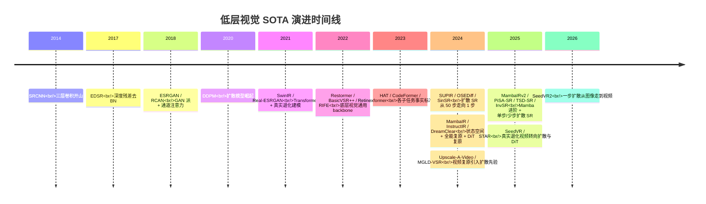
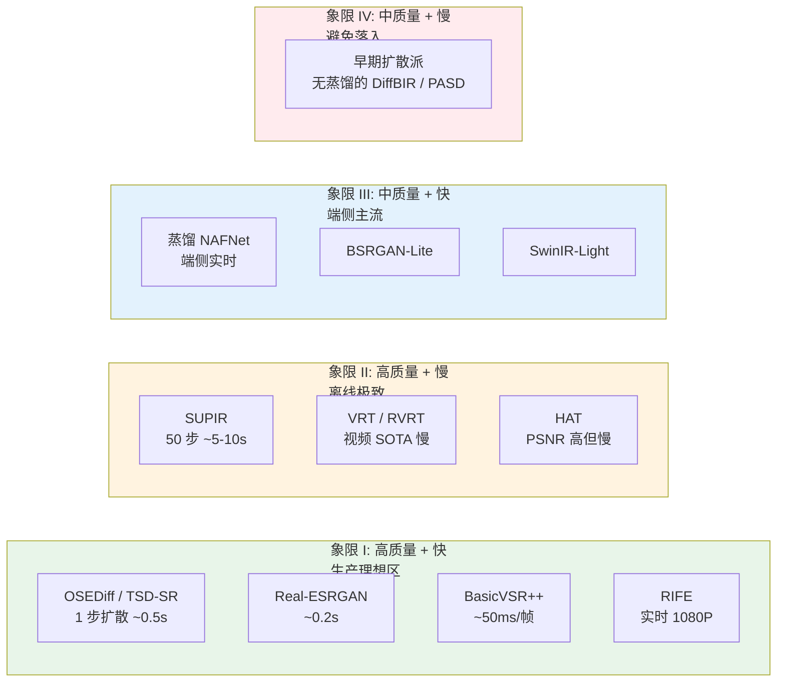
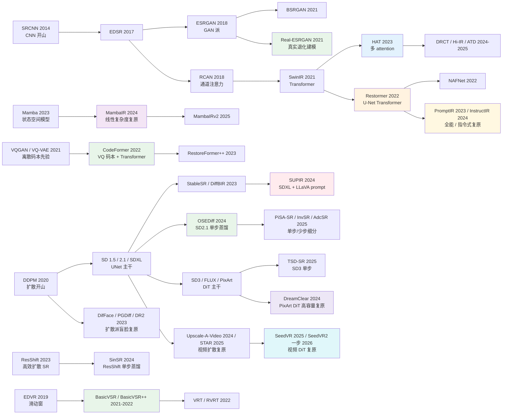

# 第 18 章 · SOTA 模型前沿与技术选型

> 本章是全书的技术选型参考手册：系统梳理 9 个工业级核心基座模型与前沿技术演进决策树。
>
> 具体的网络结构会随时间迭代演进，但底层的系统设计思想与权衡逻辑历久弥新。每个模型均聚焦于核心原理、适用工况、边界禁忌与演进分支。

## 18.0 章首铺垫

在系统梳理了物理退化机理、表征流形空间、损失约束动力学、综合评估体系、网络归纳偏置、训练收敛控制、时序连续性与硬件加速编译后，本章聚焦于最终的工程实践抉择：**站在 2026 年的技术节点，若需从零构建一套高可用、低时延的工业级影像增强系统，应当如何选取底层模型基座？**

工程落地的第一道鸿沟在于：**学术 Benchmark 榜首与工业生产最优解几乎从不重合**。学术顶会上不断涌现的刷榜模型，往往伴随着沉重的计算开销、复杂的非标准定制算子、对开放域真实退化极为脆弱的泛化性以及缺乏维护的代码生态，难以直接交付生产；相反，在工业界被广泛采纳为工程基石的模型（如 Real-ESRGAN、CodeFormer、BasicVSR++），其核心优势在于极高的系统鲁棒性、硬件亲和度与完备的工具链生态，成为长期稳定的工业事实标准。

本章遴选的模型均遵循严格的工程可行性标准：已在生产环境中规模化验证、具备活跃稳定的开源工程实现，且在真实物理退化流形上展现出经过检验的泛化能力。

在低层视觉领域，单一模型的学术生命周期通常为 12 至 18 个月。因此，本章不仅解析各代表模型的内部机理，更重点剖析其技术演进脉络与后继接班体系，并总结工业选型中的模型替换纪律。

在 2026 年的技术全景中，低层视觉领域形成了数条明确的前沿主线：
1. **状态空间模型（以 Mamba 为代表）**：作为线性复杂度的序列架构分支，在保持全局长程感受野的同时与自注意力机制展开能效竞争；
2. **全能复原（All-in-One）与指令驱动复原（Instruction-based Restoration）**：实现单一网络权重自适应统一处理复合混合退化；
3. **扩散复原主干向 DiT（Diffusion Transformer）演进**：以 DreamClear 等为代表，依托高容量多模态架构探索生成质量新上限；
4. **单步与少步扩散蒸馏工程落地**：通过变分得分蒸馏与目标得分蒸馏将扩散超分从数十步压缩至 1 至 4 步，打通实时生产通路；
5. **真实退化视频复原的生成式转向**：从确定性循环时序网络向扩散与 DiT 时空先验拓展。

## 18.0.1 缩写与核心术语

- **SR / VSR**（Super-Resolution / Video Super-Resolution）：图像与视频超分辨率；
- **NR-IQA**（No-Reference Image Quality Assessment）：无参考图像质量评估（如 MANIQA、CLIP-IQA、Q-Align）；
- **DDPM / DDIM**：扩散概率模型与确定性隐式采样器；
- **SD / SDXL / SD3 / FLUX**：代表性文生图基模，涵盖 UNet 与 MM-DiT（Multi-Modal Diffusion Transformer）主干；
- **ControlNet**：向预训练生成主干注入空间条件约束的对齐网络；
- **LoRA**（Low-Rank Adaptation）：低秩参数微调技术；
- **LLaVA**：多模态大语言模型，用于为低质图像逆向生成文本语义提示词；
- **ZeroSFT**（Zero-init Spatial Feature Transform）：用于空间特征调制的零初始化空间变换层；
- **VSD / TSD**（Variational / Target Score Distillation）：变分得分蒸馏与目标得分蒸馏；
- **MambaIR / MambaIRv2 / VMambaIR**：基于状态空间模型（SSM）的图像复原网络家族；
- **PromptIR / InstructIR / DA-CLIP**：全能复原与指令引导复原模型；
- **DreamClear**：基于 PixArt DiT 主干的高容量真实世界复原网络；
- **Restormer / NAFNet**：通用低层视觉骨干网络；
- **CodeFormer / DifFace / PGDiff**：代码本先验与扩散派人脸复原模型；
- **BasicVSR++ / SeedVR / STAR**：时序循环网络与视频扩散复原网络；
- **RIFE / GIMM-VFI**：光流插帧与隐式连续运动场插帧网络；
- **Retinexformer / LightenDiffusion**：物理先验与潜空间扩散低光增强网络。

## 18.1 选型总览

```
通用图像增强核心基座 (5)
  ├─ SUPIR              : 扩散先验 / 离线高保真生成（50 步采样）
  ├─ OSEDiff / TSD-SR   : 扩散蒸馏 / 生产级准实时（单步前向）
  ├─ Real-ESRGAN        : 真实退化建模 / 工业基准（CNN-GAN 架构）
  ├─ HAT                : 深度注意力超分 / PSNR 导向（Transformer 架构）
  └─ Restormer          : 去噪 / 去模糊 / 去雨通用主干（通道自注意力 U-Net）

垂直任务特化基座 (4)
  ├─ CodeFormer         : 人像盲复原（离散代码本先验 + 可调保真度）
  ├─ BasicVSR++         : 视频超分（双向时序循环 + 二阶对齐）
  ├─ RIFE               : 视频帧插值（中间流实时估计）
  └─ Retinexformer      : 低光增强（Retinex 物理先验 + 光照引导 Transformer）
```

上述 9 个基座模型构成工程落地的核心支柱，而状态空间（Mamba）、全能复原、DiT 架构与单步扩散等 2026 前沿分支则作为演进脉络协同展开。

## 18.1.1 演进脉络：从卷积三层到单步扩散

低层视觉技术的发展经历了清晰的阶段性演进：
- 2014-2020 年：从 SRCNN 到 RCAN，聚焦于深层残差、密集连接与通道注意力的网络结构探索；
- 2021-2023 年：真实退化建模（Real-ESRGAN）与大容量 Transformer（SwinIR / HAT / Restormer）确立了判别式复原的主导地位；
- 2023-2024 年：预训练文生图先验全面注入超分辨率任务（SUPIR、DiffBIR），生成画质大幅跃升但受困于多步采样延迟；
- 2024-2026 年：单步蒸馏技术打通扩散生产链路，Mamba 状态空间架构提供线性复杂度新范式，DiT 主干与全能指令式复原重塑前沿技术版图。



工程启示：
1. **纯结构堆叠的边际收益递减**：单纯依靠增加网络层数带来的 PSNR 增益已趋于平缓；
2. **数据流形建模是性能质变的根本**：以 Real-ESRGAN 为代表的高阶退化合成，从根本上解决了模型在真实开放域中的泛化问题；
3. **单步蒸馏抹平了生成派的落地鸿沟**：通过将多步迭代先验浓缩至单步前向推理，扩散模型首次满足了亚秒级工业部署要求。

## 18.1.2 质量与延迟权衡象限

将候选模型映射至“主观感知质量 × 单图推理耗时”的二维坐标系中，可清晰界定不同模型的业务定位：



- **象限 I（工业交付首选区）**：由单步扩散（OSEDiff / TSD-SR）与经典判别模型（Real-ESRGAN、BasicVSR++、RIFE）占据，兼备优秀画质与亚秒级响应；
- **象限 II（离线极致计算区）**：SUPIR、DreamClear 等高容量多步模型适用于无严格时延限制的高端后期处理；
- **象限 III（端侧嵌入式部署区）**：轻量化 NAFNet、SwinIR-Light 满足移动端 SoC 实时运行要求。

## 18.2 SUPIR：大容量扩散模型离线高保真增强

### 核心原理

将 26 亿参数的 SDXL 文生图主干先验与图像复原任务深度融合：
- 采用 ControlNet 提取低质图像的多尺度空间条件；
- 利用 ZeroSFT 零初始化空间特征调制层将先验注入冻结的 SDXL 主干；
- 引入 LLaVA 多模态大模型实时为输入图生成细粒度文本 Prompt；
- 配合保真度引导采样（Restoration-Guided Sampling）约束扩散轨迹。

```
输入低质图像
  ↓ ControlNet 空间特征提取
  ↓ SDXL UNet（冻结权重）+ ZeroSFT 空间调制
  ↓ LLaVA 自动生成文本提示词注入语义条件
  ↓ Restoration-Guided Sampling 多步去噪积分
输出高清晰度重构图像
```

### 适用场景与边界

- **适用**：严重退化的历史老照片修复、艺术插画高倍率超分、可容忍数秒级离线渲染的业务；
- **禁忌**：毫秒级实时系统、对虚构细节零容忍的安防与医学取证；
- **典型配置**：采样步数 50 步，CFG 引导系数 7.5，ControlNet 强度 0.7。

## 18.3 Real-ESRGAN：真实退化建模工业基准

### 核心原理

在网络拓扑保持 RRDB 结构稳定的前提下，将核心创新完全倾注于**高阶退化合成数据流（Higher-Order Degradation Pipeline）**：
- 级联多次模糊、下采样、噪声注入与有损压缩；
- 引入振铃与过冲滤波（Sinc Filter）模拟数字图像过度锐化伪影；
- 建立与真实相机传感器特性一致的泊松-高斯混合噪声分布。

### 适用场景与边界

- **适用**：通用在线图像增强服务、要求高吞吐且需杜绝严重生成幻觉的业务流水线；
- **禁忌**：信息完全缺失的极端极小图放大；
- **工程地位**：当前各主流修图软件与云端批处理流水线的工业事实标准。

## 18.4 HAT：混合注意力机制的 PSNR 标杆

### 核心原理

在 SwinIR 局部窗口自注意力基础上引入多尺度特征重组：
- 结合局部窗口自注意力（W-MSA）与移位窗口自注意力（SW-MSA）；
- 引入通道注意力块（CAB）捕捉全局跨通道相关性；
- 引入重叠交叉注意力块（OCAB）直接打通跨窗口信息交互，大幅扩展有效激活像素（Effective Receptive Field）。

```
输入浅层特征
  ↓ 深度混合注意力组（HAB）
  ├─ Window Attention 捕获局部上下文
  ├─ Channel Attention 建模全局通道权重
  └─ Overlapping Cross-Attention 打通跨窗口信息流
  ↓ 亚像素卷积（PixelShuffle）
输出超分辨率重构图像
```

### 适用场景与边界

- **适用**：客观保真度优先的学术基准评测、作为教师模型指导小模型知识蒸馏；
- **禁忌**：开放域未知退化输入（默认权重基于理想 Bicubic 退化训练，对复杂真实噪声鲁棒性有限）。

## 18.4.1 状态空间模型（Mamba）：线性复杂度的架构探索

自注意力机制的计算开销与特征空间分辨率呈二次方关系（$O(N^2)$），在大尺寸图像推理中带来显著的显存与计算瓶颈。2024 年以来，基于选择性状态空间模型（SSM）的 Mamba 架构被引入图像复原领域：
- **MambaIR**：将二维图像展平为序列，利用具有输入自适应选择机制的状态转移方程实现全局长程上下文建模，将计算复杂度降低至与像素数严格呈线性关系（$O(N)$）；
- **MambaIRv2**：针对单向序列扫描无法非因果全局交互的局限，结合对称双向扫描与自适应注意力机制，在经典超分与轻量超分任务上全面比肩甚至超越顶尖 Transformer 模型；
- **工程现状**：在学术 Benchmark 上展现出优异的能效比，但在工业部署中针对选择性扫描算子（Selective Scan Kernel）的推理加速生态仍在持续演进中。

## 18.5 Restormer：通用底层视觉 U-Net Transformer

### 核心原理

采用多转置注意力模块（MDTA，Multi-Dconv Head Transposed Attention）与门控前馈网络（GDFN）：
- 将自注意力计算由空间维度映射至通道维度，计算复杂度由 $O(N^2)$ 大幅削减至 $O(C^2)$，原生支持高分辨率大图整图推理；
- 采用 4 级 U-Net 编码器-解码器拓扑与跨层跳跃连接；
- 统一网络拓扑，仅通过更换退化训练数据集即可自适应去噪、运动/失焦去模糊与去雨去雾。

```
输入退化图像
  ↓ 编码器（4 级 MDTA 通道注意力 + GDFN 门控卷积前馈网络）
  ↓ 潜空间瓶颈层（深层多头特征交互）
  ↓ 解码器（4 级上采样恢复 + 对应层跳跃残差拼接）
输出高精度复原图像
```

### 适用场景与边界

- **适用**：非放大类图像去噪、高动态模糊消除、恶劣天气去雨去雾；大尺寸图像整图处理；
- **禁忌**：超分辨率任务（原生架构未针对亚像素上采样优化，SR 建议优先选用 HAT 或 Real-ESRGAN）；
- **工程地位**：去噪与去模糊任务的工业事实标准基准。

## 18.5.1 全能复原与指令引导复原：统一多退化求解范式

传统流水线通常需要前置退化分类器将样本分流至各自专属的模型（如去噪模型、去模糊模型、去雨模型）。全能复原（All-in-One Restoration）与指令驱动复原探索了单一网络权重自适应统一处理混合退化的新范式：
- **PromptIR**：在网络内部引入可学习的 Prompt 记忆矩阵，依据输入特征自适应解码退化类型与退化程度，动态调制中间层激活，实现单一模型在去噪、去雨、去雾任务间的无缝自适应切换；
- **InstructIR**：将控制条件由隐式特征提示升级为自然语言指令（如“去除运动模糊并适度提亮阴影”），通过跨模态注意力机制由用户指令精准引导局部增强强度；
- **DA-CLIP 与 DiffUIR**：分别引入视觉语言预训练表征与扩散潜空间，进一步提升多任务联合复原的语义感知能力；
- **工程权衡**：全能模型显著降低了多模型部署与运维开销，但在极限单一指标上略逊于量身特化微调的专用模型，更适用于混合退化复杂的通用消费级应用。

## 18.6 OSEDiff / TSD-SR：单步与少步扩散超分辨率

### 核心原理

多步扩散模型（如 SUPIR）需 50 步反向迭代，高时延阻碍了在线交互部署。2024-2026 年单步扩散蒸馏彻底攻克了该延迟瓶颈：
- **变分得分蒸馏（VSD）与目标得分蒸馏（TSD）**：训练紧凑的学生网络在任意噪声流形上实现单步前向预测清晰解 $x_0$；
- **条件流形压缩**：超分辨率任务中低质图像提供了极强的空间几何锚定约束，使得后验解流形相对紧凑，单步直接逼近流形中心在数学上完全可行。

```
输入低质图像
  ↓ 单次 VAE 潜空间编码
  ↓ 预训练骨干（LoRA 微调的单步生成器）
  ↓ 单次前向网络推理（零迭代循环）
  ↓ 单次 VAE 空间解码
输出高分辨率真实感图像
```

### 代表性前沿演进

- **OSEDiff（NeurIPS 2024）**：以 SD2.1-base 为基座，基于变分得分蒸馏实现单步超分，推理耗时压减至亚秒级；
- **SinSR（CVPR 2024）**：在紧凑扩散模型 ResShift 上完成单步蒸馏，显著降低模型参数量；
- **TSD-SR（CVPR 2025）**：提出针对超分辨率的目标得分蒸馏（TSD），并将基座升级至 SD3 的 MM-DiT 架构；
- **PiSA-SR（CVPR 2025）**：部署双 LoRA 分支分别控制像素保真度与语义生成丰富度，在单步前向中实现保真度可调；
- **InvSR 与 AdcSR（CVPR 2025）**：分别基于扩散反演实现任意步数灵活切换，以及通过对抗压缩实现端侧极轻量单步部署。

### 适用场景与边界

- **适用**：云端高并发实时超分、兼具扩散生成质感与严格时延要求的消费级产品；
- **工程地位**：2025 年起扩散超分辨率落地生产的默认技术选型。

## 18.6.1 DiT 扩散架构演进：从 UNet 到 Diffusion Transformer

随着基础生成模型的主干全面从卷积 UNet 迁移至 Diffusion Transformer（DiT），图像复原领域亦完成了底层架构的代际升级：
- **DreamClear（NeurIPS 2024）**：以 PixArt DiT 为主干，结合多模态大模型语义理解，构建高容量真实世界盲复原网络，确立了 DiT 在底层视觉生成上限上的标杆地位；
- **FLUX 基座复原**：进一步利用大规模整流流（Rectified Flow）与多模态 DiT 架构扩展细节重建能力；
- **架构机制演变**：DiT 舍弃了传统 UNet 基于 Skip Connection 与卷积拼接的条件注入方式，转而采用 Adaptive LayerNorm、Cross-Attention 或序列 Token 拼接注入退化条件，展现出优秀的参数扩展性。

## 18.7 CodeFormer：离散代码本先验人脸盲复原

### 核心原理

将退化人像映射至预训练的离散高质量人脸先验空间：
- 采用 VQGAN 离散代码本（Codebook）解耦人脸五官流形；
- 引入 Transformer 预测离散代码索引序列，从根本上杜绝连续特征空间中的模糊与均值化趋势；
- 提供连续可调的保真度权重参数 `fidelity_weight ∈ [0, 1]`，实现真实原貌与生成细节之间的线性平衡。

```
输入退化人脸
  ↓ 编码器提取特征
  ↓ Transformer 预测离散码本索引序列
  ↓ Codebook 查找高质量特征基元
  ↓ 解码器结合浅层跳跃特征重构
输出高清人像（支持保真度动态调校）
```

### 适用场景与边界

- **适用**：人像特化超分辨率、老照片人像修复、视频会议人脸实时美化；
- **禁忌**：极度欠采样人像（有效面部低于 $16\times 16$ 像素）、严格司法证据鉴定。

## 18.8 BasicVSR++：双向循环时序视频超分辨率

### 核心原理

通过二阶时序传播与光流引导可变形卷积实现全序列时空对齐：
- **双向循环传播**：前向与后向 RNN 协同传递历史与未来帧的多尺度特征；
- **二阶网状传播**：允许特征跨越相邻帧直接引用前第二帧，有效规避光流遮挡累积误差；
- **光流引导可变形卷积（Flow-guided DCN）**：在特征层实现亚像素精度的非刚体运动补偿。

```
视频帧特征序列
  ↓ 前向二阶循环时序传播
  ↓ 后向二阶循环时序传播
  ↓ 多尺度跨时域特征聚合
  ↓ 亚像素上采样重构
输出时序一致的高清视频序列
```

### 适用场景与边界

- **适用**：视频超分辨率（VSR）、视频去模糊与去噪、广电级高质量片源离线重制；
- **禁忌**：低延迟实时直播推流（双向结构依赖未来帧缓冲，实时场景需切换至单向因果 BasicVSR-Mini）。

## 18.8.1 视频扩散复原：真实开放域视频画质跃迁

面对强压缩与极端退化的真实开放域视频，传统循环卷积网络容易受限于确定性回归均值化。结合扩散先验与时空 DiT 的新范式全面兴起：
- **Upscale-A-Video 与 MGLD-VSR**：将图像扩散先验与密集光流时序约束结合，有效抑制逐帧采样的闪烁现象；
- **STAR 与 SeedVR（CVPR 2025）**：利用文生视频大模型的时空生成先验，直接在 DiT 架构上实现任意时长与分辨率的通用视频超分辨率；
- **SeedVR2（2026）**：进一步将单步扩散蒸馏引入视频 DiT 复原，打通了生成式视频增强的准实时处理链路。

## 18.9 RIFE：基于中间流估计的实时视频帧插值

### 核心原理

突破传统双向光流估计必须依赖对称输入的限制，直接端到端预测中间时刻的双向光流场：
- 利用 IFNet（Intermediate Flow Net）直接估计中间帧指向两端参考帧的光流向量与融合软掩码；
- 避免了传统光流反向查找（Splatting / Inversion）引入的空洞与遮挡伪影；
- 算子高度紧凑，在 1080P 分辨率下实现 30+ FPS 实时端侧推理。

```
输入相邻帧 F_t 与 F_{t+1}
  ↓ IFNet 直接预测中间时刻光流与融合掩码
  ↓ 双向逆向映射形变（Backward Warping）
  ↓ 空间自适应权重融合
输出平滑自然的插值帧 F_{t+0.5}
```

### 适用场景与边界

- **适用**：高帧率视频插帧（30 fps 提升至 60/120 fps）、高动态慢动作回放生成、实时显示引擎补帧；
- **工程地位**：工程部署首选的高性价比实时插帧事实标准。

## 18.10 Retinexformer：物理先验引导的低光照增强

### 核心原理

将经典 Retinex 物理光学模型与 Transformer 自注意力机制紧密结合：
- 基于物理成像公式将低光图像解耦为反射分量（物体固有属性）与光照分量（环境光强场）；
- 利用光照引导自注意力模块（Illumination-Guided Transformer）对阴影区域实施非线性增益补偿；
- 有效保留局部微对比度并抑制暗区噪声放大。

```
输入暗光退化图像
  ↓ Retinex 物理空间解耦
  ├─ 反射图分支（结构与纹理保持）
  └─ 光照图分支（环境照度场估计）
  ↓ 光照引导 Transformer 动态交互与增强
输出明亮通透的高动态范围图像
```

### 适用场景与边界

- **适用**：夜间摄影提亮、室内逆光阴影拉伸、计算摄影 HDR 色调映射前置处理；
- **演进分支**：LightenDiffusion（潜空间扩散低光复原）、GLARE（代码本先验引导）、RetinexMamba（线性状态空间低光增强）。

### 18.11 场景驱动的选型决策树

```
具体工程任务定义
  │
  ├─ 通用超分辨率（Super-Resolution）
  │   ├─ 离线批处理 / 追求极致生成质感（不限计算时延）: SUPIR（多步）或 DreamClear（DiT 复原）
  │   ├─ 云端高并发准实时处理（默认推荐选型）: OSEDiff / TSD-SR（单步扩散）
  │   ├─ 需支持保真度与语义生成动态解耦调校: PiSA-SR（双 LoRA 架构）
  │   ├─ 真实退化稳健型流水线（规避生成幻觉）: Real-ESRGAN（CNN-GAN 经典架构）
  │   └─ 学术比赛 / 客观 PSNR/SSIM 榜单竞争: HAT 或 MambaIRv2（状态空间架构）
  │
  ├─ 像素级无放大复原（去噪 / 去模糊 / 去雨）
  │   ├─ 单一特定退化求解（稳健工程基准）: Restormer（通道注意力 U-Net）
  │   └─ 复合混合退化 / 统一轻量化部署: PromptIR 或 InstructIR（指令引导全能复原）
  │
  ├─ 人脸专项高保真修复
  │   ├─ 强保真度与身份拓扑可控（工业默认）: CodeFormer（离散代码本先验）
  │   └─ 艺术级高表现力人像重构（允许适度先验生成）: DifFace 或 PGDiff（扩散人脸复原）
  │
  ├─ 视频超分辨率与画质提升
  │   ├─ 标准已知退化 / 强时序稳定性要求: BasicVSR++（双向二阶传播）
  │   ├─ 真实重退化老旧视频画质跃迁: SeedVR 或 STAR（视频 DiT 扩散架构）
  │   └─ 超低延迟直播推流: 蒸馏版因果 BasicVSR-Mini + TensorRT FP16
  │
  ├─ 视频帧率提升与插帧（Frame Interpolation）
  │   ├─ 实时低延迟推流插帧（工业默认）: RIFE（中间流估计）
  │   ├─ 剧烈运动与大位移场景: FILM 或 GIMM-VFI
  │   └─ 复杂遮挡与非刚体形变: AMT
  │
  ├─ 低照度画质增强
  │   ├─ 物理可解释性强 / 计算开销紧凑: Retinexformer（Retinex 物理先验）
  │   └─ 极限微光重噪声环境: LightenDiffusion（潜空间扩散复原）
  │
  ├─ 屏幕截图与文档 OCR 增强
  │   └─ 字符拓扑严格保真: 专用 DocSR + OCR-aware Loss
  │
  └─ 移动端与嵌入式端侧部署
      └─ 亚毫秒级低功耗推理: 蒸馏版 NAFNet + CoreML / TensorRT FP16
```

## 18.12 学术基准 SOTA 与工业交付 SOTA 的工程分水岭

在工业落地评估中需始终牢记以下准则：

> 学术 Benchmark 优化的核心是平均指标的微小增益；
> 工业系统工程追求的是**系统鲁棒性、硬件亲和度、极端输入防御能力与长期可维护性**。

学术 SOTA 的典型特征：
- 在理想退化分布上取得 0.1 至 0.3 dB 的 PSNR 领先；
- 伴随 5 至 10 倍的算力与显存膨胀；
- 包含非标准算子，在真实复杂退化分布下极易发生精度坍塌。

工业级基准的核心考量：
- **流形鲁棒性**：在长尾及异常退化输入下具备优雅退化能力；
- **跨平台一致性**：在不同硬件后端（NVIDIA CUDA、Apple ANE、Android NPU）间保持数值稳定性；
- **部署工程性**：原生支持 ONNX 图导出、整网量化（PTQ/QAT）与无缝切块（Tiling）；
- **代码可维护性**：架构逻辑清晰，便于团队进行特化微调与二次开发。

## 18.13 前沿技术家族延伸索引

为保持技术视野的完整性，下述各前沿代表工作值得作为延伸跟踪资产：

### 通用超分辨率分支
- **DiffBIR**：两阶段扩散超分架构（SwinIR 前置去退化 + 冻结 SD 先验注入）；
- **SeeSR / ResShift**：引入高级语义提示与高效残差转移采样的扩散超分模型；
- **DRCT / Hi-IR / ATD**：结合密集残差连接与自适应 Transformer 的 PSNR 标杆；
- **MambaIR / MambaIRv2 / VMambaIR**：线性复杂度的状态空间图像复原架构（见 18.4.1）；
- **DreamClear 及 FLUX 衍生模型**：高容量 DiT 盲复原网络（见 18.6.1）；
- **PiSA-SR / InvSR / AdcSR / SinSR**：单步与少步可调扩散超分体系（见 18.6）。

### 全能与指令驱动复原
- **PromptIR / InstructIR / DA-CLIP / AutoDIR / DiffUIR**：统一求解多类复合退化的全能架构（见 18.5.1）。

### 人像特化盲复原
- **GFPGAN / GPEN**：基于 StyleGAN2 先验的经典生成对抗人像复原网络；
- **RestoreFormer++**：增强型多头注意力代码本复原网络；
- **DifFace / PGDiff / DR2**：扩散轨迹先验盲人像复原网络。

### 视频时空复原与插帧
- **VRT / RVRT**：多尺度视频 Transformer 复原主干；
- **Upscale-A-Video / MGLD-VSR / STAR / SeedVR / SeedVR2**：结合大模型时空先验的视频扩散与 DiT 复原范式（见 18.8.1）；
- **FILM / AMT / GIMM-VFI**：针对大位移与复杂遮挡的高鲁棒视频插帧架构。

### 低光照增强
- **LightenDiffusion / GLARE / QuadPrior / RetinexMamba**：潜空间扩散与状态空间低光增强架构。

## 18.14 模型迭代升级的工程准则

面对学术界高频发布的新算法，生产系统切忌盲目追新。仅当候选模型同时满足以下五项硬性指标时，方可启动线上模型替换：

1. **业务真实测试集表现出显著画质代差**（而非仅在标准公开测试集刷分）；
2. **完全通过包含 15 类边界缺陷的自动化失败案例回归套件**（杜绝引入新崩溃点）；
3. **端到端推理时延与显存占用符合业务预算**（劣变不超过基线的 1.2 倍）；
4. **训练源码完整可控且具备全流程微调复现能力**；
5. **算子拓扑完全匹配目标硬件推理引擎的量化与加速流水线**。

## 18.14.1 核心模型工程特性横向矩阵

| 模型名称 | 任务类型 | 算法范式 | 参数量规模 | A100 单卡时延 | 真实退化鲁棒性 | 端侧部署能力 | 工业应用定位 |
|:---|:---|:---|:---|:---|:---|:---|:---|
| SUPIR | 通用超分 | 50步多步扩散 | ~3.0B (SDXL主干) | 5-10 秒/张 | 极强 | 否 | 离线极致渲染标杆 |
| OSEDiff / TSD-SR | 通用超分 | 单步蒸馏扩散 | ~8.6亿 (SD2.1/SD3) | 亚秒级 (~0.5s) | 极强 | 部分支持 (需剪枝) | 2025-2026 生产主流 |
| Real-ESRGAN | 通用超分 | 判别式 CNN-GAN | ~16.7M | ~200 ms | 强 | 原生支持 | 工业高吞吐事实标准 |
| HAT | 通用超分 | 深度混合注意力 | ~40.0M | ~80 ms (256²) | 弱 (需重训数据) | 否 | 学术与蒸馏教师基准 |
| Restormer | 去噪/去模糊 | 通道自注意力 U-Net | ~26.1M | ~50 ms (256²) | 强 | 需模型量化 | 非放大复原通用主干 |
| CodeFormer | 人像盲复原 | 离散代码本 Transformer | ~75.0M | ~100 ms (512²) | 极强 (人脸先验) | 原生支持 | 人像修复事实标准 |
| BasicVSR++ | 视频超分 | 双向二阶循环时序 | ~7.3M | ~50 ms (720P) | 中等 | 部分支持 | 离线视频超分基准 |
| RIFE | 视频插帧 | 中间流直接估计 | ~9.8M | 1080P 实时 30+ FPS | 强 | 原生支持 | 实时插帧事实标准 |
| Retinexformer | 低光照增强 | Retinex 物理先验 | ~1.6M | ~50 ms (256²) | 中等 (极暗需微调)| 原生支持 | 暗光增强经典基准 |

**横向对比工程结论**：
1. **参数规模与垂直领域表现非线性相关**：CodeFormer（75M）在人像五官细节上显著优于百亿级通用基模，体现出结构化先验的极高利用效率；
2. **推理时延呈现量级差异**：从实时 RIFE 到多步 SUPIR，时延跨越近三个数量级，系统架构必须严格以延迟预算驱动技术选型；
3. **生产寿命规律**：具备出色硬件亲和度与退化建模完备性的模型，具备长达数年的工业服役周期。

## 18.14.2 算法流派演进拓扑图



## 18.15 全书结语

纵观全书从物理成像理论至底层工程落地的系统性探索，可提炼出贯穿影像增强工程的十条核心公理：

1. **影像增强本质上是不适定数学逆问题（Ill-Posed Inverse Problem）**：当输入高频信号物理湮灭时，模型执行的是先验采样而非确定性测量；
2. **数据流形建模的价值超越网络拓扑创新**：高质量高阶退化数据管道是决定模型泛化能力的基石；
3. **保真度（PSNR）与感知质量（Perceptual Quality）存在客观对立权衡**；
4. **工业目标函数绝非单一损失，必然是多尺度、频域与感知特化的复合正则约束**；
5. **现代高性能复原网络均运行于潜空间（Latent Space）或深层流形空间**；
6. **生成式模型的细节先验是画质提升的利刃，亦是产生幻觉与失真的潜在根源**；
7. **在系统工程中，边界防御与优雅降级比优化 95% 样本的平均指标更为关键**；
8. **视频增强不是单帧图像的简单堆叠，时序光度连续性是不可或缺的独立维度**；
9. **端侧部署需要从算子支持、定点量化到能耗温控的完整全栈协同设计**；
10. **不存在通用的“全能最优架构”，系统效能永远建立在特定业务约束与模型组合的最优权衡之上**。

技术架构持续迭代演进，但底层关于退化解耦、空间映射、约束构建、时序对齐与工程防御的方法论体系将长久指引低层视觉系统的构建。

---

> 全书完。
>
> 推荐阅读系统工程姊妹著作：
> - [LLM 训练工程师完全指南](https://github.com/yingwang/llm-tutorial) : 大语言模型从预训练到对齐工程实践
> - [Thinking in LLM](https://github.com/yingwang/thinking-in-llm) : 大语言模型系统架构与应用工程指南


