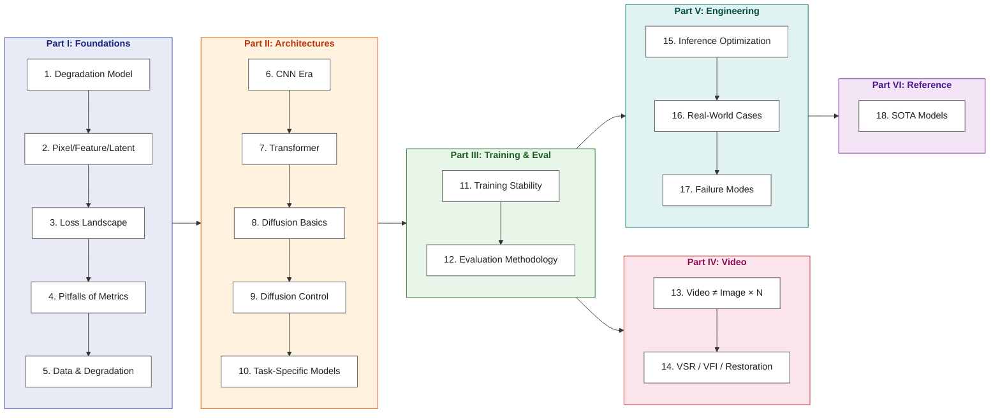

# Image Enhancement: From Principles to Engineering

> Starting from the degradation model y = D(x) + n, build a first-principles understanding of image enhancement and master modern engineering practices from CNNs and Transformers to diffusion models.

**Languages**: [中文](../README.md) | [English](README.md)
**Read online**: [yingwang.github.io/image-enhancement-guide](https://yingwang.github.io/image-enhancement-guide/)

Written for engineers comfortable with PyTorch and standard deep learning workflows (such as image classification or LLM engineering) who want a rigorous, systematic foundation in low-level vision. Rather than presenting isolated training scripts, this book provides the mental models required to inspect any degraded image and immediately determine the right priors, objective functions, network architectures, and deployment trade-offs.

## The Logic of This Book

**Core trajectory**: First understand physical and digital image degradation (the degradation model), then examine how restoration is evaluated and guided (losses and metrics), and finally master model architectures, training stability, temporal consistency in video, and production deployment.

Most existing literature on image enhancement splits between narrow academic papers focused on isolated techniques and open-source repositories documenting command-line flags. This volume bridges that gap by articulating **the engineering philosophy of modern restoration**.

## In Scope vs Out of Scope

**In scope**: Super-resolution (SR), denoising, deblurring, compression artifact removal, demoiréing, low-light enhancement, HDR reconstruction, deraining, dehazing, face restoration, legacy photo restoration, colorization, video super-resolution, frame interpolation, video stabilization, and ISP enhancement fundamentals.

**Out of scope**:

- Pure generative synthesis from scratch (text-to-image and text-to-video, e.g., SD, Sora, Veo)
- Semantic image editing (virtual try-on, face swapping, style transfer)
- 3D reconstruction / NeRF / 3D Gaussian Splatting
- High-level video understanding (action recognition, video QA, Video-LLMs)
- Codec engineering and standard compression algorithms (H.264/AV1, neural codecs)
- Medical and satellite imaging pipelines (underlying inverse principles apply, but domain-specific pipelines are omitted)
- Hardware ISP silicon design (touched upon conceptually in low-light contexts)

The conceptual boundary is straightforward: **if an underlying ground-truth physical signal is being estimated, the problem is enhancement; if visual content is hallucinated ex nihilo from text prompts, it is generation**.

## Table of Contents

### Part I · Foundations

| # | Chapter | Core question |
|---|---------|---------------|
| 1 | [Degradation Model & Inverse Problems](chapters/01-degradation-model.md) | Enhancement is an ill-posed inverse problem: where do effective priors come from? |
| 2 | [Pixel, Feature, Latent](chapters/02-representation.md) | Why do contemporary generative restoration systems operate in latent space? |
| 3 | [Loss Landscape](chapters/03-losses.md) | What geometric and statistical objectives do L1, perceptual, adversarial, and diffusion losses actually optimize? |
| 4 | [Pitfalls of Metrics](chapters/04-metrics.md) | What structural information and perceptual trade-offs do PSNR, SSIM, LPIPS, and FID obscure? |
| 5 | [Data & Degradation Synthesis](chapters/05-degradation-pipeline.md) | Why the synthetic degradation pipeline is the true differentiator in real-world restoration |

### Part II · Architectures

| # | Chapter | Core question |
|---|---------|---------------|
| 6 | [The CNN Era](chapters/06-cnn.md) | Architectural evolution from SRCNN to NAFNet |
| 7 | [Transformer in Low-Level Vision](chapters/07-transformer.md) | How self-attention mechanisms resolve long-range dependencies in degraded imagery |
| 8 | [Diffusion Basics](chapters/08-diffusion.md) | From DDPM to LDM: how diffusion generates realistic high-frequency detail |
| 9 | [Conditioning Diffusion](chapters/09-control.md) | ControlNet, IP-Adapter, Tile diffusion, and multi-condition conditioning |
| 10 | [Task-Specific Models](chapters/10-task-specific.md) | Designing domain-specific inductive biases for faces, documents, and specialized domains |

### Part III · Training & Evaluation

| # | Chapter | Core question |
|---|---------|---------------|
| 11 | [Training Stability](chapters/11-training.md) | Mitigating GAN collapse, tuning diffusion noise schedules, and balancing multi-task loss landscapes |
| 12 | [Evaluation Methodology](chapters/12-evaluation.md) | Navigating the perception-distortion trade-off and structuring reliable subjective evaluation studies |

### Part IV · Video

| # | Chapter | Core question |
|---|---------|---------------|
| 13 | [Video Is Not Image × N](chapters/13-video-basics.md) | Why temporal consistency is a distinct physical and mathematical problem |
| 14 | [VSR / VFI / Restoration](chapters/14-video-models.md) | Alignment and propagation in BasicVSR++, RIFE, and video stabilization |

### Part V · Engineering & Deployment

| # | Chapter | Core question |
|---|---------|---------------|
| 15 | [Inference Optimization](chapters/15-inference.md) | Quantization, TensorRT, CoreML compilation, tiling strategies, and edge deployment |
| 16 | [Real-World Cases](chapters/16-cases.md) | End-to-end case studies: historical photo restoration, low-light ISP pipelines, UGC enhancement, and real-time 4K streaming |
| 17 | [Failure Modes](chapters/17-failures.md) | Diagnosing and preventing hallucination, texture aliasing, boundary seams, and production regressions |

### Part VI · Reference

| # | Chapter | Core question |
|---|---------|---------------|
| 18 | [SOTA Models](chapters/18-sota.md) | Seven benchmark SOTA architectures and their foundational design choices |

## Relationship to Other Books

| | [LLM Training Guide](https://github.com/yingwang/llm-tutorial) | [Thinking in LLM](https://github.com/yingwang/thinking-in-llm) | This book |
|---|---|---|---|
| **Domain** | LLM training | LLM applications | Low-level vision |
| **Form** | Engineering guide + code | First principles | Engineering guide + snippets |
| **Audience** | Training engineers | LLM application engineers | Image/CV engineers |
| **Prerequisites** | ML basics | Programming basics | PyTorch + fundamental ML |

## How to Read

- **Linear study**: Part I → II → III → IV → V → VI. Chapter 1 establishes the mathematical framing and is essential reading.
- **Fast track**: Chapter 1 → Chapter 5 → Chapter 8 → Chapter 18 (the degradation equation, data synthesis pipelines, diffusion mechanics, and contemporary SOTA).
- **Experienced practitioner**: Jump directly to Part V case studies, referencing earlier theoretical foundations as needed.
- **Product engineering**: Focus on Chapters 16 and 17 first, followed by Chapters 9 and 15.

## Author

Ying Wang

## License

This repository is **dual-licensed**:

- **Prose and diagrams** (Mermaid charts, explanatory text, chapter content): [CC BY-NC-SA 4.0](../LICENSE) (Attribution · NonCommercial · ShareAlike)
- **Code snippets** (Python and C++ implementations within chapters): [MIT](../LICENSE-CODE) (free to use, including commercial applications, with copyright notice preserved)

---

> Last updated: 2026-04-27
