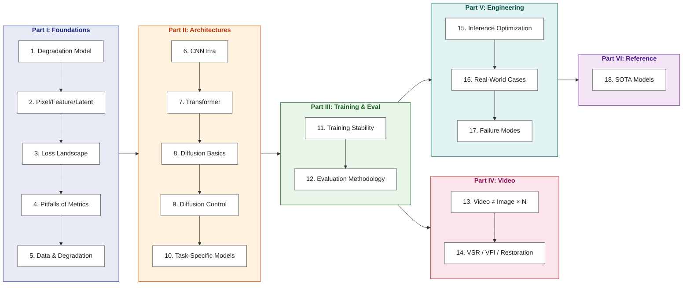

# Image Enhancement: From Principles to Engineering

> Starting from the degradation model y = D(x) + n, build first-principles understanding of image enhancement and master the full engineering practice from CNN/Transformer to diffusion models.

**Languages**: [中文](../README.md) | [English](README.md)
**Read online**: [yingwang.github.io/image-enhancement-guide](https://yingwang.github.io/image-enhancement-guide/)

For engineers comfortable with PyTorch and with prior LLM or image-classification experience, but new to low-level vision systematically. This book does not teach you how to run a particular training script — it gives you the framework to look at a degraded image and immediately know "this kind of degradation needs that kind of prior, that kind of loss, that kind of architecture; if I have to deploy on-device I'll cut here."

## The Logic of This Book

**Core logic**: first understand "how images degrade" (degradation model) → then "how we measure improvement" (loss & metrics) → then architectures, training tricks, video-specific issues, and engineering deployment.

Most existing material on image enhancement is either papers (one specific method) or open-source READMEs (how to run them). This book is what was missing in the middle: **the engineering philosophy of the field**, made explicit.

## In Scope vs Out of Scope

**In scope**: super-resolution (SR), denoising, deblurring, JPEG/compression-artifact removal, demoiré, low-light enhancement, HDR, derain/dehaze, face restoration, old-photo restoration, colorization, video super-resolution, frame interpolation, video stabilization, ISP enhancement basics.

**Out of scope**:

- Pure generation (text-to-image / text-to-video, e.g. SD/Sora/Veo)
- Image editing (clothing/face swap, style transfer)
- 3D / NeRF / Gaussian Splatting
- Video understanding (action recognition, video QA, Video-LLM)
- Image compression and codecs (H.264/AV1, neural compression)
- Medical reconstruction, satellite remote sensing (principle mentioned, not developed)
- Hardware ISP (only touched briefly in the low-light chapter)

The dividing line: **if there is a notion of an "original signal" we are estimating, it is enhancement; if it's "from nothing", it is generation**.

## Table of Contents

### Part I · Foundations

| # | Chapter | Core question |
|---|---------|---------------|
| 1 | [Degradation Model & Inverse Problems](chapters/01-degradation-model.md) | Enhancement is an ill-posed inverse problem — where do priors come from? |
| 2 | [Pixel, Feature, Latent](chapters/02-representation.md) | Why do all modern methods work in latent space? |
| 3 | [Loss Landscape](chapters/03-losses.md) | What is each of L1/perceptual/adversarial/diffusion losses optimizing? |
| 4 | [Pitfalls of Metrics](chapters/04-metrics.md) | What does each of PSNR/SSIM/LPIPS/FID hide from you? |
| 5 | [Data & Degradation Synthesis](chapters/05-degradation-pipeline.md) | Real-ESRGAN's true contribution is the data pipeline |

### Part II · Architectures

| # | Chapter | Core question |
|---|---------|---------------|
| 6 | [The CNN Era](chapters/06-cnn.md) | The evolution from SRCNN to NAFNet |
| 7 | [Transformer in Low-Level Vision](chapters/07-transformer.md) | Why is attention useful for restoration? |
| 8 | [Diffusion Basics](chapters/08-diffusion.md) | From DDPM to LDM — why can diffusion "create from nothing"? |
| 9 | [Conditioning Diffusion](chapters/09-control.md) | ControlNet / IP-Adapter / Tile / multi-condition control |
| 10 | [Task-Specific Models](chapters/10-task-specific.md) | Inductive biases of face / document / medical |

### Part III · Training & Evaluation

| # | Chapter | Core question |
|---|---------|---------------|
| 11 | [Training Stability](chapters/11-training.md) | GAN collapse, diffusion scheduling, multi-loss balancing |
| 12 | [Evaluation Methodology](chapters/12-evaluation.md) | Limits of objective metrics + how to design subjective evals |

### Part IV · Video

| # | Chapter | Core question |
|---|---------|---------------|
| 13 | [Video Is Not Image × N](chapters/13-video-basics.md) | Temporal consistency is an independent problem |
| 14 | [VSR / VFI / Restoration](chapters/14-video-models.md) | BasicVSR++, RIFE, video stabilization |

### Part V · Engineering & Deployment

| # | Chapter | Core question |
|---|---------|---------------|
| 15 | [Inference Optimization](chapters/15-inference.md) | Quantization, TensorRT, CoreML, mobile |
| 16 | [Real-World Cases](chapters/16-cases.md) | Old-photo restoration, low-light, UGC, 4K live, ISP |
| 17 | [Failure Modes](chapters/17-failures.md) | The typical ways enhancement models fail in production |

### Part VI · Reference

| # | Chapter | Core question |
|---|---------|---------------|
| 18 | [SOTA Models](chapters/18-sota.md) | 7 academic SOTA models worth knowing in 2026 |

## Relationship to other books

| | [LLM Training Guide](https://github.com/yingwang/llm-tutorial) | [Thinking in LLM](https://github.com/yingwang/thinking-in-llm) | This book |
|---|---|---|---|
| **Domain** | LLM training | LLM applications | Low-level vision |
| **Form** | Engineering guide + code | First principles | Engineering guide + snippets |
| **Audience** | Training engineers | LLM application engineers | Image/CV engineers |
| **Prerequisites** | ML basics | Programming basics | PyTorch + a bit of ML |

## How to Read

- **Front to back**: Part I → II → III → IV → V → VI. Chapter 1 is the foundation, read it regardless.
- **In a hurry**: Ch 1 → Ch 5 → Ch 8 → Ch 18 (central equation + data synthesis + diffusion basics + current SOTA).
- **Already familiar with the area**: jump to Part V cases, look back at earlier chapters when something is unclear.
- **Building a product**: read Ch 16-17 first, then Ch 9 and Ch 15.

## Author

Ying Wang

## License

This repository is **dual-licensed**:

- **Prose and diagrams** (Mermaid, explanatory text, chapter content): [CC BY-NC-SA 4.0](../LICENSE) — Attribution · NonCommercial · ShareAlike
- **Code snippets** (Python examples within chapters): [MIT](../LICENSE-CODE) — free to use, including commercial, with copyright notice retained

---

> Last updated: 2026-04-27
