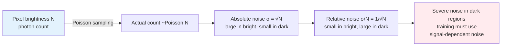

# Chapter 1 · Degradation Model and Inverse Problems

> "Enhancement" is one common descriptor. This book prefers a more precise term: **estimation**.

## 1.0 Reader Orientation

This book is written for algorithm engineers who possess a working knowledge of machine learning but have **not necessarily specialized in low-level vision**. The expected background includes:

- Familiarity with tensor computation and comfort reading PyTorch code; practical intuition for convolution, upsampling, normalization, and attention mechanisms.
- Fluency with standard objective functions and gradient descent optimization loops.
- Conceptual familiarity with diffusion models, even without prior hands-on training experience.

What this book does **not** assume: prior mastery of image signal processing (ISP) pipelines, sampling and aliasing theory in the frequency domain, video coding standards, sensor noise physics, or the internal mechanics of specific restoration architectures. Every foundational term is introduced and defined concisely upon its first appearance.

**Notation.** The following mathematical symbols remain consistent throughout this text:

- $x$: The ideal high-quality image (ground truth), with tensor dimensions generally denoted as $(C, H, W)$, where $C$ is the number of color channels, and $H, W$ represent height and width.
- $y$: The observed low-quality image; its spatial dimensions may differ from $x$ (for example, in super-resolution, $y$ is spatially smaller than $x$).
- $\hat{x}$: The model's reconstruction or estimate of $x$.
- $D$: The degradation operator, representing the physical and digital transformations that map high-quality signals to degraded observations.
- $n$: Additive or signal-dependent noise.
- $f_\theta$: A parametric model governed by weights $\theta$.
- $p(\cdot)$: A probability distribution.

**Key Acronyms on First Appearance.** To maintain clarity without overwhelming jargon, fundamental abbreviations are defined below:

- **ISP** (Image Signal Processor): The dedicated hardware and software pipeline converting raw sensor readouts into viewable color imagery.
- **ISO**: Sensor gain sensitivity; higher values amplify sensor readouts, introducing visible noise.
- **DCT** (Discrete Cosine Transform): The linear transformation mapping $8 \times 8$ pixel blocks into spatial frequency coefficients in JPEG compression.
- **HR / LR** (High Resolution / Low Resolution).
- **SR** (Super-Resolution): The task family dedicated to reconstructing high-resolution imagery from low-resolution inputs.
- **IQA** (Image Quality Assessment).

Additional task-specific acronyms are defined as they appear in subsequent chapters.

## 1.1 A Concrete Scenario

Consider a common scenario: at 9 PM, you capture a handheld photograph of a vibrant neon storefront on a city street. Inspecting the result reveals several distinct defects:

- Compressed dynamic range: underexposed shadows coupled with clipped highlights.
- Optical smearing across high-contrast typography edges.
- Chromatic noise: high-frequency purple and green speckles scattered across shadow regions.
- Moiré interference and block boundaries along fine horizontal and vertical louvers (a compound effect of aliasing and JPEG quantization).

Opening a mobile editor and selecting "AI Enhance" yields a clean, sharp, well-balanced image within seconds.

**What computational process actually occurred during those few seconds?**

The model did not "recover the original photons." In strict information-theoretic terms, that high-frequency optical information was irreversibly destroyed during capture and compression. Instead, the model **estimated the most plausible high-quality image conditioned on the degraded observation**. This establishes the first foundational insight of this book:

> An enhancement model does not strictly "restore" lost signals; it performs guided inference. The engineering challenge lies entirely in how plausibly and faithfully that inference is constrained.

Mastering this perspective provides the unified rationale behind every architecture, loss function, evaluation metric, and data-synthesis pipeline examined in later chapters.

## 1.2 The Central Equation

We formalize the problem using the classical forward degradation model:

$$
y = D(x) + n
$$

- $x$: The latent high-quality image (the ground-truth physical scene irradiance).
- $D$: The compound degradation operator (the cumulative transformation imposed by scene optics, lens aberrations, sensor sampling, and digital codecs).
- $n$: Stochastic noise introduced primarily during sensor readout and analog-to-digital conversion.
- $y$: The observed degraded image.

The objective across all low-level vision engineering is straightforward: **given $y$, estimate $x$**.

We express this estimation as $\hat{x} = f_\theta(y)$, where $f_\theta$ is a neural network parameterized by $\theta$.

This concise formulation conceals four primary engineering challenges:

1. $D$ is typically **unknown** at test time (lens cleanliness, sensor thermal state, and downstream compression parameters are rarely recorded).
2. $D$ is **non-injective (many-to-one)**: infinitely many distinct ground-truth signals $x$ can produce the exact same degraded observation $y$.
3. $n$ is **stochastic**: identical ground-truth scenes $x$ yield distinct observations $y$ under different noise realizations.
4. Curated training corpora rarely contain **paired ground-truth datasets** $(x, y)$ captured in real-world conditions.

Points 1 and 2 define this as an **inverse problem**; Point 3 makes it a **statistical inverse problem**; and Point 4 necessitates the synthetic generation of paired training data, known as degradation synthesis (detailed in Chapter 5).

## 1.3 Why This Is Ill-Posed

In classical mathematical analysis, a problem is well-posed in the sense of Hadamard if:

1. **A solution exists.**
2. **The solution is unique.**
3. **The solution depends continuously on the initial data** (small perturbations in the input yield bounded perturbations in the output).

Inverse problems frequently violate all three criteria, rendering them **ill-posed**. Image enhancement represents a canonical ill-posed inverse problem.

Consider a concrete $4\times$ single-image super-resolution task.

Given an input low-resolution image $y$ of dimensions $512 \times 512$, the goal is to reconstruct an output high-resolution image $x$ of size $2048 \times 2048$. Each non-overlapping $4 \times 4 = 16$ pixel neighborhood in $x$ collapses into a single scalar value in $y$.

Under standard bicubic downsampling, each low-resolution pixel represents a weighted linear combination of sixteen high-resolution pixels. This operation projects a 16-dimensional continuous subspace onto a 1-dimensional scalar line: **15 degrees of freedom are permanently discarded for every output pixel**.

Framed inversely: given a single measured scalar $y_{ij}$, which $4 \times 4$ high-resolution block produced it? The null space spans an unconstrained 15-dimensional manifold containing infinite candidate patterns.

For example, if an observed low-resolution pixel has value $y_{ij} = 128$ (neutral gray):

- It could originate from a uniform gray patch ($16$ identical pixels at $128$).
- It could stem from alternating binary checkerboard stripes ($8$ pixels at $0$ and $8$ pixels at $256$).
- It could represent a linear intensity gradient ranging smoothly from $100$ to $156$.
- It could contain an isolated specular highlight surrounded by darker tones ($15$ pixels at $120$ and $1$ pixel at $248$).

Every one of these distinct high-resolution structures projects to the exact same measured value of $128$ under downsampling. The neural network must select a specific realization from this infinite set.

To make that selection effectively, the model relies on prior knowledge.

## 1.4 Three Paradigms of Priors

A prior represents **an inductive assumption regarding the structure of natural images**. An effective restoration model successfully encodes expressive, valid priors into its architecture, objective functions, or learned parameters.

Historically, priors have evolved through three distinct paradigms:

### Analytic Priors (Hand-Crafted)

Before deep learning, practitioners characterized the statistical regularities of natural scenes using explicit mathematical formulations:

- **Piecewise Smoothness**: Neighboring pixels exhibit high spatial correlation (penalized via the $L_2$ norm of spatial gradients).
- **Sparse Gradients (Total Variation)**: Spatial gradients in natural scenes are predominantly zero, punctuated by sharp, sparse discontinuities at object boundaries (penalized via the $L_1$ norm of spatial gradients).
- **Transform Sparsity**: Natural image patches exhibit sparse representations when projected onto wavelet or DCT bases.

These formulations underpinned the **variational methods** and **dictionary learning / sparse coding** algorithms dominant from the 1990s through the early 2010s. While **computationally transparent, mathematically sound, and free of training requirements**, their expressiveness was fundamentally constrained. Analytic formulations cannot differentiate semantic context, failing to capture subtle differences between skin texture, foliage, or woven fabric.

Although no longer deployed as primary restoration engines, analytical formulations remain valuable regularizers. For instance, Total Variation (TV) regularizers remain widely used in loss formulations (detailed in Chapter 3):

```python
def total_variation_loss(x: torch.Tensor) -> torch.Tensor:
    """Total Variation: penalize differences between neighboring pixels, encourage piecewise smoothness.
    x: (B, C, H, W)
    """
    dh = (x[:, :, 1:, :] - x[:, :, :-1, :]).abs().mean()
    dw = (x[:, :, :, 1:] - x[:, :, :, :-1]).abs().mean()
    return dh + dw
```

### Data-Driven Priors (Discriminative CNNs and Transformers)

With the introduction of **SRCNN** (Super-Resolution Convolutional Neural Network) in 2014, deep learning superseded classical variational pipelines. Convolutional networks learn direct parametric mappings from $y$ to $\hat{x}$, embedding image priors directly within their connection weights. Trained across diverse high-resolution datasets, these models implicitly capture the low-dimensional manifold of natural imagery.

Models in this category are primarily **discriminative**: given an input $y$, they output a deterministic estimate $\hat{x}$. While they do not explicitly model the density $p(x)$, empirical risk minimization aligns the output $\hat{x}$ with the statistical distribution of natural images.

Milestone architectures in this progression include:

- **SRCNN** (2014): Established end-to-end convolutional mapping for super-resolution.
- **EDSR** (Enhanced Deep Super-Resolution, 2017): Optimized residual blocks by removing Batch Normalization, stabilizing low-level feature propagation.
- **RCAN** (Residual Channel Attention Network, 2018): Introduced channel-wise attention mechanisms into deep residual backbones.
- **SwinIR** (Swin Transformer for Image Restoration, 2021): Adapted shifted-window self-attention for high-resolution image restoration.
- **Restormer** (2022): Transposed self-attention across channel dimensions, decoupling computational complexity from spatial resolution.
- **NAFNet** (Non-linear Activation Free Network, 2022): Demonstrated that simplified gated linear units can outperform complex nonlinear activation functions.

Chapters 6 and 7 explore these structural advancements in depth.

### Generative Priors (Diffusion Models and Generative Adversarial Networks)

Following the development of **DDPM** (Denoising Diffusion Probabilistic Models) in 2020, generative modeling shifted toward learning the explicit data distribution $p(x)$. Conditioned on an observation $y$, generative frameworks model the conditional distribution $p(x \mid y)$, sampling realistic reconstructions $\hat{x}$ directly from the posterior.

The foundational distinction between discriminative and generative paradigms lies in their mathematical objectives:

- Discriminative frameworks approximate the conditional mean or median (e.g., $\mathbb{E}[x \mid y]$ under $L_2$ loss), producing a **single deterministic output**.
- Generative frameworks capture the full posterior distribution $p(x \mid y)$, enabling the sampling of **multiple distinct, high-fidelity hypotheses**.

In highly ill-posed settings (such as $8\times$ super-resolution or severely degraded facial portraits), conditional mean estimators collapse into blurry, over-smoothed averages. Generative models bypass this limitation by synthesizing plausible, sharp high-frequency textures.

However, generative models carry a distinct operational trade-off: **they synthesize unverified details**. This leads to a crucial engineering principle emphasized throughout this book (and dissected in Chapters 10 and 17):

> Generative enhancement systems synthesize plausible details rather than retrieving true physical evidence.
>
> Leveraging a diffusion prior to restore historical portraiture produces visually compelling results; applying the same prior to forensic surveillance constitutes a critical failure of integrity.

## 1.5 Anatomy of the Degradation Operator D

Returning to our central equation $y = D(x) + n$, the real-world degradation operator $D$ rarely behaves as an isolated mathematical transform. Instead, it forms a composite pipeline of heterogeneous operations:

$$
D = \text{JPEG} \circ \text{Quantization} \circ \text{Downsample} \circ \text{Blur} \circ \text{ColorShift} \circ \text{LensDistortion} \circ \dots
$$

Furthermore, this composite transformation is **stochastic**: capturing the same scene repeatedly with the same camera hardware produces varying realizations of $y$ due to thermal variations, optical micro-vibrations, and dynamic ISP adjustments.

The principal components of $D$ encountered in production systems include:

### Blur

Optical blur is mathematically modeled as the spatial convolution of an image $x$ with a point spread function (PSF) or blur kernel $k$: $y = x * k$.

Physical sources dictate the geometric profile of $k$:

- **Defocus Blur**: Modeled as a circular pillbox or disc kernel, whose radius varies with depth and aperture settings.
- **Motion Blur**: Modeled as an oriented linear or curvilinear trajectory, reflecting relative velocity between the camera sensor and the subject during exposure.
- **Atmospheric Turbulence**: Modeled via isotropic or anisotropic Gaussian distributions, governed by atmospheric refractive fluctuations.
- **Optical Aberrations**: Manifest as Airy disk patterns, coma, or chromatic aberrations characteristic of specific optical assemblies.

Real-world captures frequently combine multiple spatially varying blur kernels across the image plane (where lens periphery exhibits distinct aberration profiles relative to the optical center). This spatial heterogeneity motivates **blind deblurring**, where the operator must estimate sharp content without explicit kernel parameterization.

### Downsampling

Spatial decimation maps high-resolution grids onto coarser sampling lattices. Common decimation algorithms include:

- **Nearest Neighbor**: Samples the closest spatial coordinate; computationally minimal but induces severe spatial aliasing and step artifacts.
- **Bilinear**: Computes distance-weighted linear interpolations across $2 \times 2$ neighborhoods.
- **Bicubic**: Employs cubic splines across $4 \times 4$ neighborhoods; serves as the **standard academic baseline** for synthetic degradation.
- **Lanczos**: Uses windowed sinc functions to approximate an ideal low-pass filter in the frequency domain.
- **Box / Area Averaging**: Computes unweighted arithmetic averages across contiguous pixel grids; closely mimics physical photon accumulation on sensor pixels.

These downsampling kernels exhibit distinct frequency responses. Bicubic downsampling is **mathematically smooth but structurally idealized**: it presumes anti-aliased continuous inputs, whereas physical sensor sampling routinely records aliased high-frequency energy. This discrepancy creates the train-test domain shift analyzed in Section 1.7.

```python
import torch
import torch.nn.functional as F

def downsample_compare(x: torch.Tensor, scale: int = 4):
    """Downsample the same image with different methods and compare.
    x: (1, C, H, W), values in [0, 1]
    """
    h, w = x.shape[-2:]
    new_h, new_w = h // scale, w // scale

    nearest  = F.interpolate(x, size=(new_h, new_w), mode='nearest')
    bilinear = F.interpolate(x, size=(new_h, new_w), mode='bilinear', align_corners=False)
    bicubic  = F.interpolate(x, size=(new_h, new_w), mode='bicubic',  align_corners=False)
    area     = F.interpolate(x, size=(new_h, new_w), mode='area')

    return {
        'nearest':  nearest,
        'bilinear': bilinear,
        'bicubic':  bicubic,
        'area':     area,
    }
```

Evaluating these decimation operators reveals systematic differences: bicubic interpolation produces sharper edge gradients, area averaging yields softer transitions, and nearest-neighbor sampling generates prominent staircase artifacts. **No single operator represents ground-truth decimation perfectly**; each simulates a distinct physical sampling mechanism.

### Noise

Sensor noise represents one of the most frequently oversimplified components in restoration pipelines, warranting the dedicated physical derivation presented in Section 1.8.

### Compression Artifacts

JPEG compression represents the most ubiquitous digital degradation in image processing. Its encoding pipeline proceeds through discrete stages:

1. Color space transformation: $\text{RGB} \to \text{YCbCr}$, followed by optional chroma subsampling (e.g., 4:2:0).
2. Spatial partitioning into non-overlapping $8 \times 8$ pixel blocks.
3. Frequency transformation via 2D Discrete Cosine Transform (DCT) per block.
4. Lossy coefficient quantization (where lower quality factors apply coarser quantization matrices).
5. Lossless entropy encoding (Huffman or arithmetic coding).

Because Step 4 discards high-frequency transform coefficients, decompression yields characteristic structural distortions:

- **Blocking Artifacts**: Discontinuities along $8 \times 8$ grid boundaries.
- **Ringing / Gibbs Phenomenon**: High-frequency ripples near sharp, high-contrast structural edges.
- **Color Bleeding**: Chromatic fringing resulting from downsampled chroma channels.

Video codecs (such as H.264, HEVC/H.265, and AV1) apply similar frequency quantization within block-based motion compensation loops, introducing additional temporal motion-vector tearing and ghosting artifacts.

### Color and Dynamic Range Degradation

Illumination shifts, auto-white-balance drift, and tone curve compression during low-light capture alter color fidelity. Unlike spatial filtering operations, these degradations represent nonlinear mappings across intensity value space.

### Compound Degradation Dataflow

Connecting these individual physical and digital processes yields the complete end-to-end degradation pipeline shown below. Reversing this sequence constitutes the core objective of modern restoration models:

```mermaid
graph LR
    X[Ideal image x<br/>photon distribution / RAW] --> Blur[Blur<br/>defocus / motion / diffraction]
    Blur --> Down[Downsample<br/>bicubic / area / lanczos]
    Down --> Color[Color distortion<br/>white-balance drift / tone shift]
    Color --> Noise[Add noise<br/>Poisson + read + dark current]
    Noise --> Quant[Quantization<br/>8bit / 10bit]
    Quant --> JPEG[JPEG compression<br/>DCT quantization + chroma subsampling]
    JPEG --> Net[Network recompression<br/>WeChat / Weibo / Twitter]
    Net --> Y[Observed image y<br/>the one in the user's phone]
    Y -. inverse problem .-> Inv[Model f_θ<br/>estimate x̂]
    Inv -. estimate .-> X

    style X fill:#e8f5e9
    style Y fill:#ffebee
    style Inv fill:#fff3e0
```



Key engineering insights derived from this compound graph:

1. **Permutational Variability**: The operational order in physical pipelines varies: compression may precede or follow transmission filtering, and noise injection occurs continuously throughout analog readout.
2. **Stochasticity at Every Stage**: Identical optical scenes captured by identical camera sensors yield divergent output tensors due to thermal shot noise and adaptive ISP routines.
3. **Perceptual Dominance of Downstream Operators**: Digital compression and noise severely degrade signal fidelity (PSNR), while upstream blur and spatial decimation primarily degrade perceptual high-frequency sharpness.
4. **Holistic End-to-End Inversion**: Neural networks $f_\theta$ do not invert each step sequentially; they learn unified mappings across the entire composite distribution. This end-to-end formulation explains why unified deep networks systematically outperform modular multi-stage pipelines.

## 1.6 Blind vs. Non-Blind Inversion: Known vs. Unknown Degradations

In the forward model $y = D(x) + n$, an essential engineering question arises: **is $D$ explicitly known during inference?** The answer establishes the operational boundary between classical inversion and blind restoration:

### Non-Blind Inversion: $D$ is Known

Classical inverse methods and controlled imaging pipelines assume deterministic access to $D$:

- **Motion Deblurring**: Synchronized IMU gyro telemetry records high-frequency camera movement during exposure, enabling analytical estimation of the blur kernel $k$.
- **Computed Tomography (CT)**: Known X-ray source-detector geometry specifies the Radon transform projection matrix $A$.
- **Screen Moiré Demodulation**: Known display pixel pitch and sensor sampling geometry enable exact modeling of frequency aliasing.
- **Calibrated Sensor Denoising**: Known ISO gain, sensor temperature, and exposure time parameterize the noise variance function (shot, read, and dark current noise).

Under non-blind assumptions, classical algorithms apply closed-form regularized inversion (e.g., Wiener deconvolution, Richardson-Lucy iteration, or Plug-and-Play ADMM priors). Deep networks can also operate in non-blind modes by accepting degradation parameters as explicit conditioning inputs (as in SRMD or DnCNN-B).

### Blind Inversion: $D$ is Unknown

In production environments, degradation parameters are rarely observable:

- User-uploaded mobile photos have unknown exposure settings, lens conditions, and processing histories.
- Internet media undergoes uncalibrated, cascading compression cycles across heterogeneous CDNs.
- Historical photographs exhibit chemical dye fading, physical scratches, and non-Gaussian grain.
- Mobile screenshots combine rendering scaling, rasterization, and lossy compression.

Under blind conditions, $D$ cannot be explicitly parameterized. Engineering systems adopt two primary paradigms:

1. **Broad Distributional Data Synthesis**: Train models across expansive, randomized degradation distributions (the foundation of the Real-ESRGAN second-order pipeline detailed in Chapter 5).
2. **Implicit Runtime Condition Estimation**: Equip networks with auxiliary modules to infer degradation properties dynamically (e.g., explicit kernel estimators in KernelGAN, semantic degradation prompts generated by vision-language models like LLaVA in SUPIR).

### Comparative Architectural Overview

The table below summarizes how representative models navigate the blind versus non-blind spectrum:

| Model | Paradigm | Degradation Handling |
|-------|----------|----------------------|
| Real-ESRGAN | **Blind SR** | Trained across diverse synthetic degradation pipelines |
| CodeFormer | **Blind Face Restoration** | Discrete codebook prior bypasses explicit degradation estimation |
| BSRGAN | **Blind SR** | Employs randomized composite degradation synthesis |
| MANIQA / CLIP-IQA / Q-Align | **Blind IQA** (NR-IQA) | Directly assesses quality without reference signals |
| SUPIR | **Blind Generative SR** | Vision-language prompts provide semantic restoration guidance |
| Restormer | **Flexible** | Task-agnostic architecture; domain behavior determined by training data |
| OSEDiff / TSD-SR | **Blind Generative SR** | One-step diffusion with structural condition encoding |

Engineering takeaway: **consumer applications processing open-domain inputs operate almost exclusively in the blind regime**. Methods requiring explicit degradation parameters typically fail in production due to compounding errors in degradation estimation modules.

### Blind Image Quality Assessment (NR-IQA)

As detailed in Chapter 4, evaluation methodologies parallel the blind and non-blind taxonomy:

- **Full-Reference IQA (FR-IQA)**: Computes distance metrics against ground-truth targets $x$. Standard metrics include **PSNR** (Peak Signal-to-Noise Ratio), **SSIM** (Structural Similarity), **LPIPS** (Learned Perceptual Image Patch Similarity), and **DISTS** (Deep Image Structure and Texture Similarity). These require paired reference data.
- **No-Reference IQA (NR-IQA)**: Evaluates structural and perceptual quality directly on the output $\hat{x}$ without a ground truth. Standard approaches include statistical benchmarks like **NIQE** (Natural Image Quality Evaluator), deep attention networks like **MANIQA**, multimodal embeddings like **CLIP-IQA**, and vision-language evaluators like **Q-Align**.

Because real-world production inputs lack ground-truth reference pairs, **online telemetry and automated quality monitoring rely strictly on No-Reference (Blind) IQA frameworks**.

## 1.7 Real-World Degradations and the Train-Test Domain Shift

Synthesizing the physical components from Section 1.5, a real-world smartphone capture undergoes the following composite transformation:

$$
y = \text{NetworkRecompression}(\text{JPEG}(\text{Quantize}(\text{ISP}(\text{Sensor}(x_{\text{photon}})))))
$$

Where:

- $x_{\text{photon}}$ represents the incident optical irradiance arriving at the sensor array.
- $\text{Sensor}$ models photon transduction, introducing Poisson shot noise, electronic read noise, and dark current.
- $\text{ISP}$ applies demosaicing, bad-pixel correction, denoising, white balance calibration, color matrix transformation, and local tone mapping.
- $\text{Quantize}$ performs digital quantization to standard bit depths (e.g., 8-bit sRGB).
- $\text{JPEG}$ performs lossy block DCT quantization during file storage.
- $\text{NetworkRecompression}$ applies secondary lossy compression passes during social media distribution.

This compound sequence constitutes the true physical operator $D$.

In contrast, earlier academic benchmarks (including early baselines for SRCNN, EDSR, RCAN, and SwinIR) synthesized training pairs using simplified decimation:

```python
# The standard academic training pipeline (idealized)
y = bicubic_downsample(x, scale=4)
```

This structural oversimplification created the dominant failure mode of early deep restoration systems, termed **train-test mismatch**:

- **Training Distribution**: Inputs $y$ were generated via clean, deterministic bicubic downsampling of high-resolution datasets.
- **Inference Distribution**: Inputs $y$ originated from physical camera sensors, subject to optical blur, sensor noise, ISP non-linearities, and compression artifacts.

Models optimized exclusively on idealized bicubic downsampling perform poorly when deployed on real-world imagery:

- A network achieving $32\text{ dB}$ PSNR on benchmark sets (such as Set5 or Set14) produces severe artifacts on real smartphone captures.
- High-frequency sensor noise and JPEG block edges are misidentified as edge details, amplifying noise into synthetic high-frequency artifacts.

This domain gap was addressed by **Real-ESRGAN** (2021). Its primary contribution was not an architectural redesign (retaining the RRDB backbone from ESRGAN), but rather a **stochastic, multi-stage degradation synthesis pipeline**:

```python
# Real-ESRGAN style degradation pipeline (simplified conceptual flow; full implementation in Chapter 5)
y = x.clone()
y = apply_blur(y, kernel=random_blur_kernel())
y = downsample(y, scale=random_scale(), mode=random_mode())
y = add_noise(y, type=random_noise_type())
y = jpeg_compress(y, quality=random.randint(40, 95))

# Second-order degradation stage: repeat the full pipeline
y = apply_blur(y, kernel=random_blur_kernel())
y = downsample(y, scale=random_scale(), mode=random_mode())
y = add_noise(y, type=random_noise_type())
y = jpeg_compress(y, quality=random.randint(30, 80))
```

By subjecting training samples to randomized combinations of blur, scaling, mixed noise, and compression passes, Real-ESRGAN produced models that generalized robustly to real-world captures.

This underscores a central insight in restoration engineering:

> In real-world image restoration, the fidelity of the degradation synthesis pipeline often has a greater practical impact on generalization than minor architectural modifications.
>
> An advanced architecture trained on idealized bicubic data fails on real-world inputs; the same architecture trained on robust composite degradation pipelines delivers reliable restoration.

Chapter 5 provides the complete production implementation of this synthesis framework.

## 1.8 Physical Noise Modeling: The Limits of Additive Gaussian Noise

A common simplification in early literature is the assumption of homogeneous additive white Gaussian noise (AWGN):

```python
y = x + torch.randn_like(x) * sigma
```

This model is **physically inaccurate for raw sensor data and real-world imaging**.

Physical sensor noise originates from two distinct physical processes:

### Photon Shot Noise

Light arrival at a sensor photosite is governed by a **Poisson process**. If an individual photodiode collects an expected average of $N$ photons during the integration time, the observed photon count follows $\text{Poisson}(N)$, with variance equal to the mean $\mathbb{V}[N] = N$.

Consequently, the standard deviation of shot noise scales with the square root of signal intensity: $\sigma_{\text{shot}} = \sqrt{N}$. While absolute noise magnitude increases in highlight regions, the relative **Signal-to-Noise Ratio (SNR)** scales positively with signal strength:

$$
\text{SNR} = \frac{N}{\sqrt{N}} = \sqrt{N}
$$

In shadow regions where $N$ is small, the relative SNR drops significantly, making noise perceptually prominent in underexposed areas.



### Electronic Read Noise

During charge transfer, amplification, and analog-to-digital conversion (ADC), read circuitry introduces electronic fluctuations. This component is statistically **independent of incident illumination** and can be modeled as additive Gaussian noise with fixed variance $\sigma_r^2$.

### Heteroscedastic (Signal-Dependent) Noise Model

Combining Poisson shot noise with Gaussian read noise yields the classical heteroscedastic Gaussian approximation:

$$
y \sim \mathcal{N}(x, \, a \cdot x + b)
$$

Where parameter $a$ scales with photon shot noise gain, and parameter $b$ captures independent electronic read noise variance. Both parameters are functions of analog sensor gain (ISO).

```python
import torch

def heteroscedastic_noise(
    x: torch.Tensor,
    a: float = 0.01,
    b: float = 0.001,
) -> torch.Tensor:
    """Signal-dependent Gaussian noise (approximating physical sensor noise).
    x: (B, C, H, W), normalized in [0, 1]
    a: Shot noise scale parameter (signal-dependent)
    b: Read noise variance parameter (signal-independent)
    Returns: Noisy observation y, clipped to [0, 1]
    """
    variance = a * x + b
    sigma = variance.clamp(min=1e-8).sqrt()
    noise = torch.randn_like(x) * sigma
    return (x + noise).clamp(0.0, 1.0)
```

For explicit physical simulation, we can sample the Poisson process directly:

```python
def poisson_gaussian_noise(
    x: torch.Tensor,
    photon_scale: float = 1000.0,
    read_sigma: float = 0.005,
) -> torch.Tensor:
    """Combined Poisson-Gaussian noise simulating physical image sensor capture.
    photon_scale simulates exposure duration (lower values represent low-light capture).
    """
    # Scale normalized intensity to expected photon counts
    photons = x * photon_scale
    noisy_photons = torch.poisson(photons.clamp(min=0))
    shot = noisy_photons / photon_scale
    
    # Add additive electronic read noise
    read = torch.randn_like(x) * read_sigma
    return (shot + read).clamp(0.0, 1.0)
```

Why does this physical distinction matter?

- Networks optimized solely on additive Gaussian noise underperform on real-world low-light imagery.
- They assume constant spatial noise distributions, whereas real sensor noise concentrates predominantly in darker regions.
- Effective restoration requires adaptive denoising: applying aggressive filtering across dark regions while preserving subtle high-frequency textures in highlights.

This observation led to the creation of real-world noise benchmarks such as SIDD (Smartphone Image Denoising Dataset) and DND (Darmstadt Noise Dataset), which collect paired real captures under calibrated laboratory settings.

Because paired capture remains expensive, production workflows typically pair **accurate synthetic heteroscedastic noise models** with targeted fine-tuning on real paired data.

## 1.9 A Simplified Degradation Pipeline Skeleton

To synthesize the principles covered in this chapter, the implementation below provides a simplified degradation pipeline skeleton based on the Real-ESRGAN framework. For clarity, differentiable JPEG modeling is deferred to Chapter 5 (which implements `diffjpeg`), focusing here on blur, decimation, and heteroscedastic noise:

```python
import random
import torch
import torch.nn.functional as F


class SimpleDegradation:
    """Simplified degradation pipeline for training pair generation.
    Maps a high-resolution ground-truth tensor x to a degraded low-resolution tensor y.

    Forward chain: y = Noise(Downsample(Blur(x)))
    Each stage applies randomized parameters to reflect physical variance.
    """

    def __init__(self, scale: int = 4):
        self.scale = scale

    # --- 1. Optical Blur ---
    def random_blur(self, x: torch.Tensor) -> torch.Tensor:
        """Applies Gaussian spatial filtering with randomized kernel size and bandwidth."""
        ksize = random.choice([7, 9, 11, 13, 15])
        sigma = random.uniform(0.2, 3.0)
        kernel = self._gaussian_kernel(ksize, sigma).to(x)
        kernel = kernel.expand(x.shape[1], 1, ksize, ksize)
        pad = ksize // 2
        return F.conv2d(
            F.pad(x, [pad] * 4, mode='reflect'),
            kernel,
            groups=x.shape[1]
        )

    @staticmethod
    def _gaussian_kernel(ksize: int, sigma: float) -> torch.Tensor:
        ax = torch.arange(ksize) - ksize // 2
        gauss = torch.exp(-(ax ** 2) / (2 * sigma ** 2))
        kernel = gauss[:, None] * gauss[None, :]
        kernel = kernel / kernel.sum()
        return kernel.unsqueeze(0).unsqueeze(0)

    # --- 2. Spatial Decimation ---
    def random_downsample(self, x: torch.Tensor) -> torch.Tensor:
        h, w = x.shape[-2:]
        new_h, new_w = h // self.scale, w // self.scale
        mode = random.choice(['bilinear', 'bicubic', 'area'])
        kw = {'mode': mode}
        if mode in ('bilinear', 'bicubic'):
            kw['align_corners'] = False
        return F.interpolate(x, size=(new_h, new_w), **kw)

    # --- 3. Stochastic Noise Injection ---
    def random_noise(self, x: torch.Tensor) -> torch.Tensor:
        """Applies Gaussian, heteroscedastic, or Poisson noise with equal probability."""
        p = random.random()
        if p < 0.33:
            # Homogeneous Gaussian noise
            sigma = random.uniform(0.005, 0.05)
            return (x + torch.randn_like(x) * sigma).clamp(0, 1)
        elif p < 0.66:
            # Heteroscedastic signal-dependent noise
            a = random.uniform(0.005, 0.03)
            b = random.uniform(0.001, 0.005)
            sigma = (a * x + b).clamp(min=1e-8).sqrt()
            return (x + torch.randn_like(x) * sigma).clamp(0, 1)
        else:
            # Poisson shot noise simulation
            scale = random.uniform(50.0, 1000.0)
            photons = (x * scale).clamp(min=0)
            return (torch.poisson(photons) / scale).clamp(0, 1)

    def __call__(self, x: torch.Tensor) -> torch.Tensor:
        """Executes the forward degradation pipeline."""
        y = self.random_blur(x)
        y = self.random_downsample(y)
        y = self.random_noise(y)
        return y
```

In production pipelines, additional degradation components are incorporated:

- **Second-Order Degradation**: Re-applying the degradation pipeline sequentially to simulate repeated compression, downscaling, and transmission cycles.
- **Randomized Operator Ordering**: Permuting the sequence of blur, decimation, and noise injection stages to cover diverse capture conditions.
- **Differentiable Codec Simulation**: Incorporating differentiable JPEG modules (`diffjpeg`) to enable end-to-end gradient propagation where required.
- **Generalized Blur Kernels**: Expanding isotropic Gaussians to include anisotropic Gaussians, plateau kernels, and simulated optical motion trajectories.

Chapter 5 details the full implementation of these advanced techniques.

## 1.10 Chapter Summary

1. **Image restoration is fundamentally an inverse problem**: Estimating $x$ given an observation $y$ under the forward model $y = D(x) + n$.
2. **The problem is mathematically ill-posed**: The non-injective nature of $D$ and the stochasticity of $n$ yield an infinite solution space for candidate estimates $\hat{x}$.
3. **Priors regularize the inverse mapping**: Analytic priors offer interpretability but limited capacity; deep discriminative priors learn effective manifold mappings; generative diffusion priors synthesize fine detail but carry hallucination risks.
4. **Physical degradation is composite**: Real-world captures reflect cumulative optical blur, spatial decimation, sensor noise, ISP non-linearities, and compression passes.
5. **The train-test domain shift is the central failure mode**: Models trained on idealized bicubic downsampling fail on real-world inputs.
6. **Data synthesis is a primary differentiator**: Multi-stage degradation pipelines and second-order synthesis drive real-world generalization.
7. **Physical noise is heteroscedastic**: Sensor noise combines signal-dependent Poisson shot noise with signal-independent Gaussian read noise.

The remaining seventeen chapters systematically address the central question of modern restoration: **how do we find the most faithful and plausible estimate $\hat{x}$ under ill-posed constraints?**

- Chapter 2: The operational representation space (Pixel vs. Feature vs. Latent).
- Chapter 3: Objective functions for measuring visual and mathematical fidelity.
- Chapter 4: Image quality metrics and the perception-distortion trade-off.
- Chapter 5: Designing production data synthesis pipelines.
- Chapters 6–10: Neural architectures for encoding image priors.
- Chapters 11–12: Training stability, optimization dynamics, and evaluation methodology.
- Chapters 13–14: Spatiotemporal modeling and consistency in video restoration.
- Chapters 15–17: Practical engineering, hardware deployment, and failure mode analysis.
- Chapter 18: State-of-the-art reference architectures.

As you navigate specific architectural choices in subsequent chapters, evaluate them through the core conceptual framework established here: **does a given design refine the modeling of $D$, strengthen the prior on $x$, or improve the search for $\hat{x}$?**

---

> Next: [Pixel, Feature, and Latent Representations](02-representation.md) explores why modern generative restoration models operate predominantly in compressed latent spaces.
