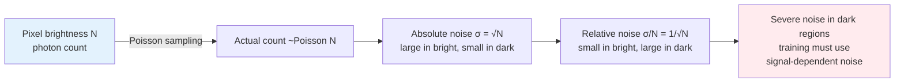

```mermaid
graph LR
    X[Ideal image x<br/>photon distribution / RAW] --> Blur[Blur<br/>defocus / motion / diffraction]
    Blur --> Down[Downsample<br/>bicubic / area / lanczos]
    Down --> Color[Color distortion<br/>white-balance drift / tone shift]
    Color --> Noise[Add noise<br/>Poisson + read + dark current]
    Noise --> Quant[Quantization<br/>8bit / 10bit]
    Quant --> JPEG[JPEG compression<br/>DCT quantization + chroma subsampling]
    JPEG --> Net[Network recompression<br/>WeChat / Weibo / Twitter]
    Net --> Y[Observed image y<br/>the one in the user's phone]
    Y -. inverse problem .-> Inv[Model f_θ<br/>estimate x̂]
    Inv -. estimate .-> X

    style X fill:#e8f5e9
    style Y fill:#ffebee
    style Inv fill:#fff3e0
```

# Chapter 1 · Degradation Model and Inverse Problems

> "Enhancement" is one way to put it. This book uses a more accurate word: **estimation**.

## 1.0 Reader Orientation

This book is written for algorithm engineers who already have some machine-learning background but have **not necessarily worked on low-level vision specifically**. The background it presumes:

- Familiarity with tensor computation, comfortable reading PyTorch code; you know roughly what convolution, upsampling, normalization, and attention do
- Comfortable reading standard loss-function expressions and the gradient-descent training loop
- You have heard of diffusion models even if you have not trained one yourself

What this book does **not** presume: image signal processing (ISP), frequency-domain theory of sampling and aliasing, video coding standards, the physics of sensor noise, or the internals of specific low-level vision models. The first time any term shows up, a sentence or two will explain what it refers to before the book starts using it.

**Notation.** The following symbols are used consistently throughout the book:

- $x$: the ideal high-quality image (ground truth), tensor shape generally written as $(C, H, W)$, where $C$ is the number of color channels and $H, W$ are height and width
- $y$: the observed low-quality image; shape may differ from $x$ (in super-resolution $y$ is smaller than $x$)
- $\hat{x}$: the model's estimate of $x$
- $D$: the degradation operator, the process that turns a high-quality image into a low-quality one
- $n$: noise
- $f_\theta$: a model parameterized by $\theta$
- $p(\cdot)$: a probability distribution

**Abbreviations on first appearance.** To keep terminology from becoming a wall, the first time an acronym appears in this book it is given in parentheses with a one-line definition:

- **ISP** (Image Signal Processor): the in-camera pipeline that turns raw sensor readings into a viewable image
- **ISO**: the sensor's sensitivity rating; higher means more amplification and more visible noise
- **DCT** (Discrete Cosine Transform): the step in JPEG that transforms 8×8 pixel blocks to the frequency domain
- **HR / LR** (High Resolution / Low Resolution)
- **SR** (Super-Resolution): the task family of upsampling a low-resolution image to high resolution
- **IQA** (Image Quality Assessment)

More acronyms specific to later chapters are introduced where they first appear; this section does not try to enumerate them all.

## 1.1 A Concrete Scenario

It's 9 PM. You raise your phone on the street and snap a shot of a neon sign. Back home, the picture has these problems:

- Overall too dark, highlights blown out, shadows pitch black
- Edges of the letters smear together
- Tiny purple-green speckles in the shadows (noise)
- Strange colored ripples on the sign's fine line texture (moiré + JPEG blocks)

In a photo editing app you tap "AI Enhance," and three seconds later the picture looks much better.

This section answers one question: **what is the model actually doing during those three seconds?**

It is not "recovering the original picture"—that original picture, in information-theoretic terms, has been lost forever. It is **estimating, from this bad picture, the high-quality picture most likely to have produced it**. This is the first counterintuitive point of this book:

> An enhancement model is not "restoring," it is "guessing." The difference is how reasonable the guess is.

Once you understand this, all the architecture, loss, evaluation, and data-synthesis design choices in the rest of the book share the same starting point.

## 1.2 The Central Equation

Write the above as math:

$$
y = D(x) + n
$$

- $x$: the ideal high-quality image (the one you **should** have captured at night)
- $D$: the degradation operator (the "destruction machine" formed by light, camera, lens, sensor, and compression together)
- $n$: noise (random perturbation, mostly from the sensor)
- $y$: the actual bad picture you have in hand

What this entire book is about: **given $y$, estimate $x$**.

Write it as $\hat{x} = f_\theta(y)$, where $f_\theta$ is the model we want to train, parameterized by $\theta$.

This deceptively simple equation hides every engineering difficulty in the field:

1. $D$ is usually **unknown** (when you take the photo you don't know how dirty the lens is, how hot the sensor is, what JPEG quality is being applied)
2. $D$ is **many-to-one** (infinitely many $x$ can produce the same $y$ under $D$)
3. $n$ is **random** (the same $x$ with different $n$ gives different $y$)
4. In our datasets we usually **only have $y$**, not $x$ (paired real low-quality / real high-quality data is extremely rare)

Points 1 and 2 make this an **inverse problem**, point 3 makes it a **statistical inverse problem**, and point 4 forces our training paradigm to **synthesize $(x, y)$ pairs ourselves**—this is the degradation synthesis discussed in detail in Chapter 5.

## 1.3 Why This Is Ill-posed

Mathematicians describe a well-posed problem with three properties:

1. **A solution exists**
2. **The solution is unique**
3. **The solution depends continuously on the input** (small input perturbations cause small output perturbations)

Inverse problems often fail all three; they are called **ill-posed**. Image enhancement is a textbook ill-posed problem.

The most direct example: 4× super-resolution.

You have a $512 \times 512$ low-resolution image $y$ and you want to recover a $2048 \times 2048$ high-resolution image $x$. That is, every $4 \times 4 = 16$ pixels in the original were collapsed somehow into 1 pixel in $y$.

Collapsed how exactly? With the simplest bicubic downsampling, each low-resolution pixel is a weighted average of 16 high-resolution pixels (weights determined by the bicubic kernel). This is a mapping from a 16-dimensional space to a 1-dimensional space. **From 16 dimensions down to 1 dimension, 15 dimensions of information are discarded.**

Think the other way: given a single pixel value $y_{ij}$, which $4 \times 4$ high-resolution patches could have produced it? The answer is a 15-dimensional solution space—containing infinitely many plausible high-resolution patches.

Consider a specific low-resolution pixel $y_{ij} = 128$ (medium gray):

- It could be a uniform gray patch (all 128 in the high-resolution block)
- It could be black-and-white stripes (half 0 half 255, average still 128)
- It could be a ramp (gradient from 100 to 156)
- It could have a small bright spot in the middle (15 pixels of 100 plus 1 of 548... wait, the spike can't exceed 255, but it could be 15 pixels of 120 plus 1 of 248)

All of these different high-resolution patches give you the same 128 after downsampling. The model must **pick one** to output—which one?

This is where the prior comes in.

## 1.4 Three Kinds of "Priors"

Prior = **assumption about what natural images should look like**. A good enhancement model is essentially one that has encoded good priors into the network's inductive biases or training data.

Historically there are three sources:

### Analytic priors (hand-designed)

Human engineers observe the "statistical regularities of natural images" and write them as constraints. The most classic ones:

- **Smoothness**: neighboring pixels have similar values (penalize the L2 norm of the gradient)
- **Sparse gradients** (Total Variation): the gradient of natural images is near zero almost everywhere, with rare large values (edges). Penalize the L1 norm of the gradient.
- **Wavelet/DCT sparsity**: natural images are sparse in wavelet/DCT domains

The representatives of this family are the **variational methods** and **sparse coding** that dominated the field from the 1990s to the 2010s. They are **simple, interpretable, and require no training**—but their performance ceiling is very low. Reason: hand-crafted priors are too weak to encode content-dependent knowledge such as "this region is human skin or cat fur."

We don't use these methods as primary tools anymore, but their ideas live on. For example, the TV loss covered in Chapter 3:

```python
def total_variation_loss(x: torch.Tensor) -> torch.Tensor:
    """Total Variation: penalize differences between neighboring pixels, encourage piecewise smoothness.
    x: (B, C, H, W)
    """
    dh = (x[:, :, 1:, :] - x[:, :, :-1, :]).abs().mean()
    dw = (x[:, :, :, 1:] - x[:, :, :, :-1]).abs().mean()
    return dh + dw
```

### Data-driven priors (learned by CNNs/Transformers)

After **SRCNN** (Super-Resolution Convolutional Neural Network, the seminal 2014 work that did super-resolution with a three-layer CNN) in 2014, deep learning replaced variational methods. A convolutional neural network maps end-to-end from $y$ to $\hat{x}$, with the prior implicitly encoded in the weights. The model is trained on large amounts of natural image $(x, y)$ pairs and learns "the low-dimensional manifold of natural images in weight space."

Characteristics of this family: **discriminative (meaning the model, given an input, directly outputs the best answer)**—given a $y$, output a $\hat{x}$. The model does not explicitly model $p(x)$, but after training on a large dataset, the output $\hat{x}$ naturally lands on the natural image manifold.

Representatives:

- **SRCNN** (2014, three-layer convolution)
- **EDSR** (Enhanced Deep Super-Resolution, 2017, a deep residual network with BatchNorm removed)
- **RCAN** (Residual Channel Attention Network, 2018, brought channel attention into SR)
- **SwinIR** (Swin Transformer for Image Restoration, 2021, brought window-attention Transformers into low-level vision)
- **Restormer** (2022, channel-wise self-attention so that resolution stops being the bottleneck)
- **NAFNet** (Non-linear Activation Free Network, 2022, a minimalist design that replaces non-linear activations with gated multiplications)

Chapters 6–7 cover each of these in turn.

### Generative priors (diffusion models)

After **DDPM** (Denoising Diffusion Probabilistic Model) in 2020, generative models themselves explicitly model $p(x)$. Given $y$, you can do conditional generation $p(x | y)$ and sample $\hat{x}$ from this conditional distribution.

This is the **generative** route. The fundamental difference from the discriminative route:

- Discriminative answers "what is the most likely $\hat{x}$"—producing **one** definite answer
- Generative answers "what is the distribution of $x | y$"—able to sample **multiple** plausible answers

Strength of generative: in scenarios where ill-posedness is severe (e.g., 8× super-resolution, heavily blurred faces), discriminative models can only output an "average face," while generative models can produce a specific face with reasonable high-frequency detail.

Weakness: it **fabricates**. This brings up an engineering philosophy this book repeatedly emphasizes (discussed in detail in Chapters 10 and 17):

> Enhancement models are generating details, not recovering details.
>
> Using a diffusion model to restore an old photo is stunning; using a diffusion model to restore a forensic evidence photo is a disaster.

## 1.5 Anatomy of the Degradation Operator D

Back to the central equation $y = D(x) + n$. In the real world $D$ is not a single simple operator but a chain of compositions:

$$
D = \text{JPEG} \circ \text{Quantization} \circ \text{Downsample} \circ \text{Blur} \circ \text{ColorShift} \circ \text{LensDistortion} \circ \dots
$$

And this compound operator is itself **random**—the same phone photographing the same scene at different moments yields different $y$.

The main components of $D$ that engineering cares about:

### Blur

Blur is mathematically convolution with a "blur kernel" $k$: $y = x * k$.

Different physical sources correspond to different blur kernels:

- **Defocus blur**: kernel is approximately disk-shaped, radius depending on the degree of defocus
- **Motion blur**: kernel is a line segment, length and direction depending on camera or object motion
- **Atmospheric blur**: kernel is approximately Gaussian, variance depending on atmospheric turbulence
- **Lens diffraction / aberration**: kernel approximates an Airy disk or a more complex shape

A real photo is usually a composition of several blurs, plus spatial variation (the blur kernel at the center of the image and at the corners can differ). This complexity is the reason **blind deblurring** exists as an independent sub-direction—the kernel is unknown.

### Downsampling

Reducing a high-resolution image to low resolution. Common algorithms:

- **Nearest**: directly take the closest pixel. Fastest and worst, produces aliasing
- **Bilinear**: bilinear interpolation, weighted average over a 2×2 neighborhood
- **Bicubic**: bicubic interpolation, weighted average over a 4×4 neighborhood, the **de facto standard for training-time downsampling** in this field
- **Lanczos**: truncated sinc-based filter, frequency response closest to the ideal low-pass
- **Box / Average**: each low-resolution pixel is the simple average of the corresponding high-resolution block

These algorithms differ greatly in frequency-domain behavior. Bicubic is **theoretically decent but engineering-problematic**—it assumes the input is aliasing-free, but real photographs almost always carry aliasing. This is exactly the "train-test mismatch" discussed in Section 1.6.

```python
import torch
import torch.nn.functional as F

def downsample_compare(x: torch.Tensor, scale: int = 4):
    """Downsample the same image with different methods and compare.
    x: (1, C, H, W), values in [0, 1]
    """
    h, w = x.shape[-2:]
    new_h, new_w = h // scale, w // scale

    nearest  = F.interpolate(x, size=(new_h, new_w), mode='nearest')
    bilinear = F.interpolate(x, size=(new_h, new_w), mode='bilinear', align_corners=False)
    bicubic  = F.interpolate(x, size=(new_h, new_w), mode='bicubic',  align_corners=False)
    area     = F.interpolate(x, size=(new_h, new_w), mode='area')  # equivalent to box filter

    return {
        'nearest':  nearest,
        'bilinear': bilinear,
        'bicubic':  bicubic,
        'area':     area,
    }
```

If you actually run this, you'll find: bicubic looks "sharpest," area (box) looks "softest," and nearest is full of aliasing. **None of them is "right"**—they each simulate different physical processes.

### Noise

Noise is the part of this section most easily oversimplified and most worth covering carefully. Section 1.7 will dive into it separately.

### Compression Artifacts

JPEG is the most common compression in the image domain. Its workflow:

1. RGB → YCbCr, downsample the chroma channels (chroma subsampling)
2. Split into 8×8 blocks
3. Apply DCT on each block
4. Quantize (lower quality means coarser quantization)
5. Entropy code

Step 4's quantization is lossy, so the reconstructed image has:

- **Blocking artifacts**: 8×8 block boundaries become visible
- **Ringing**: oscillations near high-contrast edges
- **Color distortion**: colored fringes from chroma subsampling

Video compression (H.264/H.265/AV1) is similar but more complex—plus motion compensation introducing trails.

### Color Distortion

White-balance drift, color attenuation, color-temperature shifts caused by low light. Mathematically this kind of degradation is not a spatial-dimension problem but a non-linear transformation in value space.

### Data-flow diagram of the compound degradation chain

Stringing all the components above together—from the ideal image down to the bad picture in the user's hand—the full chain can be drawn as the diagram below. This diagram is also the mental target every chapter of this book keeps in view: what your model is doing, fundamentally, is trying to walk this chain backward.



A few engineering conclusions are worth being explicit about:

1. **The chain is ordered, but in the real world every step's order can swap**—JPEG, for instance, may happen before, after, or in the middle of the color distortion. Real life is a tangle, not the neat sequence of arrows in this picture.
2. **Every step is random**—the same scene passed through two units of the same camera model produces different output each time, because the noise samples differ and the compression quantization clips differently.
3. **Steps further to the right dominate the perceived "badness"**—compression and noise directly hit PSNR; blur and downsampling hit perceived sharpness.
4. **The model $f_\theta$ is not simply "running each step backward"**—it learns the inverse of the whole chain at once, not stepwise. This is the fundamental reason end-to-end methods beat staged methods in this field.

## 1.6 Blind vs non-blind: is D known or unknown?

Back to the central equation $y = D(x) + n$. A question commonly conflated in tutorials: **at inference time, is $D$ actually known or unknown?** The two settings have radically different engineering implications. The rest of this book defaults to the blind setting, but the paradigm needs naming first.

### Non-blind: D known

Classical image processing assumes $D$ is known in many contexts:

- **Motion deblur**: the camera logged IMU during exposure → blur kernel $k$ is analytically recoverable
- **Medical CT reconstruction**: scanner geometry + projection geometry → system matrix $A$ known
- **Demoiré on screen captures**: known screen resolution → sampling-aliasing model known
- **Sensor denoising**: sensor model + ISO + exposure → noise PDF parameters (Gaussian + Poisson + dark current) known

Non-blind settings can take the classical inverse-problem route: Wiener filter, Richardson-Lucy, iterative regularization (TV / sparse / plug-and-play). Deep learning can also be non-blind — feed the parameters of $D$ (blur kernel, noise level) as side input to the network (DnCNN-Blind, KernelGAN, etc.).

### Blind: D unknown

In real-world enhancement, $D$ is almost never known:

- A user drops a photo from their phone gallery — who knows what it's been through
- An image downloaded from the web has been compressed several times
- Old-photo degradation is a physico-chemical process with no closed-form model
- A screenshot stacks rendering, rescaling, and JPEG

In the blind setting you **can't pin down $D$ exactly** — you only have two options:

1. **Train the model on as broad a $D$ distribution as possible** (Real-ESRGAN's second-order degradation pipeline does exactly this; see Chapter 5)
2. **Have the model implicitly estimate $D$ at runtime** (KernelGAN's kernel estimation, SRMD's degradation parameters as conditions, the diffusion school's LLaVA-generated prompts)

### Why this distinction matters

Where every SOTA model in this book sits on the blind / non-blind axis:

| Model | Paradigm | $D$ handling |
|-------|----------|--------------|
| Real-ESRGAN | **Blind SR** | Trained on hundreds of synthetic $D$ |
| CodeFormer | **Blind face restoration** | Codebook prior bypasses $D$ estimation |
| BSRGAN | **Blind SR** | Contemporaneous with Real-ESRGAN, degradation-synthesis route |
| MANIQA / CLIP-IQA / Q-Align | **Blind IQA** (NR-IQA) | No reference, scores directly |
| SUPIR | **Blind** (with LLaVA prompt) | Text condition implicitly supplies semantic $D$ |
| Restormer | **Either** | Training data decides; architecture independent of $D$ |
| OSEDiff / TSD-SR | **Blind SR** | Same as SUPIR |

Engineering takeaway: **products that face "user-uploaded images" can almost only be blind**. Any algorithm that requires $D$ known (no matter how strong on benchmarks) needs a "$D$ estimation" front-end in production — and estimation is itself an ill-posed problem; mis-estimation crashes the system.

The book's promise of "look at a bad image and immediately judge what to do" is the colloquial form of the blind paradigm — what readers train is **how to pick priors when $D$ is unknown**. This thread runs through the entire book.

### Blind IQA: the evaluation-side counterpart

Chapter 4 covers this in depth, but briefly. **Evaluation metrics also split into full-reference (FR) and no-reference (NR)**:

- **FR-IQA** (Full-Reference Image Quality Assessment): score the model output against the ground truth. Representative metrics: **PSNR** (Peak Signal-to-Noise Ratio), **SSIM** (Structural Similarity), **LPIPS** (Learned Perceptual Image Patch Similarity, using deep-network features as a perceptual distance), **DISTS** (Deep Image Structure and Texture Similarity, scoring structure and texture separately). An HR ground truth is required.
- **NR-IQA** (also called blind IQA): score the output image on its own. Representative metrics: **NIQE** (Natural Image Quality Evaluator, a no-reference metric based on natural-image statistics), **MANIQA** (Multi-dimension Attention Network for IQA), **CLIP-IQA** (uses the CLIP text-image alignment space to score quality), **Q-Align** (uses a large model to score on a 1–5 scale aligned with human judgement).

In production **ground truth doesn't exist** (the bad images users upload have no "matching HD version"), so **online quality monitoring can only rely on NR-IQA**. This is the necessary corollary of the blind paradigm propagating from training to evaluation.

## 1.7 Real-World Degradation and Train-Test Mismatch

Putting all the components from 1.5 together, a picture you take at night roughly goes through:

$$
y = \text{NetworkRecompression}(\text{JPEG}(\text{Quantize}(\text{ISP}(\text{Sensor}(x_{\text{photon}})))))
$$

Where:

- $x_{\text{photon}}$ is the photon distribution arriving at the sensor (this is the true "raw signal")
- $\text{Sensor}$ converts photons to electrical signal, adding photon noise, read noise, dark current
- $\text{ISP}$ is the camera's image signal processor that does demosaicing, denoising, white balance, tone mapping, color matrix
- $\text{Quantize}$ is 8-bit quantization (10–12 bits on high-end cameras)
- $\text{JPEG}$ is the lossy compression when the camera saves the image
- $\text{NetworkRecompression}$ is **another round** of lossy compression when the image is transmitted via WeChat / Weibo / Twitter / etc.

This long chain is **the real-world D**.

Yet for the past decade, the vast majority of academic papers—including SRCNN, EDSR, RCAN, ESRGAN, SwinIR—synthesize training data like this:

```python
# The "classic" training-pair synthesis in academic papers
y = bicubic_downsample(x, scale=4)   # done
```

This is the field's biggest methodological problem from 2014 to 2020, called **train-test mismatch**:

- **Training**: $y$ is a clean high-resolution image directly bicubic-downsampled
- **Inference**: $y$ is taken by a real phone, processed by sensor noise + ISP + JPEG + network recompression

The "low-quality images" the model saw during training have nothing to do with real-world low-quality images. The result:

- ESRGAN scores PSNR 30+ on Set5/Set14 (academic benchmarks), looks stunning
- ESRGAN on real photos in your phone barely works—and may even amplify noise into candy-wrapper textures

This mismatch persisted for five or six years until **Real-ESRGAN** in 2021 systematically resolved it. Its core contribution **was not the network architecture** (it still uses RRDB), but the **degradation synthesis pipeline**:

```python
# Real-ESRGAN style degradation (simplified, full code in Chapter 5)
y = x.clone()
y = apply_blur(y, kernel=random_blur_kernel())      # blur
y = downsample(y, scale=random_scale(), mode=random_mode())  # multiple downsampling modes
y = add_noise(y, type=random_noise_type())          # Gaussian + Poisson + real sensor noise
y = jpeg_compress(y, quality=random.randint(40, 95))  # JPEG
# Key: run the whole pipeline twice (second-order degradation)
y = apply_blur(y, ...); y = downsample(y, ...); y = add_noise(y, ...); y = jpeg_compress(y, ...)
```

Every step of this pipeline "plays" some component of the real-world D. **The performance of models trained this way on real images is qualitatively different**—this was the watershed event of 2021 in the field.

Remember this:

> In image enhancement, "model architecture" and "data synthesis"—the latter has long been more important.
>
> The same network: trained on bicubic data is unusable; trained on Real-ESRGAN pipeline data works well.

Chapter 5 will lay out the engineering details of degradation synthesis in full.

## 1.8 Noise Deep-Dive: Why It Isn't Gaussian

90% of papers add Gaussian noise at training time:

```python
y = x + torch.randn_like(x) * sigma
```

This is **wrong**—or more precisely, it is a **simplification that is wrong for real scenes**.

Real sensor noise has two main sources:

### Photon noise (shot noise)

Photons arriving at the sensor follow a **Poisson process**. If a pixel position receives on average $N$ photons during the exposure time, the actual count follows $\text{Poisson}(N)$, with variance also $N$.

Key property: **variance equals mean**. Bright regions get many photons, large absolute noise; dark regions get few photons, small absolute noise. But the **signal-to-noise ratio** SNR $= N / \sqrt{N} = \sqrt{N}$, so bright regions have higher SNR.

This is why nighttime photos have severe noise in dark areas—few photons, large relative noise.

Drawn as a diagram: the horizontal axis is pixel brightness (photon count), the vertical axis is the noise standard deviation at that pixel. Poisson noise gives a curve $\sigma = \sqrt{N}$ that grows as the square root; a Gaussian approximation that doesn't distinguish bright from dark gives a flat horizontal line.



### Read noise

The sensor converts charge to voltage and then ADC quantizes it; each step injects electronic noise. This part is **approximately Gaussian**, signal-independent, a constant $\sigma_r$.

### Realistic model: signal-dependent Gaussian

Combine the two and approximate as a signal-dependent Gaussian:

$$
y = x + \mathcal{N}(0, a \cdot x + b)
$$

where $a$ controls the photon noise strength (signal-dependent) and $b$ controls the read noise (signal-independent). $a, b$ are physical parameters of the camera, varying with ISO.

```python
import torch

def heteroscedastic_noise(
    x: torch.Tensor,
    a: float = 0.01,
    b: float = 0.001,
) -> torch.Tensor:
    """Signal-dependent Gaussian noise (approximate real sensor).
    x: (B, C, H, W), values in [0, 1]
    a: photon noise coefficient (signal-dependent)
    b: read noise variance (signal-independent)
    Returns: noisy y, still in [0, 1]
    """
    variance = a * x + b
    sigma = variance.clamp(min=1e-8).sqrt()
    noise = torch.randn_like(x) * sigma
    return (x + noise).clamp(0.0, 1.0)
```

A more accurate model is **direct sampling from a Poisson distribution**:

```python
def poisson_gaussian_noise(
    x: torch.Tensor,
    photon_scale: float = 1000.0,  # smaller = darker, relatively larger noise
    read_sigma: float = 0.005,
) -> torch.Tensor:
    """Poisson + Gaussian, physical model of a real sensor.
    photon_scale simulates exposure; smaller values represent low-light scenes.
    """
    # Scale signal to photon counts, sample Poisson, then scale back
    photons = x * photon_scale
    noisy_photons = torch.poisson(photons.clamp(min=0))
    shot = noisy_photons / photon_scale
    # Add read noise
    read = torch.randn_like(x) * read_sigma
    return (shot + read).clamp(0.0, 1.0)
```

Why does this matter? Because:

- Denoisers trained with pure Gaussian noise are weaker on real phone low-light scenes
- They learn the statistics of "uniform noise," but real noise is **larger in bright regions and smaller in dark regions**
- Real images need more aggressive denoising in dark areas and more conservative denoising in bright areas—pure-Gaussian-trained models can't do this

This detail motivated the appearance of "real noise datasets" like SIDD and DND. They directly capture noisy-clean pairs with real cameras under controlled environments, bypassing synthesis.

But real data is expensive and scarce, so the engineering compromise is to use **accurate synthetic noise models**, then fine-tune with a small amount of real data.

## 1.9 A Simplified Degradation Class (no JPEG)

To wrap up, let's stitch the concepts of this chapter into a Real-ESRGAN-style degradation class skeleton. **This is a warm-up version**—for readability, **the JPEG step is omitted** (real JPEG requires the `diffjpeg` library, covered in Chapter 5), keeping only blur / downsample / noise. The full version is in Chapter 5.

```python
import random
import torch
import torch.nn.functional as F


class SimpleDegradation:
    """Real-ESRGAN style simplified degradation synthesis.
    Input: high-resolution clean image x. Output: low-resolution bad image y.

    Full D = JPEG ∘ Noise ∘ Downsample ∘ Blur
    Each component is randomized to simulate the uncertainty of real-world D.
    """

    def __init__(self, scale: int = 4):
        self.scale = scale

    # --- 1. Blur ---
    def random_blur(self, x: torch.Tensor) -> torch.Tensor:
        """Randomly choose a Gaussian blur kernel."""
        ksize = random.choice([7, 9, 11, 13, 15])
        sigma = random.uniform(0.2, 3.0)
        kernel = self._gaussian_kernel(ksize, sigma).to(x)
        kernel = kernel.expand(x.shape[1], 1, ksize, ksize)
        pad = ksize // 2
        return F.conv2d(F.pad(x, [pad]*4, mode='reflect'),
                        kernel, groups=x.shape[1])

    @staticmethod
    def _gaussian_kernel(ksize: int, sigma: float) -> torch.Tensor:
        ax = torch.arange(ksize) - ksize // 2
        gauss = torch.exp(-(ax ** 2) / (2 * sigma ** 2))
        kernel = gauss[:, None] * gauss[None, :]
        kernel = kernel / kernel.sum()
        return kernel.unsqueeze(0).unsqueeze(0)

    # --- 2. Downsample ---
    def random_downsample(self, x: torch.Tensor) -> torch.Tensor:
        h, w = x.shape[-2:]
        new_h, new_w = h // self.scale, w // self.scale
        mode = random.choice(['bilinear', 'bicubic', 'area'])
        kw = {'mode': mode}
        if mode in ('bilinear', 'bicubic'):
            kw['align_corners'] = False
        return F.interpolate(x, size=(new_h, new_w), **kw)

    # --- 3. Noise ---
    def random_noise(self, x: torch.Tensor) -> torch.Tensor:
        """Three noise types each with 1/3 probability, simulating different sensors/scenes."""
        p = random.random()
        if p < 0.33:
            sigma = random.uniform(0.005, 0.05)
            return (x + torch.randn_like(x) * sigma).clamp(0, 1)
        elif p < 0.66:
            a = random.uniform(0.005, 0.03)
            b = random.uniform(0.001, 0.005)
            sigma = (a * x + b).clamp(min=1e-8).sqrt()
            return (x + torch.randn_like(x) * sigma).clamp(0, 1)
        else:
            scale = random.uniform(50.0, 1000.0)
            photons = (x * scale).clamp(min=0)
            return (torch.poisson(photons) / scale).clamp(0, 1)

    # --- JPEG implemented in Chapter 5 with diffjpeg, omitted here ---

    def __call__(self, x: torch.Tensor) -> torch.Tensor:
        """Simplified degradation, order: blur -> downsample -> noise (no JPEG)."""
        y = self.random_blur(x)
        y = self.random_downsample(y)
        y = self.random_noise(y)
        return y
```

In actual engineering you also need:

- **Second-order degradation**: run the whole pipeline twice. One of Real-ESRGAN's key tricks; simulates "image compressed-transmitted-recompressed."
- **Randomized degradation order**: which of blur and noise comes first is random.
- **Differentiable JPEG**: use a library like `diffjpeg`, allowing gradients to backpropagate through the degradation stage (rarely needed in enhancement training, though).
- **More complex blur kernels**: generalized Gaussian, motion kernels, mixed kernels.

Chapter 5 will fill all of these in.

## 1.10 Chapter Summary

Compress this chapter into a few points:

1. **Image enhancement is fundamentally an inverse problem**: estimate $x$ from $y$, given $y = D(x) + n$.
2. **It is ill-posed**: $D$ is many-to-one + $n$ is random, the solution space is infinite.
3. **The model picks via priors**: analytic priors are weak, data-driven priors are strong, generative priors are strongest but fabricate.
4. **Real-world degradation is a long composition**: blur + downsample + noise + compression + network recompression.
5. **Train-test mismatch is the field's core methodological problem**: bicubic-trained models break on real images.
6. **Real-ESRGAN's core contribution is the data**: complex degradation pipeline + second-order degradation.
7. **Real noise is not Gaussian**: it's a Poisson + Gaussian mixture, with variance signal-dependent.

The remaining 17 chapters all answer the same question: **how, under ill-posed constraints, do we estimate the most reasonable $\hat{x}$?**

- Chapter 2: in which space to do this (pixel / feature / latent)
- Chapter 3: which loss function measures "reasonable"
- Chapter 4: which metrics evaluate "reasonable"
- Chapter 5: how to synthesize training data
- Chapters 6–10: which model architectures encode the priors
- Chapters 11–12: how to train stably and evaluate accurately
- Chapters 13–14: extra constraints in video (temporal consistency)
- Chapters 15–17: how to deploy to the real world
- Chapter 18: who to use right now

Whenever you read a specific technical decision in a later chapter, come back to this chapter and ask yourself: **is this design improving the modeling of $D$, the prior on $x$, or the search for $\hat{x}$?** Everything in this book lives in that triangle.

---

> Next chapter [Pixel, Feature, Latent Space](02-representation.md) → we'll see why almost all modern enhancement methods do not work directly in pixel space.
