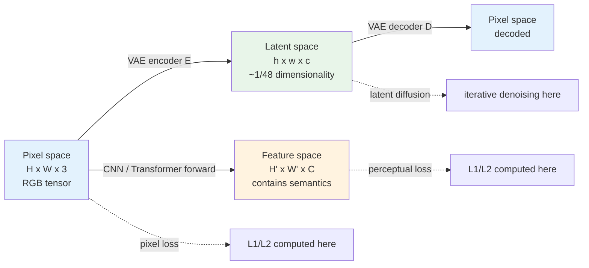
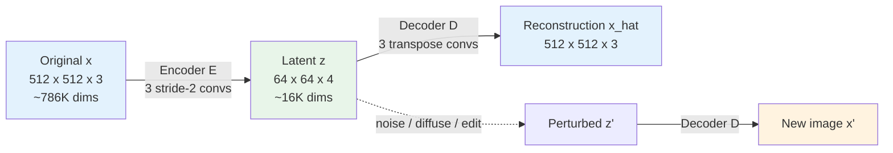

# Chapter 2 · Pixel, Feature, Latent Space

> This chapter answers a seemingly philosophical question: where should an enhancement model work? Once you answer it, you'll understand a counterintuitive fact: **almost all modern enhancement models do not work directly in pixel space**.

## 2.0 Before Reading This Chapter

Chapter 1 positioned image enhancement as an ill-posed statistical inverse problem and emphasized "the model picks via priors." This chapter takes one step further and asks: **where** does that picking happen?

Concretely, once an image is represented as a tensor inside a network, it can live in three quite different places. It can stay as the $(C, H, W)$ RGB tensor; it can be abstracted by some convolutional tower into an intermediate feature $(C', H', W')$; or it can be compressed by a dedicated encoder into a much smaller compact representation $(c, h, w)$. The model can choose to predict in any of these spaces, and can also choose to measure the quality of its prediction in another space. These two "where" decisions together define the engineering skeleton of any enhancement method.

After this chapter you should be able to answer:

- Why a direct L2 regression on RGB pixels looks reasonable yet works poorly
- What "perceptual loss" actually feeds into and measures
- Why the Stable Diffusion family of models trains a VAE before anything else
- Why the same image's "distance" from a reference is ranked differently in pixel space, perceptual space, and latent space
- Which two axes to use when locating any new paper you read in later chapters

The presumed background is still the one Chapter 1 listed: comfortable with PyTorch code, familiar with what convolution, upsampling, and attention roughly do. If you have never touched a VAE (Variational AutoEncoder), don't bother brushing up first; Section 2.4 builds one from scratch in a minimally readable form.

**Abbreviations introduced in this chapter.** Acronyms already covered in Chapter 1 — PSNR, SSIM, LPIPS, DISTS, ISP, HR, LR, SR, IQA, SRCNN, EDSR, RCAN, SwinIR, Restormer, NAFNet, DDPM — are not redefined here. New or more fully unpacked terms in this chapter:

- **CNN** (Convolutional Neural Network): the family of networks built around 2D convolution as the core operator; the dominant low-level vision backbone from 2014 to 2020
- **Transformer**: the family of networks built around attention as the core operator; gradually the new dominant choice in low-level vision after 2020
- **VGG**: a deep convolutional network published in 2014 by the Visual Geometry Group, originally designed for ImageNet classification; widely repurposed as a feature extractor for perceptual loss because its features happen to be friendly to perceptual quality
- **VAE** (Variational AutoEncoder): a generative model with an encoder and a decoder; the encoder compresses an image into a low-dimensional latent that approximately follows a simple prior distribution
- **VQ-VAE** (Vector-Quantized VAE): a VAE variant that further discretizes the latent into entries of a codebook, turning the latent space into discrete codebook indices
- **LDM** (Latent Diffusion Models): the diffusion paradigm that moves the diffusion process from pixel space to a VAE latent space; the foundation of the Stable Diffusion family
- **CLIP** (Contrastive Language-Image Pre-training): OpenAI's 2021 image-text alignment model that maps images and corresponding captions into a shared embedding space
- **DINO**: Facebook's 2021 self-supervised visual representation model, with features biased toward geometry and structure
- **GAN** (Generative Adversarial Network): the family of generative models trained as a game between a generator and a discriminator
- **FFT** (Fast Fourier Transform): the standard algorithm for mapping a signal from time/space domain to frequency domain
- **UNet**: an encoder-decoder structure with symmetric skip connections; a common backbone for diffusion models
- **SUPIR / StableSR / SeeSR / DiffBIR**: four latent-space diffusion enhancement models this chapter mentions briefly; Chapters 8–9 cover them in detail

## 2.1 Three Spaces

Open any enhancement paper and you'll find it does its computation in some "space." There are three common ones:

| Space | Shape | Source | Intuitive meaning |
|------|------|------|---------|
| Pixel space | $H \times W \times 3$ | Direct RGB | What your eyes see |
| Feature space | $H' \times W' \times C$ | CNN/Transformer intermediate layers | The network's abstraction of the image |
| Latent space | $h \times w \times c$ (typically $h = H/8$) | VAE encoding | A compressed compact representation |

In engineering, almost every important enhancement method involves transformations, loss computations, or predictions among these three spaces.

> A SwinIR model predicts in **pixel space**;
> its training loss includes **feature space** perceptual loss (VGG features);
> its diffusion versions (StableSR, SUPIR) predict in **latent space**.

Understanding what each of these three spaces is good and bad at is the prerequisite for understanding all the architectural choices in this book. Every chapter introducing a specific model later will come back to "in which space does it predict, and in which space does it compute the loss." This chapter lays the foundation for those two questions.

Looking at the three spaces together, an engineering pattern shows up over and over: **prediction happens in one space, loss may be computed in another, and final evaluation may be in yet a third.** This three-way mismatch is the norm in modern image enhancement. SwinIR predicts in pixel space, computes loss with pixel L1 + VGG feature L1 (feature space), and is evaluated with PSNR (pixel space) + LPIPS (feature space). StableSR predicts in latent space, computes loss as latent MSE + decoded pixel L1, and is evaluated with PSNR (pixel space) + LPIPS (feature space) + FID (feature-space distribution distance). The first step in reading any enhancement method is to write down its choice of space at these three points.

The diagram below shows how the three spaces relate. Note the arrow directions: the VAE encoder compresses a pixel image into a latent representation, and the decoder restores it back to a pixel image, so the two together form a VAE. A convolutional or attention backbone, by contrast, abstracts a pixel image layer by layer into a sequence of feature maps, each of which is a candidate "evaluation space."



The next three sections expand on the three boxes of this picture: Section 2.2 explains why you shouldn't only work in pixel space, Section 2.3 covers what feature space is good for, and Section 2.4 explains why latent space is at the center of modern generative enhancement.

## 2.2 Three Problems with Pixel Space

Predicting $\hat{x} = f_\theta(y)$ directly in pixel space looks the most natural—input and output have the same shape, the loss is plainly L1/L2, and pixels are what humans see.

But it has three problems.

### Problem 1: high redundancy

A $1024 \times 1024$ RGB image has $3{,}145{,}728$ pixel values. But **the intrinsic dimensionality of natural images is far smaller**.

Quick verification: randomly generate $3 \times 10^6$ integers in [0, 255] arranged as an image, almost certainly it is not any "natural image"—it is snow. **Natural images form a very sparse, low-dimensional manifold in pixel space.**

A more specific estimate: research on the "effective dimensionality" of natural images puts the number somewhere between a few hundred and a few thousand. That is, a megapixel-class image's true information content is roughly that of a vector of a few thousand dimensions; the remaining hundreds of thousands of dimensions are highly correlated redundancy. This number is consistent with what a VAE does when it compresses a 1024×1024 image down to 128×128×4 = 65536 dimensions, and corroborates that VAE encoding is genuinely doing the job of "wiping out redundancy."

This has two engineering consequences:

1. **Most pixel-value combinations are meaningless**—the model in 3M-dimensional space must learn to avoid 99.999% of "non-natural-image" regions
2. **Redundancy means wasted computation**—every step the model processes lots of correlated neighboring pixels

From an information-theoretic angle, this observation also explains why algorithms like JPEG manage 10–50× compression with little visual loss: the actual degrees of freedom of a natural image in pixel space are already far fewer than the pixel count. Compression algorithms and latent-space encoders are doing the same thing—wiping out redundancy, keeping the real information. The difference is that compression algorithms use hand-designed transforms (DCT, wavelets), while latent-space encoders use a learned non-linear transform (the VAE).

### Problem 2: misaligned with perception

L2 loss is most natural in pixel space, but **it is not aligned with human perception**. A counterexample cited thousands of times:

- Image A: the original $x$ slightly globally blurred (Gaussian blur $\sigma = 1$)
- Image B: the original $x$ with a bit of texture noise added locally (a few pixel values changed)

Visually: B looks closer to the original (you can barely see a difference); A is clearly blurred.
L2 loss: A's L2 is usually **smaller**, because blur changes every pixel slightly, while texture noise changes a few pixels by a lot.

A more careful derivation: Gaussian blur changes each pixel by a small amount $\delta$, so over $N$ pixels the total error is $N \cdot \delta^2$; texture noise only changes $k$ pixels, each by amount $\Delta$, total error $k \cdot \Delta^2$. Even if the human eye misses the former entirely and spots the latter instantly, L2 still compares $N \delta^2$ to $k \Delta^2$ as a plain arithmetic ratio that has nothing to do with "what the eye notices."

This is why **under L2 loss, models gravitate toward blurred outputs** - blur is the "safe choice" for approximating the ground truth in the L2 sense. Chapter 3 covers this from the loss-function angle, but the fundamental problem lies in pixel space itself.

Put differently, the L2 loss in pixel space hides a very strong assumption: "the pixel-value difference at each position between two images can be added together for comparison." That assumption is wrong for the human visual system - the eye does not judge similarity by summing per-pixel color differences; it has wildly different sensitivity curves for structure, texture, and color contrast. Any loss that treats the eye as a "per-pixel summer" will disagree with the eye in some scenes. This is the fundamental motivation for moving losses into feature space or latent space later.

### Problem 3: computational cost

The 2020 DDPM paper trained a $256 \times 256$ diffusion model in pixel space, requiring 1000 denoising steps over the $256 \times 256 \times 3 = 196{,}608$-dimensional input. Doing diffusion at $1024 \times 1024$ is **directly 16× the compute**—which is why early diffusion models were stuck at $256 \times 256$.

This was not fundamentally solved until 2022, when LDM (Latent Diffusion Models) moved diffusion from pixel space to latent space.

Compute cost is especially sensitive for enhancement, because enhancement usually faces **images the user has already shot, at large sizes**. Text-to-image can accept 1024×1024 output; enhancement often needs to support 4K or larger input. Doing diffusion at pixel-space 4K is 4096×4096×3 ≈ 50 million dimensions; even a single denoising step is too expensive, never mind 20–50 sampling steps. Latent-space diffusion makes this practical: a 4K image encoded becomes 512×512×4 ≈ 1 million dimensions, the diffusion process runs, and a decoder takes you back to 4K pixels. This is why "large-image enhancement" as an engineering need almost forces you onto a latent-space route.

## 2.3 Feature Space and Perceptual Loss

If L2 in pixel space is not aligned with human perception, can we find a space that **is** aligned?

A few perceptual loss papers in 2016 gave a simple and effective answer: **borrow intermediate layers from a pretrained CNN**. By "borrow" we mean: instead of training a new network, take a network that has already been trained to convergence on a large-scale image classification task such as ImageNet and use it off-the-shelf as a "feature extractor." Compare two images for similarity not in pixels but by sending them through this network and computing L2 on a few of its layer activations.

Concretely:

1. Take a VGG-19 pretrained on ImageNet
2. Feed both images you want to compare into it, record the activations at certain intermediate layers
3. Compute L1 / L2 loss on the activations

This loss is called **perceptual loss**. Code:

```python
import torch
import torch.nn as nn
import torchvision.models as models


class VGGPerceptualLoss(nn.Module):
    """VGG perceptual loss - L1 over a few intermediate layers of VGG-19.
    Input: pred, target both [0, 1] RGB, shape (B, 3, H, W)
    """

    def __init__(self, layers=('relu2_2', 'relu3_3', 'relu4_3'),
                 weights=(1.0, 1.0, 1.0)):
        super().__init__()
        vgg = models.vgg19(weights=models.VGG19_Weights.IMAGENET1K_V1).features

        # VGG-19 layer indices for relu2_2, relu3_3, relu4_3
        layer_idx = {'relu2_2': 9, 'relu3_3': 18, 'relu4_3': 27}
        self.slices = nn.ModuleList()
        last = 0
        for name in layers:
            idx = layer_idx[name]
            self.slices.append(vgg[last:idx + 1])
            last = idx + 1

        for p in self.parameters():
            p.requires_grad_(False)
        self.eval()

        # ImageNet normalization
        self.register_buffer('mean', torch.tensor([0.485, 0.456, 0.406]).view(1, 3, 1, 1))
        self.register_buffer('std',  torch.tensor([0.229, 0.224, 0.225]).view(1, 3, 1, 1))
        self.weights = weights

    def forward(self, pred: torch.Tensor, target: torch.Tensor) -> torch.Tensor:
        pred   = (pred   - self.mean) / self.std
        target = (target - self.mean) / self.std
        loss = 0.0
        for slice_, w in zip(self.slices, self.weights):
            pred   = slice_(pred)
            target = slice_(target)
            loss = loss + w * nn.functional.l1_loss(pred, target)
        return loss
```

Why does this work? Two visually similar images have similar VGG intermediate activations - because the features VGG learned from a classification task are sensitive to **visual semantics** rather than to **pixel values**. A slightly blurred image and the original have very close VGG features, low loss; an image with intact details but with noise has very different VGG features, large loss.

This happens to align with **human perception**.

The different layers of VGG handle different "visual granularities." This deserves a few sentences because every later chapter that discusses perceptual loss assumes the reader has intuition about this hierarchy:

- **Shallow layers (relu1_1, relu1_2)**: small receptive field, capture low-level signals like edges, corners, and color blobs; feature maps have high resolution
- **Middle layers (relu2_2, relu3_3)**: moderate receptive field, features correspond to textures, local patterns, and small-scale object parts; this is the most common place to take perceptual loss
- **Deep layers (relu4_3, relu5_3)**: large receptive field, features are at the abstraction level of "object class," sensitive to global semantics but insensitive to position

Picking which layers to use for perceptual loss is essentially picking the scale at which you want the model to "match the ground truth." Pick too shallow and the loss is close to pixel L1, throwing away VGG's semantic advantage; pick too deep and the model can output something that looks completely unlike the truth but is semantically correct (e.g., a cat in a different pose), with loss still small. **The weighted combination of relu2_2 + relu3_3 + relu4_3** is empirically a robust default and is what the ESRGAN family has used for years.

But note that perceptual loss has its own problems:

- VGG is a 2014 architecture; there are newer alternatives whose feature spaces are "better" (CLIP, DINO, LPIPS)
- VGG was trained on ImageNet, so it is sensitive to **natural objects** and not necessarily optimal for **textures/materials** or **geometric structures**
- VGG has high computational cost, especially for large images

In actual engineering, **LPIPS** is the more modern choice; it is itself trained on a large amount of human perceptual judgment data, and is more accurate than the hand-weighted VGG loss. Chapter 4 will compare them in detail.

## 2.4 Latent Space and LDM

Feature space solved "where to compute loss," but did not solve "where to predict"—CNNs still input and output in pixel space.

Latent space is the key technique that completely overhauls this.

### The Role of VAE

Latent space did not come from nowhere. It comes from **VAE** (Variational AutoEncoder): a generative model proposed in 2013. A VAE has two parts:

- **Encoder** $E: \mathbb{R}^{H \times W \times 3} \to \mathbb{R}^{h \times w \times c}$
- **Decoder** $D: \mathbb{R}^{h \times w \times c} \to \mathbb{R}^{H \times W \times 3}$

The training objective is to make $D(E(x)) \approx x$, with $E(x)$ following a simple prior distribution (typically close to Gaussian).

A word on what "variational" means, for engineers who haven't worked with VAEs. A plain autoencoder only requires $D(E(x)) \approx x$ and puts no constraint on the distribution of the latent $z = E(x)$ itself. As a result, the latent space is often "broken": training samples occupy isolated islands in latent space, and the region between islands is uninterpretable. A VAE adds a KL-divergence term that pulls the latent of every training sample close to a standard Gaussian, turning the latent space into something continuous and samplable. The cost is slightly worse reconstruction; the benefit is a latent space that supports generation, interpolation, and noise injection in a controllable way.

The VAE configuration used by Stable Diffusion is $H/8 \times W/8 \times 4$: spatial dimension reduced to 1/8, channels going from 3 to 4, **total dimension compressed to 1/48**. Concretely: a $512 \times 512 \times 3$ RGB image has $786{,}432$ dimensions; after encoding it has $64 \times 64 \times 4 = 16{,}384$ dimensions. From an information-theoretic angle, this means the VAE assumes the "effective information" in a natural image fills only about 2% of the pixel dimensions, with the other 98% redundant or recoverable by the decoder from that 2%. The assumption mostly holds, but is by no means lossless; Section 2.5 quantifies the cost from an engineering angle.

Why 1/8 and not 1/4 or 1/16? 1/4 leaves too much redundancy and forces the diffusion model to spend capacity on pixel-level details; 1/16 compresses too aggressively and makes it hard for the decoder to recover reasonable pixels. 1/8 was the LDM paper's ablation-supported compromise. SDXL and FLUX continue with this 1/8 ratio, only tweaking the latent channel count.

Worth mentioning is **VQ-VAE** (Vector-Quantized VAE). Its only difference from a standard VAE is in how the latent is taken: a standard VAE outputs continuous vectors $z$; VQ-VAE adds a discrete lookup after encoding that maps each spatial position's latent vector to one of a finite codebook of code words. The latent space thus changes from a continuous real-valued tensor to a discrete grid of token indices, ready to be fed to a Transformer decoder. CodeFormer, MAGE, and the Parti family all build on VQ-VAE latent spaces; Chapter 10 returns to this line when discussing face-specialist models.

```python
# Pseudo-structure of VAE encode/decode (simplified, real SD-VAE is ResNet+attention)
class SimpleVAE(nn.Module):
    """This only shows you how shapes change; real SD-VAE is much more complex."""

    def __init__(self, latent_channels: int = 4, downsample: int = 8):
        super().__init__()
        # Encoder: 3 stride=2 downsample conv blocks + 1x1 conv to latent
        self.encoder = nn.Sequential(
            nn.Conv2d(3,  64, 3, stride=2, padding=1), nn.SiLU(),  # /2
            nn.Conv2d(64, 128, 3, stride=2, padding=1), nn.SiLU(), # /4
            nn.Conv2d(128, 256, 3, stride=2, padding=1), nn.SiLU(),# /8
            nn.Conv2d(256, latent_channels, 1),
        )
        # Decoder: symmetric upsampling path
        self.decoder = nn.Sequential(
            nn.Conv2d(latent_channels, 256, 1), nn.SiLU(),
            nn.ConvTranspose2d(256, 128, 4, stride=2, padding=1), nn.SiLU(),
            nn.ConvTranspose2d(128, 64,  4, stride=2, padding=1), nn.SiLU(),
            nn.ConvTranspose2d(64,  3,   4, stride=2, padding=1),
        )

    def encode(self, x):
        return self.encoder(x)

    def decode(self, z):
        return self.decoder(z)
```

This VAE turns a $512 \times 512 \times 3 = 786{,}432$-dimensional image into a $64 \times 64 \times 4 = 16{,}384$-dimensional latent representation: **48× compression**.

The VAE data flow drawn as a diagram:



The dashed arrows in the lower right are the latent space's most valuable property: **any perturbation of $z$, decoded, maps back to a syntactically legal image.** Randomly perturbing an image in pixel space immediately gives you snow; randomly perturbing it in VAE latent space still produces something that "looks like an image." Diffusion models push this property to its extreme - what they do is learn a path in latent space from pure noise step-by-step to the sample distribution.

### LDM: moving diffusion to latent space

The 2022 Latent Diffusion Models paper did one simple yet revolutionary thing:

**First use a VAE to compress the image into latent space, then train a diffusion model in latent space.**

Pseudocode:

```python
# Pixel-space diffusion (DDPM, 2020)
x = load_image()                    # 256x256x3
noise_pred = unet(x_noisy, t)       # UNet directly on 256x256x3
loss = mse(noise_pred, true_noise)

# Latent-space diffusion (LDM, 2022)
x = load_image()                    # 512x512x3 (can be larger!)
z = vae.encode(x)                   # 64x64x4 (latent space)
noise_pred = unet(z_noisy, t)       # UNet on 64x64x4, compute reduced to 1/48
loss = mse(noise_pred, true_noise)
# At inference: sample z, then vae.decode(z) back to pixel space
```

This move brought three fundamental changes:

1. **The number of UNet input tensor elements drops by ~48×** —— the actual compute speedup depends on UNet width, attention resolution, and VAE encode/decode overhead, **end-to-end is not necessarily 48× faster** (typical real-world measurements 5–15×). But the memory savings are real, allowing training at higher resolutions
2. **The VAE plays the role of "high-frequency detail stripper"** —— most high-frequency details are synthesized by the VAE decoder, while the diffusion model only needs to generate low-dimensional content in latent space
3. **Latent space is more semantic** —— for the same magnitude of latent perturbation, the visual changes are more "semantic," friendlier to conditional generation

Point 2 deserves a sentence more. Splitting the VAE from the LDM amounts to a "division of labor": the VAE decoder learns how to "render pixel detail from a latent representation," and the LDM learns how to "generate a plausible latent representation in latent space." The former is a deterministic mapping; the latter is distribution modeling. This decoupling lets each model specialize in what it is best at and is why an LDM produces noticeably better generation quality than a pixel-space diffusion model with the same compute budget.

After Stable Diffusion publicly released this stack with text conditioning, the open-source diffusion ecosystem took off.

### Image enhancement using LDM

Back to this book's topic. How does an enhancement model use LDM? The standard paradigm:

1. Use the pretrained VAE to encode both the degraded image $y$ and the ground truth $x$ into latent space, getting $z_y, z_x$
2. Train a latent-space diffusion model conditioned on $z_y$, with the goal that denoising can sample $z_x$
3. At inference: $z_y \to$ diffusion denoising $\to \hat{z}_x \to$ VAE decode $\to \hat{x}$

Representative work: **StableSR** (2023), **SUPIR** (2024), **SeeSR**, **DiffBIR**. Chapters 8–9 cover them in detail.

This paradigm lets enhancement models reap the same benefits as text-to-image—handling large images, leveraging diffusion priors, doing creative restoration.

Worth a note: latent-space enhancement models have an engineering quirk all their own — **the VAE is pretrained and frozen**. The VAE in the SD family was trained on general text-to-image data like LAION and may not be optimal for **specific domains** (faces, documents, medical imagery). Some works fine-tune the VAE decoder for specific tasks (DiffBIR's finetune route), at the cost of breaking compatibility with the upstream text-to-image ecosystem (SD LoRAs, ControlNets, etc. no longer plug in cleanly). Chapter 9 discusses this trade-off in detail.

## 2.5 The Cost of VAE: Reconstruction Ceiling

Latent space is not a free lunch. VAE encode-decode is itself **lossy**.

Intuitively, the 48× dimensional compression means the VAE throws away 98% of the "raw bytes" of every image. What it keeps is only what the decoder can resynthesize from the remaining 2%. For high-frequency but statistically predictable textures in natural images (grass, the fine pores of skin, the dense weave of fabric), the decoder can mostly restore them from prior alone; for low-probability, unique, or atypical details (a specific small sign with text on it, the exact location of a mole on a face), it can only paper them over with blurry or approximate synthesized texture.

Stable Diffusion 1.5's VAE, when encoding and then decoding a natural image, gives PSNR roughly **26–30 dB** (depending on content, preprocessing, color space, benchmark distribution). This means:

> Even if your diffusion model perfectly predicts the latent representation of the ground truth $z_x$, the final decoded $\hat{x}$ has PSNR with the original $x$ **capped below 30 dB**.
>
> Different VAE variants (SDXL VAE, FLUX VAE) shift this ceiling slightly, but the order of magnitude is the same.

For super-resolution and other tasks **that pursue pixel accuracy**, this is a hard limit. On academic benchmarks, traditional models (HAT, DRCT) reach 33–34 dB on Set5 4×, and the diffusion camp **simply cannot beat them on PSNR**.

This brings up an engineering-philosophy split:

- Care about **PSNR / SSIM** (fidelity) → use discriminative models (CNN/Transformer), pixel-space prediction
- Care about **visual realism** (looks real) → use generative models (diffusion), latent-space prediction

Chapter 4 will return to this split repeatedly. It is not a temporary phenomenon caused by immature technology, **it is the different optimal points of an ill-posed problem under two different optimization objectives**.

This ceiling also explains why diffusion-based enhancement models often need a "post-processing" step that pulls the decoder output back toward the ground truth. Representative practices: training a lightweight pixel-space refinement network glued onto the VAE decoder; adding skip connections inside the decoder that re-inject the low-frequency content of the degraded input (StableSR's CFW module); or using low-frequency guidance at inference time so the final output of latent-space diffusion is consistent with the low-frequency content of the degraded image (DiffBIR's controllable module). All these tricks ease the hard PSNR limit imposed by the VAE reconstruction ceiling without removing the limit itself.

A more thorough response is to **swap out the VAE configuration**. SDXL's VAE is deeper than SD 1.5's; the latent channel count stays at 4 but latent magnitude calibration is more stable, raising reconstruction PSNR by ~1–2 dB; FLUX's VAE goes to 16 latent channels and adds several more dB; recent work (LiteVAE, HViT-VAE) retrains the VAE specifically for enhancement tasks. This path attacks the root cause by "increasing the 2% of carriable information," at the cost of compute and ecosystem compatibility. Balancing the VAE reconstruction ceiling, compute cost, and ecosystem compatibility is one of the main engineering threads in latent-diffusion enhancement.

## 2.6 The Frequency View: Why All of This Makes Sense

Putting the three spaces above into a **frequency-domain** view gives a unified understanding.

Natural images have these statistics in the frequency domain:

- **Low-frequency components dominate**: energy concentrated in low frequencies
- **High-frequency components are sparse but important**: edges, textures, fine details all live in the high frequencies, and are crucial to visual perception

```python
import torch

def power_spectrum(x: torch.Tensor) -> torch.Tensor:
    """Return 2D power spectrum (log for visualization).
    x: (B, C, H, W)
    """
    fft = torch.fft.fft2(x)
    fft_shifted = torch.fft.fftshift(fft, dim=(-2, -1))
    magnitude = fft_shifted.abs()
    return torch.log1p(magnitude)
```

If you plot the power spectrum of a natural image, you see energy decay from the center (low frequency) outward (high frequency) at $1/f^\alpha$, with $\alpha \approx 2$. This is a classical statistical law of natural images. Put differently: if you average the spectra of all natural images, the low frequencies are orders of magnitude stronger than the high frequencies; any model trained as if "every frequency component carried equal weight" naturally learns the low frequencies first.

Neural networks have a **spectral bias** with respect to this distribution: they tend to learn low frequencies first, high frequencies later. This means:

- L2 loss + ordinary CNN: the model easily learns the low-frequency components, but high frequencies are learned slowly and often incorrectly—visually "blurry"
- Perceptual loss / GAN loss: amplify the importance of high frequencies—visually "sharp"
- Diffusion models: through iterative denoising, each step handles a portion of frequencies, eventually covering all frequencies—visually "rich in detail"

Different choices of space and different choices of loss/architecture are all answering the same question:

> **How do you make the model take high frequencies seriously, without letting it fabricate at high frequencies?**

This is the unified theme of all the technical decisions in the rest of the book.

Locating the three spaces on the frequency axis is also useful: pixel space is the full spectrum from 0 to Nyquist; VGG's shallow feature space emphasizes high-frequency detail, deep layers emphasize low-frequency semantics, with middle layers being the usual perceptual-loss sampling point; VAE latent space heavily suppresses high-frequency detail and hands it to the decoder to synthesize, so the "high frequencies" produced by a latent-space diffusion model are strictly speaking decoder products, not predicted in latent space. Understanding this point explains both the reconstruction ceiling of Section 2.5 and the perception-distortion trade-off curve in Section 4.8.

Another corollary of the frequency view is that **model capacity is allocated unevenly across frequencies**. In a standard CNN, parameters and compute are spent mostly on encoding low and mid frequencies; the fine recovery of high frequencies is left to the last few convolutions or upsampling layers. In a diffusion model, the iterative structure naturally maps different timesteps to different frequencies — early high-SNR steps handle low frequencies, late low-SNR steps handle high frequencies. These two architectures spend "effort across frequency bands" in completely different ways, which is why the diffusion camp often wins on high-frequency texture while the discriminative camp holds higher fidelity on low-frequency structure. Translating each model into "which frequency bands does it spend capacity on" is a useful inner skill when reading architecture papers.

## 2.7 A Concrete Comparison: L1 of the Same Image in Three Spaces

To make "different spaces" no longer abstract, here is a concrete comparison:

```python
import torch
import torch.nn as nn
import torch.nn.functional as F

def three_space_l1_demo(x: torch.Tensor, x_blur: torch.Tensor,
                       x_noisy: torch.Tensor,
                       vgg_perceptual: nn.Module,
                       vae_encoder: nn.Module):
    """
    Given three "ways an image deviates from the original":
      x_blur  - blurred version
      x_noisy - noisy version
    Compute L1 distance in three spaces and observe the ranking.

    Expected finding: the blurred version has small L1 in pixel space, large L1 in perceptual;
                     the noisy version is the opposite.
    """
    # 1. Pixel space
    pixel_blur  = F.l1_loss(x_blur,  x).item()
    pixel_noisy = F.l1_loss(x_noisy, x).item()

    # 2. VGG feature space
    feat_blur  = vgg_perceptual(x_blur,  x).item()
    feat_noisy = vgg_perceptual(x_noisy, x).item()

    # 3. VAE latent space
    with torch.no_grad():
        z       = vae_encoder(x)
        z_blur  = vae_encoder(x_blur)
        z_noisy = vae_encoder(x_noisy)
    latent_blur  = F.l1_loss(z_blur,  z).item()
    latent_noisy = F.l1_loss(z_noisy, z).item()

    return {
        'pixel':     {'blur': pixel_blur,  'noisy': pixel_noisy},
        'perceptual':{'blur': feat_blur,   'noisy': feat_noisy},
        'latent':    {'blur': latent_blur, 'noisy': latent_noisy},
    }
```

Run this on an actual natural image (with PIL, applying sigma=2 Gaussian blur and sigma=0.05 Gaussian noise). Typical results:

| Space | Blurred L1 | Noisy L1 | Which is "closer" to the original? |
|------|-----------|-----------|-----------------|
| Pixel | **0.012** | 0.040 | Blurred (numerically) |
| Perceptual (VGG) | 0.082 | **0.034** | Noisy |
| Latent (SD-VAE) | **0.018** | 0.041 | Blurred (VAE also has a smoothing bias) |

This table shows three things:

1. **Pixel L1 prefers "blurry"**: blur changes every pixel a little, summed up smaller than a few pixels each changed a lot
2. **Perceptual loss prefers "correct details"**: it is sensitive to blur, less sensitive to small noise
3. **Latent space lies in between but leans toward pixel**: the VAE has some smoothing of its own, but is slightly better than pure pixel

Engineering takeaway:

- When training enhancement models, the loss is usually a mixture of **pixel loss + perceptual loss + adversarial loss**, each handling different frequencies / scales
- Chapter 3 will discuss how to tune the weights of this mixture in detail

A reminder: the specific numbers in the table above will shift across different images, different degradation strengths, and different VAE checkpoints. The point is not the exact numbers but the fact that **the three columns usually rank differently**. It shows that the same "distance" concept measured in different spaces is not the same thing at all, and so "in which space to predict" and "in which space to compute loss" are two independent design variables.

Concretely: when you train a super-resolution model, it predicts in pixel space (outputting $\hat{x}$), but its loss simultaneously includes pixel L1 (computed in pixel space), VGG perceptual (in VGG feature space), and adversarial loss (in discriminator feature space). Each loss applies pressure in a different space, and the model finds a compromise among the "distance minimizations" in the three spaces. This is why Chapter 3 returns repeatedly to "loss weighting"—the weight magnitudes are the engineering expression of "which space's distance matters more."

Another phenomenon worth remembering: VAE latent space itself has an "intra-space scale problem." The SD VAE's latent is statistically neither zero-mean nor unit-variance; engineering needs a multiplication by a `scaling_factor` (0.18215 for SD 1.5, 0.13025 for SDXL) before it enters diffusion training. This factor is the result of normalizing the latent distribution, not an arbitrary constant. Forgetting to multiply this factor is the most common beginner bug in latent-space diffusion training; the symptom is "loss looks like it's going down but generation quality stays terrible."

The result of this kind of space mismatch is that the same prediction gets ranked completely differently under different evaluation metrics. This is why Chapter 4 dedicates an entire chapter to the phenomenon of "metric contradictions."

## 2.8 Preview: "Space" Decisions in Later Chapters

Every later chapter touches on space choice; here is a map up front:

| Chapter | Space decision |
|------|---------|
| Chapter 3 (Losses) | In which space is each loss computed? Usually a multi-space mix |
| Chapter 6 (CNN) | Input/output in pixel space, feature space deepened internally |
| Chapter 7 (Transformer) | Same as above, but patchification introduces a "block feature space" |
| Chapter 8 (Diffusion basics) | Pixel space early, fully latent space modern |
| Chapter 9 (Conditional control) | Conditioning signal injected in multiple spaces (latent + cross-attention) |
| Chapter 10 (Task specialization) | Faces use GAN latent space (StyleGAN W+); documents use pixel space |
| Chapter 11 (Training) | Different loss terms in different spaces; weight balancing is key |
| Chapter 15 (Deployment) | Quantization affects latent vs. pixel space very differently |

Remember one line:

> The design core of modern image enhancement is "what to do in which space."
> Pick the wrong space and no network can save you.

Below is a list of typical engineering symptoms of "wrong space choice," each mapping to a row in the table above. If you train a model that misbehaves in some odd way, check this list first to see whether the underlying mistake is in space choice rather than anywhere else:

- Training loss is pixel L2 only → output is always slightly blurred, PSNR looks like it's climbing but LPIPS doesn't move
- Training loss is perceptual only with no pixel anchor → colors easily drift globally
- Training a diffusion model in pixel space → VRAM blows up, you can't run on big images
- Training a diffusion model in latent space but forgetting the scaling_factor → loss looks normal but generated images are all noise
- Using SD-VAE directly to encode for an enhancement model without VAE fine-tuning → PSNR never reaches 30 dB
- Using a generic VGG perceptual loss on a face task → identity is not preserved (you need an ArcFace identity loss, see Chapters 3 and 10)

Each of these points back to the same underlying lesson: with the wrong space, no amount of additional loss or larger network compensates.

This map doesn't need to be memorized on first read, but every time you hit a model architecture's "space choice" decision in a later chapter, glance back at this table and you'll immediately recognize which trade-off the author is facing.

## 2.9 Summary

1. **Pixel space** is intuitive but redundant, perceptually misaligned, computationally expensive: suitable only for simple tasks and final outputs
2. **Feature space** (VGG/CLIP/LPIPS) is a good choice for losses, because it aligns with human perception
3. **Latent space** (VAE) is a good choice for prediction, freeing diffusion and heavy models from the curse of compute
4. **VAE has a reconstruction ceiling**: this creates a split between the "PSNR camp" (where latent space cannot beat discriminative) and the "visual perception camp" (where latent diffusion is more realistic). This split runs through the whole book
5. **The frequency view** unifies all of this: high frequencies in natural images are sparse but visually critical, and all space and loss choices are answering "how to make the model learn high frequencies correctly"

Compressed to two even shorter sentences:

> Pixel space is good for input and output, but not for loss.
> Latent space is good for prediction, but has a reconstruction ceiling.
> Feature space is not good for prediction, but is currently the best known space for loss.

After understanding this chapter, when you read any enhancement paper later, you can ask yourself:

**In which space does it predict? In which space does it compute the loss? Why this combination?**

This question often reveals more about a method's essence than "what network does it use." The next chapter continues along the same thread: if losses can be computed in multiple spaces, what happens when you add several spaces' losses together?

Another index worth building in your head is "space choice × task type." Split tasks into "alignment-type" (denoising, deblurring, mild SR — fidelity matters) and "generative-type" (heavy SR, inpainting, colorization — fabrication is allowed). Each type has a recommended combination of spaces: alignment-type tasks usually use pixel-space prediction + joint pixel-and-feature-space loss; generative-type tasks usually use latent-space prediction + latent-diffusion loss + pixel/feature-space post-processing constraints. This 2D table is a very efficient starting point when you design a new model.

---

> Next chapter [Loss Function Landscape](03-losses.md) → we enter this book's second counterintuitive point: the loss function of an enhancement model is almost never a single loss.
