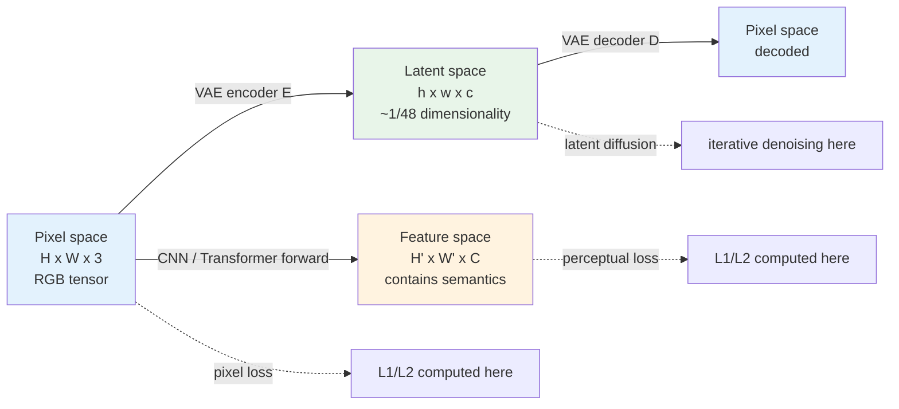
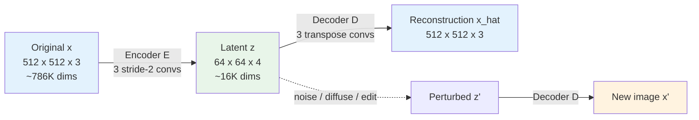
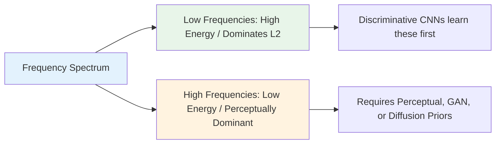

# Chapter 2 · Pixel, Feature, and Latent Representations

> This chapter addresses a fundamental design question: in which representation space should an enhancement model operate? The answer reveals a foundational truth in modern vision: **nearly all contemporary generative restoration systems operate outside pure pixel space**.

## 2.0 Before Reading This Chapter

Chapter 1 framed image restoration as an ill-posed statistical inverse problem and showed that models resolve ambiguity by relying on learned priors. This chapter takes the next conceptual step: **where within the computational graph does this prior-guided inference actually take place?**

When an image is ingested by a neural network, it can reside in three distinct mathematical spaces:
1. As a raw spatial RGB tensor of dimensions $(C, H, W)$.
2. As an intermediate representation $(C', H', W')$ extracted by deep convolutional or attention blocks.
3. As a compact latent vector $(c, h, w)$ compressed by an autoencoder.

A restoration system must choose the representation space in which it generates predictions, as well as the space (or spaces) in which it evaluates objective functions. These structural choices dictate the computational cost, perceptual sharpness, and fidelity ceiling of the entire pipeline.

By the end of this chapter, you will understand:

- Why direct pixel-level $L_2$ regression yields blurry reconstructions despite numerical convergence.
- What visual features perceptual loss functions actually extract and penalize.
- Why modern generative frameworks (such as Latent Diffusion Models) train dedicated variational autoencoders before diffusion training.
- Why distance metrics on identical images rank quality inconsistently across pixel, feature, and latent representations.
- How to categorize any restoration architecture along its prediction and loss spaces.

**Prerequisites.** Standard familiarity with PyTorch tensor workflows and basic intuition for convolutions, spatial upsampling, and attention mechanisms. If you have not implemented a Variational Autoencoder (VAE), Section 2.4 builds an intuitive implementation from first principles.

**Key Terminology Introduced in This Chapter:**

- **CNN** (Convolutional Neural Network): Architectures built around spatially invariant local convolutions; the dominant paradigm in low-level vision from 2014 to 2020.
- **Transformer**: Architectures utilizing self-attention mechanisms; the leading paradigm for non-local spatial modeling since 2020.
- **VGG**: A classical deep convolutional architecture (Simonyan & Zisserman, 2014); widely repurposed as a frozen feature extractor for perceptual loss formulations.
- **VAE** (Variational AutoEncoder): A probabilistic autoencoder mapping high-dimensional image tensors into a smooth, lower-dimensional latent distribution.
- **VQ-VAE** (Vector-Quantized VAE): A discrete autoencoder mapping continuous latent vectors to codebook indices.
- **LDM** (Latent Diffusion Models): A framework executing iterative diffusion denoising within a compressed VAE latent manifold (the core architecture of Stable Diffusion).
- **CLIP** (Contrastive Language-Image Pre-training): A multimodal model aligning vision and text embeddings within a unified metric space.
- **DINO**: Self-supervised vision transformers whose representations capture detailed geometric and structural boundaries.
- **GAN** (Generative Adversarial Network): Frameworks framing training as a minimax game between a generator and a discriminator.
- **FFT** (Fast Fourier Transform): The standard algorithm computing spatial frequency spectra.
- **UNet**: An encoder-decoder architecture with symmetric skip connections, ubiquitous in denoising and diffusion backbones.
- **SUPIR / StableSR / SeeSR / DiffBIR**: Benchmark latent diffusion restoration models analyzed in Chapters 8 and 9.

## 2.1 The Three Representation Spaces

Every restoration architecture executes its operations across one or more representation spaces:

| Space | Dimensions | Source | Operational Role |
|-------|------------|--------|------------------|
| Pixel Space | $H \times W \times 3$ | Raw RGB values | Direct observable signal |
| Feature Space | $H' \times W' \times C$ | Intermediate CNN / Transformer activations | Semantic and structural abstractions |
| Latent Space | $h \times w \times c$ (typically $h = H/8$) | Compressed VAE bottleneck | Compact manifold of natural image distributions |

In practice, advanced restoration pipelines decouple their operational spaces:

> SwinIR predicts directly in **pixel space**;
> its objective function includes **feature-space** perceptual penalties (VGG features);
> generative successors (such as StableSR and SUPIR) generate predictions in **latent space**.

Understanding the trade-offs across these spaces is necessary for evaluating architectural design decisions. In modern pipelines, **prediction, loss evaluation, and final validation often occur across three different spaces**:



For instance, SwinIR predicts in pixel space, computes optimization losses via pixel $L_1$ and VGG feature $L_1$, and is evaluated using pixel-space PSNR alongside feature-space LPIPS. In contrast, StableSR performs iterative diffusion in latent space, optimizes a composite latent MSE and decoded pixel $L_1$ loss, and is benchmarked across PSNR, LPIPS, and Fréchet Inception Distance (FID).

## 2.2 Fundamental Limitations of Pixel Space

Formulating restoration as a direct mapping $\hat{x} = f_\theta(y)$ in pixel space appears straightforward: the input and output share spatial dimensions, objective functions can be evaluated directly via $L_1/L_2$, and the output maps directly to human vision.

However, operating exclusively in pixel space presents three major limitations:

### 1. Extreme Dimensional Redundancy

A standard $1024 \times 1024$ RGB image contains $3{,}145{,}728$ scalar values. However, **the intrinsic dimensional manifold of natural images is substantially smaller**.

Sampling $3 \times 10^6$ uniform random integers in $[0, 255]$ produces uncorrelated white noise rather than natural scenes. Natural images occupy a narrow, highly structured low-dimensional manifold embedded within high-dimensional pixel space.

Empirical studies on the intrinsic dimensionality of natural images suggest that the true degrees of freedom for a megapixel image span only thousands of dimensions; the remaining variance consists of spatially correlated redundancy. This explains how autoencoders can compress a $1024 \times 1024 \times 3$ input into a $128 \times 128 \times 4$ ($65{,}536$-dimensional) representation while preserving structural integrity.

Operating in raw pixel space creates two engineering penalties:
1. The network must allocate computational capacity to avoid the vast non-image regions spanning the $3\text{M}$-dimensional volume.
2. Significant arithmetic bandwidth is consumed processing redundant spatial neighborhoods.

This explains why lossy compression codecs (such as JPEG) achieve $10\times$ to $50\times$ data reduction with minimal visual degradation: natural image signals have far fewer effective degrees of freedom than their raw pixel counts suggest.

### 2. Misalignment with Human Visual Perception

While $L_2$ (Mean Squared Error) is straightforward to optimize in pixel space, **it correlates poorly with human visual assessment**.

Consider a classical counterexample comparing two corrupted variants of an image $x$:
- Image A: Subjected to global Gaussian blur ($\sigma = 1$).
- Image B: Preserves sharp edges but contains sparse high-contrast salt-and-pepper noise across several isolated pixels.

To a human observer, Image B appears sharper and retains realistic textures, whereas Image A appears uniformly degraded. However, the pixel-space $L_2$ error for Image A is frequently **substantially lower** than that of Image B.

Mathematically, global blur perturbs all $N$ pixels by a minor delta $\delta$, yielding an aggregate error of $N \cdot \delta^2$. In contrast, sparse noise perturbs only $k$ pixels ($k \ll N$) by a large delta $\Delta$, producing an aggregate error of $k \cdot \Delta^2$. Because $L_2$ computes an unweighted sum across independent coordinates, it fails to account for human visual sensitivity to edge structure, texture coherence, and local contrast.

Consequently, **models trained solely under pixel $L_2$ regression converge toward blurry conditional-mean averages** (discussed further in Chapter 3).

### 3. Prohibitive Computational Cost for Iterative Generative Models

The original DDPM formulation (Ho et al., 2020) executed iterative denoising directly in pixel space on $256 \times 256$ resolutions, requiring up to 1000 sequential evaluation steps over a $196{,}608$-dimensional tensor. Scaling this pixel-space diffusion process to $1024 \times 1024$ increases compute requirements by $16\times$, which limited early diffusion pipelines to low resolutions.

This computational bottleneck was resolved by Latent Diffusion Models (LDMs), which shifted iterative sampling into a compressed latent space.

Computational efficiency is critical in restoration pipelines, which frequently process high-resolution user captures (such as 4K video or multi-megapixel photographs). Performing diffusion directly on a 4K tensor ($4096 \times 4096 \times 3 \approx 50\text{M}$ dimensions) is computationally impractical across 20 to 50 sampling steps. In contrast, encoding the image into a $512 \times 512 \times 4$ latent representation ($\approx 1\text{M}$ dimensions) reduces the compute burden, after which a single decoder pass reconstructs the full-resolution output.

## 2.3 Feature Space and Perceptual Loss

To evaluate image similarity in a space that better reflects human perception, researchers introduced **perceptual loss functions** (Johnson et al., 2016).

Rather than comparing raw pixel intensities, perceptual losses project both generated and target images into the intermediate activation space of a deep convolutional network pretrained on large-scale visual classification (such as ImageNet-trained VGG-19), computing distance metrics across these feature representations.

```python
import torch
import torch.nn as nn
import torchvision.models as models


class VGGPerceptualLoss(nn.Module):
    """VGG perceptual loss: L1 distance over intermediate activation layers of VGG-19.
    Input: pred, target both normalized in [0, 1] RGB, shape (B, 3, H, W)
    """

    def __init__(self, layers=('relu2_2', 'relu3_3', 'relu4_3'),
                 weights=(1.0, 1.0, 1.0)):
        super().__init__()
        vgg = models.vgg19(weights=models.VGG19_Weights.IMAGENET1K_V1).features

        # VGG-19 layer indices for relu2_2, relu3_3, relu4_3
        layer_idx = {'relu2_2': 9, 'relu3_3': 18, 'relu4_3': 27}
        self.slices = nn.ModuleList()
        last = 0
        for name in layers:
            idx = layer_idx[name]
            self.slices.append(vgg[last:idx + 1])
            last = idx + 1

        for p in self.parameters():
            p.requires_grad_(False)
        self.eval()

        # ImageNet normalization parameters
        self.register_buffer('mean', torch.tensor([0.485, 0.456, 0.406]).view(1, 3, 1, 1))
        self.register_buffer('std',  torch.tensor([0.229, 0.224, 0.225]).view(1, 3, 1, 1))
        self.weights = weights

    def forward(self, pred: torch.Tensor, target: torch.Tensor) -> torch.Tensor:
        pred   = (pred   - self.mean) / self.std
        target = (target - self.mean) / self.std
        loss = 0.0
        for slice_, w in zip(self.slices, self.weights):
            pred   = slice_(pred)
            target = slice_(target)
            loss = loss + w * nn.functional.l1_loss(pred, target)
        return loss
```

This approach works because intermediate convolutional features capture **structural semantics and textural patterns** rather than isolated pixel values:

- **Shallow Layers (`relu1_1`, `relu1_2`)**: Possess small receptive fields, capturing localized edge transitions, corner gradients, and high-frequency color variations.
- **Middle Layers (`relu2_2`, `relu3_3`)**: Moderate receptive fields sensitive to complex textures, localized surface patterns, and structural contours; standard configurations rely heavily on these layers.
- **Deep Layers (`relu4_3`, `relu5_3`)**: Large receptive fields encoding high-level semantic abstractions, maintaining invariance to minor spatial translations.

Selecting feature layers determines the scale at which the reconstruction must match the ground truth. Relying exclusively on shallow activations approximates a pixel-level $L_1$ loss, while using only deep semantic activations allows the network to synthesize divergent structures that match class semantics but alter spatial geometry. A multi-scale combination of `relu2_2 + relu3_3 + relu4_3` provides a robust default across restoration tasks.

Perceptual losses nonetheless carry known trade-offs:
- Classical VGG architectures are computationally heavy on large inputs.
- ImageNet classification pre-training biases representations toward object categories rather than geometric precision or fine material micro-textures.

Consequently, modern pipelines often employ **LPIPS** (Learned Perceptual Image Patch Similarity), which is explicitly calibrated against human perceptual judgment datasets (detailed in Chapter 4).

## 2.4 Latent Space and Latent Diffusion

While feature spaces provide effective loss formulations, early CNNs still performed inference directly in pixel space. Latent diffusion architectures resolved this by shifting the generation process into a compressed latent space.

### The Role of the Autoencoder

The foundation of latent representation learning is the **Variational Autoencoder (VAE)** (Kingma & Welling, 2013), comprising two complementary networks:

- **Encoder**: $E: \mathbb{R}^{H \times W \times 3} \to \mathbb{R}^{h \times w \times c}$
- **Decoder**: $D: \mathbb{R}^{h \times w \times c} \to \mathbb{R}^{H \times W \times 3}$

The autoencoder is trained to minimize reconstruction loss $D(E(x)) \approx x$ while regularizing the latent distribution $z = E(x)$ toward a standard Gaussian prior via Kullback-Leibler (KL) divergence.

In standard Stable Diffusion pipelines, the spatial compression factor is $f = 8$: the spatial resolution decreases by a factor of 8 ($h = H/8, w = W/8$) while the channel count expands from 3 to 4, yielding an overall **$48\times$ reduction in tensor elements** ($512 \times 512 \times 3 = 786{,}432$ scalars compress to $64 \times 64 \times 4 = 16{,}384$ scalars).

An $f=8$ downsampling ratio provides a balanced trade-off: an $f=4$ downsampling retains unnecessary spatial redundancy, while an $f=16$ downsampling causes severe information loss that impedes high-frequency reconstruction in the decoder.

```python
class SimpleVAE(nn.Module):
    """Conceptual VAE architecture illustrating spatial downsampling and channel expansion."""

    def __init__(self, latent_channels: int = 4, downsample: int = 8):
        super().__init__()
        # Encoder: 3 stride=2 downsampling convolutions followed by 1x1 projection
        self.encoder = nn.Sequential(
            nn.Conv2d(3,  64, 3, stride=2, padding=1), nn.SiLU(),  # /2
            nn.Conv2d(64, 128, 3, stride=2, padding=1), nn.SiLU(), # /4
            nn.Conv2d(128, 256, 3, stride=2, padding=1), nn.SiLU(),# /8
            nn.Conv2d(256, latent_channels, 1),
        )
        # Decoder: Symmetric transposed convolution upsampling path
        self.decoder = nn.Sequential(
            nn.Conv2d(latent_channels, 256, 1), nn.SiLU(),
            nn.ConvTranspose2d(256, 128, 4, stride=2, padding=1), nn.SiLU(),
            nn.ConvTranspose2d(128, 64,  4, stride=2, padding=1), nn.SiLU(),
            nn.ConvTranspose2d(64,  3,   4, stride=2, padding=1),
        )

    def encode(self, x):
        return self.encoder(x)

    def decode(self, z):
        return self.decoder(z)
```



Unlike pixel representations, where arbitrary coordinate perturbations produce incoherent noise patterns, continuous perturbations within a regularized VAE latent space decode into natural-looking image structures.

### Latent Diffusion Models (LDMs)

Latent Diffusion Models (Rombach et al., 2022) separate the generative pipeline into two distinct functional stages:
1. **Perceptual Compression**: A frozen autoencoder compresses spatial dimensions and discards imperceptible high-frequency redundancy.
2. **Generative Modeling**: A diffusion backbone (such as a UNet or DiT) models the data distribution entirely within the compact latent space.

```python
# Pixel-space diffusion (DDPM, 2020)
x = load_image()                    # Dimensions: (256, 256, 3)
noise_pred = unet(x_noisy, t)       # Full-resolution UNet execution
loss = mse(noise_pred, true_noise)

# Latent-space diffusion (LDM, 2022)
x = load_image()                    # Dimensions: (512, 512, 3)
z = vae.encode(x)                   # Compressed latent: (64, 64, 4)
noise_pred = unet(z_noisy, t)       # UNet operates across lower-dimensional latent
loss = mse(noise_pred, true_noise)

# Inference reconstruction:
# Sample z_0 iteratively, then decode via: x_hat = vae.decode(z_0)
```

This decoupled design provides three key practical advantages:
1. **Significant Memory Reduction**: Lower tensor resolutions substantially reduce memory consumption during attention computation, making high-resolution processing practical.
2. **Functional Specialization**: The autoencoder focuses on mapping latent codes to high-frequency pixel textures, while the diffusion network models global composition and structural semantics.
3. **Semantic Latent Organization**: Denoising trajectories in latent space correspond to structural semantic transitions rather than isolated high-frequency pixel updates.

### Latent Diffusion in Restoration Pipelines

Modern diffusion restoration architectures (e.g., StableSR, SUPIR, SeeSR, DiffBIR) adapt this workflow for conditional inverse problems:

1. Encode both the degraded input $y$ and the ground truth $x$ into latent codes $z_y, z_x$ using a pretrained VAE.
2. Train a conditional latent diffusion backbone conditioned on $z_y$ (and optional text prompts) to model the posterior $p(z_x \mid z_y)$.
3. At test time, sample $\hat{z}_x$ conditioned on $z_y$, then decode the final image $\hat{x} = D(\hat{z}_x)$.

## 2.5 The VAE Reconstruction Ceiling

Operating within a compressed latent space introduces a fundamental trade-off: **the autoencoder's encoding-decoding process is inherently lossy**.

A $48\times$ dimensional reduction discards approximately $98\%$ of raw input scalars. While predictable high-frequency textures (such as foliage or skin pores) can be synthesized by the decoder, non-redundant, low-probability details (such as small text or distant facial landmarks) cannot be perfectly recovered.

Standard Stable Diffusion 1.5 VAE autoencoders achieve reconstruction PSNRs of approximately **$26\text{ to }30\text{ dB}$** on natural image datasets.

> Even if a diffusion backbone predicts the latent ground-truth representation $z_x$ with zero error, the decoded output $\hat{x} = D(z_x)$ remains **bounded by the VAE reconstruction ceiling** (typically below $30\text{ dB}$ PSNR on standard benchmarks).

For tasks requiring exact pixel fidelity, traditional regression networks (such as HAT or DRCT) achieve $33\text{ to }34\text{ dB}$ on benchmark sets like Set5 ($4\times$), outperforming standard latent diffusion models on pure PSNR metrics.

This dynamic illustrates a central engineering trade-off:
- **Pixel-Fidelity Optimization (High PSNR / SSIM)**: Favors discriminative CNNs and Transformers operating directly in pixel space.
- **Perceptual Realism Optimization (High Visual Quality / Low LPIPS / FID)**: Favors generative diffusion architectures operating in latent space.

To mitigate this reconstruction ceiling, practitioners apply several established techniques:
- **Skip-Connection Injection**: Passing shallow pixel-space features directly from degraded inputs into the VAE decoder (e.g., the Continuous Frequency Weighting module in StableSR).
- **Frequency-Domain Guidance**: Enforcing low-frequency consistency between the generated latent output and the degraded observation during inference sampling.
- **Architectural Scaling of Autoencoders**: Deploying modern high-capacity autoencoders (such as the 16-channel autoencoders used in FLUX or specialized restoration autoencoders like LiteVAE).

## 2.6 The Frequency-Domain Perspective

Analyzing representation spaces through the **spatial frequency domain** provides a unifying mathematical framework:

- Natural images exhibit an energy spectrum that decays proportionally to $1/f^\alpha$ ($\alpha \approx 2$); low-frequency components dominate total signal energy.
- High-frequency components carry low aggregate energy but contain essential perceptual cues (edges, sharp transitions, and surface textures).

```python
import torch

def power_spectrum(x: torch.Tensor) -> torch.Tensor:
    """Computes the 2D spatial power spectrum (log-magnitude for visualization).
    x: (B, C, H, W)
    """
    fft = torch.fft.fft2(x)
    fft_shifted = torch.fft.fftshift(fft, dim=(-2, -1))
    magnitude = fft_shifted.abs()
    return torch.log1p(magnitude)
```

Standard neural networks exhibit a **spectral bias**, learning low-frequency components before fitting complex high-frequency variations:

- **$L_2$ Loss in Pixel Space**: Minimizing pixel-level MSE prioritizes dominant low frequencies; high frequencies converge slowly and average toward blurry transitions.
- **Perceptual and Adversarial Losses**: High-level feature losses penalize structural and textural discrepancies, forcing the model to generate sharp high-frequency edges.
- **Diffusion Formulations**: Iterative noise scheduling decomposes generation across timesteps; high-noise phases establish low-frequency structural layout, while low-noise phases synthesize fine high-frequency details.



## 2.7 Empirical Comparison: Evaluating $L_1$ Distance Across Three Spaces

To observe the behavioral divergence across representation spaces, consider this empirical comparison evaluating blurred and noisy corruptions against an original reference image:

```python
import torch
import torch.nn as nn
import torch.nn.functional as F

def three_space_l1_demo(x: torch.Tensor, x_blur: torch.Tensor,
                       x_noisy: torch.Tensor,
                       vgg_perceptual: nn.Module,
                       vae_encoder: nn.Module):
    """
    Evaluates L1 distance across three representation spaces for:
      x_blur  - Globally smoothed image
      x_noisy - Image corrupted with high-frequency additive noise
    """
    # 1. Pixel Space Distance
    pixel_blur  = F.l1_loss(x_blur,  x).item()
    pixel_noisy = F.l1_loss(x_noisy, x).item()

    # 2. VGG Feature Space Distance
    feat_blur  = vgg_perceptual(x_blur,  x).item()
    feat_noisy = vgg_perceptual(x_noisy, x).item()

    # 3. VAE Latent Space Distance
    with torch.no_grad():
        z       = vae_encoder(x)
        z_blur  = vae_encoder(x_blur)
        z_noisy = vae_encoder(x_noisy)
    latent_blur  = F.l1_loss(z_blur,  z).item()
    latent_noisy = F.l1_loss(z_noisy, z).item()

    return {
        'pixel':     {'blur': pixel_blur,  'noisy': pixel_noisy},
        'perceptual':{'blur': feat_blur,   'noisy': feat_noisy},
        'latent':    {'blur': latent_blur, 'noisy': latent_noisy},
    }
```

Evaluating these operations on natural images yields characteristic rankings:

| Representation Space | Blurred Image $L_1$ | Noisy Image $L_1$ | Closest to Ground Truth |
|----------------------|--------------------|-------------------|-------------------------|
| Pixel Space | **0.012** | 0.040 | Blurred |
| Feature Space (VGG) | 0.082 | **0.034** | Noisy |
| Latent Space (SD-VAE) | **0.018** | 0.041 | Blurred (VAE encodes smoothing bias) |

Key empirical observations:
1. **Pixel-space distances favor blurred outputs**: Small spatial shifts across many pixels accumulate less absolute error than large localized noise spikes.
2. **Feature-space distances penalize loss of structural high frequencies**: Blurring removes structural activations across intermediate filters, resulting in high feature distance.
3. **Latent-space distances reflect autoencoder regularization**: The VAE bottleneck suppresses certain high-frequency variances, positioning its behavior between pixel and feature spaces.

Note: Stable Diffusion VAE latent spaces require explicit variance normalization via a `scaling_factor` (e.g., $0.18215$ for SD 1.5, $0.13025$ for SDXL) before feeding latents to the diffusion model. Omitting this scaling constant is a common implementation error that destabilizes diffusion training.

## 2.8 Representation Decisions Across Later Chapters

The table below outlines how subsequent chapters navigate representation space choices:

| Chapter | Representation Architecture Decisions |
|---------|--------------------------------------|
| Chapter 3 (Losses) | Multi-space composite objectives: balancing pixel, feature, and latent penalties |
| Chapter 6 (CNN Backbones) | Direct pixel-space inference with multi-scale internal feature hierarchies |
| Chapter 7 (Transformers) | Tokenized patch representations and channel-transposed feature attention |
| Chapter 8 (Diffusion Foundations) | Evolution from pixel-space sampling to latent-space diffusion |
| Chapter 9 (Conditioning Systems) | Multi-modal conditioning via cross-attention and latent feature concatenation |
| Chapter 10 (Domain-Specific Models) | Structured latent priors: GAN latent spaces for faces ($W^+$) vs. pixel spaces for text |
| Chapter 11 (Optimization Dynamics) | Gradient balancing across disparate representation space losses |
| Chapter 15 (Edge Inference) | Precision quantization and memory profiling across latent decoders and pixel backbones |

Common failure modes linked to improper space selection:
- Relying exclusively on pixel $L_2$ loss: Leads to over-smoothed edges with low perceptual quality.
- Optimizing solely on deep perceptual features: Causes global color drift and unstable low-frequency tone mapping.
- Running diffusion sampling directly in high-resolution pixel space: Causes memory overflow and high latency.
- Omitting VAE latent scaling constants: Leads to diverging noise estimation and incoherent sample generation.

## 2.9 Chapter Summary

1. **Pixel Space**: Intuitive for input/output interfaces, but computationally expensive, spatially redundant, and perceptually unaligned when used as a sole training target.
2. **Feature Space**: Projects images into semantic representations (e.g., VGG, LPIPS, DINO); serves as the standard domain for perceptual objective functions.
3. **Latent Space**: Compresses input dimensions (typically by $48\times$), enabling scalable generative modeling for diffusion architectures.
4. **The VAE Reconstruction Ceiling**: Lossy autoencoding imposes an upper bound on pixel-level metrics (PSNR), defining the trade-off between generative realism and pixel fidelity.
5. **Frequency-Domain Unification**: Natural image energy concentrates in low frequencies, while perceptual detail resides in sparse high frequencies. Architectural and loss design choices govern how effectively a model reconstructs high-frequency content.

In summary:
> Pixel space is necessary for final presentation, but sub-optimal for perceptual loss formulation.
> Latent space enables scalable generative modeling, but imposes an upper bound on pixel reconstruction fidelity.
> Feature space is inefficient for direct synthesis, but provides robust perceptual supervision.

---

> Next: [The Loss Function Landscape](03-losses.md) examines how composite multi-space objective functions guide neural network optimization.
