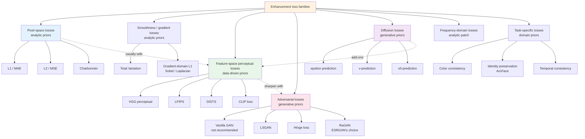
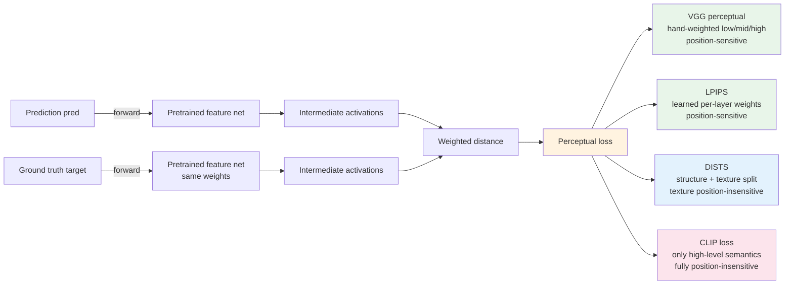

# Chapter 3 · Loss Function Landscape

> The loss of an enhancement model is almost never a single loss. Understanding why - and how to mix them - is what this chapter answers.

## 3.0 Before Reading This Chapter

Chapter 2 broke "where to do things" into three dimensions: in which space to predict, in which space to compute loss, in which space to evaluate. This chapter focuses on the second of those three. The question it answers: when we say "train an enhancement model," what does the scalar we are minimizing actually consist of, what is each term penalizing, and why can't any single term stand alone?

After this chapter you should be able to answer:

- Why L2 (MSE) is mathematically clean yet loses to L1 in engineering
- Whether Charbonnier and smooth L1 are the same thing, and why nearly every low-level vision paper uses it
- Where the boundaries lie between the perceptual, adversarial, and diffusion loss families
- On a new task, which numerical starting points to use for each loss term's weight
- When watching training curves per-term, which symptoms suggest which kind of adjustment

Background presumed: you have read Chapter 2 and know what pixel / feature / latent space each are. The minimum math needed is the maximum-likelihood derivation of Gaussian and Laplacian distributions, since the engineering properties of L1 and L2 stem almost entirely from the shapes of that pair of distributions.

**Abbreviations introduced in this chapter.** Acronyms covered in earlier chapters are not repeated. New terms used in this chapter:

- **MSE** (Mean Squared Error): another name for L2 loss in the statistics tradition
- **MAE** (Mean Absolute Error): another name for L1 loss
- **TV** (Total Variation): a regularization loss based on the norm of the difference between neighboring pixels; encourages piecewise smoothness
- **GAN** (Generative Adversarial Network): a family of generative models trained as a game between a generator and a discriminator
- **LSGAN** (Least Squares GAN): a variant that treats the discriminator output as a regression target and uses MSE as the adversarial loss
- **Hinge loss**: an adversarial loss that thresholds the discriminator output against a margin; the mainstream choice in modern GANs
- **RaGAN** (Relativistic average GAN): a discriminator that judges "more real than the other" in a relative sense; used by ESRGAN
- **R1 / R2 regularization**: gradient-norm penalties on the discriminator at real/fake samples
- **TTUR** (Two-Time-Scale Update Rule): discriminator and generator use different learning rates
- **FFL** (Focal Frequency Loss): a weighted loss in the frequency domain that up-weights hard-to-train bands
- **SNR** (Signal-to-Noise Ratio): a common quantity for describing diffusion timesteps
- **CLIP** (Contrastive Language-Image Pre-training): an image-text alignment pretrained model; can also serve as a "semantic non-drift" constraint
- **ArcFace**: the standard embedding network in face recognition; used as a feature extractor for face identity preservation losses

## 3.1 Why This Chapter

In LLM training the loss is essentially one: next-token cross-entropy. In classification it's essentially one too: cross-entropy.

Image enhancement is different. Open any mainstream enhancement paper and the loss-function section typically looks like:

$$
\mathcal{L} = \lambda_1 \mathcal{L}_{\text{pixel}} + \lambda_2 \mathcal{L}_{\text{perceptual}} + \lambda_3 \mathcal{L}_{\text{adversarial}} + \lambda_4 \mathcal{L}_{\text{...}}
$$

Four or five loss terms, weighted and mixed. Why? Chapters 1 and 2 already answered:

- An ill-posed problem needs priors, and **each loss term is one way to encode a prior**
- Different losses prefer different frequency components (L2 prefers low frequencies, adversarial prefers high frequencies, perceptual prefers mid-to-high)
- A single loss over-optimizes some axis (L2 → blur, pure adversarial → fake details, pure perceptual → color drift)

Let me unpack "each loss term is a prior" a bit more. Chapter 1 said priors come from three sources: analytic, data-driven, generative. Mapped onto loss functions: pixel L1/L2 and TV are analytic priors ("natural images are close to the ground truth pixel-by-pixel, neighboring-pixel differences are sparse"); perceptual loss is a data-driven prior ("natural images should be close to the ground truth in the pretrained feature space of VGG/CLIP/etc."); adversarial loss and diffusion loss are generative priors ("the output should fall within a natural-image distribution defined by some discriminator or diffusion model"). What the model finally outputs depends on the specific blend of these three classes of priors.

This mapping has a direct engineering implication: **before you add a new loss term, work out which class of prior it encodes and whether it conflicts with the priors already represented by the existing losses**. A common counterexample is dialing TV (smoothness prior) very high while also adding GAN (high-frequency prior); the two fight, and the model output ends up with a strange feel of "large smooth regions plus sharp edges but no textures." Loss-term design is fundamentally prior design, priors balance each other, and there is no such thing as "more is always better."

> Training an enhancement model is not "making the model approach the ground truth," it is "finding a Pareto-optimal point on multiple competing metrics."
>
> Loss weighting = telling the model which of those metrics you care about most.

The biggest difference between this view and the "single-objective" training of LLMs or classification: in single-objective training "better" is a total order — falling loss is the model improving. In multi-loss training "better" is a partial order — one loss falling may be accompanied by another rising. This means you can't decide whether to early-stop or change a hyperparameter based on the total-loss curve alone; you must look at every term's curve separately. Chapter 11 expands on the concrete tools and visualizations for this kind of "per-term monitoring."

This chapter classifies the loss terms commonly used in engineering, and ends with a decision table for mixing strategies. After reading it, when facing any new task, an engineer should be able to sketch an initial loss inventory in ten minutes (which terms, what starting weight for each) and know the engineering purpose of every entry.

What this chapter does **not** cover: the theoretical derivation of "why this specific formula and not another" for each loss (scattered across the original papers), and automated methods for loss weighting (such as GradNorm, PCGrad, mentioned briefly in Chapter 11). Both matter, but neither affects building engineering intuition, so this chapter focuses on "what each loss is, when to use it, and what to pair it with" rather than "why this particular constant."

A first picture of all loss families: each branch corresponds to one class of prior, and the dashed arrows between nodes mean "typically used together." After reading the later sections, come back to this diagram; you should be able to sketch a loss-term list for a new task in ten seconds.



## 3.2 Pixel-Space Losses

The most basic family. Computed directly on pixel differences.

### L2 (MSE)—mathematically convenient, engineering-unfriendly

$$
\mathcal{L}_2 = \frac{1}{N} \sum_i (\hat{x}_i - x_i)^2
$$

Mathematical properties:

- Corresponds to maximum likelihood under a Gaussian noise assumption
- Differentiable everywhere, convex
- Directly corresponds to the PSNR metric

To expand on "corresponds to Gaussian maximum likelihood": if the observation $y$ is assumed to follow $\mathcal{N}(\hat{x}, \sigma^2 I)$, the log-likelihood is $-\frac{1}{2\sigma^2} \|y - \hat{x}\|^2 + \text{const}$, and after dropping the constant and the scaling factor this becomes L2. This also explains why L2 performs poorly in settings where "real noise isn't Gaussian": it is optimizing the log-likelihood of the wrong noise model.

Engineering problems:

- **Sensitive to outliers**: a single wildly wrong pixel contributes $error^2$ and can dominate the gradient
- **Biased toward the mean**: given $y$, the minimizer of $\mathbb{E}[||\hat{x} - x||^2]$ is $\mathbb{E}[x | y]$, the average of multiple plausible $x$, which looks blurry
- **Misaligned with perception**: Section 2.7 already verified this

In practice L2 is now used in only two places:

1. **Diffusion model denoising loss** (mathematically must be L2, since score matching derives this)
2. **Early ablation experiments** (as a baseline)

Point 1 deserves a sentence more: the simple loss of a diffusion model is essentially "denoising Gaussian noise," and since the noise added during training is itself Gaussian, the corresponding maximum-likelihood loss is L2. In this case L2 is not an "engineering compromise" but the mathematical optimum. This also explains why a diffusion model trained with L2 does not output blurry images: each step only removes a small amount of noise, the process is iterative, and the model never has to "in one shot find the mean of all plausible $x$."

### L1 (MAE)—the modern default

$$
\mathcal{L}_1 = \frac{1}{N} \sum_i |\hat{x}_i - x_i|
$$

Properties:

- Corresponds to maximum likelihood under a Laplacian noise assumption
- Not differentiable at 0 (in practice the gradient is the sign function, an engineering non-issue)
- **More robust to outliers**—a wildly wrong pixel contributes $|error|$ and does not dominate the gradient

Visual effect: images trained with L1 are slightly sharper than those trained with L2. Reason: L1 is not "flattened" by the mean—given $y$, the minimizer of $\mathbb{E}[||\hat{x} - x||_1]$ is $\text{median}(x | y)$, which leans toward "some specific plausible $x$" rather than the mean.

**Almost all modern non-diffusion enhancement models use L1 (or Charbonnier) as the pixel-loss base.**

### Charbonnier—a smooth version of L1

$$
\mathcal{L}_{\text{Charb}} = \frac{1}{N} \sum_i \sqrt{(\hat{x}_i - x_i)^2 + \epsilon^2}
$$

$\epsilon$ is typically $10^{-3}$ or $10^{-6}$. When $|error| \gg \epsilon$ it degenerates to L1; when $|error| \approx 0$ it degenerates to L2.

Why use this instead of plain L1?

- L1 has a step gradient of $\pm 1$ around 0, with **gradient that does not decay** as you approach the truth, causing oscillation in late training
- Charbonnier is smooth around 0 and gradients automatically shrink near the truth, training is more stable

```python
import torch

def charbonnier_loss(pred: torch.Tensor, target: torch.Tensor,
                     eps: float = 1e-3) -> torch.Tensor:
    """Charbonnier loss (a continuous version of smooth L1).
    More numerically stable than L1, more robust than L2; the de facto standard in low-level vision.
    """
    diff = pred - target
    return torch.sqrt(diff * diff + eps * eps).mean()
```

Engineering experience: Restormer, NAFNet, SwinIR and others all write "L1 loss" in the paper, but the actual code often uses Charbonnier because it trains more stably.

Putting the training dynamics of L1, L2, and Charbonnier side by side is more intuitive. For a range of error magnitudes $e$ (very small to very large), the gradient behavior of the three is:

- **$|e| \ll 1$**: L2 gradient $2e \approx 0$, L1 gradient $\pm 1$, Charbonnier gradient $\approx e/\epsilon$ (still smooth)
- **$|e| \approx 1$**: all three are of similar magnitude
- **$|e| \gg 1$**: L2 gradient $2e$ is huge (outliers dominate), L1 gradient is still $\pm 1$, Charbonnier gradient $\approx \pm 1$

In short: L2 is crushed by outliers when $e$ is large and has a vanishing gradient when $e$ is small; L1 fixes the "crushed by outliers" problem but its gradient is still $\pm 1$ at small $e$, causing oscillation near the truth; Charbonnier picks the best of both worlds - robust like L1 at large $e$, naturally decaying and stable like L2 at small $e$. The three may look like slight formula variations on paper, but in engineering they differ by several percentage points of PSNR. This is an intuition worth establishing.

## 3.3 Smoothness / Gradient Losses

Pixel losses only look at point-to-point. **Gradient losses** look at differences between neighboring points.

### Total Variation

$$
\mathcal{L}_{\text{TV}} = \sum_{i,j} \left( |\hat{x}_{i+1,j} - \hat{x}_{i,j}| + |\hat{x}_{i,j+1} - \hat{x}_{i,j}| \right)
$$

It penalizes the differences between neighboring pixels and encourages **piecewise smoothness**—flat interior, sharp edges.

```python
def total_variation_loss(x: torch.Tensor) -> torch.Tensor:
    """TV loss (anisotropic version).
    x: (B, C, H, W)
    """
    dh = (x[:, :, 1:, :] - x[:, :, :-1, :]).abs().mean()
    dw = (x[:, :, :, 1:] - x[:, :, :, :-1]).abs().mean()
    return dh + dw
```

When to use:

- **Denoising scenarios**: TV is a classical prior that suppresses noise
- **Generative models**: diffusion/GAN models tend to produce texture artifacts in flat regions; adding TV holds them down
- **Engineering weight is small** (usually $\lambda = 10^{-5}$ to $10^{-3}$); too large will smear out details

TV loss has two formulations: "anisotropic" (compute horizontal and vertical separately) and "isotropic" (compute the gradient magnitude). The former is simpler to implement and produces sparse gradients, encouraging horizontal- or vertical-axis edges; the latter is more symmetric but produces denser gradients. The isotropic version looks more natural in continuous regions like sky or skin; the anisotropic version is better on regular structures like documents and architecture. The PSNR difference between the two is small, but the visual difference is easy to see, so which to pick depends on your image domain.

### Gradient-domain loss

A finer version: compute L1 in the gradient domain.

$$
\mathcal{L}_{\text{grad}} = ||\nabla \hat{x} - \nabla x||_1
$$

```python
import torch.nn.functional as F

# Sobel kernels
SOBEL_X = torch.tensor([[-1., 0., 1.],
                        [-2., 0., 2.],
                        [-1., 0., 1.]]).view(1, 1, 3, 3)
SOBEL_Y = SOBEL_X.transpose(-1, -2)

def gradient_loss(pred: torch.Tensor, target: torch.Tensor) -> torch.Tensor:
    """Gradient-domain L1 loss. Forces predicted edges to align with ground-truth edges.
    pred, target: (B, C, H, W), assumed range [0, 1]
    """
    sobel_x = SOBEL_X.to(pred).expand(pred.shape[1], 1, 3, 3)
    sobel_y = SOBEL_Y.to(pred).expand(pred.shape[1], 1, 3, 3)

    pred_gx = F.conv2d(pred, sobel_x, padding=1, groups=pred.shape[1])
    pred_gy = F.conv2d(pred, sobel_y, padding=1, groups=pred.shape[1])
    targ_gx = F.conv2d(target, sobel_x, padding=1, groups=target.shape[1])
    targ_gy = F.conv2d(target, sobel_y, padding=1, groups=target.shape[1])

    return (pred_gx - targ_gx).abs().mean() + (pred_gy - targ_gy).abs().mean()
```

When to use:

- Tasks where edges are crucial (deblurring, document enhancement)
- As a lightweight substitute for perceptual loss

Both Sobel and Laplacian kernels are common. Sobel is a first-order difference and is direction-sensitive; Laplacian is a second-order difference, direction-insensitive but more sensitive to noise. The first-order version is more mainstream in deblurring tasks; the second-order is more common in document enhancement (where "edges matter but direction doesn't"). The two can also be combined, but their weights need to be tuned separately or the second-order's noise sensitivity will pollute training.

A further variant is **multi-scale gradient loss**: build a Gaussian pyramid of both the prediction and the truth, compute the gradient loss at each scale, then weight-sum. This is noticeably better than single-scale gradient loss on 4× or 8× super-resolution, because edges at different scales need to be aligned at the corresponding scale.

## 3.4 Perceptual Loss

Chapter 2 already introduced VGG perceptual loss (L1/L2 on the activations of intermediate layers of a pretrained VGG, with the feature space aligned with human perception). Here we add a few variants, and at the end of this section provide a "layered trade-off diagram" of the perceptual-loss family.

### LPIPS

LPIPS (Learned Perceptual Image Patch Similarity) is 2018 work. In essence it **replaces the hand-weighted perceptual loss with a data-driven one**:

1. Use AlexNet/VGG/SqueezeNet to extract features
2. **Add a learned linear weight on each layer's features** (trained on a large amount of human perceptual judgment data)
3. Use the weighted distance as the perceptual distance

It aligns better with human perception than VGG perceptual loss. But **as a training loss** there are several pitfalls:

- More compute than VGG
- Bias on certain textures
- Using it as the primary loss can lead the model to produce "gamed" outputs (optimized against LPIPS but visually bad)

In practice, LPIPS is more often used as an **evaluation metric**; Chapter 4 covers this in detail. As a training loss, VGG is still primary.

To make the engineering difference between LPIPS and VGG perceptual loss explicit: VGG loss treats all layer weights as 1 and all channel weights as 1, just plain feature-wise L1/L2; LPIPS learns the per-layer, per-channel weights from a large dataset of human perceptual judgements (see Chapter 4 on BAPPS). This difference makes LPIPS significantly better aligned with the eye than the VGG distance for **evaluation**, but actually *less* stable than VGG for **training**. The reason is that LPIPS's learned head can itself be sensitive to input distribution — weights trained on BAPPS may not be robust to out-of-distribution images, and backpropagating through it tends to invite "adversarial optimization against LPIPS's internal head."

### DISTS

DISTS (Deep Image Structure and Texture Similarity) is 2020 work, splitting perceptual loss into structure and texture parts. Its characteristic is **insensitivity to position**—the same texture in different positions is not penalized.

When to use: texture-generation tasks (skin, hair, fabric) where DISTS is more suitable than VGG.

### CLIP loss

Run the image through a CLIP image encoder, compute distance in CLIP feature space.

Properties:

- Sensitive to **semantic content**, insensitive to low-level details
- Suitable as a "content preservation" constraint, not as a primary loss
- Used a lot in generative enhancement (diffusion), less in discriminative enhancement

Engineering experience: CLIP loss alone cannot train a good enhancement model, but **adding it as a regularizer** (weight 0.01) ensures the model doesn't "drift" - e.g., restoring a photo of a cat won't turn it into a dog.

Another key difference between CLIP and VGG/LPIPS is that CLIP is sensitive to "image-text alignment." This means a CLIP distance constrains not only "the two images look visually similar" but also "the captions describing the two images are similar." This is very valuable in generative enhancement: a diffusion model may, in pursuit of better texture loss, "beautify" a face away from the original identity, and CLIP distance pulls that drift back at the semantic level. Chapter 9 discusses the concrete CLIP loss configuration in models like SUPIR.

Putting the four perceptual loss variants together, they distribute along two axes - "semantic depth in feature space" and "sensitivity to position" - as shown below. Readers can pick the right tool from this 2D map according to the task.



## 3.5 Adversarial Loss

GAN loss is one of the most complex, easy-to-mess-up, and crucial loss types in this book. Its role: **make the model produce real details**, instead of "safely outputting blur."

### Vanilla GAN—don't use directly

The original GAN loss:

$$
\min_G \max_D \mathbb{E}_{x \sim p_{\text{data}}} [\log D(x)] + \mathbb{E}_{z \sim p_z} [\log(1 - D(G(z)))]
$$

Theoretically nice but engineering-wise **extremely unstable**:

- Vanishing gradient: when $D$ is too well trained, $\log(1 - D(G(z)))$ saturates as $D(G(z)) \to 0$
- Mode collapse: $G$ outputs trend toward a single mode
- Training divergence: $D$ and $G$ fail to reach Nash equilibrium

Real engineering does not use vanilla GAN; it uses the variants below.

The three variants below evolved roughly in the order LSGAN (2017) → Hinge (2017–2018, BigGAN/SAGAN) → RaGAN (2018, ESRGAN). They each address vanilla GAN's stability problems to different degrees; the difference is "what kind of constraint to add." LSGAN replaces sigmoid + log with MSE to prevent gradient saturation; Hinge uses a margin cutoff to stop the discriminator from pushing already well-separated samples further; RaGAN uses a relativistic discriminator to make $D$ care about both sides' relative positions at once. The three have different strengths on different tasks: super-resolution mostly uses RaGAN, text-to-image mostly uses Hinge, traditional restoration mostly uses LSGAN.

### LSGAN—simple and stable

Replace sigmoid + log with MSE:

$$
\mathcal{L}_D = \frac{1}{2}\mathbb{E}[(D(x) - 1)^2] + \frac{1}{2}\mathbb{E}[(D(G(z)))^2]
$$
$$
\mathcal{L}_G = \frac{1}{2}\mathbb{E}[(D(G(z)) - 1)^2]
$$

Properties: gradient does not saturate, training stable, hyperparameters easy to tune.

### Hinge loss—the modern GAN standard

$$
\mathcal{L}_D = -\mathbb{E}[\min(0, D(x) - 1)] - \mathbb{E}[\min(0, -D(G(z)) - 1)]
$$
$$
\mathcal{L}_G = -\mathbb{E}[D(G(z))]
$$

Properties: when $D$ already separates the two well, no further pushing (margin), training more stable. BigGAN, StyleGAN, etc. all use this.

```python
def hinge_d_loss(d_real: torch.Tensor, d_fake: torch.Tensor) -> torch.Tensor:
    """Hinge loss (discriminator side).
    d_real, d_fake: discriminator output logits on real/fake, shape (B,) or (B, 1, h', w')
    """
    loss_real = F.relu(1.0 - d_real).mean()
    loss_fake = F.relu(1.0 + d_fake).mean()
    return loss_real + loss_fake


def hinge_g_loss(d_fake: torch.Tensor) -> torch.Tensor:
    """Hinge loss (generator side)."""
    return -d_fake.mean()
```

### Relativistic GAN—ESRGAN's choice

ESRGAN uses Relativistic average GAN (RaGAN). Its core idea:

> The discriminator should not judge "is this real?"
> It should judge "is this more like the real one than that fake one?"

Formally:

$$
D_{\text{Ra}}(x_r, x_f) = \sigma(D(x_r) - \mathbb{E}[D(x_f)])
$$

$$
D_{\text{Ra}}(x_f, x_r) = \sigma(D(x_f) - \mathbb{E}[D(x_r)])
$$

The discriminator loss simultaneously cares about "real should be more real" and "fake should be less real," giving $D$'s training signal a friendlier shape for $G$.

```python
def relativistic_d_loss(d_real: torch.Tensor, d_fake: torch.Tensor) -> torch.Tensor:
    """RaGAN discriminator loss (ESRGAN style)."""
    real_logits = d_real - d_fake.mean()
    fake_logits = d_fake - d_real.mean()
    return (F.binary_cross_entropy_with_logits(real_logits, torch.ones_like(real_logits))
          + F.binary_cross_entropy_with_logits(fake_logits, torch.zeros_like(fake_logits)))


def relativistic_g_loss(d_real: torch.Tensor, d_fake: torch.Tensor) -> torch.Tensor:
    """RaGAN generator loss.
    Note: at call time, d_real and d_fake should be D's current logits on G's output and the ground truth,
    and **D's parameters should be frozen during backward** (set_requires_grad(D, False) in the G step),
    to avoid G's loss accidentally updating D.
    """
    real_logits = d_real - d_fake.mean()
    fake_logits = d_fake - d_real.mean()
    return (F.binary_cross_entropy_with_logits(fake_logits, torch.ones_like(fake_logits))
          + F.binary_cross_entropy_with_logits(real_logits, torch.zeros_like(real_logits)))
```

In practice: on super-resolution tasks RaGAN improves LPIPS by about 0.05 over LSGAN, and is the long-running standard on the ESRGAN-Real-ESRGAN line.

### Patch GAN

Instead of outputting a single scalar discrimination, output a feature map where each position judges the real/fake of its receptive field.

Properties:

- **Local discrimination**: the model cannot slack off in any region
- **Naturally supports arbitrary resolution** input
- **More stable**: each patch independently provides gradient, not drowned by a global signal

Code (Chapter 6 will expand on the discriminator architecture):

```python
class PatchDiscriminator(nn.Module):
    """70x70 receptive field PatchGAN, Pix2Pix/Real-ESRGAN style."""
    def __init__(self, in_ch: int = 3, base_ch: int = 64):
        super().__init__()
        layers = [
            nn.Conv2d(in_ch, base_ch, 4, stride=2, padding=1),
            nn.LeakyReLU(0.2, inplace=True),
        ]
        chs = [base_ch, base_ch * 2, base_ch * 4, base_ch * 8]
        for i in range(len(chs) - 1):
            stride = 2 if i < 2 else 1
            layers += [
                nn.Conv2d(chs[i], chs[i+1], 4, stride=stride, padding=1),
                nn.GroupNorm(8, chs[i+1]),
                nn.LeakyReLU(0.2, inplace=True),
            ]
        layers.append(nn.Conv2d(chs[-1], 1, 4, stride=1, padding=1))
        self.model = nn.Sequential(*layers)

    def forward(self, x: torch.Tensor) -> torch.Tensor:
        return self.model(x)  # output (B, 1, h', w'), no sigmoid (logits)
```

### Spectral normalization + dropout

There are also a few engineering tricks for stabilizing GAN training, beyond the loss itself:

- **Spectral Normalization**: spectral-normalize each layer of the discriminator to control the Lipschitz constant, with significant effect
- **R1 / R2 regularization**: gradient penalty on the discriminator at real/fake inputs
- **Two-Time-Scale Update Rule (TTUR)**: use a higher learning rate (4×) for $D$

A few words on R1 regularization, which is essentially standard in modern GAN training. R1 loss is defined as the squared gradient norm of the discriminator with respect to its input on real samples:

$$
\mathcal{L}_{R1} = \frac{\gamma}{2} \mathbb{E}_{x \sim p_{\text{data}}} \left[ ||\nabla_x D(x)||^2 \right]
$$

Intuition: near convergence of $D$, the optimal $D$ for distinguishing real from fake should have a gradient near 0 on real samples (because real samples are its "comfort zone"); R1 loss makes this explicit as a regularizer. $\gamma$ is typically 1–10. R2 is the symmetric version on fake samples and is used less. The StyleGAN-2 paper systematically demonstrated that R1 + spectral normalization is the core combo for stable GAN training.

Chapter 11 will gather these engineering details together.

## 3.6 Diffusion Losses

Diffusion models have their own family of losses, **not in the same framework as the discriminative-loss system above**.

### Simple loss (epsilon prediction)

DDPM's standard objective:

$$
\mathcal{L}_{\text{simple}} = \mathbb{E}_{t, x_0, \epsilon} \left[ ||\epsilon - \epsilon_\theta(x_t, t)||^2 \right]
$$

The model directly predicts the added noise. This is the form you see in most diffusion tutorials.

```python
def diffusion_simple_loss(model, x0, t, noise_scheduler):
    """DDPM standard epsilon prediction loss.
    model: UNet, takes (x_t, t) as input, outputs predicted noise
    x0: original image (B, C, H, W) or latent (B, c, h, w)
    t: timestep (B,)
    noise_scheduler: provides alpha_cumprod
    """
    noise = torch.randn_like(x0)
    sqrt_alpha = noise_scheduler.sqrt_alphas_cumprod[t].view(-1, 1, 1, 1)
    sqrt_one_minus_alpha = noise_scheduler.sqrt_one_minus_alphas_cumprod[t].view(-1, 1, 1, 1)
    x_t = sqrt_alpha * x0 + sqrt_one_minus_alpha * noise
    pred_noise = model(x_t, t)
    return F.mse_loss(pred_noise, noise)
```

### v-prediction—numerically better

Original DDPM's problem: when $t$ is small (close to $x_0$), $\epsilon$ has already been almost fully "squeezed out," the prediction target signal is weak and SNR is bad.

v-prediction (Salimans & Ho 2022) instead predicts:

$$
v_t = \sqrt{\bar{\alpha}_t} \cdot \epsilon - \sqrt{1 - \bar{\alpha}_t} \cdot x_0
$$

where $\sqrt{\bar{\alpha}_t}$ is the signal scaling coefficient and $\sqrt{1 - \bar{\alpha}_t}$ is the noise scaling coefficient (same definitions as in Section 8.3). This quantity has a relatively uniform numerical range across all $t$, making training more stable, especially in the low-$t$ region. Stable Diffusion 2.x and Imagen use v-prediction; SDXL base model still uses epsilon-prediction (depending on the checkpoint's `prediction_type` configuration).

### x0-prediction

Directly predict the original image $x_0$. On certain tasks (especially restoration tasks) this is more intuitive than epsilon—because what we care about is the quality of $x_0$. In image enhancement this matters especially: the restoration target itself is $x_0$, and letting the model learn that target directly removes one layer of conversion. The cost is that when $t$ is large and $x_t$ is nearly pure noise, the variance of predicting $x_0$ is huge and the training signal is weak. So even with x0-prediction one typically combines it with Min-SNR weighting to down-weight the high-$t$ region.

The three prediction targets can be converted into one another, but their training dynamics differ. **Empirically**:

- General text-to-image: v or epsilon
- Enhancement / restoration: x0 or v
- Extremely low-SNR regions: x0 is more stable
- Continuing training from a SD checkpoint: keep the original checkpoint's prediction_type and don't switch mid-training (switching breaks EMA, scheduler, and every downstream configuration)
- Training from scratch: v-prediction has become the most stable default; don't use epsilon unless you have a specific reason

### Min-SNR weighting

Loss magnitudes differ greatly across timesteps, and direct averaging causes the model to over-focus on certain $t$. Min-SNR weighting (Hang et al. 2023):

$$
w(t) = \min\left(\text{SNR}(t), \gamma\right) / \text{SNR}(t)
$$

where $\gamma$ is typically 5. This is the standard for modern diffusion training such as SDXL.

The intuition behind this formula: different timesteps of the diffusion process correspond to different denoising difficulties. When $t$ is near 0, there is almost no noise and $x_t$ is almost $x_0$; the model can get a very low loss by "outputting it as is" but learns little. When $t$ is near $T$, almost everything is noise, $x_t$ is almost Gaussian, and the prediction target signal is buried in noise, so again the model learns little. The truly "instructive" range is the middle of $t$. Min-SNR weighting down-weights the high-SNR (small-$t$) range, reallocating training gradient from "over-attention to small $t$" back to the middle. This matters especially in image enhancement, since the conditioning information from the degraded input $y$ makes small-$t$ prediction "too easy" on its own.

The concrete definition of SNR is $\text{SNR}(t) = \bar{\alpha}_t / (1 - \bar{\alpha}_t)$, the ratio of signal energy to noise energy at step $t$ of the diffusion process. Adding 1 and inverting converts to "noise proportion," so Min-SNR can equivalently be read as "down-weight steps where the noise proportion is small."

```python
import torch

def min_snr_weight(t: torch.Tensor, alphas_cumprod: torch.Tensor,
                   gamma: float = 5.0) -> torch.Tensor:
    """Min-SNR weighting (Hang et al. 2023).
    t: (B,) timestep indices
    alphas_cumprod: (T,) full alpha cumulative product
    Returns: (B,) per-timestep loss weight
    """
    a = alphas_cumprod[t]
    snr = a / (1.0 - a).clamp(min=1e-8)
    return snr.clamp(max=gamma) / snr
```

Multiply this weight onto the epsilon / v / x0 loss. The exact formula differs slightly between prediction targets (epsilon uses $\min(\text{SNR}, \gamma) / \text{SNR}$; v and x0 have their own normalization forms); when actually using it, follow the diffusers library's reference implementation.

## 3.7 Frequency-Domain Losses

Compute the loss directly in the FFT domain, emphasizing high-frequency components.

Why a dedicated frequency-domain loss? Because pixel L1/L2 in the spatial domain computes a point-wise difference that treats all frequency components equally, and combined with the $1/f^2$ decay of natural-image power spectra, the model receives much larger gradients on low frequencies than on high frequencies. The spectral bias of neural networks happens to also favor learning low frequencies first; the two effects stack, and the training signal on mid- and high frequencies becomes seriously inadequate. A frequency-domain loss separates each frequency component before computing error, effectively forcing the training attention onto the under-learned bands.

### Focal Frequency Loss

```python
import torch

def focal_frequency_loss(pred: torch.Tensor, target: torch.Tensor,
                         alpha: float = 1.0) -> torch.Tensor:
    """Focal Frequency Loss (FFL, Jiang et al. 2021).
    Apply FFT to both prediction and ground truth, compute weighted L2 in the frequency domain,
    with larger weight on high-frequency differences.
    pred, target: (B, C, H, W)
    """
    pred_fft   = torch.fft.fft2(pred,   norm='ortho')
    target_fft = torch.fft.fft2(target, norm='ortho')

    diff = pred_fft - target_fft
    distance = (diff.real ** 2 + diff.imag ** 2)  # |.|^2

    # focal weight (harder-to-train frequency components get more weight)
    weight = distance.detach() ** alpha
    weight = weight / (weight.max() + 1e-8)

    return (weight * distance).mean()
```

When to use:

- Model output is obviously blurry (pixel loss converges but PSNR no longer improves)
- A particular frequency band keeps failing to recover (real-world FFT power-spectrum reveals the gap)
- High-factor super-resolution (4×, 8×), where high-frequency weight pays off significantly

Engineering experience: FFL alone tends to make the model produce "grid-like" artifacts; **adding it as an auxiliary loss with weight 0.05–0.1** is reasonable.

## 3.8 Task-Specific Losses

Extra constraints for specific tasks.

### Color consistency loss

Compute L1 on the ab/CbCr channels in Lab or YCbCr color space, constraining color from drifting. A scenario where this is especially useful is the global tone drift that GAN and diffusion models tend to develop after long training: to optimize perceptual metrics, the model "color-grades" the image to make textures more vivid, and the whole image ends up slightly warmer or cooler. A color consistency loss closes this escape route and forces the input's overall color skeleton to be preserved. The simplest implementation is just to average-pool both the prediction and the truth with a large kernel (11×11) and compute L1; this "low-frequency alignment" barely constrains details, only the overall direction of color and brightness.

```python
def color_consistency_loss(pred: torch.Tensor, target: torch.Tensor) -> torch.Tensor:
    """Heavily blur both prediction and ground truth, then compare, only caring about color, not detail.
    Simple and effective; used in deblurring/super-resolution etc. to prevent color drift.
    """
    pred_blur   = F.avg_pool2d(pred,   kernel_size=11, stride=1, padding=5)
    target_blur = F.avg_pool2d(target, kernel_size=11, stride=1, padding=5)
    return F.l1_loss(pred_blur, target_blur)
```

### Identity preservation loss (face-specific)

Used by GFPGAN/CodeFormer: pass both prediction and ground truth through an ArcFace face recognition model and compare embeddings.

```python
class IdentityLoss(nn.Module):
    """Face enhancement only - extract ID embeddings via pretrained ArcFace, compute cosine distance."""
    def __init__(self, arcface_model: nn.Module):
        super().__init__()
        self.arcface = arcface_model.eval()
        for p in self.arcface.parameters():
            p.requires_grad_(False)

    def forward(self, pred: torch.Tensor, target: torch.Tensor) -> torch.Tensor:
        emb_pred   = self.arcface(pred)    # (B, 512)
        emb_target = self.arcface(target)
        return 1.0 - F.cosine_similarity(emb_pred, emb_target).mean()
```

This is the key to "identity-preserving" face restoration. Chapter 10 covers this in detail.

### Temporal consistency loss (video-specific)

In video tasks, neighboring frames should satisfy optical-flow constraints. Chapter 13 covers this in detail. Briefly: the most direct implementation is to use a pretrained optical-flow network (e.g., RAFT) to estimate the flow between $y_t$ and $y_{t+1}$, then warp the predicted $\hat{x}_{t+1}$ back to frame $t$ using this flow and compute L1 against the predicted $\hat{x}_t$. This "optical-flow consistency loss" is essentially standard in video SR and video denoising.

### Other common task-specific losses

- **Document sharpness loss**: L1 on edges after binarization, so text edges are clean (OCR-friendly)
- **Sky / large flat region smoothness constraint**: detect flat regions and add extra TV to prevent diffusion-based models from generating fake clouds in the sky
- **HDR range preservation**: for HDR enhancement, apply log-domain L1 separately on the brightest and darkest regions to prevent compression
- **Frequency-band losses for super-resolution**: split the image into bands and compute L1 separately on each, forcing every band to be correct (FreqLoss, DCTLoss variants)
- **Cross-domain alignment loss**: in cross-domain tasks (synthetic → real transfer), add a discriminator or CLIP alignment to constrain the domain shift

Each of these encodes a class of domain knowledge for a specific task. These losses are typically added at small weight (0.01–0.1) on top of the main loss; they don't shift the main training dynamics, only impose "local constraints." Chapters 10, 13, and 17 expand on these by task type.

## 3.9 Mixing Strategy—the Core of This Chapter

How do you weight all the loss terms above when combined?

### Classic ESRGAN recipe

$$
\mathcal{L}_G = \lambda_1 \mathcal{L}_1 + \lambda_2 \mathcal{L}_{\text{percep}} + \lambda_3 \mathcal{L}_{\text{adv}}
$$

Weights: $\lambda_1 = 1.0$, $\lambda_2 = 1.0$, $\lambda_3 = 5 \times 10^{-3}$

Note the adversarial loss weight is **very small** (5/1000). Reason: the adversarial loss has a large, noisy gradient; a large weight breaks pixel consistency.

### Real-ESRGAN recipe

Adds a second-order degradation synthesis (this is a data change, not a loss change; see Chapter 5), the loss terms are essentially the same:

$$
\mathcal{L}_G = \mathcal{L}_1 + \mathcal{L}_{\text{percep}} + 0.1 \cdot \mathcal{L}_{\text{adv}}
$$

The adversarial weight is raised to 0.1 instead of 0.005 because the data is "harder" (closer to real degradation), and the adversarial loss needs to contribute more.

### Modern diffusion recipe (SUPIR)

The diffusion model's primary loss is simple loss / v-loss / x0-loss, plus:

- **Latent perceptual loss** (LPIPS in latent space) weight 0.1
- **Decoded pixel L1** (prevent VAE reconstruction drift) weight 0.1
- **CLIP loss** (semantic non-drift) weight 0.01

Details in Chapters 8–9.

### Engineering experience for weight tuning

The most common pitfall for beginners: **adding all losses from the start**. This easily lets adversarial or perceptual loss derail early training, and the model fails to converge.

Recommended two-stage strategy:

**Stage 1 (pretrain)**: only pixel loss (L1 + Charbonnier), train until PSNR converges. In this stage the model learns "basic restoration"; outputs are blurry but stable.

**Stage 2 (finetune)**: add perceptual and adversarial losses, with weights from small to large. The model learns "restoration + sharpening"; PSNR drops a bit but visual quality improves significantly.

The official training pipelines of ESRGAN/Real-ESRGAN both follow these two stages.

Why must it be two-stage? The short answer: **adversarial loss needs a "good-enough" starting point**. The Nash equilibrium of GAN training is extremely fragile; if the generator starts out producing snow, the discriminator instantly tells real from fake and the gradient signal either saturates or explodes, making convergence very hard. Pretraining the generator with a pixel loss until it "outputs at least a reasonable image" is the equivalent of handing the GAN a good "opening position."

Concrete engineering practice:

- Stage 1 runs 100K–500K steps, monitoring PSNR until it plateaus
- Use the stage-1 weights as the G initialization for the GAN stage
- D can either be lightly pretrained (a few thousand classification steps on real images) or initialized from scratch
- Stage 2's G learning rate is one order of magnitude lower than stage 1's (typical 1e-4 → 1e-5)
- Warm up the adversarial weight from 0; linearly ramp up to the target weight over the first 5K–10K steps
- As soon as adversarial loss oscillates wildly or G/D loss diverges, immediately reduce the adversarial weight or adjust D's learning rate

Chapter 11 gathers these training-engineering details. The intuition to establish here is just: "adversarial training cannot be started from scratch."

### Loss curve diagnostics

During training, log every loss term separately and look for issues:

| Symptom | Possible cause | Adjustment direction |
|------|---------|---------|
| Pixel loss decreases, perceptual loss does not | Model stuck in "safe blur" | Increase perceptual loss weight |
| Adversarial loss oscillates wildly | $D$ is too strong or too weak | Adjust D/G learning-rate ratio, add spectral norm |
| Adversarial loss explodes early | No pretrain before adding adversarial | Pretrain first, then add adversarial |
| Perceptual loss decreases then increases | Overfitting to VGG's adversarial samples | Add LPIPS / reduce VGG weight |
| Color drift | Lacking color constraint | Add color consistency loss |
| FID does not drop while LPIPS does | Insufficient diversity | Check data augmentation, increase adversarial weight |

## 3.10 Loss Selection Decision Table

A starting recipe per task (specific weights need tuning to data/network):

| Task | Primary loss | Auxiliary losses | Notes |
|------|--------|---------|------|
| Classic SR (PSNR-oriented) | Charbonnier | — | For academic benchmarks |
| Real SR (visual-oriented) | L1 + VGG + RaGAN | + 0.05 FFL | Real-ESRGAN style |
| Denoising | Charbonnier | + 0.001 TV | NAFNet style |
| Deblurring | Charbonnier + gradient | + VGG | Restormer style |
| Face restoration | L1 + VGG + Adv + Identity | — | GFPGAN/CodeFormer style |
| Diffusion enhancement | v-prediction MSE | + latent LPIPS + CLIP | SUPIR style |
| Video super-resolution | Charbonnier + VGG | + temporal consistency | BasicVSR++ style |
| Frame interpolation | Charbonnier + VGG + LapPyr | — | RIFE style |

Remember an engineering intuition:

> **Want sharp → add adversarial loss**
> **Want fidelity → up-weight pixel loss**
> **Want correct color → add color consistency**
> **Want correct edges → add gradient loss**
> **Want real details → add perceptual loss**
> **Want non-drifting content → add CLIP loss**

A final "tuning order" checklist. Once you have a working training pipeline, try the following in order:

1. **First switch the pixel loss from L2 to L1** (if you're still on L2). This single step usually buys 0.1 dB PSNR and a noticeable bump in sharpness
2. **Add VGG perceptual, weight starting at 0.1**; watch whether LPIPS goes down. If pixel loss simultaneously rises, the weight is too large
3. **Add adversarial loss, weight starting at 0.005** (ESRGAN default); check whether visual sharpness improves
4. **Add FFL, weight starting at 0.05**, aimed at insufficient high frequencies
5. **Add color consistency, weight starting at 0.05**, aimed at tone drift
6. **For face tasks, also add identity loss**, weight 0.1–1.0 (this weight is larger than the others because ArcFace's output range is different)

After each addition, run a full validation, check metric changes, and inspect sample visualizations; don't add several terms at once and then try to diagnose. This is the single biggest difference between an experienced algorithm engineer and a beginner who "adds everything but can't tune anything."

One last warning about the decision table: **the table gives starting points, not endpoints.** The best weights differ for every task, every dataset, and every network architecture; ablation experiments are required. Treat this table as a checklist for "quickly building a baseline," not as a "recipe for the final optimum."

## 3.11 Summary

1. **Enhancement losses are almost never single-term**—four or five terms mixed is the norm
2. **Pixel space uses L1 / Charbonnier instead of L2**—more robust, sharper
3. **Perceptual loss (VGG/LPIPS) makes the model attend to high frequencies and semantics**—but cannot be used alone
4. **Adversarial loss (RaGAN/Hinge) makes the model produce real details**—weight must be small and stable
5. **Diffusion losses form their own system** (simple/v/x0); not mixed with the discriminative-loss system
6. **Frequency-domain and task-specific losses** are patches—targeted but with restrained weights
7. **Mixing strategy = pretrain pixel → finetune adding perceptual and adversarial**
8. **Loss curve diagnostics** tell you where training goes wrong better than looking at final metrics alone

In the architecture chapters (Chapters 6–10), when discussing specific models, we will repeatedly come back to this chapter—each model's "training scheme" subsection is essentially a concrete recipe of loss weighting.

Compressing this chapter into one sentence:

> Loss-function engineering is translating "what you want" into a language the model understands.
> The more terms, the more precise the translation, but also the harder the trade-offs between terms.
> No chapter in this book is closer to "the art of tuning" than loss engineering.

The next chapter turns to the dual concept of "metrics." Losses define which direction training pushes; metrics define how well it's been pushed. Understanding this pairing is the bridge between "fancy losses in papers" and "production-ready results that survive a business review." Losses and metrics look like a clean dual, but in engineering they often mismatch — some useful losses can't be used as metrics (e.g., GAN loss), and some useful metrics can't be used as losses (e.g., FID isn't differentiable). This mismatch will come up again and again in Chapter 4.

---

> Next chapter [Pitfalls of Evaluation](04-metrics.md) → we'll see that metrics in image enhancement are more deceptive than loss functions.
