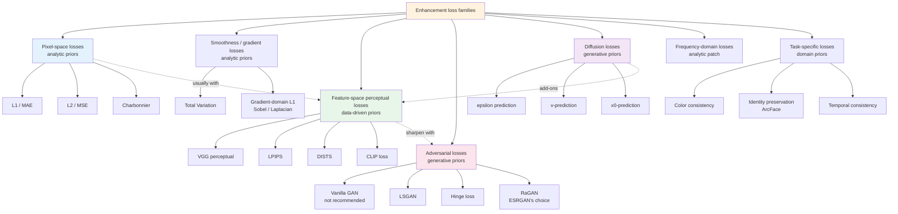
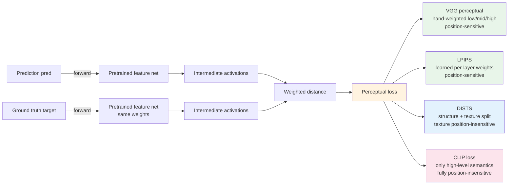
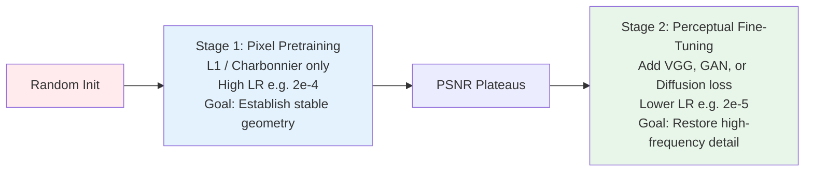

# Chapter 3 · The Loss Function Landscape

> Objective functions in image restoration are almost never singular. Understanding why composite losses are necessary (and how to balance their competing gradients) forms the core of modern restoration engineering.

## 3.0 Before Reading This Chapter

Chapter 2 framed restoration systems across three operational spaces: the prediction space, the loss evaluation space, and the validation space. This chapter focuses directly on the second dimension: when optimizing a restoration network, what mathematical objectives compose the aggregate scalar loss, what structural priors does each term enforce, and why can no single objective function succeed in isolation?

By the end of this chapter, you will understand:

- Why $L_2$ (MSE) is mathematically tractable yet consistently underperforms $L_1$ in visual restoration.
- The mathematical formulation of Charbonnier loss and why it serves as the standard baseline in modern regression networks.
- The operational boundaries separating perceptual, adversarial, and diffusion objective formulations.
- Practical heuristic weightings for multi-loss combinations across standard restoration tasks.
- How to diagnose optimization pathologies by monitoring per-loss training dynamics.

**Prerequisites.** Familiarity with the representation spaces covered in Chapter 2. Basic familiarity with Gaussian and Laplacian maximum likelihood estimation provides useful intuition for understanding the geometric behaviors of $L_1$ and $L_2$ penalties.

**Key Terminology Introduced in This Chapter:**

- **MSE** (Mean Squared Error): The $L_2$ norm on spatial error residuals.
- **MAE** (Mean Absolute Error): The $L_1$ norm on spatial error residuals.
- **TV** (Total Variation): A spatial regularization penalty on neighboring pixel differences that encourages piecewise smoothness.
- **GAN** (Generative Adversarial Network): Minimax optimization pitting a generator against a discriminator network.
- **LSGAN** (Least Squares GAN): Formulates adversarial objectives as squared error regressions to stabilize gradient flow.
- **Hinge Loss**: A margin-based adversarial loss that truncates discriminator updates once classification margins are satisfied.
- **RaGAN** (Relativistic Average GAN): Formulates discriminator judgments relative to batch expectations; popularized by ESRGAN.
- **$R_1$ / $R_2$ Regularization**: Zero-centered gradient penalties on real or synthetic data to enforce local discriminator Lipschitz continuity.
- **TTUR** (Two-Time-Scale Update Rule): Assigns asymmetrical learning rates to the generator and discriminator.
- **FFL** (Focal Frequency Loss): A frequency-domain objective dynamically weighting hard-to-reconstruct spatial frequencies.
- **SNR** (Signal-to-Noise Ratio): Quantifies noise schedules across diffusion timesteps.
- **CLIP Loss**: Measures semantic alignment in multimodal embedding space.
- **ArcFace**: Deep face recognition embeddings used to supervise facial identity preservation.

## 3.1 Why Multi-Objective Losses are Essential

In large language modeling or visual classification, training typically minimizes a single objective: cross-entropy.

Image restoration differs fundamentally. In contemporary literature, objective formulations typically combine multiple terms:

$$
\mathcal{L} = \lambda_1 \mathcal{L}_{\text{pixel}} + \lambda_2 \mathcal{L}_{\text{perceptual}} + \lambda_3 \mathcal{L}_{\text{adversarial}} + \lambda_4 \mathcal{L}_{\text{task}}
$$

This composite formulation directly addresses the ill-posed nature of inverse problems:

- Each loss term enforces a distinct mathematical prior on candidate solutions.
- Individual loss formulations operate across distinct spatial frequency bands ($L_2$ prioritizes low frequencies, adversarial losses enforce high frequencies, and perceptual losses supervise mid-to-high structural frequencies).
- Unconstrained single-loss objectives produce characteristic failure modes ($L_2$ yields blurry textures, unregularized GAN losses generate synthetic hallucinations, and standalone perceptual losses induce chromatic drift).

Connecting this to the prior taxonomy established in Chapter 1:
- Pixel-level $L_1/L_2$ and Total Variation represent **analytic priors** (assuming natural images are spatially coherent and exhibit sparse local gradients).
- Perceptual losses provide **data-driven priors** (enforcing alignment within the feature spaces of pretrained networks like VGG or CLIP).
- Adversarial and diffusion objectives provide **generative priors** (constraining reconstructions to the learned data distribution of natural imagery).

A critical engineering principle follows: **before introducing an auxiliary loss term, determine its underlying prior and ensure it does not conflict with existing objectives**. For example, aggressively weighting a Total Variation loss (which enforces spatial smoothness) alongside a GAN loss (which encourages high-frequency texture synthesis) creates conflicting optimization gradients, yielding artifacts with sharp boundaries but smoothed textures.

> Training an image restoration model is not merely minimizing distance to a single ground truth; it is finding a Pareto-optimal operating point across competing visual and fidelity objectives.
>
> Loss weighting explicitly defines the model's position along the perception-distortion boundary.

In single-objective settings, optimization progress is monotonic: a decreasing loss indicates improved performance. In multi-objective restoration, optimization forms a partial order: one loss term may decrease while another increases. Consequently, training monitoring requires tracking each component independently rather than relying on an aggregate scalar.



## 3.2 Pixel-Space Loss Formulations

Pixel-space objectives penalize element-wise differences between output $\hat{x}$ and ground truth $x$.

### $L_2$ Loss (MSE): Mathematically Convenient, Perceptually Sub-Optimal

$$
\mathcal{L}_2 = \frac{1}{N} \sum_i (\hat{x}_i - x_i)^2
$$

Mathematical properties:
- Represents the maximum likelihood estimator under an additive white Gaussian noise assumption: assuming observation $y \sim \mathcal{N}(\hat{x}, \sigma^2 I)$, log-likelihood maximization reduces directly to minimizing the squared $L_2$ norm.
- Everywhere differentiable, smooth, and convex.
- Monotonically related to Peak Signal-to-Noise Ratio (PSNR).

Engineering limitations:
- **Sensitivity to Outliers**: Extreme pixel errors are squared, causing isolated corrupted pixels to dominate gradient updates.
- **Regression to the Mean**: For ill-posed mappings, the optimal minimizer of $\mathbb{E}[\|\hat{x} - x\|_2^2]$ is the conditional expectation $\mathbb{E}[x \mid y]$ (the arithmetic mean over all plausible solutions), which manifests visually as severe spatial blur.
- **Perceptual Misalignment**: Unweighted coordinate summation ignores spatial masking and contrast sensitivity in human vision.

In modern pipelines, $L_2$ optimization is generally restricted to:
1. **Diffusion Model Score Matching**: Where Gaussian noise schedules mathematically dictate an $L_2$ objective.
2. **Controlled Baseline Ablations**.

In diffusion frameworks, $L_2$ loss does not produce blurry outputs because denoising is performed iteratively across small noise increments, avoiding single-step conditional mean collapse.

### $L_1$ Loss (MAE): The Standard Regression Baseline

$$
\mathcal{L}_1 = \frac{1}{N} \sum_i |\hat{x}_i - x_i|
$$

Mathematical properties:
- Represents the maximum likelihood estimator under a Laplacian noise distribution.
- Non-differentiable at the origin (implemented numerically using subgradient sign formulations).
- **Robust to Outliers**: Gradient magnitude remains constant ($|\text{error}| \to 1$) regardless of error scale.

Visual impact: Reconstructions trained under $L_1$ exhibit noticeably sharper edge transitions than those trained under $L_2$. The minimizer of $\mathbb{E}[\|\hat{x} - x\|_1]$ corresponds to the conditional median $\text{median}(x \mid y)$, preserving distinct structural hypotheses rather than averaging them.

### Charbonnier Loss: Differentiable Smooth $L_1$

$$
\mathcal{L}_{\text{Charb}} = \frac{1}{N} \sum_i \sqrt{(\hat{x}_i - x_i)^2 + \epsilon^2}
$$

The parameter $\epsilon$ is typically set to $10^{-3}$ or $10^{-6}$. When $|e| \gg \epsilon$, the function approaches pure $L_1$; when $|e| \ll \epsilon$, it transitions smoothly into quadratic $L_2$ behavior.

Why Charbonnier is preferred over standard $L_1$:
- Standard $L_1$ maintains constant $\pm 1$ gradient steps near zero error, which can cause oscillations during the final stages of optimization.
- Charbonnier smoothly attenuates gradients near zero error, improving numerical stability.

```python
import torch

def charbonnier_loss(pred: torch.Tensor, target: torch.Tensor,
                      eps: float = 1e-3) -> torch.Tensor:
    """Charbonnier loss: a smooth, differentiable approximation of L1 loss.
    Provides robust outlier handling with stable gradient attenuation near zero.
    """
    diff = pred - target
    return torch.sqrt(diff * diff + eps * eps).mean()
```

Comparing the gradient dynamics of $L_2$, $L_1$, and Charbonnier across error magnitudes $e$:
- **$|e| \ll 1$**: $L_2$ gradient ($2e$) vanishes; $L_1$ gradient remains $\pm 1$; Charbonnier gradient scales smoothly as $e/\epsilon$.
- **$|e| \approx 1$**: All three objectives produce comparable gradient magnitudes.
- **$|e| \gg 1$**: $L_2$ gradient ($2e$) grows linearly (vulnerable to outlier explosion); $L_1$ and Charbonnier gradients saturate at $\pm 1$.

Charbonnier combines the outlier robustness of $L_1$ at large errors with the numerical stability of $L_2$ near convergence, making it the preferred default regression loss in architectures such as Restormer, NAFNet, and SwinIR.

## 3.3 Spatial Gradient and Smoothness Formulations

While pixel losses evaluate isolated coordinates, gradient-domain losses constrain spatial relationships across neighboring pixels.

### Total Variation (TV) Regularization

$$
\mathcal{L}_{\text{TV}} = \sum_{i,j} \left( |\hat{x}_{i+1,j} - \hat{x}_{i,j}| + |\hat{x}_{i,j+1} - \hat{x}_{i,j}| \right)
$$

Total Variation penalizes spatial high-frequency variance, encouraging **piecewise smooth reconstructions** with sharp structural discontinuities and uniform flat regions.

```python
def total_variation_loss(x: torch.Tensor) -> torch.Tensor:
    """Anisotropic Total Variation loss.
    x: (B, C, H, W)
    """
    dh = (x[:, :, 1:, :] - x[:, :, :-1, :]).abs().mean()
    dw = (x[:, :, :, 1:] - x[:, :, :, :-1]).abs().mean()
    return dh + dw
```

Operational use cases:
- **Denoising Pipelines**: Suppresses residual high-frequency sensor noise.
- **Generative Artifact Suppression**: Mitigates high-frequency checkerboard artifacts produced by GAN or diffusion decoders in homogeneous regions.
- **Weight Calibration**: Kept small ($\lambda_{\text{TV}} \in [10^{-5}, 10^{-3}]$); excessive weighting causes over-smoothing across fine textures.

TV formulations split into **anisotropic** (independent horizontal and vertical differences) and **isotropic** (Euclidean gradient magnitude $\sqrt{(\Delta_x)^2 + (\Delta_y)^2}$). Anisotropic TV aligns well with rectilinear structures (such as text documents and architecture), whereas isotropic TV produces more natural transitions in organic regions (such as skin tones and sky gradients).

### Gradient-Domain Reconstruction Loss

Rather than regularizing output smoothness, gradient losses explicitly supervise high-frequency edge alignment against ground-truth targets:

$$
\mathcal{L}_{\text{grad}} = \|\nabla \hat{x} - \nabla x\|_1
$$

```python
import torch.nn.functional as F

SOBEL_X = torch.tensor([[-1., 0., 1.],
                        [-2., 0., 2.],
                        [-1., 0., 1.]]).view(1, 1, 3, 3)
SOBEL_Y = SOBEL_X.transpose(-1, -2)

def gradient_loss(pred: torch.Tensor, target: torch.Tensor) -> torch.Tensor:
    """Gradient-domain L1 loss enforcing edge alignment via Sobel operators.
    pred, target: (B, C, H, W) in range [0, 1]
    """
    sobel_x = SOBEL_X.to(pred).expand(pred.shape[1], 1, 3, 3)
    sobel_y = SOBEL_Y.to(pred).expand(pred.shape[1], 1, 3, 3)

    pred_gx = F.conv2d(pred, sobel_x, padding=1, groups=pred.shape[1])
    pred_gy = F.conv2d(pred, sobel_y, padding=1, groups=pred.shape[1])
    targ_gx = F.conv2d(target, sobel_x, padding=1, groups=target.shape[1])
    targ_gy = F.conv2d(target, sobel_y, padding=1, groups=target.shape[1])

    return (pred_gx - targ_gx).abs().mean() + (pred_gy - targ_gy).abs().mean()
```

First-order Sobel operators are directional and sensitive to edge orientation, whereas second-order Laplacian operators are isotropic. Multi-scale gradient losses (evaluating gradient errors across Gaussian pyramid decompositions) help align structural edges across large scale factors ($4\times$ to $8\times$).

## 3.4 Feature-Space Perceptual Formulations

As introduced in Chapter 2, perceptual losses measure differences across intermediate feature representations extracted by pretrained neural networks:



### LPIPS (Learned Perceptual Image Patch Similarity)

LPIPS (Zhang et al., 2018) calibrates intermediate deep feature distances against empirical human perceptual judgments:
1. Extracts multi-layer activations using fixed backbones (AlexNet, VGG, or SqueezeNet).
2. Applies learned linear channel weights calibrated on the BAPPS perceptual dataset.
3. Computes normalized spatial distance across weighted activations.

While LPIPS serves as a standard **evaluation metric**, caution is required when using it as a primary training loss:
- The learned calibration weights can be vulnerable to adversarial exploitation, causing networks to generate high-frequency artifacts that minimize LPIPS scores without improving visual quality.
- For stable training supervision, classical multi-layer VGG loss remains widely used, while LPIPS is reserved for validation and evaluation.

### DISTS (Deep Image Structure and Texture Similarity)

DISTS (Ding et al., 2020) decouples structural representations from stochastic texture variations. It measures spatial correlation for structural fidelity while evaluating global feature statistics for texture similarity, making it less sensitive to minor spatial translations in repetitive textures (such as grass, hair, or woven textiles).

### CLIP Semantic Alignment Loss

Projecting reconstructions and reference images into CLIP embedding space measures semantic consistency:

$$
\mathcal{L}_{\text{CLIP}} = 1 - \cos\left(E_{\text{CLIP}}(\hat{x}), \, E_{\text{CLIP}}(x)\right)
$$

CLIP loss ignores localized pixel alignment, focusing instead on high-level semantic identity. In generative diffusion restoration, assigning a small weight ($\lambda_{\text{CLIP}} \approx 0.01$) prevents semantic drift (such as altering subject characteristics or misidentifying fine structures).

## 3.5 Adversarial Loss Formulations

Adversarial training forces generators to synthesize sharp high-frequency distributions, bypassing the conditional-mean blurring inherent in $L_1/L_2$ regression.

### Vanilla Minimax GAN: Unstable for Restoration

The standard zero-sum objective:

$$
\min_G \max_D \mathbb{E}_{x \sim p_{\text{data}}} [\log D(x)] + \mathbb{E}_{z \sim p_z} [\log(1 - D(G(z)))]
$$

This formulation suffers from gradient saturation when the discriminator dominates early in training, often leading to optimization instability or mode collapse. Modern restoration systems avoid vanilla minimax objectives in favor of stabilized alternatives.

### LSGAN (Least Squares GAN): Stable Quadratic Formulation

Replacing logarithmic classification objectives with least-squares regression maintains smooth gradients across the discriminator boundary:

$$
\mathcal{L}_D = \frac{1}{2}\mathbb{E}[(D(x) - 1)^2] + \frac{1}{2}\mathbb{E}[(D(G(z)))^2]
$$
$$
\mathcal{L}_G = \frac{1}{2}\mathbb{E}[(D(G(z)) - 1)^2]
$$

### Hinge Loss: The Standard in Modern Generative Modeling

Hinge loss introduces a margin boundary, halting gradient updates on samples that are already well-separated:

$$
\mathcal{L}_D = -\mathbb{E}[\min(0, D(x) - 1)] - \mathbb{E}[\min(0, -D(G(z)) - 1)]
$$
$$
\mathcal{L}_G = -\mathbb{E}[D(G(z))]
$$

```python
def hinge_d_loss(d_real: torch.Tensor, d_fake: torch.Tensor) -> torch.Tensor:
    """Hinge loss for discriminator updates."""
    loss_real = F.relu(1.0 - d_real).mean()
    loss_fake = F.relu(1.0 + d_fake).mean()
    return loss_real + loss_fake

def hinge_g_loss(d_fake: torch.Tensor) -> torch.Tensor:
    """Hinge loss for generator updates."""
    return -d_fake.mean()
```

### Relativistic Average GAN (RaGAN): The ESRGAN Benchmark

ESRGAN (Wang et al., 2018) utilizes Relativistic Average GANs. Rather than predicting whether an input is unconditionally real or fake, the discriminator predicts the relative probability that real data is more realistic than synthetic data:

$$
D_{\text{Ra}}(x_r, x_f) = \sigma\left(D(x_r) - \mathbb{E}[D(x_f)]\right)
$$
$$
D_{\text{Ra}}(x_f, x_r) = \sigma\left(D(x_f) - \mathbb{E}[D(x_r)]\right)
$$

```python
def relativistic_d_loss(d_real: torch.Tensor, d_fake: torch.Tensor) -> torch.Tensor:
    """RaGAN discriminator objective."""
    real_logits = d_real - d_fake.mean()
    fake_logits = d_fake - d_real.mean()
    return (F.binary_cross_entropy_with_logits(real_logits, torch.ones_like(real_logits))
          + F.binary_cross_entropy_with_logits(fake_logits, torch.zeros_like(fake_logits)))

def relativistic_g_loss(d_real: torch.Tensor, d_fake: torch.Tensor) -> torch.Tensor:
    """RaGAN generator objective. Ensure discriminator gradients are detached during the G step."""
    real_logits = d_real - d_fake.mean()
    fake_logits = d_fake - d_real.mean()
    return (F.binary_cross_entropy_with_logits(fake_logits, torch.ones_like(fake_logits))
          + F.binary_cross_entropy_with_logits(real_logits, torch.ones_like(real_logits)))
```

### PatchGAN Discriminators

Operating discriminators over local spatial patches rather than collapsing entire images into a single scalar provides localized gradient feedback:

- Supervises local structural realism across sliding receptive fields (e.g., $70 \times 70$ pixel windows).
- Supports variable input resolutions during inference.
- Provides spatially distributed gradients that stabilize generator updates.

```python
class PatchDiscriminator(nn.Module):
    """PatchGAN discriminator providing localized receptive field supervision."""
    def __init__(self, in_ch: int = 3, base_ch: int = 64):
        super().__init__()
        layers = [
            nn.Conv2d(in_ch, base_ch, 4, stride=2, padding=1),
            nn.LeakyReLU(0.2, inplace=True),
        ]
        chs = [base_ch, base_ch * 2, base_ch * 4, base_ch * 8]
        for i in range(len(chs) - 1):
            stride = 2 if i < 2 else 1
            layers += [
                nn.Conv2d(chs[i], chs[i+1], 4, stride=stride, padding=1),
                nn.GroupNorm(8, chs[i+1]),
                nn.LeakyReLU(0.2, inplace=True),
            ]
        layers.append(nn.Conv2d(chs[-1], 1, 4, stride=1, padding=1))
        self.model = nn.Sequential(*layers)

    def forward(self, x: torch.Tensor) -> torch.Tensor:
        return self.model(x)
```

### Regularization Techniques for Adversarial Stability

- **Spectral Normalization**: Bounds the Lipschitz constant of discriminator layers by dividing weight matrices by their largest singular value.
- **$R_1$ Gradient Penalty**: Penalizes the squared gradient norm on real data distributions:

$$
\mathcal{L}_{R1} = \frac{\gamma}{2} \mathbb{E}_{x \sim p_{\text{data}}} \left[ \|\nabla_x D(x)\|^2 \right]
$$

- **Two-Time-Scale Update Rule (TTUR)**: Stabilizes training dynamics by configuring asymmetrical learning rates (typically setting $\eta_D \approx 2\times\text{ to }4\times \eta_G$).

## 3.6 Diffusion Loss Formulations

Diffusion optimization operates under a distinct probabilistic framework derived from denoising score matching:

### Noise Prediction ($\epsilon$-Prediction)

The standard DDPM objective trains a network $\epsilon_\theta$ to predict the synthetic noise injected at timestep $t$:

$$
\mathcal{L}_{\text{simple}} = \mathbb{E}_{t, x_0, \epsilon} \left[ \|\epsilon - \epsilon_\theta(x_t, t)\|^2 \right]
$$

```python
def diffusion_simple_loss(model, x0, t, noise_scheduler):
    """Standard epsilon-prediction diffusion objective."""
    noise = torch.randn_like(x0)
    sqrt_alpha = noise_scheduler.sqrt_alphas_cumprod[t].view(-1, 1, 1, 1)
    sqrt_one_minus_alpha = noise_scheduler.sqrt_one_minus_alphas_cumprod[t].view(-1, 1, 1, 1)
    x_t = sqrt_alpha * x0 + sqrt_one_minus_alpha * noise
    pred_noise = model(x_t, t)
    return F.mse_loss(pred_noise, noise)
```

### Velocity Prediction ($v$-Prediction)

In low-noise regimes (small $t$), the target noise $\epsilon$ has minimal residual variance, leading to poor signal-to-noise ratios. Velocity prediction ($v$-prediction; Salimans & Ho, 2022) addresses this by parameterizing the target as a linear combination of signal and noise:

$$
v_t = \sqrt{\bar{\alpha}_t} \cdot \epsilon - \sqrt{1 - \bar{\alpha}_t} \cdot x_0
$$

This parameterization maintains consistent numerical scaling across all timesteps $t \in [0, T]$, providing stable training dynamics across both base generation and restoration tasks.

### Direct Ground-Truth Prediction ($x_0$-Prediction)

Restoration models can also directly parameterize outputs to predict the clean signal $x_0$. While intuitive for inverse problems, direct $x_0$-prediction exhibits high variance at large timesteps $t \approx T$ (where $x_t$ is dominated by Gaussian noise). Consequently, $x_0$-prediction is typically paired with Min-SNR loss weighting.

### Min-SNR Loss Weighting

Standard uniform timestep sampling can over-index on steps that provide minimal gradient signal. Min-SNR weighting (Hang et al., 2023) rebalances loss contributions across timesteps:

$$
w(t) = \frac{\min\left(\text{SNR}(t), \gamma\right)}{\text{SNR}(t)}, \quad \text{where } \text{SNR}(t) = \frac{\bar{\alpha}_t}{1 - \bar{\alpha}_t}
$$

Setting the clamping threshold $\gamma = 5$ prevents high-SNR steps (small $t$) from dominating parameter updates, focusing optimization on intermediate timesteps that govern structural formation.

```python
import torch

def min_snr_weight(t: torch.Tensor, alphas_cumprod: torch.Tensor,
                    gamma: float = 5.0) -> torch.Tensor:
    """Computes Min-SNR loss weights across timesteps."""
    a = alphas_cumprod[t]
    snr = a / (1.0 - a).clamp(min=1e-8)
    return snr.clamp(max=gamma) / snr
```

## 3.7 Frequency-Domain Loss Formulations

Because natural images exhibit an energy spectrum that decays proportionally to $1/f^2$, standard spatial losses are heavily dominated by low-frequency errors. Frequency-domain losses compute penalties directly in the Fourier domain to supervise high-frequency reconstruction.

### Focal Frequency Loss (FFL)

Focal Frequency Loss (Jiang et al., 2021) computes orthogonal 2D discrete Fourier transforms and dynamically scales penalties using a frequency-dependent focal weight:

```python
import torch

def focal_frequency_loss(pred: torch.Tensor, target: torch.Tensor,
                          alpha: float = 1.0) -> torch.Tensor:
    """Focal Frequency Loss: computes dynamic frequency-weighted L2 loss in Fourier space.
    pred, target: (B, C, H, W)
    """
    pred_fft   = torch.fft.fft2(pred,   norm='ortho')
    target_fft = torch.fft.fft2(target, norm='ortho')

    diff = pred_fft - target_fft
    distance = (diff.real ** 2 + diff.imag ** 2)

    # Dynamic focal weighting: under-reconstructed frequencies receive larger weights
    weight = distance.detach() ** alpha
    weight = weight / (weight.max() + 1e-8)

    return (weight * distance).mean()
```

Applying FFL as an auxiliary regularizer ($\lambda_{\text{FFL}} \in [0.05, 0.1]$) helps restore fine, repetitive textures in high-scaling super-resolution without requiring heavy adversarial objectives.

## 3.8 Task-Specific Objective Formulations

Specialized restoration tasks often incorporate domain-specific constraints:

### Chromatic and Tone Consistency

In deep GAN or diffusion pipelines, models can introduce global chromatic shifts to artificially enhance local contrast. Low-frequency spatial blurring isolates color distribution from high-frequency details, regularizing tone fidelity:

```python
def color_consistency_loss(pred: torch.Tensor, target: torch.Tensor) -> torch.Tensor:
    """Low-pass filtered L1 loss penalizing global color drift without constraining fine textures."""
    pred_blur   = F.avg_pool2d(pred,   kernel_size=11, stride=1, padding=5)
    target_blur = F.avg_pool2d(target, kernel_size=11, stride=1, padding=5)
    return F.l1_loss(pred_blur, target_blur)
```

### Facial Identity Preservation

Facial restoration models (such as GFPGAN and CodeFormer) enforce identity preservation by minimizing cosine distance across embeddings extracted from pretrained face recognition backbones (e.g., ArcFace):

```python
class IdentityLoss(nn.Module):
    """Facial identity preservation loss based on pretrained ArcFace embeddings."""
    def __init__(self, arcface_model: nn.Module):
        super().__init__()
        self.arcface = arcface_model.eval()
        for p in self.arcface.parameters():
            p.requires_grad_(False)

    def forward(self, pred: torch.Tensor, target: torch.Tensor) -> torch.Tensor:
        emb_pred   = self.arcface(pred)
        emb_target = self.arcface(target)
        return 1.0 - F.cosine_similarity(emb_pred, emb_target).mean()
```

### Additional Task Constraints
- **Temporal Consistency (Video)**: Penalizes optical-flow warping errors across adjacent predicted frames (detailed in Chapter 13).
- **Document Edge Binarization**: Enforces gradient sharpness on character boundaries to improve downstream OCR accuracy.
- **Logarithmic Radiance Preservation (HDR)**: Computes losses across tone-mapped log domains to prevent highlight clipping.

## 3.9 Multi-Loss Mixing and Optimization Dynamics

Balancing multiple loss terms requires carefully managing gradient magnitudes and optimization schedules.

### Reference Objective Formulations

**Classical ESRGAN**:
$$
\mathcal{L}_G = 1.0 \cdot \mathcal{L}_1 + 1.0 \cdot \mathcal{L}_{\text{percep}} + 0.005 \cdot \mathcal{L}_{\text{RaGAN}}
$$

**Real-ESRGAN**:
$$
\mathcal{L}_G = 1.0 \cdot \mathcal{L}_1 + 1.0 \cdot \mathcal{L}_{\text{percep}} + 0.1 \cdot \mathcal{L}_{\text{adv}}
$$
(The adversarial weight is increased to $0.1$ to handle complex second-order synthetic degradations).

**Modern Generative Diffusion (e.g., SUPIR)**:
$$
\mathcal{L} = \mathcal{L}_{v\text{-pred}} + 0.1 \cdot \mathcal{L}_{\text{latent-LPIPS}} + 0.1 \cdot \mathcal{L}_{\text{pixel-L1}} + 0.01 \cdot \mathcal{L}_{\text{CLIP}}
$$

### The Two-Stage Training Curriculum

A common implementation failure is **enabling all loss terms simultaneously from random initialization**. Early in training, noisy adversarial and perceptual gradients can destabilize the generator, preventing convergence.

Production pipelines typically adopt a **two-stage training curriculum**:

1. **Stage 1 (Pixel Pretraining)**: Optimize exclusively using pixel regression (Charbonnier or $L_1$) until PSNR converges. This establishes stable global geometry and structural layout.
2. **Stage 2 (Adversarial / Perceptual Fine-Tuning)**: Initialize the generator from Stage 1 checkpoints, reduce the base learning rate by approximately $5\times\text{ to }10\times$, and gradually ramp up perceptual and adversarial loss weights.



### Diagnostic Guide for Multi-Loss Training

| Observed Training Pathology | Probable Root Cause | Recommended Corrective Action |
|-----------------------------|---------------------|-------------------------------|
| Pixel loss drops consistently while perceptual loss stagnates | Model is collapsing toward smooth conditional averages | Increase perceptual loss weight ($\lambda_{\text{percep}}$) |
| Adversarial loss oscillates with expanding variance | Discriminator is either overpowering or lagging the generator | Apply spectral normalization to $D$, adjust learning rate ratios via TTUR |
| Early training divergence upon enabling GAN loss | Initialized adversarial training without stable pixel pretraining | Pretrain with $L_1$ baseline before introducing adversarial objectives |
| Perceptual loss decreases initially, then degrades visual quality | Optimization is finding adversarial patterns in the VGG feature extractor | Incorporate LPIPS regularizers or reduce VGG loss weighting |
| Systematic chromatic drift across validation samples | Lack of low-frequency chromatic regularization | Introduce low-pass filtered color consistency loss |
| Stagnant FID scores despite decreasing LPIPS | Reconstructions lack textural diversity | Verify degradation augmentations and increase adversarial weighting |

## 3.10 Practical Loss Selection Guide

The table below provides recommended initial loss configurations across standard tasks (weights should be fine-tuned based on target data distributions and model capacity):

| Task Domain | Primary Objective | Auxiliary Objectives | Architectural Paradigm |
|-------------|-------------------|----------------------|------------------------|
| Benchmark Super-Resolution | Charbonnier Loss | None | Distortion-oriented (HAT / NAFNet) |
| Real-World Super-Resolution | $L_1$ + VGG Perceptual + RaGAN | $+ 0.05 \text{ FFL}$ | Perception-oriented (Real-ESRGAN) |
| Image Denoising | Charbonnier Loss | $+ 10^{-3} \text{ TV}$ | Distortion-oriented (Restormer) |
| Motion Deblurring | Charbonnier + Sobel Gradient | $+ \text{VGG Perceptual}$ | Multi-scale structural |
| Blind Face Restoration | $L_1$ + VGG + Hinge GAN + ArcFace | None | Prior-guided (CodeFormer) |
| Latent Diffusion Restoration | $v$-prediction MSE | $+ \text{Latent LPIPS} + \text{CLIP}$ | Generative (SUPIR / DiffBIR) |
| Video Super-Resolution | Charbonnier + VGG Perceptual | $+ \text{Temporal Flow Alignment}$ | Recurrent propagation (BasicVSR++) |
| Video Frame Interpolation | Charbonnier + Laplacian Pyramid | $+ \text{Bi-directional Flow Loss}$ | Motion estimation (RIFE) |

Practical tuning sequence when building a new restoration pipeline:
1. Establish a stable baseline using **Charbonnier or $L_1$ pixel regression**.
2. Introduce **VGG perceptual supervision** ($\lambda \approx 0.1$) to sharpen mid-frequency structures.
3. Introduce **adversarial supervision** ($\lambda \approx 0.005\text{ to }0.1$) with a warmed-up schedule to synthesize realistic high-frequency textures.
4. Apply targeted regularizers as needed: **FFL** for high-frequency patterns, **color consistency** for chromatic drift, or **ArcFace** for facial identity.

## 3.11 Chapter Summary

1. **Composite Objective Design**: Real-world restoration relies on multi-loss formulations to balance analytical, data-driven, and generative priors.
2. **Regression Objectives**: Charbonnier loss combines the outlier robustness of $L_1$ with the smooth convergence of $L_2$, serving as a robust default for pixel regression.
3. **Perceptual Supervision**: Multi-layer VGG activations penalize structural discrepancies, while LPIPS provides an effective evaluation metric.
4. **Adversarial Objectives**: Stabilized GAN formulations (RaGAN and Hinge loss paired with PatchGAN discriminators) drive high-frequency texture synthesis.
5. **Diffusion Objectives**: Parameterized via $\epsilon$, $v$, or $x_0$ score-matching formulations, balanced across noise levels using Min-SNR weighting.
6. **Curriculum Strategy**: Two-stage optimization (pixel pretraining followed by adversarial/perceptual fine-tuning) is essential for stable GAN convergence.

---

> Next: [Pitfalls of Evaluation Metrics](04-metrics.md) explores the mathematical limitations of PSNR, SSIM, LPIPS, and FID, and explains why objective metrics can conflict with human visual perception.
