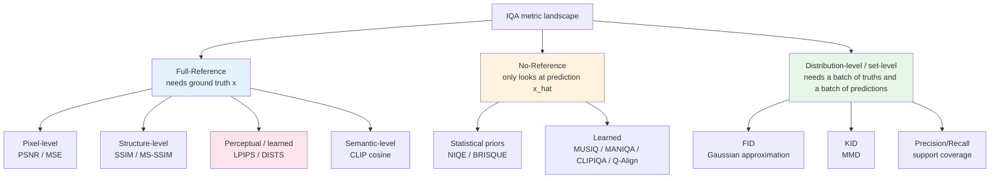
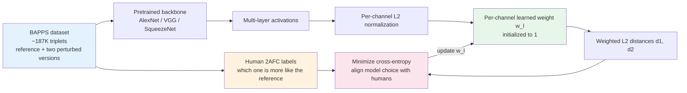
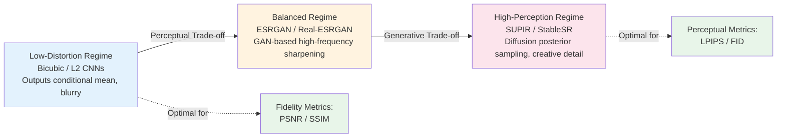

# Chapter 4 · Pitfalls of Image Quality Assessment

> In image restoration, an uncomfortable reality persists: **mathematical evaluation metrics frequently conflict with human visual perception**.
>
> This discrepancy does not stem from compromised benchmarking: standard objective metrics possess structural and statistical biases by design.

## 4.0 Before Reading This Chapter

Chapter 3 explored objective loss functions used to guide optimization during training. This chapter examines the subsequent phase: evaluating reconstruction fidelity after convergence. While objective losses must remain strictly differentiable to provide tractable gradients, evaluation metrics require only deterministic computation, focusing on alignment with human visual judgment.

The primary objective of this chapter is to explain why **numerical metrics and visual impressions systematically diverge** in low-level vision, and to establish rigorous evaluation protocols for production systems.

By the end of this chapter, you will understand:

- Why baseline bicubic upsampling can outperform GAN-based models on PSNR and SSIM while producing visibly blurred outputs.
- The operational trade-offs governing Full-Reference (FR) and No-Reference (NR) evaluation paradigms.
- The architectural and data-driven differences distinguishing LPIPS from classical VGG perceptual distances.
- Sample complexity requirements for Fréchet Inception Distance (FID) and why low-sample evaluations yield misleading results.
- How to detect selective metric reporting in restoration literature.

**Prerequisites.** Familiarity with the ill-posed mathematical framing from Chapter 1, the representation spaces analyzed in Chapter 2, and the high-frequency generative dynamics introduced in Chapter 3.

**Key Terminology Introduced in This Chapter:**

- **FR-IQA** (Full-Reference Image Quality Assessment): Evaluates reconstructed outputs against paired ground-truth targets.
- **NR-IQA** (No-Reference Image Quality Assessment): Assesses structural and perceptual quality directly from candidate images without reference targets.
- **RR-IQA** (Reduced-Reference IQA): Computes quality metrics using partial statistical summaries of ground-truth signals.
- **MS-SSIM** (Multi-Scale Structural Similarity): Evaluates structural correlation across Gaussian pyramid scales.
- **BAPPS** (Berkeley-Adobe Perceptual Patch Similarity Dataset): Human perceptual preference benchmark used to calibrate LPIPS channel weights.
- **2AFC** (Two-Alternative Forced Choice): A psychophysical protocol where human evaluators select the more realistic or faithful of two candidate outputs.
- **MOS** (Mean Opinion Score): Arithmetic mean of subjective human ratings on numerical quality scales (e.g., 1 to 5).
- **FID** (Fréchet Inception Distance): Measures Wasserstein-2 distance between Gaussian-approximated Inception-v3 feature distributions.
- **KID** (Kernel Inception Distance): Evaluates distribution divergence via Maximum Mean Discrepancy (MMD); offers lower variance on small sample sizes.
- **NIQE / BRISQUE**: Classical no-reference metrics evaluating deviations from natural scene statistical regularities.
- **MUSIQ / MANIQA / Q-Align**: Modern transformer-based and vision-language no-reference quality evaluators.



## 4.1 The Metric Contradiction

Consider a $4\times$ super-resolution task evaluated across three distinct algorithmic paradigms:
- **Model A**: Bicubic interpolation (baseline spatial filtering).
- **Model B**: ESRGAN (classical GAN-based super-resolution).
- **Model C**: SUPIR (generative latent diffusion model).

Evaluating these models yields the following benchmark results:

| Model Architecture | PSNR (dB) ↑ | SSIM ↑ | LPIPS ↓ | FID ↓ | Human Visual Assessment |
|-------------------|-------------|--------|---------|-------|-------------------------|
| A. Bicubic Baseline | **28.4** | **0.82** | 0.42 | 78 | Uniformly smoothed; lacks edge definition |
| B. ESRGAN (GAN) | 26.1 | 0.76 | 0.18 | 22 | Sharp edge boundaries with minor artifacts |
| C. SUPIR (Diffusion) | 24.8 | 0.71 | **0.12** | **8** | Rich, plausible high-frequency textures |

This creates an apparent contradiction:
- **PSNR and SSIM rank the bicubic baseline highest**, despite its severe loss of high-frequency detail.
- **LPIPS and FID rank the diffusion model highest**, despite its lower pixel-level alignment to the exact ground truth.
- **No single model dominates across all metrics simultaneously.**

This divergence is an inevitable theoretical consequence of optimizing for fidelity versus perceptual realism, as formalized in Section 4.8.

## 4.2 Peak Signal-to-Noise Ratio (PSNR)

PSNR remains the historical benchmark metric in low-level vision, originating in telecommunications and video coding standards:

$$
\text{PSNR}(\hat{x}, x) = 10 \log_{10} \left( \frac{\text{MAX}^2}{\text{MSE}(\hat{x}, x)} \right)
$$

Where $\text{MAX}$ is the maximum possible pixel luminance (e.g., $1.0$ for normalized floating-point tensors, or $255$ for 8-bit channels), and $\text{MSE} = \frac{1}{N} \|\hat{x} - x\|_2^2$.

```python
import torch

def psnr(pred: torch.Tensor, target: torch.Tensor,
         data_range: float = 1.0) -> torch.Tensor:
    """Computes Peak Signal-to-Noise Ratio (PSNR) in decibels (dB).
    pred, target: (B, C, H, W) normalized in [0, data_range]
    Returns: (B,) scalar PSNR values
    """
    mse = ((pred - target) ** 2).flatten(1).mean(dim=1)
    return 10 * torch.log10((data_range ** 2) / (mse + 1e-12))
```

### What PSNR Measures

PSNR evaluates coordinate-wise $L_2$ Euclidean distance, representing the maximum likelihood signal-to-noise ratio under the assumption of independent and identically distributed (i.i.d.) Gaussian errors.

### Structural Blind Spots of PSNR

PSNR operates independently of human visual system (HVS) characteristics:
1. **Spatial Invariance**: A 1-pixel global translation across an image causes negligible perceptual change to human observers, but induces massive coordinate-wise $L_2$ errors that cause PSNR to collapse.
2. **Smoothing Bias**: Consider a sharp ground truth containing fine hair textures. Model 1 reconstructs these textures with a slight phase shift, while Model 2 applies Gaussian blur to suppress variance entirely. Model 2 frequently achieves a **higher PSNR** because conservative blurring minimizes aggregate squared error, whereas slightly misaligned high-frequency details incur quadratic penalties.
3. **Generative Failure**: In ill-posed inverse problems where high frequencies cannot be uniquely recovered, generative models synthesize plausible non-identical details. Because PSNR penalizes any divergence from the exact target coordinate, generative outputs score poorly on PSNR despite superior perceptual quality.

### Engineering Role of PSNR

Despite its perceptual limitations, PSNR remains an essential engineering baseline:
- **Computational Efficiency**: Computes in microseconds via simple tensor reduction.
- **Decomposability**: Can be evaluated across spatial regions or color channels (e.g., PSNR-Y on luminance vs. PSNR-RGB).
- **Benchmarking Consistency**: Decades of literature report PSNR; omitting it impedes direct historical comparison.

Note: Academic super-resolution benchmarks traditionally compute PSNR on the **luminance channel (PSNR-Y)** after discarding border pixels, whereas general vision pipelines often report **PSNR-RGB**. Because PSNR-Y is typically $0.5\text{ to }1.5\text{ dB}$ higher than PSNR-RGB on the same data, cross-paper comparisons must ensure identical color space conventions.

## 4.3 The Structural Similarity Index (SSIM)

### SSIM Formulation

SSIM (Wang et al., 2004) was designed to evaluate degradation in structural information rather than raw point-wise intensity error. It decomposes image comparison into three orthogonal components computed across local sliding Gaussian windows:

$$
\text{SSIM}(x, y) = [l(x, y)]^\alpha \cdot [c(x, y)]^\beta \cdot [s(x, y)]^\gamma
$$

- **Luminance Comparison**: $l(x, y) = \frac{2\mu_x \mu_y + C_1}{\mu_x^2 + \mu_y^2 + C_1}$
- **Contrast Comparison**: $c(x, y) = \frac{2\sigma_x \sigma_y + C_2}{\sigma_x^2 + \sigma_y^2 + C_2}$
- **Structural Correlation**: $s(x, y) = \frac{\sigma_{xy} + C_3}{\sigma_x \sigma_y + C_3}$

Where $\mu$ and $\sigma$ denote local spatial means and standard deviations, $\sigma_{xy}$ is cross-covariance, and constants $C_1, C_2, C_3$ stabilize division near zero luminance.

```python
import torch
import torch.nn.functional as F

def gaussian_window(window_size: int, sigma: float) -> torch.Tensor:
    coords = torch.arange(window_size).float() - window_size // 2
    g = torch.exp(-(coords ** 2) / (2 * sigma ** 2))
    g = g / g.sum()
    return g.unsqueeze(0) * g.unsqueeze(1)


def ssim(pred: torch.Tensor, target: torch.Tensor,
         window_size: int = 11, sigma: float = 1.5,
         data_range: float = 1.0) -> torch.Tensor:
    """Evaluates Structural Similarity Index (SSIM).
    pred, target: (B, C, H, W) normalized in [0, data_range]
    """
    C1 = (0.01 * data_range) ** 2
    C2 = (0.03 * data_range) ** 2
    C = pred.shape[1]

    win = gaussian_window(window_size, sigma).to(pred)
    win = win.expand(C, 1, window_size, window_size)

    mu_x = F.conv2d(pred,   win, padding=window_size // 2, groups=C)
    mu_y = F.conv2d(target, win, padding=window_size // 2, groups=C)
    mu_x2, mu_y2, mu_xy = mu_x ** 2, mu_y ** 2, mu_x * mu_y

    sigma_x2 = F.conv2d(pred * pred,     win, padding=window_size // 2, groups=C) - mu_x2
    sigma_y2 = F.conv2d(target * target, win, padding=window_size // 2, groups=C) - mu_y2
    sigma_xy = F.conv2d(pred * target,   win, padding=window_size // 2, groups=C) - mu_xy

    num = (2 * mu_xy + C1) * (2 * sigma_xy + C2)
    den = (mu_x2 + mu_y2 + C1) * (sigma_x2 + sigma_y2 + C2)
    return (num / den).flatten(1).mean(dim=1)
```

### Multi-Scale SSIM (MS-SSIM)

MS-SSIM evaluates luminance, contrast, and structure across an iterative multi-level Laplacian pyramid decomposition. By weighting structural correlations across multiple spatial resolutions, MS-SSIM better accounts for the viewing distance dependencies of human vision.

### Limitations of SSIM
- **Blur Tolerance**: SSIM primarily evaluates normalized cross-correlation; modest spatial smoothing causes only minor score reductions.
- **Sensitivity to Minor Spatial Misalignment**: Like PSNR, rigid sub-pixel spatial shifts degrade structural correlation scores.
- **Texture Blindness**: Stochastic textures with matching low-order spatial statistics can achieve high SSIM scores even when their high-frequency details diverge.

## 4.4 Learned Perceptual Image Patch Similarity (LPIPS)

LPIPS (Zhang et al., 2018) shifted evaluation from analytic formulations toward data-driven perceptual feature representations:



### Mathematical Formulation

Given reference $x$ and reconstruction $\hat{x}$, intermediate feature activations are extracted across $L$ layers of a fixed backbone network, unit-normalized across channel dimensions, scaled via learned linear weights $w_l$, and evaluated via $L_2$ distance:

$$
\text{LPIPS}(x, \hat{x}) = \sum_l \frac{1}{H_l W_l} \sum_{h, w} \left\| w_l \odot \left( \hat{F}_l(x)_{h,w} - \hat{F}_l(\hat{x})_{h,w} \right) \right\|_2^2
$$

```python
import torch
import lpips

# Standard evaluation setup using the AlexNet backbone
loss_fn_alex = lpips.LPIPS(net='alex')

def lpips_distance(pred: torch.Tensor, target: torch.Tensor,
                   loss_fn: lpips.LPIPS) -> torch.Tensor:
    """Computes LPIPS distance.
    Input: RGB tensors normalized in [0, 1], shape (B, 3, H, W).
    Returns: (B,) scalar perceptual distances (lower values indicate higher perceptual similarity).
    """
    # LPIPS natively expects input normalized to [-1, 1]
    return loss_fn(pred * 2.0 - 1.0, target * 2.0 - 1.0).flatten()
```

### Practical Considerations with LPIPS
- **Backbone Selection**: `net='alex'` provides closest alignment with human 2AFC perceptual judgments; `net='vgg'` is typically used when computing differentiable perceptual losses during training.
- **Robustness to Spatial Blur**: LPIPS strongly penalizes edge smoothing and texture loss, addressing the primary blind spot of PSNR and SSIM.
- **Invariance to Minor Translations**: Intermediate pooling layers provide local translation tolerance, preventing score collapse under minor geometric misalignments.

## 4.5 Deep Image Structure and Texture Similarity (DISTS)

DISTS (Ding et al., 2020) decouples structural alignment from texture representation by computing separate spatial and statistical distances across deep feature hierarchies:

- **Structure Score**: Measures spatial cross-correlation across feature maps (retaining spatial location sensitivity).
- **Texture Score**: Compares global spatial means and variances per channel (providing spatial translation invariance for stochastic textures).

```python
import torch
import pyiqa

dists_metric = pyiqa.create_metric('dists', as_loss=False)

def dists_distance(pred: torch.Tensor, target: torch.Tensor) -> torch.Tensor:
    """Computes DISTS distance for inputs normalized in [0, 1]."""
    return dists_metric(pred, target)
```

DISTS is well-suited for evaluating generative models that synthesize complex natural textures (e.g., foliage, water surfaces, animal fur, or woven fabric), where exact pixel coordinates matter less than statistical realism.

## 4.6 Distributional Evaluation: FID and KID

While FR-IQA metrics evaluate paired instances $(\hat{x}_i, x_i)$, generative models often require evaluating whether the **aggregate distribution** of synthesized images matches the distribution of real natural imagery.

### Fréchet Inception Distance (FID)

FID (Heusel et al., 2017) projects real and generated image collections into the 2048-dimensional feature space of a pretrained Inception-v3 backbone. Assuming both feature sets follow multivariate Gaussian distributions $\mathcal{N}(\mu_r, \Sigma_r)$ and $\mathcal{N}(\mu_g, \Sigma_g)$, FID computes the Wasserstein-2 (Fréchet) distance:

$$
\text{FID} = \|\mu_r - \mu_g\|_2^2 + \text{Tr}\left(\Sigma_r + \Sigma_g - 2(\Sigma_r \Sigma_g)^{1/2}\right)
$$

```python
import pyiqa

# Compute FID across paired directories of real and generated images
fid_metric = pyiqa.create_metric('fid')
# fid_score = fid_metric('path/to/real_images', 'path/to/generated_images')
```

### Critical Sample-Size Requirements for FID

FID exhibits **high variance and systematic positive bias on small sample sizes**:
- Evaluating FID on fewer than $2{,}000$ samples yields unstable estimates dominated by sampling noise.
- Reliable benchmark comparisons require at least **$10{,}000\text{ to }50{,}000$ evaluation images** evaluated under identical sample counts.

### Kernel Inception Distance (KID)

KID (Bińkowski et al., 2018) replaces parametric Gaussian assumptions with a polynomial-kernel Maximum Mean Discrepancy (MMD). KID provides an unbiased estimator with lower variance on smaller evaluation subsets (e.g., $1{,}000$ samples).

## 4.7 No-Reference Quality Assessment (NR-IQA)

In real-world deployment pipelines (e.g., user-uploaded smartphone captures), ground-truth reference images $x$ do not exist. In these settings, quality monitoring relies on **No-Reference IQA (Blind IQA)** models:

- **Statistical Prior Models (NIQE / BRISQUE)**: Measure deviations from the Natural Scene Statistics (NSS) of pristine photographic imagery.
- **Deep Feature Evaluators (MUSIQ / MANIQA)**: Multi-scale Vision Transformers trained on subjective human scoring datasets (e.g., KonIQ-10k, PaQ-2-PiQ).
- **Vision-Language Evaluators (CLIP-IQA / Q-Align)**: Multimodal models prompting vision encoders against textual quality descriptors (e.g., "high quality clean photograph" vs. "blurry distorted image").

```python
import torch
import pyiqa

niqe   = pyiqa.create_metric('niqe',   device='cuda')
musiq  = pyiqa.create_metric('musiq',  device='cuda')
maniqa = pyiqa.create_metric('maniqa', device='cuda')

def evaluate_blind_quality(image: torch.Tensor) -> dict:
    """Computes a suite of no-reference quality metrics on a single input image."""
    return {
        'niqe':   niqe(image).item(),    # Lower values indicate better statistical quality
        'musiq':  musiq(image).item(),   # Higher values indicate higher perceptual quality
        'maniqa': maniqa(image).item(),  # Higher values indicate higher perceptual quality
    }
```

Production Caveat: NR-IQA models evaluate visual appeal and structural cleanliness, but cannot detect semantic hallucinations or factual divergence from the original input. Consequently, NR-IQA telemetry should be combined with periodic human spot-audits.

## 4.8 The Perception-Distortion Trade-Off

The metric contradictions observed throughout this chapter were formalized by Blau & Michaeli (2018) in the **Perception-Distortion Trade-Off**:

> On ill-posed statistical inverse problems, **distortion** (e.g., PSNR, SSIM) and **perceptual quality** (e.g., LPIPS, FID) **cannot be simultaneously optimized to their respective mathematical optima**.
>
> Every restoration algorithm occupies a specific operating point along an optimal Pareto boundary.



Mathematical intuition:
- Minimizing distortion ($L_2$ error) forces the model to output the conditional mean $\mathbb{E}[x \mid y]$, which smooths away uncertain high-frequency variance.
- Maximizing perceptual realism requires sampling from the true data manifold $p(x \mid y)$, forcing the model to synthesize specific high-frequency details. If those synthesized details deviate from the exact ground-truth realization, distortion metrics increase.

### Mapping Tasks to the Perception-Distortion Frontier

| Application Domain | Target Frontier Operating Point | Primary Evaluation Metric Suite |
|--------------------|---------------------------------|---------------------------------|
| Medical Radiography / Pathology | Strict Low-Distortion | PSNR, SSIM, physical calibration bounds |
| Forensic Surveillance | Strict Low-Distortion | PSNR, feature-preservation consistency |
| Archival Document OCR | Balanced | Character-error-rate (CER), edge gradient $L_1$ |
| Mobile Album Auto-Enhance | High-Perception | LPIPS, MUSIQ, user preference rate |
| Historical Photo Restoration | Maximum-Perception | FID, DISTS, user subjective MOS |

## 4.9 Benchmark Dataset Biases

Evaluating restoration models exclusively on academic datasets introduces systematic domain biases:

### Standard Academic Datasets
- **Set5 / Set14**: Contain only 5 and 14 images respectively; sample variance is too high for fine-grained ranking.
- **BSD100 / DIV2K (Val)**: Curated natural photography with pristine compositions and clean high-frequency edges.
- **Urban100**: Urban architectural scenes dominated by regular geometric lines and repetitive rectilinear structures.
- **Manga109**: Black-and-white comic line art lacking natural photographic textures.

The primary limitation of traditional benchmarks is their **synthetic degradation model**: low-resolution inputs $y$ are generated via clean bicubic decimation, concealing how models perform when subjected to complex real-world sensor noise, lens aberrations, and multi-generation compression passes.

### Real-World Paired Benchmarks
- **RealSR / DRealSR**: Captures paired scenes using physical DSLR cameras across adjustable optical focal lengths.
- **NTIRE Real-World SR Challenge**: Annual benchmark datasets evaluating restoration under uncalibrated camera degradations.

Engineering best practice: **report evaluations across both standardized academic benchmarks (for historical comparison) and calibrated real-world degradation datasets (for practical validation)**.

## 4.10 Subjective Evaluation Methodologies

Human visual assessment remains the ultimate benchmark in image restoration:

### 1. Mean Opinion Score (MOS)
Evaluators assign integer scores (typically 1 to 5) reflecting absolute visual quality. Because individual scoring baselines vary, raw ratings must be standardized via $z$-score normalization:

$$
z_{ij} = \frac{r_{ij} - \mu_i}{\sigma_i}
$$

### 2. Two-Alternative Forced Choice (2AFC)
Evaluators are presented with randomized side-by-side outputs from Model A and Model B and forced to select which reconstruction appears more natural or closer to the reference. 2AFC eliminates individual scoring biases and provides high discriminative power.

Chapter 12 provides a complete guide to designing subjective user studies, controlling for display calibration, and running statistical significance testing (e.g., Wilcoxon signed-rank and McNemar's tests).

## 4.11 A Metric Evaluation Checklist

When evaluating metric claims in research publications or production reports, apply the following diagnostic checklist:

1. **Full-Reference vs. No-Reference Distinction**: Verify whether reported metrics rely on paired ground-truth targets or unreferenced quality evaluators.
2. **Degradation Distribution Context**: Check whether low-resolution test sets were synthesized using idealized bicubic decimation or realistic multi-stage degradations.
3. **Statistical Sample Sufficiency**: Confirm that distribution metrics (e.g., FID) were evaluated on adequate sample sizes ($N \ge 10{,}000$).
4. **Task-Metric Alignment**: Ensure selected metrics align with the target application's position along the perception-distortion trade-off frontier.

## 4.12 Chapter Summary

1. **PSNR and SSIM measure pixel and structural fidelity** but exhibit an inherent smoothing bias that penalizes sharp generative details.
2. **LPIPS and DISTS measure perceptual similarity** by evaluating intermediate deep activations, providing better alignment with human vision.
3. **FID and KID evaluate distribution-level divergence**, serving as standard benchmarks for generative diffusion pipelines when computed across sufficient sample sizes.
4. **No-Reference IQA** provides necessary quality telemetry for live deployments where ground-truth references are absent.
5. **The Perception-Distortion Trade-Off is mathematically fundamental**: no restoration architecture can simultaneously achieve the theoretical optimum for both distortion and perceptual realism.
6. **Robust evaluation protocols require composite metric suites**: combine distortion metrics (PSNR), perceptual metrics (LPIPS), distribution metrics (FID), and subjective user studies (2AFC).

---

> Next: [Data and Degradation Pipelines](05-degradation-pipeline.md) demonstrates why data synthesis pipelines are the primary differentiator in real-world restoration performance.
