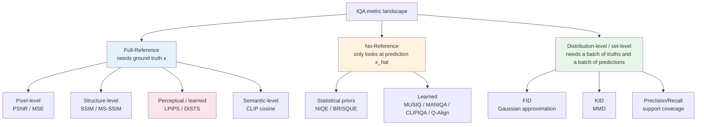
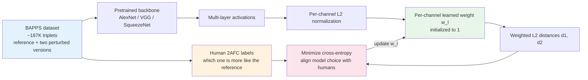
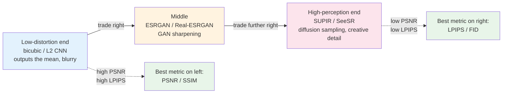

# Chapter 4 · Pitfalls of Evaluation

> Image enhancement has an open secret: **the metrics in papers and the human eye often disagree**.
>
> This is not because some people fake numbers—the metrics in this field have systematic bias by design.

## 4.0 Before You Read This Chapter

Chapter 3 closed out the discussion of loss functions. A loss defines "which direction to push during training"; this chapter is about "after training is done, what to use to measure how well it pushed." The two look symmetric but are quite different in engineering: a loss can't be used if it isn't differentiable, while a metric only needs to be computable; a loss cares about gradient behavior, a metric cares about whether the numbers align with human preference.

The core question this chapter answers is why, in image enhancement specifically, **metrics and visual impression frequently disagree**, and what metrics you should and should not report when faced with a new model. It is not an encyclopedia of metrics but an autopsy of "what each metric measures and what it misses."

After reading this chapter, you should be able to answer:

- Why bicubic upsampling can win on PSNR/SSIM against ESRGAN but look the blurriest visually
- What scenarios each of the FR (full-reference) and NR (no-reference) metric paradigms is suited to
- How LPIPS is "more accurate" than VGG perceptual loss—specifically, how that accuracy was trained in
- How many samples FID needs at minimum to be stable, and why you shouldn't report it below that count
- Which metrics, when you see them in an enhancement paper's experiment table, should make you alert to selective reporting

Background assumed: the ill-posed discussion of Chapter 1, the "feature space is the right place to compute losses" conclusion of Chapter 2, and the engineering experience of "adversarial losses produce high-frequency detail" from Chapter 3. If any of these three are unread, you may want to revisit them, otherwise the "perception-distortion trade-off" later in this chapter will feel abrupt.

**Abbreviations first appearing in this chapter.** Those already introduced in earlier chapters are not repeated here. The new terms:

- **FR-IQA** (Full-Reference IQA): compares ground truth and prediction in a paired fashion, outputting a similarity or distance
- **NR-IQA** (No-Reference IQA): scores the prediction alone, also called blind IQA
- **RR-IQA** (Reduced-Reference IQA): uses only a small set of ground-truth statistics as reference; not expanded on in this book
- **MSE** (Mean Squared Error): the underlying quantity behind PSNR
- **MS-SSIM** (Multi-Scale SSIM): SSIM computed at multiple resolutions and weighted together
- **AlexNet**: the 2012 ImageNet champion model, one of the most common backbones for LPIPS
- **BAPPS** (Berkeley-Adobe Perceptual Patch Similarity dataset): the dataset of human perceptual judgments accompanying the LPIPS paper, used to calibrate LPIPS's linear weights
- **2AFC** (Two-Alternative Forced Choice): a common human-annotation paradigm—given two images, ask "which is more like the reference"
- **JND** (Just Noticeable Difference): the smallest difference humans can perceive
- **MOS** (Mean Opinion Score): the average of 1-5 quality ratings given by human annotators
- **FID** (Fréchet Inception Distance): distance between two image distributions approximated as Gaussians in Inception V3 feature space
- **KID** (Kernel Inception Distance): a distribution distance based on Maximum Mean Discrepancy (MMD); more stable than FID at small sample sizes
- **NIQE** (Natural Image Quality Evaluator): a no-reference metric based on natural-image statistics
- **BRISQUE** (Blind/Referenceless Image Spatial Quality Evaluator): a no-reference metric based on spatial-domain statistics + a classifier
- **MUSIQ** (Multi-Scale Image Quality Transformer): a no-reference scoring network based on a multi-scale Vision Transformer
- **MANIQA** (Multi-dimension Attention Network for IQA): an attention-based no-reference metric
- **CLIPIQA** (CLIP-based IQA): uses CLIP to align an image with "good quality / bad quality" text and outputs a no-reference score
- **PIPAL / KonIQ-10k / LIVE / TID2013**: common public datasets of human subjective scores in the IQA field, used for calibrating and benchmarking IQA algorithms

This chapter will repeatedly refer to "full-reference" and "no-reference" as two categories. To make later sections easier to place, here is one diagram laying out the entire IQA metric landscape:



The diagram splits metrics by "how many inputs they need": FR needs a pair (ground truth and prediction), NR needs a single image (the prediction itself), and distribution-level needs two sets (a batch of truths and a batch of predictions). Sections 4.2 through 4.7 expand each branch in turn, and Section 4.8 returns to the fundamental tension between the three paradigms.

## 4.1 A Contradictory Phenomenon

Run 4× super-resolution on the same low-resolution cat-face image with three models:

- **A**: direct bicubic upsampling
- **B**: ESRGAN (classic GAN-based SR)
- **C**: SUPIR (diffusion-camp SOTA)

The metrics may look like:

| Model | PSNR ↑ | SSIM ↑ | LPIPS ↓ | FID ↓ | Visual impression |
|------|--------|--------|---------|-------|---------|
| A. bicubic | **28.4** | **0.82** | 0.42 | 78 | Too blurry to look at |
| B. ESRGAN | 26.1 | 0.76 | 0.18 | 22 | Sharp but with some noise |
| C. SUPIR | 24.8 | 0.71 | **0.12** | **8** | Rich and creative details |

What's contradictory:

- **PSNR and SSIM rate bicubic the highest**, but bicubic is the blurriest visually
- **LPIPS and FID rate SUPIR the highest**, but SUPIR has the worst pixel consistency (with "creative" modifications)
- **No model wins across all metrics**

This chapter clarifies two things:

1. What each metric measures and what it misses
2. Why these inconsistencies are **theoretically inevitable**, not engineering shortcomings

The direct engineering consequence of this contradiction is that **model selection must be based on a "combination of metrics + the application scenario," not on any single number**. When each section below expands a specific metric, putting it back into this table for comparison is more useful than reading the formula on its own.

## 4.2 PSNR

The oldest full-reference metric, used extensively in video-coding evaluation since the 1980s. It is still in use today not because it is good but because it is cheap, has enormous historical inertia, and everyone reports it. Understanding its limits is the prerequisite for understanding every subsequent metric as "patching one specific weakness of PSNR."

$$
\text{PSNR}(\hat{x}, x) = 10 \log_{10} \left( \frac{\text{MAX}^2}{\text{MSE}(\hat{x}, x)} \right)
$$

where MSE is mean squared error and MAX is the maximum pixel value (255 for 8-bit). The unit is decibels (dB); higher is better.

```python
import torch

def psnr(pred: torch.Tensor, target: torch.Tensor,
         data_range: float = 1.0) -> torch.Tensor:
    """PSNR (Peak Signal-to-Noise Ratio).
    pred, target: (B, C, H, W), assumed [0, 1]
    Returns: (B,) PSNR (dB) per image
    """
    mse = ((pred - target) ** 2).flatten(1).mean(dim=1)
    return 10 * torch.log10((data_range ** 2) / (mse + 1e-12))
```

### What PSNR measures

Directly measures pixel-level L2 error. Equivalent to log-likelihood under an "i.i.d. Gaussian noise" assumption.

### What PSNR misses

**Misses perception**—it doesn't know that:

- A one-pixel small color difference and a one-pixel big misalignment can differ enormously to the eye, but PSNR may give the same score
- An image globally shifted by 1 pixel is barely noticeable to humans, but PSNR drops sharply
- Slight Gaussian blur over the whole image makes it visibly blurry, but PSNR may go up (because blur reduces high-frequency differences)

This third point is especially counter-intuitive, but it is the most classic case of PSNR's visual failure. Concretely: suppose the ground truth has some high-frequency detail (edges, textures); enhancement model A accurately recovers that detail but adds a little noise, while model B simply blurs the whole image and erases detail and noise together. Under PSNR, B usually wins because B has no high-frequency disagreement; visually, A usually wins because at least it has structure. This systematic bias is the root reason this book repeatedly emphasizes that "high PSNR doesn't necessarily look good."

Engineering implications:

- High-PSNR images **are not necessarily good-looking**, low-PSNR images **are not necessarily bad-looking**
- PSNR has relative meaning when comparing **algorithms** (same degradation, same ground truth), but limited meaning when comparing across datasets

### Why PSNR is still de facto standard

It has a few engineering advantages too strong to suppress:

- **Simple**: one line of MSE computes it
- **Additive**: can be tracked by channel, by region
- **Historical inertia**: every paper since the 1990s reports it; can't be removed
- **Intuitive numerical range**: 30 dB is a concrete, cross-task-comparable "engineering feel"; newcomers quickly build an intuition that "28 dB is blurry, 32 dB is clear, 36 dB is extremely clear"
- **Decomposability**: can be split into luminance and chrominance channels separately (PSNR-Y / PSNR-RGB / PSNR-YCbCr), helping locate which channel a specific problem lives in

In practice PSNR is still a must-report metric, but **using it alone for model selection** is a beginner's mistake. Watch for a common trap: different codebases may compute PSNR on the Y channel (PSNR-Y) or on RGB (PSNR-RGB), with a 0.5-1.5 dB difference between the two. When comparing PSNR numbers across two papers, always confirm they use the same convention. The academic-SR standard is to crop a few border pixels and compute PSNR-Y, which is another hidden "must align with others when comparing" detail.

One final point: PSNR fails entirely in two extreme situations—one is when the ground truth and the prediction have a **geometric alignment offset** (even just 0.5 pixels of displacement), and PSNR will plummet; the other is when the prediction is a **generative output** (not aiming for pixel-level consistency but for statistical resemblance), in which case PSNR is meaningless. The former is especially common in video tasks where sub-pixel alignment between adjacent frames is hard; the latter is especially common in diffusion-camp enhancement models. In these situations you should switch to SSIM, LPIPS, FID, or similar metrics that are more tolerant of geometry or distribution.

Compressing this section into one engineering motto: **PSNR measures "how close the pixel values are," not "how similar they look."** This motto explains all its advantages (simple, additive, long history) and all its weaknesses (not aligned with perception, sensitive to geometry, fails on generative outputs). Understanding this motto is the foundation for understanding why every subsequent metric is trying to "patch PSNR."

## 4.3 SSIM Family

### SSIM

SSIM (Structural Similarity, 2004) tries to fix PSNR's "ignores structure" problem. It splits local similarity into three parts:

$$
\text{SSIM}(x, y) = l(x, y)^\alpha \cdot c(x, y)^\beta \cdot s(x, y)^\gamma
$$

- **luminance** $l$: similarity of means
- **contrast** $c$: similarity of variances
- **structure** $s$: normalized correlation

Computation uses a sliding window (11×11 Gaussian-weighted), and the final value is the global average.

```python
import torch
import torch.nn.functional as F

def gaussian_window(window_size: int, sigma: float) -> torch.Tensor:
    coords = torch.arange(window_size).float() - window_size // 2
    g = torch.exp(-(coords ** 2) / (2 * sigma ** 2))
    g = g / g.sum()
    window = g.unsqueeze(0) * g.unsqueeze(1)
    return window  # (W, W)


def ssim(pred: torch.Tensor, target: torch.Tensor,
         window_size: int = 11, sigma: float = 1.5,
         data_range: float = 1.0) -> torch.Tensor:
    """SSIM, simplified version. For production use torchmetrics or pyiqa.
    pred, target: (B, C, H, W) in [0, data_range]
    """
    C1 = (0.01 * data_range) ** 2
    C2 = (0.03 * data_range) ** 2
    C = pred.shape[1]

    win = gaussian_window(window_size, sigma).to(pred)
    win = win.expand(C, 1, window_size, window_size)

    mu_x = F.conv2d(pred,   win, padding=window_size // 2, groups=C)
    mu_y = F.conv2d(target, win, padding=window_size // 2, groups=C)
    mu_x2, mu_y2, mu_xy = mu_x ** 2, mu_y ** 2, mu_x * mu_y

    sigma_x2 = F.conv2d(pred * pred,     win, padding=window_size // 2, groups=C) - mu_x2
    sigma_y2 = F.conv2d(target * target, win, padding=window_size // 2, groups=C) - mu_y2
    sigma_xy = F.conv2d(pred * target,   win, padding=window_size // 2, groups=C) - mu_xy

    num = (2 * mu_xy + C1) * (2 * sigma_xy + C2)
    den = (mu_x2 + mu_y2 + C1) * (sigma_x2 + sigma_y2 + C2)
    return (num / den).flatten(1).mean(dim=1)
```

### MS-SSIM

Multi-scale SSIM—repeatedly downsample the image and compute SSIM at each scale, weighted-average. Advantage: captures structural similarity at different scales. In the H.265 video-coding reference implementation, MS-SSIM is reported almost alongside PSNR because its prediction of human perceptual quality is somewhat stronger than SSIM's. For enhancement tasks it is also a no-loss "additional metric"—cheap to compute and able to cover SSIM's single-scale blind spots.

### What SSIM misses

- **Lenient toward blur**: means unchanged, variances barely change, SSIM may only drop 0.05
- **Sensitive to geometric deformation**: an object shifted by 5 pixels causes SSIM to drop a lot, while humans can hardly tell
- **Insensitive to texture**: two different textures with similar statistics get a high SSIM score

Engineering implications:

- SSIM is slightly better than PSNR, but **still not aligned with human perception of texture and detail**
- In "texture replaced but structure preserved" scenarios, SSIM overestimates similarity

Another engineering pitfall for SSIM is the data range and window parameters. Given the same image and the same formula, whether `data_range` is 1.0 or 255, whether `window_size` is 7 or 11, and whether `sigma` is 1.5 or 0.5 can change the result by several percentage points. Different codebases ship different defaults, so when comparing SSIM between two papers, always check that they use the same implementation. A robust practice is to use a unified library like `pyiqa` or `torchmetrics`, ensuring at least that the baseline and the new method are evaluated under identical code.

## 4.4 LPIPS

LPIPS (Learned Perceptual Image Patch Similarity, 2018) is a paradigm shift in this field. It abandons hand-crafted formulas and uses:

1. AlexNet/VGG/SqueezeNet to extract multi-layer features
2. Spatial alignment + channel normalization on each layer
3. A **learned linear weight** combining the L2 distances over layers and channels
4. The linear weights are fit on a large dataset (BAPPS) of human perceptual judgments

Step 4 is the most critical difference between LPIPS and the VGG perceptual loss of Chapter 3, and it is worth unpacking. The VGG perceptual loss assigns the weight of every layer and every channel **by hand** (usually 1); LPIPS assigns those weights from **fitting on human perception data**. In other words, the VGG loss assumes "every ImageNet feature channel is equally important for perception," and LPIPS replaces that assumption with "the true weights, fit on a human-labelled dataset like BAPPS." The latter is more accurate, at the cost of a one-time calibration process.

Expanding the calibration process, so you can see what LPIPS's "learned" actually learned, and from where:



The training objective of the calibration is: given a triplet (reference $x$, perturbed versions $\hat{x}_1$ and $\hat{x}_2$), humans labelled "which is more like $x$"; LPIPS computes two distances $d_1, d_2$ with the current weights, feeds them into a small decision head outputting "probability of choosing 1 vs 2," and the objective is to align this probability with the human label. Only the per-channel weights $w_l$ at the end are updated; the backbone itself is frozen. This is why LPIPS is not expensive to run but performs markedly better than an uncalibrated VGG distance.

The distribution of perturbation types in BAPPS is carefully chosen, covering traditional distortions (JPEG, blur, noise), CNN-derived outputs (super-resolution and denoising-model artifacts), geometric deformations, and color perturbations. This coverage determines which tasks LPIPS aligns with human perception on and which it fails on. For example, BAPPS contains almost no "large-scale generative invention" perturbation, and LPIPS tends to be lenient when scoring "plausible-but-fabricated" details from diffusion models.

Mathematically:

$$
\text{LPIPS}(x, y) = \sum_l \frac{1}{H_l W_l} \sum_{h, w} ||w_l \odot (\hat{F}_l(x)_{h,w} - \hat{F}_l(y)_{h,w})||_2^2
$$

Direct usage:

```python
import lpips  # pip install lpips

# Use AlexNet backbone; usually use 'vgg' as the loss-function backbone
loss_fn_alex = lpips.LPIPS(net='alex')   # net='alex' is closer to human perception, 'vgg' is more stable as a training loss

def lpips_distance(pred: torch.Tensor, target: torch.Tensor,
                   loss_fn: lpips.LPIPS) -> torch.Tensor:
    """Compute LPIPS distance.
    Input: RGB in [0, 1], shape (B, 3, H, W). The function internally rescales to [-1, 1].
    Returns: (B,) LPIPS distance per image (smaller = more similar)
    """
    return loss_fn(pred * 2 - 1, target * 2 - 1).flatten()
```

### What LPIPS measures

A learned "how visually dissimilar two images are." Trained on large amounts of human "which one is more similar to the reference" annotations.

### Where LPIPS beats PSNR/SSIM

- Sensitive to **blur** (PSNR/SSIM's biggest blind spot)
- Sensitive to **texture replacement** (same object with different textures, LPIPS distinguishes)
- Robust to **global shifts** (small shifts don't crash LPIPS)

### What LPIPS also misses

- **Can be fooled by adversarial samples**—AlexNet itself has adversarial fragility, models can learn "artifacts that game LPIPS"—low LPIPS but bad visuals
- **Insensitive to color drift**—VGG/AlexNet both apply ImageNet normalization, dulling overall color changes
- **Not great at extreme artifacts**—blocking artifacts, colored ringing may have small LPIPS but look terrible
- **Different backbones give different results**—LPIPS-alex and LPIPS-vgg are not directly comparable

Engineering experience: LPIPS is currently the most useful full-reference perceptual metric, **but not the only metric**.

LPIPS can be used as both a metric and a loss, with different conventions. As a metric, the usual backbone is `alex` (better aligned with the human eye); as a loss, the usual backbone is `vgg` (more stable gradients). Using LPIPS directly as the main loss has two issues: first, it itself contains a learned head, so the backward gradient path is long and easily pushes the model toward adversarial samples in one of LPIPS's internal channels; second, LPIPS was trained for **discrimination** (which one is more like the reference), not for **generation** (output one image that resembles the reference), and using it as a generative loss tends to lose high-frequency content. So modern engineering almost always uses VGG perceptual loss as the training loss and LPIPS as the evaluation metric, with the two playing distinct roles.

## 4.5 DISTS

DISTS (2020) improves on LPIPS by splitting perceptual distance into two parts:

- **Structure distance**: captures spatial arrangement
- **Texture distance**: captures statistical properties, insensitive to position

DISTS's core innovation: **insensitivity to texture position**. This is very close to how humans perceive—when you look at a lawn, you don't count each blade and ask "is this blade in the same position as in the reference?", you only ask whether the overall appearance of the lawn matches. Because LPIPS is a per-pixel feature L2, it carries an implicit requirement of "positions must align precisely"; DISTS explicitly drops the position constraint in the texture part, making it better suited to texture-generation tasks.

Example: grass on a lawn with leaves in different positions but consistent overall texture—DISTS gives a high score; LPIPS/SSIM give a low score. In many enhancement scenarios (restoring textures, generating grass/hair/water), DISTS aligns with human eyes better than LPIPS.

```python
# Recommended: pyiqa library (unifies all IQA metrics)
import pyiqa  # pip install pyiqa

dists_metric = pyiqa.create_metric('dists', as_loss=False)

def dists_distance(pred: torch.Tensor, target: torch.Tensor) -> torch.Tensor:
    """DISTS distance, [0, 1] input."""
    return dists_metric(pred, target)
```

When to use DISTS:

- Tasks involving **texture generation or restoration** (hair, grass, skin, fabric)
- LPIPS already tuned to the limit but improvements stalled
- When the model produces textures that are "statistically right but positionally wrong" and LPIPS misjudges

The trade-off between DISTS and LPIPS can be understood this way: LPIPS uses per-position feature L2 distances, so misaligned texture positions are penalized; DISTS swaps the texture part for channel-wise statistics (mean, variance, covariance), which are position-independent. These correspond to two different "similarity" assumptions—LPIPS assumes "two images should be perceptually similar pixel-by-pixel," while DISTS assumes "the overall appearance distributions of two images should match." For generative enhancement DISTS's assumption is more reasonable, but for traditional super-resolution LPIPS is still the mainstream.

## 4.6 FID / KID

LPIPS and DISTS are both **full-reference**—needing the ground truth $x$ paired with $\hat{x}$ for comparison. But generative models have a different need:

> I don't care whether a single $\hat{x}$ is close to $x$; I care whether the **overall distribution** of $\hat{x}$ resembles the distribution of natural images.

This is the design objective of FID (Fréchet Inception Distance) and KID.

### FID

Pass all real images and all generated images through InceptionV3, getting two sets of 2048-dimensional features. Assume each set follows a Gaussian, and compute the Fréchet distance between the two Gaussians:

$$
\text{FID}(R, G) = ||\mu_R - \mu_G||^2 + \text{tr}(\Sigma_R + \Sigma_G - 2(\Sigma_R \Sigma_G)^{1/2})
$$

```python
import pyiqa
fid_metric = pyiqa.create_metric('fid')
# fid needs batches; usage differs from PSNR/LPIPS, typically pass two folder paths
# fid = fid_metric(real_image_folder, generated_image_folder)
```

### What FID measures

**The distributional difference of two image sets in Inception feature space.**

Suitable for:

- Generative enhancement models (diffusion SR, generative denoising)
- Tasks where the output space is multi-modal (the same degraded input has multiple plausible outputs)

Not suitable for:

- Discriminative SR/denoising—given $y$, output a unique $\hat{x}$, "distributional difference" is less meaningful
- Single image—FID needs at least thousands of images; FID on a single image is noise

### Common misuse of FID

> "Our model has FID = 12 on 100 test images, theirs has FID = 18, so we're better"

This has two problems:

1. **Sample size too small**: FID has very high variance on small samples; 100 images can yield ±10 standard deviation, and a difference of 6 is meaningless
2. **Bias**: FID has systematic bias with sample size; one must use the same number of samples for comparison

Engineering experience:

- FID requires at least **10K samples** to be stable
- In real engineering FID is mostly looked at for **absolute magnitude and trend** (FID 50+ vs 10+ is qualitatively different); don't sweat decimal points
- KID (based on Maximum Mean Discrepancy) is more stable than FID at small sample sizes; better metric for small data

Why does FID use Inception V3 instead of a newer feature network? Historical lock-in—the FID paper was published in 2017, when Inception V3 was the image-classification SOTA, and the entire generative-model evaluation ecosystem was built on its feature space. Even after stronger feature networks emerged (CLIP, DINOv2), FID did not switch backbone, because switching breaks comparability with hundreds of historical papers. This kind of "benchmark lock-in" is common in IQA: once a metric is adopted by hundreds of papers, even a better alternative is hard to push through. Recent years have seen a wave of "modern FID" variants based on CLIP features (CMMD, CLIP-FID), better aligned with the human eye on many tasks, but they have not replaced classic FID's reporting position. The production-environment way to handle this is "report both"—classic FID for comparison with historical papers, modern FID for internal decision-making.

Understanding FID also requires switching paradigms. Earlier, PSNR/SSIM/LPIPS/DISTS were all "point-to-point comparisons," asking "how similar is $\hat{x}_i$ to $x_i$"; FID is "set-to-set comparison," asking "how similar are $\{\hat{x}_i\}$ and $\{x_i\}$ as two distributions." The two paradigms suit different tasks:

- Paired tasks (denoising, deblurring, single-image SR) have explicit ground-truth pairing; point-to-point is natural
- Generative tasks (diffusion sampling, texture generation) have a distribution as "ground truth," not a single point; set-to-set is more reasonable
- The diffusion camp of image enhancement sits between the two, so both kinds of metrics are reported

The diagram below visualizes this "set-to-set" paradigm. FID's core assumption is to approximate both sets of features as unimodal Gaussians and compute the distance between the two Gaussians; KID swaps that Gaussian approximation for an MMD non-parametric kernel method. The two share the same design idea, differing only in how strong the distributional assumption is.

## 4.7 No-Reference Metrics (NR-IQA)

In real-world scenarios we often **don't have a ground truth**—you only have a bad photo from your phone, no "ideal original" for reference.

In this case use no-reference metrics. Representatives:

- **NIQE** (2013): based on natural-image statistics distance
- **BRISQUE** (2012): a classifier score based on spatial features
- **MUSIQ** (2021): Vision Transformer-learned image quality score
- **MANIQA** (2022): attention + multi-scale, a strong NR-IQA baseline
- **CLIPIQA** (2023): uses CLIP to evaluate "aesthetics / realism"

Knowing where the training data for each of these metrics comes from is key to understanding their capability boundaries. NIQE and BRISQUE—the early methods—do not need "quality score" labels; they assume "natural images follow a fixed distribution on certain statistics" and use the distance from this prior distribution as the quality score. The learned methods (MUSIQ, MANIQA, CLIPIQA, etc.) need image datasets with human quality ratings, commonly KonIQ-10k (10K real-world images, mean of multiple human scores per image), SPAQ (11K phone images), and PaQ-2-PiQ (40K images plus local patch scores). Each dataset captures a different "quality distribution," and the preferences of the resulting models differ: a model trained on KonIQ-10k prefers "looks like professional photography," a model trained on SPAQ prefers "looks like a clean phone photo." When deploying NR-IQA in production, you must know which distribution your chosen metric was trained on—otherwise misjudgments are guaranteed.

> What counts as "NR-IQA SOTA" depends heavily on benchmark (PIPAL, LIVE, KonIQ-10k, etc.), and 2024–2026 has seen many new MLLM/CLIP-based methods. In production environments **report multiple NR metrics together**; don't fixate on one.

```python
import pyiqa

niqe   = pyiqa.create_metric('niqe',    device='cuda')
musiq  = pyiqa.create_metric('musiq',   device='cuda')
maniqa = pyiqa.create_metric('maniqa',  device='cuda')

# NIQE: smaller is better; MUSIQ/MANIQA: larger is better
def assess_no_reference(image: torch.Tensor):
    """Give a no-reference quality assessment of a single image."""
    return {
        'niqe':   niqe(image).item(),
        'musiq':  musiq(image).item(),
        'maniqa': maniqa(image).item(),
    }
```

### Core problem of no-reference metrics

They can only tell you "does this image look high quality"—they **cannot tell you whether it is $x$**.

- **Necessary in real degradation scenarios**—the only choice when there's no ground truth
- **Easy to fool**—models can learn to "look high quality to NIQE/MUSIQ" while actually producing weird artifacts
- **Different metrics correlate poorly**—a model with great NIQE but bad MUSIQ is common

Engineering experience:

- For real-scene evaluation, **report multiple NR metrics together** (NIQE + MUSIQ + MANIQA + CLIPIQA); abnormality on any one may indicate failure modes
- No-reference metrics are always used together with **subjective evaluation**; they cannot decide model quality alone

## 4.8 Fidelity vs Perception—a Theoretical Inevitability

Back to the contradictory table at the start. This is not an engineering coincidence; it is **information-theoretically necessary**.

Blau & Michaeli's 2018 paper "The Perception-Distortion Tradeoff" rigorously proved:

> On ill-posed inverse problems, **distortion** (PSNR / SSIM-style fidelity metrics) and **perception** (FID / LPIPS-style perceptual metrics) **cannot be simultaneously optimal**.
>
> Any optimization algorithm picks a point on this trade-off curve.

Intuitive understanding:

- **Distortion-optimal** means the output approximates the "statistical expectation" of the ground truth—the average of multiple plausible $x$, which is blurry
- **Perception-optimal** means the output lies on the natural image distribution—must be a specific $x$, not the mean

These two goals are fundamentally in conflict.

To make this conflict concrete, here is where several real models sit on the curve. At the low-distortion end sit bicubic and the early L2-regression SR models—they output the "safe mean," with beautiful PSNR but blurry visuals. In the middle sit GAN-based models like ESRGAN/Real-ESRGAN, sacrificing a few dB of PSNR for sharpness. At the far perception end sit diffusion-camp models like SUPIR/SeeSR, which sample directly from $p(x | y)$, producing vivid output but with the worst pixel-level consistency to ground truth.



**The existence of this curve** has several engineering implications:

1. **The PSNR camp and the perceptual camp "fighting" is the norm**; no model will win every metric
2. **When reading benchmarks, look at the position on the curve, not a single point**—HAT lives at high PSNR / low perception, SUPIR at low PSNR / high perception; these two are not competing for the same objective
3. **The application scenario decides the optimal point on the curve**—forensic evidence sits at the distortion end, photo beautification at the perception end

Chapter 8 will return to this trade-off and discuss why diffusion models actively choose to sacrifice PSNR for perception.

## 4.9 Bias of Benchmark Datasets

Almost every academic paper reports metrics on these few datasets. But **all of them have systematic biases**.

This section is the one most easily skipped by readers, yet the most important in engineering terms. The gap between academic-benchmark numbers and post-deployment user experience is almost entirely sourced from the biases discussed here. Building a sense of vigilance about each of them is the key to judging "is this paper worth following."

### Classic benchmarks

| Dataset | Image count | Type | Bias |
|-------|---------|------|------|
| Set5 | 5 | Mixed | Too few, very high variance |
| Set14 | 14 | Mixed | Same |
| BSD100 | 100 | Natural | Slightly small but the average is still credible |
| Urban100 | 100 | Urban architecture | Biased toward regular structures |
| Manga109 | 109 | Manga | All black-and-white line art |
| DIV2K val | 100 | High-quality natural | Standard but biased toward "pretty" |
| LSDIR val | 250 | Diverse | Newer and fairer |

### Common problem of all these datasets

> **Their "low-resolution versions" are almost all bicubic-downsampled.**

Meaning:

- Training $y$ uses bicubic
- Test $y$ uses bicubic
- **Test and training are under the same degradation assumption**

This is the evaluation-side counterpart of the "train-test mismatch" from Chapter 1. Conclusion:

> "30 dB on Set14 4×" **cannot** tell you "whether it works well on your phone's low-light photos."

A more subtle bias is that the **content distribution** of benchmark datasets is itself biased. Set5, Set14, and BSD100 are almost all high-quality photographs with saturated colors, careful composition, and extremely low noise; Urban100 is entirely regular structures in urban architecture, naturally friendly to edge-recovery algorithms; Manga109 is entirely black-and-white manga, with no real texture and no color. SOTA on these datasets often fails to generalize to "a user's snapshot of food close-up." So when reading papers, do not only ask "what dataset did they run on," but also "how far is that dataset from the input distribution I have to serve."

### Real degradation datasets

To test real scenes, since 2019 "real degradation pair" datasets have appeared:

- **RealSR** (2019): same camera at different focal lengths shooting the same scene, yielding LR-HR pairs
- **DRealSR** (2020): DSLR cameras, more precise alignment
- **DPED** (2017): low-end phone vs DSLR pairs
- **NTIRE Real-World SR challenge**: yearly competition data

These datasets are small (a few hundred to a few thousand images), but **closer to real at test time**.

But real-degradation datasets also have their own biases. RealSR uses different focal lengths of the same camera; its "low-resolution" is in fact "a wider-FOV shot taken with a wide-angle lens," still cleanly captured, far from the real scenario of "phone night shot followed by two rounds of WeChat recompression." DPED's low-end phones are from 2015, not the 2024-2026 phones. So even a "real-degradation dataset" is only "more real than bicubic," not "representative of all real scenarios." The final evaluation in production should be **the business's own regression test set**—sample a number of typical cases from the actual user input distribution and build long-term monitoring on them.

Engineering practice:

- **Report both academic benchmarks and real degradation datasets**
- High PSNR on academic benchmarks is meaningless (unless two models are compared under the same degradation)
- Metrics on real degradation datasets are more telling

## 4.10 Which Metrics to Watch During Training

At each epoch / every N steps of validation, which metrics should you compute?

**Minimum set (mandatory)**:

- PSNR: monitor fidelity
- LPIPS: monitor perceptual quality

**Recommended set**:

- PSNR + SSIM + LPIPS + DISTS (full-reference suite)
- Model loss curves (record each loss term separately)

**Generative models additionally**:

- FID (run on a sufficiently large test set every N epochs)
- A fixed input set's visual comparison (intuitively see model changes)
- Sample several times with different seeds and observe generation diversity (for diffusion-camp models)
- Run metrics on a fixed set of failure cases separately and look at which cases consistently drag down the average

```python
class ValidationMetrics:
    """Validation-time metrics logger during training."""
    def __init__(self, device='cuda'):
        import pyiqa
        self.psnr  = pyiqa.create_metric('psnr',  device=device, as_loss=False)
        self.ssim  = pyiqa.create_metric('ssim',  device=device, as_loss=False)
        self.lpips = pyiqa.create_metric('lpips', device=device, as_loss=False)
        self.dists = pyiqa.create_metric('dists', device=device, as_loss=False)

    @torch.no_grad()
    def __call__(self, pred: torch.Tensor, target: torch.Tensor) -> dict:
        return {
            'psnr':  self.psnr (pred, target).mean().item(),
            'ssim':  self.ssim (pred, target).mean().item(),
            'lpips': self.lpips(pred, target).mean().item(),
            'dists': self.dists(pred, target).mean().item(),
        }
```

## 4.10b Subjective Evaluation — MOS and 2AFC

Up to this point everything has been "computed numbers." But **the real gold standard is always the human eye**. When you need to argue in a paper that "our method is better," or in a production environment decide whether to update an online model, subjective evaluation is the most persuasive evidence.

Two mainstream paradigms:

- **MOS (Mean Opinion Score)**: each annotator independently rates each image on a 1-5 (or 1-10) scale; the mean is reported. Pros: intuitive, can rate multiple models simultaneously. Cons: different people's "5" means different things, the variance is large, and you have to standardize (z-score) before comparing.
- **2AFC (Two-Alternative Forced Choice)**: an annotator is shown two images (the outputs of model A and model B) and forced to choose "which is more like the reference" or "which has better quality." Pros: fine-grained, label-stable. Cons: only pairwise, so $N$ models require $\binom{N}{2}$ comparison groups.

The training data of LPIPS, BAPPS, was collected in the 2AFC paradigm. In typical engineering, if you only need to decide "does my new model beat the old one," 2AFC is the more economical choice; if you need an absolute "how good is the current online model on a scale," you need MOS.

Chapter 12 will expand on subjective evaluation protocols, statistical significance tests (McNemar's test, Wilcoxon signed-rank), and the pitfalls of crowdsourcing platforms. For now, remember: **a metric improvement without subjective evaluation backing is not trustworthy**, especially for ESRGAN/diffusion-camp models where details are generated—PSNR and LPIPS can both diverge from the human eye.

A few engineering tips for validation frequency:

- Early in training (the first few epochs), validate more frequently to catch divergence
- Later, run a full validation every 5K or 10K steps
- Heavy metrics like FID should not be run at every validation; run them periodically on their own (e.g. once per epoch or per 20K steps)
- Always keep a **fixed set of visualization samples** (5-10 images); run the same input through every validation and log to TensorBoard or wandb. Metrics show long-term trends; visualizations show concrete behavior—both are needed.
- Stacking the visualization samples saved at different timestamps over time often reveals degradations that metrics miss (color slowly drifting, texture slowly becoming "plastic," etc.)

## 4.11 What to Report in Papers / Reports

The main table must have:

- PSNR / SSIM / LPIPS (basic full-reference)
- Results on at least one real degradation dataset

Add as appropriate:

- DISTS (if it's a texture-generation task)
- FID (if it's a generative model)
- NIQE / MUSIQ / MANIQA (real scenes)
- Subjective evaluation (MOS / 2AFC, covered in Chapter 12)

**Don't do**:

- Report only PSNR
- Report metrics only on Set5/Set14
- Report FID with sample size below 1000
- Hide failure cases

## 4.12 A Concrete Case: bicubic vs ESRGAN vs SUPIR

Back to the table at the start, now unpacking why each metric is what it is:

| Model | PSNR | SSIM | LPIPS | FID | Interpretation |
|------|------|------|-------|-----|------|
| bicubic | **28.4** | **0.82** | 0.42 | 78 | Output is the "blurred mean" of the truth, naturally high PSNR/SSIM; but no high frequency, bad LPIPS/FID |
| ESRGAN | 26.1 | 0.76 | 0.18 | 22 | GAN generates high-frequency details, "details that are right but maybe not the real ones," PSNR drops but perception greatly improves |
| SUPIR | 24.8 | 0.71 | **0.12** | **8** | Diffusion prior generates more realistic details, but with creativity; pixel-level consistency is the worst |

**No model is "the best"**—the choice depends on scenario:

- Forensic evidence enhancement → bicubic (no fabrication allowed)
- Photo enlargement for printing → ESRGAN (fidelity + clarity balanced)
- Old photo restoration → SUPIR (maximize visual realism)

> **"Which model is best" is the wrong question.**
> **The right question is "in the distortion-perception plane, which point best fits my application."**

Making this concrete with several common business scenarios:

- **Medical image enhancement**: misdiagnosis is enormously costly; no "plausible-but-unreal" detail is allowed. Distortion end takes priority (PSNR / SSIM / physical consistency with the original scan), generative models banned.
- **Surveillance video forensics**: similar; accountability is at stake. Conclusion: better blurry than fabricated.
- **Legal evidence enhancement**: same as above, but stricter—even GAN-based ESRGAN is unacceptable.
- **"AI Enhance" button in a phone photo album**: users accept "not identical to the original but pretty"; perception end takes priority. LPIPS, MUSIQ, and user A/B retention are more appropriate metrics.
- **Old photo restoration**: users actively accept "creative restoration"; perception end is the highest priority, but with clear expectation management.
- **Library archival digitization of ancient texts**: physical faithfulness matters, but a small amount of "cleaning" is allowed. Look at both distortion and perception, with distortion weighted higher.
- **Film/TV restoration and colorization**: acceptance is decided by the director's eye; subjective evaluation + key-character identity preservation (covered in Chapter 10).

Each scenario is different; no single metric combo covers them all. This is also why later deployment chapters (Chapters 15-17) repeatedly emphasize "think carefully about the business-acceptable boundary before going live."

## 4.12b Four Questions to Ask When You See a Metric Number

Distilling this chapter into an engineering checklist. Next time you see a new paper reporting "PSNR 32.5 dB / LPIPS 0.12," run through these four questions mentally before deciding to believe it.

1. **Is it FR or NR?** FR metrics require the test set to have ground truth; NR metrics do not. A report that only contains NR metrics yet claims to "surpass all baselines" is almost certainly cherry-picking metrics.
2. **What is the degradation distribution of the test set?** Numbers under bicubic degradation can only be compared against other numbers under bicubic; metrics on real-degradation datasets are closer to live performance, but check whether the dataset covers your application.
3. **Is the sample size large enough for this metric to be stable?** FID needs at least 10K images; KID is more stable at small samples; PSNR/SSIM/LPIPS usually suffice at a few hundred (still report confidence intervals). Below those, do not sweat decimals.
4. **Does this metric's design preference align with my task?** PSNR prefers "safe means," LPIPS prefers "close in feature space," FID prefers "close distributions," NR-IQA prefers "looks like the training set's 'good images.'" Whether a metric is friend or foe on your task depends on this alignment.

If you can answer these four, most remaining gaps are perception-distortion trade-off differences, with no absolute right or wrong.

To summarize this chapter in different words: **metrics have stances**. Behind every metric hides a definition of "good image," which may or may not align with your application. Learning to ask "what is this metric's stance, and does it match my application's stance?" is more important than memorizing the formula.

This chapter is this book's "evaluation methodology primer." Chapter 12 will expand the engineering details of subjective evaluation, and Chapters 15-17 will expand production-environment metric monitoring. Together those three chapters form a complete engineering system for "how to measure image enhancement quality."

## 4.13 Summary

1. **PSNR/SSIM measure fidelity, are insensitive to perception**—using them alone misleads, but they must be reported as baseline
2. **LPIPS/DISTS measure perception**, more aligned with human eyes than PSNR/SSIM, but can't be blindly trusted
3. **FID measures distributional distance**, suitable for generative models but needs a large enough sample size
4. **NR-IQA** (NIQE/MUSIQ/MANIQA) is mandatory in real scenes but easy to fool
5. **Perception-Distortion is a theoretical trade-off**—any model picks a point on this curve
6. **Academic benchmarks all use bicubic degradation**, mismatched with real scenes
7. **At training time at least PSNR + LPIPS**, papers report at least PSNR + SSIM + LPIPS + a real degradation dataset
8. **No single metric tells the whole story**—always report combinations and pair with subjective evaluation

This chapter together with Chapter 3 answers "what is good"—loss defines the training objective, metrics define the evaluation criteria. After understanding these two chapters, the architecture chapters that follow have a basis for "judging good and bad."

Finally, let me make the one-to-one relationship between Chapter 3 and this chapter explicit. A complete training-evaluation closed loop in engineering terms is roughly:

- **Training loss** = pixel L1/Charbonnier + VGG perceptual + adversarial (or diffusion simple loss)
- **Validation metrics during training** = PSNR + SSIM + LPIPS
- **Heavy metrics every N epochs** = FID + DISTS
- **Final pre-launch evaluation** = all of the above + NR-IQA + subjective evaluation (MOS / 2AFC)
- **Continuous post-launch monitoring** = NR-IQA + user feedback + a regression set on key scenarios

The five layers escalate from training to launch, each more expensive and closer to true business quality. The most common beginner mistake is taking "validation metrics during training" as "final pre-launch evaluation"—you only discover the model failed in production after it's live and PSNR/LPIPS-pretty users didn't actually like it. Drawing these five layers clearly in your head is a key step from research project to production project.

---

> Next chapter [Data and Degradation Synthesis](05-degradation-pipeline.md) → Real-ESRGAN's true core contribution is data synthesis. We'll see that the same network with different data pipelines can differ in performance by an order of magnitude.
